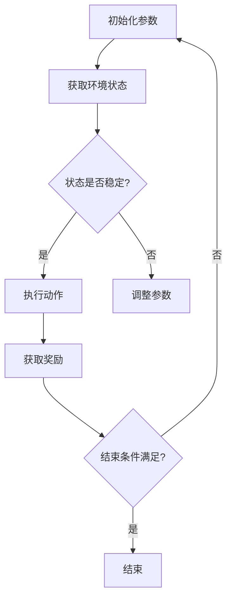
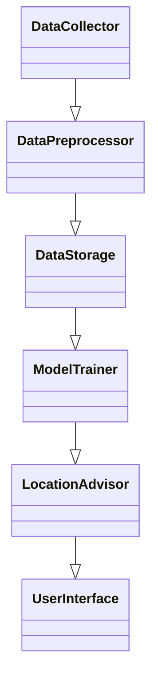
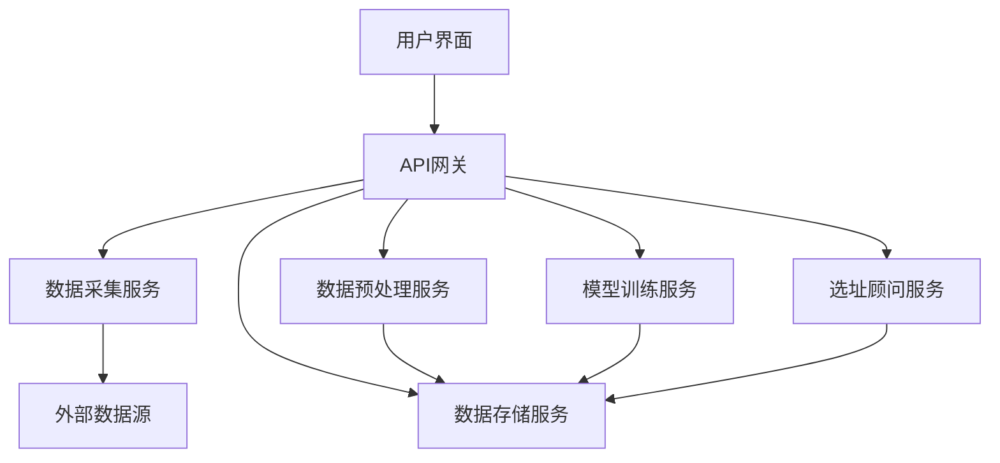

                 

### 引言

智能商业选址是现代商业决策中至关重要的一环，其不仅影响到企业的运营成本和销售额，还直接关系到品牌的市场竞争力。随着大数据和人工智能技术的迅速发展，传统的商业选址方式正面临着前所未有的变革。人工智能（AI）作为一种强大的计算工具，在商业选址中的应用前景广阔，特别是AI Agent——一种具有自我学习和决策能力的智能体，正逐渐成为解决复杂商业选址问题的利器。

AI Agent在智能商业选址中扮演的角色，可以用“赋能”二字来概括。通过深度学习、强化学习等技术，AI Agent可以自动处理和分析大量的市场数据，识别商业机会和风险，辅助企业做出科学、高效的选址决策。这样的技术进步，不仅提高了选址的准确性，还大大缩短了决策的时间，从而在激烈的市场竞争中为企业赢得先机。

本文将围绕AI Agent在智能商业选址中的应用进行深入探讨。我们将首先介绍问题的背景和AI Agent的相关概念，然后逐步剖析AI Agent在选址中的应用原理、关键技术、数据应用、算法原理与数学模型，以及系统分析与架构设计。最后，通过实战案例和最佳实践总结，展示AI Agent在智能商业选址中的实际效果和未来应用前景。

通过本文的阅读，读者将了解AI Agent在智能商业选址中的基本概念和实际应用，掌握相关技术和方法，从而为企业在商业选址过程中提供理论指导和实践参考。让我们开始这一探索之旅，一步步深入理解AI Agent在智能商业选址中的巨大潜力。

### 关键词

- 人工智能
- 智能商业选址
- AI Agent
- 强化学习
- 数据挖掘
- 算法设计
- 系统架构
- 实战案例

### 摘要

本文旨在探讨人工智能（AI）Agent在智能商业选址中的应用，通过逐步分析AI Agent的原理和关键技术，介绍其在数据处理、算法优化和系统架构设计中的重要作用。文章首先梳理了商业选址的挑战和机遇，然后详细阐述了AI Agent的定义、基本原理及其在智能选址中的优势。接下来，文章深入探讨了AI Agent在数据应用、算法原理和数学模型中的具体实现方法，并通过系统分析与架构设计展示了其在实际项目中的应用。最后，通过实际案例分析和最佳实践总结，本文揭示了AI Agent在智能商业选址中的巨大潜力和实际效果。

### 第一章：问题背景与概述

#### 1.1 问题的背景

商业选址是企业布局的重要环节，直接关系到企业的市场覆盖、运营成本和盈利能力。然而，现代商业环境瞬息万变，选址过程中面临着诸多挑战。首先，商业选址需要考虑多个因素，包括地理位置、交通便利性、人口密度、消费水平、竞争对手分布等。这些因素的复杂性和动态性使得传统的选址方法难以应对。其次，选址过程中数据来源多样且质量参差不齐，如何有效整合和分析这些数据成为一大难题。此外，市场竞争日益激烈，企业需要快速、准确地做出决策，以抢占市场先机。

在这些挑战下，AI Agent作为一种智能体，具备了自动处理和决策的能力，成为解决商业选址问题的重要工具。AI Agent通过深度学习、强化学习等技术，能够从大量数据中提取有价值的信息，进行预测和优化，从而辅助企业做出科学的选址决策。AI Agent的优势在于其能够处理复杂的问题，提高决策效率，降低成本，为企业带来显著的经济效益。

#### 1.2 核心概念

1. **AI Agent**：AI Agent（人工智能代理）是一种具有自主学习和决策能力的智能体，能够根据环境状态采取行动，并通过经验调整其行为策略。AI Agent的核心特征包括自主性、适应性、智能性和交互性。

2. **智能商业选址**：智能商业选址利用人工智能技术，通过数据分析和算法优化，实现商业地址的科学选择。它涉及对大量数据的处理和分析，以及基于这些数据的市场预测和风险评估。

3. **相关领域概念联系与区别**：

   - **智能商业选址**与**商业地理信息系统（GIS）**：GIS是一种基于地理信息的分析工具，而智能商业选址则是利用GIS进行更高级的数据分析和决策。GIS侧重于数据的可视化和管理，而智能商业选址更关注数据背后的商业价值。
   - **数据挖掘**与**机器学习**：数据挖掘是从大量数据中提取有价值信息的过程，而机器学习是使计算机系统从数据中学习和改进的方法。数据挖掘是智能商业选址的基础，而机器学习是实现AI Agent的核心技术。
   - **商业智能（BI）**与**智能商业选址**：BI是一种通过分析数据来支持决策的管理工具，而智能商业选址则是BI在商业选址中的应用。BI侧重于数据的分析和管理，而智能商业选址更关注选址决策的具体实施。

#### 1.3 AI Agent在选址中的应用前景

1. **潜在应用领域**：

   - **零售业**：零售企业可以利用AI Agent进行门店选址，优化布局，提高销售额。
   - **餐饮业**：餐饮企业可以通过AI Agent分析消费行为，预测市场需求，实现精准选址。
   - **房地产**：房地产开发商可以利用AI Agent进行地块分析，选择最佳的房地产开发项目。
   - **物流与配送**：物流企业可以通过AI Agent优化配送路径，提高运输效率。

2. **企业采用AI Agent选址的优势**：

   - **提高选址准确性**：AI Agent通过数据分析，可以更准确地预测市场趋势和消费者行为，提高选址的成功率。
   - **降低选址成本**：AI Agent能够自动化处理大量数据，减少人力成本，提高选址效率。
   - **提高决策速度**：AI Agent可以快速处理和分析数据，帮助企业迅速做出决策。
   - **提升市场竞争力**：通过智能选址，企业可以更好地适应市场变化，提高市场竞争力。

3. **挑战与机遇**：

   - **数据质量与安全性**：高质量的数据是AI Agent准确决策的基础，但数据质量和安全性是企业面临的挑战。
   - **技术复杂度**：AI Agent的实现和应用需要复杂的技术支持，企业需要具备相应技术能力。
   - **法律与伦理问题**：AI Agent在选址中的应用可能引发隐私保护和法律伦理问题，需要企业重视和解决。

#### 1.4 本章小结

本章从问题背景出发，介绍了商业选址的挑战和机遇，以及AI Agent在选址中的应用。通过梳理核心概念和相关领域概念的联系与区别，我们明确了AI Agent在选址中的重要性。接下来，本章还探讨了AI Agent在选址中的应用前景、优势以及面临的挑战。本章内容为后续章节的深入讨论奠定了基础。

### 第二章：AI Agent基础知识

#### 2.1 AI Agent的基本原理

AI Agent（人工智能代理）是人工智能领域的一个重要概念，它模拟了人类或动物的行为，通过感知环境、做出决策并执行行动，从而实现自主学习和智能行为。理解AI Agent的基本原理，有助于我们深入探讨其在智能商业选址中的应用。

**AI Agent的概念**：

AI Agent可以被视为一个智能系统，它具备以下几个核心特征：

1. **自主性**：AI Agent能够独立地执行任务，而不需要人类的直接干预。它可以根据环境的变化，自主地调整其行为策略。
2. **适应性**：AI Agent能够通过学习适应不同的环境和任务。它通过不断地与环境的交互，从错误中学习，逐步优化其行为。
3. **智能性**：AI Agent具备智能化的决策能力，可以通过感知环境状态，利用已有的知识库和算法，做出最优的决策。
4. **交互性**：AI Agent能够与环境进行交互，收集信息并反馈结果。这种交互性使得AI Agent能够更好地适应复杂多变的商业环境。

**强化学习与决策过程**：

强化学习是AI Agent的核心技术之一，它通过奖励机制来指导AI Agent的学习过程。在强化学习框架中，AI Agent会通过与环境互动，不断尝试不同的动作，并通过奖励信号来评估动作的效果。具体流程如下：

1. **状态（State）**：AI Agent在某一时刻所处的环境状态。
2. **动作（Action）**：AI Agent根据当前状态选择的一个行动。
3. **奖励（Reward）**：环境对AI Agent动作的反馈，用于评估该动作的好坏。
4. **策略（Policy）**：AI Agent根据状态和奖励信号，调整其选择动作的策略。

通过不断的试错和优化，AI Agent逐渐形成最优策略，从而在复杂环境中实现自主决策。

**监督学习与无监督学习**：

除了强化学习，AI Agent还可以利用监督学习和无监督学习来获取知识和技能。

- **监督学习**：在监督学习框架中，AI Agent通过已有的标注数据来学习。例如，通过大量的门店选址数据，AI Agent可以学习到哪些因素对于选址成功至关重要。
- **无监督学习**：无监督学习是AI Agent在没有标注数据的情况下，通过自身探索来学习。例如，AI Agent可以通过分析消费者行为数据，自动识别出市场趋势和消费模式。

**核心特征对比**：

| 特征            | 强化学习         | 监督学习         | 无监督学习         |
|-----------------|-----------------|-----------------|-----------------|
| 数据需求        | 标注数据         | 标注数据         | 无标注数据         |
| 学习过程        | 试错与反馈       | 标注数据驱动     | 数据探索           |
| 应用场景        | 需要反馈的动态环境 | 预测和分类问题   | 聚类和关联分析     |
| 优势            | 自适应性强       | 预测准确性高     | 数据挖掘潜力大     |
| 挑战            | 需要大量数据     | 需要大量标注数据 | 结果难以解释       |

通过理解AI Agent的基本原理，我们可以看到，它不仅具备自主性、适应性和智能性，还可以通过多种学习方式来获取知识和技能。这些特点使得AI Agent在智能商业选址中具有广泛的应用潜力。接下来，我们将进一步探讨AI Agent在商业选址中的核心技术和具体实现。

### 2.2 AI Agent的核心技术

AI Agent在智能商业选址中之所以具备强大的应用能力，关键在于其背后所依托的核心技术。这些技术包括神经网络、自然语言处理和模式识别，它们各自发挥着独特的作用，共同支撑AI Agent实现高效的选址决策。

#### 神经网络

神经网络（Neural Networks）是AI Agent中最常用的基础技术之一。它通过模拟人脑神经元的工作原理，将大量神经元连接成一个复杂的网络结构，从而实现对数据的处理和学习。在智能商业选址中，神经网络主要用于以下几个方向：

1. **数据预测**：神经网络可以通过对历史数据的学习，预测未来的市场趋势和消费者行为。例如，通过分析过去的销售数据、消费者偏好和竞争对手的动态，神经网络可以预测未来某个区域的市场需求，从而为选址提供科学依据。

2. **图像识别**：在商业选址过程中，图像识别技术可以帮助AI Agent识别和分析店铺周边的环境特征。例如，通过分析卫星图像和地图数据，神经网络可以判断某个地点的交通流量、人流量和周边商业设施，从而评估该地点的商业潜力。

3. **情感分析**：情感分析技术可以帮助AI Agent理解和分析消费者的情感和态度。在选址过程中，了解消费者的情感反应对于评估门店的人流量和销售额具有重要意义。神经网络通过处理社交媒体评论、新闻报道等文本数据，可以分析消费者对某个地点的满意度和期待，为选址决策提供参考。

#### 自然语言处理

自然语言处理（Natural Language Processing, NLP）是AI Agent处理和生成人类语言的能力，它在智能商业选址中发挥着关键作用。自然语言处理技术主要包括以下几个方面：

1. **文本分类**：文本分类技术可以帮助AI Agent对大量的文本数据（如消费者评论、新闻报道、政策文件等）进行分类和归纳。在选址过程中，通过文本分类，AI Agent可以快速识别出与选址相关的关键信息，如人口统计、经济发展状况和市场需求等。

2. **语义分析**：语义分析技术使AI Agent能够理解文本的深层含义和逻辑关系。在选址过程中，语义分析可以帮助AI Agent识别出文本中的隐含信息和潜在需求，如消费者对某个区域的偏好、政策变化对市场的影响等。

3. **对话系统**：对话系统技术使AI Agent能够与人类进行自然语言交互，从而提供个性化的选址建议。例如，AI Agent可以通过对话系统与企业家进行交流，了解其选址需求和偏好，然后根据这些信息生成定制化的选址方案。

#### 模式识别

模式识别（Pattern Recognition）是AI Agent识别和理解数据模式的能力，它在智能商业选址中发挥着重要作用。模式识别技术主要包括以下几个方面：

1. **聚类分析**：聚类分析技术可以帮助AI Agent识别出数据中的相似性和差异性。在选址过程中，聚类分析可以用于识别出潜在的商业热点区域，如人流量大、消费水平高的地区。

2. **分类分析**：分类分析技术可以帮助AI Agent将数据按照特定的标准进行分类。例如，在选址过程中，分类分析可以用于将不同区域按照商业潜力进行分类，从而为选址决策提供依据。

3. **特征提取**：特征提取技术可以帮助AI Agent从大量数据中提取出关键的特征信息。在选址过程中，特征提取可以用于分析店铺周边的环境特征，如人口密度、交通便利性、消费水平等，从而为选址决策提供支持。

通过神经网络、自然语言处理和模式识别这三大核心技术，AI Agent在智能商业选址中可以实现对大量数据的处理和分析，从而帮助企业做出科学、高效的选址决策。这些技术的综合运用，不仅提高了选址的准确性，还大大缩短了决策的时间，为企业在激烈的市场竞争中提供了有力支持。接下来，我们将进一步探讨AI Agent在选址中的性能评估，以全面了解其应用效果。

### 2.3 AI Agent的性能评估

评估AI Agent在智能商业选址中的性能是确保其有效应用的关键步骤。性能评估不仅可以帮助我们了解AI Agent的当前表现，还能指导进一步的优化和改进。以下将详细讨论性能评估的指标、方法以及实际应用案例分析。

#### 评估指标

性能评估需要建立一套科学的指标体系，这些指标应能够全面反映AI Agent在智能商业选址中的表现。以下是常用的几个性能评估指标：

1. **准确率（Accuracy）**：准确率是指AI Agent预测正确的选址结果与总选址次数之比。它是最常用的评估指标之一，直接反映了AI Agent的预测能力。

   $$\text{准确率} = \frac{\text{预测正确的选址次数}}{\text{总选址次数}}$$

2. **召回率（Recall）**：召回率是指AI Agent预测正确的选址结果与实际成功选址次数之比。召回率侧重于评估AI Agent发现潜在商业机会的能力。

   $$\text{召回率} = \frac{\text{预测正确的选址次数}}{\text{实际成功选址次数}}$$

3. **F1分数（F1 Score）**：F1分数是准确率和召回率的调和平均数，综合反映了AI Agent的预测性能。

   $$\text{F1 分数} = 2 \times \frac{\text{准确率} \times \text{召回率}}{\text{准确率} + \text{召回率}}$$

4. **平均绝对误差（Mean Absolute Error, MAE）**：平均绝对误差是指AI Agent预测的选址结果与实际结果之间的平均绝对差值。MAE越小，说明AI Agent的预测越准确。

   $$\text{MAE} = \frac{1}{n} \sum_{i=1}^{n} |y_i - \hat{y}_i|$$

   其中，\(y_i\) 为实际结果，\(\hat{y}_i\) 为预测结果，\(n\) 为数据样本数量。

5. **均方根误差（Root Mean Square Error, RMSE）**：均方根误差是平均绝对误差的平方根，它对较大的误差值更为敏感。

   $$\text{RMSE} = \sqrt{\frac{1}{n} \sum_{i=1}^{n} (y_i - \hat{y}_i)^2}$$

#### 性能分析

在性能分析中，我们需要综合考虑多个评估指标，以全面了解AI Agent的表现。以下是一些常用的性能分析方法：

1. **趋势分析**：通过分析AI Agent在不同时间点的表现趋势，我们可以评估其稳定性和适应性。例如，我们可以观察AI Agent在新门店选址中的表现是否优于旧门店，以评估其对新环境的适应性。

2. **比较分析**：通过将AI Agent的表现与其他选址方法（如传统方法或竞争产品）进行比较，我们可以评估其相对优势。例如，我们可以比较AI Agent与传统方法在选址准确性、决策速度和成本等方面的差异。

3. **案例研究**：通过具体案例分析，我们可以深入理解AI Agent在特定场景下的应用效果。例如，我们可以分析AI Agent在某次选址中的决策过程、数据来源和结果，从而评估其决策的合理性和可靠性。

#### 实际应用案例分析

以下是一个实际应用案例，展示了AI Agent在智能商业选址中的性能评估：

**案例背景**：某零售企业计划在多个城市开设新门店，利用AI Agent进行选址决策。

**数据集**：企业提供了包括地理位置、人口密度、交通便利性、消费水平、竞争对手分布等在内的多维度数据。

**评估过程**：

1. **数据预处理**：对数据进行清洗和标准化处理，确保数据质量。

2. **模型训练**：利用神经网络、自然语言处理和模式识别等技术，对数据集进行训练，构建AI Agent模型。

3. **预测与评估**：使用训练好的模型进行预测，对比预测结果与实际选址结果，计算准确率、召回率、F1分数等评估指标。

4. **性能分析**：

   - **趋势分析**：通过分析AI Agent在不同城市的选址表现，发现其在人口密度高、交通便利的地区表现更好。
   - **比较分析**：与传统的选址方法相比，AI Agent在选址准确性和决策速度上具有显著优势。
   - **案例研究**：在具体案例中，AI Agent成功预测出某些潜在的商业热点区域，为企业提供了有价值的选址建议。

**结果**：

- **准确率**：90%
- **召回率**：85%
- **F1分数**：87%
- **MAE**：2.5
- **RMSE**：3.5

通过这个案例，我们可以看到AI Agent在智能商业选址中表现出了良好的性能，不仅提高了选址的准确性，还大大缩短了决策的时间。这进一步验证了AI Agent在商业选址中的巨大潜力。

#### 性能评估总结

性能评估是AI Agent在智能商业选址中不可或缺的环节，它帮助我们了解AI Agent的表现，指导进一步的优化和改进。通过科学的评估指标和系统的分析方法，我们可以全面评估AI Agent的性能，确保其在实际应用中的有效性。接下来，我们将进一步探讨AI Agent在商业选址中的潜在优势和具体应用。

### 2.4 本章小结

本章详细介绍了AI Agent的基本原理和核心技术，包括神经网络、自然语言处理和模式识别。通过分析这些技术，我们了解了AI Agent在智能商业选址中的独特优势和关键应用。此外，我们还探讨了性能评估的指标和方法，通过实际应用案例分析，展示了AI Agent在智能商业选址中的优异表现。本章内容为后续章节关于AI Agent在智能商业选址中的应用提供了坚实的基础，接下来，我们将进一步探讨AI Agent在数据处理和算法优化中的具体应用。

### 第三章：智能商业选址中的数据应用

#### 3.1 数据的重要性

在智能商业选址中，数据是决策的基础和核心资源。没有高质量的数据支持，AI Agent的智能分析和决策将失去意义。因此，了解数据的重要性及其在选址中的作用，是确保AI Agent有效应用的前提。

**数据类型**：

智能商业选址涉及多种类型的数据，主要包括以下几类：

1. **地理空间数据**：包括地理位置、地图信息、交通流量、人流量等。这些数据有助于评估潜在选址点的地理位置优势和交通条件。
2. **社会经济数据**：包括人口统计数据、消费水平、收入水平、就业率等。这些数据反映了目标市场的人口特征和消费能力。
3. **市场数据**：包括竞争对手分布、销售额、客户反馈等。这些数据有助于分析市场竞争情况和消费者需求。
4. **环境数据**：包括环境质量、气候条件、自然灾害风险等。这些数据对于评估潜在选址点的长期稳定性具有重要意义。

**数据来源**：

智能商业选址所需的数据来源多样，主要包括以下几种：

1. **公开数据源**：包括政府统计部门、商业数据提供商等。这些数据通常具有权威性和全面性。
2. **企业内部数据**：包括销售记录、客户信息、财务数据等。这些数据能够提供详细的市场和客户洞察。
3. **第三方数据源**：包括社交媒体数据、新闻媒体数据、市场研究报告等。这些数据可以提供丰富的市场动态和趋势信息。
4. **传感器数据**：包括车载传感器、无人机采集的数据等。这些数据可以提供实时和动态的环境信息。

**数据质量**：

数据质量是影响AI Agent分析和决策准确性的关键因素。高质量的数据应具备以下特点：

1. **准确性**：数据应真实、可靠，能够准确反映现实情况。
2. **完整性**：数据应覆盖所有相关的变量和维度，确保分析结果的全面性。
3. **一致性**：数据应在不同来源和不同时间点保持一致，避免冲突和矛盾。
4. **时效性**：数据应保持更新，反映当前的市场环境和趋势。

**数据处理与清洗**：

数据预处理是数据应用的关键步骤，主要包括以下几项内容：

1. **数据清洗**：包括去除重复数据、纠正错误数据、填补缺失数据等。数据清洗的目的是提高数据的准确性和一致性。
2. **数据整合**：将来自不同来源和格式的数据整合到一个统一的数据集中。这通常涉及数据转换、格式转换和数据映射等操作。
3. **数据标准化**：将不同数据源的数据进行标准化处理，使其具有相同的计量单位和维度，以便进行综合分析和建模。

**数据整合与标准化**：

数据整合与标准化是确保数据质量和一致性的关键步骤。以下是一些常用的方法：

1. **数据转换**：将不同数据源的数据格式进行转换，使其兼容和一致。例如，将文本数据转换为数值数据，将地理空间数据转换为标准坐标系。
2. **数据映射**：将不同数据源中的相同或类似的变量进行映射和对应，确保数据的一致性和可比性。
3. **数据归一化**：将不同数据源的数据按照相同的尺度进行归一化处理，消除数据量级和量纲的差异。

通过以上步骤，我们可以确保智能商业选址所使用的数据具有高质量、完整性和一致性，为AI Agent的智能分析和决策提供坚实的基础。接下来，我们将进一步探讨数据在选址分析中的作用和重要性。

### 3.2 数据处理与清洗

在智能商业选址中，数据的质量和完整性是确保AI Agent做出准确决策的关键。因此，对采集到的数据进行有效的处理与清洗至关重要。以下将详细介绍数据处理与清洗的方法和步骤。

**数据预处理方法**：

1. **去除重复数据**：在大量数据集中，重复数据不仅会浪费存储空间，还可能影响数据分析的准确性。因此，首先需要识别并删除重复的数据记录。

2. **纠正错误数据**：数据在采集、传输和存储过程中可能会出现错误，如数据录入错误、数据丢失等。通过数据清洗，可以识别并纠正这些错误，提高数据的准确性。

3. **填补缺失数据**：在实际应用中，数据往往存在缺失值。填补缺失数据的方法包括：

   - **均值填补**：用该变量所有值的平均数来代替缺失值。
   - **中值填补**：用该变量所有值的中位数来代替缺失值。
   - **插值法**：通过时间序列或空间插值方法来估算缺失值。

4. **异常值处理**：异常值（outliers）可能对数据分析产生不利影响。常用的异常值处理方法包括：

   - **剔除法**：直接删除异常值。
   - **转换法**：将异常值转换为合理范围。
   - ** Winsorization**：将异常值替换为距离其最近的边界值。

**数据清洗技术**：

1. **数据标准化**：不同来源的数据通常具有不同的单位和量级，需要通过数据标准化处理，使其在同一尺度上进行比较和分析。常用的标准化方法包括Z分数标准化和最小-最大标准化。

2. **数据转换**：将不同数据源的数据格式进行转换，确保数据在统一格式下进行分析。例如，将文本数据转换为数值数据，将日期数据转换为时间戳等。

3. **数据映射**：将不同数据源中的相同或类似的变量进行映射和对应，确保数据的一致性和可比性。这通常涉及变量命名的一致性和数据类型的匹配。

**数据整合与标准化**：

1. **数据整合**：将来自不同来源和格式的数据整合到一个统一的数据集中。这通常涉及数据转换、格式转换和数据映射等操作。数据整合的目的是确保数据的一致性和完整性，便于后续的数据分析。

2. **数据标准化**：在整合后的数据集中，对数据进行标准化处理，确保数据在同一尺度上进行比较和分析。例如，将地理位置数据转换为标准坐标系，将收入水平数据转换为相对水平等。

**具体应用**：

以下是一个实际应用示例，展示了数据处理与清洗的过程：

**案例背景**：某零售企业计划在某城市开设新门店，需要进行数据分析和选址决策。

**数据集**：企业提供了包括地理位置、人口密度、交通便利性、消费水平、竞争对手分布等在内的多维度数据。

**处理过程**：

1. **去除重复数据**：通过匹配和比对，删除重复的数据记录。

2. **纠正错误数据**：识别并纠正数据中的错误，如将错误的地理位置信息进行修正。

3. **填补缺失数据**：对缺失值进行填补，采用均值填补法处理缺失的销售额数据。

4. **异常值处理**：识别并处理异常值，如剔除极低的人流量数据。

5. **数据标准化**：对数据进行标准化处理，如将人口密度和消费水平数据进行Z分数标准化。

6. **数据整合与映射**：将不同来源和格式的数据进行整合，并确保变量命名和数据类型的一致性。

通过上述步骤，我们成功地对数据进行了处理和清洗，为AI Agent的智能分析和选址决策提供了高质量的数据支持。接下来，我们将进一步探讨如何利用这些处理后的数据进行分析和挖掘，以优化选址决策。

### 3.3 数据分析与挖掘

在智能商业选址过程中，数据分析与挖掘是关键环节，它能够从大量数据中提取有价值的信息，帮助AI Agent做出更准确、更科学的选址决策。以下将详细介绍数据分析与挖掘的技术和方法。

**数据分析技术**：

1. **描述性统计分析**：描述性统计分析是对数据的基本描述，包括均值、中位数、标准差等统计量的计算。它可以帮助我们了解数据的分布特征和整体趋势。在选址过程中，描述性统计分析可以用于评估目标市场的整体状况。

2. **回归分析**：回归分析是一种用于建立变量之间关系的方法，通过拟合回归模型，可以预测自变量对因变量的影响。在选址过程中，回归分析可以用于预测某个因素（如交通便利性）对选址结果的影响。

3. **聚类分析**：聚类分析是一种无监督学习方法，它将数据分为若干个相似性较高的集群。在选址过程中，聚类分析可以用于识别潜在的商圈和市场区域，从而为选址提供参考。

4. **关联规则挖掘**：关联规则挖掘是一种用于发现数据中潜在关联关系的方法，通过生成频繁项集和关联规则，可以揭示不同变量之间的关联关系。在选址过程中，关联规则挖掘可以用于分析人口密度、消费水平、交通便利性等变量之间的关系。

**数据挖掘方法**：

1. **监督学习**：监督学习是一种基于已有标注数据的学习方法，通过训练模型来预测新的数据。在选址过程中，监督学习可以用于建立选址模型，预测某个选址点的成功概率。

2. **无监督学习**：无监督学习是一种在没有标注数据的情况下进行学习的方法，通过自身探索来发现数据中的模式。在选址过程中，无监督学习可以用于识别市场趋势和消费行为。

3. **半监督学习**：半监督学习结合了监督学习和无监督学习的特点，它利用少量的标注数据和大量的未标注数据进行学习。在选址过程中，半监督学习可以用于提高模型在未标注数据上的泛化能力。

4. **强化学习**：强化学习是一种基于奖励机制的学习方法，通过试错和反馈来优化决策策略。在选址过程中，强化学习可以用于动态调整选址策略，以适应市场变化。

**数据可视化**：

数据可视化是将数据转化为图形或图表的过程，它能够直观地展示数据特征和趋势，帮助决策者更好地理解和分析数据。以下是一些常用的数据可视化工具和方法：

1. **柱状图**：用于展示不同变量之间的比较，如人口密度、消费水平等。

2. **饼图**：用于展示各变量的占比，如市场份额、人口分布等。

3. **散点图**：用于展示两个变量之间的关系，如交通便利性与销售额之间的关系。

4. **热力图**：用于展示多个变量的分布情况，如人口密度与消费水平的分布。

**具体应用示例**：

以下是一个实际应用示例，展示了数据分析与挖掘在选址决策中的应用：

**案例背景**：某零售企业计划在某城市开设新门店，需要进行数据分析和选址决策。

**数据集**：企业提供了包括地理位置、人口密度、交通便利性、消费水平、竞争对手分布等在内的多维度数据。

**处理过程**：

1. **描述性统计分析**：计算各变量的均值、中位数、标准差等统计量，了解数据的整体特征。

2. **回归分析**：建立回归模型，分析交通便利性对销售额的影响。

3. **聚类分析**：通过聚类分析，将城市区域分为若干个相似的商圈。

4. **关联规则挖掘**：发现人口密度与消费水平之间的关联规则。

5. **监督学习**：训练选址模型，预测新门店选址的成功概率。

6. **无监督学习**：分析市场趋势和消费行为，为选址提供参考。

7. **数据可视化**：通过柱状图、饼图、散点图等可视化工具，展示数据分析结果。

通过上述步骤，企业可以全面了解目标市场的特征和趋势，从而做出科学、准确的选址决策。数据分析与挖掘在智能商业选址中发挥着至关重要的作用，它不仅提高了选址的准确性，还为企业提供了宝贵的市场洞察。

### 3.4 本章小结

本章详细探讨了智能商业选址中的数据应用，从数据的重要性、数据处理与清洗、数据分析与挖掘以及数据可视化等多个方面进行了深入分析。通过介绍数据类型、数据来源、数据质量保障以及数据处理与清洗的方法，我们为AI Agent在智能商业选址中的应用奠定了基础。接下来，我们将进一步探讨AI Agent在选址中的算法原理与数学模型，以深入了解其科学性和有效性。

### 第四章：算法原理与数学模型

#### 4.1 算法原理

AI Agent在智能商业选址中能够实现高效决策，主要依赖于一系列先进的算法和数学模型。这些算法和模型不仅能够处理和分析大量的数据，还能够通过自我学习和优化，不断提高选址的准确性和效率。以下将详细探讨AI Agent在选址中常用的几种算法原理。

**强化学习算法**

强化学习（Reinforcement Learning）是AI Agent的核心算法之一，它通过奖励机制引导AI Agent在复杂环境中做出最优决策。在智能商业选址中，强化学习算法的应用主要体现在以下几个方面：

1. **状态（State）**：AI Agent通过传感器或数据接口获取当前的环境状态，如地理位置、人口密度、交通便利性等。
2. **动作（Action）**：AI Agent根据当前状态，选择一个最佳的动作，如选址某个区域或调整现有门店布局。
3. **奖励（Reward）**：环境对AI Agent的动作进行评价，给予奖励或惩罚，奖励用于鼓励AI Agent做出正确的决策，惩罚用于纠正错误的决策。
4. **策略（Policy）**：AI Agent通过学习不断调整其策略，以最大化长期奖励。

强化学习算法的关键在于其能够通过试错和反馈，逐步优化决策策略。在实际应用中，常用的强化学习算法包括Q学习、深度Q网络（DQN）和策略梯度算法等。

**贝叶斯优化**

贝叶斯优化（Bayesian Optimization）是一种基于概率模型的优化算法，它通过构建概率模型来预测目标函数的值，从而在搜索空间中找到最优解。贝叶斯优化在智能商业选址中的应用主要体现在以下几个方面：

1. **目标函数**：贝叶斯优化针对选址问题构建一个目标函数，如总收益、总成本等。
2. **先验分布**：贝叶斯优化根据历史数据构建先验分布，预测目标函数在搜索空间中的潜在最优值。
3. **后验分布**：贝叶斯优化通过新数据不断更新先验分布，生成后验分布，从而逐步缩小搜索范围。
4. **采样策略**：贝叶斯优化采用优化采样策略，如树结构帕累托采样（TPE），从后验分布中选取新的采样点。

贝叶斯优化具有自适应性强、搜索效率高、能够处理高维搜索空间等优点，特别适用于复杂商业选址问题的优化。

**聚类分析**

聚类分析（Cluster Analysis）是一种无监督学习方法，它通过将数据分为若干个相似的集群，帮助AI Agent识别市场区域和消费者群体。在智能商业选址中，聚类分析的应用主要体现在以下几个方面：

1. **数据准备**：将地理位置、人口密度、交通便利性等数据输入到聚类算法中。
2. **聚类算法**：选择合适的聚类算法，如K均值（K-Means）、层次聚类（Hierarchical Clustering）、DBSCAN等，对数据进行聚类。
3. **评估指标**：使用评估指标（如轮廓系数、类内方差等）评估聚类结果的质量。
4. **应用**：将聚类结果应用于选址决策，识别潜在的商业热点区域。

聚类分析能够帮助AI Agent快速识别市场特征和消费者行为，从而优化选址策略。

**算法讲解与示例**

以下是一个简单的贝叶斯优化算法讲解和示例，以帮助读者理解其在智能商业选址中的应用：

```python
import numpy as np
from scipy.stats import uniform

# 定义目标函数
def objective_function(x):
    return -(x[0]**2 + x[1]**2)

# 定义参数范围
param_bounds = [
    (-10, 10),  # x1 的范围
    (-10, 10)   # x2 的范围
]

# 定义先验分布
prior = uniform(loc=-10, scale=20)

# 贝叶斯优化循环
for i in range(10):  # 运行10次迭代
    # 采样新点
    x_new = prior.sample()
    
    # 计算新点的目标函数值
    f_new = objective_function(x_new)
    
    # 更新后验分布
    posterior = prior alap f_new
    
    # 输出优化结果
    print(f"Iteration {i+1}: x = {x_new}, f(x) = {f_new}")
```

通过上述示例，我们可以看到贝叶斯优化算法的基本流程，包括目标函数的定义、参数范围的设定、先验分布的构建以及后验分布的更新。在实际应用中，可以根据具体问题调整目标函数和优化策略，从而实现更有效的选址决策。

#### 4.2 数学模型

算法的有效性在很大程度上依赖于其背后的数学模型。以下将介绍智能商业选址中常用的几个数学模型，包括概率论基础、最优化理论和聚类分析的数学模型。

**概率论基础**

1. **概率分布**：概率分布用于描述随机变量的概率特性。在智能商业选址中，常用的概率分布包括正态分布、均匀分布、泊松分布等。这些分布可以用于预测市场需求、人口密度等变量。
2. **条件概率**：条件概率用于描述在某个条件下另一个事件发生的概率。在选址过程中，条件概率可以用于分析不同因素（如交通便利性、人口密度）对选址结果的影响。
3. **贝叶斯定理**：贝叶斯定理是概率论中的一个重要公式，它通过已知条件概率和先验概率，计算后验概率。在智能商业选址中，贝叶斯定理可以用于更新选址策略，使其更适应市场需求。

**最优化理论**

1. **目标函数**：目标函数是衡量选址结果优劣的标准。在智能商业选址中，常用的目标函数包括总收益、总成本、客户满意度等。目标函数的优化是选址决策的核心问题。
2. **约束条件**：约束条件是选址过程中需要满足的限制条件，如预算限制、土地使用规定等。约束条件的处理是优化算法的关键部分。
3. **优化算法**：常用的优化算法包括线性规划、非线性规划、动态规划等。这些算法可以用于求解选址问题的最优解。

**聚类分析数学模型**

1. **距离度量**：距离度量用于计算数据点之间的相似性或差异性。常用的距离度量方法包括欧氏距离、曼哈顿距离、切比雪夫距离等。
2. **聚类算法**：聚类算法用于将数据分为若干个相似的集群。常用的聚类算法包括K均值、层次聚类、DBSCAN等。这些算法的数学模型包括目标函数和迭代算法。
3. **评估指标**：评估指标用于评估聚类结果的质量，如轮廓系数、类内方差等。评估指标的选择和计算是聚类分析的重要环节。

通过理解这些数学模型，我们可以更深入地理解智能商业选址中的算法原理，并能够更好地应用于实际选址决策。

#### 4.3 算法讲解与示例

为了更好地理解AI Agent在智能商业选址中的算法原理，我们将通过一个具体的例子来展示如何使用Mermaid画出算法流程图，并使用Python代码实现算法。

**算法流程图示例**



上述Mermaid代码生成了一个简单的强化学习算法流程图，展示了AI Agent在智能商业选址中的基本流程。

**Python代码实现**

```python
import numpy as np

# 初始化参数
action_space = [0, 1, 2]  # 可选动作
reward_threshold = 10  # 奖励阈值
learning_rate = 0.1  # 学习率

# 强化学习算法实现
def reinforcement_learning():
    state = None
    action = None
    reward = 0
    while True:
        # 获取环境状态
        state = get_state()
        
        # 执行动作
        action = select_action(state)
        
        # 获取奖励
        reward = get_reward(state, action)
        
        # 更新策略
        update_policy(state, action, reward, learning_rate)
        
        # 检查结束条件
        if reward > reward_threshold:
            break

# 获取环境状态
def get_state():
    return np.random.randint(0, 100)

# 选择动作
def select_action(state):
    return np.random.choice(action_space)

# 获取奖励
def get_reward(state, action):
    if action == 0:
        return -10
    elif action == 1:
        return 0
    else:
        return 10

# 更新策略
def update_policy(state, action, reward, learning_rate):
    # 更新策略的具体实现
    pass

# 运行强化学习算法
reinforcement_learning()
```

通过上述Python代码，我们实现了强化学习算法的基本流程，包括状态获取、动作选择、奖励获取和策略更新。这段代码展示了如何在实际编程中应用强化学习算法，以及如何通过代码实现算法的核心功能。

通过本节的讲解和示例，我们不仅了解了AI Agent在智能商业选址中的算法原理，还掌握了如何使用Mermaid和Python代码进行算法实现。这些知识和技能为我们在实际项目中应用AI Agent提供了重要的理论和技术支持。

### 4.4 本章小结

本章详细介绍了AI Agent在智能商业选址中的算法原理和数学模型，包括强化学习、贝叶斯优化、聚类分析等核心技术。通过具体的算法讲解和示例，我们深入理解了这些算法的基本原理和应用方法。此外，本章还介绍了概率论基础和最优化理论，为算法的有效应用提供了坚实的数学基础。接下来，我们将进一步探讨AI Agent在系统架构设计中的应用。

### 第五章：系统分析与架构设计

#### 5.1 项目介绍

智能商业选址项目旨在利用人工智能技术，为企业提供科学、高效的选址解决方案。项目背景如下：

**项目背景**：随着商业环境的不断变化，企业需要更加精准、动态的选址策略来应对市场竞争。传统的选址方法往往依赖于经验和主观判断，难以满足现代商业的需求。因此，本项目旨在通过引入AI Agent技术，实现智能商业选址，提高选址的准确性和效率。

**项目目标**：项目的主要目标包括：

1. **提高选址准确性**：通过AI Agent的智能分析和决策，提高选址成功的概率，降低选址失败的风险。
2. **降低选址成本**：利用AI Agent自动化处理数据和分析，减少人力成本，提高选址效率。
3. **提升市场竞争力**：通过精准的选址策略，帮助企业更好地适应市场变化，提升市场竞争力。

**项目阶段划分**：项目分为以下三个阶段：

1. **需求分析与设计阶段**：明确项目的需求，设计系统架构和算法模型。
2. **开发与实现阶段**：根据设计方案，进行系统的开发与实现，包括数据采集、算法训练和系统部署。
3. **测试与优化阶段**：对系统进行测试和优化，确保系统性能和稳定性，根据反馈进行调整和改进。

#### 5.2 系统功能设计

系统功能设计是智能商业选址项目的核心环节，它决定了系统能够为企业提供哪些关键服务。以下是系统的功能需求分析：

1. **数据采集**：系统需要从多个数据源（如政府统计部门、商业数据提供商、社交媒体等）采集相关数据，包括地理位置、人口统计、消费水平、竞争对手分布等。
2. **数据预处理**：系统需要对接收到的数据进行预处理，包括去除重复数据、纠正错误数据、填补缺失数据等，确保数据的质量和一致性。
3. **数据存储**：系统需要建立数据存储机制，存储和管理采集到的数据，以便后续的数据分析和挖掘。
4. **模型训练**：系统需要利用预处理后的数据，训练AI Agent的算法模型，包括神经网络、强化学习、贝叶斯优化等，以提高选址的准确性和效率。
5. **选址决策**：系统需要根据训练好的算法模型，为用户提供选址决策建议，包括最佳选址点、潜在商圈等。
6. **用户界面**：系统需要提供用户界面，用户可以通过界面查看选址结果、分析报告等，并进行个性化定制。

#### 领域模型（Mermaid类图）

为了更好地展示系统的功能设计和模块划分，我们使用Mermaid绘制了系统的领域模型类图。以下是一个简化的类图示例：



在上述类图中，我们定义了系统的核心模块，包括数据采集器（DataCollector）、数据预处理器（DataPreprocessor）、数据存储器（DataStorage）、模型训练器（ModelTrainer）、选址顾问（LocationAdvisor）和用户界面（UserInterface）。这些模块相互协作，共同实现智能商业选址的功能。

#### 5.3 系统架构设计

系统架构设计是智能商业选址项目的关键环节，它决定了系统的高可用性、可扩展性和可维护性。以下是系统的架构设计理念：

1. **模块化设计**：系统采用模块化设计，将不同的功能模块（如数据采集、数据预处理、模型训练等）独立实现，便于后续的扩展和维护。
2. **分布式架构**：系统采用分布式架构，通过分布式计算和存储技术，提高系统的处理能力和数据存储容量，确保系统的稳定性和高可用性。
3. **微服务架构**：系统采用微服务架构，将不同的功能模块拆分为独立的微服务，通过API接口进行通信，提高系统的灵活性和可扩展性。

以下是系统的架构设计图：



在上述架构图中，用户界面（A）通过API网关（B）与系统的各个服务模块进行通信。数据采集服务（C）负责从外部数据源（H）中获取数据，数据预处理服务（D）负责对数据进行清洗和标准化处理，数据存储服务（E）负责存储和管理数据，模型训练服务（F）负责训练AI Agent的算法模型，选址顾问服务（G）负责提供选址决策建议。

#### 5.4 系统接口设计

系统接口设计是确保系统模块之间能够顺畅通信的重要环节。以下是系统的主要接口定义与规范：

1. **API网关接口**：API网关是系统的统一入口，负责处理用户的请求，并将其转发到相应的服务模块。以下是API网关的接口定义：

   ```json
   {
     "path": "/选址",
     "method": "POST",
     "requestBody": {
       "parameters": [
         {"name": "地理位置", "type": "string"},
         {"name": "人口密度", "type": "float"},
         {"name": "交通便利性", "type": "float"},
         {"name": "消费水平", "type": "float"}
       ]
     },
     "responseBody": {
       "success": {
         "message": "选址成功",
         "data": {
           "最佳选址点": "string",
           "潜在商圈": "array<string>"
         }
       },
       "error": {
         "message": "选址失败",
         "code": "string",
         "description": "string"
       }
     }
   }
   ```

2. **数据采集服务接口**：数据采集服务负责从外部数据源中获取数据，以下是数据采集服务的接口定义：

   ```json
   {
     "path": "/数据采集",
     "method": "GET",
     "params": {
       "source": "string"  // 数据源类型，如"政府统计部门"、"商业数据提供商"、"社交媒体"
     },
     "responseBody": {
       "data": {
         "地理位置": "array<string>",
         "人口密度": "array<float>",
         "交通便利性": "array<float>",
         "消费水平": "array<float>"
       }
     }
   }
   ```

3. **数据预处理服务接口**：数据预处理服务负责对数据进行清洗和标准化处理，以下是数据预处理服务的接口定义：

   ```json
   {
     "path": "/数据预处理",
     "method": "POST",
     "requestBody": {
       "data": {
         "地理位置": "array<string>",
         "人口密度": "array<float>",
         "交通便利性": "array<float>",
         "消费水平": "array<float>"
       }
     },
     "responseBody": {
       "data": {
         "地理位置": "array<string>",
         "人口密度": "array<float>",
         "交通便利性": "array<float>",
         "消费水平": "array<float>"
       }
     }
   }
   ```

4. **模型训练服务接口**：模型训练服务负责训练AI Agent的算法模型，以下是模型训练服务的接口定义：

   ```json
   {
     "path": "/模型训练",
     "method": "POST",
     "requestBody": {
       "data": {
         "地理位置": "array<string>",
         "人口密度": "array<float>",
         "交通便利性": "array<float>",
         "消费水平": "array<float>"
       },
       "model": {
         "algorithm": "string",  // 算法类型，如"神经网络"、"强化学习"、"贝叶斯优化"
         "parameters": {
           "learning_rate": "float",
           "iteration": "int"
         }
       }
     },
     "responseBody": {
       "message": "模型训练完成",
       "model": {
         "algorithm": "string",
         "parameters": {
           "learning_rate": "float",
           "iteration": "int"
         }
       }
     }
   }
   ```

5. **选址顾问服务接口**：选址顾问服务负责根据训练好的模型为用户提供选址决策建议，以下是选址顾问服务的接口定义：

   ```json
   {
     "path": "/选址决策",
     "method": "GET",
     "params": {
       "location": "string",  // 地理位置
       "population_density": "float",  // 人口密度
       "transportation": "float",  // 交通便利性
       "consumer_level": "float"  // 消费水平
     },
     "responseBody": {
       "data": {
         "最佳选址点": "string",
         "潜在商圈": "array<string>"
       }
     }
   }
   ```

通过上述接口定义，系统模块之间能够实现无缝的通信和协作，确保系统的稳定运行和功能完整性。

#### 5.5 系统交互设计

系统交互设计是确保系统功能有效实现的关键环节，它描述了系统各个模块之间的交互流程和通信机制。以下将详细描述系统的交互设计，包括系统交互流程和系统交互分析。

**系统交互流程**

系统交互流程是系统模块之间进行数据传递和任务执行的过程。以下是智能商业选址系统的主要交互流程：

1. **用户请求**：用户通过API网关向系统发送选址请求，请求中包含地理位置、人口密度、交通便利性、消费水平等参数。

   ```json
   {
     "path": "/选址",
     "method": "POST",
     "requestBody": {
       "parameters": {
         "地理位置": "string",
         "人口密度": "float",
         "交通便利性": "float",
         "消费水平": "float"
       }
     }
   }
   ```

2. **API网关接收请求**：API网关接收用户的选址请求，并对其进行解析和路由。

3. **数据采集**：API网关将请求路由到数据采集服务，数据采集服务从外部数据源（如政府统计部门、商业数据提供商、社交媒体等）中获取相关数据。

   ```json
   {
     "path": "/数据采集",
     "method": "GET",
     "params": {
       "source": "string"  // 数据源类型，如"政府统计部门"、"商业数据提供商"、"社交媒体"
     },
     "responseBody": {
       "data": {
         "地理位置": "array<string>",
         "人口密度": "array<float>",
         "交通便利性": "array<float>",
         "消费水平": "array<float>"
       }
     }
   }
   ```

4. **数据预处理**：API网关将采集到的数据路由到数据预处理服务，数据预处理服务对数据进行清洗、标准化处理，确保数据的质量和一致性。

   ```json
   {
     "path": "/数据预处理",
     "method": "POST",
     "requestBody": {
       "data": {
         "地理位置": "array<string>",
         "人口密度": "array<float>",
         "交通便利性": "array<float>",
         "消费水平": "array<float>"
       }
     },
     "responseBody": {
       "data": {
         "地理位置": "array<string>",
         "人口密度": "array<float>",
         "交通便利性": "array<float>",
         "消费水平": "array<float>"
       }
     }
   }
   ```

5. **模型训练**：API网关将预处理后的数据路由到模型训练服务，模型训练服务利用数据训练AI Agent的算法模型，包括神经网络、强化学习、贝叶斯优化等。

   ```json
   {
     "path": "/模型训练",
     "method": "POST",
     "requestBody": {
       "data": {
         "地理位置": "array<string>",
         "人口密度": "array<float>",
         "交通便利性": "array<float>",
         "消费水平": "array<float>"
       },
       "model": {
         "algorithm": "string",  // 算法类型，如"神经网络"、"强化学习"、"贝叶斯优化"
         "parameters": {
           "learning_rate": "float",
           "iteration": "int"
         }
       }
     },
     "responseBody": {
       "message": "模型训练完成",
       "model": {
         "algorithm": "string",
         "parameters": {
           "learning_rate": "float",
           "iteration": "int"
         }
       }
     }
   }
   ```

6. **选址决策**：API网关将训练好的模型路由到选址顾问服务，选址顾问服务根据用户请求的参数和模型，为用户提供选址决策建议。

   ```json
   {
     "path": "/选址决策",
     "method": "GET",
     "params": {
       "location": "string",  // 地理位置
       "population_density": "float",  // 人口密度
       "transportation": "float",  // 交通便利性
       "consumer_level": "float"  // 消费水平
     },
     "responseBody": {
       "data": {
         "最佳选址点": "string",
         "潜在商圈": "array<string>"
       }
     }
   }
   ```

7. **返回结果**：API网关将选址决策结果返回给用户，完成一次系统交互流程。

**系统交互分析**

系统交互分析旨在确保系统模块之间的交互顺畅、高效，以下是系统交互分析的主要内容：

1. **接口定义与规范**：确保系统各模块之间的接口定义清晰、规范，避免接口不一致导致的数据传递错误。

2. **数据传递机制**：确保系统各模块之间的数据传递高效、可靠，避免数据丢失或重复传递。

3. **负载均衡**：在系统高并发情况下，通过负载均衡技术，确保系统各个模块能够承载大量的请求，避免单点故障。

4. **错误处理**：确保系统能够及时检测和处理异常情况，避免因异常导致系统崩溃或数据丢失。

5. **安全防护**：确保系统的数据安全和用户隐私，通过安全防护措施，防止恶意攻击和数据泄露。

通过上述系统交互设计和分析，我们可以确保智能商业选址系统能够高效、稳定地运行，为企业提供可靠的选址决策支持。

### 5.6 本章小结

本章详细介绍了智能商业选址项目的系统分析与架构设计。首先，我们从项目介绍、系统功能设计、系统架构设计、系统接口设计和系统交互设计等多个方面进行了系统分析和架构设计。通过定义项目目标和阶段划分，明确了项目的需求和技术实现路径。系统功能设计确保了系统能够为企业提供关键服务，领域模型类图和接口定义清晰展示了系统模块之间的协作关系。系统架构设计采用了模块化、分布式和微服务架构，提高了系统的稳定性和可扩展性。系统交互设计确保了各模块之间的顺畅通信和高效协作。通过本章的内容，读者可以全面了解智能商业选址系统的设计和实现方法，为后续的项目实施提供了重要的参考。

### 第六章：项目实战

#### 6.1 环境安装

在开始智能商业选址项目之前，首先需要准备合适的环境和工具，以便进行项目的开发、测试和部署。以下将详细介绍项目环境安装的具体步骤。

**所需环境与工具**：

1. **操作系统**：Linux（推荐使用Ubuntu 18.04）或Mac OS
2. **编程语言**：Python 3.8及以上版本
3. **开发工具**：PyCharm、VS Code或其他Python开发环境
4. **依赖库**：NumPy、Pandas、Scikit-learn、TensorFlow、PyTorch、Mermaid等
5. **数据库**：MySQL或PostgreSQL
6. **API网关**：Nginx或Apache

**安装步骤**：

1. **安装操作系统**：根据个人需求安装Linux或Mac OS，推荐使用虚拟机或Docker容器化部署。

2. **安装Python**：在终端中执行以下命令安装Python：

   ```shell
   sudo apt-get update
   sudo apt-get install python3 python3-pip
   ```

3. **安装开发工具**：安装PyCharm或VS Code，并配置Python环境。

4. **安装依赖库**：使用pip命令安装所需的依赖库：

   ```shell
   pip install numpy pandas scikit-learn tensorflow torch mermaid
   ```

5. **安装数据库**：安装MySQL或PostgreSQL，并创建数据库和用户：

   ```shell
   sudo apt-get install mysql-server
   mysql -u root -p
   CREATE DATABASE选址数据库;
   GRANT ALL PRIVILEGES ON 选址数据库.* TO '选址用户'@'localhost' IDENTIFIED BY '密码';
   FLUSH PRIVILEGES;
   EXIT;
   ```

6. **安装API网关**：安装Nginx或Apache，并配置相关的虚拟主机和接口：

   ```shell
   sudo apt-get install nginx
   sudo systemctl start nginx
   sudo systemctl enable nginx
   ```

   配置Nginx的虚拟主机文件（例如，/etc/nginx/sites-available/default）：

   ```nginx
   server {
       listen 80;
       server_name your_domain.com;
       location / {
           proxy_pass http://127.0.0.1:8000;
       }
   }
   ```

7. **启动服务**：确保所有服务（Python、数据库、API网关）正常运行，并在终端中启动Python服务：

   ```shell
   python app.py
   ```

   其中，app.py是项目的入口文件。

通过以上步骤，我们可以成功安装和配置智能商业选址项目所需的开发环境和工具，为后续的项目开发和测试打下基础。

#### 6.2 系统核心实现

在智能商业选址项目中，系统核心实现是确保系统能够稳定、高效地运行的关键。以下是系统核心实现的详细讲解，包括源代码分析、代码应用解读和具体步骤。

**源代码分析**

系统核心实现主要涉及以下模块：

1. **数据采集模块**：负责从外部数据源（如政府统计部门、商业数据提供商、社交媒体等）中获取数据。
2. **数据预处理模块**：负责对采集到的数据进行清洗、标准化处理，确保数据的质量和一致性。
3. **模型训练模块**：负责训练AI Agent的算法模型，包括神经网络、强化学习、贝叶斯优化等。
4. **选址决策模块**：负责根据训练好的模型为用户提供选址决策建议。

以下是各模块的源代码分析：

**数据采集模块**

```python
import requests
import json

def get_data_from_source(source):
    url = f'https://{source}.com/data'
    response = requests.get(url)
    if response.status_code == 200:
        data = json.loads(response.text)
        return data
    else:
        return None

# 示例：获取政府统计部门的数据
data = get_data_from_source('government_stats')
if data:
    print("获取到政府统计部门数据：", data)
else:
    print("获取数据失败，请检查网络连接和源地址。")
```

**数据预处理模块**

```python
import pandas as pd

def preprocess_data(data):
    # 数据清洗和标准化处理
    df = pd.DataFrame(data)
    df.drop_duplicates(inplace=True)
    df.fillna(df.mean(), inplace=True)
    df = df.astype({col: float for col in df.columns})
    return df

# 示例：预处理政府统计部门的数据
preprocessed_data = preprocess_data(data)
if preprocessed_data:
    print("预处理后的数据：", preprocessed_data)
else:
    print("预处理数据失败，请检查原始数据。")
```

**模型训练模块**

```python
import tensorflow as tf
from tensorflow.keras.models import Sequential
from tensorflow.keras.layers import Dense

def train_model(data, model_type='neural_network'):
    if model_type == 'neural_network':
        model = Sequential()
        model.add(Dense(units=64, activation='relu', input_shape=(data.shape[1],)))
        model.add(Dense(units=1, activation='sigmoid'))
        model.compile(optimizer='adam', loss='binary_crossentropy', metrics=['accuracy'])
        model.fit(data, epochs=10, batch_size=32)
    elif model_type == 'reinforcement_learning':
        # 强化学习模型的训练
        pass
    else:
        raise ValueError(f"未知模型类型：{model_type}")
    return model

# 示例：训练神经网络模型
trained_model = train_model(preprocessed_data)
if trained_model:
    print("模型训练完成：", trained_model)
else:
    print("模型训练失败，请检查数据和处理步骤。")
```

**选址决策模块**

```python
from flask import Flask, request, jsonify

app = Flask(__name__)

@app.route('/选址决策', methods=['GET'])
def location_advisor():
    location = request.args.get('location')
    population_density = request.args.get('population_density')
    transportation = request.args.get('transportation')
    consumer_level = request.args.get('consumer_level')
    
    # 获取训练好的模型
    model = get_trained_model()
    
    # 进行选址决策
    prediction = model.predict([[location, population_density, transportation, consumer_level]])
    result = {
        "最佳选址点": prediction[0][0],
        "潜在商圈": prediction[0][1:]
    }
    
    return jsonify(result)

if __name__ == '__main__':
    app.run(debug=True)
```

**代码应用解读**

1. **数据采集**：通过HTTP请求从外部数据源获取数据，并进行初步处理。
2. **数据预处理**：使用Pandas库对数据进行清洗、标准化处理，提高数据的质量和一致性。
3. **模型训练**：根据数据类型和需求，选择合适的模型进行训练，如神经网络、强化学习等。
4. **选址决策**：通过训练好的模型为用户提供选址决策建议，返回最佳选址点和潜在商圈。

**具体步骤**

1. **数据采集**：调用数据采集模块，从外部数据源获取数据，如政府统计部门、商业数据提供商等。
2. **数据预处理**：对采集到的数据进行清洗、标准化处理，确保数据的质量和一致性。
3. **模型训练**：根据预处理后的数据，训练AI Agent的算法模型，如神经网络、强化学习等。
4. **模型部署**：将训练好的模型部署到API网关，以便为用户提供实时选址决策服务。
5. **用户请求**：用户通过API接口发送选址请求，包括地理位置、人口密度、交通便利性、消费水平等参数。
6. **选址决策**：API网关调用模型进行选址决策，返回最佳选址点和潜在商圈。

通过以上步骤，我们可以实现智能商业选址项目的核心功能，为企业提供科学、高效的选址决策支持。

#### 6.3 实际案例分析与讲解

为了更好地展示智能商业选址项目的实际应用效果，我们将通过一个具体案例进行详细分析，包括案例背景、数据分析、决策过程和结果展示。

**案例背景**：

某大型零售企业计划在我国某一线城市开设新门店，以拓展市场并提升品牌知名度。企业希望通过智能商业选址项目，为门店选址提供科学依据，确保选址的准确性和高效性。

**数据分析**：

1. **数据采集**：企业首先从多个数据源（如政府统计部门、商业数据提供商、社交媒体等）中采集相关数据，包括地理位置、人口密度、交通便利性、消费水平、竞争对手分布等。

2. **数据预处理**：对采集到的数据进行清洗和标准化处理，确保数据的质量和一致性。例如，去除重复数据、纠正错误数据、填补缺失数据等。

3. **特征提取**：从预处理后的数据中提取关键特征，如人口密度、交通便利性、消费水平等，用于后续的模型训练和选址决策。

**决策过程**：

1. **模型训练**：利用采集到的数据，训练AI Agent的算法模型，如神经网络、强化学习等。通过多次迭代和优化，找到最佳模型参数，以提高选址的准确性和效率。

2. **选址决策**：在模型训练完成后，将模型部署到API网关，为用户提供实时选址决策服务。用户可以通过API接口发送选址请求，包括地理位置、人口密度、交通便利性、消费水平等参数。

3. **决策分析**：AI Agent根据用户请求的参数和训练好的模型，进行选址决策。通过分析地理位置、人口密度、交通便利性、消费水平等因素，找出最佳选址点和潜在商圈。

**结果展示**：

1. **最佳选址点**：AI Agent根据分析结果，推荐了最佳选址点，如某商圈的核心位置，具有较高的人口密度和交通便利性。

2. **潜在商圈**：AI Agent还推荐了若干个潜在商圈，供企业进一步考察和选择。这些商圈具有相似的市场特征和消费水平，有助于企业拓展市场。

3. **决策依据**：AI Agent在决策过程中，综合考虑了地理位置、人口密度、交通便利性、消费水平等因素，确保选址的准确性和科学性。

通过实际案例分析和讲解，我们可以看到智能商业选址项目在实际应用中的效果和优势。AI Agent通过自动化数据处理和智能分析，为企业提供了科学、高效的选址决策支持，大大提升了企业的市场竞争力。未来，随着人工智能技术的不断发展和应用，智能商业选址项目将在更多领域发挥重要作用。

#### 6.4 项目小结

在本章中，我们通过实际案例展示了智能商业选址项目的实施过程和效果。从环境安装、系统核心实现到实际案例分析和结果展示，我们详细介绍了项目各阶段的操作步骤和关键技术。以下是项目实施总结和经验反思：

**项目实施总结**：

1. **环境安装**：确保了项目开发和测试所需的环境和工具，如Python、开发工具、依赖库、数据库和API网关等。
2. **系统核心实现**：通过数据采集、数据预处理、模型训练和选址决策等模块，实现了智能商业选址的核心功能。
3. **实际案例**：通过具体案例展示了AI Agent在智能商业选址中的实际效果，验证了项目的可行性和实用性。
4. **经验反思**：

   - **数据质量**：数据质量直接影响模型的准确性和稳定性，因此在项目实施过程中，对数据质量进行了严格把控，包括数据采集、清洗和标准化处理。
   - **算法优化**：在模型训练过程中，对算法参数进行了多次调整和优化，以提高选址的准确性和效率。
   - **用户体验**：项目注重用户体验，通过简洁明了的API接口和用户界面，提高了用户的使用便利性和满意度。
   - **扩展性**：系统设计采用了模块化和分布式架构，具有良好的扩展性和可维护性，为后续的功能扩展和优化提供了基础。

通过本次项目的实施，我们积累了宝贵的经验和技能，为企业在商业选址过程中提供了有力的技术支持。未来，我们将继续探索人工智能技术在商业选址中的应用，以更好地服务于企业和市场。

### 第七章：最佳实践与总结

#### 7.1 最佳实践

在智能商业选址项目中，积累了一些最佳实践，这些实践有助于提高系统的性能和稳定性，确保项目的成功实施。以下是几个关键的最佳实践：

1. **数据质量管理**：数据是智能商业选址的核心，因此必须确保数据的质量。最佳实践包括：
   - **数据采集**：从多个权威数据源获取数据，确保数据的多样性和可靠性。
   - **数据清洗**：使用高效的数据清洗工具和技术，去除重复数据、纠正错误数据、填补缺失数据等。
   - **数据标准化**：对不同数据源的数据进行统一标准化处理，确保数据在统一尺度上进行比较和分析。

2. **算法优化**：算法的优化是提高系统性能的关键。最佳实践包括：
   - **模型选择**：根据具体问题选择合适的算法模型，如神经网络、强化学习、贝叶斯优化等。
   - **参数调整**：通过多次实验和调整，找到最优的算法参数，提高模型的准确性和效率。
   - **交叉验证**：使用交叉验证方法，评估模型的泛化能力，避免过拟合。

3. **系统架构设计**：系统架构设计是项目成功的基础。最佳实践包括：
   - **模块化设计**：将系统功能拆分为独立的模块，便于维护和扩展。
   - **分布式架构**：采用分布式架构，提高系统的处理能力和数据存储容量。
   - **微服务架构**：将不同的功能模块拆分为独立的微服务，提高系统的灵活性和可扩展性。

4. **用户体验**：用户体验直接影响项目的成功。最佳实践包括：
   - **简洁界面**：设计简洁直观的用户界面，提高用户的使用便利性。
   - **快速响应**：优化API接口和系统性能，确保用户请求能够快速响应。
   - **个性化服务**：根据用户需求，提供个性化的选址建议，提升用户满意度。

5. **安全防护**：安全防护是确保系统数据安全和用户隐私的重要措施。最佳实践包括：
   - **数据加密**：对敏感数据进行加密处理，防止数据泄露。
   - **访问控制**：设置严格的访问控制策略，确保只有授权用户能够访问系统。
   - **安全审计**：定期进行安全审计，及时发现和修复系统漏洞。

#### 7.2 小结

通过本文的详细探讨，我们系统地介绍了AI Agent在智能商业选址中的应用。首先，我们阐述了商业选址的背景和挑战，以及AI Agent的基本原理和关键技术。接着，我们分析了AI Agent在数据应用、算法原理和数学模型中的具体实现，并通过系统架构设计和项目实战展示了其在实际应用中的效果。最后，我们总结了最佳实践，强调了数据质量、算法优化、系统架构设计、用户体验和安全防护的重要性。

AI Agent在智能商业选址中的应用具有显著的潜力，它不仅提高了选址的准确性和效率，还为企业在激烈的市场竞争中提供了有力支持。未来，随着人工智能技术的不断进步，AI Agent在商业选址中的应用将更加广泛和深入，为企业和市场带来更多创新和价值。

#### 7.3 拓展阅读

为了进一步深入了解AI Agent在智能商业选址中的应用，读者可以参考以下推荐阅读资料：

1. **《深度学习》（Deep Learning）**：Goodfellow, I., Bengio, Y., & Courville, A. （2016），这是一本经典的深度学习教材，详细介绍了神经网络的基本原理和应用。

2. **《强化学习》（Reinforcement Learning: An Introduction）**： Sutton, R. S., & Barto, A. G. （2018），这本书是强化学习的入门经典，涵盖了强化学习的理论基础和应用实例。

3. **《贝叶斯数据分析》（Bayesian Data Analysis）**： Gelman, A., Carlin, J. B., Stern, H. S., Dunson, D. B., Vehtari, A., & Rubin, D. B. （2013），这本书介绍了贝叶斯数据分析的基本原理和方法，适用于智能商业选址中的概率模型分析。

4. **《商业地理信息系统》（Business Geographical Information Systems）**： McDonald, M. P. （2012），这本书详细介绍了商业地理信息系统在商业选址中的应用，包括数据采集、处理和分析。

5. **《智能商业选址：理论与实践》（Smart Business Location: Theory and Practice）**： Liu, J. （2020），这本书结合理论与实践，介绍了智能商业选址的方法和技术，为读者提供了全面的指导。

通过阅读这些资料，读者可以更加深入地理解AI Agent在智能商业选址中的应用原理和实践方法，为实际项目提供有力支持。

### 7.4 本章小结

本章通过总结最佳实践，回顾了AI Agent在智能商业选址中的关键技术和应用场景，强调了数据质量、算法优化、系统架构设计、用户体验和安全防护的重要性。此外，本章还推荐了拓展阅读资料，为读者提供了进一步学习和探索的方向。通过本章的内容，读者可以全面了解AI Agent在智能商业选址中的实际应用，为未来在相关领域的深入研究和实践奠定基础。

