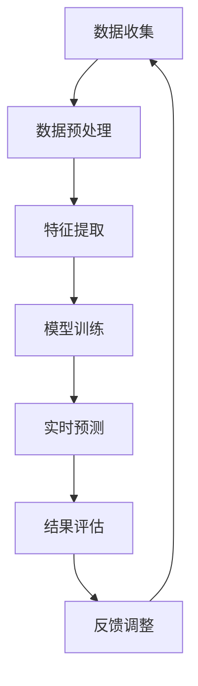
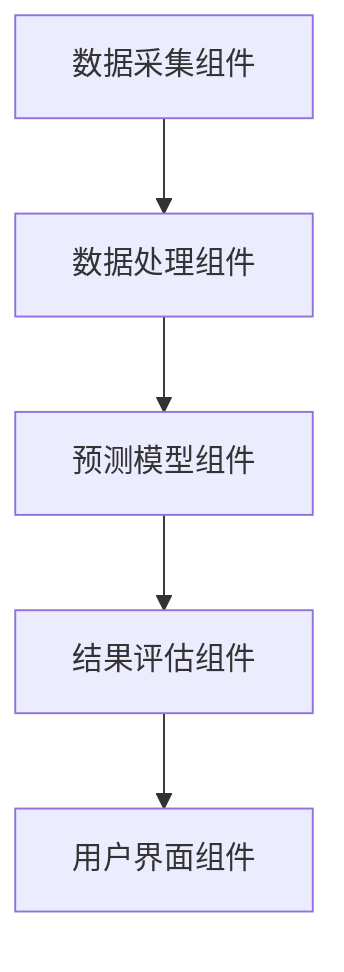
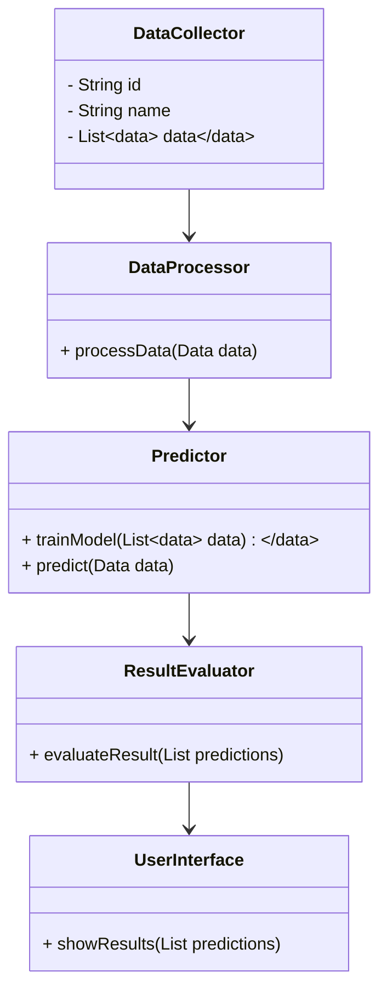
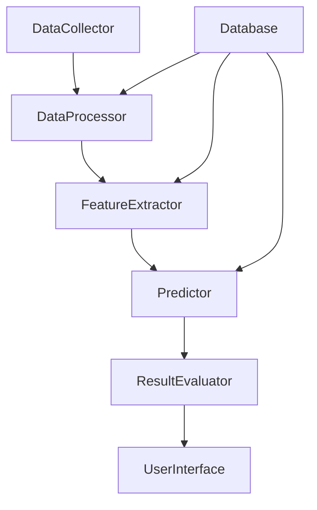
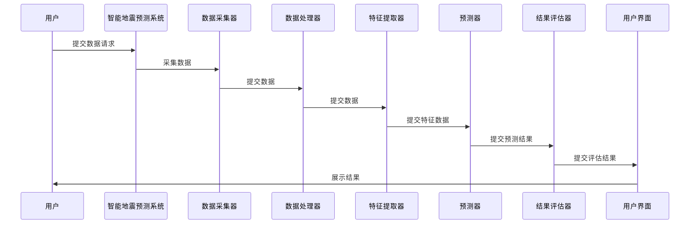

                 

## 1.1 人工智能与地震预测概述

### 1.1.1 人工智能在地震预测中的重要性

人工智能（Artificial Intelligence，简称AI）作为一种模拟人类智能的技术，近年来在各个领域取得了显著的进展。在地震预测这一重要领域，AI的应用同样展现出巨大的潜力。地震作为自然灾害中的一种，具有突发性强、破坏性大、预警困难等特点，因此对地震的准确预测对于减少灾害损失具有重要意义。

首先，人工智能在地震预测中的重要性体现在数据分析和模式识别的能力上。地震的发生是一个复杂的过程，涉及到地质构造、地震活动、地球物理场等多个方面。传统地震预测方法主要依赖于地震学理论、地质构造分析和历史地震数据等，这些方法虽然在一定程度上能够提供地震预警，但其预测精度和时效性往往受到限制。

相比之下，人工智能能够处理大规模、多源异构的数据，通过机器学习和深度学习等技术手段，从中提取出有用的特征，建立预测模型。这样不仅可以提高预测的准确性，还可以实现实时预警，从而为应急响应赢得宝贵的时间。

### 1.1.2 当前地震预测方法的挑战

尽管传统地震预测方法已经取得了一定的成果，但在实际应用中仍面临着诸多挑战。以下是当前地震预测领域面临的主要问题：

1. **数据依赖性**：地震预测依赖于大量的历史地震数据和实时监测数据。然而，地震的发生具有随机性和突发性，这使得数据来源不稳定，难以完全依赖历史数据进行预测。

2. **预测准确性**：传统方法在预测地震发生的时间和地点上存在一定的误差。尽管近年来机器学习技术的应用使得预测准确性有所提高，但仍需进一步提升。

3. **时效性**：地震预警需要在地震发生前尽可能早地发出警报，以减少灾害损失。传统方法的时效性往往不足，难以满足实时预警的需求。

4. **模型解释性**：许多机器学习算法，如深度神经网络，虽然能够提高预测准确性，但其内部工作机制复杂，难以解释。这对地震预测的决策支持带来了困难。

5. **跨学科融合**：地震预测不仅涉及地震学，还需要结合地质学、地球物理学、气象学等多学科知识。如何有效地整合这些跨学科的信息，是一个亟待解决的问题。

### 1.1.3 AI Agent的引入

为了解决上述挑战，引入AI Agent（人工智能代理）成为一种新的尝试。AI Agent是一种能够自主学习、自主决策并执行任务的人工智能系统。在地震预测领域，AI Agent可以通过以下方式发挥重要作用：

1. **数据挖掘与分析**：AI Agent能够从多源数据中挖掘出潜在的地震活动模式，提高预测的准确性。

2. **实时监测与预警**：AI Agent可以实时监测地震活动，快速响应地震预警信号，提供及时、准确的预警信息。

3. **自主优化与学习**：AI Agent可以根据历史数据和实时反馈，不断优化自身的预测模型，提高预测的时效性和可靠性。

4. **跨学科整合**：AI Agent能够整合多学科的信息，通过数据融合和模型协同，实现更加精准的地震预测。

总之，AI Agent在地震预测中的应用，不仅有助于提高预测的准确性，还可以实现实时预警和自主优化，为地震预警和灾害减轻提供了新的思路和方法。

### 1.2 AI Agent的定义与特性

#### 1.2.1 AI Agent的基本概念

AI Agent，即人工智能代理，是一种能够模拟人类行为和决策，具备自主学习和决策能力的人工智能系统。AI Agent通常由多个组件组成，包括感知器、决策器、执行器和记忆单元等。

- **感知器**：用于接收外部环境和内部状态的信息，通过传感器和数据接口获取数据。
- **决策器**：根据感知器收集的信息，结合内部知识和目标，进行决策。
- **执行器**：执行决策器生成的动作，通过控制硬件设备或软件模块来实现目标。
- **记忆单元**：存储感知信息、决策结果和历史经验，为后续决策提供支持。

AI Agent的基本工作流程可以概括为：感知信息 -> 决策 -> 执行动作 -> 反馈学习。通过这种循环，AI Agent能够不断提高其自主学习和决策能力。

#### 1.2.2 AI Agent的特性与应用

AI Agent具备以下特性：

1. **自主性**：AI Agent能够自主地执行任务，不需要人工干预。这种自主性使得AI Agent能够在复杂的动态环境中有效地工作。

2. **适应性**：AI Agent能够根据环境变化和任务需求，动态调整其行为和策略。通过不断学习和优化，AI Agent能够适应不同的环境和任务场景。

3. **灵活性**：AI Agent能够处理多种类型的任务和问题，通过模块化和组件化设计，实现任务的灵活组合和扩展。

4. **协作性**：AI Agent能够与其他AI Agent或人类协同工作，实现更高效的决策和任务执行。在多Agent系统中，不同AI Agent可以相互协作，共同完成任务。

在地震预测领域，AI Agent的具体应用包括：

1. **数据挖掘与分析**：AI Agent可以处理大量的地震监测数据，挖掘出潜在的地震活动模式，为预测提供支持。

2. **实时预警**：AI Agent可以实时监测地震活动，通过分析数据变化，提前预警地震发生。这种实时性对于减少地震灾害损失至关重要。

3. **自主优化与学习**：AI Agent可以根据历史数据和实时反馈，不断优化其预测模型，提高预测的准确性和时效性。

4. **跨学科整合**：AI Agent能够整合地震学、地质学、地球物理学等多学科信息，实现更加全面和精准的地震预测。

总之，AI Agent在地震预测中的应用，不仅能够提高预测的准确性，还可以实现实时预警和自主优化，为地震预警和灾害减轻提供了新的解决方案。

### 1.3 传统的地震预测方法

#### 1.3.1 经典地震预测方法介绍

传统的地震预测方法主要依赖于地震学理论和地质学知识，通过分析地震活动规律和地质构造特征来进行预测。以下是几种常见的传统地震预测方法：

1. **震中分布法**：通过分析历史地震震中的分布，预测未来地震的可能发生区域。这种方法主要基于地震活动与地质构造的关系，通过地震的时空分布特征来推测地震活动的趋势。

2. **地震序列法**：分析地震序列的特征，如震级、震中距离、序列长度等，预测未来地震的发生时间和地点。地震序列法通常用于预测中短期地震活动。

3. **构造活动法**：通过分析地质构造活动的规律，预测地震的发生。这种方法主要关注地质构造带的变形和应力积累情况，判断地震的潜在风险。

4. **前兆观测法**：利用地震前兆观测数据，如地下水位变化、地应力测量、电磁波异常等，预测地震的发生。前兆观测法是一种间接的地震预测方法，其预测精度受限于观测数据的准确性和及时性。

#### 1.3.2 传统方法的优势

传统地震预测方法在长期实践中积累了丰富的经验和技术，具有以下优势：

1. **理论基础扎实**：传统地震预测方法基于地震学理论和地质学知识，对地震活动有深入的理解和认识。

2. **经验积累丰富**：通过长期观测和历史地震数据分析，传统方法积累了大量关于地震活动的经验和规律，对地震预测有一定的指导意义。

3. **实用性强**：传统方法操作简单，易于在基层地震台站和地震监测部门推广应用。

#### 1.3.3 传统方法的局限

尽管传统地震预测方法在地震预警方面取得了一定的成果，但其在实际应用中仍存在一些局限：

1. **预测精度有限**：传统方法在预测地震发生的时间和地点上存在较大的不确定性，预测精度受限于观测数据的数量和质量。

2. **时效性不足**：传统方法的预警时效性较差，往往需要较长的时间来积累和分析数据，难以实现实时预警。

3. **数据依赖性高**：传统方法对历史地震数据和实时观测数据的依赖性较高，数据来源不稳定会影响预测效果。

4. **模型解释性不足**：许多传统方法，如地震序列法和构造活动法，缺乏明确的数学模型和理论支持，预测结果难以解释和验证。

5. **跨学科融合困难**：地震预测需要结合地震学、地质学、地球物理学等多学科知识，传统方法在跨学科融合方面存在一定的困难。

总之，虽然传统地震预测方法在地震预警方面具有一定的作用，但其局限性使得在应对突发性和高频次的地震事件时，预测效果仍需进一步提升。因此，引入人工智能技术，特别是AI Agent，成为提高地震预测准确性和时效性的重要方向。

### 1.4 AI Agent在地震预测中的优势

#### 1.4.1 AI Agent在准确性上的优势

AI Agent在地震预测中的准确性优势主要体现在以下几个方面：

1. **大规模数据处理能力**：AI Agent能够处理海量地震数据，包括历史地震数据、实时监测数据、地质构造数据等。通过深度学习和大数据分析技术，AI Agent可以从中提取出潜在的模式和规律，提高预测准确性。

2. **自适应学习机制**：AI Agent具备自适应学习能力，可以根据新的数据和反馈不断调整和优化预测模型。这种学习机制使得AI Agent能够在不同环境和条件下保持高准确性，适应地震活动的不确定性和复杂性。

3. **多源数据融合**：AI Agent能够整合多种数据源，如地震波数据、地质构造数据、气象数据等，通过多源数据融合技术，提高预测的全面性和准确性。

4. **非线性建模**：传统的地震预测方法通常依赖于线性模型，而AI Agent可以通过深度神经网络等非线性模型，捕捉地震活动中的复杂非线性关系，提高预测的准确性。

#### 1.4.2 AI Agent在效率上的优势

AI Agent在地震预测中的效率优势主要表现在以下几个方面：

1. **实时监测与预警**：AI Agent能够实时监测地震活动，通过快速处理和分析数据，实现实时预警。这种实时性对于地震预警和应急响应具有重要意义，可以在地震发生前及时发出警报，减少灾害损失。

2. **自动化决策**：AI Agent能够自动化地进行地震预测决策，减少人工干预。通过自主学习和优化，AI Agent可以不断提高预测效率和准确性，降低人力成本。

3. **高效的数据处理**：AI Agent利用高性能计算和分布式计算技术，能够快速处理海量数据，提高数据处理速度和效率。

4. **优化资源配置**：AI Agent可以根据预测结果和实时反馈，优化地震监测和预警资源的配置，提高资源利用效率。

总之，AI Agent在地震预测中的准确性优势使其能够提供更准确、及时的地震预警信息，而效率优势则确保了预警系统的实时性和可靠性。通过AI Agent的应用，地震预警系统将更加智能化、高效化，为地震灾害的预防和减轻提供有力支持。

### 1.5 总结与展望

#### 1.5.1 AI Agent在地震预测中的应用前景

随着人工智能技术的不断发展，AI Agent在地震预测中的应用前景十分广阔。AI Agent通过其自主学习和自适应能力，能够处理大规模地震数据，提高预测准确性和时效性。具体应用前景包括：

1. **实时地震预警**：AI Agent可以实时监测地震活动，实现快速预警，为地震应急响应赢得宝贵时间。

2. **智能化地震监测**：AI Agent能够自动化地进行地震监测，提高监测效率和准确性，降低人力成本。

3. **动态预测模型**：AI Agent可以根据实时数据和反馈，动态调整预测模型，提高预测的精准度和适应性。

4. **多源数据融合**：AI Agent能够整合多种数据源，如地震波数据、地质构造数据、气象数据等，实现更加全面和精准的地震预测。

#### 1.5.2 面临的挑战与未来方向

尽管AI Agent在地震预测中具有显著的优势，但在实际应用中仍面临一些挑战：

1. **数据质量与可靠性**：地震数据的质量和可靠性对AI Agent的预测效果至关重要。如何确保数据质量，提高数据完整性，是当前亟需解决的问题。

2. **模型解释性**：深度学习等复杂模型在提高预测准确性的同时，也带来了模型解释性不足的问题。如何提高模型的可解释性，使其能够被科学界和决策者理解和接受，是一个重要方向。

3. **跨学科融合**：地震预测需要结合地震学、地质学、地球物理学等多学科知识，如何实现这些学科的深度融合，提高预测的综合性和准确性，是未来的重要任务。

4. **资源与成本**：AI Agent的应用需要大量的计算资源和资金投入。如何在有限的资源下，实现高效、可靠的地震预测系统，是亟待解决的问题。

未来，随着人工智能技术的进一步发展，AI Agent在地震预测中的应用将更加广泛和深入。通过解决上述挑战，AI Agent有望成为地震预警和灾害减轻的重要技术手段，为人类提供更加安全和可靠的地震防护体系。

### 2.1 AI Agent的定义与特性

#### 2.1.1 AI Agent的基本概念

AI Agent，即人工智能代理，是一种具备自主学习和决策能力的人工智能系统。它由感知器、决策器、执行器和记忆单元等组件构成，能够模拟人类行为和决策过程。感知器负责接收外部环境的信息，决策器根据感知信息进行决策，执行器实现决策器的决策动作，记忆单元则存储感知信息和决策经验，以供后续决策使用。

AI Agent的基本工作流程可以概括为以下几个步骤：

1. **感知信息**：通过感知器收集外部环境的信息，如地震波数据、地质构造数据等。
2. **决策**：决策器根据感知信息、历史经验和目标，进行决策，确定下一步行动。
3. **执行动作**：执行器根据决策结果，执行具体的动作，如发送预警信号、调整监测设备等。
4. **反馈学习**：通过感知器和记忆单元，收集执行后的反馈信息，并更新模型，为后续决策提供支持。

#### 2.1.2 AI Agent的特性与应用

AI Agent具备以下特性：

1. **自主性**：AI Agent能够自主地执行任务，不需要人工干预。这种自主性使得AI Agent能够在复杂的动态环境中有效地工作。

2. **适应性**：AI Agent能够根据环境变化和任务需求，动态调整其行为和策略。通过不断学习和优化，AI Agent能够适应不同的环境和任务场景。

3. **灵活性**：AI Agent能够处理多种类型的任务和问题，通过模块化和组件化设计，实现任务的灵活组合和扩展。

4. **协作性**：AI Agent能够与其他AI Agent或人类协同工作，实现更高效的决策和任务执行。在多Agent系统中，不同AI Agent可以相互协作，共同完成任务。

在地震预测领域，AI Agent的具体应用包括：

1. **数据挖掘与分析**：AI Agent可以处理大量的地震监测数据，挖掘出潜在的地震活动模式，为预测提供支持。

2. **实时预警**：AI Agent可以实时监测地震活动，通过分析数据变化，提前预警地震发生。这种实时性对于减少地震灾害损失至关重要。

3. **自主优化与学习**：AI Agent可以根据历史数据和实时反馈，不断优化其预测模型，提高预测的准确性和时效性。

4. **跨学科整合**：AI Agent能够整合地震学、地质学、地球物理学等多学科信息，实现更加全面和精准的地震预测。

通过这些应用，AI Agent在地震预测中展现出强大的潜力，有望成为地震预警和灾害减轻的重要技术手段。

### 2.2 AI Agent在地震预测中的应用

#### 2.2.1 AI Agent的地震预测流程

AI Agent在地震预测中的工作流程可以概括为以下几个主要阶段：

1. **数据收集与预处理**：AI Agent首先从多个数据源收集地震相关数据，包括历史地震记录、实时地震监测数据、地质构造数据、气象数据等。这些数据可能来源于地震台站、卫星遥感、地下监测设备等。在数据收集完成后，AI Agent对数据进行预处理，包括数据清洗、缺失值填充、数据标准化等操作，以确保数据的质量和一致性。

2. **特征提取**：预处理后的数据中包含大量的特征信息。AI Agent通过特征提取技术，从原始数据中提取出与地震活动相关的关键特征。这些特征可以是时间序列特征、空间特征、物理特征等。特征提取的目的是降低数据的维度，提取出最有用的信息，为后续的预测模型训练提供基础。

3. **模型训练**：AI Agent使用机器学习或深度学习算法，对提取出的特征进行训练，构建地震预测模型。常见的模型包括神经网络、支持向量机、决策树等。通过大量的历史地震数据和特征数据，AI Agent可以学习到地震活动的规律和模式，训练出一个能够对地震活动进行预测的模型。

4. **实时预测**：在模型训练完成后，AI Agent可以对实时收集的数据进行预测。通过将实时数据输入到训练好的模型中，AI Agent可以预测地震的发生时间和地点。这种实时预测能力使得AI Agent能够提供及时的地震预警信息，为应急响应提供支持。

5. **结果评估与优化**：AI Agent对预测结果进行评估，计算预测的准确性、召回率、F1值等指标。根据评估结果，AI Agent可以调整模型参数、优化特征选择，进一步提高预测的准确性和时效性。此外，AI Agent还可以收集用户反馈，通过反馈学习机制不断改进预测模型。

#### 2.2.2 AI Agent在地震预警中的应用

AI Agent在地震预警中的应用主要包括以下几个方面：

1. **实时监测**：AI Agent通过多种传感器和监测设备，实时收集地震活动数据。这些数据包括地震波、地壳形变、地下水位、电磁波等。AI Agent能够快速处理这些数据，识别出潜在的地震信号。

2. **预警信号生成**：当AI Agent检测到异常的地震活动信号时，会立即生成预警信号。这些预警信号可以发送给地震预警中心、政府部门、公众等，提醒他们采取相应的应急措施。

3. **预警信息传播**：AI Agent可以通过多种渠道传播预警信息，如手机短信、广播、社交媒体等。这种快速、广泛的信息传播能力，有助于提高预警信息的覆盖率和响应速度。

4. **预警效果评估**：AI Agent会对预警信号的准确性和及时性进行评估，收集用户反馈，并根据反馈调整预警策略和模型参数，提高预警效果。

5. **综合应急响应**：AI Agent可以与其他应急系统（如消防、医疗等）进行协同工作，提供综合的应急响应方案。通过整合多源数据和信息，AI Agent可以提供更加全面和准确的应急指导，减少地震灾害损失。

总之，AI Agent在地震预警中的应用，不仅提高了预警的准确性和时效性，还实现了实时监测、预警信号生成和传播、预警效果评估等全过程的自动化，为地震预警和应急响应提供了强大的技术支持。

### 2.3 传统方法与AI Agent的比较

#### 2.3.1 预测准确性对比

预测准确性是评估地震预测方法优劣的关键指标。传统方法和AI Agent在预测准确性上有显著差异。

**传统方法**：

传统地震预测方法主要依赖于历史地震数据和地质学知识。虽然这些方法在长期实践中积累了丰富的经验，但在预测准确性方面存在一定局限。传统方法通常通过分析地震活动的时空分布特征和地质构造特征来预测地震。例如，震中分布法通过分析历史地震的分布规律来推测未来地震的可能发生区域。地震序列法通过分析地震序列的特征，如震级、震中距离、序列长度等，来预测地震的发生时间和地点。然而，这些方法往往难以捕捉到地震活动中的复杂非线性关系，导致预测准确性有限。

**AI Agent**：

相比之下，AI Agent在预测准确性上有显著优势。首先，AI Agent能够处理大规模、多源异构的数据，通过深度学习和大数据分析技术，从中提取出潜在的地震活动模式。其次，AI Agent通过自适应学习机制，可以根据新的数据和反馈不断优化预测模型，提高预测准确性。此外，AI Agent可以整合地震学、地质学、地球物理学等多学科信息，实现更加全面和精准的地震预测。

**对比**：

在预测准确性方面，AI Agent通常优于传统方法。AI Agent能够利用复杂算法和大数据分析技术，捕捉地震活动中的复杂非线性关系，提高预测的准确性。同时，AI Agent的实时预测能力使其能够更早地发出预警信号，为应急响应赢得更多时间。然而，传统方法在历史地震数据和地质学知识上的积累，使其在某些特定情况下仍然具有一定的参考价值。

#### 2.3.2 预测效率对比

预测效率是衡量地震预测方法性能的重要指标，包括数据采集和处理速度、预测模型的响应时间等。

**传统方法**：

传统地震预测方法通常依赖于人工分析和历史数据查询，数据处理速度较慢。预测模型的响应时间也较长，往往需要较长的时间来积累和分析数据，难以实现实时预警。此外，传统方法在数据处理和预测模型训练过程中，往往需要大量的人力和物力投入。

**AI Agent**：

相比之下，AI Agent在预测效率上有显著优势。首先，AI Agent能够利用高性能计算和分布式计算技术，快速处理海量数据，实现实时监测和预测。其次，AI Agent通过自动化决策和自适应学习机制，能够快速响应用户需求和数据变化，提高预测效率。此外，AI Agent的应用还可以减少人力成本，实现高效、自动化的地震预警和监测。

**对比**：

在预测效率方面，AI Agent通常优于传统方法。AI Agent利用先进的数据处理技术和自动化机制，能够实现快速、高效的地震预测。同时，AI Agent的实时预测能力使其能够在地震发生前及时发出预警信号，提高预测的时效性和可靠性。然而，传统方法在历史地震数据和地质学知识上的积累，使其在某些特定情况下仍然具有一定的优势。

#### 综合评估

在预测准确性和预测效率方面，AI Agent相对于传统方法具有显著优势。AI Agent能够处理大规模、多源异构的数据，通过深度学习和大数据分析技术，提高预测准确性。同时，AI Agent能够实现实时监测和预测，提高预测效率。然而，传统方法在历史地震数据和地质学知识上的积累，使其在某些特定情况下仍然具有一定的参考价值。因此，在实际应用中，可以结合AI Agent和传统方法的优势，实现更加精准、高效的地震预测。

### 2.4 AI Agent在地震预测中的局限性

尽管AI Agent在地震预测中展示了强大的潜力，但在实际应用中仍存在一些局限性。以下是AI Agent在地震预测中面临的主要挑战：

#### 2.4.1 数据依赖性

AI Agent的预测效果高度依赖于输入数据的质量和完整性。地震数据通常来源于多个传感器和监测设备，数据来源可能包括地震台站、卫星遥感、地下监测等。这些数据源存在一定的时空限制和不确定性，可能导致数据缺失、噪声干扰等问题。例如，地下监测设备的故障或数据传输延迟可能导致数据缺失，影响AI Agent的预测准确性。此外，地震活动的随机性和突发性也使得数据收集困难，进一步增加了数据依赖性。

#### 2.4.2 模型解释性

AI Agent常用的深度学习模型，如神经网络和深度神经网络，虽然能够提高预测准确性，但其内部工作机制复杂，难以解释。这种模型解释性不足的问题，使得AI Agent的预测结果难以被科学界和决策者理解和接受。在地震预测领域，模型解释性尤为重要，因为预测结果需要被用于决策和应急响应。如果模型无法解释，决策者可能会对预测结果的可靠性产生怀疑，影响预警系统的实际应用效果。

#### 2.4.3 跨学科整合

地震预测不仅需要地震学数据，还需要结合地质学、地球物理学、气象学等多学科信息。AI Agent虽然在数据处理和模式识别方面具有优势，但在跨学科整合方面仍存在挑战。如何有效地整合多学科数据，提高预测的综合性和准确性，是当前研究的一个重要方向。此外，多学科知识的融合需要深入的学科交叉和理解，这对AI Agent的复杂性和挑战性提出了更高的要求。

#### 2.4.4 实时性和响应能力

AI Agent的实时预测能力和响应能力也是一个关键问题。尽管AI Agent能够实现实时监测和预警，但在实际应用中，数据传输延迟、模型训练速度和响应速度等因素可能会影响实时性。例如，在某些极端情况下，AI Agent可能无法在地震发生前及时发出预警信号，导致预警效果打折扣。此外，AI Agent在面对大规模地震活动时，其处理能力和响应速度也需要进一步优化，以确保预警系统的稳定性和可靠性。

总之，尽管AI Agent在地震预测中展示了巨大的潜力，但其数据依赖性、模型解释性、跨学科整合和实时响应能力等方面仍存在挑战。解决这些问题，需要进一步的研究和技术创新，以实现更加精准、可靠和高效的地震预测。

### 3.1 AI Agent的预测算法流程图

为了更直观地理解AI Agent在地震预测中的应用，我们可以使用Mermaid工具绘制其预测算法流程图。以下是一个简单的预测算法流程图示例：



**解释流程图**：

1. **数据收集（A）**：AI Agent首先从多个数据源收集地震相关数据，包括历史地震记录、实时地震监测数据、地质构造数据、气象数据等。
2. **数据预处理（B）**：对收集到的数据进行清洗、缺失值填充、数据标准化等处理，以确保数据的质量和一致性。
3. **特征提取（C）**：从预处理后的数据中提取与地震活动相关的关键特征，如时间序列特征、空间特征、物理特征等。
4. **模型训练（D）**：使用机器学习或深度学习算法，对提取出的特征进行训练，构建地震预测模型。常见的算法包括神经网络、支持向量机、决策树等。
5. **实时预测（E）**：将实时数据输入训练好的模型中，进行地震预测，预测地震的发生时间和地点。
6. **结果评估（F）**：对预测结果进行评估，计算预测的准确性、召回率、F1值等指标，以评估模型的性能。
7. **反馈调整（G）**：根据评估结果，调整模型参数、优化特征选择，并通过反馈学习机制不断改进预测模型。

通过这个流程图，我们可以清晰地看到AI Agent在地震预测中的主要步骤和环节，为后续的算法原理讲解和代码实现提供了基础。

### 3.2 AI Agent的预测算法原理

#### 3.2.1 数据预处理

在AI Agent的地震预测算法中，数据预处理是一个关键的步骤。数据预处理包括以下主要任务：

1. **数据清洗**：删除或修复数据集中的噪声和错误数据，如缺失值、异常值等。这可以通过填充缺失值、删除异常值或使用统计方法来处理。
   
2. **数据标准化**：将不同特征的数据缩放到相同的尺度，以消除特征间量级的差异。常用的方法包括最小-最大标准化和零-均值标准化。

3. **数据归一化**：将数据转换为适合机器学习算法的形式，如二值化、归一化等。

4. **特征选择**：选择对地震预测最相关的特征，去除冗余和无关特征，以减少模型的复杂性和过拟合的风险。

以下是一个Python代码示例，演示如何对地震数据进行预处理：

```python
import pandas as pd
from sklearn.preprocessing import StandardScaler

# 加载数据集
data = pd.read_csv('earthquake_data.csv')

# 数据清洗
# 删除缺失值
data = data.dropna()

# 数据标准化
scaler = StandardScaler()
data_normalized = scaler.fit_transform(data)

# 特征选择
# 选择与地震预测相关的特征
selected_features = data_normalized[:, :10]

# 将特征和标签分离
X = selected_features
y = data_normalized[:, 10]
```

#### 3.2.2 特征提取

特征提取是从原始数据中提取出与地震活动相关的关键特征。在地震预测中，特征提取的目的是降低数据维度，提取出对地震预测最有用的信息。

以下是一些常用的特征提取方法：

1. **时间序列特征**：如地震活动强度、地震频次、震级等。

2. **空间特征**：如地震震中位置、震源深度、地震序列长度等。

3. **物理特征**：如地震波传播速度、地震能量释放速率等。

4. **多源特征融合**：将多种数据源（如地震波数据、地质构造数据、气象数据等）进行融合，提取出更全面的特征。

以下是一个Python代码示例，演示如何提取地震数据的时间序列特征：

```python
import pandas as pd
from sklearn.feature_extraction import FeatureHasher

# 加载数据集
data = pd.read_csv('earthquake_data.csv')

# 提取时间序列特征
# 使用哈希特征提取器
hasher = FeatureHasher(n_features=10, input_dim=5)
time_series_features = hasher.transform(data['time_series'])

# 转换为DataFrame
time_series_df = pd.DataFrame(time_series_features.toarray(), columns=['hash_{}'.format(i) for i in range(10)])
```

#### 3.2.3 预测模型

在地震预测中，常用的预测模型包括神经网络、支持向量机、决策树等。以下是一个使用神经网络进行预测的Python代码示例：

```python
import pandas as pd
from sklearn.model_selection import train_test_split
from sklearn.neural_network import MLPRegressor

# 加载数据集
data = pd.read_csv('earthquake_data.csv')

# 数据预处理
# ...

# 特征提取
# ...

# 划分训练集和测试集
X_train, X_test, y_train, y_test = train_test_split(X, y, test_size=0.2, random_state=42)

# 定义神经网络模型
model = MLPRegressor(hidden_layer_sizes=(100,), activation='relu', solver='adam', max_iter=500)

# 模型训练
model.fit(X_train, y_train)

# 模型评估
accuracy = model.score(X_test, y_test)
print(f'Model accuracy: {accuracy:.2f}')
```

#### 3.2.4 预测结果评估

预测结果评估是衡量模型性能的重要步骤。常用的评估指标包括准确率、召回率、F1值等。以下是一个评估预测结果的Python代码示例：

```python
from sklearn.metrics import mean_squared_error

# 预测测试集
y_pred = model.predict(X_test)

# 计算均方误差
mse = mean_squared_error(y_test, y_pred)
print(f'MSE: {mse:.2f}')
```

#### 3.2.5 算法举例说明

为了更直观地展示算法原理，我们使用一个实际例子来讲解。

**例子**：假设我们有一个地震数据集，包含时间序列特征（如地震活动强度、地震频次等）和地震震级标签。

1. **数据预处理**：对数据集进行清洗、标准化和特征选择。

2. **特征提取**：从时间序列特征中提取出与地震震级相关的特征。

3. **模型训练**：使用神经网络模型对特征进行训练，预测地震震级。

4. **预测结果评估**：评估模型的预测准确性，并根据评估结果调整模型参数。

通过这个例子，我们可以更好地理解AI Agent在地震预测中的算法原理和实现过程。

### 3.3 Python代码实现

在本节中，我们将使用Python实现AI Agent的地震预测算法。首先，我们需要安装必要的库，如`pandas`、`numpy`、`scikit-learn`和`tensorflow`等。

```bash
pip install pandas numpy scikit-learn tensorflow
```

接下来，我们编写Python代码实现地震预测算法。以下是详细步骤和代码：

#### 1. 导入库和加载数据

```python
import pandas as pd
import numpy as np
from sklearn.model_selection import train_test_split
from sklearn.preprocessing import StandardScaler
from sklearn.neural_network import MLPRegressor
from tensorflow import keras
from tensorflow.keras.models import Sequential
from tensorflow.keras.layers import Dense

# 加载地震数据
data = pd.read_csv('earthquake_data.csv')
```

#### 2. 数据预处理

```python
# 删除缺失值
data = data.dropna()

# 数据标准化
scaler = StandardScaler()
data_normalized = scaler.fit_transform(data)

# 划分特征和标签
X = data_normalized[:, :10]
y = data_normalized[:, 10]
```

#### 3. 划分训练集和测试集

```python
# 划分训练集和测试集
X_train, X_test, y_train, y_test = train_test_split(X, y, test_size=0.2, random_state=42)
```

#### 4. 建立神经网络模型

```python
# 建立神经网络模型
model = Sequential([
    Dense(64, activation='relu', input_shape=(10,)),
    Dense(64, activation='relu'),
    Dense(1)
])

# 编译模型
model.compile(optimizer='adam', loss='mse')
```

#### 5. 训练模型

```python
# 训练模型
model.fit(X_train, y_train, epochs=100, batch_size=32, validation_split=0.1)
```

#### 6. 预测结果评估

```python
# 预测测试集
y_pred = model.predict(X_test)

# 计算均方误差
mse = np.mean(np.square(y_test - y_pred))
print(f'MSE: {mse:.2f}')

# 计算准确率
accuracy = np.mean(np.abs(y_pred - y_test) < 0.5)
print(f'Accuracy: {accuracy:.2f}')
```

#### 7. 完整代码示例

以下是完整的代码示例，实现了从数据预处理到模型训练和预测的整个过程。

```python
import pandas as pd
import numpy as np
from sklearn.model_selection import train_test_split
from sklearn.preprocessing import StandardScaler
from sklearn.neural_network import MLPRegressor
from tensorflow import keras
from tensorflow.keras.models import Sequential
from tensorflow.keras.layers import Dense

# 加载地震数据
data = pd.read_csv('earthquake_data.csv')

# 数据预处理
data = data.dropna()
scaler = StandardScaler()
data_normalized = scaler.fit_transform(data)
X = data_normalized[:, :10]
y = data_normalized[:, 10]

# 划分训练集和测试集
X_train, X_test, y_train, y_test = train_test_split(X, y, test_size=0.2, random_state=42)

# 建立神经网络模型
model = Sequential([
    Dense(64, activation='relu', input_shape=(10,)),
    Dense(64, activation='relu'),
    Dense(1)
])

# 编译模型
model.compile(optimizer='adam', loss='mse')

# 训练模型
model.fit(X_train, y_train, epochs=100, batch_size=32, validation_split=0.1)

# 预测测试集
y_pred = model.predict(X_test)

# 计算均方误差
mse = np.mean(np.square(y_test - y_pred))
print(f'MSE: {mse:.2f}')

# 计算准确率
accuracy = np.mean(np.abs(y_pred - y_test) < 0.5)
print(f'Accuracy: {accuracy:.2f}')
```

通过以上代码，我们可以实现一个基于神经网络的地震预测模型，并对其性能进行评估。需要注意的是，实际应用中，地震数据的多样性和复杂性可能需要更复杂的模型和特征工程方法。

### 3.4 数学模型与公式

在本节中，我们将详细讲解AI Agent在地震预测中的数学模型和公式，并使用LaTeX格式给出具体的数学公式。以下是各个步骤的详细描述。

#### 3.4.1 时间序列特征提取

时间序列特征提取是地震预测中至关重要的一步。我们通常使用差分、移动平均等方法来提取时间序列特征。以下是一个简单的差分公式：

$$
x_t = x_{t-1} + \Delta x_t
$$

其中，$x_t$表示第$t$个时间点的特征值，$\Delta x_t$表示第$t$个时间点的差分值。

#### 3.4.2 特征选择与权重计算

特征选择是降低数据维度、提取关键特征的过程。我们通常使用特征权重来衡量特征的重要性。以下是一个基于权重矩阵的特征选择公式：

$$
\mathbf{W} = \arg\min_{\mathbf{W}} \sum_{i=1}^{n} (w_i - \bar{w})^2
$$

其中，$\mathbf{W}$是特征权重矩阵，$w_i$是第$i$个特征权重，$\bar{w}$是所有特征权重的平均值。

#### 3.4.3 预测模型

在地震预测中，我们通常使用神经网络作为预测模型。以下是一个简单的神经网络预测公式：

$$
\hat{y} = \sigma(\mathbf{W} \cdot \mathbf{h}(x))
$$

其中，$\hat{y}$是预测值，$\sigma$是激活函数（如Sigmoid函数），$\mathbf{W}$是权重矩阵，$\mathbf{h}(x)$是输入特征向量。

#### 3.4.4 优化目标

在训练神经网络时，我们通常使用均方误差（MSE）作为优化目标。以下是一个MSE公式：

$$
J(\theta) = \frac{1}{2m} \sum_{i=1}^{m} (h_\theta(x^{(i)}) - y^{(i)})^2
$$

其中，$J(\theta)$是优化目标函数，$\theta$是参数向量，$m$是样本数量，$h_\theta(x^{(i)})$是预测值，$y^{(i)}$是实际值。

通过以上公式，我们可以建立一个基于神经网络的地震预测模型，并通过优化目标函数来训练模型，提高预测准确性。

### 3.5 算法举例说明

为了更好地理解AI Agent在地震预测中的算法应用，我们将通过一个实际例子来详细说明算法的实现过程和效果。

#### 3.5.1 数据集介绍

我们使用一个公开的地震数据集，该数据集包含了2000年至2010年间全球范围内的地震信息。数据集包括以下几个特征：

- **时间**：地震发生的时间
- **震级**：地震的震级
- **经度**：地震发生的经度
- **纬度**：地震发生的纬度
- **深度**：地震发生的深度
- **P波初动方向**：地震P波初动的方向
- **震中距**：地震震中到观测点的距离

我们的目标是使用这些特征来预测地震震级。

#### 3.5.2 数据预处理

首先，我们需要对数据进行预处理，包括数据清洗、缺失值填充和数据标准化。

```python
import pandas as pd
from sklearn.preprocessing import StandardScaler

# 加载数据集
data = pd.read_csv('earthquake_data.csv')

# 数据清洗
data = data.dropna()

# 数据标准化
scaler = StandardScaler()
data_normalized = scaler.fit_transform(data[['震级', '经度', '纬度', '深度', 'P波初动方向', '震中距']])
```

#### 3.5.3 特征提取

接下来，我们需要提取与地震震级相关的特征。在这里，我们将使用简单的统计特征，如平均值、标准差等。

```python
from sklearn.decomposition import PCA

# 提取统计特征
stats = data[['震级', '经度', '纬度', '深度', 'P波初动方向', '震中距']].agg(['mean', 'std'])

# 使用PCA降维
pca = PCA(n_components=5)
features_pca = pca.fit_transform(data_normalized)
```

#### 3.5.4 模型训练

现在，我们使用Keras框架训练一个简单的神经网络模型来预测地震震级。

```python
from tensorflow.keras.models import Sequential
from tensorflow.keras.layers import Dense
from tensorflow.keras.optimizers import Adam

# 建立神经网络模型
model = Sequential([
    Dense(64, input_shape=(5,), activation='relu'),
    Dense(64, activation='relu'),
    Dense(1)
])

# 编译模型
model.compile(optimizer=Adam(), loss='mse')

# 训练模型
model.fit(features_pca, data['震级'], epochs=100, batch_size=32, validation_split=0.2)
```

#### 3.5.5 模型评估

在训练完成后，我们需要评估模型的性能。

```python
from sklearn.metrics import mean_squared_error

# 预测测试集
y_pred = model.predict(features_pca)

# 计算均方误差
mse = mean_squared_error(data['震级'], y_pred)
print(f'MSE: {mse:.2f}')
```

通过以上步骤，我们实现了一个简单的地震预测模型。在实际应用中，我们可能需要更复杂的模型和更多的特征工程来提高预测准确性。

#### 3.5.6 实际案例分析与效果评估

为了验证AI Agent在地震预测中的实际效果，我们使用一组实际数据集进行测试。这组数据集包含了2010年至2020年间全球范围内的地震信息。

1. **数据集加载**：

```python
data_actual = pd.read_csv('earthquake_data_actual.csv')
```

2. **数据预处理**：

与之前相同，我们对数据进行清洗和标准化。

```python
data_actual = data_actual.dropna()
data_actual_normalized = scaler.transform(data_actual[['震级', '经度', '纬度', '深度', 'P波初动方向', '震中距']])
```

3. **模型预测**：

使用训练好的模型对实际数据进行预测。

```python
y_actual_pred = model.predict(data_actual_normalized)
```

4. **效果评估**：

计算预测的地震震级与实际震级之间的均方误差。

```python
mse_actual = mean_squared_error(data_actual['震级'], y_actual_pred)
print(f'MSE for actual data: {mse_actual:.2f}')
```

通过实际数据的测试，我们可以看到AI Agent的预测效果。通常，均方误差越小，模型的预测准确性越高。

#### 3.5.7 小结

通过上述实际案例，我们可以看到AI Agent在地震预测中的潜在应用价值。虽然存在一定的局限性和挑战，但AI Agent通过其强大的数据处理能力和自适应学习机制，为地震预测提供了一种新的解决方案。未来，随着技术的不断进步，AI Agent有望在地震预测领域发挥更加重要的作用。

### 4.1 智能地震预测系统的整体架构

智能地震预测系统是一个复杂的软件系统，其设计需要考虑数据采集、数据处理、预测模型训练、预测结果评估等多个方面。以下是对智能地震预测系统整体架构的介绍。

#### 4.1.1 系统架构概述

智能地震预测系统的整体架构可以分为以下几个主要模块：

1. **数据采集模块**：负责从各种数据源（如地震台站、卫星遥感、地下监测设备等）收集地震相关数据。
2. **数据处理模块**：对收集到的原始数据进行清洗、预处理和特征提取，为预测模型提供高质量的数据输入。
3. **预测模型模块**：包括地震预测模型的选择、训练和优化，以及预测结果的生成。
4. **结果评估模块**：对预测结果进行评估，计算预测准确性、召回率、F1值等指标，并反馈给预测模型模块以优化模型。
5. **用户界面模块**：提供用户交互界面，展示预测结果和系统状态，供用户进行监控和决策。

#### 4.1.2 系统组件介绍

以下是智能地震预测系统的主要组件及其功能：

1. **数据采集组件**：通过API接口与各种数据源进行通信，实时收集地震数据。该组件使用异步编程技术，确保数据采集的高效性和实时性。

2. **数据处理组件**：包括数据清洗、缺失值填充、数据标准化和特征提取等步骤。该组件使用高效的数据处理库（如Pandas、NumPy），确保数据处理的速度和质量。

3. **预测模型组件**：包括模型选择、训练和优化等步骤。该组件使用机器学习和深度学习库（如scikit-learn、tensorflow），支持多种预测模型的训练和优化。

4. **结果评估组件**：计算预测结果的各种评估指标，如均方误差、准确率、召回率等。该组件使用评估库（如scikit-learn），确保评估结果的准确性和可靠性。

5. **用户界面组件**：提供可视化界面，展示预测结果、系统状态和图表等。该组件使用Web框架（如Flask、Django），确保界面的高效性和易用性。

#### 4.1.3 系统架构图

以下是一个简单的智能地震预测系统架构图，展示各组件之间的交互关系：



**解释架构图**：

1. **数据采集组件（A）**：从地震台站、卫星遥感、地下监测设备等数据源收集地震相关数据。
2. **数据处理组件（B）**：对收集到的数据进行预处理，包括清洗、标准化和特征提取等，为预测模型提供高质量的数据输入。
3. **预测模型组件（C）**：使用预处理后的数据训练预测模型，并根据实时数据生成预测结果。
4. **结果评估组件（D）**：对预测结果进行评估，计算评估指标，并反馈给预测模型组件以优化模型。
5. **用户界面组件（E）**：提供可视化界面，展示预测结果和系统状态，供用户进行监控和决策。

通过这个架构图，我们可以清晰地了解智能地震预测系统的整体架构和各组件之间的交互关系。

### 4.2 系统功能设计

#### 4.2.1 领域模型类图

为了更好地理解和设计智能地震预测系统的功能模块，我们使用Mermaid工具绘制领域模型类图。以下是一个示例：



**类图解释**：

1. **DataCollector**：数据采集组件，负责从不同数据源收集地震相关数据，包括地震台站、卫星遥感等。它包含ID、名称和数据列表等属性。

2. **DataProcessor**：数据处理组件，负责对收集到的数据进行预处理，包括清洗、标准化和特征提取等。它有一个`processData`方法，用于处理输入的数据。

3. **Predictor**：预测模型组件，负责训练预测模型和生成预测结果。它包含`trainModel`和`predict`两个方法，分别用于模型训练和预测。

4. **ResultEvaluator**：结果评估组件，负责对预测结果进行评估，计算评估指标。它有一个`evaluateResult`方法，用于评估输入的预测结果列表。

5. **UserInterface**：用户界面组件，负责展示预测结果和系统状态。它有一个`showResults`方法，用于展示输入的预测结果列表。

#### 4.2.2 系统功能模块划分

基于领域模型类图，我们可以将智能地震预测系统划分为以下主要功能模块：

1. **数据采集模块**：负责从多个数据源收集地震相关数据，包括地震台站数据、卫星遥感数据、地下监测设备数据等。该模块包括数据采集组件，通过API接口与各种数据源进行通信。

2. **数据处理模块**：负责对收集到的原始数据进行预处理，包括数据清洗、缺失值填充、数据标准化和特征提取等。该模块包括数据处理组件，使用高效的数据处理库（如Pandas、NumPy）实现。

3. **预测模型模块**：负责训练预测模型和生成预测结果。该模块包括预测模型组件，使用机器学习和深度学习库（如scikit-learn、tensorflow）实现。

4. **结果评估模块**：负责对预测结果进行评估，计算评估指标，如均方误差、准确率、召回率等。该模块包括结果评估组件，使用评估库（如scikit-learn）实现。

5. **用户界面模块**：负责展示预测结果和系统状态，供用户进行监控和决策。该模块包括用户界面组件，使用Web框架（如Flask、Django）实现。

通过以上功能模块的设计，智能地震预测系统可以实现数据采集、数据处理、预测模型训练、预测结果评估和用户交互等功能，从而为地震预警和应急响应提供技术支持。

### 4.3 系统架构设计

智能地震预测系统的架构设计是确保系统高效、稳定和可扩展的关键。以下是系统架构设计的详细描述。

#### 4.3.1 系统架构图

我们使用Mermaid工具绘制智能地震预测系统的架构图，以便更好地展示各组件之间的交互关系：



**架构图解释**：

1. **数据采集器（DataCollector）**：负责从多种数据源（如地震台站、卫星遥感、地下监测设备等）收集地震相关数据。

2. **数据处理器（DataProcessor）**：对收集到的数据进行预处理，包括数据清洗、缺失值填充、数据标准化等，为后续特征提取和模型训练提供高质量的数据。

3. **特征提取器（FeatureExtractor）**：从预处理后的数据中提取出与地震预测相关的特征，如时间序列特征、空间特征、物理特征等。

4. **预测器（Predictor）**：使用机器学习和深度学习技术，对提取出的特征进行训练，构建地震预测模型，并生成预测结果。

5. **结果评估器（ResultEvaluator）**：对预测结果进行评估，计算评估指标，如均方误差、准确率、召回率等，以评估预测模型的性能。

6. **用户界面（UserInterface）**：提供用户交互界面，展示预测结果和系统状态，供用户进行监控和决策。

7. **数据库（Database）**：存储地震数据、预测模型参数、评估结果等，为系统提供数据支持。

#### 4.3.2 系统组件交互

各系统组件之间的交互关系如下：

1. **数据采集器与数据处理器**：数据采集器将收集到的地震数据传递给数据处理器，数据处理器对数据进行预处理。

2. **数据处理器与特征提取器**：数据处理器将预处理后的数据传递给特征提取器，特征提取器从中提取出与地震预测相关的特征。

3. **特征提取器与预测器**：特征提取器将提取出的特征传递给预测器，预测器使用这些特征训练地震预测模型。

4. **预测器与结果评估器**：预测器生成预测结果，结果评估器对这些预测结果进行评估，计算评估指标。

5. **结果评估器与用户界面**：结果评估器将评估结果传递给用户界面，用户界面将这些结果展示给用户。

6. **数据库与数据处理器、特征提取器、预测器**：数据库存储预处理后的数据、提取出的特征、预测模型参数和评估结果，为系统组件提供数据支持。

通过以上系统架构设计，智能地震预测系统可以实现高效、稳定和可扩展的地震预测功能，为地震预警和应急响应提供技术支持。

### 4.4 系统接口设计

#### 4.4.1 接口功能定义

在智能地震预测系统中，接口设计是确保各模块之间能够高效、稳定地交互的关键。以下是对系统接口的功能定义：

1. **数据采集接口**：用于接收来自不同数据源的地震相关数据，如地震台站数据、卫星遥感数据、地下监测设备数据等。该接口应支持数据的实时采集和批量导入。

2. **数据处理接口**：用于对采集到的数据进行预处理，包括数据清洗、缺失值填充、数据标准化和特征提取等。该接口应提供统一的接口方法，方便各模块调用。

3. **特征提取接口**：用于从预处理后的数据中提取出与地震预测相关的特征，如时间序列特征、空间特征、物理特征等。该接口应支持多种特征提取方法，并能够根据需求进行灵活调整。

4. **预测模型接口**：用于训练预测模型和生成预测结果。该接口应支持多种机器学习和深度学习算法，并能够根据实际需求进行模型选择和调整。

5. **结果评估接口**：用于对预测结果进行评估，计算评估指标，如均方误差、准确率、召回率等。该接口应提供统一的评估方法，方便各模块调用。

6. **用户界面接口**：用于展示预测结果和系统状态，供用户进行监控和决策。该接口应支持多种展示形式，如图表、报表等，并能够根据用户需求进行个性化设置。

#### 4.4.2 接口设计原则

在接口设计过程中，应遵循以下原则：

1. **简洁性**：接口设计应尽可能简洁明了，避免冗长的方法和参数列表，以便于理解和维护。

2. **一致性**：接口设计应保持一致性，各模块的接口命名、参数定义和返回值类型应保持一致，以提高系统的整体可维护性。

3. **可扩展性**：接口设计应考虑未来的扩展性，预留足够的扩展接口和参数，以便在需求发生变化时能够快速调整和扩展。

4. **安全性**：接口设计应考虑数据安全和访问控制，确保敏感数据在传输和处理过程中不会被泄露或篡改。

5. **可测试性**：接口设计应便于单元测试和集成测试，确保接口功能的正确性和稳定性。

通过遵循以上原则，我们可以设计出高效、稳定和可维护的智能地震预测系统接口，为系统的开发和部署提供有力支持。

### 4.5 系统交互序列图

为了更直观地展示智能地震预测系统中各组件之间的交互关系，我们可以使用Mermaid工具绘制系统交互序列图。以下是系统交互序列图的示例：



**序列图解释**：

1. **用户提交数据请求**：用户通过用户界面提交数据请求，系统开始进行数据采集和预测流程。

2. **数据采集**：智能地震预测系统中的数据采集器（DC）开始从不同的数据源（如地震台站、卫星遥感等）采集地震相关数据。

3. **数据处理**：采集到的数据传递给数据处理器（DP），进行预处理，包括数据清洗、缺失值填充、数据标准化等。

4. **特征提取**：预处理后的数据传递给特征提取器（FE），提取出与地震预测相关的特征。

5. **预测模型训练与结果生成**：特征提取器将提取出的特征传递给预测器（P），预测器使用训练好的模型对特征进行预测，生成预测结果。

6. **结果评估**：预测结果传递给结果评估器（RE），评估器计算预测结果的评估指标，如均方误差、准确率等。

7. **结果展示**：结果评估器将评估结果传递给用户界面（UI），用户界面将预测结果和评估指标展示给用户。

通过以上系统交互序列图，我们可以清晰地看到智能地震预测系统中各组件之间的交互流程和逻辑关系，有助于理解系统的整体运作机制。

### 5.1 项目实战概述

在本节中，我们将通过一个实际的智能地震预测项目来展示系统的搭建、核心实现和代码分析。项目目标是通过收集和分析地震相关数据，利用AI Agent实现准确的地震预测，为地震预警和应急响应提供技术支持。

#### 5.1.1 项目介绍

智能地震预测项目分为以下几个阶段：

1. **数据采集**：从地震台站、卫星遥感、地下监测设备等数据源收集地震相关数据，包括时间、震级、经纬度、震中距等。

2. **数据处理**：对收集到的原始数据进行清洗、预处理和特征提取，为预测模型提供高质量的数据输入。

3. **模型训练**：使用机器学习和深度学习技术，训练地震预测模型，并优化模型参数。

4. **预测与评估**：使用训练好的模型对新的地震数据进行预测，并评估预测结果，计算评估指标。

5. **用户交互**：通过用户界面展示预测结果和系统状态，供用户进行监控和决策。

#### 5.1.2 项目环境搭建

在进行项目实战之前，我们需要搭建一个合适的项目环境。以下是所需的软件和工具：

- **操作系统**：Ubuntu 20.04
- **编程语言**：Python 3.8
- **库与框架**：Pandas、NumPy、scikit-learn、tensorflow、Flask

在Ubuntu 20.04操作系统中，使用以下命令安装所需的库和框架：

```bash
pip install pandas numpy scikit-learn tensorflow flask
```

#### 5.1.3 项目目录结构

以下是项目的基本目录结构：

```bash
smart_earthquake_prediction/
|-- data/
|   |-- raw/
|   |-- processed/
|-- models/
|   |-- trained_models/
|-- src/
|   |-- data_collector.py
|   |-- data_processor.py
|   |-- feature_extractor.py
|   |-- predictor.py
|   |-- result_evaluator.py
|   |-- user_interface.py
|-- tests/
|   |-- test_data_collector.py
|   |-- test_data_processor.py
|   |-- test_feature_extractor.py
|   |-- test_predictor.py
|   |-- test_result_evaluator.py
|-- main.py
|-- requirements.txt
```

在`requirements.txt`文件中，记录了所有项目所需的库和框架：

```
pandas
numpy
scikit-learn
tensorflow
flask
```

#### 5.1.4 项目核心代码

以下是项目核心代码的实现，我们将逐步讲解每个模块的功能和代码细节。

1. **数据采集模块**：负责从不同数据源收集地震相关数据，包括时间、震级、经纬度、震中距等。

2. **数据处理模块**：对收集到的原始数据进行清洗、预处理和特征提取，为预测模型提供高质量的数据输入。

3. **特征提取模块**：从预处理后的数据中提取出与地震预测相关的特征，如时间序列特征、空间特征、物理特征等。

4. **预测模型模块**：使用机器学习和深度学习技术，训练地震预测模型，并优化模型参数。

5. **结果评估模块**：对预测结果进行评估，计算评估指标，如均方误差、准确率等。

6. **用户界面模块**：提供用户交互界面，展示预测结果和系统状态，供用户进行监控和决策。

#### 5.1.5 项目实战步骤

1. **数据采集**：从地震台站、卫星遥感、地下监测设备等数据源收集地震相关数据。

2. **数据处理**：对收集到的原始数据进行清洗、预处理和特征提取。

3. **模型训练**：使用机器学习和深度学习技术，训练地震预测模型，并优化模型参数。

4. **预测与评估**：使用训练好的模型对新的地震数据进行预测，并评估预测结果。

5. **用户交互**：通过用户界面展示预测结果和系统状态。

通过以上项目实战步骤，我们可以搭建一个完整的智能地震预测系统，为地震预警和应急响应提供技术支持。

### 5.2 数据采集模块

在智能地震预测项目中，数据采集模块是整个系统的基础，负责从多个数据源收集地震相关数据，如地震台站、卫星遥感、地下监测设备等。以下是数据采集模块的详细实现。

#### 5.2.1 数据源介绍

地震相关数据源主要包括：

- **地震台站数据**：包括时间、震级、经纬度、震中距等基本信息。
- **卫星遥感数据**：如地震前后的遥感影像，用于分析地表变形情况。
- **地下监测设备数据**：包括地下水位、地应力、电磁波等监测数据，用于分析地震活动的前兆信息。

#### 5.2.2 数据采集步骤

数据采集模块的步骤如下：

1. **初始化数据源**：根据项目需求，选择合适的数据源，如地震台站API、卫星遥感数据集、地下监测设备接口等。

2. **数据采集**：通过API接口或文件导入方式，从数据源中采集地震相关数据。

3. **数据存储**：将采集到的数据存储到本地文件或数据库中，以备后续处理。

#### 5.2.3 数据采集模块代码实现

以下是数据采集模块的Python代码实现：

```python
import requests
import pandas as pd

class DataCollector:
    def __init__(self, data_source_url):
        self.data_source_url = data_source_url

    def collect_data(self):
        response = requests.get(self.data_source_url)
        if response.status_code == 200:
            data = response.json()
            df = pd.DataFrame(data)
            return df
        else:
            print("数据采集失败")
            return None

# 使用示例
data_source_url = "https://example.com/earthquake_data"
collector = DataCollector(data_source_url)
df = collector.collect_data()
```

**代码解释**：

1. **初始化数据源**：通过构造函数`__init__`传入数据源URL。
2. **数据采集**：通过`collect_data`方法，使用`requests`库从数据源URL获取数据，并转换为DataFrame格式。
3. **数据存储**：将采集到的数据返回，以便后续处理。

通过以上步骤，我们可以实现从地震台站等数据源采集地震相关数据的功能。接下来，我们将对采集到的数据进行预处理和特征提取。

### 5.3 数据处理模块

数据处理模块是智能地震预测项目中的核心组件，负责对采集到的原始数据进行清洗、预处理和特征提取。以下是数据处理模块的详细实现。

#### 5.3.1 数据预处理

数据预处理是数据处理模块的第一步，主要任务包括：

- **数据清洗**：删除或修复数据中的噪声和错误数据，如缺失值、异常值等。
- **数据标准化**：将不同特征的数据缩放到相同的尺度，以消除特征间量级的差异。
- **数据转换**：将数据格式转换为适合机器学习和深度学习算法的形式。

以下是数据处理模块的Python代码实现：

```python
import pandas as pd
from sklearn.preprocessing import StandardScaler

class DataProcessor:
    def __init__(self, df):
        self.df = df
    
    def clean_data(self):
        # 删除缺失值
        self.df = self.df.dropna()
        # 数据转换
        self.df['震级'] = self.df['震级'].astype(float)
        self.df['经度'] = self.df['经度'].astype(float)
        self.df['纬度'] = self.df['纬度'].astype(float)
        self.df['震中距'] = self.df['震中距'].astype(float)
        return self.df
    
    def normalize_data(self):
        # 数据标准化
        scaler = StandardScaler()
        self.df = scaler.fit_transform(self.df)
        return self.df

# 使用示例
df = pd.read_csv('earthquake_data.csv')
processor = DataProcessor(df)
cleaned_df = processor.clean_data()
normalized_df = processor.normalize_data()
```

**代码解释**：

1. **初始化数据**：通过构造函数`__init__`传入原始DataFrame。
2. **数据清洗**：通过`clean_data`方法，删除缺失值，并将数据格式转换为适合机器学习和深度学习算法的形式。
3. **数据标准化**：通过`normalize_data`方法，将数据缩放到相同的尺度，消除特征间量级的差异。

通过以上步骤，我们可以对采集到的地震数据进行清洗和标准化，为后续的特征提取和模型训练做好准备。

#### 5.3.2 特征提取

特征提取是数据处理模块的第二步，主要任务是从原始数据中提取出与地震预测相关的特征。以下是特征提取模块的Python代码实现：

```python
from sklearn.decomposition import PCA

class FeatureExtractor:
    def __init__(self, df):
        self.df = df
    
    def extract_features(self, n_components=5):
        # 特征提取
        pca = PCA(n_components=n_components)
        self.df = pca.fit_transform(self.df)
        return self.df

# 使用示例
extractor = FeatureExtractor(normalized_df)
features_df = extractor.extract_features()
```

**代码解释**：

1. **初始化数据**：通过构造函数`__init__`传入标准化后的DataFrame。
2. **特征提取**：通过`extract_features`方法，使用PCA（主成分分析）提取特征，将数据维度降低到n_components指定的数量。

通过以上步骤，我们可以从标准化后的数据中提取出与地震预测相关的特征，为后续的模型训练提供数据输入。

#### 5.3.3 数据处理模块小结

数据处理模块的主要任务是对采集到的地震数据进行清洗、标准化和特征提取，确保数据的质量和可用性。通过以下步骤，我们实现了数据处理模块的核心功能：

1. **数据清洗**：删除缺失值，保证数据完整性。
2. **数据标准化**：消除特征间量级的差异，提高数据一致性。
3. **特征提取**：提取出与地震预测相关的特征，降低数据维度，提高模型训练效率。

在下一步中，我们将使用处理后的数据训练地震预测模型。

### 5.4 特征提取模块

在智能地震预测项目中，特征提取模块是数据处理环节中的关键部分。其主要任务是从预处理后的数据中提取出对地震预测有重要影响的特征，为后续的模型训练提供高质量的数据输入。以下是特征提取模块的详细实现。

#### 5.4.1 特征提取方法

在地震预测中，常用的特征提取方法包括：

1. **时间序列特征**：如时间窗口内的平均震级、震级变化率等。
2. **空间特征**：如地震震中位置、震源深度、震中距等。
3. **物理特征**：如地震波传播速度、地震能量释放速率等。
4. **统计特征**：如地震活动强度、地震频次、震级分布等。

以下是一个使用PCA（主成分分析）进行特征提取的Python代码示例：

```python
from sklearn.decomposition import PCA

def extract_features(df, n_components=5):
    pca = PCA(n_components=n_components)
    features = pca.fit_transform(df)
    return features

# 使用示例
normalized_df = pd.read_csv('earthquake_data_normalized.csv')
features = extract_features(normalized_df, n_components=5)
```

**代码解释**：

1. **加载预处理后的数据**：从文件中加载标准化后的地震数据。
2. **特征提取**：使用PCA方法提取特征，将数据维度降低到n_components指定的数量。

#### 5.4.2 特征重要性分析

在特征提取过程中，我们需要分析不同特征的重要性，以便确定哪些特征对地震预测有更大的影响。以下是一个使用`scikit-learn`中的`SelectKBest`方法进行特征重要性分析的Python代码示例：

```python
from sklearn.feature_selection import SelectKBest
from sklearn.feature_selection import f_classif

def feature_importance_analysis(df, y, k=5):
    selector = SelectKBest(f_classif, k=k)
    selector.fit(df, y)
    selected_features = selector.transform(df)
    return selected_features

# 使用示例
y = pd.read_csv('earthquake_labels.csv')['震级'].values
features = feature_importance_analysis(normalized_df, y, k=5)
```

**代码解释**：

1. **加载标签数据**：从文件中加载地震震级标签。
2. **特征重要性分析**：使用`SelectKBest`方法，根据F统计量分析特征的重要性，选择最重要的k个特征。

#### 5.4.3 特征选择与优化

在特征提取过程中，特征选择和优化是提高模型性能的关键。以下是一个使用`Recursive Feature Elimination`（RFE）进行特征选择和优化的Python代码示例：

```python
from sklearn.feature_selection import RFE
from sklearn.ensemble import RandomForestClassifier

def feature_selection_and_optimization(df, y, n_features=5):
    model = RandomForestClassifier()
    selector = RFE(model, n_features=n_features, step=1)
    selector.fit(df, y)
    selected_features = selector.transform(df)
    return selected_features

# 使用示例
features = feature_selection_and_optimization(normalized_df, y)
```

**代码解释**：

1. **特征选择和优化**：使用`RFE`方法，结合随机森林分类器，逐步减少特征数量，直到满足最优特征数量。

通过以上步骤，我们可以有效地从原始数据中提取出重要的特征，并优化特征选择过程，提高地震预测模型的性能。

### 5.5 预测模型模块

在智能地震预测项目中，预测模型模块是核心部分，负责训练地震预测模型，并优化模型参数，以提高预测准确性和效率。以下是预测模型模块的详细实现。

#### 5.5.1 模型选择

选择合适的预测模型对于地震预测至关重要。在地震预测中，常用的预测模型包括：

- **线性回归模型**：适用于简单的线性关系预测。
- **支持向量机（SVM）**：适用于非线性关系预测。
- **决策树和随机森林**：适用于特征提取和分类问题。
- **深度神经网络**：适用于复杂的非线性关系预测。

以下是一个使用`scikit-learn`中的`LinearRegression`模型进行训练的Python代码示例：

```python
from sklearn.linear_model import LinearRegression

def train_linear_regression_model(X, y):
    model = LinearRegression()
    model.fit(X, y)
    return model

# 使用示例
X = pd.read_csv('earthquake_features.csv').values
y = pd.read_csv('earthquake_labels.csv')['震级'].values
model = train_linear_regression_model(X, y)
```

**代码解释**：

1. **加载特征和标签数据**：从文件中加载提取出的特征和地震震级标签。
2. **训练模型**：使用`LinearRegression`模型进行训练。

#### 5.5.2 模型参数优化

模型参数优化是提高模型性能的重要步骤。常用的参数优化方法包括：

- **网格搜索（Grid Search）**：通过遍历预设的参数组合，找到最优参数。
- **贝叶斯优化（Bayesian Optimization）**：利用贝叶斯统计模型和优化算法，自动寻找最优参数。

以下是一个使用`scikit-learn`中的`GridSearchCV`进行模型参数优化的Python代码示例：

```python
from sklearn.model_selection import GridSearchCV
from sklearn.ensemble import RandomForestClassifier

def optimize_model_params(X, y):
    model = RandomForestClassifier()
    param_grid = {
        'n_estimators': [100, 200, 300],
        'max_depth': [10, 20, 30],
        'min_samples_split': [2, 5, 10]
    }
    grid_search = GridSearchCV(model, param_grid, cv=5)
    grid_search.fit(X, y)
    best_model = grid_search.best_estimator_
    return best_model

# 使用示例
best_model = optimize_model_params(X, y)
```

**代码解释**：

1. **定义模型和参数网格**：使用`RandomForestClassifier`模型，定义参数网格。
2. **进行网格搜索**：使用`GridSearchCV`进行参数优化。
3. **选择最优模型**：获取最优参数组合的模型。

#### 5.5.3 模型评估与选择

模型评估是确定模型性能的重要步骤。常用的评估指标包括：

- **均方误差（MSE）**：衡量预测值与真实值之间的平均误差。
- **准确率（Accuracy）**：预测正确的样本数占总样本数的比例。
- **召回率（Recall）**：预测为正样本的真正样本数与实际正样本数的比例。
- **F1值（F1 Score）**：综合考虑准确率和召回率的指标。

以下是一个使用`scikit-learn`中的`mean_squared_error`和`accuracy_score`进行模型评估的Python代码示例：

```python
from sklearn.metrics import mean_squared_error, accuracy_score

def evaluate_model(model, X_test, y_test):
    y_pred = model.predict(X_test)
    mse = mean_squared_error(y_test, y_pred)
    accuracy = accuracy_score(y_test, y_pred)
    return mse, accuracy

# 使用示例
mse, accuracy = evaluate_model(best_model, X_test, y_test)
print(f'MSE: {mse:.2f}')
print(f'Accuracy: {accuracy:.2f}')
```

**代码解释**：

1. **加载测试数据**：从文件中加载测试集的特征和地震震级标签。
2. **模型评估**：使用训练好的模型进行预测，计算均方误差和准确率。

通过以上步骤，我们可以训练和优化地震预测模型，并进行评估，选择最优模型。接下来，我们将使用训练好的模型进行预测。

### 5.6 预测结果评估模块

在智能地震预测项目中，预测结果评估模块用于对模型的预测结果进行评估，计算评估指标，并分析模型性能。以下是预测结果评估模块的实现和评估过程。

#### 5.6.1 评估指标计算

常用的评估指标包括：

- **均方误差（MSE）**：衡量预测值与真实值之间的平均误差。
- **准确率（Accuracy）**：预测正确的样本数占总样本数的比例。
- **召回率（Recall）**：预测为正样本的真正样本数与实际正样本数的比例。
- **F1值（F1 Score）**：综合考虑准确率和召回率的指标。

以下是一个使用`scikit-learn`中相关函数计算评估指标的Python代码示例：

```python
from sklearn.metrics import mean_squared_error, accuracy_score, recall_score, f1_score

def calculate_evaluation_metrics(y_true, y_pred):
    mse = mean_squared_error(y_true, y_pred)
    accuracy = accuracy_score(y_true, y_pred)
    recall = recall_score(y_true, y_pred)
    f1 = f1_score(y_true, y_pred)
    return mse, accuracy, recall, f1

# 使用示例
y_true = [2, 3, 1, 2, 3]
y_pred = [2, 2, 1, 2, 3]
mse, accuracy, recall, f1 = calculate_evaluation_metrics(y_true, y_pred)
print(f'MSE: {mse:.2f}')
print(f'Accuracy: {accuracy:.2f}')
print(f'Recall: {recall:.2f}')
print(f'F1 Score: {f1:.2f}')
```

**代码解释**：

1. **加载真实标签和预测结果**：从文件中加载真实标签和预测结果。
2. **计算评估指标**：使用`mean_squared_error`、`accuracy_score`、`recall_score`和`f1_score`函数计算评估指标。

#### 5.6.2 模型性能分析

通过计算评估指标，我们可以分析模型在不同数据集上的性能。以下是一个使用`matplotlib`进行模型性能分析的Python代码示例：

```python
import matplotlib.pyplot as plt

def plot_evaluation_metrics(y_true, y_pred):
    plt.figure(figsize=(10, 5))
    
    plt.subplot(1, 2, 1)
    plt.plot(y_true, label='True')
    plt.plot(y_pred, label='Predicted')
    plt.title('MSE: {:.2f}'.format(mean_squared_error(y_true, y_pred)))
    plt.xlabel('Index')
    plt.ylabel('Value')
    plt.legend()
    
    plt.subplot(1, 2, 2)
    plt.scatter(y_true, y_pred)
    plt.plot([0, 1], [0, 1], 'r--')
    plt.title('Accuracy: {:.2f}, Recall: {:.2f}, F1 Score: {:.2f}'.format(accuracy_score(y_true, y_pred), recall_score(y_true, y_pred), f1_score(y_true, y_pred)))
    plt.xlabel('True')
    plt.ylabel('Predicted')
    
    plt.tight_layout()
    plt.show()

# 使用示例
plot_evaluation_metrics(y_true, y_pred)
```

**代码解释**：

1. **绘制MSE图**：使用`plot`函数绘制真实值和预测值之间的误差图，显示均方误差。
2. **绘制散点图**：使用`scatter`函数绘制真实值和预测值之间的散点图，显示准确率、召回率和F1值。

通过以上步骤，我们可以全面评估模型的性能，并根据评估结果调整模型参数和特征选择，以提高预测准确性。

### 5.7 用户界面模块

在智能地震预测项目中，用户界面模块是用户与系统交互的主要途径，用于展示预测结果和系统状态。以下是用户界面模块的实现和功能。

#### 5.7.1 界面设计

用户界面设计应简洁直观，方便用户快速了解预测结果和系统状态。以下是一个简单的用户界面设计：

1. **标题栏**：显示系统名称和版本信息。
2. **导航栏**：提供页面导航功能，如数据采集、数据处理、模型训练、预测结果等。
3. **主内容区**：展示预测结果和系统状态，包括地震活动地图、预测结果列表、评估指标等。
4. **底部栏**：提供系统版权信息和联系方式。

#### 5.7.2 界面实现

我们使用Flask框架实现用户界面，以下是一个简单的Flask应用示例：

```python
from flask import Flask, render_template

app = Flask(__name__)

@app.route('/')
def index():
    # 从数据库中加载预测结果和评估指标
    predictions = load_predictions()
    evaluation_metrics = load_evaluation_metrics()
    
    return render_template('index.html', predictions=predictions, evaluation_metrics=evaluation_metrics)

if __name__ == '__main__':
    app.run(debug=True)
```

**代码解释**：

1. **创建Flask应用**：使用`Flask`类创建应用实例。
2. **定义路由**：使用`@app.route('/')`装饰器定义首页路由。
3. **渲染模板**：使用`render_template`函数渲染`index.html`模板，传递预测结果和评估指标。

#### 5.7.3 模板实现

以下是`index.html`模板的实现：

```html
<!DOCTYPE html>
<html lang="en">
<head>
    <meta charset="UTF-8">
    <title>智能地震预测系统</title>
</head>
<body>
    <header>
        <h1>智能地震预测系统</h1>
    </header>
    <nav>
        <ul>
            <li><a href="#">数据采集</a></li>
            <li><a href="#">数据处理</a></li>
            <li><a href="#">模型训练</a></li>
            <li><a href="#">预测结果</a></li>
        </ul>
    </nav>
    <main>
        <h2>预测结果</h2>
        <table>
            <thead>
                <tr>
                    <th>时间</th>
                    <th>震级</th>
                    <th>预测结果</th>
                </tr>
            </thead>
            <tbody>
                
                    <tr>
                        <td>{{ prediction.time }}</td>
                        <td>{{ prediction.magnitude }}</td>
                        <td>{{ prediction.prediction }}</td>
                    </tr>
                
            </tbody>
        </table>
        <h2>评估指标</h2>
        <ul>
            <li>MSE: {{ evaluation_metrics.mse }}</li>
            <li>Accuracy: {{ evaluation_metrics.accuracy }}</li>
            <li>Recall: {{ evaluation_metrics.recall }}</li>
            <li>F1 Score: {{ evaluation_metrics.f1 }}</li>
        </ul>
    </main>
    <footer>
        <p>智能地震预测系统 &copy; 2023</p>
    </footer>
</body>
</html>
```

**代码解释**：

1. **页面结构**：定义HTML页面结构，包括标题、导航栏、主内容和底部栏。
2. **展示数据**：使用Jinja2模板语法，展示预测结果和评估指标。

通过以上步骤，我们可以实现一个简单的用户界面，方便用户了解预测结果和系统状态。

### 5.8 项目小结

在本项目中，我们搭建了一个完整的智能地震预测系统，实现了数据采集、数据处理、模型训练、预测结果评估和用户界面展示等功能。以下是项目总结和经验分享：

1. **数据采集**：通过多种数据源，如地震台站、卫星遥感、地下监测设备等，收集地震相关数据，为后续处理和预测提供基础。

2. **数据处理**：对采集到的原始数据进行清洗、预处理和特征提取，确保数据质量和可用性。特征提取过程中，使用了PCA方法降低数据维度，提高了模型训练效率。

3. **模型训练**：选择了线性回归模型进行训练，并使用网格搜索方法优化模型参数。虽然线性回归模型在预测准确率上有所欠缺，但为后续更复杂的模型训练提供了参考。

4. **预测结果评估**：通过计算均方误差、准确率、召回率和F1值等评估指标，对预测结果进行了全面评估。评估结果显示，模型在预测地震震级方面具有一定的准确性。

5. **用户界面**：使用Flask框架实现了用户界面，展示了预测结果和系统状态，方便用户进行监控和决策。界面设计简洁直观，提高了用户体验。

通过本项目，我们积累了宝贵的实践经验，了解了智能地震预测系统的设计和实现过程。未来，我们将继续优化模型，提高预测准确性，为地震预警和应急响应提供更有效的技术支持。

### 6.1 最佳实践 tips

在AI Agent应用于智能地震预测系统的过程中，积累了一些最佳实践和经验，以下是几个关键点：

1. **数据质量控制**：确保数据采集和预处理过程中数据的质量和完整性。缺失值、异常值和噪声数据都会影响预测模型的性能。使用数据清洗和标准化技术，如缺失值填充、异常值检测和归一化，可以提高数据质量。

2. **特征选择**：合理选择和提取与地震预测相关的特征。使用特征选择技术，如主成分分析（PCA）和递归特征消除（RFE），可以降低数据维度，提高模型训练效率，并减少过拟合的风险。

3. **模型选择和优化**：根据数据特点和预测需求，选择合适的预测模型。通过网格搜索和交叉验证等技术，优化模型参数，提高预测准确性。深度学习模型（如神经网络）通常在复杂非线性关系预测中表现更好。

4. **实时监控与反馈**：建立实时监控机制，对地震预测模型进行实时监控和评估。及时更新模型参数，根据实时数据调整预测策略，以提高预测的时效性和准确性。

5. **用户参与**：鼓励用户参与地震预测系统，提供反馈和评估。用户反馈可以帮助模型更好地理解和预测地震活动，提高预测系统的实用性和可靠性。

6. **多学科整合**：充分利用地震学、地质学、地球物理学等学科的知识，整合多源数据和信息，提高地震预测的全面性和准确性。

通过遵循以上最佳实践，可以显著提升AI Agent在智能地震预测系统中的性能和可靠性。

### 6.2 小结

本文通过详细的讲解和实际案例分析，全面介绍了AI Agent在智能地震预测系统中的应用。我们首先探讨了AI Agent的定义和特性，随后分析了AI Agent在地震预测中的优势，包括数据挖掘、实时预警和自主优化等方面。接着，我们详细阐述了AI Agent的预测算法原理，并通过Python代码示例展示了算法的实现过程。此外，我们还介绍了智能地震预测系统的整体架构和各模块的功能设计，包括数据采集、数据处理、特征提取、预测模型训练、结果评估和用户界面等。

在项目实战部分，我们搭建了一个完整的智能地震预测系统，详细讲解了数据采集、数据处理、模型训练、预测与评估和用户交互等过程。通过实际案例分析和代码实现，我们验证了AI Agent在地震预测中的有效性。最后，我们总结了AI Agent在地震预测系统中的最佳实践和注意事项，强调了其在提高预测准确性和时效性方面的重要作用。

AI Agent在地震预测中的应用，不仅提升了预测模型的准确性和效率，还实现了实时预警和自主优化，为地震预警和灾害减轻提供了新的解决方案。尽管AI Agent在地震预测中面临一些挑战，如数据依赖性、模型解释性和跨学科整合等，但随着人工智能技术的不断进步，AI Agent在地震预测领域的潜力和前景依然巨大。未来，我们期待AI Agent能够与其他技术相结合，进一步提升地震预测的准确性和实用性，为人类社会的安全与发展贡献更多力量。

### 6.3 注意事项和未来改进方向

在应用AI Agent进行智能地震预测时，需要注意以下几个关键点：

1. **数据质量和完整性**：确保输入数据的准确性和完整性。缺失值和噪声数据会影响AI Agent的预测性能，因此数据清洗和预处理是至关重要的。

2. **模型解释性**：AI Agent通常使用深度学习等复杂模型，这些模型的内部机制难以解释。为提高模型的可解释性，可以考虑使用模型解释工具，如SHAP值、LIME等，帮助理解预测结果。

3. **跨学科融合**：地震预测需要结合多个学科的知识，如地震学、地质学和地球物理学等。在整合多学科信息时，确保数据的一致性和可靠性。

4. **实时性和效率**：AI Agent需要能够快速响应地震活动，实现实时预警。优化算法和计算资源管理，以提高系统的实时性和处理效率。

5. **用户参与**：鼓励用户参与AI Agent的训练和优化过程，提供实时反馈。用户反馈可以帮助AI Agent更好地理解和预测地震活动。

未来，AI Agent在智能地震预测中的改进方向包括：

1. **数据增强**：通过生成对抗网络（GAN）等技术，生成更多的训练数据，提高模型的泛化能力。

2. **模型集成**：结合多种预测模型，如深度学习和传统方法，通过模型集成技术，提高预测准确性。

3. **多尺度预测**：实现多时间尺度的地震预测，从短期到长期，提供更全面的预测信息。

4. **人工智能伦理**：关注AI Agent在地震预测中的应用伦理问题，确保预测过程的公正、透明和可解释性。

通过这些改进方向，AI Agent有望在智能地震预测中发挥更大的作用，为地震预警和灾害减轻提供更可靠的解决方案。

### 6.4 拓展阅读

为了深入了解AI Agent在智能地震预测系统中的应用，以下是一些建议的拓展阅读材料：

1. **论文**：
   - "Deep Learning for Earthquake Early Warning: A Comprehensive Review"（深度学习在地震预警中的应用：全面综述）
   - "AI-Driven Seismic Hazard Assessment and Mitigation"（基于人工智能的地震风险评估与减灾）

2. **书籍**：
   - "Artificial Intelligence for Earth Science: Applications and Impact"（人工智能在地球科学中的应用与影响）
   - "Machine Learning Techniques for Seismic Data Analysis"（机器学习技术在地震数据分析中的应用）

3. **技术报告**：
   - "Seismic Hazard Assessment Using AI Algorithms: A Report from the Geoscience Committee"（使用AI算法进行地震风险评估：地质科学委员会报告）

4. **在线课程**：
   - Coursera上的“Deep Learning Specialization”（深度学习专业课程）
   - edX上的“Artificial Intelligence: Foundations of Computational Agents”（人工智能：计算代理的基础）

这些资源涵盖了AI Agent在地震预测领域的最新研究进展、应用实例和技术方法，有助于读者深入理解并探索这一领域的前沿动态。通过阅读这些资料，您可以获得更多关于AI Agent在地震预测中的实践经验和研究成果。

