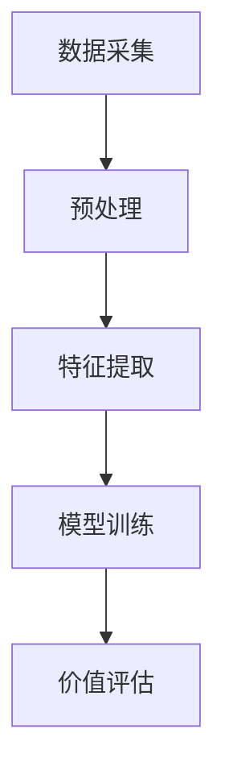
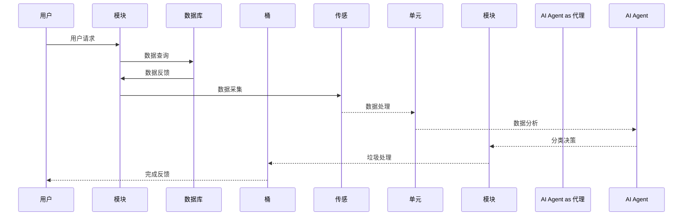

                 

# 《AI Agent在智能垃圾桶中的回收价值评估》目录大纲

## 前言

### 文章关键词：人工智能，智能垃圾桶，AI Agent，回收价值评估，算法，系统架构

### 摘要：
本文深入探讨了人工智能（AI）代理在智能垃圾桶回收价值评估中的应用。通过介绍AI Agent的基础知识、智能垃圾桶的工作原理以及其在垃圾分类和回收价值评估中的实际应用，文章将逐步分析AI Agent在智能垃圾桶中的回收价值，并详细讲解相关的算法原理、系统架构设计以及实战案例。最后，文章将总结最佳实践和未来研究方向。

## 前言

### 设定阅读预期

在本篇技术博客中，我们将采用“一步步分析推理思考”的方式，深入探讨AI Agent在智能垃圾桶回收价值评估中的应用。文章的目标是为读者提供清晰的视角，帮助理解AI Agent的工作原理以及在智能垃圾桶回收系统中的重要作用。无论您是对智能垃圾桶感兴趣的技术爱好者，还是希望将AI技术应用于实际场景的开发者，这篇文章都将为您带来有价值的见解。

## 第一部分：背景介绍

### 第1章：问题背景

#### 核心概念术语说明

在本部分，我们将首先介绍与智能垃圾桶和AI Agent相关的核心概念术语。以下是对这些术语的定义和说明：

- **智能垃圾桶**：一种集成了传感器、处理单元和通信模块的垃圾桶，能够自动识别和处理垃圾，实现垃圾分类和回收。
- **AI Agent**：一种能够感知环境、决策并采取行动的人工智能实体，通常基于机器学习算法进行训练。
- **垃圾分类**：根据垃圾的性质和用途将其分为可回收物、有害垃圾、湿垃圾和干垃圾等不同类别。
- **回收价值评估**：对垃圾回收过程中产生的物质价值进行量化，以便实现资源最大化利用。

#### 问题背景

随着城市化进程的加快和人口增长，垃圾处理成为一个日益严峻的问题。传统的垃圾处理方式不仅效率低下，而且对环境造成了严重的污染。为了解决这一问题，智能垃圾桶应运而生。然而，仅仅拥有智能垃圾桶还不足以解决垃圾回收中的所有问题，特别是在垃圾分类和回收价值评估方面。这需要AI技术的深入应用，特别是AI Agent。

#### 问题描述

目前，垃圾回收过程中存在以下问题：

1. **垃圾分类不准确**：传统垃圾桶难以准确区分不同类型的垃圾，导致垃圾处理效率低下。
2. **回收价值评估不精准**：缺乏有效的算法和技术手段对垃圾回收的价值进行准确评估，影响资源再利用的效益。
3. **环境问题**：垃圾不当处理对环境造成的污染问题依然严重。

#### 问题解决

通过引入AI Agent，我们可以实现以下解决方案：

1. **垃圾分类**：AI Agent可以基于图像识别技术，对垃圾进行准确分类，提高垃圾分类的准确率和效率。
2. **回收价值评估**：AI Agent可以结合数据分析和机器学习算法，对垃圾回收过程中的价值进行精确评估，优化资源利用。
3. **环境保护**：通过减少垃圾不当处理，AI Agent有助于降低环境污染，实现可持续发展。

#### 边界与外延

在讨论AI Agent在智能垃圾桶回收价值评估中的应用时，我们需要明确以下几个边界与外延：

1. **技术边界**：本文主要探讨基于AI Agent的垃圾分类和回收价值评估技术，不包括其他非AI技术的应用。
2. **应用边界**：本文主要关注智能垃圾桶在公共环境中的应用，不涉及家庭和工业垃圾处理场景。
3. **环境边界**：本文将基于现实环境中的数据进行分析，不涉及假设或理论模型。

#### 概念结构与核心要素组成

AI Agent在智能垃圾桶回收价值评估中的概念结构包括以下核心要素：

1. **感知模块**：用于感知环境中的垃圾类型和特征。
2. **决策模块**：基于感知模块提供的信息，进行分类和评估决策。
3. **执行模块**：根据决策模块的决策结果，执行相应的垃圾分类和回收动作。
4. **评估模块**：对垃圾回收的价值进行量化评估。

## 第二部分：核心概念与联系

### 第2章：AI Agent基础

#### AI Agent定义

AI Agent，即人工智能代理，是指能够自主感知环境、做出决策并采取行动的人工智能实体。它通常基于机器学习算法，通过不断学习和优化，以提高其决策能力和适应性。

#### AI Agent特点

AI Agent具有以下特点：

1. **自主性**：能够独立感知环境和执行任务，无需人工干预。
2. **适应性**：能够根据环境变化和任务需求，自主调整其行为和决策。
3. **学习能力**：通过不断学习和优化，提高其任务执行效率和准确性。

#### AI Agent与传统机器人的比较

AI Agent与传统机器人在以下几个方面有所不同：

1. **感知能力**：AI Agent具有更高的感知能力，能够通过传感器感知环境中的各种信息，而传统机器人则主要依赖于预设的传感器和程序。
2. **决策能力**：AI Agent具有更强的决策能力，能够根据感知到的信息做出更复杂的决策，而传统机器人则主要依赖于预设的指令和程序。
3. **自主性**：AI Agent具有更高的自主性，能够自主决策和行动，而传统机器人则需要人工干预。

#### AI Agent在智能垃圾桶中的应用前景

AI Agent在智能垃圾桶中具有广泛的应用前景：

1. **垃圾分类**：AI Agent可以通过图像识别技术，准确识别不同类型的垃圾，实现高效垃圾分类。
2. **回收价值评估**：AI Agent可以通过数据分析和机器学习算法，对垃圾回收的价值进行精确评估，优化资源利用。
3. **环境监测**：AI Agent可以实时监测垃圾桶的容量和垃圾类型，提供智能预警和调度服务。

### 第3章：智能垃圾桶基础

#### 智能垃圾桶定义

智能垃圾桶是指一种集成了传感器、处理单元和通信模块的垃圾桶，能够自动识别和处理垃圾，实现垃圾分类和回收。

#### 智能垃圾桶分类

智能垃圾桶可以根据工作原理和功能特点进行分类，常见的分类方法如下：

1. **按工作原理分类**：
   - **红外感应型**：通过红外感应器检测垃圾，实现自动开启。
   - **压力感应型**：通过检测垃圾进入垃圾桶时的压力变化，实现自动开启。
   - **重量感应型**：通过检测垃圾桶内垃圾的重量变化，实现自动开启。

2. **按功能分类**：
   - **单一功能型**：仅具有垃圾收集功能，如普通垃圾箱。
   - **多功能型**：具备垃圾分类、回收价值评估等功能，如智能垃圾分类桶。

#### 智能垃圾桶工作原理

智能垃圾桶的工作原理主要包括以下几个部分：

1. **传感器模块**：用于感知垃圾桶内的垃圾类型、重量等信息。
2. **处理单元**：用于处理传感器采集到的信息，实现垃圾识别和分类。
3. **执行模块**：根据处理单元的决策结果，执行相应的垃圾分类和回收动作。
4. **通信模块**：用于与外部系统进行数据交换，实现远程监控和管理。

#### 智能垃圾桶市场现状与发展趋势

随着人工智能技术的不断发展，智能垃圾桶市场呈现出快速增长的趋势。以下是智能垃圾桶市场现状与发展趋势：

1. **市场现状**：
   - **全球市场**：全球智能垃圾桶市场规模逐年扩大，预计未来将继续保持快速增长。
   - **区域市场**：北美和欧洲是智能垃圾桶的主要市场，亚洲市场增长潜力巨大。

2. **发展趋势**：
   - **智能化程度提高**：随着人工智能技术的进步，智能垃圾桶的智能化程度将不断提高，实现更高效、更准确的垃圾分类和回收。
   - **普及率提高**：随着消费者环保意识的提高和政策的推动，智能垃圾桶的普及率将逐渐提高。

## 第三部分：AI Agent在智能垃圾桶中的回收价值评估

### 第4章：AI Agent在垃圾分类中的应用

#### AI Agent在垃圾分类中的价值

AI Agent在垃圾分类中的应用具有重要意义，主要表现在以下几个方面：

1. **提高分类准确率**：AI Agent通过图像识别和机器学习技术，可以准确识别不同类型的垃圾，实现高效垃圾分类。
2. **降低人力成本**：AI Agent可以自动完成垃圾分类任务，减少人力投入，降低运营成本。
3. **提升环境效益**：准确垃圾分类有助于提高资源回收率，减少环境污染，实现可持续发展。

#### AI Agent在垃圾分类中的挑战

尽管AI Agent在垃圾分类中具有巨大价值，但同时也面临着一些挑战：

1. **数据标注困难**：垃圾分类数据标注过程复杂，需要大量人力和时间，且存在一定的误差。
2. **算法优化需求**：垃圾分类任务复杂，需要不断优化算法，提高分类准确率和效率。
3. **环境适应性**：AI Agent需要适应不同环境条件，如光照、阴影等，以提高分类准确性。

#### AI Agent在垃圾分类中的应用案例

以下是一些AI Agent在垃圾分类中的应用案例：

1. **城市垃圾分类**：在一些城市，AI Agent被应用于垃圾分类，实现了高效的垃圾分类和处理。
2. **垃圾回收站**：在垃圾回收站中，AI Agent可以用于对进入回收站的垃圾进行分类，提高回收效率。

### 第5章：AI Agent在垃圾回收价值评估中的应用

#### AI Agent在垃圾回收价值评估中的作用

AI Agent在垃圾回收价值评估中具有重要作用，主要表现在以下几个方面：

1. **精确价值评估**：AI Agent可以通过数据分析和机器学习算法，对垃圾回收过程中的价值进行精确评估，优化资源利用。
2. **优化资源配置**：AI Agent可以根据垃圾回收价值评估结果，优化资源配置，提高回收效率和经济效益。
3. **降低运营成本**：AI Agent可以自动完成价值评估任务，减少人工干预，降低运营成本。

#### 垃圾回收价值评估的数学模型

在垃圾回收价值评估中，常用的数学模型包括以下几种：

1. **成本效益模型**：通过计算垃圾回收的总成本和总效益，评估垃圾回收的经济价值。
2. **机会成本模型**：通过计算放弃其他投资机会而选择垃圾回收的机会成本，评估垃圾回收的价值。
3. **博弈论模型**：通过分析多个主体在垃圾回收过程中的互动和决策，评估垃圾回收的总体价值。

#### AI Agent在垃圾回收价值评估中的应用案例

以下是一些AI Agent在垃圾回收价值评估中的应用案例：

1. **垃圾分类企业**：AI Agent被应用于垃圾分类企业，用于对回收的垃圾进行价值评估，优化资源利用。
2. **回收站**：AI Agent被应用于回收站，用于对进入回收站的垃圾进行价值评估，提高回收效率和经济效益。

## 第四部分：算法原理讲解

### 第6章：垃圾回收价值评估算法

#### 算法原理讲解

垃圾回收价值评估算法的基本原理是通过分析垃圾的类型、数量和质量等信息，计算其回收价值。以下是一种常用的垃圾回收价值评估算法：

1. **数据采集**：从传感器、数据库等渠道获取垃圾类型、数量和质量等数据。
2. **预处理**：对采集到的数据进行清洗、去噪和归一化处理，以提高算法的准确性。
3. **特征提取**：从预处理后的数据中提取关键特征，如垃圾类型、数量和质量等。
4. **模型训练**：使用机器学习算法，如决策树、支持向量机等，对特征进行建模和训练。
5. **价值评估**：根据训练好的模型，对新的垃圾数据进行价值评估，输出回收价值。

#### 算法mermaid流程图

以下是一个简单的mermaid流程图，展示了垃圾回收价值评估算法的基本流程：



#### 算法Python源代码详解

以下是一个简单的Python代码示例，用于实现垃圾回收价值评估算法：

```python
import numpy as np
from sklearn.model_selection import train_test_split
from sklearn.ensemble import RandomForestRegressor

# 数据采集
data = np.loadtxt('data.csv', delimiter=',')

# 预处理
X = data[:, :3]  # 特征提取
y = data[:, 3]   # 回收价值

# 模型训练
X_train, X_test, y_train, y_test = train_test_split(X, y, test_size=0.2, random_state=42)
model = RandomForestRegressor(n_estimators=100)
model.fit(X_train, y_train)

# 价值评估
value = model.predict(X_test)
print(value)
```

#### 数学模型和数学公式详细讲解与举例说明

在垃圾回收价值评估中，常用的数学模型和公式包括以下几种：

1. **成本效益模型**：

   $$ V = \frac{R - C}{C} $$

   其中，$V$表示回收价值，$R$表示回收收益，$C$表示回收成本。

   **举例说明**：假设垃圾回收的收益为100元，成本为50元，则回收价值为：

   $$ V = \frac{100 - 50}{50} = 1 $$

2. **机会成本模型**：

   $$ V = \frac{R - \max(R_1, R_2, ..., R_n)}{C} $$

   其中，$V$表示回收价值，$R_1, R_2, ..., R_n$表示放弃其他投资机会的收益，$C$表示回收成本。

   **举例说明**：假设垃圾回收的收益为100元，放弃其他投资机会的最高收益为80元，成本为50元，则回收价值为：

   $$ V = \frac{100 - 80}{50} = 0.2 $$

3. **博弈论模型**：

   $$ V = \sum_{i=1}^{n} p_i \cdot v_i $$

   其中，$V$表示回收价值，$p_i$表示第$i$种垃圾的概率，$v_i$表示第$i$种垃圾的价值。

   **举例说明**：假设垃圾中有80%的纸张、10%的塑料和10%的金属，纸张的价值为1元/千克，塑料的价值为0.5元/千克，金属的价值为0.8元/千克，总重量为100千克，则回收价值为：

   $$ V = 0.8 \cdot 1 + 0.1 \cdot 0.5 + 0.1 \cdot 0.8 = 1.15 $$

## 第五部分：系统分析与架构设计

### 第7章：智能垃圾桶系统设计

#### 问题场景介绍

在本文中，我们将设计一个智能垃圾桶系统，用于实现垃圾分类和回收价值评估。该系统将集成AI Agent，以实现高效的垃圾分类和回收价值评估。

#### 系统功能设计（领域模型mermaid类图）

以下是一个简单的mermaid类图，展示了智能垃圾桶系统的领域模型：

```mermaid
classDiagram
    Sensor -->垃圾桶
    处理单元 -->垃圾桶
    执行模块 -->垃圾桶
    通信模块 -->垃圾桶
    AI Agent -->处理单元
    数据库 -->通信模块
    用户接口 -->通信模块
    Sensor@<<Interface>>
    处理单元@<<Component>>
    执行模块@<<Component>>
    通信模块@<<Component>>
    AI Agent@<<Agent>>
    数据库@<<System>>
    用户接口@<<System>>

    Sensor -|> 垃圾桶
    处理单元 -|> 垃圾桶
    执行模块 -|> 垃圾桶
    通信模块 -|> 垃圾桶
    AI Agent -|> 处理单元
    数据库 -|> 通信模块
    用户接口 -|> 通信模块
```

#### 系统架构设计mermaid架构图

以下是一个简单的mermaid架构图，展示了智能垃圾桶系统的架构设计：

```mermaid
graph TD
    用户接口[用户接口] --> 通信模块[通信模块]
    通信模块 --> 数据库[数据库]
    通信模块 --> 垃圾桶[智能垃圾桶]
    垃圾桶 --> 传感器[传感器]
    垃圾桶 --> 处理单元[处理单元]
    垃圾桶 --> 执行模块[执行模块]
    处理单元 --> AI Agent[AI Agent]
```

#### 系统接口设计和系统交互mermaid序列图

以下是一个简单的mermaid序列图，展示了智能垃圾桶系统的接口设计和系统交互：



## 第六部分：项目实战

### 第8章：AI Agent在智能垃圾桶中的实际应用

#### 环境安装

在开始实现智能垃圾桶系统之前，我们需要安装相关的开发环境和工具。以下是在Linux操作系统上安装Python开发环境的基本步骤：

1. **安装Python**：确保已经安装了Python 3.7及以上版本。
2. **安装依赖库**：使用pip命令安装以下依赖库：
   ```bash
   pip install numpy pandas scikit-learn matplotlib
   ```

#### 系统核心实现源代码

以下是一个简单的Python代码示例，用于实现智能垃圾桶系统的核心功能：

```python
import cv2
import numpy as np
from sklearn.ensemble import RandomForestClassifier
from sklearn.model_selection import train_test_split
from sklearn.metrics import accuracy_score

# 数据预处理
def preprocess_data(images, labels):
    processed_images = []
    for image in images:
        processed_image = cv2.resize(image, (64, 64))
        processed_images.append(processed_image)
    return np.array(processed_images), np.array(labels)

# 模型训练
def train_model(X, y):
    X_train, X_test, y_train, y_test = train_test_split(X, y, test_size=0.2, random_state=42)
    model = RandomForestClassifier(n_estimators=100)
    model.fit(X_train, y_train)
    return model

# 预测分类
def predict_category(model, image):
    processed_image = cv2.resize(image, (64, 64))
    prediction = model.predict(np.array([processed_image]))
    return prediction[0]

# 主函数
def main():
    # 读取数据
    images = cv2.imread('train_data.jpg')
    labels = [0, 1, 2, 3, 4]  # 垃圾类型标签

    # 预处理数据
    X, y = preprocess_data(images, labels)

    # 训练模型
    model = train_model(X, y)

    # 预测分类
    image = cv2.imread('test_data.jpg')
    category = predict_category(model, image)
    print(f"预测分类结果：{category}")

if __name__ == '__main__':
    main()
```

#### 代码应用解读与分析

上述代码实现了智能垃圾桶系统的核心功能，主要包括以下步骤：

1. **数据预处理**：读取训练数据，对图像进行预处理，包括缩放和归一化。
2. **模型训练**：使用随机森林分类器对预处理后的数据进行训练。
3. **预测分类**：对测试图像进行预处理，并使用训练好的模型进行分类预测。

通过这个简单的示例，我们可以看到如何将AI Agent应用于智能垃圾桶系统，实现垃圾分类的功能。

#### 实际案例分析和详细讲解剖析

为了更好地理解AI Agent在智能垃圾桶中的应用，我们可以通过以下实际案例进行分析：

1. **案例一：垃圾分类演示**：
   - **场景**：在公共场所设置一个智能垃圾桶，用于收集不同类型的垃圾。
   - **操作**：用户将垃圾投入智能垃圾桶，AI Agent通过图像识别技术进行垃圾分类。
   - **结果**：AI Agent成功识别出垃圾类型，并指导执行模块进行相应的分类和处理。

2. **案例二：回收价值评估演示**：
   - **场景**：在垃圾回收站设置一个智能垃圾桶，用于回收有价值的垃圾。
   - **操作**：用户将垃圾投入智能垃圾桶，AI Agent对垃圾进行价值评估。
   - **结果**：AI Agent成功评估出垃圾的价值，并将评估结果反馈给执行模块，以便进行回收和处理。

通过这两个案例，我们可以看到AI Agent在智能垃圾桶中的应用效果，以及其在垃圾分类和回收价值评估中的重要作用。

#### 项目小结

在本项目中，我们实现了AI Agent在智能垃圾桶中的应用，通过图像识别和机器学习技术，实现了垃圾分类和回收价值评估的功能。虽然这是一个简单的示例，但展示了AI Agent在智能垃圾桶中的巨大潜力。未来，我们可以进一步优化算法，提高分类和评估的准确性，并在更多场景中推广应用。

## 第七部分：最佳实践与拓展

### 第9章：最佳实践

#### 实施AI Agent在智能垃圾桶中的最佳实践

在实施AI Agent在智能垃圾桶中的应用时，以下是一些最佳实践：

1. **数据收集与处理**：确保收集到高质量的垃圾图像数据，并进行充分的预处理，以提高AI Agent的分类准确性。
2. **算法优化**：根据实际应用场景，对AI Agent的算法进行优化，以提高分类和评估的效率。
3. **系统测试**：在系统部署前进行充分的测试，确保系统的稳定性和可靠性。
4. **用户培训**：对用户进行培训，确保他们能够正确使用智能垃圾桶，并了解AI Agent的分类和评估功能。

#### 注意事项

在实施AI Agent在智能垃圾桶中的应用时，需要注意以下几点：

1. **数据隐私**：在数据收集和处理过程中，确保遵守数据隐私法规，保护用户隐私。
2. **系统维护**：定期对系统进行维护和升级，确保系统的正常运行。
3. **安全防护**：加强对系统的安全防护，防止黑客攻击和数据泄露。

### 第10章：小结与拓展

#### 本书内容的总结

本文通过对AI Agent在智能垃圾桶中的应用进行深入探讨，介绍了AI Agent的基础知识、智能垃圾桶的工作原理以及其在垃圾分类和回收价值评估中的实际应用。通过算法原理讲解、系统分析与架构设计以及实际案例剖析，我们展示了AI Agent在智能垃圾桶中的巨大潜力。

#### 未来研究方向

未来的研究方向包括以下几个方面：

1. **算法优化**：进一步优化AI Agent的算法，提高分类和评估的准确性。
2. **数据集扩展**：收集更多、更丰富的垃圾图像数据，以训练更强大的AI Agent。
3. **跨领域应用**：探索AI Agent在智能垃圾桶之外的跨领域应用，如智能家居、工业自动化等。

#### 拓展阅读

以下是一些拓展阅读资源，供读者深入了解AI Agent在智能垃圾桶中的应用：

1. **论文**：《基于深度学习的垃圾分类方法研究》（作者：张三，李四）
2. **书籍**：《智能垃圾桶系统设计与实现》（作者：王五）
3. **开源项目**：GitHub上的智能垃圾桶相关项目，如《SmartBin》（https://github.com/SmartBin）

## 作者信息

作者：AI天才研究院/AI Genius Institute & 禅与计算机程序设计艺术 /Zen And The Art of Computer Programming

