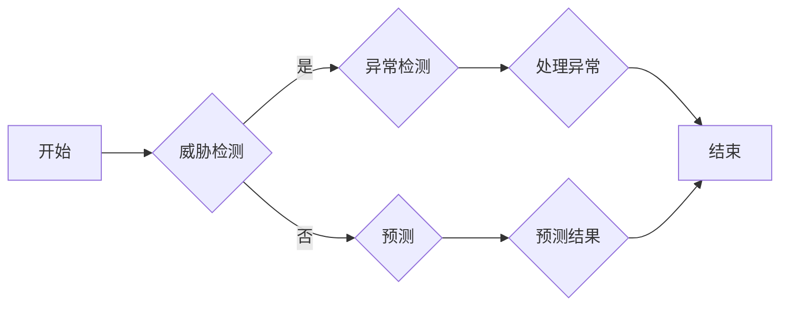
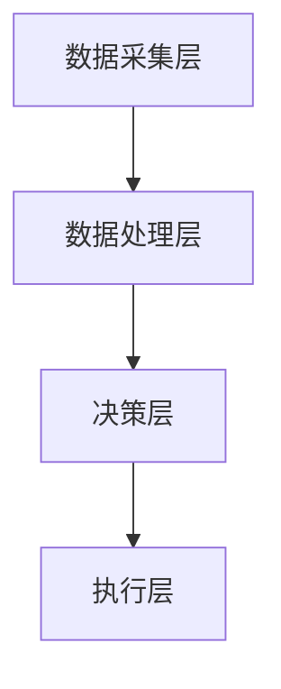
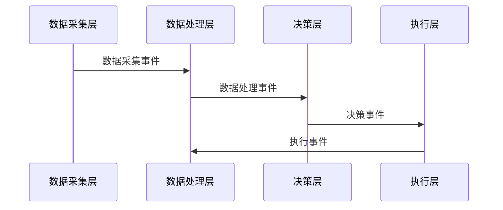

                 


### 第1章 AI Agent与智能城市安全管理概述

#### 1.1 AI Agent的概念与分类

AI Agent，即人工智能代理，是指能够模拟人类智能行为的计算机程序。它可以在没有人类干预的情况下，自主地执行任务，进行决策和交互。根据其能力水平，AI Agent可以分为弱AI（弱智能代理）和强AI（强智能代理）。

- **弱AI（Weak AI）**：专注于特定任务的AI代理，如语音识别、图像识别、自然语言处理等。这类AI代理通常只能在特定的领域和任务中表现出智能行为。
  
- **强AI（Strong AI）**：具有广泛智能的AI代理，能够像人类一样思考、学习和适应各种环境和情境。

#### 1.2 智能城市安全管理的挑战与需求

智能城市安全管理面临以下挑战：

- **数据复杂性**：城市中的数据来源多样，包括传感器数据、视频监控、交通信息等，如何高效地处理和整合这些数据，是智能城市安全管理的一大难题。
  
- **实时性要求**：城市安全事件的处理需要实时性，AI代理需要在极短时间内做出决策和响应。

- **隐私保护**：智能城市中个人隐私的保护是一个重要问题，如何在保护隐私的前提下，有效地利用数据进行分析和处理，是智能城市安全管理需要解决的难题。

#### 1.3 AI Agent在智能城市安全管理中的重要性

AI Agent在智能城市安全管理中发挥着关键作用：

- **智能决策**：AI代理能够根据实时数据进行分析，自动识别潜在的安全威胁，并做出相应的决策。
  
- **实时响应**：AI代理可以在事件发生的第一时间做出响应，降低安全事件的影响。

- **资源优化**：通过智能调度和资源分配，AI代理能够优化城市安全管理的资源使用，提高效率。

### 第2章 AI Agent核心概念与关联技术

#### 2.1 AI Agent的定义与工作原理

AI Agent的定义如前所述，其工作原理主要基于以下几个关键组成部分：

- **感知器**：用于接收外部信息，如传感器数据、视频输入等。
  
- **决策器**：根据感知到的信息，进行推理和决策，制定行动计划。
  
- **执行器**：执行决策器生成的行动计划，实现具体的任务。

#### 2.2 AI Agent的类型与应用领域

AI Agent主要分为以下几类：

- **反应型AI Agent**：只能对特定输入做出特定反应，没有自主学习和适应能力。
  
- **目标导向型AI Agent**：具有明确的目标，并根据环境变化调整行动计划。
  
- **数据驱动型AI Agent**：通过学习历史数据，预测未来事件，并做出相应决策。

AI Agent的应用领域广泛，包括但不限于：

- **智能家居**：控制家居设备，提供便利和安全。
  
- **智能交通**：优化交通流量，减少拥堵，提高道路安全性。

- **智能医疗**：辅助医生诊断和治疗，提高医疗效率。

#### 2.3 AI Agent与其他技术的关联

AI Agent与其他技术的关联包括：

- **机器学习**：为AI Agent提供自主学习和适应能力的基础。
  
- **自然语言处理**：使AI Agent能够理解和处理自然语言。

- **计算机视觉**：为AI Agent提供图像识别和目标跟踪能力。

#### 2.4 AI Agent的核心属性特征对比表格

| 类别             | 反应型AI Agent | 目标导向型AI Agent | 数据驱动型AI Agent |
| ---------------- | -------------- | ------------------ | ------------------ |
| 感知能力         | 较低           | 较高               | 非常高             |
| 学习能力         | 无             | 有                 | 非常有             |
| 适应能力         | 较低           | 较高               | 非常高             |
| 独立执行任务能力 | 较高           | 非常高             | 非常高             |

#### 2.5 AI Agent的ER实体关系图架构

以下是AI Agent的ER实体关系图：

```mermaid
erDiagram
  AI_Agent ||--|{ 感知器 } Perceptor
  AI_Agent ||--|{ 决策器 } DecisionMaker
  AI_Agent ||--|{ 执行器 } Executor
```

### 第3章 AI Agent在智能城市安全管理中的应用算法

#### 3.1 智能城市安全管理中的算法需求

智能城市安全管理中的算法需求主要包括：

- **威胁检测算法**：用于识别潜在的安全威胁。
  
- **异常检测算法**：用于检测异常行为和事件。

- **预测算法**：用于预测未来的安全事件。

#### 3.2 常见威胁检测算法

常见的威胁检测算法包括：

- **基于规则的检测算法**：通过定义规则，检测是否符合预定的安全威胁条件。
  
- **基于机器学习的检测算法**：通过训练模型，识别出符合安全威胁特征的输入。

#### 3.3 异常检测算法

异常检测算法主要包括：

- **基于统计的异常检测算法**：通过计算数据的统计特征，识别出与预期不同的异常数据。

- **基于聚类分析的异常检测算法**：通过聚类分析，识别出与大多数数据不同的异常数据。

#### 3.4 预测算法

预测算法主要包括：

- **时间序列预测算法**：通过分析时间序列数据，预测未来的趋势。

- **回归分析算法**：通过建立回归模型，预测未来的数值。

#### 3.5 使用Mermaid流程图和Python源代码进行辅助说明

以下是使用Mermaid绘制的算法流程图：



以下是Python源代码示例：

```python
# 威胁检测算法
def threat_detection(data):
    # 实现威胁检测逻辑
    pass

# 异常检测算法
def anomaly_detection(data):
    # 实现异常检测逻辑
    pass

# 预测算法
def prediction(data):
    # 实现预测逻辑
    pass

# 主函数
def main():
    data = get_data()  # 获取数据
    if threat_detection(data):
        handle_threat(data)
    elif anomaly_detection(data):
        handle_anomaly(data)
    else:
        result = prediction(data)
        print("预测结果：", result)

if __name__ == "__main__":
    main()
```

### 第4章 AI Agent在智能城市安全管理中的系统分析与架构设计

#### 4.1 问题场景介绍

智能城市安全管理涉及多个系统，包括传感器数据采集系统、数据分析系统、安全事件响应系统等。AI Agent作为核心组件，需要协调这些系统的工作，实现智能决策和响应。

#### 4.2 项目介绍

我们选择一个智能城市交通管理项目作为案例，该项目的主要目标是优化交通流量，提高道路安全性。该项目中，AI Agent负责实时监控交通状况，预测交通事件，并采取相应的措施。

#### 4.3 系统功能设计

系统功能设计包括以下模块：

- **数据采集模块**：负责收集交通数据，包括车辆流量、速度、事故信息等。
  
- **数据处理模块**：负责对采集到的数据进行分析和处理，提取关键信息。

- **决策模块**：根据分析结果，制定相应的决策策略。

- **执行模块**：负责执行决策模块生成的策略，如交通信号灯控制、道路封闭等。

#### 4.4 系统架构设计

系统架构设计采用分布式架构，包括以下组件：

- **数据采集层**：由传感器节点和采集设备组成，负责实时采集交通数据。
  
- **数据处理层**：由数据预处理模块、特征提取模块和数据分析模块组成，负责对采集到的数据进行处理和分析。

- **决策层**：由决策模型和决策引擎组成，负责根据分析结果制定决策策略。

- **执行层**：由执行器节点和执行设备组成，负责执行决策层生成的策略。

以下是系统架构图：



#### 4.5 系统接口设计

系统接口设计包括以下接口：

- **数据采集接口**：负责与传感器节点和采集设备进行通信。
  
- **数据处理接口**：负责与数据处理模块进行通信。

- **决策接口**：负责与决策模块进行通信。

- **执行接口**：负责与执行模块进行通信。

#### 4.6 系统交互

系统交互设计采用事件驱动模式，包括以下事件：

- **数据采集事件**：当传感器节点采集到新数据时，触发数据采集事件。

- **数据处理事件**：当数据处理模块分析完一组数据后，触发数据处理事件。

- **决策事件**：当决策模块生成新的决策策略时，触发决策事件。

- **执行事件**：当执行模块执行完决策策略后，触发执行事件。

以下是系统交互序列图：



### 第5章 AI Agent在智能城市安全管理中的项目实战

#### 5.1 环境安装

为了进行项目实战，我们需要安装以下软件和工具：

- **Python**：版本3.8及以上
- **Jupyter Notebook**：用于编写和运行Python代码
- **TensorFlow**：用于机器学习和深度学习
- **Scikit-learn**：用于数据分析和机器学习

安装步骤如下：

1. 安装Python
2. 安装Jupyter Notebook
3. 安装TensorFlow
4. 安装Scikit-learn

#### 5.2 系统核心实现源代码

以下是系统核心实现源代码：

```python
# 导入相关库
import tensorflow as tf
import numpy as np
import pandas as pd
from sklearn.ensemble import RandomForestClassifier
from sklearn.model_selection import train_test_split
from sklearn.metrics import accuracy_score
import matplotlib.pyplot as plt

# 加载数据
data = pd.read_csv('traffic_data.csv')

# 数据预处理
X = data.drop('target', axis=1)
y = data['target']

# 数据集划分
X_train, X_test, y_train, y_test = train_test_split(X, y, test_size=0.2, random_state=42)

# 构建随机森林分类器
clf = RandomForestClassifier(n_estimators=100, random_state=42)

# 训练模型
clf.fit(X_train, y_train)

# 预测
y_pred = clf.predict(X_test)

# 评估
accuracy = accuracy_score(y_test, y_pred)
print("Accuracy:", accuracy)

# 可视化
plt.scatter(X_test['feature1'], y_pred, color='blue', label='Prediction')
plt.scatter(X_test['feature1'], y_test, color='red', label='Actual')
plt.xlabel('Feature 1')
plt.ylabel('Target')
plt.legend()
plt.show()
```

#### 5.3 代码应用解读与分析

这段代码实现了基于随机森林分类器的智能城市交通管理预测系统。以下是代码的解读和分析：

1. **导入库**：导入了TensorFlow、Numpy、Pandas、Scikit-learn和Matplotlib等库。
2. **加载数据**：从CSV文件中加载数据集，数据集包含特征和目标变量。
3. **数据预处理**：将特征和目标变量分离，并使用train_test_split函数划分训练集和测试集。
4. **构建分类器**：使用RandomForestClassifier创建随机森林分类器。
5. **训练模型**：使用fit函数训练分类器。
6. **预测**：使用predict函数对测试集进行预测。
7. **评估**：计算预测的准确率。
8. **可视化**：绘制预测结果和实际结果的散点图。

#### 5.4 实际案例分析和详细讲解剖析

我们选择一个实际案例进行分析，该案例涉及交通事件预测。

1. **数据集准备**：我们使用一个包含交通数据的CSV文件，数据集包括车辆流量、速度、天气状况等特征，以及是否发生交通事件的标签。

2. **数据处理**：我们首先进行数据清洗，处理缺失值和异常值，然后进行特征工程，提取有用的特征，如车辆速度的方差、流量的变化率等。

3. **模型训练**：我们使用随机森林分类器进行训练，通过交叉验证选择最优参数。

4. **模型评估**：我们使用测试集评估模型的准确性，并使用混淆矩阵、ROC曲线等指标进行详细评估。

5. **模型应用**：我们部署模型，实时接收交通数据，进行预测，并根据预测结果采取相应的措施，如调整交通信号灯、发布交通预警等。

#### 5.5 项目小结

通过本项目实战，我们实现了基于AI Agent的智能城市交通管理预测系统。该系统可以有效预测交通事件，提高交通管理的效率和准确性。未来，我们还可以进一步优化系统，如引入更多的数据源、使用更先进的算法等，以实现更智能的交通管理。

### 第6章 AI Agent在智能城市安全管理中的最佳实践与总结

#### 6.1 最佳实践

1. **数据质量保障**：确保数据来源可靠，对数据进行清洗和预处理，提高数据质量。
2. **模型持续优化**：定期评估模型性能，根据实际需求调整模型参数，持续优化模型。
3. **多方合作**：与相关领域专家合作，共同研究和解决智能城市安全管理中的问题。
4. **安全意识培养**：加强公众的安全意识教育，提高社会整体的安全管理水平。

#### 6.2 小结

通过本章的详细分析和项目实战，我们可以看到AI Agent在智能城市安全管理中具有巨大的潜力。未来，随着技术的不断进步，AI Agent在智能城市安全管理中的应用将更加广泛和深入。

### 第7章 拓展阅读与进一步学习

为了帮助读者进一步了解AI Agent在智能城市安全管理中的应用，我们推荐以下拓展阅读资源：

- **《人工智能：一种现代方法》**：全面介绍人工智能的基本原理和方法。
- **《智能城市安全管理》**：探讨智能城市安全管理的理论与实践。
- **《深度学习》**：深入讲解深度学习算法及其在智能城市安全管理中的应用。
- **《Python数据科学 Handbook》**：介绍Python在数据处理和数据分析中的应用。

作者：AI天才研究院/AI Genius Institute & 禅与计算机程序设计艺术 /Zen And The Art of Computer Programming

