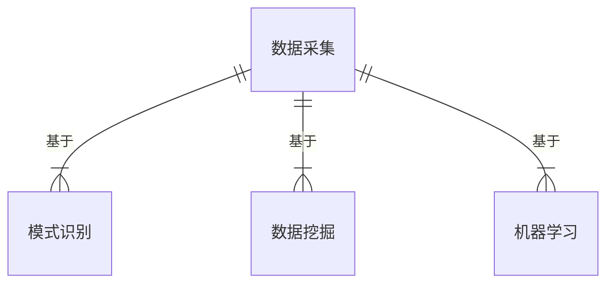
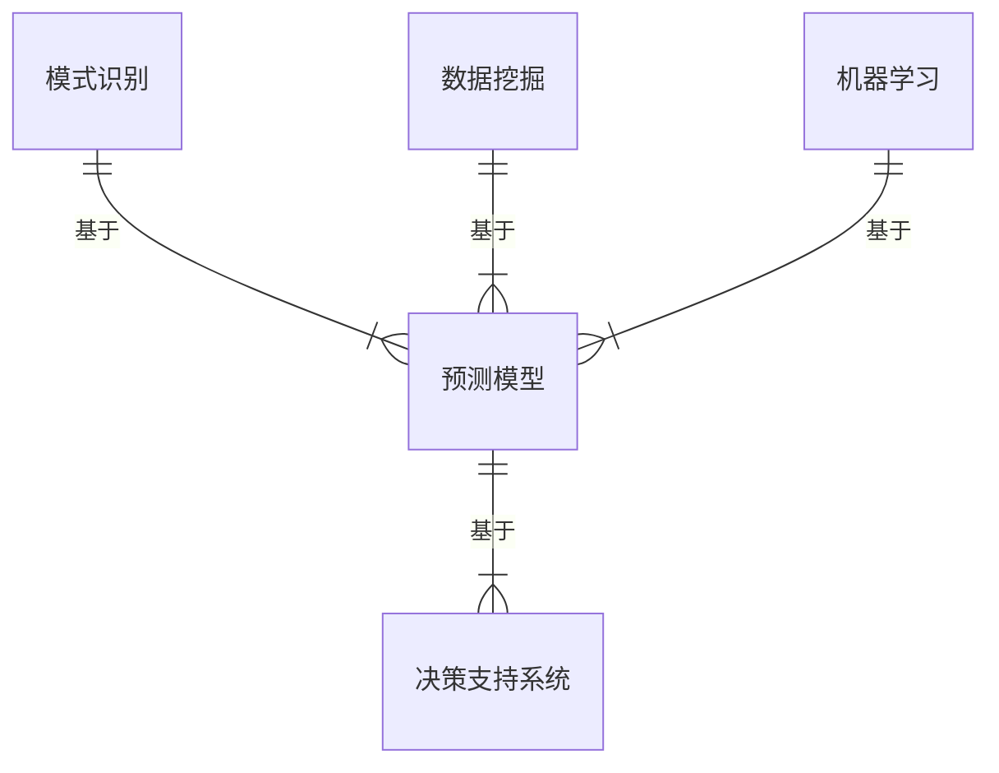

                 


### 1.6 AI Agent概述

#### 1.6.1 AI Agent的定义

AI Agent，即人工智能代理，是一个能够自主地感知环境、根据目标和计划采取行动并与其他代理进行交互的智能实体。它不仅仅是一个简单的程序，而是一个具有自主意识和决策能力的系统。AI Agent的核心特征在于其自主性、智能性、适应性和社会性。

自主性意味着AI Agent能够自主地执行任务，不需要人工干预。智能性指的是AI Agent能够理解环境、分析数据并做出合理的决策。适应性是指AI Agent能够根据环境变化调整自身的行为策略。社会性则意味着AI Agent能够与人类或其他AI Agent进行有效的沟通和协作。

#### 1.6.2 AI Agent的类型

AI Agent可以根据其功能和目标进行分类。主要的AI Agent类型包括：

- 监视Agent：负责持续监控环境，收集数据并进行分析。
- 目标导向Agent：以完成特定任务为目标，自主执行行动。
- 协作Agent：与其他AI Agent或人类协作，共同完成复杂任务。
- 对抗Agent：在竞争环境中，与其他Agent进行策略对抗，以实现自身目标。

每种类型的AI Agent都有其特定的应用场景和优势。

#### 1.6.3 AI Agent的关键特性

AI Agent的关键特性包括：

- 自主决策：AI Agent可以根据感知到的环境和目标，自主地做出决策。
- 学习能力：AI Agent能够通过学习和经验改进自身的决策能力。
- 模式识别：AI Agent能够识别环境中的模式，为决策提供依据。
- 交互能力：AI Agent能够与人类或其他AI Agent进行有效交互。
- 适应能力：AI Agent能够适应环境变化，调整自身行为策略。

#### 1.6.4 AI Agent的发展历程

AI Agent的发展历程可以分为几个阶段：

- 早期探索（1950-1970）：AI Agent的概念被首次提出，简单的AI Agent被设计出来。
- 人工智能热潮（1980-1990）：AI Agent的应用范围扩大，但受到技术限制，应用效果有限。
- 现代人工智能（2000-至今）：随着深度学习和大数据技术的发展，AI Agent的能力得到显著提升，应用场景更加广泛。

### 1.7 智能城市应急指挥概述

#### 1.7.1 智能城市应急指挥的定义

智能城市应急指挥是指通过信息化技术和人工智能技术，对城市突发事件进行快速、精准的响应和指挥，以最大限度地减少事故损失和影响。它包括事件监测、信息收集、决策支持、资源调配、现场指挥等多个环节。

#### 1.7.2 智能城市应急指挥的重要性

智能城市应急指挥的重要性体现在以下几个方面：

- 提高应急响应速度：智能城市应急指挥系统能够快速收集和处理信息，为决策提供支持，从而提高应急响应速度。
- 提高应急决策质量：智能城市应急指挥系统能够基于数据分析和模型预测，提供高质量的决策支持，降低决策风险。
- 减轻人力资源压力：智能城市应急指挥系统能够自动化执行部分任务，减轻人力资源的压力。
- 提高应急资源利用率：智能城市应急指挥系统能够优化资源调配，提高应急资源的利用效率。

#### 1.7.3 智能城市应急指挥的现状与挑战

智能城市应急指挥的现状：

- 技术成熟度：随着人工智能技术的发展，智能城市应急指挥系统的技术水平得到显著提升。
- 应用范围：智能城市应急指挥系统在许多城市得到广泛应用，但应用效果因城市而异。
- 标准化程度：智能城市应急指挥系统的标准化程度尚需提高，不同系统之间的兼容性和互操作性有待加强。

智能城市应急指挥的挑战：

- 数据安全与隐私保护：应急指挥系统需要处理大量的敏感数据，如何保证数据安全和隐私保护是面临的一大挑战。
- 系统可靠性：应急指挥系统需要能够在突发事件中稳定运行，如何提高系统的可靠性是当前的一大难题。
- 交互与协同：应急指挥系统需要与多个部门和人员进行交互和协同，如何实现高效、稳定的交互与协同是当前的一大挑战。

### 1.8 AI Agent在智能城市应急指挥中的应用场景

#### 1.8.1 数据采集与处理

AI Agent在智能城市应急指挥中的应用场景之一是数据采集与处理。AI Agent可以通过传感器、摄像头、社交网络等多种途径收集数据，如环境监测数据、交通流量数据、社交媒体数据等。然后，AI Agent可以利用数据预处理技术，如数据清洗、数据整合等，将原始数据进行处理，使其能够被分析和利用。

**核心概念与联系**：

- 数据采集：AI Agent通过传感器、摄像头等设备收集数据。
- 数据预处理：AI Agent对收集到的数据进行清洗、整合等处理，使其适合分析和利用。

**ER实体关系图架构**：

```mermaid
erDiagram
    数据采集 <<|-- 数据预处理 : "处理"
```

#### 1.8.2 情报分析

AI Agent在智能城市应急指挥中的应用场景之二是情报分析。通过分析收集到的数据，AI Agent能够发现潜在的风险和威胁，为决策提供支持。情报分析的方法和技术包括模式识别、数据挖掘、机器学习等。

**核心概念与联系**：

- 模式识别：AI Agent通过分析数据，识别出潜在的规律和模式。
- 数据挖掘：AI Agent通过数据挖掘技术，发现数据中的隐藏信息和知识。
- 机器学习：AI Agent利用机器学习算法，从数据中学习并提取特征。

**ER实体关系图架构**：



#### 1.8.3 预测与决策支持

AI Agent在智能城市应急指挥中的应用场景之三是预测与决策支持。通过建立预测模型，AI Agent能够预测突发事件的发展趋势和可能的影响，为决策提供支持。决策支持系统则是基于预测模型和数据分析，为决策者提供决策建议。

**核心概念与联系**：

- 预测模型：AI Agent建立预测模型，预测突发事件的发展趋势。
- 决策支持系统：基于预测模型和数据分析，为决策者提供决策建议。

**ER实体关系图架构**：



#### 1.8.4 自动响应与协调

AI Agent在智能城市应急指挥中的应用场景之四是自动响应与协调。在突发事件发生时，AI Agent可以自动采取行动，如调度资源、关闭危险区域等，并与其他AI Agent或人员进行协调，确保应急响应的效率和效果。

**核心概念与联系**：

- 自动响应：AI Agent自动采取行动，如调度资源、关闭危险区域等。
- 协调：AI Agent与其他AI Agent或人员进行协调，确保应急响应的效率和效果。

**ER实体关系图架构**：


### 1.9 AI Agent在智能城市应急指挥中的优势

#### 1.9.1 提高应急响应速度

AI Agent能够实时感知环境变化，快速收集和处理信息，为决策提供支持，从而提高应急响应速度。相比人工处理，AI Agent在处理大量数据时的效率更高，响应速度更快。

**算法原理讲解**：

- 实时感知：AI Agent通过传感器等设备实时感知环境变化。
- 数据处理：AI Agent利用数据处理算法快速分析收集到的数据。
- 决策支持：AI Agent基于数据分析结果，为决策提供实时支持。

**Mermaid流程图**：


#### 1.9.2 提高应急决策质量

AI Agent能够基于数据分析和模型预测，提供高质量的决策支持，降低决策风险。相比人工决策，AI Agent能够更全面地考虑各种因素，做出更合理的决策。

**算法原理讲解**：

- 数据分析：AI Agent对收集到的数据进行分析，提取关键信息。
- 模型预测：AI Agent建立预测模型，预测突发事件的发展趋势。
- 决策支持：AI Agent基于数据分析结果和预测模型，提供决策支持。

**Mermaid流程图**：


#### 1.9.3 减轻人力资源压力

AI Agent能够自动化执行部分任务，如数据采集、数据处理等，从而减轻人力资源的压力。这使得人力资源可以更专注于决策和协调等核心工作。

**算法原理讲解**：

- 任务自动化：AI Agent自动化执行数据采集、数据处理等任务。
- 人力资源优化：人力资源可以更专注于决策和协调等核心工作。

**Mermaid流程图**：


#### 1.9.4 提高应急资源利用率

AI Agent能够优化资源调配，提高应急资源的利用效率。通过实时监控和智能调度，AI Agent能够确保资源在关键时刻得到充分利用。

**算法原理讲解**：

- 实时监控：AI Agent实时监控资源使用情况。
- 智能调度：AI Agent根据资源使用情况，智能调度资源，确保资源在关键时刻得到充分利用。

**Mermaid流程图**：


### 1.10 AI Agent在智能城市应急指挥中的技术挑战

#### 1.10.1 数据安全与隐私保护

AI Agent在智能城市应急指挥中面临的一个技术挑战是数据安全与隐私保护。应急指挥系统需要处理大量的敏感数据，如人员位置、交通流量、医疗信息等。如何确保这些数据的安全和隐私是一个重要问题。

**解决方案**：

- 数据加密：对数据进行加密处理，确保数据在传输和存储过程中的安全。
- 访问控制：实施严格的访问控制策略，确保只有授权人员才能访问敏感数据。
- 数据脱敏：对敏感数据进行脱敏处理，确保数据在公开时不泄露敏感信息。

**案例分析**：

以某城市交通管理局的智能城市应急指挥系统为例，该系统通过数据加密和访问控制策略，确保交通流量数据的安全和隐私。同时，对数据进行分析时，对敏感数据进行脱敏处理，确保数据在公开时不泄露敏感信息。

#### 1.10.2 系统可靠性

AI Agent在智能城市应急指挥中面临的另一个技术挑战是系统可靠性。应急指挥系统需要在突发事件中稳定运行，如何确保系统的可靠性是一个重要问题。

**解决方案**：

- 系统备份：对系统进行备份，确保在系统故障时能够快速恢复。
- 容灾备份：建立容灾备份系统，确保在主系统故障时，备份系统能够接管工作。
- 自动恢复：系统设置自动恢复机制，确保在故障发生时能够自动恢复。

**案例分析**：

以某城市的智能城市应急指挥系统为例，该系统通过定期备份和容灾备份，确保系统在故障发生时能够快速恢复。同时，系统设置自动恢复机制，确保在故障发生时能够自动恢复，降低故障对应急指挥的影响。

#### 1.10.3 交互与协同

AI Agent在智能城市应急指挥中面临的另一个技术挑战是交互与协同。应急指挥系统需要与多个部门和人员进行交互和协同，如何实现高效、稳定的交互与协同是一个重要问题。

**解决方案**：

- 标准化接口：建立统一的接口标准，确保不同系统和人员之间的数据交换和协同。
- 通信协议：使用稳定的通信协议，确保数据传输的可靠性和稳定性。
- 协同平台：建立协同平台，实现多个系统和人员之间的信息共享和协同工作。

**案例分析**：

以某城市的智能城市应急指挥中心为例，该中心通过建立统一的接口标准和协同平台，实现多个系统和人员之间的信息共享和协同工作。同时，使用稳定的通信协议，确保数据传输的可靠性和稳定性。

### 1.11 本章小结

本章详细介绍了AI Agent在智能城市应急指挥中的角色。首先，我们介绍了AI Agent的定义、类型、关键特性和发展历程。然后，我们探讨了智能城市应急指挥的定义、重要性以及现状与挑战。接着，我们分析了AI Agent在智能城市应急指挥中的应用场景，包括数据采集与处理、情报分析、预测与决策支持以及自动响应与协调。最后，我们讨论了AI Agent在智能城市应急指挥中的优势和技术挑战。

通过本章的学习，我们能够更好地理解AI Agent在智能城市应急指挥中的重要作用，以及如何克服其中的技术挑战，为城市应急指挥提供更高效、更可靠的解决方案。

### 2.1 数据采集与处理

#### 2.1.1 数据来源与类型

在智能城市应急指挥中，数据采集是关键的第一步。数据来源广泛，主要包括以下几个方面：

- 传感器数据：如气象传感器、环境传感器、交通流量传感器等，这些传感器可以实时监测城市的各种参数。
- 摄像头数据：如监控摄像头、无人机摄像头等，这些摄像头可以实时捕捉城市各个角落的图像和视频。
- 社交媒体数据：如Twitter、Facebook、微信等社交媒体平台上的实时信息，这些数据可以提供关于公众情绪和事件发展的信息。
- 政府数据库：如交通管理局、消防局、医院等政府机构的数据，这些数据包括交通流量、事件报告、医疗资源等信息。

数据类型可以分为以下几类：

- 结构化数据：如数据库中的表格数据，这些数据通常是预定义的格式，易于处理和分析。
- 非结构化数据：如文本、图像、视频等，这些数据没有预定义的格式，需要通过数据预处理技术进行处理。

#### 2.1.2 数据预处理技术

数据预处理是数据采集后的重要步骤，其目的是将原始数据转换为适合分析和利用的形式。数据预处理技术包括以下几个方面：

- 数据清洗：去除数据中的噪声和错误，如删除重复记录、纠正错误值等。
- 数据整合：将来自不同来源的数据进行整合，形成一个统一的数据集。
- 数据转换：将数据转换为统一的数据格式，如将不同格式的数据转换为CSV或JSON格式。
- 数据归一化：对数据进行归一化处理，使其具有相同的比例尺或范围。

#### 2.1.3 数据融合与整合

数据融合与整合是将来自不同来源和类型的数据进行综合分析的重要手段。数据融合技术包括以下几个方面：

- 时态融合：将不同时间点的数据合并为一个整体，如将过去24小时内的交通流量数据进行融合。
- 空间融合：将不同空间区域的数据进行合并，如将城市不同区域的环境监测数据进行融合。
- 源融合：将来自不同数据源的数据进行合并，如将传感器数据和社交媒体数据进行融合。

通过数据融合与整合，可以更全面地了解城市状况，提高数据分析的准确性和效率。

### 2.2 情报分析

#### 2.2.1 情报分析的基本原理

情报分析是智能城市应急指挥中的一项重要任务，其目的是从大量数据中提取有用的信息，为决策提供支持。情报分析的基本原理包括以下几个方面：

- 数据挖掘：通过数据挖掘技术，从大量数据中提取出有用的模式和规律。
- 模式识别：通过模式识别技术，识别出数据中的异常值和关键特征。
- 预测分析：通过预测分析技术，预测未来的发展趋势和可能的风险。

情报分析的核心在于如何从海量数据中提取出有用的信息，为决策者提供高质量的情报支持。

#### 2.2.2 情报分析的方法与技术

情报分析的方法和技术多种多样，以下是一些常用的方法和技术：

- 统计分析：通过统计分析方法，对数据进行描述性分析、相关性分析和回归分析等，以发现数据中的规律和趋势。
- 机器学习：通过机器学习算法，从数据中学习并提取出有用的特征和模式。
- 情报模型：通过建立情报模型，对数据进行分析和预测，提供决策支持。
- 专家系统：通过专家系统，模拟专家的思维过程，为决策提供支持。

#### 2.2.3 情报分析的应用实例

情报分析在智能城市应急指挥中有着广泛的应用。以下是一些应用实例：

- 风险评估：通过分析历史数据和实时数据，预测城市中可能发生的安全事件，为应急准备提供支持。
- 资源调度：通过分析交通流量数据和应急资源使用情况，优化应急资源的调度和配置。
- 公众情绪分析：通过分析社交媒体数据，了解公众对突发事件的情绪反应，为应急响应提供支持。

### 2.3 预测与决策支持

#### 2.3.1 预测模型的选择与构建

在智能城市应急指挥中，预测与决策支持是关键环节。预测模型的选择与构建对于预测结果的准确性和可靠性至关重要。以下是一些常用的预测模型和构建方法：

- 时间序列模型：如ARIMA、SARIMA等，适用于处理时间序列数据，用于预测未来的趋势。
- 机器学习模型：如线性回归、决策树、随机森林等，通过学习历史数据中的模式，进行预测。
- 深度学习模型：如循环神经网络（RNN）、长短期记忆网络（LSTM）等，适用于处理复杂和非线性关系的数据。
- 自回归模型：如AR、MA、ARMA等，适用于预测序列数据中的自相关性。

构建预测模型的一般步骤包括：

1. 数据准备：收集和整理历史数据，进行数据清洗和预处理。
2. 特征工程：从数据中提取出有用的特征，如时间序列中的趋势、季节性、周期性等。
3. 模型选择：根据数据特征和预测目标，选择合适的预测模型。
4. 模型训练：使用历史数据对预测模型进行训练，调整模型参数。
5. 模型评估：使用验证数据集对模型进行评估，调整模型参数，提高预测准确性。

#### 2.3.2 决策支持系统的设计与实现

决策支持系统（DSS）是智能城市应急指挥中不可或缺的一部分。DSS的设计与实现包括以下几个关键步骤：

- 需求分析：明确决策支持系统的目标和需求，包括预测、规划、资源调度等功能。
- 系统架构设计：设计系统的整体架构，包括数据层、算法层、用户界面等。
- 数据集成：集成来自不同来源的数据，进行数据清洗和预处理。
- 算法实现：实现预测模型和决策算法，如时间序列预测、优化算法等。
- 用户界面设计：设计直观易用的用户界面，提供实时数据展示和预测结果。

#### 2.3.3 预测与决策支持的应用实践

预测与决策支持在智能城市应急指挥中有着广泛的应用实践。以下是一些应用实例：

- 灾害预测：通过预测模型，预测自然灾害（如地震、洪水等）的爆发时间和影响范围，为应急准备提供支持。
- 交通管理：通过预测交通流量，优化交通信号控制和道路调度，提高交通效率。
- 疫情防控：通过预测疫情发展，优化医疗资源的分配和公共卫生措施，控制疫情传播。
- 应急响应：通过预测突发事件的影响，制定应急预案，提高应急响应的效率和效果。

### 2.4 自动响应与协调

#### 2.4.1 自动响应系统的设计与实现

自动响应系统是智能城市应急指挥中的一项重要功能，其目的是在突发事件发生时，自动采取行动，减轻人力资源的压力。自动响应系统的设计与实现包括以下几个关键步骤：

- 需求分析：明确自动响应系统的目标和需求，包括自动警报、自动调度、自动处理等功能。
- 系统架构设计：设计系统的整体架构，包括数据层、算法层、控制层、用户界面等。
- 数据集成：集成来自不同来源的数据，如传感器数据、监控数据、社交媒体数据等。
- 算法实现：实现自动响应算法，如自动警报、自动调度、自动处理等。
- 用户界面设计：设计直观易用的用户界面，提供实时数据展示和自动响应结果。

#### 2.4.2 响应协调机制的研究与开发

响应协调机制是自动响应系统中关键的一环，其目的是确保自动响应行动的协调和高效。响应协调机制的研究与开发包括以下几个关键步骤：

- 协调策略设计：设计合适的协调策略，如并行执行、顺序执行、优先级调度等。
- 协调算法实现：实现协调算法，如冲突检测、资源分配、任务调度等。
- 实时监控：实时监控自动响应系统的运行状态，包括响应行动的执行情况、资源使用情况等。
- 调整与优化：根据实时监控结果，对响应协调机制进行调整和优化，提高系统的协调效率和响应速度。

#### 2.4.3 自动响应与协调的应用案例

自动响应与协调在智能城市应急指挥中有着广泛的应用案例。以下是一些应用实例：

- 交通拥堵自动响应：在发生交通拥堵时，自动响应系统可以自动调整交通信号灯，优化交通流，减少拥堵。
- 火灾自动响应：在发生火灾时，自动响应系统可以自动报警、启动消防系统、调度消防车辆，提高应急响应速度。
- 疫情防控自动响应：在发生疫情时，自动响应系统可以自动检测疫情传播风险，启动公共卫生措施，控制疫情传播。
- 应急救援自动响应：在发生自然灾害时，自动响应系统可以自动调度救援资源，优化救援行动，提高救援效率。

### 2.5 AI Agent的集成与应用

#### 2.5.1 AI Agent的集成框架

AI Agent在智能城市应急指挥中的集成与应用需要建立一套完整的集成框架，以确保不同AI Agent之间的高效协同和互动。AI Agent集成框架的核心包括以下几个方面：

- 数据层：集成来自不同来源的数据，如传感器数据、监控数据、社交媒体数据等，确保数据的一致性和完整性。
- 算法层：集成不同的AI算法和模型，如预测模型、决策模型、响应模型等，确保算法的高效性和准确性。
- 控制层：集成不同的AI Agent，如数据采集Agent、情报分析Agent、预测与决策Agent、自动响应Agent等，确保Agent之间的高效协同和互动。
- 用户界面层：提供直观易用的用户界面，使决策者能够实时监控和操作AI Agent，确保系统的易用性和用户体验。

#### 2.5.2 AI Agent的应用流程

AI Agent在智能城市应急指挥中的应用流程可以分为以下几个步骤：

1. 数据采集：AI Agent通过传感器、摄像头、社交媒体等途径收集数据。
2. 数据预处理：AI Agent对收集到的数据进行分析和处理，确保数据的一致性和完整性。
3. 情报分析：AI Agent对预处理后的数据进行分析，提取出有用的信息和情报。
4. 预测与决策：AI Agent基于情报分析结果，建立预测模型和决策模型，为决策提供支持。
5. 自动响应：AI Agent根据预测结果和决策支持，自动采取行动，实现自动响应。
6. 协调与优化：AI Agent与其他AI Agent和人员进行协调和互动，确保应急响应的协调性和高效性。

#### 2.5.3 AI Agent在智能城市应急指挥中的综合应用

AI Agent在智能城市应急指挥中的综合应用可以大大提高应急响应的速度和效率。以下是一个综合应用实例：

- 数据采集：AI Agent通过传感器和摄像头收集城市的交通流量、气象、环境等数据。
- 数据预处理：AI Agent对收集到的数据进行预处理，包括数据清洗、整合和归一化等。
- 情报分析：AI Agent对预处理后的数据进行分析，识别出潜在的交通拥堵风险、自然灾害风险等。
- 预测与决策：AI Agent基于情报分析结果，建立交通流量预测模型、自然灾害预测模型等，为决策提供支持。
- 自动响应：AI Agent根据预测结果和决策支持，自动调整交通信号灯、启动应急响应机制等，实现自动响应。
- 协调与优化：AI Agent与其他AI Agent和人员进行协调和互动，如与交通管理部门协调交通信号灯调整，与气象部门协调自然灾害预警等，确保应急响应的协调性和高效性。

通过AI Agent的集成与应用，智能城市应急指挥系统能够实现实时监控、预测预警、自动响应和协调优化，大大提高应急响应的速度和效率，为城市的安全和稳定运行提供有力保障。

### 2.6 本章小结

本章详细介绍了AI Agent在智能城市应急指挥中的应用，包括数据采集与处理、情报分析、预测与决策支持、自动响应与协调以及AI Agent的集成与应用。首先，我们探讨了数据采集与处理的方法和技术，包括数据来源与类型、数据预处理技术以及数据融合与整合。然后，我们介绍了情报分析的基本原理和方法，包括数据挖掘、模式识别和预测分析。接着，我们讨论了预测与决策支持系统的设计与实现，包括预测模型的选择与构建、决策支持系统的设计与实现以及应用实践。最后，我们介绍了自动响应与协调机制的研究与开发，包括自动响应系统的设计与实现、响应协调机制的研究与开发以及应用案例。通过本章的学习，我们能够更好地理解AI Agent在智能城市应急指挥中的应用，为城市应急指挥提供更高效、更可靠的解决方案。

### 3.1 数据安全与隐私保护

#### 3.1.1 数据安全的重要性

在智能城市应急指挥中，数据安全是保障系统正常运行和信息安全的核心问题。数据安全的重要性体现在以下几个方面：

- 系统稳定性：确保数据安全，能够保证系统的稳定运行，避免因数据泄露或损坏导致系统故障。
- 信息准确性：保障数据安全，能够确保数据的准确性和完整性，避免因数据篡改导致决策失误。
- 用户信任：数据安全是用户信任智能城市应急指挥系统的关键因素，只有保障数据安全，用户才会放心使用系统。

#### 3.1.2 隐私保护的技术手段

隐私保护是数据安全的重要组成部分，尤其是在处理个人敏感信息时。以下是一些常见的隐私保护技术手段：

- 数据加密：使用加密算法对敏感数据进行加密处理，确保数据在传输和存储过程中无法被非法访问。
- 访问控制：实施严格的访问控制策略，确保只有授权人员才能访问敏感数据，降低数据泄露的风险。
- 数据脱敏：对敏感数据进行脱敏处理，如使用伪名替换真实姓名、对地址进行模糊化处理等，确保数据在公开时不泄露敏感信息。
- 数据匿名化：对数据进行匿名化处理，去除个人身份信息，降低数据被追踪的风险。

#### 3.1.3 数据安全与隐私保护的案例分析

以下是一个数据安全与隐私保护的案例分析：

- 案例背景：某城市智能城市应急指挥系统处理了大量涉及个人隐私的数据，如医疗记录、交通监控数据等。
- 安全措施：系统采用了以下安全措施：
  - 数据加密：使用AES加密算法对敏感数据进行加密，确保数据在传输和存储过程中的安全。
  - 访问控制：通过身份验证和权限管理，确保只有授权人员才能访问敏感数据。
  - 数据脱敏：对医疗记录和交通监控数据中的个人身份信息进行脱敏处理。
  - 数据匿名化：对匿名调查数据中的个人身份信息进行匿名化处理。
- 安全效果：通过上述安全措施，系统有效地保障了数据安全与隐私保护，用户对系统的信任度显著提高。

### 3.2 系统可靠性

#### 3.2.1 系统可靠性的概念与指标

系统可靠性是指系统在特定条件下能够稳定运行的能力。系统可靠性的概念包括以下几个方面：

- 系统故障率：系统在一段时间内发生故障的次数。
- 系统寿命：系统从运行开始到故障发生的持续时间。
- 系统稳定性：系统在运行过程中，是否能够保持稳定的性能和状态。

系统可靠性的指标包括：

- 平均无故障时间（MTTF）：系统平均运行到故障发生的时间。
- 平均故障修复时间（MTTR）：系统从故障发生到故障修复的平均时间。
- 可用性：系统能够正常运行的时间比例。

#### 3.2.2 系统可靠性的设计与实现

系统可靠性的设计与实现包括以下几个方面：

- 系统设计：在设计阶段，考虑系统的可靠性要求，选择合适的硬件和软件架构，确保系统具有良好的稳定性和容错性。
- 系统测试：通过系统测试，验证系统的可靠性，包括功能测试、性能测试、稳定性测试等。
- 故障检测与恢复：设计故障检测与恢复机制，确保在系统发生故障时能够快速检测并恢复系统。
- 数据备份与恢复：建立数据备份与恢复机制，确保在数据损坏或丢失时能够快速恢复。

#### 3.2.3 系统可靠性的案例分析

以下是一个系统可靠性的案例分析：

- 案例背景：某城市智能城市应急指挥系统在运行过程中，因硬件故障导致系统长时间无法正常运行。
- 解决方案：针对该问题，采取了以下措施：
  - 硬件升级：更换故障硬件，提高系统的稳定性。
  - 系统监控：引入系统监控工具，实时监控系统运行状态，及时发现并处理故障。
  - 数据备份：定期备份系统数据，确保在数据损坏时能够快速恢复。
- 安全效果：通过上述措施，系统可靠性显著提高，故障率降低，用户满意度提高。

### 3.3 交互与协同

#### 3.3.1 交互与协同的必要性

在智能城市应急指挥中，交互与协同是确保应急响应效率和质量的关键。交互与协同的必要性体现在以下几个方面：

- 信息共享：应急指挥系统需要与多个部门和人员共享信息，包括交通部门、消防部门、医疗部门等，只有通过有效的交互与协同，才能实现信息共享。
- 任务分配：在应急响应过程中，需要将任务合理分配给相关部门和人员，只有通过有效的交互与协同，才能确保任务的高效执行。
- 决策支持：应急指挥系统需要为决策者提供全面的决策支持，只有通过有效的交互与协同，才能获取到全面、准确的信息。

#### 3.3.2 交互与协同的方法

交互与协同的方法包括以下几个方面：

- 标准化接口：建立统一的接口标准，确保不同系统和人员之间的数据交换和协同。
- 通信协议：使用稳定的通信协议，确保数据传输的可靠性和稳定性。
- 协同平台：建立协同平台，实现多个系统和人员之间的信息共享和协同工作。
- 人工智能助手：引入人工智能助手，帮助应急指挥人员快速获取信息、分析数据和做出决策。

#### 3.3.3 交互与协同的应用案例

以下是一个交互与协同的应用案例：

- 案例背景：某城市在应对一场突发洪水时，多个部门和人员需要协同工作，共同应对灾害。
- 应用方案：采取了以下措施：
  - 建立协同平台：搭建了一个协同平台，实现了交通部门、消防部门、医疗部门等多个部门之间的信息共享和协同工作。
  - 引入人工智能助手：引入人工智能助手，帮助指挥人员快速获取实时信息、分析数据和做出决策。
  - 使用通信协议：采用稳定的通信协议，确保数据传输的可靠性和稳定性。
- 应用效果：通过上述措施，实现了多个部门和人员之间的高效协同，提高了应急响应的速度和效果。

### 3.4 本章小结

本章详细介绍了AI Agent在智能城市应急指挥中的技术挑战，包括数据安全与隐私保护、系统可靠性、交互与协同。首先，我们讨论了数据安全与隐私保护的重要性和技术手段，并通过案例分析展示了其实际应用效果。然后，我们介绍了系统可靠性的概念、指标以及设计与实现方法，并通过案例分析展示了如何提高系统的可靠性。接着，我们探讨了交互与协同的必要性、方法和应用案例，展示了如何在智能城市应急指挥中实现高效协同。通过本章的学习，我们能够更好地理解AI Agent在智能城市应急指挥中的技术挑战，为实际应用提供有力的技术支持。

