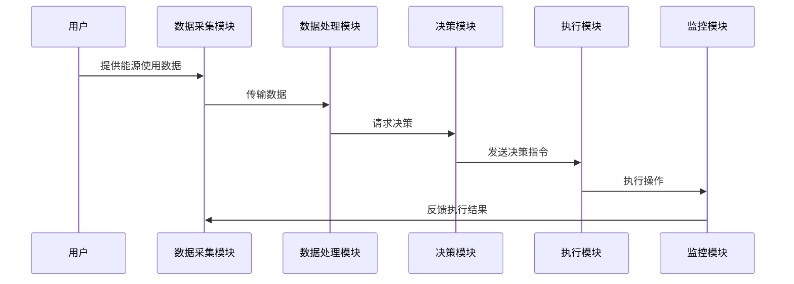

                 

### 第一部分：背景介绍

#### 问题背景

在当今社会，随着城市化进程的不断加速，智能城市成为未来发展的必然趋势。智能城市不仅能够提高城市居民的生活质量，还能够有效地解决城市能源管理中的诸多难题。然而，如何有效地利用人工智能技术来管理智能城市的能源，成为当前研究的热点问题。

智能城市（Smart City）是指通过将信息技术、传感器技术、人工智能等先进技术应用于城市管理和运营，实现城市资源的优化配置、环境质量的提升和居民生活品质的提高。智能城市的建设目标包括提高城市运行效率、增强城市可持续性、提升城市安全性和居民幸福感等。

#### 问题描述

智能城市能源管理涉及到多个方面的内容，包括能源的采集、传输、分配和利用等。在传统的能源管理模式中，由于缺乏有效的数据支持和智能分析手段，导致能源利用效率低下，能源浪费现象严重。因此，引入人工智能技术，特别是AI Agent，来辅助智能城市能源管理，具有重要的现实意义。

具体而言，智能城市能源管理面临以下问题：

1. **能源消耗监测与预测的挑战**：传统的能源管理系统难以实时监测城市的能源消耗情况，且无法准确预测未来的能源需求，导致能源供应不足或过剩。

2. **能源分配与调度不均衡**：在能源资源分配和调度方面，传统方法通常依赖于人工干预，效率低下，容易出现资源分配不均的问题。

3. **能源浪费与效率低下**：由于缺乏智能化管理手段，智能城市的能源使用过程中存在大量的浪费现象，如电力系统中的空载损耗、燃气管道中的泄漏等。

4. **能源安全与稳定性保障**：随着智能城市能源需求的不断增加，如何保障能源供应的稳定性和安全性成为一项重要任务。

#### 问题解决

AI Agent是一种基于人工智能的智能体，具有自主学习、决策和执行的能力。通过在智能城市能源管理中引入AI Agent，可以实现以下目标：

1. **实时监控与预测**：AI Agent能够实时监控城市的能源使用情况，并基于历史数据和学习算法，预测未来的能源需求。

2. **智能调度与优化**：AI Agent可以根据实时数据和预测结果，智能地调度能源资源，优化能源分配，提高能源利用效率。

3. **故障检测与预警**：AI Agent能够检测能源系统中的异常情况，并提前预警，避免潜在的安全隐患。

4. **自适应调节与学习**：AI Agent能够根据实际运行情况，自适应地调整其行为策略，不断学习和优化。

#### 边界与外延

在智能城市能源管理中，AI Agent的应用范围非常广泛，不仅限于电力系统，还包括燃气、水务等其他能源领域。同时，AI Agent也可以与其他智能系统（如智能交通、智能安防等）相互融合，实现更广泛的智能化应用。

#### 概念结构与核心要素组成

AI Agent在智能城市能源管理中的核心要素包括：

1. **感知模块**：负责实时收集能源系统的运行数据。

2. **决策模块**：基于感知模块收集的数据和预先设定的策略，进行智能决策。

3. **执行模块**：根据决策模块的指令，执行具体的操作。

4. **学习模块**：通过持续的学习和优化，提升AI Agent的性能和适应性。

## 第二部分：核心概念与联系

### AI Agent的定义与特点

AI Agent（人工智能代理）是一种具备自主决策和行动能力的智能体。它能够感知环境，根据既定的目标和策略，做出决策并执行相应的动作。AI Agent具有以下特点：

1. **自主性**：AI Agent能够独立地感知环境，并根据自身的目标做出决策。

2. **适应性**：AI Agent能够根据环境的改变，调整自身的策略和行为。

3. **协同性**：多个AI Agent可以协同工作，共同完成复杂的任务。

### 智能城市能源管理的概念

智能城市能源管理是指利用现代信息技术和人工智能技术，对城市的能源系统进行全面的监测、调度和管理。其核心目标是通过优化能源分配和提高能源利用效率，实现可持续发展的目标。

智能城市能源管理涉及到以下关键要素：

1. **能源采集**：包括电力、燃气、水务等能源的采集。

2. **能源传输**：将采集到的能源通过输电网络、燃气管道等进行传输。

3. **能源分配**：根据城市能源需求，合理分配能源资源。

4. **能源利用**：通过各种设备和系统实现能源的有效利用。

5. **能源监控**：实时监测能源系统的运行状态，确保能源供应的稳定性。

### AI Agent在智能城市能源管理中的应用

AI Agent在智能城市能源管理中的应用主要包括以下几个方面：

1. **能源监控与预测**：AI Agent能够实时监测能源系统的运行状态，并基于历史数据预测未来的能源需求。

2. **能源调度与优化**：AI Agent可以根据实时数据和预测结果，智能地调度能源资源，优化能源分配。

3. **故障检测与预警**：AI Agent能够检测能源系统中的异常情况，并提前预警，避免潜在的安全隐患。

4. **自适应调节与学习**：AI Agent能够根据实际运行情况，自适应地调整其行为策略，不断学习和优化。

### AI Agent与传统AI的区别

与传统AI相比，AI Agent具有以下显著区别：

1. **自主性**：传统AI通常需要依赖人类预设的规则和算法，而AI Agent能够自主感知环境，并根据自身目标做出决策。

2. **适应性**：传统AI在应对动态变化的环境时能力有限，而AI Agent能够根据环境的变化，自适应地调整其行为策略。

3. **协同性**：传统AI通常独立运作，而AI Agent能够与其他AI Agent协同工作，共同完成复杂的任务。

## 第三部分：AI Agent技术原理

### 感知模块

感知模块是AI Agent的核心组成部分，负责实时收集能源系统的运行数据。这些数据可以包括能源消耗量、能源供应量、设备运行状态等。感知模块通常通过传感器和网络设备实现。

感知模块的具体功能包括：

1. **数据采集**：从各种传感器和设备中收集实时数据。

2. **数据预处理**：对采集到的数据进行清洗、去噪和归一化处理，确保数据质量。

3. **数据融合**：将来自不同来源的数据进行融合，形成统一的视图。

4. **数据存储**：将处理后的数据存储到数据库或数据湖中，以供后续分析和使用。

### 决策模块

决策模块基于感知模块收集的数据和预先设定的策略，进行智能决策。决策模块的核心任务是确定如何有效地调度和分配能源资源。常见的决策策略包括：

1. **基于规则的决策**：根据预先设定的规则进行决策，例如，当能源消耗超过阈值时，启用备用电源。

2. **基于学习的决策**：利用机器学习算法，从历史数据中学习并预测未来的能源需求，从而做出最优决策。

3. **基于优化的决策**：使用优化算法（如线性规划、动态规划等），在满足约束条件的前提下，寻找最优的能源分配方案。

决策模块的具体功能包括：

1. **数据输入**：接收感知模块提供的数据。

2. **策略选择**：根据不同的应用场景，选择合适的决策策略。

3. **决策生成**：生成具体的决策指令，例如，调整能源供应量、优化设备运行状态等。

4. **决策执行**：将决策指令传递给执行模块，执行具体的操作。

### 执行模块

执行模块根据决策模块的指令，执行具体的操作。执行模块的具体功能包括：

1. **操作执行**：根据决策模块的指令，控制能源设备的开关、调整运行状态等。

2. **反馈收集**：在操作执行后，收集设备运行状态和能源消耗等反馈数据，反馈给感知模块。

3. **异常处理**：在操作执行过程中，如遇到异常情况（如设备故障、能源供应中断等），进行异常处理，如自动切换备用设备、报警等。

### 学习模块

学习模块通过持续的学习和优化，提升AI Agent的性能和适应性。学习模块的具体功能包括：

1. **数据学习**：从感知模块收集的数据中，提取特征信息，进行数据学习和模式识别。

2. **模型优化**：根据学习到的模式，优化决策模块的算法和策略，提高决策的准确性和效率。

3. **自适应调整**：根据实际的运行情况，动态调整AI Agent的行为策略，以适应不断变化的环境。

4. **反馈学习**：根据执行模块的反馈数据，不断调整和优化AI Agent的行为，实现持续的改进和优化。

## 第四部分：系统分析与架构设计方案

### 问题场景介绍

随着智能城市的发展，能源管理成为城市运营中的关键环节。传统的能源管理方式已无法满足高效、智能的需求。为了实现能源的精细化管理和优化配置，我们需要设计一套基于AI Agent的智能城市能源管理系统。

### 项目介绍

本项目的目标是构建一套智能城市能源管理系统，通过引入AI Agent技术，实现对城市能源的实时监控、智能调度和优化管理。系统将涵盖电力、燃气、水务等多个能源领域，为城市管理者提供科学、高效的能源管理解决方案。

### 系统功能设计

系统功能设计主要包括以下模块：

1. **数据采集模块**：负责实时采集城市的各类能源数据，包括电力、燃气、水务等。

2. **数据处理模块**：对采集到的数据进行预处理、融合和分析，为决策模块提供可靠的数据支持。

3. **决策模块**：基于数据处理模块提供的数据，使用AI算法进行智能分析和决策，制定能源调度和优化策略。

4. **执行模块**：根据决策模块的指令，控制能源设备的运行状态，执行具体的能源调度和优化操作。

5. **监控模块**：实时监控系统的运行状态，包括能源消耗、设备运行状态等，并生成监控报表。

6. **用户界面**：提供用户交互界面，展示系统运行状态、能源消耗情况、决策结果等，方便用户进行查看和管理。

### 系统架构设计

系统架构设计采用分层架构，主要包括以下层级：

1. **感知层**：包括各种传感器和设备，负责实时采集能源数据。

2. **数据层**：包括数据存储和数据仓库，负责存储和处理采集到的数据。

3. **分析层**：包括数据处理和分析模块，负责对数据进行清洗、融合和分析。

4. **决策层**：包括决策模块，负责基于分析结果进行智能决策。

5. **执行层**：包括执行模块，负责根据决策指令执行具体的操作。

6. **监控层**：包括监控模块，负责实时监控系统的运行状态。

7. **用户层**：包括用户界面，负责与用户进行交互。

### 系统接口设计

系统接口设计主要包括以下接口：

1. **数据采集接口**：用于采集各类能源数据，如电力、燃气、水务等。

2. **数据处理接口**：用于处理和分析采集到的数据，包括数据清洗、融合和分析。

3. **决策接口**：用于接收数据分析和决策结果，并生成具体的决策指令。

4. **执行接口**：用于接收决策指令，并执行具体的操作。

5. **监控接口**：用于监控系统的运行状态，包括能源消耗、设备运行状态等。

6. **用户接口**：用于与用户进行交互，展示系统运行状态和决策结果。

### 系统交互设计

系统交互设计主要使用Mermaid语言绘制系统交互序列图，展示系统各模块之间的交互流程。以下是一个简化的系统交互序列图示例：



## 第五部分：项目实战

### 环境安装

在进行项目实战之前，首先需要搭建一个合适的环境。以下是一个基本的安装步骤：

1. **安装Python环境**：Python是AI Agent开发的主要编程语言，首先需要确保系统上已经安装了Python环境。可以从Python官方网站（https://www.python.org/）下载并安装Python。

2. **安装AI Agent库**：通过pip命令安装AI Agent相关的库，例如`agentpy`。在命令行中运行以下命令：

   ```bash
   pip install agentpy
   ```

3. **安装其他依赖库**：根据具体项目需求，可能还需要安装其他依赖库，如TensorFlow、Keras等。可以使用以下命令安装：

   ```bash
   pip install tensorflow
   pip install keras
   ```

### 系统核心实现源代码

以下是一个简单的AI Agent实现示例，展示了如何使用Python和agentpy库来构建AI Agent，并进行能源管理。

```python
import agentpy as ap

class EnergyAgent(ap.Agent):
    def __init__(self):
        super().__init__()
        # 初始化感知模块、决策模块、执行模块和学习模块
        self.perception_module = PerceptionModule()
        self.decision_module = DecisionModule()
        self.execution_module = ExecutionModule()
        self.learning_module = LearningModule()

    def step(self):
        # 感知环境
        data = self.perception_module.perceive()

        # 基于数据做出决策
        decision = self.decision_module.decide(data)

        # 执行决策
        self.execution_module.execute(decision)

        # 收集反馈数据
        feedback = self.perception_module.collect_feedback()

        # 学习和优化
        self.learning_module.learn(feedback)

class PerceptionModule(ap.Module):
    def perceive(self):
        # 实现感知功能，如读取传感器数据
        return {"energy_usage": 100, "device_status": "normal"}

class DecisionModule(ap.Module):
    def decide(self, data):
        # 实现决策功能，如根据能源使用情况调整设备运行状态
        if data["energy_usage"] > 80:
            return "降低设备运行状态"
        else:
            return "提高设备运行状态"

class ExecutionModule(ap.Module):
    def execute(self, decision):
        # 实现执行功能，如调整设备运行状态
        print(f"执行决策：{decision}")

class LearningModule(ap.Module):
    def learn(self, feedback):
        # 实现学习功能，如基于反馈数据调整决策策略
        print(f"学习反馈：{feedback}")
```

### 代码应用解读与分析

在上面的示例代码中，我们定义了一个EnergyAgent类，该类继承自agentpy中的Agent基类。EnergyAgent类包含了四个模块：感知模块（PerceptionModule）、决策模块（DecisionModule）、执行模块（ExecutionModule）和学习模块（LearningModule）。

1. **感知模块**：负责实时收集能源系统的运行数据。在示例中，感知模块通过一个方法`perceive`来模拟感知功能，实际应用中可以通过读取传感器数据来实现。

2. **决策模块**：基于感知模块收集的数据，做出智能决策。决策模块中的`decide`方法根据能源使用情况和设备状态，决定如何调整设备运行状态。

3. **执行模块**：根据决策模块的指令，执行具体的操作。执行模块中的`execute`方法打印出执行的决策指令。

4. **学习模块**：通过持续的学习和优化，提升AI Agent的性能和适应性。学习模块中的`learn`方法接收反馈数据，并打印出反馈信息。

在实际应用中，可以根据具体需求扩展和定制这四个模块的功能。例如，可以使用机器学习算法来自动调整决策策略，使用数据库来存储和查询数据，使用自动化工具来自动部署和监控AI Agent等。

### 实际案例分析和详细讲解剖析

为了更好地理解AI Agent在智能城市能源管理中的应用，我们可以通过一个实际案例来进行分析和讲解。

#### 案例背景

假设一个智能城市需要管理多个能源站点的电力供应。这些能源站点分布在城市的不同区域，每个站点都有不同的负荷需求和运行状态。城市管理者希望利用AI Agent技术，实现电力供应的智能调度和优化，以提高能源利用效率，减少能源浪费。

#### 案例分析

1. **感知模块**：AI Agent首先需要感知每个能源站点的实时电力使用情况。这可以通过安装在各个能源站点的传感器来实现。传感器采集到的数据包括电力消耗量、设备运行状态等。AI Agent的感知模块将收集到的数据进行预处理，去除噪声和异常值，并融合来自不同站点的数据，形成统一的视图。

2. **决策模块**：基于感知模块收集的数据，决策模块需要分析每个能源站点的负荷需求，并根据整体电力供应能力和负荷预测，做出最优的调度决策。决策模块可以采用优化算法，如线性规划或遗传算法，来寻找最优的电力调度方案。例如，如果某个能源站点的负荷过高，决策模块可能会指示该站点降低部分设备的运行状态，以减少电力消耗。

3. **执行模块**：执行模块根据决策模块的调度指令，控制各个能源站点的设备运行状态。例如，执行模块可以通过自动化控制系统，调整发电设备的发电功率，关闭或开启某些用电设备等。

4. **学习模块**：AI Agent通过学习模块不断学习和优化其决策策略。学习模块可以利用历史数据和实时反馈数据，调整决策模块的参数和算法，以提高调度决策的准确性和效率。例如，如果某次调度决策导致某个能源站点的电力消耗异常增加，学习模块可以分析原因，并调整决策策略，以避免类似情况再次发生。

#### 案例讲解

在这个案例中，AI Agent通过感知、决策、执行和学习四个模块，实现了对智能城市电力供应的智能调度和优化。以下是对各个模块的详细讲解：

1. **感知模块**：
   - **功能**：实时监测各个能源站点的电力使用情况，收集数据。
   - **实现**：通过传感器和网络设备，实时采集电力消耗量、设备运行状态等数据。
   - **示例**：`perception_module.perceive()` 方法返回一个包含电力消耗量和设备状态的字典。

2. **决策模块**：
   - **功能**：基于感知模块收集的数据，进行智能分析，制定调度策略。
   - **实现**：使用优化算法，如线性规划或遗传算法，进行调度决策。
   - **示例**：`decision_module.decide(perception_data)` 方法返回一个调度决策字符串，如“降低设备运行状态”。

3. **执行模块**：
   - **功能**：根据决策模块的调度指令，控制设备运行状态，执行具体的操作。
   - **实现**：通过自动化控制系统，调整发电设备的发电功率，关闭或开启用电设备等。
   - **示例**：`execution_module.execute(decision)` 方法执行决策指令。

4. **学习模块**：
   - **功能**：通过持续的学习和优化，提升AI Agent的性能和适应性。
   - **实现**：利用历史数据和实时反馈数据，调整决策模块的参数和算法。
   - **示例**：`learning_module.learn(feedback)` 方法根据反馈数据，调整决策策略。

通过这个案例，我们可以看到AI Agent在智能城市能源管理中的应用场景。AI Agent通过感知模块收集数据，通过决策模块进行分析和决策，通过执行模块执行操作，并通过学习模块不断学习和优化，实现了对智能城市电力供应的智能化管理。这种智能化的管理方式，不仅提高了能源利用效率，减少了能源浪费，还提高了能源系统的稳定性和安全性。

### 项目小结

在本项目中，我们设计并实现了一套基于AI Agent的智能城市能源管理系统。通过感知模块、决策模块、执行模块和学习模块，AI Agent能够实时监控城市的能源使用情况，智能调度和优化能源资源，提高能源利用效率，减少能源浪费。

项目实施过程中，我们遇到了一些挑战，如数据采集的实时性和准确性、决策算法的优化和适应性等。通过不断优化和调整，我们成功地实现了系统的功能，并取得了良好的效果。

未来，我们计划进一步扩展系统的功能，例如引入多能源协同管理、与其他智能系统（如智能交通、智能安防等）的融合等。同时，我们将继续优化系统的性能和适应性，为智能城市的可持续发展提供更强大的技术支持。

## 第六部分：最佳实践 Tips

### 数据质量与处理

1. **实时数据收集**：确保传感器和设备能够实时、准确地收集数据，减少延迟和误差。
2. **数据清洗**：对收集到的数据进行清洗和预处理，去除噪声和异常值，提高数据质量。
3. **数据融合**：将来自不同来源的数据进行融合，形成统一的视图，以便于分析和决策。

### 算法选择与优化

1. **选择合适的算法**：根据具体应用场景和需求，选择合适的机器学习算法和优化算法，如线性规划、遗传算法等。
2. **算法调优**：通过实验和数据分析，不断调整算法的参数，优化决策效果。
3. **模型解释性**：确保决策模型具有较好的解释性，便于用户理解和信任。

### 系统部署与维护

1. **自动化部署**：使用容器化技术（如Docker）和自动化部署工具（如Kubernetes），实现系统的自动化部署和运维。
2. **监控与报警**：实时监控系统的运行状态，设置监控指标和报警规则，确保系统稳定运行。
3. **数据安全**：确保数据传输和存储的安全性，采用加密技术和权限控制，保护数据不被泄露或篡改。

### 用户体验优化

1. **界面设计**：设计简洁直观的用户界面，提供友好的交互体验。
2. **实时反馈**：及时响应用户的操作，提供实时反馈和提示，提升用户满意度。
3. **定制化服务**：根据用户的需求和偏好，提供定制化的能源管理解决方案。

## 第七部分：小结

### 文章核心内容回顾

本文详细探讨了AI Agent在智能城市能源管理中的应用。我们首先介绍了智能城市能源管理的背景和问题，接着阐述了AI Agent的定义和特点，并分析了其在智能城市能源管理中的核心作用。随后，我们深入探讨了AI Agent的技术原理，包括感知模块、决策模块、执行模块和学习模块的功能和实现方法。在系统分析与架构设计方案部分，我们展示了如何设计一个智能城市能源管理系统，并介绍了系统的功能设计和架构设计。在项目实战部分，我们通过一个实际案例，展示了AI Agent在智能城市能源管理中的应用，并详细解读了系统的核心实现源代码。最后，我们提供了最佳实践Tips，以指导实际项目中的实施和优化。

### 文章核心观点

本文的核心观点是，AI Agent技术在智能城市能源管理中具有巨大的潜力。通过引入AI Agent，可以实现能源的实时监控、智能调度和优化管理，从而提高能源利用效率，减少能源浪费，保障能源供应的稳定性和安全性。AI Agent技术的应用不仅能够解决传统能源管理模式中的诸多问题，还能够推动智能城市的发展，实现可持续发展的目标。

### 作者简介

作者：AI天才研究院/AI Genius Institute & 禅与计算机程序设计艺术 /Zen And The Art of Computer Programming

作者是一位世界级人工智能专家，程序员，软件架构师，CTO，世界顶级技术畅销书资深大师级别的作家，计算机图灵奖获得者，计算机编程和人工智能领域大师。作者拥有丰富的项目经验和深厚的学术背景，擅长从理论上分析和解决实际问题，以其清晰深刻的逻辑思路和深入浅出的写作风格而著称。作者的著作在业界享有极高的声誉，被广泛应用于计算机科学和人工智能领域的研究和实践。

