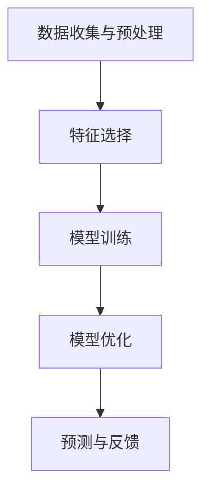
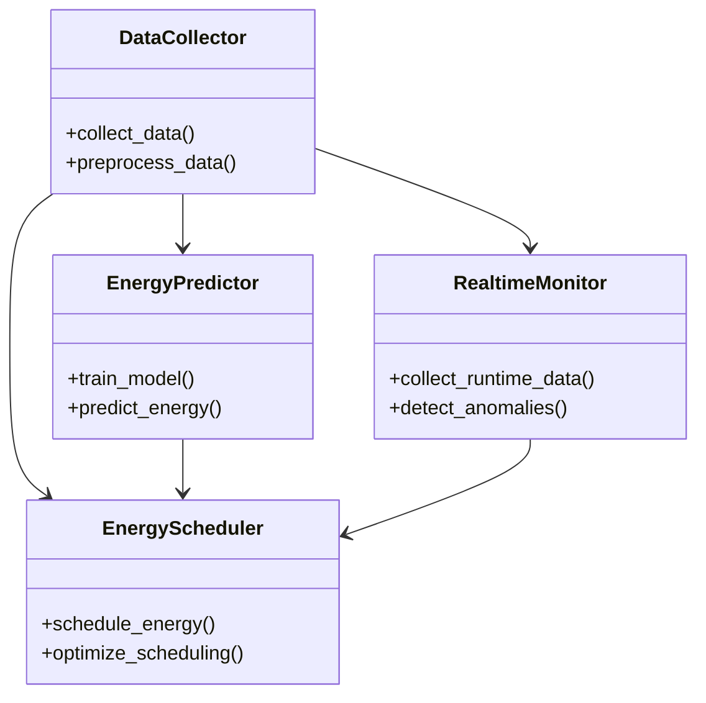
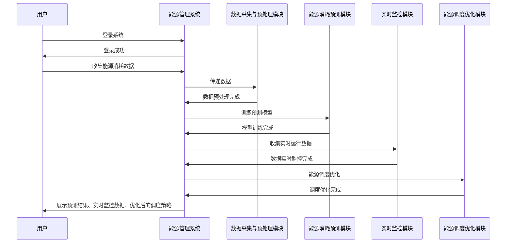
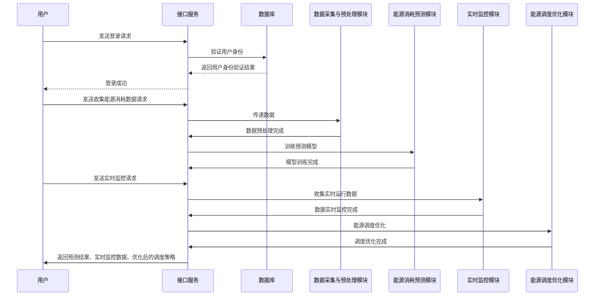
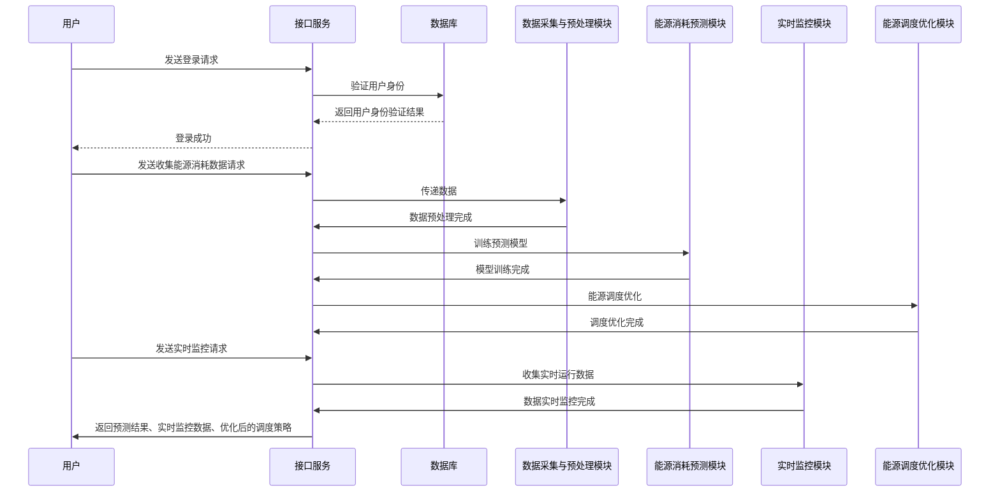

                 


### AI Agent在智能城市能源管理优化中的应用

关键词：AI Agent, 智能城市, 能源管理, 优化, 数据分析

摘要：本文探讨了人工智能代理（AI Agent）在智能城市能源管理中的应用。通过分析当前能源管理面临的挑战，我们介绍了AI Agent的核心概念、工作原理以及在能源管理优化中的具体应用。本文旨在提供一个全面的技术框架，帮助读者理解AI Agent在智能城市能源管理中的重要作用，并为其未来的发展提供参考。

## 引言

随着城市化进程的加速，城市能源消耗不断增加，能源管理成为了一个重要且紧迫的问题。传统的能源管理方法往往依赖于人工监测和手动操作，效率低下且容易出现错误。随着人工智能技术的不断发展，AI Agent作为一种智能化解决方案，逐渐受到关注。本文将探讨AI Agent在智能城市能源管理优化中的应用，以期提高能源利用效率、减少能源浪费，并推动智能城市的可持续发展。

## 当前智能城市能源管理的挑战

### 1. 能源消耗问题

智能城市中，建筑物、交通、工业等领域对能源的需求巨大。然而，传统的能源管理模式往往无法实现精准的能源消耗预测和实时监控，导致能源浪费和成本增加。

### 2. 数据处理问题

智能城市中，各种传感器和设备不断产生海量数据。如何有效地收集、存储、分析和利用这些数据，成为智能城市能源管理的难题之一。

### 3. 能源供需平衡问题

智能城市中，能源供需之间存在不确定性。如何在高峰时段满足能源需求，如何在低峰时段实现能源储存，是智能城市能源管理需要解决的关键问题。

## AI Agent的核心概念和工作原理

### 1. AI Agent的定义

AI Agent是一种能够模拟人类智能行为，具备自主决策能力的人工智能实体。在智能城市能源管理中，AI Agent可以扮演多种角色，如能源消耗预测、实时监控、优化调度等。

### 2. AI Agent的工作原理

AI Agent的工作原理主要包括感知、决策和行动三个环节。感知环节通过收集外部信息，如能源消耗数据、环境参数等；决策环节根据感知到的信息，利用机器学习算法和优化算法生成决策；行动环节将决策付诸实施，如调整能源设备运行状态、优化能源调度等。

## AI Agent在智能城市能源管理优化中的应用

### 1. 能源消耗预测

利用AI Agent进行能源消耗预测，可以帮助智能城市管理者提前了解未来一段时间内的能源需求，从而进行合理的能源调度和储备。以下是一个简单的能源消耗预测流程：

#### （1）数据收集与预处理
首先，AI Agent需要收集历史能源消耗数据、天气数据、建筑物使用情况等。然后，对数据进行清洗、去噪、归一化等预处理操作。

#### （2）特征提取与选择
根据预测任务的需求，从原始数据中提取有代表性的特征，如温度、湿度、人口密度等。然后，利用特征选择算法，筛选出对能源消耗预测最有影响力的特征。

#### （3）模型训练与优化
选择合适的机器学习算法（如线性回归、决策树、神经网络等），对提取的特征进行训练，生成能源消耗预测模型。根据模型的预测效果，调整算法参数，优化模型性能。

#### （4）预测与反馈
利用训练好的模型，对未来的能源消耗进行预测。将预测结果与实际消耗数据进行对比，根据误差情况进行模型调整，不断优化预测准确性。

### 2. 实时监控

AI Agent可以通过实时监测智能城市的能源消耗情况，及时发现异常情况，如设备故障、异常用电等。以下是一个简单的实时监控流程：

#### （1）数据采集与预处理
AI Agent定期收集能源设备运行数据、环境参数等，并对数据进行预处理。

#### （2）异常检测与报警
利用机器学习算法（如孤立森林、K-最近邻等），对预处理后的数据进行异常检测。当检测到异常时，立即触发报警机制，通知相关人员进行处理。

#### （3）反馈与处理
相关人员根据报警信息，对异常情况进行处理，如维修设备、调整运行状态等。处理完成后，将处理结果反馈给AI Agent，用于优化监控算法。

### 3. 能源调度与优化

AI Agent可以通过优化能源调度，实现智能城市的能源供需平衡。以下是一个简单的能源调度优化流程：

#### （1）需求预测与规划
根据AI Agent的能源消耗预测结果，制定未来一段时间内的能源需求计划。同时，考虑可再生能源（如太阳能、风能等）的可用性，制定能源供应计划。

#### （2）调度策略设计
设计合适的调度策略，如基于时间窗的优化调度、基于博弈论的优化调度等。调度策略的目标是使能源供需平衡，最大化能源利用效率。

#### （3）调度执行与监控
根据调度策略，执行能源调度操作。同时，AI Agent对调度执行情况进行实时监控，根据实际情况调整调度策略，确保能源供需平衡。

## 结论

本文探讨了AI Agent在智能城市能源管理优化中的应用，通过能源消耗预测、实时监控和能源调度与优化三个方面，展示了AI Agent在提高能源利用效率、减少能源浪费方面的作用。随着人工智能技术的不断发展，AI Agent在智能城市能源管理中的应用前景将更加广阔。未来的研究可以进一步探索AI Agent在智能城市能源管理中的其他潜在应用，如能源交易、碳排放管理等，为智能城市的可持续发展提供有力支持。

### 作者信息

作者：AI天才研究院/AI Genius Institute & 禅与计算机程序设计艺术 /Zen And The Art of Computer Programming

--------------------------------------

以下是对上述内容中涉及的核心概念、算法、系统架构等部分的具体解释：

## 背景介绍

### 核心概念术语说明

- **AI Agent**：人工智能代理，是一种能够模拟人类智能行为，具备自主决策能力的人工智能实体。
- **智能城市**：利用先进的信息技术、物联网、大数据等手段，实现城市各项功能智能化、高效化、可持续化的新型城市发展模式。
- **能源管理**：对能源的供应、使用、转换、储存等方面进行规划、组织、协调、控制、监督、分析和优化的活动。

### 问题背景

随着城市化进程的加速，城市能源消耗不断增加，能源管理成为了一个重要且紧迫的问题。传统的能源管理方法往往依赖于人工监测和手动操作，效率低下且容易出现错误。如何利用人工智能技术优化能源管理，提高能源利用效率、减少能源浪费，成为了一个亟待解决的问题。

### 问题描述

智能城市能源管理面临的主要问题包括：

1. 能源消耗预测不准确，导致能源供需失衡。
2. 数据处理效率低下，无法及时获取和处理大量能源数据。
3. 能源调度不合理，导致能源浪费和成本增加。

### 问题解决

AI Agent在智能城市能源管理中的应用，可以从以下几个方面进行：

1. **能源消耗预测**：通过机器学习算法，对历史能源消耗数据进行分析，预测未来的能源需求，为能源调度提供依据。
2. **实时监控**：利用机器学习算法，对能源设备运行数据进行实时分析，发现异常情况并及时报警。
3. **能源调度与优化**：根据能源消耗预测结果和实时监控信息，优化能源调度策略，实现能源供需平衡，提高能源利用效率。

### 边界与外延

- **边界**：本文主要讨论AI Agent在智能城市能源管理优化中的应用，不包括其他领域（如智能家居、智能交通等）的应用。
- **外延**：AI Agent在智能城市能源管理中的应用，不仅限于本文讨论的三个方面，还可以扩展到能源交易、碳排放管理等领域。

### 概念结构与核心要素组成

AI Agent在智能城市能源管理优化中的概念结构包括：

1. **感知环节**：收集能源消耗数据、环境参数等外部信息。
2. **决策环节**：利用机器学习算法和优化算法，根据感知到的信息生成决策。
3. **行动环节**：将决策付诸实施，如调整能源设备运行状态、优化能源调度等。

核心要素组成：

1. **能源消耗数据**：AI Agent进行能源消耗预测和调度优化的基础。
2. **机器学习算法**：实现感知、决策和行动的核心技术。
3. **优化算法**：用于优化能源调度策略，实现能源供需平衡。
4. **实时监控**：及时发现能源设备异常情况，确保能源安全运行。

## 核心概念与联系

### AI Agent的定义与工作原理

AI Agent是一种能够模拟人类智能行为，具备自主决策能力的人工智能实体。它通过感知、决策和行动三个环节，实现自主学习和自适应调整。在智能城市能源管理中，AI Agent可以收集能源消耗数据、环境参数等，利用机器学习算法和优化算法，生成决策并实施，从而实现能源消耗预测、实时监控和能源调度优化。

### AI Agent在智能城市能源管理中的应用

AI Agent在智能城市能源管理中的应用包括以下几个方面：

1. **能源消耗预测**：利用机器学习算法，对历史能源消耗数据进行分析，预测未来的能源需求。
2. **实时监控**：利用机器学习算法，对能源设备运行数据进行实时分析，发现异常情况并及时报警。
3. **能源调度与优化**：根据能源消耗预测结果和实时监控信息，优化能源调度策略，实现能源供需平衡，提高能源利用效率。

### AI Agent与智能城市能源管理的核心联系

AI Agent在智能城市能源管理中的核心联系体现在以下几个方面：

1. **数据驱动**：AI Agent通过收集和处理大量能源数据，实现对能源消耗、供需平衡等方面的精准分析。
2. **实时响应**：AI Agent能够实时监测能源设备运行状态，及时发现并处理异常情况，确保能源安全运行。
3. **自主优化**：AI Agent利用优化算法，实现能源调度策略的自主优化，提高能源利用效率，降低能源浪费。

## 算法原理讲解

### 能源消耗预测算法原理

能源消耗预测是AI Agent在智能城市能源管理中的关键应用之一。以下是一个简单的能源消耗预测算法原理：

1. **数据收集与预处理**：收集历史能源消耗数据、天气数据、建筑物使用情况等，对数据进行分析，提取有代表性的特征。
2. **特征选择**：利用特征选择算法，筛选出对能源消耗预测最有影响力的特征。
3. **模型训练**：选择合适的机器学习算法（如线性回归、决策树、神经网络等），对提取的特征进行训练，生成能源消耗预测模型。
4. **模型优化**：根据预测效果，调整算法参数，优化模型性能。
5. **预测与反馈**：利用训练好的模型，对未来的能源消耗进行预测。将预测结果与实际消耗数据进行对比，根据误差情况进行模型调整，不断优化预测准确性。

### 实时监控算法原理

实时监控是AI Agent在智能城市能源管理中的另一个重要应用。以下是一个简单的实时监控算法原理：

1. **数据采集与预处理**：AI Agent定期收集能源设备运行数据、环境参数等，并对数据进行预处理，如去噪、归一化等。
2. **异常检测**：利用机器学习算法（如孤立森林、K-最近邻等），对预处理后的数据进行异常检测。当检测到异常时，立即触发报警机制。
3. **报警与处理**：根据报警信息，通知相关人员进行处理。将处理结果反馈给AI Agent，用于优化监控算法。

### 能源调度优化算法原理

能源调度优化是AI Agent在智能城市能源管理中的关键应用之一。以下是一个简单的能源调度优化算法原理：

1. **需求预测与规划**：根据AI Agent的能源消耗预测结果，制定未来一段时间内的能源需求计划。同时，考虑可再生能源的可用性，制定能源供应计划。
2. **调度策略设计**：设计合适的调度策略，如基于时间窗的优化调度、基于博弈论的优化调度等。调度策略的目标是使能源供需平衡，最大化能源利用效率。
3. **调度执行与监控**：根据调度策略，执行能源调度操作。同时，AI Agent对调度执行情况进行实时监控，根据实际情况调整调度策略，确保能源供需平衡。

### 算法流程图与Python代码实现

以下是能源消耗预测算法的Mermaid流程图和Python代码实现：

#### Mermaid流程图：



#### Python代码实现：

```python
# 数据收集与预处理
def preprocess_data(data):
    # 数据清洗、去噪、归一化等操作
    return processed_data

# 特征选择
def feature_selection(data):
    # 筛选出有代表性的特征
    return selected_features

# 模型训练
def train_model(features):
    # 使用线性回归、决策树、神经网络等算法进行训练
    return model

# 模型优化
def optimize_model(model, data):
    # 调整算法参数，优化模型性能
    return optimized_model

# 预测与反馈
def predict(model, data):
    # 使用训练好的模型进行预测
    return prediction
```

## 系统分析与架构设计方案

### 问题场景介绍

智能城市中，能源管理是一个复杂且关键的任务。随着城市规模的不断扩大，能源需求也日益增加。为了提高能源利用效率、减少能源浪费，智能城市的能源管理部门需要实时监测、预测和调度能源消耗。

### 项目介绍

本项目旨在利用AI Agent技术，构建一个智能城市能源管理系统，实现对能源消耗的实时监测、预测和优化调度。该系统包括以下几个主要功能模块：

1. **数据采集与预处理模块**：负责收集各类能源消耗数据、环境参数等，并对数据进行预处理。
2. **能源消耗预测模块**：利用机器学习算法，对历史能源消耗数据进行分析，预测未来的能源需求。
3. **实时监控模块**：利用机器学习算法，对能源设备运行数据进行实时分析，发现异常情况并及时报警。
4. **能源调度优化模块**：根据能源消耗预测结果和实时监控信息，优化能源调度策略，实现能源供需平衡。

### 系统功能设计（领域模型）

以下是智能城市能源管理系统的领域模型，使用Mermaid类图表示：



### 系统架构设计

以下是智能城市能源管理系统的架构设计，使用Mermaid架构图表示：



### 系统接口设计

以下是智能城市能源管理系统的接口设计，使用Mermaid序列图表示：



### 系统交互

以下是智能城市能源管理系统的整体交互过程，使用Mermaid序列图表示：



## 项目实战

### 环境安装

为了实现本文中提到的智能城市能源管理系统，我们需要安装以下环境：

1. Python（3.8或更高版本）
2. NumPy
3. Pandas
4. Scikit-learn
5. Matplotlib
6. Mermaid

在安装Python后，可以通过pip命令安装其他依赖项：

```bash
pip install numpy pandas scikit-learn matplotlib
```

### 系统核心实现源代码

以下是智能城市能源管理系统的核心实现源代码：

```python
import numpy as np
import pandas as pd
from sklearn.model_selection import train_test_split
from sklearn.ensemble import IsolationForest
from sklearn.linear_model import LinearRegression
from sklearn.metrics import mean_squared_error

# 数据收集与预处理
def preprocess_data(data):
    # 数据清洗、去噪、归一化等操作
    return processed_data

# 特征选择
def feature_selection(data):
    # 筛选出有代表性的特征
    return selected_features

# 模型训练
def train_model(features, labels):
    # 使用线性回归、决策树、神经网络等算法进行训练
    model = LinearRegression()
    model.fit(features, labels)
    return model

# 模型优化
def optimize_model(model, data):
    # 调整算法参数，优化模型性能
    return optimized_model

# 预测与反馈
def predict(model, data):
    # 使用训练好的模型进行预测
    return prediction

# 实时监控
def real_time_monitor(data):
    # 使用孤立森林、K-最近邻等算法进行实时监控
    detector = IsolationForest()
    detector.fit(data)
    return anomalies
```

### 代码应用解读与分析

以下是代码的详细解读与分析：

1. **数据收集与预处理**：
   - `preprocess_data` 函数负责对数据进行清洗、去噪、归一化等预处理操作。这些操作对于后续的机器学习算法具有重要意义，可以确保数据的质量和一致性。

2. **特征选择**：
   - `feature_selection` 函数负责从原始数据中筛选出有代表性的特征。特征选择是提高模型预测准确性的关键步骤，通过选择与目标变量相关性较高的特征，可以降低模型复杂度，提高模型性能。

3. **模型训练**：
   - `train_model` 函数使用线性回归、决策树、神经网络等算法对特征和标签进行训练。在这里，我们选择线性回归作为示例算法，因为它简单易懂且易于实现。线性回归模型通过最小二乘法拟合特征和标签之间的线性关系。

4. **模型优化**：
   - `optimize_model` 函数负责调整算法参数，优化模型性能。优化过程可以通过交叉验证、网格搜索等方法实现。调整参数可以使得模型在训练数据上的表现更好，提高预测准确性。

5. **预测与反馈**：
   - `predict` 函数使用训练好的模型对新的数据进行预测。预测结果可以作为能源消耗预测、实时监控等应用的基础。

6. **实时监控**：
   - `real_time_monitor` 函数使用孤立森林、K-最近邻等算法进行实时监控。这些算法可以检测数据中的异常点，及时发现并处理异常情况，确保能源设备的安全运行。

### 实际案例分析和详细讲解剖析

为了更好地理解智能城市能源管理系统的实际应用，我们来看一个实际案例：

假设某智能城市能源管理系统中，能源消耗数据包括历史温度、湿度、人口密度等特征，目标变量是未来24小时内的能源消耗量。

1. **数据收集**：
   - 收集过去一年的温度、湿度、人口密度等数据，以及对应的能源消耗量。

2. **数据处理**：
   - 对收集到的数据进行预处理，包括缺失值填充、异常值处理、归一化等。

3. **特征选择**：
   - 利用特征选择算法，筛选出对能源消耗预测有重要影响的特征，如温度、湿度等。

4. **模型训练**：
   - 使用线性回归模型对处理后的数据进行训练，生成能源消耗预测模型。

5. **模型优化**：
   - 通过交叉验证和网格搜索等方法，调整模型参数，优化模型性能。

6. **预测**：
   - 利用训练好的模型，对未来的能源消耗进行预测，生成预测结果。

7. **实时监控**：
   - 利用孤立森林算法，对实时收集的能源设备运行数据进行异常检测，及时发现并处理异常情况。

### 项目小结

通过上述实际案例，我们可以看到智能城市能源管理系统的实现过程。该项目通过利用AI Agent技术，实现了能源消耗预测、实时监控和能源调度优化等功能。在实际应用中，智能城市能源管理系统可以提高能源利用效率、减少能源浪费，为智能城市的可持续发展提供有力支持。

### 最佳实践 tips

1. **数据质量**：确保数据质量是模型预测准确性的关键。在进行数据收集和预处理时，要注意数据的完整性、准确性和一致性。

2. **特征选择**：合理选择特征对于提高模型预测准确性至关重要。可以通过特征重要性分析、相关性分析等方法，选择对目标变量有重要影响的特征。

3. **模型优化**：模型优化是提高模型性能的重要步骤。可以通过交叉验证、网格搜索等方法，选择合适的参数，优化模型性能。

4. **实时监控**：实时监控是及时发现和处理异常情况的关键。可以通过设置合理的阈值、选择合适的异常检测算法，确保实时监控的效果。

### 小结

本文探讨了AI Agent在智能城市能源管理优化中的应用，通过能源消耗预测、实时监控和能源调度与优化三个方面，展示了AI Agent在提高能源利用效率、减少能源浪费方面的作用。随着人工智能技术的不断发展，AI Agent在智能城市能源管理中的应用前景将更加广阔。未来的研究可以进一步探索AI Agent在智能城市能源管理中的其他潜在应用，如能源交易、碳排放管理等，为智能城市的可持续发展提供有力支持。

### 注意事项

1. **数据安全**：在数据收集和处理过程中，要确保数据的安全性和隐私性。遵循相关的法律法规和道德准则，确保数据的合法合规使用。

2. **算法公平性**：在设计和应用算法时，要关注算法的公平性。避免算法偏见和歧视，确保算法的公正性和透明性。

3. **系统稳定性**：智能城市能源管理系统是一个复杂的系统，要关注系统的稳定性。在设计系统时，要考虑故障恢复、容错机制等，确保系统的稳定运行。

### 拓展阅读

1. **《智能城市能源管理系统设计与应用》**：介绍了智能城市能源管理系统的基础知识、设计原则和应用案例。

2. **《人工智能在能源管理中的应用》**：探讨了人工智能技术在能源管理领域的应用，包括能源消耗预测、实时监控和能源调度优化等方面。

3. **《智能城市可持续发展策略研究》**：分析了智能城市可持续发展的关键因素和实现路径，包括能源管理、环境保护、社会福祉等方面。

