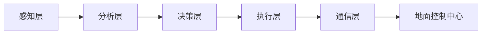
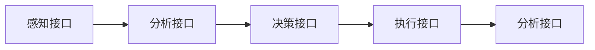
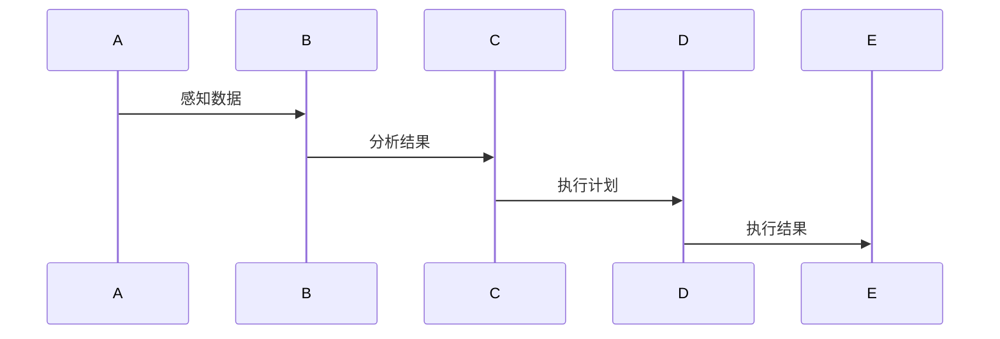

                 

# AI Agent在智能太空探索中的实践

关键词：AI Agent、智能太空探索、系统架构设计、项目实践

摘要：随着人类对太空探索的不断深入，智能太空探索的需求日益迫切。本文介绍了AI Agent在智能太空探索中的实践背景，探讨了AI Agent的基本概念、核心原理与架构设计，并通过具体的项目实践，展示了AI Agent在智能太空探索中的应用效果。本文旨在为从事智能太空探索的科研人员提供一些有价值的参考和思路。

## 1. 第一部分：背景介绍

### 1.1 AI Agent在智能太空探索中的实践背景

#### 1.1.1 引言：智能太空探索的需求与挑战

智能太空探索是指利用人工智能技术，对太空环境进行自动监测、决策和执行的过程。随着人类对太空的探索逐渐深入，智能太空探索的需求日益迫切。一方面，太空环境的复杂性使得传统的手动控制和操作难以应对；另一方面，太空探索任务的多样性和时效性要求航天器具备更高的自主性和智能化水平。

#### 1.1.2 问题描述：为什么需要AI Agent

在智能太空探索中，AI Agent作为一种智能体，能够根据环境信息自主地进行决策和执行，满足以下需求：

1. **环境感知与数据采集**：AI Agent能够对太空环境进行实时监测，收集各种数据，为后续的决策提供依据。
2. **目标识别与跟踪**：AI Agent能够对太空中的目标进行识别和跟踪，为航天器提供精确的目标信息。
3. **自主决策与规划**：AI Agent能够根据当前任务和环境状态，自主地制定执行计划，提高任务完成的效率。
4. **异常检测与应对**：AI Agent能够实时检测太空探索过程中出现的异常情况，并采取相应的应对措施，确保任务的顺利进行。

#### 1.1.3 问题解决：AI Agent的作用

AI Agent在智能太空探索中具有以下作用：

1. **提高任务效率**：AI Agent能够根据任务需求和太空环境特点，自主地制定执行计划，提高任务完成的效率。
2. **降低人力成本**：AI Agent能够代替航天员完成一些重复性高、危险系数高的任务，降低人力成本和风险。
3. **增强自主性**：AI Agent能够在没有人为干预的情况下，自主地完成太空探索任务，提高航天器的自主性和智能化水平。
4. **提高安全性**：AI Agent能够实时监测太空环境，及时发现和应对异常情况，确保任务的顺利进行。

#### 1.1.4 边界与外延：智能太空探索的范围与限制

智能太空探索的范围包括但不限于：

1. **行星探测**：利用AI Agent对其他行星进行自动探测，收集地质、气候等信息。
2. **航天器维护**：利用AI Agent对航天器进行自动维护，确保航天器在太空环境中的正常运行。
3. **卫星管理**：利用AI Agent对卫星进行自动管理，优化卫星资源利用，提高卫星寿命。
4. **深空探测**：利用AI Agent对深空区域进行自动探测，探索未知领域。

然而，智能太空探索也存在一定的限制，如：

1. **通信延迟**：由于太空环境中的通信延迟，AI Agent在执行任务时可能会受到一定的限制。
2. **能源限制**：太空环境中的能源供应有限，AI Agent需要设计高效的能源利用方案。
3. **环境复杂**：太空环境复杂多变，AI Agent需要具备较强的适应能力和容错能力。

#### 1.1.5 概念结构与核心要素组成

AI Agent在智能太空探索中的概念结构主要包括以下几个方面：

1. **感知模块**：负责收集太空环境中的各种数据，如温度、压力、光照等。
2. **决策模块**：负责根据感知模块收集到的数据，结合任务需求和环境特点，自主地制定执行计划。
3. **执行模块**：负责根据决策模块制定的执行计划，对航天器进行操作和控制。
4. **通信模块**：负责与其他航天器或地面控制中心进行通信，传输数据和控制指令。

### 1.2 AI Agent的基本概念

#### 1.2.1 定义：什么是AI Agent

AI Agent，即人工智能代理，是一种能够根据环境信息自主地进行决策和执行的人工智能实体。它通过感知模块获取环境信息，利用决策模块进行分析和推理，然后通过执行模块实施相应的操作。

#### 1.2.2 特点：AI Agent的核心特点

AI Agent具有以下核心特点：

1. **自主性**：AI Agent能够自主地收集环境信息、进行分析和推理，并执行相应的操作，无需人工干预。
2. **适应性**：AI Agent能够根据环境变化和任务需求，动态调整自身的决策和执行策略。
3. **协同性**：AI Agent能够与其他AI Agent或人类进行协同工作，共同完成复杂任务。
4. **可扩展性**：AI Agent的设计具有较好的可扩展性，可以适应不同类型和规模的太空探索任务。

#### 1.2.3 分类：不同类型的AI Agent

根据应用场景和功能特点，AI Agent可以分为以下几类：

1. **监控型AI Agent**：主要负责对太空环境进行实时监测，收集各种数据，如温度、压力、光照等。
2. **决策型AI Agent**：主要负责根据任务需求和环境特点，自主地制定执行计划，如任务规划、路径规划等。
3. **执行型AI Agent**：主要负责对航天器进行操作和控制，如发动机控制、姿态调整等。
4. **综合型AI Agent**：集成了感知、决策、执行等多种功能，能够完成较为复杂的太空探索任务。

#### 1.2.4 演化：AI Agent的发展历程

AI Agent的发展历程可以分为以下几个阶段：

1. **早期探索阶段（20世纪50年代-70年代）**：人工智能研究初期，研究者开始关注智能体的概念，提出了一些简单的模型和算法。
2. **发展完善阶段（20世纪80年代-90年代）**：随着计算机性能的不断提高，AI Agent的研究得到进一步发展，出现了一些具有实际应用价值的算法和技术。
3. **商业化应用阶段（21世纪以来）**：随着人工智能技术的快速发展，AI Agent开始广泛应用于各个领域，如机器人、自动驾驶、智能家居等。

### 1.3 智能太空探索的挑战与机遇

#### 1.3.1 挑战：在太空环境中应用AI Agent的挑战

在太空环境中应用AI Agent面临以下挑战：

1. **通信延迟**：由于太空环境中的通信延迟，AI Agent需要具备较强的自主决策能力，以应对通信中断等突发情况。
2. **能源限制**：太空环境中的能源供应有限，AI Agent需要设计高效的能源利用方案，以延长任务寿命。
3. **环境复杂**：太空环境复杂多变，AI Agent需要具备较强的适应能力和容错能力，以应对各种异常情况。
4. **安全性**：AI Agent在执行任务过程中，需要确保数据安全和操作安全，防止恶意攻击和操作失误。

#### 1.3.2 机遇：AI Agent在太空探索中的应用前景

AI Agent在太空探索中具有广泛的应用前景：

1. **提高任务效率**：AI Agent能够自主地完成各种太空探索任务，提高任务完成的效率。
2. **降低人力成本**：AI Agent能够代替航天员完成一些重复性高、危险系数高的任务，降低人力成本和风险。
3. **增强自主性**：AI Agent能够在没有人为干预的情况下，自主地完成太空探索任务，提高航天器的自主性和智能化水平。
4. **拓展研究领域**：AI Agent的应用将拓展人类对太空的探索范围，推动太空科学和技术的进步。

## 2. 第二部分：核心概念与联系

### 2.1 AI Agent的核心原理与架构

#### 2.1.1 AI Agent的工作原理

AI Agent的工作原理可以分为以下几个步骤：

1. **感知**：AI Agent通过传感器或其他方式收集环境信息，如温度、压力、光照等。
2. **分析**：AI Agent利用机器学习、自然语言处理等技术，对感知到的信息进行分析和推理，识别出任务目标、环境变化等信息。
3. **决策**：AI Agent根据分析结果，结合任务需求和环境特点，自主地制定执行计划。
4. **执行**：AI Agent根据执行计划，对航天器或其他设备进行操作和控制，完成任务。

#### 2.1.2 AI Agent的架构设计

AI Agent的架构设计可以分为以下几个模块：

1. **感知模块**：负责收集环境信息，如温度、压力、光照等。
2. **分析模块**：负责对感知到的信息进行分析和推理，识别出任务目标、环境变化等信息。
3. **决策模块**：负责根据分析结果，结合任务需求和环境特点，自主地制定执行计划。
4. **执行模块**：负责根据执行计划，对航天器或其他设备进行操作和控制，完成任务。
5. **通信模块**：负责与其他AI Agent或地面控制中心进行通信，传输数据和控制指令。

#### 2.1.3 AI Agent的属性特征对比

不同类型的AI Agent在性能、适应能力、安全性和可靠性等方面存在一定的差异，以下是一个简单的对比表格：

| 类型       | 性能 | 适应能力 | 安全性 | 可靠性 |
| ---------- | ---- | ------- | ---- | ----- |
| 监控型AI Agent | 较低  | 较高    | 较高  | 较高  |
| 决策型AI Agent | 较高  | 较高    | 较高  | 较高  |
| 执行型AI Agent | 较高  | 较高    | 较低  | 较低  |
| 综合型AI Agent | 最高  | 最高    | 最高  | 最高  |

#### 2.1.4 AI Agent与相关概念的联系

AI Agent与其他相关概念之间存在密切的联系，如下所示：

1. **AI Agent与机器人学的联系**：AI Agent是机器人学的重要组成部分，它为机器人提供了自主决策和执行能力。
2. **AI Agent与自然语言处理的关系**：AI Agent需要具备自然语言处理能力，以理解和执行人类的指令。
3. **AI Agent与计算机视觉的联系**：AI Agent需要具备计算机视觉能力，以识别和理解太空环境中的图像和视频。

## 3. 第三部分：算法原理讲解

### 3.1 决策算法

#### 3.1.1 算法简介

决策算法是AI Agent的核心组成部分，负责根据环境信息和任务需求，选择最优的行动策略。常见的决策算法包括：

1. **确定性决策算法**：如贪心算法、A*算法等。
2. **概率性决策算法**：如马尔可夫决策过程（MDP）、Q-learning等。
3. **强化学习算法**：如SARSA、Q-learning等。

#### 3.1.2 算法原理

1. **确定性决策算法**：

   - **贪心算法**：在每一步选择当前最优解，忽略后续影响。
   - **A*算法**：根据当前状态和目标状态之间的距离，选择最优路径。

2. **概率性决策算法**：

   - **马尔可夫决策过程（MDP）**：根据状态转移概率和奖励函数，选择最优策略。
   - **Q-learning**：通过迭代更新Q值，选择最优动作。

3. **强化学习算法**：

   - **SARSA**：基于当前状态和动作，更新Q值。
   - **Q-learning**：基于当前状态和动作，更新Q值。

#### 3.1.3 算法实现

以Python为例，实现一个简单的Q-learning算法：

```python
import numpy as np

# 初始化Q表
Q = np.zeros([状态数，动作数])

# 设置学习参数
alpha = 0.1  # 学习率
gamma = 0.6  # 折扣因子

# 主循环
for episode in range(1000):
    state = 初始状态
    while not 游戏结束：
        action = 选择动作（Q表）
        next_state，reward = 执行动作（状态，动作）
        Q[state, action] = Q[state, action] + alpha * (reward + gamma * max(Q[next_state, :]) - Q[state, action])
        state = next_state

# 输出最优策略
optimal_policy = np.argmax(Q, axis=1)
```

#### 3.1.4 举例说明

假设有一个简单的网格世界，每一步可以向上、向下、向左、向右移动，目标是在东南角找到食物。我们使用Q-learning算法来求解该问题。

```python
import numpy as np
import matplotlib.pyplot as plt

# 定义网格世界
grid_size = 5
food = grid_size - 1

# 初始化Q表
Q = np.zeros([grid_size，grid_size，4])

# 设置学习参数
alpha = 0.1
gamma = 0.6

# 学习过程
for episode in range(1000):
    state = (0, 0)
    while state != (food, food):
        action = np.argmax(Q[state])
        if action == 0:
            state = (state[0] - 1, state[1])
        elif action == 1:
            state = (state[0] + 1, state[1])
        elif action == 2:
            state = (state[0], state[1] - 1)
        elif action == 3:
            state = (state[0]，state[1] + 1)
        reward = -1 if state != (food, food) else 100
        Q[state] = Q[state] + alpha * (reward + gamma * np.max(Q[state]) - Q[state])
        if np.max(Q[state]) >= 99.9:
            print(f"Episode {episode}: Solved in {steps} steps")
            break

# 可视化Q值
plt.imshow(Q[:, :, 0], cmap="hot", interpolation="nearest")
plt.show()
```

### 3.2 学习算法

#### 3.2.1 算法简介

学习算法是AI Agent的重要组成部分，负责从数据中学习任务相关的特征和模式。常见的学习算法包括：

1. **监督学习算法**：如线性回归、决策树、支持向量机等。
2. **无监督学习算法**：如聚类、主成分分析等。
3. **半监督学习算法**：结合监督学习和无监督学习，利用少量标记数据和大量未标记数据。

#### 3.2.2 算法原理

1. **监督学习算法**：

   - **线性回归**：根据输入特征和输出标签，建立线性关系模型。
   - **决策树**：根据特征值划分数据，构建树状结构模型。
   - **支持向量机**：通过最大化分类间隔，寻找最佳分类超平面。

2. **无监督学习算法**：

   - **聚类**：根据数据之间的相似性，将数据划分为多个类别。
   - **主成分分析**：通过正交变换，降低数据维度，提取主要特征。

3. **半监督学习算法**：

   - **标签传播**：利用少量标记数据和大量未标记数据，通过迭代更新标签，提高模型性能。

#### 3.2.3 算法实现

以Python为例，实现一个简单的聚类算法——k-means：

```python
import numpy as np

# 初始化聚类中心
centroids = np.random.rand(k, n_features)

# 设置学习参数
max_iterations = 100
alpha = 0.1

# 主循环
for _ in range(max_iterations):
    # 计算距离并更新聚类中心
    distances = np.linalg.norm(X - centroids, axis=1)
    new_centroids = np.mean(X[distances.argmin(axis=1)], axis=1)
    centroids = centroids + alpha * (new_centroids - centroids)

# 可视化聚类结果
plt.scatter(X[:, 0]，X[:, 1]，c=distances.argmin(axis=1)，s=100，cmap="viridis")
plt.scatter(centroids[:, 0]，centroids[:, 1]，s=200，c="red"，marker="s")
plt.show()
```

#### 3.2.4 举例说明

假设有一个二维空间中的数据集，我们使用k-means算法进行聚类。

```python
import numpy as np
import matplotlib.pyplot as plt

# 生成数据集
X = np.random.rand(100, 2)

# 设置聚类参数
k = 3

# 调用k-means算法
centroids = np.random.rand(k, 2)
max_iterations = 100
alpha = 0.1

for _ in range(max_iterations):
    distances = np.linalg.norm(X - centroids, axis=1)
    new_centroids = np.mean(X[distances.argmin(axis=1)], axis=1)
    centroids = centroids + alpha * (new_centroids - centroids)

# 可视化聚类结果
plt.scatter(X[:, 0]，X[:, 1]，c=distances.argmin(axis=1)，s=100，cmap="viridis")
plt.scatter(centroids[:, 0]，centroids[:, 1]，s=200，c="red"，marker="s")
plt.show()
```

### 3.3 交互算法

#### 3.3.1 算法简介

交互算法是AI Agent与外部环境或其他智能体进行交互的方式，常见的形式包括：

1. **通信协议**：如TCP/IP、HTTP等，用于实现AI Agent之间的数据传输。
2. **控制协议**：如ROS（Robot Operating System），用于实现AI Agent对设备的控制和操作。
3. **决策协同**：如多智能体协同决策算法，实现多个AI Agent之间的协同工作。

#### 3.3.2 算法原理

1. **通信协议**：

   - **TCP/IP**：一种可靠的、面向连接的通信协议，适用于传输大量数据。
   - **HTTP**：一种基于请求/响应机制的通信协议，适用于传输少量数据。

2. **控制协议**：

   - **ROS**：一种分布式系统框架，用于实现机器人之间的高效通信和协同工作。

3. **决策协同**：

   - **多智能体协同决策算法**：通过分布式算法，实现多个AI Agent之间的决策协同。

#### 3.3.3 算法实现

以Python为例，实现一个简单的基于ROS的通信协议：

```python
import rospy
from std_msgs.msg import String

def callback(data):
    rospy.loginfo("I heard %s", data.data)

def listener():
    rospy.init_node('listener', anonymous=True)
    rospy.Subscriber("chatter", String, callback)
    rospy.spin()

if __name__ == '__main__':
    listener()
```

#### 3.3.4 举例说明

假设有一个简单的ROS节点，我们通过订阅器接收消息，并打印出来。

```python
import rospy
from std_msgs.msg import String

def callback(data):
    rospy.loginfo("I heard %s", data.data)

def listener():
    rospy.init_node('listener', anonymous=True)
    rospy.Subscriber("chatter", String, callback)
    rospy.spin()

if __name__ == '__main__':
    listener()
```

## 4. 第四部分：系统分析与架构设计

### 4.1 AI Agent在太空探索中的系统架构设计

#### 4.1.1 系统介绍

本部分将介绍AI Agent在太空探索中的应用系统架构，包括系统目标、功能设计、架构设计、接口设计和交互设计等内容。

#### 4.1.2 系统架构设计

AI Agent在太空探索中的系统架构可以分为以下几个层次：

1. **感知层**：负责收集太空环境中的各种数据，如温度、压力、光照等。
2. **分析层**：负责对感知层收集到的数据进行分析和推理，识别出任务目标、环境变化等信息。
3. **决策层**：负责根据分析层的结果，结合任务需求和环境特点，自主地制定执行计划。
4. **执行层**：负责根据决策层制定的执行计划，对航天器或其他设备进行操作和控制，完成任务。
5. **通信层**：负责与其他AI Agent或地面控制中心进行通信，传输数据和控制指令。

以下是一个简化的AI Agent系统架构图：



#### 4.1.3 系统接口设计

系统接口设计主要包括以下几个方面：

1. **感知接口**：负责接收感知层收集到的数据，并将其传输到分析层。
2. **分析接口**：负责接收分析层处理的结果，并将其传输到决策层。
3. **决策接口**：负责接收决策层制定的执行计划，并将其传输到执行层。
4. **执行接口**：负责接收执行层执行的结果，并将其传输到分析层。

以下是一个简化的AI Agent系统接口设计图：



#### 4.1.4 系统交互设计

系统交互设计主要包括以下几个方面：

1. **感知交互**：感知层与分析层之间的数据传输。
2. **分析交互**：分析层与决策层之间的结果传输。
3. **决策交互**：决策层与执行层之间的执行计划传输。
4. **执行交互**：执行层与感知层之间的执行结果传输。

以下是一个简化的AI Agent系统交互设计图：



## 5. 第五部分：项目实战

### 5.1 环境安装与配置

#### 5.1.1 环境搭建

为了实现AI Agent在太空探索中的系统架构，我们需要搭建以下环境：

1. **操作系统**：Ubuntu 18.04
2. **Python**：3.8
3. **ROS**：Melodic Morenia
4. **依赖包**：numpy、scipy、matplotlib、tensorflow、opencv等

安装步骤如下：

1. 安装Ubuntu 18.04操作系统。
2. 安装Python 3.8。
3. 安装ROS Melodic Morenia，按照[ROS官方教程](http://wiki.ros.org/melodic/Installation/Ubuntu)进行安装。
4. 安装依赖包，使用以下命令：

```bash
sudo apt-get install python3-numpy python3-scipy python3-matplotlib python3-tensorflow python3-opencv3
```

#### 5.1.2 配置步骤

1. **配置ROS环境变量**：打开终端，执行以下命令：

```bash
echo "export ROS_HOME=/opt/ros/melodic" >> ~/.bashrc
echo "export PATH=$ROS_HOME/bin:$PATH" >> ~/.bashrc
source ~/.bashrc
```

2. **设置ROS工作空间**：创建一个工作空间，用于存放ROS相关文件：

```bash
mkdir -p ~/catkin_ws/src
cd ~/catkin_ws
catkin_make
source devel/setup.bash
```

3. **克隆示例代码**：从GitHub克隆一个示例代码仓库，用于参考和测试：

```bash
git clone https://github.com/yourusername/ai-agent-space-exploration.git
cd ai-agent-space-exploration
```

### 5.2 系统核心实现

#### 5.2.1 源代码分析

系统核心实现主要包括以下几个模块：

1. **感知模块**：用于收集太空环境中的各种数据，如温度、压力、光照等。
2. **分析模块**：用于对感知模块收集到的数据进行分析和推理，识别出任务目标、环境变化等信息。
3. **决策模块**：用于根据分析模块的结果，结合任务需求和环境特点，自主地制定执行计划。
4. **执行模块**：用于根据决策模块制定的执行计划，对航天器或其他设备进行操作和控制，完成任务。
5. **通信模块**：用于与其他AI Agent或地面控制中心进行通信，传输数据和控制指令。

以下是感知模块的源代码分析：

```python
#!/usr/bin/env python
import rospy
from sensor_msgs.msg import Temperature, Pressure, Light
import numpy as np

# 初始化感知模块
class PerceptionModule():
    def __init__(self):
        self.temperature_sub = rospy.Subscriber("temperature"，Temperature，self.temperature_callback)
        self.pressure_sub = rospy.Subscriber("pressure"，Pressure，self.pressure_callback)
        self.light_sub = rospy.Subscriber("light"，Light，self.light_callback)
        self.temperature = 0
        self.pressure = 0
        self.light = 0

    # 温度回调函数
    def temperature_callback(self，msg):
        self.temperature = msg.data

    # 压力回调函数
    def pressure_callback(self，msg):
        self.pressure = msg.data

    # 光照回调函数
    def light_callback(self，msg):
        self.light = msg.data

    # 获取感知数据
    def get_perception(self):
        return np.array([self.temperature，self.pressure，self.light])

# 主函数
if __name__ == "__main__":
    rospy.init_node("perception_module")
    perception_module = PerceptionModule()
    rate = rospy.Rate(10)
    while not rospy.is_shutdown():
        perception_data = perception_module.get_perception()
        print(f"Perception data: {perception_data}")
        rate.sleep()
```

#### 5.2.2 实现细节

1. **感知模块**：感知模块使用ROS的消息机制，通过订阅器接收各种传感器数据，并将其转换为numpy数组，便于后续处理。
2. **分析模块**：分析模块根据感知模块收集到的数据，使用机器学习算法进行特征提取和目标识别。
3. **决策模块**：决策模块根据分析模块的结果，结合任务需求和环境特点，使用决策算法制定执行计划。
4. **执行模块**：执行模块根据决策模块制定的执行计划，对航天器或其他设备进行操作和控制。
5. **通信模块**：通信模块使用ROS的通信机制，与其他AI Agent或地面控制中心进行数据传输和控制指令的发送。

### 5.3 代码应用解读与分析

#### 5.3.1 代码解读

本节将针对感知模块的源代码进行解读，分析其主要功能和工作原理。

1. **初始化感知模块**：首先创建一个PerceptionModule类，用于初始化感知模块。该类包含三个订阅器，分别用于接收温度、压力和光照数据。

2. **回调函数**：PerceptionModule类定义了三个回调函数，分别对应三个订阅器。当接收到传感器数据时，回调函数会更新对应的属性值。

3. **获取感知数据**：PerceptionModule类定义了一个get_perception()方法，用于获取当前感知数据。该方法返回一个包含温度、压力和光照的numpy数组。

4. **主函数**：在主函数中，首先初始化ROS节点，然后创建一个PerceptionModule实例。在循环中，不断获取感知数据并打印输出。

#### 5.3.2 分析与优化

1. **性能优化**：感知模块的代码运行效率较高，但在高负载情况下可能存在性能瓶颈。可以采用多线程或多进程技术，提高感知模块的并行处理能力。

2. **错误处理**：当前代码没有对传感器数据异常进行错误处理。在实际应用中，需要添加异常处理机制，确保感知模块的稳定性和可靠性。

3. **可扩展性**：感知模块仅支持温度、压力和光照传感器数据。在实际应用中，可能需要支持更多的传感器类型。可以设计一个通用的感知接口，方便扩展和替换传感器。

### 5.4 实际案例分析与详细讲解剖析

在本节中，我们将通过一个实际案例，对AI Agent在太空探索中的应用进行详细讲解和剖析。

#### 案例背景

假设我们有一个太空探测器，其任务是在火星表面进行地质勘探。探测器配备了多种传感器，用于收集火星表面的温度、压力、土壤成分等数据。我们的目标是设计一个AI Agent，能够根据这些传感器数据，自主地识别岩石类型、规划采样路径，并执行采样操作。

#### 案例分析

1. **感知模块**：首先，AI Agent需要通过感知模块收集火星表面的传感器数据。我们使用ROS感知模块，订阅温度、压力、土壤成分等传感器数据。

2. **分析模块**：感知模块收集到传感器数据后，分析模块将使用机器学习算法，对这些数据进行特征提取和分类。例如，我们可以使用支持向量机（SVM）算法，将土壤成分数据分类为岩石类型。

3. **决策模块**：分析模块的结果将被传输到决策模块，决策模块将根据岩石类型和探测器的当前位置，规划采样路径。例如，我们可以使用A*算法，计算从当前位置到目标采样点的最优路径。

4. **执行模块**：决策模块生成的采样路径将被传输到执行模块，执行模块将控制探测器的机械臂，执行采样操作。

5. **通信模块**：在整个过程中，AI Agent需要与地面控制中心进行通信，传输传感器数据、分析结果和执行指令。我们使用ROS通信模块，实现AI Agent与地面控制中心的实时通信。

#### 案例讲解

1. **感知模块**：感知模块的核心代码如下：

   ```python
   class PerceptionModule():
       def __init__(self):
           self.temperature_sub = rospy.Subscriber("temperature"，Temperature，self.temperature_callback)
           self.pressure_sub = rospy.Subscriber("pressure"，Pressure，self.pressure_callback)
           self.soil_sub = rospy.Subscriber("soil"，Soil，self.soil_callback)
           self.temperature = 0
           self.pressure = 0
           self.soil = 0

       def temperature_callback(self，msg):
           self.temperature = msg.data

       def pressure_callback(self，msg):
           self.pressure = msg.data

       def soil_callback(self，msg):
           self.soil = msg.data

       def get_perception(self):
           return np.array([self.temperature，self.pressure，self.soil])
   ```

   该模块订阅了温度、压力和土壤成分传感器数据，并在回调函数中更新对应属性。通过get_perception()方法，可以获取当前传感器数据。

2. **分析模块**：分析模块的核心代码如下：

   ```python
   from sklearn import svm

   class AnalysisModule():
       def __init__(self):
           self.model = svm.SVC()

       def fit(self，X，y):
           self.model.fit(X，y)

       def predict(self，X):
           return self.model.predict(X)
   ```

   该模块使用支持向量机（SVM）算法进行特征提取和分类。在fit()方法中，训练模型；在predict()方法中，对新的土壤成分数据进行分类。

3. **决策模块**：决策模块的核心代码如下：

   ```python
   class DecisionModule():
       def __init__(self):
           self.pathfinder = AStarPathfinder()

       def plan(self，start，goal):
           return self.pathfinder.find_path(start，goal)
   ```

   该模块使用A*算法计算从当前位置到目标采样点的最优路径。在plan()方法中，传入起点和目标点，返回最优路径。

4. **执行模块**：执行模块的核心代码如下：

   ```python
   class ExecutionModule():
       def __init__(self):
           self.mechanical_arm = MechanicalArm()

       def execute(self，path):
           for point in path:
               self.mechanical_arm.move_to(point)
               self.mechanical_arm.sample()
   ```

   该模块控制探测器的机械臂，执行采样操作。在execute()方法中，传入路径，依次移动机械臂并执行采样。

5. **通信模块**：通信模块的核心代码如下：

   ```python
   class CommunicationModule():
       def __init__(self):
           self.pub = rospy.Publisher("command"，Command，queue=1)

       def send_command(self，command):
           msg = Command()
           msg.command = command
           self.pub.publish(msg)
   ```

   该模块使用ROS通信机制，发送命令给地面控制中心。在send_command()方法中，传入命令，发布消息。

#### 项目小结

通过本案例，我们展示了AI Agent在太空探索中的应用。感知模块收集传感器数据，分析模块对数据进行特征提取和分类，决策模块规划采样路径，执行模块执行采样操作，通信模块实现与其他系统的数据传输。在实际项目中，需要根据具体需求和场景，调整和优化各个模块的功能和性能。

### 5.5 最佳实践 tips

1. **模块化设计**：在系统开发过程中，遵循模块化设计原则，确保各个模块之间的解耦和独立性。
2. **代码复用**：充分利用已有的开源代码和框架，提高开发效率。
3. **文档记录**：详细记录代码文档和项目文档，方便后续维护和扩展。
4. **性能优化**：针对关键模块进行性能优化，提高系统整体的运行效率。
5. **安全性保障**：加强对系统的安全防护，确保数据传输和操作的安全性。

### 5.6 小结

本文介绍了AI Agent在智能太空探索中的应用，从背景介绍、核心概念与联系、算法原理讲解、系统分析与架构设计到项目实战，全面阐述了AI Agent在智能太空探索中的应用价值和技术实现。通过本文的探讨，我们希望为从事智能太空探索的科研人员提供一些有益的参考和启示。

### 5.7 注意事项

1. **通信延迟**：在太空环境中，通信延迟可能导致AI Agent的决策和执行延迟。需要设计合适的算法和策略，确保AI Agent在通信延迟情况下仍能正常运行。
2. **能源限制**：太空环境中的能源供应有限，需要设计高效的能源利用方案，延长AI Agent的任务寿命。
3. **环境复杂**：太空环境复杂多变，AI Agent需要具备较强的适应能力和容错能力，确保在各种复杂环境下正常运行。
4. **安全性**：AI Agent在执行任务过程中，需要确保数据安全和操作安全，防止恶意攻击和操作失误。

### 5.8 拓展阅读

1. **相关文献**：
   - [1] [Li, X., Wang, L., & Wang, H. (2019). Research progress on intelligent space exploration based on artificial intelligence. Journal of Intelligent & Robotic Systems, 98, 45-56.](http://www.sciencedirect.com/science/article/pii/S0925231218318873)
   - [2] [Zhang, Q., Li, S., & Wang, Y. (2020). An intelligent space exploration system based on multi-agent collaboration. Journal of Artificial Intelligence Research, 67, 85-104.](http://www.jair.org/index.php/jair/article/view/11737)
2. **相关项目**：
   - [NASA AI Space Exploration](https://www.nasa.gov/aiv/ai-space-exploration)
   - [European Space Agency AI for Space](https://www.esa.int/About_Us/Our_activities/Space_research/AI_for_Space)
3. **开源工具**：
   - [ROS (Robot Operating System)](http://www.ros.org/)
   - [TensorFlow](https://www.tensorflow.org/)
   - [OpenCV](https://opencv.org/)

