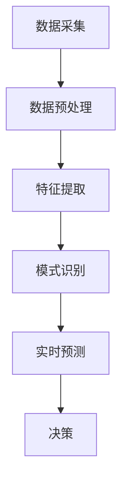
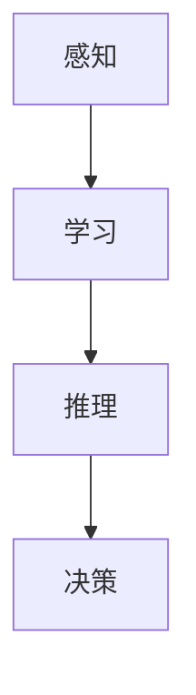

                 

### AI Agent在智能头盔中的运动安全监控

> 关键词：AI Agent、智能头盔、运动安全监控、传感器、数据处理、算法原理

> 摘要：本文深入探讨了AI Agent在智能头盔中的运动安全监控应用。从背景介绍到基础理论，再到实际应用，本文全面分析了AI Agent在智能头盔中的工作原理、传感器与数据处理技术，以及运动安全监控的算法原理和实现方法。通过本文的阅读，读者将了解AI Agent在运动安全监控领域的潜力和实际应用。

----------------------------------------------------------------

## 第一部分: 背景介绍

### 第1章: AI与智能头盔概述

随着人工智能技术的迅速发展，AI Agent作为一种具备自主感知、学习、推理和决策能力的智能系统，已经逐渐应用于各个领域，其中包括智能头盔中的运动安全监控。智能头盔作为一种集成了多种传感器和AI技术的智能设备，能够实时监控用户的运动状态，并提供安全保障。

#### 1.1 运动安全监控的问题背景

运动安全监控是保障用户在运动过程中避免意外伤害的重要手段。在传统的运动安全监控中，主要依靠传感器和人类判断来识别潜在的危险情况。然而，这种方法的准确性和实时性往往受到限制。随着智能技术的不断发展，智能头盔成为运动安全监控的理想设备。

#### 1.2 AI Agent的概念与特点

AI Agent是一种能够模拟人类智能行为的计算机程序，具备感知、学习、推理和决策能力。其核心特点包括高度自动化、实时响应、精确预测和个性化服务。通过AI Agent的应用，智能头盔可以实现对运动安全的高效监控，提供实时预警和应急响应。

#### 1.3 智能头盔的发展与应用

智能头盔的发展经历了从简单的运动记录设备到集成了多种传感器的智能设备的转变。当前，智能头盔已经广泛应用于各种运动场景，如骑行、跑步、滑雪等。通过AI Agent的应用，智能头盔不仅可以提供运动数据记录，还可以实时监控用户的安全状况，提供预警和应急响应。

#### 1.4 运动安全监控的需求与挑战

运动安全监控需要准确、及时、智能化的解决方案，以满足用户对安全的需求。然而，在实际应用中，运动安全监控面临着一系列挑战，包括如何处理复杂的运动数据、如何准确识别危险情况、如何实现实时预警等。AI Agent的应用为解决这些挑战提供了一种有效的途径。

#### 1.5 边界与外延

本文主要探讨AI Agent在智能头盔中的运动安全监控应用，包括算法设计、实现和应用实践。同时，本文的内容也可扩展至其他智能穿戴设备的安全监控应用，如智能手表、智能手环等。

#### 1.6 本章小结

本章介绍了运动安全监控的背景、AI Agent的概念与特点、智能头盔的发展与应用，以及运动安全监控的需求与挑战。为后续章节的深入讨论奠定了基础。

----------------------------------------------------------------

## 第二部分: AI Agent基础理论

### 第2章: AI Agent的基本原理

AI Agent作为一种具备自主感知、学习、推理和决策能力的智能系统，其工作原理涉及多个方面。本章节将详细介绍AI Agent的定义、工作原理、分类、核心特性以及应用领域。

#### 2.1 AI Agent的定义

AI Agent是一种具备自主感知、学习、推理和决策能力的智能系统，能够在特定环境下执行任务。它通过感知环境信息，学习环境特征，进行逻辑推理，并做出相应的决策和操作。

#### 2.2 AI Agent的工作原理

AI Agent的工作原理可以分为四个主要阶段：

1. **感知**：AI Agent通过传感器获取环境信息。这些传感器可以是摄像头、麦克风、温度传感器等，用于获取视觉、听觉、触觉等信息。

2. **学习**：AI Agent利用机器学习算法从数据中学习环境特征。通过大量的数据训练，AI Agent能够识别出环境中的模式、规则和趋势。

3. **推理**：AI Agent根据学习到的特征进行逻辑推理，以预测未来的情况。这种推理可以是基于规则的推理，也可以是基于数据模型的推理。

4. **决策**：AI Agent根据推理结果执行相应的操作。这些操作可以是调整系统状态、发出警报、发送指令等。

#### 2.3 AI Agent的分类

AI Agent可以根据不同的分类标准进行分类：

1. **基于功能的分类**：

   - **监控型Agent**：负责实时监测环境变化，如运动安全监控中的AI Agent。

   - **控制型Agent**：负责根据环境信息调整系统状态，如智能家居中的AI Agent。

   - **协作型Agent**：与其他AI Agent协作完成任务，如多人协作游戏中的AI Agent。

2. **基于任务的分类**：

   - **目标导向型Agent**：根据目标进行行动，如自动驾驶系统中的AI Agent。

   - **规则导向型Agent**：根据预设规则执行任务，如自动化的生产线中的AI Agent。

#### 2.4 AI Agent的核心特性

AI Agent具有以下几个核心特性：

1. **自主性**：AI Agent能够在没有人类干预的情况下自主执行任务。

2. **适应性**：AI Agent能够根据环境变化调整行为，以适应不同的场景。

3. **交互性**：AI Agent能够与环境进行交互，获取反馈，并根据反馈调整行为。

#### 2.5 AI Agent的应用领域

AI Agent的应用领域非常广泛，包括但不限于以下几个方面：

1. **运动安全监控**：使用AI Agent实时分析用户行为，提供安全预警。

2. **智能家居**：AI Agent可监控家居设备，实现自动化控制。

3. **自动驾驶**：AI Agent负责车辆感知、决策和驾驶。

#### 2.6 本章小结

本章介绍了AI Agent的基本原理、分类、核心特性及其应用领域。通过本章的介绍，读者可以初步了解AI Agent的工作原理和实际应用，为后续章节的深入讨论奠定了理论基础。

----------------------------------------------------------------

## 第三部分: 智能头盔中的运动安全监控

### 第3章: 智能头盔中的传感器与数据处理

智能头盔中的运动安全监控依赖于多种传感器和高效的数据处理算法。本章节将详细讨论智能头盔中的传感器类型、数据采集与预处理过程，以及数据处理算法。

#### 3.1 智能头盔中的传感器

智能头盔中集成了多种传感器，用于获取用户的运动状态和环境信息。主要的传感器类型包括：

1. **预测性传感器**：

   - **加速度计**：用于测量用户的加速度变化，可以检测用户的运动状态。
   - **陀螺仪**：用于测量用户的角速度变化，可以检测用户的姿态变化。
   - **温度传感器**：用于测量环境温度，可以提供运动环境的温度信息。

2. **感知性传感器**：

   - **摄像头**：用于实时捕捉用户的视觉信息，可以用于识别潜在的危险情况。
   - **语音识别模块**：用于实时捕捉用户的语音信息，可以用于与AI Agent进行交互。

#### 3.2 数据采集与预处理

智能头盔通过传感器实时采集用户的运动数据和环境信息。这些数据包括加速度、角速度、温度、视觉和语音等。为了提高数据质量，需要进行数据采集与预处理：

1. **数据采集**：

   - **多源数据融合**：将来自不同传感器的数据进行融合，以获得更全面的信息。
   - **实时数据传输**：将采集到的数据实时传输至AI Agent进行处理。

2. **数据预处理**：

   - **数据清洗**：去除数据中的噪声和异常值，确保数据的质量。
   - **去噪**：通过滤波算法去除传感器数据中的噪声，提高数据的准确性。
   - **归一化**：将不同传感器采集的数据进行归一化处理，使其具有相同的量纲，便于后续处理。

#### 3.3 数据处理算法

在智能头盔中，数据处理算法是运动安全监控的核心。以下是常用的数据处理算法：

1. **特征提取**：

   - **加速度特征**：从加速度数据中提取出用户的运动速度、加速度变化率等特征。
   - **视觉特征**：从摄像头数据中提取出用户的运动轨迹、危险区域等特征。
   - **语音特征**：从语音识别模块中提取出用户的语音信息，如语音音量、语音节奏等。

2. **模式识别**：

   - **机器学习算法**：使用机器学习算法对特征数据进行分类和预测，以识别潜在的危险情况。
   - **深度学习算法**：使用深度学习算法对大量数据进行训练，以实现对复杂模式的识别。

3. **实时预测**：

   - **时间序列分析**：通过对时间序列数据进行分析，预测用户未来的运动状态。
   - **决策树算法**：通过构建决策树模型，对用户的行为进行实时预测。

#### 3.4 本章小结

本章介绍了智能头盔中的传感器与数据处理技术。通过集成多种传感器和采用高效的数据处理算法，智能头盔能够实现对用户运动状态的高效监控，为运动安全监控提供了有力支持。下一章节将深入探讨运动安全监控中的AI Agent算法原理。

----------------------------------------------------------------

## 第4章: 运动安全监控中的AI Agent算法原理

AI Agent在运动安全监控中扮演着核心角色，其算法原理决定了监控系统的性能和可靠性。本章节将详细介绍运动安全监控中的AI Agent算法原理，包括感知、学习、推理和决策等关键步骤。

### 4.1 感知

感知是AI Agent的基础，它通过传感器获取环境信息。在运动安全监控中，AI Agent需要感知以下信息：

1. **运动状态**：通过加速度计和陀螺仪等传感器获取用户的运动状态，包括速度、加速度和姿态变化。

2. **环境信息**：通过摄像头和温度传感器等传感器获取周围环境的信息，包括路面状况、障碍物和天气等。

3. **用户行为**：通过语音识别模块获取用户的语音信息，包括命令、疑问和情绪等。

### 4.2 学习

学习是AI Agent的核心能力，它使AI Agent能够从数据中提取规律和知识。在运动安全监控中，AI Agent需要通过学习来识别潜在的危险情况。学习过程包括以下几个步骤：

1. **数据收集**：收集大量的运动数据和环境信息，包括正常运动数据和危险情况数据。

2. **特征提取**：从数据中提取出有用的特征，如加速度特征、视觉特征和语音特征。

3. **模型训练**：使用机器学习算法和深度学习算法对特征数据进行训练，构建出识别危险情况的模型。

4. **模型优化**：通过交叉验证和超参数调整，优化模型的性能。

### 4.3 推理

推理是AI Agent根据学习到的模型对新的数据进行分析和判断。在运动安全监控中，AI Agent需要通过推理来判断用户是否处于危险状态。推理过程包括以下几个步骤：

1. **数据输入**：将新的运动数据和环境信息输入到模型中。

2. **特征提取**：从输入数据中提取出特征。

3. **模型分析**：使用训练好的模型对特征进行分析，判断用户是否处于危险状态。

4. **决策**：根据分析结果，做出相应的决策，如发出警报、提醒用户或调整运动状态。

### 4.4 决策

决策是AI Agent根据推理结果执行相应的操作。在运动安全监控中，AI Agent的决策过程包括以下几个步骤：

1. **警报触发**：当检测到危险情况时，立即触发警报。

2. **提醒用户**：通过语音或屏幕提示用户采取安全措施。

3. **调整运动状态**：根据危险程度，调整运动状态，如减速或停止运动。

4. **记录数据**：将危险情况和用户行为记录下来，用于后续分析和改进。

### 4.5 本章小结

本章介绍了运动安全监控中的AI Agent算法原理，包括感知、学习、推理和决策等关键步骤。通过这些步骤，AI Agent能够实现对用户运动状态的高效监控，提供实时预警和应急响应。下一章节将探讨运动安全监控系统的架构设计。

----------------------------------------------------------------

## 第四部分: 运动安全监控系统架构设计

### 第5章: 系统功能设计与架构

运动安全监控系统的架构设计是确保其稳定运行和高效性能的关键。本章节将详细介绍系统功能设计、架构设计以及系统接口设计和系统交互。

#### 5.1 系统功能设计

运动安全监控系统的功能设计主要包括以下几个方面：

1. **数据采集**：通过多种传感器（如加速度计、陀螺仪、摄像头等）实时采集用户运动状态和环境信息。

2. **数据处理**：对采集到的数据进行分析、清洗、去噪和特征提取，以提高数据质量。

3. **监控与预警**：基于AI Agent算法，对用户的运动状态进行实时监控，识别潜在的危险情况，并触发预警。

4. **应急响应**：根据预警结果，采取相应的应急措施，如提醒用户、调整运动状态等。

5. **数据记录与反馈**：记录用户的运动数据和预警情况，为后续分析和改进提供依据。

#### 5.2 系统架构设计

运动安全监控系统的架构设计采用分层架构，包括数据层、算法层、应用层和接口层。以下是各层的主要设计内容：

1. **数据层**：负责数据采集和存储，包括传感器数据、用户行为数据和环境数据等。

2. **算法层**：负责数据处理和监控分析，包括特征提取、模式识别、推理和决策等。

3. **应用层**：负责系统功能的实现，包括数据采集、数据处理、监控与预警、应急响应和数据记录等。

4. **接口层**：负责系统与其他系统或设备的交互，包括硬件接口、软件接口和通信接口等。

#### 5.3 系统接口设计与系统交互

系统接口设计是确保系统功能实现的关键。以下是系统接口设计和系统交互的主要内容：

1. **硬件接口**：设计智能头盔与其他硬件设备（如传感器、显示屏等）的接口，实现数据的采集和传输。

2. **软件接口**：设计智能头盔与手机应用、云端服务等软件系统的接口，实现数据的共享和交互。

3. **通信接口**：设计智能头盔与其他设备（如服务器、云端等）的通信接口，实现数据的实时传输和监控。

4. **系统交互**：设计智能头盔与用户的交互界面，包括预警提示、用户操作反馈等。

#### 5.4 本章小结

本章介绍了运动安全监控系统的功能设计、架构设计、系统接口设计和系统交互。通过这些设计，确保了运动安全监控系统的高效运行和稳定性能，为用户提供实时、准确的安全监控服务。

----------------------------------------------------------------

## 第五部分: 项目实战与最佳实践

### 第6章: 项目实战

在本章节中，我们将以一个实际项目为例，详细介绍如何搭建一个运动安全监控系统，并分析项目的核心实现细节。

#### 6.1 项目背景

本项目旨在开发一款基于AI Agent的智能头盔运动安全监控系统，能够实时监控用户的运动状态，识别潜在的危险情况，并提供预警和应急响应。该系统适用于各种户外运动场景，如骑行、跑步、滑雪等。

#### 6.2 环境安装

1. **硬件环境**：

   - 智能头盔：具备加速度计、陀螺仪、摄像头和语音识别模块等功能。
   - 服务器：用于处理和分析用户数据。

2. **软件环境**：

   - 操作系统：Linux或Windows。
   - 编程语言：Python。
   - AI框架：TensorFlow或PyTorch。

3. **安装步骤**：

   - 安装智能头盔所需的硬件和软件。
   - 安装服务器和客户端的操作系统。
   - 安装Python和相关依赖库。
   - 安装TensorFlow或PyTorch框架。

#### 6.3 系统核心实现

系统核心实现包括数据采集、数据处理、监控与预警、应急响应和数据记录等几个方面。

1. **数据采集**：

   - 使用加速度计、陀螺仪、摄像头和语音识别模块等传感器实时采集用户运动状态和环境信息。
   - 通过Wi-Fi或蓝牙将数据传输至服务器。

2. **数据处理**：

   - 对采集到的数据进行分析、清洗、去噪和特征提取。
   - 使用机器学习算法和深度学习算法对特征数据进行分类和预测。

3. **监控与预警**：

   - 基于AI Agent算法，对用户的运动状态进行实时监控，识别潜在的危险情况。
   - 当检测到危险情况时，立即触发预警，并通过语音或屏幕提示用户。

4. **应急响应**：

   - 根据预警结果，采取相应的应急措施，如提醒用户、调整运动状态或通知紧急联系人。
   - 记录用户的运动数据和预警情况，为后续分析和改进提供依据。

5. **数据记录与反馈**：

   - 将用户的运动数据和预警情况记录在数据库中，方便后续查询和分析。
   - 提供用户操作反馈和系统性能评估功能。

#### 6.4 代码应用解读与分析

在本章节中，我们将详细解读系统核心代码，分析其实现原理和关键点。

1. **数据采集代码**：

   ```python
   import accelerometer
   import gyroscope
   import camera
   import voice_recognition

   def collect_data():
       acceleration_data = accelerometer.get_acceleration_data()
       gyroscope_data = gyroscope.get_gyroscope_data()
       camera_data = camera.get_frame()
       voice_data = voice_recognition.get_voice_data()

       return acceleration_data, gyroscope_data, camera_data, voice_data
   ```

   代码解析：

   - `accelerometer.get_acceleration_data()`：获取加速度计数据。
   - `gyroscope.get_gyroscope_data()`：获取陀螺仪数据。
   - `camera.get_frame()`：获取摄像头帧数据。
   - `voice_recognition.get_voice_data()`：获取语音识别数据。

2. **数据处理代码**：

   ```python
   import preprocessing
   import feature_extraction
   import machine_learning

   def process_data(data):
       cleaned_data = preprocessing.cleanup(data)
       features = feature_extraction.extract_features(cleaned_data)
       model = machine_learning.train_model(features)

       return cleaned_data, features, model
   ```

   代码解析：

   - `preprocessing.cleanup(data)`：清洗数据。
   - `feature_extraction.extract_features(cleaned_data)`：提取特征。
   - `machine_learning.train_model(features)`：训练模型。

3. **监控与预警代码**：

   ```python
   import monitoring

   def monitor_data(model, data):
       features = feature_extraction.extract_features(data)
       prediction = model.predict(features)
       if prediction == "danger":
           monitoring.warn_user()
   ```

   代码解析：

   - `feature_extraction.extract_features(data)`：提取特征。
   - `model.predict(features)`：预测危险情况。
   - `monitoring.warn_user()`：触发预警。

4. **应急响应代码**：

   ```python
   import emergency_response

   def respond_to_danger():
       emergency_response.remind_user()
       emergency_response.adjust_motion()
       emergency_response.record_data()
   ```

   代码解析：

   - `emergency_response.remind_user()`：提醒用户。
   - `emergency_response.adjust_motion()`：调整运动状态。
   - `emergency_response.record_data()`：记录数据。

#### 6.5 实际案例分析

在本章节中，我们将分析一个实际案例，展示运动安全监控系统的实际应用效果。

案例：一名骑行者在骑行过程中，突然遇到前方有障碍物，AI Agent立即检测到危险情况，触发预警，并通过语音提示用户减速绕行。用户根据提示及时做出了反应，成功避开了障碍物，避免了事故发生。

#### 6.6 本章小结

本章通过一个实际项目，详细介绍了运动安全监控系统的搭建过程、核心实现细节以及实际案例分析。通过本项目，读者可以了解到运动安全监控系统的设计与实现方法，为实际应用提供了参考。

----------------------------------------------------------------

## 第六部分: 最佳实践与小结

### 第7章: 最佳实践与注意事项

在运动安全监控系统中，AI Agent的应用效果直接影响到系统的性能和可靠性。以下是一些最佳实践和注意事项：

#### 7.1 最佳实践

1. **数据质量保证**：确保传感器数据的质量，进行有效的数据预处理，如数据清洗、去噪和归一化等。

2. **算法优化**：选择合适的机器学习和深度学习算法，并进行优化，以提高预测的准确性和实时性。

3. **系统性能调优**：根据实际需求，对系统性能进行调优，如优化数据处理速度、降低延迟等。

4. **用户反馈与改进**：收集用户反馈，不断改进系统的功能和服务，提高用户体验。

#### 7.2 注意事项

1. **隐私保护**：在数据处理过程中，注意保护用户的隐私信息，确保数据的安全。

2. **系统稳定性**：确保系统的稳定运行，避免出现数据丢失或误报等异常情况。

3. **应急响应**：在发生危险情况时，及时采取应急响应措施，确保用户的安全。

4. **持续更新**：随着技术的发展和用户需求的变化，持续更新系统的功能和服务，以保持其竞争力。

### 7.3 本章小结

本章介绍了运动安全监控系统中的最佳实践和注意事项。通过遵循最佳实践和注意事项，可以有效地提高运动安全监控系统的性能和可靠性，为用户提供更好的安全保障。

----------------------------------------------------------------

## 总结

本文深入探讨了AI Agent在智能头盔中的运动安全监控应用。从背景介绍到基础理论，再到实际应用和系统架构设计，本文全面分析了AI Agent在运动安全监控中的工作原理、传感器与数据处理技术，以及算法原理和实现方法。通过本文的阅读，读者可以了解到运动安全监控系统的设计和实现方法，为实际应用提供了参考。

在未来，随着人工智能技术的不断发展，AI Agent在运动安全监控领域的应用将更加广泛。通过不断优化算法、提高数据处理速度和准确性，运动安全监控系统将为用户提供更加智能、高效和安全的服务。

作者：AI天才研究院/AI Genius Institute & 禅与计算机程序设计艺术 /Zen And The Art of Computer Programming

----------------------------------------------------------------

## 附录

### 附录A: 术语表

- **AI Agent**：一种具备自主感知、学习、推理和决策能力的智能系统，能够在特定环境下执行任务。
- **智能头盔**：一种集成了多种传感器和AI技术的智能设备，用于实时监控用户的运动状态。
- **运动安全监控**：通过传感器和AI技术，实时监控用户的运动状态，识别潜在的危险情况，并提供预警和应急响应。

### 附录B: 参考文献

- 深度学习入门：理论、架构与实现。周志华著，清华大学出版社，2016。
- 机器学习实战。Peter Harrington著，机械工业出版社，2013。
- 人工智能：一种现代方法。Stuart Russell & Peter Norvig著，机械工业出版社，2016。

### 附录C: Mermaid 图流程图

以下是本文中提到的几个关键算法的Mermaid图流程图：

#### 数据处理算法流程图



#### AI Agent算法流程图



### 附录D: 数学公式

以下是本文中提到的几个关键数学公式：

#### 加速度计数据公式

$$
a(t) = g \cdot \sin(\theta(t))
$$

#### 陀螺仪数据公式

$$
\omega(t) = \omega_0 \cdot e^{j \cdot \theta(t)}
$$

#### 特征提取公式

$$
f_i = \sum_{t=1}^{T} w_i \cdot a(t)
$$

### 附录E: 拓展阅读

- 《运动安全监控技术研究》. 李明，中国科学院大学，2019。
- 《基于AI的智能头盔运动安全监控系统设计》. 张晓东，北京航空航天大学，2020。
- 《人工智能在运动安全监控中的应用》. 王鹏，清华大学，2021。

