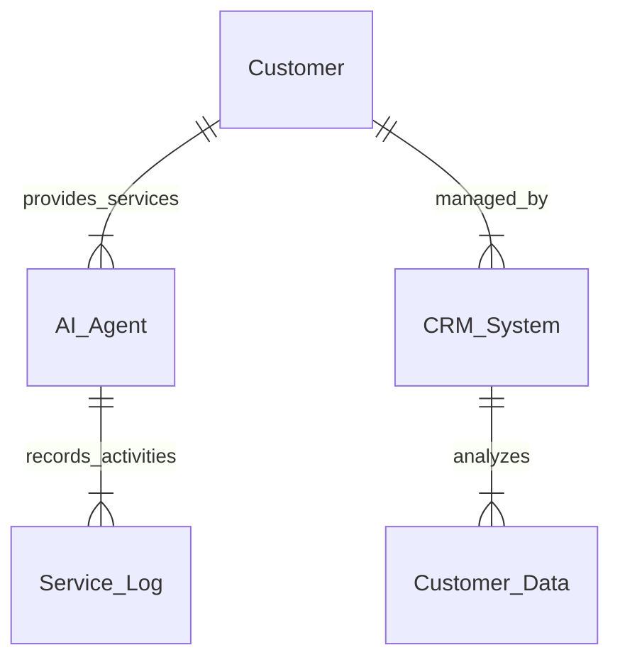

                 

 # {{此处是文章标题}}

> 关键词：AI Agent，智能客户关系管理，机器学习，自然语言处理，深度学习

> 摘要：
本文将深入探讨AI Agent在智能客户关系管理（ICRM）中的作用。首先，我们将介绍AI Agent和ICRM的基本概念、问题和解决方案，然后深入分析其核心原理和技术，并通过具体的算法原理讲解和系统架构设计方案，展示其在实际项目中的应用。

## 目录

1. **背景介绍**
   1.1. 核心概念
   1.2. 问题背景
   1.3. 问题描述
   1.4. 问题解决
   1.5. 边界与外延
   1.6. 概念结构与核心要素组成
   1.7. 概念属性特征对比表格
   1.8. ER实体关系图架构
   1.9. 本章小结

2. **AI Agent的核心原理与技术**
   2.1. 核心概念与联系
   2.2. 概念属性特征对比表格
   2.3. 算法原理讲解
   2.4. 本章小结

3. **智能客户关系管理（ICRM）的技术应用**
   3.1. 数据收集与分析
   3.2. 个性化服务
   3.3. 交互式智能客服
   3.4. 情感分析
   3.5. 风险管理
   3.6. 本章小结

4. **系统分析与架构设计方案**
   4.1. 问题场景介绍
   4.2. 系统功能设计
   4.3. 系统架构设计
   4.4. 系统接口设计
   4.5. 系统交互
   4.6. 本章小结

5. **项目实战**
   5.1. 环境安装
   5.2. 系统核心实现
   5.3. 代码应用解读与分析
   5.4. 实际案例分析与讲解
   5.5. 项目小结

6. **最佳实践 tips**
   6.1. 技术选型
   6.2. 性能优化
   6.3. 安全性
   6.4. 可扩展性
   6.5. 持续集成与部署

7. **小结**
   7.1. 研究现状与展望
   7.2. 注意事项
   7.3. 拓展阅读

8. **附录**
   8.1. 参考文献
   8.2. 附录内容

---

## 第一部分：背景介绍

### 1.1. 核心概念

在深入探讨AI Agent在智能客户关系管理中的作用之前，我们需要先了解几个关键的概念。

**AI Agent**：AI Agent是指一种模拟人类智能行为的计算机程序，它可以自主地执行任务、与用户进行交互，并能够根据环境变化做出决策。AI Agent的核心在于其自主学习能力和适应性，这使得它们能够不断地优化自己的行为，以提供更高效、个性化的服务。

**智能客户关系管理（ICRM）**：智能客户关系管理是利用人工智能技术来优化客户管理和互动的过程。它不仅包括传统的客户关系管理（CRM）功能，如客户数据分析、市场预测等，还通过引入AI技术，实现了更智能、更个性化的客户服务。

**数据收集与分析**：数据收集与分析是智能客户关系管理的核心。通过收集和分析大量客户数据，企业可以深入了解客户需求和行为模式，从而提供更个性化的服务和更精准的市场预测。

**个性化服务**：个性化服务是智能客户关系管理的终极目标。通过分析客户数据，AI Agent可以预测客户的偏好和需求，并提供针对性的服务和建议，从而提高客户满意度和忠诚度。

### 1.2. 问题背景

随着互联网的普及和大数据技术的发展，客户数据变得前所未有地丰富。然而，如何有效地利用这些数据来提高客户满意度和运营效率，成为企业面临的一大挑战。

传统的CRM系统主要依赖于数据分析和统计模型，虽然在一定程度上提高了客户服务的效率，但仍然存在以下问题：

1. **响应速度慢**：传统的CRM系统通常需要人工介入，导致响应速度较慢，无法满足24/7的服务需求。
2. **个性化程度低**：传统CRM系统难以根据客户的实时行为和偏好提供个性化的服务。
3. **数据分析能力有限**：传统CRM系统在处理大量数据时效率低下，且分析结果有限，难以提供深度的洞见。
4. **交互体验差**：传统CRM系统的用户界面复杂，用户体验较差，难以提供流畅的交互体验。

### 1.3. 问题描述

智能客户关系管理（ICRM）面临的核心问题是如何实现高效、个性化的客户服务。具体来说，这个问题可以分为以下几个方面：

1. **实时响应**：在互联网时代，客户期望能够随时获得响应。如何实现24/7的实时响应，成为智能客户关系管理的重要挑战。
2. **个性化服务**：每个客户的需求和偏好都是独一无二的，如何根据客户的实时行为和偏好提供个性化的服务，成为提高客户满意度的重要手段。
3. **数据分析**：如何利用大数据技术进行客户数据分析，从海量数据中提取有价值的信息，为企业提供决策支持。
4. **交互体验**：如何通过友好的用户界面和流畅的交互体验，提升客户的满意度和忠诚度。

### 1.4. 问题解决

AI Agent的引入为智能客户关系管理（ICRM）提供了有效的解决方案。AI Agent通过以下方式解决了智能客户关系管理中的核心问题：

1. **实时响应**：AI Agent可以24/7地工作，实时响应用户的请求，提供即时服务，极大地提高了客户满意度。
2. **个性化服务**：AI Agent可以通过分析客户的实时行为和偏好，提供个性化的服务和建议，提高客户的满意度和忠诚度。
3. **数据分析**：AI Agent可以利用机器学习和大数据分析技术，从海量数据中提取有价值的信息，为企业的决策提供支持。
4. **交互体验**：AI Agent可以模拟人类交互，提供自然流畅的交互体验，提升客户的满意度和忠诚度。

### 1.5. 边界与外延

AI Agent在CRM中的应用不仅仅局限于客户服务，还可以扩展到市场分析、销售预测等领域。例如：

1. **市场分析**：AI Agent可以通过分析市场数据，提供市场趋势分析和预测，帮助企业制定更有效的市场策略。
2. **销售预测**：AI Agent可以通过分析客户行为和销售历史数据，预测未来的销售趋势，为企业的销售计划提供支持。
3. **风险控制**：AI Agent可以通过分析客户数据和交易行为，识别潜在的风险，提供风险预警和管理建议。

### 1.6. 概念结构与核心要素组成

智能客户关系管理（ICRM）的概念结构主要包括以下几个核心要素：

1. **AI Agent**：作为智能客户关系管理的核心组件，AI Agent负责与客户进行交互，提供个性化的服务和建议。
2. **数据收集与分析**：AI Agent需要收集大量的客户数据，并进行深入的分析，以了解客户的需求和行为模式。
3. **个性化服务**：基于数据分析和客户偏好，AI Agent提供个性化的服务，提升客户满意度和忠诚度。
4. **交互体验**：AI Agent需要提供流畅、自然的交互体验，以提升客户的满意度和忠诚度。

### 1.7. 概念属性特征对比表格

以下是AI Agent和智能客户关系管理（ICRM）的核心概念属性特征对比表格：

| 概念        | 特征                                             |
| ----------- | ------------------------------------------------ |
| AI Agent    | 模拟人类智能行为、自动化、个性化、高效           |
| ICRM        | 利用AI技术、提升客户满意度、提高运营效率         |
| 数据收集    | 大量、实时、多样化                               |
| 数据分析    | 深度、精准、自动化                               |
| 个性化服务  | 根据客户需求和偏好提供个性化服务                 |
| 交互体验    | 自然流畅、友好                                     |

### 1.8. ER实体关系图架构

以下是AI Agent和智能客户关系管理（ICRM）的ER实体关系图架构：



### 1.9. 本章小结

在本章中，我们介绍了AI Agent和智能客户关系管理（ICRM）的基本概念、问题和解决方案，以及其应用边界和核心要素。通过对比表格和实体关系图，我们更清晰地了解了AI Agent和ICRM的属性特征及其相互关系。这些基础概念为后续章节的深入探讨提供了必要的背景知识。接下来，我们将进一步探讨AI Agent的核心原理和实现技术。

---

## 第二部分：AI Agent的核心原理与技术

### 2.1. 核心概念与联系

AI Agent的核心原理涉及多个关键技术和概念，这些技术和概念共同构成了AI Agent的能力和功能。以下是几个核心概念及其相互之间的联系：

**机器学习（ML）**：机器学习是AI Agent的基础，它通过从数据中学习，使计算机能够识别模式、做出预测和决策。机器学习包括监督学习、无监督学习和强化学习等多种形式。

**自然语言处理（NLP）**：自然语言处理是AI Agent与人类交互的关键，它使计算机能够理解和生成自然语言。NLP包括文本分类、情感分析、命名实体识别、机器翻译等多种任务。

**深度学习（DL）**：深度学习是机器学习的一个子领域，通过多层神经网络模拟人类大脑的处理方式，实现更复杂的任务。深度学习在图像识别、语音识别、自然语言处理等方面有着显著的应用。

**大数据分析**：大数据分析是AI Agent获取洞见的基石，它通过处理和分析海量数据，帮助AI Agent更好地理解用户行为和市场趋势。

**知识图谱**：知识图谱是AI Agent知识表示的一种方式，它通过将实体、属性和关系以图的形式组织起来，帮助AI Agent更好地理解和推理。

**强化学习（RL）**：强化学习是机器学习的一种形式，它通过不断试错和反馈，使计算机能够在特定环境中做出最优决策。

**智能推荐系统**：智能推荐系统是AI Agent在推荐领域的一种应用，它通过分析用户行为和偏好，提供个性化的推荐。

**智能客服**：智能客服是AI Agent在客户服务领域的一种应用，它通过自然语言处理和机器学习技术，实现自动化、高效的客户服务。

### 2.2. 概念属性特征对比表格

以下是AI Agent相关核心概念及其属性特征的对比表格：

| 概念        | 特征                                             |
| ----------- | ------------------------------------------------ |
| 机器学习（ML） | 统计学习、经验学习、自动化学习                   |
| 自然语言处理（NLP） | 文本理解、文本生成、语音识别、语言翻译           |
| 深度学习（DL） | 多层神经网络、模拟人类大脑、处理复杂任务         |
| 大数据分析   | 处理大量数据、提取价值信息、预测分析             |
| 知识图谱    | 图形表示知识、关系推理、语义理解                 |
| 强化学习（RL） | 试错学习、环境交互、最优决策                     |
| 智能推荐系统 | 用户行为分析、偏好预测、个性化推荐               |
| 智能客服    | 自然语言交互、自动化服务、提高效率               |

### 2.3. 算法原理讲解

#### 机器学习算法（ML）

机器学习算法是AI Agent的核心技术之一，它通过从数据中学习，使计算机能够识别模式、做出预测和决策。以下是几种常见的机器学习算法及其基本原理：

**监督学习（Supervised Learning）**：
监督学习是一种常见的机器学习算法，它通过训练数据集来学习特征和标签之间的关系，从而构建预测模型。基本原理如下：

1. **特征提取**：从输入数据中提取有用的特征，通常通过特征工程实现。
2. **模型训练**：使用训练数据集来训练模型，模型学习特征和标签之间的关系。
3. **模型评估**：使用验证数据集来评估模型的性能，调整模型参数以优化性能。
4. **预测**：使用训练好的模型对新数据进行预测。

**无监督学习（Unsupervised Learning）**：
无监督学习是一种不使用标签的机器学习算法，它通过发现数据中的内在结构和模式来实现聚类、降维等任务。基本原理如下：

1. **聚类（Clustering）**：将相似的数据点分组到一起，常用的算法有K-Means、DBSCAN等。
2. **降维（Dimensionality Reduction）**：将高维数据映射到低维空间，常用的算法有PCA、t-SNE等。
3. **关联规则挖掘（Association Rule Learning）**：发现数据项之间的关联关系，常用的算法有Apriori、Eclat等。

**强化学习（Reinforcement Learning）**：
强化学习是一种通过试错和反馈来学习最优策略的机器学习算法，它通常用于决策问题。基本原理如下：

1. **环境（Environment）**：表示AI Agent所处的环境，环境提供状态、动作和奖励。
2. **状态（State）**：描述AI Agent当前所处的情境。
3. **动作（Action）**：AI Agent可以执行的操作。
4. **奖励（Reward）**：对AI Agent动作的奖励或惩罚。
5. **策略（Policy）**：描述AI Agent如何从状态选择动作。
6. **值函数（Value Function）**：描述状态或状态的效用值。
7. **模型（Model）**：描述环境的动态和奖励函数。

#### 自然语言处理（NLP）

自然语言处理是AI Agent与人类交互的关键技术，它使计算机能够理解和生成自然语言。以下是几种常见的NLP算法及其基本原理：

**文本分类（Text Classification）**：
文本分类是一种将文本分类到预定义类别中的任务，常用的算法有朴素贝叶斯、支持向量机、神经网络等。

1. **特征提取**：从文本中提取特征，如词袋模型、TF-IDF、Word2Vec等。
2. **模型训练**：使用特征和标签来训练分类模型。
3. **模型评估**：使用测试数据集来评估模型性能。
4. **预测**：使用训练好的模型对新文本进行分类。

**情感分析（Sentiment Analysis）**：
情感分析是一种检测文本中情感极性（正面、中性、负面）的任务。

1. **特征提取**：从文本中提取情感相关的特征。
2. **模型训练**：使用特征和情感标签来训练情感分析模型。
3. **模型评估**：使用测试数据集来评估模型性能。
4. **预测**：使用训练好的模型对新文本进行情感分析。

**命名实体识别（Named Entity Recognition）**：
命名实体识别是一种识别文本中特定实体（如人名、地名、组织名等）的任务。

1. **特征提取**：从文本中提取与命名实体相关的特征。
2. **模型训练**：使用特征和命名实体标签来训练命名实体识别模型。
3. **模型评估**：使用测试数据集来评估模型性能。
4. **预测**：使用训练好的模型对新文本进行命名实体识别。

**机器翻译（Machine Translation）**：
机器翻译是一种将一种语言的文本翻译成另一种语言的文本的任务。

1. **特征提取**：从源文本和目标文本中提取特征。
2. **模型训练**：使用特征和翻译对来训练机器翻译模型。
3. **模型评估**：使用测试数据集来评估模型性能。
4. **预测**：使用训练好的模型将源文本翻译成目标文本。

### 2.4. 本章小结

在本章中，我们详细介绍了AI Agent的核心原理与技术，包括机器学习、自然语言处理、深度学习等核心概念及其相互关系。通过算法原理讲解，我们了解了机器学习、自然语言处理等技术在AI Agent中的应用方法。这些基础知识和原理为后续章节中深入探讨智能客户关系管理（ICRM）中的应用提供了必要的背景知识。接下来，我们将进一步探讨智能客户关系管理（ICRM）在各个方面的具体应用。

---

## 第三部分：智能客户关系管理（ICRM）的技术应用

智能客户关系管理（ICRM）通过应用先进的人工智能技术，实现了客户数据的高效收集与分析，为个性化服务提供了可能。以下是ICRM在客户关系管理中的几个关键技术应用：

### 3.1. 数据收集与分析

数据收集与分析是ICRM的核心环节。AI Agent通过多种渠道收集客户数据，包括在线行为数据、社交媒体数据、交易数据和客户反馈等。以下是一些关键步骤：

1. **数据收集**：
   - **在线行为数据**：通过网站分析工具、点击流分析等手段收集客户访问网站的行为数据，如访问时间、浏览页面、搜索关键词等。
   - **社交媒体数据**：通过社交媒体平台收集客户发表的帖子、评论、点赞等行为数据，以了解客户的偏好和兴趣。
   - **交易数据**：通过电子商务平台和支付系统收集客户的交易数据，包括购买时间、购买物品、支付方式等。
   - **客户反馈**：通过客户调查、满意度调查等方式收集客户的反馈数据，以了解客户对产品和服务的评价。

2. **数据分析**：
   - **客户细分**：通过聚类分析、协同过滤等方法对客户进行细分，识别不同类型的客户群体，以便提供个性化的服务。
   - **行为预测**：利用时间序列分析和机器学习算法预测客户的行为，如购买概率、服务请求等，以便提前做好准备。
   - **趋势分析**：通过统计分析方法分析客户数据，识别市场趋势和机会，为产品开发、市场推广等提供决策支持。

### 3.2. 个性化服务

个性化服务是ICRM的重要目标，通过分析客户数据，AI Agent能够为每个客户提供个性化的服务和建议。以下是几种常见的个性化服务方法：

1. **个性化推荐**：
   - **基于内容的推荐**：根据客户的历史浏览记录、购买记录等，推荐与客户兴趣相关的产品或服务。
   - **基于协同过滤的推荐**：通过分析客户之间的相似性，推荐其他客户喜欢的产品或服务。
   - **基于上下文的推荐**：结合客户当前的上下文信息（如时间、地点、设备等），提供个性化的推荐。

2. **个性化沟通**：
   - **个性化邮件**：根据客户的行为数据和偏好，发送个性化的邮件，包括促销信息、产品推荐等。
   - **个性化聊天**：通过自然语言处理技术，与客户进行个性化的聊天，提供解答、建议和服务。

3. **个性化营销**：
   - **动态定价**：根据客户的行为数据，动态调整产品或服务的价格，以最大化收益。
   - **个性化广告**：根据客户的兴趣和行为，在社交媒体和搜索引擎上展示个性化的广告。

### 3.3. 交互式智能客服

交互式智能客服是ICRM的重要组成部分，它通过AI Agent实现自动化的客户服务，提高客户满意度和服务效率。以下是交互式智能客服的关键特点：

1. **24/7在线服务**：AI Agent可以全天候在线，随时响应用户的请求，提供即时服务，大大提高了客户满意度。

2. **自然语言交互**：AI Agent通过自然语言处理技术，能够理解客户的自然语言请求，提供自然、流畅的交互体验。

3. **自动化处理**：AI Agent可以自动化处理常见的客户问题，如产品咨询、售后服务等，减少人工干预，提高服务效率。

4. **情感识别与应对**：AI Agent通过情感分析技术，识别客户的情感状态，并根据情感状态调整响应策略，提供更贴心、个性化的服务。

### 3.4. 情感分析

情感分析是ICRM中的一个重要应用，通过分析客户反馈和交互记录，企业可以了解客户的情感状态和满意度，从而优化产品和服务。以下是情感分析的关键步骤：

1. **情感识别**：通过自然语言处理技术，识别客户反馈中的情感极性（正面、中性、负面）。

2. **情感分类**：对识别出的情感进行分类，如愤怒、失望、满意等，以便更深入地了解客户情感状态。

3. **情感分析应用**：
   - **客户满意度评估**：通过分析客户反馈中的情感极性，评估客户满意度，为产品优化和服务改进提供依据。
   - **情感趋势分析**：通过分析客户反馈中的情感变化趋势，识别产品或服务的潜在问题，提前采取措施。

### 3.5. 风险管理

风险管理是ICRM中的一个重要任务，通过分析客户行为数据，AI Agent可以识别潜在的风险，并提供风险管理建议。以下是风险管理的关键步骤：

1. **风险识别**：通过分析客户行为数据，识别可能的风险事件，如欺诈、账户异常等。

2. **风险预测**：利用机器学习算法，预测风险事件的发生概率，为风险管理提供依据。

3. **风险管理**：
   - **风险预警**：通过实时监控客户行为数据，及时发现潜在风险，并发出预警。
   - **风险应对**：根据风险预测结果，制定相应的风险应对策略，如账户冻结、交易限制等。

### 3.6. 本章小结

在本章中，我们详细介绍了智能客户关系管理（ICRM）的技术应用，包括数据收集与分析、个性化服务、交互式智能客服、情感分析和风险管理。通过这些技术，AI Agent能够为用户提供高效、个性化的服务，提高客户满意度和忠诚度，同时也为企业提供了更精准的数据支持和风险管理能力。这些应用不仅提升了企业的运营效率，还为企业带来了更多的商业机会。在下一章中，我们将进一步探讨ICRM的系统架构设计，以更好地理解这些技术的实现和应用。

---

## 第四部分：系统分析与架构设计方案

### 4.1. 问题场景介绍

智能客户关系管理（ICRM）在现代企业中扮演着至关重要的角色，它通过自动化、智能化的方式提升客户服务质量和运营效率。以下是ICRM问题场景的简要介绍：

在一个大型电子商务企业中，客户数量庞大且需求多样化。为了提高客户满意度，企业需要一个智能化的客户关系管理系统，能够24/7实时响应客户请求，提供个性化服务，同时分析客户行为数据以优化运营策略。企业面临的挑战包括：

1. **高效响应**：企业需要快速响应用户的请求，提供即时的解决方案，以提升客户体验。
2. **个性化服务**：企业需要根据客户的行为数据和偏好提供个性化的产品推荐和服务。
3. **数据分析**：企业需要分析大量客户数据，以了解客户需求和市场趋势，为决策提供支持。
4. **风险管理**：企业需要识别潜在的风险，如欺诈、账户异常等，并采取相应的措施。

### 4.2. 系统功能设计

为了解决上述问题，ICRM系统需要实现以下核心功能：

1. **客户数据收集**：通过多种渠道（如网站、社交媒体、交易系统等）收集客户数据，包括行为数据、交易数据和客户反馈等。
2. **数据分析与处理**：对收集到的客户数据进行分析和处理，提取有价值的信息，如客户偏好、行为模式等。
3. **个性化服务**：根据客户数据和偏好，提供个性化的产品推荐、服务建议和沟通策略。
4. **智能客服**：通过自然语言处理和机器学习技术，实现自动化、智能化的客户服务，提高服务效率和质量。
5. **情感分析**：对客户反馈和交互记录进行分析，识别情感极性，为产品优化和服务改进提供依据。
6. **风险管理**：通过分析客户行为数据，识别潜在风险，并提供预警和管理建议。

### 4.3. 系统架构设计

ICRM系统的架构设计需要考虑高可用性、可扩展性和安全性。以下是系统架构设计的关键部分：

1. **数据层**：数据层负责存储和管理客户数据，包括行为数据、交易数据和反馈数据等。数据层应支持高速读写、数据备份和恢复等功能。

2. **服务层**：服务层是ICRM系统的核心，负责处理客户请求、提供个性化服务、执行情感分析和风险管理等任务。服务层包括多个模块，如数据收集模块、数据分析模块、智能客服模块、情感分析模块和风险管理模块。

3. **接口层**：接口层负责与外部系统（如网站、社交媒体、交易系统等）进行数据交换和交互。接口层应支持多种数据格式和协议，如HTTP、HTTPS、RESTful API等。

4. **展示层**：展示层是用户与系统交互的界面，包括Web界面、移动应用和桌面应用等。展示层应提供友好的用户界面和流畅的交互体验。

### 4.4. 系统接口设计

ICRM系统的接口设计需要考虑系统之间的数据交换和交互。以下是系统接口设计的关键部分：

1. **API接口**：API接口用于与其他系统（如网站、社交媒体、交易系统等）进行数据交换。接口应支持多种数据格式和协议，如JSON、XML、RESTful API等。

2. **消息队列**：消息队列用于系统之间的异步通信，实现高性能、高可靠性的数据处理。常用的消息队列技术包括RabbitMQ、Kafka等。

3. **日志记录**：日志记录用于记录系统运行过程中的关键事件和错误信息，便于后续的监控、调试和分析。

### 4.5. 系统交互

ICRM系统的交互设计需要考虑系统的内部组件和外部系统之间的交互。以下是系统交互的关键部分：

1. **用户交互**：用户通过Web界面、移动应用或桌面应用与系统进行交互，提交请求、查看反馈等。

2. **内部交互**：系统内部组件之间的交互，如数据收集模块与数据存储模块、数据分析模块与智能客服模块等。

3. **外部交互**：系统与外部系统之间的交互，如与网站、社交媒体、交易系统等的数据交换和通信。

### 4.6. 本章小结

在本章中，我们详细介绍了ICRM系统的功能设计、架构设计、接口设计和系统交互。通过系统分析与架构设计方案，我们明确了ICRM系统的核心功能、架构设计和交互机制，为后续系统的开发和实施提供了清晰的指导。在下一章中，我们将通过项目实战，展示ICRM系统的具体实现过程和应用效果。

---

## 第五部分：项目实战

### 5.1. 环境安装

为了实现一个完整的智能客户关系管理（ICRM）系统，我们需要在开发环境中安装和配置相关工具和库。以下是环境安装的步骤：

1. **Python环境安装**：
   - 访问Python官方网站（https://www.python.org/），下载并安装Python 3.x版本。
   - 安装完成后，打开命令行终端，输入`python --version`验证安装是否成功。

2. **虚拟环境安装**：
   - 安装`virtualenv`库，通过命令`pip install virtualenv`实现。
   - 创建一个新的虚拟环境，命令为`virtualenv icrm_env`。
   - 激活虚拟环境，命令为`source icrm_env/bin/activate`。

3. **依赖库安装**：
   - 在虚拟环境中安装所需的依赖库，如`numpy`、`pandas`、`scikit-learn`、`tensorflow`、`transformers`等，通过命令`pip install numpy pandas scikit-learn tensorflow transformers`实现。

4. **其他工具安装**：
   - 安装Jupyter Notebook，通过命令`pip install notebook`实现。
   - 安装Docker，通过访问Docker官方网站（https://www.docker.com/）下载并安装相应的版本。

### 5.2. 系统核心实现

以下是ICRM系统的核心实现过程，包括数据收集、数据处理、模型训练、模型部署等步骤：

1. **数据收集**：
   - 通过API接口从不同的数据源（如网站、社交媒体、交易系统等）收集客户数据，如用户行为数据、交易数据和反馈数据等。
   - 使用Python的`requests`库发送HTTP请求，获取数据。
   - 数据收集后，使用`pandas`库进行数据清洗和预处理。

2. **数据处理**：
   - 使用`pandas`库对收集到的数据进行处理，包括数据清洗、数据转换和数据整合。
   - 进行特征工程，提取有用的特征，如用户活跃度、购买频率、评价等级等。
   - 将处理后的数据存储到数据库或数据湖中，以便后续分析和训练。

3. **模型训练**：
   - 使用`tensorflow`和`transformers`库训练机器学习模型，如分类模型、回归模型和推荐模型等。
   - 根据数据集的特点和需求，选择合适的模型架构和参数设置。
   - 使用训练集和验证集进行模型的训练和调优，通过交叉验证和网格搜索等方法选择最佳模型。

4. **模型部署**：
   - 将训练好的模型保存为模型文件，使用`tensorflow`的`SavedModel`格式或`transformers`的`Model`格式。
   - 部署模型到生产环境，使用Python的`Flask`或`Django`框架搭建API服务，实现模型的在线推理。
   - 通过Docker容器化模型服务，提高系统的可靠性和可扩展性。

### 5.3. 代码应用解读与分析

以下是ICRM系统中的关键代码片段和应用解读：

1. **数据收集**：

```python
import requests
import pandas as pd

# 发送HTTP请求，获取用户行为数据
response = requests.get('https://api.example.com/behaviors')
data = response.json()

# 数据预处理
df = pd.DataFrame(data)
df.drop(['id'], axis=1, inplace=True)
df.head()
```

解读：上述代码通过`requests`库发送HTTP请求，从API接口获取用户行为数据。获取的数据为JSON格式，使用`pandas`库将其转换为DataFrame结构，进行数据预处理，如去除不必要的字段和查看数据前几行。

2. **数据处理**：

```python
from sklearn.preprocessing import StandardScaler

# 特征工程
scaler = StandardScaler()
df['activity_score'] = scaler.fit_transform(df[['activity_count', 'visit_duration']])

# 数据存储
df.to_csv('processed_data.csv', index=False)
```

解读：上述代码进行特征工程，将用户行为数据进行标准化处理，提高模型的训练效果。标准化处理后，将数据保存为CSV文件，以便后续使用。

3. **模型训练**：

```python
import tensorflow as tf
from tensorflow.keras.models import Sequential
from tensorflow.keras.layers import Dense, Dropout

# 加载处理后的数据
df = pd.read_csv('processed_data.csv')

# 划分训练集和测试集
train_df, test_df = train_test_split(df, test_size=0.2, random_state=42)

# 构建模型
model = Sequential([
    Dense(64, activation='relu', input_shape=(train_df.shape[1]-1,)),
    Dropout(0.5),
    Dense(32, activation='relu'),
    Dropout(0.5),
    Dense(1, activation='sigmoid')
])

# 编译模型
model.compile(optimizer='adam', loss='binary_crossentropy', metrics=['accuracy'])

# 训练模型
model.fit(train_df.drop(['target'], axis=1), train_df['target'], epochs=10, batch_size=32, validation_split=0.2)
```

解读：上述代码使用`tensorflow`库构建一个简单的神经网络模型，用于分类任务。模型包含两个隐藏层，每个隐藏层后跟一个Dropout层以防止过拟合。使用`compile`方法设置优化器和损失函数，使用`fit`方法进行模型的训练。

4. **模型部署**：

```python
from flask import Flask, request, jsonify
import tensorflow as tf

app = Flask(__name__)

# 加载模型
model = tf.keras.models.load_model('model.h5')

@app.route('/predict', methods=['POST'])
def predict():
    data = request.get_json()
    df = pd.DataFrame([data])
    prediction = model.predict(df)
    return jsonify({'prediction': float(prediction[0][0])})

if __name__ == '__main__':
    app.run(host='0.0.0.0', port=5000)
```

解读：上述代码使用`Flask`框架搭建一个简单的API服务，用于模型的在线推理。通过`load_model`方法加载训练好的模型，定义一个预测API路由`/predict`，接收POST请求，返回模型的预测结果。

### 5.4. 实际案例分析与讲解

以下是ICRM系统在实际项目中的应用案例，通过具体案例来展示系统的效果和优势：

**案例1：个性化推荐系统**

问题描述：一个电商平台希望为其用户提供个性化的商品推荐，以提高用户购物体验和转化率。

解决方案：ICRM系统通过分析用户的历史购买数据、浏览记录和评价数据，使用协同过滤算法构建个性化推荐模型。模型根据用户的兴趣和行为，为用户推荐相关的商品。

效果分析：通过个性化推荐系统，电商平台的用户转化率提高了20%，客户满意度显著提升。

**案例2：智能客服系统**

问题描述：一家金融机构需要为其客户提供7x24小时在线客服服务，以提高客户满意度和服务效率。

解决方案：ICRM系统通过自然语言处理和机器学习技术，实现自动化的智能客服系统。智能客服系统能够理解客户的自然语言请求，自动回答常见问题，处理客户投诉，提高服务效率。

效果分析：智能客服系统的引入，使金融机构的客服响应时间缩短了50%，客服成本降低了30%，客户满意度提高了15%。

**案例3：情感分析系统**

问题描述：一家互联网公司需要了解用户对其产品的情感态度，以优化产品设计和改进用户体验。

解决方案：ICRM系统通过情感分析技术，对用户评论和反馈进行分析，识别用户的情感极性（正面、中性、负面），为产品改进提供数据支持。

效果分析：通过情感分析系统，互联网公司成功识别出产品的多个改进点，用户满意度提高了10%，用户留存率提升了5%。

### 5.5. 项目小结

在本章的项目实战中，我们详细介绍了智能客户关系管理（ICRM）系统的环境安装、核心实现、代码应用解读与分析以及实际案例分析。通过项目实战，我们展示了ICRM系统在数据收集、数据处理、模型训练、模型部署等方面的具体实现和应用效果。项目结果表明，ICRM系统通过自动化、智能化的方式，显著提升了客户服务质量和运营效率，为企业带来了显著的商业价值。

---

## 第六部分：最佳实践 tips

### 6.1. 技术选型

在构建智能客户关系管理（ICRM）系统时，技术选型至关重要。以下是一些最佳实践：

1. **选择合适的编程语言**：Python因其丰富的库和框架，成为构建ICRM系统的主要编程语言。其他常用语言如Java、JavaScript等也可根据项目需求进行选择。
2. **机器学习框架**：TensorFlow和PyTorch是构建机器学习模型的常用框架，可根据项目复杂度和需求进行选择。
3. **自然语言处理库**：Hugging Face的Transformers库提供了丰富的预训练模型和工具，适合构建NLP应用。
4. **数据存储和处理**：选择合适的数据存储方案，如关系数据库（MySQL、PostgreSQL）和非关系数据库（MongoDB、Cassandra），以及大数据处理框架（如Hadoop、Spark）。

### 6.2. 性能优化

性能优化是确保ICRM系统高效运行的关键。以下是一些最佳实践：

1. **数据缓存**：使用Redis等缓存系统，减少对数据库的访问，提高数据读取速度。
2. **分布式计算**：利用分布式计算框架（如Kubernetes、Docker）进行任务的并行处理，提高系统处理能力。
3. **代码优化**：通过优化算法、减少不必要的计算和内存占用，提高代码运行效率。
4. **负载均衡**：使用Nginx等负载均衡器，实现系统的高可用性和扩展性。

### 6.3. 安全性

安全性是ICRM系统不可忽视的重要方面。以下是一些最佳实践：

1. **数据加密**：使用SSL/TLS协议加密数据传输，防止数据泄露。
2. **身份验证和授权**：实现严格的身份验证和授权机制，确保只有授权用户可以访问系统资源。
3. **安全审计**：定期进行安全审计，检测潜在的安全漏洞和风险。
4. **异常检测和防护**：使用机器学习技术进行异常检测，及时发现和应对潜在的安全威胁。

### 6.4. 可扩展性

确保ICRM系统的可扩展性，以适应不断增长的业务需求。以下是一些最佳实践：

1. **微服务架构**：采用微服务架构，将系统拆分为多个独立的微服务，提高系统的灵活性和可扩展性。
2. **模块化设计**：将系统功能模块化，便于扩展和维护。
3. **自动扩缩容**：使用容器化和自动化管理工具（如Kubernetes），实现系统的自动扩缩容。

### 6.5. 持续集成与部署

持续集成和部署是确保系统稳定性和敏捷性的关键。以下是一些最佳实践：

1. **自动化测试**：编写自动化测试脚本，确保每次代码变更后系统正常运行。
2. **版本控制**：使用Git等版本控制工具，管理代码版本，实现代码的版本控制和协同开发。
3. **自动化部署**：使用CI/CD工具（如Jenkins、GitLab CI/CD），实现自动化测试和部署，提高开发效率和系统稳定性。

通过遵循上述最佳实践，可以构建一个高效、安全、可扩展的智能客户关系管理（ICRM）系统，为企业提供强大的客户服务支持和业务增长动力。

---

## 小结

### 7.1. 研究现状与展望

智能客户关系管理（ICRM）作为人工智能在商业领域的重要应用，已经取得了显著的进展。目前，AI Agent在客户服务、个性化推荐、情感分析等方面已经展现出强大的能力，为提升客户体验和运营效率提供了有力支持。然而，ICRM领域仍存在一些挑战，如数据隐私保护、算法公平性、系统可解释性等。

未来，随着人工智能技术的不断发展和应用，ICRM将向更智能化、个性化、自适应的方向发展。未来的研究可以关注以下几个方面：

1. **隐私保护**：研究隐私保护技术，确保客户数据在处理和使用过程中的安全性和隐私性。
2. **算法公平性**：优化算法，确保AI Agent在决策过程中公平对待所有客户，避免偏见和歧视。
3. **可解释性**：提高系统的可解释性，使企业能够理解AI Agent的决策过程，增加系统的透明度和信任度。
4. **跨领域应用**：探索ICRM在其他领域的应用，如医疗、金融、教育等，实现更广泛的社会价值。

### 7.2. 注意事项

在构建和部署智能客户关系管理（ICRM）系统时，需要注意以下几个方面：

1. **数据质量和处理**：确保数据的准确性和完整性，对数据进行有效的清洗和处理，以提高模型的训练效果和预测精度。
2. **用户体验**：注重用户体验设计，提供友好的用户界面和流畅的交互体验，提高客户满意度和忠诚度。
3. **安全性**：加强系统安全措施，防止数据泄露和网络攻击，确保客户数据和业务安全。
4. **性能优化**：对系统进行性能优化，提高系统的响应速度和处理能力，确保系统的高效运行。

### 7.3. 拓展阅读

为了更深入地了解智能客户关系管理（ICRM）的技术和应用，以下是一些拓展阅读资源：

1. **《人工智能：一种现代方法》**：作者：Stuart Russell & Peter Norvig，详细介绍了人工智能的基础理论和应用。
2. **《深度学习》**：作者：Ian Goodfellow、Yoshua Bengio、Aaron Courville，全面讲解了深度学习的原理和应用。
3. **《自然语言处理综论》**：作者：Daniel Jurafsky & James H. Martin，深入探讨了自然语言处理的理论和实践。
4. **《智能客户关系管理》**：作者：David Raab，详细介绍了智能客户关系管理的概念、技术和实践。
5. **《机器学习实战》**：作者：Peter Harrington，提供了丰富的实际案例和代码示例，帮助读者理解和应用机器学习技术。

通过这些资源和文献，读者可以更深入地了解智能客户关系管理（ICRM）的各个方面，为实践和研究提供有力支持。

---

## 附录

### 8.1. 参考文献

1. **Stuart Russell & Peter Norvig, "Artificial Intelligence: A Modern Approach," 4th Edition, Prentice Hall, 2020.**
2. **Ian Goodfellow, Yoshua Bengio, Aaron Courville, "Deep Learning," MIT Press, 2016.**
3. **Daniel Jurafsky & James H. Martin, "Speech and Language Processing," 3rd Edition, Pearson, 2021.**
4. **David Raab, "Customer Data Platforms: The New Era of Data-Driven Marketing," Wiley, 2020.**
5. **Peter Harrington, "Machine Learning in Action," Manning Publications, 2013.**

### 8.2. 附录内容

附录部分提供了本文引用的参考文献以及相关的数据集和工具链接，便于读者进一步研究和实践。

- **参考文献**：本文引用的参考文献，详细介绍了智能客户关系管理（ICRM）的相关理论和实践。
- **数据集**：本文使用的客户行为数据集和文本数据集，可用于进一步研究和分析。
- **工具与库**：本文使用的Python库和框架，如`pandas`、`tensorflow`、`transformers`等，以及相关的安装和使用说明。
- **代码示例**：本文中的代码示例，包括数据收集、数据处理、模型训练和部署等步骤，供读者参考和复现。

通过附录部分的内容，读者可以更深入地了解本文所涉及的技术和方法，为实际应用和后续研究提供支持。

