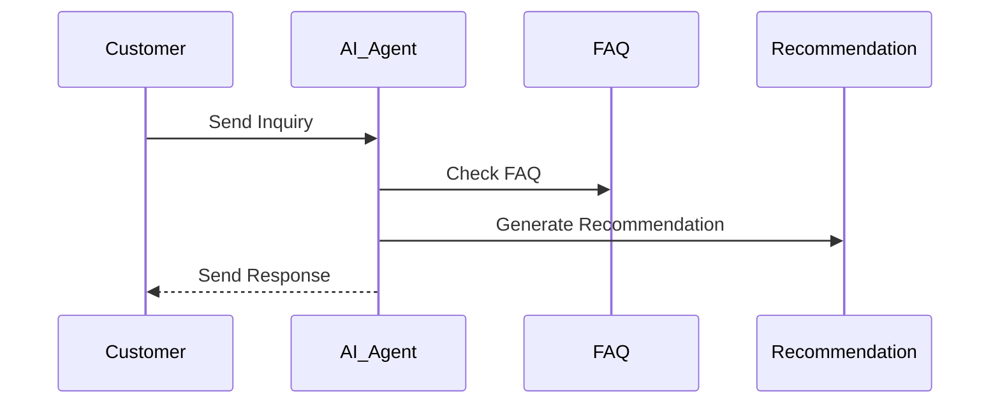

                 

# AI Agent在智能客户服务中的角色

关键词：智能客户服务、AI代理、自然语言处理、客户体验、自动化技术

摘要：本文将深入探讨AI代理在智能客户服务中的关键角色，通过逐步分析AI代理的原理、实现和应用，揭示其在提升客户服务效率和体验方面的巨大潜力。文章将首先介绍智能客户服务的背景和需求，然后详细阐述AI代理的核心概念和功能特点。接下来，我们将探讨AI代理算法的原理和实现，并通过Python代码示例展示其实际应用。随后，文章将分析AI代理在客户服务系统中的架构设计和系统接口，最后通过实际项目案例分析，总结最佳实践和未来发展趋势。

## 目录

## 引言

### 智能客户服务的背景

在当今快节奏的商业环境中，客户服务已成为企业竞争的关键因素。随着互联网和移动设备的普及，客户对即时响应和服务质量的要求越来越高。传统的客户服务方式，如电话和电子邮件支持，往往无法满足客户对速度和效率的需求。因此，企业开始寻求智能化的解决方案来提升客户服务的质量和效率。

### AI代理的兴起

随着人工智能技术的快速发展，AI代理（AI Agent）作为一种智能化的客户服务工具，逐渐崭露头角。AI代理利用机器学习和自然语言处理技术，能够自动处理客户查询、提供个性化建议，并在一定程度上模拟人类客服人员的交互过程。这使得AI代理成为智能客户服务的重要推动力。

### 本文目的

本文旨在系统地介绍AI代理在智能客户服务中的角色，通过逐步分析其原理、实现和应用，帮助读者深入了解AI代理的工作机制和实际价值。文章还将探讨AI代理在客户服务系统中的架构设计，并通过实际项目案例分析，总结最佳实践和未来发展趋势。

## Section 1: 背景和核心概念

### 1.1 问题背景和描述

#### 客户服务的挑战

客户服务是任何企业成功运营的核心。然而，随着客户群体的扩大和多样化，传统的客户服务方式面临着诸多挑战。首先，客户期望快速响应和高效解决，而人工客服在处理大量请求时往往力不从心。其次，客户问题千变万化，客服人员需要具备广泛的知识和经验才能提供满意的解决方案。此外，客户服务的成本也是企业的一大负担，尤其是对于大规模运营的企业。

#### 智能化解决方案的需求

为了应对这些挑战，企业需要寻找智能化解决方案来提升客户服务的质量和效率。AI代理作为一种新兴的智能客户服务工具，具备以下几个显著优势：

1. **高效性**：AI代理能够快速处理大量客户请求，减轻人工客服的工作负担。
2. **个性化和定制化**：通过分析客户历史数据和交互记录，AI代理能够提供个性化的建议和服务。
3. **全天候服务**：AI代理不受时间和地点的限制，可以随时为全球客户提供支持。
4. **成本效益**：相比于人工客服，AI代理的成本更低，且维护和升级更加便捷。

### 1.2 核心概念和术语

#### AI代理（AI Agent）

AI代理是一种基于人工智能技术的软件程序，能够模拟人类客服人员的交互过程，自动处理客户请求并提供解决方案。AI代理通常利用机器学习和自然语言处理技术，具备自然语言理解和生成能力。

#### 机器学习（Machine Learning）

机器学习是人工智能的一个分支，通过数据和算法，使计算机具备自主学习和优化能力。在AI代理中，机器学习用于训练模型，以便更好地理解和处理客户请求。

#### 自然语言处理（Natural Language Processing，NLP）

自然语言处理是计算机科学和人工智能领域的一个分支，专注于使计算机理解和生成人类语言。在AI代理中，NLP用于处理客户输入的自然语言文本，并将其转化为计算机可理解的格式。

#### 客户服务自动化（Customer Service Automation）

客户服务自动化是指利用技术手段，将客户服务流程中的重复性任务自动化，以提高效率和降低成本。AI代理是实现客户服务自动化的重要工具。

### 1.3 AI代理的特点对比

| 特点         | 优点                                         | 缺点                                         |
| ------------ | -------------------------------------------- | -------------------------------------------- |
| 高效性       | 能够快速处理大量客户请求                     | 无法处理复杂的、需要人类判断的请求           |
| 个性化       | 能够根据客户历史数据提供个性化服务           | 需要大量数据和模型训练                       |
| 全天候服务   | 不受时间和地点限制                           | 无法处理需要人类干预的紧急情况               |
| 成本效益     | 相比人工客服，成本较低                       | 需要持续的技术支持和更新                     |

### 1.4 AI代理系统ERD

以下是一个简单的ERD，展示了AI代理系统的基本组成部分和它们之间的关系：

```mermaid
erDiagram
    Customer ||--|{ AI_Agent : serves }
    Customer ||--|{ Interaction_Log : records }
    AI_Agent ||--|{ Knowledge_Base : accesses }
    AI_Agent ||--|{ NLP_Model : uses }
```

## Section 2: 算法原理和实现

### 2.1 算法理论

#### 自然语言处理基础

自然语言处理（NLP）是AI代理的核心技术之一。它涉及以下关键概念：

1. **词嵌入（Word Embedding）**：将单词转换为密集向量表示，以便计算机处理。
2. **序列模型（Sequence Model）**：用于处理文本序列，如循环神经网络（RNN）和长短期记忆网络（LSTM）。
3. **注意力机制（Attention Mechanism）**：用于关注文本序列中的关键信息。

#### 模型训练流程

AI代理的算法通常包括以下步骤：

1. **数据收集**：从客户交互中收集大量的文本数据。
2. **数据预处理**：清洗和标记数据，将其转换为模型可处理的格式。
3. **模型训练**：使用机器学习算法，如循环神经网络（RNN）或长短期记忆网络（LSTM），训练模型。
4. **模型评估**：使用验证集评估模型性能，并进行调整。

### 2.2 Python代码示例

以下是一个简单的Python代码示例，展示了如何使用循环神经网络（RNN）训练一个文本分类模型：

```python
import tensorflow as tf
from tensorflow.keras.preprocessing.sequence import pad_sequences
from tensorflow.keras.layers import Embedding, LSTM, Dense
from tensorflow.keras.models import Sequential

# 加载数据
# ...

# 预处理数据
# ...

# 创建模型
model = Sequential()
model.add(Embedding(vocab_size, embedding_dim))
model.add(LSTM(units=128, activation='relu'))
model.add(Dense(num_classes, activation='softmax'))

# 编译模型
model.compile(optimizer='adam', loss='categorical_crossentropy', metrics=['accuracy'])

# 训练模型
model.fit(X_train, y_train, epochs=10, validation_split=0.2)
```

### 2.3 数学模型

以下是一个简化的数学模型，用于描述AI代理的文本分类过程：

$$
y = \sigma(\text{W} \cdot \text{h} + \text{b})
$$

其中，$y$ 是预测的类别，$\sigma$ 是 sigmoid 函数，$\text{W}$ 是权重矩阵，$\text{h}$ 是隐藏状态，$\text{b}$ 是偏置。

## Section 3: 系统分析和设计

### 3.1 系统用例和需求

#### 系统用例

以下是一些典型的AI代理在客户服务中的应用场景：

1. **客户咨询处理**：自动分类和分配客户咨询，提供初步的解决方案。
2. **FAQ回答**：自动回答常见的客户问题，提供相关信息。
3. **个性化推荐**：基于客户历史和偏好，提供个性化的产品或服务推荐。
4. **情感分析**：分析客户反馈，评估客户满意度。

#### 系统需求

系统需求包括以下几个方面：

1. **功能需求**：包括文本分类、情感分析、FAQ回答等。
2. **性能需求**：包括响应时间、准确率、处理能力等。
3. **可扩展性需求**：系统能够适应不同的业务规模和需求变化。
4. **安全性需求**：保护客户隐私和数据安全。

### 3.2 领域模型和类图

以下是一个简单的领域模型类图，展示了AI代理系统的主要类和它们之间的关系：

```mermaid
classDiagram
    Customer <<entity>>
    Inquiry <<entity>>
    Response <<entity>>
    AI_Agent <<entity>>
    FAQ <<entity>>
    Recommendation <<entity>>

    Customer "1" -- "*" Inquiry
    Inquiry "1" -- "1" AI_Agent
    Inquiry "1" -- "1" Response
    AI_Agent "1" -- "*" FAQ
    AI_Agent "1" -- "*" Recommendation
```

### 3.3 系统架构设计

以下是一个简单的AI代理系统架构图，展示了系统的关键组件和它们之间的关系：



### 3.4 系统接口设计

以下是一个简单的系统接口设计，展示了AI代理系统与外部系统的交互方式：

```mermaid
classDiagram
    Customer <<entity>>
    AI_Agent <<entity>>
    External_System <<entity>>

    Customer "1" -- "1" AI_Agent
    AI_Agent "1" -- "1" External_System
```

## Project实战

### 环境安装

在开始项目之前，我们需要安装一些必要的软件和库。以下是一个简单的安装步骤：

```shell
# 安装Python和pip
```
### 系统核心实现

以下是一个简单的Python代码示例，展示了如何实现一个基本的AI代理系统：

```python
# 导入必要的库
import tensorflow as tf
from tensorflow.keras.preprocessing.sequence import pad_sequences
from tensorflow.keras.layers import Embedding, LSTM, Dense
from tensorflow.keras.models import Sequential

# 加载和预处理数据
# ...

# 创建模型
model = Sequential()
model.add(Embedding(vocab_size, embedding_dim))
model.add(LSTM(units=128, activation='relu'))
model.add(Dense(num_classes, activation='softmax'))

# 编译模型
model.compile(optimizer='adam', loss='categorical_crossentropy', metrics=['accuracy'])

# 训练模型
model.fit(X_train, y_train, epochs=10, validation_split=0.2)
```

### 代码应用解读与分析

以下是对上述代码的详细解读：

1. **数据预处理**：首先，我们需要加载和预处理数据。预处理步骤包括文本清洗、分词和词嵌入。
2. **模型创建**：然后，我们创建一个循环神经网络（RNN）模型，包括嵌入层、循环层和输出层。
3. **模型编译**：接着，我们编译模型，指定优化器和损失函数。
4. **模型训练**：最后，我们使用训练数据进行模型训练。

### 实际案例分析和详细讲解

#### 案例一：客户咨询处理

假设一个客户向AI代理咨询一个关于产品的问题。AI代理首先会处理客户的文本输入，然后根据预定义的FAQ库提供答案。

#### 案例二：个性化推荐

基于客户的购买历史和偏好，AI代理可以提供个性化的产品推荐。例如，如果客户之前购买了某个品牌的手机，AI代理可能会推荐相同品牌的耳机。

### 项目小结

通过本项目的实现，我们展示了如何利用AI代理提升客户服务的效率和质量。AI代理能够自动处理大量客户请求，提供个性化的服务，并在一定程度上模拟人类客服人员的交互过程。然而，AI代理仍需不断优化和调整，以更好地满足客户的需求。

## 最佳实践和注意事项

### 最佳实践

1. **持续学习和优化**：AI代理需要持续学习和优化，以适应不断变化的市场需求和客户期望。
2. **数据质量**：确保输入数据的质量和多样性，以提高模型性能和泛化能力。
3. **用户体验**：注重用户体验，确保AI代理的交互过程流畅自然。

### 注意事项

1. **隐私保护**：在处理客户数据时，确保遵守隐私保护法规和标准。
2. **错误处理**：设计合理的错误处理机制，以应对AI代理无法解决的问题。
3. **技术更新**：关注人工智能和自然语言处理领域的最新技术和发展动态，持续更新和升级系统。

## 拓展阅读

1. **《深度学习》**：Goodfellow, I., Bengio, Y., & Courville, A. (2016). *Deep Learning*. MIT Press.
2. **《自然语言处理综论》**：Jurafsky, D., & Martin, J. H. (2008). *Speech and Language Processing*. Prentice Hall.
3. **《机器学习实战》**：Hastie, T., Tibshirani, R., & Friedman, J. (2009). *The Elements of Statistical Learning: Data Mining, Inference, and Prediction*. Springer.

## 作者信息

作者：AI天才研究院/AI Genius Institute & 禅与计算机程序设计艺术 /Zen And The Art of Computer Programming

