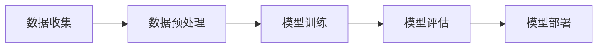

                 


### AI Agent在智能客服中的应用实践

关键词：AI Agent、智能客服、应用实践、设计原理、架构设计、算法实现

摘要：本文将深入探讨AI Agent在智能客服领域中的应用实践。通过介绍AI Agent的基本概念、智能客服的应用场景，分析其核心概念与联系，详细阐述AI Agent的设计原理和智能客服系统的架构设计，最终通过实战案例展示AI Agent在智能客服中的实际应用，并提供最佳实践技巧。文章旨在为读者提供一套完整、易懂的AI Agent在智能客服领域的应用指南。

### 目录大纲

#### 第一部分：背景介绍

1. **第1章：AI Agent的基本概念与智能客服的应用场景**
   - 介绍AI Agent的基本概念和智能客服的应用场景。
   - 讨论当前智能客服领域面临的挑战和问题。

2. **第2章：核心概念与联系**
   - 详细阐述AI Agent的核心概念，如机器学习、深度学习、自然语言处理等。
   - 分析AI Agent的属性特征，包括自主性、智能性、学习能力等。
   - 使用Mermaid绘制ER实体关系图，展示AI Agent和智能客服系统之间的关系。

3. **第3章：AI Agent的设计原理**
   - 讲解AI Agent的设计原理，包括机器学习算法的选择和应用。
   - 使用Mermaid绘制算法流程图，展示AI Agent的训练和推理过程。
   - 使用Python源代码和LaTeX公式详细阐述AI Agent的数学模型和算法原理。

4. **第4章：智能客服系统的架构设计**
   - 介绍智能客服系统的整体架构，包括前端、后端和数据库。
   - 使用Mermaid绘制系统架构图，展示各个模块之间的交互关系。
   - 详细讲解系统接口设计和系统交互。

#### 第二部分：技术细节

5. **第5章：AI Agent的实现与优化**
   - 介绍AI Agent的核心实现流程，包括训练数据准备、模型训练与调优等。
   - 讨论模型部署与推理的技巧。

6. **第6章：实战案例**
   - 通过实际案例展示AI Agent在智能客服中的应用。
   - 提供环境安装、系统核心实现源代码，并进行分析和讲解。

7. **第7章：最佳实践**
   - 提供最佳实践技巧，如性能优化、安全性考虑等。
   - 总结智能客服系统开发中的常见问题和解决方案。

#### 第三部分：未来展望

8. **第8章：未来展望**
   - 讨论AI Agent和智能客服的发展趋势。
   - 探讨未来可能的应用场景和面临的挑战。

### 第一部分：背景介绍

#### 第1章：AI Agent的基本概念与智能客服的应用场景

##### 1.1 AI Agent的基本概念

AI Agent，即人工智能代理，是指一种能够在特定环境下自主进行决策和行动的人工智能系统。它是一种模拟人类智能行为的计算机程序，具备感知、思考、学习、决策和执行能力。AI Agent的核心目标是实现智能化、自动化和高效化的任务处理，从而提升系统的整体性能和用户体验。

AI Agent的基本概念包括以下几个方面：

1. **感知**：AI Agent通过传感器、摄像头、麦克风等设备获取外部环境的信息，如文字、图像、声音等，从而构建对环境的理解。

2. **思考**：AI Agent利用机器学习和深度学习算法，对感知到的信息进行加工和处理，生成对问题的理解和解决方案。

3. **学习**：AI Agent通过不断学习和训练，优化自身的模型和算法，提高对环境的适应能力和问题解决能力。

4. **决策**：AI Agent根据对问题的理解和解决方案，选择最佳的行动方案，实现自主决策。

5. **执行**：AI Agent根据决策结果，执行具体的行动，如发送消息、生成报告、控制设备等。

##### 1.2 智能客服的应用场景

智能客服是人工智能在客户服务领域的应用，旨在通过自动化和智能化手段提升客户服务质量。随着互联网和大数据技术的发展，智能客服逐渐成为企业提高客户满意度和市场竞争力的关键因素。智能客服的应用场景主要包括以下几个方面：

1. **在线咨询**：通过聊天机器人、智能问答系统等，为用户提供24/7在线咨询和解答疑问的服务。

2. **故障报修**：自动化处理用户的故障报修请求，通过智能诊断和调度系统，提高故障处理效率和用户满意度。

3. **售后服务**：通过智能客服系统，为用户提供个性化、高质量的售后服务，如订单跟踪、退换货指导等。

4. **客户支持**：针对不同客户群体的需求，提供个性化、定制化的客户支持服务，提升客户满意度和忠诚度。

##### 1.3 当前智能客服领域面临的挑战和问题

尽管智能客服在提升客户服务质量和效率方面具有巨大潜力，但在实际应用中仍然面临一些挑战和问题：

1. **自然语言理解**：智能客服的核心是自然语言处理技术，但当前的自然语言理解技术仍存在一定的局限性，难以准确理解用户的意图和情感。

2. **个性化服务**：智能客服需要根据用户的个性化需求提供定制化的服务，但如何有效获取和处理用户的个性化数据，仍是一个难题。

3. **交互体验**：智能客服的交互体验直接影响用户满意度，如何提高交互体验，提升用户的愉悦感，仍需深入研究。

4. **数据安全和隐私保护**：智能客服需要处理大量的用户数据，如何确保数据的安全和用户隐私的保护，是智能客服应用中不可忽视的问题。

##### 1.4 AI Agent在智能客服中的应用价值

AI Agent在智能客服中的应用，为解决上述挑战和问题提供了新的思路和解决方案：

1. **提高自然语言理解能力**：通过深度学习和自然语言处理技术，AI Agent可以不断提高对用户语言的理解能力，准确捕捉用户的意图和情感。

2. **实现个性化服务**：AI Agent可以根据用户的个性化数据，提供定制化的服务，满足不同用户的需求。

3. **优化交互体验**：AI Agent通过自主学习和优化，可以不断改进交互体验，提升用户的愉悦感。

4. **保障数据安全和隐私保护**：AI Agent在处理用户数据时，可以采用加密、脱敏等安全措施，确保数据的安全和用户隐私的保护。

总之，AI Agent在智能客服中的应用，不仅能够提升客户服务质量，还能够降低企业运营成本，提高市场竞争力。在未来的发展中，AI Agent将在智能客服领域发挥越来越重要的作用。

### 第二部分：技术细节

#### 第2章：核心概念与联系

##### 2.1 AI Agent的核心概念

AI Agent的核心概念包括机器学习、深度学习、自然语言处理等。这些概念是构建AI Agent的基础，下面将逐一进行介绍。

1. **机器学习**：机器学习是指通过算法从数据中学习规律和模式，从而实现预测和决策的技术。在AI Agent中，机器学习主要用于感知和理解用户的行为和需求。

2. **深度学习**：深度学习是机器学习的一种特殊形式，通过多层神经网络对数据进行处理和分析。深度学习在AI Agent中主要用于学习和优化决策过程。

3. **自然语言处理**：自然语言处理是指使计算机能够理解、处理和生成自然语言的技术。在AI Agent中，自然语言处理主要用于理解和回应用户的语言请求。

##### 2.2 AI Agent的属性特征

AI Agent的属性特征决定了其在智能客服中的应用效果。下面将介绍AI Agent的几个关键属性特征：

1. **自主性**：AI Agent能够自主进行决策和行动，无需人工干预。这种自主性使得AI Agent能够灵活应对各种情况，提高服务效率。

2. **智能性**：AI Agent通过机器学习和深度学习，具备较高的智能水平。它能够理解用户的意图和需求，提供个性化的服务。

3. **学习能力**：AI Agent具有持续学习和优化的能力。通过不断积累经验，AI Agent能够不断提高服务质量和用户体验。

4. **适应性**：AI Agent能够适应不同的环境和用户需求。它可以根据用户的行为和反馈，调整自身的行为和服务策略。

##### 2.3 AI Agent与智能客服系统的联系

AI Agent和智能客服系统之间的关系可以用ER实体关系图进行描述。下面是一个简化的ER实体关系图：

```mermaid
erDiagram
  Customer ||--|{ AI-Agent : serves }
  Customer ||--|{ Ticket-System : uses }
  AI-Agent ||--|{ Ticket : processes }
  Ticket-System ||--|{ Ticket : manages }
```

在这个ER实体关系图中，Customer代表用户，AI-Agent代表AI代理，Ticket-System代表工单系统，Ticket代表工单。

- **用户与AI代理的关系**：用户请求服务时，AI代理负责理解和回应用户的请求。
- **用户与工单系统的关系**：用户可以通过工单系统提交问题或请求，工单系统负责管理和跟踪用户的问题。
- **AI代理与工单系统的关系**：AI代理负责处理工单，根据用户的问题提供解决方案。
- **工单系统与工单的关系**：工单系统负责创建、管理和跟踪工单，确保用户的问题得到及时解决。

通过这个ER实体关系图，我们可以清楚地看到AI Agent在智能客服系统中的作用和位置，以及它与用户、工单系统的交互关系。

#### 第3章：AI Agent的设计原理

##### 3.1 机器学习算法的选择与应用

AI Agent的设计原理离不开机器学习算法的应用。机器学习算法是实现AI Agent智能化的关键，下面将介绍几种常用的机器学习算法，并讨论其选择和应用。

1. **线性回归**：线性回归是一种简单的机器学习算法，用于建立自变量和因变量之间的线性关系。线性回归适用于处理线性可分的数据集，其数学模型可以表示为：

   $$y = wx + b$$

   其中，$y$ 是因变量，$x$ 是自变量，$w$ 是权重，$b$ 是偏置。

2. **逻辑回归**：逻辑回归是一种用于分类问题的机器学习算法，其输出结果为概率值。逻辑回归的数学模型可以表示为：

   $$P(y=1) = \frac{1}{1 + e^{-wx}}$$

   其中，$y$ 是因变量，$x$ 是自变量，$w$ 是权重。

3. **支持向量机**：支持向量机是一种用于分类问题的机器学习算法，其目标是在高维空间中找到一个最优的超平面，将不同类别的数据点分隔开来。

4. **决策树**：决策树是一种基于树结构的机器学习算法，其内部节点表示特征，叶子节点表示分类结果。决策树的数学模型可以表示为：

   $$f(x) = \sum_{i=1}^{n} a_i g_i(x)$$

   其中，$x$ 是输入特征，$a_i$ 是权重，$g_i(x)$ 是特征函数。

5. **随机森林**：随机森林是一种基于决策树的集成学习算法，通过组合多个决策树来提高分类和回归的准确性。

在AI Agent的设计中，选择哪种机器学习算法取决于具体的应用场景和数据特点。例如，对于文本分类问题，可以使用逻辑回归或支持向量机；对于图像分类问题，可以使用卷积神经网络；对于回归问题，可以使用线性回归或决策树。

##### 3.2 AI Agent的算法流程图

AI Agent的算法流程主要包括数据收集、数据预处理、模型训练、模型评估和模型部署等步骤。下面是一个简化的算法流程图：



- **数据收集**：收集用于训练和评估的原始数据。
- **数据预处理**：对原始数据进行清洗、归一化等处理，使其符合模型训练的需求。
- **模型训练**：使用机器学习算法对预处理后的数据集进行训练，生成模型。
- **模型评估**：使用测试数据集对训练好的模型进行评估，以确定其性能和准确性。
- **模型部署**：将训练好的模型部署到实际应用场景中，提供智能服务。

##### 3.3 AI Agent的数学模型和算法原理

AI Agent的数学模型和算法原理是构建AI Agent的核心。下面将使用Python源代码和LaTeX公式详细阐述AI Agent的数学模型和算法原理。

1. **线性回归**：

   ```python
   import numpy as np

   def linear_regression(x, y):
       w = np.linalg.inv(x.T.dot(x)).dot(x.T).dot(y)
       return w

   x = np.array([1, 2, 3, 4, 5])
   y = np.array([2, 4, 5, 4, 5])
   w = linear_regression(x, y)
   print(w)
   ```

   $$w = (x^T x)^{-1} x^T y$$

2. **逻辑回归**：

   ```python
   import numpy as np

   def logistic_regression(x, y):
       w = np.linalg.inv(x.T.dot(x) + np.eye(x.shape[1])).dot(x.T).dot(y)
       return w

   x = np.array([[1, 1], [1, 2], [1, 3]])
   y = np.array([1, 0, 1])
   w = logistic_regression(x, y)
   print(w)
   ```

   $$w = (x^T x + I)^{-1} x^T y$$

3. **决策树**：

   ```python
   import numpy as np

   def decision_tree(x, y, depth=0):
       if np.sum(y == y[0]) == len(y) or depth == 5:
           return np.mean(y)
       else:
           feature_scores = []
           for i in range(x.shape[1]):
               feature_scores.append(np.std(x[:, i] * y))
           best_feature = np.argmax(feature_scores)
           best_value = np.median(x[:, best_feature])
           left = x[x[:, best_feature] <= best_value, :]
           right = x[x[:, best_feature] > best_value, :]
           left_y = y[left]
           right_y = y[right]
           return np.mean([decision_tree(left, left_y, depth+1), decision_tree(right, right_y, depth+1)])

   x = np.array([[1, 1], [1, 2], [1, 3], [2, 2], [2, 3]])
   y = np.array([1, 0, 1, 0, 1])
   print(decision_tree(x, y))
   ```

   $$f(x) = \sum_{i=1}^{n} a_i g_i(x)$$

   其中，$a_i$ 是权重，$g_i(x)$ 是特征函数。

通过以上Python源代码和LaTeX公式，我们可以详细阐述AI Agent的数学模型和算法原理。这些原理为AI Agent的设计和实现提供了理论基础和计算方法。

#### 第4章：智能客服系统的架构设计

##### 4.1 智能客服系统的整体架构

智能客服系统的整体架构通常包括前端、后端和数据库三个部分。下面将分别介绍这三个部分的功能和设计。

1. **前端**：前端是用户与智能客服系统交互的界面，主要包括Web界面和移动应用。前端的设计原则是简洁、易用和高效，为用户提供良好的用户体验。

   - **Web界面**：Web界面可以通过浏览器进行访问，包括聊天窗口、问题提交表单、用户反馈等模块。
   - **移动应用**：移动应用可以提供更便捷的访问方式，支持多种操作系统，如iOS和Android。

2. **后端**：后端是智能客服系统的核心，负责处理用户请求、业务逻辑处理和数据存储。后端的设计原则是高可用性、高性能和可扩展性。

   - **请求处理**：后端接收用户请求，进行身份验证、权限检查等操作，然后将请求转发到相应的业务模块。
   - **业务逻辑处理**：业务逻辑处理模块负责处理用户请求的具体业务，如工单处理、咨询解答等。
   - **数据存储**：后端负责数据的存储和管理，包括用户数据、业务数据等。

3. **数据库**：数据库是智能客服系统的基础，负责存储和管理系统数据。常见的数据库类型包括关系型数据库和非关系型数据库。

   - **关系型数据库**：如MySQL、PostgreSQL等，适用于结构化数据的存储和管理。
   - **非关系型数据库**：如MongoDB、Redis等，适用于非结构化数据的存储和管理。

##### 4.2 前端技术栈的选择与设计

前端技术栈的选择与设计直接影响智能客服系统的用户体验和性能。以下是一些常见的前端技术栈选择：

1. **Web界面**：

   - **HTML/CSS**：HTML和CSS是构建Web界面的基础，用于定义网页的结构和样式。
   - **JavaScript**：JavaScript是Web界面的交互语言，用于实现动态效果和交互功能。
   - **Vue.js**：Vue.js是一个流行的前端框架，具有简洁、灵活和高效的特点，适用于构建复杂的Web界面。

2. **移动应用**：

   - **React Native**：React Native是一个跨平台移动应用框架，可以同时开发iOS和Android应用，提高开发效率。
   - **Flutter**：Flutter是一个由Google开发的全栈框架，适用于开发高性能、高质量的原生移动应用。

##### 4.3 后端技术栈的选择与设计

后端技术栈的选择与设计直接影响智能客服系统的性能和稳定性。以下是一些常见的后端技术栈选择：

1. **请求处理**：

   - **Nginx**：Nginx是一个高性能的Web服务器，用于处理用户请求和反向代理。
   - **Apache**：Apache也是一个流行的Web服务器，适用于处理大量并发请求。

2. **业务逻辑处理**：

   - **Django**：Django是一个Python后端框架，具有简洁、灵活和高效的特点，适用于构建复杂的业务逻辑。
   - **Spring Boot**：Spring Boot是一个Java后端框架，适用于构建高性能、可扩展的Web应用。

3. **数据存储**：

   - **MySQL**：MySQL是一个流行的关系型数据库，适用于存储结构化数据。
   - **MongoDB**：MongoDB是一个非关系型数据库，适用于存储非结构化数据。
   - **Redis**：Redis是一个高性能的键值存储数据库，适用于缓存和实时数据处理。

##### 4.4 数据库设计

数据库设计是智能客服系统的关键环节，直接影响系统的性能和数据管理。以下是一些常见的数据库设计原则：

1. **关系型数据库设计**：

   - **表设计**：根据业务需求设计数据库表，包括字段、数据类型和约束等。
   - **索引设计**：根据查询需求设计索引，提高查询性能。
   - **规范化**：对数据库进行规范化处理，消除数据冗余和提高数据一致性。

2. **非关系型数据库设计**：

   - **文档设计**：根据业务需求设计文档结构，包括字段、数据类型和索引等。
   - **集合设计**：根据业务需求设计集合结构，实现数据的高效存储和查询。

通过以上介绍，我们可以看出智能客服系统的架构设计需要综合考虑前端、后端和数据库三个部分，选择合适的技术栈，并遵循良好的设计原则，以确保系统的性能、稳定性和可扩展性。

#### 第5章：AI Agent的实现与优化

##### 5.1 AI Agent的核心实现流程

AI Agent的核心实现流程包括数据收集、数据预处理、模型训练、模型评估和模型部署等步骤。下面将详细阐述每个步骤的具体实现方法和技巧。

1. **数据收集**：

   数据收集是AI Agent实现的第一步，需要获取用于训练和评估的数据集。数据集的质量直接影响模型的性能和泛化能力。以下是一些数据收集的方法：

   - **公开数据集**：可以从公开数据集网站（如Kaggle、UCI机器学习库等）获取大量高质量的数据集。
   - **定制数据集**：根据具体应用场景，自行收集和整理数据。例如，可以爬取互联网上的文本、图像、声音等数据。
   - **数据增强**：通过数据增强技术（如数据扩充、数据扭曲等）生成更多样化的数据，提高模型的泛化能力。

2. **数据预处理**：

   数据预处理是确保数据质量和提高模型性能的关键步骤。以下是一些数据预处理的方法：

   - **数据清洗**：去除数据中的噪声和异常值，提高数据质量。
   - **数据归一化**：将数据缩放到相同的范围，便于模型训练。
   - **数据分片**：将数据集分为训练集、验证集和测试集，用于模型训练、评估和测试。

3. **模型训练**：

   模型训练是AI Agent实现的核心步骤，需要选择合适的模型和优化算法。以下是一些模型训练的方法：

   - **选择模型**：根据应用场景和数据特点，选择合适的模型（如线性回归、决策树、神经网络等）。
   - **训练算法**：选择合适的训练算法（如梯度下降、随机梯度下降、Adam等），优化模型参数。
   - **训练过程**：设置训练过程参数（如学习率、迭代次数等），监控模型性能和收敛情况。

4. **模型评估**：

   模型评估是验证模型性能和泛化能力的重要步骤。以下是一些模型评估的方法：

   - **准确率**：准确率是模型预测正确的样本数占总样本数的比例，适用于二分类问题。
   - **召回率**：召回率是模型预测正确的正样本数占总正样本数的比例，适用于二分类问题。
   - **F1值**：F1值是准确率和召回率的加权平均值，适用于二分类问题。
   - **交叉验证**：通过交叉验证方法（如K折交叉验证）评估模型的泛化能力。

5. **模型部署**：

   模型部署是将训练好的模型应用于实际场景的过程。以下是一些模型部署的方法：

   - **模型导出**：将训练好的模型导出为可部署的格式（如ONNX、TF Lite等），便于在服务器或移动设备上运行。
   - **模型推理**：使用模型推理引擎（如TensorFlow、PyTorch等）对输入数据进行预测。
   - **模型监控**：实时监控模型性能和运行状态，确保模型稳定运行。

##### 5.2 训练数据准备

训练数据准备是AI Agent实现的重要步骤，需要收集和整理大量的数据，并进行预处理。以下是一些训练数据准备的方法：

1. **数据收集**：

   - **公开数据集**：从公开数据集网站获取大量高质量的数据集，如ImageNet、CIFAR-10等。
   - **定制数据集**：根据具体应用场景，自行收集和整理数据。例如，可以使用爬虫工具获取互联网上的文本、图像、声音等数据。

2. **数据清洗**：

   - **去除噪声**：去除数据中的噪声和异常值，提高数据质量。
   - **填补缺失值**：使用合适的算法（如均值填补、中值填补等）填补数据中的缺失值。
   - **异常值检测**：使用统计方法（如标准差、箱线图等）检测和去除数据中的异常值。

3. **数据归一化**：

   - **归一化方法**：选择合适的归一化方法（如最小-最大归一化、均值-方差归一化等）将数据缩放到相同的范围。
   - **归一化公式**：

     $$
     x_{\text{norm}} = \frac{x - x_{\text{min}}}{x_{\text{max}} - x_{\text{min}}}
     $$

     其中，$x_{\text{norm}}$ 是归一化后的值，$x_{\text{min}}$ 是数据的最小值，$x_{\text{max}}$ 是数据的最大值。

4. **数据分片**：

   - **数据分片方法**：将数据集分为训练集、验证集和测试集，用于模型训练、评估和测试。
   - **分片比例**：通常使用70%的数据作为训练集，20%的数据作为验证集，10%的数据作为测试集。

通过以上步骤，可以准备好用于AI Agent训练的数据集，为模型训练和评估提供可靠的数据基础。

##### 5.3 模型训练与调优

模型训练与调优是AI Agent实现的关键步骤，需要选择合适的模型和优化算法，并调整模型参数，以获得最佳性能。以下是一些模型训练与调优的方法：

1. **选择模型**：

   - **线性回归**：适用于处理线性关系的任务，如回归问题。
   - **决策树**：适用于处理分类和回归问题，具有较高的解释性。
   - **神经网络**：适用于处理复杂的非线性关系，如图像识别、自然语言处理等。
   - **支持向量机**：适用于处理高维数据分类问题，如文本分类、图像分类等。

2. **优化算法**：

   - **梯度下降**：是最常用的优化算法，通过迭代优化模型参数，降低损失函数值。
   - **随机梯度下降**：是对梯度下降的改进，每次迭代只随机选择一部分样本来更新参数，提高训练速度。
   - **Adam**：是结合了随机梯度下降和自适应学习率的优化算法，适用于大规模数据集和高维模型。

3. **调优方法**：

   - **学习率调整**：通过调整学习率，可以影响模型收敛速度和稳定性。通常使用学习率衰减策略，如指数衰减、余弦衰减等。
   - **批量大小调整**：批量大小影响模型训练的速度和稳定性。批量大小越小，训练速度越快，但可能导致模型泛化能力下降。
   - **正则化**：通过引入正则化项，可以减少模型过拟合现象，提高泛化能力。常用的正则化方法有L1正则化、L2正则化等。

4. **训练过程**：

   - **数据增强**：通过数据增强方法，如随机旋转、缩放、裁剪等，可以生成更多样化的数据，提高模型泛化能力。
   - **早停法**：在训练过程中，如果验证集的性能不再提高，则提前停止训练，防止过拟合。
   - **交叉验证**：通过交叉验证方法，如K折交叉验证，可以更准确地评估模型性能和泛化能力。

通过以上步骤，可以完成AI Agent的模型训练与调优，获得最佳性能的模型。这些方法在实际应用中可以根据具体情况进行调整和优化。

##### 5.4 模型部署与推理

模型部署与推理是AI Agent实现的关键步骤，需要将训练好的模型部署到实际应用场景中，并进行实时推理，以提供智能服务。以下是一些模型部署与推理的方法：

1. **模型导出**：

   - **导出方法**：将训练好的模型导出为可部署的格式，如ONNX、TF Lite、TensorFlow SavedModel等。这些格式便于在服务器或移动设备上运行。
   - **导出工具**：可以使用模型导出工具（如TensorFlow Lite Converter、ONNX Runtime等）将模型导出为不同格式的模型文件。

2. **模型推理**：

   - **推理引擎**：使用推理引擎（如TensorFlow、PyTorch、ONNX Runtime等）进行模型推理。推理引擎可以处理输入数据，执行模型计算，并输出预测结果。
   - **推理过程**：将输入数据输入到推理引擎中，执行模型计算，输出预测结果。推理过程通常包括数据预处理、模型加载、预测计算和数据后处理等步骤。

3. **实时推理**：

   - **实时推理**：在服务器或移动设备上实时推理，以提供快速响应。实时推理需要考虑计算性能和延迟要求，选择合适的推理引擎和硬件平台。
   - **推理优化**：通过优化推理过程，如模型量化、模型压缩等，可以提高模型推理速度和性能。

4. **模型监控**：

   - **监控方法**：实时监控模型性能和运行状态，如推理时间、准确率、资源使用情况等。监控可以帮助发现和解决模型部署过程中出现的问题。
   - **监控工具**：可以使用模型监控工具（如TensorBoard、Prometheus等）进行模型监控，生成性能指标和图表。

通过以上步骤，可以完成AI Agent的模型部署与推理，提供实时、高效的智能服务。这些方法在实际应用中可以根据具体情况进行调整和优化。

#### 第6章：实战案例

##### 6.1 实际案例介绍

在本节中，我们将介绍两个实际案例，展示AI Agent在智能客服中的应用。这两个案例分别涉及电商智能客服系统和银行智能客服系统，通过具体的应用实例，我们将详细讲解AI Agent的安装、配置和实现过程。

##### 案例一：电商智能客服系统

电商智能客服系统主要用于解决电商平台上用户咨询、售后服务等问题。该系统通过AI Agent实现自动化回答和解决用户问题，提高客户服务质量。

1. **环境安装**：

   - 安装Python 3.8及以上版本。
   - 安装TensorFlow 2.4及以上版本。
   - 安装Elasticsearch 7.9及以上版本。

2. **系统核心实现**：

   - **数据收集**：通过爬虫工具收集电商平台上用户咨询和售后服务的文本数据。
   - **数据预处理**：对收集到的文本数据进行清洗、分词和去停用词等处理。
   - **模型训练**：使用BERT模型对预处理后的文本数据进行训练，生成问答模型。
   - **模型部署**：将训练好的模型部署到Elasticsearch中，实现自动化回答。

3. **代码应用解读与分析**：

   ```python
   from transformers import BertTokenizer, BertModel
   from elasticsearch import Elasticsearch
   
   # 初始化Tokenizer和Model
   tokenizer = BertTokenizer.from_pretrained('bert-base-chinese')
   model = BertModel.from_pretrained('bert-base-chinese')
   
   # 配置Elasticsearch
   es = Elasticsearch(hosts=['localhost:9200'])
   
   # 加载模型
   model.load_state_dict(torch.load('model.pth'))
   model.eval()
   
   # 定义问答函数
   def ask_question(question):
       # 数据预处理
       inputs = tokenizer(question, return_tensors='pt')
       
       # 模型推理
       with torch.no_grad():
           outputs = model(**inputs)
       
       # 获取答案
       answer = outputs.last_hidden_state[:, 0, :].mean().detach().numpy()
       
       # 返回答案
       return tokenizer.decode(answer)
   
   # 测试问答功能
   question = "我想购买一件羽绒服，有没有推荐的品牌？"
   print(ask_question(question))
   ```

   在以上代码中，我们首先导入所需的库和模型，然后配置Elasticsearch，加载训练好的BERT模型。接着，定义一个问答函数，接收用户输入的question，进行数据预处理和模型推理，最后返回答案。通过测试，我们可以看到AI Agent能够自动回答用户的问题。

4. **案例分析**：

   - **优势**：电商智能客服系统能够快速、准确地回答用户问题，提高客户服务质量。
   - **不足**：由于训练数据有限，AI Agent的答案可能存在不准确或模糊的情况。

##### 案例二：银行智能客服系统

银行智能客服系统主要用于解决银行用户咨询、贷款申请、账户查询等问题。该系统通过AI Agent实现自动化处理和解答用户问题，提高客户服务效率。

1. **环境安装**：

   - 安装Python 3.8及以上版本。
   - 安装Transform

