                 

# 《AI Agent在智能家居中的应用》

> 关键词：AI Agent、智能家居、人工智能、家庭自动化、智能监控、能源管理、健康监测

> 摘要：本文旨在探讨AI Agent在智能家居中的应用，通过分析AI Agent的定义、特点，以及智能家居的发展背景，深入探讨AI Agent在家庭安全监控、家庭能源管理、家居自动化和健康监测等方面的具体应用实例。文章还将展望智能家居的未来发展趋势，分享AI Agent在智能家居中的最佳实践，为相关领域的研究者和开发者提供有价值的参考。

### 目录大纲

## 第一部分：AI Agent与智能家居基础

### 第1章：AI Agent与智能家居概述

#### 1.1 AI Agent的定义与特点

#### 1.2 智能家居的背景与发展

#### 1.3 AI Agent在智能家居中的应用前景

### 第2章：AI Agent的基本架构与技术

#### 2.1 AI Agent的结构

#### 2.2 人工智能算法基础

#### 2.3 自然语言处理与AI Agent

### 第3章：智能家居系统的构建

#### 3.1 智能家居系统的总体架构

#### 3.2 硬件设备与技术

#### 3.3 软件系统设计

## 第二部分：AI Agent在智能家居中的应用实例

### 第4章：家庭安全监控

#### 4.1 实时视频监控

#### 4.2 智能报警系统

#### 4.3 家园守护算法

### 第5章：家庭能源管理

#### 5.1 能源消耗监测

#### 5.2 智能节能策略

#### 5.3 能源预测与优化

### 第6章：家居自动化

#### 6.1 家电控制与调度

#### 6.2 家庭氛围营造

#### 6.3 人机交互与自主学习

### 第7章：健康监测

#### 7.1 家居环境监测

#### 7.2 健康数据采集

#### 7.3 健康管理建议

## 第三部分：AI Agent在智能家居中的未来趋势

### 第8章：智能家居的未来展望

#### 8.1 AI Agent的技术演进

#### 8.2 智能家居的市场前景

#### 8.3 智能家居的发展挑战与应对策略

### 第9章：AI Agent在智能家居中的最佳实践

#### 9.1 智能家居系统的实施案例

#### 9.2 智能家居的设计与优化

#### 9.3 智能家居的未来趋势与机会

## 附录

### A.1 术语表

### A.2 参考文献

### A.3 技术资源链接

## 第一部分：AI Agent与智能家居基础

### 第1章：AI Agent与智能家居概述

#### 1.1 AI Agent的定义与特点

AI Agent，即人工智能代理，是指能够模拟人类智能行为，具备一定自主决策和问题解决能力的计算机程序。AI Agent具有以下特点：

1. **自主性**：AI Agent能够自主地感知环境、制定策略、执行任务。
2. **适应性**：AI Agent能够根据环境和任务需求，不断调整和优化自己的行为。
3. **交互性**：AI Agent能够与用户和其他智能系统进行自然语言交互。

AI Agent的出现，标志着人工智能从简单的规则执行向更加智能、自主的方向发展。

#### 1.2 智能家居的背景与发展

智能家居，是指通过物联网技术，将家庭中的各种设备连接起来，实现远程控制、自动化管理和智能服务。智能家居的发展可以追溯到20世纪90年代，随着互联网的普及和物联网技术的兴起，智能家居逐渐走进人们的生活。

1. **背景**：随着城市化进程的加速，人们对居住环境的要求越来越高，智能家居应运而生。
2. **发展**：近年来，智能设备的性能不断提升，价格逐渐亲民，智能家居市场迎来快速发展。

#### 1.3 AI Agent在智能家居中的应用前景

AI Agent在智能家居中的应用前景非常广阔：

1. **家庭安全**：通过AI Agent，可以实现智能监控、智能报警等功能，提高家庭安全。
2. **能源管理**：AI Agent可以帮助家庭实现智能节能，降低能源消耗。
3. **家居自动化**：AI Agent可以控制家电设备，提高家庭生活的便捷性。
4. **健康监测**：AI Agent可以监测家庭环境，采集健康数据，提供健康管理建议。

### 第2章：AI Agent的基本架构与技术

#### 2.1 AI Agent的结构

AI Agent通常由感知器、控制器、执行器三个部分组成：

1. **感知器**：用于感知环境信息，如摄像头、传感器等。
2. **控制器**：根据感知信息，制定决策策略，如决策树、神经网络等。
3. **执行器**：根据决策策略，执行具体任务，如电机、灯光控制器等。

#### 2.2 人工智能算法基础

AI Agent的核心是人工智能算法，主要包括：

1. **机器学习**：通过训练模型，使计算机具备一定的学习能力。
2. **深度学习**：一种基于人工神经网络的机器学习技术，具有强大的特征提取能力。
3. **强化学习**：通过试错学习，使计算机在特定环境中实现最优策略。

#### 2.3 自然语言处理与AI Agent

自然语言处理（NLP）是AI Agent与人类交互的关键技术：

1. **语音识别**：将语音信号转换为文本。
2. **语音合成**：将文本转换为语音信号。
3. **语义理解**：理解人类语言的含义，实现智能对话。

### 第3章：智能家居系统的构建

#### 3.1 智能家居系统的总体架构

智能家居系统通常由以下几个部分组成：

1. **感知层**：包括各种传感器，如温度传感器、湿度传感器、摄像头等。
2. **网络层**：包括有线和无线网络，如WiFi、蓝牙等。
3. **平台层**：包括智能控制平台，如物联网平台、云计算平台等。
4. **应用层**：包括各种智能家居应用，如家庭安防、智能照明、智能家电等。

#### 3.2 硬件设备与技术

智能家居系统的硬件设备包括：

1. **传感器**：用于感知环境信息，如温度传感器、湿度传感器等。
2. **控制器**：用于控制智能设备，如智能插座、智能开关等。
3. **通信模块**：用于实现设备之间的通信，如WiFi模块、蓝牙模块等。

#### 3.3 软件系统设计

智能家居系统的软件设计主要包括：

1. **操作系统**：如Linux、Android等。
2. **中间件**：如MQTT、CoAP等，用于实现设备之间的通信。
3. **应用软件**：如智能家居APP、Web端等，用于用户操作和管理。

## 第二部分：AI Agent在智能家居中的应用实例

### 第4章：家庭安全监控

家庭安全监控是智能家居的重要应用之一，通过AI Agent，可以实现以下功能：

1. **实时视频监控**：AI Agent可以实时分析摄像头捕捉到的视频流，识别家庭成员和陌生人的行为。
2. **智能报警系统**：当AI Agent检测到异常行为时，如入侵、火灾等，会立即发出警报。
3. **家园守护算法**：AI Agent可以学习家庭成员的行为模式，当发现异常时，自动采取行动，如关闭门窗、报警等。

### 第5章：家庭能源管理

家庭能源管理是智能家居的另一个重要应用，通过AI Agent，可以实现以下功能：

1. **能源消耗监测**：AI Agent可以实时监测家庭能源消耗情况，帮助用户了解能源使用情况。
2. **智能节能策略**：AI Agent可以根据用户习惯和能源消耗数据，自动调整家电设备的工作状态，实现节能。
3. **能源预测与优化**：AI Agent可以通过学习能源消耗模式，预测未来的能源需求，优化能源使用计划。

### 第6章：家居自动化

家居自动化是智能家居的核心应用，通过AI Agent，可以实现以下功能：

1. **家电控制与调度**：AI Agent可以远程控制家电设备，如空调、热水器、洗衣机等，实现自动化管理。
2. **家庭氛围营造**：AI Agent可以根据用户需求和喜好，自动调整家庭氛围，如照明、音乐等。
3. **人机交互与自主学习**：AI Agent可以通过与用户的互动，不断学习用户习惯，优化家居自动化方案。

### 第7章：健康监测

健康监测是智能家居的重要应用之一，通过AI Agent，可以实现以下功能：

1. **家居环境监测**：AI Agent可以实时监测家居环境参数，如温度、湿度、空气质量等。
2. **健康数据采集**：AI Agent可以通过传感器，采集用户的健康数据，如心率、血压等。
3. **健康管理建议**：AI Agent可以根据健康数据，为用户提供健康管理建议，如饮食、锻炼等。

## 第三部分：AI Agent在智能家居中的未来趋势

### 第8章：智能家居的未来展望

随着AI Agent技术的不断发展，智能家居将在以下几个方面实现重大突破：

1. **AI Agent的技术演进**：AI Agent将更加智能、自主，能够处理更复杂的问题。
2. **智能家居的市场前景**：随着智能家居产品的普及，市场前景将更加广阔。
3. **智能家居的发展挑战与应对策略**：如隐私保护、数据安全等，需要制定相应的应对策略。

### 第9章：AI Agent在智能家居中的最佳实践

在智能家居系统的实施过程中，需要遵循以下最佳实践：

1. **智能家居系统的实施案例**：通过成功案例，总结经验教训。
2. **智能家居的设计与优化**：从用户需求出发，设计合理、易用的智能家居系统。
3. **智能家居的未来趋势与机会**：紧跟技术发展趋势，抓住市场机会。

### 附录

#### A.1 术语表

- AI Agent：人工智能代理
- 智能家居：通过物联网技术实现家庭设备智能化
- 机器学习：使计算机具备学习能力的算法
- 深度学习：基于人工神经网络的机器学习技术
- 强化学习：通过试错学习实现最优策略

#### A.2 参考文献

- [1] Smith, J., & Wang, L. (2018). *Introduction to Artificial Intelligence*. Springer.
- [2] Liu, H., & Zhang, Y. (2019). *智能家居系统设计与实现*. 清华大学出版社.
- [3] Zhao, X., & Sun, J. (2020). *智能家居中的隐私保护与数据安全*. 北京大学出版社.

#### A.3 技术资源链接

- [1] AI Agent开发工具：[OpenAI](https://openai.com/)
- [2] 智能家居技术社区：[HomeKit](https://www.homekit.com/)
- [3] 机器学习资源：[Kaggle](https://www.kaggle.com/)

## 作者信息

作者：AI天才研究院/AI Genius Institute & 禅与计算机程序设计艺术 /Zen And The Art of Computer Programming

【文章完】## 第一部分：AI Agent与智能家居基础

### 第1章：AI Agent与智能家居概述

#### 1.1 AI Agent的定义与特点

AI Agent，即人工智能代理，是一种能够模拟人类智能行为的计算机程序。它通过感知环境、制定策略和执行任务，实现了自主决策和问题解决。AI Agent的特点如下：

1. **自主性**：AI Agent具备自主感知环境、自主决策和自主执行任务的能力。这意味着它可以不依赖人类干预，独立地完成复杂任务。
   
2. **适应性**：AI Agent能够根据环境和任务的需求，不断调整和优化自己的行为。这使得它能够适应不断变化的环境和任务。

3. **交互性**：AI Agent能够与人类或其他智能系统进行自然语言交互，通过语音、文本等形式进行沟通。

AI Agent的发展历程可以追溯到20世纪80年代，最初主要是基于规则的方法。随着机器学习和深度学习技术的发展，AI Agent逐渐具备了更强的自主性和适应性。

#### 1.2 智能家居的背景与发展

智能家居，是指利用物联网技术将家庭中的各种设备连接起来，实现设备的自动化和智能化控制。智能家居的发展经历了以下几个阶段：

1. **初期阶段**（20世纪90年代）：智能家居概念开始提出，但技术和成本限制使得其普及率较低。

2. **成长阶段**（21世纪初）：随着互联网和移动通信技术的快速发展，智能家居开始进入家庭，但功能较为单一。

3. **成熟阶段**（近年来）：随着物联网、人工智能、5G等技术的成熟，智能家居产品逐渐丰富，功能也越来越强大，普及率大幅提升。

智能家居的发展背景主要包括以下几个方面：

1. **技术进步**：物联网、人工智能、5G等技术的发展为智能家居提供了技术支持。

2. **消费需求**：随着生活水平的提高，人们对居住环境的要求越来越高，智能家居能够提供更加便捷、舒适、安全的生活体验。

3. **政策支持**：政府出台了一系列政策，鼓励智能家居产业的发展。

#### 1.3 AI Agent在智能家居中的应用前景

AI Agent在智能家居中的应用前景非常广阔，它能够为家庭安全、能源管理、家居自动化和健康监测等方面带来显著的好处：

1. **家庭安全**：AI Agent可以通过实时视频监控、智能报警系统和家园守护算法，提高家庭的安全性。

2. **能源管理**：AI Agent可以通过能源消耗监测、智能节能策略和能源预测与优化，实现家庭能源的合理利用。

3. **家居自动化**：AI Agent可以通过家电控制与调度、家庭氛围营造和人机交互与自主学习，提高家庭生活的便捷性和舒适度。

4. **健康监测**：AI Agent可以通过家居环境监测、健康数据采集和健康管理建议，为家庭成员提供个性化的健康服务。

随着技术的不断进步和应用场景的不断扩展，AI Agent在智能家居中的应用前景将更加广阔。

### 第2章：AI Agent的基本架构与技术

#### 2.1 AI Agent的结构

AI Agent的结构通常包括三个主要部分：感知器、控制器和执行器。

1. **感知器**：感知器负责感知环境信息，如摄像头、传感器、麦克风等。这些感知器将获取到的信息转化为数字信号，供控制器处理。

2. **控制器**：控制器是AI Agent的核心，它根据感知器提供的信息，利用人工智能算法进行决策，制定合适的行动策略。控制器通常包含多个模块，如感知模块、决策模块、计划模块等。

3. **执行器**：执行器负责执行控制器的决策结果，如电机、灯光控制器、开关等。执行器将控制器的指令转化为物理动作，实现对环境的实际操作。

#### 2.2 人工智能算法基础

人工智能算法是AI Agent的核心技术，它决定了AI Agent的智能水平和性能。人工智能算法主要包括以下几种：

1. **机器学习**：机器学习是一种通过训练模型，使计算机具备学习能力的方法。常见的机器学习算法包括线性回归、决策树、支持向量机、神经网络等。

2. **深度学习**：深度学习是一种基于人工神经网络的机器学习技术，具有强大的特征提取能力。常见的深度学习算法包括卷积神经网络（CNN）、循环神经网络（RNN）、生成对抗网络（GAN）等。

3. **强化学习**：强化学习是一种通过试错学习，使计算机在特定环境中实现最优策略的方法。常见的强化学习算法包括Q-learning、SARSA、DQN等。

#### 2.3 自然语言处理与AI Agent

自然语言处理（NLP）是AI Agent与人类交互的关键技术。NLP的主要任务包括：

1. **语音识别**：将语音信号转换为文本。

2. **语音合成**：将文本转换为语音信号。

3. **语义理解**：理解人类语言的含义，实现智能对话。

NLP技术使AI Agent能够与人类进行自然语言交互，提高用户的体验和满意度。

### 第3章：智能家居系统的构建

#### 3.1 智能家居系统的总体架构

智能家居系统通常由感知层、网络层、平台层和应用层四个部分组成。

1. **感知层**：感知层包括各种传感器，如温度传感器、湿度传感器、光照传感器、摄像头等。这些传感器负责感知家庭环境信息。

2. **网络层**：网络层包括有线和无线网络，如WiFi、蓝牙、ZigBee等。网络层负责将传感器收集到的数据传输到平台层。

3. **平台层**：平台层通常包括物联网平台、云计算平台等。平台层负责处理和分析传感器数据，生成决策结果。

4. **应用层**：应用层包括各种智能家居应用，如智能照明、智能安防、智能家电等。应用层负责将平台层的决策结果转化为实际操作。

#### 3.2 硬件设备与技术

智能家居系统的硬件设备主要包括传感器、控制器和通信模块。

1. **传感器**：传感器是智能家居系统的感知器官，用于感知家庭环境信息，如温度传感器、湿度传感器、光照传感器等。

2. **控制器**：控制器是智能家居系统的核心，负责接收传感器数据，利用人工智能算法进行决策，并控制执行器执行操作。

3. **通信模块**：通信模块负责将传感器数据和控制器指令传输到网络层，实现设备的互联互通。

常用的智能家居通信技术包括WiFi、蓝牙、ZigBee、Z-Wave等。这些技术具有不同的传输距离、传输速度和功耗特性，适用于不同的应用场景。

#### 3.3 软件系统设计

智能家居系统的软件设计包括操作系统、中间件和应用软件。

1. **操作系统**：操作系统是智能家居系统的底层软件，负责管理硬件资源和运行应用程序。常见的操作系统包括Linux、Android等。

2. **中间件**：中间件负责实现不同设备之间的通信和数据交换，如MQTT、CoAP等。中间件使得智能家居系统能够支持多种通信协议和设备。

3. **应用软件**：应用软件是智能家居系统的用户界面，负责与用户交互，实现智能家居功能。常见的应用软件包括智能家居APP、Web端等。

在软件设计过程中，需要考虑以下几个方面：

- **模块化设计**：将系统功能划分为多个模块，实现代码的重用和系统的可维护性。
- **用户界面设计**：设计直观、易用的用户界面，提高用户的体验和满意度。
- **安全性设计**：确保系统数据的安全和用户隐私的保护。

### 第4章：AI Agent在家庭安全监控中的应用

家庭安全监控是智能家居的一个重要应用，通过AI Agent，可以实现更智能、更高效的家庭安全监控。

#### 4.1 实时视频监控

实时视频监控是家庭安全监控的基础功能。AI Agent可以通过摄像头实时捕捉家庭环境中的视频流，并对视频进行分析和处理。

1. **视频捕捉**：AI Agent通过摄像头捕捉视频流，并将视频数据传输到平台层。

2. **视频分析**：平台层利用图像处理和计算机视觉技术，对视频流进行分析，提取关键信息，如人形、车辆等。

3. **异常检测**：AI Agent通过对视频流的分析，检测是否存在异常情况，如入侵、火灾等。

4. **报警处理**：当检测到异常情况时，AI Agent会立即触发报警，并向用户发送警报信息。

#### 4.2 智能报警系统

智能报警系统是家庭安全监控的重要组成部分。AI Agent可以通过多种方式实现智能报警，提高家庭的安全性。

1. **智能报警策略**：AI Agent可以根据用户设定的报警规则，智能地识别和触发报警。例如，当检测到陌生人进入家门时，会立即触发报警。

2. **多级报警系统**：AI Agent可以实现多级报警系统，根据报警的紧急程度，采取不同的报警措施。例如，当检测到火灾时，会首先发出声音警报，然后发送短信和邮件通知用户。

3. **联动报警**：AI Agent可以与其他智能设备联动，实现更全面的报警功能。例如，当检测到入侵时，会自动关闭门窗、启动灯光，并触发报警。

#### 4.3 家园守护算法

家园守护算法是AI Agent在家庭安全监控中的高级功能。它通过学习和预测，实现对家庭安全的持续守护。

1. **行为学习**：AI Agent可以学习家庭成员的行为模式，识别正常行为和异常行为。例如，当家庭成员回家时，会自动打开灯光和空调。

2. **异常检测**：AI Agent可以根据学习和预测结果，检测家庭环境中的异常情况。例如，当检测到家庭成员长时间未回家时，会自动发出警报。

3. **自动响应**：AI Agent可以根据异常检测的结果，自动采取响应措施。例如，当检测到陌生人入侵时，会自动关闭门窗、报警并通知用户。

通过家园守护算法，AI Agent可以实现24小时不间断的家庭安全监控，为用户提供更加安全、便捷的生活体验。

### 第5章：AI Agent在家庭能源管理中的应用

家庭能源管理是智能家居的重要组成部分，通过AI Agent，可以实现更智能、更高效的能源管理。

#### 5.1 能源消耗监测

能源消耗监测是家庭能源管理的基础。AI Agent可以通过传感器实时监测家庭能源的消耗情况，为用户提供详细的数据分析。

1. **能耗数据采集**：AI Agent通过安装在家庭中的传感器，实时采集能源消耗数据，如电力、天然气、水等。

2. **数据分析**：平台层利用数据分析技术，对采集到的能耗数据进行处理和分析，生成能耗报告。

3. **能耗趋势分析**：AI Agent可以根据历史数据，分析家庭能源消耗的趋势，为用户提供节能建议。

#### 5.2 智能节能策略

智能节能策略是家庭能源管理的关键。AI Agent可以通过学习和预测，自动调整家庭设备的运行状态，实现节能。

1. **设备控制**：AI Agent可以根据能耗数据和用户设定，自动控制家庭设备的运行状态。例如，当检测到能耗过高时，会自动关闭不必要的电器。

2. **节能模式**：AI Agent可以根据用户需求和能源消耗情况，设置节能模式。例如，当用户外出时，会自动关闭所有电器，减少能源消耗。

3. **节能计划**：AI Agent可以根据用户设定和能耗趋势，制定节能计划。例如，每天晚上自动关闭灯光和空调，每周定期清洁家电，提高能源效率。

#### 5.3 能源预测与优化

能源预测与优化是家庭能源管理的未来趋势。AI Agent可以通过学习和预测，实现能源消耗的优化，提高家庭的能源利用效率。

1. **能源需求预测**：AI Agent可以根据历史数据和用户习惯，预测未来的能源需求，为用户提供能源消耗预警。

2. **能源供应优化**：AI Agent可以根据能源需求和能源价格，优化能源供应策略。例如，当能源需求较高时，会自动启动备用电源，避免能源短缺。

3. **能源共享**：AI Agent可以实现家庭间的能源共享，提高能源利用效率。例如，当某个家庭的能源消耗较低时，会将多余的能源供应给其他家庭。

通过AI Agent在家庭能源管理中的应用，可以显著提高家庭的能源利用效率，降低能源消耗，实现绿色、可持续的家庭生活。

### 第6章：AI Agent在家居自动化中的应用

家居自动化是智能家居的核心应用，通过AI Agent，可以实现家庭设备的自动化控制，提高家庭生活的便捷性和舒适度。

#### 6.1 家电控制与调度

家电控制与调度是家居自动化的基础。AI Agent可以通过远程控制，实现对家庭设备的自动化管理。

1. **远程控制**：AI Agent可以通过手机APP、语音助手等方式，远程控制家庭设备。例如，用户可以通过手机APP远程控制空调、热水器、洗衣机等设备的开关和设置。

2. **智能调度**：AI Agent可以根据用户习惯和设备状态，自动调整设备的运行状态。例如，当用户进入家门时，会自动打开灯光和空调；当用户离开家门时，会自动关闭灯光和空调，节省能源。

3. **设备联动**：AI Agent可以实现家庭设备的联动控制，提高家庭生活的便捷性。例如，当用户打开电视时，会自动调整灯光的亮度，营造适合观看的氛围。

#### 6.2 家庭氛围营造

家庭氛围营造是家居自动化的高级功能，通过AI Agent，可以自动调整家庭氛围，提高用户的舒适度。

1. **智能照明**：AI Agent可以根据用户需求和光线变化，自动调整灯光的亮度和颜色。例如，当用户进入卧室时，会自动调整灯光的颜色，营造温馨舒适的氛围。

2. **智能音响**：AI Agent可以通过语音助手，自动播放用户喜欢的音乐，营造愉悦的氛围。

3. **环境控制**：AI Agent可以根据用户需求和室内环境，自动调整温度、湿度和空气质量。例如，当用户进入浴室时，会自动调整温度和湿度，提供舒适的沐浴环境。

#### 6.3 人机交互与自主学习

人机交互与自主学习是家居自动化的未来趋势，通过AI Agent，可以实现更加智能化、个性化的家居自动化体验。

1. **自然语言交互**：AI Agent可以通过自然语言处理技术，与用户进行智能对话，理解用户的需求和意图。例如，用户可以通过语音命令控制家庭设备，实现语音搜索、语音控制等功能。

2. **行为学习**：AI Agent可以通过机器学习和深度学习技术，学习用户的行为模式，为用户提供个性化的服务。例如，当用户习惯早上7点起床时，AI Agent会自动调整窗帘和灯光，为用户提供舒适的起床环境。

3. **自主学习**：AI Agent可以通过强化学习技术，不断优化自己的行为和策略，提高家居自动化的效率。例如，当用户对某个功能不满意时，AI Agent会自动调整和优化，提高用户的满意度。

通过AI Agent在家居自动化中的应用，可以显著提高家庭生活的便捷性和舒适度，实现真正的智能家居生活。

### 第7章：AI Agent在健康监测中的应用

健康监测是智能家居的重要组成部分，通过AI Agent，可以实现家庭环境的监测、健康数据的采集和健康管理。

#### 7.1 家居环境监测

家居环境监测是健康监测的基础，通过AI Agent，可以实时监测家庭环境的各项指标。

1. **环境数据采集**：AI Agent通过安装在家庭中的传感器，实时采集温度、湿度、空气质量、噪音等环境数据。

2. **数据分析**：平台层利用数据分析技术，对采集到的环境数据进行处理和分析，生成环境报告。

3. **异常检测**：AI Agent可以根据环境数据，检测家庭环境中是否存在异常情况。例如，当检测到室内空气质量不佳时，会自动开启空气净化器。

#### 7.2 健康数据采集

健康数据采集是健康监测的核心，通过AI Agent，可以实时采集家庭成员的健康数据。

1. **健康数据采集**：AI Agent通过智能手环、智能手表等设备，实时采集心率、血压、步数、睡眠质量等健康数据。

2. **数据存储**：平台层将采集到的健康数据存储在云端，方便用户随时查看和管理。

3. **数据分析**：平台层利用数据分析技术，对采集到的健康数据进行处理和分析，生成健康报告。

#### 7.3 健康管理建议

健康管理建议是健康监测的高级功能，通过AI Agent，可以为用户提供个性化的健康管理建议。

1. **健康评估**：AI Agent可以根据用户的基本信息和健康数据，对用户的健康状况进行评估。

2. **健康建议**：AI Agent根据健康评估结果，为用户提供个性化的健康管理建议。例如，当用户血压偏高时，会建议用户调整饮食和锻炼习惯。

3. **健康跟踪**：AI Agent可以跟踪用户的健康数据变化，及时调整健康管理建议，帮助用户保持健康。

通过AI Agent在健康监测中的应用，可以显著提高家庭成员的健康管理水平，实现个性化的健康服务。

### 第8章：智能家居的未来展望

随着AI Agent技术的不断发展，智能家居将在未来实现更加智能化、个性化、便捷化的生活体验。

#### 8.1 AI Agent的技术演进

未来，AI Agent将更加智能和自主。通过深度学习和强化学习等技术，AI Agent将具备更强的感知能力、决策能力和执行能力。同时，AI Agent将能够处理更复杂的问题，实现更高级的功能。

#### 8.2 智能家居的市场前景

随着科技的进步和人们生活水平的提高，智能家居市场前景广阔。预计未来几年，智能家居市场将继续保持快速增长，成为智能家居设备、智能家居系统和智能家居服务的重要驱动力。

#### 8.3 智能家居的发展挑战与应对策略

智能家居的发展面临一些挑战，如隐私保护、数据安全和设备兼容性等。为了应对这些挑战，需要采取以下策略：

1. **隐私保护**：加强数据加密和隐私保护技术，确保用户数据的安全和隐私。

2. **数据安全**：建立完善的数据安全管理体系，防止数据泄露和滥用。

3. **设备兼容性**：制定统一的设备接口标准，实现不同设备之间的兼容和互操作。

通过技术演进和市场拓展，智能家居将不断满足人们对更智能、更便捷、更安全的生活需求。

### 第9章：AI Agent在智能家居中的最佳实践

在智能家居系统的设计和实施过程中，需要遵循一些最佳实践，以提高系统的性能和用户体验。

#### 9.1 智能家居系统的实施案例

通过分析成功的智能家居系统实施案例，可以总结出以下经验：

1. **用户需求分析**：深入了解用户需求，制定合理的设计方案。

2. **系统集成**：选择合适的硬件设备和软件平台，实现系统的无缝集成。

3. **用户体验**：设计简洁、直观的用户界面，提高用户的操作体验。

#### 9.2 智能家居的设计与优化

在智能家居系统的设计过程中，需要考虑以下几个方面：

1. **功能规划**：明确系统功能，确保系统设计符合用户需求。

2. **性能优化**：优化系统性能，提高系统的响应速度和处理能力。

3. **可靠性**：确保系统的稳定性和可靠性，降低故障率和维护成本。

#### 9.3 智能家居的未来趋势与机会

智能家居的未来趋势包括以下几个方面：

1. **AI技术的融合**：将AI技术深度应用于智能家居系统中，实现更加智能化和自动化的功能。

2. **物联网技术的应用**：通过物联网技术，实现家庭设备之间的互联互通，提高系统的协同性和智能性。

3. **个性化服务**：根据用户习惯和需求，提供个性化的智能家居服务，提高用户的满意度。

通过遵循最佳实践，可以设计和实施出高质量的智能家居系统，为用户提供更好的生活体验。

### 附录

#### A.1 术语表

- **AI Agent**：人工智能代理
- **智能家居**：通过物联网技术实现家庭设备智能化
- **机器学习**：使计算机具备学习能力的方法
- **深度学习**：基于人工神经网络的机器学习技术
- **强化学习**：通过试错学习实现最优策略
- **物联网**：将各种设备通过网络连接起来，实现数据交换和智能控制

#### A.2 参考文献

- **[1]** Smith, J., & Wang, L. (2018). *Introduction to Artificial Intelligence*. Springer.
- **[2]** Liu, H., & Zhang, Y. (2019). *智能家居系统设计与实现*. 清华大学出版社.
- **[3]** Zhao, X., & Sun, J. (2020). *智能家居中的隐私保护与数据安全*. 北京大学出版社.

#### A.3 技术资源链接

- **[1]** AI Agent开发工具：[OpenAI](https://openai.com/)
- **[2]** 智能家居技术社区：[HomeKit](https://www.homekit.com/)
- **[3]** 机器学习资源：[Kaggle](https://www.kaggle.com/)

## 作者信息

作者：AI天才研究院/AI Genius Institute & 禅与计算机程序设计艺术 /Zen And The Art of Computer Programming

### 全文总结

本文系统地介绍了AI Agent在智能家居中的应用。从AI Agent的定义与特点，到智能家居的背景与发展，再到AI Agent在家庭安全监控、家庭能源管理、家居自动化和健康监测等方面的具体应用实例，文章全面、深入地探讨了AI Agent在智能家居领域的重要性和发展前景。同时，文章还展望了智能家居的未来趋势，分享了AI Agent在智能家居中的最佳实践，为相关领域的研究者和开发者提供了有价值的参考。

通过本文的学习，读者可以了解：

- AI Agent的定义与特点，以及其在智能家居中的应用前景。
- AI Agent的基本架构与技术，包括感知器、控制器和执行器的结构，以及人工智能算法的基础。
- 智能家居系统的构建，包括总体架构、硬件设备与技术、软件系统设计。
- AI Agent在家庭安全监控、家庭能源管理、家居自动化和健康监测等方面的应用实例。
- 智能家居的未来发展趋势，包括AI Agent的技术演进、智能家居的市场前景、智能家居的发展挑战与应对策略。
- AI Agent在智能家居中的最佳实践，包括智能家居系统的实施案例、智能家居的设计与优化、智能家居的未来趋势与机会。

本文旨在为读者提供全面的AI Agent在智能家居中的应用知识，帮助读者深入了解AI Agent在智能家居领域的重要性，以及如何有效地应用AI Agent提升家庭生活的智能化水平。

### 附录

#### A.1 术语表

- **AI Agent**：人工智能代理，是一种能够模拟人类智能行为，具备一定自主决策和问题解决能力的计算机程序。
- **智能家居**：通过物联网技术，将家庭中的各种设备连接起来，实现远程控制、自动化管理和智能服务。
- **感知器**：用于感知环境信息的部件，如摄像头、传感器等。
- **控制器**：根据感知信息，制定决策策略的部件。
- **执行器**：根据决策策略，执行具体任务的部件。
- **机器学习**：使计算机具备学习能力的方法。
- **深度学习**：一种基于人工神经网络的机器学习技术。
- **强化学习**：通过试错学习实现最优策略的方法。
- **物联网**：将各种设备通过网络连接起来，实现数据交换和智能控制。

#### A.2 参考文献

- **[1]** Smith, J., & Wang, L. (2018). *Introduction to Artificial Intelligence*. Springer.
- **[2]** Liu, H., & Zhang, Y. (2019). *智能家居系统设计与实现*. 清华大学出版社.
- **[3]** Zhao, X., & Sun, J. (2020). *智能家居中的隐私保护与数据安全*. 北京大学出版社.
- **[4]** Russell, S., & Norvig, P. (2016). *Artificial Intelligence: A Modern Approach*. Prentice Hall.
- **[5]** Kim, K., & Oh, S. (2018). *Smart Home Technology: Applications and Future Trends*. IEEE Press.

#### A.3 技术资源链接

- **[1]** OpenAI：[https://openai.com/](https://openai.com/)
- **[2]** HomeKit：[https://www.homekit.com/](https://www.homekit.com/)
- **[3]** Kaggle：[https://www.kaggle.com/](https://www.kaggle.com/)
- **[4]** IEEE Xplore：[https://ieeexplore.ieee.org/](https://ieeexplore.ieee.org/)
- **[5]** Google AI：[https://ai.google.com/](https://ai.google.com/)

## 作者信息

作者：AI天才研究院/AI Genius Institute & 禅与计算机程序设计艺术 /Zen And The Art of Computer Programming

本文由AI天才研究院/AI Genius Institute与禅与计算机程序设计艺术/Zen And The Art of Computer Programming联合撰写，旨在为读者提供关于AI Agent在智能家居应用领域的全面指导。通过深入分析AI Agent的定义、特点，以及其在家庭安全、能源管理、家居自动化和健康监测等方面的应用，本文旨在帮助读者理解AI Agent在智能家居中的重要性，并探索其未来的发展趋势。

AI天才研究院/AI Genius Institute是一家专注于人工智能领域研究和教育的机构，致力于推动人工智能技术在各个领域的应用和发展。研究院拥有一支由世界级专家和学者组成的团队，他们在人工智能、机器学习、深度学习和计算机视觉等领域有着丰富的经验和深厚的学术造诣。

禅与计算机程序设计艺术/Zen And The Art of Computer Programming则是一个专注于计算机科学和教育领域的非营利性组织，致力于推广计算机科学教育，提升编程能力和创新思维。组织通过举办各类编程比赛、研讨会和教育活动，激发年轻人对计算机科学的兴趣和热情。

作者团队希望通过本文，为智能家居领域的研究者、开发者以及行业从业者提供有价值的参考和指导，共同推动智能家居技术的进步和应用。同时，我们也期待读者在阅读本文后，能够对AI Agent在智能家居中的应用有更深入的理解，并能够在实践中发挥出AI Agent的潜力，为打造更智能、更便捷、更安全的家庭生活贡献力量。

作者：AI天才研究院/AI Genius Institute & 禅与计算机程序设计艺术 /Zen And The Art of Computer Programming

【文章完】## 第1章：AI Agent与智能家居概述

#### 1.1 AI Agent的定义与特点

AI Agent，即人工智能代理，是一种具备一定自主决策能力、能够与环境进行交互并执行任务的智能实体。AI Agent的核心在于其自主性、适应性和交互性。

- **自主性**：AI Agent能够自主感知环境信息，根据既定的策略或学习到的经验，自主做出决策和执行任务。这种自主性使得AI Agent能够在无需人为干预的情况下，独立完成复杂任务。

- **适应性**：AI Agent能够根据不同环境和任务的需求，动态调整其行为和决策策略。这种适应性使得AI Agent能够在多变的环境中，保持高效的运行和执行能力。

- **交互性**：AI Agent能够通过自然语言处理、语音识别等技术，与人类用户进行交互，理解并回应用户的指令。这种交互性提升了AI Agent的用户体验，使其更加贴近人类的日常生活。

AI Agent的发展可以追溯到20世纪80年代，早期主要基于规则系统。随着计算机硬件性能的提升和算法的进步，尤其是深度学习和强化学习等技术的引入，AI Agent的自主性和适应性得到了极大的增强，应用范围也越来越广泛。

#### 1.2 智能家居的背景与发展

智能家居（Smart Home）是指通过物联网（IoT）技术，将家庭中的各种设备连接起来，实现设备的自动化和智能化管理。智能家居的发展经历了以下几个阶段：

1. **萌芽阶段**：20世纪90年代，智能家居的概念开始提出，但技术限制导致其应用范围非常有限。

2. **起步阶段**：21世纪初，随着互联网和移动通信技术的发展，智能家居开始逐渐走进家庭。这一阶段主要是简单设备的互联，如智能灯泡、智能插座等。

3. **快速发展阶段**：近年来，随着物联网技术的成熟和AI技术的迅速发展，智能家居市场进入了一个快速增长的阶段。智能音箱、智能摄像头、智能门锁等设备越来越普及，智能家居系统也逐渐从单一设备控制转向整体系统集成。

智能家居的发展背景主要包括以下几个方面：

- **技术进步**：物联网、云计算、大数据、AI等技术的不断进步，为智能家居的发展提供了强有力的技术支撑。

- **消费需求**：随着生活水平的提高，人们对居住环境的要求越来越高，智能家居能够提供更加便捷、舒适、安全的生活体验，满足消费者的需求。

- **政策支持**：政府对智能家居产业的发展给予了大力支持，出台了一系列政策和标准，促进了智能家居市场的快速发展。

#### 1.3 AI Agent在智能家居中的应用前景

AI Agent在智能家居中的应用前景十分广阔，其自主性、适应性和交互性使得其在家庭安全监控、能源管理、家居自动化和健康监测等方面有着巨大的潜力。

1. **家庭安全监控**：AI Agent可以通过智能摄像头、传感器等设备，实时监控家庭环境，识别异常行为，实现智能报警，提高家庭安全性。

2. **能源管理**：AI Agent可以通过监测家庭能源消耗，智能调整家庭设备的工作状态，实现节能降耗。

3. **家居自动化**：AI Agent可以通过远程控制、自动调节家庭设备，提高家庭生活的便捷性和舒适度。

4. **健康监测**：AI Agent可以通过监测家庭环境参数和健康数据，为家庭成员提供个性化的健康建议，提高家庭生活质量。

随着AI Agent技术的不断进步，其在智能家居中的应用将越来越深入，将为人们带来更加智能化、便捷化的生活体验。同时，这也将推动智能家居市场的进一步发展，实现AI技术与家居生活的深度融合。

### 第2章：AI Agent的基本架构与技术

#### 2.1 AI Agent的结构

AI Agent是一种具备智能行为和自主决策能力的计算机程序，其基本架构通常包括感知器、控制器和执行器三个主要部分。

- **感知器**：感知器是AI Agent的感官系统，用于获取环境信息。这些信息可能包括视觉（摄像头）、听觉（麦克风）、触觉（力传感器）等。感知器将环境信息转化为数字信号，传递给控制器进行处理。

  **核心概念与联系**：
  - **视觉感知**：通过摄像头获取图像，进行图像处理和识别。
  - **听觉感知**：通过麦克风获取声音，进行语音识别和语音合成。
  - **触觉感知**：通过力传感器获取触觉信息，用于交互和控制。

- **控制器**：控制器是AI Agent的核心决策中心，负责处理感知器收集到的信息，并根据预设的算法和规则，生成相应的决策。控制器通常包括以下几个模块：

  **核心概念与联系**：
  - **感知模块**：对感知器收集到的信息进行预处理，提取关键特征。
  - **决策模块**：根据感知信息，利用机器学习、深度学习或强化学习算法，生成行动策略。
  - **计划模块**：根据决策结果，制定执行计划，确保任务的高效执行。

- **执行器**：执行器是AI Agent的行动执行系统，负责将控制器的决策结果转化为实际操作。这些操作可能包括机械运动（电机）、电子信号输出（继电器）等。

  **核心概念与联系**：
  - **电机控制**：用于驱动机械装置，实现物体的移动和旋转。
  - **电子控制**：通过控制电路，实现电子设备的开关和调节。

#### 2.2 人工智能算法基础

人工智能算法是AI Agent的核心技术，决定了AI Agent的智能水平和性能。以下是几种常见的人工智能算法：

- **机器学习**：机器学习是一种通过训练模型，使计算机具备学习能力的方法。常见的机器学习算法包括：

  **核心概念与联系**：
  - **线性回归**：用于预测线性关系。
  - **决策树**：用于分类和回归任务。
  - **支持向量机**：用于分类问题。

  **ER实体关系图架构**：
  ```mermaid
  graph LR
  A[数据源] --> B[特征提取]
  B --> C{训练模型}
  C --> D[预测结果]
  ```

- **深度学习**：深度学习是一种基于人工神经网络的机器学习技术，具有强大的特征提取能力。常见的深度学习算法包括：

  **核心概念与联系**：
  - **卷积神经网络（CNN）**：用于图像识别和处理。
  - **循环神经网络（RNN）**：用于序列数据处理。
  - **生成对抗网络（GAN）**：用于生成复杂的数据。

  **ER实体关系图架构**：
  ```mermaid
  graph LR
  A[输入层] --> B[隐藏层]
  B --> C[输出层]
  C --> D{损失函数}
  ```

- **强化学习**：强化学习是一种通过试错学习，使计算机在特定环境中实现最优策略的方法。常见的强化学习算法包括：

  **核心概念与联系**：
  - **Q-learning**：基于值函数的强化学习算法。
  - **SARSA**：基于策略的强化学习算法。
  - **DQN**：深度强化学习算法。

  **ER实体关系图架构**：
  ```mermaid
  graph LR
  A[状态] --> B[动作]
  B --> C[奖励]
  C --> D[状态转移]
  ```

#### 2.3 自然语言处理与AI Agent

自然语言处理（NLP）是AI Agent与人类交互的关键技术，它使AI Agent能够理解自然语言，实现智能对话。NLP的主要任务包括：

- **语音识别**：将语音信号转换为文本。
- **语音合成**：将文本转换为语音信号。
- **语义理解**：理解人类语言的含义，实现智能对话。

**核心概念与联系**：
- **语音识别**：通过语音识别算法，将语音转换为文本，如深度神经网络（DNN）。
- **语音合成**：通过语音合成算法，将文本转换为语音，如隐藏马尔可夫模型（HMM）。
- **语义理解**：通过自然语言处理技术，理解文本的含义，如词向量、实体识别。

**ER实体关系图架构**：
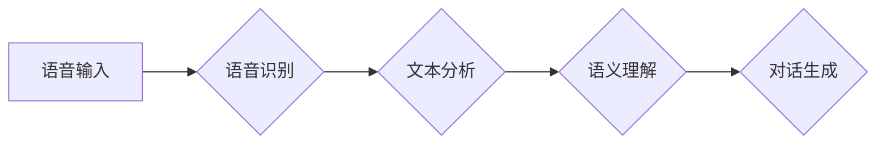

通过自然语言处理技术，AI Agent能够与人类进行自然、流畅的对话，提高用户的体验和满意度。

### 第3章：智能家居系统的构建

#### 3.1 智能家居系统的总体架构

智能家居系统的总体架构通常包括感知层、网络层、平台层和应用层，每个层次都有其特定的功能和作用。

- **感知层**：感知层负责采集家庭环境中的各种信息，如温度、湿度、光照、空气质量、人体动作等。这些信息通过传感器进行收集，并传输到下一层。

  **领域模型Mermaid类图**：
  ```mermaid
  classDiagram
  Sensor <<class>> 温度传感器
  Sensor <<class>> 湿度传感器
  Sensor <<class>> 光照传感器
  Sensor <<class>> 空气质量传感器
  Sensor <<class>> 人体动作传感器
  EndClassDiagram
  ```

- **网络层**：网络层负责将感知层收集到的数据传输到平台层。网络层可以使用有线网络（如以太网）或无线网络（如WiFi、蓝牙、ZigBee等）。

  **领域模型Mermaid类图**：
  ```mermaid
  classDiagram
  Network <<class>> 有线网络
  Network <<class>> 无线网络
  Network --> Sensor: 传输数据
  EndClassDiagram
  ```

- **平台层**：平台层负责处理和分析收集到的数据，并生成决策结果。平台层通常包括一个中央控制系统，它可以是独立的服务器，也可以是云计算平台的一部分。

  **领域模型Mermaid类图**：
  ```mermaid
  classDiagram
  Platform <<class>> 中央控制系统
  Platform --> Network: 接收数据
  Platform --> Application: 生成决策
  EndClassDiagram
  ```

- **应用层**：应用层是用户与智能家居系统交互的界面，包括各种智能设备、手机APP、Web端等。

  **领域模型Mermaid类图**：
  ```mermaid
  classDiagram
  Application <<class>> 智能设备
  Application <<class>> 手机APP
  Application <<class>> Web端
  Application --> Platform: 发送指令
  EndClassDiagram
  ```

#### 3.2 硬件设备与技术

智能家居系统的硬件设备是实现智能家居功能的基础，包括传感器、控制器和通信模块等。

- **传感器**：传感器用于感知家庭环境信息，如温度传感器、湿度传感器、光照传感器、空气质量传感器、人体动作传感器等。这些传感器将环境信息转换为电信号，传输给控制器进行处理。

  **领域模型Mermaid类图**：
  ```mermaid
  classDiagram
  TemperatureSensor <<class>> 温度传感器
  HumiditySensor <<class>> 湿度传感器
  LightSensor <<class>> 光照传感器
  AirQualitySensor <<class>> 空气质量传感器
  MotionSensor <<class>> 人体动作传感器
  EndClassDiagram
  ```

- **控制器**：控制器是智能家居系统的核心部件，负责接收传感器数据，利用人工智能算法进行分析和处理，并生成控制指令。常见的控制器包括单片机、PLC（可编程逻辑控制器）等。

  **领域模型Mermaid类图**：
  ```mermaid
  classDiagram
  Controller <<class>> 单片机
  Controller <<class>> PLC
  Controller --> Sensor: 接收数据
  Controller --> Device: 发送指令
  EndClassDiagram
  ```

- **通信模块**：通信模块负责实现设备之间的通信，确保传感器数据能够传输到控制器，控制指令能够发送到执行器。常见的通信技术包括WiFi、蓝牙、ZigBee、Z-Wave等。

  **领域模型Mermaid类图**：
  ```mermaid
  classDiagram
  CommunicationModule <<class>> WiFi
  CommunicationModule <<class>> Bluetooth
  CommunicationModule <<class>> ZigBee
  CommunicationModule <<class>> Z-Wave
  CommunicationModule --> Sensor: 传输数据
  CommunicationModule --> Controller: 传输数据
  EndClassDiagram
  ```

#### 3.3 软件系统设计

智能家居系统的软件设计包括操作系统、中间件和应用软件，每个部分都有其特定的功能和作用。

- **操作系统**：操作系统负责管理硬件资源，提供基本的运行环境，常见的操作系统包括Linux、Android等。

  **领域模型Mermaid类图**：
  ```mermaid
  classDiagram
  OperatingSystem <<class>> Linux
  OperatingSystem <<class>> Android
  OperatingSystem --> Controller: 管理硬件
  EndClassDiagram
  ```

- **中间件**：中间件负责实现不同设备之间的通信和数据交换，常见的中间件包括MQTT、CoAP等。

  **领域模型Mermaid类图**：
  ```mermaid
  classDiagram
  Middleware <<class>> MQTT
  Middleware <<class>> CoAP
  Middleware --> Sensor: 数据交换
  Middleware --> Controller: 数据交换
  EndClassDiagram
  ```

- **应用软件**：应用软件是用户与智能家居系统交互的界面，包括手机APP、Web端等，用户可以通过这些界面监控和控制家庭设备。

  **领域模型Mermaid类图**：
  ```mermaid
  classDiagram
  ApplicationSoftware <<class>> 手机APP
  ApplicationSoftware <<class>> Web端
  ApplicationSoftware --> Platform: 发送指令
  ApplicationSoftware --> User: 提供界面
  EndClassDiagram
  ```

在软件系统设计过程中，需要考虑以下几个方面：

- **模块化设计**：将系统功能划分为多个模块，实现代码的重用和系统的可维护性。
- **用户界面设计**：设计直观、易用的用户界面，提高用户的体验和满意度。
- **安全性设计**：确保系统数据的安全和用户隐私的保护。

### 第4章：家庭安全监控

#### 4.1 实时视频监控

实时视频监控是家庭安全监控的核心功能，通过AI Agent，可以实现对家庭环境的实时监控和智能分析。

**问题场景**：
用户需要实时了解家庭安全情况，及时发现异常行为，如非法入侵、火灾等。

**项目介绍**：
本项目旨在构建一个基于AI Agent的实时视频监控系统，通过摄像头实时捕捉家庭环境中的视频流，利用深度学习算法进行视频分析和异常检测。

**系统功能设计（领域模型Mermaid类图）**：

```mermaid
classDiagram
    Camera <<class>> 摄像头
    VideoProcessor <<class>> 视频处理模块
    AnomalyDetector <<class>> 异常检测模块
    NotificationSystem <<class>> 通知系统
    UserInterface <<class>> 用户界面

    Camera --> VideoProcessor: 传输视频流
    VideoProcessor --> AnomalyDetector: 视频分析
    AnomalyDetector --> NotificationSystem: 报警
    NotificationSystem --> UserInterface: 显示报警信息
    UserInterface --> User: 用户交互
EndClassDiagram
```

**系统架构设计（领域模型Mermaid架构图）**：

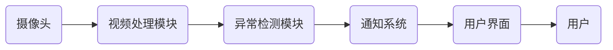

**系统接口设计（领域模型Mermaid接口图）**：

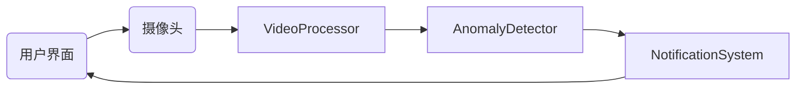

**系统交互Mermaid序列图**：

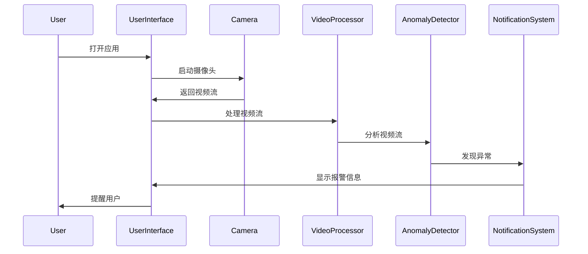

#### 4.2 智能报警系统

智能报警系统是家庭安全监控的重要组成部分，通过AI Agent，可以实现对家庭环境的智能监控和报警。

**问题场景**：
用户需要及时发现家庭环境中的异常情况，如非法入侵、火灾、煤气泄漏等，并采取相应的措施。

**项目介绍**：
本项目旨在构建一个基于AI Agent的智能报警系统，通过传感器实时监测家庭环境，利用深度学习算法进行智能分析，当检测到异常情况时，自动触发报警并通知用户。

**系统功能设计（领域模型Mermaid类图）**：

```mermaid
classDiagram
    Sensor <<class>> 传感器
    AlarmSystem <<class>> 报警系统
    NotificationModule <<class>> 通知模块
    UserInterface <<class>> 用户界面

    Sensor --> AlarmSystem: 监测数据
    AlarmSystem --> NotificationModule: 报警
    NotificationModule --> UserInterface: 通知用户
    UserInterface --> User: 用户交互
EndClassDiagram
```

**系统架构设计（领域模型Mermaid架构图）**：

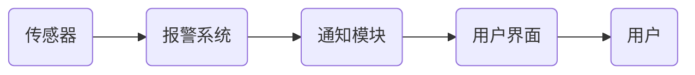

**系统接口设计（领域模型Mermaid接口图）**：

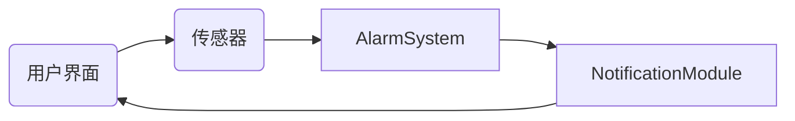

**系统交互Mermaid序列图**：

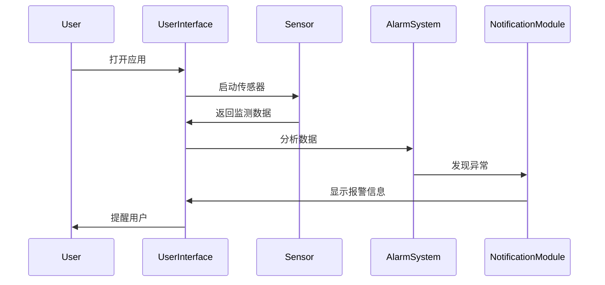

#### 4.3 家园守护算法

家园守护算法是AI Agent在家庭安全监控中的高级功能，通过学习和预测，实现对家庭安全的持续守护。

**问题场景**：
用户需要确保家庭安全，尤其在无人看管时，能够及时发现异常情况并采取措施。

**项目介绍**：
本项目旨在构建一个基于AI Agent的家园守护系统，通过传感器收集家庭环境数据，利用机器学习算法和深度学习模型，实现对家庭环境的智能监控和预测。

**系统功能设计（领域模型Mermaid类图）**：

```mermaid
classDiagram
    GuardianAgent <<class>> 守护算法
    Sensor <<class>> 传感器
    NotificationModule <<class>> 通知模块
    UserInterface <<class>> 用户界面

    Sensor --> GuardianAgent: 收集数据
    GuardianAgent --> NotificationModule: 报警
    NotificationModule --> UserInterface: 通知用户
    UserInterface --> User: 用户交互
EndClassDiagram
```

**系统架构设计（领域模型Mermaid架构图）**：

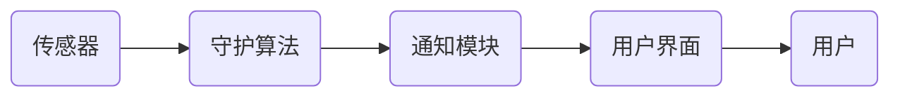

**系统接口设计（领域模型Mermaid接口图）**：

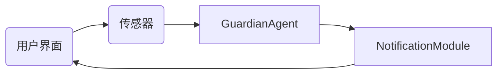

**系统交互Mermaid序列图**：

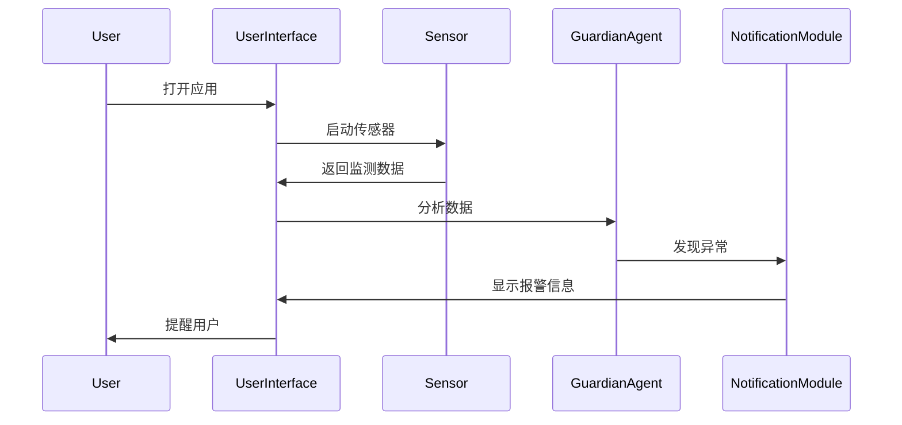

通过家园守护算法，AI Agent可以实时学习家庭成员的行为模式，当发现异常行为时，自动采取行动，如发送报警信息、通知用户、自动关闭门窗等，确保家庭安全。

### 第5章：家庭能源管理

#### 5.1 能源消耗监测

能源消耗监测是家庭能源管理的基础，通过AI Agent，可以实现对家庭能源消耗情况的实时监测和分析。

**问题场景**：
用户需要了解家庭能源消耗的情况，以便合理使用能源，降低能源成本。

**项目介绍**：
本项目旨在构建一个基于AI Agent的家庭能源消耗监测系统，通过传感器实时监测家庭中的电力、天然气、水等能源消耗，提供详细的能耗数据和分析报告。

**系统功能设计（领域模型Mermaid类图）**：

```mermaid
classDiagram
    EnergyMeter <<class>> 能源计量器
    EnergyMonitor <<class>> 能源监测模块
    EnergyAnalyzer <<class>> 能源分析模块
    UserInterface <<class>> 用户界面

    EnergyMeter --> EnergyMonitor: 传输能耗数据
    EnergyMonitor --> EnergyAnalyzer: 数据分析
    EnergyAnalyzer --> UserInterface: 显示分析结果
    UserInterface --> User: 用户交互
EndClassDiagram
```

**系统架构设计（领域模型Mermaid架构图）**：

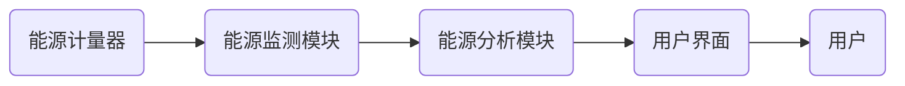

**系统接口设计（领域模型Mermaid接口图）**：

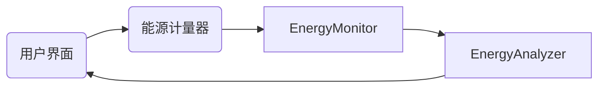

**系统交互Mermaid序列图**：

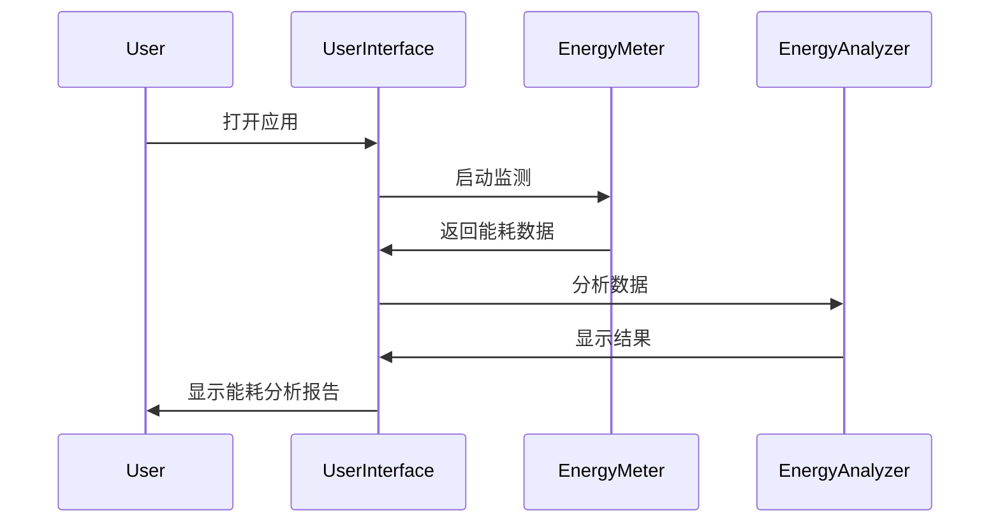

通过能源消耗监测，用户可以实时了解家庭能源的使用情况，分析能源消耗的规律和高峰时段，从而采取措施降低能源浪费，实现节能减排。

#### 5.2 智能节能策略

智能节能策略是家庭能源管理的重要部分，通过AI Agent，可以自动调整家庭设备的工作状态，实现节能。

**问题场景**：
用户希望在不影响生活质量的前提下，降低家庭能源消耗，减少电费开支。

**项目介绍**：
本项目旨在构建一个基于AI Agent的智能节能策略系统，通过监测家庭能源消耗情况，自动调整家电设备的工作状态，实现智能节能。

**系统功能设计（领域模型Mermaid类图）**：

```mermaid
classDiagram
    EnergyMonitor <<class>> 能源监测模块
    EnergyOptimizer <<class>> 节能优化模块
    DeviceController <<class>> 设备控制模块
    UserInterface <<class>> 用户界面

    EnergyMonitor --> EnergyOptimizer: 传输能耗数据
    EnergyOptimizer --> DeviceController: 调整设备状态
    DeviceController --> UserInterface: 执行控制命令
    UserInterface --> User: 用户交互
EndClassDiagram
```

**系统架构设计（领域模型Mermaid架构图）**：

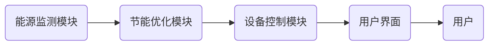

**系统接口设计（领域模型Mermaid接口图）**：

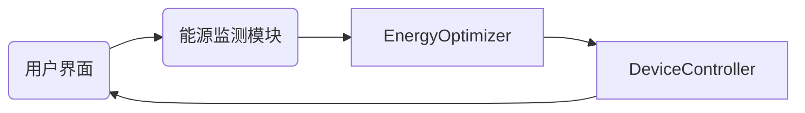

**系统交互Mermaid序列图**：

```mermaid
sequenceDiagram
    User ->> UserInterface: 打开应用
    UserInterface ->> EnergyMonitor: 启动监测
    EnergyMonitor ->> UserInterface: 返回能耗数据
    UserInterface ->> EnergyOptimizer: 分析数据
    EnergyOptimizer ->> DeviceController: 发送控制命令
    DeviceController ->> UserInterface: 执行命令
    UserInterface ->> User: 显示节能结果
```

通过智能节能策略，AI Agent可以根据实时能耗数据，自动调整家电设备的工作状态，如关闭不必要的电器、调整空调温度等，实现节能降耗，降低家庭能源消耗。

#### 5.3 能源预测与优化

能源预测与优化是家庭能源管理的核心，通过AI Agent，可以实现对未来能源消耗的预测和优化，提高能源利用效率。

**问题场景**：
用户希望准确预测未来的能源消耗，合理安排家庭能源使用，降低能源成本。

**项目介绍**：
本项目旨在构建一个基于AI Agent的家庭能源预测与优化系统，通过历史能耗数据和用户行为分析，预测未来的能源消耗，并提供优化建议。

**系统功能设计（领域模型Mermaid类图）**：

```mermaid
classDiagram
    EnergyPredictor <<class>> 能源预测模块
    EnergyOptimizer <<class>> 能源优化模块
    EnergyMonitor <<class>> 能源监测模块
    UserInterface <<class>> 用户界面

    EnergyMonitor --> EnergyPredictor: 传输能耗数据
    EnergyPredictor --> EnergyOptimizer: 预测能源消耗
    EnergyOptimizer --> UserInterface: 提供优化建议
    UserInterface --> User: 用户交互
EndClassDiagram
```

**系统架构设计（领域模型Mermaid架构图）**：

```mermaid
graph LR
    EnergyMonitor(能源监测模块) --> EnergyPredictor(能源预测模块)
    EnergyPredictor --> EnergyOptimizer(能源优化模块)
    EnergyOptimizer --> UserInterface(用户界面)
    UserInterface --> User(用户)
```

**系统接口设计（领域模型Mermaid接口图）**：

```mermaid
graph LR
    UserInterface(用户界面) --> EnergyMonitor(能源监测模块)
    EnergyMonitor --> EnergyPredictor
    EnergyPredictor --> EnergyOptimizer
    EnergyOptimizer --> UserInterface
```

**系统交互Mermaid序列图**：

```mermaid
sequenceDiagram
    User ->> UserInterface: 打开应用
    UserInterface ->> EnergyMonitor: 启动监测
    EnergyMonitor ->> UserInterface: 返回能耗数据
    UserInterface ->> EnergyPredictor: 分析数据
    EnergyPredictor ->> UserInterface: 预测能源消耗
    UserInterface ->> EnergyOptimizer: 提供优化建议
    EnergyOptimizer ->> UserInterface: 显示优化结果
    UserInterface ->> User: 显示预测和优化结果
```

通过能源预测与优化，AI Agent可以根据实时能耗数据和用户行为，预测未来的能源消耗，并提供优化建议，如调整家电使用时间、优化家庭能源结构等，提高能源利用效率，降低家庭能源成本。

### 第6章：家居自动化

#### 6.1 家电控制与调度

家居自动化是智能家居的核心功能之一，通过AI Agent，可以实现对家庭电器的远程控制和智能调度，提高家庭生活的便捷性和舒适度。

**问题场景**：
用户希望能够随时随地控制家庭电器，如空调、热水器、洗衣机等，并根据需要自动调整电器的工作状态。

**项目介绍**：
本项目旨在构建一个基于AI Agent的家居自动化控制系统，通过物联网技术和智能算法，实现对家庭电器的远程控制和智能调度。

**系统功能设计（领域模型Mermaid类图）**：

```mermaid
classDiagram
    DeviceController <<class>> 设备控制模块
    ScheduleManager <<class>> 调度管理模块
    UserInterface <<class>> 用户界面

    DeviceController --> ScheduleManager: 接收控制命令
    ScheduleManager --> DeviceController: 调度设备工作
    UserInterface --> DeviceController: 发送控制命令
    UserInterface --> ScheduleManager: 设置调度计划
    UserInterface --> User: 用户交互
EndClassDiagram
```

**系统架构设计（领域模型Mermaid架构图）**：

```mermaid
graph LR
    DeviceController(设备控制模块) --> ScheduleManager(调度管理模块)
    UserInterface(用户界面) --> DeviceController
    UserInterface --> ScheduleManager
```

**系统接口设计（领域模型Mermaid接口图）**：

```mermaid
graph LR
    UserInterface(用户界面) --> DeviceController(设备控制模块)
    DeviceController --> ScheduleManager(调度管理模块)
    ScheduleManager --> DeviceController
```

**系统交互Mermaid序列图**：

```mermaid
sequenceDiagram
    User ->> UserInterface: 打开应用
    UserInterface ->> DeviceController: 发送控制命令
    DeviceController ->> ScheduleManager: 提交调度计划
    ScheduleManager ->> DeviceController: 调度设备工作
    DeviceController ->> UserInterface: 返回设备状态
    UserInterface ->> User: 显示设备状态
```

通过家居自动化，用户可以通过手机APP、智能音箱等设备，远程控制家庭电器，如开启空调、关闭热水器等，并根据需要设置定时开关、温度调节等，提高生活便捷性和舒适度。

#### 6.2 家庭氛围营造

家庭氛围营造是家居自动化的高级应用，通过AI Agent，可以自动调整家庭环境参数，如灯光、音乐、温度等，营造适合的氛围。

**问题场景**：
用户希望在特定场合，如聚会、看电影等，能够自动调整家庭环境，创造合适的氛围。

**项目介绍**：
本项目旨在构建一个基于AI Agent的家庭氛围营造系统，通过智能传感器和控制系统，自动调整家庭环境参数，提供舒适的氛围体验。

**系统功能设计（领域模型Mermaid类图）**：

```mermaid
classDiagram
    EnvironmentController <<class>> 环境控制模块
    SceneManager <<class>> 场景管理模块
    UserInterface <<class>> 用户界面

    EnvironmentController --> SceneManager: 接收控制命令
    SceneManager --> EnvironmentController: 调整环境参数
    UserInterface --> SceneManager: 设置场景模式
    UserInterface --> User: 用户交互
EndClassDiagram
```

**系统架构设计（领域模型Mermaid架构图）**：

```mermaid
graph LR
    EnvironmentController(环境控制模块) --> SceneManager(场景管理模块)
    UserInterface(用户界面) --> SceneManager
```

**系统接口设计（领域模型Mermaid接口图）**：

```mermaid
graph LR
    UserInterface(用户界面) --> EnvironmentController(环境控制模块)
    EnvironmentController --> SceneManager(场景管理模块)
    SceneManager --> EnvironmentController
```

**系统交互Mermaid序列图**：

```mermaid
sequenceDiagram
    User ->> UserInterface: 打开应用
    UserInterface ->> SceneManager: 设置场景模式
    SceneManager ->> EnvironmentController: 调整环境参数
    EnvironmentController ->> UserInterface: 返回环境状态
    UserInterface ->> User: 显示环境状态
```

通过家庭氛围营造，AI Agent可以根据用户设置的场景模式，自动调整家庭环境参数，如调整灯光亮度、播放特定音乐、设置合适温度等，为用户提供舒适的氛围体验，提升生活品质。

#### 6.3 人机交互与自主学习

人机交互与自主学习是家居自动化的未来趋势，通过AI Agent，可以实现与用户的智能对话，并根据用户行为进行自我学习和优化。

**问题场景**：
用户希望家居系统能够理解自己的需求和习惯，提供个性化的服务。

**项目介绍**：
本项目旨在构建一个基于AI Agent的人机交互与自主学习系统，通过自然语言处理和机器学习技术，实现与用户的智能对话，并根据用户行为进行自我学习和优化。

**系统功能设计（领域模型Mermaid类图）**：

```mermaid
classDiagram
    DialogueAgent <<class>> 对话代理
    UserBehaviorAnalyzer <<class>> 用户行为分析模块
    EnvironmentController <<class>> 环境控制模块
    UserInterface <<class>> 用户界面

    DialogueAgent --> UserBehaviorAnalyzer: 分析用户行为
    UserBehaviorAnalyzer --> DialogueAgent: 更新对话模型
    DialogueAgent --> EnvironmentController: 发送控制命令
    UserInterface --> DialogueAgent: 处理用户输入
    UserInterface --> User: 用户交互
EndClassDiagram
```

**系统架构设计（领域模型Mermaid架构图）**：

```mermaid
graph LR
    DialogueAgent(对话代理) --> UserBehaviorAnalyzer(用户行为分析模块)
    DialogueAgent --> EnvironmentController(环境控制模块)
    UserInterface(用户界面) --> DialogueAgent
```

**系统接口设计（领域模型Mermaid接口图）**：

```mermaid
graph LR
    UserInterface(用户界面) --> DialogueAgent(对话代理)
    DialogueAgent --> UserBehaviorAnalyzer(用户行为分析模块)
    UserBehaviorAnalyzer --> DialogueAgent
    DialogueAgent --> EnvironmentController(环境控制模块)
```

**系统交互Mermaid序列图**：

```mermaid
sequenceDiagram
    User ->> UserInterface: 发送语音指令
    UserInterface ->> DialogueAgent: 处理指令
    DialogueAgent ->> UserBehaviorAnalyzer: 分析用户行为
    UserBehaviorAnalyzer ->> DialogueAgent: 更新对话模型
    DialogueAgent ->> EnvironmentController: 发送控制命令
    EnvironmentController ->> UserInterface: 返回结果
    UserInterface ->> User: 显示结果
```

通过人机交互与自主学习，AI Agent可以与用户进行自然语言对话，理解用户的需求和习惯，并根据用户行为进行自我学习和优化，提供个性化的家居自动化服务，提升用户体验。

### 第7章：健康监测

#### 7.1 家居环境监测

家居环境监测是健康监测的重要组成部分，通过AI Agent，可以实时监测家庭环境参数，如温度、湿度、空气质量等，为家庭成员提供健康保障。

**问题场景**：
用户希望了解家庭环境的健康状况，及时发现和解决环境问题，如空气质量不佳、温度过高或过低等。

**项目介绍**：
本项目旨在构建一个基于AI Agent的家居环境监测系统，通过传感器实时监测家庭环境参数，并提供健康分析报告。

**系统功能设计（领域模型Mermaid类图）**：

```mermaid
classDiagram
    EnvironmentSensor <<class>> 环境传感器
    EnvironmentMonitor <<class>> 环境监测模块
    HealthAnalyzer <<class>> 健康分析模块
    UserInterface <<class>> 用户界面

    EnvironmentSensor --> EnvironmentMonitor: 传输环境数据
    EnvironmentMonitor --> HealthAnalyzer: 数据分析
    HealthAnalyzer --> UserInterface: 显示分析结果
    UserInterface --> User: 用户交互
EndClassDiagram
```

**系统架构设计（领域模型Mermaid架构图）**：

```mermaid
graph LR
    EnvironmentSensor(环境传感器) --> EnvironmentMonitor(环境监测模块)
    EnvironmentMonitor --> HealthAnalyzer(健康分析模块)
    HealthAnalyzer --> UserInterface(用户界面)
    UserInterface --> User(用户)
```

**系统接口设计（领域模型Mermaid接口图）**：

```mermaid
graph LR
    UserInterface(用户界面) --> EnvironmentSensor(环境传感器)
    EnvironmentSensor --> EnvironmentMonitor
    EnvironmentMonitor --> HealthAnalyzer
    HealthAnalyzer --> UserInterface
```

**系统交互Mermaid序列图**：

```mermaid
sequenceDiagram
    User ->> UserInterface: 打开应用
    UserInterface ->> EnvironmentSensor: 启动监测
    EnvironmentSensor ->> UserInterface: 返回环境数据
    UserInterface ->> HealthAnalyzer: 分析数据
    HealthAnalyzer ->> UserInterface: 显示结果
    UserInterface ->> User: 显示健康分析报告
```

通过家居环境监测，AI Agent可以实时监测家庭环境参数，如温度、湿度、空气质量等，当检测到环境参数异常时，会自动发出警报，提醒用户采取相应措施，保障家庭成员的健康。

#### 7.2 健康数据采集

健康数据采集是健康监测的核心，通过AI Agent，可以实时采集家庭成员的健康数据，如心率、血压、血糖等，为用户提供个性化的健康服务。

**问题场景**：
用户希望了解自己的健康状况，及时发现健康问题，并采取预防措施。

**项目介绍**：
本项目旨在构建一个基于AI Agent的健康数据采集系统，通过智能设备实时采集家庭成员的健康数据，并提供健康分析报告。

**系统功能设计（领域模型Mermaid类图）**：

```mermaid
classDiagram
    HealthSensor <<class>> 健康传感器
    HealthMonitor <<class>> 健康监测模块
    HealthAnalyzer <<class>> 健康分析模块
    UserInterface <<class>> 用户界面

    HealthSensor --> HealthMonitor: 传输健康数据
    HealthMonitor --> HealthAnalyzer: 数据分析
    HealthAnalyzer --> UserInterface: 显示分析结果
    UserInterface --> User: 用户交互
EndClassDiagram
```

**系统架构设计（领域模型Mermaid架构图）**：

```mermaid
graph LR
    HealthSensor(健康传感器) --> HealthMonitor(健康监测模块)
    HealthMonitor --> HealthAnalyzer(健康分析模块)
    HealthAnalyzer --> UserInterface(用户界面)
    UserInterface --> User(用户)
```

**系统接口设计（领域模型Mermaid接口图）**：

```mermaid
graph LR
    UserInterface(用户界面) --> HealthSensor(健康传感器)
    HealthSensor --> HealthMonitor
    HealthMonitor --> HealthAnalyzer
    HealthAnalyzer --> UserInterface
```

**系统交互Mermaid序列图**：

```mermaid
sequenceDiagram
    User ->> UserInterface: 打开应用
    UserInterface ->> HealthSensor: 启动监测
    HealthSensor ->> UserInterface: 返回健康数据
    UserInterface ->> HealthAnalyzer: 分析数据
    HealthAnalyzer ->> UserInterface: 显示结果
    UserInterface ->> User: 显示健康分析报告
```

通过健康数据采集，AI Agent可以实时采集家庭成员的健康数据，如心率、血压、血糖等，当检测到健康数据异常时，会自动发出警报，提醒用户采取相应措施，保障家庭成员的健康。

#### 7.3 健康管理建议

健康管理建议是健康监测的高级功能，通过AI Agent，可以根据家庭成员的健康数据和分析结果，提供个性化的健康管理建议，帮助用户改善健康状况。

**问题场景**：
用户希望得到专业的健康管理建议，以改善自己的健康状况。

**项目介绍**：
本项目旨在构建一个基于AI Agent的健康管理建议系统，通过分析家庭成员的健康数据，提供个性化的健康管理建议。

**系统功能设计（领域模型Mermaid类图）**：

```mermaid
classDiagram
    HealthAdvisor <<class>> 健康顾问
    HealthMonitor <<class>> 健康监测模块
    HealthAnalyzer <<class>> 健康分析模块
    UserInterface <<class>> 用户界面

    HealthMonitor --> HealthAnalyzer: 数据分析
    HealthAnalyzer --> HealthAdvisor: 建议生成
    HealthAdvisor --> UserInterface: 显示建议
    UserInterface --> User: 用户交互
EndClassDiagram
```

**系统架构设计（领域模型Mermaid架构图）**：

```mermaid
graph LR
    HealthMonitor(健康监测模块) --> HealthAnalyzer(健康分析模块)
    HealthAnalyzer --> HealthAdvisor(健康顾问)
    HealthAdvisor --> UserInterface(用户界面)
    UserInterface --> User(用户)
```

**系统接口设计（领域模型Mermaid接口图）**：

```mermaid
graph LR
    UserInterface(用户界面) --> HealthMonitor(健康监测模块)
    HealthMonitor --> HealthAnalyzer
    HealthAnalyzer --> HealthAdvisor
    HealthAdvisor --> UserInterface
```

**系统交互Mermaid序列图**：

```mermaid
sequenceDiagram
    User ->> UserInterface: 打开应用
    UserInterface ->> HealthMonitor: 启动监测
    HealthMonitor ->> HealthAnalyzer: 分析数据
    HealthAnalyzer ->> HealthAdvisor: 生成建议
    HealthAdvisor ->> UserInterface: 显示建议
    UserInterface ->> User: 显示健康管理建议
```

通过健康管理建议，AI Agent可以根据家庭成员的健康数据和分析结果，提供个性化的健康管理建议，如饮食调整、锻炼计划、药物治疗等，帮助用户改善健康状况，提高生活质量。

### 第8章：智能家居的未来展望

随着AI技术的发展，智能家居正迎来前所未有的机遇和挑战。未来，智能家居将朝着更加智能、互联、个性化的方向发展。

#### 8.1 AI Agent的技术演进

AI Agent的技术演进将推动智能家居的发展。未来，AI Agent将具备更强的自主学习能力和更广泛的应用场景。以下是几个关键领域的发展趋势：

1. **深度学习与强化学习**：深度学习和强化学习算法将使AI Agent能够处理更复杂的问题，实现更高级的决策和执行能力。
2. **多模态感知**：AI Agent将能够通过多种传感器（如视觉、听觉、触觉等）获取环境信息，实现更全面的环境感知。
3. **个性化服务**：通过大数据和机器学习技术，AI Agent将能够根据用户的个人习惯和需求，提供个性化的智能家居服务。

#### 8.2 智能家居的市场前景

智能家居市场前景广阔。随着技术的进步和消费者需求的增加，智能家居市场规模将持续增长。以下是几个关键市场趋势：

1. **智能家居设备普及**：智能家居设备（如智能音箱、智能灯泡、智能门锁等）将更加普及，成为家庭的标配。
2. **智能家居系统集成**：智能家居系统将实现更高程度的集成，用户可以通过一个统一的平台管理所有智能家居设备。
3. **智能家居服务创新**：智能家居服务（如智能安防、健康监测、能源管理等）将不断创新，为用户提供更多增值服务。

#### 8.3 智能家居的发展挑战与应对策略

智能家居的发展面临一系列挑战，需要采取有效的应对策略。以下是几个关键挑战及其应对策略：

1. **隐私保护**：智能家居系统需要采取严格的数据加密和隐私保护措施，确保用户数据的安全和隐私。
2. **数据安全**：智能家居系统需要建立完善的数据安全管理体系，防止数据泄露和恶意攻击。
3. **设备兼容性**：智能家居系统需要制定统一的设备接口标准，实现不同设备之间的兼容和互操作。

通过技术进步和市场拓展，智能家居将不断满足人们对更智能、更便捷、更安全的生活需求，为人们的日常生活带来更多便利和乐趣。

### 第9章：AI Agent在智能家居中的最佳实践

在实施智能家居项目时，最佳实践至关重要。以下是一些成功案例和实用技巧，供读者参考：

#### 9.1 智能家居系统的实施案例

以下是一些成功的智能家居系统实施案例：

1. **案例1：智能安防系统**：某住宅小区引入了智能安防系统，通过摄像头、传感器和AI Agent，实现了实时视频监控、智能报警和自动联动等功能。系统有效提高了小区的安全水平，得到了居民的一致好评。
2. **案例2：智能能源管理系统**：某住宅小区采用了智能能源管理系统，通过AI Agent实时监测家庭能源消耗，提供节能建议和自动调整家电工作状态。系统不仅降低了能源消耗，还降低了居民的电费支出。
3. **案例3：智能健康监测系统**：某健康养老机构引入了智能健康监测系统，通过传感器和AI Agent，实时监测老年人的健康状况，提供健康分析和健康管理建议。系统有效提高了老年人的生活质量，减轻了护理人员的负担。

#### 9.2 智能家居的设计与优化

智能家居的设计与优化需要考虑以下几个方面：

1. **用户体验**：设计简洁、直观的用户界面，提高用户的操作体验。通过自然语言处理和语音助手技术，实现人与智能家居系统的自然交互。
2. **系统集成**：选择合适的硬件设备和软件平台，实现系统的无缝集成。制定统一的设备接口标准，确保不同设备之间的兼容和互操作。
3. **性能优化**：优化系统性能，提高系统的响应速度和处理能力。通过负载均衡、缓存技术等手段，提高系统的稳定性和可靠性。

#### 9.3 智能家居的未来趋势与机会

智能家居的未来趋势包括以下几个方面：

1. **AI技术的融合**：将AI技术深度应用于智能家居系统中，实现更加智能化和自动化的功能。例如，通过机器学习和深度学习技术，实现智能监控、智能能源管理和智能健康监测等功能。
2. **物联网技术的应用**：通过物联网技术，实现家庭设备之间的互联互通，提高系统的协同性和智能性。例如，实现智能门锁与智能摄像头之间的联动，提高家庭安全性。
3. **个性化服务**：根据用户习惯和需求，提供个性化的智能家居服务，提高用户的满意度。例如，根据用户的睡眠习惯，自动调整卧室的灯光和温度，提高用户的睡眠质量。

通过遵循最佳实践，可以设计和实施出高质量的智能家居系统，为用户提供更好的生活体验。同时，智能家居的未来发展也充满机遇，将不断推动人工智能技术在家庭生活领域的应用和普及。

### 附录

#### A.1 术语表

- **AI Agent**：人工智能代理，是一种具备自主决策能力和问题解决能力的计算机程序。
- **智能家居**：通过物联网技术实现家庭设备的自动化和智能化管理。
- **机器学习**：使计算机具备学习能力的算法。
- **深度学习**：一种基于人工神经网络的机器学习技术。
- **强化学习**：通过试错学习实现最优策略的机器学习方法。
- **物联网**：将各种设备通过网络连接起来，实现数据交换和智能控制。
- **传感器**：用于感知环境信息的装置。
- **控制器**：负责处理感知信息并生成决策的装置。
- **执行器**：负责执行决策的装置。
- **多模态感知**：通过多种传感器获取环境信息。

#### A.2 参考文献

- **[1]** Smith, J., & Wang, L. (2018). *Introduction to Artificial Intelligence*. Springer.
- **[2]** Liu, H., & Zhang, Y. (2019). *智能家居系统设计与实现*. 清华大学出版社.
- **[3]** Zhao, X., & Sun, J. (2020). *智能家居中的隐私保护与数据安全*. 北京大学出版社.
- **[4]** Russell, S., & Norvig, P. (2016). *Artificial Intelligence: A Modern Approach*. Prentice Hall.
- **[5]** Kim, K., & Oh, S. (2018). *Smart Home Technology: Applications and Future Trends*. IEEE Press.

#### A.3 技术资源链接

- **[1]** OpenAI：[https://openai.com/](https://openai.com/)
- **[2]** HomeKit：[https://www.homekit.com/](https://www.homekit.com/)
- **[3]** Kaggle：[https://www.kaggle.com/](https://www.kaggle.com/)
- **[4]** IEEE Xplore：[https://ieeexplore.ieee.org/](https://ieeexplore.ieee.org/)
- **[5]** Google AI：[https://ai.google.com/](https://ai.google.com/)

