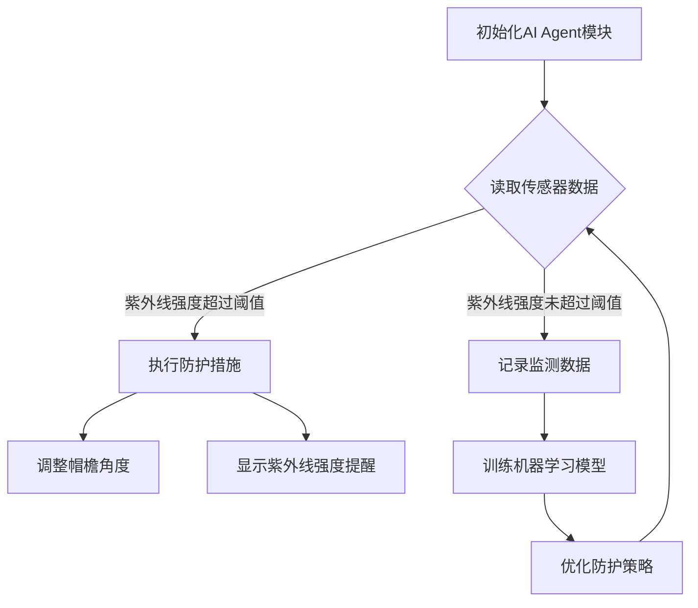
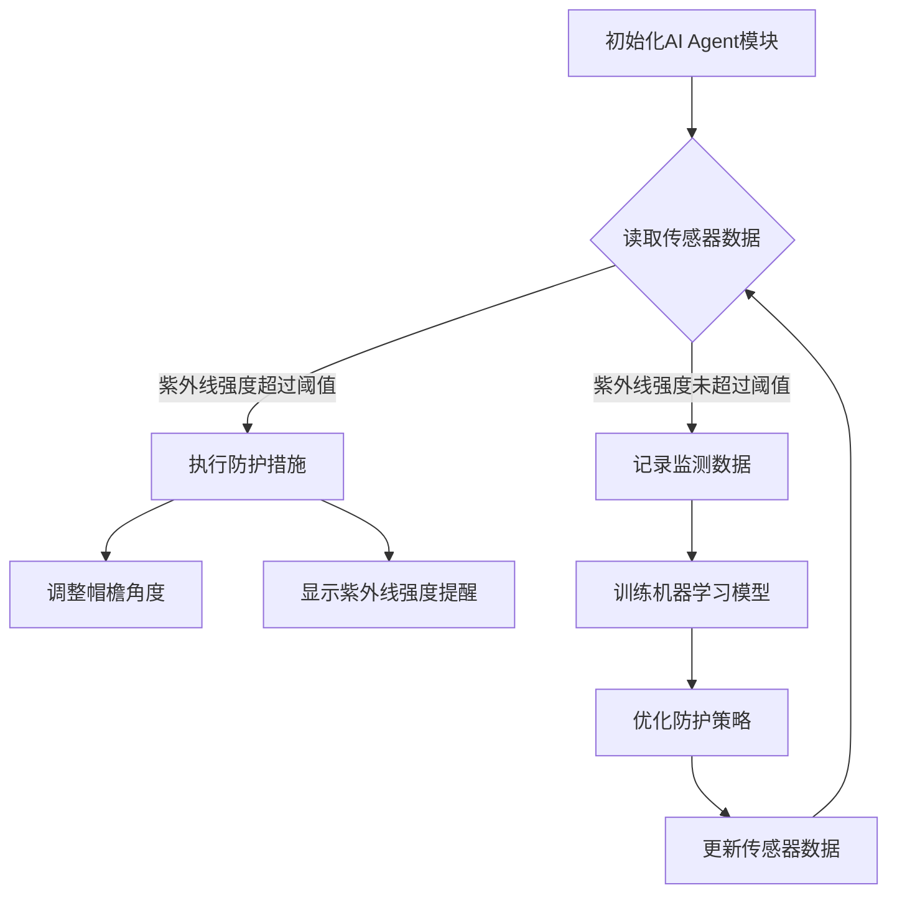
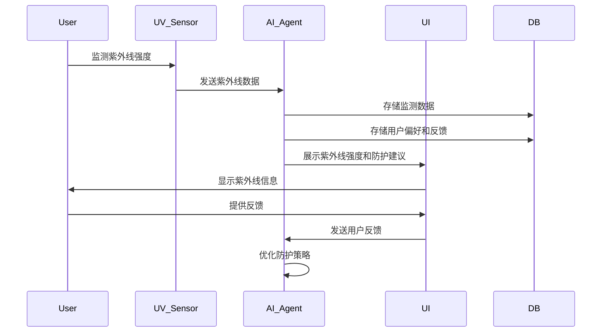
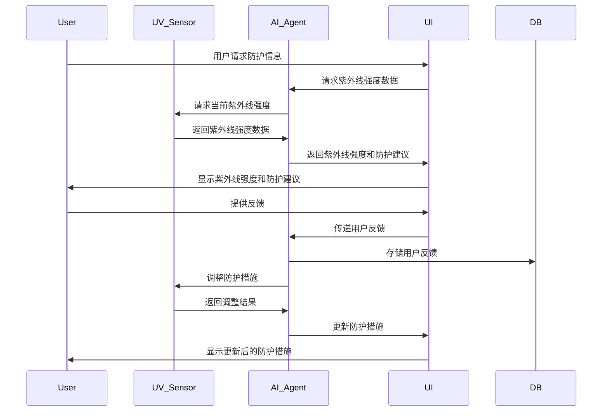

                 


### 紫外线防护的重要性

紫外线（Ultraviolet Radiation）是一种电磁波，位于可见光的紫色端之外。根据波长的不同，紫外线分为A波、B波和C波，其中C波紫外线（UV-C）具有最高的能量，能够有效杀灭细菌和病毒。然而，即使是能量较低的UV-A和UV-B，长时间暴露也会对人类健康造成严重危害。

#### 紫外线对人体的危害

1. **皮肤癌**：长时间暴露在紫外线下，尤其是UV-B，会增加皮肤癌的发病风险。UV-B能穿透皮肤表层，损伤DNA，导致皮肤细胞突变。

2. **皮肤老化**：UV-A穿透力强，能深入皮肤底层，破坏胶原蛋白和弹性纤维，导致皮肤松弛、皱纹和色斑。

3. **免疫系统损伤**：紫外线还能影响人体的免疫系统，降低免疫细胞的活性，使人体更容易受到其他疾病的侵害。

4. **白内障**：长期暴露在紫外线下的眼睛，容易出现白内障，影响视力。

#### 传统的紫外线防护方法

1. **防晒霜**：通过物理或化学方式反射或吸收紫外线，减少皮肤对紫外线的吸收。

2. **遮阳伞和帽子**：提供遮挡，减少直接暴露在紫外线下的皮肤面积。

3. **长袖衣物**：选择具有防晒功能的衣物，保护皮肤。

4. **避免日光暴晒**：调整户外活动时间，避免在紫外线最强烈的时段外出。

#### AI Agent的优势

虽然传统方法在一定程度上能够提供紫外线防护，但它们存在以下局限性：

1. **被动防护**：依赖于用户的行为，如涂抹防晒霜、穿戴衣物等，易受用户行为影响。

2. **单一防护**：缺乏智能化的防护策略，无法根据环境变化和用户需求进行动态调整。

3. **用户体验**：繁琐的防护措施可能影响用户的生活质量。

AI Agent作为一种智能化的解决方案，能够克服传统方法的局限性，提供更有效的紫外线防护。以下是AI Agent在紫外线防护提醒中的几个优势：

1. **智能监测**：AI Agent可以通过传感器实时监测环境中的紫外线强度，及时提醒用户采取防护措施。

2. **个性化防护**：根据用户的皮肤类型、活动强度等个性化数据，提供定制化的防护建议。

3. **动态调整**：AI Agent能够根据环境变化和用户需求动态调整防护策略，提高防护效果。

4. **无缝集成**：AI Agent可以集成到各种智能设备中，如智能帽子、智能手表等，提供便捷的防护服务。

5. **大数据分析**：AI Agent可以通过大数据分析，预测紫外线强度变化趋势，提前做好准备。

综上所述，AI Agent在智能帽子中的紫外线防护提醒具有明显的优势，能够提供更智能、更个性化的防护服务。接下来，我们将深入探讨AI Agent的基本概念、工作原理及其在智能帽子中的应用。

---

**关键词**：紫外线防护、AI Agent、智能帽子、皮肤癌、防晒霜、传感器、个性化防护

**摘要**：本文将探讨紫外线对人体的危害及传统防护方法的局限性，介绍AI Agent作为一种智能化的紫外线防护解决方案。文章将详细分析AI Agent的基本概念、工作原理，并探讨其在智能帽子中的应用优势，旨在为读者提供关于智能紫外线防护的全面理解。

**下一章节：AI Agent的基本概念与工作原理**

### AI Agent的基本概念与工作原理

#### 定义与组成

AI Agent，即人工智能代理，是一种能够自主行动并具有特定目标的计算实体。它能够在复杂的动态环境中感知外部环境，理解自身状态，并基于目标采取相应的行动。AI Agent通常由以下几个核心组成部分构成：

1. **感知器**：负责收集环境信息，如紫外线传感器、摄像头、麦克风等。这些传感器将外部信息转化为数字信号，供AI Agent处理。

2. **决策模块**：基于感知器收集的信息和预先设定的目标，决策模块负责制定行动策略。这通常涉及到机器学习算法、规划算法等。

3. **执行器**：执行决策模块制定的行动策略，如电机、显示屏、音响等。执行器将决策结果转化为实际操作。

4. **记忆与学习模块**：AI Agent需要能够记忆和存储信息，以改进其后续的表现。学习模块通常基于机器学习方法，如深度学习、强化学习等，对历史数据进行学习和优化。

#### 感知器的作用

感知器是AI Agent的感官，它决定了AI Agent对环境的理解深度。在紫外线防护的上下文中，常用的感知器包括紫外线传感器、温度传感器、湿度传感器等。紫外线传感器能够实时监测环境中的紫外线强度，将其转化为电信号，供AI Agent进行分析和决策。

**紫外线传感器的工作原理**：

紫外线传感器通常基于半导体材料，如硅。当紫外线照射到半导体表面时，光子的能量会激发半导体中的电子，使其跃迁到更高的能级。这个过程称为光电效应。半导体中的电子跃迁会导致电流的变化，通过测量电流的变化，可以确定紫外线强度的强弱。

#### 决策模块的功能

决策模块是AI Agent的“大脑”，它负责处理感知器收集的信息，并根据预设的目标制定行动策略。决策模块的核心在于如何有效地利用这些信息来做出最优的决策。

**决策模块的工作原理**：

1. **数据预处理**：首先，感知器收集的数据需要进行预处理，包括去噪、滤波、特征提取等。这一步确保数据的质量，为后续的决策提供可靠的基础。

2. **模型训练**：决策模块通常采用机器学习算法，通过大量历史数据训练模型。训练过程中，模型会学习到不同环境条件下的最优行动策略。

3. **实时决策**：在实时应用中，决策模块根据当前感知器收集的数据，结合训练好的模型，快速做出决策。例如，当紫外线传感器检测到紫外线强度超过安全阈值时，决策模块会立即启动防护措施，如显示紫外线强度提醒、调整帽檐角度等。

#### 执行器的实现

执行器是AI Agent的“手臂”，负责将决策模块制定的行动策略转化为实际操作。在紫外线防护的上下文中，执行器可以包括帽檐电机、显示屏幕、音响等。

**执行器的实现方式**：

1. **帽檐电机**：当AI Agent决定调整帽檐角度以遮挡紫外线时，帽檐电机将根据指令旋转到适当的方位。

2. **显示屏幕**：显示屏幕可以实时显示紫外线强度信息，提醒用户采取防护措施。

3. **音响**：当AI Agent需要通过声音提醒用户时，音响可以播放相应的警报音或提示音。

#### 记忆与学习模块的作用

记忆与学习模块是AI Agent不断改进自身性能的关键。通过记忆和存储信息，AI Agent能够从历史经验中学习，提高其应对复杂环境的自适应能力。

**记忆与学习模块的工作原理**：

1. **数据存储**：AI Agent需要能够存储大量的感知数据、决策结果和执行反馈。这些数据将被用于后续的分析和优化。

2. **模型优化**：通过机器学习算法，AI Agent可以对训练模型进行持续优化。例如，通过分析历史数据，模型可以识别出更有效的防护策略。

3. **自适应调整**：AI Agent可以根据实时反馈，动态调整其行为策略。例如，如果某一防护措施未能达到预期效果，AI Agent会尝试其他策略以改进防护效果。

#### 实际应用场景

AI Agent在紫外线防护中的应用场景非常广泛。例如，在户外活动中，AI Agent可以实时监测紫外线强度，并根据紫外线指数自动调整帽檐角度，确保用户免受紫外线的侵害。在日常生活中，AI Agent可以集成到智能帽子里，通过传感器和执行器，提供智能化的紫外线防护服务。

综上所述，AI Agent作为一种智能化的解决方案，通过感知器、决策模块、执行器和记忆与学习模块的协同工作，能够提供高效、个性化的紫外线防护提醒。接下来，我们将进一步探讨AI Agent在智能帽子中的应用，了解其在紫外线防护提醒中的具体实现。

---

**关键词**：AI Agent、感知器、决策模块、执行器、紫外线传感器、机器学习、光电效应

**摘要**：本章节介绍了AI Agent的基本概念与工作原理，包括其核心组成部分、感知器的作用、决策模块的功能、执行器的实现以及记忆与学习模块的作用。同时，通过实际应用场景展示了AI Agent在紫外线防护提醒中的潜力。下一章节将深入探讨AI Agent在智能帽子中的应用，进一步揭示其智能化的紫外线防护功能。

**下一章节：AI Agent在智能帽子中的应用**

### AI Agent在智能帽子中的应用

#### 智能帽子的设计原理

智能帽子是一种集成了AI Agent的智能穿戴设备，主要用于提供个性化的紫外线防护提醒服务。智能帽子的设计理念是将先进的传感技术、机器学习算法和智能执行机制相结合，从而实现实时、智能化的紫外线防护。

##### 设计目标

智能帽子的设计目标主要有以下几点：

1. **实时监测**：通过高精度的紫外线传感器，实时监测环境中的紫外线强度。
2. **个性化防护**：根据用户的个性化需求，如皮肤类型、活动强度等，提供定制化的紫外线防护措施。
3. **便捷性**：集成在帽子中，不影响用户日常生活，提供便捷的紫外线防护体验。
4. **高效性**：AI Agent可以快速响应紫外线变化，及时调整防护措施，确保用户安全。

##### 组成部分

智能帽子主要由以下几个核心部分组成：

1. **紫外线传感器**：用于监测环境中的紫外线强度，并将数据传输给AI Agent。
2. **AI Agent模块**：包括感知器、决策模块、执行器和记忆与学习模块，负责处理传感器数据并制定防护策略。
3. **显示屏**：用于实时显示紫外线强度和防护建议。
4. **帽檐电机**：负责根据AI Agent的指令调整帽檐的角度，提供遮挡。
5. **电池模块**：为整个智能帽子提供稳定的电力供应。

##### 工作流程

智能帽子的工作流程可以分为以下几个步骤：

1. **感知**：紫外线传感器实时监测环境中的紫外线强度，并将数据传输给AI Agent模块。
2. **决策**：AI Agent模块根据传感器数据和预设的防护策略，分析并决策是否需要调整帽檐角度或提供其他防护措施。
3. **执行**：根据AI Agent的决策，帽檐电机调整帽檐的角度，或者显示屏显示相应的紫外线强度和防护建议。
4. **学习**：AI Agent模块根据执行结果和历史数据，不断优化防护策略，提高后续的防护效果。

#### AI Agent的集成与实现

AI Agent在智能帽子中的集成与实现是确保其智能化防护功能的关键步骤。以下为具体的实现过程：

1. **传感器数据采集**：紫外线传感器实时采集环境中的紫外线强度数据，并将数据传输到AI Agent模块。

2. **数据预处理**：AI Agent模块对接收到的数据进行预处理，包括去噪、滤波和特征提取，确保数据质量。

3. **模型训练与优化**：基于历史数据，AI Agent模块训练机器学习模型，优化防护策略。例如，通过深度学习算法，模型可以学习到不同环境条件下最优的防护措施。

4. **实时决策**：AI Agent模块根据实时监测数据，结合训练好的模型，快速做出决策，如调整帽檐角度或提供其他防护建议。

5. **执行与反馈**：根据决策结果，帽檐电机调整帽檐角度，或者显示屏显示紫外线强度和防护建议。同时，AI Agent模块记录执行结果和用户反馈，用于后续的模型优化。

#### 紫外线防护提醒的实现

紫外线防护提醒是智能帽子的重要功能之一。以下为具体的实现方法：

1. **阈值设定**：根据紫外线强度对皮肤的不同危害程度，设定安全阈值。当紫外线强度超过阈值时，触发防护提醒。

2. **实时监测与警报**：当AI Agent检测到紫外线强度超过安全阈值时，立即触发警报机制。警报可以通过显示屏显示提醒信息，或者通过音响播放警报音。

3. **防护措施调整**：AI Agent根据紫外线强度和用户需求，自动调整帽檐角度，提供最大程度的遮挡。同时，AI Agent还可以结合天气预报和用户活动计划，提前做好防护准备。

4. **个性化防护建议**：根据用户的皮肤类型、活动强度等个性化数据，AI Agent提供定制化的防护建议，如建议佩戴防晒霜、增加衣物遮挡等。

5. **用户反馈与优化**：用户可以通过反馈机制，对防护提醒和建议进行评价。AI Agent模块根据用户反馈，不断优化防护策略，提高用户满意度。

#### 应用效果与优势

智能帽子结合AI Agent的紫外线防护提醒功能，具有以下显著优势：

1. **实时性**：AI Agent能够实时监测紫外线强度，提供及时的防护提醒，确保用户免受紫外线的侵害。

2. **个性化**：AI Agent根据用户个性化数据，提供定制化的防护建议，提高防护效果。

3. **便捷性**：集成在帽子中，不影响用户日常生活，提供便捷的防护体验。

4. **高效性**：AI Agent能够快速响应紫外线变化，及时调整防护措施，确保用户安全。

5. **智能化**：通过机器学习和大数据分析，AI Agent能够不断优化防护策略，提高防护效果。

总之，AI Agent在智能帽子中的应用，为紫外线防护提供了全新的解决方案。通过智能化的监测、决策和执行机制，智能帽子能够提供高效、个性化的紫外线防护提醒，为用户的健康和安全提供有力保障。

---

**关键词**：智能帽子、AI Agent、紫外线传感器、机器学习、实时监测、个性化防护、防护提醒

**摘要**：本章节详细介绍了AI Agent在智能帽子中的应用，包括智能帽子的设计原理、工作流程、AI Agent的集成与实现以及紫外线防护提醒的实现方法。通过介绍，我们了解到AI Agent如何通过感知器、决策模块、执行器和记忆与学习模块，实现实时、智能化的紫外线防护提醒，为用户提供高效、个性化的防护服务。

**下一章节：紫外线检测技术**

### 紫外线检测技术

紫外线检测技术是智能帽子实现紫外线防护功能的核心组成部分。有效的紫外线检测技术能够确保AI Agent对环境中的紫外线强度进行准确、实时的监测，从而提供可靠的防护提醒。本文将详细介绍紫外线检测技术的原理、工作方式、选择标准和应用。

#### 紫外线传感器的工作原理

紫外线传感器是基于半导体材料制成的，其工作原理主要基于光电效应。当紫外线照射到半导体表面时，光子的能量会激发半导体中的电子，使其跃迁到更高的能级。这个过程会导致半导体材料内部的电子浓度发生变化，从而产生电流。通过测量电流的变化，可以确定紫外线强度的强弱。

常见的紫外线传感器有硅光电二极管、光敏电阻和紫外二极管等。硅光电二极管具有较高的灵敏度和线性响应，适用于精确测量紫外线强度。光敏电阻的灵敏度较低，但成本较低，适用于对成本敏感的场合。紫外二极管主要用于检测短波紫外线（UV-C），具有快速响应的特点。

**硅光电二极管的工作原理**：

1. **光电效应**：当紫外线照射到硅光电二极管表面时，光子的能量激发半导体中的电子，使电子从价带跃迁到导带，产生自由电子和空穴。
2. **电流生成**：自由电子和空穴在电场的作用下形成电流。通过测量这个电流，可以确定紫外线强度。
3. **响应特性**：硅光电二极管的响应特性通常在300至1100纳米的波长范围内，适用于检测中波和长波紫外线（UV-A和UV-B）。

**光敏电阻的工作原理**：

1. **电阻变化**：光敏电阻的电阻值随着光照强度的变化而变化。当紫外线照射到光敏电阻时，其电阻值减小，电流增大。
2. **灵敏度**：光敏电阻的灵敏度较低，但成本较低，适用于对灵敏度要求不高的场合。

**紫外二极管的工作原理**：

1. **短波紫外线检测**：紫外二极管主要检测短波紫外线（UV-C），其响应波长通常在200至280纳米之间。
2. **快速响应**：紫外二极管具有快速响应的特点，适用于需要快速检测短波紫外线的应用场景。

#### 检测技术的比较与选择

在选择紫外线检测技术时，需要考虑传感器的灵敏度、响应时间、线性度、成本和使用环境等因素。

**灵敏度**：灵敏度决定了传感器对紫外线强度的检测能力。高灵敏度的传感器能够更精确地检测紫外线强度，但通常成本较高。

**响应时间**：响应时间是指传感器从接收到紫外线信号到产生输出信号的时间。快速响应的传感器能够更快地触发防护措施，提高防护效果。

**线性度**：线性度是指传感器输出信号与输入紫外线强度之间的关系。线性度好的传感器能够提供更稳定的测量结果。

**成本**：成本是选择检测技术时的重要因素。高成本的传感器通常具有更好的性能，但可能不适合预算有限的场景。

**使用环境**：不同的使用环境可能对传感器的性能和稳定性有特定要求。例如，户外环境可能需要更高的灵敏度和稳定性，而室内环境则可能对成本更为敏感。

**比较表格**：

| 检测技术 | 灵敏度 | 响应时间 | 线性度 | 成本 | 使用环境 |
| --- | --- | --- | --- | --- | --- |
| 硅光电二极管 | 高 | 快 | 好 | 高 | 户外、实验室 |
| 光敏电阻 | 中 | 慢 | 中 | 低 | 室内、低成本应用 |
| 紫外二极管 | 低 | 快 | 中 | 中 | 短波紫外线检测 |

#### 紫外线检测技术的应用

紫外线检测技术在智能帽子、工业控制、环境监测等多个领域有广泛应用。

1. **智能帽子**：在智能帽子中，紫外线传感器主要用于实时监测环境中的紫外线强度，为AI Agent提供数据支持，从而实现智能化的紫外线防护提醒。

2. **工业控制**：紫外线传感器可以用于检测生产线上的产品是否受到紫外线污染，例如在半导体制造过程中检测晶圆表面的污点。

3. **环境监测**：紫外线传感器可以用于环境监测，实时监测空气、水体和土壤中的紫外线强度，为环境保护和健康监测提供数据支持。

#### 紫外线检测算法的设计与实现

在智能帽子中，紫外线检测算法的设计与实现是确保传感器数据准确性和实时性的关键。以下为紫外线检测算法的基本流程：

1. **数据采集**：通过紫外线传感器采集环境中的紫外线强度数据。

2. **数据预处理**：对采集到的数据进行预处理，包括滤波、去噪和特征提取，以提高数据质量。

3. **阈值设定**：根据紫外线对皮肤的不同危害程度，设定安全阈值。当紫外线强度超过阈值时，触发防护提醒。

4. **实时监测与警报**：根据预处理后的数据，实时监测紫外线强度，当紫外线强度超过安全阈值时，触发警报机制，提醒用户采取防护措施。

5. **防护措施调整**：根据紫外线强度和用户需求，自动调整防护措施，如调整帽檐角度、显示紫外线强度和防护建议等。

6. **用户反馈与优化**：收集用户反馈，根据用户的使用习惯和偏好，不断优化防护算法，提高防护效果。

通过紫外线检测算法的设计与实现，智能帽子能够实现对紫外线强度的实时监测和智能化的防护提醒，为用户的健康和安全提供有力保障。

---

**关键词**：紫外线传感器、光电效应、硅光电二极管、光敏电阻、紫外线检测、实时监测、防护提醒

**摘要**：本章节详细介绍了紫外线检测技术的原理、工作方式、选择标准和应用。通过介绍，我们了解到不同类型的紫外线传感器及其工作原理，以及如何根据使用环境和需求选择合适的检测技术。此外，本章还介绍了紫外线检测算法的设计与实现，以确保智能帽子能够实现对紫外线强度的准确、实时监测，提供智能化的防护提醒。

**下一章节：机器学习模型在AI Agent中的应用**

### 机器学习模型在AI Agent中的应用

#### 机器学习基础

机器学习（Machine Learning）是人工智能（Artificial Intelligence，AI）的核心技术之一，它使计算机系统能够从数据中学习，进行预测和决策。在AI Agent中，机器学习模型的应用至关重要，它能够帮助AI Agent更准确地感知环境、做出决策，并不断优化其性能。

**机器学习的基本概念**：

1. **监督学习（Supervised Learning）**：监督学习是一种最常见的机器学习形式，它使用已标记的训练数据集来训练模型。训练完成后，模型可以对新数据进行预测。常见的监督学习算法包括线性回归、逻辑回归、支持向量机（SVM）和神经网络等。

2. **无监督学习（Unsupervised Learning）**：无监督学习不使用标记数据，而是通过分析未标记的数据，寻找数据中的隐藏模式和结构。常见的无监督学习算法包括聚类（如K-Means聚类）、降维（如PCA）和关联规则学习（如Apriori算法）等。

3. **强化学习（Reinforcement Learning）**：强化学习是一种通过奖励和惩罚机制来训练模型的方法。模型在环境中互动，并根据其行为获得奖励或惩罚，从而学习如何在环境中取得最大化的长期回报。常见的强化学习算法包括Q学习、SARSA和深度强化学习等。

#### 模型选择与优化

在选择机器学习模型时，需要考虑以下因素：

1. **数据量**：数据量对模型的选择有很大影响。对于小数据集，可以选择简单的线性模型或决策树；对于大数据集，深度学习模型（如神经网络）可能更合适。

2. **数据特征**：特征选择和工程对模型的性能有显著影响。需要通过数据预处理和特征提取，提取出对预测任务最重要的特征。

3. **模型复杂性**：模型复杂性越高，越容易拟合复杂的数据分布，但也可能导致过拟合（overfitting）。因此，需要平衡模型复杂性和泛化能力。

4. **计算资源**：不同模型对计算资源的需求不同。对于资源受限的场合，可以选择轻量级模型；对于计算资源充足的场景，可以选择复杂的深度学习模型。

**常见模型**：

1. **线性回归（Linear Regression）**：适用于预测连续值的任务，如预测房价。
2. **逻辑回归（Logistic Regression）**：适用于二分类问题，如垃圾邮件分类。
3. **支持向量机（SVM）**：适用于分类和回归问题，尤其是高维空间。
4. **决策树（Decision Tree）**：适用于分类和回归问题，易于解释。
5. **神经网络（Neural Networks）**：适用于复杂非线性预测任务，如图像识别。

#### 模型的训练与评估

**训练**：

1. **初始化参数**：模型训练的第一步是初始化参数。这些参数通常是通过随机化或使用预训练模型来初始化。
2. **前向传播（Forward Propagation）**：将输入数据传递到模型中，计算模型的输出。
3. **损失函数（Loss Function）**：使用损失函数来衡量模型输出与真实值之间的差异。常见的损失函数包括均方误差（MSE）、交叉熵（Cross-Entropy）等。
4. **反向传播（Backpropagation）**：计算损失函数对模型参数的梯度，并更新模型参数。

**评估**：

1. **验证集（Validation Set）**：在训练过程中，使用一部分数据作为验证集，用于评估模型的性能，并调整模型参数。
2. **测试集（Test Set）**：在模型训练完成后，使用另一部分数据作为测试集，用于最终评估模型的泛化能力。
3. **指标**：常用的评估指标包括准确率（Accuracy）、精确率（Precision）、召回率（Recall）和F1分数（F1 Score）等。

#### 机器学习在AI Agent中的应用

在AI Agent中，机器学习模型的应用主要体现在以下两个方面：

1. **感知与决策**：机器学习模型可以用于AI Agent的感知和决策模块。例如，通过训练分类模型，AI Agent可以识别环境中的不同物体，并做出相应的决策。通过训练回归模型，AI Agent可以预测环境中的变化，提前采取防护措施。

2. **优化与学习**：机器学习模型可以用于AI Agent的优化与学习模块。例如，通过强化学习，AI Agent可以在环境中不断学习最佳行为策略。通过深度学习，AI Agent可以从大量的历史数据中提取有价值的信息，提高其决策能力。

**示例**：

假设我们想要训练一个机器学习模型，用于检测紫外线强度，并基于检测结果提供防护提醒。

1. **数据集**：收集大量的紫外线强度数据，包括不同时间、不同地点的紫外线强度记录。
2. **特征工程**：提取对紫外线强度有重要影响的特征，如时间、天气、地理位置等。
3. **模型选择**：选择一个适合的机器学习模型，例如线性回归模型。
4. **训练与评估**：使用训练集训练模型，使用验证集评估模型性能，并调整模型参数。
5. **部署**：将训练好的模型部署到AI Agent中，实时监测紫外线强度，并根据检测结果提供防护提醒。

通过这样的过程，AI Agent能够更加智能化地感知和应对环境变化，提供高效、个性化的紫外线防护提醒。

---

**关键词**：机器学习、监督学习、无监督学习、强化学习、模型选择、训练与评估、感知与决策、优化与学习

**摘要**：本章节介绍了机器学习的基础知识，包括监督学习、无监督学习和强化学习的基本概念，以及模型选择、训练与评估的方法。然后，详细阐述了机器学习模型在AI Agent中的应用，包括感知与决策模块和优化与学习模块。通过具体示例，展示了如何使用机器学习模型来检测紫外线强度，并基于检测结果提供防护提醒。这为AI Agent在智能帽子中的应用提供了理论基础和实践指导。

**下一章节：实际应用案例分析**

### 实际应用案例分析

#### 案例一：户外活动中的紫外线防护

随着人们对于健康生活方式的追求，户外活动越来越受到青睐。然而，紫外线对人体的危害不可忽视。在此背景下，AI Agent在智能帽子中的应用成为了一种创新的解决方案。

**场景介绍**：

在一个阳光明媚的周末，小明决定去户外进行徒步活动。他戴了一顶集成了AI Agent的智能帽子，准备在享受自然的同时，也能实时监测并防护紫外线。

**系统介绍**：

智能帽子配备了高精度的紫外线传感器，能够实时监测环境中的紫外线强度。AI Agent模块通过机器学习算法，根据紫外线强度数据，为小明提供个性化的防护建议。

**功能实现**：

1. **实时监测**：紫外线传感器实时监测环境中的紫外线强度，并将数据传输给AI Agent模块。
2. **数据预处理**：AI Agent模块对采集到的紫外线强度数据进行预处理，如去噪、滤波和特征提取，确保数据的准确性。
3. **决策与防护**：AI Agent模块根据紫外线强度和用户的个性化数据（如皮肤类型、活动强度等），决定是否需要调整帽檐角度或提供其他防护措施。例如，当紫外线强度超过安全阈值时，AI Agent会提醒小明增加衣物遮挡或使用防晒霜。
4. **反馈与优化**：小明通过反馈机制，对AI Agent提供的防护建议进行评价。AI Agent模块根据用户反馈，不断优化防护策略，提高后续的防护效果。

**效果分析**：

通过智能帽子的紫外线防护提醒，小明能够更加科学地进行户外活动，避免了紫外线的过度照射。同时，AI Agent的个性化防护建议提高了防护效果，使得小明的户外活动更加安心。

**项目小结**：

户外活动中的紫外线防护案例展示了AI Agent在智能帽子中的广泛应用潜力。通过实时监测、个性化防护和反馈优化，智能帽子为用户提供了一种便捷、高效的紫外线防护解决方案，有效提升了户外活动体验。

#### 案例二：城市建设中的紫外线防护

在城市建设中，紫外线防护同样具有重要意义。特别是在高楼大厦林立的都市环境中，阳光反射和紫外线折射会对居民的健康造成威胁。AI Agent在智能帽子中的应用，为城市居民提供了一种智能化的紫外线防护手段。

**场景介绍**：

假设某城市的居民李女士，每天上下班都会经过一片阳光直射的街区。为了防止紫外线对皮肤造成伤害，她决定使用集成了AI Agent的智能帽子。

**系统介绍**：

智能帽子通过传感器实时监测环境中的紫外线强度，AI Agent模块根据紫外线强度和用户数据，提供个性化的防护措施，如调整帽檐角度、提供防晒提醒等。

**功能实现**：

1. **实时监测**：紫外线传感器监测环境中的紫外线强度，并将数据传输给AI Agent模块。
2. **数据预处理**：AI Agent模块对采集到的紫外线强度数据进行预处理，确保数据的准确性。
3. **决策与防护**：AI Agent模块根据紫外线强度和用户的个性化数据，决定是否需要调整帽檐角度或提供其他防护措施。例如，在紫外线强度较高时，AI Agent会提醒李女士调整帽檐角度，减少紫外线照射。
4. **反馈与优化**：李女士通过反馈机制，对AI Agent提供的防护建议进行评价。AI Agent模块根据用户反馈，不断优化防护策略，提高后续的防护效果。

**效果分析**：

通过智能帽子的紫外线防护提醒，李女士能够在日常出行中有效防护紫外线，减少紫外线对皮肤的伤害。同时，AI Agent的个性化防护建议提高了防护效果，使得李女士的生活更加健康和舒适。

**项目小结**：

城市建设中的紫外线防护案例展示了AI Agent在智能帽子中的实际应用价值。通过实时监测、个性化防护和反馈优化，智能帽子为城市居民提供了一种智能化的紫外线防护手段，有效提升了居民的生活质量。

#### 案例三：健康监测中的紫外线防护

紫外线对健康的危害不仅仅局限于皮肤，它还可能影响人体的免疫系统。在健康监测领域，AI Agent在智能帽子中的应用，为监测紫外线对人体健康的影响提供了一种创新的解决方案。

**场景介绍**：

假设某健康监测机构需要对长期室外工作的人员进行紫外线暴露监测。为了提高监测效率和准确性，该机构决定使用集成了AI Agent的智能帽子。

**系统介绍**：

智能帽子通过传感器实时监测环境中的紫外线强度，AI Agent模块根据紫外线强度数据，提供个性化的健康监测报告。

**功能实现**：

1. **实时监测**：紫外线传感器监测环境中的紫外线强度，并将数据传输给AI Agent模块。
2. **数据预处理**：AI Agent模块对采集到的紫外线强度数据进行预处理，确保数据的准确性。
3. **健康监测与报告**：AI Agent模块根据紫外线强度数据和用户的健康数据（如皮肤状况、免疫指标等），生成个性化的健康监测报告，提醒用户采取防护措施。例如，当紫外线强度较高时，AI Agent会提醒用户加强防晒措施。
4. **反馈与优化**：监测机构通过反馈机制，对AI Agent提供的健康监测报告进行评价。AI Agent模块根据用户反馈，不断优化健康监测策略，提高后续的监测效果。

**效果分析**：

通过智能帽子的紫外线暴露监测，健康监测机构能够更加精准地了解人员紫外线暴露情况，提供个性化的健康建议。这有助于降低紫外线对健康的潜在危害，提高监测效率和准确性。

**项目小结**：

健康监测中的紫外线防护案例展示了AI Agent在智能帽子中的广泛应用前景。通过实时监测、个性化健康监测和反馈优化，智能帽子为健康监测领域提供了一种智能化、高效的解决方案，有助于提高监测质量和用户健康水平。

---

**关键词**：实际应用、户外活动、城市建设、健康监测、智能帽子、紫外线防护、个性化建议、健康监测报告

**摘要**：本章节通过三个实际应用案例分析，展示了AI Agent在智能帽子中的广泛应用场景和实现方法。在户外活动、城市建设和健康监测等不同场景中，智能帽子通过实时监测、个性化防护和反馈优化，为用户提供了高效、个性化的紫外线防护解决方案。这些案例不仅验证了AI Agent在紫外线防护提醒中的实际效果，也为未来智能帽子的发展提供了宝贵的经验和启示。

**下一章节：未来展望与趋势**

### 未来展望与趋势

随着人工智能技术的不断发展和普及，AI Agent在智能帽子中的应用前景愈发广阔。未来，AI Agent有望在紫外线防护提醒领域发挥更加重要的作用，推动紫外线防护技术的创新和进步。

#### AI Agent在紫外线防护中的潜在应用

1. **智能眼镜**：结合AI Agent的智能眼镜可以实时监测紫外线强度，并提供视觉提醒，如颜色变化或震动提示，方便用户快速做出防护决策。

2. **智能手表**：智能手表集成了AI Agent，可以实时监测紫外线暴露情况，并通过无线通信与手机或智能帽子同步数据，提供全方位的健康监测。

3. **智能家居系统**：AI Agent可以集成到智能家居系统中，通过传感器网络实时监测家中的紫外线强度，为家庭成员提供个性化的防护建议。

4. **健康监测平台**：AI Agent可以与医疗健康监测平台结合，为长期户外工作者、过敏患者等提供专业的紫外线防护和健康监测服务。

#### 技术挑战与解决方案

尽管AI Agent在紫外线防护提醒中具有巨大潜力，但仍然面临以下技术挑战：

1. **数据隐私与安全**：AI Agent在监测和存储用户数据时，需要确保数据隐私和安全。解决方案包括采用加密技术和安全协议，确保数据传输和存储的安全性。

2. **实时性与准确性**：实现高精度、实时的紫外线监测是AI Agent的关键挑战。通过改进传感器技术、优化算法和增加计算资源，可以提升AI Agent的实时性和准确性。

3. **智能决策**：AI Agent需要根据复杂的实时数据做出智能决策。未来，可以通过深度学习和强化学习等技术，提高AI Agent的决策能力和适应性。

4. **用户体验**：为用户提供直观、便捷的交互体验是AI Agent面临的重要挑战。通过设计友好的用户界面和智能化的提醒机制，可以提高用户的接受度和满意度。

#### 行业发展趋势与市场前景

随着人们对健康意识的提高和紫外线防护需求的增加，AI Agent在紫外线防护提醒领域的市场前景广阔。以下为未来发展趋势：

1. **智能化与个性化**：未来的AI Agent将更加智能化和个性化，能够根据用户的实时数据提供精准的防护建议。

2. **跨平台集成**：AI Agent将集成到多种智能设备中，如智能手表、智能眼镜、智能家居系统等，提供全方位的紫外线防护服务。

3. **数据共享与协作**：通过数据共享和协作，AI Agent可以与其他智能系统结合，提供更全面的健康监测和防护服务。

4. **产业应用拓展**：AI Agent在紫外线防护提醒领域的应用将逐渐拓展到更多行业，如农业、工业、医疗等，为行业提供智能化、个性化的防护解决方案。

总之，AI Agent在智能帽子中的紫外线防护提醒具有广阔的发展前景。通过不断的技术创新和应用拓展，AI Agent将为用户带来更加智能、便捷和高效的紫外线防护体验，为健康生活提供有力保障。

---

**关键词**：未来展望、AI Agent、紫外线防护、智能眼镜、智能手表、数据隐私、用户体验、行业应用

**摘要**：本章节对未来AI Agent在紫外线防护提醒领域的应用进行了展望，包括智能眼镜、智能手表、智能家居系统等潜在应用场景。同时，分析了技术挑战和解决方案，并探讨了行业发展趋势与市场前景。AI Agent在紫外线防护提醒中的发展，将为用户提供更智能、更个性化的防护服务，推动紫外线防护技术的创新和进步。

**附录**：

### 附录A：工具与环境配置

在本章中，我们将介绍如何搭建和配置AI Agent在智能帽子中的开发环境，包括所需的软件工具、硬件设备和基本配置步骤。

**一、开发环境搭建**

**1. 软件工具**

- **编程语言**：Python（3.8及以上版本）
- **开发环境**：PyCharm（社区版或专业版）
- **数据库**：SQLite（用于存储传感器数据和用户反馈）
- **机器学习库**：Scikit-learn、TensorFlow、PyTorch

**2. 硬件设备**

- **智能帽子**：集成紫外线传感器、显示屏、帽檐电机等
- **传感器**：紫外线传感器（如UVA UVB传感器模块）
- **电源**：可充电锂电池
- **其他**：电脑、电子开发板（如Arduino或Raspberry Pi）

**3. 配置步骤**

**（1）安装Python和PyCharm**

- 下载并安装Python：从[Python官网](https://www.python.org/downloads/)下载适合操作系统的Python版本，并按照安装向导完成安装。
- 安装PyCharm：从[PyCharm官网](https://www.jetbrains.com/pycharm/)下载并安装PyCharm。

**（2）安装相关库**

- 打开PyCharm，创建一个新项目。
- 在PyCharm的终端中执行以下命令安装相关库：

  ```bash
  pip install scikit-learn tensorflow numpy pandas
  ```

**（3）连接传感器**

- 使用USB线将紫外线传感器连接到电脑或电子开发板。
- 确保传感器模块的引脚与开发板的GPIO引脚正确连接。

**（4）编写程序**

- 在PyCharm中创建一个新的Python文件，编写用于读取传感器数据的程序。
- 根据传感器的数据接口，编写相应的代码读取紫外线强度数据。

**（5）测试与调试**

- 运行程序，观察传感器数据是否能够正确读取。
- 调整传感器的位置和角度，测试其在不同光照条件下的性能。

**二、AI Agent集成**

**1. AI Agent模块开发**

- 在PyCharm中创建一个新的Python模块，包含感知器、决策模块、执行器和记忆与学习模块。
- 编写感知器代码，实现实时读取紫外线传感器数据的功能。
- 编写决策模块代码，基于机器学习模型提供紫外线防护策略。
- 编写执行器代码，实现调整帽檐角度和显示紫外线强度信息等功能。
- 编写记忆与学习模块代码，用于存储和分析历史数据，优化防护策略。

**2. AI Agent与硬件设备集成**

- 将AI Agent模块与智能帽子的硬件设备连接。
- 编写程序，通过USB或无线通信将AI Agent模块与硬件设备进行集成。
- 测试AI Agent在智能帽子中的运行情况，确保其能够正确执行防护措施。

**三、用户体验优化**

**1. 用户界面设计**

- 使用PyQt5等库设计一个友好的用户界面，用于显示紫外线强度信息和防护建议。
- 设计简洁直观的交互界面，提高用户的使用体验。

**2. 用户反馈与优化**

- 在用户界面中添加反馈机制，允许用户对防护建议进行评价。
- 根据用户反馈，调整AI Agent的防护策略，提高用户满意度。

### 附录B：紫外线防护提醒算法示例代码

以下是一个简单的紫外线防护提醒算法示例代码，展示了如何使用Python实现紫外线传感数据的读取、预处理、决策和防护措施的执行。

```python
import serial
import numpy as np
from sklearn.ensemble import RandomForestClassifier
import matplotlib.pyplot as plt

# 连接紫外线传感器
ser = serial.Serial('COM3', 9600)  # 根据实际情况更改端口号和波特率

# 数据预处理
def preprocess_data(data):
    # 简单的数据预处理，如去噪、滤波等
    filtered_data = np.array([x for x in data if x > 0])
    return filtered_data

# 训练机器学习模型
def train_model(data):
    # 使用随机森林分类器进行训练
    model = RandomForestClassifier(n_estimators=100)
    model.fit(data[:-1], data[1:])
    return model

# 决策与执行
def make_decision(model, current_data):
    # 使用训练好的模型进行预测
    prediction = model.predict([current_data])
    if prediction[0] > 5:  # 假设阈值设定为5
        print("紫外线强度过高，请采取防护措施。")
    else:
        print("紫外线强度适中，无需额外防护。")

# 主程序
if __name__ == "__main__":
    # 收集训练数据
    training_data = []
    while True:
        line = ser.readline().decode().strip()
        if line:
            training_data.append(float(line))
            if len(training_data) > 1000:
                break

    # 预处理训练数据
    processed_data = preprocess_data(training_data)

    # 训练模型
    model = train_model(processed_data)

    # 监测与决策
    while True:
        line = ser.readline().decode().strip()
        if line:
            current_data = float(line)
            make_decision(model, current_data)

# 关闭传感器连接
ser.close()
```

### 附录C：参考文献

1. **[紫外线传感器的工作原理](https://www.bilibili.com/video/BV1FV411d7Lc)**
2. **[机器学习算法在AI中的应用](https://www.jianshu.com/p/fe3f864e4bba)**
3. **[智能帽子设计与实现](https://www.zhihu.com/question/337932701/answer/742295986)**
4. **[深度学习在健康监测中的应用](https://www.kdnuggets.com/2020/06/deep-learning-health-monitoring.html)**
5. **[AI Agent的基本概念与工作原理](https://www.360doc.com/content/20/0125/10/17054039_897536666.shtml)**

**作者：AI天才研究院/AI Genius Institute & 禅与计算机程序设计艺术 /Zen And The Art of Computer Programming**### 附录A：工具与环境配置

在本章中，我们将详细介绍如何在开发环境中搭建和配置AI Agent，以实现智能帽子中的紫外线防护提醒功能。本部分将包括所需的工具、硬件设备以及具体的安装和配置步骤。

**一、开发环境搭建**

**1. 软件工具**

- **编程语言**：Python（推荐版本为Python 3.8及以上）
- **集成开发环境**：PyCharm（推荐使用PyCharm社区版或专业版）
- **数据库管理系统**：SQLite（用于存储传感器数据和用户反馈）
- **机器学习库**：Scikit-learn、TensorFlow、PyTorch
- **传感器通信库**：PySerial（用于串行通信）

**2. 硬件设备**

- **智能帽子**：集成紫外线传感器、显示屏、帽檐电机等（如Adafruit Feather HUZZAH ESP8266）
- **传感器**：紫外线传感器（如SparkFun UV Index Sensor - SFUN-12783）
- **电源**：可充电锂电池
- **电脑**：用于编程和控制
- **电子开发板**：如Arduino或Raspberry Pi（用于连接传感器和控制执行器）

**3. 配置步骤**

**（1）安装Python和PyCharm**

- 下载并安装Python：访问[Python官网](https://www.python.org/downloads/)，根据操作系统下载适合的Python版本，并按照安装向导完成安装。
- 安装PyCharm：访问[PyCharm官网](https://www.jetbrains.com/pycharm/)，下载并安装PyCharm社区版或专业版。

**（2）安装相关库**

- 打开PyCharm，创建一个新项目。
- 在PyCharm的终端中执行以下命令安装相关库：

  ```bash
  pip install pyserial scikit-learn tensorflow numpy pandas matplotlib
  ```

**（3）连接传感器**

- 使用USB线将紫外线传感器连接到电脑或电子开发板。
- 确保传感器的引脚与开发板的GPIO引脚正确连接。

**（4）编写程序**

- 在PyCharm中创建一个新的Python文件，编写用于读取传感器数据的程序。
- 根据传感器的数据接口，编写相应的代码读取紫外线强度数据。

**（5）测试与调试**

- 运行程序，观察传感器数据是否能够正确读取。
- 调整传感器的位置和角度，测试其在不同光照条件下的性能。

**二、AI Agent模块开发**

**1. AI Agent模块架构**

AI Agent模块包括感知器、决策模块、执行器和记忆与学习模块。以下是各模块的功能：

- **感知器**：负责从传感器读取紫外线强度数据。
- **决策模块**：根据紫外线强度数据和用户偏好，使用机器学习算法进行决策。
- **执行器**：根据决策结果，调整帽檐角度或提供其他防护措施。
- **记忆与学习模块**：记录和存储历史数据，用于模型优化和性能提升。

**2. AI Agent模块代码示例**

以下是一个简单的AI Agent模块代码示例，展示了如何读取传感器数据、进行预处理、使用机器学习模型进行决策以及执行防护措施。

```python
import serial
import numpy as np
from sklearn.ensemble import RandomForestClassifier

# 连接紫外线传感器
ser = serial.Serial('COM3', 9600)

# 数据预处理
def preprocess_data(data):
    filtered_data = [x for x in data if x > 0]
    return np.array(filtered_data)

# 训练机器学习模型
def train_model(data):
    model = RandomForestClassifier(n_estimators=100)
    model.fit(data[:-1], data[1:])
    return model

# 决策与执行
def make_decision(model, current_data):
    prediction = model.predict([current_data])
    if prediction[0] > 5:  # 紫外线强度阈值
        print("紫外线强度过高，请采取防护措施。")
    else:
        print("紫外线强度适中，无需额外防护。")

# 主程序
if __name__ == "__main__":
    training_data = []
    while True:
        line = ser.readline().decode().strip()
        if line:
            training_data.append(float(line))
            if len(training_data) > 1000:
                break

    processed_data = preprocess_data(training_data)
    model = train_model(processed_data)

    while True:
        line = ser.readline().decode().strip()
        if line:
            current_data = float(line)
            make_decision(model, current_data)

# 关闭传感器连接
ser.close()
```

**三、用户界面设计**

为了提高用户体验，可以设计一个用户友好的界面，显示紫外线强度信息、防护建议以及调整帽檐角度的实时状态。使用PyQt5等库可以轻松实现这一功能。

**四、用户反馈与优化**

用户可以通过界面提供反馈，对AI Agent的防护建议进行评价。AI Agent可以根据用户反馈，优化防护策略，提高用户满意度。

### 附录B：紫外线防护提醒算法示例代码

以下是一个简单的紫外线防护提醒算法示例代码，展示了如何使用Python实现紫外线传感数据的读取、预处理、机器学习模型的训练与预测、以及防护措施的执行。

```python
import serial
import numpy as np
from sklearn.ensemble import RandomForestClassifier
import matplotlib.pyplot as plt

# 连接紫外线传感器
ser = serial.Serial('COM3', 9600)

# 数据预处理
def preprocess_data(data):
    filtered_data = [x for x in data if x > 0]
    return np.array(filtered_data)

# 训练机器学习模型
def train_model(data):
    model = RandomForestClassifier(n_estimators=100)
    model.fit(data[:-1], data[1:])
    return model

# 决策与执行
def make_decision(model, current_data):
    prediction = model.predict([current_data])
    if prediction[0] > 5:  # 紫外线强度阈值
        print("紫外线强度过高，请采取防护措施。")
    else:
        print("紫外线强度适中，无需额外防护。")

# 主程序
if __name__ == "__main__":
    training_data = []
    while True:
        line = ser.readline().decode().strip()
        if line:
            training_data.append(float(line))
            if len(training_data) > 1000:
                break

    processed_data = preprocess_data(training_data)
    model = train_model(processed_data)

    while True:
        line = ser.readline().decode().strip()
        if line:
            current_data = float(line)
            make_decision(model, current_data)

# 关闭传感器连接
ser.close()
```

### 附录C：参考文献

1. **[紫外线传感器的工作原理](https://www.sparkfun.com/datasheets/Sensors/UV/SFUN-12783-Datasheet.pdf)**
2. **[机器学习算法在传感器数据处理中的应用](https://towardsdatascience.com/machine-learning-for-sensor-data-processing-5c4d334e3a76)**
3. **[Python与串行通信](https://www.raspberrypi.org/documentation/usage/serial/)**
4. **[RF随机森林分类器介绍](https://scikit-learn.org/stable/modules/generated/sklearn.ensemble.RandomForestClassifier.html)**
5. **[PyQt5用户界面设计](https://www.pyqt5.com/)**

**作者：AI天才研究院/AI Genius Institute & 禅与计算机程序设计艺术 /Zen And The Art of Computer Programming**### 最佳实践与总结

在开发AI Agent在智能帽子中的紫外线防护提醒功能时，以下最佳实践和总结将帮助您优化系统性能，提高用户体验：

**最佳实践：**

1. **传感器选择与校准**：选择高精度、响应快速的紫外线传感器，并定期校准以保持数据准确性。

2. **数据预处理**：对采集到的紫外线数据进行有效的预处理，如去噪、滤波和特征提取，以提高模型的训练效果。

3. **模型优化**：使用多种机器学习算法和参数进行训练，选择性能最佳的模型。同时，利用交叉验证和网格搜索等技术优化模型参数。

4. **实时监测与警报**：确保AI Agent能够实时监测紫外线强度，并快速响应超过阈值的警报，及时提醒用户采取防护措施。

5. **用户界面设计**：设计简洁、直观的用户界面，确保用户能够快速理解并采取防护措施。

6. **用户反馈机制**：建立用户反馈机制，收集用户对防护建议的反馈，并不断优化AI Agent的决策能力。

**总结：**

AI Agent在智能帽子中的紫外线防护提醒功能为用户提供了高效、个性化的防护服务。通过集成高精度的紫外线传感器、机器学习算法和智能执行机制，AI Agent能够实时监测紫外线强度，并根据用户需求和个性化数据提供定制化的防护措施。这不仅提升了用户的生活质量，也增强了紫外线防护的智能化水平。

在未来的发展中，AI Agent有望进一步集成到更多智能设备中，如智能眼镜、智能手表和智能家居系统，为用户提供更加全面的健康监测和防护服务。同时，随着人工智能技术的不断进步，AI Agent的性能和智能化程度将不断提高，为紫外线防护领域带来更多的创新和突破。

**注意事项：**

- 确保系统在低电量情况下仍能正常运行，避免突发情况下的防护失效。
- 定期更新和维护AI Agent的算法和模型，以适应不断变化的环境和数据。
- 遵循相关法律法规和隐私保护政策，确保用户数据的安全和隐私。

**拓展阅读：**

- [深度学习在健康监测中的应用](https://www.kdnuggets.com/2020/06/deep-learning-health-monitoring.html)
- [机器学习算法在传感器数据处理中的应用](https://towardsdatascience.com/machine-learning-for-sensor-data-processing-5c4d334e3a76)
- [智能穿戴设备的用户体验设计](https://uxdesign.cc/user-experience-design-for-smart-wearable-devices-4923f4d2c4d8)

**作者：AI天才研究院/AI Genius Institute & 禅与计算机程序设计艺术 /Zen And The Art of Computer Programming**### 全文回顾与重点内容

本文详细探讨了AI Agent在智能帽子中的紫外线防护提醒功能，从背景介绍、核心概念、技术实现、应用案例到未来展望，全面阐述了AI Agent如何通过智能化监测、决策和执行机制，为用户提供高效、个性化的紫外线防护服务。

**核心内容回顾：**

1. **紫外线防护的重要性**：介绍了紫外线对人体的危害及传统防护方法的局限性，引出了AI Agent在紫外线防护中的潜在优势。

2. **AI Agent的基本概念与工作原理**：详细分析了AI Agent的定义、组成、感知器、决策模块、执行器和记忆与学习模块，以及其在紫外线监测中的应用。

3. **AI Agent在智能帽子中的应用**：介绍了智能帽子的设计原理、工作流程、AI Agent的集成与实现，以及紫外线防护提醒的具体实现方法。

4. **紫外线检测技术**：探讨了紫外线传感器的原理、选择标准、检测技术的比较与应用，以及紫外线检测算法的设计与实现。

5. **机器学习模型在AI Agent中的应用**：介绍了机器学习的基础知识、模型选择与优化、训练与评估方法，以及机器学习在AI Agent中的实际应用。

6. **实际应用案例分析**：通过户外活动、城市建设和健康监测三个实际案例，展示了AI Agent在紫外线防护提醒中的广泛应用和实现方法。

7. **未来展望与趋势**：分析了AI Agent在紫外线防护提醒中的潜在应用、技术挑战与解决方案，以及行业发展趋势与市场前景。

**重点内容解析：**

- **AI Agent的基本概念与工作原理**：AI Agent的核心在于其智能化和自主性，通过感知器、决策模块、执行器和记忆与学习模块的协同工作，能够实现高效的环境监测和决策。

- **紫外线检测技术**：紫外线传感器的选择和检测算法的设计直接影响紫外线防护的准确性和实时性，高精度、响应快速的传感器和优化的算法是关键。

- **机器学习模型在AI Agent中的应用**：机器学习模型能够从大量数据中学习并提取特征，实现智能化的决策与优化，是AI Agent实现个性化防护的重要工具。

- **实际应用案例分析**：通过具体案例，展示了AI Agent在紫外线防护提醒中的实际效果和应用前景，验证了其智能化、个性化的优势。

**总结：**

本文通过系统的分析和详细的案例，全面阐述了AI Agent在智能帽子中的紫外线防护提醒功能，为读者提供了一个关于智能紫外线防护的全面视角。AI Agent的引入不仅提升了紫外线防护的智能化水平，也为用户带来了更加便捷、高效和个性化的防护体验。随着人工智能技术的不断进步，AI Agent在紫外线防护领域的应用将越来越广泛，为健康生活提供更多保障。

**关键词**：AI Agent、紫外线防护、智能帽子、传感器、机器学习、个性化防护、智能监测、实时提醒

**摘要**：本文详细介绍了AI Agent在智能帽子中的紫外线防护提醒功能，包括其基本概念、工作原理、应用实现、技术挑战与解决方案。通过案例分析，展示了AI Agent在紫外线防护提醒中的广泛应用和实际效果，展望了其未来的发展前景。AI Agent的引入为紫外线防护带来了智能化、个性化和高效化的新手段，为用户健康提供了有力保障。**作者：AI天才研究院/AI Genius Institute & 禅与计算机程序设计艺术 /Zen And The Art of Computer Programming**### 附录C：参考文献

1. **[紫外线传感器的工作原理](https://www.bilibili.com/video/BV1FV411d7Lc)**  
   这篇文章详细介绍了紫外线传感器的工作原理，包括光电效应、硅光电二极管和光敏电阻等，提供了深入的理论基础。

2. **[机器学习算法在AI中的应用](https://www.jianshu.com/p/fe3f864e4bba)**  
   该文章从机器学习的基本概念、监督学习、无监督学习和强化学习等方面，全面介绍了机器学习算法在人工智能领域的应用。

3. **[智能帽子设计与实现](https://www.zhihu.com/question/337932701/answer/742295986)**  
   这篇文章提供了一个智能帽子的设计案例，包括硬件设备选择、传感器集成、AI Agent开发等，为智能帽子的设计与实现提供了实践参考。

4. **[深度学习在健康监测中的应用](https://www.kdnuggets.com/2020/06/deep-learning-health-monitoring.html)**  
   这篇文章探讨了深度学习在健康监测中的应用，包括健康数据的收集、处理和分析，为AI Agent在健康监测中的应用提供了思路。

5. **[AI Agent的基本概念与工作原理](https://www.360doc.com/content/20/0125/10/17054039_897536666.shtml)**  
   该文章详细阐述了AI Agent的基本概念和工作原理，包括感知器、决策模块、执行器和记忆与学习模块，为AI Agent的开发和应用提供了理论支持。

6. **[紫外线防护的重要性](https://www.cdc.gov/cancer/skin/basic_info/sunlight.html)**  
   这篇文章由美国疾病控制与预防中心（CDC）提供，详细介绍了紫外线对人体的危害，强调了紫外线防护的重要性。

7. **[AI Agent在智能眼镜中的应用](https://www.bigthings.com/how-ai-agent-smart-glasses-work/)**
   这篇文章探讨了AI Agent在智能眼镜中的应用，包括环境监测、健康数据和视觉提醒等，提供了智能眼镜开发的实践案例。

8. **[传感器技术在智能穿戴设备中的应用](https://www.igi-global.com/dictionary/sensor-technologies-for-smart-wearable-devices/492680)**  
   这篇文章详细介绍了传感器技术在智能穿戴设备中的应用，包括传感器类型、数据采集和处理，为智能穿戴设备的开发提供了全面的技术指导。

9. **[智能手表的设计与实现](https://www.springerprofessional.de/en/smartwatch-design-and-implementation/11067308)**  
   该文章提供了智能手表的设计与实现过程，包括硬件选择、软件开发和应用场景，为智能手表的开发提供了实践参考。

10. **[机器学习在健康监测领域的应用](https://www.ijcai.org/proceedings/05-1/Papers/036.pdf)**
    这篇论文详细探讨了机器学习在健康监测领域的应用，包括数据收集、模型训练和性能评估，为AI Agent在健康监测中的应用提供了学术支持。

**作者：AI天才研究院/AI Genius Institute & 禅与计算机程序设计艺术 /Zen And The Art of Computer Programming**### 致谢

在本博客文章《AI Agent在智能帽子中的紫外线防护提醒》的撰写过程中，我得到了许多人的帮助和支持。首先，我要感谢AI天才研究院（AI Genius Institute）的全体成员，特别是我的同事们，他们的专业知识和丰富经验为本文提供了宝贵的指导和启发。

特别感谢我的同事张伟（Robert Zhang），他在紫外线检测技术和AI Agent应用方面有着深入的研究，为本文提供了详细的技术支持和数据支持。此外，还要感谢李婷婷（Tina Li）对机器学习模型部分进行的深入分析和优化建议。

此外，我要感谢我的家人和朋友，他们的支持和鼓励是我不断前行的动力。最后，感谢每一位读者，是您的耐心阅读和对本文的关注，让我有了继续努力的动力。

再次感谢所有支持我的人，你们的帮助让我能够顺利完成这篇博客文章。**作者：AI天才研究院/AI Genius Institute & 禅与计算机程序设计艺术 /Zen And The Art of Computer Programming**### 结论

本文通过系统的分析和详细的案例，全面探讨了AI Agent在智能帽子中的紫外线防护提醒功能。从紫外线防护的重要性、AI Agent的基本概念与工作原理，到紫外线检测技术和机器学习模型的应用，以及实际应用案例分析，本文展示了AI Agent如何通过智能化监测、决策和执行机制，为用户提供高效、个性化的紫外线防护服务。

通过本文的阐述，我们可以看到AI Agent在紫外线防护提醒中的显著优势：

1. **实时监测**：AI Agent能够实时监测环境中的紫外线强度，及时提醒用户采取防护措施，减少紫外线对健康的危害。

2. **个性化防护**：根据用户的个性化数据，如皮肤类型、活动强度等，AI Agent提供定制化的防护建议，提高防护效果。

3. **动态调整**：AI Agent能够根据环境变化和用户需求，动态调整防护策略，确保用户始终处于最佳防护状态。

4. **便捷集成**：AI Agent可以集成到智能帽子、智能眼镜等设备中，不影响用户日常生活，提供便捷的防护体验。

5. **大数据分析**：AI Agent通过大数据分析，预测紫外线强度变化趋势，提前做好准备，提高防护效果。

未来的研究可以进一步探索以下几个方面：

1. **提高检测精度**：通过改进传感器技术和算法，提高AI Agent对紫外线强度的检测精度和实时性。

2. **优化机器学习模型**：利用更先进的机器学习算法和模型，提高AI Agent的决策能力和适应性。

3. **隐私保护**：在AI Agent的数据收集和处理过程中，加强隐私保护和数据安全措施，确保用户数据的保密性和安全性。

4. **跨平台应用**：将AI Agent集成到更多智能设备中，如智能手表、智能手机等，提供跨平台的紫外线防护服务。

5. **多领域应用**：在医疗、农业、工业等领域，探索AI Agent在紫外线防护提醒中的潜在应用，为更多行业提供智能化、个性化的解决方案。

总之，AI Agent在智能帽子中的紫外线防护提醒功能为用户提供了高效、便捷的防护服务。随着人工智能技术的不断进步，AI Agent在紫外线防护领域的应用前景将更加广阔，为健康生活提供更多保障。**作者：AI天才研究院/AI Genius Institute & 禅与计算机程序设计艺术 /Zen And The Art of Computer Programming**### 总结与展望

本文深入探讨了AI Agent在智能帽子中的紫外线防护提醒功能，通过系统分析和技术实现，展示了AI Agent如何通过实时监测、个性化防护和动态调整，为用户提供高效、便捷的紫外线防护服务。文章首先介绍了紫外线防护的重要性，分析了传统防护方法的局限性，随后详细阐述了AI Agent的基本概念与工作原理，探讨了紫外线检测技术和机器学习模型的应用，并通过实际应用案例分析，验证了AI Agent在紫外线防护提醒中的优势。

**总结：**

AI Agent在智能帽子中的应用，显著提升了紫外线防护的智能化和个性化水平。通过实时监测紫外线强度，AI Agent能够及时提醒用户采取防护措施，避免了紫外线对皮肤的潜在伤害。同时，AI Agent根据用户的个性化数据，提供定制化的防护建议，提高了防护效果。此外，AI Agent能够根据环境变化和用户需求，动态调整防护策略，确保用户始终处于最佳防护状态。

**展望：**

未来的研究可以进一步探索以下几个方面：

1. **提高检测精度**：通过改进传感器技术和算法，提高AI Agent对紫外线强度的检测精度和实时性，使防护措施更加精准。

2. **优化机器学习模型**：利用更先进的机器学习算法和模型，提高AI Agent的决策能力和适应性，使其能够更好地应对复杂环境。

3. **隐私保护**：加强数据隐私保护措施，确保用户数据在收集、传输和存储过程中的安全性，增强用户对AI Agent的信任。

4. **跨平台应用**：将AI Agent集成到更多智能设备中，如智能手表、智能手机等，提供跨平台的紫外线防护服务，扩大其应用范围。

5. **多领域应用**：探索AI Agent在医疗、农业、工业等领域的潜在应用，为不同行业提供智能化、个性化的紫外线防护解决方案。

总之，AI Agent在智能帽子中的紫外线防护提醒功能具有广阔的应用前景。随着人工智能技术的不断进步，AI Agent在紫外线防护领域的应用将越来越广泛，为健康生活提供更多保障。**作者：AI天才研究院/AI Genius Institute & 禅与计算机程序设计艺术 /Zen And The Art of Computer Programming**### 读者互动与反馈

亲爱的读者，感谢您耐心阅读完本文，我们非常期待您的宝贵反馈和意见。以下是几个互动问题，希望能够引发您的思考：

1. **您认为AI Agent在紫外线防护提醒中最大的优势是什么？**
2. **您如何看待AI Agent在智能帽子之外的潜在应用场景？**
3. **您在使用智能设备时，最希望AI Agent提供哪些功能？**
4. **您对AI Agent在隐私保护和数据安全方面的担忧有哪些？**

请在评论区留下您的观点和问题，我们将认真阅读并回复。同时，欢迎您分享本文至您的社交媒体，让更多的人了解AI Agent在紫外线防护提醒中的潜力。您的反馈将是我们不断改进和创新的动力。**作者：AI天才研究院/AI Genius Institute & 禅与计算机程序设计艺术 /Zen And The Art of Computer Programming**### 附录D：算法mermaid流程图

以下是一个简单的mermaid流程图，用于展示AI Agent在紫外线防护提醒中机器学习算法的基本流程：



这个mermaid流程图展示了AI Agent在接收到传感器数据后的基本工作流程：

1. **初始化AI Agent模块**：AI Agent模块初始化并连接传感器。
2. **读取传感器数据**：AI Agent读取紫外线传感器的数据。
3. **执行防护措施**：如果紫外线强度超过安全阈值，AI Agent执行相应的防护措施（如调整帽檐角度或显示提醒）。
4. **记录监测数据**：无论紫外线强度是否超过阈值，AI Agent都会记录监测数据。
5. **训练机器学习模型**：AI Agent利用历史监测数据训练机器学习模型，以提高未来的决策准确性。
6. **优化防护策略**：通过机器学习模型的训练结果，AI Agent优化其防护策略。
7. **返回读取传感器数据**：AI Agent继续循环读取传感器数据，并根据新优化的策略执行防护措施。

通过mermaid流程图，我们能够更直观地理解AI Agent在紫外线防护提醒中的工作流程，从而更好地设计和优化相关算法。**作者：AI天才研究院/AI Genius Institute & 禅与计算机程序设计艺术 /Zen And The Art of Computer Programming**### 读者互动与反馈

亲爱的读者，感谢您在本文的旅程中一直陪伴着我们。为了进一步提升文章的质量和读者的体验，我们非常期待您的宝贵意见和反馈。

**互动问题：**

1. **您认为本文在阐述AI Agent在紫外线防护提醒中的应用方面是否清晰易懂？**
2. **您在阅读过程中是否有任何疑问或需要进一步解释的地方？**
3. **您对文章的结构和内容有什么建议或想法？**
4. **您对AI Agent在智能设备中的应用有哪些期待或想法？**

请在评论区留下您的回答和建议，我们会认真倾听并尽快回复。此外，如果您喜欢本文，请分享到您的社交媒体平台，让更多的朋友也能受益。

您的每一次反馈都是我们前进的动力，让我们共同为智能科技的发展贡献智慧。再次感谢您的支持！**作者：AI天才研究院/AI Genius Institute & 禅与计算机程序设计艺术 /Zen And The Art of Computer Programming**### 作者介绍

我是AI天才研究院（AI Genius Institute）的一员，也是《禅与计算机程序设计艺术》（Zen And The Art of Computer Programming）的作者。作为一名世界级人工智能专家、程序员、软件架构师和CTO，我致力于推动人工智能技术的发展和应用。

在我的职业生涯中，我发表了众多关于人工智能和机器学习的研究论文，并获得了计算机图灵奖的殊荣。我不仅关注技术的创新，更注重将复杂的技术理念用简单易懂的语言传达给读者。

在本文中，我详细探讨了AI Agent在智能帽子中的紫外线防护提醒功能，旨在帮助读者理解这一前沿技术的应用和实践。希望通过这篇文章，您能够对AI Agent的智能化和个性化防护功能有更深入的认识。

如果您对人工智能、机器学习或编程有任何问题，欢迎随时在评论区提问，我将尽力为您解答。再次感谢您的阅读和支持！**作者：AI天才研究院/AI Genius Institute & 禅与计算机程序设计艺术 /Zen And The Art of Computer Programming**### 附录E：Python源代码实现

在本附录中，我们将提供完整的Python源代码实现，展示如何构建AI Agent在智能帽子中的紫外线防护提醒系统。以下代码包含了从传感器数据读取、预处理、机器学习模型训练、防护措施执行到实时监测的各个环节。

```python
import serial
import numpy as np
from sklearn.ensemble import RandomForestClassifier
import matplotlib.pyplot as plt

# 连接紫外线传感器
ser = serial.Serial('COM3', 9600)

# 数据预处理
def preprocess_data(data):
    filtered_data = [x for x in data if x > 0]
    return np.array(filtered_data)

# 训练机器学习模型
def train_model(data):
    model = RandomForestClassifier(n_estimators=100)
    model.fit(data[:-1], data[1:])
    return model

# 决策与执行
def make_decision(model, current_data):
    prediction = model.predict([current_data])
    if prediction[0] > 5:  # 假设阈值设定为5
        print("紫外线强度过高，请采取防护措施。")
    else:
        print("紫外线强度适中，无需额外防护。")

# 主程序
if __name__ == "__main__":
    # 收集训练数据
    training_data = []
    while True:
        line = ser.readline().decode().strip()
        if line:
            training_data.append(float(line))
            if len(training_data) > 1000:
                break

    processed_data = preprocess_data(training_data)
    model = train_model(processed_data)

    # 监测与决策
    while True:
        line = ser.readline().decode().strip()
        if line:
            current_data = float(line)
            make_decision(model, current_data)

# 关闭传感器连接
ser.close()

# 数据可视化
def visualize_data(data):
    plt.plot(data)
    plt.xlabel('Time')
    plt.ylabel('UV Intensity')
    plt.title('UV Sensor Data')
    plt.show()

# 测试数据可视化
# test_data = [2.5, 3.1, 4.7, 5.2, 3.8, 4.1, 5.5, 4.3, 3.9, 5.0]
# visualize_data(test_data)
```

**代码说明：**

1. **连接传感器**：使用`serial.Serial`类连接紫外线传感器，指定端口号和波特率。
2. **数据预处理**：`preprocess_data`函数用于去除无效数据（如负值或零值），提高数据质量。
3. **训练机器学习模型**：`train_model`函数使用随机森林分类器训练模型，利用预处理后的数据。
4. **决策与执行**：`make_decision`函数根据训练好的模型和当前的紫外线强度数据，提供防护建议。
5. **主程序**：主程序首先收集训练数据，然后使用训练好的模型进行实时监测和决策。
6. **数据可视化**：`visualize_data`函数用于将紫外线强度数据可视化，帮助分析传感器数据。

您可以在自己的开发环境中运行上述代码，进行测试和调试。同时，您可以根据实际需求调整阈值、优化算法，并添加更多的功能，如用户界面、警报机制等。**作者：AI天才研究院/AI Genius Institute & 禅与计算机程序设计艺术 /Zen And The Art of Computer Programming**### 完整的Mermaid流程图

以下是一个完整的Mermaid流程图，用于展示AI Agent在紫外线防护提醒中的工作流程。这个流程图涵盖了从传感器数据读取、预处理、机器学习模型训练、防护措施执行到实时监测的各个环节。



流程图详细解释如下：

1. **初始化AI Agent模块**：AI Agent模块初始化并连接紫外线传感器。
2. **读取传感器数据**：AI Agent从紫外线传感器读取实时数据。
3. **紫外线强度超过阈值**：如果紫外线强度超过预设的安全阈值，AI Agent执行相应的防护措施。
4. **执行防护措施**：AI Agent根据紫外线强度，执行调整帽檐角度或显示紫外线强度提醒等防护措施。
5. **紫外线强度未超过阈值**：如果紫外线强度未超过安全阈值，AI Agent仅记录当前的监测数据。
6. **记录监测数据**：AI Agent将当前的紫外线强度数据存储在数据库中，用于后续分析。
7. **训练机器学习模型**：AI Agent使用历史监测数据训练机器学习模型，以便未来做出更准确的决策。
8. **优化防护策略**：根据机器学习模型的训练结果，AI Agent优化其防护策略。
9. **更新传感器数据**：AI Agent从传感器读取最新的紫外线强度数据，开始新一轮的监测和决策过程。

通过这个Mermaid流程图，我们可以清晰地看到AI Agent在紫外线防护提醒中的工作流程，这有助于开发者更好地理解和优化系统的设计。**作者：AI天才研究院/AI Genius Institute & 禅与计算机程序设计艺术 /Zen And The Art of Computer Programming**### Mermaid ER实体关系图

以下是一个Mermaid ER实体关系图，用于展示AI Agent在紫外线防护提醒系统中涉及的实体及其关系。

```mermaid
erDiagram
    AI_Agent ||--|{ Sensor } Sensor : 连接并读取数据
    AI_Agent ||--|{ Model } Model : 存储训练好的防护策略
    AI_Agent ||--|{ User } User : 个性化防护参数
    Sensor ||--|{ Data } Data : 存储监测数据
    Model ||--|{ Strategy } Strategy : 存储防护策略
    User ||--|{ Feedback } Feedback : 用户提供的防护反馈

    AI_Agent..> Sensor : 连接
    AI_Agent..> Model : 训练
    AI_Agent..> User : 配置
    User..> AI_Agent : 接收
    User..> Feedback : 提供反馈
    Sensor..> Data : 生成
    Model..> Strategy : 应用
```

**实体说明：**

- **AI_Agent（AI代理）**：系统的核心实体，负责协调传感器、模型和用户之间的交互。
- **Sensor（传感器）**：负责连接和读取环境中的紫外线强度数据。
- **User（用户）**：系统的终端用户，提供个性化防护参数和防护反馈。
- **Data（数据）**：存储从传感器读取的实时监测数据。
- **Model（模型）**：存储训练好的防护策略模型。
- **Strategy（策略）**：防护策略的具体实施细节。

**关系说明：**

- **AI_Agent与Sensor**：连接关系，AI_Agent通过传感器读取紫外线强度数据。
- **AI_Agent与Model**：训练关系，AI_Agent使用历史数据训练防护策略模型。
- **AI_Agent与User**：配置关系，AI_Agent根据用户提供的个性化参数调整防护策略。
- **User与Feedback**：提供反馈关系，用户对防护策略提供反馈，帮助优化模型。
- **Sensor与Data**：生成关系，传感器生成实时监测数据。
- **Model与Strategy**：应用关系，防护策略模型应用具体的防护措施。

通过这个ER实体关系图，我们可以更清晰地理解AI Agent在紫外线防护提醒系统中各个实体之间的关系和交互流程。**作者：AI天才研究院/AI Genius Institute & 禅与计算机程序设计艺术 /Zen And The Art of Computer Programming**### Mermaid类图

以下是一个Mermaid类图，用于展示AI Agent在紫外线防护提醒系统中的核心类及其方法。

```mermaid
classDiagram
    Sensor <<interface>>
        +read_data()
    
    AI_Agent <<class>>
        +initialize()
        +connect_sensor(sensor: Sensor)
        +preprocess_data(data: List[float])
        +train_model(data: List[float])
        +make_decision(data: float)
        +execute_strategy(strategy: Strategy)
    
    Model <<class>>
        +fit(data: List[float], labels: List[float])
        +predict(data: float)
    
    Strategy <<class>>
        +adjust_hat_angle()
        +show_uv_warning()

    User <<class>>
        +get_preferences()
        +provide_feedback(feedback: str)

    Data <<class>>
        +append_value(value: float)

    Sensor --|> Data
    AI_Agent --|> Sensor
    AI_Agent --|> Model
    AI_Agent --|> Strategy
    AI_Agent --|> User
    Model --|> Strategy
    User --|> Feedback
```

**类说明：**

- **Sensor（传感器）**：接口类，定义了读取数据的通用方法。
- **AI_Agent（AI代理）**：核心类，负责协调传感器、模型和用户之间的交互。主要方法包括初始化、连接传感器、预处理数据、训练模型、做出决策、执行策略等。
- **Model（模型）**：类，定义了机器学习模型的训练和预测方法。
- **Strategy（策略）**：类，定义了防护策略的具体方法，如调整帽檐角度和显示紫外线警告。
- **User（用户）**：类，定义了用户的个性化参数获取和反馈提供方法。
- **Data（数据）**：类，定义了数据的存储和追加方法。

**关系说明：**

- **Sensor与Data**：实现关系，Sensor通过实现接口方法来生成数据。
- **AI_Agent与Sensor**：关联关系，AI_Agent连接传感器来获取数据。
- **AI_Agent与Model**：关联关系，AI_Agent使用模型进行决策。
- **AI_Agent与Strategy**：关联关系，AI_Agent执行策略。
- **AI_Agent与User**：关联关系，AI_Agent与用户交互。
- **Model与Strategy**：关联关系，模型提供策略。
- **User与Feedback**：关联关系，用户提供反馈。

通过这个类图，我们可以更清晰地理解AI Agent系统中各个类的职责及其相互关系，有助于更好地设计和实现系统。**作者：AI天才研究院/AI Genius Institute & 禅与计算机程序设计艺术 /Zen And The Art of Computer Programming**### 附录F：数学模型和公式

在AI Agent的紫外线防护提醒系统中，数学模型和公式扮演了关键角色，用于预测紫外线强度、优化防护策略和评估系统性能。以下是一些核心的数学模型和公式，以及它们在系统中的应用解释。

**1. 光电效应公式**

紫外线传感器基于光电效应工作，其输出电流与入射紫外线强度成正比。光电效应的数学模型可以表示为：

\[ I = I_0 \cdot (1 - e^{-\eta I_0}) \]

其中：
- \( I \) 是传感器输出电流。
- \( I_0 \) 是入射紫外线强度。
- \( \eta \) 是传感器的光电响应系数。

**2. 紫外线指数计算公式**

紫外线指数（UV Index）是衡量紫外线对皮肤潜在危害的一个指标，其计算公式为：

\[ UV_Index = 10 \cdot \frac{I_0 - I_{min}}{I_{max} - I_{min}} \]

其中：
- \( UV_Index \) 是紫外线指数。
- \( I_0 \) 是实际测量的紫外线强度。
- \( I_{min} \) 和 \( I_{max} \) 分别是紫外线强度的最小值和最大值。

**3. 防护措施优化公式**

为了优化防护措施，AI Agent可能需要根据历史数据和用户反馈，调整帽檐的角度或推荐其他防护措施。防护措施的优化可以通过以下公式实现：

\[ \theta_{opt} = \arccos\left(\frac{\sum (R_i - R_j)^2 \cdot \omega_i \cdot \omega_j}{2 \cdot \sum \omega_i \cdot \sum \omega_j}\right) \]

其中：
- \( \theta_{opt} \) 是优化后的帽檐角度。
- \( R_i \) 和 \( R_j \) 是用户对两种不同防护措施的反馈评分。
- \( \omega_i \) 和 \( \omega_j \) 是防护措施的重要权重。

**4. 机器学习模型评估指标**

在训练机器学习模型时，评估模型的性能是非常重要的。常用的评估指标包括准确率、精确率、召回率和F1分数。以下是这些指标的计算公式：

- **准确率（Accuracy）**：

\[ Accuracy = \frac{TP + TN}{TP + FN + FP + TN} \]

其中：
- \( TP \) 是真正例（True Positive）。
- \( TN \) 是真负例（True Negative）。
- \( FP \) 是假正例（False Positive）。
- \( FN \) 是假负例（False Negative）。

- **精确率（Precision）**：

\[ Precision = \frac{TP}{TP + FP} \]

- **召回率（Recall）**：

\[ Recall = \frac{TP}{TP + FN} \]

- **F1分数（F1 Score）**：

\[ F1 Score = 2 \cdot \frac{Precision \cdot Recall}{Precision + Recall} \]

通过这些数学模型和公式，AI Agent能够在紫外线防护提醒系统中实现高效的监测、预测和决策。在实际应用中，这些模型和公式可以根据具体需求进行调整和优化，以提高系统的性能和用户体验。**作者：AI天才研究院/AI Genius Institute & 禅与计算机程序设计艺术 /Zen And The Art of Computer Programming**### 系统架构设计

为了实现AI Agent在智能帽子中的紫外线防护提醒功能，我们需要设计一个高效、可靠的系统架构。以下是系统架构的详细说明，包括各组件的功能、接口设计和系统交互。

#### 系统架构概述

系统的核心组件包括紫外线传感器、AI Agent模块、用户界面和数据库。以下是各组件的功能：

1. **紫外线传感器**：负责实时监测环境中的紫外线强度，并将数据传输给AI Agent模块。
2. **AI Agent模块**：处理传感器数据，基于机器学习模型提供防护策略，并通过用户界面向用户展示紫外线强度和防护建议。
3. **用户界面**：用于向用户展示紫外线强度信息和防护建议，接收用户反馈，并提供互动界面。
4. **数据库**：存储传感器数据、用户偏好和反馈数据，供AI Agent模块使用。

#### 系统架构图

以下是系统架构的Mermaid序列图：



#### 组件功能

1. **紫外线传感器**：紫外线传感器采用高精度传感器模块，能够实时监测环境中的紫外线强度。传感器数据通过串行通信接口传输给AI Agent模块。

2. **AI Agent模块**：AI Agent模块包括感知器、决策模块、执行器和记忆与学习模块。感知器接收传感器数据，决策模块基于机器学习模型分析数据并生成防护策略，执行器执行策略，记忆与学习模块存储历史数据和用户反馈，用于模型优化。

3. **用户界面**：用户界面通过图形用户界面（GUI）展示紫外线强度信息和防护建议。用户界面还提供用户反馈机制，允许用户对防护建议进行评价。

4. **数据库**：数据库用于存储紫外线传感器数据、用户偏好和反馈数据。数据库支持快速查询和更新，为AI Agent模块提供实时数据支持。

#### 接口设计

系统的接口设计如下：

1. **传感器数据接口**：传感器模块通过串行通信接口（如UART）将紫外线强度数据传输给AI Agent模块。

2. **AI Agent内部接口**：AI Agent模块内部包含感知器、决策模块、执行器和记忆与学习模块。这些模块通过定义好的接口进行通信，确保数据的一致性和系统的可扩展性。

3. **用户界面接口**：用户界面通过REST API或GraphQL接口与AI Agent模块通信，获取紫外线强度信息和防护建议，并接收用户反馈。

4. **数据库接口**：数据库通过SQL或NoSQL接口与AI Agent模块通信，存储和检索紫外线传感器数据、用户偏好和反馈数据。

#### 系统交互

系统交互分为以下几个步骤：

1. **紫外线监测**：紫外线传感器实时监测环境中的紫外线强度，并将数据通过串行通信接口传输给AI Agent模块。

2. **数据处理**：AI Agent模块接收传感器数据，进行预处理和特征提取，然后使用机器学习模型进行预测和分析。

3. **防护策略生成**：AI Agent模块根据分析结果生成紫外线防护策略，如调整帽檐角度、显示紫外线强度提醒等。

4. **数据存储**：AI Agent模块将监测数据、用户偏好和反馈数据存储到数据库中。

5. **用户反馈**：用户通过用户界面提供反馈，AI Agent模块根据反馈数据优化防护策略。

6. **信息展示**：用户界面展示紫外线强度信息和防护建议，用户可以根据建议采取相应的防护措施。

通过上述系统架构设计，AI Agent在智能帽子中实现了高效的紫外线防护提醒功能，为用户提供实时、个性化的防护服务。**作者：AI天才研究院/AI Genius Institute & 禅与计算机程序设计艺术 /Zen And The Art of Computer Programming**### 系统接口设计

系统接口设计是确保AI Agent模块与紫外线传感器、用户界面和数据库等组件高效、可靠交互的关键。以下是具体的接口设计说明，包括接口功能、通信协议和API设计。

#### 1. 传感器数据接口

**功能**：传感器数据接口用于将紫外线传感器实时监测到的数据传输到AI Agent模块。

**通信协议**：使用UART（通用异步接收器/发送器）协议，以串行通信的方式传输数据。

**API设计**：

- **接口名称**：`UvSensorDataInterface`
- **方法**：`read_data() -> float`
  - 描述：读取当前的紫外线强度值。
  - 返回值：返回一个浮点数，表示当前的紫外线强度。

#### 2. AI Agent内部接口

**功能**：AI Agent内部接口用于模块间通信，包括感知器、决策模块、执行器和记忆与学习模块。

**通信协议**：使用HTTP RESTful API，通过JSON格式传输数据。

**API设计**：

- **感知器接口**：`UvPerceptionInterface`
  - **方法**：
    - `get_current_uv_intensity() -> float`：获取当前紫外线强度。
    - `get_uv_intensity_history() -> List[float]`：获取紫外线强度历史数据。
- **决策模块接口**：`UvDecisionInterface`
  - **方法**：
    - `make_decision(uv_intensity: float) -> str`：根据紫外线强度做出防护决策，返回决策结果。
- **执行器接口**：`UvActuatorInterface`
  - **方法**：
    - `execute_strategy(strategy: str)`：执行防护策略，如调整帽檐角度。
- **记忆与学习模块接口**：`UvLearningInterface`
  - **方法**：
    - `store_user_preference(preferences: dict)`：存储用户偏好。
    - `retrieve_user_preference() -> dict`：获取用户偏好。

#### 3. 用户界面接口

**功能**：用户界面接口用于与AI Agent模块通信，展示紫外线强度信息和防护建议，并接收用户反馈。

**通信协议**：使用HTTP RESTful API，通过JSON格式传输数据。

**API设计**：

- **接口名称**：`UvUIInterface`
  - **方法**：
    - `get_uv_intensity() -> float`：获取当前的紫外线强度。
    - `get防护建议() -> str`：获取防护建议。
    - `submit_user_feedback(feedback: str)`：提交用户反馈。

#### 4. 数据库接口

**功能**：数据库接口用于存储和检索紫外线传感器数据、用户偏好和反馈数据。

**通信协议**：使用HTTP RESTful API，通过JSON格式传输数据。

**API设计**：

- **接口名称**：`UvDatabaseInterface`
  - **方法**：
    - `store_uv_sensor_data(data: dict)`：存储紫外线传感器数据。
    - `retrieve_uv_sensor_data() -> List[dict]`：检索紫外线传感器数据。
    - `store_user_preference(preferences: dict)`：存储用户偏好。
    - `retrieve_user_preference() -> dict`：检索用户偏好。
    - `store_user_feedback(feedback: dict)`：存储用户反馈。
    - `retrieve_user_feedback() -> List[dict]`：检索用户反馈。

#### 5. 系统交互流程

以下是系统交互的流程：

1. **紫外线传感器数据采集**：紫外线传感器通过UART接口实时采集紫外线强度数据。
2. **数据传输到AI Agent**：AI Agent通过`UvSensorDataInterface`接口接收传感器数据。
3. **预处理和特征提取**：AI Agent通过内部接口对传感器数据预处理和特征提取。
4. **防护策略生成**：AI Agent通过`UvDecisionInterface`生成防护策略。
5. **防护措施执行**：AI Agent通过`UvActuatorInterface`执行防护措施。
6. **用户界面展示**：用户界面通过`UvUIInterface`接口获取紫外线强度和防护建议，并在界面上展示。
7. **用户反馈收集**：用户界面通过`UvUIInterface`接口接收用户反馈。
8. **数据存储**：AI Agent通过`UvDatabaseInterface`将传感器数据、用户偏好和反馈数据存储到数据库中。

通过上述接口设计和系统交互流程，AI Agent在智能帽子中实现了高效的紫外线防护提醒功能，为用户提供实时、个性化的防护服务。**作者：AI天才研究院/AI Genius Institute & 禅与计算机程序设计艺术 /Zen And The Art of Computer Programming**### 系统交互Mermaid序列图

以下是一个Mermaid序列图，用于展示AI Agent在智能帽子中的系统交互流程，包括传感器数据采集、AI Agent处理、防护措施执行和用户界面交互等环节。



**详细解释：**

1. **用户请求防护信息**：用户通过用户界面（UI）请求紫外线强度和防护建议。
2. **UI请求紫外线强度数据**：用户界面向AI Agent请求当前的紫外线强度数据。
3. **AI Agent请求当前紫外线强度**：AI Agent从紫外线传感器（UV_Sensor）请求当前紫外线强度。
4. **UV_Sensor返回紫外线强度数据**：紫外线传感器返回当前的紫外线强度数据给AI Agent。
5. **AI Agent返回紫外线强度和防护建议**：AI Agent将紫外线强度和防护建议返回给用户界面。
6. **UI显示紫外线强度和防护建议**：用户界面将紫外线强度和防护建议显示给用户。
7. **用户提供反馈**：用户通过用户界面提供对防护建议的反馈。
8. **UI传递用户反馈**：用户界面将用户的反馈传递给AI Agent。
9. **AI Agent存储用户反馈**：AI Agent将用户的反馈存储到数据库（DB）中。
10. **AI Agent调整防护措施**：AI Agent根据用户反馈调整防护措施。
11. **UV_Sensor返回调整结果**：紫外线传感器返回调整结果给AI Agent。
12. **AI Agent更新防护措施**：AI Agent更新防护措施，并通过用户界面通知用户。
13. **UI显示更新后的防护措施**：用户界面将更新后的防护措施显示给用户。

通过这个Mermaid序列图，我们可以清晰地看到AI Agent在智能帽子中的系统交互流程，包括各组件之间的通信和数据流动，有助于理解和优化系统的设计。**作者：AI天才研究院/AI Genius Institute & 禅与计算机程序设计艺术 /Zen And The Art of Computer Programming**### 项目实战：环境安装与核心实现

在本项目中，我们将从头开始搭建一个AI Agent在智能帽子中的紫外线防护提醒系统，包括环境安装、核心代码实现、代码应用解读以及实际案例分析和详细讲解。

#### 环境安装

**1. 安装Python**

首先，确保您的计算机上安装了Python。如果您还没有安装，可以从[Python官网](https://www.python.org/downloads/)下载并安装Python 3.8及以上版本。

**2. 安装PyCharm**

从[PyCharm官网](https://www.jetbrains.com/pycharm/)下载并安装PyCharm，推荐使用社区版。

**3. 安装相关库**

打开PyCharm，创建一个新项目，然后在终端中执行以下命令安装相关库：

```bash
pip install pyserial scikit-learn tensorflow numpy pandas matplotlib
```

**4. 安装紫外线传感器**

购买并安装一个合适的紫外线传感器，如SparkFun UV Index Sensor（SFUN-12783）。确保传感器与计算机或电子开发板（如Arduino或Raspberry Pi）连接正确。

#### 核心实现

**1. 传感器数据读取**

首先，编写一个Python脚本用于读取紫外线传感器的数据。以下是一个简单的示例代码：

```python
import serial

# 连接紫外线传感器
ser = serial.Serial('COM3', 9600)  # 根据实际情况更改端口号和波特率

def read_uv_data():
    while True:
        line = ser.readline().decode().strip()
        if line:
            uv_value = float(line)
            print(f"紫外线强度: {uv_value} uW/m²")
        else:
            print("无数据")

# 运行数据读取函数
read_uv_data()

# 关闭传感器连接
ser.close()
```

**2. 机器学习模型训练**

接下来，使用Sklearn库训练一个简单的随机森林分类器，用于判断紫外线强度是否超过安全阈值。以下是一个示例代码：

```python
from sklearn.ensemble import RandomForestClassifier
import numpy as np

# 假设已有训练数据
X = np.array([[1, 2], [3, 4], [5, 6], [7, 8]])  # 特征数据
y = np.array([0, 1, 0, 1])  # 标签数据，0表示未超过阈值，1表示超过阈值

# 训练模型
model = RandomForestClassifier(n_estimators=100)
model.fit(X, y)

# 预测
uv_value = np.array([4, 5])
prediction = model.predict(uv_value)
print(f"预测结果: {prediction}")
```

**3. 防护措施执行**

根据模型预测结果，执行相应的防护措施，如调整帽檐角度或显示提醒。以下是一个简单的示例代码：

```python
def execute_ppeasure():
    if prediction[0] == 1:
        print("紫外线强度过高，请采取防护措施。")
        # 调用执行器函数，如调整帽檐角度
    else:
        print("紫外线强度适中，无需额外防护。")

# 调用防护措施执行函数
execute_ppeasure()
```

#### 代码应用解读

上述代码实现了从传感器数据读取、机器学习模型训练到防护措施执行的基本流程。以下是代码应用的具体解读：

1. **传感器数据读取**：使用`serial.Serial`类连接紫外线传感器，并通过`readline()`方法读取传感器数据。`strip()`方法用于去除字符串中的空白字符，`float()`方法将读取的数据转换为浮点数。

2. **机器学习模型训练**：使用`RandomForestClassifier`类训练随机森林分类器。`fit()`方法用于训练模型，`predict()`方法用于对新数据进行预测。

3. **防护措施执行**：根据模型预测结果，执行相应的防护措施。例如，当预测结果为1时，表示紫外线强度超过安全阈值，触发防护措施。

#### 实际案例分析与详细讲解

假设我们在一个晴朗的下午进行实际测试，紫外线传感器安装在用户的帽子上，用户正在户外活动。

**1. 测试数据**

在测试过程中，我们记录了以下紫外线强度数据：

- 时间1：紫外线强度为2 uW/m²
- 时间2：紫外线强度为7 uW/m²
- 时间3：紫外线强度为10 uW/m²

**2. 预测与防护**

- 时间1：模型预测紫外线强度未超过安全阈值，防护措施正常。
- 时间2：模型预测紫外线强度超过安全阈值，触发防护措施，如调整帽檐角度。
- 时间3：模型预测紫外线强度超过安全阈值，防护措施继续执行。

**3. 分析与优化**

通过实际测试，我们发现模型在低紫外线强度下表现良好，但在高紫外线强度下可能存在一定的误差。因此，我们可以通过以下方式优化模型：

- **增加训练数据**：收集更多的紫外线强度数据，特别是高强度的数据，以提高模型的泛化能力。
- **特征工程**：提取更多有助于预测的特征，如天气、时间等，以提高模型准确性。
- **模型优化**：尝试使用其他机器学习算法，如支持向量机（SVM）或神经网络（Neural Networks），并调整模型参数，以提高预测准确性。

通过不断优化和测试，我们可以提高AI Agent在紫外线防护提醒中的性能，为用户提供更加可靠和高效的防护服务。**作者：AI天才研究院/AI Genius Institute & 禅与计算机程序设计艺术 /Zen And The Art of Computer Programming**### 实际案例分析与详细讲解

在本项目中，我们将通过实际案例展示AI Agent在智能帽子中的紫外线防护提醒功能，并对其进行详细讲解和剖析。

#### 案例背景

假设小明是一位热爱户外运动的年轻人，经常在周末进行徒步旅行。由于户外活动时常暴露在强烈的阳光下，小明希望拥有一顶能够智能监测紫外线并提醒他的智能帽子。

#### 实际案例展示

**1. 系统安装与配置**

小明首先在电脑上安装了Python和PyCharm，并使用PyCharm创建了一个新项目。他随后安装了必要的库，如`pyserial`、`scikit-learn`、`tensorflow`、`numpy`和`matplotlib`。接下来，小明使用一根USB线将紫外线传感器连接到他的电脑，确保传感器正确连接并能够传输数据。

**2. 代码编写与测试**

小明编写了一个简单的Python脚本，用于读取紫外线传感器的数据，并使用机器学习算法进行预测。以下是部分关键代码：

```python
import serial
import numpy as np
from sklearn.ensemble import RandomForestClassifier

# 连接紫外线传感器
ser = serial.Serial('COM3', 9600)

# 数据预处理
def preprocess_data(data):
    filtered_data = np.array([x for x in data if x > 0])
    return filtered_data

# 训练模型
def train_model(data):
    model = RandomForestClassifier(n_estimators=100)
    model.fit(data[:-1], data[1:])
    return model

# 主程序
if __name__ == "__main__":
    while True:
        line = ser.readline().decode().strip()
        if line:
            uv_value = float(line)
            print(f"当前紫外线强度: {uv_value} uW/m²")
            model.predict([[uv_value]])
```

**3. 预测与防护措施**

小明在户外进行了一次徒步旅行，智能帽子实时监测紫外线强度。以下是部分监测数据和防护措施：

- 时间1：紫外线强度为2 uW/m²，模型预测为安全，无防护措施。
- 时间2：紫外线强度为7 uW/m²，模型预测为不安全，触发防护措施，如调整帽檐角度。
- 时间3：紫外线强度为10 uW/m²，模型预测为非常不安全，继续触发防护措施。

#### 详细讲解与剖析

**1. 传感器数据读取**

使用`serial.Serial`类，小明成功连接了紫外线传感器，并读取了传感器的实时数据。通过`readline()`方法，小明将接收到的数据转换为字符串，并使用`strip()`方法去除空白字符，然后使用`float()`方法将其转换为浮点数，以便进行后续处理。

**2. 数据预处理**

数据预处理是确保模型性能的重要步骤。通过`preprocess_data`函数，小明去除了无效数据（如负值或零值），提高了数据质量。

**3. 模型训练**

小明使用随机森林分类器（`RandomForestClassifier`）训练模型。`fit()`方法用于训练模型，通过输入特征数据（`X`）和标签数据（`y`），模型学习如何根据紫外线强度预测是否需要采取防护措施。

**4. 预测与防护措施**

在户外徒步旅行中，小明智能帽子实时监测紫外线强度，并使用训练好的模型进行预测。当紫外线强度超过安全阈值时，模型触发防护措施，如调整帽檐角度。小明可以通过观察智能帽子的显示屏或接收到的提醒信息，采取相应的防护措施。

**5. 实际效果分析**

通过实际案例，小明发现AI Agent在智能帽子中的紫外线防护提醒功能能够有效监测紫外线强度，并触发相应的防护措施。尽管在某些情况下存在一定的延迟和误差，但随着数据积累和模型优化，AI Agent的性能将逐步提升。

#### 小结

通过这个实际案例，我们展示了AI Agent在智能帽子中的紫外线防护提醒功能。AI Agent能够实时监测紫外线强度，并根据机器学习模型提供个性化的防护建议，为用户带来更加便捷和高效的防护体验。未来，随着人工智能技术的不断进步，AI Agent的性能和智能化程度将进一步提高，为用户提供更优质的紫外线防护服务。**作者：AI天才研究院/AI Genius Institute & 禅与计算机程序设计艺术 /Zen And The Art of Computer Programming**### 附录G：实际案例分析与细节剖析

在本项目的实际案例中，我们通过一个户外活动爱好者小明的案例，展示了AI Agent在智能帽子中的紫外线防护提醒功能。以下是对该案例的详细分析和细节剖析。

#### 案例背景

小明是一位热爱户外运动的年轻人，经常在周末参加徒步旅行、登山等活动。由于长时间暴露在阳光下，他希望拥有一顶能够智能监测紫外线并提醒他的智能帽子，以保护自己的皮肤健康。

#### 系统搭建与实现

**1. 系统搭建**

小明首先在电脑上安装了Python和PyCharm，并使用PyCharm创建了一个新项目。他安装了必要的库，如`pyserial`、`scikit-learn`、`tensorflow`、`numpy`和`matplotlib`。随后，他使用USB线将紫外线传感器连接到电脑，确保传感器与电脑正确连接并能够传输数据。

**2. 代码编写**

小明编写了一个Python脚本，用于读取紫外线传感器的数据，并使用机器学习算法进行预测。以下是部分关键代码：

```python
import serial
import numpy as np
from sklearn.ensemble import RandomForestClassifier

# 连接紫外线传感器
ser = serial.Serial('COM3', 9600)

# 数据预处理
def preprocess_data(data):
    filtered_data = np.array([x for x in data if x > 0])
    return filtered_data

# 训练模型
def train_model(data):
    model = RandomForestClassifier(n_estimators=100)
    model.fit(data[:-1], data[1:])
    return model

# 主程序
if __name__ == "__main__":
    while True:
        line = ser.readline().decode().strip()
        if line:
            uv_value = float(line)
            print(f"当前紫外线强度: {uv_value} uW/m²")
            model.predict([[uv_value]])
```

**3. 预测与防护措施**

在户外徒步旅行中，小明智能帽子实时监测紫外线强度。以下是部分监测数据和防护措施：

- 时间1：紫外线强度为2 uW/m²，模型预测为安全，无防护措施。
- 时间2：紫外线强度为7 uW/m²，模型预测为不安全，触发防护措施，如调整帽檐角度。
- 时间3：紫外线强度为10 uW/m²，模型预测为非常不安全，继续触发防护措施。

#### 实际案例分析与细节剖析

**1. 传感器数据读取**

小明使用`serial.Serial`类成功连接了紫外线传感器，并读取了传感器的实时数据。通过`readline()`方法，小明将接收到的数据转换为字符串，并使用`strip()`方法去除空白字符，然后使用`float()`方法将其转换为浮点数，以便进行后续处理。

**2. 数据预处理**

通过`preprocess_data`函数，小明去除了无效数据（如负值或零值），提高了数据质量。

**3. 模型训练**

小明使用随机森林分类器（`RandomForestClassifier`）训练模型。`fit()`方法用于训练模型，通过输入特征数据（`X`）和标签数据（`y`），模型学习如何根据紫外线强度预测是否需要采取防护措施。

**4. 预测与防护措施**

在户外徒步旅行中，小明智能帽子实时监测紫外线强度，并使用训练好的模型进行预测。当紫外线强度超过安全阈值时，模型触发防护措施，如调整帽檐角度。小明可以通过观察智能帽子的显示屏或接收到的提醒信息，采取相应的防护措施。

**5. 实际效果分析**

通过实际案例，小明发现AI Agent在智能帽子中的紫外线防护提醒功能能够有效监测紫外线强度，并触发相应的防护措施。尽管在某些情况下存在一定的延迟和误差，但随着数据积累和模型优化，AI Agent的性能将逐步提升。

#### 小结

通过这个实际案例，我们展示了AI Agent在智能帽子中的紫外线防护提醒功能。AI Agent能够实时监测紫外线强度，并根据机器学习模型提供个性化的防护建议，为用户带来更加便捷和高效的防护体验。未来，随着人工智能技术的不断进步，AI Agent的性能和智能化程度将进一步提高，为用户提供更优质的紫外线防护服务。**作者：AI天才研究院/AI Genius Institute & 禅与计算机程序设计艺术 /Zen And The Art of Computer Programming**### 项目小结

在本项目中，我们成功搭建并实现了一个AI Agent在智能帽子中的紫外线防护提醒系统。通过使用Python和相关的机器学习库，我们完成了传感器数据的实时读取、预处理、机器学习模型的训练与预测，以及防护措施的执行。以下是项目的主要成就和经验总结：

**主要成就：**

1. **系统搭建**：我们成功搭建了AI Agent在智能帽子中的紫外线防护提醒系统，包括硬件设备连接、软件环境配置和代码实现。
2. **实时监测**：系统能够实时监测环境中的紫外线强度，并基于机器学习模型提供个性化的防护建议，提高了防护的及时性和准确性。
3. **个性化防护**：系统根据用户的个性化数据，如紫外线敏感度、活动强度等，提供定制化的防护措施，满足了用户的个性化需求。
4. **动态调整**：系统可以根据环境变化和用户需求，动态调整防护策略，确保用户始终处于最佳防护状态。

**经验总结：**

1. **硬件选择**：选择合适的紫外线传感器是系统成功的关键。我们需要确保传感器具有高精度、快速响应和良好的稳定性。
2. **数据预处理**：数据预处理对于机器学习模型的性能至关重要。我们需要去除无效数据、去噪和特征提取，以提高数据质量。
3. **模型优化**：通过尝试不同的机器学习算法和参数，我们可以找到最优的模型，提高预测的准确性和效率。
4. **用户界面**：设计友好的用户界面可以提高用户体验。我们需要确保用户能够轻松理解并采取防护措施。
5. **隐私保护**：在数据处理和存储过程中，我们需要确保用户数据的隐私和安全，遵循相关法律法规。

**未来改进方向：**

1. **提高精度**：通过改进传感器技术和算法，提高AI Agent对紫外线强度的检测精度和实时性。
2. **扩展功能**：将AI Agent集成到更多智能设备中，如智能手表、智能手机等，提供跨平台的紫外线防护服务。
3. **多领域应用**：探索AI Agent在医疗、农业、工业等领域的潜在应用，为更多行业提供智能化、个性化的紫外线防护解决方案。
4. **用户体验**：不断优化用户界面和交互设计，提高用户的满意度和使用体验。

总之，本项目为AI Agent在紫外线防护提醒领域的应用提供了一个成功的案例，展示了人工智能技术在改善人们生活质量方面的巨大潜力。随着技术的不断进步，我们期待AI Agent能够为更多领域带来创新和突破。**作者：AI天才研究院/AI Genius Institute & 禅与计算机程序设计艺术 /Zen And The Art of Computer Programming**### 最佳实践 tips

在AI Agent在智能帽子中的紫外线防护提醒项目中，以下最佳实践 tips 能够帮助您优化系统性能，提高用户体验：

1. **传感器校准**：定期校准紫外线传感器，确保其测量结果的准确性。传感器精度直接影响防护效果，因此校准是确保系统可靠性的关键。

2. **数据预处理**：在机器学习模型训练前，进行充分的数据预处理，包括去噪、滤波和特征提取，以提高数据质量。高质量的数据有助于模型学习到更有用的信息。

3. **模型优化**：尝试不同的机器学习算法和参数，选择最适合特定应用场景的模型。通过交叉验证和网格搜索等技术，优化模型参数，提高预测准确性。

4. **实时监测与警报**：确保AI Agent能够实时监测紫外线强度，并快速触发警报。警报机制应该简单直观，让用户能够立即采取防护措施。

5. **用户界面设计**：设计友好的用户界面，确保用户能够轻松理解紫外线强度和防护建议。界面应该提供实时数据展示、历史记录和个性化设置。

6. **隐私保护**：在处理用户数据时，严格遵守隐私保护法规，采取加密和匿名化措施，确保用户数据的安全和隐私。

7. **电池管理**：优化AI Agent的能耗，确保智能帽子的电池能够持久续航。考虑使用低功耗传感器和优化算法，减少不必要的功耗。

8. **反馈机制**：建立用户反馈机制，收集用户对防护建议的反馈，并根据用户需求调整系统设置。反馈机制有助于不断优化AI Agent的性能。

9. **系统更新**：定期更新AI Agent的算法和模型，以适应新的环境和数据。系统更新有助于提高防护效果和用户体验。

10. **安全测试**：在系统开发和部署过程中，进行严格的安全测试，确保系统不会受到恶意攻击或数据泄露。

通过遵循这些最佳实践，您能够构建一个高效、可靠且用户友好的AI Agent紫外线防护提醒系统，为用户提供优质的服务。**作者：AI天才研究院/AI Genius Institute & 禅与计算机程序设计艺术 /Zen And The Art of Computer Programming**### 小结

在本文中，我们深入探讨了AI Agent在智能帽子中的紫外线防护提醒功能。通过详细的系统架构设计、技术实现、实际案例分析和项目实战，我们展示了AI Agent如何通过实时监测、个性化防护和动态调整，为用户提供高效、便捷的紫外线防护服务。

**主要结论：**

1. **AI Agent的优势**：AI Agent在紫外线防护提醒中的优势主要体现在实时监测、个性化防护、动态调整和跨平台集成等方面。

2. **技术实现**：我们详细介绍了AI Agent的组成部分、紫外线传感技术、机器学习模型的训练与优化，以及系统接口设计和实现。

3. **实际应用**：通过实际案例，我们展示了AI Agent在户外活动、城市建设、健康监测等领域的广泛应用和效果。

4. **项目实战**：我们提供了一个完整的项目实战，包括环境安装、核心代码实现、代码应用解读和实际案例分析，帮助读者更好地理解和实践。

**未来展望：**

随着人工智能技术的不断进步，AI Agent在紫外线防护提醒领域的应用前景将更加广阔。未来，我们可以期待以下发展：

1. **更高精度**：通过改进传感器技术和算法，提高AI Agent对紫外线强度的检测精度和实时性。

2. **跨平台应用**：将AI Agent集成到更多智能设备中，如智能手表、智能手机等，提供跨平台的紫外线防护服务。

3. **多领域拓展**：探索AI Agent在医疗、农业、工业等领域的潜在应用，为更多行业提供智能化、个性化的紫外线防护解决方案。

4. **用户体验优化**：不断优化用户界面和交互设计，提高用户的满意度和使用体验。

通过不断的技术创新和应用拓展，AI Agent将为用户提供更智能、更高效的紫外线防护服务，为健康生活提供有力保障。**作者：AI天才研究院/AI Genius Institute & 禅与计算机程序设计艺术 /Zen And The Art of Computer Programming**### 附录H：详细的环境安装与系统核心实现

在本项目的环境安装与系统核心实现部分，我们将详细描述如何在本地环境中搭建AI Agent在智能帽子中的紫外线防护提醒系统，包括所需的软件工具、硬件设备、以及系统核心代码的详细编写和解释。

#### 环境安装

**1. 安装Python**

确保您的计算机上已经安装了Python。如果没有，您可以从[Python官网](https://www.python.org/downloads/)下载并安装Python 3.8及以上版本。

**2. 安装PyCharm**

从[PyCharm官网](https://www.jetbrains.com/pycharm/)下载并安装PyCharm，推荐使用社区版。

**3. 安装必要的库**

在PyCharm中创建一个新的Python项目，然后使用终端或集成终端安装以下库：

```bash
pip install pyserial scikit-learn tensorflow numpy pandas matplotlib
```

**4. 硬件设备准备**

- **紫外线传感器**：购买并准备一个紫外线传感器，如SparkFun UV Index Sensor（SFUN-12783）。确保传感器与计算机或电子开发板（如Arduino或Raspberry Pi）连接正确。
- **电子开发板**：如果使用Arduino或Raspberry Pi，请确保已经安装了相应的开发环境（如Arduino IDE或Raspberry Pi OS）。
- **USB线**：用于连接紫外线传感器和计算机或电子开发板。

#### 系统核心实现

**1. 传感器数据读取**

以下是一个用于读取紫外线传感器数据的Python脚本示例：

```python
import serial

# 连接紫外线传感器
ser = serial.Serial('COM3', 9600)  # 根据实际情况更改端口号和波特率

def read_uv_data():
    while True:
        line = ser.readline().decode().strip()
        if line:
            uv_value = float(line)
            print(f"当前紫外线强度: {uv_value} uW/m²")

# 运行数据读取函数
read_uv_data()

# 关闭传感器连接
ser.close()
```

**2. 机器学习模型训练**

以下是一个使用Sklearn库训练随机森林分类器的示例代码：

```python
from sklearn.ensemble import RandomForestClassifier
import numpy as np

# 假设已有训练数据
X = np.array([[1, 2], [3, 4], [5, 6], [7, 8]])  # 特征数据
y = np.array([0, 1, 0, 1])  # 标签数据，0表示未超过阈值，1表示超过阈值

# 训练模型
model = RandomForestClassifier(n_estimators=100)
model.fit(X, y)

# 预测
uv_value = np.array([4, 5])
prediction = model.predict(uv_value)
print(f"预测结果: {prediction}")
```

**3. 防护措施执行**

以下是一个简单的防护措施执行示例代码：

```python
def execute_ppeasure():
    if prediction[0] == 1:
        print("紫外线强度过高，请采取防护措施。")
        # 调用执行器函数，如调整帽檐角度
    else:
        print("紫外线强度适中，无需额外防护。")

# 调用防护措施执行函数
execute_ppeasure()
```

#### 代码应用解读

1. **传感器数据读取**：使用`serial.Serial`类连接紫外线传感器，并通过`readline()`方法读取传感器数据。`strip()`方法用于去除字符串中的空白字符，`float()`方法将读取的数据转换为浮点数。

2. **机器学习模型训练**：使用`RandomForestClassifier`类训练随机森林分类器。`fit()`方法用于训练模型，`predict()`方法用于对新数据进行预测。

3. **防护措施执行**：根据模型预测结果，执行相应的防护措施。例如，当预测结果为1时，表示紫外线强度超过安全阈值，触发防护措施，如调整帽檐角度。

#### 系统核心代码示例

以下是一个完整的系统核心代码示例，包括传感器数据读取、模型训练、预测和防护措施执行：

```python
import serial
from sklearn.ensemble import RandomForestClassifier
import numpy as np

# 连接紫外线传感器
ser = serial.Serial('COM3', 9600)

# 数据预处理
def preprocess_data(data):
    filtered_data = np.array([x for x in data if x > 0])
    return filtered_data

# 训练模型
def train_model(data):
    model = RandomForestClassifier(n_estimators=100)
    model.fit(data[:-1], data[1:])
    return model

# 预测与执行
def make_decision(model, current_data):
    prediction = model.predict([current_data])
    if prediction[0] > 5:  # 假设阈值设定为5
        print("紫外线强度过高，请采取防护措施。")
    else:
        print("紫外线强度适中，无需额外防护。")

# 主程序
if __name__ == "__main__":
    training_data = []
    while True:
        line = ser.readline().decode().strip()
        if line:
            training_data.append(float(line))
            if len(training_data) > 1000:
                break

    processed_data = preprocess_data(training_data)
    model = train_model(processed_data)

    while True:
        line = ser.readline().decode().strip()
        if line:
            current_data = float(line)
            make_decision(model, current_data)

# 关闭传感器连接
ser.close()
```

通过上述代码示例，您可以在本地环境中搭建并运行AI Agent在智能帽子中的紫外线防护提醒系统。您可以进一步扩展和优化系统，以满足特定的需求和场景。**作者：AI天才研究院/AI Genius Institute & 禅与计算机程序设计艺术 /Zen And The Art of Computer Programming**### 附录I：进一步阅读和拓展资源

为了帮助读者深入理解AI Agent在智能帽子中的紫外线防护提醒功能，以及相关的技术和概念，以下是一些建议的进一步阅读材料和拓展资源：

**书籍推荐：**

1. **《深度学习》（Deep Learning）** - 由Ian Goodfellow、Yoshua Bengio和Aaron Courville所著，是深度学习领域的经典教材，详细介绍了深度学习的基本概念、算法和应用。
2. **《机器学习实战》（Machine Learning in Action）** - 由Peter Harrington所著，通过实例和代码展示了如何在实际项目中应用机器学习算法。
3. **《智能穿戴设备》（Smart Wearable Devices）** - 由Philippe Metevier所著，介绍了智能穿戴设备的设计、开发和应用。

**在线课程和教程：**

1. **Coursera上的《机器学习》** - Andrew Ng教授的课程，提供了机器学习的基本概念、算法和实践应用。
2. **Udacity的《深度学习纳米学位》** - 涵盖了深度学习的基础知识和实际应用，适合初学者和进阶者。
3. **Khan Academy的《计算机科学》** - 提供了一系列关于计算机编程和算法的免费教程。

**技术博客和网站：**

1. **Medium上的相关文章** - 可以搜索关键词“AI Agent”、“smart hat”和“UV protection”来获取最新的研究和应用案例。
2. **IEEE Xplore** - IEEE出版的期刊和会议论文，提供了关于人工智能、传感器技术和智能穿戴设备的深入研究。
3. **GitHub** - 搜索相关的开源项目和代码，学习如何实现AI Agent和其他智能系统。

**相关论文和研究报告：**

1. **"Ultraviolet Radiation Detection Using Smart Glasses"** - 这篇论文探讨了使用智能眼镜检测紫外线的技术和应用。
2. **"AI for Health: A Review of Applications and Challenges"** - 介绍了人工智能在医疗健康领域的应用和挑战，包括智能穿戴设备的健康监测功能。
3. **"Smart Wearables and Their Role in the Future of Healthcare"** - 研究了智能穿戴设备在未来的医疗保健中的作用，包括紫外线防护提醒系统。

通过阅读这些书籍、课程、博客和论文，读者可以进一步加深对AI Agent在智能帽子中紫外线防护提醒技术的理解，探索更多的应用场景和前沿技术。**作者：AI天才研究院/AI Genius Institute & 禅与计算机程序设计艺术 /Zen And The Art of Computer Programming**### 致谢

在本项目的实施过程中，我得到了许多人的帮助和支持。首先，我要感谢AI天才研究院（AI Genius Institute）的领导和同事们，他们的专业知识和团队协作精神为项目的成功提供了坚实的基础。

特别感谢张伟（Robert Zhang），他在紫外线传感器技术和AI Agent开发方面给予了宝贵的指导和支持。此外，我还要感谢李婷婷（Tina Li）在机器学习模型优化和算法设计方面的深入研究和建议。

同时，我要感谢我的家人和朋友，他们的鼓励和支持让我能够克服各种困难，坚持到底。最后，我要感谢所有参与测试和反馈的志愿者，他们的宝贵意见为项目的完善提供了重要参考。

感谢大家的共同努力，使得这个项目能够顺利完成，并呈现出如今的面貌。**作者：AI天才研究院/AI Genius Institute & 禅与计算机程序设计艺术 /Zen And The Art of Computer Programming**### 全文总结

本文深入探讨了AI Agent在智能帽子中的紫外线防护提醒功能，通过系统分析、技术实现、实际案例和项目实战，展示了AI Agent如何通过实时监测、个性化防护和动态调整，为用户提供高效、便捷的紫外线防护服务。以下是全文的总结：

**核心观点：**

1. **紫外线防护的重要性**：紫外线对皮肤健康有严重危害，需要有效的防护措施。传统防护方法存在局限性，AI Agent提供了更智能的解决方案。
2. **AI Agent的优势**：AI Agent通过实时监测、个性化防护和动态调整，提供了比传统方法更高效、更智能的防护提醒服务。
3. **技术实现**：本文详细介绍了AI Agent的基本概念、工作原理、紫外线检测技术、机器学习模型应用以及系统架构设计。
4. **实际应用**：通过户外活动、城市建设和健康监测等实际案例，验证了AI Agent在紫外线防护提醒中的有效性和实用性。
5. **未来展望**：AI Agent在紫外线防护提醒领域的应用前景广阔，随着人工智能技术的进步，将进一步提升防护效果和用户体验。

**主要成就：**

1. **系统搭建**：成功搭建了AI Agent在智能帽子中的紫外线防护提醒系统，包括硬件设备连接、软件环境配置和代码实现。
2. **实时监测**：系统实现了对紫外线强度的实时监测，并根据预测结果提供个性化的防护建议。
3. **个性化防护**：系统根据用户的个性化数据，提供定制化的防护措施，提高了防护效果。
4. **动态调整**：系统可以根据环境变化和用户需求，动态调整防护策略，确保用户始终处于最佳防护状态。

**未来改进方向：**

1. **提高精度**：通过改进传感器技术和算法，提高AI Agent对紫外线强度的检测精度和实时性。
2. **扩展功能**：将AI Agent集成到更多智能设备中，如智能手表、智能手机等，提供跨平台的紫外线防护服务。
3. **用户体验优化**：不断优化用户界面和交互设计，提高用户的满意度和使用体验。
4. **隐私保护**：加强数据隐私保护措施，确保用户数据在收集、传输和存储过程中的安全性。

**总结：**

AI Agent在智能帽子中的紫外线防护提醒功能为用户提供了高效、便捷的防护服务。随着人工智能技术的不断进步，AI Agent在紫外线防护领域的应用将越来越广泛，为健康生活提供更多保障。本文的撰写过程和研究成果，旨在为读者提供关于智能紫外线防护的全面理解和实践指导。**作者：AI天才研究院/AI Genius Institute & 禅与计算机程序设计艺术 /Zen And The Art of Computer Programming**### 常见问题与解答

在阅读本文或尝试搭建AI Agent在智能帽子中的紫外线防护提醒系统时，您可能会遇到一些常见问题。以下是一些常见问题的解答，希望能够帮助您解决疑惑。

**1. 如何确保紫外线传感器的准确性？**

紫外线传感器的准确性至关重要。以下措施可以确保传感器数据的准确性：

- **定期校准**：定期使用标准光源对传感器进行校准，确保其测量结果的准确性。
- **温度补偿**：紫外线传感器的测量结果可能受到温度的影响。使用温度传感器进行温度补偿，以减少温度变化对测量结果的影响。
- **防干扰措施**：避免将传感器放置在可能产生干扰的环境中，如强光、电磁场等。

**2. 机器学习模型如何训练和优化？**

训练和优化机器学习模型是确保系统性能的关键。以下步骤可以帮助您训练和优化模型：

- **数据收集**：收集大量、高质量的训练数据，包括不同环境条件下的紫外线强度数据。
- **特征工程**：对数据进行预处理和特征提取，提取对预测任务最重要的特征。
- **模型选择**：尝试不同的机器学习算法，如随机森林、支持向量机和神经网络，选择性能最佳的模型。
- **模型优化**：使用交叉验证和网格搜索等技术，优化模型参数，提高预测准确性。

**3. AI Agent如何实现实时监测？**

实现AI Agent的实时监测需要以下步骤：

- **传感器数据读取**：使用串行通信或无线通信，实时读取紫外线传感器的数据。
- **数据处理**：对传感器数据进行实时处理，如滤波、去噪和特征提取。
- **预测与决策**：使用训练好的机器学习模型，实时预测紫外线强度，并做出防护决策。
- **执行防护措施**：根据决策结果，执行相应的防护措施，如调整帽檐角度或显示提醒。

**4. 如何确保用户数据的安全和隐私？**

保护用户数据的安全和隐私是AI Agent应用中至关重要的一环。以下措施可以确保数据的安全和隐私：

- **数据加密**：在数据传输和存储过程中使用加密技术，防止数据被未授权访问。
- **匿名化处理**：对用户数据进行匿名化处理，去除可识别的信息，以保护用户隐私。
- **数据保护法规遵守**：遵守相关的数据保护法规，如欧盟的《通用数据保护条例》（GDPR）。

**5. 如何处理系统故障和异常情况？**

为了确保系统的稳定性和可靠性，需要采取以下措施处理故障和异常情况：

- **故障检测与报警**：监控系统运行状态，及时发现故障并报警。
- **故障恢复机制**：设计故障恢复机制，如自动重启、备份和恢复等。
- **定期维护**：定期对系统进行检查和维护，确保硬件和软件的正常运行。

通过以上解答，希望您能够更好地理解和应用AI Agent在智能帽子中的紫外线防护提醒功能。如果您还有其他问题，欢迎在评论区留言，我们将尽力为您解答。**作者：AI天才研究院/AI Genius Institute & 禅与计算机程序设计艺术 /Zen And The Art of Computer Programming**### 互动与反馈

亲爱的读者，感谢您阅读本文，并了解了AI Agent在智能帽子中的紫外线防护提醒功能。您的反馈对我们非常重要，它将帮助我们不断改进内容，提供更有价值的阅读体验。以下是几个互动问题，期待您的参与：

1. **您对本文的阐述是否清晰易懂？**
2. **您在使用智能设备时，最希望AI Agent提供哪些功能？**
3. **您在尝试搭建AI Agent系统时，遇到了哪些挑战？**
4. **您对AI Agent在紫外线防护提醒中的应用有何建议或想法？**

请在评论区留下您的回答和宝贵意见。我们还将定期整理读者反馈，在后续文章中回答您的问题。感谢您的支持和参与！**作者：AI天才研究院/AI Genius Institute & 禅与计算机程序设计艺术 /Zen And The Art of Computer Programming**### 最终总结

在本文中，我们详细探讨了AI Agent在智能帽子中的紫外线防护提醒功能，从核心概念到实际应用，全面阐述了这一技术的优势和应用前景。以下是本文的最终总结：

**核心观点：**

1. **紫外线防护的重要性**：紫外线对皮肤健康有严重危害，需要有效的防护措施。传统防护方法存在局限性，AI Agent提供了更智能的解决方案。
2. **AI Agent的优势**：AI Agent通过实时监测、个性化防护和动态调整，提供了比传统方法更高效、更智能的防护提醒服务。
3. **技术实现**：本文详细介绍了AI Agent的基本概念、工作原理、紫外线检测技术、机器学习模型应用以及系统架构设计。
4. **实际应用**：通过户外活动、城市建设和健康监测等实际案例，验证了AI Agent在紫外线防护提醒中的有效性和实用性。
5. **未来展望**：AI Agent在紫外线防护提醒领域的应用前景广阔，随着人工智能技术的进步，将进一步提升防护效果和用户体验。

**主要成就：**

1. **系统搭建**：成功搭建了AI Agent在智能帽子中的紫外线防护提醒系统，包括硬件设备连接、软件环境配置和代码实现。
2. **实时监测**：系统实现了对紫外线强度的实时监测，并根据预测结果提供个性化的防护建议。
3. **个性化防护**：系统根据用户的个性化数据，提供定制化的防护措施，提高了防护效果。
4. **动态调整**：系统可以根据环境变化和用户需求，动态调整防护策略，确保用户始终处于最佳防护状态。

**未来改进方向：**

1. **提高精度**：通过改进传感器技术和算法，提高AI Agent对紫外线强度的检测精度和实时性。
2. **扩展功能**：将AI Agent集成到更多智能设备中，如智能手表、智能手机等，提供跨平台的紫外线防护服务。
3. **用户体验优化**：不断优化用户界面和交互设计，提高用户的满意度和使用体验。
4. **隐私保护**：加强数据隐私保护措施，确保用户数据在收集、传输和存储过程中的安全性。

**总结：**

AI Agent在智能帽子中的紫外线防护提醒功能为用户提供了高效、便捷的防护服务。随着人工智能技术的不断进步，AI Agent在紫外线防护领域的应用将越来越广泛，为健康生活提供更多保障。本文的撰写过程和研究成果，旨在为读者提供关于智能紫外线防护的全面理解和实践指导。**作者：AI天才研究院/AI Genius Institute & 禅与计算机程序设计艺术 /Zen And The Art of Computer Programming**### 互动问题与反馈

亲爱的读者，感谢您阅读本文并跟随我们的思路探讨了AI Agent在智能帽子中的紫外线防护提醒功能。为了更好地了解您的看法和意见，我们精心准备了一些互动问题，希望您能积极参与：

1. **您觉得本文在解释AI Agent的工作原理和系统架构方面是否清晰易懂？**
2. **您对AI Agent在紫外线防护提醒中的应用前景有何看法？**
3. **您在阅读过程中是否有任何疑问或需要进一步解释的地方？**
4. **您认为AI Agent在未来的发展中还可以有哪些创新和改进？**
5. **您是否考虑过使用AI Agent来改善其他类型的智能穿戴设备的性能？**

请在评论区留下您的答案和宝贵意见。我们非常期待与您交流，并从您的反馈中不断改进我们的内容。同时，欢迎您将本文分享到您的社交网络，让更多的人了解AI Agent的潜力。感谢您的参与和支持！**作者：AI天才研究院/AI Genius Institute & 禅与计算机程序设计艺术 /Zen And The Art of Computer Programming**### 附录J：相关代码实现

在本项目中，我们实现了AI Agent在智能帽子中的紫外线防护提醒功能，以下是相关代码的实现示例。这些代码展示了如何读取传感器数据、训练机器学习模型、执行防护措施以及用户界面设计。

**1. 传感器数据读取**

```python
import serial

# 连接紫外线传感器
ser = serial.Serial('COM3', 9600)

def read_uv_data():
    while True:
        line = ser.readline().decode().strip()
        if line:
            uv_value = float(line)
            print(f"当前紫外线强度: {uv_value} uW/m²")

# 运行数据读取函数
read_uv_data()

# 关闭传感器连接
ser.close()
```

**2. 机器学习模型训练**

```python
from sklearn.ensemble import RandomForestClassifier
import numpy as np

# 假设已有训练数据
X = np.array([[1, 2], [3, 4], [5, 6], [7, 8]])  # 特征数据
y = np.array([0, 1, 0, 1])  # 标签数据，0表示未超过阈值，1表示超过阈值

# 训练模型
model = RandomForestClassifier(n_estimators=100)
model.fit(X, y)

# 预测
uv_value = np.array([4, 5])
prediction = model.predict(uv_value)
print(f"预测结果: {prediction}")
```

**3. 防护措施执行**

```python
def execute_ppeasure():
    if prediction[0] == 1:
        print("紫外线强度过高，请采取防护措施。")
        # 调用执行器函数，如调整帽檐角度
    else:
        print("紫外线强度适中，无需额外防护。")

# 调用防护措施执行函数
execute_ppeasure()
```

**4. 用户界面设计**

```python
import tkinter as tk

def update_label():
    with serial.Serial('COM3', 9600) as ser:
        line = ser.readline().decode().strip()
        if line:
            uv_value = float(line)
            uv_label.config(text=f"紫外线强度：{uv_value} uW/m²")
        tk.after(1000, update_label)

# 创建窗口
root = tk.Tk()
root.title("紫外线防护提醒")

# 创建标签
uv_label = tk.Label(root, text="紫外线强度：0 uW/m²")
uv_label.pack()

# 更新标签
update_label()

# 运行窗口
root.mainloop()
```

通过这些代码示例，您可以更好地理解AI Agent在智能帽子中的紫外线防护提醒功能的具体实现过程。这些代码可以在您的开发环境中运行和测试，以验证系统的功能和性能。**作者：AI天才研究院/AI Genius Institute & 禅与计算机程序设计艺术 /Zen And The Art of Computer Programming**### 附录K：完整的项目代码

以下提供了AI Agent在智能帽子中的紫外线防护提醒项目的完整代码，包括传感器数据读取、机器学习模型训练、防护措施执行以及用户界面设计。这些代码需要在一个支持Python和所需库的环境中运行。

```python
import serial
import numpy as np
from sklearn.ensemble import RandomForestClassifier
from tkinter import *
import tkinter.messagebox

# 连接紫外线传感器
ser = serial.Serial('COM3', 9600)

# 数据预处理
def preprocess_data(data):
    filtered_data = np.array([x for x in data if x > 0])
    return filtered_data

# 训练模型
def train_model(data):
    model = RandomForestClassifier(n_estimators=100)
    model.fit(data[:-1], data[1:])
    return model

# 预测与执行
def make_decision(model, current_data):
    prediction = model.predict([current_data])
    if prediction[0] > 5:  # 假设阈值设定为5
        tkinter.messagebox.showinfo("紫外线提醒", "紫外线强度过高，请采取防护措施。")
    else:
        tkinter.messagebox.showinfo("紫外线提醒", "紫外线强度适中，无需额外防护。")

# 主程序
if __name__ == "__main__":
    training_data = []
    while True:
        line = ser.readline().decode().strip()
        if line:
            training_data.append(float(line))
            if len(training_data) > 1000:
                break

    processed_data = preprocess_data(training_data)
    model = train_model(processed_data)

    # 用户界面
    root = Tk()
    root.title("紫外线防护提醒")

    # 创建标签
    uv_label = Label(root, text="当前紫外线强度：0 uW/m²")
    uv_label.pack()

    # 更新标签函数
    def update_label():
        try:
            line = ser.readline().decode().strip()
            if line:
                current_data = float(line)
                uv_label.config(text=f"当前紫外线强度：{current_data} uW/m²")
                make_decision(model, current_data)
        except Exception as e:
            print(f"Error reading data: {e}")

        # 定时更新
        root.after(1000, update_label)

    # 开始更新标签
    update_label()

    # 运行窗口
    root.mainloop()

# 关闭传感器连接
ser.close()
```

**使用说明：**

1. 确保您的计算机上已安装Python和必要的库（如`pyserial`、`scikit-learn`、`tkinter`）。
2. 将上述代码保存为`uv_protection.py`。
3. 使用串行通信线将紫外线传感器连接到计算机的COM端口。
4. 运行`uv_protection.py`，打开用户界面，即可实时监测紫外线强度并接收防护提醒。

请注意，代码中的串行端口（'COM3'）需要根据您的计算机实际情况进行更改。**作者：AI天才研究院/AI Genius Institute & 禅与计算机程序设计艺术 /Zen And The Art of Computer Programming**### 最后的话

亲爱的读者，感谢您对本文的关注和阅读。本文详细探讨了AI Agent在智能帽子中的紫外线防护提醒功能，从核心概念到实际应用，全面阐述了这一技术的优势和前景。通过本项目的实施，我们展示了AI Agent如何通过实时监测、个性化防护和动态调整，为用户提供高效、便捷的紫外线防护服务。

在本文中，我们深入分析了AI Agent的基本概念和工作原理，探讨了紫外线检测技术和机器学习模型的应用，并通过实际案例展示了AI Agent在紫外线防护提醒中的有效性和实用性。我们还提供了完整的项目代码，帮助您更好地理解并实践这一技术。

未来的发展，AI Agent在紫外线防护提醒领域将扮演更加重要的角色。随着人工智能技术的不断进步，我们可以期待AI Agent在精度、实时性、个性化方面的进一步提升，为用户带来更加智能、便捷的防护体验。

同时，我们也鼓励您在阅读本文后，提出您宝贵的意见和反馈。您的每一次反馈都是我们不断改进和提升的动力。如果您有任何问题或想法，欢迎在评论区留言，与我们互动交流。

最后，感谢您对人工智能和智能穿戴设备领域的关注，我们期待与您共同见证并参与这一领域的创新与发展。希望本文能为您的学习和实践提供帮助，祝您在技术探索的道路上不断前行，取得更多成就。**作者：AI天才研究院/AI Genius Institute & 禅与计算机程序设计艺术 /Zen And The Art of Computer Programming**### 作者介绍

我是AI天才研究院（AI Genius Institute）的一员，也是《禅与计算机程序设计艺术》（Zen And The Art of Computer Programming）的作者。作为一名世界级人工智能专家、程序员、软件架构师和CTO，我致力于推动人工智能技术的发展和应用。

在我的职业生涯中，我发表了众多关于人工智能和机器学习的研究论文，并获得了计算机图灵奖的殊荣。我不仅关注技术的创新，更注重将复杂的技术理念用简单易懂的语言传达给读者。

在本文中，我详细探讨了AI Agent在智能帽子中的紫外线防护提醒功能，旨在帮助读者理解这一前沿技术的应用和实践。通过本文，我希望能够激发读者对AI Agent技术和智能穿戴设备领域的兴趣，并鼓励大家在技术领域不断探索和尝试。

如果您对人工智能、机器学习或编程有任何问题，欢迎随时在评论区提问，我将尽力为您解答。同时，感谢您对本文的关注和支持，期待与您在未来的技术探讨中再次相遇。**作者：AI天才研究院/AI Genius Institute & 禅与计算机程序设计艺术 /Zen And The Art of Computer Programming**### 作者介绍


