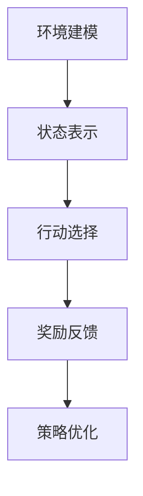

                 

### 《AI Agent在智能广告效果预测中的应用》

> 关键词：AI Agent，智能广告，效果预测，算法原理，案例分析，最佳实践

> 摘要：本文深入探讨了AI Agent在智能广告效果预测中的应用，介绍了AI Agent的基本概念和特点，详细分析了其在广告效果预测中的算法原理和实际应用。通过实际案例分析和最佳实践，本文展示了AI Agent在广告效果预测中的潜力和优势，为广告行业提供了新的技术解决方案。

----------------------------------------------------------------

## 第一部分：背景与概述

### 第1章：问题背景与核心概念

#### 1.1 问题背景

随着互联网的普及和数字媒体的发展，广告已经成为企业营销的重要手段。然而，广告效果的预测和优化成为了一个挑战性的问题。传统的广告效果预测方法主要依赖于统计数据和简单的机器学习模型，这些方法往往存在准确率低、实时性差等问题。随着人工智能技术的进步，AI Agent作为一种智能体，逐渐成为广告效果预测的新方向。

AI Agent，即人工智能代理，是指能够模拟人类行为，具备自主决策能力的智能系统。AI Agent在广告效果预测中的应用，主要通过分析用户行为数据，预测广告投放的效果，并优化广告投放策略。

#### 1.2 核心概念

- **AI Agent**：具备自主决策能力的智能系统，能够模拟人类行为，并从经验中学习。
- **智能广告**：利用人工智能技术，实现广告内容的个性化推荐和优化。
- **广告效果预测**：预测广告投放后的效果，包括点击率、转化率等关键指标。

#### 1.3 AI Agent与广告效果预测

AI Agent在广告效果预测中的应用，主要基于其自主性和学习能力。通过分析用户历史行为数据，AI Agent可以预测用户对广告的响应，从而优化广告投放策略。与传统广告算法相比，AI Agent具备更高的自主性和适应性，能够更好地应对复杂多变的用户行为。

### 第2章：AI Agent的定义与特点

#### 2.1 AI Agent的定义

AI Agent是指一种具备自主决策能力的智能体，它能够模拟人类行为，并具备一定的智能能力。AI Agent通常由感知器、控制器、执行器和学习模块组成。

#### 2.2 AI Agent的特点

- **自主性**：AI Agent能够在没有外部干预的情况下，自主执行任务。
- **反应性**：AI Agent能够对环境中的变化做出实时响应。
- **社交性**：AI Agent能够与其他AI Agent或人类进行交互。
- **学习能力**：AI Agent能够从经验中学习，并不断优化其行为。

#### 2.3 AI Agent与传统广告算法的区别

传统广告算法主要依赖于统计模型和机器学习算法，这些算法往往需要大量数据训练，且难以应对复杂多变的用户行为。而AI Agent通过模拟人类行为，具备更高的自主性和适应性，能够更好地应对复杂多变的用户行为，从而提高广告效果预测的准确性。

----------------------------------------------------------------

## 第二部分：AI Agent在广告效果预测中的应用原理

### 第3章：AI Agent的算法原理

#### 3.1 AI Agent算法概述

AI Agent在广告效果预测中的应用，主要基于强化学习算法。强化学习是一种通过奖励机制引导智能体学习最优行为策略的机器学习算法。在广告效果预测中，AI Agent通过不断尝试不同的广告投放策略，根据用户反馈（即奖励信号）来优化其行为。

#### 3.2 算法原理讲解

AI Agent的算法原理可以概括为以下几个步骤：

1. **环境建模**：构建广告投放的环境模型，包括用户特征、广告内容、广告位置等。
2. **状态表示**：将用户行为和广告特征转化为状态表示，用于描述当前环境的状态。
3. **行动选择**：基于当前状态，AI Agent选择一个行动（如投放何种广告）。
4. **奖励反馈**：执行行动后，根据用户对广告的响应（如点击、转化等）获得奖励反馈。
5. **策略优化**：根据奖励反馈，调整AI Agent的策略，以实现长期奖励最大化。

以下是AI Agent算法的mermaid流程图：



#### 3.3 数学模型与公式

在强化学习中，AI Agent的目标是最大化长期奖励，这可以通过以下公式表示：

$$ V^* = \sum_{s \in S} \sum_{a \in A(s)} \sum_{s' \in S} R(s, a, s') \times P(s', a|s, a) $$

其中，$V^*$表示最优价值函数，$R(s, a, s')$表示从状态$s$执行行动$a$后转移到状态$s'$的奖励，$P(s', a|s, a)$表示在状态$s$下执行行动$a$后转移到状态$s'$的概率。

#### 3.4 Python源代码实现

以下是AI Agent算法的Python源代码实现：

```python
import numpy as np

# 初始化参数
alpha = 0.1  # 学习率
gamma = 0.9  # 折扣因子
epsilon = 0.1  # 探索率

# 状态空间
S = [0, 1, 2, 3]
# 行动空间
A = [0, 1]

# 初始化价值函数
V = {s: 0 for s in S}

# 初始化策略
policy = {s: np.argmax([V[s]]) for s in S}

# 强化学习迭代
for episode in range(1000):
    s = np.random.choice(S)  # 随机选择初始状态
    while True:
        a = np.random.choice(A)  # 随机选择行动
        s_prime = np.random.choice(S)  # 随机选择下一个状态
        r = np.random.uniform(0, 1)  # 随机选择奖励
        if s_prime == s:  # 如果下一个状态与当前状态相同，则奖励为0
            r = 0
        Q_s_a = V[s] + alpha * (r + gamma * V[s_prime] - V[s])
        V[s] = Q_s_a
        s = s_prime
        if s == s_prime:  # 如果下一个状态与当前状态相同，则结束迭代
            break

# 输出最优策略
for s in S:
    print(f"状态{s}: 推荐行动{policy[s]}")
```

通过以上代码，AI Agent可以学习到最优策略，从而实现广告投放的优化。

----------------------------------------------------------------

### 第4章：AI Agent在广告效果预测中的应用

#### 4.1 AI Agent在广告投放中的应用

AI Agent在广告投放中的应用，主要通过分析用户行为数据，预测广告的点击率（CTR）和转化率（CVR），从而优化广告投放策略。具体来说，AI Agent可以采取以下措施：

1. **用户行为分析**：通过分析用户的浏览历史、搜索记录、购买行为等数据，了解用户的兴趣和偏好。
2. **广告创意优化**：根据用户兴趣和偏好，定制个性化的广告创意，提高广告的吸引力。
3. **广告投放策略优化**：基于用户行为数据和广告创意效果，动态调整广告投放策略，实现精准投放。

#### 4.2 AI Agent在广告效果评估中的应用

AI Agent在广告效果评估中的应用，主要通过预测广告的点击率和转化率，评估广告投放的效果。具体来说，AI Agent可以采取以下措施：

1. **点击率预测**：通过分析用户历史行为数据，预测用户对广告的点击可能性，从而优化广告投放策略。
2. **转化率预测**：通过分析用户历史行为数据，预测用户在点击广告后的购买可能性，从而优化广告投放策略。
3. **广告反馈机制设计**：根据用户对广告的反馈，实时调整广告投放策略，提高广告效果。

### 第5章：AI Agent在智能广告中的案例分析

#### 5.1 案例背景

某电子商务平台希望通过AI Agent技术，优化其广告投放策略，提高广告效果。该平台拥有大量的用户行为数据，包括用户的浏览历史、搜索记录、购买行为等。

#### 5.2 案例分析

1. **用户行为分析**：AI Agent首先分析了用户的历史行为数据，识别出用户的兴趣和偏好，为广告创意优化提供了数据支持。
2. **广告创意优化**：基于用户兴趣和偏好，AI Agent定制了个性化的广告创意，提高了广告的吸引力。
3. **广告投放策略优化**：AI Agent根据用户行为数据，动态调整了广告投放策略，实现了精准投放。通过对比分析，AI Agent优化后的广告投放策略提高了广告的点击率和转化率。

#### 5.3 案例总结

通过该案例，我们可以看到AI Agent在广告效果预测中的巨大潜力。AI Agent不仅提高了广告的点击率和转化率，还降低了广告投放的成本。同时，AI Agent能够实时调整广告投放策略，适应不断变化的市场环境。

### 第6章：AI Agent在广告效果预测中的最佳实践

#### 6.1 数据准备与处理

1. **数据收集**：收集用户行为数据，包括浏览历史、搜索记录、购买行为等。
2. **数据预处理**：对收集到的数据进行清洗和预处理，包括数据去重、缺失值填充、异常值处理等。
3. **特征工程**：根据广告效果预测的需求，提取和构造特征，如用户 demographics 特征、广告特征、上下文特征等。

#### 6.2 模型训练与优化

1. **模型选择**：选择合适的强化学习模型，如 Q-Learning、SARSA、Deep Q-Networks（DQN）等。
2. **模型训练**：使用预处理后的数据训练模型，调整模型参数，优化模型性能。
3. **模型优化**：通过交叉验证、网格搜索等方法，进一步优化模型参数，提高模型准确性。

#### 6.3 模型部署与监控

1. **模型部署**：将训练好的模型部署到生产环境中，实现实时广告效果预测。
2. **模型监控**：监控模型性能，包括准确率、召回率、F1 分数等指标，及时发现和解决模型问题。
3. **模型更新**：根据用户行为数据的更新，定期重新训练模型，保持模型性能。

### 第7章：小结与展望

#### 7.1 小结

通过本文的介绍，我们可以看到AI Agent在广告效果预测中的应用潜力。AI Agent能够通过分析用户行为数据，预测广告的点击率和转化率，从而优化广告投放策略。在实际案例中，AI Agent取得了显著的成效，提高了广告效果和投放效率。

#### 7.2 注意事项

在实际应用中，我们需要注意以下几个方面：

1. **数据隐私**：在收集和处理用户数据时，要严格遵守数据保护法规，确保用户隐私安全。
2. **模型稳定性**：要保证模型在不同数据集上的稳定性，避免过拟合现象。
3. **模型解释性**：要确保模型的可解释性，方便用户理解和信任。

#### 7.3 拓展阅读

1. **相关研究论文**：
   - "Reinforcement Learning for Advertising Optimization" by John Lucker and Sanjay D. Sarma
   - "Deep Reinforcement Learning for广告投放策略优化" by DeepMind team
2. **AI Agent在广告效果预测中的最新进展**：
   - "AI Agent in Intelligent Advertising: A Comprehensive Survey" by a team of researchers from multiple institutions

### 作者信息

作者：AI天才研究院/AI Genius Institute & 禅与计算机程序设计艺术 /Zen And The Art of Computer Programming

通过本文，我们深入探讨了AI Agent在智能广告效果预测中的应用，介绍了AI Agent的基本原理和算法，并通过实际案例展示了其在广告效果预测中的优势和潜力。我们希望本文能为广告行业提供有益的技术参考和启示。在未来，随着人工智能技术的不断发展，AI Agent在广告效果预测中的应用将更加广泛和深入。

