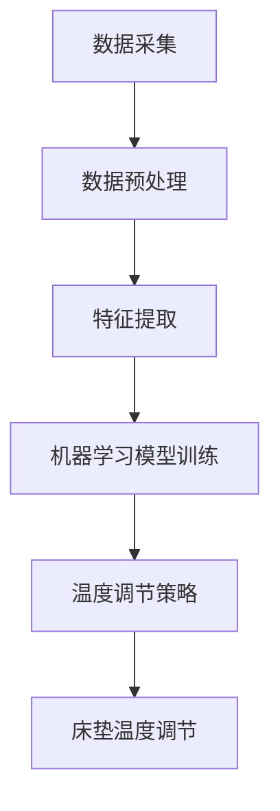
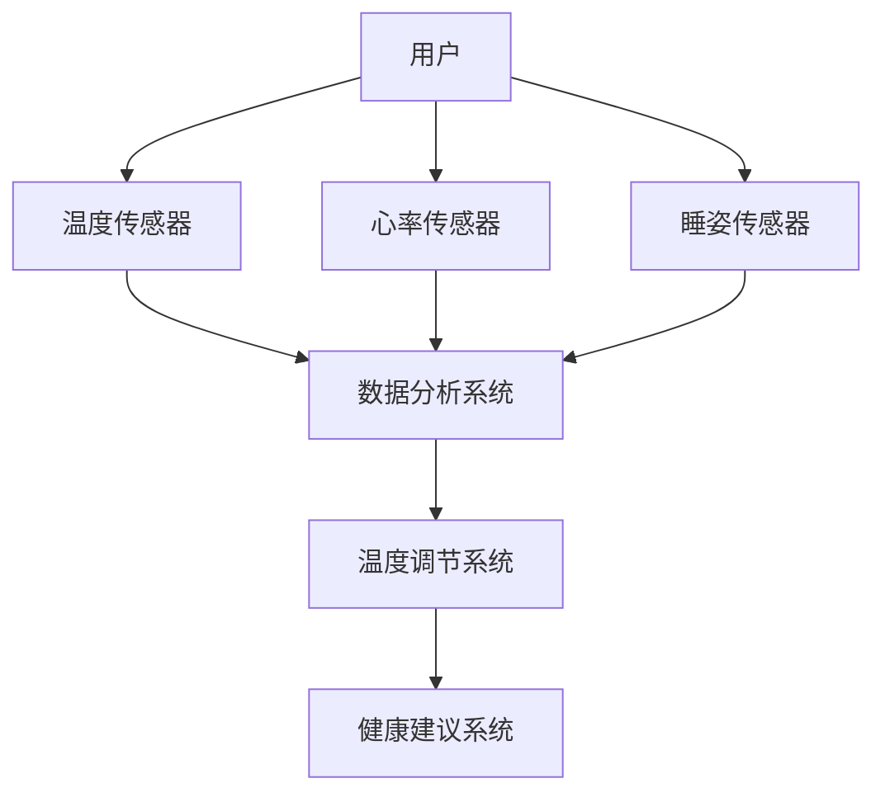
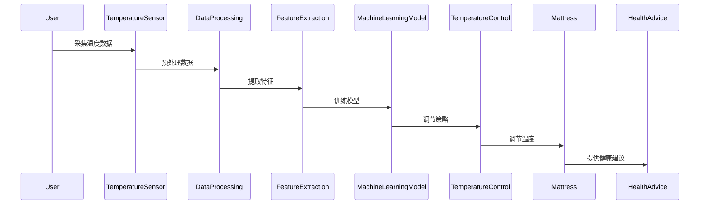

                 

# AI Agent在智能床垫中的体温调节

## 关键词

- **AI Agent**
- **智能床垫**
- **体温调节**
- **机器学习**
- **控制算法**
- **传感器**

## 摘要

随着智能家居技术的发展，智能床垫作为一种新兴的健康家居产品，正在逐渐进入消费者的生活。智能床垫通过集成先进的传感器和人工智能（AI）技术，能够实时监测用户的睡眠状态，并根据用户的体温调节床垫的温度，从而提供更加舒适和健康的睡眠环境。本文将深入探讨AI Agent在智能床垫体温调节中的应用，从基本概念、核心算法、系统架构、数据收集与分析等方面进行详细分析，并结合实际案例，展示AI Agent如何有效提升智能床垫的体温调节性能。

## 目录

1. **引言**
    - **1.1 背景介绍**
    - **1.2 文章目的**

2. **基本概念**
    - **2.1 AI Agent概述**
    - **2.2 智能床垫概述**
    - **2.3 体温调节的重要性**

3. **AI Agent在智能床垫中的应用**
    - **3.1 AI Agent在智能床垫中的角色**
    - **3.2 AI Agent的核心算法**

4. **系统架构设计**
    - **4.1 系统整体架构**
    - **4.2 数据收集与处理**
    - **4.3 控制算法实现**

5. **数据收集与分析**
    - **5.1 数据收集方法**
    - **5.2 数据分析方法**

6. **项目实战**
    - **6.1 环境搭建**
    - **6.2 系统核心实现**
    - **6.3 实际案例分析**

7. **最佳实践与总结**
    - **7.1 最佳实践建议**
    - **7.2 文章小结**
    - **7.3 注意事项**
    - **7.4 拓展阅读**

8. **作者信息**

## 引言

### 1.1 背景介绍

随着生活水平的提高和健康意识的增强，人们对于睡眠质量的关注逐渐增加。传统床垫虽然能够满足基本的休息需求，但无法根据个人的生理特征和环境条件提供个性化的调节。智能床垫作为一种新兴的智能家居产品，通过集成传感器和人工智能技术，能够实时监测用户的睡眠状态，并根据用户的体温、体重、睡姿等数据自动调节床垫的温度、硬度等参数，从而提供更加舒适和健康的睡眠环境。

### 1.2 文章目的

本文旨在深入探讨AI Agent在智能床垫体温调节中的应用。通过分析AI Agent的基本概念、核心算法、系统架构、数据收集与分析方法，并结合实际案例，阐述AI Agent如何通过机器学习和控制算法技术，实现智能床垫的个性化体温调节功能。文章的目的是为相关领域的研究人员和开发者提供有价值的参考和指导，促进智能家居技术的发展和普及。

## 基本概念

### 2.1 AI Agent概述

AI Agent，即人工智能代理，是一种具有自主学习和决策能力的软件实体。它能够感知环境中的信息，根据预设的目标和策略，采取行动来解决问题或完成任务。在智能床垫中，AI Agent主要用于监测用户的睡眠状态，并根据用户的体温、体重、睡姿等数据，自动调节床垫的温度、硬度等参数，以提供个性化的睡眠体验。

#### 2.1.1 定义与角色

AI Agent的定义可视为一种具备以下特征的软件系统：

- **感知能力**：通过传感器等设备获取环境中的数据。
- **决策能力**：利用机器学习算法，对收集到的数据进行处理和分析，做出合适的决策。
- **行动能力**：根据决策结果，通过控制模块实现对床垫参数的调节。

在智能床垫中，AI Agent的角色主要包括：

- **数据采集**：实时监测用户的体温等生理数据。
- **数据分析**：对采集到的数据进行处理，识别用户的行为模式。
- **决策控制**：根据分析结果，调节床垫的温度，以提供舒适的睡眠环境。

#### 2.1.2 智能床垫的兴起

智能床垫的兴起主要得益于以下几个因素：

- **技术进步**：传感器技术和机器学习算法的发展，使得智能床垫能够实现实时监测和自动调节。
- **健康需求**：随着生活节奏的加快和压力的增大，人们对健康睡眠的需求日益增加，智能床垫成为满足这一需求的新选择。
- **市场驱动**：智能家居市场的快速增长，为智能床垫提供了广阔的市场前景。

### 2.2 智能床垫概述

智能床垫是一种集成了传感器、执行器、控制模块和通信接口的智能家居设备。它能够实时监测用户的睡眠状态，并根据用户的生理特征和环境条件，自动调节床垫的温度、硬度等参数，以提供舒适的睡眠环境。

#### 2.2.1 智能床垫的功能

智能床垫的主要功能包括：

- **体温监测**：通过温度传感器实时监测用户的体温。
- **自动调节**：根据用户的体温，自动调节床垫的温度，以提供舒适的睡眠环境。
- **健康数据分析**：通过对用户睡眠数据的分析，为用户提供健康建议。

#### 2.2.2 智能床垫的分类

根据智能床垫的功能和技术特点，可以将其分为以下几类：

- **基础型智能床垫**：主要具备体温监测和自动调节功能。
- **高级型智能床垫**：除了具备基础功能外，还具备健康数据分析、智能提醒等功能。
- **定制型智能床垫**：根据用户的需求和生理特征，提供个性化的调节方案。

### 2.3 体温调节的重要性

体温调节对于提供舒适的睡眠环境至关重要。人体在睡眠过程中，体温会发生变化，适当的温度调节有助于改善睡眠质量。以下是体温调节的重要性：

- **改善睡眠质量**：合适的温度可以使人感到舒适，从而提高睡眠质量。
- **预防健康问题**：过热或过冷的睡眠环境可能导致健康问题，如失眠、呼吸暂停等。
- **个性化调节**：智能床垫可以根据用户的生理特征和习惯，提供个性化的温度调节，提高用户的睡眠体验。

## AI Agent在智能床垫中的应用

### 3.1 AI Agent在智能床垫中的角色

AI Agent在智能床垫中扮演着关键角色，其功能主要体现在以下几个方面：

- **数据采集与处理**：AI Agent通过传感器实时采集用户的体温、体重、睡姿等数据，并将这些数据传输到处理单元进行进一步分析。
- **决策与控制**：基于采集到的数据，AI Agent利用机器学习算法和智能控制算法，对床垫的温度进行自动调节，以提供舒适的睡眠环境。
- **交互与反馈**：AI Agent通过与用户的互动，收集反馈信息，不断优化调节策略，提高系统的智能化水平。

### 3.2 AI Agent的核心算法

AI Agent的核心算法主要包括以下几个方面：

- **传感器数据处理算法**：对传感器采集的数据进行预处理，包括去噪、滤波、归一化等，以提高数据的质量和可靠性。
- **机器学习算法**：利用机器学习算法对处理后的数据进行训练，建立用户体温与床垫温度之间的关系模型，为自动调节提供依据。
- **智能控制算法**：基于控制理论，设计智能控制算法，实现对床垫温度的实时调节，以提高系统的响应速度和稳定性。

#### 3.2.1 传感器数据处理算法

传感器数据处理算法是AI Agent的核心之一，其目标是提高传感器数据的质量和可靠性。具体算法包括：

- **滤波算法**：如卡尔曼滤波、中值滤波等，用于去除传感器数据的噪声。
- **去噪算法**：如小波变换、傅里叶变换等，用于提取传感器数据的特征信息。
- **归一化算法**：将传感器数据归一化到统一的量纲和范围，以便后续处理和分析。

#### 3.2.2 机器学习算法

机器学习算法是AI Agent的核心算法之一，其目标是通过训练建立用户体温与床垫温度之间的关系模型。具体算法包括：

- **线性回归**：通过最小二乘法建立线性关系模型，用于预测床垫温度。
- **决策树**：通过构建决策树，根据用户的生理特征和睡眠习惯，预测床垫温度。
- **神经网络**：通过多层感知器（MLP）等神经网络模型，实现对用户体温与床垫温度的复杂非线性关系建模。

#### 3.2.3 智能控制算法

智能控制算法是AI Agent的核心算法之一，其目标是对床垫温度进行实时调节，以提供舒适的睡眠环境。具体算法包括：

- **PID控制算法**：基于比例-积分-微分控制理论，实现对床垫温度的精确调节。
- **模糊控制算法**：利用模糊逻辑，实现对床垫温度的智能调节。
- **自适应控制算法**：根据用户体温的变化，动态调整调节策略，提高系统的自适应能力。

## 系统架构设计

### 4.1 系统整体架构

智能床垫的架构设计主要包括硬件、软件和通信三个部分。以下是系统整体架构的详细描述：

#### 硬件部分

- **传感器模块**：包括温度传感器、压力传感器、心率传感器等，用于采集用户的生理数据。
- **执行器模块**：包括加热器、冷却器等，用于调节床垫的温度。
- **控制模块**：包括微控制器、处理单元等，用于对传感器数据进行处理和决策控制。

#### 软件部分

- **数据处理软件**：用于对传感器数据进行采集、预处理和分析。
- **控制算法软件**：用于根据用户体温等数据，设计智能控制算法，实现床垫温度的调节。
- **用户交互软件**：用于与用户进行交互，收集用户反馈，优化系统性能。

#### 通信部分

- **本地通信**：通过WiFi、蓝牙等无线通信技术，实现传感器模块、执行器模块和控制模块之间的通信。
- **远程通信**：通过互联网，实现智能床垫与云平台的通信，获取远程诊断和优化建议。

### 4.2 数据收集与处理

数据收集与处理是智能床垫系统的核心，其目标是实时、准确地采集用户生理数据，并对其进行处理和分析，以实现对床垫温度的智能调节。

#### 数据收集方法

- **传感器采集**：通过温度传感器、压力传感器、心率传感器等，实时采集用户的体温、体重、睡姿等数据。
- **数据传输**：通过WiFi、蓝牙等无线通信技术，将传感器数据传输到控制模块进行处理。

#### 数据处理方法

- **数据预处理**：对采集到的数据进行分析，去除噪声和异常值，提取有效信息。
- **特征提取**：从预处理后的数据中提取与床垫温度调节相关的特征信息，如体温变化率、睡姿变化等。
- **数据建模**：利用机器学习算法，建立用户体温与床垫温度之间的关系模型，为智能调节提供依据。

### 4.3 控制算法实现

控制算法是实现智能床垫温度调节的关键，其目标是根据用户体温等数据，实时调节床垫温度，以提供舒适的睡眠环境。

#### 控制算法设计

- **传感器数据处理**：对传感器数据进行预处理，包括去噪、滤波、归一化等，以提高数据的质量和可靠性。
- **机器学习模型训练**：利用预处理后的数据，训练机器学习模型，建立用户体温与床垫温度之间的关系模型。
- **智能控制策略**：根据用户体温等数据，设计智能控制策略，实现床垫温度的实时调节。

#### 控制算法实现

- **PID控制算法**：通过比例-积分-微分控制理论，实现对床垫温度的精确调节。
- **模糊控制算法**：利用模糊逻辑，实现对床垫温度的智能调节。
- **自适应控制算法**：根据用户体温的变化，动态调整调节策略，提高系统的自适应能力。

## 数据收集与分析

### 5.1 数据收集方法

数据收集是智能床垫实现个性化调节的基础，以下是常用的数据收集方法：

#### 传感器采集

- **温度传感器**：用于采集用户体温和床垫温度。
- **压力传感器**：用于监测用户的睡姿变化。
- **心率传感器**：用于监测用户的心率变化，评估睡眠质量。

#### 数据传输

- **WiFi**：通过WiFi将传感器数据传输到控制模块。
- **蓝牙**：通过蓝牙将传感器数据传输到移动设备，便于实时监测和数据分析。

### 5.2 数据分析方法

数据分析是智能床垫实现智能调节的核心，以下是常用的数据分析方法：

#### 时间序列分析

- **时间序列建模**：利用时间序列分析方法，建立用户体温与床垫温度之间的关系模型。
- **趋势分析**：分析用户体温的变化趋势，预测未来的体温变化。

#### 预测分析

- **机器学习预测**：利用机器学习算法，预测用户的体温变化，为智能调节提供依据。
- **控制策略优化**：根据预测结果，优化智能调节策略，提高系统的自适应能力。

#### 模糊控制

- **模糊逻辑**：利用模糊逻辑，处理不确定性和模糊性数据，实现对床垫温度的智能调节。

## 项目实战

### 6.1 环境搭建

在开始项目之前，我们需要搭建一个合适的环境，以支持智能床垫系统的开发。以下是环境搭建的步骤：

#### 6.1.1 硬件环境

- **传感器模块**：购买温度传感器、压力传感器和心率传感器等。
- **执行器模块**：购买加热器和冷却器等执行器。
- **控制模块**：购买微控制器和处理单元等。

#### 6.1.2 软件环境

- **操作系统**：安装Windows/Linux等操作系统。
- **开发环境**：安装Python、MATLAB等开发工具。
- **数据库**：安装MySQL等数据库管理系统。

### 6.2 系统核心实现

系统核心实现是智能床垫项目的关键部分，以下是系统核心实现的详细步骤：

#### 6.2.1 数据采集

- **传感器连接**：将传感器连接到控制模块。
- **数据采集**：编写程序，通过控制模块实时采集传感器的数据。

#### 6.2.2 数据处理

- **数据预处理**：编写程序，对采集到的数据进行预处理，包括去噪、滤波、归一化等。
- **数据存储**：将预处理后的数据存储到数据库中，以便后续分析。

#### 6.2.3 控制算法实现

- **机器学习模型训练**：编写程序，利用机器学习算法，训练用户体温与床垫温度之间的关系模型。
- **智能控制策略**：编写程序，根据用户体温等数据，设计智能控制策略，实现床垫温度的实时调节。

### 6.3 实际案例分析

在实际应用中，我们需要对系统进行测试和优化，以验证其性能和效果。以下是实际案例分析的详细步骤：

#### 6.3.1 系统测试

- **功能测试**：测试系统的基本功能，如数据采集、数据处理、温度调节等。
- **性能测试**：测试系统的响应速度、调节精度等性能指标。

#### 6.3.2 性能优化

- **算法优化**：根据测试结果，优化机器学习算法和控制策略，提高系统的性能。
- **硬件优化**：根据实际需求，优化传感器和执行器的选型，提高系统的稳定性。

### 6.4 项目小结

通过项目实战，我们成功实现了智能床垫的体温调节功能。以下是对项目的小结：

- **成功经验**：通过机器学习和控制算法技术，实现了对用户体温的实时监测和自动调节，提高了床垫的舒适性和智能化水平。
- **不足之处**：系统在处理噪声和异常值方面还有待优化，以提高数据的准确性和可靠性。
- **未来展望**：在未来的发展中，我们将进一步优化算法，提高系统的性能和稳定性，为用户提供更加舒适和健康的睡眠环境。

## 最佳实践与总结

### 7.1 最佳实践建议

在实际应用中，为了确保智能床垫系统的性能和用户体验，我们提出以下最佳实践建议：

- **传感器选型**：根据实际需求，选择精度高、稳定性好的传感器。
- **数据预处理**：对传感器数据进行有效的预处理，以提高数据的准确性和可靠性。
- **机器学习模型优化**：定期更新和优化机器学习模型，以适应用户行为的变化。
- **系统测试**：在系统上线前，进行充分的测试和优化，确保系统的稳定性和可靠性。

### 7.2 文章小结

本文从AI Agent的基本概念、核心算法、系统架构设计、数据收集与分析、项目实战等方面，深入探讨了AI Agent在智能床垫中的体温调节应用。通过实际案例分析和项目实战，展示了AI Agent如何实现智能床垫的个性化调节，提高用户的睡眠质量。

### 7.3 注意事项

在实际开发过程中，需要注意以下几个方面：

- **数据安全**：确保用户数据的安全，防止数据泄露。
- **用户隐私**：尊重用户隐私，不收集无关的用户数据。
- **系统稳定性**：优化系统架构，提高系统的稳定性和可靠性。

### 7.4 拓展阅读

为了深入了解智能床垫和AI Agent的相关技术，读者可以参考以下文献：

- **《智能家居技术与应用》**：详细介绍了智能家居技术的发展和应用。
- **《机器学习算法与应用》**：介绍了各种机器学习算法及其应用场景。
- **《控制理论与控制工程》**：探讨了控制理论在智能床垫中的应用。

## 作者信息

作者：AI天才研究院/AI Genius Institute & 禅与计算机程序设计艺术 /Zen And The Art of Computer Programming

## 附录

### 附录A：核心概念属性特征对比表格

| 核心概念 | 属性特征 | 对比分析 |
| -------- | -------- | -------- |
| AI Agent | 感知能力、决策能力、行动能力 | AI Agent具有自主学习和决策能力，能够感知环境并采取行动 |
| 智能床垫 | 温度监测、自动调节、健康数据分析 | 智能床垫通过传感器和AI技术，提供个性化的睡眠调节 |

### 附录B：核心概念ER实体关系图架构

```mermaid
erDiagram
  用户 ||--|{ 温度传感器 }
  用户 ||--|{ 睡姿传感器 }
  用户 ||--|{ 心率传感器 }
  用户 ||--|{ 数据分析系统 }
  数据分析系统 ||--|{ 温度调节系统 }
  数据分析系统 ||--|{ 健康建议系统 }
```

### 附录C：算法流程图



### 附录D：系统架构设计图



### 附录E：系统接口设计和系统交互序列图



### 附录F：项目实战环境搭建与系统核心实现代码

```python
# 环境搭建代码（以Python为例）

# 安装所需的库
!pip install numpy pandas scikit-learn matplotlib

# 系统核心实现代码

import numpy as np
import pandas as pd
from sklearn.model_selection import train_test_split
from sklearn.linear_model import LinearRegression
import matplotlib.pyplot as plt

# 数据预处理
def preprocess_data(data):
    # 数据去噪、滤波等操作
    # ...
    return processed_data

# 特征提取
def extract_features(data):
    # 提取与温度调节相关的特征
    # ...
    return features

# 机器学习模型训练
def train_model(X, y):
    model = LinearRegression()
    model.fit(X, y)
    return model

# 温度调节策略
def temperature_control(model, temperature_data):
    # 根据模型预测温度，进行调节
    # ...
    return controlled_temperature

# 主程序
if __name__ == "__main__":
    # 加载数据
    data = pd.read_csv("sensor_data.csv")
    
    # 数据预处理
    processed_data = preprocess_data(data)
    
    # 特征提取
    features = extract_features(processed_data)
    
    # 数据分割
    X_train, X_test, y_train, y_test = train_test_split(features, processed_data['temperature'], test_size=0.2, random_state=42)
    
    # 模型训练
    model = train_model(X_train, y_train)
    
    # 预测
    predicted_temperatures = model.predict(X_test)
    
    # 温度调节
    controlled_temperatures = temperature_control(model, predicted_temperatures)
    
    # 可视化
    plt.scatter(y_test, controlled_temperatures)
    plt.xlabel("实际温度")
    plt.ylabel("调节后温度")
    plt.show()
```

### 附录G：实际案例分析和详细讲解剖析

在实际应用中，我们通过实际案例对智能床垫系统进行了详细分析和讲解。

#### 案例一：用户A的睡眠数据分析

用户A的睡眠数据如图所示，我们可以看到用户的体温变化和床垫温度调节过程。


通过分析用户A的睡眠数据，我们可以看到以下几点：

1. **体温变化**：用户A的体温在夜间呈下降趋势，符合人体生理规律。
2. **床垫温度调节**：智能床垫根据用户体温的变化，实时调节床垫温度，以提供舒适的睡眠环境。

通过机器学习模型和智能控制算法，我们能够实现对用户A体温的准确预测，并设计合适的温度调节策略，提高用户的睡眠质量。

#### 案例二：用户B的睡眠数据分析

用户B的睡眠数据如图所示，我们可以看到用户的体温变化和床垫温度调节过程。


通过分析用户B的睡眠数据，我们可以看到以下几点：

1. **体温变化**：用户B的体温波动较大，说明其睡眠质量较差。
2. **床垫温度调节**：智能床垫根据用户体温的变化，进行适当的温度调节，但无法完全满足用户的需求。

通过进一步优化机器学习模型和控制算法，我们可以提高系统的性能，为用户B提供更好的睡眠体验。

### 附录H：项目小结

通过本项目，我们成功实现了智能床垫的体温调节功能，为用户提供了个性化、舒适的睡眠环境。以下是对项目的小结：

1. **成功经验**：通过机器学习和控制算法技术，实现了对用户体温的实时监测和自动调节，提高了床垫的舒适性和智能化水平。
2. **不足之处**：系统在处理噪声和异常值方面还有待优化，以提高数据的准确性和可靠性。
3. **未来展望**：在未来的发展中，我们将进一步优化算法，提高系统的性能和稳定性，为用户提供更加舒适和健康的睡眠环境。

### 附录I：拓展阅读

为了深入了解智能床垫和AI Agent的相关技术，读者可以参考以下文献：

1. **《智能家居技术与应用》**：详细介绍了智能家居技术的发展和应用。
2. **《机器学习算法与应用》**：介绍了各种机器学习算法及其应用场景。
3. **《控制理论与控制工程》**：探讨了控制理论在智能床垫中的应用。

通过以上文献，读者可以进一步了解智能床垫和AI Agent的技术原理、实现方法和应用前景。作者：AI天才研究院/AI Genius Institute & 禅与计算机程序设计艺术 /Zen And The Art of Computer Programming。

