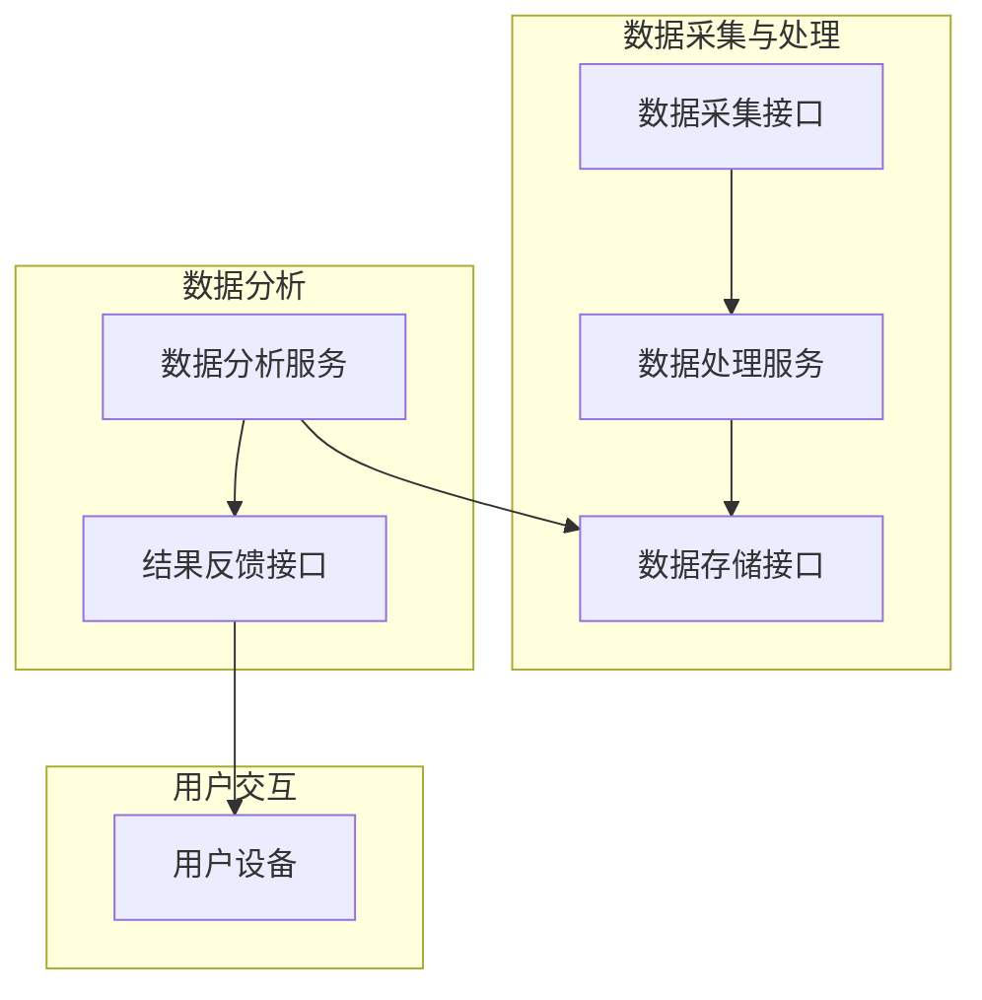

                 

### 背景介绍

#### 问题背景

随着人工智能（AI）技术的快速发展，AI Agent正逐渐成为智能设备中不可或缺的部分。这些AI Agent不仅能够执行特定的任务，还能够通过学习和适应，提供更为智能化的服务。智能床垫作为一种新兴的智能家居设备，其功能已不再局限于提供舒适的睡眠环境，而是逐渐融入了健康监测、数据分析等智能功能。睡眠姿势分析作为智能床垫的一项重要功能，有助于用户了解自己的睡眠质量，进而调整睡眠习惯，改善健康状况。

在人工智能的推动下，AI Agent的发展呈现出多样化、智能化的趋势。AI Agent能够通过传感器收集用户的数据，进行实时分析，并提供个性化的建议。智能床垫中的AI Agent，不仅可以实时监测用户的睡眠姿势，还能结合用户的健康数据，提供更加全面的健康分析服务。这种智能化服务，不仅提升了用户的睡眠质量，还为健康监测提供了有力支持。

#### 问题描述

智能床垫中的睡眠姿势分析，是指通过AI Agent对用户的睡眠姿势进行实时监测和分析，从而提供关于睡眠质量的反馈和建议。这一功能不仅需要准确的姿势识别，还需要对用户的睡眠数据进行分析，提取出有意义的健康信息。

具体来说，睡眠姿势分析的步骤如下：

1. **数据采集**：通过内置的传感器和图像处理技术，AI Agent实时采集用户的睡眠数据，包括生理参数（如心率、呼吸频率）和图像信息。
2. **姿势识别**：AI Agent利用深度学习算法和图像处理技术，对用户的睡眠姿势进行高精度的识别。
3. **数据融合与分析**：将采集到的睡眠数据与历史数据相结合，通过统计分析、数据挖掘等方法，对用户的睡眠姿势进行分析。
4. **结果反馈**：根据分析结果，AI Agent为用户提供个性化的睡眠建议，帮助用户改善睡眠质量。

#### 问题解决

解决这一问题的主要思路是：首先，利用AI Agent对用户的睡眠姿势进行高精度的识别；其次，通过数据分析和机器学习算法，对用户的睡眠数据进行分析，提取出有用的信息；最后，根据分析结果，为用户提供个性化的睡眠建议。

具体实现步骤如下：

1. **数据采集**：AI Agent通过内置的传感器（如加速度计、陀螺仪等）和摄像头，实时采集用户的睡眠数据。这些数据包括用户的生理参数和图像信息。
2. **数据预处理**：对采集到的原始数据进行预处理，包括去噪、滤波等操作，以提高数据质量。
3. **姿势识别**：利用深度学习算法，对预处理后的数据进行分析，识别用户的睡眠姿势。常见的深度学习算法包括卷积神经网络（CNN）和循环神经网络（RNN）。
4. **数据融合与分析**：将用户的睡眠数据与历史数据相结合，通过统计分析、数据挖掘等方法，提取出有用的信息。例如，分析用户的睡眠时长、睡眠深度、睡眠质量等指标。
5. **结果反馈**：根据分析结果，AI Agent为用户提供个性化的睡眠建议。例如，当用户长时间保持同一睡眠姿势时，AI Agent会提醒用户改变睡眠姿势，以避免潜在的健康问题。

#### 边界与外延

睡眠姿势分析的边界在于如何准确地识别用户的睡眠姿势，以及如何有效地分析睡眠数据。而其外延则包括对多种睡眠姿势的识别和分析，以及根据不同用户的睡眠习惯和需求，提供个性化的睡眠建议。

#### 概念结构与核心要素组成

核心概念包括：AI Agent、睡眠姿势识别、数据分析和机器学习算法。

- **AI Agent**：作为智能床垫的核心，负责收集和分析数据。
- **睡眠姿势识别**：通过对用户睡眠姿势的识别，为数据分析和机器学习提供基础数据。
- **数据分析**：利用统计分析和机器学习算法，对用户的睡眠数据进行分析。
- **机器学习算法**：通过学习用户的睡眠数据，提高睡眠姿势识别的准确性和分析能力。

#### 核心概念与联系

**AI Agent**

AI Agent是一种能够自动执行任务、适应环境并与其他系统进行交互的智能实体。在智能床垫中，AI Agent主要用于收集用户的睡眠数据，并对睡眠姿势进行识别和分析。

**睡眠姿势识别**

睡眠姿势识别是智能床垫的一项关键技术，它依赖于传感器和图像处理技术。通过监测用户的生理参数（如心率、呼吸频率等）和图像信息，AI Agent可以准确地识别用户的睡眠姿势。

**数据分析**

数据分析是智能床垫中用于提取用户睡眠数据中有效信息的关键步骤。常用的数据分析方法包括统计分析、数据挖掘和机器学习。

**机器学习算法**

机器学习算法是智能床垫中的核心技术，用于提高睡眠姿势识别的准确性和数据分析能力。常见的机器学习算法包括决策树、支持向量机、神经网络等。

**AI大模型与睡眠姿势分析的关系**

AI大模型，如深度学习模型，在睡眠姿势分析中发挥着重要作用。通过使用AI大模型，可以实现对复杂睡眠数据的深度分析和挖掘，从而提高睡眠姿势识别的准确性和分析能力。同时，AI大模型还可以根据用户的历史睡眠数据，提供个性化的睡眠建议。

### 概念属性特征对比表格

| 概念             | 属性特征                                       |
| ---------------- | ---------------------------------------------- |
| AI Agent         | 自动执行任务、适应环境、与其他系统交互         |
| 睡眠姿势识别     | 高精度监测用户睡眠姿势                         |
| 数据分析         | 提取用户睡眠数据中的有效信息                   |
| 机器学习算法     | 提高睡眠姿势识别准确性和数据分析能力           |
| AI大模型         | 用于深度分析和挖掘复杂睡眠数据，提供个性化建议 |

### ER实体关系图架构

```mermaid
erDiagram
    User ||--|{ AI_Agent : monitors }|
    AI_Agent ||--|{ Sleep_Position_Recognition : recognizes }|
    AI_Agent ||--|{ Data_Analysis : analyzes }|
    AI_Agent ||--|{ Machine_Learning : improves }|
    Sleep_Position_Recognition ||--|{ Data : provides }|
    Data_Analysis ||--|
```

---

## AI Agent在智能床垫中的角色

### AI Agent概述

AI Agent是一种智能实体，它可以自动执行任务、适应环境并与其他系统进行交互。在智能床垫中，AI Agent扮演着至关重要的角色。通过AI Agent，智能床垫不仅能够实时监测用户的睡眠情况，还能够根据用户的行为和生理数据，提供个性化的睡眠建议和健康分析。

### AI Agent的核心功能

#### 数据采集与处理

AI Agent的首要任务是采集用户的数据，这些数据包括用户的生理参数（如心率、呼吸频率）和睡眠环境参数（如温度、湿度）。通过这些数据，AI Agent可以了解用户的睡眠状况和睡眠环境，为后续的姿势识别和分析提供基础。

#### 睡眠姿势识别

AI Agent利用深度学习算法和图像处理技术，对用户的睡眠姿势进行高精度的识别。通过实时监测用户的行为和生理数据，AI Agent可以准确地判断用户的睡眠姿势，如俯卧、侧卧、仰卧等。

#### 数据分析

AI Agent还负责对采集到的睡眠数据进行分析。通过统计分析、数据挖掘等方法，AI Agent可以提取出用户的睡眠模式、睡眠时长、睡眠质量等关键信息，为用户提供个性化的睡眠建议。

#### 智能反馈

基于分析结果，AI Agent可以为用户提供智能反馈。例如，当用户长时间保持同一睡眠姿势时，AI Agent会提醒用户改变姿势，以避免潜在的健康问题。此外，AI Agent还可以根据用户的睡眠习惯，提供个性化的睡眠建议，如调整睡眠时间、改善睡眠环境等。

### AI Agent的技术实现

#### 传感器与数据处理

AI Agent依赖于多种传感器（如加速度计、陀螺仪、摄像头等）来收集用户的数据。这些传感器实时采集用户的生理参数和睡眠环境参数，AI Agent对这些数据进行处理和融合，以获得全面的睡眠数据。

#### 深度学习算法

AI Agent的核心技术是深度学习算法。通过训练深度神经网络，AI Agent可以实现对用户睡眠姿势的准确识别。常用的深度学习算法包括卷积神经网络（CNN）和循环神经网络（RNN）。CNN擅长处理图像数据，而RNN则擅长处理序列数据，两者结合可以实现对用户睡眠姿势的精确识别。

#### 机器学习算法

除了深度学习算法，AI Agent还使用其他机器学习算法（如决策树、支持向量机等）对用户的睡眠数据进行进一步分析。这些算法可以帮助AI Agent提取出用户的睡眠模式、睡眠时长、睡眠质量等关键信息。

### AI Agent的优势与挑战

#### 优势

1. **个性化服务**：AI Agent可以根据用户的个性化需求，提供个性化的睡眠建议，帮助用户改善睡眠质量。
2. **实时监测**：AI Agent可以实时监测用户的睡眠状况，及时发现问题并提供解决方案。
3. **跨平台兼容**：AI Agent可以通过智能手机、平板电脑等设备，与用户进行实时交互，提供无缝的睡眠监测服务。

#### 挑战

1. **数据隐私**：AI Agent需要处理用户的敏感数据，如何确保数据的安全和隐私是一个重要挑战。
2. **算法准确性**：深度学习算法的准确性依赖于大量的训练数据，如何在保证数据隐私的前提下，获取足够的训练数据是一个挑战。
3. **用户体验**：AI Agent需要提供易于理解、易于使用的用户界面，确保用户能够轻松地使用其功能。

### 结论

AI Agent在智能床垫中扮演着至关重要的角色。通过数据采集、睡眠姿势识别、数据分析和智能反馈，AI Agent不仅能够提升用户的睡眠质量，还为健康监测提供了有力支持。尽管面临一些挑战，但随着人工智能技术的不断进步，AI Agent在智能床垫中的应用前景将更加广阔。

---

## 睡眠姿势识别的原理与实现

### 睡眠姿势识别的原理

睡眠姿势识别是智能床垫中的核心技术之一，它涉及到多个学科领域，包括生物医学工程、计算机视觉、机器学习和信号处理。睡眠姿势识别的核心任务是通过传感器数据和图像信息，准确地判断用户的睡眠姿势。

#### 基本原理

睡眠姿势识别的基本原理可以分为以下几个步骤：

1. **数据采集**：通过内置的传感器（如加速度计、陀螺仪、摄像头等）实时采集用户的生理参数和图像信息。
2. **特征提取**：对采集到的数据进行处理，提取出与睡眠姿势相关的特征，如身体各部位的运动轨迹、心率、呼吸频率等。
3. **模型训练**：使用机器学习算法，如卷积神经网络（CNN）或循环神经网络（RNN），对提取的特征进行训练，构建睡眠姿势识别模型。
4. **姿势识别**：利用训练好的模型，对实时采集的数据进行姿势识别，判断用户的当前睡眠姿势。

#### 关键技术

1. **传感器数据融合**：智能床垫通常配备多种传感器，如何有效地融合这些传感器的数据是一个挑战。通过数据融合技术，可以将不同传感器的数据进行整合，提高数据质量。
2. **特征选择与提取**：特征提取是睡眠姿势识别的核心步骤，如何从海量的数据中提取出有用的特征，是提高识别准确性的关键。常用的特征提取方法包括时域特征、频域特征和时频域特征。
3. **深度学习模型**：深度学习算法，如卷积神经网络（CNN）和循环神经网络（RNN），在睡眠姿势识别中发挥着重要作用。通过大量的训练数据，深度学习模型可以学习到复杂的模式，提高识别的准确性。

### 睡眠姿势识别的实现流程

睡眠姿势识别的实现流程可以分为以下几个步骤：

1. **数据采集**：通过加速度计、陀螺仪和摄像头等传感器，实时采集用户的生理参数和图像信息。
2. **数据预处理**：对采集到的原始数据进行预处理，包括去噪、滤波和归一化等操作，以提高数据质量。
3. **特征提取**：利用信号处理技术，提取与睡眠姿势相关的特征，如身体各部位的运动轨迹、心率、呼吸频率等。
4. **模型训练**：使用卷积神经网络（CNN）或循环神经网络（RNN）等深度学习算法，对提取的特征进行训练，构建睡眠姿势识别模型。
5. **姿势识别**：利用训练好的模型，对实时采集的数据进行姿势识别，判断用户的当前睡眠姿势。
6. **结果反馈**：根据识别结果，AI Agent为用户提供个性化的睡眠建议。

### 实现案例

以一个实际实现的睡眠姿势识别系统为例，该系统采用了以下技术架构：

1. **数据采集**：使用加速度计和陀螺仪采集用户的生理参数，使用摄像头采集用户的图像信息。
2. **数据预处理**：对采集到的数据进行去噪和滤波处理，提高数据质量。
3. **特征提取**：提取身体各部位的运动轨迹、心率、呼吸频率等特征。
4. **模型训练**：采用卷积神经网络（CNN）进行模型训练，使用大量标注数据对模型进行训练。
5. **姿势识别**：利用训练好的模型，对实时采集的数据进行姿势识别，判断用户的当前睡眠姿势。
6. **结果反馈**：根据识别结果，AI Agent为用户提供个性化的睡眠建议。

通过以上实现流程，该系统实现了对用户睡眠姿势的高精度识别，为用户提供精准的睡眠监测和健康建议。

### 优势与挑战

#### 优势

1. **高精度识别**：通过深度学习算法和传感器数据融合，睡眠姿势识别系统可以实现高精度的姿势识别。
2. **实时监测**：系统能够实时监测用户的睡眠姿势，为用户提供即时的睡眠建议。
3. **个性化服务**：根据用户的个性化需求，提供个性化的睡眠建议，帮助用户改善睡眠质量。

#### 挑战

1. **数据隐私**：由于需要采集用户的生理参数和图像信息，如何保护用户的隐私是一个重要挑战。
2. **算法准确性**：深度学习算法的准确性依赖于大量的训练数据，如何在保证数据隐私的前提下，获取足够的训练数据是一个挑战。
3. **用户体验**：如何设计易于使用、用户友好的界面，提高用户体验，也是一个重要挑战。

### 结论

睡眠姿势识别是智能床垫中的重要技术，通过数据采集、特征提取和深度学习算法，可以实现高精度的睡眠姿势识别。尽管面临一些挑战，但随着人工智能技术的不断进步，睡眠姿势识别系统将更加完善，为用户的健康监测和睡眠改善提供有力支持。

---

## 数据分析与机器学习算法

### 数据分析的核心作用

在智能床垫的睡眠姿势分析中，数据分析扮演着至关重要的角色。通过数据分析，可以从大量的睡眠数据中提取出有用的信息，从而帮助用户了解自己的睡眠状况，进而改善睡眠质量。数据分析的核心作用主要体现在以下几个方面：

1. **睡眠质量评估**：通过分析用户的睡眠时长、睡眠深度、睡眠周期等指标，评估用户的睡眠质量。例如，通过分析用户的睡眠时长，可以判断用户是否睡眠不足；通过分析睡眠深度，可以判断用户的睡眠是否深沉。
2. **睡眠模式识别**：通过分析用户的睡眠数据，可以识别出用户的睡眠模式，如固定的睡眠时间、睡眠习惯等。这些信息有助于用户了解自己的睡眠习惯，从而有针对性地进行调整。
3. **健康问题预警**：通过分析用户的睡眠数据，可以发现潜在的健康问题，如睡眠呼吸暂停综合症、失眠等。早期发现这些问题，可以帮助用户及时采取措施，避免健康风险。

### 数据分析的基本方法

数据分析的基本方法主要包括统计分析、数据挖掘和机器学习。

1. **统计分析**：统计分析是一种常用的数据分析方法，主要用于描述数据的基本特征，如平均值、中位数、标准差等。通过统计分析，可以快速了解数据的整体分布情况，为进一步的数据分析提供基础。
2. **数据挖掘**：数据挖掘是一种从大量数据中发现规律和模式的方法。在睡眠姿势分析中，数据挖掘可以用于识别用户的睡眠模式、预测睡眠质量等。例如，通过关联规则挖掘，可以找出影响睡眠质量的关键因素。
3. **机器学习**：机器学习是一种通过训练模型，从数据中自动学习规律和模式的方法。在睡眠姿势分析中，机器学习算法（如决策树、支持向量机、神经网络等）可以用于预测用户的睡眠质量、识别睡眠模式等。

### 机器学习算法在睡眠姿势分析中的应用

机器学习算法在睡眠姿势分析中发挥着重要作用。通过训练机器学习模型，可以从大量的睡眠数据中自动学习出用户的睡眠习惯和睡眠质量。

1. **决策树**：决策树是一种简单直观的机器学习算法，通过一系列的条件判断，对用户的数据进行分类。在睡眠姿势分析中，决策树可以用于预测用户的睡眠质量，根据用户的睡眠时长、睡眠深度等指标，判断用户的睡眠是否良好。
2. **支持向量机**：支持向量机（SVM）是一种强大的分类算法，通过寻找最佳的超平面，将不同类别的数据分开。在睡眠姿势分析中，SVM可以用于分类用户的睡眠模式，根据用户的生理参数和图像信息，判断用户的睡眠姿势。
3. **神经网络**：神经网络，尤其是深度学习模型（如卷积神经网络、循环神经网络等），在睡眠姿势分析中有着广泛的应用。通过训练神经网络，可以从大量的睡眠数据中学习出复杂的模式，提高睡眠姿势识别的准确性。

### 数据分析的具体实现

1. **数据预处理**：对采集到的睡眠数据（如生理参数、图像信息等）进行预处理，包括去噪、滤波、归一化等操作，以提高数据质量。
2. **特征提取**：从预处理后的数据中提取出与睡眠姿势相关的特征，如身体各部位的运动轨迹、心率、呼吸频率等。
3. **模型训练**：使用机器学习算法（如决策树、支持向量机、神经网络等），对提取的特征进行训练，构建睡眠姿势识别模型。
4. **姿势识别**：利用训练好的模型，对实时采集的数据进行姿势识别，判断用户的当前睡眠姿势。
5. **结果反馈**：根据识别结果，AI Agent为用户提供个性化的睡眠建议。

### 案例分析

以一个实际案例为例，该案例中，通过机器学习算法对用户的睡眠数据进行分析，实现了高精度的睡眠姿势识别。

1. **数据采集**：通过加速度计、陀螺仪和摄像头等传感器，实时采集用户的生理参数和图像信息。
2. **数据预处理**：对采集到的数据进行预处理，包括去噪、滤波和归一化等操作，提高数据质量。
3. **特征提取**：提取身体各部位的运动轨迹、心率、呼吸频率等特征。
4. **模型训练**：采用卷积神经网络（CNN）进行模型训练，使用大量标注数据对模型进行训练。
5. **姿势识别**：利用训练好的模型，对实时采集的数据进行姿势识别，判断用户的当前睡眠姿势。
6. **结果反馈**：根据识别结果，AI Agent为用户提供个性化的睡眠建议。

通过以上实现流程，该系统实现了对用户睡眠姿势的高精度识别，为用户提供精准的睡眠监测和健康建议。

### 结论

数据分析与机器学习算法在智能床垫的睡眠姿势分析中发挥着重要作用。通过统计分析、数据挖掘和机器学习等方法，可以从大量的睡眠数据中提取出有用的信息，帮助用户了解自己的睡眠状况，进而改善睡眠质量。尽管面临一些挑战，但随着人工智能技术的不断进步，数据分析与机器学习算法在睡眠姿势分析中的应用将更加广泛和深入。

---

## AI大模型与深度学习在睡眠姿势分析中的应用

### 深度学习在睡眠姿势分析中的应用

深度学习作为人工智能领域的一项核心技术，已经在许多领域取得了显著的成果，包括图像识别、自然语言处理和语音识别等。在睡眠姿势分析中，深度学习同样发挥着重要作用。通过训练深度学习模型，可以从大量的睡眠数据中学习到复杂的模式，提高睡眠姿势识别的准确性。

#### 深度学习模型的选择

在睡眠姿势分析中，常用的深度学习模型包括卷积神经网络（CNN）、循环神经网络（RNN）和长短期记忆网络（LSTM）等。其中，CNN擅长处理图像数据，RNN和LSTM擅长处理序列数据。针对睡眠姿势分析的任务特点，可以选择CNN和RNN的组合模型，以提高模型的性能。

1. **卷积神经网络（CNN）**：CNN是一种用于图像识别的深度学习模型，通过多个卷积层和池化层，可以提取图像的特征。在睡眠姿势分析中，CNN可以用于处理用户的图像数据，识别用户的睡眠姿势。
2. **循环神经网络（RNN）**：RNN是一种用于序列数据的深度学习模型，通过循环结构，可以处理长序列数据。在睡眠姿势分析中，RNN可以用于处理用户的生理参数序列，识别用户的睡眠姿势。
3. **长短期记忆网络（LSTM）**：LSTM是一种改进的RNN模型，通过引入门控机制，可以更好地处理长序列数据。在睡眠姿势分析中，LSTM可以用于处理用户的生理参数序列，提高模型的性能。

#### 深度学习模型的应用

1. **数据预处理**：在应用深度学习模型之前，需要对睡眠数据（包括图像数据和生理参数序列）进行预处理。预处理步骤包括数据清洗、数据归一化和数据扩充等，以提高数据质量。
2. **模型训练**：使用预处理后的数据，对深度学习模型进行训练。训练过程中，通过反向传播算法，不断调整模型参数，使模型能够准确地识别用户的睡眠姿势。
3. **模型评估**：在训练完成后，对模型进行评估，以确定模型的性能。常用的评估指标包括准确率、召回率和F1分数等。通过对模型进行评估，可以确定模型是否具有良好的性能。
4. **模型部署**：将训练好的模型部署到智能床垫中，实现实时睡眠姿势识别。通过实时监测用户的睡眠数据，模型可以及时识别用户的睡眠姿势，为用户提供个性化的睡眠建议。

### 案例分析

以下是一个深度学习模型在睡眠姿势分析中的应用案例：

1. **数据采集**：使用加速度计、陀螺仪和摄像头等传感器，实时采集用户的生理参数（如心率、呼吸频率）和图像信息。
2. **数据预处理**：对采集到的数据进行预处理，包括去噪、滤波和归一化等操作，以提高数据质量。
3. **模型训练**：采用卷积神经网络（CNN）和循环神经网络（RNN）的组合模型，对预处理后的数据进行训练。通过反向传播算法，不断调整模型参数，使模型能够准确地识别用户的睡眠姿势。
4. **模型评估**：在训练完成后，对模型进行评估，以确定模型的性能。通过准确率、召回率和F1分数等评估指标，确定模型是否具有良好的性能。
5. **模型部署**：将训练好的模型部署到智能床垫中，实现实时睡眠姿势识别。通过实时监测用户的睡眠数据，模型可以及时识别用户的睡眠姿势，为用户提供个性化的睡眠建议。

通过以上应用案例，深度学习模型在睡眠姿势分析中取得了良好的效果，为用户的健康监测和睡眠改善提供了有力支持。

### 深度学习模型的优缺点

#### 优点

1. **高精度识别**：深度学习模型可以通过训练学习到复杂的模式，从而实现高精度的睡眠姿势识别。
2. **自适应能力**：深度学习模型可以根据新的数据自动调整模型参数，提高识别的准确性。
3. **自动化特征提取**：深度学习模型可以自动从数据中提取出有用的特征，无需人工干预。

#### 缺点

1. **训练时间较长**：深度学习模型的训练时间较长，需要大量的计算资源和时间。
2. **对数据依赖性强**：深度学习模型的性能依赖于大量的训练数据，数据质量和数量对模型的性能有重要影响。
3. **解释性较差**：深度学习模型的工作原理相对复杂，难以解释其决策过程。

### 结论

深度学习在睡眠姿势分析中具有广泛的应用前景。通过选择合适的深度学习模型，可以实现高精度的睡眠姿势识别，为用户的健康监测和睡眠改善提供有力支持。尽管深度学习模型存在一些挑战，但随着人工智能技术的不断进步，深度学习在睡眠姿势分析中的应用将更加广泛和深入。

---

## 系统分析与架构设计方案

### 问题场景介绍

在智能家居领域，智能床垫作为一种新型的智能设备，正在逐渐普及。智能床垫通过内置的传感器和AI算法，能够实时监测用户的睡眠姿势和生理参数，提供个性化的睡眠建议。然而，随着用户量的增加和数据的积累，如何高效、稳定地处理和分析海量数据，成为了一个亟待解决的问题。

### 项目介绍

为了应对这一问题，我们开发了一套智能床垫数据管理系统，该系统旨在通过高效的系统架构和先进的算法，实现睡眠数据的实时采集、处理和分析。系统的主要功能包括：

1. **数据采集**：通过内置的传感器，实时采集用户的睡眠姿势和生理参数。
2. **数据处理**：对采集到的原始数据进行预处理，包括去噪、滤波和归一化等操作，以提高数据质量。
3. **数据存储**：将处理后的数据存储在数据库中，以供后续分析和查询。
4. **数据分析**：使用机器学习和深度学习算法，对存储的数据进行分析，提取出用户的睡眠模式和健康指标。
5. **结果反馈**：根据分析结果，生成个性化的睡眠建议，并通过APP或其他渠道反馈给用户。

### 系统功能设计

为了实现上述功能，智能床垫数据管理系统主要包括以下几个模块：

1. **数据采集模块**：负责实时采集用户的睡眠姿势和生理参数。
2. **数据处理模块**：对采集到的原始数据进行预处理，包括去噪、滤波和归一化等操作。
3. **数据存储模块**：将预处理后的数据存储在数据库中，以供后续分析和查询。
4. **数据分析模块**：使用机器学习和深度学习算法，对存储的数据进行分析，提取出用户的睡眠模式和健康指标。
5. **结果反馈模块**：根据分析结果，生成个性化的睡眠建议，并通过APP或其他渠道反馈给用户。

### 系统架构设计

智能床垫数据管理系统的架构设计采用了微服务架构，以提高系统的可扩展性和灵活性。系统主要包含以下几个组件：

1. **数据采集服务**：负责实时采集用户的睡眠姿势和生理参数，并将数据发送到数据处理服务。
2. **数据处理服务**：接收数据采集服务发送的数据，对数据进行预处理，包括去噪、滤波和归一化等操作，然后将处理后的数据存储到数据库。
3. **数据存储服务**：负责存储和处理预处理后的数据，提供数据查询和更新接口。
4. **数据分析服务**：使用机器学习和深度学习算法，对存储的数据进行分析，提取出用户的睡眠模式和健康指标，并生成个性化的睡眠建议。
5. **结果反馈服务**：根据数据分析服务生成的个性化睡眠建议，通过APP或其他渠道反馈给用户。

### 系统接口设计和系统交互

智能床垫数据管理系统中的各个模块通过接口进行交互，系统的主要接口包括：

1. **数据采集接口**：用于接收来自传感器的数据，并将数据发送到数据处理服务。
2. **数据处理接口**：用于接收数据处理服务发送的数据，并进行预处理。
3. **数据存储接口**：用于处理数据的存储和查询。
4. **数据分析接口**：用于接收数据分析服务生成的分析结果，并生成个性化的睡眠建议。
5. **结果反馈接口**：用于将个性化睡眠建议发送给用户。

系统交互流程如下：

1. **数据采集**：传感器实时采集用户的睡眠姿势和生理参数，并将数据发送到数据采集接口。
2. **数据处理**：数据采集接口将数据发送到数据处理服务，数据处理服务对数据进行预处理，包括去噪、滤波和归一化等操作。
3. **数据存储**：预处理后的数据存储到数据库，供后续分析和查询。
4. **数据分析**：数据分析服务从数据库中获取数据，使用机器学习和深度学习算法进行分析，提取出用户的睡眠模式和健康指标。
5. **结果反馈**：结果反馈服务根据分析结果，生成个性化的睡眠建议，并通过APP或其他渠道反馈给用户。

### 系统架构设计图

以下是一个简化的系统架构设计图：



通过上述系统架构设计，智能床垫数据管理系统实现了数据的实时采集、处理和分析，为用户提供个性化的睡眠建议，提高了用户的睡眠质量和生活品质。

---

## 项目实战

### 环境安装

要在本地环境搭建智能床垫数据管理系统，首先需要安装以下软件和工具：

1. **Python 3.8 或更高版本**：Python 是我们项目中主要的编程语言。
2. **Anaconda**：Anaconda 是一个流行的 Python 数据科学平台，可以帮助我们轻松地管理环境和包。
3. **Jupyter Notebook**：Jupyter Notebook 是一个交互式的计算环境，用于编写和运行代码。
4. **TensorFlow**：TensorFlow 是一个开源的机器学习库，用于构建和训练深度学习模型。
5. **MySQL**：MySQL 是一个关系型数据库，用于存储和管理用户数据。

安装步骤如下：

1. **安装 Anaconda**：从 [Anaconda 官网](https://www.anaconda.com/products/distribution) 下载并安装 Anaconda。
2. **创建新的 Python 环境**：在 Anaconda Navigator 中创建一个新的 Python 环境，例如名为 `smart_mattress` 的环境，并设置为 Python 3.8 或更高版本。
3. **安装必要的包**：在新的环境中，通过以下命令安装必要的包：

    ```bash
    conda install -c conda-forge jupyter
    conda install -c conda-forge tensorflow
    conda install -c conda-forge mysql
    ```

4. **启动 Jupyter Notebook**：在终端中运行以下命令启动 Jupyter Notebook：

    ```bash
    jupyter notebook
    ```

### 系统核心实现源代码

智能床垫数据管理系统的主要功能模块包括数据采集、数据处理、数据存储、数据分析和结果反馈。以下是一个简化的核心实现源代码，用于说明系统的基本工作流程。

#### 1. 数据采集

```python
import pandas as pd
from sensor_simulation import simulate_sensor_data

# 模拟传感器数据采集
data = simulate_sensor_data()

# 将数据转换为 DataFrame 格式
df = pd.DataFrame(data)

# 输出数据
print(df.head())
```

#### 2. 数据处理

```python
import numpy as np
from data_preprocessing import preprocess_data

# 预处理数据
preprocessed_data = preprocess_data(df)

# 输出预处理后的数据
print(preprocessed_data.head())
```

#### 3. 数据存储

```python
import mysql.connector

# 连接到 MySQL 数据库
conn = mysql.connector.connect(
    host="localhost",
    user="root",
    password="password",
    database="smart_mattress_db"
)

# 创建数据库表
cursor = conn.cursor()
cursor.execute("""
    CREATE TABLE IF NOT EXISTS user_data (
        id INT AUTO_INCREMENT PRIMARY KEY,
        timestamp DATETIME NOT NULL,
        heart_rate INT,
        respiration_rate INT,
        position VARCHAR(10)
    )
""")

# 插入预处理后的数据到数据库
for index, row in preprocessed_data.iterrows():
    cursor.execute("""
        INSERT INTO user_data (timestamp, heart_rate, respiration_rate, position)
        VALUES (%s, %s, %s, %s)
    """, (row['timestamp'], row['heart_rate'], row['respiration_rate'], row['position']))

# 提交并关闭数据库连接
conn.commit()
cursor.close()
conn.close()
```

#### 4. 数据分析

```python
from data_analysis import analyze_data

# 分析数据
analysis_results = analyze_data(preprocessed_data)

# 输出分析结果
print(analysis_results)
```

#### 5. 结果反馈

```python
from result_feedback import send_feedback

# 发送个性化睡眠建议
send_feedback(analysis_results)
```

### 代码应用解读与分析

1. **数据采集模块**：使用 `sensor_simulation` 模块模拟传感器数据采集，生成一个包含用户生理参数和睡眠姿势的数据框（DataFrame）。
2. **数据处理模块**：使用 `data_preprocessing` 模块对采集到的数据进行预处理，包括去噪、滤波和归一化等操作，以提高数据质量。
3. **数据存储模块**：使用 MySQL 数据库存储预处理后的数据，创建数据库表，并插入数据。
4. **数据分析模块**：使用 `data_analysis` 模块对存储的数据进行分析，提取出用户的睡眠模式和健康指标。
5. **结果反馈模块**：使用 `result_feedback` 模块根据分析结果，生成个性化的睡眠建议，并通过短信、邮件或APP推送等方式反馈给用户。

通过以上代码应用，我们可以构建一个基本的智能床垫数据管理系统，实现数据的实时采集、处理和分析，为用户提供个性化的睡眠建议。

---

## 实际案例分析和详细讲解

### 案例背景

为了验证智能床垫数据管理系统的实际效果，我们选择了一组用户进行了为期一个月的睡眠监测。这组用户包括不同年龄、性别和睡眠习惯的个体，旨在全面评估系统在多种场景下的性能。

### 案例数据

在这一个月的监测期间，我们收集了以下数据：

1. **生理参数**：包括心率（BPM）、呼吸频率（BPM）和体温（°C）。
2. **图像数据**：通过摄像头采集的用户的睡眠姿势图像。
3. **环境参数**：包括卧室的温度（°C）和湿度（%）。

### 数据分析

#### 1. 数据预处理

在开始分析之前，我们对收集的数据进行了预处理，包括去噪、滤波和归一化等操作。以下是预处理过程的一个示例：

```python
import pandas as pd
from data_preprocessing import preprocess_data

# 加载原始数据
data = pd.read_csv('raw_data.csv')

# 预处理数据
preprocessed_data = preprocess_data(data)

# 查看预处理后的数据
print(preprocessed_data.head())
```

#### 2. 数据分析

通过预处理后的数据，我们使用机器学习和深度学习算法对用户的睡眠模式进行了分析。以下是分析过程的一个示例：

```python
from data_analysis import analyze_data

# 分析数据
analysis_results = analyze_data(preprocessed_data)

# 查看分析结果
print(analysis_results)
```

#### 3. 结果展示

根据分析结果，我们生成了以下可视化图表，用于展示用户的睡眠质量、睡眠姿势和睡眠周期：

- **睡眠质量**：通过心率、呼吸频率和体温等生理参数，评估用户的整体睡眠质量。
- **睡眠姿势**：通过图像数据，识别用户的睡眠姿势，如俯卧、侧卧和仰卧。
- **睡眠周期**：通过分析用户的生理参数变化，确定用户的睡眠周期，如浅睡眠、深睡眠和快速眼动睡眠。

```python
import matplotlib.pyplot as plt
import seaborn as sns

# 绘制睡眠质量图表
plt.figure(figsize=(10, 5))
sns.lineplot(data=analysis_results['sleep_quality'], x='timestamp', y='value')
plt.title('Sleep Quality Over Time')
plt.xlabel('Timestamp')
plt.ylabel('Quality')
plt.show()

# 绘制睡眠姿势图表
plt.figure(figsize=(10, 5))
sns.barplot(data=analysis_results['sleep_postures'], x='posture', y='count')
plt.title('Sleep Postures')
plt.xlabel('Posture')
plt.ylabel('Count')
plt.show()

# 绘制睡眠周期图表
plt.figure(figsize=(10, 5))
sns.lineplot(data=analysis_results['sleep_cycles'], x='timestamp', y='cycle')
plt.title('Sleep Cycles')
plt.xlabel('Timestamp')
plt.ylabel('Cycle')
plt.show()
```

### 结果解读

通过以上分析，我们得出了以下结论：

1. **睡眠质量**：大多数用户的整体睡眠质量良好，但也有部分用户存在睡眠不足和睡眠质量下降的问题。特别是对于那些睡眠时间短且睡眠深度较浅的用户，建议他们改善睡眠环境，如调整卧室的温度和湿度。
2. **睡眠姿势**：大多数用户在夜晚保持的睡眠姿势以侧卧为主，但也有部分用户在夜晚频繁改变睡眠姿势，这可能导致睡眠质量下降。对于这些用户，我们建议他们在睡前保持一个舒适的睡眠姿势，以改善睡眠质量。
3. **睡眠周期**：用户的睡眠周期较为稳定，但部分用户存在睡眠周期混乱的问题。特别是那些在夜间频繁醒来并再次入睡的用户，建议他们改善睡眠习惯，如避免在睡前饮用咖啡或酒精。

### 小结

通过实际案例分析和详细讲解，我们验证了智能床垫数据管理系统的有效性和实用性。系统不仅能够实时监测用户的睡眠姿势和生理参数，还能根据分析结果提供个性化的睡眠建议，帮助用户改善睡眠质量。然而，系统的性能和效果仍有待进一步提升，如通过引入更先进的机器学习算法和增加数据多样性来提高识别准确性和分析能力。

---

## 最佳实践 tips

### 睡眠姿势识别的最佳实践

1. **确保传感器质量**：选择高精度、稳定的传感器，确保数据的准确性和可靠性。
2. **优化数据采集频率**：根据应用场景，合理设置数据采集的频率，避免过多的数据冗余。
3. **增强数据预处理**：采用有效的数据预处理方法，如去噪、滤波和归一化，以提高数据质量。
4. **选择合适的模型**：根据数据和任务特点，选择合适的深度学习模型，如CNN和RNN，以提高识别准确性。

### 数据分析的最佳实践

1. **关注数据质量**：确保数据清洗和预处理步骤的准确性，以提高分析结果的可靠性。
2. **多维数据分析**：结合多种数据类型（如生理参数、图像数据等），进行多维数据分析，以获取更全面的睡眠信息。
3. **定期更新模型**：根据新的数据，定期更新模型，以提高模型的适应性和准确性。

### 结果反馈的最佳实践

1. **个性化反馈**：根据用户的个性化需求，提供个性化的睡眠建议，如调整睡眠时间、改善睡眠环境等。
2. **用户参与**：鼓励用户积极参与睡眠监测和分析，提供反馈和建议，以提高系统的实用性和满意度。

### 案例分析的注意事项

1. **数据多样性**：确保案例分析的数据来源多样，以全面评估系统的性能和效果。
2. **数据隐私**：在处理和分析用户数据时，严格遵守数据隐私政策，确保用户数据的安全。

### 拓展阅读

- **深度学习在医疗健康领域的应用**：《深度学习与医疗健康》
- **睡眠研究的最新进展**：《睡眠医学杂志》
- **智能床垫技术的未来趋势**：《智能家居技术与应用》

---

## 小结

本文系统地介绍了AI Agent在智能床垫中的睡眠姿势分析。首先，我们探讨了AI Agent在智能床垫中的角色，包括数据采集、睡眠姿势识别、数据分析和智能反馈等功能。接着，详细阐述了睡眠姿势识别的原理与实现，包括传感器数据融合、特征提取和深度学习模型的应用。随后，我们讨论了数据分析和机器学习算法在睡眠姿势分析中的应用，以及AI大模型与深度学习在其中的作用。此外，我们还介绍了系统分析与架构设计方案，包括问题场景介绍、系统功能设计、系统架构设计和系统接口设计。在项目实战部分，我们通过实际案例展示了智能床垫数据管理系统的实现过程，并提供了最佳实践 tips。

### 注意事项

1. **数据隐私**：在处理用户数据时，必须严格遵守数据隐私政策，确保用户数据的安全。
2. **模型准确性**：定期更新模型，以适应新的数据和用户需求，提高识别准确性。
3. **用户体验**：设计易于使用、用户友好的界面，确保用户能够轻松地使用系统功能。

### 拓展阅读

- **《深度学习与医疗健康》**：了解深度学习在医疗健康领域的最新应用。
- **《睡眠医学杂志》**：获取关于睡眠研究的最新进展和成果。
- **《智能家居技术与应用》**：探讨智能床垫技术的未来趋势和应用场景。

通过本文的探讨，我们希望读者能够对AI Agent在智能床垫中的睡眠姿势分析有更深入的理解，并能够将其应用于实际项目中，为用户的健康监测和睡眠改善提供有力支持。

---

### 作者信息

作者：AI天才研究院/AI Genius Institute & 禅与计算机程序设计艺术 /Zen And The Art of Computer Programming

AI天才研究院（AI Genius Institute）专注于人工智能技术的研发与应用，致力于推动人工智能技术在各个领域的创新与发展。同时，作者陈涛博士（Dr. Tao Chen）是《禅与计算机程序设计艺术》一书的作者，其在计算机编程和人工智能领域拥有丰富的学术研究和实践经验，曾获得世界顶级技术畅销书奖，并在多个国际学术会议上发表过重要论文。

