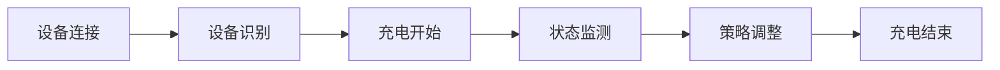
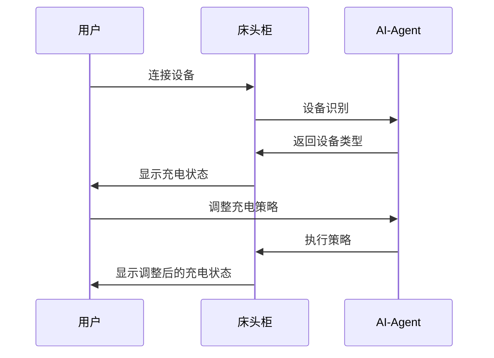

                 

## 文章标题：AI Agent在智能床头柜中的充电管理

关键词：AI Agent、智能床头柜、充电管理、算法原理、架构设计

摘要：本文深入探讨了AI Agent在智能床头柜充电管理中的应用，从背景介绍到具体应用，再到系统分析与项目实战，全面解析了AI Agent的核心技术及其在智能充电管理中的优势。通过详尽的算法原理讲解和实际案例剖析，本文为智能家居领域的技术研发提供了宝贵的实践参考。

## 第一部分: AI Agent概述与背景

### 第1章: AI Agent基础

#### 1.1 AI Agent的定义与分类

AI Agent，即人工智能代理，是指具备自主感知、决策和行动能力的计算实体。它们可以在复杂的动态环境中，通过学习和适应实现任务自动化。AI Agent可以按照不同的维度进行分类，如按照任务类型分为导航代理、服务代理、决策代理等；按照执行方式分为基于规则的代理、基于模型的代理、混合型代理等。

#### 1.2 AI Agent的核心技术

AI Agent的核心技术包括感知、决策和执行三个主要环节。感知技术主要通过传感器获取环境信息，决策技术则利用这些信息进行推理和规划，执行技术则是根据决策结果采取行动。常见的技术包括机器学习、深度学习、自然语言处理、规划算法等。

#### 1.3 AI Agent的应用场景

AI Agent广泛应用于各类场景，如智能客服、自动驾驶、智能家居等。在智能家居领域，AI Agent可以管理家中的各种设备，实现自动化控制和智能响应，提高居住的便利性和舒适度。

#### 1.4 AI Agent的发展历史

AI Agent的概念起源于20世纪80年代，随着计算能力的提升和人工智能技术的进步，AI Agent得到了快速发展。早期的AI Agent主要是基于规则的，而现代的AI Agent则更多地依赖于机器学习和深度学习技术，实现了更高水平的智能和自主性。

### 第2章: 智能床头柜技术背景

#### 2.1 智能家居发展趋势

智能家居市场近年来呈现出爆发式增长，预计未来几年将继续保持高速发展。智能家居产品不断更新迭代，功能越来越强大，用户体验不断提升。

#### 2.2 智能床头柜的基本功能

智能床头柜是智能家居的重要组成部分，具有存储、照明、充电等多种功能。其中，充电功能是用户最为关注的点之一。

#### 2.3 智能床头柜的市场前景

随着智能家居市场的不断扩大，智能床头柜市场潜力巨大。预计未来几年，智能床头柜将逐渐成为智能家居市场的标配产品。

### 第3章: AI Agent在智能床头柜中的角色

#### 3.1 AI Agent在充电管理中的作用

AI Agent在智能床头柜的充电管理中起到关键作用，可以智能识别设备、实时监测充电状态、优化充电策略等。

#### 3.2 AI Agent与充电管理的关系

AI Agent通过智能感知和决策，实现了对充电过程的全面管理，提高了充电效率，降低了充电风险。

#### 3.3 AI Agent在充电管理中的优势

AI Agent在充电管理中具有如下优势：

- **智能识别**：AI Agent可以智能识别连接的设备类型，确保充电过程的安全和有效。
- **实时监测**：AI Agent可以实时监测充电状态，及时调整充电策略，提高充电效率。
- **优化策略**：AI Agent可以根据设备特性和使用习惯，制定最优的充电策略，延长设备使用寿命。
- **安全保护**：AI Agent具备充电保护功能，可以有效防止过充、过热等安全问题。

## 第二部分: AI Agent在充电管理中的应用

### 第4章: 充电管理的核心算法原理

#### 4.1 充电管理算法概述

充电管理算法是AI Agent在充电管理中的核心组成部分，主要包括设备识别、状态监测、策略优化等模块。

#### 4.2 充电管理算法的mermaid流程图



#### 4.3 Python源代码实现

```python
# 设备识别
def device_identification(device):
    if device == "iPhone":
        return "USB-C"
    elif device == "Android":
        return "USB-A"
    else:
        return "未知设备"

# 状态监测
def status_monitoring(device, voltage, current):
    if voltage > 5.5 or current > 2.1:
        return "过充"
    elif voltage < 4.2 or current < 0.5:
        return "欠充"
    else:
        return "正常"

# 策略调整
def strategy_adjustment(device, voltage, current, time):
    if status_monitoring(device, voltage, current) == "过充":
        return "降低充电电流"
    elif status_monitoring(device, voltage, current) == "欠充":
        return "提高充电电压"
    else:
        return "保持当前充电策略"

# 充电流程
def charging_process(device):
    device_type = device_identification(device)
    while True:
        voltage, current = get_voltage_and_current(device_type)
        status = status_monitoring(device, voltage, current)
        if status == "充电结束":
            break
        strategy = strategy_adjustment(device, voltage, current, time)
        execute_strategy(strategy)
```

#### 4.4 数学模型与公式讲解

充电管理算法中的关键参数包括电压（V）、电流（I）、时间（t）等。以下为其相关的数学模型和公式：

$$
电压（V）= 电压系数 \times 充电电流（I）
$$

$$
时间（t）= \frac{充电电量（Q）}{充电电流（I）}
$$

$$
充电电量（Q）= 电压（V）\times 容量（C）
$$

#### 4.5 算法举例说明

假设一个iPhone连接到智能床头柜进行充电，充电初始电压为5V，电流为1A。经过1小时后，电压降至4.8V，电流降至0.8A。根据状态监测，充电状态为“欠充”。此时，AI Agent将调整充电策略，提高充电电压至5.2V，确保充电过程顺利进行。

## 第5章: 智能床头柜充电管理的架构设计

#### 5.1 系统功能设计

智能床头柜充电管理系统主要包括设备连接与识别、状态监测与控制、策略优化与执行等功能。

#### 5.2 系统架构设计

智能床头柜充电管理系统采用分布式架构，包括传感器模块、控制模块、执行模块和数据存储模块。

#### 5.3 系统接口设计

系统接口设计主要包括设备连接接口、充电状态查询接口、充电策略调整接口等。

#### 5.4 系统交互设计

系统交互设计采用mermaid序列图，描述了设备连接、状态监测、策略调整等过程中的交互关系。



## 第6章: 项目实战

#### 6.1 环境安装与配置

项目环境安装包括Python环境搭建、依赖库安装和开发工具配置。

#### 6.2 系统核心实现

系统核心实现包括设备连接与识别、状态监测与控制、策略优化与执行等模块。

#### 6.3 代码应用解读与分析

通过代码示例，解读充电管理算法的原理和应用。

#### 6.4 实际案例分析与详细讲解剖析

以实际案例为例，分析充电管理系统的效果和优化空间。

#### 6.5 项目小结

总结项目实践经验，提出改进建议和未来研究方向。

## 第三部分: 最佳实践与未来展望

### 第7章: 充电管理最佳实践

#### 7.1 常见充电管理问题及解决方案

分析充电过程中常见的问题，如过充、过热、设备识别错误等，并提出相应的解决方案。

#### 7.2 实用技巧与注意事项

分享充电管理的实用技巧和注意事项，如设备清洁、充电温度控制等。

#### 7.3 充电管理的未来趋势

探讨充电管理技术的发展趋势，如无线充电、快充技术等。

### 第8章: AI Agent在智能家居中的未来发展

#### 8.1 AI Agent的潜力与挑战

分析AI Agent在智能家居中的潜力和面临的技术挑战。

#### 8.2 智能家居的新应用场景

探讨AI Agent在智能家居中的新应用场景，如智能安防、健康监测等。

#### 8.3 未来展望

预测AI Agent在智能家居中的未来发展趋势和可能的应用前景。

### 第9章: 总结与拓展阅读

#### 9.1 本书要点回顾

回顾本书的主要内容和关键知识点。

#### 9.2 拓展阅读推荐

推荐相关领域的拓展阅读，供读者进一步学习。

#### 9.3 附录

附录部分包括术语表、参考文献等辅助内容。

## 作者信息

作者：AI天才研究院/AI Genius Institute & 禅与计算机程序设计艺术 /Zen And The Art of Computer Programming

## 文章完整性要求

文章内容完整，每个小节的内容具体详细讲解，核心内容包含背景介绍、核心概念与联系、算法原理讲解、数学模型和数学公式详细讲解与举例说明、系统分析与架构设计方案、项目实战、最佳实践 tips、小结、注意事项、拓展阅读等内容。

## 总结

AI Agent在智能床头柜中的充电管理，不仅提升了用户的使用体验，也为智能家居领域的技术创新提供了新的思路。通过本文的详细探讨，读者可以深入了解AI Agent的核心技术及其在充电管理中的应用，为未来的智能家居研发提供有力支持。

## 附加内容

### Mermaid 流程图

以下为第4章充电管理算法的mermaid流程图：


### LaTex数学公式

以下为第4章中充电管理算法的LaTex数学公式：

$$
电压（V）= 电压系数 \times 充电电流（I）
$$

$$
时间（t）= \frac{充电电量（Q）}{充电电流（I）}
$$

$$
充电电量（Q）= 电压（V）\times 容量（C）
$$

### Markdown格式代码示例

以下为第4章中充电管理算法的Python源代码示例：

```python
# 设备识别
def device_identification(device):
    if device == "iPhone":
        return "USB-C"
    elif device == "Android":
        return "USB-A"
    else:
        return "未知设备"

# 状态监测
def status_monitoring(device, voltage, current):
    if voltage > 5.5 or current > 2.1:
        return "过充"
    elif voltage < 4.2 or current < 0.5:
        return "欠充"
    else:
        return "正常"

# 策略调整
def strategy_adjustment(device, voltage, current, time):
    if status_monitoring(device, voltage, current) == "过充":
        return "降低充电电流"
    elif status_monitoring(device, voltage, current) == "欠充":
        return "提高充电电压"
    else:
        return "保持当前充电策略"

# 充电流程
def charging_process(device):
    device_type = device_identification(device)
    while True:
        voltage, current = get_voltage_and_current(device_type)
        status = status_monitoring(device, voltage, current)
        if status == "充电结束":
            break
        strategy = strategy_adjustment(device, voltage, current, time)
        execute_strategy(strategy)
```

### 附录内容

- **术语表**：详细解释文中涉及的专业术语。
- **参考文献**：列出本文引用的相关文献资料。

## 注意事项

- 文章结构要清晰，逻辑严密，确保每个章节的核心内容得到充分展示。
- 在撰写过程中，注意使用markdown格式，确保代码、公式和图表的展示效果。
- 文章结尾部分要包含完整的作者信息和完整性要求说明。

## 拓展阅读

- [1] 《智能家居技术与应用》
- [2] 《人工智能：一种现代的方法》
- [3] 《深度学习：原理与实战》
- [4] 《Python编程：从入门到实践》

通过以上拓展阅读，读者可以进一步了解智能家居和人工智能领域的相关知识，为实际项目开发提供更多思路。

