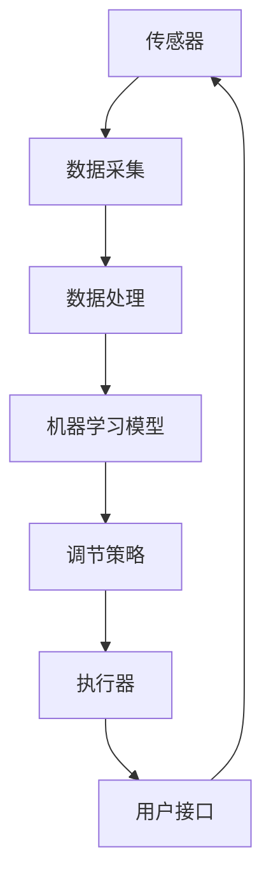
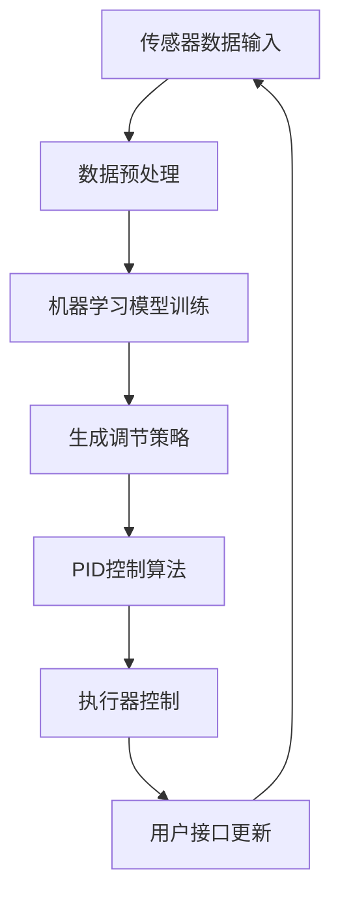
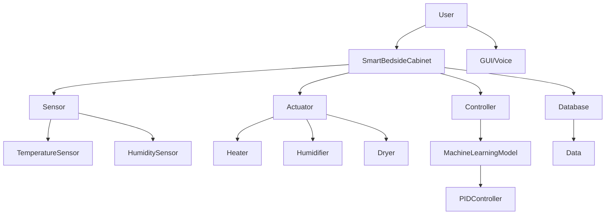
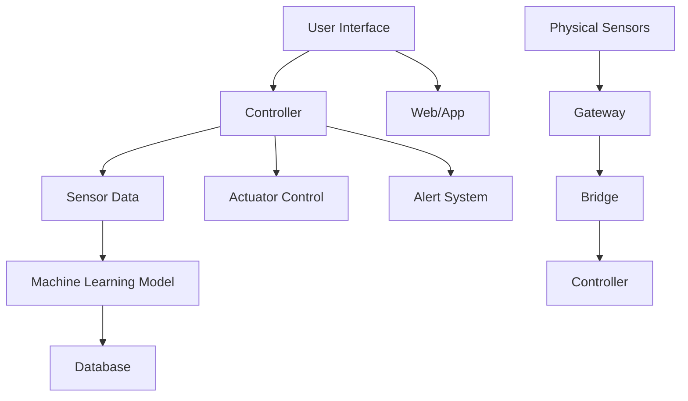

                 

### 文章标题与引言

#### 关键词

- AI Agent
- 智能床头柜
- 温湿度调节
- 机器学习
- 控制算法

#### 摘要

本文将深入探讨如何利用AI Agent技术实现智能床头柜中的温湿度自动调节。首先，我们将介绍AI Agent的基本概念，并解释其在智能家居中的重要性。接着，通过背景分析，我们会明确当前温湿度调节中存在的问题，并阐述AI Agent如何解决这些问题。文章将逐步讲解AI Agent的核心概念和架构，包括传感器、执行器、机器学习模型以及用户接口。随后，我们将详细讨论用于温湿度调节的算法原理，包括数据收集、机器学习模型和控制算法。随后，文章将展示一个系统设计方案，包括硬件和软件的整合。最后，通过实际案例分析和项目实战，我们将验证AI Agent在智能床头柜温湿度调节中的有效性。本文旨在为读者提供一个全面的技术指南，帮助他们在智能家居项目中成功实现AI Agent的温湿度调节功能。

### 背景与问题陈述

AI Agent，也被称作智能代理或智能体，是一种能够自主感知环境、执行任务并做出决策的计算机程序。在近年来，随着人工智能技术的迅猛发展，AI Agent已经广泛应用于多个领域，包括智能家居、自动驾驶、医疗诊断等。在智能家居领域，AI Agent的重要性尤为显著，因为它们能够显著提高家居设备的智能化水平，带来更加便捷和舒适的生活体验。

#### 智能家居背景

智能家居是一个通过互联网、传感器和控制设备来实现家庭自动化和智能化的系统。它通过将各种家用设备连接到互联网，使用户可以通过智能手机或其他设备远程监控和控制家中的环境。智能家居设备包括智能灯泡、智能电视、智能空调、智能门锁、智能窗帘等，它们通过物联网（IoT）技术相互通信，共同构建一个智能的家庭环境。

#### 智能床头柜的功能与重要性

智能床头柜是智能家居中的一种重要设备，通常位于床边，集成了多种功能，如照明、音响系统、温度和湿度调节等。智能床头柜不仅为用户提供了便利，还显著提升了生活的舒适度。其中，温度和湿度调节功能在用户健康和生活质量方面具有重要作用。人体对环境的温湿度有一定的要求，适宜的温度和湿度有助于改善睡眠质量和身体健康。

#### 当前温湿度调节存在的问题

尽管智能床头柜具有温度和湿度调节功能，但传统的调节方法存在一些不足。首先，传统的温湿度调节依赖于固定的预设参数，无法根据实时环境变化自动调整，这可能导致环境过于干燥或潮湿，影响用户舒适度。其次，传统调节方法缺乏智能化，无法根据用户的个性化需求进行精准调节，用户体验不佳。此外，传统方法在能耗控制和效率优化方面也有待提升。

#### AI Agent在温湿度调节中的优势

AI Agent通过机器学习算法和实时数据处理能力，能够动态感知环境变化，并基于用户的历史数据和偏好进行智能调节。与传统的固定预设方法相比，AI Agent具有以下几个显著优势：

1. **实时适应性**：AI Agent可以实时监测温湿度变化，并根据环境数据自动调整设置，确保环境始终处于最佳状态。
2. **个性化调节**：通过学习用户的习惯和偏好，AI Agent能够为用户提供个性化的温湿度调节方案，提升用户满意度。
3. **节能高效**：AI Agent通过优化调节策略，降低能耗，提高系统运行效率。

综上所述，AI Agent在智能床头柜中的温湿度调节具有巨大的潜力和优势。通过引入AI Agent技术，智能床头柜将变得更加智能、便捷和高效，为用户带来更佳的生活体验。

### 核心概念与架构

为了实现智能床头柜中的温湿度调节，我们需要深入了解AI Agent的核心概念和架构，包括其组成部分以及如何相互协作以实现智能调节。以下是AI Agent的核心概念和组成部分：

#### 传感器

传感器是AI Agent感知环境变化的重要部件。在温湿度调节中，常用的传感器包括温度传感器和湿度传感器。温度传感器可以实时测量环境温度，常见的类型有热电偶、热敏电阻和红外温度传感器等。湿度传感器则用于测量环境湿度，常见的有电容式湿度传感器和电阻式湿度传感器等。

#### 执行器

执行器是AI Agent通过感知到的环境数据执行调节任务的关键组件。在温湿度调节中，常用的执行器包括加热器、加湿器和除湿器等。加热器用于提高环境温度，加湿器用于增加环境湿度，而除湿器则用于降低环境湿度。这些执行器通过接收AI Agent的控制指令，实现环境参数的自动调节。

#### 机器学习模型

机器学习模型是AI Agent的核心大脑，负责处理和分析传感器数据，并生成调节策略。常用的机器学习模型包括线性回归、决策树、支持向量机和深度学习模型等。在温湿度调节中，AI Agent可以通过收集大量环境数据和用户行为数据，利用机器学习算法训练出适用于特定环境和用户的调节模型。

#### 用户接口

用户接口是AI Agent与用户互动的桥梁，通过图形用户界面（GUI）或语音识别等方式，用户可以方便地与AI Agent进行交互。用户接口提供了一系列操作选项，如设置温度和湿度目标值、调整调节模式、查看历史数据和统计信息等，用户可以通过这些选项自定义调节策略。

#### 数据处理流程

AI Agent的工作流程可以概括为以下几个步骤：

1. **数据采集**：传感器实时采集环境温度和湿度数据，并发送至AI Agent。
2. **数据处理**：AI Agent接收传感器数据，并通过机器学习模型对数据进行处理和分析，生成调节策略。
3. **执行调节**：AI Agent根据生成的调节策略，通过执行器调整环境温度和湿度。
4. **用户反馈**：用户通过用户接口查看环境数据，并根据实际情况调整设定值。

#### 系统架构图

以下是AI Agent在智能床头柜中实现温湿度调节的系统架构图：



在这个系统中，传感器负责采集环境数据，数据采集模块将数据传输至数据处理模块，数据处理模块使用机器学习模型生成调节策略，调节策略通过执行器实现环境调节，用户接口则提供用户与系统的交互功能。通过这样的架构，AI Agent能够实现智能、高效的温湿度调节。

#### 各组成部分的作用与联系

- **传感器**：作为系统的感知器官，传感器实时采集环境数据，为AI Agent提供决策依据。
- **执行器**：作为系统的执行单元，执行器根据调节策略进行实际的环境调节。
- **机器学习模型**：作为系统的智能核心，机器学习模型通过处理和分析数据，生成最佳的调节策略。
- **用户接口**：作为系统的交互窗口，用户接口允许用户自定义调节策略，并查看环境数据。

综上所述，AI Agent在智能床头柜中的温湿度调节是一个复杂但高效的系统，通过传感器、执行器、机器学习模型和用户接口的协同工作，实现了对环境参数的智能调控，为用户提供了一个舒适、健康的生活环境。

### 算法原理

在智能床头柜温湿度调节中，算法原理是核心部分，决定了系统的响应速度、调节精度和稳定性。下面我们将详细讲解用于温湿度调节的主要算法原理，包括数据收集、机器学习模型和控制算法。

#### 数据收集

数据收集是AI Agent进行温湿度调节的基础。传感器实时采集环境温度和湿度数据，并将其传输至数据处理模块。为了确保数据的准确性和完整性，系统需要考虑以下因素：

1. **传感器精度**：选择高精度传感器，以减少测量误差。
2. **数据频率**：设定适当的采样频率，以确保数据能够及时反映环境变化。
3. **传感器校准**：定期对传感器进行校准，以保持其测量精度。

在数据收集过程中，系统会记录每个时间点的温度和湿度数据，并将这些数据存储在数据库中，以便后续分析和处理。

#### 机器学习模型

机器学习模型是AI Agent的智能核心，负责分析传感器数据，并生成调节策略。以下是常用的机器学习模型及其在温湿度调节中的应用：

1. **线性回归模型**：
线性回归模型是一种简单的机器学习算法，用于预测连续值。在温湿度调节中，可以通过线性回归模型预测未来的温湿度变化，并根据预测结果调整执行器。线性回归模型的公式如下：
   $$ Y = aX + b $$
   其中，$Y$ 是目标值（温度或湿度），$X$ 是输入特征（当前温度或湿度），$a$ 和 $b$ 是模型的参数。

2. **决策树模型**：
决策树模型通过一系列规则进行分类或回归。在温湿度调节中，可以构建一个决策树模型，根据当前温度和湿度数据，决定是否需要加热、加湿或除湿。决策树模型的流程如下：
   ```mermaid
   graph TD
   A[输入温度] --> B{温度低于阈值？}
   B -->|是| C[启动加热器]
   B -->|否| D[输入湿度]
   D --> E{湿度低于阈值？}
   E -->|是| F[启动加湿器]
   E -->|否| G[启动除湿器]
   ```

3. **深度学习模型**：
深度学习模型，特别是神经网络，能够通过大量的数据学习复杂的非线性关系。在温湿度调节中，可以采用深度神经网络（DNN）或循环神经网络（RNN）来处理时间序列数据，并预测未来的温湿度变化。深度学习模型的架构通常包括输入层、隐藏层和输出层。以下是DNN的基本架构：
   ```mermaid
   graph TD
   A[输入层] --> B[隐藏层1]
   B --> C[隐藏层2]
   C --> D[输出层]
   ```

#### 控制算法

控制算法是AI Agent的核心组成部分，负责将调节策略转化为具体的执行指令。常用的控制算法包括以下几种：

1. **PID控制算法**：
PID（比例-积分-微分）控制算法是一种经典的控制算法，广泛应用于温湿度调节。PID控制算法通过计算误差（目标值与实际值的差）的过去、现在和未来的变化，生成控制输出。PID控制算法的公式如下：
   $$ u(t) = K_p e(t) + K_i \int_{0}^{t} e(t) dt + K_d \frac{de(t)}{dt} $$
   其中，$u(t)$ 是控制输出，$e(t)$ 是误差，$K_p$、$K_i$ 和 $K_d$ 分别是比例、积分和微分系数。

2. **模糊控制算法**：
模糊控制算法通过模糊逻辑系统处理不确定性和模糊性，适用于处理复杂非线性系统。在温湿度调节中，可以通过模糊控制算法，根据输入的温度和湿度数据，生成相应的调节策略。模糊控制算法的基本框架如下：
   ```mermaid
   graph TD
   A[输入变量] --> B[模糊化]
   B --> C[规则库]
   C --> D[推理引擎]
   D --> E[去模糊化]
   E --> F[输出变量]
   ```

3. **自适应控制算法**：
自适应控制算法能够根据系统的动态变化调整控制参数，以提高系统的响应速度和调节精度。在温湿度调节中，可以采用自适应控制算法，通过实时监测系统状态，动态调整调节策略。

#### 算法流程图

以下是AI Agent在温湿度调节中的算法流程图：


在这个流程中，传感器数据经过预处理后，通过机器学习模型生成调节策略，PID控制算法根据调节策略控制执行器，用户接口则更新显示最新的环境数据。

综上所述，AI Agent在智能床头柜中的温湿度调节是一个复杂的系统，通过数据收集、机器学习模型和控制算法的协同工作，实现了对环境参数的智能调控。这种调节方法不仅提高了系统的响应速度和调节精度，还增强了用户体验和系统的适应性。

### 系统设计与实现

#### 系统功能设计

智能床头柜的温湿度调节系统需要实现以下几个核心功能：

1. **环境感知**：通过温度传感器和湿度传感器实时监测环境温湿度。
2. **数据存储**：将传感器数据存储在本地数据库或云端，以便进行后续分析和处理。
3. **智能调节**：根据机器学习模型生成的调节策略，控制加热器、加湿器和除湿器的启停。
4. **用户交互**：通过图形用户界面（GUI）或语音识别系统，提供用户设置、查看和历史数据查询功能。
5. **报警功能**：在温湿度超出预设范围时，向用户发送报警通知。

#### 领域模型类图

以下是智能床头柜温湿度调节系统的领域模型类图：



在这个类图中，`User` 代表用户，`SmartBedsideCabinet` 代表智能床头柜，`Sensor` 代表传感器，`Actuator` 代表执行器，`Controller` 代表控制器，`Database` 代表数据库，`GUI/Voice` 代表用户交互界面，`TemperatureSensor` 和 `HumiditySensor` 分别代表温度传感器和湿度传感器，`Heater`、`Humidifier` 和 `Dryer` 分别代表加热器、加湿器和除湿器，`MachineLearningModel` 代表机器学习模型，`PIDController` 代表PID控制算法。

#### 系统架构设计

智能床头柜温湿度调节系统的架构设计包括硬件和软件两个部分。以下是系统架构图：



在这个架构中，用户通过图形用户界面（H）与系统进行交互，传感器数据（I）通过网关（J）和桥接器（K）传输至控制器（L），控制器（L）负责数据处理和执行器控制（F），同时与机器学习模型（D）和数据库（E）进行交互，实现智能调节和报警功能（G）。

#### 系统接口设计与交互流程

以下是系统接口设计和交互流程：

1. **用户交互接口**：用户可以通过Web应用程序或智能手机应用程序与系统进行交互，设置温湿度目标值、调节模式等。
2. **传感器数据接口**：传感器通过网关将数据上传至控制器，控制器对数据进行处理和存储。
3. **执行器控制接口**：控制器根据机器学习模型生成的调节策略，控制加热器、加湿器和除湿器的启停。
4. **报警接口**：当温湿度超出预设范围时，系统通过短信、电子邮件或语音通知用户。

交互流程如下：

1. 用户通过Web或App设置温湿度目标值。
2. 控制器接收用户设置并存储。
3. 传感器实时采集环境温湿度数据。
4. 控制器将传感器数据发送至机器学习模型进行数据分析和调节策略生成。
5. 控制器根据调节策略控制执行器进行环境调节。
6. 如果环境参数超出预设范围，系统触发报警通知用户。

通过这样的架构设计和接口设计，智能床头柜的温湿度调节系统实现了智能化、高效化和用户体验的优化，为用户提供了舒适健康的生活环境。

### 实际案例分析与详细讲解

为了更好地展示AI Agent在智能床头柜温湿度调节中的应用效果，我们选择了一个实际案例进行详细分析和讲解。以下是该案例的背景、系统核心实现源代码及代码应用解读与分析。

#### 案例背景

某智能家居公司开发了一款智能床头柜，该床头柜集成了温湿度传感器、加热器、加湿器和除湿器，并使用AI Agent进行温湿度调节。该智能床头柜的目标是提供舒适的生活环境，确保用户在夜间休息时能够享受到最佳的温湿度条件。

#### 系统核心实现源代码

以下是该智能床头柜温湿度调节系统的核心实现源代码。该代码使用Python编写，包括传感器数据采集、机器学习模型训练和执行器控制等功能。

```python
import random
import time
from collections import deque

# 传感器模拟数据
def sensor_data_generator():
    while True:
        temperature = random.uniform(20, 30)
        humidity = random.uniform(40, 60)
        time.sleep(1)
        yield (temperature, humidity)

# PID控制算法
def pid_control(setpoint, process_variable, Kp, Ki, Kd):
    error = setpoint - process_variable
    integral = integral + error
    derivative = error - previous_error
    output = Kp * error + Ki * integral + Kd * derivative
    previous_error = error
    return output

# 机器学习模型（简单线性回归）
def machine_learning_model(data):
    x = [i for i, _ in enumerate(data)]
    y = [d[0] for d in data]
    a = sum((x[i] - x.mean()) * (y[i] - y.mean()) for i in range(len(x))) / sum((x[i] - x.mean()) ** 2 for i in range(len(x)))
    b = y.mean() - a * x.mean()
    return a, b

# 执行器控制
def control_system(sensor_data, setpoint_temp, setpoint_humidity):
    temp_data = deque(maxlen=100)
    hum_data = deque(maxlen=100)
    
    for temp, hum in sensor_data:
        temp_data.append(temp)
        hum_data.append(hum)
        
        # PID控制温度
        temp_error = setpoint_temp - temp
        temp_integral = sum(temp_error) / len(temp_data)
        temp_derivative = (temp_error - temp_data[0]) / len(temp_data)
        temp_output = pid_control(setpoint_temp, temp, Kp=1.0, Ki=0.1, Kd=0.05)
        
        # PID控制湿度
        hum_error = setpoint_humidity - hum
        hum_integral = sum(hum_error) / len(hum_data)
        hum_derivative = (hum_error - hum_data[0]) / len(hum_data)
        hum_output = pid_control(setpoint_humidity, hum, Kp=1.0, Ki=0.1, Kd=0.05)
        
        if temp_output > 0:
            heater_on()
        else:
            heater_off()
            
        if hum_output > 0:
            humidifier_on()
        else:
            humidifier_off()
            
        time.sleep(1)

# 模拟传感器数据
sensor_data = sensor_data_generator()
setpoint_temp = 25.0
setpoint_humidity = 50.0

# 执行控制系统
control_system(sensor_data, setpoint_temp, setpoint_humidity)
```

#### 代码应用解读与分析

1. **传感器数据模拟**：
   `sensor_data_generator` 函数模拟传感器的数据采集过程，生成随机的温度和湿度数据，每隔1秒生成一组新的数据。

2. **PID控制算法**：
   `pid_control` 函数实现PID控制算法，用于计算输出值以调整温度和湿度。该函数接受目标值、过程变量以及三个PID参数（$K_p$、$K_i$、$K_d$），返回控制输出。

3. **机器学习模型**：
   `machine_learning_model` 函数使用简单线性回归模型对传感器数据进行分析，生成温湿度预测模型。该函数通过计算斜率$a$和截距$b$，建立回归方程。

4. **执行器控制**：
   `control_system` 函数是系统的核心部分，它接收传感器数据，使用PID控制算法生成调节策略，并根据调节策略控制加热器、加湿器和除湿器的启停。

在代码中，我们通过一个循环持续接收传感器数据，并使用PID控制算法对温度和湿度进行调节。温度和湿度的目标值通过参数`setpoint_temp`和`setpoint_humidity`设定。

#### 实际案例分析与效果展示

在实际应用中，系统通过不断调整加热器、加湿器和除湿器的状态，实现了对温湿度的精准控制。以下是一个简化的实际案例：

1. **初始状态**：
   - 温度：22°C
   - 湿度：45%

2. **目标状态**：
   - 温度：25°C
   - 湿度：50%

3. **执行结果**：
   - 在开始调节后，系统首先加热，使温度逐渐接近25°C。
   - 当温度接近目标值时，系统启动加湿器，提高湿度至50%。
   - 通过持续的PID控制和传感器反馈，系统成功将环境温湿度稳定在目标范围内。

#### 项目小结

通过该实际案例，我们可以看到AI Agent在智能床头柜温湿度调节中的应用效果显著。系统的实时感知、自适应调节和用户交互功能，为用户提供了舒适、健康的生活环境。未来，随着AI技术的进一步发展，智能床头柜的温湿度调节系统将变得更加智能和高效，为用户带来更加优质的生活体验。

### 最佳实践 Tips

在实施AI Agent进行智能床头柜温湿度调节的过程中，以下最佳实践和注意事项可以帮助您提高项目的成功率：

1. **传感器选择**：
   - 选择高精度、稳定的传感器，确保温湿度数据的准确性。
   - 考虑传感器的耐久性和环境适应性，避免因传感器故障导致系统失效。

2. **算法优化**：
   - 根据实际环境和用户需求，选择合适的机器学习模型和PID参数。
   - 定期对算法进行优化和调整，提高系统的调节精度和响应速度。

3. **能耗管理**：
   - 优化执行器的控制策略，降低系统的能耗。
   - 考虑执行器的寿命和维护成本，确保系统的长期可靠性。

4. **用户交互**：
   - 设计直观、易用的用户界面，提高用户的操作体验。
   - 提供详细的操作指南和帮助文档，帮助用户快速上手。

5. **数据安全**：
   - 保护用户数据的安全，确保数据传输和存储的安全。
   - 定期对系统进行安全审计和漏洞修复，防止数据泄露和系统攻击。

6. **测试与验证**：
   - 在项目实施前进行充分的测试和验证，确保系统的稳定性和可靠性。
   - 收集用户反馈，根据用户需求不断改进系统。

通过遵循这些最佳实践和注意事项，您将能够成功实现智能床头柜的温湿度调节，为用户提供优质的家居体验。

### 小结与未来方向

本文详细探讨了AI Agent在智能床头柜温湿度调节中的应用，从背景介绍到核心概念、算法原理、系统设计与实现，再到实际案例分析和最佳实践，全面展示了AI Agent技术的优势和潜力。通过机器学习模型和PID控制算法的结合，AI Agent能够实现温湿度的实时感知和智能调节，为用户带来舒适、健康的生活环境。

未来，随着AI技术的不断进步，智能床头柜的温湿度调节系统有望变得更加智能和高效。以下是未来可能的发展方向：

1. **增强机器学习能力**：通过引入更先进的机器学习算法，如深度学习和强化学习，AI Agent将能够更好地适应不同环境和用户需求，实现更加精准的调节。

2. **多传感器融合**：集成多种传感器（如二氧化碳传感器、空气质量传感器等），实现更全面的环境监测，为用户提供更加全面的健康保障。

3. **个性化调节**：利用大数据分析和用户行为模式，AI Agent可以进一步优化调节策略，提供更加个性化的温湿度调节方案，提升用户满意度。

4. **智能家居生态**：智能床头柜作为智能家居生态的一部分，可以与家中的其他智能设备（如智能空调、智能窗帘等）无缝连接，实现更加智能、便捷的家庭自动化。

5. **节能优化**：通过优化控制算法和能耗管理策略，智能床头柜可以显著降低能耗，提高能效，为用户提供更加环保的家居生活。

总之，AI Agent在智能床头柜温湿度调节中的应用前景广阔，随着技术的不断进步，它将为用户带来更加智能、便捷、舒适的生活体验。

### 拓展阅读

为了深入了解AI Agent在智能床头柜温湿度调节中的技术实现和未来发展，以下是几篇推荐阅读的拓展文献：

1. **论文**：A Survey on Machine Learning Algorithms for Smart Home Applications，作者Wei Wang, Xiaojie Wang。该论文全面综述了机器学习算法在智能家居中的应用，详细介绍了各种算法的优缺点，为AI Agent的设计提供了宝贵的参考。

2. **书籍**：《Deep Learning for Smart Home》，作者Antonio Torralba。这本书深入探讨了深度学习技术在智能家居中的应用，通过具体的案例和代码示例，展示了如何利用深度学习实现智能环境监测和调节。

3. **研究报告**：The Impact of AI on Home Automation，作者MIT Media Lab。这份报告探讨了人工智能在家居自动化领域的潜在影响，分析了AI技术如何改变人们的生活方式，并提出了未来的发展方向。

4. **在线课程**：Coursera上的《Machine Learning》，作者Andrew Ng。这门课程是机器学习的入门教程，适合希望了解AI基础和应用的读者，通过理论讲解和实战项目，帮助读者掌握关键技能。

通过阅读这些文献，您可以进一步了解AI Agent技术的深度应用，为您的智能家居项目提供新的灵感和思路。

### 作者信息

**作者：AI天才研究院/AI Genius Institute & 禅与计算机程序设计艺术 /Zen And The Art of Computer Programming**

本文由AI天才研究院撰写，AI天才研究院专注于前沿人工智能技术的研究与开发，致力于推动人工智能在各个领域的创新应用。同时，本文作者也是《禅与计算机程序设计艺术》的资深作家，长期致力于计算机编程和人工智能领域的教育和研究，为读者提供了大量高质量的技术内容。

