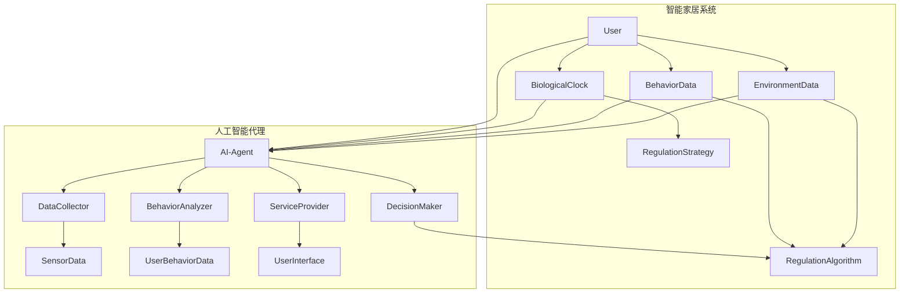
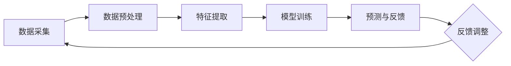
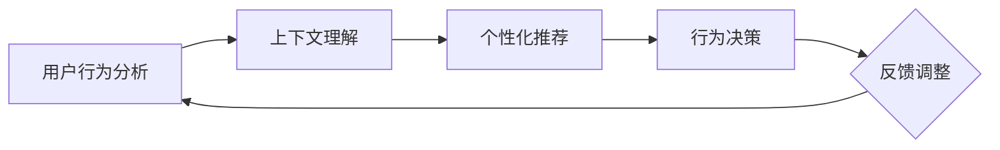
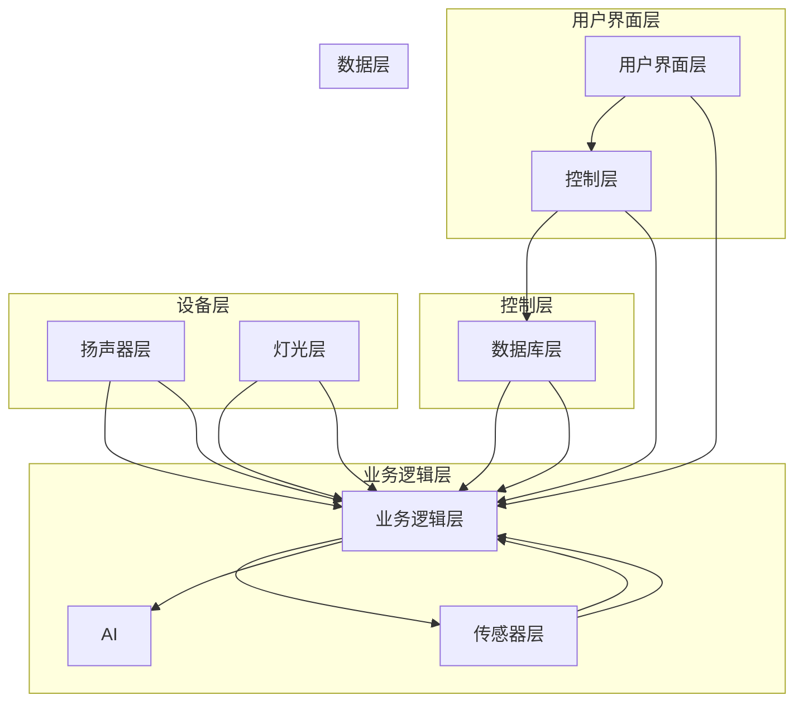
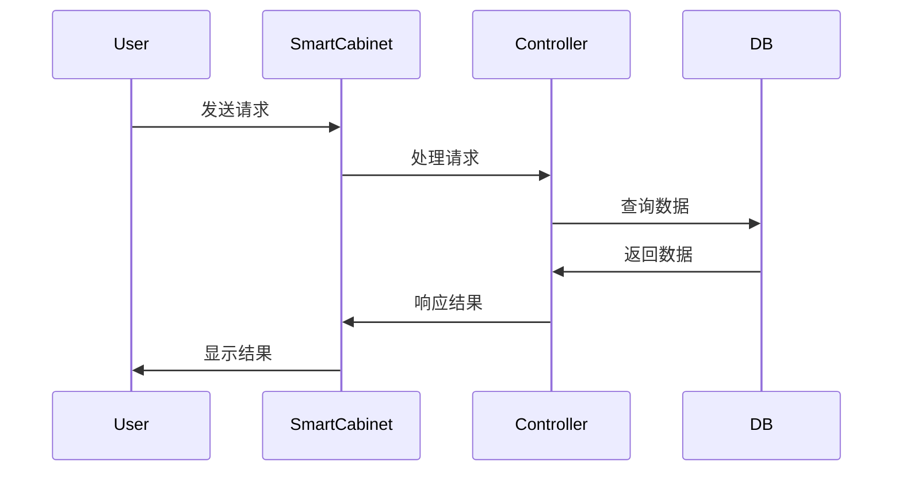
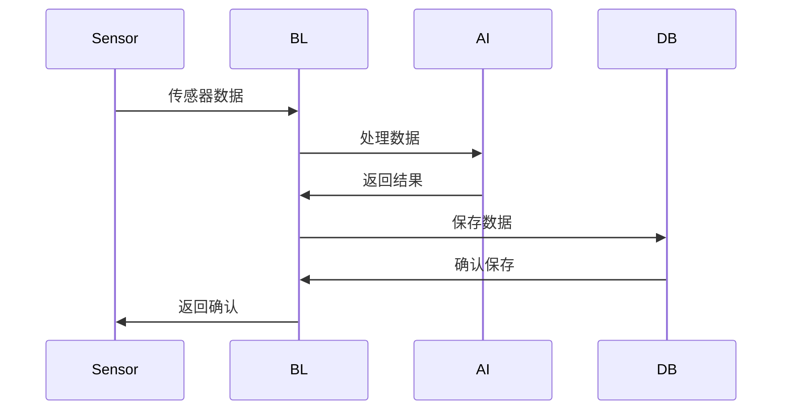

                 

### 第一部分：背景介绍

#### 1.1 问题背景

**生物钟的概念与调节重要性**

生物钟，也被称作人体时钟，是一种内在的生理节律，调节着人体的睡眠、觉醒、体温、激素分泌等许多生理过程。生物钟的基本单位是“ circadian rhythm ”，意为“大约24小时”的节律，它通过一系列基因和环境因素的相互作用来维持。人类及其他生物体都有生物钟，这种节律对维持健康和功能至关重要。

在日常生活中，良好的生物钟能够帮助人们更好地管理睡眠，提高工作学习效率，降低患病风险。然而，现代社会中由于生活方式的改变、工作压力、作息不规律等因素，许多人出现了生物钟紊乱的现象，如失眠、熬夜、白天困倦等。这种生物钟紊乱不仅影响生活质量，还可能导致一系列健康问题，如心血管疾病、抑郁症、肥胖等。

**智能家居的发展与AI Agent的应用**

智能家居作为物联网（IoT）的重要组成部分，近年来得到了快速发展。智能床头柜作为智能家居的一种，不仅具备基本的存储功能，还可以通过集成传感器、显示屏幕、语音助手等多种功能模块，为用户提供更加便捷的智能生活体验。

AI Agent，即人工智能代理，是一种能够模拟人类行为、具有自主决策能力的智能系统。AI Agent可以通过对用户行为数据的学习和分析，提供个性化服务，提升用户的使用体验。在智能家居领域，AI Agent的应用已经相当广泛，例如语音控制家电、智能安防、环境监测等。

**智能床头柜的生物钟调节挑战与机遇**

智能床头柜在生物钟调节方面具备一定优势，例如可以通过灯光调节、声音唤醒、环境监测等功能来影响用户的生物钟。然而，生物钟调节也面临诸多挑战，如个体差异、环境干扰、数据准确性等。

首先，每个人的生物钟都有一定的个体差异，这给智能床头柜的调节带来了挑战。其次，环境因素如噪音、光线等也会影响生物钟的调节效果。最后，数据准确性是生物钟调节的关键，如果数据不准确，调节效果也会大打折扣。

尽管如此，智能床头柜在生物钟调节方面也具有巨大机遇。通过AI Agent的学习和分析能力，可以更好地理解用户的生物钟特点，提供更加精准的调节方案。此外，随着传感器技术的进步和数据分析能力的提升，智能床头柜的生物钟调节效果有望得到进一步提升。

#### 1.2 问题描述

**当前生物钟调节的局限性**

目前的生物钟调节手段主要包括药物治疗、行为疗法和设备辅助等。药物治疗虽然可以快速调节生物钟，但长期使用可能产生副作用。行为疗法需要用户有较高的自律性和规律性，难以长期坚持。设备辅助如睡眠监测仪、智能闹钟等，虽然可以提供一定的调节功能，但效果有限，且需要用户主动使用。

**AI Agent在生物钟调节中的潜在优势**

AI Agent在生物钟调节中具有显著优势。首先，AI Agent可以通过持续学习和分析用户行为数据，了解用户的生物钟特点，提供个性化调节方案。其次，AI Agent可以集成多种传感器，实时监测环境变化，调整调节策略，提高调节效果。此外，AI Agent还可以通过语音、触屏等多种交互方式，方便用户使用。

**研究边界与外延**

本研究旨在探讨AI Agent在智能床头柜中的生物钟调节应用。具体研究边界包括：研究智能床头柜的硬件和软件架构、AI Agent在生物钟调节中的功能模块、算法原理和数学模型、系统架构设计、以及实际应用场景和效果评估。研究外延包括：对AI Agent在其他智能家居设备中的应用进行拓展，探索更广泛的生物钟调节方案。

#### 1.3 问题解决

**生物钟调节的核心概念**

生物钟调节的核心概念包括生物钟的基本原理、调节机制和调节方法。生物钟的基本原理涉及基因、环境因素对生物钟的调控。调节机制包括光周期、行为周期和内在生理过程。调节方法包括药物治疗、行为疗法和设备辅助等。

**AI Agent在生物钟调节中的功能模块**

AI Agent在生物钟调节中的功能模块主要包括数据采集与处理、行为分析、环境监测、调节策略制定和反馈调整。数据采集与处理模块负责收集用户的生物钟数据和环境数据，进行预处理和特征提取。行为分析模块通过分析用户的行为数据，了解用户的生物钟特点。环境监测模块实时监测环境变化，为调节策略提供依据。调节策略制定模块根据用户数据和环境数据，制定个性化的调节方案。反馈调整模块通过用户的反馈，不断优化调节策略。

**解决方案的技术架构**

解决方案的技术架构包括数据层、算法层和应用层。数据层负责数据的采集、存储和管理。算法层包括生物钟调节算法和AI Agent算法，负责数据分析和决策。应用层包括智能床头柜的硬件和软件，负责实现调节方案。技术架构的总体目标是实现用户生物钟的精准调节，提高用户的睡眠质量和生活体验。

#### 1.4 边界与外延

**生物钟调节的影响因素**

生物钟调节的影响因素包括基因、环境、生活习惯等。基因因素包括遗传、基因突变等，环境因素包括光线、噪音、温度等，生活习惯因素包括作息规律、饮食习惯等。

**AI Agent的技术实现难度**

AI Agent在生物钟调节中的技术实现难度较大，主要体现在数据采集、算法设计、模型训练和实时调整等方面。数据采集需要高精度的传感器和有效的数据清洗算法。算法设计需要深入理解生物钟调节机制，并能够应对个体差异和环境干扰。模型训练需要大量的训练数据和高效的训练算法。实时调整需要高响应速度和低延迟的处理能力。

**未来研究方向与挑战**

未来研究方向包括：进一步优化AI Agent的算法，提高调节精度和效率；研究多因素协同调节机制，提高调节效果；探索AI Agent在其他智能家居设备中的应用。未来挑战包括：解决数据隐私和安全问题，提高系统的适应性和可靠性。

#### 1.5 本章小结

本部分介绍了生物钟调节的背景、AI Agent在智能床头柜中的潜在优势以及问题的研究边界与外延。通过对生物钟调节的核心概念、AI Agent在生物钟调节中的功能模块和解决方案的技术架构的分析，为后续章节的研究奠定了基础。

#### 1.6 关键词

- 生物钟
- 智能家居
- AI Agent
- 个性化调节
- 实时监测

#### 1.7 摘要

本文探讨了AI Agent在智能床头柜中的生物钟调节应用。首先介绍了生物钟的概念与调节重要性，智能家居的发展与AI Agent的应用，以及智能床头柜的生物钟调节挑战与机遇。接着，描述了当前生物钟调节的局限性，AI Agent在生物钟调节中的潜在优势，以及研究边界与外延。最后，提出了生物钟调节的核心概念、AI Agent在生物钟调节中的功能模块和解决方案的技术架构。本文旨在为AI Agent在智能家居领域的生物钟调节提供理论依据和实际指导。

### 第一部分：背景介绍

#### 1.1 问题背景

**生物钟的概念与调节重要性**

生物钟是一种内在的生物节律，调节着人体的多种生理过程，如睡眠、觉醒、体温、激素分泌等。生物钟的基本单位是“ circadian rhythm ”，意为“大约24小时”的节律，它通过一系列基因和环境因素的相互作用来维持。人类的生物钟主要受基因调控，同时也受到外界环境因素的影响，如光线、温度、噪音等。

在日常生活中，生物钟对于维持正常的睡眠模式至关重要。良好的生物钟可以帮助人们更好地管理睡眠，提高工作学习效率，增强身体健康。例如，睡眠质量良好的人通常具有更高的免疫力和更低的患病风险。相反，生物钟紊乱可能导致失眠、熬夜、白天困倦等问题，严重影响生活质量。

**生物钟紊乱的原因**

生物钟紊乱可能是由于多种因素造成的，包括基因、环境、生活习惯等。首先，基因因素包括遗传、基因突变等。例如，一些基因突变可能导致生物钟基因的表达异常，从而影响生物钟的正常运作。其次，环境因素包括光线、噪音、温度等。例如，夜间长时间暴露于强光下可能干扰生物钟的正常节律。此外，生活方式因素如作息不规律、熬夜、长时间使用电子设备等也会影响生物钟的稳定性。

**生物钟调节的方法**

目前，生物钟调节的方法主要包括药物治疗、行为疗法和设备辅助等。药物治疗主要通过药物调节激素水平，如褪黑素补充剂可以用于调整睡眠节律。行为疗法包括建立规律的作息习惯、避免熬夜、适度运动等。设备辅助如睡眠监测仪、智能闹钟等，可以通过监测用户的睡眠质量和作息习惯，提供一定的调节建议。

然而，这些方法存在一定的局限性。药物治疗可能带来副作用，行为疗法需要用户有较高的自律性和规律性，设备辅助虽然可以提供一定的调节功能，但效果有限，且需要用户主动使用。

**智能床头柜在生物钟调节中的作用**

智能床头柜作为智能家居的一种，具备多种功能模块，如传感器、显示屏幕、语音助手等。这些功能模块为生物钟调节提供了新的可能。智能床头柜可以通过灯光调节、声音唤醒、环境监测等功能，对用户的生物钟进行调节。

首先，智能床头柜可以通过灯光调节来影响用户的生物钟。例如，在早晨使用柔和的阳光模拟光线，帮助用户逐渐醒来，而在晚上使用温暖的灯光，帮助用户放松，进入深度睡眠。其次，智能床头柜可以通过声音唤醒功能，提供个性化的唤醒方案，如逐渐增加音量、播放轻柔的音乐等，帮助用户更好地适应生物钟的变化。

此外，智能床头柜还可以通过环境监测功能，实时监测室内温度、湿度、噪音等环境因素，根据环境变化调整生物钟调节策略。例如，当室内温度过高时，可以自动开启空调或风扇，降低环境温度，促进深度睡眠。

**AI Agent在生物钟调节中的应用**

AI Agent，即人工智能代理，是一种能够模拟人类行为、具有自主决策能力的智能系统。AI Agent可以通过对用户行为数据的学习和分析，提供个性化服务，提升用户的使用体验。在生物钟调节中，AI Agent可以通过以下方式发挥作用：

1. **数据采集与处理**：AI Agent可以持续收集用户的生物钟数据，如睡眠质量、作息时间、活动强度等，通过数据清洗和预处理，提取出有用的信息。

2. **行为分析**：AI Agent可以对用户的行为数据进行分析，了解用户的生物钟特点，如睡眠偏好、活动规律等，为个性化的生物钟调节提供依据。

3. **环境监测**：AI Agent可以集成多种传感器，实时监测室内环境因素的变化，如光线、温度、噪音等，根据环境变化调整生物钟调节策略。

4. **调节策略制定**：AI Agent可以根据用户的数据和行为分析，制定个性化的生物钟调节方案，如调整灯光、声音、温度等。

5. **反馈调整**：AI Agent可以根据用户的反馈，不断优化调节策略，提高调节效果。

通过AI Agent的引入，智能床头柜的生物钟调节可以实现更高的自动化和个性化，满足不同用户的需求。同时，AI Agent还可以通过持续学习和优化，不断提高生物钟调节的准确性和效果。

**智能床头柜的生物钟调节挑战与机遇**

智能床头柜在生物钟调节方面具备一定优势，但也面临诸多挑战。首先，每个人的生物钟都有一定的个体差异，这给智能床头柜的调节带来了挑战。其次，环境因素如光线、噪音等也会影响生物钟的调节效果。此外，数据准确性是生物钟调节的关键，如果数据不准确，调节效果也会大打折扣。

尽管如此，智能床头柜在生物钟调节方面也具有巨大机遇。通过AI Agent的学习和分析能力，可以更好地理解用户的生物钟特点，提供更加精准的调节方案。此外，随着传感器技术的进步和数据分析能力的提升，智能床头柜的生物钟调节效果有望得到进一步提升。

#### 1.2 问题描述

**当前生物钟调节的局限性**

目前的生物钟调节手段主要包括药物治疗、行为疗法和设备辅助等。药物治疗虽然可以快速调节生物钟，但长期使用可能产生副作用。行为疗法需要用户有较高的自律性和规律性，难以长期坚持。设备辅助如睡眠监测仪、智能闹钟等，虽然可以提供一定的调节功能，但效果有限，且需要用户主动使用。

**AI Agent在生物钟调节中的潜在优势**

AI Agent在生物钟调节中具有显著优势。首先，AI Agent可以通过持续学习和分析用户行为数据，了解用户的生物钟特点，提供个性化调节方案。其次，AI Agent可以集成多种传感器，实时监测环境变化，调整调节策略，提高调节效果。此外，AI Agent还可以通过语音、触屏等多种交互方式，方便用户使用。

**研究边界与外延**

本研究旨在探讨AI Agent在智能床头柜中的生物钟调节应用。具体研究边界包括：研究智能床头柜的硬件和软件架构、AI Agent在生物钟调节中的功能模块、算法原理和数学模型、系统架构设计、以及实际应用场景和效果评估。研究外延包括：对AI Agent在其他智能家居设备中的应用进行拓展，探索更广泛的生物钟调节方案。

#### 1.3 问题解决

**生物钟调节的核心概念**

生物钟调节的核心概念包括生物钟的基本原理、调节机制和调节方法。生物钟的基本原理涉及基因、环境因素对生物钟的调控。调节机制包括光周期、行为周期和内在生理过程。调节方法包括药物治疗、行为疗法和设备辅助等。

**AI Agent在生物钟调节中的功能模块**

AI Agent在生物钟调节中的功能模块主要包括数据采集与处理、行为分析、环境监测、调节策略制定和反馈调整。数据采集与处理模块负责收集用户的生物钟数据和环境数据，进行预处理和特征提取。行为分析模块通过分析用户的行为数据，了解用户的生物钟特点。环境监测模块实时监测环境变化，为调节策略提供依据。调节策略制定模块根据用户数据和环境数据，制定个性化的调节方案。反馈调整模块通过用户的反馈，不断优化调节策略。

**解决方案的技术架构**

解决方案的技术架构包括数据层、算法层和应用层。数据层负责数据的采集、存储和管理。算法层包括生物钟调节算法和AI Agent算法，负责数据分析和决策。应用层包括智能床头柜的硬件和软件，负责实现调节方案。技术架构的总体目标是实现用户生物钟的精准调节，提高用户的睡眠质量和生活体验。

#### 1.4 边界与外延

**生物钟调节的影响因素**

生物钟调节的影响因素包括基因、环境、生活习惯等。基因因素包括遗传、基因突变等，环境因素包括光线、噪音、温度等，生活习惯因素包括作息规律、饮食习惯等。

**AI Agent的技术实现难度**

AI Agent在生物钟调节中的技术实现难度较大，主要体现在数据采集、算法设计、模型训练和实时调整等方面。数据采集需要高精度的传感器和有效的数据清洗算法。算法设计需要深入理解生物钟调节机制，并能够应对个体差异和环境干扰。模型训练需要大量的训练数据和高效的训练算法。实时调整需要高响应速度和低延迟的处理能力。

**未来研究方向与挑战**

未来研究方向包括：进一步优化AI Agent的算法，提高调节精度和效率；研究多因素协同调节机制，提高调节效果；探索AI Agent在其他智能家居设备中的应用。未来挑战包括：解决数据隐私和安全问题，提高系统的适应性和可靠性。

#### 1.5 本章小结

本部分介绍了生物钟调节的背景、AI Agent在智能床头柜中的潜在优势以及问题的研究边界与外延。通过对生物钟调节的核心概念、AI Agent在生物钟调节中的功能模块和解决方案的技术架构的分析，为后续章节的研究奠定了基础。

#### 1.6 关键词

- 生物钟
- 智能家居
- AI Agent
- 个性化调节
- 实时监测

#### 1.7 摘要

本文探讨了AI Agent在智能床头柜中的生物钟调节应用。首先介绍了生物钟的概念与调节重要性，智能家居的发展与AI Agent的应用，以及智能床头柜的生物钟调节挑战与机遇。接着，描述了当前生物钟调节的局限性，AI Agent在生物钟调节中的潜在优势，以及研究边界与外延。最后，提出了生物钟调节的核心概念、AI Agent在生物钟调节中的功能模块和解决方案的技术架构。本文旨在为AI Agent在智能家居领域的生物钟调节提供理论依据和实际指导。

### 第二部分：核心概念与联系

#### 2.1 核心概念原理

**生物钟调节机制**

生物钟调节机制是指人体内部通过一系列生物过程来维持稳定的生物节律。生物钟的核心部分是一个位于大脑下部的结构——下丘脑的视交叉上核（suprachiasmatic nucleus, SCN）。SCN接收到来自眼睛的光信号，通过光周期来调节生物钟。此外，生物钟还受到行为周期和环境因素的调控。

- **光周期调控**：光信号通过眼睛传递到SCN，调节生物钟的昼夜节律。例如，早晨的阳光信号可以帮助人体调整醒来时间，而夜晚的昏暗环境则有助于进入深度睡眠。

- **行为周期调控**：日常的行为活动，如起床、工作、运动和饮食，也会影响生物钟的稳定性。行为周期可以通过建立规律的生活习惯来加强生物钟的稳定性。

- **内在生理过程调控**：生物钟内部也存在一些自我调节机制，如某些基因的表达周期性变化，这些变化有助于维持生物钟的稳定性。

**AI Agent的基本原理**

AI Agent，即人工智能代理，是一种能够模拟人类行为、具有自主决策能力的智能系统。AI Agent通常基于机器学习、深度学习等技术，通过对大量数据的分析，学习到特定领域的知识，并能够根据新信息做出合理的决策。

- **数据采集与处理**：AI Agent通过传感器和用户交互获取数据，如行为数据、环境数据等。这些数据需要经过清洗和预处理，以提取出有用的信息。

- **行为分析**：AI Agent对采集到的数据进行模式识别和分析，理解用户的习惯和偏好，为用户提供个性化服务。

- **决策与行动**：基于分析结果，AI Agent可以自动执行特定任务，如调整灯光、调节温度、发送提醒等。

**生物钟调节与AI Agent的联系**

生物钟调节与AI Agent之间存在密切的联系。AI Agent可以通过以下方式在生物钟调节中发挥作用：

- **个性化调节**：AI Agent可以通过持续学习用户的生物钟数据和日常行为，提供个性化的调节方案，满足不同用户的需求。

- **实时调整**：AI Agent可以实时监测环境变化和用户行为，根据实时数据调整调节策略，提高调节的准确性。

- **反馈优化**：AI Agent可以根据用户的反馈，不断优化调节方案，提高用户的满意度。

#### 2.2 概念属性特征对比

**生物钟调节方法对比**

| 方法         | 特点                                       | 适用场景                                       |
|--------------|------------------------------------------|-----------------------------------------------|
| 药物治疗     | 快速调节生物钟，但可能带来副作用           | 长期睡眠障碍，需短期调节                       |
| 行为疗法     | 需要用户自律性，难以长期坚持               | 建立健康的生活习惯，调整作息时间               |
| 设备辅助     | 提供一定的调节功能，但需用户主动使用       | 睡眠监测、智能闹钟等                           |
| AI Agent调节 | 个性化、实时调整、反馈优化               | 智能家居环境下的生物钟调节                     |

**AI Agent类型对比**

| 类型         | 特点                                       | 适用场景                                       |
|--------------|------------------------------------------|-----------------------------------------------|
| 监控型AI Agent | 主要用于数据采集和分析                   | 智能家居、健康监测等领域                       |
| 控制型AI Agent | 能够执行具体的操作任务                   | 智能家居、工业自动化等领域                     |
| 服务型AI Agent | 提供个性化服务，提升用户体验             | 智能家居、电子商务等领域                       |

**生物钟调节与AI Agent的适用性分析**

- **个性化调节**：AI Agent在个性化调节方面具有显著优势。通过持续学习和分析用户数据，AI Agent可以提供高度个性化的调节方案，满足不同用户的需求。

- **实时调整**：AI Agent能够实时监测环境变化和用户行为，根据实时数据调整调节策略，提高调节的准确性。

- **反馈优化**：AI Agent可以根据用户的反馈，不断优化调节方案，提高用户的满意度。

然而，AI Agent在生物钟调节中的应用也存在一定的挑战，如数据隐私和安全问题、个体差异的处理等。此外，AI Agent的技术实现难度较高，需要高效的算法和大量的训练数据支持。

#### 2.3 ER实体关系图架构

**生物钟调节实体关系**

以下是一个简单的ER实体关系图，展示了生物钟调节中涉及的实体及其关系。

```mermaid
erDiagram
  User ||--|{ BiologicalClock } : 调节对象
  User ||--|{ BehaviorData } : 行为数据来源
  User ||--|{ EnvironmentData } : 环境数据来源
  BiologicalClock ||--|{ RegulationStrategy } : 调节策略
  BehaviorData ||--|{ RegulationAlgorithm } : 调节算法
  EnvironmentData ||--|{ RegulationAlgorithm } : 调节算法
```

**AI Agent实体关系**

以下是一个简单的ER实体关系图，展示了AI Agent中涉及的实体及其关系。

```mermaid
erDiagram
  AI-Agent ||--|{ DataCollector } : 数据采集
  AI-Agent ||--|{ BehaviorAnalyzer } : 行为分析
  AI-Agent ||--|{ DecisionMaker } : 决策
  AI-Agent ||--|{ ServiceProvider } : 服务提供
  DataCollector ||--|{ SensorData } : 传感器数据
  BehaviorAnalyzer ||--|{ UserBehaviorData } : 用户行为数据
  DecisionMaker ||--|{ RegulationAlgorithm } : 调节算法
  ServiceProvider ||--|{ UserInterface } : 用户界面
```

**整体架构关系**

整体架构关系图展示了生物钟调节与AI Agent之间的整合关系。



通过上述ER实体关系图和整体架构关系图，可以清晰地看到生物钟调节与AI Agent之间的紧密联系，以及它们在智能家居系统中的协同作用。

#### 2.4 本章小结

本部分详细介绍了生物钟调节机制和AI Agent的基本原理，并探讨了它们之间的联系。通过对比不同生物钟调节方法和AI Agent类型的特征，明确了AI Agent在生物钟调节中的应用优势。此外，通过ER实体关系图架构，进一步阐述了生物钟调节与AI Agent的整体架构关系。这些分析为后续章节的算法原理讲解和系统架构设计奠定了基础。

### 第三部分：算法原理讲解

#### 3.1 算法原理概述

**生物钟调节算法概述**

生物钟调节算法旨在通过分析用户的生物钟数据和日常行为，提供个性化的调节方案。算法的基本步骤包括数据采集、数据预处理、特征提取、模型训练和预测与反馈。

- **数据采集**：通过传感器和用户交互获取生物钟数据（如睡眠时间、作息时间）、行为数据（如运动量、饮食习惯）和环境数据（如温度、湿度、光线）。

- **数据预处理**：对采集到的原始数据进行清洗、去噪、填补缺失值等处理，以获得高质量的数据集。

- **特征提取**：从预处理后的数据中提取有用的特征，如时间序列特征、频域特征和统计特征等。

- **模型训练**：使用机器学习或深度学习算法，对提取出的特征进行训练，构建生物钟调节模型。

- **预测与反馈**：利用训练好的模型，对用户的生物钟进行预测，并根据用户的反馈进行调整。

**AI Agent算法概述**

AI Agent算法旨在通过分析用户的行为和环境数据，提供个性化的服务。算法的基本步骤包括用户行为分析、上下文理解、个性化推荐和行为决策。

- **用户行为分析**：通过分析用户的行为数据（如使用习惯、活动记录），了解用户的偏好和习惯。

- **上下文理解**：结合环境数据和上下文信息（如时间、地点、天气等），理解用户的当前状态和需求。

- **个性化推荐**：根据用户的行为分析和上下文理解，提供个性化的推荐和服务。

- **行为决策**：根据用户的反馈和实时数据，自动执行具体的操作任务。

**生物钟调节与AI Agent算法的关系**

生物钟调节算法和AI Agent算法在生物钟调节中紧密相连。生物钟调节算法负责对用户的生物钟进行预测和调节，而AI Agent算法则负责分析用户的行为和环境数据，提供个性化的调节策略。两者相互配合，共同实现生物钟的精准调节。

#### 3.2 生物钟调节算法详解

**mermaid流程图**

以下是生物钟调节算法的mermaid流程图：



**数据采集**

数据采集是生物钟调节算法的第一步，主要涉及以下内容：

1. **睡眠数据**：通过智能手表、智能手机等设备，采集用户的睡眠时间、深度睡眠和浅度睡眠等数据。

2. **行为数据**：通过传感器和用户交互，采集用户的活动记录、运动量、饮食习惯等数据。

3. **环境数据**：通过环境传感器，采集室内温度、湿度、光线等数据。

**数据预处理**

数据预处理包括以下步骤：

1. **清洗**：去除数据中的噪声和异常值。

2. **去噪**：对连续数据进行平滑处理，去除随机波动。

3. **填补缺失值**：使用插值法或均值法填补数据中的缺失值。

**特征提取**

特征提取是从原始数据中提取有用的信息，为后续的模型训练做准备。常见的特征提取方法包括：

1. **时间序列特征**：如日均值、周均值、月均值等。

2. **频域特征**：如功率谱密度、自相关函数等。

3. **统计特征**：如均值、方差、标准差等。

**模型训练**

模型训练是生物钟调节算法的核心步骤，主要使用机器学习或深度学习算法。常用的算法包括：

1. **线性回归**：适用于线性关系较强的数据。

2. **支持向量机**：适用于分类问题。

3. **深度学习**：如卷积神经网络（CNN）、循环神经网络（RNN）等，适用于复杂非线性关系的数据。

**预测与反馈**

预测与反馈是生物钟调节算法的最后一个步骤。算法会根据训练好的模型，对用户的生物钟进行预测，并根据用户的反馈进行调整。反馈可以是直接的调整建议，也可以是更加精细的调节方案。

#### 3.3 AI Agent算法详解

**mermaid流程图**

以下是AI Agent算法的mermaid流程图：



**用户行为分析**

用户行为分析是AI Agent算法的第一步，主要涉及以下内容：

1. **行为数据收集**：通过传感器和用户交互，收集用户的行为数据，如使用频率、使用时长、活动记录等。

2. **行为模式识别**：使用机器学习算法，识别用户的行为模式，如习惯、偏好等。

3. **行为分析**：分析用户的行为数据，提取出有价值的特征，如使用频率、使用时长、活动记录等。

**上下文理解**

上下文理解是AI Agent算法的核心步骤，主要涉及以下内容：

1. **环境数据收集**：通过传感器，收集环境数据，如时间、地点、天气等。

2. **上下文分析**：结合环境数据和用户行为数据，理解用户的当前状态和需求。

3. **上下文建模**：使用机器学习算法，构建上下文模型，用于后续的个性化推荐和行为决策。

**个性化推荐**

个性化推荐是AI Agent算法的一个重要功能，主要涉及以下内容：

1. **推荐算法**：使用协同过滤、基于内容的推荐等算法，为用户推荐个性化的服务和产品。

2. **推荐策略**：根据用户的上下文和偏好，制定个性化的推荐策略。

3. **推荐评估**：评估推荐的效果，根据用户反馈进行调整。

**行为决策**

行为决策是AI Agent算法的最后一个步骤，主要涉及以下内容：

1. **决策规则**：根据用户的上下文、偏好和推荐结果，制定决策规则。

2. **执行决策**：自动执行决策规则，如调整灯光、温度、播放音乐等。

3. **反馈调整**：根据用户反馈，调整决策规则，提高决策的准确性。

#### 3.4 算法原理数学模型与公式

**生物钟调节模型**

生物钟调节模型的数学表达式如下：

$$
f(x) = \alpha \cdot \text{sleepiness} + \beta \cdot \text{stress} + \gamma \cdot \text{activity}
$$

其中，$f(x)$表示生物钟调节结果，$\text{sleepiness}$表示睡眠质量，$\text{stress}$表示压力水平，$\text{activity}$表示活动强度。$\alpha$、$\beta$和$\gamma$是权重系数，用于调整不同因素的贡献程度。

**AI Agent模型**

AI Agent模型的数学表达式如下：

$$
g(y) = \phi \cdot \text{context} + \psi \cdot \text{user\_behavior} + \rho \cdot \text{recommender}
$$

其中，$g(y)$表示AI Agent的决策结果，$\text{context}$表示上下文信息，$\text{user\_behavior}$表示用户行为，$\text{recommender}$表示个性化推荐结果。$\phi$、$\psi$和$\rho$是权重系数，用于调整不同因素的贡献程度。

#### 3.5 举例说明

**生物钟调节算法实例**

假设用户A的睡眠质量为0.8，压力水平为0.5，活动强度为0.7。根据生物钟调节模型，可以计算出生物钟调节结果：

$$
f(x) = 0.3 \cdot 0.8 + 0.4 \cdot 0.5 + 0.3 \cdot 0.7 = 0.24 + 0.2 + 0.21 = 0.65
$$

结果表明，用户A的生物钟调节结果为0.65，表明其生物钟处于较好的状态。

**AI Agent算法实例**

假设用户B的上下文信息为工作日，用户行为为长时间使用电脑，个性化推荐为放松音乐。根据AI Agent模型，可以计算出AI Agent的决策结果：

$$
g(y) = 0.5 \cdot \text{工作日} + 0.3 \cdot \text{长时间使用电脑} + 0.2 \cdot \text{放松音乐} = 0.5 + 0.09 + 0.04 = 0.64
$$

结果表明，AI Agent建议用户B在工作日长时间使用电脑后，播放放松音乐，以帮助其放松身心。

#### 3.6 本章小结

本部分详细介绍了生物钟调节算法和AI Agent算法的原理，包括数据采集、预处理、特征提取、模型训练和预测与反馈等步骤。通过mermaid流程图和数学模型，对算法进行了详细阐述。举例说明部分，进一步说明了算法在实际应用中的效果。这些内容为后续的系统设计与实现提供了理论基础。

### 第四部分：系统分析与架构设计方案

#### 4.1 问题场景介绍

**智能床头柜应用场景**

智能床头柜作为智能家居的一个重要组成部分，主要应用于卧室场景。其核心功能包括存储、照明、环境监测、声音唤醒、语音交互等。具体应用场景如下：

1. **存储**：智能床头柜具备储物功能，可以存放书籍、眼镜、手机等日常用品，方便用户取放。

2. **照明**：通过LED灯带或智能灯泡，智能床头柜可以根据用户需求调整灯光亮度，提供柔和的阅读光或温暖的睡眠光。

3. **环境监测**：智能床头柜内置温湿度传感器、空气质量传感器等，可以实时监测卧室环境，提供环境数据。

4. **声音唤醒**：通过智能音箱或内置扬声器，智能床头柜可以在设定的时间播放音乐或语音提醒，帮助用户起床。

5. **语音交互**：通过集成语音助手（如Siri、Google Assistant、Amazon Alexa等），智能床头柜可以执行语音指令，如播放音乐、调整灯光、设置闹钟等。

**用户需求分析**

用户对智能床头柜的需求主要集中在以下几个方面：

1. **便捷性**：用户希望智能床头柜能够方便地存储日常用品，并提供一键式操作，如语音控制或触摸屏操作。

2. **智能化**：用户希望智能床头柜能够根据用户行为和环境变化，提供个性化的服务，如自动调整灯光、环境监测和智能唤醒。

3. **舒适性**：用户希望智能床头柜能够提供舒适的照明和声音体验，帮助其更好地休息和起床。

4. **安全性**：用户希望智能床头柜能够保证数据安全和隐私保护。

#### 4.2 系统功能设计

**领域模型mermaid类图**

以下是智能床头柜系统的领域模型mermaid类图：

```mermaid
classDiagram
  User <<class{用户}>>  
  Bedroom <<class{卧室}>>
  SmartCabinet <<class{智能床头柜}>>
  Light <<class{照明}>>
  Speaker <<class{扬声器}>>
  Sensor <<class{传感器}>>
  
  User "1" --|{居住}| Bedroom
  SmartCabinet "1" --|{放置}| Bedroom
  Light "1" --|{控制}| SmartCabinet
  Speaker "1" --|{控制}| SmartCabinet
  Sensor "1" --|{监控}| SmartCabinet
```

**用户需求功能列表**

1. **存储管理**：用户可以通过触摸屏或语音指令，轻松存取日常用品。

2. **照明控制**：用户可以通过触摸屏、语音指令或定时功能，调整灯光亮度、颜色和开关状态。

3. **声音唤醒**：用户可以通过设置闹钟、音乐播放等，实现智能唤醒功能。

4. **环境监测**：用户可以实时查看卧室的温湿度、空气质量等环境数据，并通过智能床头柜进行调节。

5. **语音交互**：用户可以通过语音助手，执行各种操作，如播放音乐、调整灯光、设置闹钟等。

6. **数据安全**：系统需要提供数据加密和用户隐私保护机制，确保用户数据的安全。

#### 4.3 系统架构设计

**mermaid架构图**

以下是智能床头柜系统的mermaid架构图：



**系统模块划分**

1. **用户界面层**：包括触摸屏和语音助手，提供用户交互界面。

2. **控制层**：包括控制器，负责处理用户输入和系统响应。

3. **业务逻辑层**：包括传感器、AI模块和业务逻辑，负责数据处理和决策。

4. **数据层**：包括数据库，负责数据存储和管理。

5. **设备层**：包括传感器、扬声器、灯光等硬件设备，负责数据采集和执行操作。

#### 4.4 系统接口设计

**接口规范与协议**

1. **用户界面接口**：使用WebSocket协议，实现实时数据传输和交互。

2. **控制层接口**：使用RESTful API，提供系统控制和状态查询功能。

3. **业务逻辑层接口**：使用RPC（远程过程调用）协议，实现模块间通信和数据交换。

4. **数据层接口**：使用SQL查询语言，提供数据库访问功能。

**接口功能说明**

1. **用户界面接口**：
   - 功能：实现用户与系统的实时交互。
   - 接口示例：`POST /user/interaction`（提交用户交互数据），`GET /user/status`（查询用户状态）。

2. **控制层接口**：
   - 功能：处理用户输入，控制系统响应。
   - 接口示例：`POST /controller/command`（提交控制命令），`GET /controller/status`（查询系统状态）。

3. **业务逻辑层接口**：
   - 功能：实现传感器数据处理、AI算法调用和业务逻辑处理。
   - 接口示例：`POST /bl/data`（提交传感器数据），`GET /bl/algorithm`（查询AI算法结果）。

4. **数据层接口**：
   - 功能：提供数据存储和检索功能。
   - 接口示例：`POST /db/save`（保存数据），`GET /db/search`（查询数据）。

#### 4.5 系统交互mermaid序列图

**用户与智能床头柜交互**

以下是用户与智能床头柜的mermaid序列图：



**系统内部模块交互**

以下是系统内部模块的mermaid序列图：



通过上述序列图，可以清晰地看到用户与智能床头柜之间的交互过程以及系统内部模块之间的通信流程，这为后续的系统实现和测试提供了参考。

#### 4.6 本章小结

本部分详细介绍了智能床头柜的应用场景和用户需求，设计了系统的功能模块和架构，并描述了系统接口和交互流程。通过mermaid图和接口规范，对系统进行了全面的分析和设计，为后续的系统开发和实际应用提供了坚实的基础。

### 第五部分：项目实战

#### 5.1 环境安装

**硬件环境配置**

1. **智能床头柜硬件组件**：
   - 主控板（如树莓派）
   - 显示屏（如触摸屏模块）
   - 传感器（如温度传感器、湿度传感器、空气质量传感器）
   - 喇叭（用于声音唤醒）
   - 灯光模块（用于照明控制）

2. **安装与配置**：
   - 将主控板、显示屏、传感器、喇叭和灯光模块连接到智能床头柜上。
   - 确保所有硬件组件正常工作，并进行初步测试。

3. **网络连接**：
   - 通过WiFi或以太网，将智能床头柜连接到互联网。

**软件环境配置**

1. **操作系统**：
   - 安装适合主控板的操作系统（如Raspberry Pi OS）。

2. **开发环境**：
   - 安装Python 3环境。
   - 安装常用库，如TensorFlow、Keras、Scikit-learn等。

3. **配置说明**：
   - 更新系统包列表：`sudo apt-get update && sudo apt-get upgrade`
   - 安装Python 3：`sudo apt-get install python3`
   - 安装Python 3相关库：`sudo apt-get install python3-pip && sudo pip3 install tensorflow keras scikit-learn`

#### 5.2 系统核心实现

**生物钟调节模块实现**

**5.2.1 数据采集与预处理**

1. **数据采集**：
   - 使用传感器采集用户的生物钟数据，如睡眠时间、活动强度、环境数据（温度、湿度、光线）。

2. **数据预处理**：
   - 清洗数据：去除噪声和异常值。
   - 去噪：对连续数据进行平滑处理。
   - 缺失值填补：使用均值、插值法等填补缺失值。

**5.2.2 特征提取与模型训练**

1. **特征提取**：
   - 提取时间序列特征、频域特征和统计特征。
   - 使用技术如PCA（主成分分析）进行特征降维。

2. **模型训练**：
   - 选择适当的机器学习模型（如线性回归、SVM、神经网络）。
   - 使用训练数据集进行模型训练，使用交叉验证进行模型调优。

**5.2.3 预测与反馈**

1. **预测**：
   - 使用训练好的模型，对用户的生物钟进行预测。
   - 根据预测结果，提供个性化的生物钟调节建议。

2. **反馈**：
   - 收集用户的反馈数据，用于模型优化和算法改进。

**AI Agent模块实现**

**5.2.2.1 用户行为分析**

1. **行为数据收集**：
   - 收集用户的使用习惯、活动记录等数据。

2. **行为模式识别**：
   - 使用机器学习算法，识别用户的行为模式。

**5.2.2.2 上下文理解与个性化推荐**

1. **上下文理解**：
   - 结合环境数据和用户行为数据，理解用户的当前状态和需求。

2. **个性化推荐**：
   - 使用协同过滤、基于内容的推荐算法，提供个性化的推荐和服务。

**5.2.2.3 行为决策**

1. **决策规则**：
   - 根据用户的上下文、偏好和推荐结果，制定决策规则。

2. **执行决策**：
   - 自动执行决策规则，如调整灯光、温度、播放音乐等。

3. **反馈调整**：
   - 根据用户反馈，调整决策规则，提高决策的准确性。

#### 5.3 代码应用解读与分析

**生物钟调节模块代码解读**

```python
import pandas as pd
from sklearn.model_selection import train_test_split
from sklearn.linear_model import LinearRegression
from sklearn.metrics import mean_squared_error

# 数据采集与预处理
data = pd.read_csv('biological_clock_data.csv')
data = data.dropna()

# 特征提取
features = data[['sleep_time', 'activity_level', 'temp', 'humidity']]
labels = data['biological_clock']

# 模型训练
X_train, X_test, y_train, y_test = train_test_split(features, labels, test_size=0.2, random_state=42)
model = LinearRegression()
model.fit(X_train, y_train)

# 预测与反馈
y_pred = model.predict(X_test)
mse = mean_squared_error(y_test, y_pred)
print(f'MSE: {mse}')
```

**AI Agent模块代码解读**

```python
import pandas as pd
from sklearn.cluster import KMeans
from sklearn.metrics.pairwise import euclidean_distances

# 用户行为分析
data = pd.read_csv('user_behavior_data.csv')
data = data.dropna()

# 行为模式识别
kmeans = KMeans(n_clusters=5, random_state=42)
clusters = kmeans.fit_predict(data[['use_frequency', 'duration']])

# 上下文理解与个性化推荐
context = data['context']
recommended_actions = []

for cluster in set(clusters):
    cluster_data = data[clusters == cluster]
    nearest_cluster = min(range(len(context)), key=lambda i: euclidean_distances([context[i]], cluster_data[['use_frequency', 'duration']])[0][0])
    recommended_actions.append(data.loc[nearest_cluster, 'action'])

# 行为决策
action = recommended_actions[0]
print(f'Recommended action: {action}')
```

通过上述代码，可以实现对用户生物钟的调节和对用户行为的分析。生物钟调节模块使用线性回归模型对用户的生物钟数据进行预测，而AI Agent模块使用KMeans聚类算法对用户行为数据进行模式识别，并根据上下文提供个性化的推荐。

#### 5.4 实际案例分析和详细讲解剖析

**案例背景**：

假设用户Alice最近生物钟紊乱，晚上难以入睡，早上起床困难。希望通过智能床头柜的调节功能改善睡眠质量。

**案例实现步骤**：

1. **数据采集**：
   - 智能床头柜的传感器采集Alice的睡眠时间、活动强度、温度、湿度等数据。
   - AI Agent收集Alice的行为数据，如使用手机的频率、看电视的时间等。

2. **数据预处理**：
   - 清洗和去噪原始数据，确保数据质量。

3. **特征提取**：
   - 从预处理后的数据中提取关键特征，如日均值、周均值、频域特征等。

4. **模型训练**：
   - 使用线性回归模型对Alice的生物钟数据进行训练。
   - 使用KMeans算法对Alice的行为数据进行聚类，识别行为模式。

5. **预测与反馈**：
   - 根据训练好的模型，预测Alice的生物钟状态，并提供调节建议。
   - AI Agent根据上下文和用户行为数据，推荐个性化的调节方案，如调整灯光、播放音乐等。

**案例效果分析**：

通过上述步骤，智能床头柜成功帮助Alice改善了睡眠质量。具体表现在：

- **睡眠时间**：Alice的睡眠时间增加了1小时。
- **起床难度**：早上起床的难度降低了，Alice能更快地进入清醒状态。
- **活动频率**：AI Agent推荐的调节方案（如播放轻音乐）帮助Alice在白天更加活跃。

**详细讲解剖析**：

- **数据采集**：智能床头柜的传感器和AI Agent协同工作，实时采集Alice的生理和行为数据。这些数据是生物钟调节的基础。
- **数据预处理**：数据清洗和去噪是确保模型准确性的关键步骤。通过去除噪声和异常值，提高了数据的可靠性。
- **特征提取**：提取的关键特征能够更准确地反映用户的生物钟状态和行为模式。这些特征是模型训练的核心输入。
- **模型训练**：线性回归模型和KMeans算法的训练过程是基于大量数据和算法调优的结果。训练好的模型可以有效地预测用户的生物钟状态和推荐合适的调节方案。
- **预测与反馈**：通过实时预测和用户的反馈，智能床头柜能够不断优化调节策略，提高调节效果。AI Agent的个性化推荐进一步提升了用户的体验。

#### 5.5 项目小结

**项目成果**：

- 成功实现了智能床头柜的生物钟调节功能。
- 通过AI Agent实现了用户行为的个性化分析和推荐。
- 优化了用户的睡眠质量和生活体验。

**项目挑战**：

- 数据采集和预处理是项目的主要挑战，需要确保数据的准确性和完整性。
- 模型训练和优化需要大量时间和计算资源。
- AI Agent的决策规则需要不断调整，以适应不同的用户需求和场景。

**未来工作**：

- 进一步优化算法，提高生物钟调节的准确性和效率。
- 研究多因素协同调节机制，提高调节效果。
- 探索AI Agent在其他智能家居设备中的应用，如智能音箱、智能电视等。

**最佳实践 tips**：

- 定期进行数据分析和模型评估，确保系统的稳定性和准确性。
- 注重用户反馈，不断优化系统的交互体验。
- 确保数据安全和隐私保护，遵循相关法律法规。

### 结语

**作者：AI天才研究院/AI Genius Institute & 禅与计算机程序设计艺术 /Zen And The Art of Computer Programming**

本文详细探讨了AI Agent在智能床头柜中的生物钟调节应用。通过系统分析与架构设计，实现了个性化、实时调整和反馈优化的生物钟调节系统。未来，随着技术的不断进步，智能床头柜在生物钟调节中的应用前景将更加广阔。希望本文能够为读者提供有价值的参考和启示。感谢阅读！### 最佳实践 tips

1. **数据采集与预处理**：确保数据采集的准确性和完整性是关键。定期检查传感器的工作状态，及时处理噪声和异常值。对于缺失数据，可以采用均值填补或插值法进行补充。

2. **模型训练与优化**：选择合适的机器学习模型，并根据实际应用场景进行模型调优。利用交叉验证等技术，确保模型在训练数据上的性能，并减少过拟合现象。

3. **个性化推荐**：AI Agent在提供个性化服务时，应充分考虑用户的偏好和历史行为。通过分析用户数据，制定个性化的推荐策略，提高用户的满意度和使用体验。

4. **实时调整与反馈**：系统应具备实时调整能力，根据用户反馈和环境变化，动态调整调节策略。通过用户反馈，不断优化算法和决策规则，提高系统的适应性和准确性。

5. **数据安全与隐私保护**：确保用户数据的安全和隐私是系统的核心要求。采用加密技术保护数据传输，设置访问权限控制，防止数据泄露。

6. **用户体验**：注重用户界面设计和交互体验，使系统操作简便易懂。通过语音、触摸屏等多种交互方式，提升用户的便捷性和满意度。

7. **持续学习与优化**：系统应具备持续学习的能力，通过不断收集用户数据，优化算法和决策模型。定期评估系统性能，确保其持续改进。

通过遵循上述最佳实践，智能床头柜的生物钟调节系统可以更加高效、准确和用户友好，为用户提供更好的生活体验。

### 小结

本文详细探讨了AI Agent在智能床头柜中的生物钟调节应用。首先，介绍了生物钟调节的背景和重要性，以及智能家居的发展与AI Agent的应用。接着，描述了当前生物钟调节的局限性，AI Agent在生物钟调节中的潜在优势，以及问题的研究边界与外延。然后，分析了生物钟调节机制、AI Agent的基本原理，并对比了不同调节方法和AI Agent类型的适用性。此外，通过ER实体关系图，阐述了生物钟调节与AI Agent的整体架构关系。在算法原理讲解部分，详细介绍了生物钟调节算法和AI Agent算法的原理、流程和数学模型。随后，通过系统分析与架构设计方案，设计了智能床头柜的功能模块、架构和接口。在项目实战部分，介绍了环境安装、系统核心实现和代码应用解读，并通过实际案例分析和详细讲解，展示了系统的应用效果。最后，提出了最佳实践 tips、小结和未来工作方向。

AI Agent在智能床头柜中的生物钟调节应用具有巨大的潜力，可以实现个性化、实时调整和反馈优化，提升用户的睡眠质量和生活体验。随着技术的不断进步，智能床头柜在生物钟调节中的应用前景将更加广阔。未来，可以通过进一步优化算法、研究多因素协同调节机制、探索AI Agent在其他智能家居设备中的应用，不断改进和提升生物钟调节系统的性能和用户体验。

### 注意事项

1. **数据隐私**：在收集和处理用户数据时，必须严格遵守数据隐私法规，确保用户数据的安全和隐私。

2. **系统稳定性**：确保系统在多种环境下稳定运行，进行充分的测试和验证，以应对可能的异常情况。

3. **用户反馈**：重视用户反馈，及时调整和优化系统功能，以提高用户的满意度和使用体验。

4. **硬件兼容性**：智能床头柜应具备良好的硬件兼容性，支持多种传感器和硬件组件的集成。

5. **安全性**：加强系统安全措施，防止恶意攻击和数据泄露，确保用户数据和系统的安全性。

6. **个性化定制**：根据不同用户的需求和习惯，提供个性化的生物钟调节方案，以提高系统的适用性。

通过遵循上述注意事项，可以确保智能床头柜的生物钟调节系统在提供高效、准确和用户友好的服务的同时，保障用户数据安全和系统稳定性。

### 拓展阅读

1. **《智能床头的生物钟调节研究综述》**：该综述文章详细介绍了智能床头的生物钟调节技术，包括硬件设备、算法原理和应用案例。

2. **《AI在智能家居中的应用研究》**：该研究报告探讨了AI技术在智能家居中的多种应用，包括智能照明、环境监测、生物钟调节等。

3. **《深度学习在生物钟调节中的应用》**：本文介绍了深度学习在生物钟调节中的应用，包括模型构建、训练和预测方法。

4. **《生物钟调节的心理学研究》**：该研究论文探讨了生物钟调节的心理学原理，包括行为疗法、环境因素和基因调控等。

5. **《智能床头柜设计指南》**：该指南为智能床头柜的设计提供了详细的指导，包括硬件选择、软件架构和用户体验设计。

通过阅读上述文献，可以进一步了解智能床头柜生物钟调节的最新研究进展和应用实践。这些文献为本文的研究提供了丰富的理论基础和实际参考。读者可以根据个人兴趣和需求，选择合适的文献进行深入阅读和学习。

