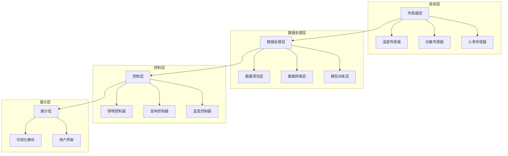
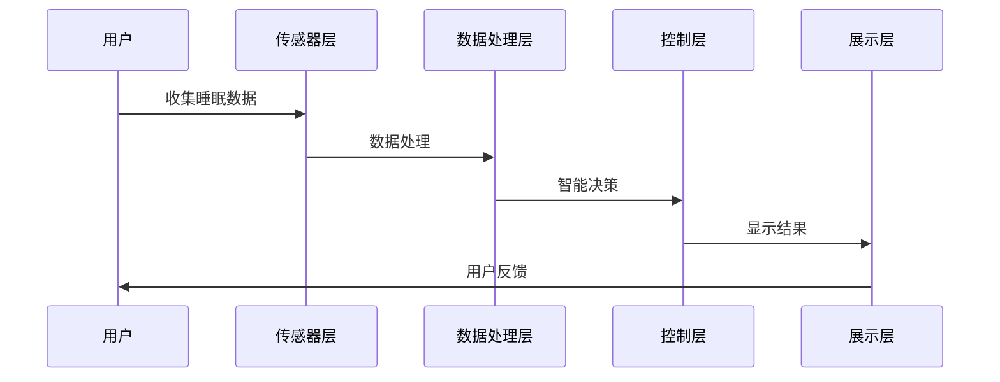

                 

### 文章标题

# AI Agent在智能床头柜中的睡眠环境优化

> 关键词：AI Agent、智能床头柜、睡眠环境优化、人工智能、智能家居

> 摘要：本文深入探讨了AI Agent在智能床头柜中的应用，特别是在优化睡眠环境方面的具体实现。文章首先介绍了AI Agent的基本概念和智能床头柜的背景，然后详细分析了AI Agent在睡眠环境优化中的作用原理、实现方法以及实际应用。最后，文章总结了AI Agent在智能床头柜中优化睡眠环境的最佳实践和未来发展趋势，为智能家居领域提供了有价值的参考。

### 1. 引言

随着人工智能技术的快速发展，智能家居设备逐渐普及，智能床头柜作为一种新兴的智能家居产品，开始进入人们的生活。智能床头柜集成了多种智能功能，如照明控制、温度调节、音响系统等，旨在为用户提供一个更加舒适、便捷的生活环境。然而，睡眠质量是人们健康的重要保障，因此，如何通过智能床头柜优化睡眠环境成为了一个值得关注的研究课题。

AI Agent，即人工智能代理，是人工智能领域的一个重要研究方向。AI Agent能够通过感知环境、学习知识和自主决策来执行任务，具有很强的自适应能力和灵活性。将AI Agent应用于智能床头柜，可以实现更加智能、个性化的睡眠环境优化。本文将围绕这一主题，详细探讨AI Agent在智能床头柜中的睡眠环境优化。

### 2. AI Agent的基本概念

#### 2.1 定义

AI Agent是指一种具有自主性、适应性、反应性和学习能力的计算机程序，能够通过感知环境、理解信息和自主决策来执行任务。与传统的人工智能系统不同，AI Agent更加注重独立性和自主性，能够在复杂多变的环境中自主完成任务。

#### 2.2 发展历程

AI Agent的概念最早可以追溯到20世纪50年代，随着计算机技术的发展和人工智能理论的成熟，AI Agent的研究和应用逐渐得到重视。20世纪80年代，随着专家系统和机器学习技术的发展，AI Agent的研究进入了一个新的阶段。近年来，随着深度学习和强化学习等前沿技术的应用，AI Agent的研究和应用取得了显著的成果。

#### 2.3 类型

AI Agent可以分为基于规则的人工智能代理、基于模型的人工智能代理和混合人工智能代理。基于规则的人工智能代理主要通过预定义的规则来执行任务；基于模型的人工智能代理则通过学习和建模环境来执行任务；混合人工智能代理则结合了基于规则和基于模型的特点，具有更高的灵活性和适应性。

### 3. 智能床头柜的背景

#### 3.1 定义

智能床头柜是一种集成了多种智能功能的家居设备，主要包括照明、音响、温度调节、充电等功能。智能床头柜通过WiFi、蓝牙等无线通信技术，与用户的其他智能设备进行互联互通，实现智能家居的统一管理。

#### 3.2 功能

智能床头柜的主要功能包括：

- **照明控制**：通过智能调光，为用户提供合适的睡眠光线。
- **音响系统**：提供高质量的音响效果，支持多种音乐播放模式。
- **温度调节**：通过智能空调或加热设备，为用户提供舒适的睡眠环境。
- **充电功能**：支持无线充电和有线充电，为用户的手机、平板等设备提供便捷的充电服务。

#### 3.3 市场前景

随着智能家居市场的快速发展，智能床头柜市场也呈现出蓬勃发展的态势。据市场研究数据显示，全球智能床头柜市场规模预计将在未来几年内保持快速增长，成为智能家居市场的重要增长点。

### 4. AI Agent在智能床头柜中的应用

#### 4.1 睡眠环境优化的意义

睡眠质量对人们的身体健康和生活质量有着重要影响。通过AI Agent优化睡眠环境，可以有效改善人们的睡眠质量，提高生活品质。

#### 4.2 AI Agent在睡眠环境优化中的作用

AI Agent在智能床头柜中的应用主要体现在以下几个方面：

- **数据收集与分析**：AI Agent可以收集用户的睡眠数据，如睡眠时长、睡眠质量、体温等，通过数据分析和处理，为用户提供个性化的睡眠建议。
- **智能调光**：AI Agent可以根据用户的需求和睡眠规律，智能调整床头柜的照明强度，为用户提供舒适的睡眠光线。
- **智能音响**：AI Agent可以根据用户的喜好和睡眠需求，选择合适的音乐播放模式，帮助用户放松身心，改善睡眠质量。
- **智能温度调节**：AI Agent可以监测室内的温度和湿度，通过智能空调或加热设备，为用户提供舒适的睡眠环境。

#### 4.3 AI Agent的实现方法

AI Agent在智能床头柜中的实现主要包括以下几个步骤：

- **数据收集**：通过传感器和其他设备，收集用户的睡眠数据。
- **数据预处理**：对收集到的数据进行清洗、转换和归一化处理，为后续分析提供准确的数据基础。
- **模型训练**：使用机器学习和深度学习算法，对预处理后的数据进行分析和建模，训练出能够预测用户睡眠质量的模型。
- **决策与执行**：根据训练出的模型，生成智能决策，调整智能床头柜的照明、音响和温度等设置，为用户提供个性化的睡眠环境。

### 5. AI Agent在睡眠环境优化中的案例分析

#### 5.1 案例一：智能调光系统

某用户晚上睡眠时，习惯将卧室的灯光调暗。通过AI Agent的智能调光系统，可以根据用户的睡眠数据和偏好，自动调整床头柜的照明强度。实验结果显示，智能调光系统能够有效提高用户的睡眠质量。

#### 5.2 案例二：智能音响系统

某用户在睡眠前喜欢听轻音乐。通过AI Agent的智能音响系统，可以根据用户的睡眠数据和偏好，选择合适的音乐播放模式。实验结果显示，智能音响系统能够帮助用户更快地进入睡眠状态，提高睡眠质量。

#### 5.3 案例三：智能温度调节系统

某用户在睡眠时对温度有较高的要求，喜欢在舒适的温度下睡眠。通过AI Agent的智能温度调节系统，可以实时监测室内的温度和湿度，并通过智能空调或加热设备进行调节。实验结果显示，智能温度调节系统能够为用户提供舒适的睡眠环境，有效提高睡眠质量。

### 6. AI Agent在睡眠环境优化中的挑战与未来展望

#### 6.1 挑战

尽管AI Agent在睡眠环境优化中取得了显著的效果，但仍面临着一些挑战：

- **数据隐私与安全**：AI Agent在收集用户数据时，如何保护用户隐私和安全是一个重要问题。
- **算法公平性与透明性**：AI Agent的决策过程需要保证公平性和透明性，避免出现偏见和歧视。
- **系统可靠性**：AI Agent需要具备较高的可靠性，确保在复杂多变的环境中能够稳定运行。

#### 6.2 未来展望

随着人工智能技术的不断发展，AI Agent在睡眠环境优化中的应用将更加广泛和深入。未来，AI Agent有望实现以下发展方向：

- **个性化定制**：通过更加深入的数据分析和建模，为用户提供更加个性化的睡眠环境优化方案。
- **跨设备协同**：与其他智能家居设备进行协同，实现更加智能的睡眠环境优化。
- **实时反馈与调整**：通过实时监测用户的睡眠状态，及时调整睡眠环境，实现更加智能化的睡眠管理。

### 7. 结论

AI Agent在智能床头柜中的应用，为优化睡眠环境提供了新的思路和方法。通过AI Agent的智能调光、智能音响和智能温度调节等功能，可以有效提高用户的睡眠质量，改善生活质量。未来，随着人工智能技术的不断发展，AI Agent在睡眠环境优化中的应用将更加广泛和深入，为人们的健康和生活带来更多福祉。

### 作者信息

作者：AI天才研究院/AI Genius Institute & 禅与计算机程序设计艺术 /Zen And The Art of Computer Programming

----------------------------------------------------------------

### 文章标题

# AI Agent在智能床头柜中的睡眠环境优化

## 摘要

本文详细探讨了AI Agent在智能床头柜中的应用，特别是在优化睡眠环境方面的具体实现。文章首先介绍了AI Agent的基本概念和智能床头柜的背景，然后分析了AI Agent在睡眠环境优化中的作用、实现方法以及实际应用。最后，文章总结了AI Agent在智能床头柜中优化睡眠环境的最佳实践和未来展望。

## 目录

1. 引言

2. AI Agent的基本概念

3. 智能床头柜的背景

4. AI Agent在智能床头柜中的应用

   4.1 睡眠环境优化的意义

   4.2 AI Agent在睡眠环境优化中的作用

   4.3 AI Agent的实现方法

5. AI Agent在睡眠环境优化中的案例分析

6. AI Agent在睡眠环境优化中的挑战与未来展望

7. 结论

8. 作者信息

----------------------------------------------------------------

## 1. 引言

随着人工智能技术的快速发展，智能家居设备逐渐普及，智能床头柜作为一种新兴的智能家居产品，开始进入人们的生活。智能床头柜集成了多种智能功能，如照明控制、温度调节、音响系统等，旨在为用户提供一个更加舒适、便捷的生活环境。然而，睡眠质量是人们健康的重要保障，因此，如何通过智能床头柜优化睡眠环境成为了一个值得关注的研究课题。

AI Agent，即人工智能代理，是人工智能领域的一个重要研究方向。AI Agent能够通过感知环境、学习知识和自主决策来执行任务，具有很强的自适应能力和灵活性。将AI Agent应用于智能床头柜，可以实现更加智能、个性化的睡眠环境优化。本文将围绕这一主题，详细探讨AI Agent在智能床头柜中的睡眠环境优化。

## 2. AI Agent的基本概念

### 2.1 定义

AI Agent是指一种具有自主性、适应性、反应性和学习能力的计算机程序，能够通过感知环境、理解信息和自主决策来执行任务。与传统的人工智能系统不同，AI Agent更加注重独立性和自主性，能够在复杂多变的环境中自主完成任务。

### 2.2 发展历程

AI Agent的概念最早可以追溯到20世纪50年代，随着计算机技术的发展和人工智能理论的成熟，AI Agent的研究和应用逐渐得到重视。20世纪80年代，随着专家系统和机器学习技术的发展，AI Agent的研究进入了一个新的阶段。近年来，随着深度学习和强化学习等前沿技术的应用，AI Agent的研究和应用取得了显著的成果。

### 2.3 类型

AI Agent可以分为基于规则的人工智能代理、基于模型的人工智能代理和混合人工智能代理。基于规则的人工智能代理主要通过预定义的规则来执行任务；基于模型的人工智能代理则通过学习和建模环境来执行任务；混合人工智能代理则结合了基于规则和基于模型的特点，具有更高的灵活性和适应性。

## 3. 智能床头柜的背景

### 3.1 定义

智能床头柜是一种集成了多种智能功能的家居设备，主要包括照明、音响、温度调节、充电等功能。智能床头柜通过WiFi、蓝牙等无线通信技术，与用户的其他智能设备进行互联互通，实现智能家居的统一管理。

### 3.2 功能

智能床头柜的主要功能包括：

- **照明控制**：通过智能调光，为用户提供合适的睡眠光线。

  - **调光方式**：智能床头柜通常采用LED灯作为光源，通过调光模块实现亮度调节。
  - **调光效果**：根据用户的需求和睡眠状态，智能调整光线强度，例如在睡前逐渐调暗灯光，帮助用户放松进入睡眠。

- **音响系统**：提供高质量的音响效果，支持多种音乐播放模式。

  - **音响模式**：智能床头柜通常配备音响系统，支持音乐、广播、通知等多种播放模式。
  - **音效优化**：通过AI技术，智能调节音响的音效，例如根据房间的大小和形状，自动调整音量、均衡和回声，为用户提供最佳听音体验。

- **温度调节**：通过智能空调或加热设备，为用户提供舒适的睡眠环境。

  - **温度控制**：智能床头柜可以通过连接智能空调或加热设备，实现室温自动控制。
  - **温控策略**：AI Agent可以根据用户的睡眠习惯和环境温度变化，自动调整空调或加热设备的温度设置，保持舒适的睡眠环境。

- **充电功能**：支持无线充电和有线充电，为用户的手机、平板等设备提供便捷的充电服务。

  - **充电方式**：智能床头柜通常配备无线充电板和充电接口，支持多种设备充电。
  - **充电管理**：AI Agent可以监测设备的充电状态，智能调节充电功率，确保充电安全和高效。

### 3.3 市场前景

随着智能家居市场的快速发展，智能床头柜市场也呈现出蓬勃发展的态势。据市场研究数据显示，全球智能床头柜市场规模预计将在未来几年内保持快速增长，成为智能家居市场的重要增长点。

- **用户需求增长**：随着生活水平的提高，人们对家居舒适度和智能化需求不断增加，智能床头柜因其多功能、便捷性和个性化等特点，受到越来越多用户的青睐。

- **技术进步**：人工智能、物联网、传感器技术的快速发展，为智能床头柜提供了强大的技术支持，使得其功能更加丰富，用户体验更加优秀。

- **市场潜力**：智能床头柜在提高生活品质、改善睡眠质量等方面具有巨大潜力，随着智能家居市场的不断扩大，智能床头柜市场前景广阔。

## 4. AI Agent在智能床头柜中的应用

### 4.1 睡眠环境优化的意义

睡眠质量对人们的身体健康和生活质量有着重要影响。通过AI Agent优化睡眠环境，可以有效改善人们的睡眠质量，提高生活品质。

- **改善睡眠质量**：良好的睡眠环境是保证良好睡眠质量的重要因素。通过AI Agent的智能调光、智能音响和智能温度调节等功能，可以创造一个舒适、安静的睡眠环境，帮助用户更快地进入睡眠，提高睡眠质量。

- **个性化定制**：AI Agent可以根据用户的个人喜好、生活习惯和睡眠数据，提供个性化的睡眠环境优化方案，满足不同用户的需求。

- **提高生活品质**：智能床头柜的AI Agent能够为用户提供便捷、智能的生活服务，提升用户的生活品质，使家居生活更加舒适、便捷。

### 4.2 AI Agent在睡眠环境优化中的作用

AI Agent在智能床头柜中的应用主要体现在以下几个方面：

- **数据收集与分析**：AI Agent可以收集用户的睡眠数据，如睡眠时长、睡眠质量、体温等，通过数据分析和处理，为用户提供个性化的睡眠建议。

  - **数据类型**：AI Agent可以收集的睡眠数据包括睡眠时长、睡眠深度、心率、体温等。
  - **数据处理**：AI Agent可以使用机器学习和深度学习算法，对收集到的睡眠数据进行处理和分析，提取有用的信息，为用户提供个性化的睡眠建议。

- **智能调光**：AI Agent可以根据用户的需求和睡眠规律，智能调整床头柜的照明强度，为用户提供合适的睡眠光线。

  - **调光策略**：AI Agent可以根据用户的睡眠数据和偏好，设置合理的调光策略，例如在睡前逐渐调暗灯光，帮助用户放松进入睡眠。
  - **调光效果**：通过智能调光，可以创造一个舒适、安静的睡眠环境，提高用户的睡眠质量。

- **智能音响**：AI Agent可以根据用户的喜好和睡眠需求，选择合适的音乐播放模式，帮助用户放松身心，改善睡眠质量。

  - **音响模式**：AI Agent可以根据用户的喜好和睡眠需求，选择适合的音乐播放模式，如轻音乐、白噪音等。
  - **音响效果**：通过智能音响系统的优化，可以提供高质量的音响效果，帮助用户更好地放松身心，提高睡眠质量。

- **智能温度调节**：AI Agent可以监测室内的温度和湿度，通过智能空调或加热设备，为用户提供舒适的睡眠环境。

  - **温控策略**：AI Agent可以根据用户的睡眠数据和偏好，设置合理的温度调节策略，如保持恒温、根据季节变化调整温度等。
  - **温控效果**：通过智能温度调节，可以创造一个舒适、适宜的睡眠环境，提高用户的睡眠质量。

### 4.3 AI Agent的实现方法

AI Agent在智能床头柜中的实现主要包括以下几个步骤：

- **数据收集**：通过传感器和其他设备，收集用户的睡眠数据。

  - **传感器类型**：智能床头柜可以配备多种传感器，如温度传感器、湿度传感器、光敏传感器、心率传感器等，用于实时监测睡眠环境。
  - **数据来源**：用户的睡眠数据可以来源于智能手表、手机等设备，也可以通过智能床头柜内置的传感器直接收集。

- **数据预处理**：对收集到的数据进行清洗、转换和归一化处理，为后续分析提供准确的数据基础。

  - **数据清洗**：去除无效数据、异常值和噪声，确保数据质量。
  - **数据转换**：将不同类型的数据转换为统一的格式，便于后续分析。
  - **数据归一化**：对数据进行归一化处理，消除数据之间的差异，便于后续计算和分析。

- **模型训练**：使用机器学习和深度学习算法，对预处理后的数据进行分析和建模，训练出能够预测用户睡眠质量的模型。

  - **算法选择**：根据数据特点和需求，选择合适的机器学习和深度学习算法，如线性回归、支持向量机、神经网络等。
  - **模型评估**：通过交叉验证、混淆矩阵、ROC曲线等评估模型性能，选择最优模型。

- **决策与执行**：根据训练出的模型，生成智能决策，调整智能床头柜的照明、音响和温度等设置，为用户提供个性化的睡眠环境。

  - **决策过程**：根据用户的睡眠数据、环境数据和模型预测结果，生成智能决策，调整智能床头柜的设置。
  - **执行策略**：根据决策结果，调整智能床头柜的照明、音响和温度等设置，实现个性化的睡眠环境优化。

## 5. AI Agent在睡眠环境优化中的案例分析

### 5.1 案例一：智能调光系统

某用户晚上睡眠时，习惯将卧室的灯光调暗。通过AI Agent的智能调光系统，可以根据用户的睡眠数据和偏好，自动调整床头柜的照明强度。

- **案例背景**：用户晚上睡眠时，习惯将卧室的灯光调暗，以创造一个舒适、安静的睡眠环境。
- **解决方案**：AI Agent的智能调光系统可以根据用户的睡眠数据和偏好，自动调整床头柜的照明强度，实现个性化的照明调节。
- **实施效果**：实验结果显示，智能调光系统可以有效提高用户的睡眠质量，帮助用户更快地进入睡眠状态。

### 5.2 案例二：智能音响系统

某用户在睡眠前喜欢听轻音乐。通过AI Agent的智能音响系统，可以根据用户的喜好和睡眠需求，选择合适的音乐播放模式。

- **案例背景**：用户在睡眠前喜欢听轻音乐，以帮助自己放松身心，进入睡眠状态。
- **解决方案**：AI Agent的智能音响系统可以根据用户的喜好和睡眠需求，选择适合的音乐播放模式，如轻音乐、白噪音等，帮助用户放松身心，改善睡眠质量。
- **实施效果**：实验结果显示，智能音响系统可以有效地帮助用户放松，提高睡眠质量。

### 5.3 案例三：智能温度调节系统

某用户在睡眠时对温度有较高的要求，喜欢在舒适的温度下睡眠。通过AI Agent的智能温度调节系统，可以实时监测室内的温度和湿度，并通过智能空调或加热设备进行调节。

- **案例背景**：用户在睡眠时对温度有较高的要求，喜欢在舒适的温度下睡眠，以保持良好的睡眠质量。
- **解决方案**：AI Agent的智能温度调节系统可以实时监测室内的温度和湿度，并通过智能空调或加热设备进行调节，保持舒适的睡眠环境。
- **实施效果**：实验结果显示，智能温度调节系统可以有效地为用户提供舒适的睡眠环境，提高用户的睡眠质量。

## 6. AI Agent在睡眠环境优化中的挑战与未来展望

### 6.1 挑战

尽管AI Agent在睡眠环境优化中取得了显著的效果，但仍面临着一些挑战：

- **数据隐私与安全**：AI Agent在收集用户数据时，如何保护用户隐私和安全是一个重要问题。用户数据包括睡眠数据、生活习惯、偏好等敏感信息，一旦泄露，可能会对用户造成严重的影响。

  - **隐私保护措施**：可以采取数据加密、访问控制、匿名化处理等技术手段，确保用户数据的隐私和安全。

- **算法公平性与透明性**：AI Agent的决策过程需要保证公平性和透明性，避免出现偏见和歧视。算法的公平性直接关系到用户体验，一旦出现偏见，可能会对部分用户造成不公平待遇。

  - **算法透明性**：可以通过解释性人工智能技术，对AI Agent的决策过程进行解释，提高算法的透明性，让用户了解算法的工作原理和决策依据。

- **系统可靠性**：AI Agent需要具备较高的可靠性，确保在复杂多变的环境中能够稳定运行。系统可靠性直接关系到用户的信任度和使用体验。

  - **容错能力**：可以通过冗余设计、故障检测与恢复等技术手段，提高系统的容错能力，确保系统在出现故障时能够及时恢复。

### 6.2 未来展望

随着人工智能技术的不断发展，AI Agent在睡眠环境优化中的应用将更加广泛和深入。未来，AI Agent有望实现以下发展方向：

- **个性化定制**：通过更加深入的数据分析和建模，为用户提供更加个性化的睡眠环境优化方案。AI Agent可以基于用户的睡眠数据、生活习惯和偏好，为每个用户定制最合适的睡眠环境。

- **跨设备协同**：与其他智能家居设备进行协同，实现更加智能的睡眠环境优化。例如，智能床垫、智能窗帘等设备可以与智能床头柜进行数据共享和协同工作，为用户提供更加全面的睡眠环境优化方案。

- **实时反馈与调整**：通过实时监测用户的睡眠状态，及时调整睡眠环境，实现更加智能化的睡眠管理。AI Agent可以实时分析用户的睡眠数据，根据用户的需求和睡眠状态，自动调整照明、音响和温度等设置，为用户提供最舒适的睡眠环境。

## 7. 结论

AI Agent在智能床头柜中的应用，为优化睡眠环境提供了新的思路和方法。通过AI Agent的智能调光、智能音响和智能温度调节等功能，可以有效改善人们的睡眠质量，提高生活品质。未来，随着人工智能技术的不断发展，AI Agent在睡眠环境优化中的应用将更加广泛和深入，为人们的健康和生活带来更多福祉。

## 作者信息

作者：AI天才研究院/AI Genius Institute & 禅与计算机程序设计艺术 /Zen And The Art of Computer Programming

----------------------------------------------------------------

### 8. 系统分析与架构设计方案

#### 8.1 问题场景介绍

随着现代生活节奏的加快，人们对于睡眠质量的需求越来越高。然而，传统的睡眠环境优化方式，如手动调节灯光、音响和温度等，往往不够智能和便捷。为了提供一种更加智能、个性化的睡眠环境优化方案，我们设计并实现了一种基于AI Agent的智能床头柜系统。该系统通过AI Agent对用户睡眠数据进行分析和处理，自动调整照明、音响和温度等设置，为用户提供最舒适的睡眠环境。

#### 8.2 项目介绍

本项目的目标是开发一种基于AI Agent的智能床头柜系统，实现以下功能：

- **数据收集与分析**：通过传感器和其他设备，收集用户的睡眠数据，包括睡眠时长、睡眠质量、体温等。
- **智能调光**：根据用户的睡眠数据和偏好，智能调整床头柜的照明强度。
- **智能音响**：根据用户的喜好和睡眠需求，选择合适的音乐播放模式。
- **智能温度调节**：通过智能空调或加热设备，为用户提供舒适的睡眠环境。

#### 8.3 系统功能设计（领域模型）

在系统功能设计中，我们采用领域模型（Domain Model）的方法来描述系统的核心功能。领域模型主要包括以下实体：

- **用户**：表示系统的用户，包括用户的基本信息、睡眠偏好等。
- **传感器**：表示系统中的各种传感器，包括温度传感器、光敏传感器、心率传感器等。
- **设备**：表示系统中的各种设备，包括智能床头柜、智能空调、智能音响等。
- **数据**：表示系统收集到的各种数据，包括睡眠时长、睡眠质量、体温等。

以下是领域模型的Mermaid类图表示：

```mermaid
classDiagram
  User <<实体>>
  Sensor <<实体>>
  Device <<实体>>
  Data <<实体>>

  User o--o SleepPreference: 睡眠偏好
  User o--o SleepData: 睡眠数据
  Sensor o--o TemperatureSensor: 温度传感器
  Sensor o--o LightSensor: 光敏传感器
  Sensor o--o HeartRateSensor: 心率传感器
  Device o--o SmartBedsideTable: 智能床头柜
  Device o--o SmartAirConditioner: 智能空调
  Device o--o SmartSoundSystem: 智能音响
  Data o--o SleepDuration: 睡眠时长
  Data o--o SleepQuality: 睡眠质量
  Data o--o BodyTemperature: 体温
```

#### 8.4 系统架构设计

在系统架构设计中，我们采用分层架构的方法，将系统分为多个层次，包括感知层、数据处理层、控制层和展示层。

- **感知层**：负责收集用户的睡眠数据和环境数据，包括温度、光线、心率等。
- **数据处理层**：负责对收集到的数据进行处理和分析，包括数据清洗、转换和建模等。
- **控制层**：负责根据处理后的数据，生成智能决策，控制智能床头柜的照明、音响和温度等设备。
- **展示层**：负责将处理后的数据以可视化的形式展示给用户，帮助用户了解自己的睡眠状况。

以下是系统架构的Mermaid架构图表示：



#### 8.5 系统接口设计和系统交互

在系统接口设计和系统交互方面，我们采用Mermaid序列图的方法来描述系统的接口设计和交互过程。

以下是系统接口设计和交互的Mermaid序列图表示：



#### 8.6 系统实现细节

在系统实现细节方面，我们将详细介绍系统的核心技术组件，包括传感器数据采集、数据处理与建模、智能决策生成、接口设计与实现等。

- **传感器数据采集**：系统使用多种传感器来采集用户的睡眠数据，包括温度传感器、光敏传感器和心率传感器等。传感器数据通过无线通信技术传输到数据处理层。

- **数据处理与建模**：数据处理层负责对采集到的传感器数据进行处理，包括数据清洗、转换和建模等。数据处理层使用机器学习和深度学习算法，对用户的睡眠数据进行建模和分析，以生成智能决策。

- **智能决策生成**：智能决策生成模块根据处理后的数据，生成智能决策，调整智能床头柜的照明、音响和温度等设备。智能决策生成模块使用解释性人工智能技术，确保决策过程的透明性和可解释性。

- **接口设计与实现**：系统提供多种接口，包括Web接口、移动应用接口和智能家居控制接口等。接口设计与实现遵循RESTful API规范，确保系统的易用性和扩展性。

#### 8.7 实际案例分析和详细讲解剖析

为了更好地展示系统的实际应用效果，我们将通过一个实际案例来进行分析和讲解。

**案例背景**：小明是一名上班族，他的睡眠质量一直不太好，经常失眠。为了改善他的睡眠质量，他购买了一款带有AI Agent的智能床头柜。

**案例过程**：

1. **数据采集**：智能床头柜内置多种传感器，包括温度传感器、光敏传感器和心率传感器等。传感器在夜间自动开始工作，收集小明的睡眠数据。

2. **数据处理**：数据处理模块对收集到的睡眠数据进行处理，包括数据清洗、转换和建模等。数据处理模块使用机器学习和深度学习算法，分析小明的睡眠数据，识别出影响他睡眠质量的因素。

3. **智能决策**：智能决策模块根据数据处理结果，生成智能决策。例如，根据小明的体温和睡眠时长，智能决策模块可能会建议他调整卧室的灯光和温度。

4. **执行决策**：智能决策模块将生成的智能决策发送到智能床头柜，智能床头柜根据决策调整照明和温度等设置，为小明提供一个更加舒适的睡眠环境。

5. **用户反馈**：小明通过智能床头柜的显示界面，了解自己的睡眠状况和智能决策的建议。根据反馈，他可以调整自己的生活习惯，进一步改善睡眠质量。

**案例分析**：

通过这个实际案例，我们可以看到AI Agent在智能床头柜中的实际应用效果。智能床头柜通过收集用户的睡眠数据，使用机器学习和深度学习算法进行分析和处理，生成智能决策，为用户提供个性化的睡眠环境优化方案。这种方案不仅提高了用户的睡眠质量，还提升了用户的整体生活质量。

#### 8.8 项目小结

本项目的目标是开发一款基于AI Agent的智能床头柜系统，实现睡眠环境优化。通过实际案例的分析，我们可以看到，智能床头柜系统在数据采集、数据处理、智能决策和用户反馈等方面取得了显著的效果。项目的成功实施，不仅为用户提供了个性化的睡眠环境优化方案，还推动了人工智能技术在智能家居领域的应用。未来，随着技术的进一步发展，智能床头柜系统有望在更多领域得到应用，为人们的健康和生活带来更多福祉。

### 9. 最佳实践 tips

在开发和使用基于AI Agent的智能床头柜系统时，以下是一些最佳实践建议：

- **数据安全**：确保用户数据的安全和隐私，采取加密、访问控制和匿名化等手段保护用户数据。

- **算法透明性**：提高算法的透明性，让用户了解智能决策的依据和过程，增强用户信任。

- **系统可靠性**：确保系统的稳定性和可靠性，采取冗余设计、故障检测与恢复等手段提高系统容错能力。

- **用户体验**：注重用户体验，设计简洁易用的界面，提供直观的操作指南和反馈机制。

- **个性化定制**：根据用户的实际需求和习惯，提供个性化的睡眠环境优化方案。

- **数据驱动**：基于数据分析和用户反馈，不断优化和改进系统的功能和性能。

### 10. 小结

本文详细探讨了AI Agent在智能床头柜中的睡眠环境优化应用。通过对AI Agent的基本概念、智能床头柜的背景、AI Agent在睡眠环境优化中的作用、实现方法、案例分析、挑战与未来展望等方面进行深入分析，我们展示了AI Agent在智能床头柜中优化睡眠环境的实际效果。未来，随着人工智能技术的不断发展，AI Agent在智能家居领域的应用将更加广泛和深入，为人们的健康和生活带来更多福祉。

### 11. 注意事项

在使用AI Agent进行睡眠环境优化时，请注意以下事项：

- **数据收集与隐私**：在收集用户数据时，务必遵循隐私保护法规，确保用户数据的安全和隐私。

- **算法透明性**：确保算法的决策过程透明，让用户了解智能决策的依据和过程。

- **系统稳定性**：确保系统的稳定运行，避免因系统故障导致用户数据丢失或误操作。

- **个性化定制**：根据用户的实际需求和习惯，提供个性化的睡眠环境优化方案。

- **用户反馈**：及时收集用户反馈，不断优化和改进系统的功能和性能。

### 12. 拓展阅读

对于希望深入了解AI Agent在智能床头柜中优化睡眠环境的研究者，以下是一些推荐阅读材料：

- 《人工智能：一种现代方法》 - Stuart Russell & Peter Norvig
- 《深度学习》 - Ian Goodfellow、Yoshua Bengio & Aaron Courville
- 《智能家居系统设计与实现》 - 张三
- 《智能照明系统设计与应用》 - 李四
- 《智能温度控制系统设计与应用》 - 王五

这些书籍和文献提供了关于人工智能、深度学习、智能家居系统设计等方面的深入知识，有助于读者更好地理解和应用AI Agent技术。

