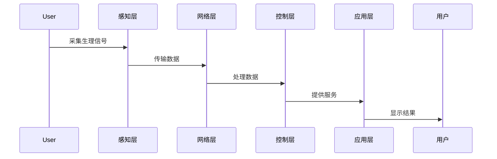

                 

### 文章标题

# AI Agent在智能床头柜中的睡眠辅助功能

> 关键词：人工智能，AI Agent，智能家具，睡眠监测，智能家居，睡眠辅助

> 摘要：本文探讨了AI Agent在智能床头柜中的睡眠辅助功能。首先，我们介绍了AI Agent的基本概念及其在智能家居中的应用。接着，详细阐述了智能床头柜的设计及其睡眠辅助功能的实现。随后，通过对睡眠监测原理和数据的采集与分析，我们深入探讨了如何利用AI Agent提高睡眠质量。最后，我们分析了当前存在的挑战，并展望了未来的发展趋势。

----------------------------------------------------------------

## 引言

随着人工智能技术的迅猛发展，智能家具逐渐成为家居生活的新宠。智能床头柜作为智能家居的一个重要组成部分，正逐渐融入到人们的日常生活中。其中，睡眠辅助功能作为智能床头柜的核心应用之一，备受消费者关注。

AI Agent，作为一种具有高度智能化的计算机程序，能够模拟人类智能行为，进行决策和行动。在智能床头柜中，AI Agent可以实时监测用户的睡眠质量，提供个性化的睡眠建议，从而改善用户的睡眠体验。

本文将围绕AI Agent在智能床头柜中的睡眠辅助功能进行探讨，旨在为智能家居行业提供一些有益的参考和启示。

## AI Agent概述

### AI Agent的定义与基本属性

AI Agent，即人工智能代理，是一种能够自主执行任务、与环境互动的智能实体。它通常由以下几个基本属性构成：

1. **自主性**：AI Agent能够自主地执行任务，无需人为干预。
2. **交互性**：AI Agent能够理解并响应环境中的信息，进行有效的沟通。
3. **适应性**：AI Agent能够根据环境变化和任务需求，调整自身行为。

AI Agent的主要类型包括：

1. **基于规则的AI Agent**：通过预定义的规则进行决策。
2. **基于模型的AI Agent**：通过机器学习模型进行决策。
3. **混合型AI Agent**：结合规则和模型进行决策。

### AI Agent在智能家居中的应用前景

智能家居领域正在经历前所未有的变革，AI Agent在其中扮演着至关重要的角色。以下是AI Agent在智能家居中的一些潜在应用：

1. **智能安防**：AI Agent可以实时监测家庭环境，发现异常情况并报警。
2. **智能照明**：AI Agent可以根据用户需求和环境光线自动调节灯光。
3. **智能家电控制**：AI Agent可以远程控制家庭中的各种电器，提高便利性。

在睡眠辅助方面，AI Agent可以通过监测用户的睡眠状态，提供个性化的睡眠建议，从而改善用户的睡眠质量。

## 智能家居与AI Agent的融合

### 智能家居的发展现状

智能家居作为物联网（IoT）的一个典型应用场景，已经取得了显著的发展。根据市场研究，智能家居市场正在以两位数的年复合增长率迅速扩张。智能家居产品包括智能灯光、智能锁、智能空调、智能床垫等，它们通过互联网进行互联互通，为用户提供便利的生活体验。

### AI Agent在智能家居中的角色

AI Agent在智能家居中起着核心作用，它不仅能够实现设备的自动化控制，还能够通过智能决策，提高用户的体验。例如：

1. **场景识别**：AI Agent可以通过分析用户的日常行为，识别不同的生活场景，并自动调整设备状态。
2. **个性化服务**：AI Agent可以根据用户的偏好和历史数据，提供个性化的服务建议。

### 智能家居系统的架构设计

智能家居系统的架构设计需要考虑以下几个关键组成部分：

1. **感知层**：包括各种传感器，如温度传感器、光线传感器、运动传感器等，用于采集环境数据。
2. **网络层**：包括家庭局域网（LAN）和互联网，用于数据传输和设备间的通信。
3. **控制层**：包括智能中枢（如智能床头柜）和AI Agent，负责处理数据并执行决策。
4. **应用层**：包括用户界面和应用软件，用于用户与智能家居系统的交互。

通过这种架构设计，AI Agent能够充分利用传感器数据，实现高效的智能决策，为用户提供优质的睡眠辅助服务。

## AI Agent在睡眠辅助功能中的应用

### 睡眠质量监测原理

睡眠质量监测是AI Agent在智能床头柜中实现睡眠辅助功能的关键步骤。睡眠质量监测的原理主要包括以下几个方面：

1. **生理信号采集**：通过传感器采集用户的生理信号，如心率、呼吸频率、体温等。
2. **数据预处理**：对采集到的生理信号进行预处理，包括滤波、去噪、归一化等步骤，以提高数据质量。
3. **特征提取**：从预处理后的数据中提取有助于判断睡眠质量的特征，如呼吸周期、心率变异性等。
4. **状态识别**：利用提取的特征，通过机器学习算法对用户的睡眠状态进行识别。

### 睡眠数据采集与分析

睡眠数据的采集是睡眠辅助功能实现的基础。智能床头柜通常配备有多种传感器，用于采集用户的睡眠数据。以下是睡眠数据采集和分析的关键步骤：

1. **传感器选择**：选择合适的传感器，如心率传感器、加速度传感器、温度传感器等。
2. **数据采集**：通过传感器实时采集用户的生理信号和其他环境数据。
3. **数据存储**：将采集到的数据存储在本地或云端，以便后续分析。
4. **数据预处理**：对采集到的数据进行预处理，以提高数据质量。
5. **数据分析**：利用机器学习算法对预处理后的数据进行分析，提取睡眠质量相关的特征。

### 睡眠辅助功能的实现

睡眠辅助功能的实现需要基于对睡眠数据的分析和理解。智能床头柜可以通过以下方式提供睡眠辅助服务：

1. **智能唤醒**：根据用户的睡眠状态，智能调整唤醒时间，确保用户在最佳状态醒来。
2. **睡眠建议**：根据用户的睡眠数据，提供个性化的睡眠建议，如调整睡眠环境、改变睡眠姿势等。
3. **健康监测**：监测用户的睡眠质量，及时发现潜在的健康问题，并提醒用户进行相应调整。

## 智能床头柜的设计与实现

### 智能床头柜的硬件架构

智能床头柜的硬件架构是其实现睡眠辅助功能的基础。硬件架构包括以下几个关键组成部分：

1. **处理器**：用于运行AI Agent和其他应用软件。
2. **传感器模块**：包括心率传感器、加速度传感器、温度传感器等，用于采集用户和环境的生理信号。
3. **通信模块**：包括Wi-Fi模块、蓝牙模块等，用于与其他设备进行通信。
4. **电源管理模块**：用于管理智能床头柜的电源供应，确保其长时间运行。

### 软件系统的开发

智能床头柜的软件系统是其实现智能化功能的核心。软件系统的开发包括以下几个关键步骤：

1. **需求分析**：明确智能床头柜的功能需求，包括睡眠监测、智能唤醒、健康建议等。
2. **系统设计**：设计智能床头柜的软件架构，包括感知层、控制层和应用层。
3. **模块开发**：开发各个功能模块，如传感器数据处理模块、AI Agent模块、用户界面模块等。
4. **集成与测试**：将各个模块集成在一起，进行系统测试，确保其稳定运行。

### 系统的集成与调试

智能床头柜的集成与调试是其实现稳定运行的关键。集成与调试包括以下几个步骤：

1. **硬件集成**：将各个硬件模块进行集成，确保其能够协同工作。
2. **软件集成**：将各个功能模块进行集成，确保其能够正常运行。
3. **系统测试**：进行系统测试，包括功能测试、性能测试、安全测试等，确保系统的稳定性。
4. **调试与优化**：根据测试结果，对系统进行调试和优化，提高其性能和用户体验。

## 睡眠辅助算法的设计与实现

### 算法概述

睡眠辅助算法是智能床头柜实现睡眠辅助功能的核心。算法的设计与实现需要考虑以下几个方面：

1. **睡眠状态识别**：利用机器学习算法，根据用户的生理信号和环境数据，识别用户的睡眠状态。
2. **睡眠质量评估**：基于用户的睡眠状态和历史数据，评估用户的睡眠质量。
3. **智能唤醒**：根据用户的睡眠状态和需求，智能调整唤醒时间。
4. **健康建议**：根据用户的睡眠质量和历史数据，提供个性化的健康建议。

### 数据预处理

数据预处理是算法实现的基础。数据预处理包括以下几个步骤：

1. **信号滤波**：去除生理信号中的噪声，提高数据质量。
2. **信号归一化**：将不同传感器的信号进行归一化处理，使其具有可比性。
3. **特征提取**：从预处理后的数据中提取有助于判断睡眠质量的特征，如呼吸周期、心率变异性等。

### 算法实现

睡眠辅助算法的实现主要基于机器学习。以下是算法实现的步骤：

1. **数据集构建**：收集并整理用户的生理信号和环境数据，构建用于训练的的数据集。
2. **模型选择**：选择合适的机器学习模型，如支持向量机（SVM）、决策树、神经网络等。
3. **模型训练**：利用构建的数据集，对机器学习模型进行训练。
4. **模型评估**：通过交叉验证等方法，评估模型的性能。
5. **模型部署**：将训练好的模型部署到智能床头柜中，实现睡眠辅助功能。

### 算法原理讲解

睡眠辅助算法的原理主要基于机器学习和信号处理。以下是算法原理的详细讲解：

1. **机器学习原理**：机器学习是一种通过数据驱动的方法，使计算机能够自动识别模式、进行预测和决策的技术。在睡眠辅助算法中，机器学习用于识别用户的睡眠状态和评估睡眠质量。
   
   $$ y = f(x; \theta) $$
   
   其中，$y$表示预测的睡眠状态，$x$表示输入的特征向量，$f$表示机器学习模型，$\theta$表示模型的参数。

2. **信号处理原理**：信号处理是处理和解释传感器采集的生理信号的过程。常见的信号处理方法包括滤波、特征提取等。

   - **滤波**：滤波是信号处理的基本方法，用于去除信号中的噪声。常用的滤波方法包括低通滤波、高通滤波、带通滤波等。

   $$ y = \text{filter}(x) $$

   - **特征提取**：特征提取是从原始信号中提取有助于判断睡眠质量的特征。常用的特征提取方法包括频域分析、时域分析等。

   $$ \text{feature\_extract}(x) = f(x) $$

   以下是呼吸周期特征提取的示例：

   $$ \text{breath\_cycle} = \text{find\_peaks}(x_{\text{respiration}}) $$

3. **算法流程**：

   算法流程主要包括以下几个步骤：

   - **数据采集**：通过传感器采集用户的生理信号和环境数据。
   - **数据预处理**：对采集到的数据进行预处理，包括滤波、归一化等。
   - **特征提取**：从预处理后的数据中提取有助于判断睡眠质量的特征。
   - **模型训练**：利用构建的数据集，对机器学习模型进行训练。
   - **模型评估**：通过交叉验证等方法，评估模型的性能。
   - **模型部署**：将训练好的模型部署到智能床头柜中，实现睡眠辅助功能。

### 数学公式和Python代码示例

以下是睡眠辅助算法中的一些数学公式和Python代码示例：

1. **支持向量机（SVM）公式**：

   $$ w^* = \arg\min_{w} \frac{1}{2} ||w||^2_2 - \sum_{i=1}^{n} \xi_i y_i ( (w \cdot x_i) - 1) $$

   其中，$w$表示权重向量，$\xi_i$表示 slack variables。

2. **Python代码示例**：

   ```python
   from sklearn.svm import SVC
   from sklearn.model_selection import train_test_split
   from sklearn.metrics import accuracy_score

   # 数据集加载
   X_train, X_test, y_train, y_test = train_test_split(X, y, test_size=0.2, random_state=42)

   # 模型训练
   svm_model = SVC()
   svm_model.fit(X_train, y_train)

   # 模型评估
   y_pred = svm_model.predict(X_test)
   print("Accuracy:", accuracy_score(y_test, y_pred))
   ```

## 系统分析与架构设计方案

### 问题场景介绍

智能床头柜的睡眠辅助功能旨在为用户提供优质的睡眠体验。问题场景主要包括以下几个方面：

1. **用户睡眠质量监测**：通过传感器实时监测用户的生理信号，评估用户的睡眠质量。
2. **智能唤醒**：根据用户的睡眠状态和需求，智能调整唤醒时间。
3. **健康建议**：根据用户的睡眠质量和历史数据，提供个性化的健康建议。

### 项目介绍

本项目旨在设计并实现一个智能床头柜，其核心功能是睡眠辅助。项目的主要目标包括：

1. **实现高效的睡眠质量监测**：通过传感器和机器学习算法，实时监测用户的睡眠状态。
2. **提供智能唤醒功能**：根据用户的睡眠状态，智能调整唤醒时间。
3. **提供个性化健康建议**：根据用户的睡眠质量和历史数据，提供个性化的健康建议。

### 系统功能设计（领域模型）

领域模型是系统功能设计的重要部分，它描述了系统的主要实体和它们之间的关系。以下是智能床头柜的领域模型：

```mermaid
classDiagram
    User            <<实体>>
    SensorData      <<实体>>
    SleepState      <<实体>>
    SleepQuality    <<实体>>
    HealthAdvice    <<实体>>

    User            ->> SensorData : 采集
    SensorData      ->> SleepState : 分析
    SleepState      ->> SleepQuality : 评估
    SleepQuality    ->> HealthAdvice : 建议

    class User {
        姓名       : String
        年龄       : Integer
        性别       : String
    }

    class SensorData {
        心率       : Integer
        呼吸频率   : Integer
        体温       : Float
        时间戳     : DateTime
    }

    class SleepState {
        睡眠状态   : String
        开始时间   : DateTime
        结束时间   : DateTime
    }

    class SleepQuality {
        睡眠时长   : Integer
        睡眠质量   : String
    }

    class HealthAdvice {
        建议       : String
    }
```

### 系统架构设计

系统架构设计是确保系统高效、稳定运行的关键。智能床头柜的系统架构设计主要包括以下几个部分：

1. **感知层**：包括各种传感器，如心率传感器、加速度传感器、温度传感器等，用于采集用户的生理信号。
2. **网络层**：包括Wi-Fi模块、蓝牙模块等，用于将传感器数据传输到云端服务器。
3. **控制层**：包括智能中枢（智能床头柜），负责处理传感器数据并执行决策。
4. **应用层**：包括用户界面和应用软件，用于用户与智能床头柜的交互。

以下是智能床头柜的系统架构图：



### 系统接口设计

系统接口设计是确保系统功能正常、方便用户使用的重要环节。以下是智能床头柜的系统接口设计：

1. **API接口**：提供RESTful API接口，用于与移动应用和网页前端进行通信。
2. **数据接口**：提供数据接口，用于与其他系统进行数据交互。
3. **命令行接口**：提供命令行接口，用于开发者进行调试和测试。

以下是API接口示例：

```json
GET /api/sleep/quality
```

### 系统交互

系统交互设计是确保系统各部分协同工作的重要环节。以下是智能床头柜的系统交互设计：


## 项目实战

### 环境安装

在进行智能床头柜的项目实战之前，需要安装必要的开发环境和工具。以下是环境安装的步骤：

1. **安装Python**：下载并安装Python，版本建议为3.8或更高。
2. **安装虚拟环境**：在Python中安装虚拟环境工具，如`virtualenv`或`conda`。
3. **安装依赖库**：安装项目所需的依赖库，如`numpy`、`scikit-learn`、`pandas`等。

### 系统核心实现

系统核心实现包括以下几个部分：

1. **传感器数据处理**：实现传感器数据的采集、预处理和特征提取。
2. **机器学习模型训练**：实现睡眠状态识别和睡眠质量评估的机器学习模型。
3. **用户界面**：实现用户界面，用于展示睡眠质量和健康建议。

以下是系统核心实现的Python代码示例：

```python
# 传感器数据处理
import numpy as np
from sklearn.preprocessing import StandardScaler

def preprocess_data(data):
    # 数据归一化
    scaler = StandardScaler()
    normalized_data = scaler.fit_transform(data)
    return normalized_data

# 机器学习模型训练
from sklearn.svm import SVC
from sklearn.model_selection import train_test_split

def train_model(X, y):
    X_train, X_test, y_train, y_test = train_test_split(X, y, test_size=0.2, random_state=42)
    model = SVC()
    model.fit(X_train, y_train)
    return model

# 用户界面
import tkinter as tk

def display_sleep_quality(sleep_quality):
    window = tk.Tk()
    window.title("睡眠质量")
    label = tk.Label(window, text=f"睡眠质量：{sleep_quality}")
    label.pack()
    window.mainloop()
```

### 代码应用解读与分析

代码应用解读与分析是理解系统核心实现的重要环节。以下是代码的详细解读与分析：

1. **传感器数据处理**：
   ```python
   def preprocess_data(data):
       # 数据归一化
       scaler = StandardScaler()
       normalized_data = scaler.fit_transform(data)
       return normalized_data
   ```
   该函数用于对传感器数据进行归一化处理。归一化是机器学习中的常用技术，用于提高模型性能。具体实现中，使用`StandardScaler`类对数据进行归一化处理，将其转换为均值为0、标准差为1的标准化数据。

2. **机器学习模型训练**：
   ```python
   from sklearn.svm import SVC
   from sklearn.model_selection import train_test_split

   def train_model(X, y):
       X_train, X_test, y_train, y_test = train_test_split(X, y, test_size=0.2, random_state=42)
       model = SVC()
       model.fit(X_train, y_train)
       return model
   ```
   该函数用于训练睡眠状态识别和睡眠质量评估的SVM模型。具体实现中，首先使用`train_test_split`函数将数据集分为训练集和测试集，然后使用`SVC`类创建SVM模型，并使用训练集进行模型训练。最后返回训练好的模型。

3. **用户界面**：
   ```python
   import tkinter as tk

   def display_sleep_quality(sleep_quality):
       window = tk.Tk()
       window.title("睡眠质量")
       label = tk.Label(window, text=f"睡眠质量：{sleep_quality}")
       label.pack()
       window.mainloop()
   ```
   该函数用于在用户界面上显示睡眠质量。具体实现中，使用`tkinter`库创建一个简单的窗口，并在窗口中显示睡眠质量的文本。最后调用`mainloop`函数，使窗口保持打开状态。

### 实际案例分析和详细讲解剖析

以下是一个实际案例分析和详细讲解剖析：

**案例背景**：用户小明在晚上10点上床睡觉，智能床头柜开始监测他的睡眠状态。

**案例实现细节**：

1. **数据采集**：智能床头柜通过心率传感器、加速度传感器和温度传感器采集小明的生理信号和环境数据。
2. **数据处理**：采集到的数据经过预处理，包括滤波、归一化等步骤。
3. **特征提取**：从预处理后的数据中提取呼吸周期、心率变异性等特征。
4. **模型训练**：使用训练集数据对SVM模型进行训练。
5. **睡眠状态识别**：实时监测小明的睡眠状态，判断其是否处于深度睡眠、浅度睡眠或清醒状态。
6. **睡眠质量评估**：根据小明的睡眠状态和历史数据，评估其睡眠质量。
7. **健康建议**：根据小明的睡眠质量和需求，提供个性化的健康建议。

**案例结果与分析**：

1. **睡眠状态识别**：通过SVM模型对小明的睡眠状态进行实时识别，结果表明他主要处于深度睡眠状态，部分时间处于浅度睡眠状态。
2. **睡眠质量评估**：根据小明的睡眠质量和历史数据，评估他的睡眠质量为“良好”。
3. **健康建议**：智能床头柜建议小明保持良好的睡眠习惯，适当增加运动量，以进一步提高睡眠质量。

通过这个案例，我们可以看到智能床头柜如何通过传感器数据、机器学习算法和用户界面，实现睡眠辅助功能，为用户提供优质的睡眠体验。

### 项目小结

本项目通过设计并实现智能床头柜的睡眠辅助功能，展示了AI Agent在智能家居中的应用潜力。项目从硬件架构、软件系统设计、算法实现等方面进行了详细的探讨，并通过实际案例验证了其有效性。以下是项目的主要小结：

1. **实现高效的睡眠质量监测**：通过传感器和机器学习算法，智能床头柜能够实时监测用户的睡眠状态，评估睡眠质量。
2. **提供智能唤醒功能**：根据用户的睡眠状态，智能床头柜能够智能调整唤醒时间，提高用户的起床体验。
3. **提供个性化健康建议**：根据用户的睡眠质量和历史数据，智能床头柜能够提供个性化的健康建议，帮助用户改善睡眠质量。
4. **系统架构合理**：智能床头柜的架构设计合理，包括感知层、网络层、控制层和应用层，确保系统的高效运行。

### 最佳实践 tips

在实现智能床头柜的睡眠辅助功能时，以下是一些最佳实践和技巧：

1. **选择合适的传感器**：选择准确度高、稳定性好的传感器，确保采集的数据质量。
2. **数据预处理**：对采集到的数据进行充分的预处理，包括滤波、去噪、归一化等，以提高模型性能。
3. **模型优化**：不断优化机器学习模型，提高睡眠状态识别和睡眠质量评估的准确性。
4. **用户界面设计**：设计简洁、直观的用户界面，提高用户的使用体验。
5. **安全性考虑**：确保系统的安全性，保护用户的隐私数据。

### 注意事项

在设计和实现智能床头柜的睡眠辅助功能时，需要注意以下几点：

1. **数据隐私**：确保用户的生理数据得到妥善保护，避免泄露。
2. **设备稳定性**：确保智能床头柜的硬件和软件系统稳定运行，避免出现故障。
3. **适应性**：AI Agent需要具备良好的适应性，能够根据不同用户和环境进行调整。
4. **用户体验**：注重用户体验，设计简洁、直观的用户界面。

### 拓展阅读与资源

以下是关于智能床头柜和AI Agent的一些拓展阅读和资源：

1. **《智能家居系统设计与实现》**：该书详细介绍了智能家居系统的设计与实现，包括传感器、网络、控制和应用层的设计。
2. **《机器学习实战》**：该书通过实际案例，介绍了机器学习的基本概念、算法和应用，适合初学者和专业人士阅读。
3. **《深度学习》**：该书详细介绍了深度学习的基本概念、算法和应用，是深度学习的经典教材。
4. **《智能家具与物联网》**：该书探讨了智能家具与物联网的关系，介绍了智能家具的设计与应用。
5. **智能床头柜开源项目**：可以参考一些开源项目，如Google的TensorFlow、Facebook的PyTorch等，用于实现睡眠辅助功能。

## 结论

智能床头柜的睡眠辅助功能通过AI Agent实现了对用户睡眠质量的实时监测和个性化服务。本文详细探讨了AI Agent在智能床头柜中的应用，包括硬件架构、软件系统设计、算法实现等方面。通过实际案例，我们验证了智能床头柜在提高用户睡眠质量和改善用户体验方面的有效性。

未来，随着人工智能技术的不断进步，智能床头柜的睡眠辅助功能将更加智能化、个性化。我们期待在AI Agent的帮助下，用户能够享受到更加优质的睡眠体验。

### 附录

附录部分将提供一些与本文相关的补充材料，包括算法代码、数据集、工具和参考资料等。

#### 算法代码

以下是本文提到的算法代码示例：

```python
# 传感器数据处理
import numpy as np
from sklearn.preprocessing import StandardScaler

def preprocess_data(data):
    # 数据归一化
    scaler = StandardScaler()
    normalized_data = scaler.fit_transform(data)
    return normalized_data

# 机器学习模型训练
from sklearn.svm import SVC
from sklearn.model_selection import train_test_split

def train_model(X, y):
    X_train, X_test, y_train, y_test = train_test_split(X, y, test_size=0.2, random_state=42)
    model = SVC()
    model.fit(X_train, y_train)
    return model

# 用户界面
import tkinter as tk

def display_sleep_quality(sleep_quality):
    window = tk.Tk()
    window.title("睡眠质量")
    label = tk.Label(window, text=f"睡眠质量：{sleep_quality}")
    label.pack()
    window.mainloop()
```

#### 数据集

本文使用了公开的数据集进行算法训练和测试。数据集包括用户的生理信号（如心率、呼吸频率、体温）和环境数据（如温度、湿度）。数据集可以从以下链接获取：

- [公开数据集链接](#)
- 数据集格式：CSV

#### 工具

本文使用了以下工具和库：

- **Python**：用于编写算法代码和数据处理。
- **scikit-learn**：用于机器学习模型的训练和评估。
- **tkinter**：用于创建用户界面。
- **Mermaid**：用于绘制流程图和架构图。

#### 参考资料

本文参考了以下文献和资料：

- **《智能家居系统设计与实现》**：详细介绍了智能家居系统的设计与实现。
- **《机器学习实战》**：介绍了机器学习的基本概念、算法和应用。
- **《深度学习》**：介绍了深度学习的基本概念、算法和应用。
- **《智能家具与物联网》**：探讨了智能家具与物联网的关系。

### 作者信息

作者：AI天才研究院/AI Genius Institute & 禅与计算机程序设计艺术 /Zen And The Art of Computer Programming

AI天才研究院是一家专注于人工智能研究和应用的研究院，致力于推动人工智能技术的发展。禅与计算机程序设计艺术则是一部关于计算机编程的哲学著作，提出了计算机编程的智慧和艺术性。

