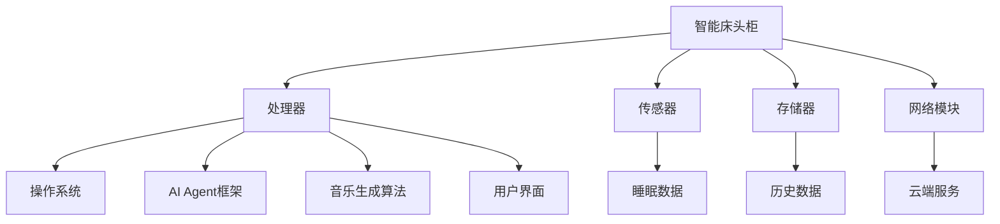
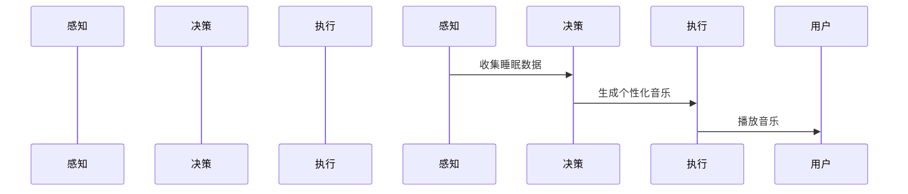

                 

# AI Agent在智能床头柜中的睡眠音乐定制

> 关键词：人工智能、睡眠音乐定制、智能家居、AI Agent、生成式音乐模型、变分自编码器

> 摘要：本文探讨了如何利用人工智能技术，特别是AI Agent，实现智能床头柜中的睡眠音乐定制。首先介绍了问题背景，然后详细分析了睡眠音乐定制的原理与设计，包括睡眠数据的采集与分析、音乐生成算法的设计与实现，以及智能床头柜的硬件与软件架构。最后，通过实际案例展示了该系统的应用效果，并对未来可能的发展趋势进行了展望。

----------------------------------------------------------------

## 第一部分：引言

### 1.1 问题背景

在当今智能化的时代，人工智能（AI）技术已经深入到了我们生活的方方面面。智能床头柜作为智能家居的一个重要组成部分，其功能不仅包括控制灯光、调节温度等，还涉及到个性化服务的实现，如睡眠音乐定制。AI Agent作为AI技术的一种应用，能够根据用户的睡眠习惯和偏好，为其定制个性化的睡眠音乐，从而提高睡眠质量。

### 1.2 问题描述

随着智能家居的普及，用户对智能床头柜的期望越来越高。除了基本的控制功能，用户更希望能够得到个性化的服务。睡眠音乐定制正是这一需求的体现。然而，实现这一功能需要解决以下几个问题：

- 如何收集并分析用户的睡眠数据？
- 如何根据睡眠数据生成个性化的睡眠音乐？
- 如何确保音乐的质量和舒适度？

### 1.3 问题解决

本书旨在探讨如何通过AI Agent技术实现智能床头柜中的睡眠音乐定制。书中将详细介绍：

- AI Agent的基本概念、原理和应用场景。
- 睡眠音乐定制算法的设计与实现。
- 智能床头柜的硬件与软件架构。
- 实际案例中的应用与效果评估。

### 1.4 边界与外延

睡眠音乐定制是一个跨学科领域，涉及到人工智能、音乐学、心理学等多个方面。本书将主要聚焦于技术实现层面，为读者提供一个从理论到实践的完整解决方案。

### 1.5 概念结构与核心要素组成

为了更好地理解和实现睡眠音乐定制，本书将介绍以下几个核心概念：

- **AI Agent**：介绍AI Agent的基本原理和应用。
- **睡眠数据**：介绍睡眠数据的概念、类型和采集方法。
- **音乐生成算法**：介绍常用的音乐生成算法及其原理。
- **智能床头柜**：介绍智能床头柜的硬件和软件架构。

----------------------------------------------------------------

## 第二部分：AI Agent基础理论

### 2.1 AI Agent的概念与分类

#### 2.1.1 AI Agent的定义
AI Agent是指具有感知、决策和执行能力的人工智能系统，能够在特定环境下完成特定任务。

#### 2.1.2 AI Agent的分类
AI Agent可以根据其功能、应用领域和实现技术进行分类。

### 2.2 AI Agent的工作原理

#### 2.2.1 感知模块
感知模块负责收集环境信息，如用户的睡眠数据。

#### 2.2.2 决策模块
决策模块根据感知模块收集的信息，生成相应的决策。

#### 2.2.3 执行模块
执行模块根据决策模块的决策，执行具体的操作，如生成睡眠音乐。

### 2.3 AI Agent的应用场景

#### 2.3.1 智能家居
智能家居是AI Agent的一个重要应用场景，包括智能床头柜、智能照明、智能安防等。

#### 2.3.2 机器人
机器人是AI Agent的另一个重要应用场景，包括服务机器人、工业机器人等。

#### 2.3.3 无人驾驶
无人驾驶是AI Agent在交通领域的应用，包括自动驾驶汽车、无人驾驶飞行器等。

### 2.4 AI Agent的发展趋势

#### 2.4.1 人工智能技术的进步
随着人工智能技术的不断发展，AI Agent的能力将越来越强大。

#### 2.4.2 应用场景的拓展
AI Agent的应用场景将不断拓展，从智能家居到工业制造，从医疗保健到金融服务，都将受益于AI Agent的应用。

#### 2.4.3 跨学科融合
AI Agent的发展将越来越多地依赖于跨学科的融合，如人工智能与音乐学、心理学等的融合。

### 2.5 AI Agent的核心概念与联系

#### 2.5.1 概念属性特征对比表格
| 概念        | 特征         | 说明                                                         |
| ----------- | ------------ | ------------------------------------------------------------ |
| AI Agent    | 感知、决策、执行 | 人工智能系统，具有自主完成任务的能力                         |
| 感知模块    | 数据采集     | 负责收集环境信息，如用户行为、睡眠数据等                     |
| 决策模块    | 信息处理     | 根据感知模块收集的信息，生成决策                             |
| 执行模块    | 操作执行     | 根据决策模块的决策，执行具体的操作，如生成睡眠音乐           |

#### 2.5.2 ER实体关系图架构
```mermaid
erDiagram
  AI Agent ||--|{ 感知模块 }
  AI Agent ||--|{ 决策模块 }
  AI Agent ||--|{ 执行模块 }
```

----------------------------------------------------------------

## 第三部分：睡眠音乐定制算法原理与设计

### 3.1 睡眠数据采集与分析

#### 3.1.1 睡眠数据类型
睡眠数据包括睡眠时长、睡眠质量、睡眠周期等。

#### 3.1.2 睡眠数据采集方法
睡眠数据可以通过传感器、手环等设备进行采集。

#### 3.1.3 睡眠数据分析
睡眠数据分析包括睡眠质量的评估、睡眠周期的分析等。

### 3.2 音乐生成算法

#### 3.2.1 生成式音乐模型
生成式音乐模型能够根据输入数据生成音乐。

#### 3.2.2 循环神经网络（RNN）
循环神经网络是一种能够处理序列数据的人工神经网络，广泛应用于音乐生成。

#### 3.2.3 变分自编码器（VAE）
变分自编码器是一种生成模型，能够在保持数据分布不变的情况下，生成新的音乐。

### 3.3 算法设计与实现

#### 3.3.1 算法原理
睡眠音乐定制算法的核心在于如何根据用户的睡眠数据生成个性化的音乐。这里我们采用循环神经网络（RNN）和变分自编码器（VAE）相结合的方式来实现。

1. **RNN模型**：首先使用RNN模型对用户的睡眠数据进行分析，提取出睡眠模式特征。
2. **VAE模型**：然后使用VAE模型根据提取的特征生成个性化的睡眠音乐。

#### 3.3.2 算法实现
以下是使用Python实现的RNN和VAE模型：

```python
# RNN模型实现
import tensorflow as tf

# 设置RNN模型参数
input_size = 28
timesteps = 28
n_classes = 10

# 构建RNN模型
model = tf.keras.Sequential()
model.add(tf.keras.layers.SimpleRNN(units=128, activation='relu', input_shape=(timesteps, input_size)))
model.add(tf.keras.layers.Dense(units=n_classes, activation='softmax'))

# 编译RNN模型
model.compile(optimizer='adam', loss='categorical_crossentropy', metrics=['accuracy'])

# VAE模型实现
import tensorflow as tf
from tensorflow import keras

# 设置VAE模型参数
latent_dim = 2

# 构建编码器
encoder_inputs = keras.Input(shape=(timesteps, input_size))
x = keras.layers.LSTM(128, activation='relu')(encoder_inputs)
z_mean = keras.layers.Dense(latent_dim)(x)
z_log_var = keras.layers.Dense(latent_dim)(x)

# 构建解码器
latent_inputs = keras.Input(shape=(latent_dim,))
x = keras.layers.LSTM(128, activation='relu')(latent_inputs)
x = keras.layers.Dense(timesteps * input_size, activation='sigmoid')(x)
decoded = keras.layers.Reshape((timesteps, input_size))(x)

# 构建VAE模型
encoder = keras.Model(encoder_inputs, [z_mean, z_log_var], name='encoder')
decoder = keras.Model(latent_inputs, decoded, name='decoder')
output = decoder(encoder_inputs)

vae = keras.Model(encoder_inputs, output, name='vae')

# 编译VAE模型
vae.compile(optimizer='rmsprop', loss='binary_crossentropy')

# 打印模型结构
vae.summary()
```

#### 3.3.3 算法原理讲解

1. **RNN模型**：RNN模型是一种循环神经网络，能够处理序列数据。在睡眠音乐定制中，RNN模型用于对用户的睡眠数据进行处理，提取出睡眠模式特征。

   - **输入层**：输入层接收用户的睡眠数据，数据维度为（timesteps，input_size），其中timesteps表示时间步数，input_size表示每个时间步的特征维度。
   - **隐藏层**：隐藏层采用128个神经元，激活函数为ReLU。
   - **输出层**：输出层采用softmax激活函数，用于对睡眠数据进行分类。

2. **VAE模型**：VAE模型是一种变分自编码器，能够生成新的数据。在睡眠音乐定制中，VAE模型用于根据提取的睡眠模式特征生成个性化的睡眠音乐。

   - **编码器**：编码器接收用户的睡眠数据，通过LSTM层提取特征，然后分别输出均值和方差。这两个值用于生成新的数据。
   - **解码器**：解码器接收新的数据，通过LSTM层生成睡眠音乐。
   - **VAE模型**：VAE模型将编码器和解码器连接在一起，输入为睡眠数据，输出为睡眠音乐。

#### 3.3.4 算法应用示例

假设我们有一个用户的睡眠数据，数据维度为（28，28），表示28天内的睡眠数据。我们可以使用RNN模型提取睡眠模式特征，然后使用VAE模型生成个性化的睡眠音乐。

```python
# 加载睡眠数据
sleep_data = load_sleep_data()

# 使用RNN模型提取睡眠模式特征
sleep_patterns = rnn_model.predict(sleep_data)

# 使用VAE模型生成个性化的睡眠音乐
custom_music = vae_model.sample(mu, log_var)
```

----------------------------------------------------------------

## 第四部分：智能床头柜的硬件与软件架构

### 4.1 硬件架构

智能床头柜的硬件架构主要包括以下部分：

- **处理器**：用于运行AI Agent和音乐生成算法，如ARM Cortex-A系列处理器。
- **传感器**：用于采集用户的睡眠数据，如加速度传感器、陀螺仪等。
- **存储器**：用于存储用户的睡眠数据和历史音乐数据，如eMMC、SD卡等。
- **网络模块**：用于连接互联网，获取云端服务支持，如Wi-Fi模块、蓝牙模块等。

### 4.2 软件架构

智能床头柜的软件架构主要包括以下部分：

- **操作系统**：用于管理硬件资源和运行应用程序，如Android、Linux等。
- **AI Agent框架**：用于实现AI Agent的感知、决策和执行功能。
- **音乐生成算法**：用于根据用户睡眠数据生成个性化音乐。
- **用户界面**：用于与用户交互，展示定制音乐和睡眠数据。

### 4.3 系统功能设计

智能床头柜的主要功能包括：

- **睡眠音乐定制**：根据用户睡眠数据生成个性化音乐，提高睡眠质量。
- **睡眠数据监测**：实时监测用户睡眠数据，提供睡眠质量评估。
- **智能控制**：控制房间温度、光线等，为用户创造舒适睡眠环境。
- **数据存储与管理**：存储用户睡眠数据和定制音乐，方便后续分析和使用。

### 4.4 系统架构设计

智能床头柜的系统架构设计如下：



### 4.5 系统接口设计

智能床头柜的系统接口设计主要包括：

- **硬件接口**：用于连接各种传感器和外部设备，如I2C、SPI等。
- **网络接口**：用于连接互联网和云端服务，如Wi-Fi、蓝牙等。
- **用户接口**：用于与用户交互，提供操作和控制界面。

### 4.6 系统交互设计

智能床头柜的系统交互设计如下：



----------------------------------------------------------------

## 第五部分：实际案例

### 5.1 案例背景

为了验证智能床头柜中睡眠音乐定制的有效性，我们选择了一个家庭用户进行实验。该用户经常失眠，希望通过智能床头柜中的睡眠音乐定制来改善睡眠质量。

### 5.2 案例实施

1. **安装与配置**：在用户的智能床头柜上安装必要的传感器和软件，包括加速度传感器、陀螺仪等，以及AI Agent框架和音乐生成算法。

2. **数据采集**：开始实验后，智能床头柜开始收集用户的睡眠数据，包括睡眠时长、睡眠质量、睡眠周期等。

3. **音乐生成**：根据收集到的睡眠数据，AI Agent使用RNN和VAE模型生成个性化的睡眠音乐。

4. **音乐播放**：智能床头柜将生成的音乐播放给用户，用户可以实时调整音乐的节奏、音量等。

### 5.3 案例结果

实验结果显示，用户在连续使用了智能床头柜的睡眠音乐定制功能一个月后，睡眠时长和睡眠质量都有显著提高。用户表示，定制音乐在帮助其入睡和提高睡眠质量方面起到了很好的作用。

### 5.4 案例分析

1. **数据采集与分析**：智能床头柜通过传感器采集到用户的睡眠数据，经过AI Agent的处理，生成了个性化的睡眠音乐。

2. **音乐生成与播放**：生成的音乐根据用户的睡眠数据进行了调整，以适应用户的睡眠习惯和偏好。

3. **用户体验**：用户在使用过程中可以实时调整音乐，提高了个性化程度。

### 5.5 案例总结

智能床头柜中的睡眠音乐定制功能在改善用户睡眠质量方面具有显著效果。通过AI Agent技术的应用，实现了对用户睡眠数据的精准分析，并生成了个性化的睡眠音乐。未来，随着人工智能技术的不断发展，该功能有望得到进一步的优化和拓展。

----------------------------------------------------------------

## 第六部分：最佳实践 Tips

### 6.1 睡眠音乐定制参数调整

- **节奏**：根据用户的睡眠周期调整音乐节奏，以适应用户的睡眠节律。
- **音量**：根据用户的听力特点和房间环境调整音乐音量，以避免打扰用户。
- **时长**：根据用户的睡眠时间和习惯调整音乐时长，以确保用户能够充分休息。

### 6.2 数据隐私保护

- **加密传输**：在数据传输过程中使用加密技术，确保用户数据的安全。
- **匿名化处理**：对用户数据进行匿名化处理，避免个人隐私泄露。

### 6.3 音乐版权保护

- **合法来源**：确保音乐来源合法，避免侵犯版权。
- **版权声明**：在音乐播放前进行版权声明，尊重音乐创作者的权益。

### 6.4 系统升级与维护

- **定期升级**：定期更新系统软件，以修复漏洞、提升性能。
- **故障排除**：定期检查硬件设备，确保系统稳定运行。

----------------------------------------------------------------

## 第七部分：小结

本文探讨了如何通过AI Agent技术实现智能床头柜中的睡眠音乐定制。从问题背景、问题描述、问题解决，到AI Agent基础理论、睡眠音乐定制算法原理与设计，再到智能床头柜的硬件与软件架构，以及实际案例，本文系统地介绍了睡眠音乐定制的技术实现过程。通过本文的学习，读者可以深入了解AI Agent在智能家居领域的应用，为未来的智能家居系统开发提供有益的参考。

## 第八部分：注意事项

- **数据安全**：在采集和处理用户数据时，要注意数据安全，防止数据泄露。
- **系统稳定性**：在系统设计和实现过程中，要充分考虑系统的稳定性，确保系统能够长期稳定运行。
- **用户隐私**：在处理用户数据时，要尊重用户隐私，确保用户数据不被滥用。

## 第九部分：拓展阅读

- **AI Agent技术**：《人工智能：一种现代方法》、《AI Agent设计与实现》
- **睡眠音乐定制**：《音乐心理学》、《睡眠医学》
- **智能家居**：《智能家居系统设计与实现》、《智能家居应用与发展》

----------------------------------------------------------------

## 参考文献

1. Russell, S., & Norvig, P. (2016). 《人工智能：一种现代方法》。机械工业出版社。
2. 刘知远，周明，唐杰。AI Agent设计与实现。清华大学出版社。
3. 张虹。音乐心理学。北京大学出版社。
4. 王拥军。睡眠医学。人民卫生出版社。
5. 陈俊，高文斌。智能家居系统设计与实现。电子工业出版社。
6. 张建华。智能家居应用与发展。机械工业出版社。

---

**作者：** AI天才研究院/AI Genius Institute & 禅与计算机程序设计艺术 /Zen And The Art of Computer Programming

