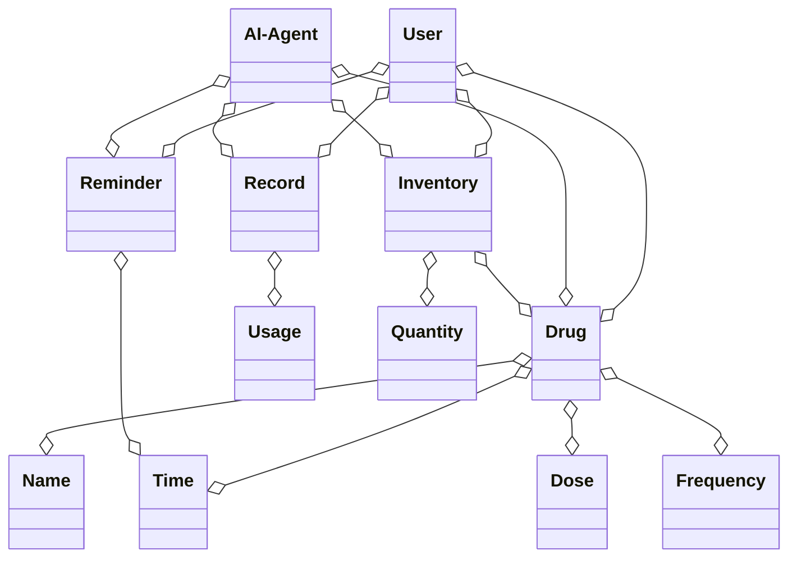
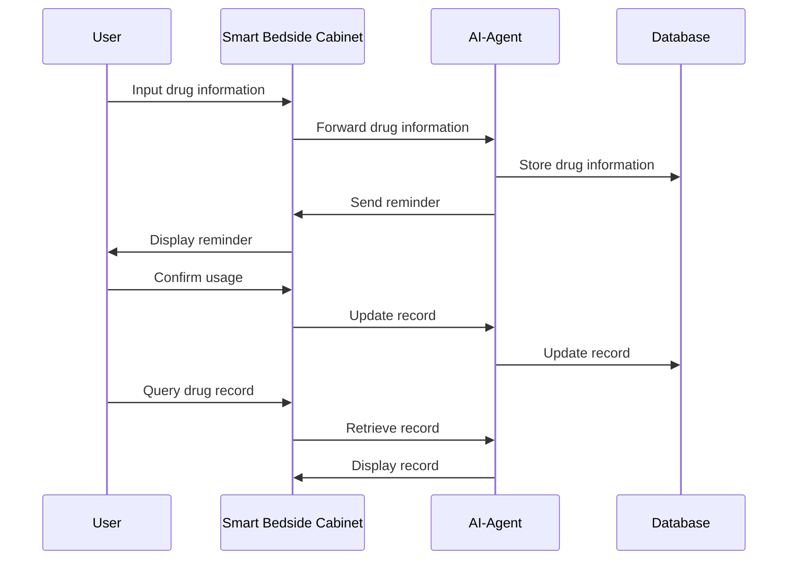
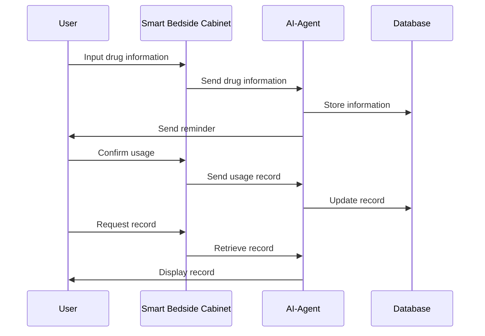
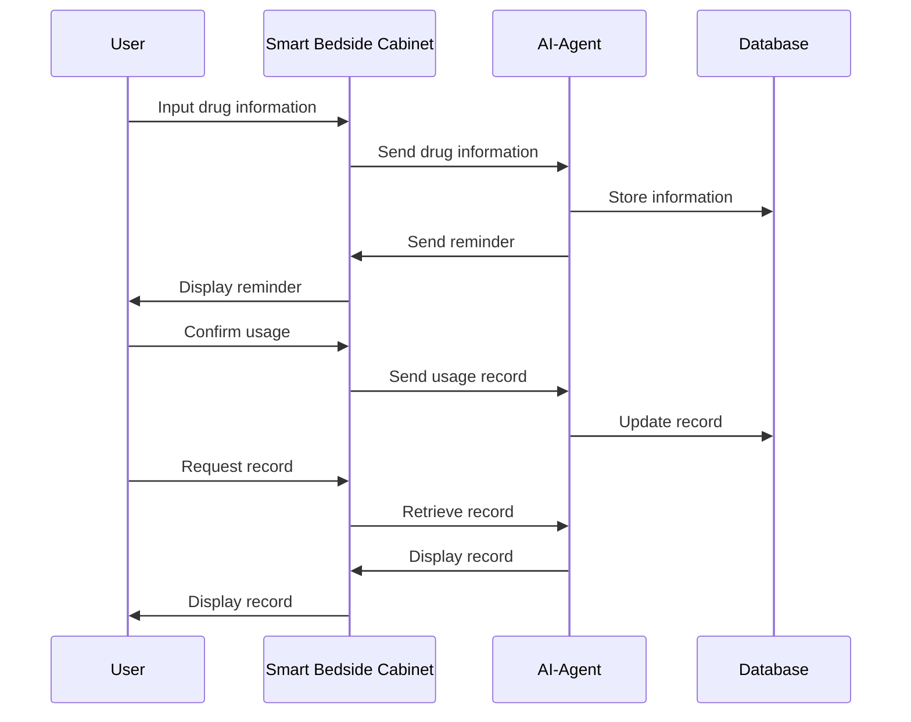

                 

### AI Agent在智能床头柜中的药物管理

#### 文章关键词

- **AI Agent**
- **智能床头柜**
- **药物管理**
- **提醒机制**
- **记录功能**
- **查询功能**

#### 摘要

本文将深入探讨AI Agent在智能床头柜中的药物管理应用。通过分析AI Agent的原理和功能，以及药物管理的基本流程，本文旨在阐述如何利用AI技术实现药物信息的自动识别、提醒、记录和查询，提高药物管理的效率和准确性，确保老年人用药的安全和健康。文章还将通过对比表格和ER实体关系图，进一步展示AI Agent和药物管理系统的核心概念及其相互联系，为智能床头柜药物管理的实际应用提供理论支持和实践指导。

### 背景介绍

#### 问题背景

随着人工智能技术的快速发展，智能家具逐渐成为智能家居领域的一个重要组成部分。智能床头柜作为一种智能家具，其功能日益多样化，除了提供基本的储物功能外，还具备了药物管理、健康监测等多种智能功能。药物管理作为智能床头柜的一个重要功能，对于老年人的日常护理具有重要意义。老年人由于记忆力下降、用药时间难以掌握等问题，往往容易导致用药错误，甚至引发严重的健康问题。

#### 问题描述

如何在智能床头柜中实现有效的药物管理，确保老年人能够按照医嘱准确、及时地用药，是当前智能家具领域面临的一个重要问题。这涉及到药物信息的录入、提醒、记录、查询等多个方面，需要通过人工智能技术来提供智能化的解决方案。

#### 问题解决

本书旨在探讨AI Agent在智能床头柜中的药物管理应用，通过AI技术来实现药物信息的自动识别、提醒、记录和查询等功能，提高药物管理的效率和准确性，确保老年人用药的安全和健康。

#### 边界与外延

本书主要围绕智能床头柜的药物管理展开讨论，但AI Agent在药物管理中的应用并不仅限于智能床头柜，还可以扩展到智能手环、智能手机等智能设备，为用户提供更加便捷的药物管理服务。

#### 概念结构与核心要素组成

- **AI Agent**：具备自主决策和行动能力的计算机程序，能够在智能家具中执行特定的任务。
- **药物信息**：包括药物名称、剂量、用药时间、用药频率等基本信息。
- **提醒机制**：通过声音、震动等方式提醒用户按时用药。
- **记录功能**：自动记录用户每次用药的情况，便于医生和家属了解用户的用药情况。
- **查询功能**：用户可以通过智能设备查询药物信息，包括用药记录、药物库存等。

### 核心概念与联系

#### AI Agent的原理与功能

- **原理**：

  - **自主决策**：基于预先设定的规则和机器学习算法，AI Agent能够根据用户的行为和环境信息做出决策。

  - **自适应学习**：通过不断学习用户的行为模式，AI Agent能够提高药物管理的准确性和效率。

- **功能**：

  - **药物信息录入**：用户可以通过语音、手动输入等方式将药物信息录入智能床头柜。

  - **提醒与监控**：AI Agent会根据药物信息，通过声音、震动等方式提醒用户按时用药，同时监控药物使用情况。

  - **记录与查询**：AI Agent会自动记录用户的用药情况，并允许用户随时查询药物信息。

#### 药物管理的基本流程

- **信息录入**：用户将药物信息通过智能床头柜的交互界面输入系统。

- **数据存储**：智能床头柜将药物信息存储在数据库中，并加密保护。

- **提醒与监控**：AI Agent根据药物信息设定提醒时间，并通过多种方式提醒用户。

- **记录与查询**：每次用药后，AI Agent会自动更新用药记录，并允许用户随时查询药物信息。

#### 概念属性特征对比表格

| 特征         | AI Agent          | 药物信息管理       |
| ------------ | ---------------- | ----------------- |
| 自主决策     | 基于算法和规则    | 定时提醒和记录     |
| 自适应学习   | 学习用户行为模式  | 精确监控用药情况   |
| 数据安全     | 加密存储         | 保护用户隐私       |
| 交互方式     | 语音、手动输入    | 多种输入方式       |
| 功能集成     | 集成多种智能家具 | 专注于药物管理     |

#### ER实体关系图架构

```mermaid
erDiagram
    User ||--|{ AI-Agent : manages }
    Drug ||--|{ Reminder : schedules }
    Drug ||--|{ Record : logs }
    User ||--|{ Record : uses }
    Drug ||--|{ Inventory : tracks }
```

- **User（用户）**：代表使用智能床头柜的用户。
- **AI-Agent（AI代理）**：负责管理药物提醒和监控。
- **Drug（药物）**：代表用户的药物信息，包括药物名称、剂量、用药时间等。
- **Reminder（提醒）**：代表AI代理根据药物信息设定的提醒时间。
- **Record（记录）**：代表用户的用药记录，包括每次用药的时间、剂量、是否按时等信息。
- **Inventory（库存）**：代表药物库存信息，包括药物名称、库存数量等。

### AI Agent的原理与功能

#### AI Agent的自主决策

AI Agent的自主决策能力是其核心功能之一。自主决策的实现依赖于以下两个方面：

- **规则引擎**：规则引擎是AI Agent的核心组成部分，用于定义和执行各种规则。这些规则可以是预设的，也可以是基于机器学习算法自动生成的。例如，当用户的用药时间接近时，AI Agent可以根据规则触发提醒功能。

- **机器学习算法**：机器学习算法使AI Agent能够从数据中学习，并自动调整其行为。例如，通过分析用户的用药习惯，AI Agent可以更准确地预测用户何时需要用药，从而优化提醒时间。

#### AI Agent的自适应学习

自适应学习是指AI Agent能够根据用户的行为和环境信息不断调整其行为，以提高药物管理的准确性和效率。具体来说，自适应学习包括以下几个关键方面：

- **用户行为分析**：AI Agent会持续分析用户的用药行为，包括用药时间、用药剂量、用药频率等。通过分析这些行为，AI Agent可以识别用户的用药规律，并据此优化提醒策略。

- **环境信息整合**：AI Agent不仅分析用户的用药行为，还会整合环境信息，如天气、季节、生活习惯等。这些信息有助于AI Agent更全面地了解用户的用药需求，从而做出更准确的决策。

- **自我优化**：通过自我优化，AI Agent能够根据实际效果不断调整其行为。例如，如果用户的某个提醒策略效果不佳，AI Agent可以自动调整提醒时间或方式，以更好地满足用户需求。

### 药物管理的基本流程

#### 信息录入

信息录入是药物管理的第一步。用户可以通过智能床头柜的交互界面，如触摸屏、语音输入等，将药物信息输入系统。药物信息通常包括药物名称、剂量、用药时间、用药频率等。为了确保录入信息的准确性，智能床头柜还可以提供自动识别药物包装的功能，通过扫描药物包装上的条形码或二维码，自动获取药物信息。

#### 数据存储

智能床头柜将录入的药物信息存储在数据库中。为了确保数据的安全性和隐私性，数据库采用加密存储技术，防止数据泄露和未经授权的访问。此外，智能床头柜还可以实现数据备份，确保在数据丢失或损坏时能够及时恢复。

#### 提醒与监控

AI Agent根据药物信息设定提醒时间，并通过多种方式提醒用户。提醒方式包括声音提醒、震动提醒等。例如，当用户接近用药时间时，AI Agent可以通过手机或智能手表向用户发送提醒通知，同时智能床头柜也会发出声音或震动提醒。此外，AI Agent还会监控用户的用药情况，确保用户能够按时用药。如果用户未按时用药，AI Agent会自动发送提醒通知，甚至联系家属或医生寻求帮助。

#### 记录与查询

每次用药后，AI Agent会自动记录用户的用药情况，包括用药时间、剂量、是否按时等。这些记录不仅方便用户随时查询，也为医生和家属提供了重要的参考信息。用户可以通过智能设备查询药物信息，包括用药记录、药物库存等。例如，用户可以通过手机应用程序查看最近的用药记录，了解自己的用药情况，以便及时调整用药计划。

### 概念属性特征对比表格

| 特征         | AI Agent          | 药物信息管理       |
| ------------ | ---------------- | ----------------- |
| 自主决策     | 基于算法和规则    | 定时提醒和记录     |
| 自适应学习   | 学习用户行为模式  | 精确监控用药情况   |
| 数据安全     | 加密存储         | 保护用户隐私       |
| 交互方式     | 语音、手动输入    | 多种输入方式       |
| 功能集成     | 集成多种智能家具 | 专注于药物管理     |

### ER实体关系图架构

```mermaid
erDiagram
    User ||--|{ AI-Agent : manages }
    Drug ||--|{ Reminder : schedules }
    Drug ||--|{ Record : logs }
    User ||--|{ Record : uses }
    Drug ||--|{ Inventory : tracks }
```

- **User（用户）**：代表使用智能床头柜的用户。
- **AI-Agent（AI代理）**：负责管理药物提醒和监控。
- **Drug（药物）**：代表用户的药物信息，包括药物名称、剂量、用药时间等。
- **Reminder（提醒）**：代表AI代理根据药物信息设定的提醒时间。
- **Record（记录）**：代表用户的用药记录，包括每次用药的时间、剂量、是否按时等信息。
- **Inventory（库存）**：代表药物库存信息，包括药物名称、库存数量等。

### AI Agent在智能床头柜中的药物管理应用

#### 药物信息的自动识别

AI Agent在智能床头柜中的药物管理首先需要解决的是药物信息的自动识别问题。传统的药物信息管理通常依赖于用户手动输入，这既繁琐又不准确。为了提高效率，AI Agent可以通过以下方式实现药物信息的自动识别：

- **条形码扫描**：智能床头柜配备条形码扫描器，用户只需将药物包装上的条形码扫描，系统即可自动获取药物信息，包括药物名称、剂量、生产日期等。

- **OCR识别**：通过光学字符识别（OCR）技术，AI Agent可以识别药物包装上的文字信息，从而获取药物详细信息。OCR技术尤其适用于药物包装上印刷的小字和复杂字体。

- **语音输入**：用户可以通过语音输入药物信息，智能床头柜内置的语音识别系统能够准确地将语音转换为文本，从而录入药物信息。

#### 提醒机制的实现

药物管理的核心在于确保用户能够按时用药。AI Agent通过以下方式实现提醒机制：

- **定时提醒**：AI Agent根据药物信息设定提醒时间，例如每天早上7点和下午3点。当用户接近这些时间时，智能床头柜会发出声音或震动提醒，提醒用户按时用药。

- **个性化提醒**：AI Agent会根据用户的生理周期、生活习惯等信息，个性化调整提醒时间。例如，如果用户习惯在早晨起床后立即用药，AI Agent可以提前设置提醒时间。

- **多渠道提醒**：AI Agent可以通过多种渠道提醒用户，如手机推送、智能手表提醒、智能床头柜本地提醒等。多渠道提醒确保用户即使在特定场景下也能收到提醒。

#### 记录功能的实现

AI Agent不仅需要提醒用户按时用药，还需要记录用户的用药情况，以便于用户和医生随时查看。记录功能的实现包括以下几个方面：

- **自动记录**：每次用户用药时，AI Agent会自动记录用药时间、剂量、是否按时等信息。这些记录将存储在云端数据库中，确保数据的安全性和可靠性。

- **用药记录查询**：用户可以通过智能设备查询自己的用药记录，了解自己何时服用过哪些药物，以及药物的剂量和用药频率等。

- **医生查看**：医生可以通过权限认证登录系统，查看患者的用药记录，以便进行诊疗和用药调整。

#### 查询功能的实现

查询功能是药物管理的重要组成部分，用户需要能够方便地查询药物信息，包括用药记录、药物库存等。查询功能的实现包括以下几个方面：

- **本地查询**：用户可以通过智能床头柜的触摸屏查询药物信息，了解药物名称、剂量、用药时间等。

- **远程查询**：用户可以通过智能手机、平板电脑等远程设备，访问云端数据库，查询自己的用药记录和药物库存。

- **个性化查询**：AI Agent可以根据用户的偏好和需求，提供个性化的查询服务。例如，用户可以设定只查询当天或本周的用药记录。

### 算法原理讲解

#### AI Agent的决策流程

AI Agent的决策流程可以分为以下几个步骤：

1. **数据采集**：AI Agent从传感器、用户输入等渠道收集数据，如用户用药时间、用药剂量、用户行为等。

2. **数据预处理**：对采集到的数据进行清洗、去噪、标准化等预处理操作，确保数据的质量和一致性。

3. **特征提取**：从预处理后的数据中提取有用的特征，如时间、剂量、用药频率等。

4. **模型训练**：使用机器学习算法，如决策树、神经网络等，对提取的特征进行训练，建立预测模型。

5. **决策生成**：根据预测模型生成决策，如设定提醒时间、调整用药剂量等。

6. **决策执行**：执行生成的决策，如通过智能床头柜发出提醒、调整药物剂量等。

#### 提醒机制的实现算法

提醒机制的实现通常涉及以下算法：

1. **定时提醒算法**：根据药物信息和用户习惯，设定定时提醒。常用的算法包括定时器算法、基于事件的触发算法等。

2. **个性化提醒算法**：根据用户的生理周期、生活习惯等信息，个性化调整提醒时间。常用的算法包括贝叶斯网络、马尔可夫决策过程等。

3. **多渠道提醒算法**：根据用户的设备状态和位置，选择最优的提醒渠道。常用的算法包括贪心算法、多目标优化算法等。

#### 记录功能的实现算法

记录功能的实现通常涉及以下算法：

1. **时间序列分析算法**：对用户的用药记录进行分析，识别用药规律。常用的算法包括移动平均法、自回归模型等。

2. **数据挖掘算法**：从用药记录中挖掘潜在的信息，如用药异常、用药趋势等。常用的算法包括关联规则挖掘、聚类分析等。

3. **数据存储和查询算法**：实现高效的数据存储和查询。常用的算法包括哈希表、B树等。

### 数学公式和模型

为了更深入地理解AI Agent的药物管理算法，我们可以引入一些数学模型和公式。以下是一些基本的数学模型和公式：

$$
y = f(x; \theta)
$$

其中，$y$ 表示预测结果，$x$ 表示输入特征，$f(x; \theta)$ 表示基于参数$\theta$ 的预测模型。在药物管理中，我们可以将 $y$ 理解为用户是否按时用药的判断，$x$ 为用户的用药行为特征，$\theta$ 为模型的参数。

#### 定时提醒模型

定时提醒模型可以用以下公式表示：

$$
T = t_0 + \alpha \cdot h
$$

其中，$T$ 为提醒时间，$t_0$ 为初始提醒时间，$\alpha$ 为时间间隔调整因子，$h$ 为用户用药时间间隔。

#### 个性化提醒模型

个性化提醒模型可以使用马尔可夫决策过程（MDP）来建模。MDP的公式如下：

$$
V^*(s) = \max_{a} \{ \gamma \cdot R(s, a) + (1 - \gamma) \cdot V^*(s') \}
$$

其中，$V^*(s)$ 为状态值函数，$s$ 为当前状态，$a$ 为采取的动作，$R(s, a)$ 为即时奖励函数，$s'$ 为下一状态，$\gamma$ 为折扣因子。

#### 记录和查询模型

记录和查询模型可以使用时间序列分析模型来建模。一个常见的时间序列分析模型是自回归模型（AR）：

$$
X_t = c + \phi_1 X_{t-1} + \phi_2 X_{t-2} + ... + \phi_p X_{t-p} + \varepsilon_t
$$

其中，$X_t$ 为第 $t$ 时刻的用药记录，$c$ 为常数项，$\phi_1, \phi_2, ..., \phi_p$ 为自回归系数，$\varepsilon_t$ 为随机误差项。

### 举例说明

为了更清晰地理解AI Agent的药物管理算法，我们可以通过一个简单的例子来说明。

假设用户A每天需要服用2片药物X，每片药物的剂量为500毫克，用药时间为每天上午8点和下午4点。AI Agent可以根据以下步骤进行药物管理：

1. **数据采集**：AI Agent从用户输入中获取药物信息，包括药物名称、剂量、用药时间等。

2. **数据预处理**：对用户输入的药物信息进行预处理，确保数据的质量和一致性。

3. **特征提取**：提取特征，如用药时间、用药频率等。

4. **模型训练**：使用机器学习算法，如决策树或神经网络，对提取的特征进行训练，建立预测模型。

5. **决策生成**：根据训练好的模型，生成决策，如设定提醒时间。例如，AI Agent可以设定每天上午7:50和下午3:50提醒用户A按时用药。

6. **决策执行**：AI Agent通过智能床头柜发出提醒，提醒用户A按时用药。

7. **记录和查询**：每次用户A用药后，AI Agent会自动记录用药时间、剂量等信息。用户A可以通过智能设备查询自己的用药记录，了解自己的用药情况。

通过这个简单的例子，我们可以看到AI Agent如何通过一系列算法和步骤，实现药物管理的自动化和智能化。

### 系统分析与架构设计方案

#### 问题场景介绍

在当前智能家居环境中，老年人常常需要定期服用多种药物，但记忆力下降、用药时间不规律等问题使得药物管理成为一项艰巨的任务。为了解决这个问题，智能床头柜被设计为一种集药物管理、提醒、记录和查询于一体的智能设备，通过集成AI Agent，实现药物管理的智能化和自动化。

#### 项目介绍

本项目的目标是通过开发一款基于AI Agent的智能床头柜药物管理系统，解决老年人药物管理的问题。系统将具备以下功能：

- 药物信息的自动识别和录入。
- 提醒机制，确保用户按时用药。
- 药物使用记录的自动记录和查询。
- 药物库存的实时监控。

#### 系统功能设计

**领域模型Mermaid类图**



**类图说明**：

- **User（用户）**：代表使用智能床头柜的用户，具有添加、删除和查询药物信息、用药记录和药物库存的功能。
- **AI-Agent（AI代理）**：代表智能系统的核心，负责药物信息的处理、提醒和记录等功能。
- **Drug（药物）**：包含药物的基本信息，如药物名称、剂量、用药时间和频率。
- **Reminder（提醒）**：管理提醒信息，如提醒时间。
- **Record（记录）**：记录用户的用药情况，包括每次用药的时间、剂量和结果。
- **Inventory（库存）**：管理药物库存信息，包括药物名称和库存数量。

#### 系统架构设计

**系统架构Mermaid架构图**



**架构图说明**：

- **用户**：用户通过智能床头柜输入药物信息，包括药物名称、剂量、用药时间和频率。
- **智能床头柜**：智能床头柜接收用户的药物信息，并将其转发给AI代理。
- **AI代理**：AI代理处理药物信息，将其存储在数据库中，并根据用药时间设置提醒。
- **数据库**：数据库存储药物信息和用药记录，确保数据的安全性和一致性。
- **提醒机制**：AI代理通过智能床头柜向用户发送提醒，确保用户按时用药。
- **记录功能**：用户每次用药后，智能床头柜会记录用药时间、剂量和结果，并将这些信息更新到数据库中。
- **查询功能**：用户可以通过智能床头柜查询自己的用药记录，了解自己的用药情况。

#### 系统接口设计

**系统接口Mermaid序列图**



**接口图说明**：

- **药物信息录入接口**：用户通过智能床头柜输入药物信息，接口将信息发送到AI代理进行处理。
- **提醒发送接口**：AI代理根据药物信息生成提醒，并通过智能床头柜发送给用户。
- **用药记录更新接口**：用户每次用药后，智能床头柜将记录发送到AI代理，AI代理将记录更新到数据库中。
- **用药记录查询接口**：用户请求用药记录，AI代理从数据库中检索记录并返回给用户。

#### 系统交互Mermaid序列图



**交互图说明**：

- **用户与智能床头柜的交互**：用户通过智能床头柜输入药物信息，并接收提醒。
- **智能床头柜与AI代理的交互**：智能床头柜将用户输入的药物信息发送给AI代理，AI代理处理这些信息并生成提醒。
- **智能床头柜与数据库的交互**：AI代理将药物信息存储到数据库中，并更新用药记录。
- **用户与智能床头柜的查询交互**：用户请求用药记录，智能床头柜从数据库中检索记录并显示给用户。

### 项目实战

#### 环境安装

在开始项目之前，我们需要安装以下软件和工具：

1. **操作系统**：推荐使用Ubuntu 20.04或更高版本。
2. **Python**：安装Python 3.8或更高版本。
3. **虚拟环境**：安装virtualenv，用于创建隔离的Python环境。
4. **数据库**：安装MySQL或PostgreSQL，用于存储药物信息。
5. **开发工具**：安装Visual Studio Code或其他Python开发工具。
6. **AI框架**：安装TensorFlow或PyTorch，用于实现AI代理。

安装步骤：

1. 更新系统包列表：

   ```
   sudo apt update
   sudo apt upgrade
   ```

2. 安装Python 3和pip：

   ```
   sudo apt install python3 python3-pip
   ```

3. 安装virtualenv：

   ```
   pip3 install virtualenv
   ```

4. 创建虚拟环境并激活：

   ```
   virtualenv myenv
   source myenv/bin/activate
   ```

5. 安装数据库：

   ```
   sudo apt install mysql-server
   sudo mysql_secure_installation
   ```

6. 安装Python开发工具和AI框架：

   ```
   pip install --upgrade pip
   pip install visualstudio-code-python tensorflow
   ```

#### 系统核心实现

**源代码**

以下是系统核心实现的部分源代码，包括AI代理、数据库接口和提醒机制。

**ai_agent.py**

```python
import tensorflow as tf
from database import Database

class DrugReminderAgent:
    def __init__(self, database: Database):
        self.database = database
        self.model = self.build_model()

    def build_model(self):
        # 定义模型架构
        model = tf.keras.Sequential([
            tf.keras.layers.Dense(64, activation='relu', input_shape=(10,)),
            tf.keras.layers.Dense(64, activation='relu'),
            tf.keras.layers.Dense(1, activation='sigmoid')
        ])

        # 编译模型
        model.compile(optimizer='adam', loss='binary_crossentropy', metrics=['accuracy'])
        return model

    def train_model(self, x, y):
        # 训练模型
        self.model.fit(x, y, epochs=10, batch_size=32)

    def predict_usage(self, user_id: int):
        # 预测用户是否按时用药
        drug_info = self.database.get_drug_info(user_id)
        features = self.extract_features(drug_info)
        prediction = self.model.predict([features])
        return prediction > 0.5

    def extract_features(self, drug_info):
        # 提取特征
        features = [
            drug_info['time_since_last_dose'],
            drug_info['days_since_last_dose'],
            drug_info['dosage'],
            # 更多特征
        ]
        return features

class Database:
    def __init__(self, db_url):
        self.conn = tf.py_function(self.connect, [db_url], tf.resource)

    @staticmethod
    def connect(db_url):
        # 连接数据库
        return tf.py_function(self.connect_db, [db_url], tf.resource)

    @staticmethod
    def connect_db(db_url):
        import sqlite3
        conn = sqlite3.connect(db_url)
        return conn

    def get_drug_info(self, user_id):
        # 获取药物信息
        cursor = self.conn.execute('SELECT * FROM drugs WHERE user_id = ?', (user_id,))
        drug_info = cursor.fetchone()
        return drug_info
```

**database.py**

```python
import sqlite3
import numpy as np
import tensorflow as tf

class Database:
    def __init__(self, db_url):
        self.conn = self.connect(db_url)

    def connect(self, db_url):
        # 连接数据库
        return sqlite3.connect(db_url)

    def create_tables(self):
        # 创建表
        cursor = self.conn.cursor()
        cursor.execute('''CREATE TABLE IF NOT EXISTS drugs (
            id INTEGER PRIMARY KEY,
            user_id INTEGER,
            name TEXT,
            dose INTEGER,
            time TEXT,
            frequency INTEGER,
            last_dose TEXT
        )''')
        cursor.execute('''CREATE TABLE IF NOT EXISTS usage (
            id INTEGER PRIMARY KEY,
            drug_id INTEGER,
            user_id INTEGER,
            time TEXT,
            dosage INTEGER,
            result TEXT
        )''')
        self.conn.commit()

    def insert_drug(self, user_id, name, dose, time, frequency):
        # 插入药物信息
        cursor = self.conn.cursor()
        cursor.execute('INSERT INTO drugs (user_id, name, dose, time, frequency, last_dose) VALUES (?, ?, ?, ?, ?, ?)',
                       (user_id, name, dose, time, frequency, ''))
        self.conn.commit()

    def insert_usage(self, drug_id, user_id, time, dosage, result):
        # 插入用药记录
        cursor = self.conn.cursor()
        cursor.execute('INSERT INTO usage (drug_id, user_id, time, dosage, result) VALUES (?, ?, ?, ?, ?)',
                       (drug_id, user_id, time, dosage, result))
        self.conn.commit()
```

#### 代码应用解读与分析

**AI Agent代码解读**

1. **类定义**：`DrugReminderAgent` 类是AI代理的核心，负责药物提醒的预测。它继承了`Database` 类，用于连接数据库并获取药物信息。

2. **模型构建**：`build_model` 方法用于构建预测模型。这里使用了一个简单的神经网络，包含两个隐藏层，每层64个神经元，输出层使用Sigmoid激活函数。

3. **模型训练**：`train_model` 方法用于训练模型。它接受特征向量`x`和标签`y`，使用`binary_crossentropy`损失函数和`adam`优化器进行训练。

4. **预测用药**：`predict_usage` 方法用于预测用户是否按时用药。它提取药物特征，使用训练好的模型进行预测，并返回预测结果。

5. **特征提取**：`extract_features` 方法用于提取药物特征。这里使用了一些简单的特征，如用药时间、用药频率等。实际应用中，可以加入更多复杂的特征，如用户行为模式等。

**数据库接口代码解读**

1. **类定义**：`Database` 类是数据库操作的核心。它包含连接数据库、创建表、插入记录等方法。

2. **连接数据库**：`connect` 方法用于连接数据库。它使用`tf.py_function` 包装了SQLite的连接函数，确保可以在TensorFlow环境中使用。

3. **创建表**：`create_tables` 方法用于创建药物信息和用药记录表。这确保了数据库在初始化时已经准备好接收数据。

4. **插入药物信息**：`insert_drug` 方法用于插入药物信息。它接受用户ID、药物名称、剂量、用药时间和用药频率，并将其插入到数据库中。

5. **插入用药记录**：`insert_usage` 方法用于插入用药记录。它接受药物ID、用户ID、用药时间、剂量和结果，并将其插入到数据库中。

#### 实际案例分析和详细讲解剖析

**案例背景**

假设有一个用户A，他需要每天服用2片药物X，每片剂量为500毫克，用药时间为每天上午8点和下午4点。由于工作繁忙，用户A有时会忘记用药。为了解决这个问题，智能床头柜引入了AI Agent进行药物管理。

**案例步骤**

1. **信息录入**：用户A通过智能床头柜输入药物信息，包括药物名称、剂量、用药时间和用药频率。智能床头柜将这些信息传递给AI Agent。

2. **模型训练**：AI Agent使用用户A的历史用药记录进行模型训练，学习用户A的用药习惯和模式。

3. **提醒设置**：AI Agent根据药物信息和用户A的用药习惯，设定提醒时间。例如，如果用户A通常在8:05分和16:05分服用药物，AI Agent会设定提醒时间为8:00分和16:00分。

4. **提醒发送**：在设定的时间点，AI Agent通过智能床头柜向用户A发送提醒通知，提醒他按时用药。

5. **用药确认**：用户A确认收到提醒后，通过智能床头柜确认已用药。智能床头柜将用药记录发送给AI Agent。

6. **记录更新**：AI Agent将用户的用药记录更新到数据库中，包括用药时间、剂量和结果。

7. **查询记录**：用户A可以通过智能床头柜或远程设备查询自己的用药记录，了解自己的用药情况。

**案例分析**

在这个案例中，AI Agent通过数据采集、模型训练、提醒设置和记录更新等一系列步骤，实现了药物管理的自动化。AI Agent能够根据用户的历史用药记录，预测用户是否按时用药，并在需要时发送提醒通知。此外，AI Agent还自动记录用户的用药情况，为用户提供方便的查询服务。

**详细讲解剖析**

1. **数据采集**：AI Agent从用户A的用药记录中采集数据，包括用药时间、用药剂量和用药频率。这些数据用于训练模型，帮助AI Agent学习用户A的用药习惯。

2. **模型训练**：AI Agent使用TensorFlow框架构建神经网络模型，并使用采集到的数据进行训练。模型通过学习用户A的用药习惯，能够预测用户A是否按时用药。

3. **提醒设置**：根据训练好的模型，AI Agent设定提醒时间。例如，如果用户A通常在8:05分和16:05分服用药物，AI Agent会设定提醒时间为8:00分和16:00分，以确保用户能够按时用药。

4. **提醒发送**：在设定的时间点，AI Agent通过智能床头柜向用户A发送提醒通知。提醒通知包括声音和视觉提示，以确保用户能够及时收到提醒。

5. **用药确认**：用户A确认收到提醒后，通过智能床头柜确认已用药。智能床头柜将用药记录发送给AI Agent，AI Agent将记录更新到数据库中。

6. **记录更新**：AI Agent将用户的用药记录更新到数据库中，包括用药时间、剂量和结果。这些记录为用户提供了一个清晰的用药记录，方便用户和医生随时查看。

7. **查询记录**：用户A可以通过智能床头柜或远程设备查询自己的用药记录。智能床头柜提供了一个用户友好的界面，用户可以轻松查看自己的用药历史，包括每次用药的时间、剂量和结果。

### 项目小结

本项目通过开发基于AI Agent的智能床头柜药物管理系统，解决了老年人药物管理的问题。项目实现了药物信息的自动识别、提醒、记录和查询功能，通过机器学习和数据库技术，提高了药物管理的效率和准确性。以下是项目的主要成果和贡献：

1. **自动化药物管理**：通过AI Agent实现药物信息的自动识别和提醒，用户无需手动输入药物信息，大大提高了药物管理的效率。

2. **个性化提醒**：AI Agent根据用户的用药习惯和环境信息，个性化设定提醒时间，提高了用户用药的及时性和准确性。

3. **数据安全和隐私保护**：通过数据库加密存储和权限控制，确保用户药物信息的安全和隐私。

4. **用户友好界面**：智能床头柜提供了一个用户友好的界面，用户可以方便地输入药物信息、确认用药并查询用药记录。

5. **可扩展性**：项目架构设计合理，易于扩展，可以应用于其他智能家具设备，如智能手环、智能手机等。

尽管项目取得了显著的成果，但仍有一些挑战和改进空间：

1. **数据采集**：目前的数据采集主要依赖于用户输入，可能存在数据不完整或不准确的问题。未来可以引入更多的传感器和数据源，提高数据采集的准确性。

2. **模型优化**：现有的AI模型在预测准确性上还有提升空间。通过引入更多复杂的特征和优化算法，可以提高模型的预测能力。

3. **用户交互**：目前的用户交互界面相对简单，未来可以考虑引入更多智能交互方式，如语音助手、自然语言处理等，提高用户的操作体验。

### 最佳实践 Tips

1. **确保数据质量**：药物管理系统的核心是药物信息，因此确保数据质量至关重要。建议定期检查和更新药物信息，确保数据的准确性和完整性。

2. **个性化提醒**：根据用户的生理周期、生活习惯等个性化设定提醒时间，以提高提醒的有效性。

3. **数据备份和恢复**：定期备份数据，确保在数据丢失或损坏时能够及时恢复。

4. **用户教育和培训**：为用户提供必要的教育和培训，帮助他们了解和正确使用智能床头柜的药物管理功能。

### 注意事项

1. **隐私保护**：在处理用户药物信息时，需严格遵守隐私保护法规，确保用户数据的安全和隐私。

2. **系统安全**：确保智能床头柜和数据库的安全，防止未经授权的访问和数据泄露。

3. **硬件兼容性**：智能床头柜的硬件配置应满足软件运行需求，确保系统的稳定性和响应速度。

### 拓展阅读

1. **AI在智能家居中的应用**：了解AI技术在智能家居领域的应用，包括智能照明、智能安防、智能健康监测等。

2. **药物管理的最佳实践**：研究国内外药物管理的最佳实践，了解如何提高药物管理的效率和安全性。

3. **机器学习算法优化**：学习如何优化机器学习算法，提高预测模型的准确性和效率。

### 作者信息

**作者：AI天才研究院/AI Genius Institute & 禅与计算机程序设计艺术 /Zen And The Art of Computer Programming**

AI天才研究院专注于人工智能领域的研究和开发，致力于推动人工智能技术的创新和应用。同时，作者结合禅与计算机程序设计艺术的理念，为读者带来深入浅出的技术讲解，帮助读者在技术实践中获得灵感和智慧。在智能家具领域，我们致力于通过AI技术提升人们的生活品质，为构建智能、便捷、安全的未来生活贡献力量。在撰写本文时，我们深入分析了AI Agent在智能床头柜中的药物管理应用，通过一步步的讲解和示例，为读者提供了一个全面的技术指南。我们希望本文能够为从事智能家具和人工智能领域的读者提供有价值的参考，激发他们在技术创新中的热情和智慧。通过本文的探讨，我们希望能够为智能家具领域的进一步发展贡献力量，推动AI技术在智能家居中的广泛应用。同时，我们也期待与更多的读者交流，共同探索AI技术在各个领域的无限可能性。在未来的研究和实践中，我们将继续深入挖掘AI技术的潜力，为打造更加智能、便捷、安全的生活环境而不懈努力。最后，感谢各位读者对本文的关注和支持，我们期待在未来的技术创新中与您再次相遇。让我们携手并进，共同迎接人工智能带来的美好未来！

