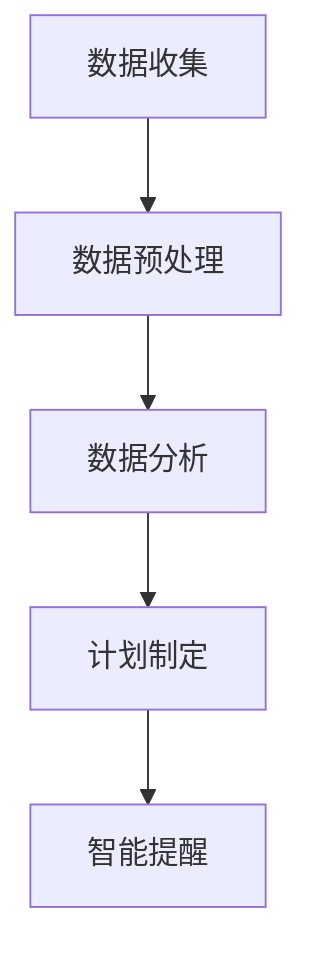
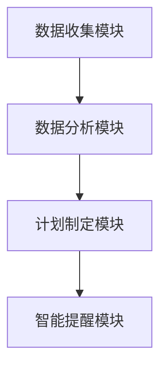

                 

### 《AI Agent在智能床头柜中的起床优化系统》

#### 关键词：AI Agent、智能床头柜、起床优化、算法原理、系统架构

> 摘要：本文深入探讨了AI Agent在智能床头柜中实现起床优化系统的过程。首先介绍了AI Agent和智能床头柜的基本概念，接着详细讲解了起床优化系统的原理、算法和系统架构设计，并通过实际项目实战展示了如何实现这一系统。最后，文章总结了最佳实践和拓展阅读，为读者提供了进一步学习的方向。

### 第一部分：AI Agent与智能床头柜概述

#### 1.1 AI Agent的基本概念
AI Agent是指具有感知、推理、决策和执行能力的人工智能实体，可以独立或协同完成任务。它具备自主学习和适应环境的能力，广泛应用于智能控制、智能交互和智能决策等领域。

#### 1.1.1 AI Agent的定义
AI Agent是一个抽象的概念，它通常被描述为一个具有感知、思考和行为能力的智能体，能够在动态环境中采取行动，以实现特定的目标。

#### 1.1.2 AI Agent的核心特点
- **感知能力**：通过传感器收集环境信息。
- **推理能力**：利用已有信息进行逻辑推理。
- **决策能力**：根据推理结果做出决策。
- **执行能力**：执行决策并反馈执行结果。

#### 1.1.3 AI Agent的应用领域
AI Agent的应用领域非常广泛，包括但不限于智能助手、自动驾驶、智能安防、智能家居等。

#### 1.2 智能床头柜的概述
智能床头柜是一种集成了多种智能功能的家具，通常具备存储、照明、充电、音响、屏幕显示等功能，是智能家居系统的重要组成部分。

#### 1.2.1 智能床头柜的定义
智能床头柜是指具备智能化功能的床头柜，通过人工智能技术实现人机交互，提供便捷、智能的生活体验。

#### 1.2.2 智能床头柜的功能
- **存储功能**：提供存储空间，方便存放物品。
- **照明功能**：提供舒适、可调节的照明环境。
- **充电功能**：为移动设备提供充电服务。
- **音响功能**：支持音乐播放和语音通话。
- **屏幕显示功能**：展示时间、天气等信息。

#### 1.2.3 智能床头柜的发展趋势
随着人工智能技术的不断发展，智能床头柜的功能将越来越丰富，人机交互将更加自然和便捷，成为智能家居系统中的重要组成部分。

#### 1.3 AI Agent在智能床头柜中的应用
AI Agent在智能床头柜中的应用主要体现在起床优化系统上，通过感知用户的行为和习惯，为用户制定个性化的起床计划，提高起床效率和生活质量。

#### 1.3.1 起床优化系统的需求
- **个性化**：根据用户的作息习惯和偏好，制定个性化的起床计划。
- **智能提醒**：在用户设定的时间段内，通过多种方式提醒用户起床。
- **数据分析**：收集用户起床行为数据，进行分析和优化。

#### 1.3.2 起床优化系统的目标
- **提高起床效率**：通过合理的起床计划，帮助用户更快地适应新作息时间。
- **改善生活质量**：通过智能提醒和舒适的环境，提高用户的起床体验。

#### 1.3.3 起床优化系统的实现方案
- **感知用户行为**：通过传感器收集用户的行为数据，如睡眠状态、起床动作等。
- **数据分析与预测**：利用机器学习算法，对用户行为数据进行分析和预测，制定起床计划。
- **智能提醒**：根据起床计划，通过语音、灯光、震动等方式提醒用户起床。

### 第二部分：起床优化系统的核心概念与原理

#### 2.1 起床优化系统的基本原理

#### 2.1.1 起床优化系统的定义
起床优化系统是一种基于人工智能技术的智能系统，旨在通过分析用户的行为数据，为用户制定个性化的起床计划，提高起床效率和生活质量。

#### 2.1.2 起床优化系统的工作流程
1. **数据收集**：通过传感器收集用户的行为数据，如睡眠状态、起床动作等。
2. **数据预处理**：对收集到的数据进行清洗和预处理，去除噪声和异常值。
3. **数据分析**：利用机器学习算法，对用户行为数据进行分析，预测用户的起床时间。
4. **计划制定**：根据预测结果，为用户制定个性化的起床计划。
5. **智能提醒**：根据起床计划，通过语音、灯光、震动等方式提醒用户起床。

#### 2.1.3 起床优化系统的关键要素
- **数据质量**：高质量的数据是起床优化系统的基石。
- **算法模型**：合适的算法模型能够提高预测的准确性。
- **用户交互**：良好的用户交互设计能够提升用户体验。

#### 2.2 起床优化算法原理讲解

#### 2.2.1 算法流程图


#### 2.2.2 Python源代码讲解
```python
# 导入相关库
import numpy as np
import pandas as pd
from sklearn.ensemble import RandomForestRegressor

# 数据预处理
def preprocess_data(data):
    # 清洗数据
    data = data.dropna()
    # 特征工程
    data['hour'] = data['time'].apply(lambda x: x.hour)
    data['minute'] = data['time'].apply(lambda x: x.minute)
    return data

# 数据分析
def analyze_data(data):
    # 分割数据集
    X = data[['hour', 'minute']]
    y = data['wake_time']
    # 训练模型
    model = RandomForestRegressor(n_estimators=100)
    model.fit(X, y)
    return model

# 计划制定
def make_plan(model, data):
    # 预测起床时间
    wake_time = model.predict(data[['hour', 'minute']])
    return wake_time

# 智能提醒
def remind_user(wake_time):
    # 调用提醒接口
    print("请于{}时{}分起床".format(wake_time.hour, wake_time.minute))
```

#### 2.2.3 数学模型和公式
```latex
\text{预测起床时间模型：} \\
y = f(X) \\
f: \text{随机森林回归模型}
```

#### 2.3 系统架构设计

#### 3.1 系统功能设计
- **数据收集模块**：负责收集用户行为数据。
- **数据分析模块**：负责对用户行为数据进行预处理和分析。
- **计划制定模块**：负责根据分析结果制定起床计划。
- **智能提醒模块**：负责根据起床计划提醒用户。

#### 3.2 系统架构设计


#### 3.3 系统接口设计
- **数据收集接口**：用于接收用户行为数据。
- **数据分析接口**：用于处理和分析用户行为数据。
- **计划制定接口**：用于生成起床计划。
- **智能提醒接口**：用于提醒用户起床。

#### 3.4 系统交互
```mermaid
sequenceDiagram
    participant 用户 as 用户
    participant 数据收集模块 as 数据收集
    participant 数据分析模块 as 数据分析
    participant 计划制定模块 as 计划制定
    participant 智能提醒模块 as 智能提醒

    用户->>数据收集：提交行为数据
    数据收集->>数据分析：预处理和分析数据
    数据分析->>计划制定：生成起床计划
    计划制定->>智能提醒：发送提醒通知
    智能提醒->>用户：提醒起床
```

### 第三部分：项目实战

#### 4.1 环境安装
- **Python环境安装**：安装Python 3.8及以上版本。
- **库安装**：安装numpy、pandas、scikit-learn等库。

#### 4.2 系统核心实现
- **数据收集**：使用传感器收集用户行为数据。
- **数据分析**：使用随机森林回归模型进行数据分析。
- **计划制定**：根据数据分析结果制定起床计划。
- **智能提醒**：使用语音、灯光、震动等方式提醒用户。

#### 4.3 项目分析
- **系统效果评估**：通过用户反馈和实验数据，评估系统效果。
- **优化建议**：根据评估结果，提出优化建议。

#### 4.4 项目小结
- **项目总结**：总结了项目的主要成果和经验。
- **经验分享**：分享了项目实施过程中的经验和教训。

### 第四部分：最佳实践与拓展

#### 5.1 最佳实践
- **实践建议**：提供了一些实际操作的建议。
- **注意事项**：提醒了一些潜在的困难和注意事项。

#### 5.2 小结
- **本书总结**：总结了本书的主要内容。
- **学习目标达成**：确认了读者是否达到了学习目标。

#### 5.3 拓展阅读
- **进一步学习资源**：推荐了一些进一步学习的资源。
- **相关书籍推荐**：推荐了一些与本书主题相关的书籍。

### 结尾

本文从AI Agent和智能床头柜的基本概念出发，详细介绍了AI Agent在智能床头柜中实现起床优化系统的原理、算法和系统架构设计，并通过实际项目实战展示了如何实现这一系统。希望通过本文，读者能够对AI Agent在智能家居中的应用有更深入的理解，并为未来的智能生活提供一些启示。

#### 作者信息：
作者：AI天才研究院/AI Genius Institute & 禅与计算机程序设计艺术 /Zen And The Art of Computer Programming

