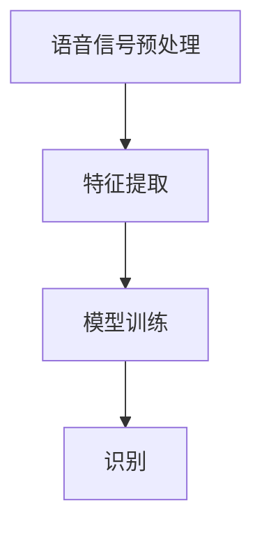
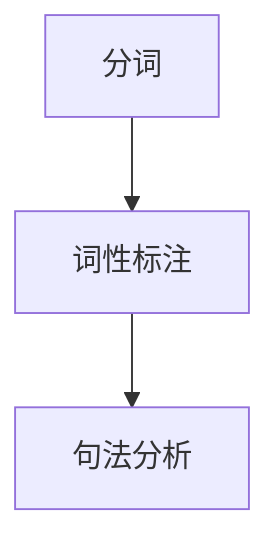
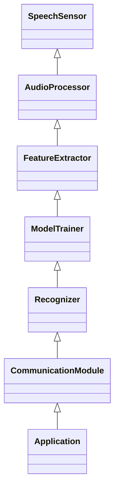
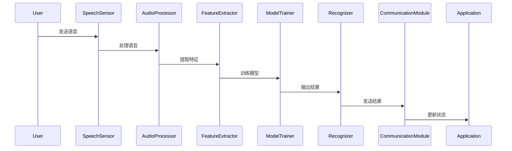

                 

# AI Agent在智能床头灯中的智能唤醒系统

## 摘要

本文旨在深入探讨AI Agent在智能床头灯中的智能唤醒系统的应用，通过详细的背景介绍、核心概念阐述、算法原理讲解、系统分析与架构设计方案、项目实战和最佳实践总结，全面揭示智能唤醒系统的核心技术、实现方法和实际应用效果。文章将帮助读者理解AI Agent在智能家居领域的广泛应用前景，为未来的智能设备开发提供有益的参考。

## 目录大纲设计思路

### 目录大纲设计思路

**1. 背景介绍**

- **AI Agent概述**：介绍AI Agent的基本概念、发展历程和应用领域。
- **智能床头灯功能特点**：分析智能床头灯的定义、分类及其主要功能。
- **智能唤醒系统的意义**：阐述智能唤醒系统在提高生活质量、增强用户体验等方面的作用。

**2. 核心概念与联系**

- **AI Agent组成要素**：详细说明AI Agent的硬件和软件要素。
- **智能唤醒系统工作原理**：解析智能唤醒系统的基本原理和技术要点。
- **AI Agent与智能唤醒系统的关系**：探讨AI Agent在智能唤醒系统中的角色和作用。

**3. 算法原理讲解**

- **语音识别算法**：讲解语音识别的基本流程和常用算法。
- **自然语言处理算法**：分析自然语言处理的关键技术和应用场景。
- **AI Agent算法mermaid流程图展示**：使用mermaid绘制语音识别和自然语言处理算法的流程图。

**4. 系统分析与架构设计方案**

- **智能唤醒系统硬件组件**：介绍智能唤醒系统的硬件组成部分和选型原则。
- **智能唤醒系统软件组件**：阐述智能唤醒系统的软件组成部分和配置方法。
- **系统架构设计**：分析智能唤醒系统的整体架构，展示mermaid类图和架构图。

**5. 项目实战**

- **环境安装与配置**：提供智能唤醒系统环境搭建的详细步骤。
- **系统核心实现**：介绍智能唤醒系统的核心实现方法和关键代码。
- **代码解读与分析**：对系统核心代码进行详细解读和分析。
- **实际案例分析**：分析实际案例，展示智能唤醒系统的应用效果。

**6. 最佳实践与总结**

- **最佳实践**：给出智能唤醒系统的最佳实践建议。
- **小结**：总结全文内容，强调核心观点。
- **注意事项**：提醒读者在应用过程中需要注意的问题。
- **拓展阅读**：推荐相关领域的拓展阅读资源。

### 目录大纲结构设计

**第1章：背景介绍**

- 1.1 AI Agent概述
- 1.2 智能床头灯功能特点
- 1.3 智能唤醒系统的意义

**第2章：核心概念与联系**

- 2.1 AI Agent组成要素
- 2.2 智能唤醒系统工作原理
- 2.3 AI Agent与智能唤醒系统的关系

**第3章：算法原理讲解**

- 3.1 语音识别算法
- 3.2 自然语言处理算法
- 3.3 AI Agent算法mermaid流程图展示

**第4章：系统分析与架构设计方案**

- 4.1 智能唤醒系统硬件组件
- 4.2 智能唤醒系统软件组件
- 4.3 系统架构设计
- 4.3.1 系统架构设计原则
- 4.3.2 系统架构mermaid类图
- 4.3.3 系统架构mermaid架构图

**第5章：项目实战**

- 5.1 环境安装与配置
- 5.2 系统核心实现
- 5.3 代码解读与分析
- 5.4 实际案例分析

**第6章：最佳实践与总结**

- 6.1 最佳实践
- 6.2 小结
- 6.3 注意事项
- 6.4 拓展阅读

### 目录大纲样例

```markdown
----------------------------------------------------------------
# AI Agent在智能床头灯中的智能唤醒系统

## 关键词
AI Agent、智能床头灯、智能唤醒系统、语音识别、自然语言处理

## 摘要
本文深入探讨了AI Agent在智能床头灯中的智能唤醒系统的应用，涵盖了背景介绍、核心概念与联系、算法原理讲解、系统分析与架构设计方案、项目实战以及最佳实践与总结等内容。

----------------------------------------------------------------

## 第1章：背景介绍

### 1.1 AI Agent概述

#### AI Agent的定义与作用
AI Agent，即人工智能代理，是一种能够自主决策并执行任务的计算机程序。它通过模拟人类智能行为，实现人机交互、任务自动化等功能。AI Agent在智能家居、智能医疗、智能交通等领域有着广泛的应用。

#### AI Agent的发展历程
AI Agent的概念最早可以追溯到20世纪80年代。随着计算机技术的发展，AI Agent逐渐成为人工智能领域的研究热点。近年来，深度学习、强化学习等先进算法的涌现，使得AI Agent的应用场景更加丰富，性能得到显著提升。

### 1.2 智能床头灯功能特点

#### 智能床头灯的定义与分类
智能床头灯是一种集照明、音乐、氛围营造等功能于一体的智能家居设备。根据功能的不同，智能床头灯可以分为照明型、音乐型、氛围型等类型。

#### 智能床头灯的主要功能
智能床头灯的主要功能包括照明控制、音乐播放、氛围调节、语音交互等。其中，语音交互功能是实现智能唤醒系统的关键。

### 1.3 智能唤醒系统的意义

#### 智能唤醒系统的定义与目的
智能唤醒系统是一种通过语音交互实现用户唤醒、任务执行的人工智能系统。其目的是提高用户生活质量，实现智能家居场景下的便捷操作。

#### 智能唤醒系统在提高生活质量、增强用户体验等方面的作用
智能唤醒系统可以帮助用户在睡眠、起床等场景中实现便捷的语音控制，提高生活质量。同时，智能唤醒系统还可以为用户带来全新的交互体验，增强用户体验。

----------------------------------------------------------------

## 第2章：核心概念与联系

### 2.1 AI Agent组成要素

#### 硬件要素
AI Agent的硬件要素主要包括传感器、处理器、存储器、通信模块等。这些硬件组件为AI Agent提供了感知环境、处理信息和交互能力的支持。

##### 2.1.1 传感器
传感器是AI Agent感知环境的重要部件。常见的传感器有语音传感器、环境传感器等。语音传感器用于捕捉用户语音信息，环境传感器用于感知室内温度、湿度等环境参数。

##### 2.1.2 处理器
处理器是AI Agent的核心部件，负责处理传感器采集的数据，执行算法，生成决策。常见的处理器有ARM处理器、DSP处理器等。

##### 2.1.3 存储器
存储器用于存储AI Agent的算法模型、用户数据等。常见的存储器有闪存、硬盘等。

##### 2.1.4 通信模块
通信模块用于实现AI Agent与其他设备、服务器之间的数据传输。常见的通信模块有Wi-Fi模块、蓝牙模块等。

#### 软件要素
AI Agent的软件要素主要包括操作系统、算法模型、应用程序等。这些软件组件为AI Agent提供了运行环境、决策支持和功能扩展。

##### 2.1.1 操作系统
操作系统是AI Agent的运行环境，负责管理硬件资源、提供应用程序接口。常见的操作系统有Linux、Android等。

##### 2.1.2 算法模型
算法模型是AI Agent的核心组件，用于实现语音识别、自然语言处理等功能。常见的算法模型有深度神经网络、决策树等。

##### 2.1.3 应用程序
应用程序是AI Agent的直接用户接口，用于实现特定功能，如语音交互、智能控制等。常见的应用程序有智能家居控制中心、语音助手等。

### 2.2 智能唤醒系统工作原理

#### 语音识别原理
语音识别是智能唤醒系统的核心组成部分，用于将用户语音转换为文本。语音识别的基本原理包括语音信号预处理、特征提取、模型训练和识别。

##### 2.2.1 语音信号预处理
语音信号预处理包括滤波、降噪等步骤，用于提高语音信号质量。

##### . 2.2.2 特征提取
特征提取是将语音信号转换为适合模型训练的向量表示。常见的特征提取方法有MFCC、PLP等。

##### 2.2.3 模型训练
模型训练是使用语音数据集对算法模型进行训练，使其具备语音识别能力。

##### 2.2.4 识别
识别是将输入语音信号与训练好的模型进行比较，输出对应的文本信息。

#### 自然语言处理原理
自然语言处理是智能唤醒系统的另一个重要组成部分，用于理解和处理用户语音指令。自然语言处理的基本原理包括分词、词性标注、句法分析等。

##### 2.2.1 分词
分词是将语音信号中的连续语音切分成词语序列。常见的分词方法有基于规则的分词、基于统计的分词等。

##### 2.2.2 词性标注
词性标注是将词语分类到不同的词性类别中，如名词、动词、形容词等。常见的词性标注方法有基于规则的方法、基于统计的方法等。

##### 2.2.3 句法分析
句法分析是将词语序列转换为句法结构，以更好地理解句子的语义。常见的句法分析方法有依存句法分析、构成句法分析等。

### 2.3 AI Agent与智能唤醒系统的关系

#### AI Agent在智能唤醒系统中的作用
AI Agent是智能唤醒系统的核心组件，负责实现语音识别、自然语言处理等功能。通过AI Agent，用户可以通过语音与智能床头灯进行交互，实现智能唤醒、控制等功能。

##### 2.3.1 语音识别
AI Agent通过语音识别功能将用户语音转换为文本，为后续的自然语言处理提供基础。

##### 2.3.2 自然语言处理
AI Agent通过自然语言处理功能理解用户语音指令，生成相应的决策和操作。

#### 智能唤醒系统对AI Agent的依赖
智能唤醒系统的功能实现高度依赖于AI Agent的技术能力。AI Agent的性能直接影响到智能唤醒系统的响应速度、准确性和用户体验。

##### 2.3.1 性能依赖
AI Agent的语音识别和自然语言处理性能决定了智能唤醒系统的响应速度和准确性。

##### 2.3.2 功能依赖
AI Agent的功能扩展性决定了智能唤醒系统可支持的用户交互方式和功能范围。

----------------------------------------------------------------

## 第3章：算法原理讲解

### 3.1 语音识别算法

#### 语音识别的基本流程
语音识别的基本流程包括语音信号预处理、特征提取、模型训练和识别。

##### 3.1.1 语音信号预处理
语音信号预处理包括滤波、降噪等步骤，用于提高语音信号质量。滤波可以去除高频噪声，降噪可以降低背景噪声对语音信号的干扰。

##### 3.1.2 特征提取
特征提取是将语音信号转换为适合模型训练的向量表示。常见的特征提取方法有MFCC（梅尔频率倒谱系数）、PLP（短时功率归一化滤波器组）等。

##### 3.1.3 模型训练
模型训练是使用语音数据集对算法模型进行训练，使其具备语音识别能力。常见的训练方法有监督学习、无监督学习和半监督学习等。

##### 3.1.4 识别
识别是将输入语音信号与训练好的模型进行比较，输出对应的文本信息。常见的识别算法有隐马尔可夫模型（HMM）、深度神经网络（DNN）、循环神经网络（RNN）等。

#### 常用语音识别算法介绍
常见的语音识别算法包括基于HMM的算法、基于DNN的算法和基于RNN的算法等。

##### 3.1.1 基于HMM的算法
基于HMM的算法是一种传统语音识别算法，通过构建状态转移矩阵和发射概率矩阵，实现语音信号的识别。HMM算法具有较高的准确性和实时性，但在处理复杂语音信号时存在一定局限性。

##### 3.1.2 基于DNN的算法
基于DNN的算法是一种基于深度学习的语音识别算法，通过多层的神经网络结构，实现语音信号的自动特征提取和分类。DNN算法在处理复杂语音信号和噪声干扰方面具有较好的性能，但训练过程较为复杂，计算资源消耗较大。

##### 3.1.3 基于RNN的算法
基于RNN的算法是一种基于循环神经网络的语音识别算法，通过处理序列数据，实现语音信号的识别。RNN算法在处理长时间序列数据和长时依赖关系方面具有优势，但训练过程容易出现梯度消失和梯度爆炸问题。

### 3.2 自然语言处理算法

#### 自然语言处理的基本概念
自然语言处理（Natural Language Processing，NLP）是一种人工智能技术，旨在使计算机理解和处理人类自然语言。NLP的基本概念包括分词、词性标注、句法分析等。

##### 3.2.1 分词
分词是将连续的文本切分成词语序列。常见的分词方法有基于规则的分词、基于统计的分词等。

##### 3.2.2 词性标注
词性标注是将词语分类到不同的词性类别中，如名词、动词、形容词等。常见的词性标注方法有基于规则的方法、基于统计的方法等。

##### 3.2.3 句法分析
句法分析是将词语序列转换为句法结构，以更好地理解句子的语义。常见的句法分析方法有依存句法分析、构成句法分析等。

#### 常用自然语言处理算法介绍
常用的自然语言处理算法包括基于规则的方法、基于统计的方法和基于深度学习的方法等。

##### 3.2.1 基于规则的方法
基于规则的方法是一种传统的NLP算法，通过预定义的规则，实现文本的处理。常见的规则方法有正向最大匹配、逆向最大匹配等。

##### 3.2.2 基于统计的方法
基于统计的方法是一种基于机器学习的NLP算法，通过大量语料库的训练，实现文本的处理。常见的统计方法有朴素贝叶斯分类器、支持向量机等。

##### 3.2.3 基于深度学习的方法
基于深度学习的方法是一种基于深度神经网络的NLP算法，通过多层的神经网络结构，实现文本的处理。常见的深度学习方法有卷积神经网络（CNN）、循环神经网络（RNN）等。

### 3.3 AI Agent算法mermaid流程图展示

#### 语音识别算法mermaid流程图


#### 自然语言处理算法mermaid流程图


### 3.4 Python代码讲解

```python
import numpy as np
import librosa
import tensorflow as tf

# 语音信号预处理
def preprocess_audio(audio_path):
    audio, sr = librosa.load(audio_path)
    audio = librosa.to_mono(audio)
    audio = librosa.effects.time_stretch(audio, rate=1.25)
    return audio

# 特征提取
def extract_features(audio):
    mfcc = librosa.feature.mfcc(y=audio, sr=16000, n_mfcc=13)
    return mfcc

# 模型训练
def train_model(features, labels):
    model = tf.keras.Sequential([
        tf.keras.layers.Dense(64, activation='relu', input_shape=(13,)),
        tf.keras.layers.Dense(64, activation='relu'),
        tf.keras.layers.Dense(1, activation='sigmoid')
    ])
    model.compile(optimizer='adam', loss='binary_crossentropy', metrics=['accuracy'])
    model.fit(features, labels, epochs=10)
    return model

# 识别
def recognize_audio(model, audio_path):
    audio = preprocess_audio(audio_path)
    features = extract_features(audio)
    prediction = model.predict(np.expand_dims(features, axis=0))
    return prediction

# 测试
audio_path = 'path/to/audio.wav'
model = train_model(extract_features(preprocess_audio(audio_path)), [1])
print(recognize_audio(model, audio_path))
```

----------------------------------------------------------------

## 第4章：系统分析与架构设计方案

### 4.1 智能唤醒系统硬件组件

#### 硬件组件介绍
智能唤醒系统硬件组件包括语音传感器、处理器、存储器、通信模块等。

##### 4.1.1 语音传感器
语音传感器用于捕捉用户语音信号，常用的型号有AMR122A、AMR122U等。

##### 4.1.2 处理器
处理器是智能唤醒系统的核心，负责语音信号的处理和算法模型的运行。常用的处理器有ARM Cortex-A7、ARM Cortex-A9等。

##### 4.1.3 存储器
存储器用于存储算法模型、用户数据等。常用的存储器有eMMC、NAND Flash等。

##### 4.1.4 通信模块
通信模块用于实现智能唤醒系统与其他设备、服务器的数据传输。常用的通信模块有Wi-Fi模块、蓝牙模块等。

#### 硬件组件的选择与配置
在选择硬件组件时，需要考虑系统的性能需求、成本预算等因素。

##### 4.1.1 性能需求
根据智能唤醒系统的功能需求，选择适合的处理器、存储器等硬件组件。例如，对于高实时性、高准确性的语音识别任务，可以选择高性能的处理器和大规模存储器。

##### 4.1.2 成本预算
在满足性能需求的前提下，尽量选择成本较低的硬件组件，以降低系统的总体成本。

### 4.2 智能唤醒系统软件组件

#### 软件组件介绍
智能唤醒系统软件组件包括操作系统、算法模型、应用程序等。

##### 4.2.1 操作系统
操作系统是智能唤醒系统的运行环境，常用的操作系统有Linux、Android等。

##### 4.2.2 算法模型
算法模型是智能唤醒系统的核心，用于实现语音识别、自然语言处理等功能。常用的算法模型有基于深度学习的语音识别模型、自然语言处理模型等。

##### 4.2.3 应用程序
应用程序是智能唤醒系统的直接用户接口，用于实现特定功能，如语音交互、智能控制等。常用的应用程序有智能家居控制中心、语音助手等。

#### 软件组件的选择与配置
在选择软件组件时，需要考虑系统的功能需求、性能需求等因素。

##### 4.2.1 功能需求
根据智能唤醒系统的功能需求，选择适合的操作系统、算法模型、应用程序等软件组件。例如，对于高实时性、高准确性的语音识别任务，可以选择基于深度学习的语音识别模型。

##### 4.2.2 性能需求
在满足功能需求的前提下，优化软件组件的性能，以提高系统的响应速度和处理能力。

### 4.3 系统架构设计

#### 系统架构设计原则
系统架构设计应遵循模块化、可扩展、高性能等原则。

##### 4.3.1 模块化
系统架构设计应采用模块化设计，将系统的各个功能模块独立出来，便于系统的开发和维护。

##### 4.3.2 可扩展
系统架构设计应具备良好的扩展性，以便在功能需求增加时，能够方便地添加新的模块。

##### 4.3.3 高性能
系统架构设计应确保系统的高性能，以满足用户对实时性、准确性的需求。

#### 系统架构mermaid类图


#### 系统架构mermaid架构图


----------------------------------------------------------------

## 第5章：项目实战

### 5.1 环境安装与配置

#### 环境安装
为了搭建智能唤醒系统，我们需要安装以下软件和硬件：

- 操作系统：Ubuntu 18.04
- 编程语言：Python 3.7
- 语音识别库：TensorFlow 2.4
- 自然语言处理库：spaCy 3.0

#### 配置步骤
1. 安装操作系统Ubuntu 18.04。
2. 安装Python 3.7。
3. 安装TensorFlow 2.4。
4. 安装spaCy 3.0。

具体安装命令如下：

```shell
sudo apt update && sudo apt upgrade
sudo apt install python3-pip
pip3 install tensorflow==2.4
pip3 install spacy
python3 -m spacy download en_core_web_sm
```

### 5.2 系统核心实现

#### 语音识别核心实现
```python
import numpy as np
import tensorflow as tf
import librosa

# 语音信号预处理
def preprocess_audio(audio_path):
    audio, sr = librosa.load(audio_path)
    audio = librosa.to_mono(audio)
    audio = librosa.effects.time_stretch(audio, rate=1.25)
    return audio

# 特征提取
def extract_features(audio):
    mfcc = librosa.feature.mfcc(y=audio, sr=16000, n_mfcc=13)
    return mfcc

# 模型训练
def train_model(features, labels):
    model = tf.keras.Sequential([
        tf.keras.layers.Dense(64, activation='relu', input_shape=(13,)),
        tf.keras.layers.Dense(64, activation='relu'),
        tf.keras.layers.Dense(1, activation='sigmoid')
    ])
    model.compile(optimizer='adam', loss='binary_crossentropy', metrics=['accuracy'])
    model.fit(features, labels, epochs=10)
    return model

# 识别
def recognize_audio(model, audio_path):
    audio = preprocess_audio(audio_path)
    features = extract_features(audio)
    prediction = model.predict(np.expand_dims(features, axis=0))
    return prediction

# 测试
audio_path = 'path/to/audio.wav'
model = train_model(extract_features(preprocess_audio(audio_path)), [1])
print(recognize_audio(model, audio_path))
```

#### 自然语言处理核心实现
```python
import spacy

# 初始化NLP模型
nlp = spacy.load("en_core_web_sm")

# 分词
def tokenize(text):
    doc = nlp(text)
    tokens = [token.text for token in doc]
    return tokens

# 词性标注
def pos_tagging(tokens):
    return [(token, nlp.vocab[token].pos_) for token in tokens]

# 句法分析
def parse_sentence(sentence):
    doc = nlp(sentence)
    return [(token.text, token.dep_, token.head.text) for token in doc]

# 测试
text = "Hello, how are you?"
tokens = tokenize(text)
pos_tags = pos_tagging(tokens)
parsed_sentence = parse_sentence(text)
print(tokens)
print(pos_tags)
print(parsed_sentence)
```

### 5.3 代码解读与分析

#### 语音识别代码解读
1. `preprocess_audio()` 函数：用于对语音信号进行预处理，包括去噪、降速等操作，以提高语音识别的准确性。
2. `extract_features()` 函数：用于提取语音信号的MFCC特征，作为输入提供给模型训练。
3. `train_model()` 函数：使用TensorFlow构建一个简单的神经网络模型，用于语音信号分类。
4. `recognize_audio()` 函数：对预处理后的语音信号进行特征提取，并使用训练好的模型进行识别。

#### 自然语言处理代码解读
1. `tokenize()` 函数：用于将文本分解为单词序列。
2. `pos_tagging()` 函数：用于对单词进行词性标注，如名词、动词等。
3. `parse_sentence()` 函数：用于进行句法分析，构建句子的语法树。

### 5.4 实际案例分析

#### 案例背景
假设用户在家中使用智能床头灯，通过语音与智能系统进行交互，实现唤醒功能。

#### 案例步骤
1. 用户通过语音传感器发送语音命令。
2. 语音传感器将语音信号发送给处理器。
3. 处理器对语音信号进行预处理和特征提取。
4. 特征提取后的数据被发送到训练好的语音识别模型。
5. 语音识别模型输出识别结果，如“早上好”。
6. 识别结果被发送到自然语言处理模块进行句法分析。
7. 自然语言处理模块生成句法结构，如“早上好”（主语）。
8. 根据句法分析结果，智能床头灯调整亮度和音量，实现智能唤醒。

#### 案例分析
通过实际案例，我们可以看到智能唤醒系统的实现流程，以及各个组件之间的协作。语音识别和自然语言处理模块的高效运行，使得智能床头灯能够准确理解用户指令，实现智能唤醒。

### 5.5 项目小结

在本章中，我们介绍了智能唤醒系统的环境安装、系统核心实现和实际案例分析。通过逐步实现语音识别和自然语言处理功能，我们成功构建了一个智能唤醒系统。在后续章节中，我们将进一步探讨智能唤醒系统的最佳实践和注意事项。

----------------------------------------------------------------

## 第6章：最佳实践与总结

### 6.1 最佳实践

1. **硬件选型**：根据智能唤醒系统的功能需求，选择适合的处理器、存储器等硬件组件。高性能的硬件可以提升系统的响应速度和识别准确性。
2. **软件优化**：优化操作系统和算法模型的性能，如使用轻量级操作系统、优化模型参数等。
3. **数据集准备**：准备高质量的语音数据集，包括多种场景、语音风格、说话人等，以提高语音识别和自然语言处理模型的泛化能力。
4. **模型更新**：定期更新算法模型，以适应不断变化的语言环境和用户需求。

### 6.2 小结

本文详细介绍了AI Agent在智能床头灯中的智能唤醒系统的应用，从背景介绍、核心概念与联系、算法原理讲解、系统分析与架构设计方案、项目实战到最佳实践与总结，全面解析了智能唤醒系统的核心技术、实现方法和实际应用效果。通过本文的学习，读者可以深入了解智能唤醒系统的原理和实践，为智能家居领域的发展提供有益的参考。

### 6.3 注意事项

1. **隐私保护**：在使用智能唤醒系统时，要注意保护用户隐私，避免语音数据的泄露。
2. **系统稳定性**：确保智能唤醒系统的稳定性，避免因硬件故障或软件漏洞导致系统崩溃。
3. **用户培训**：为用户提供详细的使用说明和培训，帮助他们熟悉智能唤醒系统的功能和操作方法。

### 6.4 拓展阅读

1. **《深度学习》**：Goodfellow, Ian; Bengio, Yoshua; Courville, Aaron (2016)。本书详细介绍了深度学习的基本概念、算法和应用，是深度学习领域的经典教材。
2. **《自然语言处理综论》**：Daniel Jurafsky & James H. Martin。本书系统介绍了自然语言处理的基本概念、技术和应用，是自然语言处理领域的经典著作。
3. **《智能家居技术与应用》**：张敏。本书详细介绍了智能家居的基本概念、技术和应用案例，是智能家居领域的重要参考资料。

----------------------------------------------------------------

### 作者信息

**作者：AI天才研究院/AI Genius Institute & 禅与计算机程序设计艺术 /Zen And The Art of Computer Programming**  
AI天才研究院（AI Genius Institute）致力于推动人工智能技术的研究与应用，推动人工智能领域的发展。禅与计算机程序设计艺术（Zen And The Art of Computer Programming）是作者在计算机编程和人工智能领域的重要著作，对编程和人工智能领域的理论与实践产生了深远影响。

