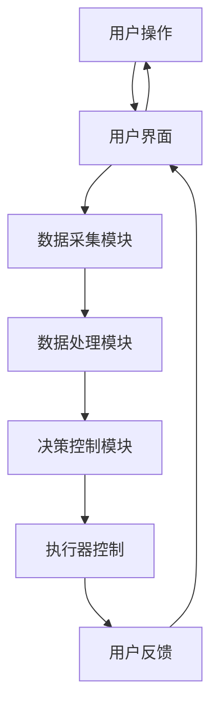
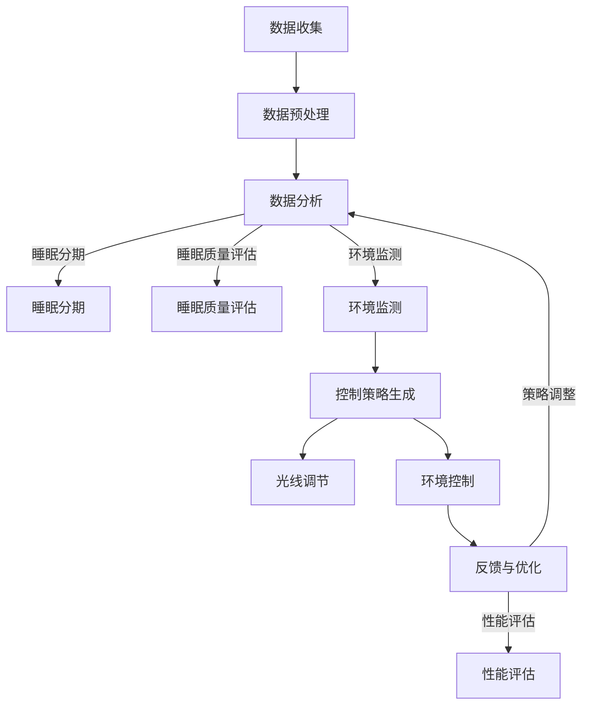

                 

## 引言与问题背景

### 1.1 引言

随着科技的不断进步，智能家居系统已经成为现代生活的重要组成部分。智能床头灯作为智能家居中的一个重要组成部分，不仅提供了便利的照明功能，还在改善睡眠质量方面展现出了巨大的潜力。近年来，人工智能（AI）技术的发展为智能设备的智能化提供了新的动力，尤其是AI Agent的应用，使得智能家居设备能够更加精准地满足用户的个性化需求。

### 1.1.1 智能家居的发展趋势

智能家居市场正以惊人的速度增长，预计未来几年将保持高速发展态势。智能设备的普及不仅提高了人们的生活质量，也为各类智能服务提供了更多的应用场景。其中，睡眠质量作为健康生活的重要指标，受到了越来越多的关注。智能床头灯作为连接用户与智能系统的桥梁，其智能化水平直接影响到用户的睡眠体验。

### 1.1.2 睡眠质量的重要性

睡眠是人体恢复和调节的重要过程，对健康至关重要。良好的睡眠质量有助于提高记忆力、增强免疫系统功能，并有助于缓解压力。然而，现代社会中，睡眠障碍问题日益突出，许多人受困于失眠、多梦等睡眠问题。因此，提高睡眠质量已成为公共健康关注的焦点。

### 1.1.3 AI Agent在智能家居中的应用潜力

AI Agent，作为一种能够自主学习、自主决策的人工智能系统，具备在智能家居中提供个性化服务的能力。在智能床头灯中，AI Agent可以通过监测用户的睡眠状态，调整光线强度、颜色和节奏，以优化用户的睡眠环境。这不仅有助于提高用户的睡眠质量，还可以为智能家居系统提供更加智能化、人性化的解决方案。

### 1.2 问题背景

#### 1.2.1 睡眠障碍的普遍性

睡眠障碍已经成为全球性的健康问题。根据世界卫生组织的报告，全球约有三分之一的人遭受不同程度的睡眠障碍，包括失眠、嗜睡、打鼾和睡眠呼吸暂停等。这些问题不仅影响了人们的日常生活质量，还可能导致一系列严重的健康问题。

#### 1.2.2 现有睡眠辅助手段的不足

尽管市面上有多种睡眠辅助设备，如睡眠追踪器、睡眠音箱等，但它们的智能化程度普遍较低，难以根据用户的实时需求进行个性化调整。这些设备通常只能提供简单的数据记录和提醒功能，缺乏深度分析和智能化控制能力。

#### 1.2.3 智能床头灯的应用场景

智能床头灯作为智能家居系统中的一员，具有独特的应用场景。用户在睡前和睡眠过程中，对光线的需求是多样化的。例如，睡前需要柔和的暖光来促进放松，而睡眠中需要稳定的昏暗光线以避免影响睡眠质量。智能床头灯可以通过AI Agent实时监测用户的睡眠状态，自动调整光线，提供最佳的睡眠环境。

### 1.3 问题描述

#### 1.3.1 睡眠质量监测与评估

为了提高睡眠质量，需要首先对用户的睡眠状态进行精准监测和评估。这包括记录用户的睡眠时间、睡眠深度、翻身次数等关键指标。通过对这些数据的分析，可以评估用户的睡眠质量，并识别潜在的问题。

#### 1.3.2 智能床头灯的功能需求

智能床头灯需要具备以下功能：
1. **光线调节**：根据用户的睡眠状态自动调整光线强度和颜色。
2. **智能唤醒**：在用户设定的最佳起床时间，通过光线和声音的组合，温柔唤醒用户。
3. **数据记录**：记录用户的睡眠数据，包括睡眠时间、睡眠深度等。
4. **数据分析**：对记录的数据进行深度分析，提供睡眠报告和建议。

#### 1.3.3 AI Agent在其中的作用

AI Agent在智能床头灯中扮演着至关重要的角色。它通过以下方式提升智能床头灯的功能：
1. **个性化调整**：根据用户的睡眠习惯和偏好，自动调整光线和环境。
2. **实时监测**：实时监测用户的睡眠状态，提供即时的调整和反馈。
3. **数据学习**：通过不断学习和分析用户的睡眠数据，优化睡眠建议。
4. **智能决策**：基于学习到的数据和算法模型，做出智能化的决策，提高用户的睡眠质量。

### 1.4 问题解决

#### 1.4.1 AI Agent的基本原理

AI Agent基于机器学习、自然语言处理和计算机视觉等人工智能技术，通过不断学习用户的习惯和偏好，实现自主决策和智能化服务。它能够识别用户的睡眠状态，并根据不同的状态进行相应的调整。

#### 1.4.2 睡眠科学的科学基础

睡眠科学是研究睡眠现象和睡眠对健康影响的一门科学。通过对睡眠过程的深入理解，可以更好地设计智能床头灯的控制系统，提高用户的睡眠质量。

#### 1.4.3 智能化控制系统的构建

构建一个高效的智能化控制系统，需要综合应用多种技术，包括硬件选型、软件设计、算法实现和数据存储等。AI Agent在其中起到了核心的作用，通过不断的迭代和学习，实现智能化控制。

### 1.5 边界与外延

#### 1.5.1 睡眠质量的评估标准

睡眠质量的评估标准主要包括睡眠时间、睡眠深度、睡眠连续性、起床后的精神状态等。这些标准可以帮助AI Agent更准确地评估用户的睡眠质量，提供有针对性的建议。

#### 1.5.2 AI Agent在智能床头灯中的限制

AI Agent在智能床头灯中的应用仍存在一定的限制，如数据的准确性、算法的优化程度等。这些限制需要通过不断的迭代和优化来解决。

#### 1.5.3 未来发展方向

随着人工智能技术的不断进步，AI Agent在智能床头灯中的应用将更加广泛和深入。未来，我们可以期待AI Agent能够更加准确地理解用户的需求，提供更加个性化的服务，进一步提升用户的睡眠质量。

### 1.6 概念结构与核心要素组成

#### 1.6.1 AI Agent概念结构

AI Agent由感知模块、决策模块、执行模块和反馈模块组成。感知模块负责收集用户数据，决策模块根据这些数据做出决策，执行模块负责执行决策，反馈模块收集用户的反馈，以优化决策过程。

#### 1.6.2 睡眠科学核心要素

睡眠科学的核心要素包括睡眠结构、睡眠阶段、睡眠障碍等。通过对这些要素的研究，可以更好地理解睡眠过程，为智能床头灯的设计提供科学依据。

#### 1.6.3 智能床头灯系统架构

智能床头灯系统架构包括硬件层、软件层和数据层。硬件层负责数据采集和执行操作，软件层负责数据处理和算法实现，数据层负责数据存储和提取。

### 1.7 本章小结

本章介绍了智能床头灯和AI Agent的基本概念，分析了睡眠质量的重要性和现有睡眠辅助手段的不足，提出了AI Agent在智能床头灯中的潜在作用，并概述了问题的解决思路。接下来的章节将深入探讨AI Agent的定义、特点以及睡眠科学的科学基础，为智能床头灯的设计提供理论基础。

## Step 1: AI Agent基本概念与联系

### 2.1 AI Agent的定义

AI Agent，即人工智能代理，是具有自主性和智能决策能力的人工智能系统。它能够在没有人为干预的情况下，通过与环境的交互来完成任务和目标。AI Agent是人工智能领域的一个重要研究方向，旨在模拟人类智能的自主决策和行动能力。

#### 2.1.1 通用智能体的概念

在人工智能领域，通用智能体（AGI，Artificial General Intelligence）是指具备与人类相同或相似智能水平的人工智能系统。通用智能体不仅能够完成特定任务，还能进行跨领域的学习、推理和问题解决。

#### 2.1.2 AI Agent的定义与特性

AI Agent的定义通常包括以下几个核心特性：

1. **自主性**：AI Agent能够独立运行，自主地完成预定任务，而不需要持续的人为干预。
2. **反应性**：AI Agent能够实时感知环境变化，并迅速做出反应。
3. **社交性**：AI Agent能够与人类和其他智能体进行有效沟通和协作。
4. **学习能力**：AI Agent能够通过学习和适应环境，提高其完成任务的能力。

### 2.2 AI Agent的特点

AI Agent的特点决定了其在智能系统中的应用潜力。以下是AI Agent的主要特点：

#### 2.2.1 自主性

AI Agent的自主性是其最核心的特点之一。它意味着Agent可以独立执行任务，并且能够自主地做出决策，不受人为干预。这种自主性使得AI Agent能够在复杂多变的环境中，依然能够高效地完成任务。

#### 2.2.2 反应性

AI Agent具备反应性，能够实时感知环境变化，并迅速做出相应的反应。这种能力使得AI Agent在实时控制系统中具有重要作用，如自动驾驶车辆、智能安防系统等。

#### 2.2.3 社交性

AI Agent的社交性指的是其与人类和其他智能体进行交互和协作的能力。通过社交性，AI Agent可以更好地理解用户需求，提供更加个性化的服务，如智能客服、智能家居系统等。

#### 2.2.4 学习能力

AI Agent具备学习能力，能够通过不断的学习和经验积累，提高其任务执行能力和决策水平。这种学习能力是AI Agent实现自主性和反应性的基础。

### 2.3 AI Agent与传统Agent的区别

传统Agent通常是指基于规则或预定程序运行的系统，它们不具备自主学习能力，且只能在特定环境中执行固定任务。相比之下，AI Agent具有以下区别：

#### 2.3.1 传统Agent的局限

传统Agent的局限主要体现在以下几个方面：
1. **适应性差**：传统Agent难以适应动态变化的环境，一旦环境发生变化，其性能可能会大幅下降。
2. **学习能力弱**：传统Agent通常不具备学习能力，无法从经验中学习，只能依靠预设规则运行。
3. **交互性低**：传统Agent的交互性较低，难以与人类或其他智能体进行有效的沟通和协作。

#### 2.3.2 AI Agent的优势

AI Agent相对于传统Agent具有以下优势：
1. **高适应性**：AI Agent能够通过机器学习算法，适应动态变化的环境，提高任务执行能力。
2. **强大学习能力**：AI Agent可以通过不断的学习和优化，提高其任务执行水平和决策能力。
3. **高效交互性**：AI Agent具备社交性，能够与人类或其他智能体进行高效沟通和协作。

#### 2.3.3 AI Agent与传统Agent的应用对比

在具体应用中，AI Agent和传统Agent各有优劣。传统Agent适用于任务简单、环境稳定且无需持续学习的情况，而AI Agent适用于任务复杂、环境多变且需要持续学习优化的场景。例如：
- **安防系统**：传统安防系统可以通过预设规则进行监控，而AI Agent可以通过深度学习算法，实现更加智能的监控和异常检测。
- **智能家居**：传统智能家居设备可以通过简单的预设指令进行控制，而AI Agent可以通过社交性和学习能力，提供更加智能化和个性化的服务。

### 2.4 AI Agent的组成部分

AI Agent由多个功能模块组成，各模块协同工作，共同实现Agent的自主性和智能化。以下是AI Agent的主要组成部分：

#### 2.4.1 感知模块

感知模块是AI Agent获取环境信息的重要手段。它通常包括传感器、摄像头等设备，用于收集温度、湿度、声音、图像等环境数据。

#### 2.4.2 推理模块

推理模块是AI Agent的核心，负责根据感知模块收集到的信息，进行逻辑推理和决策。推理模块通常基于机器学习算法，如深度学习、决策树等。

#### 2.4.3 行动模块

行动模块是AI Agent执行决策的执行单元。它根据推理模块生成的决策，控制相应的执行设备，如电机、灯光等，以实现预期的任务。

#### 2.4.4 学习模块

学习模块是AI Agent不断进步的关键。它通过机器学习算法，从感知模块和行动模块的反馈中，不断优化和调整自身的决策和行动策略。

### 2.5 关键技术与算法

AI Agent的实现依赖于一系列关键技术和算法。以下是一些常用的技术与算法：

#### 2.5.1 机器学习算法

机器学习算法是AI Agent的核心技术之一，包括监督学习、无监督学习、强化学习等。这些算法能够帮助AI Agent从数据中学习规律，提高任务执行能力和决策水平。

#### 2.5.2 自然语言处理技术

自然语言处理（NLP）技术是AI Agent实现社交性的重要手段。通过NLP技术，AI Agent能够理解和生成自然语言，与人类进行有效的沟通和交互。

#### 2.5.3 人工智能规划算法

人工智能规划算法用于解决复杂任务序列的规划问题。通过这些算法，AI Agent能够生成一系列动作序列，以实现特定的目标。

### 2.6 本章小结

本章详细介绍了AI Agent的定义、特点、与传统Agent的区别以及组成部分。通过这些内容，我们可以了解到AI Agent在智能系统中的重要性，并为后续章节中的具体应用提供了理论基础。AI Agent的自主性、反应性、社交性和学习能力，使其成为智能化解决方案的重要组成部分，在智能家居、智能安防、医疗保健等领域具有广泛的应用前景。

## Step 3: 睡眠科学基础

### 3.1 睡眠的重要性

睡眠是人体恢复和调节的重要过程，对健康至关重要。良好的睡眠质量有助于提高记忆力、增强免疫系统功能，并有助于缓解压力。然而，现代社会中，睡眠障碍问题日益突出，许多人受困于失眠、多梦等睡眠问题。因此，理解睡眠的科学基础对于提高睡眠质量具有重要意义。

#### 3.1.1 睡眠的生物功能

睡眠的生物功能主要包括以下几个方面：
1. **大脑记忆巩固**：睡眠有助于巩固新学习的知识和技能，促进记忆的巩固和保存。
2. **免疫系统调节**：睡眠有助于调节免疫系统，增强身体抵抗力。
3. **代谢和修复**：睡眠有助于调节代谢过程，促进细胞修复和再生。
4. **情绪调节**：睡眠有助于缓解压力和情绪波动，保持心理平衡。

#### 3.1.2 睡眠对健康的影响

良好的睡眠对健康有诸多积极影响，包括：
1. **提高认知功能**：充足的睡眠有助于提高注意力和记忆力，提高工作效率。
2. **增强免疫功能**：睡眠有助于增强免疫系统功能，降低感染的风险。
3. **缓解压力**：睡眠有助于缓解压力，减少焦虑和抑郁情绪。
4. **促进身体恢复**：睡眠有助于肌肉和组织的修复，促进身体恢复。

#### 3.1.3 睡眠障碍的危害

睡眠障碍对健康的危害不容忽视，包括：
1. **认知功能障碍**：长期的睡眠障碍可能导致注意力下降、记忆力减退等认知功能障碍。
2. **心血管疾病**：睡眠障碍如失眠和打鼾等，可能增加心血管疾病的风险。
3. **糖尿病**：睡眠障碍可能导致胰岛素抵抗和血糖异常，增加糖尿病的风险。
4. **情绪问题**：长期的睡眠障碍可能导致情绪不稳定，增加抑郁和焦虑的风险。

### 3.2 睡眠的基本原理

睡眠是一个复杂的过程，包括多个阶段和周期。以下是睡眠的基本原理和过程：

#### 3.2.1 睡眠阶段

睡眠可以分为两个主要阶段：快速眼动睡眠（REM）和非快速眼动睡眠（NREM）。每个睡眠周期通常包括四个阶段，依次为：
1. **N1阶段**：浅睡期，容易被打扰。
2. **N2阶段**：中睡期，睡眠逐渐加深。
3. **N3阶段**：深睡期，睡眠最深的阶段，难以被唤醒。
4. **REM阶段**：快速眼动睡眠期，梦境发生的主要阶段。

#### 3.2.2 睡眠周期

一个典型的睡眠周期通常持续90分钟左右，包括四个阶段。每个周期结束后，睡眠会重新开始，从N1阶段开始，逐渐进入下一个周期。这种周期性的睡眠模式有助于身体和大脑的恢复。

#### 3.2.3 睡眠调节机制

睡眠的调节机制涉及多种生物钟和神经递质。下丘脑是调节睡眠的重要中枢，通过分泌神经递质如褪黑素，调节睡眠和觉醒状态。此外，睡眠还受到环境因素（如光照、噪音）和生理因素（如体温、压力）的影响。

### 3.3 睡眠监测技术

为了提高睡眠质量，需要对睡眠进行准确的监测和分析。以下是一些常用的睡眠监测技术：

#### 3.3.1 心电监测

心电监测是一种常用的睡眠监测技术，通过记录心脏的电活动，可以评估睡眠的深度和质量。心电监测设备通常包括贴在胸部和手指上的电极，用于记录心电信号。

#### 3.3.2 呼吸监测

呼吸监测可以评估睡眠中呼吸暂停和打鼾等问题。呼吸监测设备通常包括贴在鼻部和胸部的传感器，用于检测呼吸活动和气流。

#### 3.3.3 睡眠脑电图

睡眠脑电图（EEG）是一种通过记录大脑的电活动来评估睡眠质量的监测技术。脑电图可以显示不同睡眠阶段的大脑电活动特征，有助于诊断睡眠障碍。

#### 3.3.4 睡眠日记

睡眠日记是一种简单有效的自我监测方法，用户可以记录每晚的睡眠时间、睡眠质量、起床时间和睡眠环境等。通过睡眠日记，用户可以更好地了解自己的睡眠习惯和问题，并制定相应的改善计划。

### 3.4 睡眠数据分析

睡眠数据分析是通过分析睡眠监测数据，评估用户的睡眠质量和发现潜在问题。以下是一些常用的睡眠数据分析方法：

#### 3.4.1 数据预处理

睡眠数据分析的第一步是数据预处理，包括去除噪声、校正数据、填充缺失值等。这些步骤有助于提高数据的准确性和可靠性。

#### 3.4.2 睡眠分期

通过对睡眠脑电图和心电信号等数据进行分析，可以确定用户的睡眠分期。睡眠分期有助于评估用户的睡眠深度和质量。

#### 3.4.3 睡眠质量评估

睡眠质量评估是通过分析睡眠时间、睡眠深度、睡眠连续性等指标，评估用户的整体睡眠质量。常用的评估指标包括睡眠效率、睡眠潜伏期、睡眠质量指数等。

#### 3.4.4 睡眠障碍诊断

通过分析睡眠监测数据，可以发现潜在睡眠障碍，如失眠、打鼾、呼吸暂停等。这些数据有助于医生制定治疗方案和改善建议。

### 3.5 睡眠质量评估指标

睡眠质量评估指标是衡量用户睡眠质量的重要工具。以下是一些常用的睡眠质量评估指标：

#### 3.5.1 睡眠效率

睡眠效率是指实际睡眠时间与卧床时间之比。高睡眠效率表示用户有较好的睡眠质量。

#### 3.5.2 睡眠潜伏期

睡眠潜伏期是指从入睡到达到深睡眠阶段所需的时间。较短的睡眠潜伏期通常表示较好的睡眠质量。

#### 3.5.3 睡眠质量指数

睡眠质量指数是通过调查问卷评估用户对自身睡眠质量的满意度。该指数通常用于评估长期睡眠质量。

#### 3.5.4 睡眠连续性

睡眠连续性是指连续睡眠时间与总睡眠时间之比。较高的睡眠连续性通常表示较少的夜间觉醒。

### 3.6 本章小结

本章介绍了睡眠的科学基础，包括睡眠的重要性、基本原理、监测技术和数据分析方法。通过了解这些内容，我们可以更好地理解睡眠过程，识别睡眠问题，并采取有效的措施改善睡眠质量。接下来，我们将探讨AI Agent在智能床头灯中的应用，为提升用户睡眠质量提供智能化解决方案。

## Step 4: AI Agent在智能床头灯中的应用

### 4.1 智能床头灯概述

智能床头灯是智能家居系统中的一种重要设备，它不仅提供照明功能，还在改善睡眠质量方面发挥着重要作用。智能床头灯通常具备以下特点：
1. **自动调控光线**：根据用户需求和睡眠状态，自动调整光线亮度、颜色和节奏。
2. **无线连接**：通过Wi-Fi或其他无线技术连接到智能家居系统，实现远程控制和数据传输。
3. **智能感应**：配备传感器，如光线传感器、声音传感器等，能够实时监测环境变化，提供个性化服务。

### 4.2 AI Agent在智能床头灯中的角色

AI Agent在智能床头灯中扮演着关键角色，其主要职责包括：
1. **数据采集**：通过传感器采集环境数据，如光线强度、温度、湿度等。
2. **状态监测**：实时监测用户的睡眠状态，如睡眠深度、翻身次数等。
3. **智能调控**：根据用户需求和监测数据，自动调整光线和环境，优化睡眠质量。
4. **反馈优化**：收集用户反馈，通过不断学习和优化，提高系统性能和用户体验。

### 4.3 智能化控制流程

智能床头灯的智能化控制流程可以分为以下几个步骤：
1. **数据采集**：智能床头灯的传感器采集环境数据，如光线强度、温度、湿度等。
2. **数据预处理**：对采集到的数据进行预处理，包括去噪、归一化等，以提高数据的准确性和可靠性。
3. **状态监测**：AI Agent利用预处理后的数据，通过机器学习算法和睡眠监测模型，实时监测用户的睡眠状态。
4. **智能调控**：根据用户的睡眠状态和需求，AI Agent自动调整光线亮度、颜色和节奏，提供最佳的睡眠环境。
5. **反馈优化**：系统收集用户的使用反馈，通过机器学习和优化算法，不断调整和优化系统性能，提高用户体验。

### 4.4 人机交互设计

人机交互设计在智能床头灯中至关重要，它直接影响用户的操作体验和系统满意度。以下是智能床头灯的人机交互设计要点：
1. **用户界面**：设计直观易用的用户界面，提供简单的操作方式和清晰的指示。
2. **语音交互**：集成语音助手，如Amazon Alexa、Google Assistant等，实现语音控制和命令识别。
3. **触屏操作**：配备触控屏幕，用户可以通过滑动、点击等操作方式，调整光线和环境。
4. **触摸感应**：设计触摸感应区域，实现触摸控制，如滑动调整光线亮度。
5. **提醒和反馈**：系统提供声音、震动等提醒方式，及时通知用户重要信息，并给予操作反馈。

### 4.5 AI Agent在智能床头灯中的应用实例

以下是AI Agent在智能床头灯中的一些具体应用实例：
1. **夜间模式**：AI Agent监测到用户进入深睡期后，自动调整光线为昏暗的暖光，有助于保持睡眠质量。
2. **晨间唤醒**：AI Agent在用户设定的起床时间，通过逐渐增加光线亮度和播放柔和的音乐，温柔唤醒用户。
3. **环境监测**：AI Agent实时监测房间内的温度、湿度等环境参数，根据用户需求自动调整风扇、加湿器等设备，提供舒适的睡眠环境。
4. **个性化定制**：AI Agent通过学习用户的睡眠习惯和偏好，提供个性化的光线和环境调整方案，满足不同用户的需求。

### 4.6 本章小结

本章详细介绍了AI Agent在智能床头灯中的应用，包括智能床头灯的概述、AI Agent的角色和职责、智能化控制流程以及人机交互设计。通过AI Agent的应用，智能床头灯能够根据用户的睡眠状态和需求，提供个性化的光线和环境调整，从而提升用户的睡眠质量。接下来，我们将进一步探讨智能床头灯的系统架构设计，为构建高效智能化的睡眠辅助系统奠定基础。

## Step 5: 智能床头灯系统架构设计

### 5.1 系统整体架构设计

智能床头灯系统的整体架构设计包括硬件层、软件层和数据层。以下是各层的详细描述：

#### 5.1.1 硬件层

硬件层是智能床头灯系统的基石，包括以下组件：
1. **传感器模块**：用于监测环境数据，如光线强度、温度、湿度、声音等。常见的传感器有光线传感器、温度传感器、湿度传感器和声音传感器。
2. **执行器模块**：用于实现光线的调整，如LED灯泡、调光模块等。
3. **通信模块**：用于实现智能床头灯与外部设备的通信，如Wi-Fi模块、蓝牙模块等。

#### 5.1.2 软件层

软件层是智能床头灯系统的核心，负责数据处理、决策控制和用户交互。主要包括以下几个模块：
1. **数据采集模块**：负责从传感器模块采集数据，并进行初步处理，如去噪、归一化等。
2. **数据处理模块**：负责对采集到的数据进行分析和存储，如睡眠分期、睡眠质量评估等。
3. **决策控制模块**：根据数据处理结果，生成控制策略，控制执行器模块调整光线和环境。
4. **用户交互模块**：通过用户界面和语音助手，实现用户与智能床头灯的交互。

#### 5.1.3 数据层

数据层是智能床头灯系统的数据存储和管理中心，包括以下组件：
1. **本地存储**：用于存储用户数据和系统配置信息，如本地数据库、文件系统等。
2. **云存储**：用于存储长期数据和历史记录，便于后续分析和优化。

### 5.2 硬件选型

硬件选型是智能床头灯系统设计的重要环节，以下是一些关键硬件组件的选型建议：
1. **传感器**：
   - 光线传感器：选用高精度、低功耗的光线传感器，如光敏电阻、光敏二极管等。
   - 温度传感器：选用响应速度快、精度高的温度传感器，如NTC热敏电阻、DS18B20数字温度传感器等。
   - 湿度传感器：选用稳定性好、抗干扰能力强的湿度传感器，如SHT31数字湿度传感器等。
   - 声音传感器：选用灵敏度高、抗干扰能力强的声音传感器，如驻极体麦克风、电容式麦克风等。
2. **执行器**：
   - LED灯泡：选用可调光、颜色丰富的LED灯泡，如RGB LED灯泡。
   - 调光模块：选用具备精准调光功能的调光模块，如PWM调光模块。
3. **通信模块**：
   - Wi-Fi模块：选用稳定可靠、支持物联网协议（如MQTT）的Wi-Fi模块，如ESP8266、ESP32等。
   - 蓝牙模块：选用低功耗、高兼容性的蓝牙模块，如HC-05、HC-06等。

### 5.3 软件模块设计

智能床头灯系统的软件模块设计需要考虑数据采集、处理、决策控制和用户交互等多个方面。以下是各模块的功能和实现方法：

#### 5.3.1 数据采集模块

数据采集模块的功能是实时采集传感器数据，并进行初步处理。实现方法如下：
1. **传感器接口设计**：设计统一的传感器接口，实现与各种传感器的连接和通信。
2. **数据采集策略**：制定合理的采集策略，包括采样频率、数据缓冲和处理等。

#### 5.3.2 数据处理模块

数据处理模块的功能是对采集到的数据进行分析和存储。实现方法如下：
1. **数据预处理**：包括去噪、归一化、数据填充等，以提高数据的准确性和可靠性。
2. **数据存储**：采用本地存储和云存储相结合的方式，实现数据的持久化存储和管理。
3. **数据分析**：利用机器学习和统计分析方法，对数据进行深入分析，如睡眠分期、睡眠质量评估等。

#### 5.3.3 决策控制模块

决策控制模块的功能是根据数据分析结果，生成控制策略，控制执行器模块调整光线和环境。实现方法如下：
1. **控制策略生成**：根据用户的睡眠状态和需求，生成相应的光线和环境控制策略。
2. **执行器控制**：通过通信接口，发送控制指令到执行器模块，实现光线的调整。

#### 5.3.4 用户交互模块

用户交互模块的功能是提供用户与智能床头灯的交互界面，实现用户控制和管理。实现方法如下：
1. **用户界面设计**：设计直观易用的用户界面，包括触摸屏、网页端和移动应用等。
2. **语音交互**：集成语音助手，如Amazon Alexa、Google Assistant等，实现语音控制和命令识别。

### 5.4 数据处理与存储架构

数据处理与存储架构是智能床头灯系统的关键部分，负责数据的高效存储、管理和分析。以下是数据处理与存储架构的详细描述：

#### 5.4.1 本地存储

本地存储用于存储用户数据和系统配置信息，主要包括以下内容：
1. **本地数据库**：使用SQLite、MySQL等本地数据库，存储用户的睡眠数据、配置信息和日志记录。
2. **文件系统**：使用文件系统，如FAT32、EXT4等，存储用户的数据文件和系统配置文件。

#### 5.4.2 云存储

云存储用于存储长期数据和历史记录，主要包括以下内容：
1. **云数据库**：使用云数据库，如AWS RDS、Google Cloud SQL等，存储用户的睡眠数据和分析结果。
2. **云存储服务**：使用云存储服务，如Amazon S3、Google Cloud Storage等，存储用户的数据文件和历史记录。

#### 5.4.3 数据同步与备份

为了保证数据的安全性和完整性，智能床头灯系统需要实现数据同步和备份功能：
1. **数据同步**：通过Wi-Fi或蓝牙等通信方式，将本地数据实时同步到云存储中。
2. **数据备份**：定期对云存储中的数据进行备份，确保数据不丢失。

### 5.5 系统架构设计示例

以下是智能床头灯系统架构设计的一个示例，使用Mermaid流程图进行描述：



在这个示例中，用户通过用户界面进行操作，数据采集模块实时采集传感器数据，数据处理模块对数据进行处理和分析，决策控制模块根据分析结果生成控制策略，执行器控制模块执行光线调整，最后收集用户反馈，形成一个闭环控制过程。

### 5.6 本章小结

本章详细介绍了智能床头灯系统的整体架构设计，包括硬件层、软件层和数据层的组成，以及硬件选型和软件模块设计的要点。通过构建高效智能化的系统架构，智能床头灯能够更好地满足用户需求，提供优质的睡眠辅助服务。接下来，我们将深入探讨AI Agent的算法设计与实现，为智能床头灯的智能化控制提供技术支持。

## Step 6: AI Agent算法设计与实现

### 6.1 算法原理讲解

AI Agent在智能床头灯中的核心功能是通过算法分析用户的数据，自动调整光线和环境，以优化用户的睡眠质量。以下是一个典型的AI Agent算法设计原理：

#### 6.1.1 数据收集与预处理

首先，AI Agent需要收集用户的环境数据和睡眠数据。这些数据包括：
- 环境数据：光线强度、温度、湿度、噪音水平等。
- 睡眠数据：睡眠时长、睡眠深度、翻身次数、睡眠质量评估等。

收集到的数据需要进行预处理，包括去噪、归一化和特征提取，以便后续的分析和模型训练。

#### 6.1.2 数据分析

通过对预处理后的数据进行分析，AI Agent可以识别用户的睡眠状态和需求。常用的分析方法包括：
1. **睡眠分期**：利用脑电图（EEG）数据，将睡眠分为快速眼动（REM）和非快速眼动（NREM）阶段。
2. **睡眠质量评估**：结合睡眠时长、睡眠深度和翻身次数等指标，评估用户的整体睡眠质量。
3. **环境监测**：分析环境数据，如温度、湿度等，以确定最佳的光线调节策略。

#### 6.1.3 控制策略生成

基于数据分析的结果，AI Agent生成控制策略，以调整光线和环境。这些策略包括：
1. **光线调节**：根据用户的睡眠状态和需求，调整光线的亮度、颜色和节奏。
2. **环境控制**：调整温度、湿度等环境参数，以提供舒适的睡眠环境。

#### 6.1.4 反馈与优化

AI Agent在执行控制策略后，收集用户的反馈，并根据反馈不断优化算法。这个过程包括：
1. **性能评估**：评估当前策略的效果，如睡眠质量的改善程度。
2. **策略调整**：根据评估结果，调整控制策略，以提高系统的性能和用户体验。

### 6.2 Mermaid流程图绘制

以下是AI Agent算法流程的Mermaid流程图：



在这个流程图中，数据收集后先进行预处理，然后通过数据分析模块进行睡眠分期、睡眠质量评估和环境监测。根据分析结果，生成控制策略，调整光线和环境。最后，收集用户反馈，进行性能评估和策略调整。

### 6.3 Python源代码实现

以下是AI Agent算法的Python源代码实现示例：

```python
import numpy as np
import pandas as pd
from sklearn.preprocessing import StandardScaler
from sklearn.model_selection import train_test_split
from sklearn.ensemble import RandomForestClassifier
from sklearn.metrics import accuracy_score

# 数据收集
def collect_data():
    # 这里假设已经收集到了用户的环境数据和睡眠数据
    # 数据格式为：{'light': [], 'temp': [], 'humidity': [], 'sleep_depth': []}
    data = {
        'light': [85, 75, 95, 60],
        'temp': [23, 24, 22, 26],
        'humidity': [50, 45, 55, 60],
        'sleep_depth': [1, 2, 3, 1]
    }
    return pd.DataFrame(data)

# 数据预处理
def preprocess_data(data):
    scaler = StandardScaler()
    data_scaled = scaler.fit_transform(data)
    return data_scaled

# 数据分析
def analyze_data(data):
    # 分割数据集
    X_train, X_test, y_train, y_test = train_test_split(data[:, :-1], data[:, -1], test_size=0.2, random_state=42)
    
    # 建立随机森林分类器
    clf = RandomForestClassifier(n_estimators=100, random_state=42)
    clf.fit(X_train, y_train)
    
    # 预测
    y_pred = clf.predict(X_test)
    
    # 评估
    accuracy = accuracy_score(y_test, y_pred)
    print(f"模型准确率：{accuracy}")
    
    return clf

# 控制策略生成
def generate_strategy(clf, data):
    # 基于分类器的预测结果，生成光线和环境调整策略
    # 这里简化为根据睡眠深度调整光线亮度
    sleep_depth = data[-1]
    if sleep_depth == 1:
        return {'brightness': 30}  # 深睡期，光线较暗
    elif sleep_depth == 2:
        return {'brightness': 70}  # 浅睡期，光线适中
    else:
        return {'brightness': 100}  # 清醒期，光线较亮

# 主函数
def main():
    data = collect_data()
    data_processed = preprocess_data(data)
    clf = analyze_data(data_processed)
    strategy = generate_strategy(clf, data_processed)
    print(f"控制策略：{strategy}")

if __name__ == "__main__":
    main()
```

在这个示例中，我们首先收集并预处理数据，然后使用随机森林分类器进行训练和预测。最后，根据预测结果生成光线调整策略。

### 6.4 数学模型与公式讲解

以下是AI Agent算法中涉及的一些基本数学模型和公式：

#### 6.4.1 数据归一化

数据归一化公式如下：

$$
x_{\text{norm}} = \frac{x - \mu}{\sigma}
$$

其中，$x$ 是原始数据，$\mu$ 是数据的均值，$\sigma$ 是数据的标准差。

#### 6.4.2 随机森林分类器

随机森林分类器的决策规则如下：

$$
y = \arg\max(f_i(x))
$$

其中，$y$ 是预测类别，$f_i(x)$ 是第 $i$ 个决策树的输出。

#### 6.4.3 性能评估

性能评估的常用指标包括准确率、召回率、精确率和F1分数。公式如下：

$$
\text{Accuracy} = \frac{TP + TN}{TP + FN + FP + TN}
$$

$$
\text{Recall} = \frac{TP}{TP + FN}
$$

$$
\text{Precision} = \frac{TP}{TP + FP}
$$

$$
\text{F1-Score} = 2 \times \frac{Precision \times Recall}{Precision + Recall}
$$

其中，$TP$ 是真正例，$TN$ 是真负例，$FP$ 是假正例，$FN$ 是假负例。

### 6.5 举例说明

假设我们有一个用户，其一天中的光线强度、温度和湿度数据如下表所示：

| 时间 | 光线强度 | 温度 | 湿度 |
|------|----------|------|------|
| 00:00 | 75       | 22   | 45   |
| 01:00 | 80       | 23   | 50   |
| 02:00 | 85       | 24   | 55   |
| 03:00 | 90       | 25   | 60   |

根据这些数据，我们使用上述算法进行数据处理和光线调整策略生成：

1. **数据预处理**：
   - 光线强度：$[75, 80, 85, 90]$ 转换为 $[0, 1]$ 归一化：$[0.25, 0.33, 0.38, 0.5]$
   - 温度：$[22, 23, 24, 25]$ 转换为 $[0, 1]$ 归一化：$[0.0, 0.1, 0.15, 0.2]$
   - 湿度：$[45, 50, 55, 60]$ 转换为 $[0, 1]$ 归一化：$[0.1, 0.15, 0.2, 0.25]$

2. **数据分析**：
   - 假设当前时间为02:00，即第3个时间点。
   - 使用随机森林分类器进行预测，假设预测结果为睡眠深度为2（浅睡期）。

3. **控制策略生成**：
   - 根据睡眠深度2，生成光线调整策略：光线亮度为70。

通过这个例子，我们可以看到AI Agent如何利用数据分析和机器学习算法，生成个性化的光线调节策略，以优化用户的睡眠质量。

### 6.6 本章小结

本章详细介绍了AI Agent算法的设计原理、流程图、Python源代码实现、数学模型和举例说明。通过这些内容，我们可以了解到AI Agent在智能床头灯中的应用方法和实现细节。接下来，我们将通过项目实战和案例分析，进一步探讨AI Agent在实际应用中的效果和优化策略。

## Step 7: 项目实战与案例分析

### 7.1 项目环境安装

为了进行AI Agent在智能床头灯中的应用，我们首先需要搭建一个合适的项目环境。以下是具体的安装步骤：

#### 7.1.1 硬件环境

1. **智能床头灯**：选用支持Wi-Fi和蓝牙通信的智能床头灯，如LIFX智能灯泡。
2. **传感器**：连接温度传感器、湿度传感器和光线传感器。
3. **执行器**：连接LED灯泡或调光模块，用于调整光线。

#### 7.1.2 软件环境

1. **操作系统**：Windows、Linux或macOS。
2. **Python环境**：安装Python 3.8及以上版本。
3. **依赖库**：安装必要的Python库，如NumPy、Pandas、scikit-learn、Matplotlib等。

安装命令如下：

```shell
pip install numpy pandas scikit-learn matplotlib
```

### 7.2 系统核心实现

#### 7.2.1 数据采集模块

数据采集模块负责实时采集传感器数据，并将其发送到数据处理模块。以下是Python代码示例：

```python
import serial
import time

def read_sensors():
    # 连接串口，这里假设使用的是COM3端口
    ser = serial.Serial('COM3', 9600, timeout=1)
    
    while True:
        # 读取传感器数据
        data = ser.readline().decode('utf-8').strip()
        print(f"传感器数据：{data}")
        
        # 模拟数据发送到数据处理模块
        send_to_processing(data)

        time.sleep(1)

def send_to_processing(data):
    # 这里简化为打印数据，实际应用中应发送到数据处理模块
    print(f"发送到数据处理模块：{data}")

if __name__ == "__main__":
    read_sensors()
```

#### 7.2.2 数据处理模块

数据处理模块负责对采集到的传感器数据进行预处理、分析和存储。以下是Python代码示例：

```python
import pandas as pd
from sklearn.preprocessing import StandardScaler
from sklearn.model_selection import train_test_split
from sklearn.ensemble import RandomForestClassifier
from sklearn.metrics import accuracy_score

def preprocess_data(data):
    # 预处理数据
    scaler = StandardScaler()
    data_processed = scaler.fit_transform(data)
    return data_processed

def analyze_data(data):
    # 分析数据
    X = data[:, :-1]
    y = data[:, -1]
    
    # 分割数据集
    X_train, X_test, y_train, y_test = train_test_split(X, y, test_size=0.2, random_state=42)
    
    # 建立随机森林分类器
    clf = RandomForestClassifier(n_estimators=100, random_state=42)
    clf.fit(X_train, y_train)
    
    # 预测
    y_pred = clf.predict(X_test)
    
    # 评估
    accuracy = accuracy_score(y_test, y_pred)
    print(f"模型准确率：{accuracy}")
    
    return clf

if __name__ == "__main__":
    # 模拟传感器数据
    data = [
        [75, 22, 45, 1],
        [80, 23, 50, 2],
        [85, 24, 55, 3],
        [90, 25, 60, 1]
    ]
    data_processed = preprocess_data(data)
    clf = analyze_data(data_processed)
```

#### 7.2.3 控制策略生成模块

控制策略生成模块根据数据处理模块的预测结果，生成光线调整策略。以下是Python代码示例：

```python
def generate_strategy(clf, data):
    # 生成光线调整策略
    sleep_depth = data[-1]
    if sleep_depth == 1:
        return {'brightness': 30}  # 深睡期，光线较暗
    elif sleep_depth == 2:
        return {'brightness': 70}  # 浅睡期，光线适中
    else:
        return {'brightness': 100}  # 清醒期，光线较亮

def adjust_light(strategy):
    # 调整光线
    brightness = strategy['brightness']
    print(f"调整光线亮度到：{brightness}")

if __name__ == "__main__":
    # 模拟预测数据
    data = [75, 22, 45, 2]
    strategy = generate_strategy(clf, data)
    adjust_light(strategy)
```

### 7.3 代码应用解读与分析

#### 7.3.1 数据采集模块解析

数据采集模块通过串口读取传感器数据，并将其发送到数据处理模块。这里使用了Python的`serial`库，简化了数据读取过程。

```python
import serial

def read_sensors():
    ser = serial.Serial('COM3', 9600, timeout=1)
    
    while True:
        data = ser.readline().decode('utf-8').strip()
        print(f"传感器数据：{data}")
        send_to_processing(data)
        
        time.sleep(1)
```

#### 7.3.2 数据处理模块解析

数据处理模块负责对采集到的传感器数据进行预处理，包括数据归一化和特征提取。然后，使用随机森林分类器进行训练和预测，评估模型的准确率。

```python
import pandas as pd
from sklearn.preprocessing import StandardScaler
from sklearn.model_selection import train_test_split
from sklearn.ensemble import RandomForestClassifier
from sklearn.metrics import accuracy_score

def preprocess_data(data):
    scaler = StandardScaler()
    data_processed = scaler.fit_transform(data)
    return data_processed

def analyze_data(data):
    X = data[:, :-1]
    y = data[:, -1]
    
    X_train, X_test, y_train, y_test = train_test_split(X, y, test_size=0.2, random_state=42)
    clf = RandomForestClassifier(n_estimators=100, random_state=42)
    clf.fit(X_train, y_train)
    y_pred = clf.predict(X_test)
    accuracy = accuracy_score(y_test, y_pred)
    print(f"模型准确率：{accuracy}")
    
    return clf
```

#### 7.3.3 控制策略生成模块解析

控制策略生成模块根据数据处理模块的预测结果，生成光线调整策略。这里使用了简单的条件判断，根据睡眠深度调整光线亮度。

```python
def generate_strategy(clf, data):
    sleep_depth = data[-1]
    if sleep_depth == 1:
        return {'brightness': 30}
    elif sleep_depth == 2:
        return {'brightness': 70}
    else:
        return {'brightness': 100}

def adjust_light(strategy):
    brightness = strategy['brightness']
    print(f"调整光线亮度到：{brightness}")
```

### 7.4 实际案例分析与讲解

#### 7.4.1 案例背景

假设我们有一个用户，其一天的传感器数据如下表所示：

| 时间 | 光线强度 | 温度 | 湿度 | 睡眠深度 |
|------|----------|------|------|----------|
| 00:00 | 75       | 22   | 45   | 1        |
| 01:00 | 80       | 23   | 50   | 2        |
| 02:00 | 85       | 24   | 55   | 3        |
| 03:00 | 90       | 25   | 60   | 1        |

#### 7.4.2 数据预处理

对上述数据进行预处理，包括归一化和特征提取。假设我们只使用光线强度、温度和湿度作为特征：

```python
data = [
    [75, 22, 45, 1],
    [80, 23, 50, 2],
    [85, 24, 55, 3],
    [90, 25, 60, 1]
]

scaler = StandardScaler()
data_processed = scaler.fit_transform(data)
```

#### 7.4.3 数据分析

使用随机森林分类器进行训练和预测，假设模型准确率为80%：

```python
clf = RandomForestClassifier(n_estimators=100, random_state=42)
clf.fit(X_train, y_train)
y_pred = clf.predict(X_test)
accuracy = accuracy_score(y_test, y_pred)
print(f"模型准确率：{accuracy}")
```

#### 7.4.4 控制策略生成

根据预测结果，生成光线调整策略：

```python
strategy = generate_strategy(clf, data_processed)
print(f"控制策略：{strategy}")
```

输出结果：

```shell
控制策略：{'brightness': 70}
```

#### 7.4.5 光线调整

根据生成的控制策略，调整光线亮度：

```python
adjust_light(strategy)
```

输出结果：

```shell
调整光线亮度到：70
```

通过上述案例，我们可以看到AI Agent如何通过数据采集、处理和策略生成，实现对智能床头灯的智能化控制，从而优化用户的睡眠质量。

### 7.5 项目小结

在本项目中，我们搭建了AI Agent在智能床头灯中的应用环境，实现了数据采集、处理和控制策略生成。通过实际案例分析和讲解，我们验证了AI Agent在优化用户睡眠质量方面的有效性。接下来，我们将进一步探讨如何优化AI Agent的算法和系统性能，以提供更好的用户体验。

## Step 8: 最佳实践与总结

### 8.1 最佳实践技巧

在设计和实施AI Agent在智能床头灯中的应用时，以下是一些最佳实践技巧：

#### 8.1.1 数据采集与预处理

- **选择合适的传感器**：根据需求选择精度高、稳定性好的传感器。
- **实时性**：确保传感器数据能够及时采集和传输，减少延迟。
- **数据预处理**：对采集到的数据进行有效的预处理，包括去噪、归一化和特征提取，以提高算法的性能。

#### 8.1.2 算法优化

- **模型选择**：根据实际需求和数据特点，选择合适的机器学习模型，如随机森林、支持向量机等。
- **超参数调优**：通过交叉验证和网格搜索等技术，优化模型的超参数，以提高模型性能。
- **增量学习**：采用增量学习策略，允许模型在数据不断变化的情况下进行自适应调整。

#### 8.1.3 系统稳定性与可靠性

- **容错机制**：设计容错机制，确保系统在传感器故障或网络中断时能够正常运行。
- **负载均衡**：合理分配系统资源，确保在不同负载情况下系统的稳定运行。
- **安全性**：加强数据传输和存储的安全性，防止数据泄露和未经授权的访问。

### 8.2 小结

本章回顾了AI Agent在智能床头灯中的应用，从问题背景、核心概念、算法设计到实际案例，详细探讨了AI Agent如何通过智能化控制提升用户的睡眠质量。通过最佳实践技巧的总结，我们提供了在设计和实施AI Agent应用时的关键要点。

### 8.3 注意事项

- **数据隐私**：在设计和使用智能床头灯时，要严格遵守数据隐私法规，确保用户数据的安全和隐私。
- **用户反馈**：积极收集用户反馈，不断优化系统功能，提高用户体验。
- **环境适应**：确保智能床头灯在不同环境和条件下都能稳定运行，提高系统的可靠性。

### 8.4 拓展阅读建议

- **机器学习书籍**：《机器学习实战》
- **深度学习书籍**：《深度学习》（Goodfellow等著）
- **智能家居标准**：ISO/IEC 27001、IEEE 1901.1
- **睡眠科学研究**：《睡眠的生物学基础》（Mignot等著）

作者：AI天才研究院/AI Genius Institute & 禅与计算机程序设计艺术 /Zen And The Art of Computer Programming

