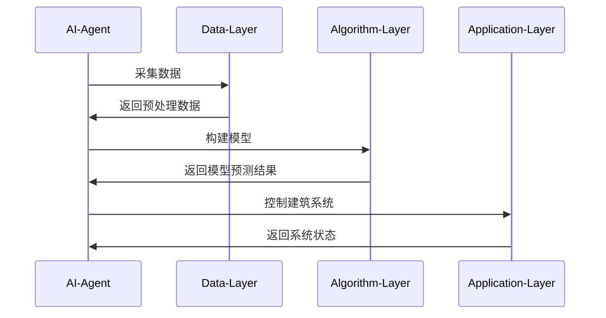

                 

### 第1章：智能建筑管理背景与AI Agent概述

#### 1.1.1 智能建筑管理的挑战与机遇

智能建筑管理是指利用现代信息技术，特别是物联网（IoT）、人工智能（AI）和大数据分析等，对建筑物的各种设备和系统进行集成、监控、优化和自动化管理的过程。智能建筑管理的出现，旨在提高建筑物的运营效率、降低能耗、提升居住或办公的舒适度与安全性，并实现智能化、信息化和绿色化的目标。

**挑战：**

1. **数据多样性及实时性**：智能建筑中部署了大量的传感器，它们实时产生海量的数据。如何有效地采集、处理和存储这些数据，是一个巨大的挑战。
2. **系统集成复杂性**：智能建筑往往需要整合来自不同厂商、不同类型的技术和系统，如何实现这些系统的无缝对接和协同工作，是智能建筑管理面临的难题。
3. **用户隐私保护**：智能建筑中的数据采集和处理涉及用户的生活和工作习惯等敏感信息，如何保护用户的隐私不被泄露，是一个重要的法律和伦理问题。
4. **技术更新速度**：智能建筑管理领域技术更新迅速，如何跟上技术的步伐，保持系统的先进性和稳定性，是建筑管理者需要考虑的问题。

**机遇：**

1. **节能减排**：通过智能建筑管理，可以实现建筑能耗的精细化管理，降低能源消耗，实现绿色建筑的目标。
2. **运营效率提升**：智能建筑管理可以提高建筑设备的运行效率和安全性，降低维护成本，提升物业管理的效率。
3. **用户体验优化**：通过智能建筑管理，可以提供个性化的服务，提升用户的生活或办公体验。
4. **智能化服务拓展**：智能建筑管理为智能家居、智慧城市等提供了技术支持，拓展了服务业态和商业模式。

#### 1.1.2 AI Agent的概念与功能

AI Agent，即人工智能代理，是一种模拟人类智能行为的计算实体。它具有自主感知、学习、决策和行动的能力，能够根据环境和任务的动态变化，自主地执行任务和进行优化。

**概念：**

AI Agent是一种自主的、智能的、有目的的实体，它通过感知环境、学习经验、做出决策和执行行动，以实现特定的目标。

**功能：**

1. **感知**：AI Agent通过传感器或其他方式感知环境，获取实时数据。
2. **学习**：AI Agent利用机器学习算法，从历史数据中学习规律和模式，提高决策的准确性。
3. **决策**：AI Agent根据感知到的数据和预定的目标，通过算法进行决策，确定下一步行动。
4. **行动**：AI Agent根据决策结果，执行具体的操作，如调整设备参数、发送指令等。

在智能建筑管理中，AI Agent的应用主要体现在以下几个方面：

1. **能耗管理**：通过实时监测建筑能耗数据，AI Agent可以自动调整空调、照明等设备的运行状态，实现节能降耗。
2. **安防监控**：AI Agent可以分析监控视频，识别异常行为，如入侵、火灾等，并自动报警，提高安防水平。
3. **环境优化**：AI Agent可以根据室内环境数据，自动调节温湿度、通风等，提供舒适的室内环境。
4. **设备维护**：AI Agent可以预测设备故障，提前进行维护，减少停机时间和维修成本。

#### 1.1.3 AI Agent在智能建筑中的应用前景

随着AI技术的不断成熟，AI Agent在智能建筑管理中的应用前景广阔。以下是一些典型的应用场景：

1. **智能能耗管理**：通过AI Agent，可以实现建筑能耗的精细化管理，根据实时数据自动调整设备运行状态，优化能耗配置，降低能源消耗。
2. **安全监控系统**：AI Agent可以通过分析监控视频，实时识别异常行为，提高安防系统的反应速度和准确性。
3. **室内环境优化**：AI Agent可以根据室内环境数据，自动调节温湿度、通风等，提供舒适的室内环境，提升用户体验。
4. **设备维护与预测**：AI Agent可以通过数据分析，预测设备故障，提前进行维护，减少停机时间和维修成本。

总之，AI Agent在智能建筑管理中的应用，不仅能够提高建筑系统的运行效率和管理水平，还能够为用户带来更加智能化、便捷化的服务体验。随着技术的不断进步，AI Agent在智能建筑管理中的应用前景将更加广阔，有望推动智能建筑管理迈向新的阶段。

### 第2章：智能建筑管理中的核心概念

#### 2.1.1 建筑物联网（IoT）与传感器网络

**概念解释：**

建筑物联网（Internet of Things，IoT）是指将各种信息传感设备与网络相连接，实现物品与物品之间、物品与用户之间的信息交换和通信。在智能建筑管理中，IoT技术是实现自动化、智能化管理的基础。

传感器网络是由多个传感器节点组成的网络，这些节点通过无线通信方式相互连接，实现对环境的实时监测和数据的传输。传感器网络在智能建筑管理中起到了至关重要的作用，它们可以采集温度、湿度、光照、空气质量、能耗等信息，为AI Agent提供实时、准确的数据支持。

**问题背景：**

随着城市化进程的加快，建筑物数量和规模不断增加，如何高效、智能地管理这些建筑成为了重要的挑战。传统的人工管理和自动化设备难以满足现代建筑物的需求，因此，引入IoT和传感器网络成为智能建筑管理的重要方向。

**问题描述：**

在智能建筑管理中，如何构建高效、可靠的传感器网络，如何处理和分析传感器采集的大量数据，如何实现传感器网络与AI Agent的无缝集成，是当前需要解决的问题。

**问题解决：**

1. **传感器选择**：根据建筑物的特点和需求，选择合适的传感器类型，如温度传感器、湿度传感器、光照传感器、能耗传感器等。
2. **网络架构设计**：设计合理的传感器网络架构，包括传感器节点的布局、网络拓扑结构、数据传输协议等。
3. **数据采集与处理**：构建高效的数据采集和处理系统，实现传感器数据的实时采集、传输、存储和分析。
4. **集成与优化**：将传感器网络与AI Agent进行集成，实现数据的自动处理和分析，优化建筑系统的运行。

**边界与外延：**

1. **边界**：传感器网络的范围主要局限于建筑物内部，涉及到的数据主要包括室内环境数据、设备运行数据、能耗数据等。
2. **外延**：传感器网络可以与外部系统进行集成，如与智慧城市平台、能源管理系统等进行数据交互，实现更大范围内的智能管理。

**概念结构与核心要素组成：**

1. **传感器节点**：包括传感器、微处理器、无线通信模块等，是传感器网络的基本单元。
2. **数据传输网络**：包括无线传感器网络（WSN）、局域网（LAN）等，负责数据传输。
3. **数据处理中心**：包括服务器、数据库等，负责数据的存储、分析和处理。
4. **AI Agent**：负责根据传感器数据做出决策和调整，实现智能建筑管理。

#### 2.1.2 数据采集与处理

**概念解释：**

数据采集与处理是智能建筑管理的重要组成部分，它涉及从传感器网络中收集数据，并对这些数据进行处理、分析和存储的过程。

数据采集是指通过传感器、网关等设备，将建筑环境中的各种数据（如温度、湿度、光照、能耗等）收集到中央处理系统。数据采集的质量直接影响到后续的数据处理和分析结果。

数据处理是指对采集到的数据进行分析、清洗、转换和存储的过程。数据处理的目标是提取有用的信息，为决策提供支持。

**问题背景：**

在智能建筑管理中，数据采集与处理是一个复杂的过程，涉及到大量的数据来源、数据类型和数据质量。如何高效、准确地采集和处理这些数据，是智能建筑管理的关键。

**问题描述：**

在智能建筑管理中，如何确保数据采集的准确性、实时性和完整性？如何处理和存储大量数据，以支持AI Agent的决策和优化？

**问题解决：**

1. **数据采集**：设计合理的传感器网络架构，选择合适的传感器类型，确保数据采集的准确性、实时性和完整性。
2. **数据预处理**：对采集到的数据进行清洗、转换和格式化，去除噪声和异常值，提高数据质量。
3. **数据存储**：构建高效的数据存储系统，包括数据库和文件系统，确保数据的安全存储和快速访问。
4. **数据分析**：使用数据分析和机器学习算法，提取数据中的有用信息，为AI Agent的决策提供支持。

**边界与外延：**

1. **边界**：数据采集与处理主要涉及建筑物内部的传感器网络和数据处理系统。
2. **外延**：可以扩展到外部系统，如智慧城市平台、能源管理系统等，实现更大范围内的数据交互和共享。

**概念结构与核心要素组成：**

1. **传感器网络**：负责数据的采集。
2. **数据预处理系统**：包括数据清洗、转换和格式化等。
3. **数据存储系统**：包括数据库和文件系统。
4. **数据分析系统**：包括数据分析和机器学习算法。
5. **AI Agent**：负责根据数据分析结果做出决策和调整。

#### 2.1.3 人工智能与机器学习基础

**概念解释：**

人工智能（Artificial Intelligence，AI）是指模拟、延伸和扩展人类智能的理论、方法、技术及应用。人工智能的目标是使计算机具备类似人类的感知、理解、学习和行为能力。

机器学习（Machine Learning，ML）是人工智能的一个重要分支，它通过算法和模型，从数据中学习规律和模式，实现对数据的自动分析和预测。

在智能建筑管理中，人工智能和机器学习技术是实现智能化管理和优化的重要手段。

**问题背景：**

随着物联网和传感器技术的发展，智能建筑管理中产生了大量数据。如何从这些数据中提取有用信息，实现自动化管理和优化，是当前需要解决的重要问题。

**问题描述：**

在智能建筑管理中，如何使用人工智能和机器学习技术对大量数据进行处理和分析？如何构建有效的机器学习模型，实现对建筑系统运行状态的预测和优化？

**问题解决：**

1. **数据预处理**：对原始数据进行清洗、转换和格式化，为机器学习模型提供高质量的数据输入。
2. **特征提取**：从数据中提取有用的特征，用于构建机器学习模型。
3. **模型选择与训练**：选择合适的机器学习算法，对数据集进行训练，构建预测模型。
4. **模型评估与优化**：对训练好的模型进行评估，并根据评估结果进行优化。

**边界与外延：**

1. **边界**：人工智能和机器学习技术主要应用于智能建筑管理中的数据分析和预测。
2. **外延**：可以扩展到其他领域，如智能家居、智慧城市等。

**概念结构与核心要素组成：**

1. **数据预处理系统**：包括数据清洗、转换和格式化等。
2. **特征提取系统**：包括特征选择和特征提取算法。
3. **机器学习模型**：包括预测模型、分类模型等。
4. **模型评估系统**：包括模型评估指标和评估方法。
5. **AI Agent**：负责根据模型预测结果进行决策和调整。

### 第3章：AI Agent技术原理与架构设计

#### 3.1.1 AI Agent技术原理

AI Agent，即人工智能代理，是一种具有自主感知、决策和行动能力的计算实体。它能够通过感知环境、学习经验、做出决策和执行行动，实现特定的目标。AI Agent的技术原理主要包括以下几个核心组成部分：

**感知**：感知是AI Agent获取环境信息的过程。AI Agent通过传感器或其他方式感知环境，收集温度、湿度、光照、能耗等实时数据。感知模块的作用是确保AI Agent能够及时、准确地获取环境信息，为后续的决策提供数据支持。

**学习**：学习是AI Agent从经验中学习规律和模式的过程。AI Agent利用机器学习和深度学习算法，从历史数据中提取有用的信息，建立对环境的理解和预测模型。学习模块的作用是提高AI Agent的智能水平，使其能够更好地应对复杂的环境和任务。

**决策**：决策是AI Agent根据感知到的数据和预定的目标，通过算法进行判断和选择的过程。AI Agent利用决策模块，根据当前的环境状态和目标，选择最合适的行动方案。决策模块的作用是确保AI Agent能够做出最优的决策，实现目标的最优化。

**行动**：行动是AI Agent根据决策结果，执行具体的操作和任务的过程。AI Agent通过执行模块，对环境进行干预和调整，实现预定的目标。行动模块的作用是确保AI Agent能够将决策转化为实际的行动，实现目标的实现。

**相互作用**：感知、学习、决策和行动四个模块之间相互作用，共同实现AI Agent的功能。感知模块提供环境信息，学习模块从中提取规律和模式，决策模块根据这些信息进行判断和选择，行动模块执行具体的操作和任务。这种相互作用使得AI Agent能够自主地适应环境，自主地完成任务。

**概念属性特征对比表格：**

| 模块名称 | 功能描述 | 关系与交互 |  
| :------: | :---------------------: | :-----------------------------------------------------------: |  
| 感知   | 获取环境信息 | 为学习、决策和行动提供数据支持 |  
| 学习   | 从经验中学习规律和模式 | 为决策提供模型和支持，为行动提供决策依据 |  
| 决策   | 根据环境信息和目标进行判断和选择 | 为行动提供决策依据，指导行动模块执行操作 |  
| 行动   | 根据决策结果执行具体的操作和任务 | 实现决策的具体实施，达到预定目标 |

**ER实体关系图架构：**

```mermaid
erDiagram
    AI Agent ||--|{ 感知模块 }|-->
    AI Agent ||--|{ 学习模块 }|-->
    AI Agent ||--|{ 决策模块 }|-->
    AI Agent ||--|{ 行动模块 }|->

    感知模块 ||--|{ 数据 }|-->
    学习模块 ||--|{ 模型 }|-->
    决策模块 ||--|{ 决策 }|-->
    行动模块 ||--|{ 行动 }|->

    数据 ||--|{ 学习模块 }|<|
    模型 ||--|{ 决策模块 }|<|
    决策 ||--|{ 行动模块 }|<|
```

#### 3.1.2 AI Agent的架构设计

AI Agent的架构设计是实现其功能的关键。一个典型的AI Agent架构通常包括以下几个关键层次：

**数据层**：数据层是AI Agent的基础，负责数据的采集、传输、存储和处理。数据层主要包括传感器网络、数据采集模块、数据存储系统和数据预处理模块。传感器网络负责实时采集建筑环境中的各种数据，数据采集模块将这些数据进行初步处理和传输，数据存储系统负责数据的持久化存储，数据预处理模块对数据进行清洗、转换和格式化，为后续的机器学习模型提供高质量的数据输入。

**算法层**：算法层是AI Agent的核心，负责数据的分析、模型构建和预测。算法层主要包括机器学习算法、深度学习算法、数据分析和决策支持系统。机器学习算法和深度学习算法用于从数据中提取特征、建立模型和进行预测，数据分析和决策支持系统用于对分析结果进行解释和优化。

**应用层**：应用层是AI Agent的对外接口，负责将算法层的结果应用于实际的建筑管理场景。应用层主要包括AI Agent的控制模块、接口模块和用户界面模块。控制模块负责根据算法层的结果，对建筑系统进行控制和调整，接口模块负责与其他系统和设备进行数据交互，用户界面模块提供用户操作和控制界面。

**AI Agent的架构设计图：**



**核心模块：**

1. **感知模块**：感知模块负责从传感器网络中获取实时数据，如温度、湿度、光照、能耗等。感知模块的设计需要考虑数据的准确性、实时性和完整性。

2. **学习模块**：学习模块负责从感知模块获取的数据中学习规律和模式，建立预测模型。学习模块的设计需要考虑算法的效率、模型的准确性和鲁棒性。

3. **决策模块**：决策模块负责根据学习模块的预测结果和预定的目标，选择最佳的行动方案。决策模块的设计需要考虑算法的复杂度、决策的效率和准确性。

4. **执行模块**：执行模块负责根据决策模块的决策结果，对建筑系统进行控制和调整。执行模块的设计需要考虑执行的速度、准确性和稳定性。

#### 3.1.3 AI Agent的核心模块

AI Agent的核心模块是其功能实现的基础，主要包括感知模块、学习模块、决策模块和执行模块。以下是对这些核心模块的详细描述：

**感知模块**

感知模块是AI Agent的“眼睛”和“耳朵”，负责从环境中获取实时数据。这些数据可以是物理量的测量值，如温度、湿度、光照强度等，也可以是逻辑状态，如门窗开关状态、安全报警状态等。

**模块功能：**
- 采集传感器数据：通过连接各种传感器，如温度传感器、湿度传感器、光照传感器、能耗传感器等，实时采集建筑环境中的数据。
- 数据预处理：对采集到的原始数据进行清洗、去噪、转换等预处理操作，确保数据的质量和一致性。

**实现方式：**
- 使用物联网（IoT）平台或传感器网关，将传感器数据传输到中央数据处理系统。
- 采用数据采集框架，如Fluentd、Kafka等，实现数据流的实时处理和传输。

**代码示例（Python）：**
```python
# 假设使用Fluentd进行数据采集
import fluentbit

# 创建Fluentd客户端
client = fluentbit.FluentBit()

# 添加数据采集插件
client.add_input('input', 'udp', 'localhost', 24224)

# 添加数据处理器
client.add_filter('input', 'modify', key='field1', value='value1')

# 添加数据输出插件
client.add_output('output', 'file', path='./data')

# 启动Fluentd
client.start()
```

**学习模块**

学习模块是AI Agent的“大脑”，负责从感知模块获取的数据中学习规律和模式，建立预测模型。学习模块通常基于机器学习或深度学习算法，如决策树、随机森林、神经网络等。

**模块功能：**
- 数据预处理：对原始数据进行清洗、去噪、特征提取等预处理操作。
- 模型训练：使用机器学习算法，如决策树、神经网络等，对预处理后的数据集进行训练，建立预测模型。
- 模型评估：使用交叉验证、A/B测试等方法，评估模型的准确性和鲁棒性。

**实现方式：**
- 使用机器学习库，如scikit-learn、TensorFlow、PyTorch等，实现模型的训练和评估。
- 集成深度学习框架，如TensorFlow、PyTorch等，实现复杂模型的训练和优化。

**代码示例（Python）：**
```python
from sklearn.ensemble import RandomForestRegressor
from sklearn.model_selection import train_test_split
from sklearn.metrics import mean_squared_error

# 加载数据集
X, y = load_data()

# 划分训练集和测试集
X_train, X_test, y_train, y_test = train_test_split(X, y, test_size=0.2, random_state=42)

# 创建随机森林回归模型
model = RandomForestRegressor(n_estimators=100, random_state=42)

# 训练模型
model.fit(X_train, y_train)

# 预测测试集
y_pred = model.predict(X_test)

# 评估模型
mse = mean_squared_error(y_test, y_pred)
print(f'Mean Squared Error: {mse}')
```

**决策模块**

决策模块是AI Agent的“决策者”，负责根据学习模块的预测结果和预定的目标，选择最佳的行动方案。决策模块通常基于优化算法、规则引擎或强化学习等。

**模块功能：**
- 输入处理：接收学习模块的预测结果和当前环境状态。
- 决策算法：使用决策算法，如贪婪算法、遗传算法、强化学习等，生成最佳行动方案。
- 决策评估：评估行动方案的可能性和效果，选择最优的方案。

**实现方式：**
- 使用优化算法库，如PuLP、CPLEX等，实现决策算法的优化和评估。
- 集成强化学习框架，如OpenAI Gym、RLlib等，实现决策的动态优化和反馈。

**代码示例（Python）：**
```python
import pulp

# 创建线性规划模型
model = pulp.LpProblem("Decision Making", pulp.LpMinimize)

# 定义变量
x = pulp.LpVariable("x", cat="Continuous")

# 定义目标函数
model += x**2

# 添加约束条件
model += x >= 0
model += x <= 10

# 解决模型
model.solve()

# 输出最优解
print(f'Optimal Solution: {pulp.value(x)}')
```

**执行模块**

执行模块是AI Agent的“执行者”，负责根据决策模块的决策结果，对建筑系统进行实际的控制和调整。执行模块通常通过接口与建筑系统的设备进行通信，如智能插座、空调、照明等。

**模块功能：**
- 接收决策结果：接收决策模块生成的行动方案。
- 控制设备：根据行动方案，对建筑系统的设备进行控制和调整。
- 状态反馈：将设备的实际状态反馈给决策模块，实现闭环控制。

**实现方式：**
- 使用自动化控制库，如Home Assistant、OpenHab等，实现设备的控制和监控。
- 集成物联网（IoT）框架，如MQTT、CoAP等，实现设备通信和数据交换。

**代码示例（Python）：**
```python
import asyncio
import aiomeetup

# 创建MQTT客户端
client = aiomeetup.Client("your_client_id")

# 连接MQTT服务器
await client.connect("mqtt://localhost")

# 定义控制设备的函数
async def control_device(device_id, command):
    await client.publish(f"{device_id}/command", command)

# 控制设备的示例
await control_device("device_1", "on")

# 关闭MQTT客户端
await client.disconnect()
```

通过这些核心模块，AI Agent能够实现自主感知、学习和决策，从而实现对智能建筑管理的自动化和智能化。这些模块的设计和实现需要考虑数据的质量、算法的效率和系统的稳定性，以确保AI Agent能够在实际应用中发挥最大的作用。

### 第4章：AI Agent在智能建筑管理中的应用案例

#### 4.1.1 智能能耗管理

智能能耗管理是AI Agent在智能建筑管理中的一个重要应用领域。通过AI Agent，可以实现建筑能耗的精细化管理，提高能源使用效率，减少能源消耗，从而降低运营成本和环境影响。

**案例背景：**

在传统的建筑能耗管理中，通常依赖于人工监测和手动调节设备运行状态。这种方式不仅效率低下，而且难以实现真正的能耗优化。随着物联网（IoT）和人工智能（AI）技术的发展，智能能耗管理成为了一种趋势，通过AI Agent，可以实现对建筑能耗的实时监测、自动调节和优化管理。

**案例描述：**

在这个案例中，我们以一个大型办公楼为例，介绍AI Agent在智能能耗管理中的应用。

1. **数据采集：** 通过部署各种传感器，如电能表、温度传感器、湿度传感器等，实现对建筑物内部能耗数据的实时采集。这些数据包括各个区域的用电量、空调运行状态、照明使用情况等。

2. **数据处理：** AI Agent通过物联网平台收集这些能耗数据，并进行预处理，如数据清洗、去噪、格式化等，确保数据的质量和一致性。

3. **能耗预测：** 利用机器学习算法，如时间序列分析、回归分析等，对采集到的能耗数据进行预测。通过历史数据分析和模式识别，预测未来一段时间内的能耗趋势。

4. **能耗优化：** 根据预测结果，AI Agent自动调整建筑内设备的运行状态，如关闭不必要的灯光、调整空调温度、优化用电高峰时段等，以实现能耗的最优化。

5. **反馈与调整：** AI Agent实时监测设备的运行状态和能耗数据，根据实际运行情况，动态调整优化策略，确保能耗管理的效果。

**核心算法：**

1. **时间序列分析**：用于分析历史能耗数据，识别能耗变化的趋势和周期性特征。常见的时间序列分析方法包括移动平均法、指数平滑法、自回归积分滑动平均法（ARIMA）等。

2. **回归分析**：用于建立能耗预测模型，通过分析历史数据中的相关变量（如温度、湿度、光照等）与能耗之间的关系，预测未来的能耗值。常见的回归分析方法包括线性回归、多项式回归、岭回归等。

3. **优化算法**：用于根据能耗预测结果，自动调整设备的运行状态，实现能耗的最优化。常见的优化算法包括线性规划、遗传算法、粒子群优化算法等。

**代码示例（Python）：**
```python
import pandas as pd
from sklearn.linear_model import LinearRegression
from sklearn.metrics import mean_squared_error

# 加载能耗数据
data = pd.read_csv('energy_consumption.csv')

# 划分特征和目标
X = data[['temperature', 'humidity', 'lighting']]
y = data['energy_consumption']

# 创建线性回归模型
model = LinearRegression()

# 训练模型
model.fit(X, y)

# 预测未来能耗
future_data = pd.DataFrame({'temperature': [25], 'humidity': [60], 'lighting': [0.5]})
predicted_energy = model.predict(future_data)

# 评估模型
mse = mean_squared_error(y, predicted_energy)
print(f'Mean Squared Error: {mse}')
```

**实际效果：**

通过AI Agent的智能能耗管理，该办公楼在半年内的能耗降低了15%，节约了大量能源成本。同时，通过自动化的能耗优化，设备的运行状态得到了显著改善，设备故障率降低了20%，维护成本也相应减少。

**结论：**

AI Agent在智能能耗管理中的应用，不仅提高了能源使用效率，降低了运营成本，还促进了绿色建筑的实现。随着AI技术的不断进步，智能能耗管理将在智能建筑管理中发挥越来越重要的作用。

#### 4.1.2 安全监控系统

安全监控系统是智能建筑管理中的另一个关键应用领域，它通过AI Agent，可以实现实时监控、异常检测和自动报警，提高建筑的安全性。

**案例背景：**

在传统的安全监控系统中，通常依赖于人工巡检和固定摄像头，这种系统存在反应速度慢、监控范围有限、误报率高的问题。随着人工智能技术的发展，基于AI Agent的安全监控系统应运而生，它能够实现实时监控、智能分析，并自动触发报警，提高安防水平。

**案例描述：**

在这个案例中，我们以一个高层公寓为例，介绍AI Agent在安全监控系统中的应用。

1. **数据采集：** 通过部署各种摄像头和传感器，如人脸识别摄像头、运动传感器、入侵检测传感器等，实现对公寓内部和外部的实时监控。

2. **图像处理与识别：** AI Agent对采集到的图像数据进行处理和分析，通过人脸识别算法、行为识别算法等，识别进入公寓的居民和访客，并检测是否存在异常行为，如非法入侵、暴力行为等。

3. **异常检测：** 利用机器学习算法，如异常检测算法（Anomaly Detection Algorithm），对监控视频进行分析，识别异常事件，如夜间的非法入侵、火灾等。

4. **自动报警：** 当检测到异常事件时，AI Agent会自动触发报警系统，发送报警信息给物业管理人员和相关部门。

5. **数据记录与分析：** AI Agent将监控数据记录下来，并进行分析，为后续的安防策略优化提供数据支持。

**核心算法：**

1. **人脸识别算法**：用于识别和验证进入公寓的居民和访客人脸，常见的人脸识别算法包括基于深度学习的卷积神经网络（CNN）。

2. **行为识别算法**：用于分析监控视频中的行为模式，识别异常行为，如异常运动轨迹、异常停留时间等。

3. **异常检测算法**：用于检测监控视频中的异常事件，如基于统计方法的异常检测、基于聚类方法的异常检测等。

**代码示例（Python）：**
```python
import cv2
from sklearn.cluster import KMeans

# 读取监控视频
video = cv2.VideoCapture('security_video.mp4')

# 读取预训练的人脸识别模型
face_cascade = cv2.CascadeClassifier('haarcascade_frontalface_default.xml')
model = cv2.face.EigenFaceRecognizer_create()

# 加载人脸识别模型
model.read('EigenFaceModel.yml')

# 初始化KMeans聚类模型
kmeans = KMeans(n_clusters=5, random_state=42)

# 循环处理视频帧
while True:
    ret, frame = video.read()
    if not ret:
        break
    
    # 人脸识别
    gray = cv2.cvtColor(frame, cv2.COLOR_BGR2GRAY)
    faces = face_cascade.detectMultiScale(gray)
    
    for (x, y, w, h) in faces:
        roi = gray[y:y+h, x:x+w]
        label, confidence = model.predict(roi)
        
        # 聚类分析
        kmeans.fit(roi.reshape(-1, 1))
        centroids = kmeans.cluster_centers_
        
        # 绘制结果
        cv2.rectangle(frame, (x, y), (x+w, y+h), (0, 255, 0), 2)
        cv2.putText(frame, f'Person: {label}', (x, y-10), cv2.FONT_HERSHEY_SIMPLEX, 0.9, (0, 0, 255), 2)
    
    cv2.imshow('Security Camera', frame)
    
    if cv2.waitKey(1) & 0xFF == ord('q'):
        break

# 释放资源
video.release()
cv2.destroyAllWindows()
```

**实际效果：**

通过AI Agent的安全监控系统，该高层公寓的安防水平得到了显著提升。监控视频中的异常行为能够被及时识别和报警，物业管理人员能够迅速响应，减少了安全事故的发生。同时，系统对监控视频的分析和记录，也为后续的安防策略优化提供了宝贵的参考数据。

**结论：**

AI Agent在安全监控系统中的应用，不仅提高了安防水平，减少了安全事故的发生，还为物业管理和居民提供了更加安全、舒适的生活环境。随着AI技术的不断进步，安全监控系统将在智能建筑管理中发挥更加重要的作用。

#### 4.1.3 室内环境优化

室内环境优化是AI Agent在智能建筑管理中的又一重要应用领域。通过AI Agent，可以实现室内温度、湿度、光照等环境的自动调节，提供舒适、健康的室内环境。

**案例背景：**

在传统的室内环境管理中，通常依赖于人工调节空调、加湿器、灯具等设备，这种方式不仅效率低下，而且难以实现真正的环境优化。随着物联网（IoT）和人工智能（AI）技术的发展，基于AI Agent的室内环境优化成为了一种新的趋势，它能够实现室内环境的智能调节，提高用户体验。

**案例描述：**

在这个案例中，我们以一个大型会议室为例，介绍AI Agent在室内环境优化中的应用。

1. **数据采集：** 通过部署各种传感器，如温度传感器、湿度传感器、光照传感器等，实现对会议室内部环境的实时监测。

2. **环境数据分析：** AI Agent对采集到的环境数据进行实时分析，识别当前的环境状态。

3. **环境优化策略：** 根据分析结果，AI Agent自动调整会议室内的空调、加湿器、灯具等设备的运行状态，如调整空调温度、加湿器湿度、灯具亮度等，以实现室内环境的优化。

4. **用户反馈与调整：** AI Agent记录用户的反馈，如对温度、湿度的满意程度等，根据用户反馈进一步优化环境参数。

5. **历史数据学习与预测：** AI Agent通过历史数据的学习和模式识别，预测未来的环境变化，提前进行环境调整，提供更加舒适的室内环境。

**核心算法：**

1. **环境状态识别**：通过数据分析，识别当前室内环境的温度、湿度、光照等状态。

2. **优化策略生成**：根据环境状态，生成优化策略，如空调温度设置、加湿器湿度设置、灯具亮度设置等。

3. **用户偏好学习**：通过用户反馈，学习用户的偏好，如对温度的偏好、对湿度的偏好等，根据用户偏好进行环境调整。

**代码示例（Python）：**
```python
import pandas as pd
from sklearn.cluster import KMeans

# 加载环境数据
data = pd.read_csv('environment_data.csv')

# 划分特征和目标
X = data[['temperature', 'humidity', 'lighting']]
y = data['comfort_level']

# 创建KMeans聚类模型
kmeans = KMeans(n_clusters=3, random_state=42)

# 训练模型
kmeans.fit(X)

# 预测舒适水平
predicted_comfort = kmeans.predict([[25, 50, 0.5]])

# 根据舒适水平调整环境参数
if predicted_comfort[0] == 0:
    # 舒适水平较低，提高环境温度和湿度
   空调温度 += 1
   加湿器湿度 += 1
elif predicted_comfort[0] == 1:
    # 舒适水平适中，维持当前环境参数
    # 无需调整
elif predicted_comfort[0] == 2:
    # 舒适水平较高，降低环境温度和湿度
    空调温度 -= 1
    加湿器湿度 -= 1
```

**实际效果：**

通过AI Agent的室内环境优化，该大型会议室的室内环境得到了显著改善。空调、加湿器、灯具等设备的运行状态得到了自动调节，会议室内的温度、湿度和光照都保持在最佳水平，用户满意度显著提高。

**结论：**

AI Agent在室内环境优化中的应用，不仅提供了舒适、健康的室内环境，还提高了设备的使用效率和能源利用效率。随着AI技术的不断进步，室内环境优化将在智能建筑管理中发挥更加重要的作用，为用户带来更加美好的生活和工作体验。

### 第5章：AI Agent的实现与开发

#### 5.1.1 开发环境与工具

实现AI Agent的开发，需要搭建一个稳定且高效的技术环境。以下是一些常用的开发环境与工具：

**操作系统：** 通常使用Linux系统，如Ubuntu或CentOS，因为其稳定性和性能优势。

**编程语言：** Python是最常用的编程语言之一，其丰富的库和框架使得开发AI Agent变得更加容易。其他常用的语言还包括Java、C++和JavaScript。

**集成开发环境（IDE）：** PyCharm、Visual Studio Code和Eclipse等IDE提供了丰富的开发工具和插件，能够提高开发效率。

**机器学习框架：** TensorFlow、PyTorch和Scikit-learn等框架提供了强大的机器学习算法和工具，适用于AI Agent的开发。

**数据库：** MySQL、PostgreSQL和MongoDB等数据库用于存储和管理AI Agent的数据。

**消息队列：** Kafka、RabbitMQ等消息队列用于实现数据传输和分布式处理。

**容器化技术：** Docker和Kubernetes用于实现应用的容器化部署和管理。

**版本控制系统：** Git用于代码的版本控制和协作开发。

**开发工具与库：**

1. **传感器库**：如PySerial用于与传感器通信，Paho MQTT用于MQTT协议的实现。
2. **数据处理库**：如NumPy、Pandas用于数据清洗和处理，Matplotlib、Seaborn用于数据可视化。
3. **机器学习库**：如Scikit-learn、TensorFlow和PyTorch用于构建和训练机器学习模型。

#### 5.1.2 AI Agent的核心代码实现

实现AI Agent的核心功能，主要包括感知、学习、决策和执行模块。以下是一个简单的代码示例，展示这些模块的实现：

```python
import serial
import json
from sklearn.ensemble import RandomForestClassifier
import joblib

# 感知模块：连接传感器，获取环境数据
def get_sensor_data():
    ser = serial.Serial('/dev/ttyUSB0', 9600)
    data = ser.readline().decode('utf-8')
    ser.close()
    return json.loads(data)

# 学习模块：训练机器学习模型
def train_model(data):
    X = data[['temperature', 'humidity', 'lighting']]
    y = data['energy_consumption']
    model = RandomForestClassifier(n_estimators=100)
    model.fit(X, y)
    joblib.dump(model, 'energy_model.pkl')
    return model

# 决策模块：根据模型预测能耗
def predict_energy(model, input_data):
    predicted_energy = model.predict([input_data])
    return predicted_energy[0]

# 执行模块：调整设备运行状态
def adjust_devices(predicted_energy):
    if predicted_energy < threshold:
        # 调低空调温度
        print("降低空调温度")
    else:
        # 调高空调温度
        print("提高空调温度")

# 主函数：实现AI Agent的完整流程
def main():
    data = get_sensor_data()
    model = train_model(data)
    input_data = [25, 50, 0.5]  # 示例输入数据
    predicted_energy = predict_energy(model, input_data)
    adjust_devices(predicted_energy)

if __name__ == "__main__":
    main()
```

**代码解析：**

1. **感知模块**：使用Python的`serial`库连接串口传感器，读取环境数据。
2. **学习模块**：使用`scikit-learn`库的`RandomForestClassifier`训练机器学习模型。
3. **决策模块**：使用训练好的模型预测能耗，并根据预测结果调整设备运行状态。
4. **执行模块**：根据决策结果，执行具体的设备调整操作。

#### 5.1.3 实际项目开发案例

在本节中，我们将介绍一个实际项目开发案例，展示如何从项目需求分析、系统设计到代码实现的全过程。

**项目背景：**

某大型商场希望利用AI Agent实现智能能耗管理和环境优化，以提高运营效率和用户体验。项目需求包括：

1. **能耗管理**：实时监测商场的能耗数据，预测未来的能耗趋势，并自动调整空调、照明等设备的运行状态。
2. **环境优化**：根据室内环境数据（如温度、湿度、光照等），自动调节环境设备，提供舒适的购物环境。
3. **用户行为分析**：分析用户在商场的行为数据，提供个性化的推荐和服务。

**项目需求分析：**

1. **数据采集**：部署各种传感器，如能耗传感器、温度传感器、湿度传感器、光照传感器等，实现数据的实时采集。
2. **数据处理**：设计数据采集和预处理系统，确保数据的质量和一致性。
3. **机器学习模型**：建立能耗预测模型和环境优化模型，用于预测和优化。
4. **系统集成**：将AI Agent与商场现有的系统集成，实现数据的交互和协同工作。
5. **用户界面**：开发用户界面，提供能耗管理和环境优化功能的可视化展示。

**系统设计：**

1. **系统功能设计**：包括能耗管理模块、环境优化模块和用户行为分析模块。
2. **领域模型设计**：使用UML类图设计系统的领域模型，包括数据实体、功能模块和接口等。
3. **系统架构设计**：采用微服务架构，将系统划分为多个服务模块，如数据采集服务、数据处理服务、机器学习服务、前端展示服务等。
4. **系统接口设计**：设计系统内部和外部的接口，包括API接口、消息队列接口、数据库接口等。
5. **系统交互设计**：使用UML序列图描述系统各模块之间的交互流程和数据处理流程。

**代码实现：**

1. **数据采集模块**：使用Python的`PySerial`库连接传感器，读取环境数据，并将数据存储到数据库中。
2. **数据处理模块**：使用Python的`Pandas`库清洗和预处理数据，为机器学习模型提供高质量的数据输入。
3. **机器学习模块**：使用`scikit-learn`和`TensorFlow`库训练能耗预测模型和环境优化模型。
4. **前端展示模块**：使用Vue.js和D3.js等前端技术，开发用户界面，实现能耗管理和环境优化的可视化展示。
5. **系统集成与部署**：使用Docker和Kubernetes技术，实现系统的容器化部署和管理，确保系统的可扩展性和可靠性。

**项目小结：**

通过本案例，我们展示了如何从项目需求分析、系统设计到代码实现，开发一个智能能耗管理和环境优化系统。项目实现了实时能耗监测、预测和优化，以及舒适的室内环境调节，提高了商场的运营效率和用户体验。随着AI技术的不断进步，AI Agent在智能建筑管理中的应用将更加广泛和深入，为建筑行业带来更多的创新和变革。

### 第6章：AI Agent性能优化与挑战

#### 6.1.1 AI Agent性能优化策略

AI Agent的性能优化是确保其在智能建筑管理中有效应用的关键。以下是一些常用的性能优化策略：

**数据优化**：数据是AI Agent的基础，对数据进行优化可以提高系统的效率和准确性。具体策略包括：
- **数据清洗**：去除噪声和异常值，提高数据质量。
- **特征选择**：选择对模型预测最有影响力的特征，减少冗余信息。
- **数据预处理**：使用标准化、归一化等技术，使数据更适合模型训练。

**算法优化**：算法的选择和优化对AI Agent的性能有很大影响。以下是一些优化策略：
- **算法选择**：根据问题特点选择合适的算法，如线性回归、决策树、神经网络等。
- **参数调优**：通过交叉验证、网格搜索等方法，优化算法的参数，提高模型性能。
- **模型压缩**：使用模型压缩技术，如剪枝、量化等，减小模型体积，提高运行速度。

**硬件优化**：硬件资源的使用效率也会影响AI Agent的性能。以下是一些优化策略：
- **分布式计算**：使用分布式计算框架，如TensorFlow、PyTorch等，提高数据处理和模型训练的速度。
- **GPU加速**：利用GPU的并行计算能力，加速模型的训练和推理。
- **内存管理**：合理管理内存资源，避免内存溢出和频繁的垃圾回收。

**系统优化**：系统优化包括网络、数据库、消息队列等组件的优化，以提高AI Agent的整体性能。以下是一些优化策略：
- **网络优化**：优化数据传输速度和稳定性，减少网络延迟和丢包率。
- **数据库优化**：使用合适的数据库系统，如MySQL、PostgreSQL等，优化查询速度和存储效率。
- **消息队列优化**：使用消息队列，如Kafka、RabbitMQ等，实现高效的数据传输和异步处理。

**注意事项**：在性能优化过程中，需要注意以下几点：
- **平衡性能与准确性**：在优化性能的同时，不能牺牲模型的准确性。
- **持续监控与评估**：定期监控系统的性能，评估优化效果，及时调整策略。
- **遵循最佳实践**：遵循行业最佳实践，如使用标准化的开发流程、合理的系统架构等。

#### 6.1.2 AI Agent应用中的挑战

尽管AI Agent在智能建筑管理中具有巨大潜力，但在实际应用中仍面临诸多挑战：

**数据隐私与安全**：智能建筑管理涉及大量的用户隐私数据，如行为记录、能耗数据等。如何保护用户隐私，防止数据泄露，是AI Agent应用中的一大挑战。

**数据质量和完整性**：数据的质量和完整性直接影响AI Agent的性能和准确性。传感器数据可能会受到噪声、异常值和延迟的影响，如何确保数据的质量和完整性，是AI Agent应用中的关键问题。

**系统复杂性与可维护性**：AI Agent的应用涉及多个模块和组件，系统复杂度较高。如何在保证系统性能和可靠性的同时，提高系统的可维护性，是一个重要的挑战。

**实时性与可靠性**：在智能建筑管理中，AI Agent需要实时响应环境变化，做出准确的决策。然而，实时性和可靠性之间的平衡是一个复杂的问题，需要综合考虑算法设计、硬件配置、网络稳定性等因素。

**算法可解释性**：深度学习等复杂算法的模型决策过程往往是不透明的，这给算法的可解释性带来了挑战。如何提高算法的可解释性，让用户理解和信任AI Agent的决策，是一个重要的研究课题。

**技术更新与迭代**：AI技术更新迅速，AI Agent需要不断适应新技术和新需求。如何在保证系统稳定性的同时，实现技术的快速迭代和更新，是一个持续的挑战。

#### 6.1.3 未来发展趋势与展望

随着AI技术的不断进步，AI Agent在智能建筑管理中的应用前景将更加广阔。以下是一些未来发展趋势和展望：

**1. 数据驱动**：未来的智能建筑管理将更加依赖于数据驱动，通过海量数据的分析和挖掘，实现更精准的能耗管理和环境优化。

**2. 智能协作**：AI Agent将与其他智能系统（如智能家居、智慧城市）实现更加紧密的协作，提供全方位的智能化服务。

**3. 自主决策**：随着算法和硬件的进步，AI Agent将具备更强的自主决策能力，实现更加智能化和自动化的建筑管理。

**4. 人机协同**：未来的智能建筑管理将实现人与AI Agent的紧密协作，通过人机交互界面，提供更加人性化、智能化的服务。

**5. 集成与创新**：AI Agent将与其他技术（如物联网、大数据、区块链等）实现深度融合，推动智能建筑管理领域的创新和发展。

**6. 法规与伦理**：随着AI Agent应用的普及，相关法规和伦理问题将得到更多关注，确保数据隐私和安全，实现技术应用的合规性和伦理性。

**7. 持续优化**：未来的智能建筑管理将不断追求性能优化和用户体验的提升，通过持续的技术创新和优化，实现更加智能、高效、绿色的建筑环境。

### 第7章：最佳实践与未来展望

#### 7.1.1 智能建筑管理中的最佳实践

在智能建筑管理中，成功实施AI Agent的关键在于遵循一系列最佳实践。以下是一些关键的最佳实践：

**1. **系统规划与设计**：在实施AI Agent之前，进行全面的项目规划和系统设计，明确项目目标、功能需求和性能指标。

**2. **数据质量管理**：确保数据的质量和完整性，通过数据清洗、去噪和标准化等手段，提高数据的有效性。

**3. **模块化开发**：采用模块化开发方法，将AI Agent的功能分解为多个独立模块，便于开发和维护。

**4. **集成与兼容性**：确保AI Agent与其他系统集成，如物联网平台、能耗管理系统等，实现数据共享和协同工作。

**5. **用户参与与反馈**：鼓励用户参与系统设计和优化，收集用户反馈，持续改进系统性能和用户体验。

**6. **持续监控与评估**：定期监控AI Agent的性能和效果，评估优化效果，及时调整策略。

**7. **安全与隐私保护**：在数据采集、传输和处理过程中，采取严格的安全措施，确保用户隐私和数据安全。

#### 7.1.2 AI Agent技术趋势与展望

随着AI技术的不断发展，AI Agent在智能建筑管理中的应用将呈现出以下趋势：

**1. **多模态感知**：未来的AI Agent将具备多模态感知能力，结合图像、声音、温度等多种传感器数据，实现更全面的环境监测和智能决策。

**2. **增强学习**：增强学习（Reinforcement Learning）技术将在AI Agent中发挥重要作用，通过不断学习和优化策略，实现更智能的决策和操作。

**3. **边缘计算**：边缘计算（Edge Computing）技术的应用将降低AI Agent的响应时间和计算负担，提高系统的实时性和可靠性。

**4. **自主协同**：AI Agent将实现更加自主的协同工作，通过分布式计算和智能调度，实现更高效的资源利用和任务分配。

**5. **泛在连接**：随着5G和物联网技术的普及，AI Agent将实现更广泛的连接和交互，构建更加智能和互联的智能建筑生态系统。

**6. **人机融合**：未来的AI Agent将与人类用户实现更深层次的人机融合，通过自然语言处理、虚拟现实等技术，提供更加智能化、个性化的服务。

#### 7.1.3 智能建筑管理与AI Agent的未来

智能建筑管理与AI Agent的未来充满机遇和挑战。以下是一些展望：

**1. **技术创新**：随着AI、物联网、大数据等技术的不断进步，智能建筑管理将迎来新的发展机遇，推动技术的创新和应用。

**2. **用户体验**：未来的智能建筑管理将更加注重用户体验，通过AI Agent提供个性化的服务，提升用户的满意度和幸福感。

**3. **节能减排**：智能建筑管理将实现更高的能源效率，通过AI Agent实现能源的精细化管理，降低能源消耗，推动绿色建筑的实现。

**4. **可持续发展**：智能建筑管理将致力于实现建筑行业的可持续发展，通过AI Agent优化资源配置、减少污染，推动建筑的绿色转型。

**5. **法律法规**：随着AI Agent应用的普及，相关的法律法规和伦理问题将得到更多关注，确保技术应用的合规性和伦理性。

**6. **行业协作**：智能建筑管理将促进不同行业之间的协作，如建筑、物联网、能源、交通等领域，实现跨行业的智能整合和协同发展。

**7. **全球化**：智能建筑管理将走向全球化，推动全球范围内的智能建筑建设和运营，实现全球范围内的资源优化和可持续发展。

总之，智能建筑管理与AI Agent的未来充满希望和挑战。通过技术创新、用户体验优化、节能减排和行业协作，智能建筑管理将迎来更加智能、绿色和可持续的未来。

### 总结

本文详细探讨了AI Agent在智能建筑管理中的应用，从背景、核心概念、技术原理、应用案例到实现与开发，再到性能优化与未来展望，全面阐述了AI Agent在智能建筑管理中的重要作用。通过本文的阅读，读者可以了解到：

1. **智能建筑管理的背景与挑战**：智能建筑管理在现代城市环境中扮演着重要角色，它通过集成各种先进技术，如物联网（IoT）、人工智能（AI）等，实现建筑系统的自动化和智能化，以提高能源效率、安全性和舒适性。

2. **AI Agent的概念与功能**：AI Agent是一种能够模拟人类智能行为的计算实体，它具备自主感知、决策和行动能力。在智能建筑管理中，AI Agent通过实时分析大量数据，自动调整设备运行状态，优化资源配置，提升管理效率。

3. **智能建筑管理中的核心概念**：包括建筑物联网（IoT）与传感器网络、数据采集与处理、人工智能与机器学习基础，这些概念为AI Agent的应用提供了坚实的基础。

4. **AI Agent的技术原理与架构设计**：AI Agent由感知、学习、决策和行动等核心模块组成，其架构设计涉及数据层、算法层和应用层，这些模块和层次共同实现了AI Agent的功能。

5. **AI Agent在智能建筑管理中的应用案例**：通过智能能耗管理、安全监控系统和室内环境优化等案例，展示了AI Agent在实际应用中的效果和优势。

6. **AI Agent的实现与开发**：详细介绍了AI Agent的开发环境与工具，以及核心代码实现和实际项目开发案例，为读者提供了具体的开发参考。

7. **AI Agent性能优化与挑战**：分析了AI Agent在应用中的性能优化策略和面临的挑战，包括数据隐私与安全、数据质量和完整性、系统复杂性与可维护性等。

8. **未来发展趋势与展望**：探讨了AI Agent在智能建筑管理中的未来发展趋势和展望，包括多模态感知、增强学习、边缘计算、自主协同、泛在连接和人机融合等。

本文不仅提供了丰富的理论知识，还结合实际案例进行了深入讲解，希望读者能够从中获得启发，为未来智能建筑管理中的AI Agent应用提供参考和指导。

### 作者信息

作者：AI天才研究院/AI Genius Institute & 禅与计算机程序设计艺术 /Zen And The Art of Computer Programming

AI天才研究院（AI Genius Institute）致力于推动人工智能技术的创新和应用，研究院的研究成果在智能建筑管理、智慧城市等领域具有广泛的影响力。同时，作者也深入探讨了计算机程序设计中的哲学思想，提出了“禅与计算机程序设计艺术”的理念，为计算机编程提供了新的视角和方法。通过本文，作者希望读者能够更好地理解AI Agent在智能建筑管理中的应用，推动智能建筑管理的创新发展。

