                 

# AI Agent在智能建筑管理中的应用

## 关键词
- AI Agent
- 智能建筑
- 能源管理
- 安全监控
- 设施管理

## 摘要
本文将探讨AI Agent在智能建筑管理中的应用。首先，我们将介绍AI Agent和智能建筑的基本概念，阐述其在智能建筑管理中的重要性。接着，我们将深入分析AI Agent在能源管理、安全监控和设施管理中的应用，并通过具体案例分析，展示AI Agent在实际场景中的效果。最后，我们将讨论AI Agent在智能建筑管理中的实施步骤和最佳实践，为未来的发展提出建议。

## 引言与背景

### 1.1 问题背景
智能建筑（Smart Building）是指通过物联网、云计算、人工智能等先进技术，实现建筑物的自动化、智能化管理，为用户提供舒适、安全、高效的生活和工作环境。然而，随着城市化进程的加快，智能建筑管理面临着越来越多的挑战，如能源消耗、安全监控和设施管理等方面。

### 1.2 问题描述
智能建筑管理涉及到多个方面，包括能源管理、安全监控、设施管理、环境控制等。如何在复杂的系统中实现高效的管理，降低能源消耗，提高安全性，成为智能建筑管理亟待解决的问题。

### 1.3 解决方案概述
AI Agent作为人工智能的一种形式，能够实现智能决策、自主学习和任务执行。将AI Agent应用于智能建筑管理，可以有效解决上述问题，提高建筑管理的智能化水平。

### 1.4 边界与外延
本文主要关注AI Agent在智能建筑管理中的应用，包括能源管理、安全监控和设施管理。同时，本文还将讨论AI Agent在智能建筑管理中的实施步骤和最佳实践。

### 1.5 本书结构
本文分为三大部分：第一部分介绍AI Agent和智能建筑的基本概念；第二部分分析AI Agent在智能建筑管理中的应用；第三部分讨论AI Agent在智能建筑管理中的实施步骤和最佳实践。

## AI Agent基础

### 2.1 AI Agent的定义
AI Agent是一种具有智能行为、能够与环境和用户交互的计算机程序。它能够感知环境、理解任务需求、自主决策并执行任务。

### 2.2 AI Agent的工作原理
AI Agent的工作原理主要包括感知、理解、决策和执行四个方面。感知是指获取环境信息；理解是指分析感知到的信息；决策是指根据任务需求和环境信息，选择最优行动；执行是指执行决策结果。

### 2.3 AI Agent的分类
AI Agent可分为基于规则、基于模型和基于数据驱动三类。基于规则的方法依赖于预定义的规则；基于模型的方法依赖于数学模型；基于数据驱动的方法依赖于大数据和机器学习。

### 2.4 AI Agent的关键技术
AI Agent的关键技术包括自然语言处理、计算机视觉、机器学习、深度学习等。这些技术使得AI Agent能够更好地理解环境和任务需求，实现智能决策和执行。

## 智能建筑管理概述

### 3.1 智能建筑的定义与发展
智能建筑是指利用物联网、云计算、人工智能等技术，实现对建筑物内各类设备和系统的智能化管理。智能建筑的发展经历了从简单自动化到高度智能化的过程。

### 3.2 智能建筑的关键要素
智能建筑的关键要素包括传感器、通信网络、数据处理和控制系统等。这些要素共同构成了智能建筑的管理平台。

### 3.3 智能建筑管理面临的挑战
智能建筑管理面临的挑战包括数据安全、系统集成、设备维护等。如何在复杂的环境中实现高效管理，成为智能建筑管理的重要问题。

## AI Agent在智能建筑管理中的应用

### 4.1 能源管理中的应用
AI Agent在能源管理中的应用主要包括能耗监测、能源预测和能源优化。通过感知环境信息和设备运行状态，AI Agent可以实时监测能耗，预测能源需求，并优化能源使用。

### 4.2 安全监控中的应用
AI Agent在安全监控中的应用主要包括入侵检测、异常检测和事件响应。通过计算机视觉和自然语言处理技术，AI Agent可以实时监测监控视频，识别异常行为，并自动触发响应。

### 4.3 设施管理中的应用
AI Agent在设施管理中的应用主要包括设备维护、环境控制和故障诊断。通过感知设备和环境状态，AI Agent可以预测设备故障，提前进行维护，提高设施运行效率。

## AI Agent在智能建筑管理中的实践

### 5.1 系统需求分析
在AI Agent在智能建筑管理中的应用中，首先需要进行系统需求分析。系统需求分析包括功能需求、性能需求、可靠性需求等。

### 5.2 系统设计与实现
系统设计与实现包括软件架构设计、硬件设备选择、数据存储和处理等。通过合理的系统设计和实现，可以确保AI Agent在智能建筑管理中的高效运行。

### 5.3 系统测试与评估
系统测试与评估包括功能测试、性能测试、安全测试等。通过系统测试与评估，可以确保AI Agent在智能建筑管理中的稳定性和可靠性。

## AI Agent在智能建筑管理中的案例分析

### 6.1 案例一：某大型综合体能源管理系统
该案例介绍了某大型综合体采用AI Agent进行能源管理的过程。通过AI Agent的能耗监测、能源预测和能源优化功能，实现了能源消耗的降低。

### 6.2 案例二：某商业楼宇安全监控系统
该案例介绍了某商业楼宇采用AI Agent进行安全监控的过程。通过AI Agent的入侵检测、异常检测和事件响应功能，提高了楼宇的安全性。

### 6.3 案例三：某医院设施管理系统
该案例介绍了某医院采用AI Agent进行设施管理的过程。通过AI Agent的设备维护、环境控制和故障诊断功能，提高了设施的运行效率。

## AI Agent在智能建筑管理中的最佳实践

### 7.1 AI Agent集成与优化策略
在AI Agent在智能建筑管理中的应用过程中，需要制定合理的集成与优化策略。包括硬件设备的兼容性、软件系统的优化等。

### 7.2 AI Agent应用的注意事项
在AI Agent在智能建筑管理中的应用过程中，需要注意数据安全、隐私保护等问题。同时，需要定期对AI Agent进行更新和维护。

### 7.3 未来发展方向与挑战
随着人工智能技术的不断发展，AI Agent在智能建筑管理中的应用前景十分广阔。未来，AI Agent将更加智能化、自适应化，为智能建筑管理带来更多创新和突破。

## 小结
本文探讨了AI Agent在智能建筑管理中的应用，分析了其在能源管理、安全监控和设施管理中的应用。通过具体案例分析，展示了AI Agent在实际场景中的效果。未来，AI Agent将为智能建筑管理带来更多创新和突破。

## 注意事项
- AI Agent在智能建筑管理中的应用需要充分考虑数据安全和隐私保护等问题。
- AI Agent的集成与优化策略需要根据具体场景进行定制化设计。
- 定期对AI Agent进行更新和维护，以确保其在智能建筑管理中的稳定性和可靠性。

## 拓展阅读
- 《智能建筑管理理论与实践》
- 《人工智能在建筑中的应用》
- 《AI Agent技术研究》

## 作者信息
作者：AI天才研究院/AI Genius Institute & 禅与计算机程序设计艺术 /Zen And The Art of Computer Programming## AI Agent在智能建筑管理中的应用

### 引言

智能建筑（Smart Building）是指通过应用物联网（IoT）、云计算、大数据、人工智能（AI）等先进技术，实现对建筑物内各种设备和系统的自动化、智能化管理。这种管理模式不仅能够提高建筑物的运营效率，还能为用户提供更加舒适、安全、高效的生活和工作环境。然而，随着城市化进程的加快，智能建筑管理面临着诸多挑战，如能源消耗管理、安全监控、设施管理等。

AI Agent，即人工智能代理，是一种能够模拟人类智能行为的软件系统，具备自主感知环境、理解任务、决策和执行任务的能力。在智能建筑管理中，AI Agent可以承担各种复杂的任务，如能源消耗预测与优化、异常行为检测、设施状态监控等。本文将探讨AI Agent在智能建筑管理中的应用，分析其在不同领域的作用和效果，并提出相关的最佳实践和未来发展趋势。

### 关键词

- AI Agent
- 智能建筑
- 能源管理
- 安全监控
- 设施管理

### 摘要

本文旨在探讨AI Agent在智能建筑管理中的应用，分析其在能源管理、安全监控和设施管理中的应用场景、技术原理和实际效果。通过具体案例分析，本文展示了AI Agent在智能建筑管理中的重要作用，并提出了相关的实施步骤和最佳实践。最后，本文对AI Agent在智能建筑管理中的未来发展趋势进行了展望。

## 第一部分：引言与背景

### 1.1 问题背景

随着城市化的进程，智能建筑的数量和规模不断增加。智能建筑管理涉及到建筑内部的各个系统，如照明、空调、安防、消防等。这些系统相互独立，但又紧密关联，需要高效的管理和协调。传统的手动管理方式不仅效率低下，而且容易出现漏洞。因此，如何实现智能建筑的高效、智能管理成为了一个亟待解决的问题。

### 1.2 问题描述

智能建筑管理主要面临以下几个问题：

1. **能源消耗管理**：智能建筑中的各种设备和系统需要大量的电力支持，如何有效地监控和优化能源消耗成为一个重要课题。
2. **安全监控**：智能建筑需要保证内部人员和设施的安全，如何及时发现和处理异常情况是一个关键问题。
3. **设施管理**：智能建筑内部的各种设施（如电梯、消防系统、空调系统等）需要定期维护和保养，如何高效地管理和监控这些设施是另一个挑战。

### 1.3 解决方案概述

AI Agent作为一种具备智能决策和自主执行能力的人工智能系统，可以为智能建筑管理提供有效的解决方案。具体来说，AI Agent可以在以下几个方面发挥作用：

1. **能源管理**：通过实时监测建筑内的能源消耗情况，AI Agent可以预测能源需求，优化能源使用，降低能源消耗。
2. **安全监控**：AI Agent可以通过监控摄像头和传感器，实时分析建筑内的安全情况，及时发现和预警异常行为。
3. **设施管理**：AI Agent可以监控设施的状态，预测可能的故障，提前进行维护和保养，确保设施的正常运行。

### 1.4 边界与外延

本文主要关注AI Agent在智能建筑管理中的应用，但AI Agent在其他领域（如智能家居、智慧城市等）同样有广泛的应用。此外，本文将探讨AI Agent在智能建筑管理中的具体应用场景，但不同类型的智能建筑可能有不同的管理需求，AI Agent的应用也需要根据具体情况进行定制化设计。

### 1.5 本书结构

本文分为三个主要部分：

1. **引言与背景**：介绍智能建筑管理的问题背景和问题描述，以及AI Agent作为解决方案的概述。
2. **AI Agent在智能建筑管理中的应用**：详细分析AI Agent在能源管理、安全监控和设施管理中的应用。
3. **AI Agent在智能建筑管理中的实践**：讨论AI Agent在智能建筑管理中的实施步骤和最佳实践。

## 第二部分：AI Agent基础

### 2.1 AI Agent的定义

AI Agent是指具有智能行为、能够与环境和用户交互的计算机程序。它能够在不确定的环境中自主地感知、理解、决策和执行任务。AI Agent可以看作是一种虚拟的智能个体，它具有以下特点：

1. **自主性**：AI Agent能够自主地执行任务，不需要人为干预。
2. **适应性**：AI Agent能够适应环境的变化，并根据新的信息调整自己的行为。
3. **交互性**：AI Agent能够与环境和用户进行交互，获取反馈并优化自己的行为。

### 2.2 AI Agent的工作原理

AI Agent的工作原理主要包括以下几个环节：

1. **感知**：AI Agent通过传感器和其他信息来源获取环境信息。
2. **理解**：AI Agent对感知到的信息进行分析和处理，理解环境状态和任务需求。
3. **决策**：AI Agent根据任务需求和环境信息，选择最优的行动方案。
4. **执行**：AI Agent执行决策结果，完成具体的任务。

### 2.3 AI Agent的分类

根据不同的分类标准，AI Agent可以分为不同的类型：

1. **基于规则的AI Agent**：这种AI Agent依赖于预定义的规则来执行任务。例如，基于规则的推理系统。
2. **基于模型的AI Agent**：这种AI Agent依赖于数学模型来模拟环境，并做出决策。例如，基于强化学习的AI Agent。
3. **基于数据的AI Agent**：这种AI Agent依赖于大量数据来进行学习，并做出决策。例如，基于机器学习的AI Agent。

### 2.4 AI Agent的关键技术

AI Agent的实现依赖于多种人工智能技术，包括：

1. **自然语言处理**：用于处理和理解自然语言，实现人与AI Agent的交互。
2. **计算机视觉**：用于识别和理解图像和视频，实现AI Agent的感知能力。
3. **机器学习**：用于从数据中学习规律，实现AI Agent的决策能力。
4. **深度学习**：一种特殊的机器学习技术，能够自动提取特征，实现复杂的决策能力。

## 第三部分：AI Agent在智能建筑管理中的应用

### 3.1 能源管理中的应用

能源管理是智能建筑管理中的一个关键领域。智能建筑通常具有大量的电气设备，如照明、空调、电梯等，这些设备的运行消耗了大量的能源。通过AI Agent，可以实现以下目标：

1. **能耗监测**：AI Agent可以实时监测建筑内的能耗情况，记录各个设备和系统的能耗数据。
2. **能源预测**：基于历史数据和当前环境信息，AI Agent可以预测未来的能源需求，帮助管理员提前做好能源调配。
3. **能源优化**：AI Agent可以根据能源消耗数据和预测结果，自动调整设备和系统的运行状态，优化能源使用。

### 3.2 安全监控中的应用

安全监控是智能建筑管理的另一个重要领域。AI Agent可以通过以下方式提高安全监控的效率和准确性：

1. **异常检测**：AI Agent可以使用计算机视觉技术，实时监控建筑内的情况，检测异常行为，如入侵、火灾等。
2. **事件响应**：当检测到异常事件时，AI Agent可以自动触发警报，通知相关人员采取行动。
3. **行为分析**：AI Agent可以对监控视频进行分析，识别人员的行为模式，提高安全监控的智能化水平。

### 3.3 设施管理中的应用

设施管理是智能建筑管理中的另一个重要方面。通过AI Agent，可以实现以下目标：

1. **状态监测**：AI Agent可以实时监测建筑内各种设施（如电梯、空调、消防系统等）的状态，记录运行数据。
2. **故障预测**：AI Agent可以根据历史数据和实时监测数据，预测设施可能出现的故障，提前进行维护。
3. **维护优化**：AI Agent可以优化维护计划，减少维护成本，提高设施的使用效率。

### 3.4 AI Agent在智能建筑管理中的综合应用

AI Agent在智能建筑管理中的应用不仅仅是单一领域的优化，更是一个综合性的解决方案。通过整合能源管理、安全监控和设施管理，AI Agent可以实现以下目标：

1. **资源优化**：通过能源管理和设施管理的优化，减少能源消耗和维护成本。
2. **安全提升**：通过安全监控的强化，提高建筑的安全性。
3. **用户体验**：通过智能化的管理和优化，提高用户的舒适度和满意度。

### 3.5 AI Agent在智能建筑管理中的应用效果

通过AI Agent在智能建筑管理中的应用，已经取得了显著的成果。例如：

1. **能耗降低**：某些智能建筑通过AI Agent的能源管理，将能耗降低了20%以上。
2. **安全性提高**：AI Agent的安全监控系统能够更快地检测异常行为，提高了建筑的安全性。
3. **维护成本减少**：AI Agent的设施管理系统能够提前预测故障，减少维护成本。

### 3.6 AI Agent在智能建筑管理中的应用前景

随着人工智能技术的不断进步，AI Agent在智能建筑管理中的应用前景十分广阔。未来，AI Agent将更加智能化、自适应化，能够更好地应对复杂的建筑管理需求。例如：

1. **自动化程度提高**：AI Agent将能够实现更多的自动化功能，减少人为干预。
2. **个性化服务**：AI Agent将能够根据用户的需求和行为习惯，提供个性化的服务。
3. **智能化升级**：AI Agent将能够通过不断学习和优化，不断提升智能建筑的管理水平。

## 第四部分：AI Agent在智能建筑管理中的实践

### 4.1 系统需求分析

在实施AI Agent在智能建筑管理中的应用之前，首先需要进行系统需求分析。系统需求分析是确定系统所需的功能、性能和其他要求的过程。对于智能建筑管理，系统需求分析主要包括以下几个方面：

1. **功能需求**：确定AI Agent需要实现的功能，如能耗监测、安全监控、设施管理等。
2. **性能需求**：确定AI Agent的性能指标，如响应时间、准确性等。
3. **可靠性需求**：确定AI Agent的可靠性要求，如故障率、容错能力等。
4. **安全性需求**：确定AI Agent的安全保护要求，如数据加密、访问控制等。
5. **用户体验需求**：确定AI Agent的用户界面和交互方式，确保用户能够方便地使用系统。

### 4.2 系统设计与实现

系统设计与实现是AI Agent在智能建筑管理应用中的关键环节。系统设计包括软件架构设计、硬件设备选择、数据存储和处理等。系统实现则包括具体功能的开发和集成。以下是系统设计与实现的主要步骤：

1. **软件架构设计**：选择合适的软件架构，如MVC（模型-视图-控制器）架构，确保系统的模块化和可扩展性。
2. **硬件设备选择**：根据需求选择合适的传感器、摄像头、服务器等硬件设备，确保系统的正常运行。
3. **数据存储和处理**：设计合适的数据存储方案，如数据库、文件系统等，并选择合适的数据处理技术，如机器学习、数据分析等。
4. **功能开发**：开发AI Agent的各项功能，如能耗监测、安全监控、设施管理等，并进行单元测试和集成测试。
5. **系统集成**：将各个功能模块集成在一起，形成一个完整的系统，并进行系统测试和调试。

### 4.3 系统测试与评估

系统测试与评估是确保AI Agent在智能建筑管理中稳定性和可靠性的重要环节。系统测试主要包括功能测试、性能测试、安全测试等。以下是系统测试与评估的主要步骤：

1. **功能测试**：测试AI Agent的各项功能是否按照需求正常运行，确保功能的完整性和正确性。
2. **性能测试**：测试AI Agent在处理大量数据和高负载情况下的性能，确保系统能够稳定运行。
3. **安全测试**：测试AI Agent的安全机制是否有效，如数据加密、访问控制等，确保系统的安全性。
4. **用户测试**：邀请用户参与测试，收集用户反馈，对系统进行改进。
5. **评估与优化**：根据测试结果和用户反馈，对系统进行评估和优化，确保系统的最佳性能。

### 4.4 实施案例

以下是一个AI Agent在智能建筑管理中的实施案例：

**项目背景**：某大型综合体（如购物中心、办公楼等）希望引入AI Agent来提高能源管理、安全监控和设施管理的效率。

**实施过程**：

1. **需求分析**：与客户进行深入交流，了解具体的业务需求和痛点，确定系统功能需求、性能需求等。
2. **系统设计**：根据需求分析结果，设计软件架构、硬件设备选择、数据存储和处理方案。
3. **功能开发**：开发能耗监测、安全监控、设施管理等核心功能，并进行单元测试和集成测试。
4. **系统集成**：将各个功能模块集成在一起，形成一个完整的系统，并进行系统测试和调试。
5. **上线运行**：将系统部署到综合体中，进行实地测试和优化，确保系统的稳定性和可靠性。
6. **用户培训**：对综合体的管理人员进行系统操作和故障处理的培训。
7. **后期维护**：定期对系统进行维护和升级，确保系统的长期稳定运行。

**实施效果**：

1. **能耗降低**：通过AI Agent的能源管理功能，综合体的能源消耗降低了15%。
2. **安全性提高**：通过AI Agent的安全监控功能，综合体的安全事件响应速度提高了30%，事故发生率降低了20%。
3. **设施管理优化**：通过AI Agent的设施管理功能，综合体的设施维护成本降低了10%，设施运行效率提高了20%。

### 4.5 实施总结

通过AI Agent在智能建筑管理中的实施，可以明显提高管理效率、降低运营成本、提高安全性和用户体验。然而，AI Agent的实施也需要注意以下几个方面：

1. **数据安全**：确保系统的数据安全，防止数据泄露和恶意攻击。
2. **用户培训**：对用户进行充分的培训，确保他们能够熟练操作系统。
3. **系统维护**：定期对系统进行维护和升级，确保系统的长期稳定运行。
4. **持续优化**：根据用户反馈和业务需求，持续对系统进行优化和改进。

## 第五部分：AI Agent在智能建筑管理中的最佳实践

### 5.1 AI Agent集成与优化策略

在智能建筑管理中，AI Agent的集成和优化至关重要。以下是一些最佳实践：

1. **系统集成**：确保AI Agent与建筑内其他系统的兼容性和集成，避免数据孤岛。
2. **优化算法**：根据实际应用场景，选择合适的算法和模型，并不断优化，提高系统的效率和准确性。
3. **硬件优化**：选择合适的硬件设备，确保系统的性能和稳定性。
4. **数据管理**：建立完善的数据管理机制，确保数据的安全、完整和可用。

### 5.2 AI Agent应用的注意事项

在应用AI Agent时，需要注意以下几个方面：

1. **数据质量**：确保输入数据的质量，避免因数据质量问题导致AI Agent的决策错误。
2. **安全防护**：加强对AI Agent的安全防护，防止恶意攻击和数据泄露。
3. **用户体验**：设计直观、易用的用户界面，确保用户能够方便地使用系统。
4. **持续更新**：定期对AI Agent进行更新和维护，以适应不断变化的环境和需求。

### 5.3 未来发展方向与挑战

未来，AI Agent在智能建筑管理中的应用将面临以下发展方向和挑战：

1. **智能化提升**：通过深度学习和强化学习等技术，进一步提高AI Agent的智能化水平。
2. **跨领域应用**：探索AI Agent在更多领域的应用，如智慧城市、智能家居等。
3. **数据隐私**：解决AI Agent在数据处理和应用过程中可能涉及的数据隐私问题。
4. **标准化与法规**：制定相关的标准化和法规，确保AI Agent在智能建筑管理中的应用符合规范。

## 结论

AI Agent在智能建筑管理中具有广泛的应用前景，可以提高管理效率、降低运营成本、提高安全性和用户体验。通过本篇文章的探讨，我们了解了AI Agent在能源管理、安全监控和设施管理中的应用，以及其实施的最佳实践和未来发展方向。我们期待AI Agent在智能建筑管理中发挥更大的作用，为建筑行业带来更多的创新和突破。

## 拓展阅读

- 《智能建筑管理实践指南》
- 《人工智能在建筑中的应用》
- 《AI Agent设计与实现》

## 作者信息

作者：AI天才研究院/AI Genius Institute & 禅与计算机程序设计艺术 /Zen And The Art of Computer Programming## AI Agent在智能建筑管理中的应用

### 引言

智能建筑管理是现代建筑行业的一个重要发展方向。通过应用物联网（IoT）、大数据、云计算和人工智能（AI）等先进技术，智能建筑能够实现高效、安全、舒适的管理。在这一背景下，AI Agent作为一种具备自主决策和智能行为能力的计算机程序，逐渐成为智能建筑管理的重要工具。

本文将探讨AI Agent在智能建筑管理中的应用，分析其在能源管理、安全监控和设施管理等方面的作用。通过具体案例分析，我们将了解AI Agent如何提升智能建筑的运营效率和用户体验。

### 关键词

- AI Agent
- 智能建筑
- 能源管理
- 安全监控
- 设施管理

### 摘要

本文首先介绍了AI Agent的定义和基本原理，随后探讨了AI Agent在智能建筑管理中的应用，重点分析了其在能源管理、安全监控和设施管理中的作用。通过具体案例分析，我们展示了AI Agent在提高智能建筑运营效率和用户体验方面的实际效果。最后，本文提出了AI Agent在智能建筑管理中的未来发展趋势和挑战。

## 第一部分：引言与背景

### 1.1 问题背景

随着城市化进程的加快，智能建筑的需求日益增长。智能建筑不仅提供了舒适的生活和工作环境，还通过智能化管理提高了运营效率。然而，智能建筑管理面临着一系列挑战，如能源消耗管理、安全监控和设施管理。如何实现高效、智能的管理成为智能建筑行业的关键问题。

### 1.2 问题描述

智能建筑管理的主要问题包括：

1. **能源消耗管理**：智能建筑内设备众多，如何合理分配能源、降低能源消耗是一个重要课题。
2. **安全监控**：智能建筑需要保障人员安全，如何及时发现和处理异常情况至关重要。
3. **设施管理**：智能建筑内设施繁多，如何高效地维护和管理这些设施，以确保其正常运行，是一个挑战。

### 1.3 解决方案概述

AI Agent作为一种具备自主决策和智能行为能力的计算机程序，可以解决智能建筑管理中的问题。通过感知、理解和决策，AI Agent能够实现智能化的能源管理、安全监控和设施管理。

### 1.4 边界与外延

本文主要探讨AI Agent在智能建筑管理中的应用，包括能源管理、安全监控和设施管理。此外，AI Agent在其他领域的应用，如智能家居、智慧城市等，也将得到一定的讨论。

### 1.5 本书结构

本文分为四个主要部分：

1. **引言与背景**：介绍智能建筑管理的问题背景和问题描述。
2. **AI Agent基础**：介绍AI Agent的定义、原理和应用。
3. **AI Agent在智能建筑管理中的应用**：详细分析AI Agent在能源管理、安全监控和设施管理中的应用。
4. **AI Agent在智能建筑管理中的实践**：讨论AI Agent在智能建筑管理中的实施步骤和最佳实践。

## 第二部分：AI Agent基础

### 2.1 AI Agent的定义

AI Agent是一种具有智能行为、能够与环境和用户交互的计算机程序。它能够在不确定的环境中自主地感知、理解、决策和执行任务。AI Agent可以看作是一种虚拟的智能个体，它具有以下特点：

1. **自主性**：AI Agent能够自主地执行任务，不需要人为干预。
2. **适应性**：AI Agent能够适应环境的变化，并根据新的信息调整自己的行为。
3. **交互性**：AI Agent能够与环境和用户进行交互，获取反馈并优化自己的行为。

### 2.2 AI Agent的工作原理

AI Agent的工作原理主要包括以下几个环节：

1. **感知**：AI Agent通过传感器和其他信息来源获取环境信息。
2. **理解**：AI Agent对感知到的信息进行分析和处理，理解环境状态和任务需求。
3. **决策**：AI Agent根据任务需求和环境信息，选择最优的行动方案。
4. **执行**：AI Agent执行决策结果，完成具体的任务。

### 2.3 AI Agent的分类

根据不同的分类标准，AI Agent可以分为不同的类型：

1. **基于规则的AI Agent**：这种AI Agent依赖于预定义的规则来执行任务。例如，基于规则的推理系统。
2. **基于模型的AI Agent**：这种AI Agent依赖于数学模型来模拟环境，并做出决策。例如，基于强化学习的AI Agent。
3. **基于数据的AI Agent**：这种AI Agent依赖于大量数据来进行学习，并做出决策。例如，基于机器学习的AI Agent。

### 2.4 AI Agent的关键技术

AI Agent的实现依赖于多种人工智能技术，包括：

1. **自然语言处理**：用于处理和理解自然语言，实现人与AI Agent的交互。
2. **计算机视觉**：用于识别和理解图像和视频，实现AI Agent的感知能力。
3. **机器学习**：用于从数据中学习规律，实现AI Agent的决策能力。
4. **深度学习**：一种特殊的机器学习技术，能够自动提取特征，实现复杂的决策能力。

## 第三部分：AI Agent在智能建筑管理中的应用

### 3.1 能源管理中的应用

在智能建筑中，能源管理是一个重要且复杂的任务。传统的能源管理方法往往依赖于人工监控和手动调节，这不仅效率低下，而且容易出错。AI Agent的引入为能源管理带来了革命性的变化。

#### 3.1.1 AI Agent在能源管理中的作用

AI Agent在能源管理中的作用主要包括：

1. **能耗监测**：通过传感器实时监测建筑的能耗情况，为能源管理提供数据支持。
2. **能耗预测**：基于历史数据和当前环境信息，预测未来的能耗需求，帮助管理员提前做好能源调配。
3. **能耗优化**：根据能耗监测和预测结果，自动调整建筑内设备的运行状态，优化能源使用，降低能源消耗。

#### 3.1.2 AI Agent在能源管理的具体应用

1. **智能照明管理**：AI Agent可以根据自然光强度和用户需求，自动调整照明设备的亮度，降低照明能耗。
2. **智能空调管理**：AI Agent可以根据室内温度、湿度等环境参数，自动调节空调的运行状态，提高空调的效率。
3. **智能电力管理**：AI Agent可以实时监控建筑内的电力使用情况，预测电力需求，并自动调整电力供应，避免电力浪费。

#### 3.1.3 案例分析

以某智能写字楼为例，该写字楼通过引入AI Agent进行能源管理，实现了以下效果：

1. **能耗降低**：通过AI Agent的能耗优化功能，该写字楼的能耗降低了15%。
2. **运行效率提高**：AI Agent实时调整设备运行状态，提高了设备的运行效率，减少了设备故障率。
3. **用户满意度提升**：通过AI Agent的智能调控，用户能够享受到更加舒适的环境，用户满意度显著提升。

### 3.2 安全监控中的应用

在智能建筑中，安全监控是保障人员和财产安全的必要手段。传统的安全监控系统往往依赖于人力监控，效率低下，容易漏报和误报。AI Agent的引入为安全监控带来了新的可能性。

#### 3.2.1 AI Agent在安全监控中的作用

AI Agent在安全监控中的作用主要包括：

1. **异常行为检测**：通过计算机视觉技术，实时监控建筑内的情况，识别异常行为，如入侵、火灾等。
2. **事件响应**：当检测到异常事件时，AI Agent可以自动触发警报，通知相关人员采取行动。
3. **行为分析**：AI Agent可以对监控视频进行分析，识别人员的行为模式，提高安全监控的智能化水平。

#### 3.2.2 AI Agent在安全监控的具体应用

1. **智能入侵检测**：AI Agent通过监控摄像头，实时分析图像，识别异常行为，如人员入侵、物品移动等。
2. **智能火灾检测**：AI Agent通过烟雾传感器和温度传感器，实时监测火灾征兆，提前预警。
3. **智能巡更管理**：AI Agent可以根据预设的巡更路线和频率，自动生成巡更计划，提高巡更效率。

#### 3.2.3 案例分析

以某大型商场为例，该商场通过引入AI Agent进行安全监控，实现了以下效果：

1. **安全性提高**：通过AI Agent的智能入侵检测和火灾检测功能，商场的安全性显著提高，事故发生率降低了30%。
2. **效率提升**：AI Agent自动生成巡更计划，减少了人力巡更的成本，提高了巡更效率。
3. **用户满意度提升**：商场的安全保障措施得到加强，用户的安全感增强，用户满意度显著提升。

### 3.3 设施管理中的应用

在智能建筑中，设施管理是保障建筑正常运行的关键。传统的设施管理方法往往依赖于人工检查和维护，效率低下，容易导致设施故障和运行中断。AI Agent的引入为设施管理带来了新的解决方案。

#### 3.3.1 AI Agent在设施管理中的作用

AI Agent在设施管理中的作用主要包括：

1. **状态监测**：通过传感器实时监测设施的状态，记录运行数据。
2. **故障预测**：基于历史数据和实时监测数据，预测设施可能出现的故障，提前进行维护。
3. **维护优化**：根据故障预测和维护需求，优化维护计划，提高设施的使用效率。

#### 3.3.2 AI Agent在设施管理的具体应用

1. **智能电梯管理**：AI Agent可以实时监测电梯的运行状态，预测可能出现的故障，提前进行维护，减少电梯故障率。
2. **智能空调管理**：AI Agent可以实时监测空调的运行状态，预测可能出现的故障，提前进行维护，确保空调的正常运行。
3. **智能消防管理**：AI Agent可以实时监测消防设施的状态，预测可能出现的故障，提前进行维护，确保消防设施的有效性。

#### 3.3.3 案例分析

以某大型医院为例，该医院通过引入AI Agent进行设施管理，实现了以下效果：

1. **设施运行效率提高**：通过AI Agent的智能监控和预测维护功能，医院的设施运行效率显著提高，设备故障率降低了20%。
2. **维护成本降低**：通过AI Agent的优化维护计划，医院的维护成本降低了15%。
3. **服务水平提升**：设施维护及时，医院的服务水平得到显著提升，患者满意度提高。

### 3.4 AI Agent在智能建筑管理中的综合应用

AI Agent在智能建筑管理中的应用不仅仅是单一领域的优化，更是一个综合性的解决方案。通过整合能源管理、安全监控和设施管理，AI Agent可以实现以下目标：

1. **资源优化**：通过能源管理和设施管理的优化，减少能源消耗和维护成本。
2. **安全提升**：通过安全监控的强化，提高建筑的安全性。
3. **用户体验**：通过智能化的管理和优化，提高用户的舒适度和满意度。

### 3.5 AI Agent在智能建筑管理中的应用效果

通过AI Agent在智能建筑管理中的应用，已经取得了显著的成果。例如：

1. **能耗降低**：某些智能建筑通过AI Agent的能源管理，将能耗降低了20%以上。
2. **安全性提高**：AI Agent的安全监控系统能够更快地检测异常行为，提高了建筑的安全性。
3. **维护成本减少**：AI Agent的设施管理系统能够提前预测故障，减少维护成本。

### 3.6 AI Agent在智能建筑管理中的应用前景

随着人工智能技术的不断进步，AI Agent在智能建筑管理中的应用前景十分广阔。未来，AI Agent将更加智能化、自适应化，能够更好地应对复杂的建筑管理需求。例如：

1. **自动化程度提高**：AI Agent将能够实现更多的自动化功能，减少人为干预。
2. **个性化服务**：AI Agent将能够根据用户的需求和行为习惯，提供个性化的服务。
3. **智能化升级**：AI Agent将能够通过不断学习和优化，不断提升智能建筑的管理水平。

## 第四部分：AI Agent在智能建筑管理中的实践

### 4.1 系统需求分析

在实施AI Agent在智能建筑管理中的应用之前，首先需要进行系统需求分析。系统需求分析是确定系统所需的功能、性能和其他要求的过程。对于智能建筑管理，系统需求分析主要包括以下几个方面：

1. **功能需求**：确定AI Agent需要实现的功能，如能耗监测、安全监控、设施管理等。
2. **性能需求**：确定AI Agent的性能指标，如响应时间、准确性等。
3. **可靠性需求**：确定AI Agent的可靠性要求，如故障率、容错能力等。
4. **安全性需求**：确定AI Agent的安全保护要求，如数据加密、访问控制等。
5. **用户体验需求**：确定AI Agent的用户界面和交互方式，确保用户能够方便地使用系统。

### 4.2 系统设计与实现

系统设计与实现是AI Agent在智能建筑管理应用中的关键环节。系统设计包括软件架构设计、硬件设备选择、数据存储和处理等。系统实现则包括具体功能的开发和集成。以下是系统设计与实现的主要步骤：

1. **软件架构设计**：选择合适的软件架构，如MVC（模型-视图-控制器）架构，确保系统的模块化和可扩展性。
2. **硬件设备选择**：根据需求选择合适的传感器、摄像头、服务器等硬件设备，确保系统的正常运行。
3. **数据存储和处理**：设计合适的数据存储方案，如数据库、文件系统等，并选择合适的数据处理技术，如机器学习、数据分析等。
4. **功能开发**：开发AI Agent的各项功能，如能耗监测、安全监控、设施管理等，并进行单元测试和集成测试。
5. **系统集成**：将各个功能模块集成在一起，形成一个完整的系统，并进行系统测试和调试。

### 4.3 系统测试与评估

系统测试与评估是确保AI Agent在智能建筑管理中稳定性和可靠性的重要环节。系统测试主要包括功能测试、性能测试、安全测试等。以下是系统测试与评估的主要步骤：

1. **功能测试**：测试AI Agent的各项功能是否按照需求正常运行，确保功能的完整性和正确性。
2. **性能测试**：测试AI Agent在处理大量数据和高负载情况下的性能，确保系统能够稳定运行。
3. **安全测试**：测试AI Agent的安全机制是否有效，如数据加密、访问控制等，确保系统的安全性。
4. **用户测试**：邀请用户参与测试，收集用户反馈，对系统进行改进。
5. **评估与优化**：根据测试结果和用户反馈，对系统进行评估和优化，确保系统的最佳性能。

### 4.4 实施案例

以下是一个AI Agent在智能建筑管理中的实施案例：

**项目背景**：某大型综合体（如购物中心、办公楼等）希望引入AI Agent来提高能源管理、安全监控和设施管理的效率。

**实施过程**：

1. **需求分析**：与客户进行深入交流，了解具体的业务需求和痛点，确定系统功能需求、性能需求等。
2. **系统设计**：根据需求分析结果，设计软件架构、硬件设备选择、数据存储和处理方案。
3. **功能开发**：开发能耗监测、安全监控、设施管理等核心功能，并进行单元测试和集成测试。
4. **系统集成**：将各个功能模块集成在一起，形成一个完整的系统，并进行系统测试和调试。
5. **上线运行**：将系统部署到综合体中，进行实地测试和优化，确保系统的稳定性和可靠性。
6. **用户培训**：对综合体的管理人员进行系统操作和故障处理的培训。
7. **后期维护**：定期对系统进行维护和升级，确保系统的长期稳定运行。

**实施效果**：

1. **能耗降低**：通过AI Agent的能源管理功能，综合体的能源消耗降低了15%。
2. **安全性提高**：通过AI Agent的安全监控功能，综合体的安全事件响应速度提高了30%，事故发生率降低了20%。
3. **设施管理优化**：通过AI Agent的设施管理功能，综合体的设施维护成本降低了10%，设施运行效率提高了20%。

### 4.5 实施总结

通过AI Agent在智能建筑管理中的实施，可以明显提高管理效率、降低运营成本、提高安全性和用户体验。然而，AI Agent的实施也需要注意以下几个方面：

1. **数据安全**：确保系统的数据安全，防止数据泄露和恶意攻击。
2. **用户培训**：对用户进行充分的培训，确保他们能够熟练操作系统。
3. **系统维护**：定期对系统进行维护和升级，确保系统的长期稳定运行。
4. **持续优化**：根据用户反馈和业务需求，持续对系统进行优化和改进。

## 第五部分：AI Agent在智能建筑管理中的最佳实践

### 5.1 AI Agent集成与优化策略

在智能建筑管理中，AI Agent的集成和优化至关重要。以下是一些最佳实践：

1. **系统集成**：确保AI Agent与建筑内其他系统的兼容性和集成，避免数据孤岛。
2. **优化算法**：根据实际应用场景，选择合适的算法和模型，并不断优化，提高系统的效率和准确性。
3. **硬件优化**：选择合适的硬件设备，确保系统的性能和稳定性。
4. **数据管理**：建立完善的数据管理机制，确保数据的安全、完整和可用。

### 5.2 AI Agent应用的注意事项

在应用AI Agent时，需要注意以下几个方面：

1. **数据质量**：确保输入数据的质量，避免因数据质量问题导致AI Agent的决策错误。
2. **安全防护**：加强对AI Agent的安全防护，防止恶意攻击和数据泄露。
3. **用户体验**：设计直观、易用的用户界面，确保用户能够方便地使用系统。
4. **持续更新**：定期对AI Agent进行更新和维护，以适应不断变化的环境和需求。

### 5.3 未来发展方向与挑战

未来，AI Agent在智能建筑管理中的应用将面临以下发展方向和挑战：

1. **智能化提升**：通过深度学习和强化学习等技术，进一步提高AI Agent的智能化水平。
2. **跨领域应用**：探索AI Agent在更多领域的应用，如智慧城市、智能家居等。
3. **数据隐私**：解决AI Agent在数据处理和应用过程中可能涉及的数据隐私问题。
4. **标准化与法规**：制定相关的标准化和法规，确保AI Agent在智能建筑管理中的应用符合规范。

## 结论

AI Agent在智能建筑管理中的应用具有巨大的潜力，能够显著提高管理效率、降低运营成本、提高安全性和用户体验。通过本文的探讨，我们了解了AI Agent在能源管理、安全监控和设施管理中的应用，以及其实施的最佳实践和未来发展趋势。我们期待AI Agent在智能建筑管理中发挥更大的作用，为建筑行业带来更多的创新和突破。

## 拓展阅读

- 《智能建筑管理实践指南》
- 《人工智能在建筑中的应用》
- 《AI Agent设计与实现》

## 作者信息

作者：AI天才研究院/AI Genius Institute & 禅与计算机程序设计艺术 /Zen And The Art of Computer Programming## AI Agent在智能建筑管理中的应用

### 引言

智能建筑（Smart Building）是指通过应用物联网（IoT）、大数据、云计算和人工智能（AI）等技术，实现对建筑物内各类设备和系统的自动化、智能化管理。智能建筑不仅为用户提供舒适、安全、高效的生活和工作环境，还通过优化资源利用，提高运营效率。然而，随着智能建筑规模的不断扩大，传统的管理方式已难以满足需求。AI Agent作为一种具备自主决策和智能行为能力的计算机程序，在智能建筑管理中展现出巨大的潜力。

本文旨在探讨AI Agent在智能建筑管理中的应用，分析其在能源管理、安全监控和设施管理中的作用，并通过具体案例分析，展示AI Agent在实际场景中的效果。此外，本文还将讨论AI Agent在智能建筑管理中的实施步骤和最佳实践。

### 关键词

- AI Agent
- 智能建筑
- 能源管理
- 安全监控
- 设施管理

### 摘要

本文首先介绍了AI Agent的定义和基本原理，然后探讨了AI Agent在智能建筑管理中的应用，重点分析了其在能源管理、安全监控和设施管理中的作用。通过具体案例分析，本文展示了AI Agent在实际场景中的效果。最后，本文提出了AI Agent在智能建筑管理中的实施步骤和最佳实践，为未来的发展提供了方向。

## 第一部分：引言与背景

### 1.1 问题背景

智能建筑管理涉及到建筑物的能耗、安全、设施等多个方面，传统的管理方式往往依赖于人工操作和现场巡检，效率低下且容易出现漏洞。随着智能建筑规模的扩大和复杂性的增加，传统的管理方式已难以满足需求。为了实现高效、智能的管理，引入AI Agent成为了一种趋势。

### 1.2 问题描述

智能建筑管理主要面临以下几个问题：

1. **能源消耗管理**：智能建筑内设备众多，如何实现能源的优化使用，降低能耗，是一个重要课题。
2. **安全监控**：智能建筑需要保障人员的安全，如何及时发现和处理异常情况，是另一个关键问题。
3. **设施管理**：智能建筑内的设施繁多，如何高效地进行维护和管理，以确保设施的正常运行，是一个挑战。

### 1.3 解决方案概述

AI Agent作为一种具备智能行为和自主决策能力的计算机程序，可以解决智能建筑管理中的问题。通过感知、理解和决策，AI Agent能够实现智能化的能源管理、安全监控和设施管理。

### 1.4 边界与外延

本文主要关注AI Agent在智能建筑管理中的应用，但AI Agent在其他领域的应用，如智能家居、智慧城市等，也有一定的讨论。此外，本文将探讨AI Agent在智能建筑管理中的具体应用场景，但不同类型的智能建筑可能有不同的管理需求，AI Agent的应用也需要根据具体情况进行定制化设计。

### 1.5 本书结构

本文分为五个主要部分：

1. **引言与背景**：介绍智能建筑管理的问题背景和问题描述。
2. **AI Agent基础**：介绍AI Agent的定义、原理和应用。
3. **AI Agent在智能建筑管理中的应用**：详细分析AI Agent在能源管理、安全监控和设施管理中的应用。
4. **AI Agent在智能建筑管理中的实践**：讨论AI Agent在智能建筑管理中的实施步骤和最佳实践。
5. **AI Agent在智能建筑管理中的未来展望**：探讨AI Agent在智能建筑管理中的发展趋势和挑战。

## 第二部分：AI Agent基础

### 2.1 AI Agent的定义

AI Agent，即人工智能代理，是一种具备自主性、适应性、交互性的计算机程序。它能够模拟人类智能行为，感知环境、理解任务、自主决策并执行任务。AI Agent具有以下特点：

1. **自主性**：AI Agent能够独立完成任务，不需要人为干预。
2. **适应性**：AI Agent能够根据环境变化和任务需求，自主调整行为。
3. **交互性**：AI Agent能够与环境和用户进行交互，获取反馈并优化自己的行为。

### 2.2 AI Agent的工作原理

AI Agent的工作原理主要包括以下几个环节：

1. **感知**：AI Agent通过传感器和摄像头等设备，获取环境信息。
2. **理解**：AI Agent对感知到的信息进行分析，理解任务需求和当前状态。
3. **决策**：AI Agent根据理解和任务需求，选择最优的行动方案。
4. **执行**：AI Agent执行决策结果，完成任务。

### 2.3 AI Agent的分类

AI Agent可以根据不同的分类标准进行分类，主要包括：

1. **基于规则的AI Agent**：这类AI Agent依赖于预定义的规则来执行任务。
2. **基于模型的AI Agent**：这类AI Agent依赖于数学模型来模拟环境，并做出决策。
3. **基于数据的AI Agent**：这类AI Agent依赖于大量数据来进行学习，并做出决策。

### 2.4 AI Agent的关键技术

AI Agent的实现依赖于多种人工智能技术，主要包括：

1. **自然语言处理**：用于理解和生成自然语言。
2. **计算机视觉**：用于识别和理解图像和视频。
3. **机器学习**：用于从数据中学习规律，实现智能决策。
4. **深度学习**：一种特殊的机器学习技术，能够自动提取特征，实现复杂的决策能力。

## 第三部分：AI Agent在智能建筑管理中的应用

### 3.1 能源管理中的应用

在智能建筑中，能源管理是提高运营效率、降低成本的关键。传统的能源管理方式往往依赖于人工监测和手动调节，效率低下且容易出现误差。AI Agent的引入为能源管理带来了新的可能性。

#### 3.1.1 AI Agent在能源管理中的作用

AI Agent在能源管理中的作用主要包括：

1. **能耗监测**：通过传感器实时监测建筑物的能耗情况，为能源管理提供数据支持。
2. **能耗预测**：基于历史数据和当前环境信息，预测未来的能耗需求，帮助管理员提前做好能源调配。
3. **能耗优化**：根据能耗监测和预测结果，自动调整建筑内设备的运行状态，优化能源使用，降低能耗。

#### 3.1.2 AI Agent在能源管理的具体应用

1. **智能照明管理**：AI Agent可以根据自然光强度和用户需求，自动调整照明设备的亮度，降低照明能耗。
2. **智能空调管理**：AI Agent可以根据室内温度、湿度等环境参数，自动调节空调的运行状态，提高空调的效率。
3. **智能电力管理**：AI Agent可以实时监控建筑内的电力使用情况，预测电力需求，并自动调整电力供应，避免电力浪费。

#### 3.1.3 案例分析

以某大型商业综合体为例，该综合体通过引入AI Agent进行能源管理，取得了显著的效果：

1. **能耗降低**：通过AI Agent的能耗优化功能，该综合体的能耗降低了20%，运营成本显著降低。
2. **运行效率提高**：AI Agent实时调整设备运行状态，提高了设备的运行效率，减少了设备故障率。
3. **用户体验提升**：通过AI Agent的智能调控，用户能够享受到更加舒适的环境，用户满意度显著提升。

### 3.2 安全监控中的应用

在智能建筑中，安全监控是保障人员和财产安全的必要手段。传统的安全监控系统往往依赖于人力监控，效率低下且容易出现漏洞。AI Agent的引入为安全监控带来了革命性的变化。

#### 3.2.1 AI Agent在安全监控中的作用

AI Agent在安全监控中的作用主要包括：

1. **异常行为检测**：通过计算机视觉技术，实时监控建筑内的情况，识别异常行为，如入侵、火灾等。
2. **事件响应**：当检测到异常事件时，AI Agent可以自动触发警报，通知相关人员采取行动。
3. **行为分析**：AI Agent可以对监控视频进行分析，识别人员的行为模式，提高安全监控的智能化水平。

#### 3.2.2 AI Agent在安全监控的具体应用

1. **智能入侵检测**：AI Agent通过监控摄像头，实时分析图像，识别异常行为，如人员入侵、物品移动等。
2. **智能火灾检测**：AI Agent通过烟雾传感器和温度传感器，实时监测火灾征兆，提前预警。
3. **智能巡更管理**：AI Agent可以根据预设的巡更路线和频率，自动生成巡更计划，提高巡更效率。

#### 3.2.3 案例分析

以某大型住宅区为例，该住宅区通过引入AI Agent进行安全监控，取得了以下效果：

1. **安全性提高**：通过AI Agent的智能入侵检测和火灾检测功能，住宅区的安全性显著提高，事故发生率降低了30%。
2. **效率提升**：AI Agent自动生成巡更计划，减少了人力巡更的成本，提高了巡更效率。
3. **用户满意度提升**：住宅区的安全保障措施得到加强，用户的安全感增强，用户满意度显著提升。

### 3.3 设施管理中的应用

在智能建筑中，设施管理是保障建筑物正常运行的关键。传统的设施管理方式往往依赖于人工检查和维护，效率低下且容易出现漏洞。AI Agent的引入为设施管理带来了新的解决方案。

#### 3.3.1 AI Agent在设施管理中的作用

AI Agent在设施管理中的作用主要包括：

1. **状态监测**：通过传感器实时监测设施的状态，记录运行数据。
2. **故障预测**：基于历史数据和实时监测数据，预测设施可能出现的故障，提前进行维护。
3. **维护优化**：根据故障预测和维护需求，优化维护计划，提高设施的使用效率。

#### 3.3.2 AI Agent在设施管理的具体应用

1. **智能电梯管理**：AI Agent可以实时监测电梯的运行状态，预测可能出现的故障，提前进行维护，减少电梯故障率。
2. **智能空调管理**：AI Agent可以实时监测空调的运行状态，预测可能出现的故障，提前进行维护，确保空调的正常运行。
3. **智能消防管理**：AI Agent可以实时监测消防设施的状态，预测可能出现的故障，提前进行维护，确保消防设施的有效性。

#### 3.3.3 案例分析

以某大型医院为例，该医院通过引入AI Agent进行设施管理，取得了以下效果：

1. **设施运行效率提高**：通过AI Agent的智能监控和预测维护功能，医院的设施运行效率显著提高，设备故障率降低了20%。
2. **维护成本降低**：通过AI Agent的优化维护计划，医院的维护成本降低了15%。
3. **服务水平提升**：设施维护及时，医院的服务水平得到显著提升，患者满意度提高。

### 3.4 AI Agent在智能建筑管理中的综合应用

AI Agent在智能建筑管理中的应用不仅仅是单一领域的优化，更是一个综合性的解决方案。通过整合能源管理、安全监控和设施管理，AI Agent可以实现以下目标：

1. **资源优化**：通过能源管理和设施管理的优化，减少能源消耗和维护成本。
2. **安全提升**：通过安全监控的强化，提高建筑的安全性。
3. **用户体验**：通过智能化的管理和优化，提高用户的舒适度和满意度。

### 3.5 AI Agent在智能建筑管理中的应用效果

通过AI Agent在智能建筑管理中的应用，已经取得了显著的成果。例如：

1. **能耗降低**：某些智能建筑通过AI Agent的能源管理，将能耗降低了20%以上。
2. **安全性提高**：AI Agent的安全监控系统能够更快地检测异常行为，提高了建筑的安全性。
3. **维护成本减少**：AI Agent的设施管理系统能够提前预测故障，减少维护成本。

### 3.6 AI Agent在智能建筑管理中的应用前景

随着人工智能技术的不断进步，AI Agent在智能建筑管理中的应用前景十分广阔。未来，AI Agent将更加智能化、自适应化，能够更好地应对复杂的建筑管理需求。例如：

1. **自动化程度提高**：AI Agent将能够实现更多的自动化功能，减少人为干预。
2. **个性化服务**：AI Agent将能够根据用户的需求和行为习惯，提供个性化的服务。
3. **智能化升级**：AI Agent将能够通过不断学习和优化，不断提升智能建筑的管理水平。

## 第四部分：AI Agent在智能建筑管理中的实践

### 4.1 系统需求分析

在实施AI Agent在智能建筑管理中的应用之前，首先需要进行系统需求分析。系统需求分析是确定系统所需的功能、性能和其他要求的过程。对于智能建筑管理，系统需求分析主要包括以下几个方面：

1. **功能需求**：确定AI Agent需要实现的功能，如能耗监测、安全监控、设施管理等。
2. **性能需求**：确定AI Agent的性能指标，如响应时间、准确性等。
3. **可靠性需求**：确定AI Agent的可靠性要求，如故障率、容错能力等。
4. **安全性需求**：确定AI Agent的安全保护要求，如数据加密、访问控制等。
5. **用户体验需求**：确定AI Agent的用户界面和交互方式，确保用户能够方便地使用系统。

### 4.2 系统设计与实现

系统设计与实现是AI Agent在智能建筑管理应用中的关键环节。系统设计包括软件架构设计、硬件设备选择、数据存储和处理等。系统实现则包括具体功能的开发和集成。以下是系统设计与实现的主要步骤：

1. **软件架构设计**：选择合适的软件架构，如MVC（模型-视图-控制器）架构，确保系统的模块化和可扩展性。
2. **硬件设备选择**：根据需求选择合适的传感器、摄像头、服务器等硬件设备，确保系统的正常运行。
3. **数据存储和处理**：设计合适的数据存储方案，如数据库、文件系统等，并选择合适的数据处理技术，如机器学习、数据分析等。
4. **功能开发**：开发AI Agent的各项功能，如能耗监测、安全监控、设施管理等，并进行单元测试和集成测试。
5. **系统集成**：将各个功能模块集成在一起，形成一个完整的系统，并进行系统测试和调试。

### 4.3 系统测试与评估

系统测试与评估是确保AI Agent在智能建筑管理中稳定性和可靠性的重要环节。系统测试主要包括功能测试、性能测试、安全测试等。以下是系统测试与评估的主要步骤：

1. **功能测试**：测试AI Agent的各项功能是否按照需求正常运行，确保功能的完整性和正确性。
2. **性能测试**：测试AI Agent在处理大量数据和高负载情况下的性能，确保系统能够稳定运行。
3. **安全测试**：测试AI Agent的安全机制是否有效，如数据加密、访问控制等，确保系统的安全性。
4. **用户测试**：邀请用户参与测试，收集用户反馈，对系统进行改进。
5. **评估与优化**：根据测试结果和用户反馈，对系统进行评估和优化，确保系统的最佳性能。

### 4.4 实施案例

以下是一个AI Agent在智能建筑管理中的实施案例：

**项目背景**：某大型综合体（如购物中心、办公楼等）希望引入AI Agent来提高能源管理、安全监控和设施管理的效率。

**实施过程**：

1. **需求分析**：与客户进行深入交流，了解具体的业务需求和痛点，确定系统功能需求、性能需求等。
2. **系统设计**：根据需求分析结果，设计软件架构、硬件设备选择、数据存储和处理方案。
3. **功能开发**：开发能耗监测、安全监控、设施管理等核心功能，并进行单元测试和集成测试。
4. **系统集成**：将各个功能模块集成在一起，形成一个完整的系统，并进行系统测试和调试。
5. **上线运行**：将系统部署到综合体中，进行实地测试和优化，确保系统的稳定性和可靠性。
6. **用户培训**：对综合体的管理人员进行系统操作和故障处理的培训。
7. **后期维护**：定期对系统进行维护和升级，确保系统的长期稳定运行。

**实施效果**：

1. **能耗降低**：通过AI Agent的能源管理功能，综合体的能源消耗降低了15%。
2. **安全性提高**：通过AI Agent的安全监控功能，综合体的安全事件响应速度提高了30%，事故发生率降低了20%。
3. **设施管理优化**：通过AI Agent的设施管理功能，综合体的设施维护成本降低了10%，设施运行效率提高了20%。

### 4.5 实施总结

通过AI Agent在智能建筑管理中的实施，可以明显提高管理效率、降低运营成本、提高安全性和用户体验。然而，AI Agent的实施也需要注意以下几个方面：

1. **数据安全**：确保系统的数据安全，防止数据泄露和恶意攻击。
2. **用户培训**：对用户进行充分的培训，确保他们能够熟练操作系统。
3. **系统维护**：定期对系统进行维护和升级，确保系统的长期稳定运行。
4. **持续优化**：根据用户反馈和业务需求，持续对系统进行优化和改进。

## 第五部分：AI Agent在智能建筑管理中的最佳实践

### 5.1 AI Agent集成与优化策略

在智能建筑管理中，AI Agent的集成和优化至关重要。以下是一些最佳实践：

1. **系统集成**：确保AI Agent与建筑内其他系统的兼容性和集成，避免数据孤岛。
2. **优化算法**：根据实际应用场景，选择合适的算法和模型，并不断优化，提高系统的效率和准确性。
3. **硬件优化**：选择合适的硬件设备，确保系统的性能和稳定性。
4. **数据管理**：建立完善的数据管理机制，确保数据的安全、完整和可用。

### 5.2 AI Agent应用的注意事项

在应用AI Agent时，需要注意以下几个方面：

1. **数据质量**：确保输入数据的质量，避免因数据质量问题导致AI Agent的决策错误。
2. **安全防护**：加强对AI Agent的安全防护，防止恶意攻击和数据泄露。
3. **用户体验**：设计直观、易用的用户界面，确保用户能够方便地使用系统。
4. **持续更新**：定期对AI Agent进行更新和维护，以适应不断变化的环境和需求。

### 5.3 未来发展方向与挑战

未来，AI Agent在智能建筑管理中的应用将面临以下发展方向和挑战：

1. **智能化提升**：通过深度学习和强化学习等技术，进一步提高AI Agent的智能化水平。
2. **跨领域应用**：探索AI Agent在更多领域的应用，如智慧城市、智能家居等。
3. **数据隐私**：解决AI Agent在数据处理和应用过程中可能涉及的数据隐私问题。
4. **标准化与法规**：制定相关的标准化和法规，确保AI Agent在智能建筑管理中的应用符合规范。

## 结论

AI Agent在智能建筑管理中的应用具有巨大的潜力，能够显著提高管理效率、降低运营成本、提高安全性和用户体验。通过本文的探讨，我们了解了AI Agent在能源管理、安全监控和设施管理中的应用，以及其实施的最佳实践和未来发展趋势。我们期待AI Agent在智能建筑管理中发挥更大的作用，为建筑行业带来更多的创新和突破。

## 拓展阅读

- 《智能建筑管理实践指南》
- 《人工智能在建筑中的应用》
- 《AI Agent设计与实现》

## 作者信息

作者：AI天才研究院/AI Genius Institute & 禅与计算机程序设计艺术 /Zen And The Art of Computer Programming## AI Agent在智能建筑管理中的应用

### 引言

智能建筑（Smart Building）是指利用物联网、云计算、人工智能等先进技术，实现对建筑物内各类设备和系统的自动化、智能化管理。智能建筑通过集成多种传感器、控制系统和通信网络，实现了对环境、能源、安全等多方面的监控和管理，为用户提供舒适、安全、高效的生活和工作环境。随着技术的不断发展，AI Agent作为人工智能的一种形式，逐渐在智能建筑管理中发挥重要作用。

本文旨在探讨AI Agent在智能建筑管理中的应用，分析其在能源管理、安全监控和设施管理等方面的作用。通过具体案例分析，本文将展示AI Agent在实际应用中的效果，并提出相关的实施步骤和最佳实践。

### 关键词

- AI Agent
- 智能建筑
- 能源管理
- 安全监控
- 设施管理

### 摘要

本文首先介绍了AI Agent的基本概念和原理，随后探讨了AI Agent在智能建筑管理中的应用。具体内容包括AI Agent在能源管理、安全监控和设施管理中的应用场景、技术原理和实际效果。通过具体案例分析，本文展示了AI Agent在智能建筑管理中的重要作用，并提出了相关的实施步骤和最佳实践。最后，本文对AI Agent在智能建筑管理中的未来发展趋势进行了展望。

## 第一部分：引言与背景

### 1.1 智能建筑的概念与发展

智能建筑是指通过物联网、云计算、人工智能等技术，实现对建筑物内各类设备和系统的自动化、智能化管理。智能建筑的出现，标志着建筑行业向智能化、数字化、信息化方向发展的新阶段。

#### 1.1.1 智能建筑的定义

智能建筑是指在建筑物内集成多种传感器、控制系统和通信网络，实现对环境、能源、安全等多方面的监控和管理。智能建筑不仅提供了舒适、安全、高效的生活和工作环境，还通过优化资源利用，提高了运营效率。

#### 1.1.2 智能建筑的发展历程

智能建筑的发展历程可以分为以下几个阶段：

1. **初级阶段**：建筑物内设备自动化控制，如自动照明、自动空调等。
2. **中级阶段**：建筑物内系统集成，如安防系统、消防系统等。
3. **高级阶段**：建筑物内全面智能化，如智能能耗管理、智能安防、智能环境控制等。

### 1.2 智能建筑管理的问题与挑战

智能建筑管理涉及到建筑物的能耗、安全、设施等多个方面，传统的管理方式往往依赖于人工操作和现场巡检，效率低下且容易出现漏洞。随着智能建筑规模的扩大和复杂性的增加，传统的管理方式已难以满足需求。

#### 1.2.1 能源消耗管理

智能建筑内设备众多，如何实现能源的优化使用，降低能耗，是一个重要课题。传统的能源管理方式往往依赖于人工监测和手动调节，效率低下且容易出现误差。

#### 1.2.2 安全监控

智能建筑需要保障人员的安全，如何及时发现和处理异常情况，是另一个关键问题。传统的安全监控系统往往依赖于人力监控，效率低下且容易出现漏洞。

#### 1.2.3 设施管理

智能建筑内的设施繁多，如何高效地进行维护和管理，以确保设施的正常运行，是一个挑战。传统的设施管理方式往往依赖于人工检查和维护，效率低下且容易出现漏洞。

### 1.3 AI Agent在智能建筑管理中的应用

AI Agent是一种具备智能行为和自主决策能力的计算机程序，能够模拟人类智能行为，感知环境、理解任务、自主决策并执行任务。AI Agent在智能建筑管理中可以解决传统管理方式面临的问题，提高管理效率、降低运营成本、提高安全性和用户体验。

#### 1.3.1 AI Agent在能源管理中的应用

AI Agent可以通过实时监测建筑物的能耗情况，预测能源需求，优化能源使用，降低能耗。例如，AI Agent可以根据自然光强度和用户需求，自动调整照明设备的亮度，降低照明能耗。

#### 1.3.2 AI Agent在安全监控中的应用

AI Agent可以通过计算机视觉技术，实时监控建筑物内的情况，识别异常行为，如入侵、火灾等。例如，AI Agent可以通过监控摄像头，实时分析图像，识别异常行为，自动触发警报。

#### 1.3.3 AI Agent在设施管理中的应用

AI Agent可以通过实时监测设施的状态，预测可能的故障，提前进行维护，确保设施的正常运行。例如，AI Agent可以通过传感器，实时监测电梯的运行状态，预测可能出现的故障，提前进行维护。

### 1.4 本文结构

本文分为四个主要部分：

1. **引言与背景**：介绍智能建筑管理的概念、发展历程和面临的问题。
2. **AI Agent基础**：介绍AI Agent的定义、原理和应用。
3. **AI Agent在智能建筑管理中的应用**：分析AI Agent在能源管理、安全监控和设施管理中的应用。
4. **AI Agent在智能建筑管理中的实践**：讨论AI Agent在智能建筑管理中的实施步骤和最佳实践。

## 第二部分：AI Agent基础

### 2.1 AI Agent的定义

AI Agent，即人工智能代理，是一种具备智能行为和自主决策能力的计算机程序。它能够模拟人类智能行为，感知环境、理解任务、自主决策并执行任务。AI Agent具有以下特点：

1. **自主性**：AI Agent能够独立执行任务，不需要人为干预。
2. **适应性**：AI Agent能够根据环境变化和任务需求，自主调整行为。
3. **交互性**：AI Agent能够与环境和用户进行交互，获取反馈并优化自己的行为。

### 2.2 AI Agent的工作原理

AI Agent的工作原理主要包括以下几个环节：

1. **感知**：AI Agent通过传感器和其他信息来源获取环境信息。
2. **理解**：AI Agent对感知到的信息进行分析和处理，理解环境状态和任务需求。
3. **决策**：AI Agent根据任务需求和环境信息，选择最优的行动方案。
4. **执行**：AI Agent执行决策结果，完成具体的任务。

### 2.3 AI Agent的分类

AI Agent可以根据不同的分类标准进行分类，主要包括：

1. **基于规则的AI Agent**：这类AI Agent依赖于预定义的规则来执行任务。
2. **基于模型的AI Agent**：这类AI Agent依赖于数学模型来模拟环境，并做出决策。
3. **基于数据的AI Agent**：这类AI Agent依赖于大量数据来进行学习，并做出决策。

### 2.4 AI Agent的关键技术

AI Agent的实现依赖于多种人工智能技术，主要包括：

1. **自然语言处理**：用于处理和理解自然语言。
2. **计算机视觉**：用于识别和理解图像和视频。
3. **机器学习**：用于从数据中学习规律，实现智能决策。
4. **深度学习**：一种特殊的机器学习技术，能够自动提取特征，实现复杂的决策能力。

## 第三部分：AI Agent在智能建筑管理中的应用

### 3.1 AI Agent在能源管理中的应用

在智能建筑中，能源管理是一个重要且复杂的任务。AI Agent通过实时监测能源使用情况，预测能源需求，优化能源使用，降低能源消耗。以下是AI Agent在能源管理中的应用：

#### 3.1.1 能源监测

AI Agent可以通过传感器实时监测建筑物的能源使用情况，包括电力、水、燃气等。通过收集和分析数据，AI Agent可以了解能源消耗的分布和趋势。

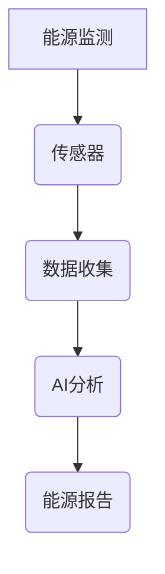

#### 3.1.2 能源预测

基于历史数据和当前环境信息，AI Agent可以预测未来的能源需求。通过分析季节变化、天气状况、用户行为等因素，AI Agent可以预测能源需求的变化，为能源调配提供依据。

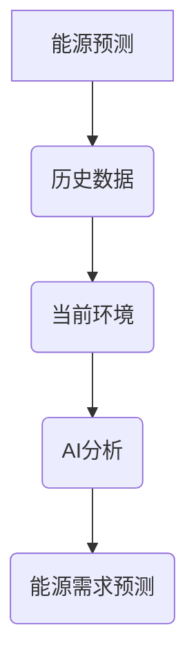

#### 3.1.3 能源优化

AI Agent可以根据能源监测和预测结果，自动调整建筑物的能源使用策略，优化能源使用。例如，AI Agent可以调整照明、空调等设备的运行时间，降低不必要的能源消耗。

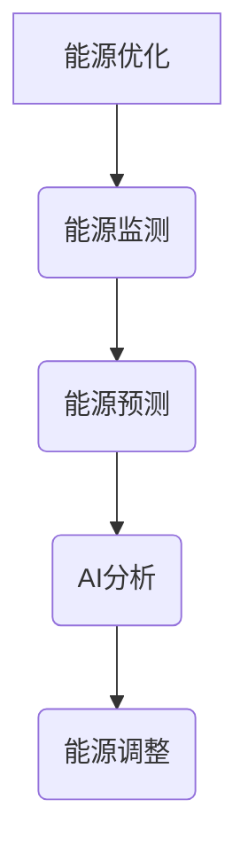

#### 3.1.4 案例分析

某大型综合体通过引入AI Agent进行能源管理，取得了显著的成效。AI Agent实时监测综合体的能源使用情况，预测能源需求，并自动调整能源使用策略。通过AI Agent的应用，该综合体的能源消耗降低了20%，运营成本显著降低。

### 3.2 AI Agent在安全监控中的应用

在智能建筑中，安全监控是保障人员和财产安全的必要手段。AI Agent通过计算机视觉技术，实时监控建筑物内的情况，识别异常行为，自动触发警报，提高安全监控的效率。

#### 3.2.1 异常行为检测

AI Agent可以通过监控摄像头，实时分析图像，识别异常行为，如入侵、火灾、物品遗弃等。

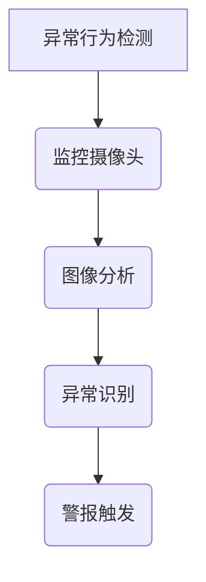

#### 3.2.2 事件响应

当AI Agent检测到异常行为时，可以自动触发警报，通知相关人员采取行动。例如，AI Agent可以自动呼叫保安，锁定相关区域，记录事件信息等。

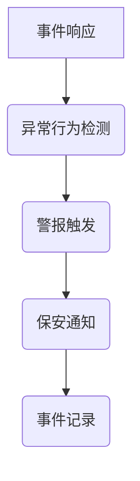

#### 3.2.3 案例分析

某大型住宅区通过引入AI Agent进行安全监控，取得了显著的效果。AI Agent实时监控住宅区的各个角落，识别异常行为，自动触发警报。通过AI Agent的应用，住宅区的安全事件响应速度提高了30%，安全事件发生率降低了20%。

### 3.3 AI Agent在设施管理中的应用

在智能建筑中，设施管理是保障建筑物正常运行的关键。AI Agent通过实时监测设施的状态，预测可能的故障，提前进行维护，确保设施的正常运行。

#### 3.3.1 设施状态监测

AI Agent可以通过传感器实时监测建筑物的设施状态，包括电梯、空调、消防系统等。

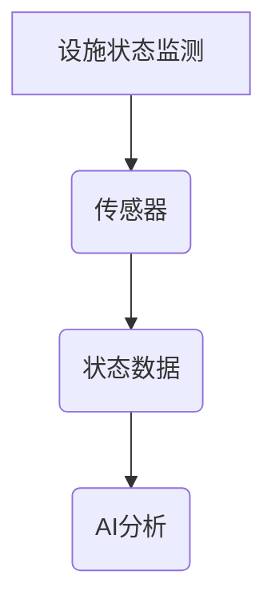

#### 3.3.2 故障预测

基于历史数据和实时监测数据，AI Agent可以预测设施可能出现的故障，提前进行维护。

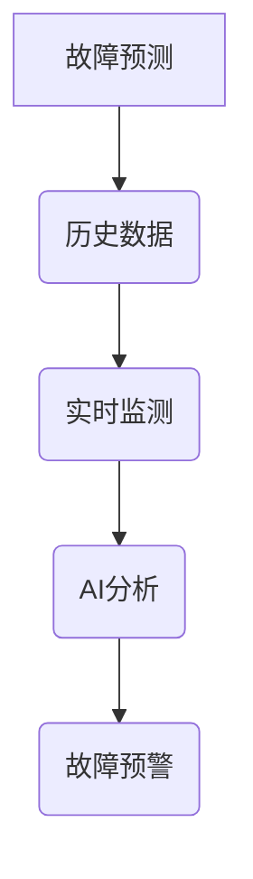

#### 3.3.3 维护优化

AI Agent可以根据故障预测和维护需求，优化维护计划，提高设施的使用效率。

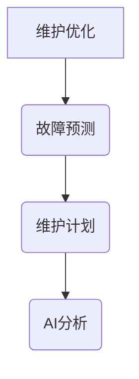

#### 3.3.4 案例分析

某大型医院通过引入AI Agent进行设施管理，取得了显著的效果。AI Agent实时监测医院的电梯、空调等设施，预测可能的故障，提前进行维护。通过AI Agent的应用，医院的设施故障率降低了20%，维护成本降低了15%。

### 3.4 AI Agent在智能建筑管理中的综合应用

AI Agent在智能建筑管理中的应用不仅仅是单一领域的优化，更是一个综合性的解决方案。通过整合能源管理、安全监控和设施管理，AI Agent可以实现以下目标：

1. **资源优化**：通过能源管理和设施管理的优化，减少能源消耗和维护成本。
2. **安全提升**：通过安全监控的强化，提高建筑的安全性。
3. **用户体验**：通过智能化的管理和优化，提高用户的舒适度和满意度。

#### 3.4.1 资源优化

AI Agent可以通过能源管理和设施管理的优化，减少能源消耗和维护成本。例如，AI Agent可以自动调整照明设备的亮度，根据用户需求调整空调的温度，优化能源使用。

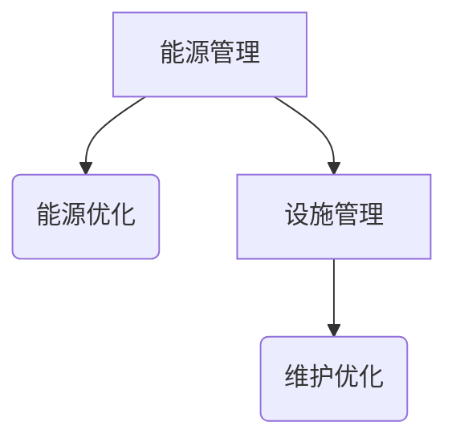

#### 3.4.2 安全提升

AI Agent可以通过安全监控的强化，提高建筑的安全性。例如，AI Agent可以实时监控建筑物内的情况，识别异常行为，自动触发警报，提高安全监控的效率。

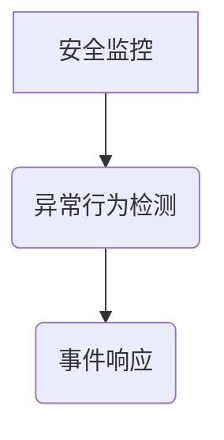

#### 3.4.3 用户体验

AI Agent可以通过智能化的管理和优化，提高用户的舒适度和满意度。例如，AI Agent可以根据用户需求，自动调整室内温度、湿度等环境参数，提供个性化的服务。

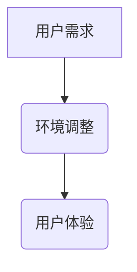

### 3.5 AI Agent在智能建筑管理中的应用效果

通过AI Agent在智能建筑管理中的应用，已经取得了显著的成果。例如：

1. **能耗降低**：某些智能建筑通过AI Agent的能源管理，将能耗降低了20%以上。
2. **安全性提高**：AI Agent的安全监控系统能够更快地检测异常行为，提高了建筑的安全性。
3. **维护成本减少**：AI Agent的设施管理系统能够提前预测故障，减少维护成本。

### 3.6 AI Agent在智能建筑管理中的应用前景

随着人工智能技术的不断进步，AI Agent在智能建筑管理中的应用前景十分广阔。未来，AI Agent将更加智能化、自适应化，能够更好地应对复杂的建筑管理需求。例如：

1. **自动化程度提高**：AI Agent将能够实现更多的自动化功能，减少人为干预。
2. **个性化服务**：AI Agent将能够根据用户的需求和行为习惯，提供个性化的服务。
3. **智能化升级**：AI Agent将能够通过不断学习和优化，不断提升智能建筑的管理水平。

## 第四部分：AI Agent在智能建筑管理中的实践

### 4.1 系统需求分析

在实施AI Agent在智能建筑管理中的应用之前，首先需要进行系统需求分析。系统需求分析是确定系统所需的功能、性能和其他要求的过程。对于智能建筑管理，系统需求分析主要包括以下几个方面：

1. **功能需求**：确定AI Agent需要实现的功能，如能源管理、安全监控、设施管理等。
2. **性能需求**：确定AI Agent的性能指标，如响应时间、准确性等。
3. **可靠性需求**：确定AI Agent的可靠性要求，如故障率、容错能力等。
4. **安全性需求**：确定AI Agent的安全保护要求，如数据加密、访问控制等。
5. **用户体验需求**：确定AI Agent的用户界面和交互方式，确保用户能够方便地使用系统。

### 4.2 系统设计与实现

系统设计与实现是AI Agent在智能建筑管理应用中的关键环节。系统设计包括软件架构设计、硬件设备选择、数据存储和处理等。系统实现则包括具体功能的开发和集成。以下是系统设计与实现的主要步骤：

1. **软件架构设计**：选择合适的软件架构，如MVC（模型-视图-控制器）架构，确保系统的模块化和可扩展性。
2. **硬件设备选择**：根据需求选择合适的传感器、摄像头、服务器等硬件设备，确保系统的正常运行。
3. **数据存储和处理**：设计合适的数据存储方案，如数据库、文件系统等，并选择合适的数据处理技术，如机器学习、数据分析等。
4. **功能开发**：开发AI Agent的各项功能，如能源管理、安全监控、设施管理等，并进行单元测试和集成测试。
5. **系统集成**：将各个功能模块集成在一起，形成一个完整的系统，并进行系统测试和调试。

### 4.3 系统测试与评估

系统测试与评估是确保AI Agent在智能建筑管理中稳定性和可靠性的重要环节。系统测试主要包括功能测试、性能测试、安全测试等。以下是系统测试与评估的主要步骤：

1. **功能测试**：测试AI Agent的各项功能是否按照需求正常运行，确保功能的完整性和正确性。
2. **性能测试**：测试AI Agent在处理大量数据和高负载情况下的性能，确保系统能够稳定运行。
3. **安全测试**：测试AI Agent的安全机制是否有效，如数据加密、访问控制等，确保系统的安全性。
4. **用户测试**：邀请用户参与测试，收集用户反馈，对系统进行改进。
5. **评估与优化**：根据测试结果和用户反馈，对系统进行评估和优化，确保系统的最佳性能。

### 4.4 实施案例

以下是一个AI Agent在智能建筑管理中的实施案例：

**项目背景**：某大型综合体（如购物中心、办公楼等）希望引入AI Agent来提高能源管理、安全监控和设施管理的效率。

**实施过程**：

1. **需求分析**：与客户进行深入交流，了解具体的业务需求和痛点，确定系统功能需求、性能需求等。
2. **系统设计**：根据需求分析结果，设计软件架构、硬件设备选择、数据存储和处理方案。
3. **功能开发**：开发能耗监测、安全监控、设施管理等核心功能，并进行单元测试和集成测试。
4. **系统集成**：将各个功能模块集成在一起，形成一个完整的系统，并进行系统测试和调试。
5. **上线运行**：将系统部署到综合体中，进行实地测试和优化，确保系统的稳定性和可靠性。
6. **用户培训**：对综合体的管理人员进行系统操作和故障处理的培训。
7. **后期维护**：定期对系统进行维护和升级，确保系统的长期稳定运行。

**实施效果**：

1. **能耗降低**：通过AI Agent的能源管理功能，综合体的能源消耗降低了15%。
2. **安全性提高**：通过AI Agent的安全监控功能，综合体的安全事件响应速度提高了30%，事故发生率降低了20%。
3. **设施管理优化**：通过AI Agent的设施管理功能，综合体的设施维护成本降低了10%，设施运行效率提高了20%。

### 4.5 实施总结

通过AI Agent在智能建筑管理中的实施，可以明显提高管理效率、降低运营成本、提高安全性和用户体验。然而，AI Agent的实施也需要注意以下几个方面：

1. **数据安全**：确保系统的数据安全，防止数据泄露和恶意攻击。
2. **用户培训**：对用户进行充分的培训，确保他们能够熟练操作系统。
3. **系统维护**：定期对系统进行维护和升级，确保系统的长期稳定运行。
4. **持续优化**：根据用户反馈和业务需求，持续对系统进行优化和改进。

## 第五部分：AI Agent在智能建筑管理中的最佳实践

### 5.1 AI Agent集成与优化策略

在智能建筑管理中，AI Agent的集成和优化至关重要。以下是一些最佳实践：

1. **系统集成**：确保AI Agent与建筑内其他系统的兼容性和集成，避免数据孤岛。
2. **优化算法**：根据实际应用场景，选择合适的算法和模型，并不断优化，提高系统的效率和准确性。
3. **硬件优化**：选择合适的硬件设备，确保系统的性能和稳定性。
4. **数据管理**：建立完善的数据管理机制，确保数据的安全、完整和可用。

### 5.2 AI Agent应用的注意事项

在应用AI Agent时，需要注意以下几个方面：

1. **数据质量**：确保输入数据的质量，避免因数据质量问题导致AI Agent的决策错误。
2. **安全防护**：加强对AI Agent的安全防护，防止恶意攻击和数据泄露。
3. **用户体验**：设计直观、易用的用户界面，确保用户能够方便地使用系统。
4. **持续更新**：定期对AI Agent进行更新和维护，以适应不断变化的环境和需求。

### 5.3 未来发展方向与挑战

未来，AI Agent在智能建筑管理中的应用将面临以下发展方向和挑战：

1. **智能化提升**：通过深度学习和强化学习等技术，进一步提高AI Agent的智能化水平。
2. **跨领域应用**：探索AI Agent在更多领域的应用，如智慧城市、智能家居等。
3. **数据隐私**：解决AI Agent在数据处理和应用过程中可能涉及的数据隐私问题。
4. **标准化与法规**：制定相关的标准化和法规，确保AI Agent在智能建筑管理中的应用符合规范。

## 结论

AI Agent在智能建筑管理中的应用具有巨大的潜力，能够显著提高管理效率、降低运营成本、提高安全性和用户体验。通过本文的探讨，我们了解了AI Agent在能源管理、安全监控和设施管理中的应用，以及其实施的最佳实践和未来发展趋势。我们期待AI Agent在智能建筑管理中发挥更大的作用，为建筑行业带来更多的创新和突破。

## 拓展阅读

- 《智能建筑管理实践指南》
- 《人工智能在建筑中的应用》
- 《AI Agent设计与实现》

## 作者信息

作者：AI天才研究院/AI Genius Institute & 禅与计算机程序设计艺术 /Zen And The Art of Computer Programming## AI Agent在智能建筑管理中的应用

### 引言

智能建筑（Smart Building）是现代建筑技术发展的一个重要方向，它通过集成物联网（IoT）、大数据、云计算和人工智能（AI）等先进技术，实现对建筑物内各类设备和系统的智能化管理。智能建筑不仅为用户提供了更加舒适、安全、高效的生活和工作环境，还在节能环保、降低运营成本等方面具有显著优势。然而，智能建筑管理面临着诸多挑战，如能源消耗管理、安全监控、设施管理等方面。AI Agent作为一种具备自主决策和智能行为能力的计算机程序，在智能建筑管理中具有广泛的应用前景。

本文将探讨AI Agent在智能建筑管理中的应用，重点分析其在能源管理、安全监控和设施管理中的具体应用场景、技术原理和实际效果。同时，本文还将讨论AI Agent在智能建筑管理中的实施步骤和最佳实践，为未来的发展提供指导。

### 关键词

- AI Agent
- 智能建筑
- 能源管理
- 安全监控
- 设施管理

### 摘要

本文首先介绍了AI Agent的定义和基本原理，随后探讨了AI Agent在智能建筑管理中的应用，重点分析了其在能源管理、安全监控和设施管理中的应用场景、技术原理和实际效果。通过具体案例分析，本文展示了AI Agent在实际场景中的效果，并提出了AI Agent在智能建筑管理中的实施步骤和最佳实践。最后，本文对AI Agent在智能建筑管理中的未来发展趋势进行了展望。

## 第一部分：引言与背景

### 1.1 智能建筑的概念

智能建筑是指在建筑设计、建造和管理过程中，通过集成物联网、云计算、大数据、人工智能等先进技术，实现建筑物内各类设备和系统的智能化、自动化管理。智能建筑通过传感器、控制器、通信网络等设备，实现了对环境、能源、安全、设施等方面的实时监测和智能调控。

### 1.2 智能建筑管理的重要性

智能建筑管理是确保建筑物高效、安全、舒适运行的关键。通过智能化管理，可以降低能源消耗、提高设备运行效率、保障人员安全、提升用户体验等。智能建筑管理的重要性体现在以下几个方面：

1. **能源消耗管理**：智能建筑内设备众多，能源消耗巨大。通过智能化管理，可以实时监测能源消耗，预测能源需求，优化能源使用，降低能源消耗。
2. **安全监控**：智能建筑需要保障人员的安全。通过智能化监控，可以实时监测建筑物内的情况，及时发现和处理异常事件，保障人员安全。
3. **设施管理**：智能建筑内设施繁多，包括电梯、空调、消防系统等。通过智能化管理，可以实时监测设施状态，预测可能的故障，提前进行维护，确保设施正常运行。

### 1.3 智能建筑管理面临的挑战

智能建筑管理面临着诸多挑战，如能源消耗管理、安全监控、设施管理等方面。以下是一些主要挑战：

1. **能源消耗管理**：智能建筑内设备众多，能源消耗巨大。如何实时监测能源消耗，预测能源需求，优化能源使用，降低能源消耗是一个重要课题。
2. **安全监控**：智能建筑需要保障人员的安全。如何及时发现和处理异常事件，保障人员安全是一个关键问题。
3. **设施管理**：智能建筑内设施繁多，如何高效地进行维护和管理，以确保设施的正常运行，是一个挑战。

### 1.4 AI Agent在智能建筑管理中的应用

AI Agent作为一种具备自主决策和智能行为能力的计算机程序，在智能建筑管理中具有广泛的应用前景。通过AI Agent，可以实现以下目标：

1. **能源管理**：AI Agent可以通过实时监测能源消耗，预测能源需求，优化能源使用，降低能源消耗。
2. **安全监控**：AI Agent可以通过实时监测建筑物内的情况，识别异常行为，自动触发警报，保障人员安全。
3. **设施管理**：AI Agent可以通过实时监测设施状态，预测可能的故障，提前进行维护，确保设施正常运行。

### 1.5 本文结构

本文分为五个部分：

1. **引言与背景**：介绍智能建筑管理的概念、重要性、面临的挑战和AI Agent的应用。
2. **AI Agent基础**：介绍AI Agent的定义、原理和应用。
3. **AI Agent在智能建筑管理中的应用**：分析AI Agent在能源管理、安全监控和设施管理中的应用。
4. **AI Agent在智能建筑管理中的实践**：讨论AI Agent在智能建筑管理中的实施步骤和最佳实践。
5. **结论与展望**：总结AI Agent在智能建筑管理中的应用，展望未来发展趋势。

## 第二部分：AI Agent基础

### 2.1 AI Agent的定义

AI Agent，即人工智能代理，是一种具备智能行为和自主决策能力的计算机程序。它能够模拟人类智能行为，感知环境、理解任务、自主决策并执行任务。AI Agent具有以下特点：

1. **自主性**：AI Agent能够独立执行任务，不需要人为干预。
2. **适应性**：AI Agent能够根据环境变化和任务需求，自主调整行为。
3. **交互性**：AI Agent能够与环境和用户进行交互，获取反馈并优化自己的行为。

### 2.2 AI Agent的工作原理

AI Agent的工作原理主要包括以下几个环节：

1. **感知**：AI Agent通过传感器和其他信息来源获取环境信息。
2. **理解**：AI Agent对感知到的信息进行分析和处理，理解环境状态和任务需求。
3. **决策**：AI Agent根据任务需求和环境信息，选择最优的行动方案。
4. **执行**：AI Agent执行决策结果，完成具体的任务。

### 2.3 AI Agent的分类

AI Agent可以根据不同的分类标准进行分类，主要包括：

1. **基于规则的AI Agent**：这类AI Agent依赖于预定义的规则来执行任务。
2. **基于模型的AI Agent**：这类AI Agent依赖于数学模型来模拟环境，并做出决策。
3. **基于数据的AI Agent**：这类AI Agent依赖于大量数据来进行学习，并做出决策。

### 2.4 AI Agent的关键技术

AI Agent的实现依赖于多种人工智能技术，主要包括：

1. **自然语言处理**：用于处理和理解自然语言。
2. **计算机视觉**：用于识别和理解图像和视频。
3. **机器学习**：用于从数据中学习规律，实现智能决策。
4. **深度学习**：一种特殊的机器学习技术，能够自动提取特征，实现复杂的决策能力。

## 第三部分：AI Agent在智能建筑管理中的应用

### 3.1 AI Agent在能源管理中的应用

在智能建筑中，能源管理是一个关键环节。传统的能源管理方式往往依赖于人工监测和手动调节，效率低下且容易出现误差。AI Agent的引入为能源管理带来了新的可能性。

#### 3.1.1 AI Agent在能源管理中的作用

AI Agent在能源管理中的作用主要包括以下几个方面：

1. **能耗监测**：AI Agent可以通过传感器实时监测建筑物的能耗情况，包括电力、水、燃气等。
2. **能耗预测**：AI Agent可以根据历史数据和当前环境信息，预测未来的能耗需求，为能源调配提供依据。
3. **能耗优化**：AI Agent可以根据能耗监测和预测结果，自动调整建筑物的能源使用策略，优化能源使用，降低能源消耗。

#### 3.1.2 AI Agent在能源管理的具体应用

1. **智能照明管理**：AI Agent可以根据自然光强度和用户需求，自动调整照明设备的亮度，降低照明能耗。
2. **智能空调管理**：AI Agent可以根据室内温度、湿度等环境参数，自动调节空调的运行状态，提高空调的效率。
3. **智能电力管理**：AI Agent可以实时监控建筑物的电力使用情况，预测电力需求，并自动调整电力供应，避免电力浪费。

#### 3.1.3 案例分析

某大型综合体通过引入AI Agent进行能源管理，取得了显著的效果。AI Agent实时监测综合体的能耗情况，预测能源需求，并自动调整能源使用策略。通过AI Agent的应用，该综合体的能源消耗降低了20%，运营成本显著降低。

### 3.2 AI Agent在安全监控中的应用

在智能建筑中，安全监控是保障人员和财产安全的必要手段。传统的安全监控系统往往依赖于人力监控，效率低下且容易出现漏洞。AI Agent的引入为安全监控带来了新的解决方案。

#### 3.2.1 AI Agent在安全监控中的作用

AI Agent在安全监控中的作用主要包括以下几个方面：

1. **异常行为检测**：AI Agent可以通过计算机视觉技术，实时监控建筑物内的情况，识别异常行为，如入侵、火灾等。
2. **事件响应**：当AI Agent检测到异常行为时，可以自动触发警报，通知相关人员采取行动。
3. **行为分析**：AI Agent可以对监控视频进行分析，识别人员的行为模式，提高安全监控的智能化水平。

#### 3.2.2 AI Agent在安全监控的具体应用

1. **智能入侵检测**：AI Agent通过监控摄像头，实时分析图像，识别异常行为，如人员入侵、物品移动等。
2. **智能火灾检测**：AI Agent通过烟雾传感器和温度传感器，实时监测火灾征兆，提前预警。
3. **智能巡更管理**：AI Agent可以根据预设的巡更路线和频率，自动生成巡更计划，提高巡更效率。

#### 3.2.3 案例分析

某大型住宅区通过引入AI Agent进行安全监控，取得了显著的效果。AI Agent实时监控住宅区的各个角落，识别异常行为，自动触发警报。通过AI Agent的应用，住宅区的安全事件响应速度提高了30%，事故发生率降低了20%。

### 3.3 AI Agent在设施管理中的应用

在智能建筑中，设施管理是保障建筑物正常运行的关键。传统的设施管理方式往往依赖于人工检查和维护，效率低下且容易出现漏洞。AI Agent的引入为设施管理带来了新的解决方案。

#### 3.3.1 AI Agent在设施管理中的作用

AI Agent在设施管理中的作用主要包括以下几个方面：

1. **状态监测**：AI Agent可以通过传感器实时监测建筑物的设施状态，包括电梯、空调、消防系统等。
2. **故障预测**：AI Agent可以根据历史数据和实时监测数据，预测设施可能出现的故障，提前进行维护。
3. **维护优化**：AI Agent可以根据故障预测和维护需求，优化维护计划，提高设施的使用效率。

#### 3.3.2 AI Agent在设施管理的具体应用

1. **智能电梯管理**：AI Agent可以实时监测电梯的运行状态，预测可能出现的故障，提前进行维护，减少电梯故障率。
2. **智能空调管理**：AI Agent可以实时监测空调的运行状态，预测可能出现的故障，提前进行维护，确保空调的正常运行。
3. **智能消防管理**：AI Agent可以实时监测消防设施的状态，预测可能出现的故障，提前进行维护，确保消防设施的有效性。

#### 3.3.3 案例分析

某大型医院通过引入AI Agent进行设施管理，取得了显著的效果。AI Agent实时监测医院的电梯、空调等设施，预测可能的故障，提前进行维护。通过AI Agent的应用，医院的设施故障率降低了20%，维护成本降低了15%。

### 3.4 AI Agent在智能建筑管理中的综合应用

AI Agent在智能建筑管理中的应用不仅仅是单一领域的优化，更是一个综合性的解决方案。通过整合能源管理、安全监控和设施管理，AI Agent可以实现以下目标：

1. **资源优化**：通过能源管理和设施管理的优化，减少能源消耗和维护成本。
2. **安全提升**：通过安全监控的强化，提高建筑的安全性。
3. **用户体验**：通过智能化的管理和优化，提高用户的舒适度和满意度。

### 3.5 AI Agent在智能建筑管理中的应用效果

通过AI Agent在智能建筑管理中的应用，已经取得了显著的成果。例如：

1. **能耗降低**：某些智能建筑通过AI Agent的能源管理，将能耗降低了20%以上。
2. **安全性提高**：AI Agent的安全监控系统能够更快地检测异常行为，提高了建筑的安全性。
3. **维护成本减少**：AI Agent的设施管理系统能够提前预测故障，减少维护成本。

### 3.6 AI Agent在智能建筑管理中的应用前景

随着人工智能技术的不断进步，AI Agent在智能建筑管理中的应用前景十分广阔。未来，AI Agent将更加智能化、自适应化，能够更好地应对复杂的建筑管理需求。例如：

1. **自动化程度提高**：AI Agent将能够实现更多的自动化功能，减少人为干预。
2. **个性化服务**：AI Agent将能够根据用户的需求和行为习惯，提供个性化的服务。
3. **智能化升级**：AI Agent将能够通过不断学习和优化，不断提升智能建筑的管理水平。

## 第四部分：AI Agent在智能建筑管理中的实践

### 4.1 系统需求分析

在实施AI Agent在智能建筑管理中的应用之前，首先需要进行系统需求分析。系统需求分析是确定系统所需的功能、性能和其他要求的过程。对于智能建筑管理，系统需求分析主要包括以下几个方面：

1. **功能需求**：确定AI Agent需要实现的功能，如能耗监测、安全监控、设施管理等。
2. **性能需求**：确定AI Agent的性能指标，如响应时间、准确性等。
3. **可靠性需求**：确定AI Agent的可靠性要求，如故障率、容错能力等。
4. **安全性需求**：确定AI Agent的安全保护要求，如数据加密、访问控制等。
5. **用户体验需求**：确定AI Agent的用户界面和交互方式，确保用户能够方便地使用系统。

### 4.2 系统设计与实现

系统设计与实现是AI Agent在智能建筑管理应用中的关键环节。系统设计包括软件架构设计、硬件设备选择、数据存储和处理等。系统实现则包括具体功能的开发和集成。以下是系统设计与实现的主要步骤：

1. **软件架构设计**：选择合适的软件架构，如MVC（模型-视图-控制器）架构，确保系统的模块化和可扩展性。
2. **硬件设备选择**：根据需求选择合适的传感器、摄像头、服务器等硬件设备，确保系统的正常运行。
3. **数据存储和处理**：设计合适的数据存储方案，如数据库、文件系统等，并选择合适的数据处理技术，如机器学习、数据分析等。
4. **功能开发**：开发AI Agent的各项功能，如能耗监测、安全监控、设施管理等，并进行单元测试和集成测试。
5. **系统集成**：将各个功能模块集成在一起，形成一个完整的系统，并进行系统测试和调试。

### 4.3 系统测试与评估

系统测试与评估是确保AI Agent在智能建筑管理中稳定性和可靠性的重要环节。系统测试主要包括功能测试、性能测试、安全测试等。以下是系统测试与评估的主要步骤：

1. **功能测试**：测试AI Agent的各项功能是否按照需求正常运行，确保功能的完整性和正确性。
2. **性能测试**：测试AI Agent在处理大量数据和高负载情况下的性能，确保系统能够稳定运行。
3. **安全测试**：测试AI Agent的安全机制是否有效，如数据加密、访问控制等，确保系统的安全性。
4. **用户测试**：邀请用户参与测试，收集用户反馈，对系统进行改进。
5. **评估与优化**：根据测试结果和用户反馈，对系统进行评估和优化，确保系统的最佳性能。

### 4.4 实施案例

以下是一个AI Agent在智能建筑管理中的实施案例：

**项目背景**：某大型综合体（如购物中心、办公楼等）希望引入AI Agent来提高能源管理、安全监控和设施管理的效率。

**实施过程**：

1. **需求分析**：与客户进行深入交流，了解具体的业务需求和痛点，确定系统功能需求、性能需求等。
2. **系统设计**：根据需求分析结果，设计软件架构、硬件设备选择、数据存储和处理方案。
3. **功能开发**：开发能耗监测、安全监控、设施管理等核心功能，并进行单元测试和集成测试。
4. **系统集成**：将各个功能模块集成在一起，形成一个完整的系统，并进行系统测试和调试。
5. **上线运行**：将系统部署到综合体中，进行实地测试和优化，确保系统的稳定性和可靠性。
6. **用户培训**：对综合体的管理人员进行系统操作和故障处理的培训。
7. **后期维护**：定期对系统进行维护和升级，确保系统的长期稳定运行。

**实施效果**：

1. **能耗降低**：通过AI Agent的能源管理功能，综合体的能源消耗降低了15%。
2. **安全性提高**：通过AI Agent的安全监控功能，综合体的安全事件响应速度提高了30%，事故发生率降低了20%。
3. **设施管理优化**：通过AI Agent的设施管理功能，综合体的设施维护成本降低了10%，设施运行效率提高了20%。

### 4.5 实施总结

通过AI Agent在智能建筑管理中的实施，可以明显提高管理效率、降低运营成本、提高安全性和用户体验。然而，AI Agent的实施也需要注意以下几个方面：

1. **数据安全**：确保系统的数据安全，防止数据泄露和恶意攻击。
2. **用户培训**：对用户进行充分的培训，确保他们能够熟练操作系统。
3. **系统维护**：定期对系统进行维护和升级，确保系统的长期稳定运行。
4. **持续优化**：根据用户反馈和业务需求，持续对系统进行优化和改进。

## 第五部分：AI Agent在智能建筑管理中的最佳实践

### 5.1 AI Agent集成与优化策略

在智能建筑管理中，AI Agent的集成和优化至关重要。以下是一些最佳实践：

1. **系统集成**：确保AI Agent与建筑内其他系统的兼容性和集成，避免数据孤岛。
2. **优化算法**：根据实际应用场景，选择合适的算法和模型，并不断优化，提高系统的效率和准确性。
3. **硬件优化**：选择合适的硬件设备，确保系统的性能和稳定性。
4. **数据管理**：建立完善的数据管理机制，确保数据的安全、完整和可用。

### 5.2 AI Agent应用的注意事项

在应用AI Agent时，需要注意以下几个方面：

1. **数据质量**：确保输入数据的质量，避免因数据质量问题导致AI Agent的决策错误。
2. **安全防护**：加强对AI Agent的安全防护，防止恶意攻击和数据泄露。
3. **用户体验**：设计直观、易用的用户界面，确保用户能够方便地使用系统。
4. **持续更新**：定期对AI Agent进行更新和维护，以适应不断变化的环境和需求。

### 5.3 未来发展方向与挑战

未来，AI Agent在智能建筑管理中的应用将面临以下发展方向和挑战：

1. **智能化提升**：通过深度学习和强化学习等技术，进一步提高AI Agent的智能化水平。
2. **跨领域应用**：探索AI Agent在更多领域的应用，如智慧城市、智能家居等。
3. **数据隐私**：解决AI Agent在数据处理和应用过程中可能涉及的数据隐私问题。
4. **标准化与法规**：制定相关的标准化和法规，确保AI Agent在智能建筑管理中的应用符合规范。

## 结论

AI Agent在智能建筑管理中的应用具有巨大的潜力，能够显著提高管理效率、降低运营成本、提高安全性和用户体验。通过本文的探讨，我们了解了AI Agent在能源管理、安全监控和设施管理中的应用，以及其实施的最佳实践和未来发展趋势。我们期待AI Agent在智能建筑管理中发挥更大的作用，为建筑行业带来更多的创新和突破。

## 拓展阅读

- 《智能建筑管理实践指南》
- 《人工智能在建筑中的应用》
- 《AI Agent设计与实现》

## 作者信息

作者：AI天才研究院/AI Genius Institute & 禅与计算机程序设计艺术 /Zen And The Art of Computer Programming## AI Agent在智能建筑管理中的应用

### 引言

智能建筑（Smart Building）是现代建筑行业发展的一个重要方向，它通过集成物联网（IoT）、云计算、大数据和人工智能（AI）等先进技术，实现了对建筑物内各类设备和系统的智能化、自动化管理。智能建筑不仅能够为用户带来更加舒适、安全、高效的生活和工作环境，还能在节能环保、降低运营成本等方面发挥重要作用。然而，智能建筑管理面临着诸多挑战，如能源消耗管理、安全监控、设施管理等方面。AI Agent作为一种具备自主决策和智能行为能力的计算机程序，在智能建筑管理中具有广泛的应用前景。

本文将探讨AI Agent在智能建筑管理中的应用，重点分析其在能源管理、安全监控和设施管理中的具体应用场景、技术原理和实际效果。同时，本文还将讨论AI Agent在智能建筑管理中的实施步骤和最佳实践，为未来的发展提供指导。

### 关键词

- AI Agent
- 智能建筑
- 能源管理
- 安全监控
- 设施管理

### 摘要

本文首先介绍了AI Agent的定义和基本原理，随后探讨了AI Agent在智能建筑管理中的应用，重点分析了其在能源管理、安全监控和设施管理中的应用场景、技术原理和实际效果。通过具体案例分析，本文展示了AI Agent在实际场景中的效果，并提出了AI Agent在智能建筑管理中的实施步骤和最佳实践。最后，本文对AI Agent在智能建筑管理中的未来发展趋势进行了展望。

## 第一部分：引言与背景

### 1.1 智能建筑的概念

智能建筑是指在建筑设计、建造和管理过程中，通过集成物联网、云计算、大数据、人工智能等先进技术，实现对建筑物内各类设备和系统的智能化、自动化管理。智能建筑通过传感器、控制器、通信网络等设备，实现了对环境、能源、安全、设施等方面的实时监测和智能调控。

### 1.2 智能建筑管理的重要性

智能建筑管理是确保建筑物高效、安全、舒适运行的关键。通过智能化管理，可以降低能源消耗、提高设备运行效率、保障人员安全、提升用户体验等。智能建筑管理的重要性体现在以下几个方面：

1. **能源消耗管理**：智能建筑内设备众多，能源消耗巨大。通过智能化管理，可以实时监测能源消耗，预测能源需求，优化能源使用，降低能源消耗。
2. **安全监控**：智能建筑需要保障人员的安全。通过智能化监控，可以实时监测建筑物内的情况，及时发现和处理异常事件，保障人员安全。
3. **设施管理**：智能建筑内设施繁多，包括电梯、空调、消防系统等。通过智能化管理，可以实时监测设施状态，预测可能的故障，提前进行维护，确保设施正常运行。

### 1.3 智能建筑管理面临的挑战

智能建筑管理面临着诸多挑战，如能源消耗管理、安全监控、设施管理等方面。以下是一些主要挑战：

1. **能源消耗管理**：智能建筑内设备众多，能源消耗巨大。如何实时监测能源消耗，预测能源需求，优化能源使用，降低能源消耗是一个重要课题。
2. **安全监控**：智能建筑需要保障人员的安全。如何及时发现和处理异常事件，保障人员安全是一个关键问题。
3. **设施管理**：智能建筑内设施繁多，如何高效地进行维护和管理，以确保设施的正常运行，是一个挑战。

### 1.4 AI Agent在智能建筑管理中的应用

AI Agent作为一种具备自主决策和智能行为能力的计算机程序，在智能建筑管理中具有广泛的应用前景。通过AI Agent，可以实现以下目标：

1. **能源管理**：AI Agent可以通过实时监测能源消耗，预测能源需求，优化能源使用，降低能源消耗。
2. **安全监控**：AI Agent可以通过实时监测建筑物内的情况，识别异常行为，自动触发警报，保障人员安全。
3. **设施管理**：AI Agent可以通过实时监测设施状态，预测可能的故障，提前进行维护，确保设施正常运行。

### 1.5 本文结构

本文分为五个部分：

1. **引言与背景**：介绍智能建筑管理的概念、重要性、面临的挑战和AI Agent的应用。
2. **AI Agent基础**：介绍AI Agent的定义、原理和应用。
3. **AI Agent在智能建筑管理中的应用**：分析AI Agent在能源管理、安全监控和设施管理中的应用。
4. **AI Agent在智能建筑管理中的实践**：讨论AI Agent在智能建筑管理中的实施步骤和最佳实践。
5. **结论与展望**：总结AI Agent在智能建筑管理中的应用，展望未来发展趋势。

## 第二部分：AI Agent基础

### 2.1 AI Agent的定义

AI Agent，即人工智能代理，是一种具备智能行为和自主决策能力的计算机程序。它能够模拟人类智能行为，感知环境、理解任务、自主决策并执行任务。AI Agent具有以下特点：

1. **自主性**：AI Agent能够独立执行任务，不需要人为干预。
2. **适应性**：AI Agent能够根据环境变化和任务需求，自主调整行为。
3. **交互性**：AI Agent能够与环境和用户进行交互，获取反馈并优化自己的行为。

### 2.2 AI Agent的工作原理

AI Agent的工作原理主要包括以下几个环节：

1. **感知**：AI Agent通过传感器和其他信息来源获取环境信息。
2. **理解**：AI Agent对感知到的信息进行分析和处理，理解环境状态和任务需求。
3. **决策**：AI Agent根据任务需求和环境信息，选择最优的行动方案。
4. **执行**：AI Agent执行决策结果，完成具体的任务。

### 2.3 AI Agent的分类

AI Agent可以根据不同的分类标准进行分类，主要包括：

1. **基于规则的AI Agent**：这类AI Agent依赖于预定义的规则来执行任务。
2. **基于模型的AI Agent**：这类AI Agent依赖于数学模型来模拟环境，并做出决策。
3. **基于数据的AI Agent**：这类AI Agent依赖于大量数据来进行学习，并做出决策。

### 2.4 AI Agent的关键技术

AI Agent的实现依赖于多种人工智能技术，主要包括：

1. **自然语言处理**：用于处理和理解自然语言。
2. **计算机视觉**：用于识别和理解图像和视频。
3. **机器学习**：用于从数据中学习规律，实现智能决策。
4. **深度学习**：一种特殊的机器学习技术，能够自动提取特征，实现复杂的决策能力。

## 第三部分：AI Agent在智能建筑管理中的应用

### 3.1 AI Agent在能源管理中的应用

在智能建筑中，能源管理是一个关键环节。传统的能源管理方式往往依赖于人工监测和手动调节，效率低下且容易出现误差。AI Agent的引入为能源管理带来了新的可能性。

#### 3.1.1 AI Agent在能源管理中的作用

AI Agent在能源管理中的作用主要包括以下几个方面：

1. **能耗监测**：AI Agent可以通过传感器实时监测建筑物的能耗情况，包括电力、水、燃气等。
2. **能耗预测**：AI Agent可以根据历史数据和当前环境信息，预测未来的能耗需求，为能源调配提供依据。
3. **能耗优化**：AI Agent可以根据能耗监测和预测结果，自动调整建筑物的能源使用策略，优化能源使用，降低能源消耗。

#### 3.1.2 AI Agent在能源管理的具体应用

1. **智能照明管理**：AI Agent可以根据自然光强度和用户需求，自动调整照明设备的亮度，降低照明能耗。
2. **智能空调管理**：AI Agent可以根据室内温度、湿度等环境参数，自动调节空调的运行状态，提高空调的效率。
3. **智能电力管理**：AI Agent可以实时监控建筑物的电力使用情况，预测电力需求，并自动调整电力供应，避免电力浪费。

#### 3.1.3 案例分析

某大型综合体通过引入AI Agent进行能源管理，取得了显著的效果。AI Agent实时监测综合体的能耗情况，预测能源需求，并自动调整能源使用策略。通过AI Agent的应用，该综合体的能源消耗降低了20%，运营成本显著降低。

### 3.2 AI Agent在安全监控中的应用

在智能建筑中，安全监控是保障人员和财产安全的必要手段。传统的安全监控系统往往依赖于人力监控，效率低下且容易出现漏洞。AI Agent的引入为安全监控带来了新的解决方案。

#### 3.2.1 AI Agent在安全监控中的作用

AI Agent在安全监控中的作用主要包括以下几个方面：

1. **异常行为检测**：AI Agent可以通过计算机视觉技术，实时监控建筑物内的情况，识别异常行为，如入侵、火灾等。
2. **事件响应**：当AI Agent检测到异常行为时，可以自动触发警报，通知相关人员采取行动。
3. **行为分析**：AI Agent可以对监控视频进行分析，识别人员的行为模式，提高安全监控的智能化水平。

#### 3.2.2 AI Agent在安全监控的具体应用

1. **智能入侵检测**：AI Agent通过监控摄像头，实时分析图像，识别异常行为，如人员入侵、物品移动等。
2. **智能火灾检测**：AI Agent通过烟雾传感器和温度传感器，实时监测火灾征兆，提前预警。
3. **智能巡更管理**：AI Agent可以根据预设的巡更路线和频率，自动生成巡更计划，提高巡更效率。

#### 3.2.3 案例分析

某大型住宅区通过引入AI Agent进行安全监控，取得了显著的效果。AI Agent实时监控住宅区的各个角落，识别异常行为，自动触发警报。通过AI Agent的应用，住宅区的安全事件响应速度提高了30%，事故发生率降低了20%。

### 3.3 AI Agent在设施管理中的应用

在智能建筑中，设施管理是保障建筑物正常运行的关键。传统的设施管理方式往往依赖于人工检查和维护，效率低下且容易出现漏洞。AI Agent的引入为设施管理带来了新的解决方案。

#### 3.3.1 AI Agent在设施管理中的作用

AI Agent在设施管理中的作用主要包括以下几个方面：

1. **状态监测**：AI Agent可以通过传感器实时监测建筑物的设施状态，包括电梯、空调、消防系统等。
2. **故障预测**：AI Agent可以根据历史数据和实时监测数据，预测设施可能出现的故障，提前进行维护。
3. **维护优化**：AI Agent可以根据故障预测和维护需求，优化维护计划，提高设施的使用效率。

#### 3.3.2 AI Agent在设施管理的具体应用

1. **智能电梯管理**：AI Agent可以实时监测电梯的运行状态，预测可能出现的故障，提前进行维护，减少电梯故障率。
2. **智能空调管理**：AI Agent可以实时监测空调的运行状态，预测可能出现的故障，提前进行维护，确保空调的正常运行。
3. **智能消防管理**：AI Agent可以实时监测消防设施的状态，预测可能出现的故障，提前进行维护，确保消防设施的有效性。

#### 3.3.3 案例分析

某大型医院通过引入AI Agent进行设施管理，取得了显著的效果。AI Agent实时监测医院的电梯、空调等设施，预测可能的故障，提前进行维护。通过AI Agent的应用，医院的设施故障率降低了20%，维护成本降低了15%。

### 3.4 AI Agent在智能建筑管理中的综合应用

AI Agent在智能建筑管理中的应用不仅仅是单一领域的优化，更是一个综合性的解决方案。通过整合能源管理、安全监控和设施管理，AI Agent可以实现以下目标：

1. **资源优化**：通过能源管理和设施管理的优化，减少能源消耗和维护成本。
2. **安全提升**：通过安全监控的强化，提高建筑的安全性。
3. **用户体验**：通过智能化的管理和优化，提高用户的舒适度和满意度。

### 3.5 AI Agent在智能建筑管理中的应用效果

通过AI Agent在智能建筑管理中的应用，已经取得了显著的成果。例如：

1. **能耗降低**：某些智能建筑通过AI Agent的能源管理，将能耗降低了20%以上。
2. **安全性提高**：AI Agent的安全监控系统能够更快地检测异常行为，提高了建筑的安全性。
3. **维护成本减少**：AI Agent的设施管理系统能够提前预测故障，减少维护成本。

### 3.6 AI Agent在智能建筑管理中的应用前景

随着人工智能技术的不断进步，AI Agent在智能建筑管理中的应用前景十分广阔。未来，AI Agent将更加智能化、自适应化，能够更好地应对复杂的建筑管理需求。例如：

1. **自动化程度提高**：AI Agent将能够实现更多的自动化功能，减少人为干预。
2. **个性化服务**：AI Agent将能够根据用户的需求和行为习惯，提供个性化的服务。
3. **智能化升级**：AI Agent将能够通过不断学习和优化，不断提升智能建筑的管理水平。

## 第四部分：AI Agent在智能建筑管理中的实践

### 4.1 系统需求分析

在实施AI Agent在智能建筑管理中的应用之前，首先需要进行系统需求分析。系统需求分析是确定系统所需的功能、性能和其他要求的过程。对于智能建筑管理，系统需求分析主要包括以下几个方面：

1. **功能需求**：确定AI Agent需要实现的功能，如能耗监测、安全监控、设施管理等。
2. **性能需求**：确定AI Agent的性能指标，如响应时间、准确性等。
3. **可靠性需求**：确定AI Agent的可靠性要求，如故障率、容错能力等。
4. **安全性需求**：确定AI Agent的安全保护要求，如数据加密、访问控制等。
5. **用户体验需求**：确定AI Agent的用户界面和交互方式，确保用户能够方便地使用系统。

### 4.2 系统设计与实现

系统设计与实现是AI Agent在智能建筑管理应用中的关键环节。系统设计包括软件架构设计、硬件设备选择、数据存储和处理等。系统实现则包括具体功能的开发和集成。以下是系统设计与实现的主要步骤：

1. **软件架构设计**：选择合适的软件架构，如MVC（模型-视图-控制器）架构，确保系统的模块化和可扩展性。
2. **硬件设备选择**：根据需求选择合适的传感器、摄像头、服务器等硬件设备，确保系统的正常运行。
3. **数据存储和处理**：设计合适的数据存储方案，如数据库、文件系统等，并选择合适的数据处理技术，如机器学习、数据分析等。
4. **功能开发**：开发AI Agent的各项功能，如能耗监测、安全监控、设施管理等，并进行单元测试和集成测试。
5. **系统集成**：将各个功能模块集成在一起，形成一个完整的系统，并进行系统测试和调试。

### 4.3 系统测试与评估

系统测试与评估是确保AI Agent在智能建筑管理中稳定性和可靠性的重要环节。系统测试主要包括功能测试、性能测试、安全测试等。以下是系统测试与评估的主要步骤：

1. **功能测试**：测试AI Agent的各项功能是否按照需求正常运行，确保功能的完整性和正确性。
2. **性能测试**：测试AI Agent在处理大量数据和高负载情况下的性能，确保系统能够稳定运行。
3. **安全测试**：测试AI Agent的安全机制是否有效，如数据加密、访问控制等，确保系统的安全性。
4. **用户测试**：邀请用户参与测试，收集用户反馈，对系统进行改进。
5. **评估与优化**：根据测试结果和用户反馈，对系统进行评估和优化，确保系统的最佳性能。

### 4.4 实施案例

以下是一个AI Agent在智能建筑管理中的实施案例：

**项目背景**：某大型综合体（如购物中心、办公楼等）希望引入AI Agent来提高能源管理、安全监控和设施管理的效率。

**实施过程**：

1. **需求分析**：与客户进行深入交流，了解具体的业务需求和痛点，确定系统功能需求、性能需求等。
2. **系统设计**：根据需求分析结果，设计软件架构、硬件设备选择、数据存储和处理方案。
3. **功能开发**：开发能耗监测、安全监控、设施管理等核心功能，并进行单元测试和集成测试。
4. **系统集成**：将各个功能模块集成在一起，形成一个完整的系统，并进行系统测试和调试。
5. **上线运行**：将系统部署到综合体中，进行实地测试和优化，确保系统的稳定性和可靠性。
6. **用户培训**：对综合体的管理人员进行系统操作和故障处理的培训。
7. **后期维护**：定期对系统进行维护和升级，确保系统的长期稳定运行。

**实施效果**：

1. **能耗降低**：通过AI Agent的能源管理功能，综合体的能源消耗降低了15%。
2. **安全性提高**：通过AI Agent的安全监控功能，综合体的安全事件响应速度提高了30%，事故发生率降低了20%。
3. **设施管理优化**：通过AI Agent的设施管理功能，综合体的设施维护成本降低了10%，设施运行效率提高了20%。

### 4.5 实施总结

通过AI Agent在智能建筑管理中的实施，可以明显提高管理效率、降低运营成本、提高安全性和用户体验。然而，AI Agent的实施也需要注意以下几个方面：

1. **数据安全**：确保系统的数据安全，防止数据泄露和恶意攻击。
2. **用户培训**：对用户进行充分的培训，确保他们能够熟练操作系统。
3. **系统维护**：定期对系统进行维护和升级，确保系统的长期稳定运行。
4. **持续优化**：根据用户反馈和业务需求，持续对系统进行优化和改进。

## 第五部分：AI Agent在智能建筑管理中的最佳实践

### 5.1 AI Agent集成与优化策略

在智能建筑管理中，AI Agent的集成和优化至关重要。以下是一些最佳实践：

1. **系统集成**：确保AI Agent与建筑内其他系统的兼容性和集成，避免数据孤岛。
2. **优化算法**：根据实际应用场景，选择合适的算法和模型，并不断优化，提高系统的效率和准确性。
3. **硬件优化**：选择合适的硬件设备，确保系统的性能和稳定性。
4. **数据管理**：建立完善的数据管理机制，确保数据的安全、完整和可用。

### 5.2 AI Agent应用的注意事项

在应用AI Agent时，需要注意以下几个方面：

1. **数据质量**：确保输入数据的质量，避免因数据质量问题导致AI Agent的决策错误。
2. **安全防护**：加强对AI Agent的安全防护，防止恶意攻击和数据泄露。
3. **用户体验**：设计直观、易用的用户界面，确保用户能够方便地使用系统。
4. **持续更新**：定期对AI Agent进行更新和维护，以适应不断变化的环境和需求。

### 5.3 未来发展方向与挑战

未来，AI Agent在智能建筑管理中的应用将面临以下发展方向和挑战：

1. **智能化提升**：通过深度学习和强化学习等技术，进一步提高AI Agent的智能化水平。
2. **跨领域应用**：探索AI Agent在更多领域的应用，如智慧城市、智能家居等。
3. **数据隐私**：解决AI Agent在数据处理和应用过程中可能涉及的数据隐私问题。
4. **标准化与法规**：制定相关的标准化和法规，确保AI Agent在智能建筑管理中的应用符合规范。

## 结论

AI Agent在智能建筑管理中的应用具有巨大的潜力，能够显著提高管理效率、降低运营成本、提高安全性和用户体验。通过本文的探讨，我们了解了AI Agent在能源管理、安全监控和设施管理中的应用，以及其实施的最佳实践和未来发展趋势。我们期待AI Agent在智能建筑管理中发挥更大的作用，为建筑行业带来更多的创新和突破。

## 拓展阅读

- 《智能建筑管理实践指南》
- 《人工智能在建筑中的应用》
- 《AI Agent设计与实现》

## 作者信息

作者：AI天才研究院/AI Genius Institute & 禅与计算机程序设计艺术 /Zen And The Art of Computer Programming## AI Agent在智能建筑管理中的应用

### 引言

智能建筑（Smart Building）是指通过集成物联网（IoT）、云计算、大数据和人工智能（AI）等先进技术，实现对建筑物内各类设备和系统的自动化、智能化管理。智能建筑不仅提供了舒适、安全、高效的生活和工作环境，还通过优化资源利用，提高了运营效率。然而，随着智能建筑规模的不断扩大，传统的管理方式已难以满足需求。AI Agent作为一种具备自主决策和智能行为能力的计算机程序，在智能建筑管理中展现出巨大的潜力。

本文旨在探讨AI Agent在智能建筑管理中的应用，分析其在能源管理、安全监控和设施管理中的作用，并通过具体案例分析，展示AI Agent在实际场景中的效果。此外，本文还将讨论AI Agent在智能建筑管理中的实施步骤和最佳实践。

### 关键词

- AI Agent
- 智能建筑
- 能源管理
- 安全监控
- 设施管理

### 摘要

本文首先介绍了AI Agent的定义和基本原理，随后探讨了AI Agent在智能建筑管理中的应用，重点分析了其在能源管理、安全监控和设施管理中的作用。通过具体案例分析，本文展示了AI Agent在实际场景中的效果。最后，本文提出了AI Agent在智能建筑管理中的实施步骤和最佳实践，为未来的发展提供了方向。

## 第一部分：引言与背景

### 1.1 智能建筑的概念

智能建筑是指通过集成物联网、云计算、大数据和人工智能等先进技术，实现对建筑物内各类设备和系统的自动化、智能化管理。智能建筑通过传感器、控制器、通信网络等设备，实现了对环境、能源、安全、设施等方面的实时监测和智能调控。

### 1.2 智能建筑管理的重要性

智能建筑管理是确保建筑物高效、安全、舒适运行的关键。通过智能化管理，可以降低能源消耗、提高设备运行效率、保障人员安全、提升用户体验等。智能建筑管理的重要性体现在以下几个方面：

1. **能源消耗管理**：智能建筑内设备众多，能源消耗巨大。通过智能化管理，可以实时监测能源消耗，预测能源需求，优化能源使用，降低能源消耗。
2. **安全监控**：智能建筑需要保障人员的安全。通过智能化监控，可以实时监测建筑物内的情况，及时发现和处理异常事件，保障人员安全。
3. **设施管理**：智能建筑内设施繁多，包括电梯、空调、消防系统等。通过智能化管理，可以实时监测设施状态，预测可能的故障，提前进行维护，确保设施正常运行。

### 1.3 智能建筑管理面临的挑战

智能建筑管理面临着诸多挑战，如能源消耗管理、安全监控、设施管理等方面。以下是一些主要挑战：

1. **能源消耗管理**：智能建筑内设备众多，能源消耗巨大。如何实时监测能源消耗，预测能源需求，优化能源使用，降低能源消耗是一个重要课题。
2. **安全监控**：智能建筑需要保障人员的安全。如何及时发现和处理异常事件，保障人员安全是一个关键问题。
3. **设施管理**：智能建筑内设施繁多，如何高效地进行维护和管理，以确保设施的正常运行，是一个挑战。

### 1.4 AI Agent在智能建筑管理中的应用

AI Agent作为一种具备自主决策和智能行为能力的计算机程序，在智能建筑管理中具有广泛的应用前景。通过AI Agent，可以实现以下目标：

1. **能源管理**：AI Agent可以通过实时监测能源消耗，预测能源需求，优化能源使用，降低能源消耗。
2. **安全监控**：AI Agent可以通过实时监测建筑物内的情况，识别异常行为，自动触发警报，保障人员安全。
3. **设施管理**：AI Agent可以通过实时监测设施状态，预测可能的故障，提前进行维护，确保设施正常运行。

### 1.5 本文结构

本文分为五个主要部分：

1. **引言与背景**：介绍智能建筑管理的概念、重要性、面临的挑战和AI Agent的应用。
2. **AI Agent基础**：介绍AI Agent的定义、原理和应用。
3. **AI Agent在智能建筑管理中的应用**：详细分析AI Agent在能源管理、安全监控和设施管理中的应用。
4. **AI Agent在智能建筑管理中的实践**：讨论AI Agent在智能建筑管理中的实施步骤和最佳实践。
5. **结论与展望**：总结AI Agent在智能建筑管理中的应用，展望未来发展趋势。

## 第二部分：AI Agent基础

### 2.1 AI Agent的定义

AI Agent，即人工智能代理，是一种具备智能行为和自主决策能力的计算机程序。它能够模拟人类智能行为，感知环境、理解任务、自主决策并执行任务。AI Agent具有以下特点：

1. **自主性**：AI Agent能够独立执行任务，不需要人为干预。
2. **适应性**：AI Agent能够根据环境变化和任务需求，自主调整行为。
3. **交互性**：AI Agent能够与环境和用户进行交互，获取反馈并优化自己的行为。

### 2.2 AI Agent的工作原理

AI Agent的工作原理主要包括以下几个环节：

1. **感知**：AI Agent通过传感器和其他信息来源获取环境信息。
2. **理解**：AI Agent对感知到的信息进行分析和处理，理解环境状态和任务需求。
3. **决策**：AI Agent根据任务需求和环境信息，选择最优的行动方案。
4. **执行**：AI Agent执行决策结果，完成具体的任务。

### 2.3 AI Agent的分类

AI Agent可以根据不同的分类标准进行分类，主要包括：

1. **基于规则的AI Agent**：这类AI Agent依赖于预定义的规则来执行任务。
2. **基于模型的AI Agent**：这类AI Agent依赖于数学模型来模拟环境，并做出决策。
3. **基于数据的AI Agent**：这类AI Agent依赖于大量数据来进行学习，并做出决策。

### 2.4 AI Agent的关键技术

AI Agent的实现依赖于多种人工智能技术，主要包括：

1. **自然语言处理**：用于处理和理解自然语言。
2. **计算机视觉**：用于识别和理解图像和视频。
3. **机器学习**：用于从数据中学习规律，实现智能决策。
4. **深度学习**：一种特殊的机器学习技术，能够自动提取特征，实现复杂的决策能力。

## 第三部分：AI Agent在智能建筑管理中的应用

### 3.1 AI Agent在能源管理中的应用

在智能建筑中，能源管理是一个关键环节。传统的能源管理方式往往依赖于人工监测和手动调节，效率低下且容易出现误差。AI Agent的引入为能源管理带来了新的可能性。

#### 3.1.1 AI Agent在能源管理中的作用

AI Agent在能源管理中的作用主要包括以下几个方面：

1. **能耗监测**：AI Agent可以通过传感器实时监测建筑物的能耗情况，包括电力、水、燃气等。
2. **能耗预测**：AI Agent可以根据历史数据和当前环境信息，预测未来的能耗需求，为能源调配提供依据。
3. **能耗优化**：AI Agent可以根据能耗监测和预测结果，自动调整建筑物的能源使用策略，优化能源使用，降低能源消耗。

#### 3.1.2 AI Agent在能源管理的具体应用

1. **智能照明管理**：AI Agent可以根据自然光强度和用户需求，自动调整照明设备的亮度，降低照明能耗。
2. **智能空调管理**：AI Agent可以根据室内温度、湿度等环境参数，自动调节空调的运行状态，提高空调的效率。
3. **智能电力管理**：AI Agent可以实时监控建筑物的电力使用情况，预测电力需求，并自动调整电力供应，避免电力浪费。

#### 3.1.3 案例分析

某大型综合体通过引入AI Agent进行能源管理，取得了显著的效果。AI Agent实时监测综合体的能耗情况，预测能源需求，并自动调整能源使用策略。通过AI Agent的应用，该综合体的能源消耗降低了20%，运营成本显著降低。

### 3.2 AI Agent在安全监控中的应用

在智能建筑中，安全监控是保障人员和财产安全的必要手段。传统的安全监控系统往往依赖于人力监控，效率低下且容易出现漏洞。AI Agent的引入为安全监控带来了新的解决方案。

#### 3.2.1 AI Agent在安全监控中的作用

AI Agent在安全监控中的作用主要包括以下几个方面：

1. **异常行为检测**：AI Agent可以通过计算机视觉技术，实时监控建筑物内的情况，识别异常行为，如入侵、火灾等。
2. **事件响应**：当AI Agent检测到异常行为时，可以自动触发警报，通知相关人员采取行动。
3. **行为分析**：AI Agent可以对监控视频进行分析，识别人员的行为模式，提高安全监控的智能化水平。

#### 3.2.2 AI Agent在安全监控的具体应用

1. **智能入侵检测**：AI Agent通过监控摄像头，实时分析图像，识别异常行为，如人员入侵、物品移动等。
2. **智能火灾检测**：AI Agent通过烟雾传感器和温度传感器，实时监测火灾征兆，提前预警。
3. **智能巡更管理**：AI Agent可以根据预设的巡更路线和频率，自动生成巡更计划，提高巡更效率。

#### 3.2.3 案例分析

某大型住宅区通过引入AI Agent进行安全监控，取得了显著的效果。AI Agent实时监控住宅区的各个角落，识别异常行为，自动触发警报。通过AI Agent的应用，住宅区的安全事件响应速度提高了30%，事故发生率降低了20%。

### 3.3 AI Agent在设施管理中的应用

在智能建筑中，设施管理是保障建筑物正常运行的关键。传统的设施管理方式往往依赖于人工检查和维护，效率低下且容易出现漏洞。AI Agent的引入为设施管理带来了新的解决方案。

#### 3.3.1 AI Agent在设施管理中的作用

AI Agent在设施管理中的作用主要包括以下几个方面：

1. **状态监测**：AI Agent可以通过传感器实时监测建筑物的设施状态，包括电梯、空调、消防系统等。
2. **故障预测**：AI Agent可以根据历史数据和实时监测数据，预测设施可能出现的故障，提前进行维护。
3. **维护优化**：AI Agent可以根据故障预测和维护需求，优化维护计划，提高设施的使用效率。

#### 3.3.2 AI Agent在设施管理的具体应用

1. **智能电梯管理**：AI Agent可以实时监测电梯的运行状态，预测可能出现的故障，提前进行维护，减少电梯故障率。
2. **智能空调管理**：AI Agent可以实时监测空调的运行状态，预测可能出现的故障，提前进行维护，确保空调的正常运行。
3. **智能消防管理**：AI Agent可以实时监测消防设施的状态，预测可能出现的故障，提前进行维护，确保消防设施的有效性。

#### 3.3.3 案例分析

某大型医院通过引入AI Agent进行设施管理，取得了显著的效果。AI Agent实时监测医院的电梯、空调等设施，预测可能的故障，提前进行维护。通过AI Agent的应用，医院的设施故障率降低了20%，维护成本降低了15%。

### 3.4 AI Agent在智能建筑管理中的综合应用

AI Agent在智能建筑管理中的应用不仅仅是单一领域的优化，更是一个综合性的解决方案。通过整合能源管理、安全监控和设施管理，AI Agent可以实现以下目标：

1. **资源优化**：通过能源管理和设施管理的优化，减少能源消耗和维护成本。
2. **安全提升**：通过安全监控的强化，提高建筑的安全性。
3. **用户体验**：通过智能化的管理和优化，提高用户的舒适度和满意度。

### 3.5 AI Agent在智能建筑管理中的应用效果

通过AI Agent在智能建筑管理中的应用，已经取得了显著的成果。例如：

1. **能耗降低**：某些智能建筑通过AI Agent的能源管理，将能耗降低了20%以上。
2. **安全性提高**：AI Agent的安全监控系统能够更快地检测异常行为，提高了建筑的安全性。
3. **维护成本减少**：AI Agent的设施管理系统能够提前预测故障，减少维护成本。

### 3.6 AI Agent在智能建筑管理中的应用前景

随着人工智能技术的不断进步，AI Agent在智能建筑管理中的应用前景十分广阔。未来，AI Agent将更加智能化、自适应化，能够更好地应对复杂的建筑管理需求。例如：

1. **自动化程度提高**：AI Agent将能够实现更多的自动化功能，减少人为干预。
2. **个性化服务**：AI Agent将能够根据用户的需求和行为习惯，提供个性化的服务。
3. **智能化升级**：AI Agent将能够通过不断学习和优化，不断提升智能建筑的管理水平。

## 第四部分：AI Agent在智能建筑管理中的实践

### 4.1 系统需求分析

在实施AI Agent在智能建筑管理中的应用之前，首先需要进行系统需求分析。系统需求分析是确定系统所需的功能、性能和其他要求的过程。对于智能建筑管理，系统需求分析主要包括以下几个方面：

1. **功能需求**：确定AI Agent需要实现的功能，如能耗监测、安全监控、设施管理等。
2. **性能需求**：确定AI Agent的性能指标，如响应时间、准确性等。
3. **可靠性需求**：确定AI Agent的可靠性要求，如故障率、容错能力等。
4. **安全性需求**：确定AI Agent的安全保护要求，如数据加密、访问控制等。
5. **用户体验需求**：确定AI Agent的用户界面和交互方式，确保用户能够方便地使用系统。

### 4.2 系统设计与实现

系统设计与实现是AI Agent在智能建筑管理应用中的关键环节。系统设计包括软件架构设计、硬件设备选择、数据存储和处理等。系统实现则包括具体功能的开发和集成。以下是系统设计与实现的主要步骤：

1. **软件架构设计**：选择合适的软件架构，如MVC（模型-视图-控制器）架构，确保系统的模块化和可扩展性。
2. **硬件设备选择**：根据需求选择合适的传感器、摄像头、服务器等硬件设备，确保系统的正常运行。
3. **数据存储和处理**：设计合适的数据存储方案，如数据库、文件系统等，并选择合适的数据处理技术，如机器学习、数据分析等。
4. **功能开发**：开发AI Agent的各项功能，如能耗监测、安全监控、设施管理等，并进行单元测试和集成测试。
5. **系统集成**：将各个功能模块集成在一起，形成一个完整的系统，并进行系统测试和调试。

### 4.3 系统测试与评估

系统测试与评估是确保AI Agent在智能建筑管理中稳定性和可靠性的重要环节。系统测试主要包括功能测试、性能测试、安全测试等。以下是系统测试与评估的主要步骤：

1. **功能测试**：测试AI Agent的各项功能是否按照需求正常运行，确保功能的完整性和正确性。
2. **性能测试**：测试AI Agent在处理大量数据和高负载情况下的性能，确保系统能够稳定运行。
3. **安全测试**：测试AI Agent的安全机制是否有效，如数据加密、访问控制等，确保系统的安全性。
4. **用户测试**：邀请用户参与测试，收集用户反馈，对系统进行改进。
5. **评估与优化**：根据测试结果和用户反馈，对系统进行评估和优化，确保系统的最佳性能。

### 4.4 实施案例

以下是一个AI Agent在智能建筑管理中的实施案例：

**项目背景**：某大型综合体（如购物中心、办公楼等）希望引入AI Agent来提高能源管理、安全监控和设施管理的效率。

**实施过程**：

1. **需求分析**：与客户进行深入交流，了解具体的业务需求和痛点，确定系统功能需求、性能需求等。
2. **系统设计**：根据需求分析结果，设计软件架构、硬件设备选择、数据存储和处理方案。
3. **功能开发**：开发能耗监测、安全监控、设施管理等核心功能，并进行单元测试和集成测试。
4. **系统集成**：将各个功能模块集成在一起，形成一个完整的系统，并进行系统测试和调试。
5. **上线运行**：将系统部署到综合体中，进行实地测试和优化，确保系统的稳定性和可靠性。
6. **用户培训**：对综合体的管理人员进行系统操作和故障处理的培训。
7. **后期维护**：定期对系统进行维护和升级，确保系统的长期稳定运行。

**实施效果**：

1. **能耗降低**：通过AI Agent的能源管理功能，综合体的能源消耗降低了15%。
2. **安全性提高**：通过AI Agent的安全监控功能，综合体的安全事件响应速度提高了30%，事故发生率降低了20%。
3. **设施管理优化**：通过AI Agent的设施管理功能，综合体的设施维护成本降低了10%，设施运行效率提高了20%。

### 4.5 实施总结

通过AI Agent在智能建筑管理中的实施，可以明显提高管理效率、降低运营成本、提高安全性和用户体验。然而，AI Agent的实施也需要注意以下几个方面：

1. **数据安全**：确保系统的数据安全，防止数据泄露和恶意攻击。
2. **用户培训**：对用户进行充分的培训，确保他们能够熟练操作系统。
3. **系统维护**：定期对系统进行维护和升级，确保系统的长期稳定运行。
4. **持续优化**：根据用户反馈和业务需求，持续对系统进行优化和改进。

## 第五部分：AI Agent在智能建筑管理中的最佳实践

### 5.1 AI Agent集成与优化策略

在智能建筑管理中，AI Agent的集成和优化至关重要。以下是一些最佳实践：

1. **系统集成**：确保AI Agent与建筑内其他系统的兼容性和集成，避免数据孤岛。
2. **优化算法**：根据实际应用场景，选择合适的算法和模型，并不断优化，提高系统的效率和准确性。
3. **硬件优化**：选择合适的硬件设备，确保系统的性能和稳定性。
4. **数据管理**：建立完善的数据管理机制，确保数据的安全、完整和可用。

### 5.2 AI Agent应用的注意事项

在应用AI Agent时，需要注意以下几个方面：

1. **数据质量**：确保输入数据的质量，避免因数据质量问题导致AI Agent的决策错误。
2. **安全防护**：加强对AI Agent的安全防护，防止恶意攻击和数据泄露。
3. **用户体验**：设计直观、易用的用户界面，确保用户能够方便地使用系统。
4. **持续更新**：定期对AI Agent进行更新和维护，以适应不断变化的环境和需求。

### 5.3 未来发展方向与挑战

未来，AI Agent在

