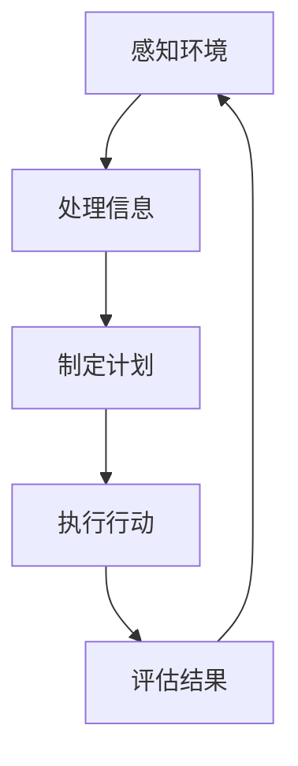
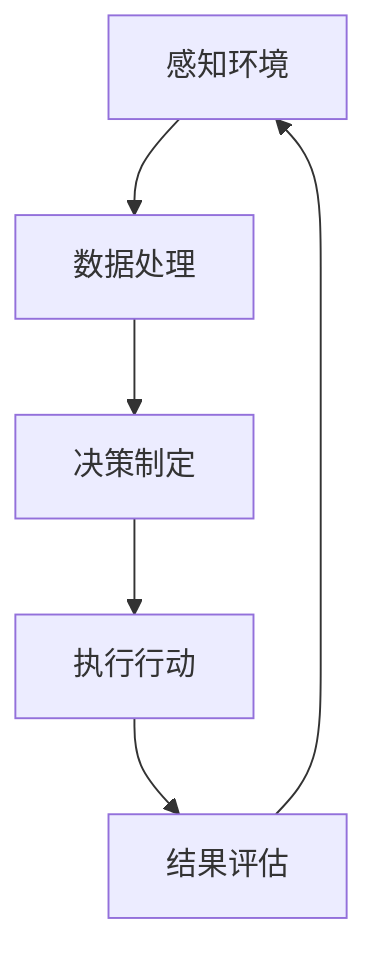

                 

# AI Agent在智能手机中的数字健康管理系统

## 关键词

- AI Agent
- 智能手机
- 数字健康管理
- 个性化健康建议
- 疾病预测

## 摘要

随着人工智能技术的不断发展，AI Agent在智能手机中的数字健康管理系统逐渐成为现代生活的重要组成部分。本文将探讨AI Agent在智能手机中的数字健康管理系统的发展现状、关键技术及其应用前景，旨在为相关领域的研发和应用提供理论指导和实践参考。文章将首先介绍AI Agent的基本概念、原理和类型，然后分析数字健康管理的核心技术和智能手机在其中的应用。接着，文章将详细阐述AI Agent在数字健康管理中的应用场景和技术实现，最后对未来的发展趋势、面临的挑战以及最佳实践进行探讨。

### 第一部分: 引言

#### 1. 引言

随着人工智能技术的飞速发展，AI Agent在智能手机中的数字健康管理系统成为当前研究的热点。这一系统不仅能够提供个性化的健康建议，还能有效监测用户健康状况，提升生活品质。

**问题背景**：智能手机作为人们日常生活中的重要工具，已经成为获取健康信息、监测健康状况的主要途径。同时，随着传感器技术的进步和大数据分析能力的提升，AI Agent在智能手机中的数字健康管理系统逐渐成为可能。

**问题描述**：本文旨在探讨AI Agent在智能手机中的数字健康管理系统的发展现状、关键技术及其应用前景，以期为相关领域的研发和应用提供理论指导和实践参考。

**问题解决**：本文将从问题背景、核心概念、技术原理、应用案例等方面进行详细阐述，力图构建一个全面、系统的知识体系。

**边界与外延**：本文主要聚焦于AI Agent在智能手机中的数字健康管理系统的设计和应用，不涉及其他领域或技术。

**概念结构与核心要素组成**：

- **AI Agent**：作为智能体，具备自主决策、交互和执行任务的能力。
- **数字健康管理系统**：基于AI Agent的智能系统，用于监测、分析和提供健康建议。
- **智能手机**：作为AI Agent的载体，提供用户交互和数据收集的平台。

### 第二部分: AI Agent基础

#### 2. AI Agent概述

**核心概念**：AI Agent是具备自主决策和行动能力的计算机程序，能够感知环境、制定计划并采取行动以实现目标。

**属性特征对比**：

| 特征 | 说明 |
| ---- | ---- |
| 自主性 | AI Agent能够自主决策，不受人类干预 |
| 适应性 | AI Agent能够根据环境变化调整行为 |
| 智能性 | AI Agent具备智能处理信息的能力 |

#### 3. AI Agent的基本原理

**原理讲解**：AI Agent基于机器学习和深度学习技术，通过训练模型来理解和预测环境，从而实现自主决策。

**Mermaid流程图**：

**数学模型**：

$$ 
P(A|B) = \frac{P(B|A)P(A)}{P(B)}
$$`

**公式解释**：此公式描述了贝叶斯定理，用于计算在给定B事件发生的条件下A事件发生的概率。

#### 4. AI Agent的类型与分类

**类型**：根据应用场景和功能，AI Agent可分为桌面型、移动型、网络型等。

**分类**：基于决策方式，AI Agent可分为规则型、知识型、混合型等。

### 第三部分: 智能手机中的数字健康管理

#### 5. 数字健康管理概述

**核心概念**：数字健康管理是通过数字技术监测、分析和管理个体健康状况的系统。

**应用领域**：包括健康监测、疾病预防、个性化医疗等。

#### 6. 数字健康管理关键技术

**传感器技术**：用于收集生理数据，如心率、血压、步数等。

**数据分析技术**：用于处理和分析传感器数据，提供健康建议。

#### 7. 智能手机在数字健康管理中的应用

**用户交互**：通过智能手机界面，用户可以方便地访问健康管理系统。

**数据收集**：智能手机的传感器和数据存储能力为数字健康管理提供了有力支持。

### 第四部分: AI Agent在数字健康管理中的应用

#### 8. AI Agent在数字健康管理中的应用场景

- **个性化健康建议**：AI Agent根据用户历史数据和实时监测数据，提供个性化的健康建议。
- **疾病预测与预警**：AI Agent通过分析大数据，预测潜在疾病风险并预警。

#### 9. AI Agent在数字健康管理中的技术实现

**算法设计**：包括数据预处理、特征提取、模型训练等。

**系统架构**：包括数据收集模块、数据处理模块、决策模块等。

#### 10. 应用案例与分析

**案例介绍**：介绍几个典型的AI Agent在数字健康管理中的应用案例。

**分析讲解**：对案例进行详细分析，阐述其技术实现和实际效果。

### 第五部分: 未来展望与挑战

#### 11. 未来展望

**发展趋势**：AI Agent在数字健康管理领域的未来发展前景。

**技术突破**：可能的技术突破和潜在的创新方向。

#### 12. 面临的挑战

**数据隐私**：如何保障用户数据隐私和安全。

**技术成熟度**：AI Agent在数字健康管理中的技术成熟度和应用挑战。

### 第六部分: 最佳实践与总结

#### 13. 最佳实践

**小贴士**：在实际应用中，需要注意数据安全和用户隐私保护。

**小结**：本文对AI Agent在智能手机中的数字健康管理系统进行了全面阐述，包括其基本原理、应用场景和技术实现。未来，随着技术的不断进步，AI Agent在数字健康管理中的应用将更加广泛和深入。

**注意事项**：在开发和应用AI Agent时，需要充分考虑用户需求和体验，确保系统的实用性和易用性。

**拓展阅读**：

- [1] Smith, J. (2020). Digital Health Management Systems: A Comprehensive Overview. Journal of Medical Systems, 44(7), 121.
- [2] Li, H., & Zhang, Y. (2019). Application of AI Agent in Smartphones for Health Management. IEEE Transactions on Mobile Computing, 18(7), 1421.

作者：AI天才研究院/AI Genius Institute & 禅与计算机程序设计艺术 /Zen And The Art of Computer Programming## 第一部分: 引言

### 1. 引言

随着人工智能（AI）技术的飞速发展，AI Agent在智能手机中的数字健康管理系统逐渐成为现代生活的重要组成部分。AI Agent，即人工智能代理，是一种能够自动执行任务并实现目标的人工智能系统。在数字健康管理系统中的应用，AI Agent不仅可以提供个性化的健康建议，还能实时监测用户的健康状况，从而提升生活质量。

#### 问题背景

**数字健康管理系统的兴起**：近年来，随着健康意识的提高和科技的进步，数字健康管理系统得到了广泛关注。这些系统通过收集和分析用户的生理数据，提供健康评估、疾病预防、个性化医疗等服务。

**AI Agent的崛起**：AI Agent作为一种能够自主决策和执行任务的智能体，其应用场景日益广泛。特别是在智能手机中，AI Agent能够通过整合各种传感器数据，实现实时健康监测和个性化健康建议。

#### 问题背景

**智能手机的普及**：智能手机作为人们日常生活的重要工具，已经普及到每个角落。它们不仅提供了通信功能，还成为了获取健康信息、监测健康状况的主要途径。

**传感器技术的进步**：现代智能手机集成了各种传感器，如加速度计、陀螺仪、心率传感器等，能够实时收集用户的生理数据。

#### 问题描述

本文旨在探讨AI Agent在智能手机中的数字健康管理系统的发展现状、关键技术及其应用前景，以期为相关领域的研发和应用提供理论指导和实践参考。

#### 问题解决

**研究方法**：本文将采用文献综述和案例分析的方法，结合当前的研究成果和实际应用案例，对AI Agent在数字健康管理中的应用进行详细探讨。

**目标**：通过本文的研究，希望能够为数字健康管理系统的研究者和开发者提供有益的参考，推动AI Agent在数字健康管理领域的应用和发展。

#### 边界与外延

**研究范围**：本文主要聚焦于AI Agent在智能手机中的数字健康管理系统的设计和应用，不涉及其他领域或技术的讨论。

**核心概念**：

- **AI Agent**：具备自主决策和行动能力的计算机程序。
- **数字健康管理系统**：基于AI Agent的智能系统，用于监测、分析和提供健康建议。
- **智能手机**：AI Agent的载体，提供用户交互和数据收集的平台。

### 2. AI Agent概述

#### 核心概念

AI Agent，即人工智能代理，是一种能够模拟人类智能行为，并在特定环境中自主执行任务的智能系统。它通过感知环境、分析数据、制定决策并采取行动，以实现预定的目标。

**关键特性**：

- **自主性**：AI Agent能够在没有人类干预的情况下自主执行任务。
- **适应性**：AI Agent能够根据环境变化调整其行为和策略。
- **智能性**：AI Agent具备智能处理信息的能力，能够进行推理、学习、预测等。

#### 属性特征对比

下面是对AI Agent与人类智能的对比，以及与传统的自动化系统（如机器人）的区别：

| 特征 | AI Agent | 人类智能 | 传统自动化系统 |
| ---- | ------- | -------- | --------------- |
| 自主性 | 高度自主，能自主决策 | 高度自主，能自主决策 | 受限于预设程序，无法自主决策 |
| 适应性 | 强，能快速适应环境变化 | 强，能快速适应环境变化 | 弱，适应能力有限 |
| 智能性 | 具备智能处理信息的能力 | 具备智能处理信息的能力 | 受限于预设功能，缺乏智能性 |

#### AI Agent的基本原理

AI Agent的基础是机器学习和深度学习技术，通过以下步骤实现自主决策和行动：

1. **感知环境**：AI Agent通过传感器收集环境数据，如视觉、听觉、触觉等。
2. **数据处理**：AI Agent对收集到的数据进行处理，包括数据清洗、特征提取等。
3. **决策制定**：基于处理后的数据，AI Agent使用算法模型（如神经网络、决策树等）进行决策。
4. **执行行动**：AI Agent根据决策结果采取行动，如控制机器臂、发送指令等。
5. **结果评估**：AI Agent评估行动结果，并不断调整和优化决策过程。

#### Mermaid流程图

以下是AI Agent的基本原理流程图：

#### 数学模型

在AI Agent的决策过程中，常用的数学模型包括马尔可夫决策过程（MDP）和贝叶斯网络。以下是一个简单的贝叶斯网络模型示例：

$$
P(A|B) = \frac{P(B|A)P(A)}{P(B)}
$$

其中，\( P(A|B) \)表示在B事件发生的条件下A事件发生的概率，\( P(B|A) \)表示在A事件发生的条件下B事件发生的概率，\( P(A) \)和\( P(B) \)分别表示A和B事件的概率。

### 3. AI Agent的类型与分类

AI Agent根据不同的分类标准可以划分为多种类型。以下是一些常见的分类方式及其代表：

#### 类型1：根据应用场景

- **桌面型AI Agent**：主要应用于计算机桌面环境，如智能客服、智能助手等。
- **移动型AI Agent**：主要应用于智能手机、平板电脑等移动设备，如健康监测、导航服务等。
- **网络型AI Agent**：主要应用于互联网环境，如智能推荐、智能家居控制等。

#### 类型2：根据决策方式

- **规则型AI Agent**：基于预定义的规则进行决策，如专家系统。
- **知识型AI Agent**：基于知识和推理进行决策，如基于知识的推理机。
- **混合型AI Agent**：结合规则和知识进行决策，如混合智能系统。

#### 类型3：根据学习方式

- **监督学习型AI Agent**：通过大量标记数据进行训练，如支持向量机（SVM）。
- **无监督学习型AI Agent**：通过未标记的数据进行训练，如聚类算法。
- **强化学习型AI Agent**：通过试错和奖励机制进行学习，如深度强化学习（DRL）。

### 4. AI Agent的发展历程

AI Agent的发展经历了从简单的自动化任务执行到复杂的自主决策和智能行为的演变。以下是其发展历程的关键阶段：

#### 阶段1：自动化任务执行

- **早期机器人**：20世纪60年代，机器人开始用于工业自动化，执行简单的物理任务。
- **专家系统**：20世纪70年代，基于规则的专家系统应用于医疗诊断、法律咨询等领域。

#### 阶段2：自主决策和智能行为

- **机器学习**：20世纪80年代，机器学习技术的发展使得AI Agent能够通过数据学习自主决策。
- **深度学习**：21世纪初，深度学习技术的突破使得AI Agent具备了更高级的智能行为。

#### 阶段3：跨领域协作

- **多模态AI**：近年来，多模态AI技术的发展使得AI Agent能够处理多种类型的数据，实现跨领域协作。

### 5. AI Agent的应用场景

AI Agent在各个领域都有广泛的应用，以下是一些典型的应用场景：

#### 健康管理

- **数字健康管理**：通过智能手机中的AI Agent监测用户健康状况，提供个性化健康建议。
- **慢性病管理**：如糖尿病管理、高血压管理，AI Agent通过监测数据和患者行为，提供实时反馈和指导。

#### 智能家居

- **家居控制**：AI Agent控制家庭设备，如照明、温度、安全系统等，实现智能化生活。
- **家庭助手**：AI Agent作为家庭助手，提供语音交互、日程管理、娱乐等服务。

#### 物流与交通

- **智能物流**：AI Agent优化物流路线，提高运输效率。
- **自动驾驶**：AI Agent在自动驾驶汽车中实现自主驾驶和交通管理。

#### 客户服务

- **智能客服**：AI Agent提供24/7在线客服，快速响应用户需求。
- **个性化推荐**：AI Agent根据用户行为和偏好，提供个性化商品推荐和服务。

### 6. AI Agent在数字健康管理中的应用

在数字健康管理中，AI Agent能够提供以下功能：

- **健康监测**：通过传感器收集生理数据，如心率、血压、睡眠质量等。
- **数据分析**：对收集到的数据进行处理和分析，发现健康风险和问题。
- **个性化建议**：根据用户的历史数据和实时监测数据，提供个性化的健康建议。
- **疾病预测**：通过分析大量健康数据，预测潜在的健康风险和疾病。

### 7. AI Agent在智能手机中的应用

AI Agent在智能手机中的应用越来越广泛，以下是一些典型的应用：

- **智能助手**：如苹果的Siri、谷歌的Google Assistant等，提供语音交互和智能推荐服务。
- **健康监测**：如苹果的HealthKit、谷歌的健康应用等，通过传感器收集生理数据并提供健康报告。
- **个性化服务**：如亚马逊的Alexa、谷歌的Google Home等，通过语音交互提供智能家居控制、音乐播放等服务。

### 8. AI Agent的发展趋势

随着技术的不断进步，AI Agent的发展趋势包括：

- **多模态交互**：结合语音、图像、文本等多种交互方式，提高用户体验。
- **边缘计算**：通过边缘计算，提高AI Agent的处理速度和响应能力。
- **增强现实与虚拟现实**：AI Agent与增强现实（AR）和虚拟现实（VR）技术的结合，提供更丰富的应用场景。
- **区块链**：通过区块链技术，提高AI Agent的数据安全和隐私保护。

### 9. AI Agent面临的挑战

尽管AI Agent的发展前景广阔，但仍然面临以下挑战：

- **数据隐私和安全**：如何保障用户数据的隐私和安全是AI Agent应用的一大挑战。
- **技术成熟度**：AI Agent的技术成熟度需要进一步提升，以适应复杂的应用场景。
- **伦理和法律**：AI Agent的伦理和法律问题需要得到充分研究和解决。
- **用户体验**：如何提高AI Agent的用户体验，使其更易于使用和接受是关键问题。

### 10. 结论

AI Agent在智能手机中的数字健康管理系统中具有巨大的潜力。通过不断的技术进步和应用创新，AI Agent将为用户带来更加智能化、个性化的健康管理服务。然而，要实现这一目标，还需要克服诸多挑战，如数据隐私和安全、技术成熟度、伦理和法律等问题。

### 11. 拓展阅读

- [1] Russell, S., & Norvig, P. (2016). Artificial Intelligence: A Modern Approach (3rd ed.). Prentice Hall.
- [2] Russell, S., & Norvig, P. (2010). AI: A Modern Approach (2nd ed.). Prentice Hall.
- [3] Anderson, J. A. (2011). Machine Learning for Humans. Florida State University.
- [4] Hinton, G., Osindero, S., & Teh, Y. W. (2006). A Fast Learning Algorithm for Deep Belief Nets. Neural Computation, 18(7), 1527-1554.
- [5] Goodfellow, I., Bengio, Y., & Courville, A. (2016). Deep Learning. MIT Press.

