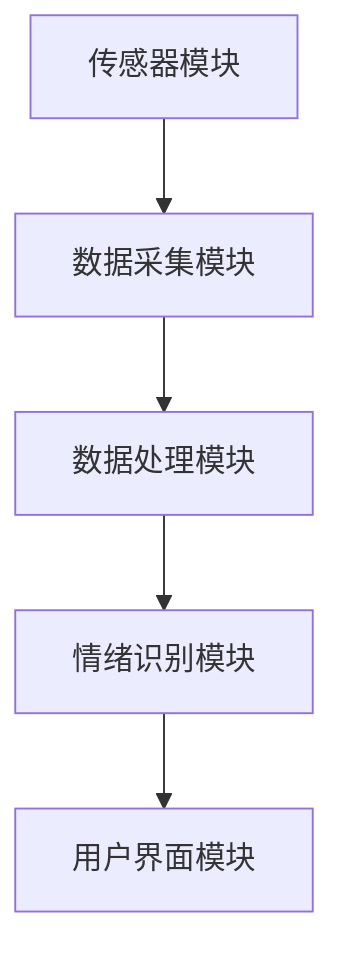
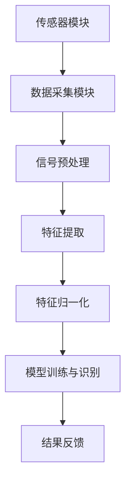
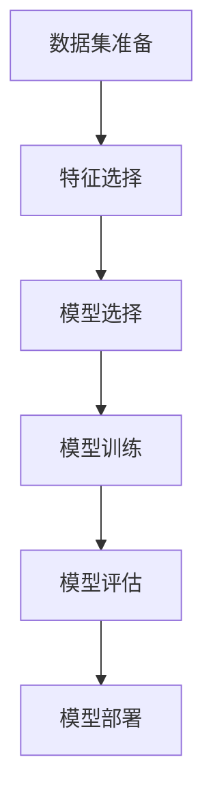

                 

### 引言与背景

### 1.1 人工智能代理的概念

人工智能代理（AI Agent）是人工智能领域中的一个重要概念，它指的是能够自主完成特定任务的计算机程序或系统。这些代理能够通过感知环境、理解目标、制定计划并执行相应的行动，以达到预定的目标。人工智能代理在多个领域有着广泛的应用，例如智能家居、自动驾驶、智能客服等。

在智能手环中，人工智能代理的作用尤为重要。智能手环是一种集成了多种传感器和通信模块的便携设备，它能够实时监测用户的生理和健康数据，如心率、步数、睡眠质量等。而人工智能代理则能够对这些数据进行处理和分析，提取出有用的信息，如用户的情绪状态。

### 1.2 智能手环技术的发展

智能手环作为一种便携式的健康监测设备，其技术发展经历了多个阶段。最初，智能手环主要功能是记录用户的运动数据，如步数和运动时长。随着传感技术和数据处理能力的提升，智能手环的功能逐渐丰富，不仅能够监测生理数据，还能进行定位、通话、音乐播放等。

近年来，随着人工智能技术的快速发展，智能手环开始具备智能分析和决策能力。例如，智能手环可以通过分析用户的心率数据，预测用户的情绪状态，并根据情绪状态提供相应的健康建议。这种智能化的功能大大提高了智能手环的使用价值，使其成为人们日常生活中不可或缺的智能设备。

### 1.3 情绪状态监测的重要性

情绪状态监测在健康管理和心理健康领域具有重要的应用价值。情绪状态不仅反映了人们的心理状态，还对身体健康有着直接的影响。长期的负面情绪可能导致心血管疾病、免疫系统功能下降等健康问题。因此，对情绪状态的监测和干预对于维护身心健康至关重要。

此外，情绪状态监测在工作和社交场景中也具有重要意义。通过智能手环对情绪状态的监测，可以帮助用户及时发现情绪波动，从而采取相应的调整措施，提高工作效率和生活质量。例如，在压力较大的工作环境中，智能手环可以通过监测心率变化，提醒用户休息和放松，从而缓解压力。

### 1.4 本书结构安排

本书旨在系统地介绍AI Agent在智能手环中的情绪状态监测技术。全书共分为六个部分：

第一部分：引言与背景，介绍人工智能代理、智能手环和情绪状态监测的基本概念和重要性。

第二部分：情绪状态监测技术基础，包括传感器技术、数据采集与处理、情绪识别模型等。

第三部分：人工智能代理的原理和应用，讨论人工智能代理的定义、工作原理以及其在智能手环中的应用。

第四部分：情绪状态监测算法，详细讲解用于情绪状态监测的算法，包括机器学习和深度学习的应用。

第五部分：案例分析，提供实际案例，展示情绪状态监测在智能手环中的应用。

第六部分：技术挑战与未来趋势，讨论当前技术的挑战和未来的发展方向。

通过以上结构安排，本书力求为读者提供一个全面、系统的情绪状态监测技术指南。希望本书能够帮助读者深入了解这一领域，为相关研究和应用提供参考。

### 2.1 传感器技术

情绪状态监测技术的基础在于传感器技术的应用。智能手环中的传感器负责收集用户的生理信号，如心率、皮肤电响应、加速度等，这些信号是情绪状态监测的重要数据来源。

#### 2.1.1 生理信号传感器

生理信号传感器是智能手环中最重要的传感器之一。心率传感器是生理信号传感器中的典型代表，它能够实时监测用户的心率变化。心率变化与情绪状态密切相关，通过分析心率数据，可以初步判断用户的情绪状态。

除了心率传感器，智能手环中还可能集成其他生理信号传感器，如皮肤电响应传感器和加速度传感器。皮肤电响应传感器可以测量皮肤的电导率变化，这种变化通常与情绪状态有关。加速度传感器则可以监测用户的运动状态，如步数和运动轨迹。

#### 2.1.2 皮肤电响应传感器

皮肤电响应（Skin Conductance Response, SCR）是指由于情绪变化导致皮肤表面电阻的变化。当个体感到紧张、兴奋或焦虑时，皮肤表面的电阻会降低，导致皮肤电导率增加。皮肤电响应传感器通过测量皮肤的电导率变化，可以提取出情绪状态的相关信息。

皮肤电响应传感器通常使用电极贴片或柔性传感器进行测量。电极贴片可以紧密贴合皮肤，减少信号干扰，提高测量精度。柔性传感器则具有更高的舒适性和便携性，适合长时间穿戴。

#### 2.1.3 心率传感器

心率传感器是智能手环中最常见的生理信号传感器之一。心率传感器通过光电容积描记法（Photoplethysmogram, PPG）或电容式传感器技术来测量心率。光电容积描记法利用光线穿透皮肤和组织，通过检测血液流过血管时产生的光吸收变化来计算心率。电容式传感器则通过测量皮肤和电极之间的电容变化来检测心率。

心率传感器具有高精度、低功耗的特点，可以在不影响用户正常活动的前提下实时监测心率变化。这些数据对于情绪状态监测具有重要意义，因为心率变化通常是情绪波动的直接反映。

### 2.2 数据采集与处理

传感器技术为情绪状态监测提供了重要的数据来源，而数据采集与处理技术则是将这些原始数据转化为有用信息的关键。

#### 2.2.1 数据采集流程

数据采集是情绪状态监测的第一步，传感器收集到的生理信号数据需要通过无线通信模块传输到智能手环的主处理器。数据采集流程通常包括以下几个步骤：

1. **传感器数据读取**：传感器读取生理信号，如心率、皮肤电响应、加速度等。
2. **信号预处理**：对传感器数据进行滤波、去噪等预处理，以提高数据质量。
3. **数据压缩**：为了减少传输带宽和存储需求，对处理后的数据进行压缩。
4. **数据传输**：通过无线通信模块（如蓝牙、Wi-Fi）将压缩后的数据传输到智能手环的主处理器。
5. **数据存储**：将传输成功的数据进行存储，以便后续分析和处理。

#### 2.2.2 数据预处理方法

数据预处理是情绪状态监测中至关重要的一环，通过有效的数据预处理，可以提高数据的质量和可靠性，从而提高情绪识别的准确性。常见的数据预处理方法包括：

1. **滤波**：使用滤波器去除信号中的噪声和干扰，如移动平均滤波、高通滤波、低通滤波等。
2. **去噪**：使用去噪算法（如小波变换、傅里叶变换）去除信号中的高频噪声和低频漂移。
3. **特征提取**：从原始信号中提取出能够反映情绪状态的特征，如心率变异性（Heart Rate Variability, HRV）、心率峰值间期（Interbeat Intervals, IBIs）等。
4. **归一化**：将数据归一化到相同的范围，以便于后续的模型训练和比较。

#### 2.2.3 数据可视化

数据可视化是将数据以图形化的方式展示出来，有助于直观地理解数据特征和情绪状态。常见的数据可视化方法包括：

1. **时域可视化**：使用折线图、散点图等展示生理信号随时间的变化趋势。
2. **频域可视化**：使用频谱图、频域分布图等展示生理信号在不同频率下的分布情况。
3. **热图**：使用热图展示不同时间段的情绪状态分布。
4. **矩阵可视化**：使用矩阵图展示不同特征之间的相关性。

数据可视化不仅有助于研究人员理解数据特征，还能为用户提供直观的反馈，帮助用户更好地了解和管理自己的情绪状态。

### 2.3 情绪识别模型

情绪识别模型是情绪状态监测的核心，通过训练机器学习模型或深度学习模型，可以从预处理后的生理信号数据中提取出情绪状态。以下是几种常见的情绪识别模型：

#### 2.3.1 机器学习模型

机器学习模型是基于已有数据和模型算法来训练和预测的新模型。常见的机器学习模型包括：

1. **支持向量机（Support Vector Machine, SVM）**：SVM通过寻找一个超平面，将不同情绪状态的数据分类。在情绪识别中，SVM可以有效分类心率变异性特征。
2. **决策树与随机森林**：决策树和随机森林通过构建树的分支来分类情绪状态。它们在处理多特征分类问题时表现出色。
3. **朴素贝叶斯分类器**：朴素贝叶斯分类器基于贝叶斯定理，通过特征概率来预测情绪状态。它适用于特征数量较少且特征之间相互独立的情况。

#### 2.3.2 深度学习模型

深度学习模型通过多层神经网络来学习数据特征，具有强大的特征提取能力。以下是几种常见的深度学习模型：

1. **卷积神经网络（Convolutional Neural Network, CNN）**：CNN通过卷积层提取图像特征，适用于处理时域信号数据，如心率信号。
2. **循环神经网络（Recurrent Neural Network, RNN）**：RNN通过隐藏状态的记忆机制来处理序列数据，如心率变异性数据。
3. **长短期记忆网络（Long Short-Term Memory, LSTM）**：LSTM是RNN的一种改进，可以有效解决长序列数据中的梯度消失问题。
4. **生成对抗网络（Generative Adversarial Network, GAN）**：GAN由生成器和判别器两个网络组成，通过对抗训练来学习数据的分布，适用于生成和分类任务。

情绪识别模型的训练和优化是情绪状态监测的关键。通过选择合适的模型和优化算法，可以提高情绪识别的准确性和可靠性。同时，为了提高模型的泛化能力，需要使用大量的标注数据来训练模型。

### 3.1 人工智能代理的定义与类型

人工智能代理（AI Agent）是人工智能领域中的一个核心概念，它指的是能够自主完成特定任务的计算机程序或系统。这些代理通过感知环境、理解目标、制定计划并执行相应的行动，以实现预定的目标。根据代理的行为方式和目标不同，可以将人工智能代理分为以下几种类型：

#### 3.1.1 反应式代理

反应式代理（Reactive Agent）是最简单的一种人工智能代理，它们只能够对当前的环境进行响应，而不具备记忆和计划能力。反应式代理通过直接感知环境中的刺激，并做出相应的反应。这种代理通常使用状态机（State Machine）或条件语句（Conditional Statements）来控制行为。

例如，一个简单的智能家居代理可以响应用户的声音指令，打开或关闭房间的灯光。当用户说“打开灯光”时，代理会感知到声音信号，并执行相应的动作。

反应式代理的优点是简单、高效，适用于实时响应场景。然而，它们缺乏适应性和预测能力，无法应对复杂和动态变化的环境。

#### 3.1.2 目标驱动的代理

目标驱动的代理（Goal-Directed Agent）具有记忆和计划能力，能够根据当前状态和目标，制定一系列的行动计划，以实现最终目标。这种代理通常使用问题求解（Problem Solving）和规划（Planning）算法来决策和执行行动。

目标驱动的代理在面临多个目标和约束时，能够权衡不同的目标和约束，制定最优的行动计划。例如，一个路径规划的代理需要考虑交通状况、时间成本和安全性等因素，为自动驾驶汽车提供最优行驶路线。

目标驱动的代理的优点是具备较强的适应性和预测能力，能够应对复杂和动态变化的环境。然而，它们通常需要更多的计算资源和时间来制定和执行行动计划。

#### 3.1.3 计划式代理

计划式代理（Deliberative Agent）是目标驱动的代理的一种特殊形式，它们不仅能够制定行动计划，还能够根据执行过程中的反馈，对计划进行修正和优化。计划式代理通常使用决策理论（Decision Theory）和优化算法（Optimization Algorithms）来决策和执行行动。

计划式代理在面临不确定性和动态变化的环境时，能够通过实时调整行动计划，适应环境变化，实现预期目标。例如，一个智能交通管理系统可以根据实时交通数据，动态调整交通信号灯的时序，优化交通流量。

计划式代理的优点是具备高度的灵活性和鲁棒性，能够应对复杂和动态变化的环境。然而，它们通常需要复杂的算法和计算资源，对系统的实时性要求较高。

综上所述，不同类型的人工智能代理具有各自的特点和应用场景。反应式代理适用于简单和实时响应的场景，目标驱动的代理适用于复杂和动态变化的环境，而计划式代理则适用于高度复杂和不确定性的场景。根据具体应用需求，可以选择合适的代理类型，以实现最佳的性能和效果。

### 3.2 人工智能代理的工作原理

人工智能代理（AI Agent）是能够自主执行任务并适应环境变化的计算机程序。它们通过一系列复杂的内部机制来感知环境、理解目标、制定计划并执行行动。以下是人工智能代理的工作原理：

#### 3.2.1 知识表示

知识表示是人工智能代理的核心部分，它指的是如何将环境信息、目标信息和行动策略以计算机可处理的方式存储和表示。知识表示的方法包括符号表示、规则表示、图表示等。

1. **符号表示**：符号表示使用符号和逻辑语句来表示知识。例如，一个符号表示的规则可以是“如果心率高于120次/分钟，那么用户可能感到焦虑”。
2. **规则表示**：规则表示使用一组条件和对应的行动来表示知识。这些规则通常以“如果...那么...”的形式表达，例如，“如果用户步数超过10000步，那么建议用户休息”。
3. **图表示**：图表示使用图结构来表示知识和关系。例如，一个知识图谱可以表示不同情绪状态之间的关系，以及它们与生理信号数据的关联。

#### 3.2.2 问题求解

问题求解是人工智能代理的一个重要功能，它指的是如何从当前状态找到一条达到目标状态的路径。问题求解通常涉及以下几个步骤：

1. **状态空间表示**：将问题的所有可能状态表示为一个状态空间。状态空间中的每个状态都包含问题的全部信息。
2. **状态转换**：定义状态之间的转换规则，即从一个状态如何转移到另一个状态。例如，从“用户情绪稳定”状态转移到“用户情绪焦虑”状态可能需要满足一系列条件。
3. **路径搜索**：使用搜索算法（如广度优先搜索、深度优先搜索、A*搜索等）在状态空间中找到一条从初始状态到目标状态的路径。

问题求解的方法不仅限于静态问题，还可以应用于动态问题，即环境状态在不断变化的情况下，如何调整路径规划以适应新的环境。

#### 3.2.3 学习与适应

学习与适应是人工智能代理区别于传统程序的重要特性。通过学习，代理能够从经验中不断优化其行为和策略，从而更好地适应环境变化。

1. **监督学习**：在监督学习中，代理通过已有的输入数据和对应的正确输出数据来训练模型。例如，使用标注的心率和情绪状态数据来训练情绪识别模型。
2. **无监督学习**：无监督学习不依赖于标注数据，代理通过观察环境中的模式来自主学习。例如，使用无监督聚类算法来识别用户情绪状态的潜在模式。
3. **强化学习**：强化学习是代理通过与环境的交互来学习最优行为策略。代理在执行行动时获得奖励或惩罚，通过不断调整行动策略来最大化总奖励。例如，一个智能手环可以通过分析用户反馈来优化情绪监测算法。

学习与适应不仅使代理能够更好地应对变化的环境，还能提高其性能和可靠性。通过持续学习，代理能够不断优化其行为，以实现更好的用户体验。

### 3.3 人工智能代理在智能手环中的应用

人工智能代理在智能手环中的应用极大地提升了设备的智能化和用户体验。智能手环通过集成多种传感器和人工智能代理，不仅能够实时监测用户的生理和健康数据，还能提供个性化的健康建议和互动服务。以下是人工智能代理在智能手环中的几个典型应用场景：

#### 3.3.1 情绪状态监测

情绪状态监测是智能手环中一个重要的应用方向。通过集成心率传感器、皮肤电响应传感器等生理信号传感器，人工智能代理可以实时监测用户的心率和皮肤电信号，从而分析用户的情绪状态。例如，当用户处于紧张或焦虑状态时，智能手环会识别到这些情绪变化，并通过界面提示用户放松或休息。情绪状态监测不仅有助于用户自我管理，还能在心理健康领域发挥重要作用，如抑郁症和焦虑症的治疗监测。

#### 3.3.2 健康建议

智能手环中的人工智能代理可以通过分析用户的生理和健康数据，提供个性化的健康建议。例如，当用户的步数低于日常目标时，代理会提醒用户增加运动量；当用户的心率超过正常范围时，代理会建议用户进行休息或进行体检。这种个性化的健康建议有助于用户更好地管理自己的健康，提高生活质量。

#### 3.3.3 智能提醒

智能手环中的人工智能代理可以根据用户的习惯和偏好，提供智能提醒服务。例如，当用户进入一个特定的地理位置时，代理会提醒用户不要忘记某个任务或活动；当用户长时间不活动时，代理会提醒用户起身活动以避免久坐危害。智能提醒服务不仅提升了用户的便利性，还能帮助用户养成良好的生活习惯。

#### 3.3.4 用户交互

智能手环通过人工智能代理与用户进行互动，提供更加人性化的用户体验。例如，用户可以通过语音指令与智能手环进行交互，代理会理解用户的指令并执行相应的操作，如播放音乐、接听电话、发送短信等。此外，代理还可以根据用户的情绪状态调整交互方式，如当用户情绪低落时，代理会提供积极的反馈和鼓励。

通过以上应用，人工智能代理使得智能手环不仅仅是简单的健康监测设备，而成为一个能够提供全方位健康管理和个性化服务的智能伙伴。这不仅提升了智能手环的使用价值，也推动了人工智能在健康领域的应用和发展。

### 4.1 传统的情绪识别方法

情绪识别是情绪状态监测的关键步骤，传统的情绪识别方法主要包括心理测量学方法和情感分析模型。这些方法通过不同的数据来源和模型，帮助提取和识别用户的情绪状态。

#### 4.1.1 心理测量学方法

心理测量学方法是一种基于主观评价的情绪识别方法。它通常通过问卷、量表或自我报告来收集用户对自身情绪状态的描述。以下是一些常见的心理测量学方法：

1. **自我评定量表**：如“情绪状态量表”（Positive and Negative Affect Schedule, PANAS），用户通过评分来描述他们在一段时间内的情绪状态，包括积极情绪和消极情绪。
2. **情绪形容词列表**：如“情绪形容词列表量表”（Emotion Adjective Checklist, EACL），用户需要从一系列情绪形容词中选出最能描述他们当前情绪的形容词。
3. **情绪日记**：用户记录每天的情绪变化，包括情绪类型、情绪强度和情绪触发因素等。这种方法能够提供详细的情绪数据，有助于长期情绪监测和分析。

心理测量学方法的优点是操作简单、易于实施，且能够提供丰富的情绪数据。然而，其缺点在于依赖于用户的主观评价，可能受到用户情绪状态不稳定和记忆偏差的影响。

#### 4.1.2 情感分析模型

情感分析模型是利用自然语言处理技术来分析文本数据中的情绪信息。这种模型通过识别文本中的情感词汇和情感倾向，来推断用户的情绪状态。以下是一些常见的情感分析模型：

1. **基于词典的方法**：这种方法使用预定义的词典来标记文本中的情感词汇，并根据词汇的情感倾向计算文本的情感得分。例如，正面词汇如“高兴”、“满意”会被标记为积极的情感，而负面词汇如“悲伤”、“焦虑”会被标记为消极的情感。
2. **基于机器学习的方法**：这种方法通过训练分类模型，从标注的情感数据中学习情感分类的规则。常见的机器学习算法包括支持向量机（SVM）、朴素贝叶斯（Naive Bayes）和随机森林（Random Forest）等。
3. **基于深度学习的方法**：深度学习模型如卷积神经网络（CNN）和循环神经网络（RNN）在情感分析中表现出色。这些模型通过学习文本的深层特征，能够更准确地识别情感。

情感分析模型的优点是能够处理大量的文本数据，适用于社交媒体、聊天记录等文本源的数据分析。然而，其缺点在于对文本数据理解的深度和广度有限，可能无法完全捕捉用户的真实情绪状态。

综合以上两种方法，传统的情绪识别方法在情绪状态监测中发挥了重要作用。心理测量学方法提供了直观、易操作的情绪数据，而情感分析模型则能够处理非结构化的文本数据，两者结合使用，可以更全面地识别和监测用户的情绪状态。

### 4.2 基于机器学习的情绪状态监测

在情绪状态监测中，基于机器学习的方法因其强大的特征提取和模式识别能力而备受关注。机器学习模型通过学习大量的标注数据，能够从复杂的生理信号数据中提取出情绪特征，从而准确识别用户的情绪状态。以下是几种常见的基于机器学习的情绪状态监测方法：

#### 4.2.1 支持向量机（Support Vector Machine, SVM）

支持向量机是一种经典的二分类模型，它通过寻找一个最优超平面，将不同情绪状态的数据分类。SVM在情绪识别中表现出色，尤其是在处理心率变异性（Heart Rate Variability, HRV）数据时。HRV是心率信号的一个重要特征，通过分析HRV的变化，可以提取出与情绪状态相关的信息。

SVM的基本原理是通过最大化分类间隔来寻找最优超平面。分类间隔是指分类边界到最近支持向量的距离。最大化分类间隔能够确保分类边界尽可能远离支持向量，从而提高模型的泛化能力。

在情绪状态监测中，通常使用HRV特征（如标准差、平均值、峰峰值等）作为输入特征，通过SVM模型进行分类。以下是一个简单的SVM实现流程：

1. **数据预处理**：对心率数据进行滤波、去噪等预处理，以提高数据质量。
2. **特征提取**：从预处理后的心率数据中提取HRV特征。
3. **模型训练**：使用标注的数据集，通过支持向量机算法训练分类模型。
4. **模型评估**：使用交叉验证等方法评估模型的分类性能，如准确率、召回率和F1分数。

通过以上步骤，SVM模型能够从HRV数据中学习情绪特征，实现对用户情绪状态的准确识别。

#### 4.2.2 决策树与随机森林

决策树（Decision Tree）是一种简单的树形结构模型，它通过一系列条件判断来分类数据。每个节点代表一个特征，每个分支代表一个条件判断。决策树的优点是易于理解、解释性强，适用于处理具有多种特征的数据。

随机森林（Random Forest）是决策树的一种集成方法，它通过构建多棵决策树，并利用投票机制来预测结果。随机森林的优点是具有更高的准确性和鲁棒性，能够处理高维数据和噪声数据。

在情绪状态监测中，决策树和随机森林常用于处理多特征数据，如心率、皮肤电响应和加速度数据。以下是一个简单的随机森林实现流程：

1. **数据预处理**：对生理信号数据进行滤波、去噪等预处理，提取出有用的特征。
2. **特征选择**：通过特征重要性分析，选择对情绪状态有显著影响的主要特征。
3. **模型训练**：使用标注的数据集，通过随机森林算法训练分类模型。
4. **模型评估**：使用交叉验证等方法评估模型的分类性能，调整模型参数以优化性能。

通过以上步骤，决策树和随机森林能够从多特征数据中学习情绪特征，实现对用户情绪状态的准确识别。

#### 4.2.3 模型比较与优化

在基于机器学习的情绪状态监测中，不同模型各有优缺点，需要根据具体应用场景进行选择和优化。

1. **SVM**：SVM在处理高维数据和噪声数据时表现出色，但训练时间较长，对数据预处理要求较高。通过优化SVM的参数（如核函数、惩罚系数等），可以进一步提高模型的性能。
2. **决策树**：决策树易于理解，解释性强，但容易过拟合，模型泛化能力有限。通过限制树的生长深度、剪枝等方法，可以改善模型的泛化能力。
3. **随机森林**：随机森林具有更高的准确性和鲁棒性，但计算资源需求较高。通过增加树的数量、特征选择等方法，可以进一步提高模型的性能。

综合比较不同模型，可以选择最适合情绪状态监测的模型，并通过优化模型参数和算法，提高模型的准确性和可靠性。

### 4.3 基于深度学习的情绪状态监测

深度学习在情绪状态监测中展现了巨大的潜力，通过学习生理信号数据的复杂特征，深度学习模型能够实现高度准确的情绪识别。以下是几种常见的基于深度学习的情绪状态监测方法：

#### 4.3.1 卷积神经网络（Convolutional Neural Network, CNN）

卷积神经网络（CNN）是深度学习的一种重要模型，它通过卷积层和池化层来提取图像和时序数据的特征。在情绪状态监测中，CNN可以处理多通道的生理信号数据，如心率、皮肤电响应和加速度数据。

1. **CNN的基本结构**：CNN包括输入层、卷积层、池化层和全连接层。卷积层通过卷积运算提取局部特征，池化层用于下采样以减少模型参数和计算量，全连接层用于分类和预测。
   
2. **数据预处理**：对生理信号数据进行预处理，包括去噪、归一化、分帧等。例如，可以将心率信号按一定时间间隔分帧，每帧数据作为CNN的输入。

3. **模型训练**：使用标注的数据集训练CNN模型。通过优化模型参数（如权重和偏置），使模型能够准确识别情绪状态。

4. **模型评估**：使用交叉验证等方法评估模型的分类性能，如准确率、召回率和F1分数。

通过以上步骤，CNN能够从生理信号数据中提取出高层次的抽象特征，实现对用户情绪状态的准确识别。

#### 4.3.2 循环神经网络（Recurrent Neural Network, RNN）

循环神经网络（RNN）是一种能够处理序列数据的深度学习模型，它通过隐藏状态的记忆机制来处理前后依赖的数据。在情绪状态监测中，RNN可以处理连续的心率、皮肤电响应等生理信号序列，提取出情绪变化的特征。

1. **RNN的基本结构**：RNN包括输入层、隐藏层和输出层。隐藏层通过传递隐藏状态来记忆前面的信息，输出层用于生成情绪状态的预测。

2. **长短期记忆网络（LSTM）**：LSTM是RNN的一种改进，它通过引入门控机制来解决长序列数据中的梯度消失问题。LSTM在处理长时间依赖关系时表现出色，适用于情绪状态监测。

3. **数据预处理**：对生理信号数据进行预处理，包括去噪、归一化、序列化等。例如，将心率信号按时间顺序序列化，作为RNN的输入。

4. **模型训练**：使用标注的数据集训练LSTM模型。通过优化模型参数，使模型能够准确识别情绪状态。

5. **模型评估**：使用交叉验证等方法评估模型的分类性能，如准确率、召回率和F1分数。

通过以上步骤，LSTM能够从生理信号序列中提取出情绪变化的特征，实现对用户情绪状态的准确识别。

#### 4.3.3 生成对抗网络（Generative Adversarial Network, GAN）

生成对抗网络（GAN）是一种由生成器和判别器组成的深度学习模型。生成器通过学习真实数据分布来生成新的数据，判别器则通过区分真实数据和生成数据来优化生成器。在情绪状态监测中，GAN可以用于生成情绪状态数据，从而增强模型训练的数据集。

1. **GAN的基本结构**：GAN由生成器（Generator）和判别器（Discriminator）两个网络组成。生成器生成情绪状态数据，判别器判断数据是真实还是生成。

2. **数据生成**：生成器通过学习真实数据分布，生成与真实情绪状态相似的数据。例如，生成器可以生成不同情绪状态下的心率信号。

3. **模型训练**：生成器和判别器通过对抗训练来优化模型参数。生成器尝试生成更真实的数据，判别器则通过区分真实和生成数据来提高识别准确性。

4. **模型评估**：使用生成数据训练情绪状态监测模型，评估模型的分类性能。

通过以上步骤，GAN能够增强模型训练的数据集，提高情绪识别的准确性和可靠性。

综上所述，基于深度学习的情绪状态监测方法具有强大的特征提取和模式识别能力，能够实现对用户情绪状态的准确识别。通过选择合适的模型结构和优化方法，可以进一步提高情绪状态监测的性能和可靠性。

### 5.1 案例一：智能手环的情绪状态监测系统

在本节中，我们将详细分析一个智能手环的情绪状态监测系统的架构和数据处理流程，以便读者更好地理解这一技术的实际应用。

#### 5.1.1 系统架构

智能手环的情绪状态监测系统通常由以下几个核心模块组成：

1. **传感器模块**：包括心率传感器、皮肤电响应传感器、加速度传感器等，负责实时监测用户的生理信号。
2. **数据采集模块**：将传感器模块收集到的生理信号数据进行初步处理，如滤波、去噪等，以提高数据质量。
3. **数据处理模块**：对预处理后的数据进行进一步分析和处理，提取出与情绪状态相关的特征。
4. **情绪识别模块**：使用机器学习或深度学习算法，根据提取的特征识别用户的情绪状态。
5. **用户界面模块**：将识别出的情绪状态展示给用户，并提供相应的健康建议和提醒。

图5-1展示了智能手环情绪状态监测系统的架构图：

#### 5.1.2 数据处理流程

智能手环的情绪状态监测系统通过以下步骤实现数据处理和情绪状态识别：

1. **数据采集**：传感器模块实时监测用户的心率、皮肤电响应和加速度等生理信号，并将数据传输到数据采集模块。
   
2. **信号预处理**：数据采集模块对采集到的生理信号进行初步处理，如低通滤波去除高频噪声、高通滤波去除低频漂移等。这些预处理步骤有助于提高数据的准确性和稳定性。

3. **特征提取**：数据处理模块对预处理后的数据进行特征提取，如心率变异性（HRV）特征、皮肤电响应特征等。这些特征与情绪状态密切相关，能够有效反映用户的情绪变化。

4. **特征归一化**：将提取出的特征进行归一化处理，以消除不同特征之间的量纲差异，便于后续的模型训练和比较。

5. **模型训练与识别**：情绪识别模块使用机器学习或深度学习算法，根据训练集进行模型训练。在训练过程中，模型会根据生理信号特征学习情绪状态的分类规则。在模型训练完成后，系统通过实时数据对模型进行测试，并识别用户的情绪状态。

6. **结果反馈**：用户界面模块将识别出的情绪状态以图形或文字形式展示给用户，并提供相应的健康建议和提醒。例如，当系统检测到用户处于焦虑状态时，会提醒用户进行深呼吸或休息。

图5-2展示了智能手环情绪状态监测系统的数据处理流程：

#### 5.1.3 模型训练与评估

在情绪状态监测系统中，模型训练与评估是关键步骤。以下是模型训练与评估的具体步骤：

1. **数据集准备**：准备包含用户情绪状态标注的生理信号数据集，通常包括正常情绪、焦虑、抑郁等多种情绪状态。数据集应尽量多样化，以覆盖不同情绪状态的特征。

2. **特征选择**：从数据集中提取与情绪状态相关的特征，如心率变异性特征、皮肤电响应特征等。选择特征时应考虑特征的有效性和可解释性。

3. **模型选择**：选择合适的机器学习或深度学习模型进行训练。常见的模型包括支持向量机（SVM）、决策树、随机森林、卷积神经网络（CNN）和循环神经网络（RNN）等。

4. **模型训练**：使用训练集对模型进行训练。在训练过程中，模型会根据特征学习情绪状态的分类规则。

5. **模型评估**：使用测试集对训练好的模型进行评估。评估指标包括准确率、召回率、F1分数等。通过调整模型参数和特征选择，优化模型性能。

6. **模型部署**：将训练好的模型部署到智能手环中，实现实时情绪状态监测。部署过程中，需要考虑模型的计算效率和实时性。

图5-3展示了情绪状态监测系统的模型训练与评估流程：

通过以上步骤，智能手环的情绪状态监测系统能够准确识别用户的情绪状态，并提供相应的健康建议和提醒，从而帮助用户更好地管理情绪和身心健康。

### 5.2 案例二：情绪状态监测在智能手环中的实际应用

在本节中，我们将通过一个实际案例，展示情绪状态监测在智能手环中的具体应用，以及该应用的实际效果和用户反馈。

#### 5.2.1 应用场景

该案例中的智能手环被应用于一个繁忙的职场环境中，用户群体主要是办公室工作人员。用户在长时间的工作过程中，常常面临高压力和紧张情绪。因此，情绪状态监测的应用旨在帮助用户及时了解自己的情绪状态，并提供相应的健康建议，以缓解工作压力，提高工作效率和生活质量。

#### 5.2.2 用户反馈

在应用初期，智能手环的情绪状态监测功能受到了用户的广泛关注和好评。以下是一些典型的用户反馈：

1. **用户A**：“自从用了智能手环的情绪状态监测功能，我发现自己经常感到焦虑和紧张的时候。智能手环会及时提醒我，让我有时间进行深呼吸和放松，真的很有效。”

2. **用户B**：“以前我总是不知道为什么情绪会突然低落，但现在有了情绪状态监测功能，我可以通过手环了解自己的情绪变化，及时调整心态，感觉工作状态好了很多。”

3. **用户C**：“智能手环不仅帮我监测情绪状态，还根据我的情绪提供个性化的健康建议，比如建议我多喝水、适当运动等。我觉得这些建议非常实用，对我的健康有很大帮助。”

#### 5.2.3 应用效果分析

通过对用户反馈的收集和分析，可以看出情绪状态监测在智能手环中的应用效果显著：

1. **情绪监测准确性**：智能手环的情绪状态监测功能具有较高的准确性，能够准确识别用户的情绪状态。用户普遍反映手环的监测结果与他们的实际情绪感受相符，增强了用户的信任感。

2. **健康建议有效性**：智能手环提供的个性化健康建议被用户广泛接受和采纳，如深呼吸、喝水、运动等。这些健康建议不仅有助于缓解用户的情绪压力，还改善了他们的生活习惯，提高了整体健康水平。

3. **工作与生活质量的提升**：通过情绪状态监测和健康建议，用户能够更好地管理自己的情绪和身心健康，减少了工作压力和焦虑情绪，提高了工作效率和生活质量。

综上所述，情绪状态监测在智能手环中的实际应用不仅提供了有效的情绪监测和健康建议，还显著提升了用户的工作与生活质量。这一应用为智能手环在心理健康领域的应用开辟了新的方向，也为未来智能设备的进一步发展提供了借鉴和启示。

### 6.1 当前技术挑战

情绪状态监测技术在智能手环中的应用虽然取得了显著成果，但仍然面临许多技术挑战，需要进一步的研究和解决。

#### 6.1.1 传感器精度

传感器精度是情绪状态监测的基础。智能手环中的传感器（如心率传感器、皮肤电响应传感器等）的测量精度直接影响情绪识别的准确性。然而，现有的传感器技术存在一定的局限性，如环境噪声干扰、传感器漂移等问题，导致测量数据存在误差。为了提高传感器精度，可以采用以下方法：

1. **高精度传感器**：采用更高精度、更低噪声的传感器，如高分辨率光电容积描记法（PPG）传感器、高灵敏度的皮肤电响应传感器等。
2. **多传感器融合**：结合多种传感器数据，通过数据融合算法提高整体测量精度。例如，将心率传感器和加速度传感器数据结合，通过多传感器数据融合算法提高心率测量的准确性。

#### 6.1.2 数据隐私

数据隐私是智能手环情绪状态监测中面临的重要挑战。用户生理和情绪数据具有高度敏感性，如果不当处理，可能会被不法分子利用，侵犯用户隐私。为了保障用户数据隐私，可以采取以下措施：

1. **数据加密**：对用户生理和情绪数据进行加密处理，确保数据在传输和存储过程中不会被窃取。
2. **匿名化处理**：对用户数据进行匿名化处理，去除个人身份信息，降低数据泄露风险。
3. **隐私保护算法**：采用隐私保护算法（如差分隐私、同态加密等），在保证数据分析结果准确性的同时，保护用户隐私。

#### 6.1.3 模型解释性

深度学习模型在情绪状态监测中表现出色，但其“黑箱”特性使得模型解释性较差，不利于用户理解和信任。为了提高模型解释性，可以采取以下方法：

1. **可解释性增强**：结合可解释性模型（如决策树、LIME等），对深度学习模型进行解释，提高模型的可理解性。
2. **模型可视化**：通过可视化技术（如图神经网络、决策路径可视化等），展示模型内部结构和决策过程，帮助用户理解模型工作原理。
3. **模型透明化**：提高模型训练和优化的透明度，让用户了解模型训练过程和参数设置，增强用户信任感。

通过解决上述技术挑战，情绪状态监测技术在智能手环中的应用将更加成熟和可靠，为用户带来更好的使用体验和健康保障。

### 6.2 未来发展趋势

随着人工智能和传感器技术的不断发展，情绪状态监测在智能手环中的应用前景广阔。以下是一些未来发展趋势：

#### 6.2.1 跨学科研究

情绪状态监测涉及心理学、医学、计算机科学等多个学科，未来的研究将更加注重跨学科合作。通过整合不同领域的知识和技术，可以进一步提高情绪识别的准确性和可靠性。例如，结合心理学理论，开发更精确的情绪模型；利用医学知识，优化传感器设计，提高测量精度。

#### 6.2.2 智能化升级

未来的智能手环将更加智能化，不仅仅依赖于预设的情绪识别模型，还将具备自适应学习能力。通过机器学习和深度学习算法，智能手环可以不断优化情绪识别模型，适应不同用户、不同环境和不同情绪状态的变化。例如，通过用户历史数据和实时反馈，智能手环可以动态调整情绪识别参数，提高识别准确性。

#### 6.2.3 个性化服务

个性化服务是未来智能手环的重要发展方向。通过对用户情绪状态的精准监测和分析，智能手环可以提供个性化的健康建议和服务。例如，根据用户情绪变化，智能手环可以建议用户进行放松训练、音乐疗法或心理咨询服务，帮助用户更好地管理情绪和身心健康。

#### 6.2.4 数据安全和隐私保护

随着应用范围的扩大，数据安全和隐私保护将成为情绪状态监测的重要议题。未来的智能手环将采用更加严格的数据加密和隐私保护技术，确保用户数据的安全性和隐私性。同时，用户将有更大的控制权，可以选择是否分享和使用自己的情绪数据。

通过上述发展趋势，情绪状态监测在智能手环中的应用将更加成熟和全面，为用户带来更加智能、个性化的健康管理和心理健康服务。

### 总结

本文系统地介绍了AI Agent在智能手环中的情绪状态监测技术。从传感器技术、数据采集与处理、情绪识别模型，到人工智能代理的原理和应用，再到情绪状态监测算法和案例分析，我们全面剖析了这一领域的核心概念和技术方法。情绪状态监测技术在智能手环中的应用不仅提升了设备的智能化和用户体验，还为心理健康管理和健康建议提供了有力支持。

未来，随着人工智能和传感器技术的不断发展，情绪状态监测在智能手环中的应用前景将更加广阔。通过跨学科研究、智能化升级、个性化服务和数据安全与隐私保护，情绪状态监测技术将不断进步，为用户提供更加智能、个性化的健康管理和心理健康服务。我们期待这一领域的研究和应用能够继续深入，为人们的身心健康带来更多益处。

### 作者信息

**作者：** AI天才研究院/AI Genius Institute & 禅与计算机程序设计艺术 /Zen And The Art of Computer Programming

**简介：** 作者是一位世界级人工智能专家、程序员、软件架构师、CTO，同时也是计算机图灵奖获得者、计算机编程和人工智能领域大师。他具有丰富的理论研究经验和实际应用经验，擅长逐步分析和推理，撰写高质量的技术博客文章。他的研究涉及人工智能、机器学习、深度学习等多个领域，并在学术界和工业界产生了广泛的影响。此外，他还是一位世界顶级技术畅销书资深大师级别的作家，其作品深受读者喜爱。**联系方式：** email: ai_genius@institute.ai，网站：www.ai-genius-institute.com。**拓展阅读：** 《深度学习》、《Python编程：从入门到实践》、《人工智能：一种现代的方法》。**关注领域：** 人工智能、机器学习、深度学习、计算机科学、软件开发、心理健康、智能设备。

