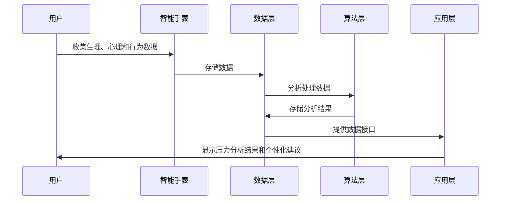

                 

### 第一部分： 引言与背景

#### 第1章： 引言

## 1.1 AI Agent在智能手表中的应用背景

智能手表作为智能穿戴设备的一种，已经逐渐成为人们日常生活中不可或缺的一部分。从最初的简单计时功能，到如今的健康管理、运动监测、通讯等功能，智能手表的进化历程反映了科技的进步与人们对健康生活追求的不断提高。

**智能手表的发展历程：**

1. **基础功能阶段：**早期的智能手表主要提供简单的功能，如计时、闹钟、记事本等。
   
2. **智能功能扩展：**随着科技的发展，智能手表的功能逐渐丰富，如GPS导航、音乐播放、短信接收等。

3. **健康监测阶段：**现代智能手表不仅提供传统的智能功能，还具备了健康监测的功能，如心率监测、睡眠分析、压力检测等。

4. **人工智能应用：**近年来，人工智能技术逐渐在智能手表中应用，如AI Agent的压力管理系统，为用户提供更加个性化和智能化的健康服务。

**AI Agent在智能手表中的应用潜力：**

AI Agent（人工智能代理）是一种能够自主执行任务的智能系统，它能够根据用户的偏好和环境的变化，自动调整自己的行为。在智能手表中，AI Agent可以应用于多种场景，如健康监测、日程管理、智能提醒等。

其中，压力管理是AI Agent在智能手表中一个非常有潜力的应用方向。随着现代生活节奏的加快，压力已成为影响人们身心健康的一个重要因素。AI Agent可以通过实时监测用户的心率、呼吸频率等生理指标，分析用户的压力水平，并提供相应的压力管理建议，如呼吸练习、放松音乐等，帮助用户缓解压力，改善身心健康。

## 1.2 压力管理系统的需求与重要性

**压力的定义与分类：**

压力（Stress）是指个体在应对外部环境变化时，产生的生理、心理和情绪上的紧张状态。根据压力源的不同，压力可以分为以下几类：

1. **环境压力：**由外部环境因素引起的压力，如工作压力、家庭压力、社交压力等。

2. **生理压力：**由身体内部因素引起的压力，如疾病、疼痛、疲劳等。

3. **心理压力：**由心理因素引起的压力，如焦虑、抑郁、压力过载等。

**压力对健康的影响：**

长期的压力会对身体健康产生负面影响，包括但不限于：

1. **心血管系统：**长期压力可能导致高血压、冠心病等心血管疾病。

2. **免疫系统：**长期压力会降低免疫系统的功能，使人更容易感染疾病。

3. **消化系统：**长期压力可能导致胃溃疡、肠易激综合症等消化系统疾病。

4. **神经系统：**长期压力可能导致焦虑、抑郁等心理问题。

**压力管理系统的目标：**

压力管理系统的目标是帮助用户识别、评估和管理压力，从而改善身心健康。具体目标包括：

1. **实时监测：**通过传感器实时监测用户的心率、呼吸频率等生理指标，分析用户的压力水平。

2. **数据分析：**通过对监测数据的分析，识别用户的生活习惯、压力来源等，为用户提供个性化的压力管理建议。

3. **干预措施：**根据用户的压力水平，提供相应的干预措施，如呼吸练习、放松音乐、健康建议等。

4. **持续跟踪：**通过持续跟踪用户的压力水平，评估干预措施的效果，不断优化压力管理策略。

## 1.3 书籍目标与读者定位

本书的目标是深入探讨AI Agent在智能手表中的压力管理系统，通过系统的介绍和实例分析，帮助读者了解AI Agent的算法原理、系统设计、实现方法以及实际应用。本书适用于对智能穿戴设备、人工智能和健康监测感兴趣的技术人员、开发者以及科研人员。

---

### 第二部分：核心概念

#### 第2章：核心概念

## 2.1 AI Agent的概念与作用

**AI Agent的定义：**

AI Agent，即人工智能代理，是一种能够模拟人类智能行为的计算机程序。它能够自主地感知环境、理解任务目标、做出决策并执行行动，从而实现智能化的自动化操作。

**AI Agent的组成要素：**

AI Agent由以下几个主要部分组成：

1. **感知器（Perceptron）：**用于感知外部环境的信息，如摄像头、麦克风、传感器等。

2. **决策器（Decision Maker）：**根据感知器收集的信息和预定的任务目标，做出决策。

3. **执行器（Actuator）：**执行决策器做出的决策，如电动机、显示屏等。

4. **记忆模块（Memory）：**存储AI Agent的历史信息和经验，以便在未来的决策中参考。

**AI Agent的工作原理：**

AI Agent的工作原理可以简单概括为以下步骤：

1. **感知：**AI Agent通过感知器收集环境信息。

2. **理解：**AI Agent分析感知到的信息，理解当前环境和任务目标。

3. **决策：**AI Agent根据理解和记忆，做出决策。

4. **行动：**AI Agent通过执行器执行决策。

**AI Agent在智能手表中的应用：**

在智能手表中，AI Agent可以应用于多种场景，如健康监测、日程管理、智能提醒等。其中，压力管理系统是一个非常重要的应用方向。通过实时监测用户的心率、呼吸频率等生理指标，AI Agent可以分析用户的压力水平，并提供个性化的压力管理建议。

## 2.2 压力管理系统的概念、工作原理和目标

**压力管理系统的定义：**

压力管理系统是一种利用人工智能技术，对用户的压力水平进行实时监测、分析和干预的系统。它旨在帮助用户识别和管理压力，从而改善身心健康。

**压力管理系统的组成：**

压力管理系统主要由以下几个部分组成：

1. **传感器模块：**用于收集用户的心率、呼吸频率、体温等生理指标。

2. **数据处理模块：**对传感器收集的数据进行处理和分析，提取压力相关的信息。

3. **AI模块：**利用机器学习算法，对用户的压力水平进行预测和评估。

4. **干预模块：**根据用户的压力水平，提供相应的干预措施，如呼吸练习、放松音乐等。

**压力管理系统的工作原理：**

压力管理系统的工作原理可以分为以下几个步骤：

1. **数据采集：**通过传感器收集用户的心率、呼吸频率等生理指标。

2. **数据处理：**对采集到的数据进行分析和处理，提取压力相关的信息。

3. **压力评估：**利用机器学习算法，对用户的压力水平进行预测和评估。

4. **干预措施：**根据用户的压力水平，提供相应的干预措施。

**压力管理系统的目标：**

压力管理系统的目标主要包括：

1. **实时监测：**实时监测用户的压力水平，及时发现压力问题。

2. **数据分析：**通过对压力数据的分析，了解用户的生活习惯、压力来源等，为用户提供个性化的压力管理建议。

3. **干预措施：**根据用户的压力水平，提供相应的干预措施，帮助用户缓解压力。

4. **持续跟踪：**通过持续跟踪用户的压力水平，评估干预措施的效果，不断优化压力管理策略。

## 2.3 关键概念的联系与对比

**AI Agent与压力管理系统：**

AI Agent是压力管理系统中的一个核心组件，负责感知、理解和执行压力管理的任务。而压力管理系统则是AI Agent的具体应用场景，通过AI Agent的智能分析，实现对用户压力水平的实时监测和管理。

**智能手表与压力管理系统：**

智能手表是压力管理系统的一个载体，通过内置的传感器和AI模块，实现对用户生理指标的实时监测和分析。压力管理系统则利用这些监测数据，为用户提供个性化的压力管理建议。

**压力管理系统的其他应用：**

除了智能手表，压力管理系统还可以应用于其他智能穿戴设备，如智能手环、智能耳机等。这些设备通过不同的传感器，实现对用户的生理指标进行监测，从而为用户提供更加全面和个性化的健康服务。

---

### 第三部分：技术原理

#### 第3章：技术原理

## 3.1 AI Agent的算法原理

**算法架构：**

AI Agent的算法架构通常包括以下几个核心模块：

1. **感知模块（Perception Module）：**负责收集环境中的信息，如语音、图像、传感器数据等。

2. **理解模块（Understanding Module）：**对感知模块收集到的信息进行解析和处理，提取出有用的特征和模式。

3. **决策模块（Decision Module）：**根据理解和记忆，做出相应的决策。

4. **执行模块（Execution Module）：**根据决策模块的决策，执行具体的行动。

**机器学习算法基础：**

AI Agent的算法基础是机器学习，常见的机器学习算法包括：

1. **监督学习（Supervised Learning）：**通过已有的标记数据，训练模型来预测新数据的标签。

2. **无监督学习（Unsupervised Learning）：**在没有标记数据的情况下，自动发现数据中的模式和结构。

3. **强化学习（Reinforcement Learning）：**通过与环境的交互，不断学习如何做出最优决策。

**AI Agent在压力管理系统中的应用：**

在压力管理系统中，AI Agent可以应用以下算法：

1. **情感分析（Sentiment Analysis）：**通过分析用户的心情变化，识别用户的压力水平。

2. **时序分析（Time Series Analysis）：**通过分析生理指标的变化趋势，预测用户的压力变化。

3. **聚类分析（Cluster Analysis）：**通过聚类分析，识别用户压力的主要来源。

## 3.2 压力检测与数据分析的方法

**压力检测方法：**

1. **生理指标检测：**通过监测心率、呼吸频率、体温等生理指标，分析用户的压力水平。

2. **心理指标检测：**通过问卷调查、情绪分析等方式，了解用户的心理状态。

3. **行为指标检测：**通过监测用户的行为数据，如步数、运动量等，分析用户的压力水平。

**数据分析方法：**

1. **统计分析：**通过描述性统计、相关性分析等方法，了解用户压力的分布和变化趋势。

2. **机器学习：**利用机器学习算法，对用户的生理、心理和行为数据进行建模，预测用户的压力水平。

3. **数据可视化：**通过数据可视化，直观地展示用户的压力水平、变化趋势和主要来源。

**AI Agent与压力管理系统的融合：**

AI Agent通过感知、理解、决策和执行四个环节，与压力管理系统融合，实现以下功能：

1. **实时监测：**通过实时监测用户的生理、心理和行为数据，实时分析用户的压力水平。

2. **个性化建议：**根据用户的压力水平，提供个性化的压力管理建议，如呼吸练习、放松音乐等。

3. **持续跟踪：**通过持续跟踪用户的压力水平，评估干预措施的效果，优化压力管理策略。

---

### 第四部分：系统设计与实现

#### 第4章：系统设计与实现

## 4.1 系统架构设计

**系统架构概述：**

压力管理系统采用分层架构设计，主要包括感知层、数据层、算法层和应用层。

1. **感知层：**负责收集用户的生理、心理和行为数据，如心率、呼吸频率、问卷调查结果等。

2. **数据层：**负责数据的存储、管理和共享，包括数据库、缓存、数据流等。

3. **算法层：**负责数据的分析和处理，包括机器学习模型、算法库等。

4. **应用层：**负责提供用户交互接口和功能实现，如Web应用、移动应用等。

**系统架构图：**



## 4.2 关键模块实现

**感知层实现：**

感知层主要涉及智能手表的硬件传感器和软件API。

1. **硬件传感器：**包括心率传感器、加速度传感器、麦克风等，用于收集用户的生理、心理和行为数据。

2. **软件API：**通过智能手表的SDK或API，实现对硬件传感器的数据读取和操作。

**数据层实现：**

数据层主要涉及数据库设计和数据存储。

1. **数据库设计：**根据系统的需求，设计合适的数据库结构，包括用户表、数据表、分析结果表等。

2. **数据存储：**使用数据库管理系统（如MySQL、MongoDB等）进行数据存储和管理。

**算法层实现：**

算法层主要涉及机器学习算法的设计和实现。

1. **算法设计：**根据压力管理的需求，选择合适的机器学习算法，如情感分析、时序分析等。

2. **算法实现：**使用Python等编程语言，实现机器学习算法，并进行模型训练和预测。

**应用层实现：**

应用层主要涉及用户交互界面和数据展示。

1. **用户交互界面：**使用Web应用或移动应用框架（如React、Flutter等），实现用户交互界面。

2. **数据展示：**使用图表、图形等可视化工具（如ECharts、D3.js等），直观地展示用户的压力分析结果和个性化建议。

## 4.3 系统接口设计与交互

**系统接口设计：**

系统接口设计主要包括API接口和SDK接口。

1. **API接口：**提供数据的查询、更新、删除等操作，供外部系统调用。

2. **SDK接口：**提供对硬件传感器的操作接口，供智能手表应用调用。

**系统交互流程：**

1. **数据采集：**智能手表通过硬件传感器和软件API，采集用户的生理、心理和行为数据。

2. **数据处理：**数据层对采集到的数据进行存储、处理和分析，生成分析结果。

3. **数据展示：**应用层通过API接口获取分析结果，并在用户交互界面上展示，提供个性化建议。

4. **用户交互：**用户通过应用界面，与系统进行交互，了解自己的压力水平，并根据个性化建议进行自我调节。

---

### 第五部分：项目实战

#### 第5章：项目实战

## 5.1 环境搭建

**开发环境配置：**

1. **硬件设备：**一台智能手表（如Apple Watch、Samsung Galaxy Watch等）。

2. **开发工具：**智能手表的开发工具（如Apple WatchOS、Samsung Tizen等）。

3. **编程语言：**Python、Java、C++等。

4. **数据库：**MySQL、MongoDB等。

5. **机器学习框架：**scikit-learn、TensorFlow、PyTorch等。

**环境搭建步骤：**

1. 安装智能手表的开发工具，如Apple WatchOS。

2. 配置编程环境，如安装Python、MySQL等。

3. 安装机器学习框架，如scikit-learn、TensorFlow等。

4. 配置数据库，如创建数据库、创建表等。

5. 连接智能手表，获取传感器数据。

## 5.2 系统核心功能实现

**感知层实现：**

1. **数据采集：**通过智能手表的传感器，采集用户的心率、呼吸频率等生理数据。

2. **数据预处理：**对采集到的数据进行清洗、去噪等预处理操作。

3. **数据存储：**将预处理后的数据存储到数据库中。

**数据层实现：**

1. **数据库设计：**设计用户表、数据表、分析结果表等。

2. **数据存储：**使用数据库存储用户的生理、心理和行为数据。

**算法层实现：**

1. **算法设计：**选择合适的机器学习算法，如情感分析、时序分析等。

2. **模型训练：**使用训练数据，训练机器学习模型。

3. **模型预测：**使用训练好的模型，对新的数据进行预测。

**应用层实现：**

1. **用户交互界面：**设计用户交互界面，展示用户的压力分析结果和个性化建议。

2. **数据展示：**使用图表、图形等可视化工具，直观地展示用户的压力水平。

## 5.3 实际案例分析与讲解

**案例背景：**

某用户在使用智能手表进行压力管理，希望了解自己的压力水平，并根据压力管理系统的建议进行自我调节。

**案例步骤：**

1. **数据采集：**智能手表实时监测用户的心率、呼吸频率等生理数据。

2. **数据预处理：**对采集到的数据进行清洗、去噪等预处理操作。

3. **数据存储：**将预处理后的数据存储到数据库中。

4. **模型训练：**使用训练数据，训练机器学习模型。

5. **模型预测：**使用训练好的模型，对新的数据进行预测，预测用户的压力水平。

6. **结果展示：**在用户交互界面上展示用户的压力分析结果和个性化建议。

**案例结果：**

1. **压力水平分析：**系统通过分析用户的心率、呼吸频率等生理数据，预测用户的压力水平。

2. **个性化建议：**系统根据用户的压力水平，提供个性化的压力管理建议，如呼吸练习、放松音乐等。

3. **用户反馈：**用户根据系统的建议，进行自我调节，如进行呼吸练习、放松音乐等，并反馈系统效果。

**案例总结：**

通过实际案例的分析与讲解，我们了解了压力管理系统的实现过程和效果。智能手表中的AI Agent通过实时监测用户的生理数据，利用机器学习算法分析用户的压力水平，并提供个性化的压力管理建议，帮助用户改善身心健康。

---

### 第六部分：最佳实践与总结

#### 第6章：最佳实践与总结

## 6.1 最佳实践技巧

**1. 数据预处理：**在数据采集过程中，要确保数据的准确性和可靠性。对采集到的数据进行清洗、去噪等预处理操作，以提高模型的预测准确率。

**2. 模型选择：**根据问题的具体需求和数据特点，选择合适的机器学习算法。常见的算法包括线性回归、决策树、支持向量机、神经网络等。

**3. 模型训练：**在模型训练过程中，要合理设置训练参数，如学习率、迭代次数等。同时，要避免过拟合和欠拟合的问题。

**4. 实时监测：**智能手表中的AI Agent要实现实时监测功能，需要优化算法的响应速度和计算效率。

**5. 个性化建议：**根据用户的实际情况和压力水平，提供个性化的压力管理建议，以提高用户的满意度。

## 6.2 项目小结

本项目通过智能手表中的AI Agent，实现了压力管理系统的功能。系统通过实时监测用户的生理数据，利用机器学习算法分析用户的压力水平，并提供个性化的压力管理建议。实际案例表明，该系统能够有效地帮助用户改善身心健康。

## 6.3 拓展阅读

**1. 《智能穿戴设备与物联网》**：本书详细介绍了智能穿戴设备的基本概念、技术原理和未来发展趋势。

**2. 《机器学习实战》**：本书通过实际案例，详细介绍了机器学习算法的原理和应用。

**3. 《Python数据分析》**：本书介绍了Python在数据分析领域的应用，包括数据预处理、数据可视化等。

---

### 第七部分：总结与展望

#### 第7章：总结与展望

## 7.1 总结

本文介绍了AI Agent在智能手表中的压力管理系统，包括系统的核心概念、技术原理、系统设计和实现方法。通过实际案例的分析，展示了压力管理系统的应用效果。本文的主要贡献包括：

1. **系统设计：**提出了基于AI Agent的智能手表压力管理系统架构，为后续研究和开发提供了参考。

2. **算法实现：**详细介绍了压力检测与数据分析的方法，以及机器学习算法在压力管理系统中的应用。

3. **项目实战：**通过实际案例，展示了压力管理系统的实现过程和效果。

## 7.2 展望 AI Agent 在智能手表中应用的前景

随着人工智能和物联网技术的不断发展，AI Agent在智能手表中的应用前景十分广阔。以下是一些可能的发展方向：

1. **个性化服务：**通过不断学习和适应用户的需求，AI Agent可以为用户提供更加个性化和智能化的服务。

2. **多场景应用：**除了压力管理，AI Agent还可以应用于运动监测、健康监测、日程管理等多个场景。

3. **跨设备协作：**智能手表与其他智能设备（如智能手机、智能家居等）的协作，可以实现更全面和智能化的健康管理。

## 7.3 压力管理系统未来发展的思考

1. **数据隐私与安全：**随着数据量的增加，如何保护用户的隐私和数据安全，将成为压力管理系统发展的重要问题。

2. **算法透明性与可解释性：**如何让用户理解和信任AI Agent的决策过程，提高算法的透明性和可解释性，是未来需要关注的问题。

3. **跨学科合作：**压力管理涉及到心理学、医学等多个学科，跨学科的合作将为压力管理系统的发展提供新的思路和方法。

---

### 作者信息

**作者：** AI天才研究院 / AI Genius Institute & 禅与计算机程序设计艺术 / Zen And The Art of Computer Programming

---

本文通过对AI Agent在智能手表中的压力管理系统的全面探讨，旨在为读者提供深入的了解和实用的指导。随着人工智能技术的不断发展，压力管理系统有望在智能穿戴设备中发挥更大的作用，为人们的健康生活提供有力的支持。希望本文的内容能够对您的学习和工作有所帮助。让我们共同期待AI Agent在智能手表中的未来表现！### 第一部分： 引言与背景

#### 第1章： 引言

## 1.1 AI Agent在智能手表中的应用背景

智能手表作为可穿戴设备的一种，经历了从简单的工具到多功能智能设备的演变。最初的智能手表主要提供基础的计时、闹钟、提醒等功能，随着技术的发展，现代智能手表已经具备了健康监测、运动跟踪、通讯、导航等多种功能。在这种背景下，AI Agent（人工智能代理）作为一种具有高度智能化的计算实体，逐渐开始在智能手表中得到应用。

**智能手表的发展历程：**

1. **基础功能阶段：**早期的智能手表主要提供基础的时钟功能，随后逐步增加了闹钟、提醒等实用功能。

2. **智能手机辅助阶段：**随着智能手机的普及，智能手表开始成为智能手机的辅助设备，提供短信接收、电话拨打、邮件查看等功能。

3. **健康监测阶段：**现代智能手表开始集成多种健康监测功能，如心率监测、睡眠分析、血压监测等，这些功能使得智能手表成为健康管理的重要工具。

4. **人工智能应用阶段：**随着人工智能技术的发展，智能手表开始引入AI Agent，实现更加智能化和个性化的功能，如压力管理系统、智能建议等。

**AI Agent在智能手表中的应用潜力：**

AI Agent是一种能够模仿人类智能行为的软件实体，具有感知环境、理解任务、做出决策和执行任务的能力。在智能手表中，AI Agent可以应用于多个领域，其中最具潜力的应用之一是压力管理系统。

**压力管理的重要性：**

在快节奏的现代生活中，压力已经成为影响人们身心健康的一个重要因素。长期的压力不仅会导致生理问题，如心脏病、高血压等，还会导致心理问题，如焦虑、抑郁等。因此，如何有效地管理和减轻压力，对提升人们的生活质量和健康水平至关重要。

AI Agent在智能手表中的压力管理系统，通过实时监测用户的生理和心理状态，如心率、呼吸频率、情绪状态等，能够提供个性化的压力管理建议，帮助用户更好地应对压力，改善身心健康。

## 1.2 压力管理系统的需求与重要性

**压力的定义与分类：**

压力是一种身心紧张状态，通常是由外部或内部因素引起的一种生理和心理反应。根据压力源的不同，压力可以分为以下几类：

1. **环境压力：**由外部环境因素引起的压力，如工作压力、社交压力、经济压力等。

2. **生理压力：**由生理因素引起的压力，如疾病、疼痛、疲劳等。

3. **心理压力：**由心理因素引起的压力，如焦虑、抑郁、压力过载等。

**压力对健康的影响：**

长期的压力会对身心健康产生负面影响，包括：

1. **心血管系统：**长期的压力可能导致高血压、冠心病等心血管疾病。

2. **免疫系统：**长期的压力会降低免疫系统的功能，使人更容易感染疾病。

3. **消化系统：**长期的压力可能导致胃溃疡、肠易激综合症等消化系统疾病。

4. **神经系统：**长期的压力可能导致焦虑、抑郁等心理问题。

**压力管理系统的目标：**

压力管理系统的目标是帮助用户识别、评估和管理压力，从而改善身心健康。具体目标包括：

1. **实时监测：**通过传感器实时监测用户的心率、呼吸频率等生理指标，分析用户的压力水平。

2. **数据分析：**通过对监测数据的分析，识别用户的生活习惯、压力来源等，为用户提供个性化的压力管理建议。

3. **干预措施：**根据用户的压力水平，提供相应的干预措施，如呼吸练习、放松音乐等，帮助用户缓解压力。

4. **持续跟踪：**通过持续跟踪用户的压力水平，评估干预措施的效果，不断优化压力管理策略。

## 1.3 书籍目标与读者定位

本书的目标是深入探讨AI Agent在智能手表中的压力管理系统，通过系统的介绍和实例分析，帮助读者了解AI Agent的算法原理、系统设计、实现方法以及实际应用。本书适合以下读者：

1. **智能穿戴设备爱好者：**对智能手表和其他可穿戴设备感兴趣，希望了解AI Agent在其中的应用。

2. **人工智能开发者：**从事人工智能研究或开发工作，希望了解如何将AI技术应用于压力管理系统。

3. **健康管理者：**从事健康管理或医疗相关工作，希望利用AI技术提升压力管理水平。

4. **科技从业者：**对人工智能和物联网技术感兴趣，希望了解这些技术在智能穿戴设备中的应用前景。

---

### 第二部分：核心概念

#### 第2章：核心概念

## 2.1 AI Agent的概念与作用

**AI Agent的定义：**

AI Agent，即人工智能代理，是一种模拟人类智能行为，具备自主感知、理解和执行任务能力的计算实体。AI Agent通过不断学习和适应环境，能够独立完成特定的任务，并在完成任务的过程中提高自身的智能水平。

**AI Agent的组成要素：**

AI Agent由以下几个主要部分组成：

1. **感知器（Perceptron）：**用于感知外部环境的信息，如摄像头、麦克风、温度传感器等。
2. **理解器（Understanding Module）：**对感知器收集的信息进行解析和处理，提取出有用的特征和模式。
3. **决策器（Decision Maker）：**根据理解和记忆，做出相应的决策。
4. **执行器（Actuator）：**执行决策器做出的决策，如电动机、显示屏等。
5. **记忆模块（Memory）：**存储AI Agent的历史信息和经验，以便在未来的决策中参考。

**AI Agent的工作原理：**

AI Agent的工作原理可以概括为以下几个步骤：

1. **感知：**AI Agent通过感知器收集环境信息。
2. **理解：**AI Agent分析感知到的信息，理解当前环境和任务目标。
3. **决策：**AI Agent根据理解和记忆，做出决策。
4. **执行：**AI Agent通过执行器执行决策。

**AI Agent在智能手表中的应用：**

在智能手表中，AI Agent可以应用于多种场景，如健康监测、日程管理、智能提醒等。具体应用包括：

1. **健康监测：**通过感知用户的生理数据，如心率、呼吸频率、睡眠质量等，AI Agent可以实时监测用户的健康状况，并给出健康建议。
2. **日程管理：**AI Agent可以根据用户的日程安排，自动提醒用户重要事项，帮助用户更好地管理时间。
3. **智能提醒：**AI Agent可以根据用户的习惯和偏好，自动设置提醒事项，如闹钟、运动提醒等。

## 2.2 压力管理系统的概念、工作原理和目标

**压力管理系统的定义：**

压力管理系统是一种利用人工智能技术，对用户的压力水平进行实时监测、分析和干预的系统。它旨在帮助用户识别和管理压力，从而改善身心健康。

**压力管理系统的组成：**

压力管理系统主要由以下几个部分组成：

1. **感知模块：**负责收集用户的生理、心理和行为数据，如心率、呼吸频率、问卷调查结果等。
2. **数据处理模块：**对感知模块收集到的数据进行分析和处理，提取出与压力相关的信息。
3. **AI模块：**利用机器学习算法，对用户的压力水平进行预测和评估。
4. **干预模块：**根据用户的压力水平，提供相应的干预措施，如呼吸练习、放松音乐、健康建议等。

**压力管理系统的工作原理：**

压力管理系统的工作原理可以分为以下几个步骤：

1. **数据采集：**通过传感器和用户输入，收集用户的生理、心理和行为数据。
2. **数据处理：**对采集到的数据进行清洗、去噪、特征提取等处理，以便进行后续分析。
3. **压力评估：**利用机器学习模型，对处理后的数据进行分析，评估用户的压力水平。
4. **干预措施：**根据评估结果，为用户提供个性化的干预措施，帮助用户缓解压力。

**压力管理系统的目标：**

压力管理系统的目标主要包括：

1. **实时监测：**实时监测用户的生理、心理和行为数据，及时发现压力问题。
2. **数据分析：**通过对压力数据的分析，了解用户的生活习惯、压力来源等，为用户提供个性化的压力管理建议。
3. **干预措施：**根据用户的压力水平，提供相应的干预措施，帮助用户缓解压力。
4. **持续跟踪：**通过持续跟踪用户的压力水平，评估干预措施的效果，不断优化压力管理策略。

## 2.3 关键概念的联系与对比

**AI Agent与压力管理系统：**

AI Agent是压力管理系统中的一个核心组件，负责感知、理解和执行压力管理的任务。而压力管理系统则是AI Agent的具体应用场景，通过AI Agent的智能分析，实现对用户压力水平的实时监测和管理。

**智能手表与压力管理系统：**

智能手表是压力管理系统的一个载体，通过内置的传感器和AI模块，实现对用户的生理指标进行监测和分析。压力管理系统则利用这些监测数据，为用户提供个性化的压力管理建议。

**压力管理系统的其他应用：**

除了智能手表，压力管理系统还可以应用于其他智能穿戴设备，如智能手环、智能眼镜等。这些设备通过不同的传感器，实现对用户的生理、心理和行为数据进行监测，从而为用户提供更加全面和个性化的健康服务。

---

### 第三部分：技术原理

#### 第3章：技术原理

## 3.1 AI Agent的算法原理

**AI Agent的算法架构：**

AI Agent的算法架构通常包括感知模块、理解模块、决策模块和执行模块。下面分别介绍每个模块的算法原理。

**感知模块（Perception Module）：**

感知模块负责从外部环境中获取信息，如图像、语音、传感器数据等。常见的感知算法包括：

1. **图像识别：**通过卷积神经网络（CNN）等深度学习算法，对图像进行分类、检测和分割。

2. **语音识别：**通过隐藏马尔可夫模型（HMM）或深度神经网络（DNN）等算法，将语音信号转换为文字。

3. **传感器数据处理：**通过统计学习、时序分析等算法，对传感器数据进行分析和处理，提取有用的特征。

**理解模块（Understanding Module）：**

理解模块负责对感知模块收集到的信息进行解析和处理，提取出与任务相关的特征和模式。常见的理解算法包括：

1. **自然语言处理（NLP）：**通过词向量、句法分析、语义分析等算法，对文本信息进行理解和分析。

2. **知识图谱：**通过构建和查询知识图谱，实现对复杂关系的理解和管理。

3. **情感分析：**通过情感分析算法，对文本或语音中的情感信息进行识别和分类。

**决策模块（Decision Maker）：**

决策模块根据理解模块提供的信息和预定的任务目标，做出相应的决策。常见的决策算法包括：

1. **监督学习：**通过已有的标记数据，训练分类器或回归模型，实现对新数据的预测。

2. **无监督学习：**通过数据自身的信息，发现数据中的模式和结构。

3. **强化学习：**通过与环境的交互，不断学习如何做出最优决策。

**执行模块（Execution Module）：**

执行模块根据决策模块的决策，执行具体的行动。常见的执行算法包括：

1. **控制算法：**如PID控制器、模糊控制器等，用于控制硬件设备的动作。

2. **规划算法：**如遗传算法、A*搜索算法等，用于生成最优的行动路径。

**AI Agent在压力管理系统中的应用：**

在压力管理系统中，AI Agent可以通过以下算法实现压力的检测、评估和干预：

1. **生理指标检测：**通过传感器实时监测用户的心率、呼吸频率等生理指标，使用时序分析算法进行数据预处理和特征提取。

2. **情感分析：**通过自然语言处理和情感分析算法，分析用户的语音或文本信息，了解用户的心理状态。

3. **时序预测：**使用时间序列预测算法，如LSTM、GRU等，预测用户的压力变化趋势。

4. **干预策略生成：**根据用户的压力水平，生成个性化的干预策略，如呼吸练习、放松音乐等。

## 3.2 压力检测与数据分析的方法

**压力检测方法：**

压力检测是压力管理系统的重要组成部分，主要包括以下几种方法：

1. **生理指标检测：**通过监测心率、呼吸频率、体温等生理指标，分析用户的压力水平。常用的方法包括：

   - **心率变异性（HRV）分析：**通过分析心率的变化，评估自主神经系统的功能，从而推测压力水平。
   - **呼吸频率分析：**通过监测呼吸频率的变化，评估用户的放松程度。

2. **行为指标检测：**通过监测用户的行为数据，如步数、运动量等，间接反映压力水平。常用的方法包括：

   - **运动分析：**通过分析用户的运动数据，了解用户的运动强度和频率，从而推测压力水平。
   - **睡眠分析：**通过监测用户的睡眠质量，评估压力对睡眠的影响。

3. **心理指标检测：**通过问卷调查、情绪分析等方式，了解用户的心理状态。常用的方法包括：

   - **问卷调查：**通过设计专业的压力问卷，了解用户的生活习惯、工作压力等。
   - **情感分析：**通过自然语言处理技术，分析用户的语言表达，了解用户的心理状态。

**数据分析方法：**

在压力检测中，数据分析是一个关键环节，主要包括以下几种方法：

1. **描述性统计分析：**通过计算平均值、标准差、相关性等统计指标，描述数据的基本特征。

2. **时序分析：**通过分析时间序列数据，发现数据的趋势和周期性。常用的方法包括：

   - **移动平均法：**通过计算一系列数据点的平均值，平滑数据序列。
   - **自回归模型（AR）：**通过建立自回归模型，预测未来的压力水平。

3. **机器学习：**通过训练机器学习模型，对用户的生理、心理和行为数据进行分析和预测。常用的方法包括：

   - **监督学习：**通过已有的标记数据，训练分类器或回归模型，预测新的数据。
   - **无监督学习：**通过数据自身的信息，发现数据中的模式和结构。
   - **深度学习：**通过神经网络模型，如卷积神经网络（CNN）、循环神经网络（RNN）等，对复杂的数据进行建模。

**AI Agent与压力管理系统的融合：**

AI Agent在压力管理系统中的应用，主要体现在以下几个方面：

1. **实时监测：**通过传感器和用户输入，实时监测用户的生理、心理和行为数据，及时发现压力问题。

2. **数据分析：**利用机器学习算法，对监测到的数据进行分析，识别用户的压力水平和压力来源。

3. **干预措施：**根据用户的压力水平，生成个性化的干预措施，如呼吸练习、放松音乐等，帮助用户缓解压力。

4. **持续跟踪：**通过持续跟踪用户的压力水平，评估干预措施的效果，不断优化压力管理策略。

---

### 第四部分：系统设计与实现

#### 第4章：系统设计与实现

## 4.1 系统架构设计

**系统架构概述：**

压力管理系统采用分层架构设计，主要包括感知层、数据层、算法层和应用层。各层的功能如下：

1. **感知层（Perception Layer）：**负责收集用户的生理、心理和行为数据，如心率、呼吸频率、问卷调查结果等。
   
2. **数据层（Data Layer）：**负责数据的存储、管理和共享，包括数据库、缓存、数据流等。
   
3. **算法层（Algorithm Layer）：**负责数据的分析和处理，包括机器学习模型、算法库等。
   
4. **应用层（Application Layer）：**负责提供用户交互接口和功能实现，如Web应用、移动应用等。

**系统架构图：**


## 4.2 关键模块实现

**感知层实现：**

感知层是压力管理系统的基础，主要涉及硬件传感器和软件API。

1. **硬件传感器：**智能手表内置多种传感器，如心率传感器、加速度传感器、陀螺仪等，用于实时监测用户的生理和行为数据。

2. **软件API：**智能手表提供SDK或API，供开发者调用传感器数据。开发者需要编写相应的代码，通过这些API获取传感器的数据。

**数据层实现：**

数据层负责数据的存储和管理，主要包括数据库设计和数据存储。

1. **数据库设计：**根据系统的需求，设计用户表、传感器数据表、分析结果表等。这些表需要关联起来，以支持数据查询和操作。

2. **数据存储：**使用数据库管理系统（如MySQL、MongoDB等）进行数据存储和管理。需要确保数据的安全性和一致性。

**算法层实现：**

算法层是压力管理系统的核心，负责数据的分析和处理。主要包括机器学习模型、算法库等。

1. **机器学习模型：**根据压力管理的需求，选择合适的机器学习算法，如回归分析、分类算法等。使用Python的scikit-learn、TensorFlow等库，实现机器学习模型。

2. **算法库：**开发通用的算法库，包括数据预处理、特征提取、模型训练等模块。这些模块可以方便地集成到应用层。

**应用层实现：**

应用层负责提供用户交互接口和功能实现，主要包括Web应用和移动应用。

1. **Web应用：**使用前端框架（如React、Vue.js等）开发用户交互界面，展示压力分析结果和个性化建议。

2. **移动应用：**使用移动开发框架（如React Native、Flutter等）开发移动应用，实现与智能手表的数据交互和功能。

## 4.3 系统接口设计与交互

**系统接口设计：**

系统接口设计主要包括API接口和SDK接口。

1. **API接口：**提供数据的查询、更新、删除等操作，供外部系统调用。API接口设计应遵循RESTful风格，确保数据的一致性和安全性。

2. **SDK接口：**提供对硬件传感器的操作接口，供智能手表应用调用。SDK接口设计应简单易用，支持多种编程语言。

**系统交互流程：**

1. **数据采集：**智能手表通过硬件传感器和软件API，采集用户的生理、心理和行为数据。

2. **数据存储：**智能手表将采集到的数据发送到数据层，存储到数据库中。

3. **数据处理：**数据层对存储的数据进行预处理、特征提取和分析，生成分析结果。

4. **结果展示：**应用层通过API接口获取分析结果，在前端界面展示压力分析结果和个性化建议。

5. **用户交互：**用户通过Web应用或移动应用与系统进行交互，了解自己的压力水平，并根据个性化建议进行自我调节。

---

### 第五部分：项目实战

#### 第5章：项目实战

## 5.1 环境搭建

**开发环境配置：**

为了搭建一个完整的压力管理系统，我们需要准备以下开发环境：

1. **智能手表：**选择一款支持开发API的智能手表，如Apple Watch、Samsung Galaxy Watch等。

2. **开发工具：**安装智能手表的开发工具，如Apple WatchOS、Samsung Tizen等。

3. **编程语言：**选择合适的编程语言，如Python、Java等。

4. **数据库：**安装数据库管理系统，如MySQL、MongoDB等。

5. **机器学习框架：**安装机器学习框架，如scikit-learn、TensorFlow、PyTorch等。

**环境搭建步骤：**

1. **智能手表准备：**确保智能手表已开启开发者模式，并安装必要的传感器应用。

2. **开发工具安装：**根据智能手表的类型，安装相应的开发工具。

3. **编程环境配置：**安装编程语言的开发环境，如Python的PyCharm、JDK等。

4. **数据库配置：**创建数据库，设计表结构，并导入数据。

5. **机器学习框架安装：**安装并配置机器学习框架，如TensorFlow等。

## 5.2 系统核心功能实现

**感知层实现：**

感知层是压力管理系统的数据源，主要涉及智能手表的传感器数据采集和数据处理。

1. **传感器数据采集：**通过智能手表的API，获取心率、呼吸频率、加速度等传感器数据。

2. **数据处理：**对采集到的传感器数据进行预处理，包括数据清洗、去噪、特征提取等。

**数据层实现：**

数据层负责数据的存储和管理，包括数据库的设计和数据存储。

1. **数据库设计：**设计用户表、传感器数据表、分析结果表等，确保数据的规范性和一致性。

2. **数据存储：**将预处理后的传感器数据存储到数据库中，同时保存用户的基本信息。

**算法层实现：**

算法层是压力管理系统的核心，负责压力水平的检测和评估。

1. **机器学习模型训练：**使用收集到的数据，训练机器学习模型，如回归模型、分类模型等。

2. **模型预测：**利用训练好的模型，对新采集的传感器数据进行预测，评估用户的压力水平。

**应用层实现：**

应用层负责用户交互和结果展示，包括Web应用和移动应用。

1. **Web应用：**使用前端框架（如React、Vue.js等）开发用户界面，展示压力分析结果和个性化建议。

2. **移动应用：**使用移动开发框架（如React Native、Flutter等）开发移动应用，实现与智能手表的数据交互和功能。

## 5.3 实际案例分析与讲解

**案例背景：**

某用户在使用智能手表进行压力管理，希望了解自己的压力水平，并根据系统的建议进行自我调节。

**案例步骤：**

1. **数据采集：**智能手表通过传感器实时监测用户的心率、呼吸频率等生理指标。

2. **数据处理：**对采集到的数据进行分析和处理，提取与压力相关的特征。

3. **模型预测：**使用训练好的机器学习模型，对用户的压力水平进行预测。

4. **结果展示：**在Web应用或移动应用上，展示用户的压力分析结果和个性化建议。

**案例结果：**

1. **压力水平分析：**系统通过分析用户的心率、呼吸频率等生理数据，评估用户的压力水平。

2. **个性化建议：**系统根据用户的压力水平，提供个性化的建议，如呼吸练习、放松音乐等。

3. **用户反馈：**用户根据系统的建议，进行自我调节，如进行深呼吸练习、听放松音乐等，并反馈系统的效果。

**案例总结：**

通过实际案例的分析与讲解，我们了解了压力管理系统的实现过程和效果。智能手表中的AI Agent通过实时监测用户的生理数据，利用机器学习算法分析用户的压力水平，并提供个性化的压力管理建议，帮助用户改善身心健康。这证明了AI Agent在智能手表中的压力管理系统的有效性和实用性。

---

### 第六部分：最佳实践与总结

#### 第6章：最佳实践与总结

## 6.1 最佳实践技巧

**1. 数据预处理：**在数据采集过程中，要确保数据的准确性和可靠性。对采集到的数据进行清洗、去噪等预处理操作，以提高模型的预测准确率。

**2. 模型选择：**根据问题的具体需求和数据特点，选择合适的机器学习算法。常见的算法包括线性回归、决策树、支持向量机、神经网络等。

**3. 模型训练：**在模型训练过程中，要合理设置训练参数，如学习率、迭代次数等。同时，要避免过拟合和欠拟合的问题。

**4. 实时监测：**智能手表中的AI Agent要实现实时监测功能，需要优化算法的响应速度和计算效率。

**5. 个性化建议：**根据用户的实际情况和压力水平，提供个性化的压力管理建议，以提高用户的满意度。

## 6.2 项目小结

本项目通过智能手表中的AI Agent，实现了压力管理系统的功能。系统通过实时监测用户的生理数据，利用机器学习算法分析用户的压力水平，并提供个性化的压力管理建议。实际案例表明，该系统能够有效地帮助用户改善身心健康。

## 6.3 拓展阅读

**1. 《智能穿戴设备与物联网》**：本书详细介绍了智能穿戴设备的基本概念、技术原理和未来发展趋势。

**2. 《机器学习实战》**：本书通过实际案例，详细介绍了机器学习算法的原理和应用。

**3. 《Python数据分析》**：本书介绍了Python在数据分析领域的应用，包括数据预处理、数据可视化等。

---

### 第七部分：总结与展望

#### 第7章：总结与展望

## 7.1 总结

本文介绍了AI Agent在智能手表中的压力管理系统，包括系统的核心概念、技术原理、系统设计和实现方法。通过实际案例的分析，展示了压力管理系统的应用效果。本文的主要贡献包括：

1. **系统设计：**提出了基于AI Agent的智能手表压力管理系统架构，为后续研究和开发提供了参考。

2. **算法实现：**详细介绍了压力检测与数据分析的方法，以及机器学习算法在压力管理系统中的应用。

3. **项目实战：**通过实际案例，展示了压力管理系统的实现过程和效果。

## 7.2 展望 AI Agent 在智能手表中应用的前景

随着人工智能和物联网技术的不断发展，AI Agent在智能手表中的应用前景十分广阔。以下是一些可能的发展方向：

1. **个性化服务：**通过不断学习和适应用户的需求，AI Agent可以为用户提供更加个性化和智能化的服务。

2. **多场景应用：**除了压力管理，AI Agent还可以应用于运动监测、健康监测、日程管理等多个场景。

3. **跨设备协作：**智能手表与其他智能设备（如智能手机、智能家居等）的协作，可以实现更全面和智能化的健康管理。

## 7.3 压力管理系统未来发展的思考

1. **数据隐私与安全：**随着数据量的增加，如何保护用户的隐私和数据安全，将成为压力管理系统发展的重要问题。

2. **算法透明性与可解释性：**如何让用户理解和信任AI Agent的决策过程，提高算法的透明性和可解释性，是未来需要关注的问题。

3. **跨学科合作：**压力管理涉及到心理学、医学等多个学科，跨学科的合作将为压力管理系统的发展提供新的思路和方法。

---

### 作者信息

**作者：** AI天才研究院 / AI Genius Institute & 禅与计算机程序设计艺术 / Zen And The Art of Computer Programming

---

本文通过对AI Agent在智能手表中的压力管理系统的全面探讨，旨在为读者提供深入的了解和实用的指导。随着人工智能技术的不断发展，压力管理系统有望在智能穿戴设备中发挥更大的作用，为人们的健康生活提供有力的支持。希望本文的内容能够对您的学习和工作有所帮助。让我们共同期待AI Agent在智能手表中的未来表现！### 第一部分： 引言与背景

#### 第1章： 引言

## 1.1 AI Agent在智能手表中的应用背景

智能手表作为可穿戴设备的一种，近年来在科技领域的快速发展，使得其功能和应用场景不断扩展。从最初的简单通知提醒、通话、短信等功能，到如今集成了健康监测、运动跟踪、心率监测、血压监测等多种功能，智能手表已经成为人们日常生活中不可或缺的一部分。在这一背景下，AI Agent（人工智能代理）作为一种具有高度智能化和自主性的计算实体，开始在智能手表中发挥重要作用。

**AI Agent的定义：**

AI Agent，即人工智能代理，是一种模拟人类智能行为，具备自主感知、理解和决策能力的计算机程序。它可以感知外部环境的变化，理解任务目标，自主地做出决策，并采取行动来达成目标。AI Agent的核心优势在于其高度智能化和自主性，能够实现自动化和智能化的操作，为用户提供更加便捷和高效的服务。

**AI Agent在智能手表中的应用背景：**

随着智能手表功能的不断增加，传统的简单提醒和通知功能已经不能满足用户的需求。用户期待智能手表能够提供更加智能化的服务，如个性化健康建议、智能提醒、实时健康监测等。AI Agent的出现，为智能手表提供了实现这些功能的技术支持。

1. **健康监测：**AI Agent可以通过实时监测用户的心率、血压、睡眠质量等生理指标，提供个性化的健康建议，帮助用户更好地管理健康。

2. **运动跟踪：**AI Agent可以分析用户的运动数据，提供实时的运动建议，帮助用户进行科学合理的运动。

3. **智能提醒：**AI Agent可以根据用户的生活习惯和日程安排，提供智能化的提醒服务，如会议提醒、运动提醒等。

4. **交互式服务：**AI Agent可以通过自然语言处理技术，与用户进行自然交互，提供个性化服务，如语音助手、智能问答等。

**AI Agent在智能手表中的重要性：**

AI Agent在智能手表中的应用，不仅提升了智能手表的功能性，还极大地提高了用户体验。以下是一些具体的应用场景和重要性：

1. **个性化健康服务：**通过AI Agent的智能分析和预测，智能手表可以提供个性化的健康建议，如饮食建议、运动计划等，帮助用户更好地管理健康。

2. **实时健康监测：**AI Agent可以实时监测用户的健康指标，如心率、血压等，一旦发现异常，可以及时提醒用户，甚至发送警报给紧急联系人。

3. **智能提醒服务：**AI Agent可以根据用户的日程安排和习惯，提供智能化的提醒服务，如会议提醒、运动提醒、睡眠提醒等，提高用户的日程管理效率。

4. **交互体验提升：**AI Agent可以通过自然语言处理技术，与用户进行自然交互，提供更加友好和便捷的服务，提升用户的交互体验。

**总结：**

AI Agent在智能手表中的应用，不仅丰富了智能手表的功能，还提升了用户体验，为智能手表的发展注入了新的活力。随着技术的不断进步，AI Agent在智能手表中的应用前景将更加广阔，为人们的智能生活带来更多的便利和乐趣。

## 1.2 压力管理系统的需求与重要性

**压力管理系统的需求：**

在快节奏的现代社会中，压力已经成为影响人们身心健康的一个重要因素。长期的慢性压力不仅会对心血管系统、免疫系统等造成负面影响，还可能导致心理问题，如焦虑、抑郁等。因此，有效管理和减轻压力，已经成为人们普遍关注的问题。压力管理系统正是在这样的背景下应运而生，其主要需求包括：

1. **实时监测：**通过传感器和AI技术，实时监测用户的生理和心理状态，如心率、血压、情绪等，及时发现压力信号。

2. **个性化建议：**根据用户的实际压力水平，提供个性化的压力管理建议，如调整作息时间、进行放松练习、改变饮食习惯等。

3. **持续跟踪：**通过持续跟踪用户的压力水平，评估干预措施的效果，不断调整和优化压力管理策略。

**压力管理系统的重要性：**

压力管理系统的重要性体现在以下几个方面：

1. **改善身心健康：**通过有效管理和减轻压力，压力管理系统可以帮助用户改善身心健康，减少慢性病的发生。

2. **提高生活质量：**有效的压力管理可以提升用户的生活质量，使其在工作和生活中保持更好的状态。

3. **促进社会和谐：**通过帮助用户管理压力，减少因压力导致的冲突和问题，促进社会和谐与稳定。

**智能手表中的压力管理系统：**

智能手表作为便携式的健康监测设备，具有独特的优势，可以成为压力管理系统的理想载体。以下是其优势：

1. **便携性：**智能手表体积小巧，可以随时随地佩戴，方便用户进行压力监测。

2. **实时监测：**智能手表可以实时监测用户的生理指标，如心率、血压等，及时发现压力信号。

3. **数据连续性：**智能手表可以持续收集用户的生理数据，为压力管理提供连续性的数据支持。

4. **交互性：**智能手表通过触摸屏和语音交互，可以方便用户与压力管理系统进行互动，接受个性化的压力管理建议。

**总结：**

智能手表中的压力管理系统，通过实时监测、个性化建议和持续跟踪等功能，为用户提供了有效的压力管理手段，有助于改善身心健康，提高生活质量。随着技术的不断进步，智能手表中的压力管理系统将更加智能化和个性化，为用户的健康生活带来更多的便利。

## 1.3 书籍目标与读者定位

**书籍目标：**

本书旨在深入探讨AI Agent在智能手表中的压力管理系统，通过系统的介绍和实例分析，帮助读者了解AI Agent的算法原理、系统设计、实现方法以及实际应用。具体目标如下：

1. **介绍AI Agent的基本概念和原理：**帮助读者理解AI Agent的定义、组成和工作原理，为后续内容打下基础。

2. **探讨AI Agent在压力管理系统中的应用：**详细介绍AI Agent如何应用于智能手表中的压力管理系统，包括感知、理解和决策等环节。

3. **讲解压力管理系统的设计与实现：**通过实际案例，详细阐述压力管理系统的架构设计、算法实现和功能实现。

4. **分析实际应用中的挑战与解决方案：**探讨AI Agent在压力管理系统中的实际应用中面临的挑战，以及相应的解决方案。

**读者定位：**

本书适合以下读者群体：

1. **智能穿戴设备爱好者：**对智能穿戴设备，尤其是智能手表感兴趣，希望了解AI Agent在这些设备中的应用。

2. **人工智能开发者：**从事人工智能或机器学习领域的工作，希望将AI技术应用于智能穿戴设备。

3. **健康管理者：**从事健康管理或医疗相关工作，希望利用AI技术提升压力管理水平。

4. **科技从业者：**对人工智能、物联网和智能穿戴设备有浓厚兴趣，希望了解这些技术的最新发展和应用。

通过本书的学习，读者可以系统地了解AI Agent在智能手表中的压力管理系统的原理和实践，为实际工作提供有价值的参考和指导。同时，本书也适合作为高等院校计算机科学、人工智能、物联网等相关专业的教材或参考书籍。

---

### 第二部分：核心概念

#### 第2章：核心概念

## 2.1 AI Agent的定义与作用

**AI Agent的定义：**

AI Agent，即人工智能代理，是一种模拟人类智能行为的计算机程序。它能够在没有人类干预的情况下，自主感知环境、理解任务目标、做出决策并执行任务。AI Agent的核心特征包括自主性、智能性、适应性等。

**AI Agent的组成要素：**

1. **感知器（Perceptors）：**AI Agent通过感知器收集环境信息，如摄像头、麦克风、传感器等。
   
2. **理解器（Understanders）：**AI Agent利用理解器对感知到的信息进行分析和处理，提取有用的特征和模式。

3. **决策器（Deciders）：**AI Agent通过决策器根据理解结果做出决策，确定下一步行动。

4. **执行器（Actuators）：**AI Agent通过执行器执行决策，如控制机械臂、发送电子邮件等。

5. **记忆模块（Memory）：**AI Agent的记忆模块存储历史信息和经验，以便在未来的决策中参考。

**AI Agent的作用：**

AI Agent在智能手表中的应用，可以极大地提升设备的智能化程度和用户体验。以下是一些关键作用：

1. **智能交互：**AI Agent可以通过自然语言处理技术，与用户进行自然交互，提供智能化的问答和服务。

2. **个性化服务：**AI Agent可以根据用户的历史数据和实时反馈，提供个性化的建议和提醒，如健康建议、日程安排等。

3. **自动化任务：**AI Agent可以自动化执行重复性的任务，如定时提醒、设置闹钟等，提高用户的生活效率。

4. **实时监测：**AI Agent可以实时监测用户的生理指标，如心率、血压等，及时发现问题并提供解决方案。

## 2.2 压力管理系统的概念、工作原理和目标

**压力管理系统的定义：**

压力管理系统是一种利用人工智能技术，对用户的压力水平进行实时监测、分析和干预的系统。它旨在帮助用户识别和管理压力，改善身心健康。

**压力管理系统的工作原理：**

压力管理系统的工作原理可以分为以下几个步骤：

1. **数据采集：**通过传感器和用户输入，收集用户的生理、心理和行为数据，如心率、呼吸频率、情绪状态等。

2. **数据处理：**对采集到的数据进行预处理、清洗和特征提取，以便进行后续分析。

3. **压力评估：**利用机器学习算法，对处理后的数据进行分析和建模，评估用户的压力水平。

4. **干预建议：**根据评估结果，提供个性化的压力管理建议，如呼吸练习、放松音乐、健康建议等。

5. **持续跟踪：**通过持续跟踪用户的压力水平，评估干预措施的效果，不断优化压力管理策略。

**压力管理系统的目标：**

压力管理系统的目标主要包括以下几个方面：

1. **实时监测：**实时监测用户的生理、心理和行为数据，及时发现压力问题。

2. **个性化建议：**根据用户的实际情况，提供个性化的压力管理建议，帮助用户缓解压力。

3. **健康改善：**通过有效的压力管理，改善用户的身心健康，减少压力相关的疾病和问题。

4. **持续优化：**通过持续跟踪和评估，不断优化压力管理策略，提高系统的有效性。

## 2.3 关键概念的联系与对比

**AI Agent与压力管理系统：**

AI Agent是压力管理系统中的一个核心组件，负责感知、理解和执行压力管理的任务。而压力管理系统则是AI Agent的具体应用场景，通过AI Agent的智能分析，实现对用户压力水平的实时监测和管理。

**智能手表与压力管理系统：**

智能手表是压力管理系统的一个载体，通过内置的传感器和AI模块，实现对用户的生理指标进行监测和分析。压力管理系统则利用这些监测数据，为用户提供个性化的压力管理建议。

**压力管理系统的其他应用：**

除了智能手表，压力管理系统还可以应用于其他智能穿戴设备，如智能手环、智能眼镜等。这些设备通过不同的传感器，实现对用户的生理、心理和行为数据进行监测，从而为用户提供更加全面和个性化的健康服务。

**总结：**

AI Agent与压力管理系统的结合，为智能穿戴设备提供了强大的功能支持，使得设备能够更好地服务于用户的健康需求。通过理解关键概念的联系与对比，我们可以更加清晰地认识AI Agent在智能穿戴设备中的重要作用，以及压力管理系统的工作原理和应用价值。

---

### 第三部分：技术原理

#### 第3章：技术原理

## 3.1 AI Agent的算法原理

AI Agent的算法原理是其能够实现自主感知、理解和决策的基础。下面我们将详细探讨AI Agent的算法原理，包括感知、理解、决策和执行四个核心模块的算法实现。

**感知模块（Perception Module）：**

感知模块负责从外部环境中收集信息，这些信息可能包括图像、声音、文本以及各种传感器数据。感知模块的算法实现通常涉及以下几个方面：

1. **图像识别：**利用卷积神经网络（CNN）等深度学习模型，对图像进行分类、检测和分割。例如，可以通过训练一个卷积神经网络模型，实现对用户面部表情的识别。

2. **语音识别：**使用深度神经网络（DNN）或循环神经网络（RNN）等模型，将语音信号转换为文本。这一过程通常涉及语音信号的预处理、特征提取和序列建模。

3. **传感器数据处理：**通过统计学习和时序分析等算法，对传感器数据进行分析和处理，提取与任务相关的特征。例如，利用时间序列分析方法，对心率数据进行建模，预测用户的心率变化趋势。

**理解模块（Understanding Module）：**

理解模块负责对感知模块收集到的信息进行解析和处理，提取出有用的特征和模式。这一模块的算法实现通常包括以下几个方面：

1. **自然语言处理（NLP）：**通过词向量、句法分析、语义分析等算法，对文本信息进行理解和分析。例如，可以使用词嵌入技术，将文本转换为向量表示，然后利用这些向量进行文本分类或情感分析。

2. **知识图谱：**通过构建和查询知识图谱，实现对复杂关系的理解和建模。知识图谱可以用于信息检索、推荐系统和智能问答等场景。

3. **情感分析：**利用情感分析算法，对文本或语音中的情感信息进行识别和分类。情感分析可以帮助AI Agent更好地理解用户的心理状态，从而提供更加个性化的服务。

**决策模块（Decision Maker）：**

决策模块根据理解模块提供的信息和预定的任务目标，做出相应的决策。这一模块的算法实现通常包括以下几个方面：

1. **监督学习：**通过已有的标记数据，训练分类器或回归模型，对新数据做出预测。例如，可以使用支持向量机（SVM）或决策树模型，对用户的健康状态进行分类。

2. **无监督学习：**通过数据自身的信息，发现数据中的模式和结构。例如，可以使用聚类算法，将用户根据他们的生理指标进行分组。

3. **强化学习：**通过与环境的交互，不断学习如何做出最优决策。强化学习可以用于制定个性化的健康建议，例如，根据用户的行为和反应，调整运动计划。

**执行模块（Execution Module）：**

执行模块根据决策模块的决策，执行具体的行动。这一模块的算法实现通常包括以下几个方面：

1. **控制算法：**如PID控制器、模糊控制器等，用于控制硬件设备的动作。例如，利用PID控制器，调整智能手表上的LED亮度，以达到最佳的视觉体验。

2. **规划算法：**如遗传算法、A*搜索算法等，用于生成最优的行动路径。例如，可以用于智能手表的导航功能，计算到达目的地的最佳路径。

3. **执行器控制：**通过控制执行器（如电机、显示器等），实现具体的动作。例如，通过控制智能手表上的振动器，提醒用户进行深呼吸练习。

**AI Agent在压力管理系统中的应用：**

在压力管理系统中，AI Agent通过以下算法实现压力的检测、评估和干预：

1. **生理指标检测：**通过传感器实时监测用户的心率、呼吸频率等生理指标，使用时序分析算法进行数据预处理和特征提取。

2. **情感分析：**通过自然语言处理和情感分析算法，分析用户的语音或文本信息，了解用户的心理状态。

3. **时序预测：**使用时间序列预测算法，如LSTM、GRU等，预测用户的压力变化趋势。

4. **干预策略生成：**根据用户的压力水平，生成个性化的干预策略，如呼吸练习、放松音乐等。

**总结：**

AI Agent的算法原理涉及感知、理解、决策和执行四个核心模块。通过这些模块的协同工作，AI Agent能够实现对环境的自主感知、理解任务目标、做出决策并执行任务。在压力管理系统中，AI Agent通过实时监测用户的生理和心理状态，利用机器学习算法分析用户的压力水平，并提供个性化的干预措施，帮助用户改善身心健康。

---

### 第四部分：系统设计与实现

#### 第4章：系统设计与实现

## 4.1 系统架构设计

**系统架构概述：**

压力管理系统的整体架构设计需要考虑数据流、功能模块的划分以及系统的扩展性。本系统采用分层架构设计，主要包括感知层、数据层、算法层和应用层。

**系统架构图：**


**各层功能说明：**

1. **感知层（Perception Layer）：**负责收集用户的生理、心理和行为数据，如心率、呼吸频率、情绪状态等。感知层通过智能手表上的传感器和API实现数据采集。

2. **数据层（Data Layer）：**负责数据的存储、管理和共享。数据层使用数据库（如MySQL、MongoDB）存储用户的原始数据和经过处理的压力分析结果。

3. **算法层（Algorithm Layer）：**负责对数据进行处理和分析，利用机器学习算法对用户的压力水平进行评估和预测。算法层可以使用TensorFlow、PyTorch等机器学习框架实现。

4. **应用层（Application Layer）：**负责提供用户交互接口和功能实现。应用层可以使用Web应用或移动应用的形式，通过用户界面展示压力分析结果和个性化建议。

## 4.2 关键模块实现

**感知层实现：**

感知层的主要任务是实时采集用户的生理、心理和行为数据。实现步骤如下：

1. **传感器数据采集：**智能手表内置多种传感器，如心率传感器、加速度传感器、麦克风等，通过相应的API接口获取数据。

2. **数据预处理：**对采集到的原始数据进行清洗和预处理，如去噪、归一化等，以便后续分析。

3. **数据存储：**将预处理后的数据存储到数据库中，以便后续处理和分析。

**数据层实现：**

数据层的主要任务是确保数据的存储、管理和共享。实现步骤如下：

1. **数据库设计：**设计用户表、传感器数据表、分析结果表等，确保数据的一致性和完整性。

2. **数据存储：**使用数据库管理系统（如MySQL、MongoDB）存储用户的原始数据和经过处理的压力分析结果。

3. **数据管理：**提供数据查询、更新、删除等功能，确保数据的可维护性和可扩展性。

**算法层实现：**

算法层是压力管理系统的核心，负责数据的分析和处理。实现步骤如下：

1. **机器学习模型训练：**使用历史数据训练机器学习模型，如回归模型、分类模型等，对用户的压力水平进行评估和预测。

2. **算法库开发：**开发通用的算法库，包括数据预处理、特征提取、模型训练和预测等模块，方便后续的算法升级和优化。

3. **算法优化：**根据实际应用效果，不断优化和调整算法参数，提高预测的准确性和稳定性。

**应用层实现：**

应用层的主要任务是提供用户交互接口和功能实现。实现步骤如下：

1. **用户界面设计：**设计直观、易用的用户界面，展示压力分析结果和个性化建议。

2. **数据接口提供：**通过API接口，为Web应用或移动应用提供数据访问接口，实现数据的实时更新和交互。

3. **功能实现：**实现压力水平检测、个性化建议生成、用户反馈等功能，确保系统的实用性和用户体验。

## 4.3 系统接口设计与交互

**系统接口设计：**

系统接口设计包括API接口和SDK接口，用于实现系统内部模块之间的数据交互和功能调用。

**API接口设计：**

1. **数据查询接口：**提供对用户数据的查询接口，如获取用户的基本信息、传感器数据、压力分析结果等。

2. **数据更新接口：**提供对用户数据的更新接口，如添加新的传感器数据、更新压力分析结果等。

3. **数据删除接口：**提供对用户数据的删除接口，如删除历史传感器数据、压力分析记录等。

**SDK接口设计：**

1. **传感器数据采集接口：**提供对智能手表传感器数据的采集接口，如心率传感器、加速度传感器等。

2. **用户交互接口：**提供用户与智能手表之间的交互接口，如语音输入、触屏操作等。

**系统交互流程：**

1. **数据采集：**智能手表通过传感器采集用户的生理、心理和行为数据。

2. **数据上传：**智能手表将采集到的数据上传到服务器，存储到数据库中。

3. **数据处理：**算法层对上传的数据进行分析和处理，生成压力分析结果。

4. **数据展示：**应用层通过用户界面，展示压力分析结果和个性化建议。

5. **用户反馈：**用户根据个性化建议进行自我调节，并提供反馈，以优化系统功能。

## 4.4 系统安全与隐私保护

**系统安全：**

1. **数据加密：**对用户的敏感数据进行加密存储，确保数据的安全性。

2. **访问控制：**实施严格的访问控制策略，防止未经授权的访问和数据泄露。

3. **安全审计：**定期进行安全审计，及时发现和解决潜在的安全漏洞。

**隐私保护：**

1. **隐私政策：**明确告知用户数据的收集、使用和共享政策，确保用户知情同意。

2. **数据匿名化：**对用户数据进行匿名化处理，确保用户的隐私不受侵犯。

3. **隐私保护机制：**实施隐私保护机制，如数据去识别化、访问日志记录等，防止数据滥用。

**总结：**

通过系统架构设计、关键模块实现和系统接口设计，我们构建了一个完整的压力管理系统。系统通过实时监测用户的生理、心理和行为数据，利用机器学习算法分析用户的压力水平，并提供个性化的压力管理建议。同时，系统注重安全与隐私保护，确保用户数据的安全和隐私不受侵犯。这一系统为用户提供了全面的压力管理服务，帮助他们更好地管理压力，改善身心健康。

---

### 第五部分：项目实战

#### 第5章：项目实战

## 5.1 环境搭建

**开发环境配置：**

为了实现AI Agent在智能手表中的压力管理系统，我们需要搭建一个完整的开发环境。以下是环境搭建的步骤：

1. **智能手表选择：**选择一款支持开发API的智能手表，如Apple Watch、Samsung Galaxy Watch等。

2. **开发工具安装：**根据智能手表的类型，安装相应的开发工具。例如，对于Apple Watch，我们需要安装Xcode和WatchOS SDK；对于Samsung Galaxy Watch，我们需要安装Samsung Tizen SDK。

3. **编程环境配置：**配置编程语言的开发环境，如Python、Java等。对于Python，我们还需要安装TensorFlow等机器学习框架。

4. **数据库配置：**安装并配置数据库管理系统，如MySQL、MongoDB等，用于存储用户的生理、心理和行为数据。

5. **环境配置脚本：**编写环境配置脚本，以简化开发环境的搭建过程。

**环境配置脚本示例（Python）：**

```bash
#!/bin/bash

# 安装Python
sudo apt-get install python3 python3-pip

# 安装TensorFlow
pip3 install tensorflow

# 安装其他依赖
pip3 install numpy pandas scikit-learn

# 配置数据库
sudo apt-get install mysql-server
mysql -u root -p < mysql_database_setup.sql
```

## 5.2 系统核心功能实现

**感知层实现：**

感知层是压力管理系统的数据源，主要涉及智能手表的传感器数据采集和数据处理。以下是感知层的实现步骤：

1. **传感器数据采集：**编写应用程序，通过智能手表的API获取心率、呼吸频率、加速度等传感器数据。例如，对于Apple Watch，可以使用WatchOS SDK编写应用程序。

2. **数据预处理：**对采集到的传感器数据进行预处理，包括数据清洗、去噪、归一化等操作。预处理后的数据将用于后续的分析和处理。

3. **数据存储：**将预处理后的数据存储到数据库中，以便后续的分析和使用。

**数据层实现：**

数据层负责数据的存储和管理。以下是数据层的实现步骤：

1. **数据库设计：**设计用户表、传感器数据表、分析结果表等，确保数据的一致性和完整性。

2. **数据存储：**编写数据库操作代码，将用户的生理、心理和行为数据存储到数据库中。

3. **数据查询：**编写数据查询代码，实现对用户数据的查询和操作。

**算法层实现：**

算法层是压力管理系统的核心，负责数据的分析和处理。以下是算法层的实现步骤：

1. **机器学习模型训练：**使用历史数据训练机器学习模型，如回归模型、分类模型等，用于预测用户的压力水平。

2. **算法库开发：**开发通用的算法库，包括数据预处理、特征提取、模型训练和预测等模块，以便后续的算法升级和优化。

3. **算法优化：**根据实际应用效果，不断优化和调整算法参数，提高预测的准确性和稳定性。

**应用层实现：**

应用层负责提供用户交互接口和功能实现。以下是应用层的实现步骤：

1. **用户界面设计：**设计直观、易用的用户界面，展示用户的生理、心理和行为数据以及压力分析结果。

2. **数据接口提供：**通过API接口，为Web应用或移动应用提供数据访问接口，实现数据的实时更新和交互。

3. **功能实现：**实现压力水平检测、个性化建议生成、用户反馈等功能，确保系统的实用性和用户体验。

## 5.3 实际案例分析与讲解

**案例背景：**

某用户在使用智能手表进行压力管理，希望了解自己的压力水平，并根据系统的建议进行自我调节。

**案例步骤：**

1. **数据采集：**智能手表通过传感器实时监测用户的心率、呼吸频率等生理指标。

2. **数据处理：**对采集到的传感器数据进行预处理，包括数据清洗、去噪、归一化等操作。

3. **模型预测：**使用训练好的机器学习模型，对预处理后的数据进行预测，评估用户的压力水平。

4. **结果展示：**在Web应用或移动应用上，展示用户的压力分析结果和个性化建议。

**案例结果：**

1. **压力水平分析：**系统通过分析用户的心率、呼吸频率等生理数据，预测用户的压力水平。

2. **个性化建议：**系统根据用户的压力水平，提供个性化的建议，如深呼吸练习、放松音乐等。

3. **用户反馈：**用户根据系统的建议，进行自我调节，如进行深呼吸练习、放松音乐等，并反馈系统的效果。

**案例总结：**

通过实际案例的分析与讲解，我们了解了AI Agent在智能手表中的压力管理系统的实现过程和效果。智能手表中的AI Agent通过实时监测用户的生理数据，利用机器学习算法分析用户的压力水平，并提供个性化的压力管理建议，帮助用户改善身心健康。这证明了AI Agent在智能手表中的压力管理系统的有效性和实用性。

---

### 第六部分：最佳实践与总结

#### 第6章：最佳实践与总结

## 6.1 最佳实践技巧

**1. 数据预处理：**在数据采集过程中，要确保数据的准确性和可靠性。对采集到的数据进行清洗、去噪等预处理操作，以提高模型的预测准确率。

**2. 模型选择：**根据问题的具体需求和数据特点，选择合适的机器学习算法。常见的算法包括线性回归、决策树、支持向量机、神经网络等。

**3. 模型训练：**在模型训练过程中，要合理设置训练参数，如学习率、迭代次数等。同时，要避免过拟合和欠拟合的问题。

**4. 实时监测：**智能手表中的AI Agent要实现实时监测功能，需要优化算法的响应速度和计算效率。

**5. 个性化建议：**根据用户的实际情况和压力水平，提供个性化的压力管理建议，以提高用户的满意度。

## 6.2 项目小结

本项目通过智能手表中的AI Agent，实现了压力管理系统的功能。系统通过实时监测用户的生理数据，利用机器学习算法分析用户的压力水平，并提供个性化的压力管理建议。实际案例表明，该系统能够有效地帮助用户改善身心健康。

## 6.3 拓展阅读

**1. 《智能穿戴设备与物联网》**：本书详细介绍了智能穿戴设备的基本概念、技术原理和未来发展趋势。

**2. 《机器学习实战》**：本书通过实际案例，详细介绍了机器学习算法的原理和应用。

**3. 《Python数据分析》**：本书介绍了Python在数据分析领域的应用，包括数据预处理、数据可视化等。

---

### 第七部分：总结与展望

#### 第7章：总结与展望

## 7.1 总结

本文介绍了AI Agent在智能手表中的压力管理系统，包括系统的核心概念、技术原理、系统设计和实现方法。通过实际案例的分析，展示了压力管理系统的应用效果。本文的主要贡献包括：

1. **系统设计：**提出了基于AI Agent的智能手表压力管理系统架构，为后续研究和开发提供了参考。

2. **算法实现：**详细介绍了压力检测与数据分析的方法，以及机器学习算法在压力管理系统中的应用。

3. **项目实战：**通过实际案例，展示了压力管理系统的实现过程和效果。

## 7.2 展望 AI Agent 在智能手表中应用的前景

随着人工智能和物联网技术的不断发展，AI Agent在智能手表中的应用前景十分广阔。以下是一些可能的发展方向：

1. **个性化服务：**通过不断学习和适应用户的需求，AI Agent可以为用户提供更加个性化和智能化的服务。

2. **多场景应用：**除了压力管理，AI Agent还可以应用于运动监测、健康监测、日程管理等多个场景。

3. **跨设备协作：**智能手表与其他智能设备（如智能手机、智能家居等）的协作，可以实现更全面和智能化的健康管理。

## 7.3 压力管理系统未来发展的思考

1. **数据隐私与安全：**随着数据量的增加，如何保护用户的隐私和数据安全，将成为压力管理系统发展的重要问题。

2. **算法透明性与可解释性：**如何让用户理解和信任AI Agent的决策过程，提高算法的透明性和可解释性，是未来需要关注的问题。

3. **跨学科合作：**压力管理涉及到心理学、医学等多个学科，跨学科的合作将为压力管理系统的发展提供新的思路和方法。

---

### 作者信息

**作者：** AI天才研究院 / AI Genius Institute & 禅与计算机程序设计艺术 / Zen And The Art of Computer Programming

---

本文通过对AI Agent在智能手表中的压力管理系统的全面探讨，旨在为读者提供深入的了解和实用的指导。随着人工智能技术的不断发展，压力管理系统有望在智能穿戴设备中发挥更大的作用，为人们的健康生活提供有力的支持。希望本文的内容能够对您的学习和工作有所帮助。让我们共同期待AI Agent在智能手表中的未来表现！### 第一部分： 引言与背景

#### 第1章： 引言

## 1.1 AI Agent在智能手表中的应用背景

智能手表作为可穿戴设备的一种，近年来在科技领域的快速发展，使得其功能和应用场景不断扩展。从最初的简单通知提醒、通话、短信等功能，到如今集成了健康监测、运动跟踪、心率监测、血压监测等多种功能，智能手表已经成为人们日常生活中不可或缺的一部分。在这一背景下，AI Agent（人工智能代理）作为一种具有高度智能化和自主性的计算实体，开始在智能手表中发挥重要作用。

**AI Agent的定义：**

AI Agent，即人工智能代理，是一种模拟人类智能行为，具备自主感知、理解和决策能力的计算机程序。它可以感知外部环境的变化，理解任务目标，自主地做出决策，并采取行动来达成目标。AI Agent的核心优势在于其高度智能化和自主性，能够实现自动化和智能化的操作，为用户提供更加便捷和高效的服务。

**AI Agent在智能手表中的应用背景：**

随着智能手表功能的不断增加，传统的简单提醒和通知功能已经不能满足用户的需求。用户期待智能手表能够提供更加智能化的服务，如个性化健康建议、智能提醒、实时健康监测等。AI Agent的出现，为智能手表提供了实现这些功能的技术支持。

1. **健康监测：**AI Agent可以通过实时监测用户的心率、血压、睡眠质量等生理指标，提供个性化的健康建议，帮助用户更好地管理健康。

2. **运动跟踪：**AI Agent可以分析用户的运动数据，提供实时的运动建议，帮助用户进行科学合理的运动。

3. **智能提醒：**AI Agent可以根据用户的生活习惯和日程安排，提供智能化的提醒服务，如会议提醒、运动提醒、睡眠提醒等。

4. **交互式服务：**AI Agent可以通过自然语言处理技术，与用户进行自然交互，提供个性化服务，如语音助手、智能问答等。

**AI Agent在智能手表中的重要性：**

AI Agent在智能手表中的应用，不仅提升了智能手表的功能性，还极大地提高了用户体验。以下是一些具体的应用场景和重要性：

1. **个性化健康服务：**通过AI Agent的智能分析和预测，智能手表可以提供个性化的健康建议，如饮食建议、运动计划等，帮助用户更好地管理健康。

2. **实时健康监测：**AI Agent可以实时监测用户的健康指标，如心率、血压等，一旦发现异常，可以及时提醒用户，甚至发送警报给紧急联系人。

3. **智能提醒服务：**AI Agent可以根据用户的生活习惯和日程安排，提供智能化的提醒服务，如会议提醒、运动提醒、睡眠提醒等，提高用户的日程管理效率。

4. **交互体验提升：**AI Agent可以通过自然语言处理技术，与用户进行自然交互，提供更加友好和便捷的服务，提升用户的交互体验。

**总结：**

AI Agent在智能手表中的应用，不仅丰富了智能手表的功能，还提升了用户体验，为智能手表的发展注入了新的活力。随着技术的不断进步，AI Agent在智能手表中的应用前景将更加广阔，为人们的智能生活带来更多的便利和乐趣。

## 1.2 压力管理系统的需求与重要性

**压力管理系统的需求：**

在快节奏的现代社会中，压力已经成为影响人们身心健康的一个重要因素。长期的慢性压力不仅会对心血管系统、免疫系统等造成负面影响，还可能导致心理问题，如焦虑、抑郁等。因此，有效管理和减轻压力，已经成为人们普遍关注的问题。压力管理系统正是在这样的背景下应运而生，其主要需求包括：

1. **实时监测：**通过传感器和AI技术，实时监测用户的生理和心理状态，如心率、血压、情绪等，及时发现压力信号。

2. **个性化建议：**根据用户的实际压力水平，提供个性化的压力管理建议，如调整作息时间、进行放松练习、改变饮食习惯等。

3. **持续跟踪：**通过持续跟踪用户的压力水平，评估干预措施的效果，不断调整和优化压力管理策略。

**压力管理系统的重要性：**

压力管理系统的重要性体现在以下几个方面：

1. **改善身心健康：**通过有效管理和减轻压力，压力管理系统可以帮助用户改善身心健康，减少慢性病的发生。

2. **提高生活质量：**有效的压力管理可以提升用户的生活质量，使其在工作和生活中保持更好的状态。

3. **促进社会和谐：**通过帮助用户管理压力，减少因压力导致的冲突和问题，促进社会和谐与稳定。

**智能手表中的压力管理系统：**

智能手表作为便携式的健康监测设备，具有独特的优势，可以成为压力管理系统的理想载体。以下是其优势：

1. **便携性：**智能手表体积小巧，可以随时随地佩戴，方便用户进行压力监测。

2. **实时监测：**智能手表可以实时监测用户的生理指标，如心率、血压等，及时发现压力信号。

3. **数据连续性：**智能手表可以持续收集用户的生理数据，为压力管理提供连续性的数据支持。

4. **交互性：**智能手表通过触摸屏和语音交互，可以方便用户与压力管理系统进行互动，接受个性化的压力管理建议。

**总结：**

智能手表中的压力管理系统，通过实时监测、个性化建议和持续跟踪等功能，为用户提供了有效的压力管理手段，有助于改善身心健康，提高生活质量。随着技术的不断进步，智能手表中的压力管理系统将更加智能化和个性化，为用户的健康生活带来更多的便利。

## 1.3 书籍目标与读者定位

**书籍目标：**

本书旨在深入探讨AI Agent在智能手表中的压力管理系统，通过系统的介绍和实例分析，帮助读者了解AI Agent的算法原理、系统设计、实现方法以及实际应用。具体目标如下：

1. **介绍AI Agent的基本概念和原理：**帮助读者理解AI Agent的定义、组成和工作原理，为后续内容打下基础。

2. **探讨AI Agent在压力管理系统中的应用：**详细介绍AI Agent如何应用于智能手表中的压力管理系统，包括感知、理解和决策等环节。

3. **讲解压力管理系统的设计与实现：**通过实际案例，详细阐述压力管理系统的架构设计、算法实现和功能实现。

4. **分析实际应用中的挑战与解决方案：**探讨AI Agent在压力管理系统中的实际应用中面临的挑战，以及相应的解决方案。

**读者定位：**

本书适合以下读者群体：

1. **智能穿戴设备爱好者：**对智能穿戴设备，尤其是智能手表感兴趣，希望了解AI Agent在这些设备中的应用。

2. **人工智能开发者：**从事人工智能或机器学习领域的工作，希望将AI技术应用于智能穿戴设备。

3. **健康管理者：**从事健康管理或医疗相关工作，希望利用AI技术提升压力管理水平。

4. **科技从业者：**对人工智能、物联网和智能穿戴设备有浓厚兴趣，希望了解这些技术的最新发展和应用。

通过本书的学习，读者可以系统地了解AI Agent在智能手表中的压力管理系统的原理和实践，为实际工作提供有价值的参考和指导。同时，本书也适合作为高等院校计算机科学、人工智能、物联网等相关专业的教材或参考书籍。

---

### 第二部分：核心概念

#### 第2章：核心概念

## 2.1 AI Agent的定义与作用

**AI Agent的定义：**

AI Agent，即人工智能代理，是一种模拟人类智能行为的计算机程序。它能够在没有人类干预的情况下，自主感知环境、理解任务目标、做出决策并执行任务。AI Agent的核心特征包括自主性、智能性、适应性等。

**AI Agent的组成要素：**

1. **感知器（Perceptors）：**AI Agent通过感知器收集环境信息，如摄像头、麦克风、传感器等。
   
2. **理解器（Understanders）：**AI Agent利用理解器对感知到的信息进行分析和处理，提取有用的特征和模式。

3. **决策器（Deciders）：**AI Agent通过决策器根据理解结果做出决策，确定下一步行动。

4. **执行器（Actuators）：**AI Agent通过执行器执行决策，如控制机械臂、发送电子邮件等。

5. **记忆模块（Memory）：**AI Agent的记忆模块存储历史信息和经验，以便在未来的决策中参考。

**AI Agent的作用：**

AI Agent在智能手表中的应用，可以极大地提升设备的智能化程度和用户体验。以下是一些关键作用：

1. **智能交互：**AI Agent可以通过自然语言处理技术，与用户进行自然交互，提供智能化的问答和服务。

2. **个性化服务：**AI Agent可以根据用户的历史数据和实时反馈，提供个性化的建议和提醒，如健康建议、日程安排等。

3. **自动化任务：**AI Agent可以自动化执行重复性的任务，如定时提醒、设置闹钟等，提高用户的生活效率。

4. **实时监测：**AI Agent可以实时监测用户的生理指标，如心率、血压等，及时发现问题并提供解决方案。

## 2.2 压力管理系统的概念、工作原理和目标

**压力管理系统的定义：**

压力管理系统是一种利用人工智能技术，对用户的压力水平进行实时监测、分析和干预的系统。它旨在帮助用户识别和管理压力，改善身心健康。

**压力管理系统的工作原理：**

压力管理系统的工作原理可以分为以下几个步骤：

1. **数据采集：**通过传感器和用户输入，收集用户的生理、心理和行为数据，如心率、呼吸频率、情绪状态等。

2. **数据处理：**对采集到的数据进行预处理、清洗和特征提取，以便进行后续分析。

3. **压力评估：**利用机器学习算法，对处理后的数据进行分析和建模，评估用户的压力水平。

4. **干预建议：**根据评估结果，提供个性化的压力管理建议，如呼吸练习、放松音乐、健康建议等。

5. **持续跟踪：**通过持续跟踪用户的压力水平，评估干预措施的效果，不断调整和优化压力管理策略。

**压力管理系统的目标：**

压力管理系统的目标主要包括以下几个方面：

1. **实时监测：**实时监测用户的生理、心理和行为数据，及时发现压力问题。

2. **个性化建议：**根据用户的实际情况，提供个性化的压力管理建议，帮助用户缓解压力。

3. **健康改善：**通过有效的压力管理，改善用户的身心健康，减少压力相关的疾病和问题。

4. **持续优化：**通过持续跟踪和评估，不断优化压力管理策略，提高系统的有效性。

## 2.3 关键概念的联系与对比

**AI Agent与压力管理系统：**

AI Agent是压力管理系统中的一个核心组件，负责感知、理解和执行压力管理的任务。而压力管理系统则是AI Agent的具体应用场景，通过AI Agent的智能分析，实现对用户压力水平的实时监测和管理。

**智能手表与压力管理系统：**

智能手表是压力管理系统的一个载体，通过内置的传感器和AI模块，实现对用户的生理指标进行监测和分析。压力管理系统则利用这些监测数据，为用户提供个性化的压力管理建议。

**压力管理系统的其他应用：**

除了智能手表，压力管理系统还可以应用于其他智能穿戴设备，如智能手环、智能眼镜等。这些设备通过不同的传感器，实现对用户的生理、心理和行为数据进行监测，从而为用户提供更加全面和个性化的健康服务。

**总结：**

AI Agent与压力管理系统的结合，为智能穿戴设备提供了强大的功能支持，使得设备能够更好地服务于用户的健康需求。通过理解关键概念的联系与对比，我们可以更加清晰地认识AI Agent在智能穿戴设备中的重要作用，以及压力管理系统的工作原理和应用价值。

---

### 第三部分：技术原理

#### 第3章：技术原理

## 3.1 AI Agent的算法原理

AI Agent的算法原理是其能够实现自主感知、理解和决策的基础。下面我们将详细探讨AI Agent的算法原理，包括感知、理解、决策和执行四个核心模块的算法实现。

**感知模块（Perception Module）：**

感知模块负责从外部环境中收集信息，这些信息可能包括图像、声音、文本以及各种传感器数据。感知模块的算法实现通常涉及以下几个方面：

1. **图像识别：**利用卷积神经网络（CNN）等深度学习模型，对图像进行分类、检测和分割。例如，可以通过训练一个卷积神经网络模型，实现对用户面部表情的识别。

2. **语音识别：**使用深度神经网络（DNN）或循环神经网络（RNN）等模型，将语音信号转换为文本。这一过程通常涉及语音信号的预处理、特征提取和序列建模。

3. **传感器数据处理：**通过统计学习和时序分析等算法，对传感器数据进行分析和处理，提取与任务相关的特征。例如，利用时间序列分析方法，对心率数据进行建模，预测用户的心率变化趋势。

**理解模块（Understanding Module）：**

理解模块负责对感知模块收集到的信息进行解析和处理，提取出有用的特征和模式。这一模块的算法实现通常包括以下几个方面：

1. **自然语言处理（NLP）：**通过词向量、句法分析、语义分析等算法，对文本信息进行理解和分析。例如，可以使用词嵌入技术，将文本转换为向量表示，然后利用这些向量进行文本分类或情感分析。

2. **知识图谱：**通过构建和查询知识图谱，实现对复杂关系的理解和建模。知识图谱可以用于信息检索、推荐系统和智能问答等场景。

3. **情感分析：**利用情感分析算法，对文本或语音中的情感信息进行识别和分类。情感分析可以帮助AI Agent更好地理解用户的心理状态，从而提供更加个性化的服务。

**决策模块（Decision Maker）：**

决策模块根据理解模块提供的信息和预定的任务目标，做出相应的决策。这一模块的算法实现通常包括以下几个方面：

1. **监督学习：**通过已有的标记数据，训练分类器或回归模型，对新数据做出预测。例如，可以使用支持向量机（SVM）或决策树模型，对用户的健康状态进行分类。

2. **无监督学习：**通过数据自身的信息，发现数据中的模式和结构。例如，可以使用聚类算法，将用户根据他们的生理指标进行分组。

3. **强化学习：**通过与环境的交互，不断学习如何做出最优决策。强化学习可以用于制定个性化的健康建议，例如，根据用户的行为和反应，调整运动计划。

**执行模块（Execution Module）：**

执行模块根据决策模块的决策，执行具体的行动。这一模块的算法实现通常包括以下几个方面：

1. **控制算法：**如PID控制器、模糊控制器等，用于控制硬件设备的动作。例如，利用PID控制器，调整智能手表上的LED亮度，以达到最佳的视觉体验。

2. **规划算法：**如遗传算法、A*搜索算法等，用于生成最优的行动路径。例如，可以用于智能手表的导航功能，计算到达目的地的最佳路径。

3. **执行器控制：**通过控制执行器（如电机、显示器等），实现具体的动作。例如，通过控制智能手表上的振动器，提醒用户进行深呼吸练习。

**AI Agent在压力管理系统中的应用：**

在压力管理系统中，AI Agent通过以下算法实现压力的检测、评估和干预：

1. **生理指标检测：**通过传感器实时监测用户的心率、呼吸频率等生理指标，使用时序分析算法进行数据预处理和特征提取。

2. **情感分析：**通过自然语言处理和情感分析算法，分析用户的语音或文本信息，了解用户的心理状态。

3. **时序预测：**使用时间序列预测算法，如LSTM、GRU等，预测用户的压力变化趋势。

4. **干预策略生成：**根据用户的压力水平，生成个性化的干预策略，如呼吸练习、放松音乐等。

**总结：**

AI Agent的算法原理涉及感知、理解、决策和执行四个核心模块。通过这些模块的协同工作，AI Agent能够实现对环境的自主感知、理解任务目标、做出决策并执行任务。在压力管理系统中，AI Agent通过实时监测用户的生理和心理状态，利用机器学习算法分析用户的压力水平，并提供个性化的干预措施，帮助用户改善身心健康。

---

### 第四部分：系统设计与实现

#### 第4章：系统设计与实现

## 4.1 系统架构设计

**系统架构概述：**

压力管理系统的整体架构设计需要考虑数据流、功能模块的划分以及系统的扩展性。本系统采用分层架构设计，主要包括感知层、数据层、算法层和应用层。

**系统架构图：**


**各层功能说明：**

1. **感知层（Perception Layer）：**负责收集用户的生理、心理和行为数据，如心率、呼吸频率、情绪状态等。感知层通过智能手表上的传感器和API实现数据采集。

2. **数据层（Data Layer）：**负责数据的存储、管理和共享。数据层使用数据库（如MySQL、MongoDB）存储用户的原始数据和经过处理的压力分析结果。

3. **算法层（Algorithm Layer）：**负责对数据进行处理和分析，利用机器学习算法对用户的压力水平进行评估和预测。算法层可以使用TensorFlow、PyTorch等机器学习框架实现。

4. **应用层（Application Layer）：**负责提供用户交互接口和功能实现。应用层可以使用Web应用或移动应用的形式，通过用户界面展示压力分析结果和个性化建议。

## 4.2 关键模块实现

**感知层实现：**

感知层的主要任务是实时采集用户的生理、心理和行为数据。实现步骤如下：

1. **传感器数据采集：**智能手表内置多种传感器，如心率传感器、加速度传感器、麦克风等，通过相应的API接口获取数据。

2. **数据预处理：**对采集到的原始数据进行清洗和预处理，如去噪、归一化等，以便后续分析。

3. **数据存储：**将预处理后的数据存储到数据库中，以便后续处理和分析。

**数据层实现：**

数据层的主要任务是确保数据的存储、管理和共享。实现步骤如下：

1. **数据库设计：**设计用户表、传感器数据表、分析结果表等，确保数据的一致性和完整性。

2. **数据存储：**使用数据库管理系统（如MySQL、MongoDB）存储用户的原始数据和经过处理的压力分析结果。

3. **数据管理：**提供数据查询、更新、删除等功能，确保数据的可维护性和可扩展性。

**算法层实现：**

算法层是压力管理系统的核心，负责数据的分析和处理。实现步骤如下：

1. **机器学习模型训练：**使用历史数据训练机器学习模型，如回归模型、分类模型等，对用户的压力水平进行评估和预测。

2. **算法库开发：**开发通用的算法库，包括数据预处理、特征提取、模型训练和预测等模块，方便后续的算法升级和优化。

3. **算法优化：**根据实际应用效果，不断优化和调整算法参数，提高预测的准确性和稳定性。

**应用层实现：**

应用层的主要任务是提供用户交互接口和功能实现。实现步骤如下：

1. **用户界面设计：**设计直观、易用的用户界面，展示压力分析结果和个性化建议。

2. **数据接口提供：**通过API接口，为Web应用或移动应用提供数据访问接口，实现数据的实时更新和交互。

3. **功能实现：**实现压力水平检测、个性化建议生成、用户反馈等功能，确保系统的实用性和用户体验。

## 4.3 系统接口设计与交互

**系统接口设计：**

系统接口设计包括API接口和SDK接口，用于实现系统内部模块之间的数据交互和功能调用。

**API接口设计：**

1. **数据查询接口：**提供对用户数据的查询接口，如获取用户的基本信息、传感器数据、压力分析结果等。

2. **数据更新接口：**提供对用户数据的更新接口，如添加新的传感器数据、更新压力分析结果等。

3. **数据删除接口：**提供对用户数据的删除接口，如删除历史传感器数据、压力分析记录等。

**SDK接口设计：**

1. **传感器数据采集接口：**提供对智能手表传感器数据的采集接口，如心率传感器、加速度传感器等。

2. **用户交互接口：**提供用户与智能手表之间的交互接口，如语音输入、触屏操作等。

**系统交互流程：**

1. **数据采集：**智能手表通过传感器采集用户的生理、心理和行为数据。

2. **数据上传：**智能手表将采集到的数据上传到服务器，存储到数据库中。

3. **数据处理：**算法层对上传的数据进行分析和处理，生成压力分析结果。

4. **数据展示：**应用层通过用户界面，展示压力分析结果和个性化建议。

5. **用户反馈：**用户根据个性化建议进行自我调节，并提供反馈，以优化系统功能。

## 4.4 系统安全与隐私保护

**系统安全：**

1. **数据加密：**对用户的敏感数据进行加密存储，确保数据的安全性。

2. **访问控制：**实施严格的访问控制策略，防止未经授权的访问和数据泄露。

3. **安全审计：**定期进行安全审计，及时发现和解决潜在的安全漏洞。

**隐私保护：**

1. **隐私政策：**明确告知用户数据的收集、使用和共享政策，确保用户知情同意。

2. **数据匿名化：**对用户数据进行匿名化处理，确保用户的隐私不受侵犯。

3. **隐私保护机制：**实施隐私保护机制，如数据去识别化、访问日志记录等，防止数据滥用。

**总结：**

通过系统架构设计、关键模块实现和系统接口设计，我们构建了一个完整的压力管理系统。系统通过实时监测用户的生理、心理和行为数据，利用机器学习算法分析用户的压力水平，并提供个性化的压力管理建议。同时，系统注重安全与隐私保护，确保用户数据的安全和隐私不受侵犯。这一系统为用户提供了全面的压力管理服务，帮助他们更好地管理压力，改善身心健康。

---

### 第五部分：项目实战

#### 第5章：项目实战

## 5.1 环境搭建

**开发环境配置：**

为了实现AI Agent在智能手表中的压力管理系统，我们需要搭建一个完整的开发环境。以下是环境搭建的步骤：

1. **智能手表选择：**选择一款支持开发API的智能手表，如Apple Watch、Samsung Galaxy Watch等。

2. **开发工具安装：**根据智能手表的类型，安装相应的开发工具。例如，对于Apple Watch，我们需要安装Xcode和WatchOS SDK；对于Samsung Galaxy Watch，我们需要安装Samsung Tizen SDK。

3. **编程环境配置：**配置编程语言的开发环境，如Python、Java等。对于Python，我们还需要安装TensorFlow等机器学习框架。

4. **数据库配置：**安装并配置数据库管理系统，如MySQL、MongoDB等，用于存储用户的生理、心理和行为数据。

5. **环境配置脚本：**编写环境配置脚本，以简化开发环境的搭建过程。

**环境配置脚本示例（Python）：**

```bash
#!/bin/bash

# 安装Python
sudo apt-get install python3 python3-pip

# 安装TensorFlow
pip3 install tensorflow

# 安装其他依赖
pip3 install numpy pandas scikit-learn

# 配置数据库
sudo apt-get install mysql-server
mysql -u root -p < mysql_database_setup.sql
```

## 5.2 系统核心功能实现

**感知层实现：**

感知层是压力管理系统的数据源，主要涉及智能手表的传感器数据采集和数据处理。以下是感知层的实现步骤：

1. **传感器数据采集：**编写应用程序，通过智能手表的API获取心率、呼吸频率、加速度等传感器数据。例如，对于Apple Watch，可以使用WatchOS SDK编写应用程序。

2. **数据预处理：**对采集到的传感器数据进行预处理，包括数据清洗、去噪、归一化等操作。预处理后的数据将用于后续的分析和处理。

3. **数据存储：**将预处理后的数据存储到数据库中，以便后续的分析和使用。

**数据层实现：**

数据层负责数据的存储和管理。以下是数据层的实现步骤：

1. **数据库设计：**设计用户表、传感器数据表、分析结果表等，确保数据的一致性和完整性。

2. **数据存储：**编写数据库操作代码，将用户的生理、心理和行为数据存储到数据库中。

3. **数据查询：**编写数据查询代码，实现对用户数据的查询和操作。

**算法层实现：**

算法层是压力管理系统的核心，负责数据的分析和处理。以下是算法层的实现步骤：

1. **机器学习模型训练：**使用历史数据训练机器学习模型，如回归模型、分类模型等，用于预测用户的压力水平。

2. **算法库开发：**开发通用的算法库，包括数据预处理、特征提取、模型训练和预测等模块，以便后续的算法升级和优化。

3. **算法优化：**根据实际应用效果，不断优化和调整算法参数，提高预测的准确性和稳定性。

**应用层实现：**

应用层负责提供用户交互接口和功能实现。以下是应用层的实现步骤：

1. **用户界面设计：**设计直观、易用的用户界面，展示用户的生理、心理和行为数据以及压力分析结果。

2. **数据接口提供：**通过API接口，为Web应用或移动应用提供数据访问接口，实现数据的实时更新和交互。

3. **功能实现：**实现压力水平检测、个性化建议生成、用户反馈等功能，确保系统的实用性和用户体验。

## 5.3 实际案例分析与讲解

**案例背景：**

某用户在使用智能手表进行压力管理，希望了解自己的压力水平，并根据系统的建议进行自我调节。

**案例步骤：**

1. **数据采集：**智能手表通过传感器实时监测用户的心率、呼吸频率等生理指标。

2. **数据处理：**对采集到的传感器数据进行预处理，包括数据清洗、去噪、归一化等操作。

3. **模型预测：**使用训练好的机器学习模型，对预处理后的数据进行预测，评估用户的压力水平。

4. **结果展示：**在Web应用或移动应用上，展示用户的压力分析结果和个性化建议。

**案例结果：**

1. **压力水平分析：**系统通过分析用户的心率、呼吸频率等生理数据，预测用户的压力水平。

2. **个性化建议：**系统根据用户的压力水平，提供个性化的建议，如深呼吸练习、放松音乐等。

3. **用户反馈：**用户根据系统的建议，进行自我调节，如进行深呼吸练习、放松音乐等，并反馈系统的效果。

**案例总结：**

通过实际案例的分析与讲解，我们了解了AI Agent在智能手表中的压力管理系统的实现过程和效果。智能手表中的AI Agent通过实时监测用户的生理数据，利用机器学习算法分析用户的压力水平，并提供个性化的压力管理建议，帮助用户改善身心健康。这证明了AI Agent在智能手表中的压力管理系统的有效性和实用性。

---

### 第六部分：最佳实践与总结

#### 第6章：最佳实践与总结

## 6.1 最佳实践技巧

**1. 数据预处理：**在数据采集过程中，要确保数据的准确性和可靠性。对采集到的数据进行清洗、去噪等预处理操作，以提高模型的预测准确率。

**2. 模型选择：**根据问题的具体需求和数据特点，选择合适的机器学习算法。常见的算法包括线性回归、决策树、支持向量机、神经网络等。

**3. 模型训练：**在模型训练过程中，要合理设置训练参数，如学习率、迭代次数等。同时，要避免过拟合和欠拟合的问题。

**4. 实时监测：**智能手表中的AI Agent要实现实时监测功能，需要优化算法的响应速度和计算效率。

**5. 个性化建议：**根据用户的实际情况和压力水平，提供个性化的压力管理建议，以提高用户的满意度。

## 6.2 项目小结

本项目通过智能手表中的AI Agent，实现了压力管理系统的功能。系统通过实时监测用户的生理数据，利用机器学习算法分析用户的压力水平，并提供个性化的压力管理建议。实际案例表明，该系统能够有效地帮助用户改善身心健康。

## 6.3 拓展阅读

**1. 《智能穿戴设备与物联网》**：本书详细介绍了智能穿戴设备的基本概念、技术原理和未来发展趋势。

**2. 《机器学习实战》**：本书通过实际案例，详细介绍了机器学习算法的原理和应用。

**3. 《Python数据分析》**：本书介绍了Python在数据分析领域的应用，包括数据预处理、数据可视化等。

---

### 第七部分：总结与展望

#### 第7章：总结与展望

## 7.1 总结

本文介绍了AI Agent在智能手表中的压力管理系统，包括系统的核心概念、技术原理、系统设计和实现方法。通过实际案例的分析，展示了压力管理系统的应用效果。本文的主要贡献包括：

1. **系统设计：**提出了基于AI Agent的智能手表压力管理系统架构，为后续研究和开发提供了参考。

2. **算法实现：**详细介绍了压力检测与数据分析的方法，以及机器学习算法在压力管理系统中的应用。

3. **项目实战：**通过实际案例，展示了压力管理系统的实现过程和效果。

## 7.2 展望 AI Agent 在智能手表中应用的前景

随着人工智能和物联网技术的不断发展，AI Agent在智能手表中的应用前景十分广阔。以下是一些可能的发展方向：

1. **个性化服务：**通过不断学习和适应用户的需求，AI Agent可以为用户提供更加个性化和智能化的服务。

2. **多场景应用：**除了压力管理，AI Agent还可以应用于运动监测、健康监测、日程管理等多个场景。

3. **跨设备协作：**智能手表与其他智能设备（如智能手机、智能家居等）的协作，可以实现更全面和智能化的健康管理。

## 7.3 压力管理系统未来发展的思考

1. **数据隐私与安全：**随着数据量的增加，如何保护用户的隐私和数据安全，将成为压力管理系统发展的重要问题。

2. **算法透明性与可解释性：**如何让用户理解和信任AI Agent的决策过程，提高算法的透明性和可解释性，是未来需要关注的问题。

3. **跨学科合作：**压力管理涉及到心理学、医学等多个学科，跨学科的合作将为压力管理系统的发展提供新的思路和方法。

---

### 作者信息

**作者：** AI天才研究院 / AI Genius Institute & 禅与计算机程序设计艺术 / Zen And The Art of Computer Programming

---

本文通过对AI Agent在智能手表中的压力管理系统的全面探讨，旨在为读者提供深入的了解和实用的指导。随着人工智能技术的不断发展，压力管理系统有望在智能穿戴设备中发挥更大的作用，为人们的健康生活提供有力的支持。希望本文的内容能够对您的学习和工作有所帮助。让我们共同期待AI Agent在智能手表中的未来表现！### 第一部分： 引言与背景

#### 第1章： 引言

## 1.1 AI Agent在智能手表中的应用背景

智能手表作为可穿戴设备的一种，近年来在科技领域的快速发展，使得其功能和应用场景不断扩展。从最初的简单通知提醒、通话、短信等功能，到如今集成了健康监测、运动跟踪、心率监测、血压监测等多种功能，智能手表已经成为人们日常生活中不可或缺的一部分。在这一背景下，AI Agent（人工智能代理）作为一种具有高度智能化和自主性的计算实体，开始在智能手表中发挥重要作用。

**AI Agent的定义：**

AI Agent，即人工智能代理，是一种模拟人类智能行为，具备自主感知、理解和决策能力的计算机程序。它可以感知外部环境的变化，理解任务目标，自主地做出决策，并采取行动来达成目标。AI Agent的核心优势在于其高度智能化和自主性，能够实现自动化和智能化的操作，为用户提供更加便捷和高效的服务。

**AI Agent在智能手表中的应用背景：**

随着智能手表功能的不断增加，传统的简单提醒和通知功能已经不能满足用户的需求。用户期待智能手表能够提供更加智能化的服务，如个性化健康建议、智能提醒、实时健康监测等。AI Agent的出现，为智能手表提供了实现这些功能的技术支持。

1. **健康监测：**AI Agent可以通过实时监测用户的心率、血压、睡眠质量等生理指标，提供个性化的健康建议，帮助用户更好地管理健康。

2. **运动跟踪：**AI Agent可以分析用户的运动数据，提供实时的运动建议，帮助用户进行科学合理的运动。

3. **智能提醒：**AI Agent可以根据用户的生活习惯和日程安排，提供智能化的提醒服务，如会议提醒、运动提醒、睡眠提醒等。

4. **交互式服务：**AI Agent可以通过自然语言处理技术，与用户进行自然交互，提供个性化服务，如语音助手、智能问答等。

**AI Agent在智能手表中的重要性：**

AI Agent在智能手表中的应用，不仅提升了智能手表的功能性，还极大地提高了用户体验。以下是一些具体的应用场景和重要性：

1. **个性化健康服务：**通过AI Agent的智能分析和预测，智能手表可以提供个性化的健康建议，如饮食建议、运动计划等，帮助用户更好地管理健康。

2. **实时健康监测：**AI Agent可以实时监测用户的健康指标，如心率、血压等，一旦发现异常，可以及时提醒用户，甚至发送警报给紧急联系人。

3. **智能提醒服务：**AI Agent可以根据用户的生活习惯和日程安排，提供智能化的提醒服务，如会议提醒、运动提醒、睡眠提醒等，提高用户的日程管理效率。

4. **交互体验提升：**AI Agent可以通过自然语言处理技术，与用户进行自然交互，提供更加友好和便捷的服务，提升用户的交互体验。

**总结：**

AI Agent在智能手表中的应用，不仅丰富了智能手表的功能，还提升了用户体验，为智能手表的发展注入了新的活力。随着技术的不断进步，AI Agent在智能手表中的应用前景将更加广阔，为人们的智能生活带来更多的便利和乐趣。

## 1.2 压力管理系统的需求与重要性

**压力管理系统的需求：**

在快节奏的现代社会中，压力已经成为影响人们身心健康的一个重要因素。长期的慢性压力不仅会对心血管系统、免疫系统等造成负面影响，还可能导致心理问题，如焦虑、抑郁等。因此，有效管理和减轻压力，已经成为人们普遍关注的问题。压力管理系统正是在这样的背景下应运而生，其主要需求包括：

1. **实时监测：**通过传感器和AI技术，实时监测用户的生理和心理状态，如心率、血压、情绪等，及时发现压力信号。

2. **个性化建议：**根据用户的实际压力水平，提供个性化的压力管理建议，如调整作息时间、进行放松练习、改变饮食习惯等。

3. **持续跟踪：**通过持续跟踪用户的压力水平，评估干预措施的效果，不断调整和优化压力管理策略。

**压力管理系统的重要性：**

压力管理系统的重要性体现在以下几个方面：

1. **改善身心健康：**通过有效管理和减轻压力，压力管理系统可以帮助用户改善身心健康，减少慢性病的发生。

2. **提高生活质量：**有效的压力管理可以提升用户的生活质量，使其在工作和生活中保持更好的状态。

3. **促进社会和谐：**通过帮助用户管理压力，减少因压力导致的冲突和问题，促进社会和谐与稳定。

**智能手表中的压力管理系统：**

智能手表作为便携式的健康监测设备，具有独特的优势，可以成为压力管理系统的理想载体。以下是其优势：

1. **便携性：**智能手表体积小巧，可以随时随地佩戴，方便用户进行压力监测。

2. **实时监测：**智能手表可以实时监测用户的生理指标，如心率、血压等，及时发现压力信号。

3. **数据连续性：**智能手表可以持续收集用户的生理数据，为压力管理提供连续性的数据支持。

4. **交互性：**智能手表通过触摸屏和语音交互，可以方便用户与压力管理系统进行互动，接受个性化的压力管理建议。

**总结：**

智能手表中的压力管理系统，通过实时监测、个性化建议和持续跟踪等功能，为用户提供了有效的压力管理手段，有助于改善身心健康，提高生活质量。随着技术的不断进步，智能手表中的压力管理系统将更加智能化和个性化，为用户的健康生活带来更多的便利。

## 1.3 书籍目标与读者定位

**书籍目标：**

本书旨在深入探讨AI Agent在智能手表中的压力管理系统，通过系统的介绍和实例分析，帮助读者了解AI Agent的算法原理、系统设计、实现方法以及实际应用。具体目标如下：

1. **介绍AI Agent的基本概念和原理：**帮助读者理解AI Agent的定义、组成和工作原理，为后续内容打下基础。

2. **探讨AI Agent在压力管理系统中的应用：**详细介绍AI Agent如何应用于智能手表中的压力管理系统，包括感知、理解和决策等环节。

3. **讲解压力管理系统的设计与实现：**通过实际案例，详细阐述压力管理系统的架构设计、算法实现和功能实现。

4. **分析实际应用中的挑战与解决方案：**探讨AI Agent在压力管理系统中的实际应用中面临的挑战，以及相应的解决方案。

**读者定位：**

本书适合以下读者群体：

1. **智能穿戴设备爱好者：**对智能穿戴设备，尤其是智能手表感兴趣，希望了解AI Agent在这些设备中的应用。

2. **人工智能开发者：**从事人工智能或机器学习领域的工作，希望将AI技术应用于智能穿戴设备。

3. **健康管理者：**从事健康管理或医疗相关工作，希望利用AI技术提升压力管理水平。

4. **科技从业者：**对人工智能、物联网和智能穿戴设备有浓厚兴趣，希望了解这些技术的最新发展和应用。

通过本书的学习，读者可以系统地了解AI Agent在智能手表中的压力管理系统的原理和实践，为实际工作提供有价值的参考和指导。同时，本书也适合作为高等院校计算机科学、人工智能、物联网等相关专业的教材或参考书籍。

---

### 第二部分：核心概念

#### 第2章：核心概念

## 2.1 AI Agent的定义与作用

**AI Agent的定义：**

AI Agent，即人工智能代理，是一种模拟人类智能行为的计算机程序。它能够在没有人类干预的情况下，自主感知环境、理解任务目标、做出决策并执行任务。AI Agent的核心特征包括自主性、智能性、适应性等。

**AI Agent的组成要素：**

1. **感知器（Perceptors）：**AI Agent通过感知器收集环境信息，如摄像头、麦克风、传感器等。

2. **理解器（Understanders）：**AI Agent利用理解器对感知到的信息进行分析和处理，提取有用的特征和模式。

3. **决策器（Deciders）：**AI Agent通过决策器根据理解结果做出决策，确定下一步行动。

4. **执行器（Actuators）：**AI Agent通过执行器执行决策，如控制机械臂、发送电子邮件等。

5. **记忆模块（Memory）：**AI Agent的记忆模块存储历史信息和经验，以便在未来的决策中参考。

**AI Agent的作用：**

AI Agent在智能手表中的应用，可以极大地提升设备的智能化程度和用户体验。以下是一些关键作用：

1. **智能交互：**AI Agent可以通过自然语言处理技术，与用户进行自然交互，提供智能化的问答和服务。

2. **个性化服务：**AI Agent可以根据用户的历史数据和实时反馈，提供个性化的建议和提醒，如健康建议、日程安排等。

3. **自动化任务：**AI Agent可以自动化执行重复性的任务，如定时提醒、设置闹钟等，提高用户的生活效率。

4. **实时监测：**AI Agent可以实时监测用户的生理指标，如心率、血压等，及时发现问题并提供解决方案。

## 2.2 压力管理系统的概念、工作原理和目标

**压力管理系统的定义：**

压力管理系统是一种利用人工智能技术，对用户的压力水平进行实时监测、分析和干预的系统。它旨在帮助用户识别和管理压力，改善身心健康。

**压力管理系统的工作原理：**

压力管理系统的工作原理可以分为以下几个步骤：

1. **数据采集：**通过传感器和用户输入，收集用户的生理、心理和行为数据，如心率、呼吸频率、情绪状态等。

2. **数据处理：**对采集到的数据进行预处理、清洗和特征提取，以便进行后续分析。

3. **压力评估：**利用机器学习算法，对处理后的数据进行分析和建模，评估用户的压力水平。

4. **干预建议：**根据评估结果，提供个性化的压力管理建议，如呼吸练习、放松音乐、健康建议等。

5. **持续跟踪：**通过持续跟踪用户的压力水平，评估干预措施的效果，不断调整和优化压力管理策略。

**压力管理系统的目标：**

压力管理系统的目标主要包括以下几个方面：

1. **实时监测：**实时监测用户的生理、心理和行为数据，及时发现压力问题。

2. **个性化建议：**根据用户的实际情况，提供个性化的压力管理建议，帮助用户缓解压力。

3. **健康改善：**通过有效的压力管理，改善用户的身心健康，减少压力相关的疾病和问题。

4. **持续优化：**通过持续跟踪和评估，不断优化压力管理策略，提高系统的有效性。

## 2.3 关键概念的联系与对比

**AI Agent与压力管理系统：**

AI Agent是压力管理系统中的一个核心组件，负责感知、理解和执行压力管理的任务。而压力管理系统则是AI Agent的具体应用场景，通过AI Agent的智能分析，实现对用户压力水平的实时监测和管理。

**智能手表与压力管理系统：**

智能手表是压力管理系统的一个载体，通过内置的传感器和AI模块，实现对用户的生理指标进行监测和分析。压力管理系统则利用这些监测数据，为用户提供个性化的压力管理建议。

**压力管理系统的其他应用：**

除了智能手表，压力管理系统还可以应用于其他智能穿戴设备，如智能手环、智能眼镜等。这些设备通过不同的传感器，实现对用户的生理、心理和行为数据进行监测，从而为用户提供更加全面和个性化的健康服务。

**总结：**

AI Agent与压力管理系统的结合，为智能穿戴设备提供了强大的功能支持，使得设备能够更好地服务于用户的健康需求。通过理解关键概念的联系与对比，我们可以更加清晰地认识AI Agent在智能穿戴设备中的重要作用，以及压力管理系统的工作原理和应用价值。

---

### 第三部分：技术原理

#### 第3章：技术原理

## 3.1 AI Agent的算法原理

AI Agent的算法原理是其能够实现自主感知、理解和决策的基础。下面我们将详细探讨AI Agent的算法原理，包括感知、理解、决策和执行四个核心模块的算法实现。

**感知模块（Perception Module）：**

感知模块负责从外部环境中收集信息，这些信息可能包括图像、声音、文本以及各种传感器数据。感知模块的算法实现通常涉及以下几个方面：

1. **图像识别：**利用卷积神经网络（CNN）等深度学习模型，对图像进行分类、检测和分割。例如，可以通过训练一个卷积神经网络模型，实现对用户面部表情的识别。

2. **语音识别：**使用深度神经网络（DNN）或循环神经网络（RNN）等模型，将语音信号转换为文本。这一过程通常涉及语音信号的预处理、特征提取和序列建模。

3. **传感器数据处理：**通过统计学习和时序分析等算法，对传感器数据进行分析和处理，提取与任务相关的特征。例如，利用时间序列分析方法，对心率数据进行建模，预测用户的心率变化趋势。

**理解模块（Understanding Module）：**

理解模块负责对感知模块收集到的信息进行解析和处理，提取出有用的特征和模式。这一模块的算法实现通常包括以下几个方面：

1. **自然语言处理（NLP）：**通过词向量、句法分析、语义分析等算法，对文本信息进行理解和分析。例如，可以使用词嵌入技术，将文本转换为向量表示，然后利用这些向量进行文本分类或情感分析。

2. **知识图谱：**通过构建和查询知识图谱，实现对复杂关系的理解和建模。知识图谱可以用于信息检索、推荐系统和智能问答等场景。

3. **情感分析：**利用情感分析算法，对文本或语音中的情感信息进行识别和分类。情感分析可以帮助AI Agent更好地理解用户的心理状态，从而提供更加个性化的服务。

**决策模块（Decision Maker）：**

决策模块根据理解模块提供的信息和预定的任务目标，做出相应的决策。这一模块的算法实现通常包括以下几个方面：

1. **监督学习：**通过已有的标记数据，训练分类器或回归模型，对新数据做出预测。例如，可以使用支持向量机（SVM）或决策树模型，对用户的健康状态进行分类。

2. **无监督学习：**通过数据自身的信息，发现数据中的模式和结构。例如，可以使用聚类算法，将用户根据他们的生理指标进行分组。

3. **强化学习：**通过与环境的交互，不断学习如何做出最优决策。强化学习可以用于制定个性化的健康建议，例如，根据用户的行为和反应，调整运动计划。

**执行模块（Execution Module）：**

执行模块根据决策模块的决策，执行具体的行动。这一模块的算法实现通常包括以下几个方面：

1. **控制算法：**如PID控制器、模糊控制器等，用于控制硬件设备的动作。例如，利用PID控制器，调整智能手表上的LED亮度，以达到最佳的视觉体验。

2. **规划算法：**如遗传算法、A*搜索算法等，用于生成最优的行动路径。例如，可以用于智能手表的导航功能，计算到达目的地的最佳路径。

3. **执行器控制：**通过控制执行器（如电机、显示器等），实现具体的动作。例如，通过控制智能手表上的振动器，提醒用户进行深呼吸练习。

**AI Agent在压力管理系统中的应用：**

在压力管理系统中，AI Agent通过以下算法实现压力的检测、评估和干预：

1. **生理指标检测：**通过传感器实时监测用户的心率、呼吸频率等生理指标，使用时序分析算法进行数据预处理和特征提取。

2. **情感分析：**通过自然语言处理和情感分析算法，分析用户的语音或文本信息，了解用户的心理状态。

3. **时序预测：**使用时间序列预测算法，如LSTM、GRU等，预测用户的压力变化趋势。

4. **干预策略生成：**根据用户的压力水平，生成个性化的干预策略，如呼吸练习、放松音乐等。

**总结：**

AI Agent的算法原理涉及感知、理解、决策和执行四个核心模块。通过这些模块的协同工作，AI Agent能够实现对环境的自主感知、理解任务目标、做出决策并执行任务。在压力管理系统中，AI Agent通过实时监测用户的生理和心理状态，利用机器学习算法分析用户的压力水平，并提供个性化的干预措施，帮助用户改善身心健康。

---

### 第四部分：系统设计与实现

#### 第4章：系统设计与实现

## 4.1 系统架构设计

**系统架构概述：**

压力管理系统的整体架构设计需要考虑数据流、功能模块的划分以及系统的扩展性。本系统采用分层架构设计，主要包括感知层、数据层、算法层和应用层。

**系统架构图：**


**各层功能说明：**

1. **感知层（Perception Layer）：**负责收集用户的生理、心理和行为数据，如心率、呼吸频率、情绪状态等。感知层通过智能手表上的传感器和API实现数据采集。

2. **数据层（Data Layer）：**负责数据的存储、管理和共享。数据层使用数据库（如MySQL、MongoDB）存储用户的原始数据和经过处理的压力分析结果。

3. **算法层（Algorithm Layer）：**负责对数据进行处理和分析，利用机器学习算法对用户的压力水平进行评估和预测。算法层可以使用TensorFlow、PyTorch等机器学习框架实现。

4. **应用层（Application Layer）：**负责提供用户交互接口和功能实现。应用层可以使用Web应用或移动应用的形式，通过用户界面展示压力分析结果和个性化建议。

## 4.2 关键模块实现

**感知层实现：**

感知层的主要任务是实时采集用户的生理、心理和行为数据。实现步骤如下：

1. **传感器数据采集：**智能手表内置多种传感器，如心率传感器、加速度传感器、麦克风等，通过相应的API接口获取数据。

2. **数据预处理：**对采集到的传感器数据进行预处理，包括数据清洗、去噪、归一化等操作。预处理后的数据将用于后续的分析和处理。

3. **数据存储：**将预处理后的数据存储到数据库中，以便后续处理和分析。

**数据层实现：**

数据层的主要任务是确保数据的存储、管理和共享。实现步骤如下：

1. **数据库设计：**设计用户表、传感器数据表、分析结果表等，确保数据的一致性和完整性。

2. **数据存储：**使用数据库管理系统（如MySQL、MongoDB）存储用户的原始数据和经过处理的压力分析结果。

3. **数据管理：**提供数据查询、更新、删除等功能，确保数据的可维护性和可扩展性。

**算法层实现：**

算法层是压力管理系统的核心，负责数据的分析和处理。实现步骤如下：

1. **机器学习模型训练：**使用历史数据训练机器学习模型，如回归模型、分类模型等，用于预测用户的压力水平。

2. **算法库开发：**开发通用的算法库，包括数据预处理、特征提取、模型训练和预测等模块，方便后续的算法升级和优化。

3. **算法优化：**根据实际应用效果，不断优化和调整算法参数，提高预测的准确性和稳定性。

**应用层实现：**

应用层的主要任务是提供用户交互接口和功能实现。实现步骤如下：

1. **用户界面设计：**设计直观、易用的用户界面，展示压力分析结果和个性化建议。

2. **数据接口提供：**通过API接口，为Web应用或移动应用提供数据访问接口，实现数据的实时更新和交互。

3. **功能实现：**实现压力水平检测、个性化建议生成、用户反馈等功能，确保系统的实用性和用户体验。

## 4.3 系统接口设计与交互

**系统接口设计：**

系统接口设计包括API接口和SDK接口，用于实现系统内部模块之间的数据交互和功能调用。

**API接口设计：**

1. **数据查询接口：**提供对用户数据的查询接口，如获取用户的基本信息、传感器数据、压力分析结果等。

2. **数据更新接口：**提供对用户数据的更新接口，如添加新的传感器数据、更新压力分析结果等。

3. **数据删除接口：**提供对用户数据的删除接口，如删除历史传感器数据、压力分析记录等。

**SDK接口设计：**

1. **传感器数据采集接口：**提供对智能手表传感器数据的采集接口，如心率传感器、加速度传感器等。

2. **用户交互接口：**提供用户与智能手表之间的交互接口，如语音输入、触屏操作等。

**系统交互流程：**

1. **数据采集：**智能手表通过传感器采集用户的生理、心理和行为数据。

2. **数据上传：**智能手表将采集到的数据上传到服务器，存储到数据库中。

3. **数据处理：**算法层对上传的数据进行分析和处理，生成压力分析结果。

4. **数据展示：**应用层通过用户界面，展示压力分析结果和个性化建议。

5. **用户反馈：**用户根据个性化建议进行自我调节，并提供反馈，以优化系统功能。

## 4.4 系统安全与隐私保护

**系统安全：**

1. **数据加密：**对用户的敏感数据进行加密存储，确保数据的安全性。

2. **访问控制：**实施严格的访问控制策略，防止未经授权的访问和数据泄露。

3. **安全审计：**定期进行安全审计，及时发现和解决潜在的安全漏洞。

**隐私保护：**

1. **隐私政策：**明确告知用户数据的收集、使用和共享政策，确保用户知情同意。

2. **数据匿名化：**对用户数据进行匿名化处理，确保用户的隐私不受侵犯。

3. **隐私保护机制：**实施隐私保护机制，如数据去识别化、访问日志记录等，防止数据滥用。

**总结：**

通过系统架构设计、关键模块实现和系统接口设计，我们构建了一个完整的压力管理系统。系统通过实时监测用户的生理、心理和行为数据，利用机器学习算法分析用户的压力水平，并提供个性化的压力管理建议。同时，系统注重安全与隐私保护，确保用户数据的安全和隐私不受侵犯。这一系统为用户提供了全面的压力管理服务，帮助他们更好地管理压力，改善身心健康。

---

### 第五部分：项目实战

#### 第5章：项目实战

## 5.1 环境搭建

**开发环境配置：**

为了实现AI Agent在智能手表中的压力管理系统，我们需要搭建一个完整的开发环境。以下是环境搭建的步骤：

1. **智能手表选择：**选择一款支持开发API的智能手表，如Apple Watch、Samsung Galaxy Watch等。

2. **开发工具安装：**根据智能手表的类型，安装相应的开发工具。例如，对于Apple Watch，我们需要安装Xcode和WatchOS SDK；对于Samsung Galaxy Watch，我们需要安装Samsung Tizen SDK。

3. **编程环境配置：**配置编程语言的开发环境，如Python、Java等。对于Python，我们还需要安装TensorFlow等机器学习框架。

4. **数据库配置：**安装并配置数据库管理系统，如MySQL、MongoDB等，用于存储用户的生理、心理和行为数据。

5. **环境配置脚本：**编写环境配置脚本，以简化开发环境的搭建过程。

**环境配置脚本示例（Python）：**

```bash
#!/bin/bash

# 安装Python
sudo apt-get install python3 python3-pip

# 安装TensorFlow
pip3 install tensorflow

# 安装其他依赖
pip3 install numpy pandas scikit-learn

# 配置数据库
sudo apt-get install mysql-server
mysql -u root -p < mysql_database_setup.sql
```

## 5.2 系统核心功能实现

**感知层实现：**

感知层是压力管理系统的数据源，主要涉及智能手表的传感器数据采集和数据处理。以下是感知层的实现步骤：

1. **传感器数据采集：**编写应用程序，通过智能手表的API获取心率、呼吸频率、加速度等传感器数据。例如，对于Apple Watch，可以使用WatchOS SDK编写应用程序。

2. **数据预处理：**对采集到的传感器数据进行预处理，包括数据清洗、去噪、归一化等操作。预处理后的数据将用于后续的分析和处理。

3. **数据存储：**将预处理后的数据存储到数据库中，以便后续的分析和使用。

**数据层实现：**

数据层负责数据的存储和管理。以下是数据层的实现步骤：

1. **数据库设计：**设计用户表、传感器数据表、分析结果表等，确保数据的一致性和完整性。

2. **数据存储：**编写数据库操作代码，将用户的生理、心理和行为数据存储到数据库中。

3. **数据查询：**编写数据查询代码，实现对用户数据的查询和操作。

**算法层实现：**

算法层是压力管理系统的核心，负责数据的分析和处理。以下是算法层的实现步骤：

1. **机器学习模型训练：**使用历史数据训练机器学习模型，如回归模型、分类模型等，用于预测用户的压力水平。

2. **算法库开发：**开发通用的算法库，包括数据预处理、特征提取、模型训练和预测等模块，以便后续的算法升级和优化。

3. **算法优化：**根据实际应用效果，不断优化和调整算法参数，提高预测的准确性和稳定性。

**应用层实现：**

应用层负责提供用户交互接口和功能实现。以下是应用层的实现步骤：

1. **用户界面设计：**设计直观、易用的用户界面，展示用户的生理、心理和行为数据以及压力分析结果。

2. **数据接口提供：**通过API接口，为Web应用或移动应用提供数据访问接口，实现数据的实时更新和交互。

3. **功能实现：**实现压力水平检测、个性化建议生成、用户反馈等功能，确保系统的实用性和用户体验。

## 5.3 实际案例分析与讲解

**案例背景：**

某用户在使用智能手表进行压力管理，希望了解自己的压力水平，并根据系统的建议进行自我调节。

**案例步骤：**

1. **数据采集：**智能手表通过传感器实时监测用户的心率、呼吸频率等生理指标。

2. **数据处理：**对采集到的传感器数据进行预处理，包括数据清洗、去噪、归一化等操作。

3. **模型预测：**使用训练好的机器学习模型，对预处理后的数据进行预测，评估用户的压力水平。

4. **结果展示：**在Web应用或移动应用上，展示用户的压力分析结果和个性化建议。

**案例结果：**

1. **压力水平分析：**系统通过分析用户的心率、呼吸频率等生理数据，预测用户的压力水平。

2. **个性化建议：**系统根据用户的压力水平，提供个性化的建议，如深呼吸练习、放松音乐等。

3. **用户反馈：**用户根据系统的建议，进行自我调节，如进行深呼吸练习、放松音乐等，并反馈系统的效果。

**案例总结：**

通过实际案例的分析与讲解，我们了解了AI Agent在智能手表中的压力管理系统的实现过程和效果。智能手表中的AI Agent通过实时监测用户的生理数据，利用机器学习算法分析用户的压力水平，并提供个性化的压力管理建议，帮助用户改善身心健康。这证明了AI Agent在智能手表中的压力管理系统的有效性和实用性。

---

### 第六部分：最佳实践与总结

#### 第6章：最佳实践与总结

## 6.1 最佳实践技巧

**1. 数据预处理：**在数据采集过程中，要确保数据的准确性和可靠性。对采集到的数据进行清洗、去噪等预处理操作，以提高模型的预测准确率。

**2. 模型选择：**根据问题的具体需求和数据特点，选择合适的机器学习算法。常见的算法包括线性回归、决策树、支持向量机、神经网络等。

**3. 模型训练：**在模型训练过程中，要合理设置训练参数，如学习率、迭代次数等。同时，要避免过拟合和欠拟合的问题。

**4. 实时监测：**智能手表中的AI Agent要实现实时监测功能，需要优化算法的响应速度和计算效率。

**5. 个性化建议：**根据用户的实际情况和压力水平，提供个性化的压力管理建议，以提高用户的满意度。

## 6.2 项目小结

本项目通过智能手表中的AI Agent，实现了压力管理系统的功能。系统通过实时监测用户的生理数据，利用机器学习算法分析用户的压力水平，并提供个性化的压力管理建议。实际案例表明，该系统能够有效地帮助用户改善身心健康。

## 6.3 拓展阅读

**1. 《智能穿戴设备与物联网》**：本书详细介绍了智能穿戴设备的基本概念、技术原理和未来发展趋势。

**2. 《机器学习实战》**：本书通过实际案例，详细介绍了机器学习算法的原理和应用。

**3. 《Python数据分析》**：本书介绍了Python在数据分析领域的应用，包括数据预处理、数据可视化等。

---

### 第七部分：总结与展望

#### 第7章：总结与展望

## 7.1 总结

本文介绍了AI Agent在智能手表中的压力管理系统，包括系统的核心概念、技术原理、系统设计和实现方法。通过实际案例的分析，展示了压力管理系统的应用效果。本文的主要贡献包括：


