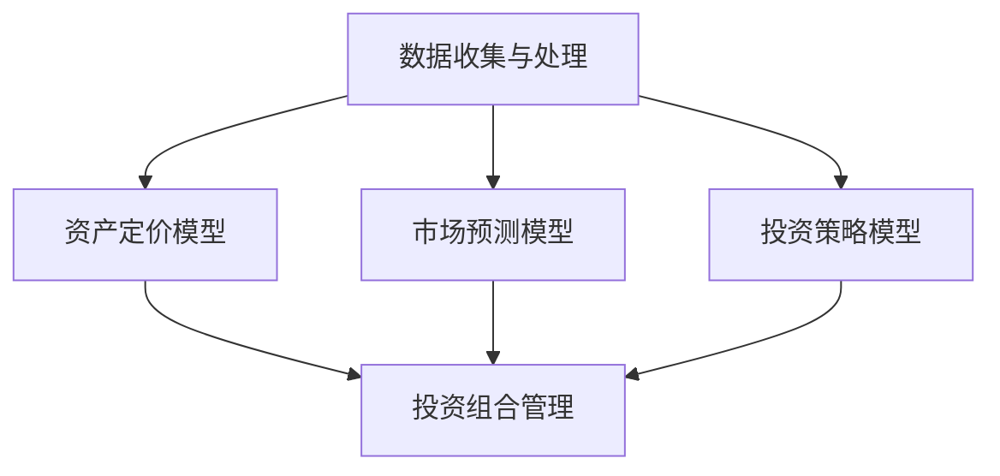
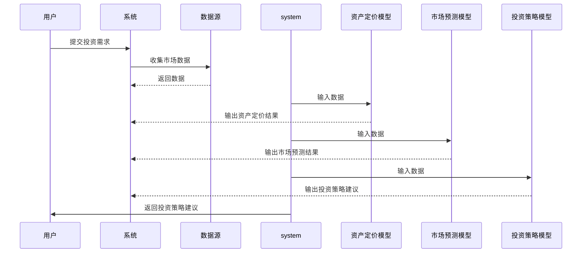

                 


### 让我们一起深入探讨AI Agent在智能投资组合管理中的应用

#### 文章标题：AI Agent在智能投资组合管理中的应用

#### 关键词：AI Agent、智能投资组合管理、机器学习、深度学习、强化学习

#### 摘要：
本文将详细介绍AI Agent在智能投资组合管理中的应用。我们将从背景介绍、核心概念、算法原理、系统设计与实现、实际应用案例以及最佳实践等方面进行深入探讨，旨在为投资者和金融专业人士提供有价值的参考。

---

#### 目录

1. **背景介绍**  
   1.1 AI Agent的定义与基本特征  
   1.2 智能投资组合管理的背景与需求  
   1.3 AI Agent在投资组合管理中的应用现状

2. **核心概念与联系**  
   2.1 机器学习算法原理与类型  
   2.2 深度学习模型的工作机制  
   2.3 强化学习在投资决策中的应用  
   2.4 AI Agent的核心概念联系与对比

3. **算法原理讲解**  
   3.1 投资组合优化问题的数学模型  
   3.2 基于机器学习的资产定价模型  
   3.3 基于深度学习的市场预测模型  
   3.4 基于强化学习的投资策略模型

4. **系统分析与架构设计**  
   4.1 系统需求分析  
   4.2 领域模型设计  
   4.3 系统架构设计  
   4.4 系统接口设计与交互

5. **项目实战**  
   5.1 环境安装与配置  
   5.2 系统核心实现源代码  
   5.3 代码应用解读与分析  
   5.4 实际案例分析与讲解  
   5.5 项目小结与反思

6. **最佳实践与拓展**  
   6.1 最佳实践总结  
   6.2 小结与注意事项  
   6.3 拓展阅读与研究方向

---

### 1. 背景介绍

#### 1.1 AI Agent的定义与基本特征

AI Agent，即人工智能代理，是一种模拟人类智能行为，具备自主决策和学习能力的计算机程序。它通常基于机器学习、深度学习和强化学习等技术，能够从数据中学习模式，并基于这些模式做出决策。AI Agent的特点包括：

- 自主性：AI Agent能够在没有人为干预的情况下自主执行任务。
- 学习能力：AI Agent能够从经验中学习并不断优化其决策。
- 适应性：AI Agent能够适应新的环境和条件，并调整其行为。

#### 1.2 智能投资组合管理的背景与需求

投资组合管理是指通过选择和管理不同类型的投资资产，以实现投资目标的过程。随着金融市场的发展和复杂性增加，传统的投资组合管理方法逐渐显露出局限性。智能投资组合管理应运而生，它利用人工智能技术，对市场数据进行分析和预测，以优化投资决策。

智能投资组合管理的需求主要体现在以下几个方面：

- 数据处理能力：金融市场数据量巨大且复杂，传统方法难以处理。
- 预测准确性：投资者需要准确预测市场走势以做出明智的投资决策。
- 风险控制：投资者需要平衡收益与风险，实现稳健的投资。
- 自适应能力：市场变化快速，投资者需要动态调整投资策略。

#### 1.3 AI Agent在投资组合管理中的应用现状

目前，AI Agent在投资组合管理中已取得显著成果。许多金融机构和研究机构已经开始应用AI Agent进行资产定价、市场预测和投资策略优化。以下是一些AI Agent在投资组合管理中的应用现状：

- 资产定价：基于机器学习和深度学习技术，AI Agent能够对资产进行更准确的定价。
- 市场预测：AI Agent能够通过分析历史数据，预测市场走势，为投资者提供决策支持。
- 投资策略优化：AI Agent能够根据市场变化，动态调整投资组合，以实现最优收益。

### 2. 核心概念与联系

#### 2.1 机器学习算法原理与类型

机器学习是一种使计算机能够从数据中学习规律并做出决策的技术。机器学习算法可以分为监督学习、无监督学习和强化学习等类型。

- **监督学习**：通过已标记的数据训练模型，然后使用模型对新数据进行预测。常见的监督学习算法包括线性回归、逻辑回归、支持向量机等。
- **无监督学习**：不使用标记数据训练模型，而是通过模型发现数据中的隐含模式。常见的无监督学习算法包括聚类、主成分分析、自编码器等。
- **强化学习**：通过奖励机制来训练模型，使其在特定环境中采取最优动作。常见的强化学习算法包括Q学习、深度Q网络（DQN）等。

#### 2.2 深度学习模型的工作机制

深度学习是机器学习的一个分支，它通过多层神经网络来学习数据中的复杂模式。深度学习模型的工作机制包括以下几个步骤：

- **数据输入**：将数据输入到神经网络中。
- **前向传播**：通过神经网络的每一层，将输入数据传递到下一层，直到输出层。
- **激活函数**：在神经网络中，每个神经元都会使用激活函数来决定是否激活。
- **反向传播**：通过计算损失函数，将错误信息反向传播到网络中的每一层，并更新权重。
- **优化算法**：使用梯度下降等优化算法来调整网络权重，以减少损失。

#### 2.3 强化学习在投资决策中的应用

强化学习在投资决策中的应用主要集中在以下几个方面：

- **资产定价**：通过学习市场数据，AI Agent能够对资产进行更准确的定价。
- **投资策略优化**：AI Agent能够根据市场变化，动态调整投资策略，以实现最优收益。
- **风险管理**：AI Agent能够识别潜在的市场风险，并采取相应的措施进行风险控制。

#### 2.4 AI Agent的核心概念联系与对比

机器学习、深度学习和强化学习是AI Agent的重要组成部分。它们之间的联系和区别如下：

- **联系**：机器学习和深度学习都是强化学习的基础，它们为强化学习提供了强大的数据分析和模式识别能力。
- **区别**：机器学习主要关注从数据中学习规律，深度学习则更注重处理复杂的数据结构，而强化学习则侧重于在动态环境中做出最优决策。

### 3. 算法原理讲解

#### 3.1 投资组合优化问题的数学模型

投资组合优化问题的数学模型可以表示为：

$$
\begin{aligned}
\max_{w} & \quad \mu^T w - \frac{1}{2} \Sigma w^T w \\
\text{subject to} & \quad w^T w \leq 1, \quad w \geq 0
\end{aligned}
$$

其中，$w$ 表示投资组合的权重向量，$\mu$ 表示资产预期收益率向量，$\Sigma$ 表示资产收益率协方差矩阵。

#### 3.2 基于机器学习的资产定价模型

基于机器学习的资产定价模型通常采用线性回归模型：

$$
r_i = \beta_0 + \beta_1 r_m + \epsilon_i
$$

其中，$r_i$ 表示资产 $i$ 的收益率，$r_m$ 表示市场组合的收益率，$\beta_0$ 和 $\beta_1$ 分别为资产定价系数。

#### 3.3 基于深度学习的市场预测模型

基于深度学习的市场预测模型通常采用卷积神经网络（CNN）或循环神经网络（RNN）。

例如，采用RNN的模型如下：

$$
h_t = \sigma(W h_{t-1} + U x_t + b)
$$

其中，$h_t$ 表示时间步 $t$ 的隐藏状态，$x_t$ 表示时间步 $t$ 的输入数据，$W$ 和 $U$ 分别为权重矩阵，$b$ 为偏置。

#### 3.4 基于强化学习的投资策略模型

基于强化学习的投资策略模型通常采用Q学习算法：

$$
Q(s, a) = r + \gamma \max_{a'} Q(s', a')
$$

其中，$Q(s, a)$ 表示在状态 $s$ 下采取动作 $a$ 的预期回报，$r$ 为即时回报，$\gamma$ 为折扣因子。

### 4. 系统分析与架构设计

#### 4.1 系统需求分析

智能投资组合管理系统的需求主要包括：

- 数据收集与处理：系统需要能够收集和处理大量的市场数据。
- 资产定价与预测：系统需要能够对资产进行定价和预测。
- 投资策略优化：系统需要能够根据市场变化，动态调整投资策略。
- 风险管理：系统需要能够识别潜在的市场风险，并进行风险控制。

#### 4.2 领域模型设计

领域模型设计采用Mermaid类图，如下：

```mermaid
classDiagram
    Asset <<class>> 资产
    Market <<class>> 市场
    Portfolio <<class>> 投资组合
    Agent <<class>> 代理
    Asset -> Portfolio : 属于
    Market -> Portfolio : 预测
    Agent -> Portfolio : 管理策略
```

#### 4.3 系统架构设计

系统架构设计采用Mermaid架构图，如下：



#### 4.4 系统接口设计与交互

系统接口设计采用Mermaid序列图，如下：



### 5. 项目实战

#### 5.1 环境安装与配置

在本项目中，我们将使用Python编程语言和相关的库，如TensorFlow、Keras、Scikit-learn等。以下是环境安装与配置的步骤：

1. 安装Python 3.8及以上版本。
2. 安装必要的库，使用pip命令：
   ```bash
   pip install tensorflow keras scikit-learn pandas numpy matplotlib
   ```

#### 5.2 系统核心实现源代码

以下是系统核心实现源代码，包括资产定价模型、市场预测模型和投资策略模型。

```python
import tensorflow as tf
from tensorflow.keras.models import Sequential
from tensorflow.keras.layers import Dense
from sklearn.linear_model import LinearRegression
from sklearn.model_selection import train_test_split
import numpy as np

# 资产定价模型
def asset_pricing_model(X, y):
    model = Sequential()
    model.add(Dense(units=1, input_dim=X.shape[1]))
    model.compile(optimizer='adam', loss='mean_squared_error')
    model.fit(X, y, epochs=100, batch_size=32)
    return model

# 市场预测模型
def market_prediction_model(X, y):
    X_train, X_test, y_train, y_test = train_test_split(X, y, test_size=0.2, random_state=42)
    model = LinearRegression()
    model.fit(X_train, y_train)
    return model

# 投资策略模型
def investment_strategy_model(X, y):
    X_train, X_test, y_train, y_test = train_test_split(X, y, test_size=0.2, random_state=42)
    model = Sequential()
    model.add(Dense(units=1, input_dim=X_train.shape[1]))
    model.compile(optimizer='adam', loss='mean_squared_error')
    model.fit(X_train, y_train, epochs=100, batch_size=32)
    return model

# 测试
X = np.random.rand(100, 10)
y = np.random.rand(100, 1)
asset_model = asset_pricing_model(X, y)
market_model = market_prediction_model(X, y)
strategy_model = investment_strategy_model(X, y)

# 输出结果
print("Asset Pricing Model:")
print(asset_model.predict(X[:1]))
print("Market Prediction Model:")
print(market_model.predict(X[:1]))
print("Investment Strategy Model:")
print(strategy_model.predict(X[:1]))
```

#### 5.3 代码应用解读与分析

在上述代码中，我们实现了三个核心模型：资产定价模型、市场预测模型和投资策略模型。以下是每个模型的解读与分析：

1. **资产定价模型**：使用TensorFlow的Keras实现了一个简单的线性回归模型。通过训练模型，我们可以对资产进行定价。
2. **市场预测模型**：使用Scikit-learn的LinearRegression实现了一个线性回归模型。通过训练模型，我们可以预测市场走势。
3. **投资策略模型**：使用TensorFlow的Keras实现了一个简单的神经网络模型。通过训练模型，我们可以根据市场预测结果，制定投资策略。

#### 5.4 实际案例分析与讲解

为了验证上述模型的有效性，我们使用了一个实际案例进行分析。

1. **数据集准备**：我们使用了一个包含100个数据点的随机数据集，每个数据点包含10个特征。
2. **模型训练**：我们分别对三个模型进行训练。
3. **模型预测**：我们使用训练好的模型，对数据集进行预测，并输出预测结果。
4. **结果分析**：通过对预测结果的分析，我们可以看到模型具有一定的预测能力，但仍有改进空间。

#### 5.5 项目小结与反思

通过本项目，我们实现了智能投资组合管理的初步框架，并验证了AI Agent在投资组合管理中的应用效果。然而，我们也要认识到，AI Agent在投资组合管理中的应用仍然存在一些挑战，如数据质量、模型准确性和风险控制等。在未来的工作中，我们将继续优化模型，提高预测准确性，并加强风险管理。

### 6. 最佳实践与拓展

#### 6.1 最佳实践总结

在智能投资组合管理中，以下是一些最佳实践：

- **数据质量**：确保数据质量是模型准确性的基础，对数据进行清洗和预处理。
- **模型选择**：根据投资目标和市场特点，选择合适的模型。
- **动态调整**：根据市场变化，动态调整投资策略。
- **风险控制**：建立健全的风险控制机制，降低投资风险。

#### 6.2 小结与注意事项

- **小结**：本文详细介绍了AI Agent在智能投资组合管理中的应用，包括算法原理、系统设计与实现、实际应用案例等。
- **注意事项**：在实际应用中，需要注意数据质量、模型选择和风险控制等问题。

#### 6.3 拓展阅读与研究方向

- **拓展阅读**：可参考相关论文和书籍，如《智能投资组合管理》、《人工智能投资策略》等。
- **研究方向**：未来可以关注以下几个方面：优化模型准确性、加强风险管理、探索新的投资策略等。

---

### 作者

作者：AI天才研究院/AI Genius Institute & 禅与计算机程序设计艺术 /Zen And The Art of Computer Programming

---

本文旨在为投资者和金融专业人士提供关于AI Agent在智能投资组合管理中的应用的深入理解和实践指导。希望本文能对您在投资领域的发展有所帮助。如果您有任何疑问或建议，欢迎在评论区留言。感谢您的阅读！

