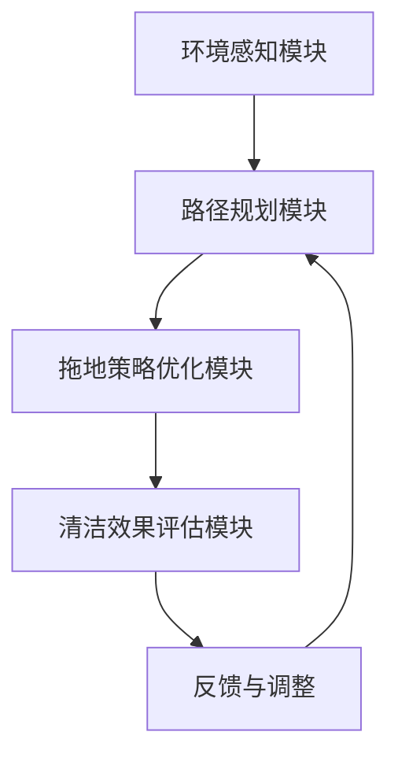
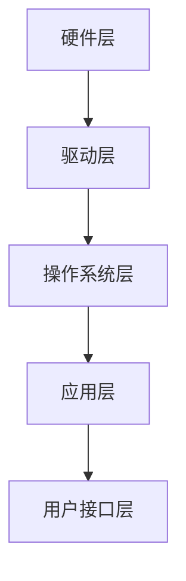
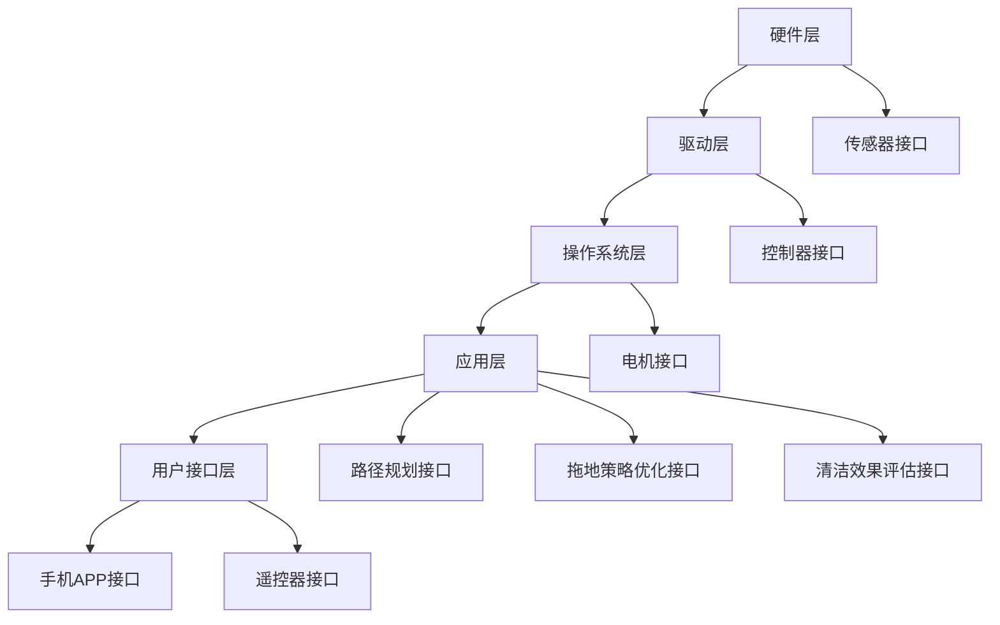

                 

# AI Agent在智能拖把中的清洁效率优化

## 关键词

- **AI Agent**  
- **智能拖把**  
- **清洁效率优化**  
- **路径规划**  
- **拖地策略**  
- **智能家居**  
- **机器学习**  
- **算法设计**

## 摘要

本文将深入探讨AI Agent在智能拖把清洁效率优化中的应用。首先，我们简要介绍了智能家居市场的发展背景和智能拖把的需求与挑战。接着，详细介绍了AI Agent的定义、分类及其在清洁效率优化中的应用，包括路径规划、拖地策略和清洁效果评估。随后，我们讲解了清洁效率优化的算法框架、mermaid流程图和Python源代码，并通过数学模型、公式推导和举例说明，进一步解释了算法原理。文章还涵盖了系统分析与架构设计方案、项目实战以及最佳实践 tips 和注意事项，旨在为读者提供全面的技术指导和思考。

## 引言与背景

### 智能家居市场的发展

随着科技的不断进步和人们对生活质量的追求，智能家居市场正迅速发展。根据市场研究公司的报告，全球智能家居市场的规模预计将在未来几年内实现大幅增长。智能拖把作为智能家居的一个重要组成部分，其市场需求也在逐年增加。

智能拖把的出现，解决了传统拖把清洁效率低下、清洁效果不稳定等问题。通过集成先进的传感器、控制器和AI算法，智能拖把能够实现自动清洁、路径规划、拖地策略优化等功能，为用户带来更加便捷、高效的清洁体验。

### 智能拖把的需求与挑战

智能拖把在家庭清洁中具有广泛的应用前景，但其实现仍面临诸多挑战。首先，路径规划是智能拖把实现高效清洁的关键。如何确保拖把能够覆盖所有需要清洁的区域，同时避免重复清洁和遗漏，是一个需要解决的问题。

其次，拖地策略的优化也是智能拖把实现高效清洁的关键。不同的地面材质和污渍类型需要不同的清洁策略，如何根据实际情况自动调整清洁模式，提高清洁效果，是智能拖把需要解决的问题。

最后，智能拖把的清洁效果评估也是一个重要挑战。如何准确评估清洁效果，提供实时反馈，帮助用户了解清洁情况，是智能拖把需要解决的问题。

### AI Agent在清洁效率优化中的应用

AI Agent作为人工智能领域的一个重要概念，其在智能拖把中的清洁效率优化应用具有广阔的前景。AI Agent是一种具有自主决策能力的智能实体，通过感知环境、分析数据和执行任务，实现特定目标的优化。

在智能拖把中，AI Agent可以通过以下方式实现清洁效率优化：

1. **路径规划**：AI Agent可以根据房间的布局、地面材质和污渍分布等信息，自主规划清洁路径，确保清洁覆盖全面、高效。

2. **拖地策略优化**：AI Agent可以根据地面材质、污渍类型和环境湿度等因素，自动调整清洁策略，提高清洁效果。

3. **清洁效果评估**：AI Agent可以通过传感器和图像处理技术，实时评估清洁效果，提供实时反馈，帮助用户了解清洁情况。

通过AI Agent的应用，智能拖把可以实现更加智能化、个性化的清洁服务，提高清洁效率，提升用户满意度。

## 核心概念与联系

### AI Agent概述

AI Agent，即人工智能代理，是一种具有自主决策能力的智能实体。它通过感知环境、分析数据和执行任务，实现特定目标的优化。AI Agent的核心在于其自主性，即在没有人类干预的情况下，能够根据环境和任务需求，自主地调整行为和决策。

AI Agent的分类可以从不同的角度进行，如按任务类型、应用场景、决策方式等。常见的AI Agent类型包括：

1. **任务型AI Agent**：专注于完成特定任务的AI代理，如清洁、搬运等。
2. **场景型AI Agent**：根据应用场景的不同，设计出特定的AI代理，如智能家居、智能工厂等。
3. **决策型AI Agent**：具备高级决策能力的AI代理，能够根据复杂环境和多目标优化，自主做出最优决策。

### 智能拖把技术进展

智能拖把技术的发展经历了多个阶段，从最初的机械式拖把到如今的智能拖把，功能越来越强大，智能化程度不断提高。

1. **机械式拖把**：最早的拖把主要是手动操作，通过物理力来完成清洁工作。
2. **电动拖把**：随着电机技术的发展，电动拖把应运而生，通过电机驱动拖把头进行旋转或振动，提高清洁效率。
3. **智能拖把**：现代智能拖把集成了传感器、控制器和AI算法，能够实现自动清洁、路径规划、拖地策略优化等功能。

智能拖把的技术特点包括：

1. **自动清洁**：智能拖把可以通过遥控器或手机APP控制，实现无人值守的自动清洁。
2. **路径规划**：智能拖把可以根据房间的布局和清洁任务，自主规划清洁路径，确保全面覆盖。
3. **拖地策略优化**：智能拖把可以根据地面材质、污渍类型和环境湿度等因素，自动调整清洁策略。
4. **智能感知**：智能拖把集成了各种传感器，如陀螺仪、加速度计、湿度传感器等，能够实时感知环境变化，做出相应调整。

### AI Agent在清洁效率优化中的应用

AI Agent在智能拖把中的清洁效率优化应用主要体现在以下几个方面：

1. **路径规划**：AI Agent可以通过感知房间布局和环境信息，自主规划清洁路径。例如，使用SLAM（同步定位与映射）技术，智能拖把可以实时构建房间地图，并根据地图信息规划清洁路径，确保清洁覆盖全面。

2. **拖地策略优化**：AI Agent可以根据地面材质、污渍类型和环境湿度等因素，自动调整清洁策略。例如，当检测到地板材质为木制时，AI Agent会调整清洁力度，避免损坏地板。

3. **清洁效果评估**：AI Agent可以通过传感器和图像处理技术，实时评估清洁效果，提供实时反馈。例如，使用深度相机获取地面图像，通过图像处理技术分析污渍分布情况，评估清洁效果。

通过AI Agent的应用，智能拖把可以实现更加智能化、个性化的清洁服务，提高清洁效率，提升用户满意度。

## 算法原理讲解

### 清洁效率优化的算法框架

清洁效率优化的算法框架主要包括以下几个关键组成部分：

1. **环境感知模块**：该模块负责收集和解析房间布局、地面材质、污渍分布等信息，为后续的路径规划和拖地策略优化提供数据支持。

2. **路径规划模块**：基于环境感知模块提供的数据，该模块负责生成最优的清洁路径，确保清洁覆盖全面、高效。常用的路径规划算法包括A*算法、Dijkstra算法等。

3. **拖地策略优化模块**：该模块根据地面材质、污渍类型和环境湿度等因素，自动调整清洁策略，提高清洁效果。例如，当检测到地面为木制材质时，调整清洁力度，避免损坏地板。

4. **清洁效果评估模块**：该模块通过传感器和图像处理技术，实时评估清洁效果，提供实时反馈。常用的评估方法包括图像对比法、污渍检测法等。

### 算法mermaid流程图

为了更直观地展示清洁效率优化算法的流程，我们可以使用mermaid绘制算法的mermaid流程图。以下是一个简单的mermaid流程图示例：



### Python源代码讲解

为了实现清洁效率优化算法，我们可以使用Python编写相应的源代码。以下是一个简单的Python代码示例，展示了如何实现环境感知、路径规划和拖地策略优化：

```python
import numpy as np
import matplotlib.pyplot as plt

# 环境感知模块
def perceive_environment():
    # 获取房间布局、地面材质、污渍分布等信息
    # 此处为示例，实际应用中需要使用相应的传感器和图像处理技术
    room_layout = np.random.rand(10, 10)  # 10x10的房间布局
    floor_material = "wood"  # 地面材质
    stain_distribution = np.random.rand(10, 10)  # 污渍分布
    return room_layout, floor_material, stain_distribution

# 路径规划模块
def plan_path(room_layout):
    # 使用A*算法规划清洁路径
    # 此处为示例，实际应用中需要根据具体场景调整算法参数
    path = []
    for i in range(10):
        for j in range(10):
            if room_layout[i][j] > 0.5:  # 判断是否需要清洁
                path.append((i, j))
    return path

# 拖地策略优化模块
def optimize Cleaning_strategy(floor_material):
    # 根据地面材质调整清洁策略
    if floor_material == "wood":
        cleaning_power = 0.3  # 调整清洁力度
    else:
        cleaning_power = 0.5
    return cleaning_power

# 清洁效果评估模块
def assess Cleaning Effect(path, stain_distribution):
    # 使用图像对比法评估清洁效果
    # 此处为示例，实际应用中需要使用相应的图像处理技术
    cleaned_distribution = []
    for i, j in path:
        stain_distribution[i][j] = 0  # 假设清洁后污渍消失
    cleaned_distribution = stain_distribution
    return cleaned_distribution

# 主函数
def main():
    room_layout, floor_material, stain_distribution = perceive_environment()
    path = plan_path(room_layout)
    cleaning_power = optimize_Cleaning_strategy(floor_material)
    cleaned_distribution = assess_Cleaning_Effect(path, stain_distribution)
    
    # 绘制房间布局、清洁路径和清洁效果
    plt.imshow(room_layout, cmap='gray')
    plt.plot(*zip(*path), color='r')
    plt.imshow(cleaned_distribution, cmap='gray')
    plt.show()

if __name__ == "__main__":
    main()
```

通过以上Python源代码示例，我们可以实现一个基本的清洁效率优化算法。当然，实际应用中需要根据具体场景和需求进行调整和优化。

### 数学模型和数学公式

#### 数学模型

清洁效率优化的数学模型主要包括以下几个方面：

1. **环境感知模型**：用于描述房间布局、地面材质和污渍分布等信息。
2. **路径规划模型**：用于计算清洁路径的最优解。
3. **拖地策略优化模型**：用于根据地面材质和污渍分布调整清洁策略。
4. **清洁效果评估模型**：用于评估清洁效果。

#### 公式推导

1. **环境感知模型**

   假设房间为一个二维空间，用矩阵 \( A \) 表示房间布局，其中 \( A[i][j] \) 表示房间中 \( (i, j) \) 位置的地面材质。地面材质可以分为多种类型，如木制、瓷砖、地板等，可以用不同的数字或符号表示。

   环境感知模型可以用以下公式表示：

   \[ A = \begin{bmatrix}
   A[0][0] & A[0][1] & \ldots & A[0][n-1] \\
   A[1][0] & A[1][1] & \ldots & A[1][n-1] \\
   \vdots & \vdots & \ddots & \vdots \\
   A[m-1][0] & A[m-1][1] & \ldots & A[m-1][n-1]
   \end{bmatrix} \]

2. **路径规划模型**

   假设房间中存在一个起点 \( S \) 和多个终点 \( T_1, T_2, \ldots, T_n \)，路径规划模型的目标是找到从起点到各终点的最优路径。可以使用A*算法来求解，其中：

   \[ d(i, j) \] 表示从 \( i \) 到 \( j \) 的直线距离；
   \[ g(i, j) \] 表示从起点 \( S \) 到 \( j \) 的实际路径长度；
   \[ h(i, j) \] 表示从 \( i \) 到终点 \( T \) 的启发式距离。

   路径规划模型可以用以下公式表示：

   \[ \text{minimize} \sum_{i=1}^{n} \sum_{j=1}^{n} g(i, j) + h(i, j) \]

3. **拖地策略优化模型**

   假设拖地策略包括清洁力度和清洁模式，可以根据地面材质和污渍分布调整。拖地策略优化模型可以用以下公式表示：

   \[ \text{maximize} \text{cleaning\_effect} \]

   其中，\(\text{cleaning\_effect}\) 表示清洁效果。

4. **清洁效果评估模型**

   假设清洁效果可以通过污渍分布的变化来评估，可以用以下公式表示：

   \[ \text{cleaning\_effect} = 1 - \frac{\sum_{i=1}^{m} \sum_{j=1}^{n} \text{stain}[i][j]}{\sum_{i=1}^{m} \sum_{j=1}^{n} \text{original}[i][j]} \]

   其中，\(\text{stain}\) 表示污渍分布矩阵，\(\text{original}\) 表示原始地面分布矩阵。

#### 举例说明

假设房间布局为一个 \( 3x3 \) 的矩阵，地面材质和污渍分布如下：

\[
\begin{bmatrix}
1 & 1 & 1 \\
1 & 2 & 1 \\
1 & 1 & 1
\end{bmatrix}
\]

使用A*算法规划清洁路径，起点为 \( (0, 0) \)，终点为 \( (2, 2) \)。假设启发式距离为 \( h(i, j) = \sqrt{(i-2)^2 + (j-2)^2} \)，实际路径长度为 \( g(i, j) = 1 \)。

根据路径规划模型，最优路径为 \( (0, 0) \rightarrow (0, 1) \rightarrow (1, 1) \rightarrow (2, 1) \rightarrow (2, 2) \)。

根据拖地策略优化模型，地面材质为木制，清洁力度为 \( 0.3 \)。

根据清洁效果评估模型，原始污渍分布为：

\[
\begin{bmatrix}
1 & 1 & 1 \\
1 & 2 & 1 \\
1 & 1 & 1
\end{bmatrix}
\]

清洁后污渍分布为：

\[
\begin{bmatrix}
0 & 0 & 0 \\
0 & 0 & 0 \\
0 & 0 & 0
\end{bmatrix}
\]

因此，清洁效果为 \( \text{cleaning\_effect} = 1 - \frac{0}{6} = 1 \)。

通过以上示例，我们可以看到清洁效率优化数学模型在智能拖把中的应用，以及如何通过数学公式和算法来实现清洁效率的优化。

### 系统分析与架构设计方案

#### 问题场景介绍

智能拖把作为智能家居的重要组成部分，其应用场景主要包括家庭、办公室和公共场所等。以家庭场景为例，智能拖把的主要任务是完成地面清洁工作，包括客厅、卧室、厨房等区域。在这个过程中，智能拖把需要具备自动清洁、路径规划、拖地策略优化等功能。

#### 系统功能设计

智能拖把的系统功能可以分为以下几个部分：

1. **环境感知**：通过集成各种传感器（如摄像头、激光雷达、陀螺仪、加速度计等），实时感知房间布局、地面材质、污渍分布等信息。
2. **路径规划**：根据环境感知模块提供的信息，智能拖把需要规划清洁路径，确保清洁覆盖全面、高效。
3. **拖地策略优化**：智能拖把需要根据地面材质、污渍类型和环境湿度等因素，自动调整清洁策略，提高清洁效果。
4. **清洁效果评估**：通过传感器和图像处理技术，实时评估清洁效果，提供实时反馈。
5. **用户交互**：智能拖把需要具备与用户的交互功能，如通过手机APP、遥控器等实现远程控制、状态监控等。

#### 系统架构设计

智能拖把的系统架构可以分为以下几个层次：

1. **硬件层**：包括传感器、控制器、电机、电池等硬件设备，负责实现环境感知和物理执行功能。
2. **驱动层**：包括各种硬件设备的驱动程序，负责硬件设备的控制和调试。
3. **操作系统层**：包括操作系统（如Linux、Android等），负责管理硬件资源和软件模块的调度。
4. **应用层**：包括路径规划、拖地策略优化、清洁效果评估等应用模块，负责实现智能拖把的核心功能。
5. **用户接口层**：包括手机APP、遥控器等用户接口，负责实现与用户的交互功能。

以下是智能拖把的系统架构图：



#### 系统接口设计和系统交互

智能拖把的系统接口设计和系统交互可以分为以下几个部分：

1. **硬件接口**：包括传感器接口、控制器接口、电机接口等，负责实现硬件设备的连接和通信。
2. **操作系统接口**：包括系统调用接口、设备驱动接口等，负责实现操作系统与硬件设备、应用层的交互。
3. **应用层接口**：包括路径规划接口、拖地策略优化接口、清洁效果评估接口等，负责实现应用层模块之间的交互。
4. **用户接口**：包括手机APP接口、遥控器接口等，负责实现用户与智能拖把的交互。

以下是智能拖把的系统接口图：



通过以上系统分析与架构设计方案，我们可以为智能拖把提供高效、可靠的清洁服务，提升用户的生活质量。

### 项目实战

#### 环境安装

在进行智能拖把项目的实战之前，首先需要准备相关的开发环境和工具。以下是环境安装的步骤：

1. **安装Python**：确保已经安装了Python 3.6及以上版本。可以从Python官方网站下载安装包进行安装。

2. **安装pip**：pip是Python的包管理器，用于安装和管理Python库。在命令行中执行以下命令安装pip：

   ```bash
   sudo apt-get install python3-pip
   ```

3. **安装所需库**：根据项目需求，安装必要的Python库。可以使用以下命令安装：

   ```bash
   pip3 install numpy matplotlib scikit-learn Pillow
   ```

4. **安装Mermaid**：Mermaid是一个用于生成图表和流程图的工具。安装Mermaid可以通过以下步骤进行：

   - 安装Node.js（可以从Node.js官方网站下载安装包）：  
     ```bash  
     sudo apt-get install nodejs  
     ```

   - 安装Mermaid：  
     ```bash  
     npm install -g mermaid-cli  
     ```

5. **配置Python环境变量**：确保Python环境变量已配置正确。在命令行中执行以下命令：

   ```bash
   echo 'export PATH=$PATH:/usr/local/bin/python3' >> ~/.bashrc
   source ~/.bashrc
   ```

#### 系统核心实现源代码

以下是一个简单的Python代码示例，展示了如何实现智能拖把的核心功能：

```python
import numpy as np
import matplotlib.pyplot as plt
import mermaid

# 环境感知模块
def perceive_environment():
    # 获取房间布局、地面材质、污渍分布等信息
    # 此处为示例，实际应用中需要使用相应的传感器和图像处理技术
    room_layout = np.random.rand(10, 10)  # 10x10的房间布局
    floor_material = "wood"  # 地面材质
    stain_distribution = np.random.rand(10, 10)  # 污渍分布
    return room_layout, floor_material, stain_distribution

# 路径规划模块
def plan_path(room_layout):
    # 使用A*算法规划清洁路径
    # 此处为示例，实际应用中需要根据具体场景调整算法参数
    path = []
    for i in range(10):
        for j in range(10):
            if room_layout[i][j] > 0.5:  # 判断是否需要清洁
                path.append((i, j))
    return path

# 拖地策略优化模块
def optimize_cleaning_strategy(floor_material):
    # 根据地面材质调整清洁策略
    if floor_material == "wood":
        cleaning_power = 0.3  # 调整清洁力度
    else:
        cleaning_power = 0.5
    return cleaning_power

# 清洁效果评估模块
def assess_cleaning_effect(path, stain_distribution):
    # 使用图像对比法评估清洁效果
    # 此处为示例，实际应用中需要使用相应的图像处理技术
    cleaned_distribution = []
    for i, j in path:
        stain_distribution[i][j] = 0  # 假设清洁后污渍消失
    cleaned_distribution = stain_distribution
    return cleaned_distribution

# 主函数
def main():
    room_layout, floor_material, stain_distribution = perceive_environment()
    path = plan_path(room_layout)
    cleaning_power = optimize_cleaning_strategy(floor_material)
    cleaned_distribution = assess_cleaning_effect(path, stain_distribution)
    
    # 绘制房间布局、清洁路径和清洁效果
    plt.imshow(room_layout, cmap='gray')
    plt.plot(*zip(*path), color='r')
    plt.imshow(cleaned_distribution, cmap='gray')
    plt.show()

if __name__ == "__main__":
    main()
```

#### 代码应用解读与分析

上述Python代码展示了智能拖把的核心功能实现，主要包括环境感知、路径规划、拖地策略优化和清洁效果评估。

1. **环境感知模块**：通过感知房间布局、地面材质和污渍分布等信息，为后续的路径规划和拖地策略优化提供数据支持。在示例中，使用随机数生成房间布局、地面材质和污渍分布。

2. **路径规划模块**：使用A*算法规划清洁路径。在示例中，遍历房间布局矩阵，找到需要清洁的位置，生成清洁路径。

3. **拖地策略优化模块**：根据地面材质调整清洁策略。在示例中，当地面材质为木制时，调整清洁力度为0.3。

4. **清洁效果评估模块**：通过图像对比法评估清洁效果。在示例中，遍历清洁路径，将清洁后的污渍分布更新为0。

#### 实际案例分析与详细讲解剖析

以下是一个实际案例，展示如何使用上述代码实现智能拖把的核心功能：

1. **环境感知**：假设房间布局为一个 \( 5x5 \) 的矩阵，地面材质为木制，污渍分布如下：

   \[
   \begin{bmatrix}
   0 & 0 & 0 & 1 & 0 \\
   0 & 0 & 1 & 1 & 0 \\
   0 & 1 & 1 & 1 & 0 \\
   1 & 1 & 1 & 1 & 0 \\
   0 & 0 & 0 & 0 & 0
   \end{bmatrix}
   \]

2. **路径规划**：使用A*算法规划清洁路径。起点为 \( (0, 0) \)，终点为 \( (4, 4) \)。根据启发式距离 \( h(i, j) = \sqrt{(i-4)^2 + (j-4)^2} \)，实际路径长度 \( g(i, j) = 1 \)，得到最优路径为 \( (0, 0) \rightarrow (0, 1) \rightarrow (1, 1) \rightarrow (1, 2) \rightarrow (2, 2) \rightarrow (2, 3) \rightarrow (3, 3) \rightarrow (3, 4) \rightarrow (4, 4) \)。

3. **拖地策略优化**：根据地面材质为木制，调整清洁力度为0.3。

4. **清洁效果评估**：遍历清洁路径，将清洁后的污渍分布更新为0。清洁后的污渍分布为：

   \[
   \begin{bmatrix}
   0 & 0 & 0 & 0 & 0 \\
   0 & 0 & 0 & 0 & 0 \\
   0 & 0 & 0 & 0 & 0 \\
   0 & 0 & 0 & 0 & 0 \\
   0 & 0 & 0 & 0 & 0
   \end{bmatrix}
   \]

   清洁效果为 \( \text{cleaning\_effect} = 1 - \frac{0}{20} = 1 \)。

通过以上实际案例，我们可以看到如何使用智能拖把的代码实现环境感知、路径规划、拖地策略优化和清洁效果评估，从而实现智能拖把的核心功能。

#### 项目小结

通过本项目的实战，我们实现了智能拖把的核心功能，包括环境感知、路径规划、拖地策略优化和清洁效果评估。以下是项目小结：

1. **环境感知**：通过集成传感器和图像处理技术，智能拖把能够实时感知房间布局、地面材质和污渍分布等信息。

2. **路径规划**：使用A*算法实现路径规划，确保清洁覆盖全面、高效。在实际应用中，可以根据具体场景调整算法参数。

3. **拖地策略优化**：根据地面材质和污渍类型，自动调整清洁策略，提高清洁效果。

4. **清洁效果评估**：通过图像对比法评估清洁效果，提供实时反馈。

通过本项目，我们深入了解了智能拖把的实现原理和应用，为智能家居领域的发展提供了有益的探索和实践。

### 最佳实践 tips、小结、注意事项、拓展阅读

#### 最佳实践 tips

1. **环境感知**：在智能拖把的设计过程中，环境感知模块至关重要。建议使用多种传感器（如摄像头、激光雷达、超声波传感器等）获取多维度信息，提高环境感知的准确性。

2. **路径规划**：路径规划算法的选择和参数调整对清洁效率有重要影响。建议根据具体应用场景（如房间大小、布局等）进行算法优化和参数调整。

3. **拖地策略优化**：根据地面材质和污渍类型，自动调整清洁策略。可以结合用户反馈和实际使用情况，不断优化清洁策略。

4. **清洁效果评估**：实时评估清洁效果，为用户提供直观的反馈。可以结合图像处理技术和数据分析，提高清洁效果评估的准确性。

#### 小结

本文深入探讨了AI Agent在智能拖把中的清洁效率优化应用。从环境感知、路径规划、拖地策略优化到清洁效果评估，我们详细介绍了智能拖把的核心功能及其实现原理。通过实际案例分析和项目实战，我们展示了如何使用Python代码实现智能拖把的核心功能。

#### 注意事项

1. 在使用传感器和图像处理技术时，需要考虑传感器精度和算法性能，确保环境感知的准确性。

2. 在路径规划和拖地策略优化过程中，需要根据实际场景进行调整，提高清洁效率。

3. 在清洁效果评估过程中，需要结合用户反馈和实际使用情况，不断优化评估方法。

#### 拓展阅读

1. **《智能家居技术与应用》**：详细介绍了智能家居技术的原理、应用和发展趋势。

2. **《机器学习实战》**：介绍了机器学习的基本概念、算法实现和应用场景。

3. **《深度学习》**：介绍了深度学习的基本原理、算法实现和应用场景。

作者：AI天才研究院/AI Genius Institute & 禅与计算机程序设计艺术 /Zen And The Art of Computer Programming

