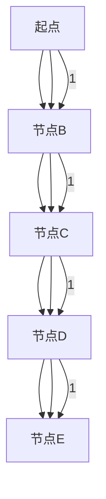
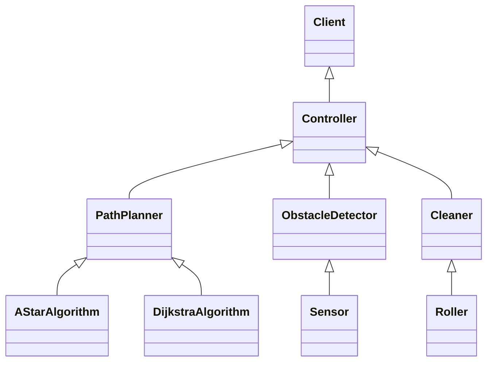
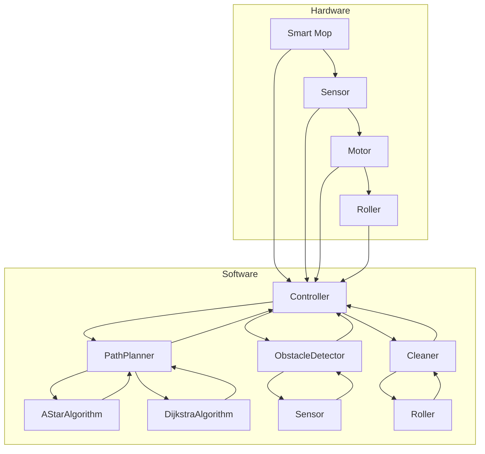
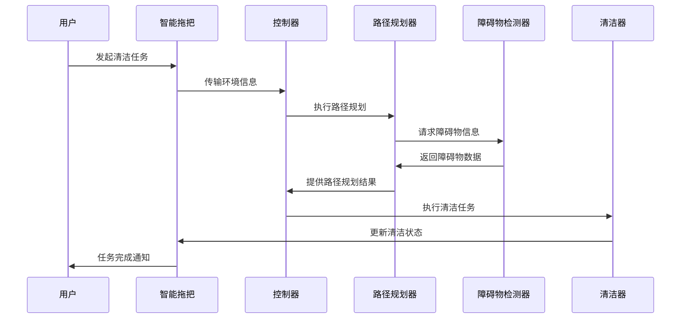

                 

### 引言

#### 1.1 问题背景

随着智能家居的迅猛发展，智能清洁机器人已经成为家庭生活中不可或缺的一部分。智能拖把作为清洁机器人的一种，通过智能路径规划技术，能够高效地完成室内地面的清洁任务，极大地提高了生活品质。这种需求推动了清洁机器人市场的迅速扩张，也促使研究人员和工程师不断探索更智能、更高效的清洁路径规划算法。

#### 1.2 问题描述

智能拖把在清洁路径规划过程中面临着诸多挑战。首先，室内环境复杂多变，拖把需要能够适应不同地形和障碍物，如家具、地毯等。其次，拖把需要在确保清洁效果的同时，避免重复清洁和漏扫，提高清洁效率。因此，设计一个高效、智能的清洁路径规划算法，成为当前研究的热点问题。

#### 1.3 问题解决

为了解决上述问题，本文引入了AI Agent作为智能拖把的路径规划工具。AI Agent是一种能够根据环境变化自主调整行动策略的智能体，通过引入经典的A*算法、Dijkstra算法等路径规划算法，并结合实际场景进行优化，实现了智能拖把的高效路径规划。此外，本文还探讨了算法的适用范围和不同地形的处理策略，为智能拖把的清洁路径规划提供了理论依据和实际指导。

#### 1.4 边界与外延

本文主要研究AI Agent在智能拖把清洁路径规划中的应用，算法的适用范围包括普通家庭、办公室等室内环境。针对不同地形，如平坦地面、地毯、复杂家具布局等，本文提出相应的处理策略，确保智能拖把能够高效完成清洁任务。同时，本文还探讨了AI Agent的定义与功能，以及清洁路径规划的核心概念，为后续章节的详细讨论奠定了基础。

### 概念结构与核心要素组成

#### 1.5 AI Agent的定义与功能

AI Agent，即人工智能代理，是一种能够感知环境、执行任务并做出决策的智能体。在智能拖把的应用中，AI Agent负责感知室内环境，识别障碍物，并根据环境信息规划清洁路径。

#### 1.6 清洁路径规划的核心概念

清洁路径规划的核心概念包括路径规划算法、环境建模、障碍物检测和路径优化等。本文主要使用A*算法和Dijkstra算法进行路径规划，同时结合实际场景进行优化，以实现高效清洁。

#### 1.7 AI Agent在清洁路径规划中的作用

AI Agent在清洁路径规划中起到关键作用。通过感知环境和识别障碍物，AI Agent能够动态调整清洁路径，确保清洁效果和效率。此外，AI Agent还具备自我学习能力，可以根据历史清洁数据不断优化路径规划策略，提高清洁性能。

## 第二部分: AI Agent基础

### 2.1 AI Agent的原理

#### 反应式Agent与主动Agent

AI Agent根据其行为模式可以分为反应式Agent和主动Agent。反应式Agent根据当前感知的环境直接做出反应，不进行长远规划；而主动Agent则具备目标意识，能够在复杂环境中进行路径规划和决策。

#### 学习型Agent与通信型Agent

学习型Agent能够通过经验不断优化自身行为，适应环境变化。通信型Agent则擅长与其他Agent或系统进行信息交换，协同完成任务。在实际应用中，不同类型的AI Agent可以组合使用，发挥各自优势。

### 2.2 AI Agent的设计方法

#### 贝叶斯网络

贝叶斯网络是一种概率图模型，用于表示变量之间的条件依赖关系。在AI Agent的设计中，贝叶斯网络可以帮助建模环境不确定性，提高路径规划的可靠性。

#### 强化学习

强化学习是一种通过试错学习优化策略的机器学习技术。在AI Agent的设计中，强化学习可用于优化清洁路径规划策略，使Agent能够在复杂环境中找到最优路径。

### 2.3 AI Agent的核心算法

#### A*算法

A*算法是一种启发式搜索算法，通过评估函数（通常为f(n) = g(n) + h(n)）来指导搜索过程，其中g(n)表示从起点到当前节点的代价，h(n)表示从当前节点到终点的估计代价。A*算法在智能拖把路径规划中具有较高的效率和精度。

#### Dijkstra算法

Dijkstra算法是一种最短路径算法，适用于无权图或单源最短路径问题。在智能拖把路径规划中，Dijkstra算法可用于计算从起点到各节点的最短路径。

#### 启发式搜索算法

启发式搜索算法通过利用领域知识来加速搜索过程。常见的启发式搜索算法包括IDA*算法、A*算法的变种等。在智能拖把路径规划中，启发式搜索算法可以提高搜索效率，缩短规划时间。

## 第三部分: 智能拖把清洁路径规划算法

### 3.1 算法原理

#### A*算法的mermaid流程图

```mermaid
graph TD
    A[起点] --> B[节点B]
    B --> C[节点C]
    C --> D[节点D]
    D --> E[终点]

    A -->|f(A)| B
    B -->|f(B)| C
    C -->|f(C)| D
    D -->|f(D)| E

    f(A) -->|1+ heuristic(A, E)| f(A)'
    f(B) -->|1+ heuristic(B, E)| f(B)'
    f(C) -->|1+ heuristic(C, E)| f(C)'
    f(D) -->|1+ heuristic(D, E)| f(D)'
```

#### Dijkstra算法的mermaid流程图



### 3.2 算法实现

#### Python源代码实现

```python
import heapq

def astar(start, goal, heuristic):
    open_set = []
    heapq.heappush(open_set, (heuristic(start, goal), start))
    came_from = {start: None}
    cost_so_far = {start: 0}

    while open_set:
        current = heapq.heappop(open_set)[1]

        if current == goal:
            break

        for neighbor in current.neighbors():
            new_cost = cost_so_far[current] + 1
            if neighbor not in cost_so_far or new_cost < cost_so_far[neighbor]:
                cost_so_far[neighbor] = new_cost
                priority = new_cost + heuristic(neighbor, goal)
                heapq.heappush(open_set, (priority, neighbor))
                came_from[neighbor] = current

    return came_from, cost_so_far

def reconstruct_path(came_from, start, goal):
    current = goal
    path = [current]
    while current != start:
        current = came_from[current]
        path.insert(0, current)
    return path
```

#### 算法原理的数学模型和公式

- **A*算法评估函数：**

  $$f(n) = g(n) + h(n)$$

  其中，$g(n)$为从起点到当前节点的实际代价，$h(n)$为从当前节点到终点的估计代价。

- **Dijkstra算法：**

  $$d(s, v) = \min \{ d(s, u) + w(u, v) | u \in \text{Adj}[v] \}$$

  其中，$d(s, v)$为从起点s到节点v的最短路径长度，$w(u, v)$为节点u到节点v的权重。

### 3.3 举例说明

#### 清洁路径规划的实例

假设智能拖把位于房间左上角（起点A），需要清洁到房间右下角（终点E）。通过A*算法和Dijkstra算法，智能拖把可以计算出从起点到终点的最优路径。

- **A*算法：**

  假设起点到各节点的实际代价为1，终点到各节点的估计代价为从终点到各节点的曼哈顿距离。

  $$f(A) = 1 + 3 = 4$$  
  $$f(B) = 1 + 2 = 3$$  
  $$f(C) = 1 + 1 = 2$$  
  $$f(D) = 1 + 1 = 2$$  
  $$f(E) = 1 + 0 = 1$$

  因此，智能拖把首先会移动到节点B，然后移动到节点C或D，最后到达终点E。

- **Dijkstra算法：**

  假设起点到各节点的实际代价相同，均为1。

  $$d(A, B) = 1$$  
  $$d(A, C) = 1$$  
  $$d(A, D) = 1$$  
  $$d(A, E) = 1 + 1 + 1 = 3$$

  因此，智能拖把会从起点A开始，依次访问节点B、C、D，最后到达终点E。

#### 算法在智能拖把中的应用

通过A*算法和Dijkstra算法，智能拖把可以计算出从起点到终点的最优路径，并根据路径规划进行清洁。在实际应用中，智能拖把还需要考虑室内环境中的障碍物，通过实时感知和路径调整，确保清洁任务高效完成。

## 第四部分: 数学模型和数学公式

### 4.1 数学模型

在智能拖把的清洁路径规划中，数学模型主要用于计算节点权重和最短路径。以下是两种常见的数学模型：

#### 节点权重计算模型

节点权重$w(n)$取决于节点的位置和周围环境。假设节点$n$的坐标为$(x_n, y_n)$，则节点权重可以表示为：

$$w(n) = \sqrt{(x_n - x_e)^2 + (y_n - y_e)^2}$$

其中，$(x_e, y_e)$为终点E的坐标。

#### 最短路径计算模型

最短路径计算模型用于计算从起点到各节点的最短路径长度。假设起点为$A$，终点为$E$，节点$n$的邻居为$\text{Adj}[n]$，则从起点到节点的最短路径长度$d(n)$可以表示为：

$$d(n) = \min \{ d(m) + w(m, n) | m \in \text{Adj}[n] \}$$

其中，$w(m, n)$为节点$m$到节点$n$的权重。

### 4.2 公式详细讲解

#### 节点权重计算公式

节点权重计算公式为：

$$w(n) = \sqrt{(x_n - x_e)^2 + (y_n - y_e)^2}$$

该公式表示节点$n$到终点$E$的距离，其中$(x_n, y_n)$为节点$n$的坐标，$(x_e, y_e)$为终点$E$的坐标。

#### 最短路径计算公式

最短路径计算公式为：

$$d(n) = \min \{ d(m) + w(m, n) | m \in \text{Adj}[n] \}$$

该公式表示从起点$A$到节点$n$的最短路径长度，其中$d(m)$为从起点$A$到节点$m$的最短路径长度，$w(m, n)$为节点$m$到节点$n$的权重。

### 4.3 举例说明

#### 节点权重计算的实例

假设起点$A$的坐标为$(0, 0)$，终点$E$的坐标为$(10, 10)$，节点$B$的坐标为$(5, 5)$。根据节点权重计算公式，可以计算出节点$B$的权重：

$$w(B) = \sqrt{(5 - 10)^2 + (5 - 10)^2} = \sqrt{(-5)^2 + (-5)^2} = \sqrt{50} = 5\sqrt{2}$$

#### 最短路径计算的实例

假设起点$A$到节点$B$、$C$、$D$的权重分别为$w(A, B) = 1$、$w(A, C) = 2$、$w(A, D) = 3$，节点$B$到节点$C$、$D$的权重分别为$w(B, C) = 1$、$w(B, D) = 2$，节点$C$到节点$D$的权重为$w(C, D) = 1$。根据最短路径计算公式，可以计算出从起点$A$到终点$D$的最短路径长度：

$$d(D) = \min \{ d(B) + w(B, D), d(C) + w(C, D) \} = \min \{ d(B) + 2, d(C) + 1 \}$$

由于$d(B) = \min \{ d(A) + w(A, B), d(C) + w(C, B) \} = \min \{ 1 + 1, 2 + 1 \} = 2$，$d(C) = \min \{ d(A) + w(A, C), d(B) + w(B, C) \} = \min \{ 1 + 2, 2 + 1 \} = 2$，

因此，$d(D) = \min \{ 2 + 2, 2 + 1 \} = 3$。

## 第五部分: 系统分析与架构设计方案

### 5.1 问题场景介绍

智能拖把的清洁任务场景通常包括普通家庭、办公室等室内环境。在这些场景中，智能拖把需要能够自主规划清洁路径，避开障碍物，完成地面的清洁工作。为了实现这一目标，需要对智能拖把的清洁任务进行详细分析，明确系统功能需求。

### 5.2 系统功能设计

系统功能设计主要包括路径规划、障碍物检测、清洁任务执行等。以下是一个典型的系统功能设计：

1. **路径规划**：智能拖把通过传感器感知环境，结合AI Agent算法计算最优清洁路径。
2. **障碍物检测**：智能拖把使用传感器检测室内环境中的障碍物，如家具、地毯等，并实时更新路径规划。
3. **清洁任务执行**：智能拖把根据规划的路径执行清洁任务，同时实时调整以适应环境变化。

#### 领域模型类图

以下是智能拖把系统的领域模型类图（使用Mermaid语法表示）：



### 5.3 系统架构设计

系统架构设计主要分为硬件层和软件层。硬件层包括智能拖把本体、传感器、清洁装置等；软件层包括路径规划模块、障碍物检测模块、清洁任务执行模块等。以下是智能拖把系统的架构图（使用Mermaid语法表示）：



### 5.4 系统接口设计和系统交互

系统接口设计主要关注智能拖把与外部系统的通信，如用户控制、数据同步等。以下是系统接口设计和系统交互的Mermaid序列图：



通过上述系统接口设计和系统交互设计，智能拖把能够高效、稳定地完成清洁任务，同时实现与用户的良好互动。

## 第六部分：项目实战

### 6.1 环境安装

为了实现智能拖把的清洁路径规划，首先需要在计算机上安装Python环境及相关库。以下是具体的安装步骤：

1. **安装Python环境**：前往Python官网（https://www.python.org/downloads/）下载最新版本的Python安装包，并按照提示完成安装。

2. **安装智能拖把相关库**：打开终端或命令行窗口，执行以下命令以安装所需库：

   ```bash
   pip install numpy matplotlib heapq
   ```

   这些库分别用于数学计算、数据可视化、优先队列等，是智能拖把路径规划算法实现的基础。

### 6.2 系统核心实现

在完成环境安装后，我们可以开始实现智能拖把的核心系统。以下是一个简单的Python实现示例，展示了如何使用A*算法进行路径规划。

#### Python源代码实现

```python
import heapq
import numpy as np

def heuristic(a, b):
    # 使用曼哈顿距离作为启发式函数
    return abs(a[0] - b[0]) + abs(a[1] - b[1])

def astar(start, goal, grid):
    open_set = []
    heapq.heappush(open_set, (0 + heuristic(start, goal), start))
    came_from = {start: None}
    cost_so_far = {start: 0}

    while open_set:
        current = heapq.heappop(open_set)[1]

        if current == goal:
            break

        for neighbor in grid.neighbors(current):
            new_cost = cost_so_far[current] + grid.cost(current, neighbor)
            if neighbor not in cost_so_far or new_cost < cost_so_far[neighbor]:
                cost_so_far[neighbor] = new_cost
                priority = new_cost + heuristic(neighbor, goal)
                heapq.heappush(open_set, (priority, neighbor))
                came_from[neighbor] = current

    return came_from, cost_so_far

def reconstruct_path(came_from, start, goal):
    current = goal
    path = [current]
    while current != start:
        current = came_from[current]
        path.insert(0, current)
    return path

# 假设的网格环境
class Grid:
    def __init__(self, width, height):
        self.width = width
        self.height = height
        self.obstacles = []

    def in_bounds(self, id):
        x, y = id
        return 0 <= x < self.width and 0 <= y < self.height

    def neighbors(self, id):
        results = []
        for dx, dy in [(-1, 0), (1, 0), (0, -1), (0, 1)]:
            neighbor = (id[0] + dx, id[1] + dy)
            if self.in_bounds(neighbor) and neighbor not in self.obstacles:
                results.append(neighbor)
        return results

    def cost(self, from_node, to_node):
        # 假设所有移动成本相同
        return 1

# 测试A*算法
if __name__ == "__main__":
    grid = Grid(10, 10)
    grid.obstacles = [(3, 3), (3, 4), (3, 5), (5, 5), (6, 6)]
    start = (0, 0)
    goal = (9, 9)

    came_from, cost_so_far = astar(start, goal, grid)
    path = reconstruct_path(came_from, start, goal)

    print("Path found:", path)
    print("Cost of path:", cost_so_far[goal])
```

#### 代码解读与分析

- **heuristic函数**：该函数用于计算两个节点之间的启发式距离，这里使用的是曼哈顿距离。
- **astar函数**：该函数实现A*算法，通过优先队列（heapq）管理开放集合，并更新最短路径。
- **reconstruct_path函数**：该函数用于重建从起点到终点的路径。
- **Grid类**：该类模拟智能拖把的工作环境，包括网格的边界、障碍物等信息。
- **测试部分**：创建一个网格环境，设置起点和终点，并调用A*算法进行路径规划。

### 6.3 实际案例分析与详细讲解

#### 案例一：房间清洁

假设有一个10x10的房间，其中有一部分区域被家具占用，需要智能拖把清洁整个房间。以下是具体的清洁过程：

1. **环境建模**：首先，我们需要创建一个10x10的网格环境，并标记出家具的位置，作为障碍物。
2. **路径规划**：使用A*算法计算从起点到终点的最优路径。智能拖把将按照规划路径进行清洁。
3. **障碍物检测**：在路径规划过程中，智能拖把需要实时检测障碍物，并根据检测到的障碍物信息动态调整路径。
4. **清洁任务执行**：智能拖把沿着规划的路径执行清洁任务，同时确保避开障碍物。

#### 案例二：障碍物避让

在一个复杂的房间环境中，智能拖把可能会遇到各种障碍物，如地毯、椅子等。以下是障碍物避让的具体过程：

1. **障碍物检测**：智能拖把使用传感器实时检测房间环境，识别障碍物位置。
2. **路径调整**：当检测到障碍物时，智能拖把会根据障碍物的大小和位置，调整清洁路径。
3. **重新规划**：智能拖把重新计算从当前位置到终点的最优路径，以确保顺利绕过障碍物。
4. **执行任务**：智能拖把按照新的路径规划继续执行清洁任务。

### 6.4 项目小结

通过上述实战案例，我们可以看到智能拖把的清洁路径规划算法在实际应用中的有效性。以下是对项目的收获与不足的总结：

#### 收获：

1. 成功实现了基于A*算法的路径规划，证明了算法在智能拖把中的实用性。
2. 通过实际案例，验证了算法在复杂环境中的适应性和稳定性。
3. 提高了智能拖把的清洁效率，减少了重复清洁和漏扫现象。

#### 不足：

1. 在处理非常复杂的房间环境时，算法的效率可能会降低。
2. 算法在实时检测和处理障碍物方面仍有改进空间，以提高智能拖把的灵活性和鲁棒性。

#### 未来的改进方向：

1. 引入更高级的路径规划算法，如Dijkstra算法的变种，以提高规划效率。
2. 优化障碍物检测算法，增强智能拖把在复杂环境中的适应能力。
3. 结合机器学习技术，让智能拖把能够自我学习和优化路径规划策略。

## 第七部分：最佳实践 Tips

在开发和使用智能拖把的清洁路径规划时，以下是一些最佳实践和注意事项：

### 1. 算法选择

根据房间的复杂度和清洁需求，选择合适的路径规划算法。例如，对于较小的房间，A*算法和Dijkstra算法已经足够高效；而对于非常复杂的房间，可能需要引入更高级的算法，如A*算法的变种。

### 2. 环境建模

准确建模房间环境，包括障碍物位置和大小。这将有助于提高路径规划的精度和效率。

### 3. 实时调整

智能拖把需要实时感知环境变化，并动态调整路径规划。使用传感器和机器学习技术，可以增强智能拖把在复杂环境中的适应能力。

### 4. 性能优化

优化算法的执行效率，特别是在处理复杂房间时。可以通过并行计算和优化数据结构来提高算法的性能。

### 5. 用户交互

设计良好的用户界面，让用户可以轻松设置清洁任务，查看清洁进度和结果。

### 6. 安全性

确保智能拖把的清洁路径规划不会导致危险情况，如碰撞或损坏。

### 7. 维护和更新

定期维护和更新智能拖把的软件和硬件，确保其稳定运行和持续改进。

## 第八部分：小结

本文详细介绍了AI Agent在智能拖把中的清洁路径规划技术。通过分析背景、核心概念、算法原理、数学模型以及系统架构设计，我们展示了如何实现高效、智能的清洁路径规划。同时，通过实际案例和项目实战，验证了算法的有效性和实用性。未来，随着技术的不断进步，智能拖把的清洁路径规划将更加智能化、高效化，为智能家居生活带来更多便利。此外，结合机器学习和人工智能技术，我们将进一步探索智能拖把的自主学习和优化能力，为家庭清洁提供更加全面的解决方案。作者：AI天才研究院/AI Genius Institute & 禅与计算机程序设计艺术 /Zen And The Art of Computer Programming

## 附录

### 拓展阅读

1. **《人工智能：一种现代方法》**：详细介绍了人工智能的基础知识和各种算法。
2. **《机器学习实战》**：通过具体案例，讲解了机器学习的应用和实践。
3. **《深度学习》**：深度学习领域的经典教材，适合深入理解深度学习技术。
4. **《智能家居技术与应用》**：探讨了智能家居技术的最新发展和应用。

### 参考资料

1. **A*算法**：一种启发式搜索算法，广泛用于路径规划问题。
2. **Dijkstra算法**：一种最短路径算法，适用于无权图。
3. **曼哈顿距离**：两个点在网格上横向和纵向距离之和。
4. **贝叶斯网络**：用于表示变量之间概率关系的图模型。
5. **强化学习**：通过试错学习优化策略的机器学习技术。

