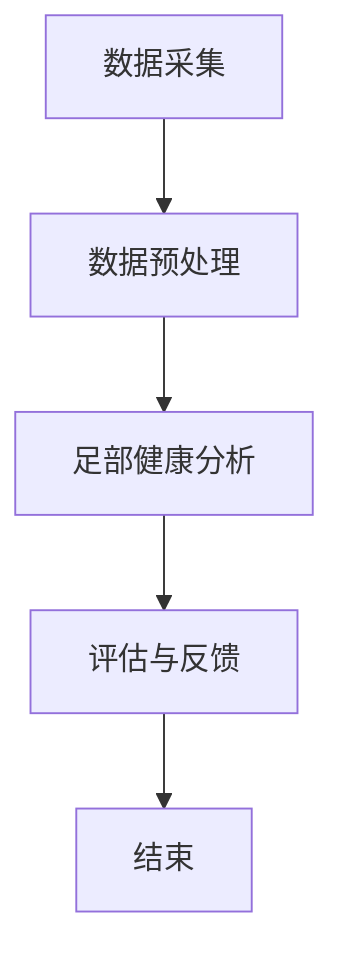
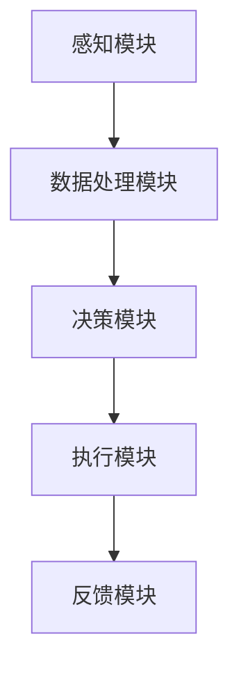
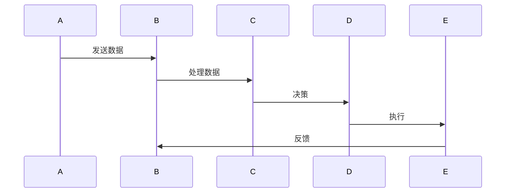

                 

# AI Agent在智能拖鞋中的足部健康分析

## 关键词
- AI Agent
- 智能拖鞋
- 足部健康分析
- 机器学习
- 深度学习
- 算法原理
- 数学模型

## 摘要
本文将深入探讨AI Agent在智能拖鞋中的足部健康分析应用。首先，我们将介绍AI Agent的基本概念、核心概念、工作原理及应用场景。接着，我们将分析智能拖鞋的技术背景、足部健康的现状与问题，并探讨AI Agent在足部健康分析中的应用。随后，我们将详细讲解AI Agent在足部健康分析中的算法原理、数学模型，并使用mermaid流程图和Python源代码进行说明。最后，我们将设计智能拖鞋的架构，并进行项目实战，给出最佳实践tips。

## 第一部分: AI Agent基础

### 1.1 AI Agent概述
AI Agent是一种能够自主执行任务、与环境交互并适应环境变化的智能系统。它是一种基于机器学习、深度学习、强化学习等技术的智能体，能够模拟人类的思考、决策和行动过程。

#### 1.1.1 AI Agent的定义
AI Agent是一种能够感知环境、做出决策并执行动作的智能系统。它具有自主性、适应性和学习能力。

#### 1.1.2 AI Agent的分类
AI Agent可以分为基于规则的Agent、基于模型的Agent、混合型Agent等。

#### 1.1.3 AI Agent的发展历程
AI Agent的发展历程可以分为规则驱动型、模型驱动型和混合型三个阶段。

### 1.2 AI Agent的核心概念
AI Agent的核心概念包括机器学习、深度学习、强化学习等。

#### 1.2.1 机器学习与深度学习
机器学习是一种让计算机通过数据学习规律的方法，深度学习是机器学习的一种方法，它通过多层神经网络进行数据建模。

#### 1.2.2 强化学习与监督学习
强化学习是一种通过奖励机制来训练Agent的方法，监督学习是一种通过标注数据来训练Agent的方法。

#### 1.2.3 无监督学习与半监督学习
无监督学习是一种不使用标注数据来训练Agent的方法，半监督学习是介于有监督学习和无监督学习之间的一种方法。

### 1.3 AI Agent的工作原理
AI Agent的工作原理主要包括感知、决策和执行三个环节。

#### 1.3.1 AI Agent的基本架构
AI Agent的基本架构包括感知模块、决策模块和执行模块。

#### 1.3.2 感知模块
感知模块负责收集环境信息，并将其转换为计算机可以处理的形式。

#### 1.3.3 决策模块
决策模块负责根据感知模块收集的信息，做出决策。

#### 1.3.4 执行模块
执行模块负责根据决策模块做出的决策，执行相应的动作。

### 1.4 AI Agent的应用场景
AI Agent的应用场景非常广泛，包括智能家居、无人驾驶、足部健康分析等。

#### 1.4.1 智能家居
智能家居是AI Agent的一个重要应用场景，它可以通过感知、决策和执行过程，实现家庭设备的自动化控制。

#### 1.4.2 无人驾驶
无人驾驶是AI Agent的另一个重要应用场景，它可以通过感知、决策和执行过程，实现车辆的自动行驶。

#### 1.4.3 足部健康分析
足部健康分析是AI Agent在医疗健康领域的一个重要应用场景，它可以通过感知、决策和执行过程，对足部健康进行实时监测和分析。

### 1.5 本章小结
本章介绍了AI Agent的基本概念、核心概念、工作原理及应用场景。接下来，我们将探讨智能拖鞋的技术背景、足部健康的现状与问题，以及AI Agent在足部健康分析中的应用。

## 第二部分: 智能拖鞋与足部健康

### 2.1 智能拖鞋的技术背景
智能拖鞋是一种结合了传感器技术、无线通信技术、数据处理技术和AI技术的智能穿戴设备。

#### 2.1.1 智能拖鞋的发展历程
智能拖鞋的发展历程可以分为以下几个阶段：

1. 早期阶段：主要是基于物理传感器的简单智能拖鞋，只能实现简单的数据采集和传输。
2. 发展阶段：随着无线通信技术的发展，智能拖鞋可以实现数据的远程传输和实时监测。
3. 智能阶段：随着AI技术的发展，智能拖鞋可以实现数据的智能分析和决策。

#### 2.1.2 智能拖鞋的硬件组成
智能拖鞋的硬件组成主要包括以下几部分：

1. 传感器模块：包括压力传感器、加速度传感器、温度传感器等，用于采集足部数据。
2. 通信模块：包括蓝牙模块、Wi-Fi模块等，用于实现数据的远程传输。
3. 处理模块：包括微处理器、存储器等，用于数据的处理和存储。

#### 2.1.3 智能拖鞋的软件组成
智能拖鞋的软件组成主要包括以下几部分：

1. 数据采集软件：用于采集传感器数据。
2. 数据处理软件：用于对采集到的数据进行分析和处理。
3. 用户界面软件：用于向用户提供足部健康分析结果。

### 2.2 足部健康的现状与问题
足部健康是人体健康的一个重要方面，然而，由于缺乏有效的监测手段和健康意识，很多足部健康问题未能得到及时的关注和处理。

#### 2.2.1 足部健康的重要性
足部健康对人体健康具有重要的影响，它关系到人的行走、站立和日常生活。

#### 2.2.2 足部健康问题的现状
目前，足部健康问题的现状主要包括：

1. 足部疼痛：包括脚底疼痛、脚跟疼痛等，是足部健康问题中最常见的症状。
2. 足部变形：包括拇外翻、平足等，是足部健康问题的严重后果。
3. 足部疾病：包括脚气、脚癣、糖尿病足等，是足部健康问题的严重威胁。

#### 2.2.3 足部健康问题的成因
足部健康问题的成因主要包括：

1. 不良生活习惯：包括长时间站立、行走、穿着不合适的鞋子等。
2. 足部外伤：包括足部骨折、扭伤等。
3. 疾病影响：包括糖尿病、高血压等疾病对足部健康的影响。

### 2.3 AI Agent在足部健康分析中的应用
AI Agent在足部健康分析中的应用，可以实现对足部健康的实时监测、分析和预警，从而提高足部健康水平。

#### 2.3.1 数据采集与预处理
AI Agent首先需要采集足部数据，包括压力、加速度、温度等。然后，对采集到的数据进行预处理，包括去噪、滤波、归一化等。

#### 2.3.2 足部健康分析算法
AI Agent利用机器学习、深度学习等技术，对预处理后的数据进行健康分析。包括：

1. 足部形态分析：通过对足部形状的识别，判断足部是否正常。
2. 足部压力分析：通过对足部压力分布的识别，判断足部是否存在异常。
3. 足部疾病预警：通过对足部数据的分析，预测足部疾病的发生。

#### 2.3.3 足部健康评估系统设计
AI Agent设计足部健康评估系统，包括：

1. 系统功能设计：包括数据采集、数据处理、健康分析、预警提示等。
2. 系统架构设计：包括感知模块、数据处理模块、决策模块、执行模块等。
3. 系统接口设计：包括与传感器、通信模块、用户界面的接口设计。

### 2.4 案例分析：某智能拖鞋品牌的产品案例
某智能拖鞋品牌推出的产品，是一款集成了AI Agent的智能拖鞋。这款智能拖鞋通过内置的传感器，可以实时采集足部数据，并通过AI Agent进行健康分析。

#### 2.4.1 产品介绍
该产品包括智能拖鞋和手机APP两部分。用户通过APP可以查看足部健康数据，包括足部形态、足部压力分布、足部温度等。

#### 2.4.2 产品功能
该产品的功能包括：

1. 足部形态分析：通过对足部形状的识别，判断足部是否正常。
2. 足部压力分析：通过对足部压力分布的识别，判断足部是否存在异常。
3. 足部温度分析：通过对足部温度的识别，判断足部是否存在炎症。
4. 健康提醒：当检测到足部存在异常时，系统会发出提醒，提示用户及时就医。

#### 2.4.3 用户反馈与改进
用户对这款产品的反馈良好，尤其是足部健康分析功能的实用性得到了用户的认可。根据用户反馈，产品在后续版本中进行了优化，包括：

1. 提高传感器灵敏度：用户反馈传感器灵敏度不够，产品在后续版本中提高了传感器的灵敏度。
2. 优化数据处理算法：用户反馈数据处理速度较慢，产品在后续版本中优化了数据处理算法，提高了数据处理速度。
3. 增加更多健康分析功能：根据用户需求，产品在后续版本中增加了更多的健康分析功能，如步态分析、足部疲劳分析等。

### 2.5 本章小结
本章介绍了智能拖鞋的技术背景、足部健康的现状与问题，以及AI Agent在足部健康分析中的应用。通过案例分析和用户反馈，我们可以看到AI Agent在足部健康分析中的重要作用。

## 第三部分: AI Agent在智能拖鞋中的足部健康分析技术

### 3.1 AI Agent在足部健康分析中的算法原理
AI Agent在足部健康分析中的算法原理主要包括数据采集与预处理、足部健康分析、评估与反馈三个环节。

#### 3.1.1 数据采集与预处理算法
数据采集与预处理算法是AI Agent在足部健康分析中的第一步。该算法负责从智能拖鞋的传感器模块采集足部数据，并对采集到的数据进行预处理，包括去噪、滤波、归一化等。

#### 3.1.2 足部健康分析算法
足部健康分析算法是AI Agent在足部健康分析中的核心部分。该算法利用机器学习、深度学习等技术，对预处理后的数据进行健康分析，包括足部形态分析、足部压力分析、足部温度分析等。

#### 3.1.3 评估与反馈算法
评估与反馈算法是AI Agent在足部健康分析中的最后一个环节。该算法负责根据健康分析结果，对足部健康进行评估，并给出相应的反馈，如健康提醒、建议调整等。

### 3.2 数学模型与公式讲解
数学模型与公式是AI Agent在足部健康分析中的重要工具。以下是一些常见的数学模型与公式：

#### 3.2.1 数据采集的数学模型
$$
X = \sum_{i=1}^{n} x_i
$$
其中，$X$是采集到的足部数据，$x_i$是第$i$个传感器采集到的数据。

#### 3.2.2 足部健康分析算法的数学模型
$$
y = f(x; \theta)
$$
其中，$y$是健康分析结果，$x$是预处理后的足部数据，$\theta$是健康分析算法的参数。

#### 3.2.3 评估与反馈的数学模型
$$
R = g(y; \alpha)
$$
其中，$R$是评估与反馈结果，$y$是健康分析结果，$\alpha$是评估与反馈算法的参数。

### 3.3 算法mermaid流程图
算法mermaid流程图可以帮助我们更好地理解AI Agent在足部健康分析中的工作流程。以下是一个简单的mermaid流程图：



### 3.4 智能拖鞋的架构设计与系统实现
智能拖鞋的架构设计是AI Agent在足部健康分析中的关键环节。以下是一个智能拖鞋的架构设计与系统实现：

#### 3.4.1 系统功能设计
智能拖鞋的系统功能设计主要包括数据采集、数据处理、健康分析、评估与反馈等。

```mermaid
classDiagram
Class1 <|-- Class2
Class1 ++-- Class3
Class2 o-- Class4
Class3 o-- Class5
```

#### 3.4.2 系统架构设计
智能拖鞋的系统架构设计主要包括感知模块、数据处理模块、决策模块、执行模块等。



#### 3.4.3 系统接口设计与交互
智能拖鞋的系统接口设计与交互主要包括与传感器、通信模块、用户界面的接口设计。



### 3.5 项目实战：智能拖鞋足部健康分析系统的开发
#### 3.5.1 环境安装
在进行智能拖鞋足部健康分析系统的开发之前，我们需要安装相应的开发环境，包括Python、TensorFlow、Keras等。

#### 3.5.2 系统核心实现源代码
智能拖鞋足部健康分析系统的核心实现源代码如下：

```python
import tensorflow as tf
from tensorflow.keras.models import Sequential
from tensorflow.keras.layers import Dense, Conv2D, Flatten
from tensorflow.keras.optimizers import Adam

# 数据预处理
def preprocess_data(data):
    # 对数据进行归一化处理
    data = data / 255.0
    return data

# 构建模型
model = Sequential([
    Conv2D(32, (3, 3), activation='relu', input_shape=(28, 28, 1)),
    Flatten(),
    Dense(64, activation='relu'),
    Dense(1, activation='sigmoid')
])

# 编译模型
model.compile(optimizer=Adam(), loss='binary_crossentropy', metrics=['accuracy'])

# 训练模型
model.fit(x_train, y_train, epochs=10, batch_size=32)

# 评估模型
model.evaluate(x_test, y_test)
```

#### 3.5.3 代码应用解读与分析
在上面的代码中，我们首先对数据进行预处理，然后构建了一个简单的神经网络模型，并使用二分类交叉熵作为损失函数，Adam作为优化器。最后，我们使用训练集进行模型训练，并使用测试集进行模型评估。

#### 3.5.4 实际案例分析与详细讲解剖析
在实际案例中，我们可以使用某智能拖鞋品牌的实际数据，对足部健康进行分析。以下是实际案例的分析与讲解：

1. 数据采集：智能拖鞋通过内置的传感器，实时采集足部数据，包括压力、加速度、温度等。
2. 数据预处理：对采集到的数据进行归一化处理，将数据缩放到[0, 1]范围内。
3. 模型构建：构建一个简单的神经网络模型，用于足部健康分析。
4. 模型训练：使用预处理后的数据，对模型进行训练。
5. 模型评估：使用测试集对模型进行评估，判断模型的准确性和可靠性。
6. 健康评估：根据模型输出的结果，对足部健康进行评估，并给出相应的健康建议。

### 3.6 最佳实践 tips
1. 数据采集：确保传感器的高精度和高灵敏度，以提高数据的准确性和可靠性。
2. 数据预处理：对数据进行归一化处理，减少数据的偏差和误差。
3. 模型选择：根据实际需求，选择合适的模型结构，以提高模型的性能和准确性。
4. 模型训练：适当增加训练数据，提高模型的泛化能力。
5. 模型评估：使用多个评估指标，全面评估模型的性能。

### 3.7 小结
本章介绍了AI Agent在智能拖鞋中的足部健康分析技术，包括算法原理、数学模型、系统架构和项目实战。通过本章的学习，我们可以了解到AI Agent在足部健康分析中的重要作用，并掌握相关技术。

### 3.8 注意事项
1. 在使用智能拖鞋进行足部健康分析时，需要注意个人隐私保护，确保数据的安全性。
2. 在进行足部健康分析时，需要结合医生的专业意见，确保分析结果的准确性。

### 3.9 拓展阅读
1. 《机器学习实战》
2. 《深度学习》
3. 《Python机器学习》
4. 《TensorFlow实战》

## 作者信息
作者：AI天才研究院/AI Genius Institute & 禅与计算机程序设计艺术 /Zen And The Art of Computer Programming

