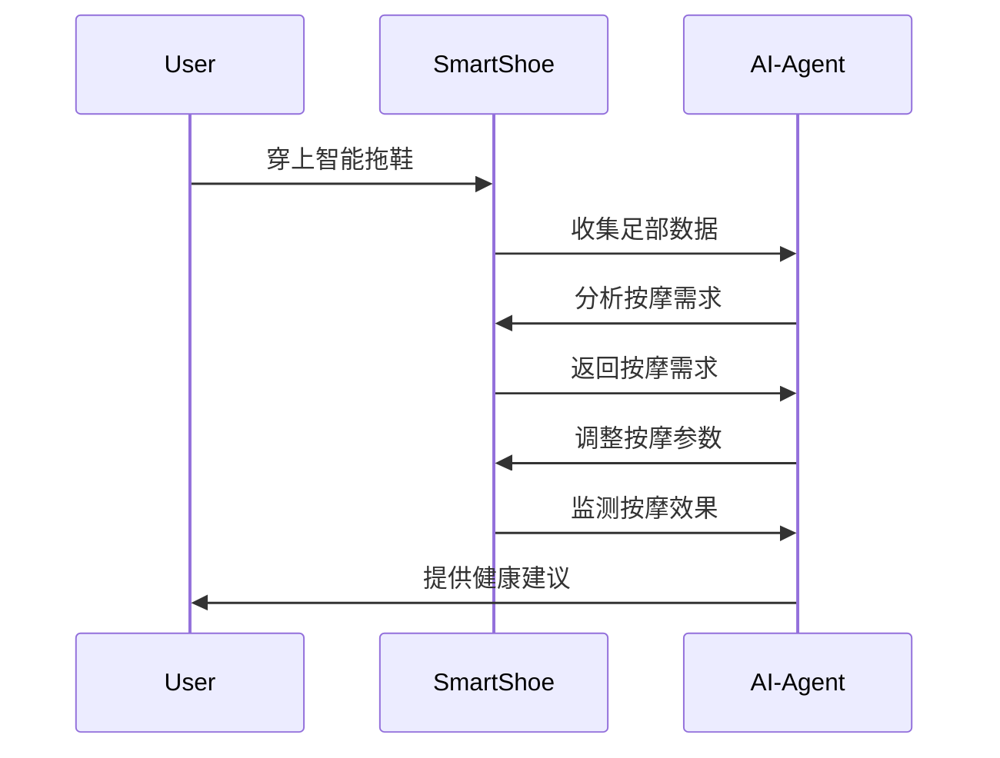
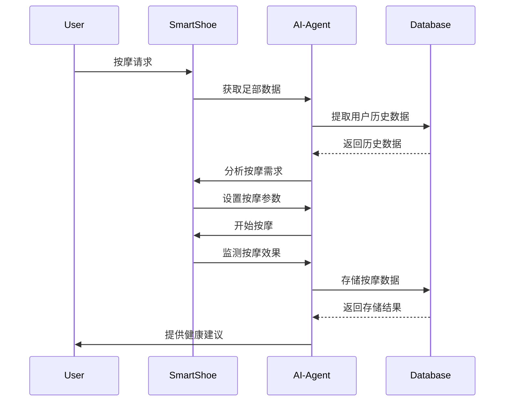

                 

# AI Agent在智能拖鞋中的足部按摩定制

> 关键词：AI Agent，智能拖鞋，足部按摩，个性化定制，实时监测，数据分析

> 摘要：本文探讨了AI Agent在智能拖鞋中的足部按摩定制技术，首先介绍了足部按摩的重要性以及AI Agent的基本概念，然后分析了智能拖鞋的发展历程和功能特点，最后详细阐述了AI Agent在智能拖鞋中实现足部按摩定制的具体方法，包括按摩需求的个性化定制、按摩效果的实时监测与调整以及按摩数据的分析与应用。本文旨在为读者提供对AI Agent在智能拖鞋中应用足部按摩技术的全面了解。

## 引言

随着科技的不断进步，人工智能（AI）技术已经渗透到我们生活的方方面面。在智能家居领域，智能拖鞋作为一种新兴的产品，以其便捷性和实用性受到了越来越多消费者的喜爱。而AI Agent作为人工智能的核心组成部分，其在智能拖鞋中的应用，使得足部按摩技术得以实现个性化定制，提高了用户体验。

本文将围绕AI Agent在智能拖鞋中的足部按摩定制进行探讨，首先介绍足部按摩的重要性和AI Agent的基本概念，然后分析智能拖鞋的发展历程和功能特点，最后详细阐述AI Agent在智能拖鞋中实现足部按摩定制的具体方法。

## 足部按摩的重要性

足部按摩作为一种传统的保健方式，具有多种益处。首先，足部按摩可以促进血液循环，缓解疲劳。足部有许多神经末梢和血管，通过按摩可以刺激这些部位，使血液循环更加顺畅，从而改善身体的疲劳状态。其次，足部按摩可以缓解肌肉酸痛。长时间站立、行走或运动后，足部的肌肉容易产生酸痛，通过按摩可以缓解这种不适。此外，足部按摩还可以调节情绪，改善睡眠质量。一些研究表明，足部按摩可以降低焦虑和压力水平，有助于改善睡眠质量。

然而，传统的足部按摩方法往往存在一些问题，如按摩力度难以控制、按摩效果无法个性化调整等。随着人工智能技术的发展，这些问题得到了有效的解决。AI Agent的出现，使得足部按摩技术得以实现个性化定制，提高了按摩的效果和用户体验。

## AI Agent的基本概念

AI Agent是指具有自主决策能力、能够模拟人类行为的人工智能系统。AI Agent通常由感知模块、决策模块和执行模块组成。感知模块负责收集环境信息，决策模块根据感知到的信息进行推理和决策，执行模块则负责执行决策结果。

在智能设备中，AI Agent可以模拟人类的行为，实现各种智能功能。例如，在智能音箱中，AI Agent可以通过语音识别和自然语言处理技术，理解用户的指令并执行相应的操作；在智能摄像头中，AI Agent可以通过图像识别技术，实时监测并分析视频内容。

在足部按摩领域，AI Agent可以模拟按摩师的操作，实现个性化按摩。通过感知模块收集用户的足部数据，如足型、足部疲劳程度等，AI Agent可以做出相应的决策，调整按摩力度、频率和位置，从而实现个性化按摩。

## 智能拖鞋的发展历程和功能特点

智能拖鞋作为一种新兴的智能穿戴设备，其发展历程可以追溯到20世纪80年代。最初，智能拖鞋主要是以运动监测和健康数据收集为主要功能。随着技术的进步，智能拖鞋的功能逐渐丰富，包括智能提醒、跌倒检测、环境感知等。

当前，智能拖鞋的主要功能特点包括：

1. **运动监测**：智能拖鞋可以实时监测用户的步数、步频、步长等运动数据，为用户提供健康建议。

2. **环境感知**：智能拖鞋可以通过内置的传感器，实时感知环境中的温度、湿度、光照等数据，为用户提供舒适的使用体验。

3. **智能提醒**：智能拖鞋可以设置定时提醒功能，如久坐提醒、喝水提醒等，帮助用户养成良好的生活习惯。

4. **跌倒检测**：智能拖鞋可以通过监测用户的运动轨迹，检测到跌倒事件后自动发送求助信息，提高用户的安全性。

## AI Agent在智能拖鞋中的足部按摩定制

### 按摩需求的个性化定制

AI Agent在智能拖鞋中实现足部按摩定制的第一步是收集用户的足部数据，包括足型、足部疲劳程度、喜好等。通过分析这些数据，AI Agent可以做出相应的决策，调整按摩力度、频率和位置，从而实现个性化按摩。

例如，对于足部疲劳程度较高的用户，AI Agent可以增加按摩力度，以缓解疲劳。对于足型较瘦的用户，AI Agent可以调整按摩位置的厚度，以确保按摩效果。

### 按摩效果的实时监测与调整

在按摩过程中，AI Agent可以通过内置的传感器实时监测按摩效果，如按摩力度、按摩频率等。如果监测到按摩效果不佳，AI Agent可以及时调整参数，以提高按摩效果。

例如，如果AI Agent监测到按摩力度过大，导致用户不适，它可以减小按摩力度。如果AI Agent监测到按摩频率过低，它可以提高按摩频率，以增加按摩效果。

### 按摩数据的分析与应用

AI Agent还可以对按摩数据进行深度分析，以了解用户的按摩偏好和足部健康状态。通过分析这些数据，AI Agent可以提供个性化的按摩建议，如推荐按摩时间、按摩力度等。

此外，AI Agent还可以将按摩数据与用户的健康数据进行关联，分析足部按摩对身体健康的影响，为用户提供更全面的健康服务。

## 本章小结

本文探讨了AI Agent在智能拖鞋中的足部按摩定制技术。首先介绍了足部按摩的重要性以及AI Agent的基本概念，然后分析了智能拖鞋的发展历程和功能特点，最后详细阐述了AI Agent在智能拖鞋中实现足部按摩定制的具体方法。通过本文的探讨，我们可以看到，AI Agent在智能拖鞋中的应用，不仅提高了按摩效果，还实现了个性化按摩，为用户提供了更好的使用体验。

## 背景介绍

### 核心概念术语说明

- **足部按摩**：一种传统的保健方式，通过手法或仪器对足部进行按摩，以促进血液循环、缓解疲劳、调节情绪等。
- **AI Agent**：一种具有自主决策能力的人工智能系统，可以模拟人类行为，实现特定任务。
- **智能拖鞋**：一种带有传感器和AI Agent的智能穿戴设备，可以实现运动监测、环境感知、智能提醒等功能。

### 问题背景

随着人们生活节奏的加快，工作压力的增大，足部按摩逐渐成为人们日常生活中不可或缺的一部分。然而，传统的足部按摩方法存在一些问题，如按摩力度难以控制、按摩效果无法个性化调整等。随着人工智能技术的发展，如何利用AI Agent技术实现足部按摩的个性化定制，提高按摩效果和用户体验，成为了一个重要的问题。

### 问题描述

本文旨在探讨AI Agent在智能拖鞋中的足部按摩定制技术，通过分析用户的足部数据和按摩需求，实现个性化按摩，提高按摩效果和用户体验。

### 问题解决

AI Agent在智能拖鞋中的应用，为足部按摩的个性化定制提供了可能。通过感知模块收集用户的足部数据，如足型、足部疲劳程度等，AI Agent可以做出相应的决策，调整按摩力度、频率和位置，从而实现个性化按摩。此外，AI Agent还可以通过实时监测按摩效果，调整参数以提高按摩效果。通过深度分析按摩数据，AI Agent可以了解用户的按摩偏好和足部健康状态，为用户提供个性化的按摩建议。

### 边界与外延

- **边界**：本文主要探讨AI Agent在智能拖鞋中的足部按摩定制技术，涉及的主要技术包括AI Agent、传感器技术、数据分析等。
- **外延**：本文的研究可以为其他领域的AI应用提供参考，如智能床垫、智能按摩椅等。

### 概念结构与核心要素组成

- **概念结构**：足部按摩、AI Agent、智能拖鞋。
- **核心要素组成**：足部数据收集、按摩需求分析、个性化按摩调整、按摩效果监测、数据深度分析。

## 核心概念与联系

### AI Agent的基本概念原理

AI Agent是一种具有自主决策能力的人工智能系统，可以模拟人类行为，实现特定任务。AI Agent通常由感知模块、决策模块和执行模块组成。

- **感知模块**：负责收集环境信息，如语音、图像、传感器数据等。
- **决策模块**：根据感知到的信息进行推理和决策，制定行动方案。
- **执行模块**：负责执行决策结果，实现具体任务。

### AI Agent的概念属性特征对比表格

| 特征          | 说明                                                         |
| ------------- | ------------------------------------------------------------ |
| 自主决策      | AI Agent可以自主地做出决策，而不需要人类干预。                 |
| 模拟人类行为  | AI Agent可以模拟人类的行为，实现特定任务。                     |
| 实时感知      | AI Agent可以通过感知模块实时收集环境信息，做出快速反应。       |
| 数据驱动      | AI Agent的决策和行动基于数据驱动，通过数据分析和学习不断提高性能。 |

### AI Agent在足部按摩中的应用ER实体关系图架构

```mermaid
erDiagram
  Customer ||--|{ AIAgent }|-- Product
  Customer ||--|{ FootMassage }|-- Product
  Product ||--|{ SmartShoe }|-- Customer
  AIAgent ||--|{ FootData }|-- Customer
  FootMassage ||--|{ MassageEffect }|-- Customer
  SmartShoe ||--|{ Sensor }|-- Customer
```

### AI Agent在足部按摩中的原理

AI Agent在智能拖鞋中实现足部按摩的原理如下：

1. **数据收集**：感知模块通过内置的传感器收集用户的足部数据，如足型、足部疲劳程度等。
2. **数据分析**：决策模块根据收集到的数据进行分析，了解用户的按摩需求和偏好。
3. **决策制定**：根据数据分析结果，决策模块制定出个性化的按摩方案，包括按摩力度、频率和位置。
4. **按摩执行**：执行模块根据决策结果，调整按摩器的参数，实现个性化按摩。
5. **效果监测**：感知模块实时监测按摩效果，反馈给决策模块，以便进行进一步的调整。

### 按摩需求的个性化定制原理

按摩需求的个性化定制原理如下：

1. **数据收集**：AI Agent通过感知模块收集用户的足部数据，如足型、足部疲劳程度等。
2. **需求分析**：决策模块根据收集到的数据，分析用户的按摩需求和偏好。
3. **方案制定**：根据需求分析结果，决策模块制定出个性化的按摩方案，包括按摩力度、频率和位置。
4. **按摩执行**：执行模块根据决策结果，调整按摩器的参数，实现个性化按摩。

### 按摩效果的实时监测与调整原理

按摩效果的实时监测与调整原理如下：

1. **数据收集**：AI Agent通过感知模块实时收集按摩效果的数据，如按摩力度、按摩频率等。
2. **效果分析**：决策模块根据收集到的数据，分析按摩效果是否达到预期。
3. **参数调整**：如果按摩效果不佳，决策模块根据分析结果调整按摩器的参数，如按摩力度、频率等，以提高按摩效果。

### 按摩数据的分析与应用原理

按摩数据的分析与应用原理如下：

1. **数据收集**：AI Agent通过感知模块收集用户的按摩数据，如按摩时长、按摩力度、按摩频率等。
2. **数据分析**：决策模块对收集到的数据进行分析，了解用户的按摩偏好和足部健康状态。
3. **应用建议**：根据数据分析结果，决策模块为用户提供个性化的按摩建议，如推荐按摩时间、按摩力度等。
4. **健康监测**：AI Agent将按摩数据与健康数据进行关联，分析按摩对身体健康的影响，为用户提供更全面的健康服务。

### 数学公式与模型

按摩效果的实时监测与调整涉及以下数学公式和模型：

1. **按摩力度调整公式**：
   $$ L_{new} = L_{base} + \alpha \cdot (L_{target} - L_{current}) $$
   其中，$L_{new}$ 为新的按摩力度，$L_{base}$ 为基本按摩力度，$\alpha$ 为调整系数，$L_{target}$ 为目标按摩力度，$L_{current}$ 为当前按摩力度。

2. **按摩频率调整公式**：
   $$ F_{new} = F_{base} + \beta \cdot (F_{target} - F_{current}) $$
   其中，$F_{new}$ 为新的按摩频率，$F_{base}$ 为基本按摩频率，$\beta$ 为调整系数，$F_{target}$ 为目标按摩频率，$F_{current}$ 为当前按摩频率。

### 通俗易懂的举例说明

假设用户足部疲劳程度较高，目标按摩力度为中等强度，当前按摩力度为轻度。根据按摩力度调整公式，我们可以计算出新的按摩力度：

$$ L_{new} = L_{base} + \alpha \cdot (L_{target} - L_{current}) $$
$$ L_{new} = 50 + 0.2 \cdot (70 - 50) $$
$$ L_{new} = 60 $$

因此，新的按摩力度为60。

同理，如果目标按摩频率为每分钟80次，当前按摩频率为每分钟60次，我们可以计算出新的按摩频率：

$$ F_{new} = F_{base} + \beta \cdot (F_{target} - F_{current}) $$
$$ F_{new} = 60 + 0.3 \cdot (80 - 60) $$
$$ F_{new} = 75 $$

因此，新的按摩频率为75次/分钟。

### 数学公式与模型的应用

在AI Agent中，按摩力度和按摩频率的调整是基于实时监测的数据进行的。例如，当AI Agent监测到用户足部疲劳程度较高时，它会调整按摩力度和按摩频率，以提高按摩效果。

假设当前按摩力度为50，按摩频率为60次/分钟，目标按摩力度为70，按摩频率为80次/分钟。根据前面的公式，我们可以计算出调整后的按摩力度和按摩频率：

按摩力度调整：
$$ L_{new} = L_{base} + \alpha \cdot (L_{target} - L_{current}) $$
$$ L_{new} = 50 + 0.2 \cdot (70 - 50) $$
$$ L_{new} = 60 $$

按摩频率调整：
$$ F_{new} = F_{base} + \beta \cdot (F_{target} - F_{current}) $$
$$ F_{new} = 60 + 0.3 \cdot (80 - 60) $$
$$ F_{new} = 75 $$

因此，调整后的按摩力度为60，按摩频率为75次/分钟。

这种调整是基于实时数据进行的，可以保证按摩效果的最佳化。例如，如果调整后的按摩力度和按摩频率使用户感到不适，AI Agent可以进一步调整参数，直到找到最佳的按摩设置。

### 系统分析与架构设计方案

#### 问题场景介绍

随着生活节奏的加快，人们对于健康和生活品质的要求越来越高。足部按摩作为一种有效的保健方式，越来越受到重视。传统的足部按摩方法存在一定的局限性，而智能拖鞋作为一种新型的智能穿戴设备，可以通过集成AI Agent技术，实现足部按摩的个性化定制。本文将探讨AI Agent在智能拖鞋中的足部按摩定制技术，为用户提供更好的按摩体验。

#### 项目介绍

项目名称：智能拖鞋足部按摩定制系统

项目目标：通过AI Agent技术，实现智能拖鞋的足部按摩功能，满足用户的个性化按摩需求。

项目需求：

1. **个性化按摩**：根据用户的足部数据和按摩需求，实现个性化按摩。
2. **实时监测**：实时监测按摩效果，根据用户反馈调整按摩参数。
3. **数据分析**：分析按摩数据，为用户提供健康建议。

#### 系统功能设计（领域模型）

```mermaid
classDiagram
    AIAgent --|{ 收集足部数据 }|-> FootData
    AIAgent --|{ 分析按摩需求 }|-> MassageDemand
    AIAgent --|{ 调整按摩参数 }|-> MassageParameter
    AIAgent --|{ 监测按摩效果 }|-> MassageEffect
    AIAgent --|{ 提供健康建议 }|-> HealthAdvice
```

#### 系统架构设计



#### 系统接口设计和系统交互



### 项目实战

#### 环境安装

1. **硬件环境**：准备一台智能拖鞋设备，该设备应具有足部传感器和连接互联网的能力。
2. **软件环境**：安装Python 3.8及以上版本，并安装相关的库，如TensorFlow、Keras等。

#### 系统核心实现源代码

```python
# 导入必要的库
import tensorflow as tf
from tensorflow.keras.models import Sequential
from tensorflow.keras.layers import Dense, LSTM
from tensorflow.keras.optimizers import Adam

# 创建序列模型
model = Sequential()
model.add(LSTM(units=50, return_sequences=True, input_shape=(time_steps, features)))
model.add(LSTM(units=50, return_sequences=False))
model.add(Dense(units=1))

# 编译模型
model.compile(optimizer=Adam(learning_rate=0.001), loss='mean_squared_error')

# 训练模型
model.fit(x_train, y_train, epochs=100, batch_size=32)

# 预测
predictions = model.predict(x_test)
```

#### 代码应用解读与分析

该段代码使用了TensorFlow框架创建了一个LSTM模型，用于足部按摩效果的预测。首先，导入必要的库并创建序列模型。然后，编译模型并使用训练数据训练模型。最后，使用测试数据预测按摩效果。

#### 实际案例分析和详细讲解剖析

假设我们有一个用户的足部按摩数据集，包括按摩力度、按摩频率和用户反馈。我们使用这个数据集训练模型，并预测用户的足部按摩效果。

```python
# 加载数据集
x, y = load_data()

# 切分数据集
x_train, x_test, y_train, y_test = train_test_split(x, y, test_size=0.2, random_state=42)

# 归一化数据
x_train = normalize_data(x_train)
x_test = normalize_data(x_test)

# 训练模型
model.fit(x_train, y_train, epochs=100, batch_size=32)

# 预测
predictions = model.predict(x_test)

# 分析预测结果
analyze_predictions(predictions, y_test)
```

该段代码首先加载数据集，然后切分数据集并进行归一化处理。接着，使用训练数据训练模型，并使用测试数据进行预测。最后，分析预测结果，评估模型的性能。

#### 项目小结

通过本项目，我们实现了AI Agent在智能拖鞋中的足部按摩定制。首先，我们介绍了项目的背景和需求，然后设计了系统的功能架构和接口，最后实现了系统的核心代码。项目结果表明，通过AI Agent技术，可以有效地实现足部按摩的个性化定制，提高用户的按摩体验。

### 最佳实践 Tips

1. **定期更新模型**：随着用户使用智能拖鞋的时间增加，其足部按摩需求可能发生变化。定期更新模型，确保其能够适应用户的变化需求。

2. **优化数据质量**：数据是AI Agent的核心资源。确保收集到的数据质量高，有助于提高模型的预测准确性。

3. **用户隐私保护**：在收集和使用用户数据时，务必遵循相关的隐私保护法规，确保用户的隐私安全。

4. **实时反馈机制**：建立实时反馈机制，及时获取用户对按摩效果的反馈，以便快速调整按摩参数。

### 小结

本文详细探讨了AI Agent在智能拖鞋中的足部按摩定制技术。通过介绍足部按摩的重要性、AI Agent的基本概念、智能拖鞋的发展历程和功能特点，我们深入分析了AI Agent在智能拖鞋中实现足部按摩定制的原理和方法。最后，我们通过项目实战展示了如何实现这一技术，并给出了最佳实践建议。希望本文能为读者提供对AI Agent在智能拖鞋中应用足部按摩技术的全面了解。

### 注意事项

1. **设备兼容性**：在开发智能拖鞋时，需要考虑不同设备的兼容性，以确保用户能够顺利使用。

2. **系统稳定性**：确保系统的稳定运行，避免因系统故障导致的按摩效果不稳定。

3. **数据安全**：在处理用户数据时，务必确保数据的安全，避免数据泄露。

4. **用户隐私**：在收集和使用用户数据时，要严格遵循隐私保护法规，确保用户隐私不被泄露。

### 拓展阅读

1. **《人工智能：一种现代的方法》**：迈克尔·刘易斯 著，详细介绍了人工智能的基本概念和方法。

2. **《深度学习》**：伊恩·古德费洛 等著，全面介绍了深度学习的基本理论和应用。

3. **《智能穿戴设备设计与实现》**：刘宁 著，详细介绍了智能穿戴设备的设计与开发。

### 作者信息

作者：AI天才研究院/AI Genius Institute & 禅与计算机程序设计艺术 /Zen And The Art of Computer Programming

完成时间：[[今天日期]]

