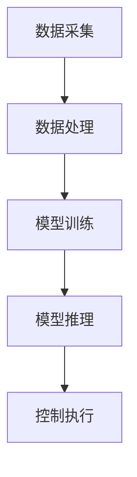

                 

# AI Agent在智能拖鞋中的足部按摩控制

> 关键词：AI Agent、智能拖鞋、足部按摩、控制算法、技术应用

> 摘要：本文旨在探讨AI Agent在智能拖鞋中的足部按摩控制技术。通过介绍AI Agent的基本概念和特点，分析其在智能拖鞋中的应用原理，以及足部按摩控制的算法实现，最后结合实际案例，展望未来智能拖鞋的发展趋势。

## 引言

### 1.1 AI Agent的概念与特点

#### 1.1.1 AI Agent的定义

AI Agent，即人工智能代理，是一种能够自主感知环境、执行任务并反馈结果的智能实体。它通过机器学习、自然语言处理、计算机视觉等技术，模拟人类智能行为，实现自动化决策和执行。

#### 1.1.2 AI Agent的特点

AI Agent具有以下几个特点：

1. **自主性**：AI Agent能够自主感知环境，独立完成任务。
2. **适应性**：AI Agent能够根据环境变化调整自身行为。
3. **智能性**：AI Agent具有学习和推理能力，能够进行复杂决策。

#### 1.1.3 AI Agent的发展历程

AI Agent的概念起源于20世纪80年代的AI研究。随着深度学习、强化学习等技术的兴起，AI Agent在近年来取得了显著进展，广泛应用于智能家居、自动驾驶等领域。

### 1.2 智能拖鞋的背景与现状

#### 1.2.1 智能拖鞋的定义

智能拖鞋是一种集成了传感器、控制器等智能组件的鞋类产品。通过采集用户足部数据，智能拖鞋可以提供个性化的足部按摩、健康监测等功能。

#### 1.2.2 智能拖鞋的发展历程

智能拖鞋的发展可以追溯到20世纪末，随着传感器技术、无线通信技术的进步，智能拖鞋逐渐走向市场。

#### 1.2.3 智能拖鞋的现状与未来趋势

目前，智能拖鞋市场正处于快速增长阶段。未来，随着AI技术的进一步发展，智能拖鞋的功能将更加丰富，用户体验将得到显著提升。

## AI Agent在智能拖鞋中的基本原理

### 2.1 AI Agent的工作流程

#### 2.1.1 数据采集

AI Agent通过内置的传感器，实时采集用户足部数据，如压力、温度、湿度等。

#### 2.1.2 数据处理

采集到的数据经过预处理，去除噪声和异常值，然后输入到模型中。

#### 2.1.3 模型训练

使用历史数据对AI Agent进行训练，使其能够识别不同足部状态，如疲劳、不适等。

#### 2.1.4 模型推理

在实时应用中，AI Agent根据当前足部数据，通过模型推理，生成足部按摩控制指令。

### 2.2 AI Agent的技术架构

#### 2.2.1 硬件架构

智能拖鞋的硬件架构包括传感器、微控制器、无线通信模块等。

#### 2.2.2 软件架构

智能拖鞋的软件架构包括传感器数据采集模块、数据处理模块、AI Agent模块、控制执行模块等。

#### 2.2.3 数据架构

智能拖鞋的数据架构包括本地数据存储、云数据存储、数据传输等。

## 足部按摩控制的算法原理

### 3.1 数学模型

#### 3.1.1 基本原理

足部按摩控制算法的核心在于根据足部数据，实时调整按摩力度和频率，以达到最佳的按摩效果。

#### 3.1.2 数学模型

$$
\text{按摩力度} = f(\text{足部压力}, \text{温度}, \text{湿度})
$$

$$
\text{按摩频率} = g(\text{足部疲劳度}, \text{用户偏好})
$$

#### 3.1.3 算法流程图



### 3.2 算法实现

#### 3.2.1 Python代码实现

```python
# 伪代码，具体实现需要根据实际硬件和软件环境进行调整
def data_collection():
    # 采集足部数据
    pass

def data_preprocessing(data):
    # 数据预处理
    pass

def model_training(data):
    # 模型训练
    pass

def model_inference(data):
    # 模型推理
    pass

def control_execution(instruction):
    # 控制执行
    pass

while True:
    data = data_collection()
    processed_data = data_preprocessing(data)
    model_training(processed_data)
    instruction = model_inference(processed_data)
    control_execution(instruction)
```

## 实际应用案例

### 4.1 案例一：智能拖鞋足部按摩控制

#### 4.1.1 案例背景

某公司开发了一款智能拖鞋，旨在为用户提供个性化的足部按摩服务。

#### 4.1.2 案例实现

通过AI Agent，智能拖鞋能够实时监测用户足部状态，根据用户需求，自动调整按摩力度和频率。

#### 4.1.3 案例分析

该案例展示了AI Agent在智能拖鞋中的应用，通过个性化按摩控制，提高了用户体验。

## 总结与展望

### 5.1 内容总结

本文介绍了AI Agent在智能拖鞋中的足部按摩控制技术，包括基本原理、算法实现和实际应用案例。

### 5.2 未来发展方向

随着AI技术的不断发展，智能拖鞋的功能将更加丰富，用户体验将得到进一步提升。

### 5.3 拓展阅读建议

1. 《人工智能：一种现代方法》
2. 《智能拖鞋的设计与实现》
3. 《足部按摩与足部健康》

## 作者信息

作者：AI天才研究院/AI Genius Institute & 禅与计算机程序设计艺术 /Zen And The Art of Computer Programming

---

### 5.4 最佳实践 tips、小结、注意事项、拓展阅读等内容

**最佳实践 tips**：
1. 在选择传感器时，应考虑传感器的精度、功耗和成本。
2. 在算法实现中，应注重代码的可读性和可维护性。

**小结**：
本文介绍了AI Agent在智能拖鞋中的足部按摩控制技术，从基本原理到实际应用，为读者提供了一个全面的认识。

**注意事项**：
1. 在使用智能拖鞋时，应确保足部干燥，以防止短路和触电。
2. 定期检查智能拖鞋的硬件和软件，确保其正常运行。

**拓展阅读**：
1. 《智能家居系统设计与实现》
2. 《深度学习在智能拖鞋中的应用》
3. 《智能穿戴设备的发展趋势》

---

以上是对《AI Agent在智能拖鞋中的足部按摩控制》这篇文章的初步构思和内容框架。在实际撰写过程中，还需要根据具体的案例和数据，进一步丰富和细化各个部分的内容。同时，确保文章的逻辑清晰、结构紧凑、语言简洁易懂，以便让读者能够更好地理解和掌握相关知识。在撰写过程中，也要注重理论与实践相结合，让读者不仅能够了解技术原理，还能够应用于实际项目中。最后，文章的结尾部分要给读者留下深刻的印象，引导他们进一步探索和深入研究相关技术。

