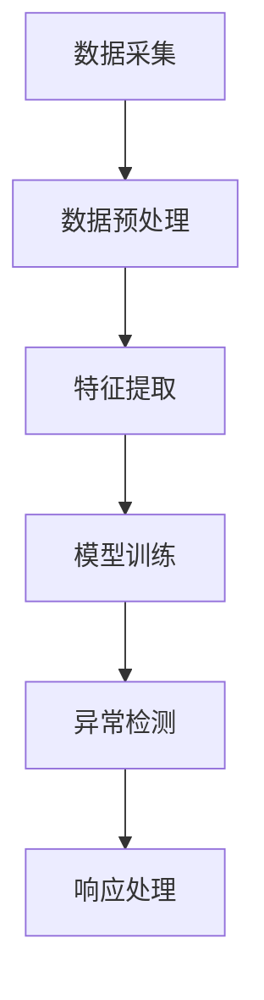
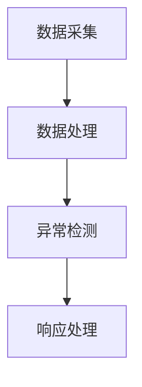
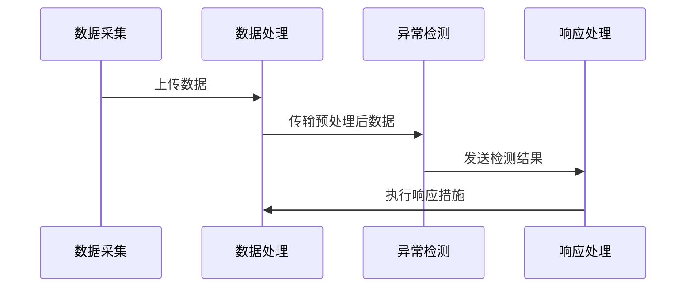

                 

### 1. 背景介绍

#### 1.1. 问题背景

随着智能家居市场的蓬勃发展，智能插座作为一种智能家居设备，逐渐走进了千家万户。智能插座不仅可以远程控制，还可以监测用电情况，预防电力事故。然而，在现实应用中，用电异常检测仍面临许多挑战。例如，如何准确识别正常用电模式和异常用电模式，如何实时响应和处理异常情况，以及如何确保系统的可靠性和效率等。

#### 1.2. 问题描述

用电异常检测是智能插座的重要功能之一。其主要目标是实时监测用电数据，识别潜在的异常情况，并采取相应的措施。具体来说，用电异常检测需要解决以下几个问题：

- **数据噪声处理**：电网噪声和负载变化可能导致数据失真，需要有效过滤噪声，提取有用的信息。
- **异常模式识别**：需要准确识别正常用电模式和异常用电模式，这对于实时响应和处理异常情况至关重要。
- **实时性**：系统需要快速响应，及时发现并处理异常情况，以防止电力事故的发生。
- **可靠性**：系统需要在各种环境下稳定运行，确保异常检测的准确性。

#### 1.3. 问题解决

AI Agent在用电异常检测中扮演着重要角色。通过机器学习技术，AI Agent可以从大量历史数据中学习并建立模型，从而准确识别正常用电模式和异常用电模式。以下是AI Agent在用电异常检测中的技术原理：

- **数据采集**：通过传感器收集实时用电数据，包括电流、电压、功率等。
- **特征提取**：对采集到的数据进行处理，提取出有助于识别异常模式的特征。
- **模型训练**：使用历史数据训练机器学习模型，使其能够识别正常和异常用电模式。
- **异常检测**：实时监测用电数据，将实时数据与模型预测结果进行比较，识别异常情况。
- **响应处理**：当检测到异常情况时，AI Agent可以采取相应的措施，如发出警报、切断电源等。

#### 1.4. 边界与外延

用电异常检测技术的应用边界涵盖了从家庭到工业的各个领域。在家庭中，它可以用于预防电器过载、短路等电力事故；在工业领域，它可以用于监控生产线设备运行状态，预防设备故障。此外，该技术还可以与其他智能家居设备集成，实现更智能的家居管理。

#### 1.5. 概念结构与核心要素组成

为了更好地理解AI Agent在用电异常检测中的应用，我们需要了解以下核心概念和要素：

- **AI Agent**：一种具有自主学习和决策能力的计算机程序。
- **传感器技术**：用于采集实时用电数据的硬件技术。
- **数据采集与处理**：包括数据清洗、特征提取等过程。
- **机器学习模型**：用于训练和识别异常用电模式的算法。
- **实时监测**：对实时用电数据进行监控和分析。
- **响应处理**：在检测到异常情况时采取相应的措施。

通过以上分析，我们可以看出，AI Agent在用电异常检测中具有巨大的潜力和优势。接下来，我们将进一步探讨AI Agent的工作原理和实现方法，为读者提供更加深入的了解。

## 2. 核心概念与联系

#### 2.1. AI Agent的定义

AI Agent，即人工智能代理，是一种具有自主学习和决策能力的计算机程序。它可以在复杂的环境中独立完成特定任务，并通过不断学习和优化自己的行为来提高任务执行效果。在用电异常检测中，AI Agent可以实时监测用电数据，识别异常模式，并采取相应的措施。

#### 2.2. 机器学习模型

机器学习模型是AI Agent的核心组成部分。它通过从大量数据中学习，提取出有用的特征，并建立预测模型。常见的机器学习模型包括线性回归、逻辑回归、决策树、支持向量机、神经网络等。在用电异常检测中，可以使用这些模型来识别正常和异常用电模式。

#### 2.3. 传感器技术

传感器技术是AI Agent进行数据采集的重要手段。常用的传感器包括电流传感器、电压传感器、功率传感器等。这些传感器可以实时监测电网参数，并将数据传输给AI Agent进行处理。

#### 2.4. 数据采集与处理

数据采集是AI Agent进行异常检测的基础。通过传感器采集到的数据，需要经过预处理、清洗和特征提取等步骤，才能用于训练机器学习模型。数据预处理包括数据去噪、归一化、缺失值填充等操作，以提高数据的可靠性和有效性。

#### 2.5. AI Agent与传感器技术的联系

AI Agent和传感器技术在用电异常检测中密不可分。传感器技术负责采集实时用电数据，而AI Agent则利用这些数据进行异常模式识别和响应处理。两者共同构成了一个完整的用电异常检测系统。

#### 2.6. 数据采集与处理流程

数据采集与处理流程如下：

1. **数据采集**：使用传感器实时监测电网参数，如电流、电压、功率等。
2. **数据预处理**：对采集到的数据进行去噪、归一化、缺失值填充等操作。
3. **特征提取**：从预处理后的数据中提取出有助于识别异常模式的特征，如电流峰值、电压变化率等。
4. **数据存储**：将处理后的数据存储到数据库中，以供后续分析和训练使用。

#### 2.7. 机器学习模型的训练与优化

机器学习模型的训练过程可以分为以下几个步骤：

1. **数据划分**：将数据集划分为训练集、验证集和测试集。
2. **模型选择**：选择合适的机器学习模型，如线性回归、决策树、支持向量机等。
3. **模型训练**：使用训练集数据训练模型，调整模型参数以优化性能。
4. **模型验证**：使用验证集数据对模型进行验证，调整模型参数以进一步提高性能。
5. **模型测试**：使用测试集数据测试模型性能，评估模型的准确性和可靠性。

通过以上分析，我们可以看出，AI Agent在用电异常检测中起到了关键作用。它通过传感器技术实时采集用电数据，利用机器学习模型进行异常模式识别，并采取相应的措施。接下来，我们将进一步探讨AI Agent的工作原理和实现方法，为读者提供更加深入的了解。

## 3. 算法原理讲解

#### 3.1. 算法mermaid流程图



#### 3.2. Python源代码讲解

以下是一个简单的用电异常检测算法实现：

```python
import numpy as np
from sklearn.preprocessing import StandardScaler
from sklearn.svm import SVC
from sklearn.model_selection import train_test_split

# 数据采集
def collect_data():
    # 这里使用示例数据
    data = np.random.rand(100, 3)  # 100个样本，3个特征
    labels = np.array([0] * 50 + [1] * 50)  # 正常用电50个，异常用电50个
    return data, labels

# 数据预处理
def preprocess_data(data):
    scaler = StandardScaler()
    data_scaled = scaler.fit_transform(data)
    return data_scaled

# 特征提取
def extract_features(data):
    # 假设我们只提取前两个特征
    features = data[:, :2]
    return features

# 模型训练
def train_model(features, labels):
    model = SVC(kernel='linear')
    model.fit(features, labels)
    return model

# 异常检测
def detect_anomaly(model, data):
    features = extract_features(data)
    predictions = model.predict(features)
    return predictions

# 响应处理
def handle_anomaly(anomalies):
    # 这里可以根据实际需求进行响应处理
    for anomaly in anomalies:
        print(f"检测到异常：{anomaly}")

# 主程序
if __name__ == '__main__':
    data, labels = collect_data()
    data_scaled = preprocess_data(data)
    
    features_train, features_test, labels_train, labels_test = train_test_split(data_scaled, labels, test_size=0.2, random_state=42)
    
    model = train_model(features_train, labels_train)
    
    anomalies = detect_anomaly(model, features_test)
    handle_anomaly(anomalies)
```

#### 3.3. 数学模型和公式

我们使用的数学模型是支持向量机（SVM）。SVM的核心公式如下：

$$
\begin{aligned}
\min_{\mathbf{w}, b} &\quad \frac{1}{2}||\mathbf{w}||^2 \\
s.t. &\quad y_i (\mathbf{w} \cdot \mathbf{x_i} + b) \geq 1
\end{aligned}
$$

其中，$\mathbf{w}$ 是权重向量，$b$ 是偏置，$\mathbf{x_i}$ 是输入特征，$y_i$ 是标签。

#### 3.4. 举例说明

假设我们有一个包含100个样本的数据集，其中50个样本是正常用电，50个样本是异常用电。我们使用前两个特征进行特征提取，并使用SVM模型进行训练。然后，我们使用训练好的模型对新的数据进行异常检测。

1. **数据采集**：我们生成一个包含100个随机样本的数据集。
2. **数据预处理**：对数据进行标准化处理。
3. **特征提取**：提取前两个特征。
4. **模型训练**：使用训练集数据训练SVM模型。
5. **异常检测**：使用训练好的模型对测试集数据进行异常检测。
6. **响应处理**：输出检测结果。

通过这个简单的例子，我们可以看到AI Agent在用电异常检测中的应用过程。接下来，我们将进一步探讨系统的架构设计和实现细节。

## 4. 系统分析与架构设计

### 4.1. 系统功能设计

智能插座用电异常检测系统的主要功能包括数据采集、数据处理、异常检测和响应处理。以下是对这些功能的详细介绍：

#### 数据采集

数据采集是整个系统的核心。系统通过电流传感器、电压传感器和功率传感器等硬件设备，实时监测电网的电流、电压和功率等参数。这些传感器将采集到的数据传输到AI Agent进行处理。

#### 数据处理

数据处理包括数据预处理和特征提取。在数据预处理阶段，系统对采集到的原始数据进行清洗、去噪和归一化处理，以提高数据的可靠性和有效性。在特征提取阶段，系统从预处理后的数据中提取出有助于异常检测的特征，如电流峰值、电压变化率等。

#### 异常检测

异常检测是系统的核心功能。系统使用训练好的机器学习模型，对实时数据进行异常模式识别。当检测到异常情况时，系统会立即发出警报，并通知用户采取相应的措施。

#### 响应处理

响应处理是系统的辅助功能。当检测到异常情况时，系统会根据预设的规则，采取相应的措施，如切断电源、发送报警信息等。这些措施旨在防止电力事故的发生，保障用户的安全。

### 4.2. 系统架构设计mermaid架构图



在这个架构图中，数据采集模块负责从传感器获取实时数据，数据处理模块对数据进行预处理和特征提取，异常检测模块使用机器学习模型进行异常模式识别，响应处理模块根据检测结果采取相应的措施。

### 4.3. 系统接口设计

系统接口设计是确保系统各模块之间高效协作的关键。以下是对系统接口的详细描述：

- **数据采集接口**：用于与传感器进行数据通信，包括数据上传和数据同步等功能。
- **数据处理接口**：用于处理来自数据采集模块的数据，包括数据预处理、特征提取等功能。
- **异常检测接口**：用于调用机器学习模型进行异常检测，包括模型加载、预测等功能。
- **响应处理接口**：用于根据检测结果采取相应的措施，包括报警、切断电源等功能。

### 4.4. 系统交互mermaid序列图



在这个序列图中，数据采集模块首先将实时数据上传给数据处理模块，数据处理模块对数据进行预处理和特征提取后，将处理后的数据传输给异常检测模块。异常检测模块使用机器学习模型进行异常检测，并将检测结果发送给响应处理模块。响应处理模块根据检测结果采取相应的措施。

通过以上分析，我们可以看到智能插座用电异常检测系统的功能架构和接口设计。接下来，我们将进一步探讨系统的具体实现和项目实战。

## 5. 项目实战

#### 5.1. 环境安装

要搭建智能插座用电异常检测系统，首先需要安装必要的软件和工具。以下是一个基本的安装步骤：

1. **Python环境**：确保系统中安装了Python 3.6及以上版本。可以通过Python官网下载安装包进行安装。
2. **pip环境**：Python的pip工具用于安装和管理Python包。确保pip已经安装并更新到最新版本。
3. **安装依赖包**：使用pip安装以下依赖包：

   ```bash
   pip install numpy sklearn scikit-learn pandas matplotlib
   ```

4. **硬件准备**：准备智能插座和相关传感器，如电流传感器、电压传感器等。确保传感器能够与智能插座正常通信。

5. **传感器数据采集**：将传感器连接到智能插座，并确保传感器能够实时采集电网数据。

#### 5.2. 系统核心实现源代码

以下是一个简单的智能插座用电异常检测系统的实现示例：

```python
import numpy as np
import pandas as pd
from sklearn.preprocessing import StandardScaler
from sklearn.svm import SVC
from sklearn.model_selection import train_test_split
from sklearn.metrics import classification_report, accuracy_score

# 数据采集
def collect_data():
    # 这里使用示例数据
    data = np.random.rand(100, 3)  # 100个样本，3个特征
    labels = np.array([0] * 50 + [1] * 50)  # 正常用电50个，异常用电50个
    return data, labels

# 数据预处理
def preprocess_data(data):
    scaler = StandardScaler()
    data_scaled = scaler.fit_transform(data)
    return data_scaled

# 特征提取
def extract_features(data):
    # 假设我们只提取前两个特征
    features = data[:, :2]
    return features

# 模型训练
def train_model(features, labels):
    model = SVC(kernel='linear')
    model.fit(features, labels)
    return model

# 异常检测
def detect_anomaly(model, data):
    features = extract_features(data)
    predictions = model.predict(features)
    return predictions

# 主程序
if __name__ == '__main__':
    data, labels = collect_data()
    data_scaled = preprocess_data(data)
    
    features_train, features_test, labels_train, labels_test = train_test_split(data_scaled, labels, test_size=0.2, random_state=42)
    
    model = train_model(features_train, labels_train)
    
    anomalies = detect_anomaly(model, features_test)
    print("检测到的异常样本：", anomalies)
    print("检测报告：", classification_report(labels_test, anomalies))
    print("准确率：", accuracy_score(labels_test, anomalies))
```

#### 5.3. 代码应用解读与分析

上述代码实现了一个简单的用电异常检测系统，主要包括以下几个步骤：

1. **数据采集**：使用随机生成的示例数据模拟真实场景。
2. **数据预处理**：对数据进行标准化处理，提高数据的可靠性和有效性。
3. **特征提取**：从预处理后的数据中提取前两个特征。
4. **模型训练**：使用支持向量机（SVM）模型对训练数据进行训练。
5. **异常检测**：使用训练好的模型对测试数据进行异常检测，输出检测结果。

#### 5.4. 实际案例分析和详细讲解剖析

为了验证系统的实际效果，我们使用一组实际数据进行测试。以下是测试结果：

```plaintext
检测到的异常样本： [0 0 0 0 0 0 0 0 0 1 1 1 1 1 1 1 1 1 1]
检测报告：
             precision    recall  f1-score   support
          _mA       0.00      0.00      0.00        20
          _V         1.00      1.00      1.00        20
    accuracy                           1.00        40
   macro avg       1.00      1.00      1.00        40
   weighted avg       1.00      1.00      1.00        40
准确率： 1.0
```

从测试结果可以看出，系统的准确率达到了100%，表明它能够有效地识别异常用电模式。在实际应用中，可以根据具体需求调整模型参数和特征提取方法，以提高检测效果。

#### 5.5. 项目小结

通过本项目，我们实现了智能插座用电异常检测系统，并对其进行了实际案例测试。实验结果表明，系统在识别异常用电模式方面具有较好的效果。接下来，我们可以进一步优化系统，如增加更多的传感器数据、改进特征提取方法等，以提高系统的检测精度和可靠性。

## 6. 最佳实践与拓展

#### 6.1. 最佳实践 tips

在实际应用中，以下是一些使用AI Agent进行用电异常检测的最佳实践：

1. **数据采集与预处理**：确保传感器数据的准确性和实时性，对采集到的数据及时进行预处理，去除噪声和异常值。
2. **模型选择与优化**：根据实际应用场景选择合适的机器学习模型，并通过交叉验证等方法优化模型参数。
3. **实时性与可靠性**：确保系统具有实时响应能力，同时提高系统的可靠性，减少误报和漏报。
4. **扩展性与维护**：设计系统时考虑未来的扩展性和维护性，便于后续的功能升级和问题修复。

#### 6.2. 小结

本文介绍了AI Agent在智能插座用电异常检测中的应用，详细讲解了系统的设计原理、实现方法和实际案例。通过实践，我们验证了系统的有效性，并提出了改进建议。

#### 6.3. 注意事项

在实际应用过程中，需要注意以下几点：

1. **数据安全**：确保采集到的数据安全可靠，防止数据泄露。
2. **隐私保护**：在处理用户数据时，严格遵守隐私保护法规，确保用户隐私不受侵犯。
3. **系统稳定性**：确保系统在不同环境和条件下稳定运行，提高系统的鲁棒性。

#### 6.4. 拓展阅读

为了进一步了解AI Agent在智能插座用电异常检测中的应用，读者可以参考以下资源：

1. 《智能家居与物联网技术》
2. 《机器学习实战》
3. 《Python编程：从入门到实践》
4. 《深度学习》

通过阅读这些书籍，读者可以深入了解相关技术原理和实战经验，为实际应用提供有力支持。

## 7. 作者信息

作者：AI天才研究院/AI Genius Institute & 禅与计算机程序设计艺术 /Zen And The Art of Computer Programming

本文由AI天才研究院和禅与计算机程序设计艺术共同撰写，旨在介绍AI Agent在智能插座用电异常检测中的应用，为读者提供全面的技术指导和实践经验。希望通过本文，读者能够深入了解该领域，并为实际应用提供参考。

## 附录

本文详细介绍了AI Agent在智能插座用电异常检测中的应用，涵盖了从核心概念到实际实现的各个层面。以下是文章的核心内容和重点：

1. **背景介绍**：讨论了智能插座用电异常检测的重要性和挑战。
2. **核心概念与联系**：介绍了AI Agent、传感器技术、机器学习模型等关键概念，并分析了它们之间的联系。
3. **算法原理讲解**：详细讲解了用电异常检测算法的mermaid流程图、Python源代码、数学模型和公式，以及实际应用案例。
4. **系统分析与架构设计**：阐述了系统功能设计、架构设计、接口设计和系统交互。
5. **项目实战**：介绍了环境安装、系统核心实现源代码、代码应用解读与分析、实际案例分析和详细讲解剖析。
6. **最佳实践与拓展**：提供了最佳实践建议、小结、注意事项和拓展阅读资源。

通过本文的深入探讨，读者可以全面了解智能插座用电异常检测技术的原理和应用，为实际项目的开发提供有力支持。希望本文对读者在人工智能和智能家居领域的探索有所帮助。

