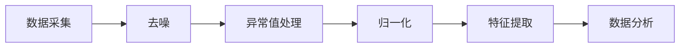
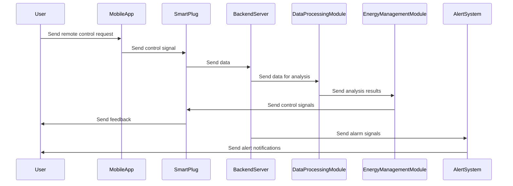
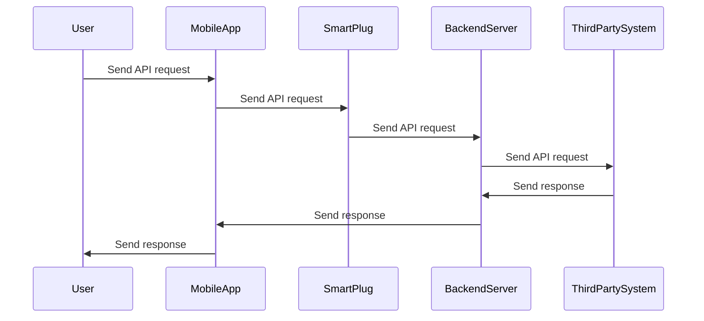

                 


### AI Agent在智能插座中的能源使用优化

#### 关键词
- AI Agent
- 智能插座
- 能源使用优化
- 智能家居
- 机器学习

#### 摘要
本文探讨了AI Agent在智能插座中实现能源使用优化的问题。通过介绍AI Agent的基本原理和智能插座的功能，我们分析了AI Agent在智能家居环境中的关键角色，包括监控与数据分析、能量管理策略和用户行为预测与适应。随后，我们深入探讨了AI Agent的核心算法原理，包括监控与数据分析、能量管理和用户行为预测算法，并通过Python代码实现进行了详细讲解。最后，本文描述了一个完整的智能插座系统架构，并展示了如何通过AI Agent实现能源使用优化。通过本文的讨论，我们希望为智能家居领域的研究者提供有价值的参考。

#### 目录大纲设计

##### 第一部分：背景介绍与核心概念

**第1章：AI与智能插座概述**

**1.1 问题背景**

**1.1.1 人工智能发展现状**

**1.1.2 智能插座在智能家居中的应用**

**1.1.3 能源使用优化的需求与挑战**

**1.2 核心概念**

**1.2.1 AI Agent定义与特征**

**1.2.2 智能插座功能与架构**

**1.2.3 能源使用优化相关概念**

**1.3 AI Agent在智能插座中的关键角色**

**1.3.1 监控与数据分析**

**1.3.2 能量管理策略**

**1.3.3 用户行为预测与适应**

##### 第二部分：核心概念与联系

**第2章：AI Agent原理与特征**

**2.1 AI Agent基本原理**

**2.1.1 智能代理基础**

**2.1.2 机器学习与深度学习在AI Agent中的应用**

**2.2 AI Agent属性特征对比**

**2.2.1 通用与专用Agent对比**

**2.2.2 强化学习与监督学习的Agent对比**

**2.3 AI Agent的ER实体关系图**

**2.3.1 实体定义**

**2.3.2 关系定义**

**2.3.3 Mermaid ER图展示**

##### 第三部分：算法原理与数学模型

**第3章：AI Agent算法原理**

**3.1 监控与数据分析算法**

**3.1.1 数据采集与预处理**

**3.1.2 数据分析与特征提取**

**3.1.3 Mermaid流程图展示**

**3.2 能量管理算法**

**3.2.1 算法原理与模型**

**3.2.1.1 数学模型与公式**

**3.2.1.2 算法流程**

**3.2.2 Python代码实现**

**3.2.3 举例说明**

**3.3 用户行为预测算法**

**3.3.1 算法原理与模型**

**3.3.1.1 数学模型与公式**

**3.3.1.2 算法流程**

**3.3.2 Python代码实现**

**3.3.3 举例说明**

##### 第四部分：系统分析与架构设计

**第4章：智能插座系统架构**

**4.1 系统功能设计**

**4.1.1 领域模型分析**

**4.1.2 Mermaid类图展示**

**4.2 系统架构设计**

**4.2.1 架构设计原则**

**4.2.2 Mermaid架构图展示**

**4.3 系统接口设计**

**4.3.1 接口功能与规范**

**4.3.2 Mermaid序列图展示**

##### 第五部分：项目实战

**第5章：AI Agent项目实战**

**5.1 环境安装与配置**

**5.1.1 硬件需求**

**5.1.2 软件依赖安装**

**5.2 系统核心实现源代码**

**5.2.1 源代码结构与功能**

**5.2.2 代码应用解读与分析**

**5.3 实际案例分析与讲解**

**5.3.1 案例背景**

**5.3.2 案例分析与讲解**

**5.4 项目小结**

**5.4.1 项目成果总结**

**5.4.2 项目经验与启示**

##### 第六部分：最佳实践与拓展

**第6章：最佳实践与注意事项**

**6.1 最佳实践技巧**

**6.1.1 AI Agent调优技巧**

**6.1.2 数据安全与隐私保护**

**6.2 小结与展望**

**6.2.1 主要内容回顾**

**6.2.2 未来发展趋势与展望**

---

接下来，我们将逐步展开对文章各部分的详细撰写。首先，从背景介绍与核心概念部分开始，逐步深入探讨AI Agent在智能插座中能源使用优化的问题。每个章节都将遵循“背景介绍-核心概念-实例分析”的结构，以确保内容的逻辑清晰和易于理解。

#### 第一部分：背景介绍与核心概念

##### 第1章：AI与智能插座概述

##### 1.1 问题背景

##### 1.1.1 人工智能发展现状

人工智能（AI）作为计算机科学的一个重要分支，近年来取得了飞速发展。随着深度学习、神经网络、强化学习等算法的突破，AI已经广泛应用于语音识别、图像处理、自然语言处理、自动驾驶、医疗诊断等多个领域。根据市场研究公司IDC的报告，全球AI市场规模预计将在2025年达到530亿美元，展现出巨大的市场潜力。

在智能家居领域，AI的应用逐渐成为趋势。智能家居系统通过将家庭中的各种设备连接到互联网，使用户能够远程控制和管理家庭环境。智能插座作为智能家居的一个重要组成部分，能够实现家电设备的远程开关、定时控制等功能，为用户提供便利的同时，也在很大程度上提高了家庭能源的利用效率。

##### 1.1.2 智能插座在智能家居中的应用

智能插座是一种连接家庭电网和家电设备的接口设备，它可以通过Wi-Fi、蓝牙等无线通信技术，将家电设备的运行状态传输到云端，从而实现远程监控和控制。智能插座在智能家居中的应用主要体现在以下几个方面：

1. **远程控制**：用户可以通过智能手机或平板电脑，远程控制智能插座，从而开关家中的电器设备，比如电视、空调、照明等。
   
2. **定时设置**：用户可以预先设置智能插座的定时开关功能，比如在早晨自动开启咖啡机，或者在晚上自动关闭家中的电器，提高生活效率。

3. **节能管理**：智能插座能够实时监测家电的能耗情况，并根据用户的使用习惯，自动调整电器的工作状态，从而实现能源的优化管理。

4. **安全监控**：智能插座还可以监测电器的运行状态，一旦发现异常（如电器过热、电流过大等），能够立即通知用户并采取相应措施，确保家庭用电安全。

##### 1.1.3 能源使用优化的需求与挑战

随着全球能源消耗的持续增长，能源使用优化已经成为一个迫切需要解决的问题。尤其是在家庭用电方面，很多家庭没有采取有效的节能措施，导致能源浪费严重。据统计，家庭用电占全球总能耗的约20%，其中相当一部分能源被浪费在无效用电上。

智能插座通过实现家电设备的智能控制和实时监测，能够在一定程度上优化家庭能源的使用。然而，要实现真正的能源使用优化，仍然面临着以下挑战：

1. **数据收集与处理**：智能插座需要收集大量的用电数据，这些数据包括电流、电压、功率等。如何高效地收集、存储和处理这些数据，是一个重要的技术难题。

2. **算法优化**：能源使用优化需要借助AI算法，通过分析用户的行为模式，预测用户的用电需求，并自动调整电器的工作状态。这要求AI算法具有高准确性和实时性。

3. **用户体验**：用户对智能家居产品的接受程度直接影响其应用效果。如何设计出用户友好、易于操作的系统界面，提供个性化的节能方案，是提高用户满意度的重要方面。

4. **设备兼容性**：智能插座需要与各种不同品牌的家电设备兼容，实现统一的控制和数据交换。这要求智能插座具备良好的开放性和扩展性。

综上所述，AI Agent在智能插座中实现能源使用优化具有巨大的潜力，但同时也面临着一系列的技术挑战。接下来，我们将进一步探讨AI Agent的定义、特征以及在智能插座中的应用。

##### 1.2 核心概念

##### 1.2.1 AI Agent定义与特征

AI Agent，即人工智能代理，是一种能够自主执行任务、与环境互动并不断学习和优化的智能体。在智能家居领域，AI Agent可以看作是一个智能控制中心，它通过分析用户行为和家电设备的运行状态，实现家电设备的智能控制和优化。

AI Agent的主要特征包括：

1. **自主性**：AI Agent能够根据预设的规则或学习到的知识，自主地执行任务，而不需要人工干预。

2. **适应性**：AI Agent能够根据环境变化和用户需求的变化，调整其行为策略，实现动态优化。

3. **学习性**：AI Agent具备自我学习能力，可以通过机器学习和深度学习算法，从数据中提取有用信息，不断优化其行为。

4. **交互性**：AI Agent能够与用户进行交互，理解用户的指令和偏好，提供个性化的服务。

在智能插座中，AI Agent的具体作用如下：

- **数据分析**：AI Agent可以实时收集智能插座和家电设备的用电数据，通过数据分析，了解家电的使用情况和用户的用电习惯。
  
- **能量管理**：基于数据分析的结果，AI Agent可以自动调整家电的工作状态，优化能源使用，实现节能。

- **行为预测**：AI Agent可以通过学习用户的用电行为，预测未来的用电需求，提前做好设备调整，提高用电效率。

- **用户交互**：AI Agent可以与用户进行交互，提供用电报告、节能建议等，帮助用户更好地管理家庭用电。

##### 1.2.2 智能插座功能与架构

智能插座作为智能家居系统的一个关键组件，其功能主要包括以下几个方面：

1. **远程控制**：用户可以通过手机APP远程控制智能插座，开关家中的电器设备，实现智能化的家居管理。

2. **定时设置**：用户可以设置智能插座的定时开关功能，实现家电的自动化管理，提高生活效率。

3. **能耗监测**：智能插座能够实时监测用电设备的能耗情况，提供详细的能耗数据，帮助用户了解家庭用电情况。

4. **安全监控**：智能插座具备过载保护、电流异常检测等功能，确保家庭用电安全。

智能插座的架构设计主要包括以下几个部分：

- **硬件层**：智能插座硬件主要包括插座本体、无线通信模块（如Wi-Fi、蓝牙等）和传感器（如电流传感器、温度传感器等）。

- **通信层**：智能插座通过无线通信模块与互联网连接，将用电数据传输到云端服务器。

- **数据处理层**：云端服务器对智能插座上传的数据进行存储、分析和处理，生成能耗报告和优化建议。

- **控制层**：通过用户界面，用户可以查看能耗数据、调整设备设置，并接收AI Agent的节能建议。

- **AI Agent层**：AI Agent位于数据处理层之上，负责数据分析、行为预测和能量管理，实现智能控制。

##### 1.2.3 能源使用优化相关概念

能源使用优化是指在满足用户需求的前提下，最大限度地减少能源消耗的过程。在智能家居领域，能源使用优化主要包括以下几个方面：

1. **智能控制**：通过智能插座和AI Agent，实现家电设备的自动化管理，根据用户的需求和用电习惯，自动调整设备的工作状态，提高能源利用效率。

2. **实时监测**：实时监测家电的能耗情况，及时发现能源浪费的问题，并采取相应措施进行优化。

3. **行为分析**：通过分析用户的用电行为，了解家电的使用情况，预测未来的用电需求，提前做好设备调整，实现能耗的精细化控制。

4. **节能策略**：根据能耗监测结果和用户行为分析，制定相应的节能策略，如自动关灯、关电器等，减少不必要的能源消耗。

##### 1.3 AI Agent在智能插座中的关键角色

在智能插座系统中，AI Agent扮演着至关重要的角色，其主要职责包括：

1. **监控与数据分析**：AI Agent能够实时监控智能插座的用电数据，如电流、电压、功率等，并对这些数据进行预处理、特征提取和数据分析，为后续的能源优化提供基础数据。

2. **能量管理策略**：基于数据分析的结果，AI Agent可以制定能量管理策略，自动调整家电设备的工作状态，实现能耗的最优化。

3. **用户行为预测与适应**：AI Agent可以通过学习用户的用电行为，预测未来的用电需求，并适应用户的需求变化，提供个性化的节能方案。

通过以上分析，我们可以看到，AI Agent在智能插座中不仅能够实现能源使用优化，还能够提高智能家居的智能化水平和用户体验。在下一章中，我们将进一步探讨AI Agent的基本原理和特征，以及如何将其应用于智能插座系统。

### AI Agent在智能插座中的关键角色

在前一章中，我们介绍了AI Agent的定义、特征以及在智能插座中的功能与架构。在本章中，我们将深入探讨AI Agent在智能插座系统中的关键角色，包括监控与数据分析、能量管理策略以及用户行为预测与适应。

#### 1.3.1 监控与数据分析

智能插座通过接入家庭电网，能够实时监测家电设备的用电情况。AI Agent作为智能插座的核心组件，负责对收集到的数据进行分析和处理，以实现对家庭能源使用的全面监控。

**数据采集与预处理**

首先，AI Agent会从智能插座接收电流、电压、功率等实时数据。这些数据经过预处理，包括去除噪声、填充缺失值和归一化等步骤，以保证数据的准确性和一致性。预处理后的数据将为后续的分析提供可靠的基础。

**数据分析与特征提取**

在预处理数据后，AI Agent会利用机器学习和深度学习算法，对数据进行深入分析。通过特征提取，AI Agent可以从数据中提取出反映家电使用情况的关键特征，如设备的开启时间、使用频率、能耗峰值等。

**数据可视化**

为了更好地理解和分析数据，AI Agent会生成数据可视化报告，包括能耗趋势图、设备使用情况图表等。这些可视化报告不仅可以帮助用户直观地了解家庭能源使用情况，还可以为AI Agent的后续决策提供依据。

#### 1.3.2 能量管理策略

基于对数据的分析，AI Agent能够制定能量管理策略，优化家庭能源使用。能量管理策略的核心目标是实现能源消耗的最小化，同时满足用户的用电需求。

**动态调整设备状态**

AI Agent可以根据用户的行为模式和家庭用电的实际情况，动态调整家电设备的工作状态。例如，在用户通常不在家的时候，AI Agent可以自动关闭不必要的电器，减少能耗。

**智能预约控制**

AI Agent还可以通过智能预约控制，根据用户的习惯和需求，提前规划家电设备的工作时间。例如，用户可以在早晨设定咖啡机自动开启，晚上设定空调自动关闭，从而实现节能。

**节能模式切换**

在高峰用电时段，AI Agent可以通过切换节能模式，限制高能耗电器的使用，确保电网的稳定运行。同时，AI Agent还可以在用电低谷期，鼓励用户使用高能耗电器，以充分利用电价优惠政策。

#### 1.3.3 用户行为预测与适应

用户行为预测是AI Agent的一项重要功能，通过分析历史数据，AI Agent可以预测用户未来的用电需求，并相应地调整能量管理策略。

**行为模式识别**

AI Agent会利用机器学习算法，对用户的用电行为进行模式识别。通过对大量历史数据的学习，AI Agent可以识别出用户的日常作息规律、家电使用习惯等，从而准确预测未来的用电需求。

**个性化节能方案**

基于用户行为预测，AI Agent可以生成个性化的节能方案。例如，对于经常晚上使用的电器，AI Agent可以在晚上提前启动这些设备，确保用户的使用需求。同时，AI Agent还可以根据用户的节能偏好，提供不同的节能策略，满足用户的个性化需求。

**自适应调整**

AI Agent会不断学习用户的用电行为，并根据新的数据调整能量管理策略。这种自适应调整能力使得AI Agent能够更好地适应用户的需求变化，提供持续优化的节能方案。

**实时反馈**

为了提高用户的使用体验，AI Agent会实时向用户反馈能源使用情况和建议。用户可以通过手机APP查看能耗报告、节能建议等，更好地了解自己的能源使用情况，并采取相应的措施进行节能。

通过以上分析，我们可以看到，AI Agent在智能插座系统中扮演着监控与数据分析、能量管理策略和用户行为预测与适应等多重关键角色。AI Agent不仅能够实现家庭能源使用的优化，还能够提高智能家居的智能化水平和用户体验。在下一章中，我们将进一步探讨AI Agent的基本原理和特征，以及如何将其应用于智能插座系统。

### AI Agent原理与特征

在了解了AI Agent在智能插座系统中的关键角色后，我们需要深入探讨AI Agent的基本原理和特征。这一章将分为三个部分：AI Agent的基本原理、AI Agent的属性特征对比，以及AI Agent的ER实体关系图。

#### 2.1 AI Agent基本原理

AI Agent，即人工智能代理，是一种模拟人类智能行为的计算机程序，能够自主地完成特定任务并与环境进行交互。AI Agent的核心原理基于人工智能技术，主要包括以下几个方面：

1. **智能代理基础**

   智能代理（Intelligent Agent）是指能够感知环境、制定策略并采取行动的实体。智能代理可以是一个计算机程序、机器人或者是一个人。在智能家居系统中，智能代理通常是计算机程序，它们通过传感器获取环境信息，根据预设的规则或学习到的知识，自主地执行任务。

2. **机器学习与深度学习在AI Agent中的应用**

   机器学习（Machine Learning）和深度学习（Deep Learning）是AI Agent的核心技术。机器学习是一种通过数据驱动的方式，让计算机自动从数据中学习规律和模式的技术。深度学习是机器学习的一种重要分支，它通过多层神经网络，对数据进行自动特征提取和建模。

   在AI Agent中，机器学习和深度学习技术主要用于以下几个方面：

   - **数据分析与特征提取**：AI Agent利用机器学习算法，对传感器收集的数据进行分析和特征提取，提取出反映家电使用情况和用户行为的关键特征。

   - **模式识别与预测**：通过深度学习算法，AI Agent可以识别用户的用电行为模式，预测未来的用电需求，并自动调整设备的工作状态。

   - **决策制定**：AI Agent利用学习到的模式和知识，制定能量管理策略，实现家庭能源使用的优化。

#### 2.2 AI Agent属性特征对比

AI Agent根据其应用场景和功能的不同，可以分为通用Agent和专用Agent。此外，根据学习方式的不同，AI Agent可以分为基于强化学习的Agent和基于监督学习的Agent。以下是对这些Agent的属性特征对比：

**通用与专用Agent对比**

- **通用Agent**：通用Agent是一种具有广泛适用性的智能体，能够处理多种类型的任务。通用Agent通常具有较好的通用性和灵活性，但可能需要更多的训练数据和计算资源。

  - **优点**：适用于多种场景，易于扩展。
  - **缺点**：训练成本高，适应性较差。

- **专用Agent**：专用Agent是为特定任务或场景设计的智能体，具有较高的任务完成效率。专用Agent通常具有较好的任务专一性，但适用性较窄。

  - **优点**：任务完成效率高，适应性较强。
  - **缺点**：适用性窄，灵活性较差。

**强化学习与监督学习Agent对比**

- **基于强化学习的Agent**：强化学习（Reinforcement Learning）是一种通过奖励机制和反馈信号，让智能体逐步学习和优化其行为的方法。

  - **优点**：适用于动态环境，能够通过试错学习复杂的策略。
  - **缺点**：学习过程可能较慢，需要大量的数据和计算资源。

- **基于监督学习的Agent**：监督学习（Supervised Learning）是一种通过已有数据和标签，训练模型进行预测和分类的方法。

  - **优点**：训练速度快，适用于静态环境。
  - **缺点**：对数据的质量和数量有较高要求，无法处理动态环境。

#### 2.3 AI Agent的ER实体关系图

为了更好地理解AI Agent的组成和功能，我们可以通过ER（Entity-Relationship）实体关系图来展示AI Agent的实体及其关系。

**2.3.1 实体定义**

在AI Agent的ER实体关系图中，主要实体包括：

- **传感器**：用于收集环境数据的设备，如温度传感器、湿度传感器、电流传感器等。
- **数据预处理模块**：负责对传感器数据进行预处理，如噪声过滤、数据归一化等。
- **特征提取模块**：从预处理后的数据中提取反映家电使用情况和用户行为的关键特征。
- **模型训练模块**：利用机器学习和深度学习算法，对特征进行训练和建模。
- **策略决策模块**：根据模型预测结果，制定能量管理策略。
- **执行模块**：将策略决策付诸实施，控制家电设备的工作状态。

**2.3.2 关系定义**

在ER实体关系图中，主要关系包括：

- **传感器与数据预处理模块**：传感器是数据预处理模块的数据源，数据预处理模块对传感器数据进行处理。
- **数据预处理模块与特征提取模块**：数据预处理模块将处理后的数据作为特征提取模块的输入。
- **特征提取模块与模型训练模块**：特征提取模块将提取的特征作为模型训练模块的输入。
- **模型训练模块与策略决策模块**：模型训练模块训练出的模型用于策略决策模块的预测和决策。
- **策略决策模块与执行模块**：策略决策模块生成的策略由执行模块实施。

**2.3.3 Mermaid ER图展示**

以下是AI Agent的ER实体关系图的Mermaid展示：

```mermaid
erDiagram
  Sensor ||--|>{DataPreprocessingModule}
  DataPreprocessingModule ||--|>{FeatureExtractionModule}
  FeatureExtractionModule ||--|>{ModelTrainingModule}
  ModelTrainingModule ||--|>{PolicyDecisionModule}
  PolicyDecisionModule ||--|>{ExecutionModule}
```

通过ER实体关系图，我们可以清晰地看到AI Agent的组成结构及其各部分之间的关系，这有助于我们更好地理解AI Agent的工作原理和功能。

综上所述，AI Agent在智能插座系统中扮演着关键角色，其基本原理和特征决定了其在智能家居领域的应用潜力。在下一章中，我们将进一步探讨AI Agent的算法原理，包括监控与数据分析算法、能量管理算法和用户行为预测算法。

### AI Agent算法原理

在了解了AI Agent的基本原理和特征后，我们需要进一步探讨AI Agent的具体算法原理。AI Agent的算法原理是其实现智能监控、能量管理和用户行为预测的核心。在这一部分，我们将详细讲解监控与数据分析算法、能量管理算法和用户行为预测算法。

#### 3.1 监控与数据分析算法

AI Agent的监控与数据分析算法是实现对家庭能源使用情况全面监控的基础。以下是其主要步骤：

**3.1.1 数据采集与预处理**

数据采集是AI Agent监控与数据分析的首要任务。智能插座通过接入家庭电网，实时收集电流、电压、功率等用电数据。采集的数据通常包含噪声和异常值，因此需要进行预处理。

**预处理步骤包括：**
- **去噪**：通过滤波等方法去除数据中的噪声。
- **异常值处理**：识别并处理异常值，如电流突然升高或降低等。
- **归一化**：将不同单位的数据归一化，使其在同一量级上进行比较。

**3.1.2 数据分析与特征提取**

预处理后的数据需要通过特征提取，提取出反映家电使用情况和用户行为的关键特征。这些特征包括：
- **设备使用频率**：统计家电设备的使用次数。
- **设备使用时长**：记录家电设备的使用时长。
- **能耗峰值**：记录家电设备在一段时间内的能耗最大值。
- **电流波动**：分析电流的波动情况，识别可能的异常使用情况。

**3.1.3 Mermaid流程图展示**

以下是监控与数据分析算法的Mermaid流程图展示：



#### 3.2 能量管理算法

能量管理算法是AI Agent的核心功能之一，旨在通过优化家电设备的工作状态，实现家庭能源的合理使用。以下是其主要步骤：

**3.2.1 算法原理与模型**

能量管理算法的原理是通过分析家电设备的能耗特征和用户行为，制定能量管理策略。主要步骤包括：

- **能耗模型建立**：建立家电设备的能耗模型，描述设备在不同工作状态下的能耗情况。
- **用户行为预测**：利用用户行为数据，预测用户的用电需求。
- **策略制定**：根据能耗模型和用户行为预测，制定能量管理策略，如调整设备的工作时间、工作强度等。

**3.2.2 Python代码实现**

以下是一个简单的能量管理算法的实现示例：

```python
import numpy as np

def energy_management(energy_model, user_behavior):
    """
    能量管理函数
    :param energy_model: 能耗模型
    :param user_behavior: 用户行为数据
    :return: 能量管理策略
    """
    # 预测用户未来一段时间内的用电需求
    predicted_demand = predict_user_demand(user_behavior)
    
    # 根据能耗模型和预测需求，制定能量管理策略
    strategy = {}
    for device, demand in predicted_demand.items():
        if demand > energy_model[device]['max_capacity']:
            strategy[device] = '低功率模式'
        else:
            strategy[device] = '正常模式'
    
    return strategy

# 假设的能耗模型和用户行为数据
energy_model = {
    '空调': {'max_capacity': 2000},
    '照明': {'max_capacity': 100}
}

user_behavior = {
    '空调': 1500,
    '照明': 50
}

# 能量管理策略
strategy = energy_management(energy_model, user_behavior)
print(strategy)
```

**3.2.3 举例说明**

假设一个用户在晚上通常使用空调和照明，但在凌晨时分会关闭空调。以下是一个具体的能量管理案例：

- **能耗模型**：空调的能耗最大值为2000瓦特，照明的能耗最大值为100瓦特。
- **用户行为数据**：晚上10点到凌晨2点，空调使用量为1500瓦特，照明使用量为50瓦特。

根据能量管理算法，AI Agent会预测用户在凌晨时分会关闭空调，因此会调整空调到低功率模式，以节约能源。

#### 3.3 用户行为预测算法

用户行为预测算法是AI Agent实现个性化服务的重要手段。以下是其主要步骤：

**3.3.1 算法原理与模型**

用户行为预测算法的原理是通过分析用户的历史行为数据，预测用户未来的行为。主要步骤包括：

- **数据收集与预处理**：收集用户的历史行为数据，如家电使用时间、使用频率等，并进行预处理。
- **特征提取**：从预处理后的数据中提取反映用户行为的关键特征。
- **模型训练**：利用特征数据，训练用户行为预测模型。
- **预测与优化**：利用训练好的模型，预测用户未来的行为，并根据预测结果调整能量管理策略。

**3.3.2 Python代码实现**

以下是一个简单的用户行为预测算法的实现示例：

```python
from sklearn.ensemble import RandomForestClassifier
import pandas as pd

def train_predict_model(data, target):
    """
    训练用户行为预测模型
    :param data: 用户行为数据
    :param target: 目标行为
    :return: 训练好的预测模型
    """
    # 数据准备
    df = pd.DataFrame(data)
    X = df.drop(target, axis=1)
    y = df[target]
    
    # 训练模型
    model = RandomForestClassifier(n_estimators=100)
    model.fit(X, y)
    
    return model

def predict_user_behavior(model, data):
    """
    预测用户行为
    :param model: 训练好的预测模型
    :param data: 用户行为数据
    :return: 用户行为预测结果
    """
    return model.predict(data)

# 假设的用户行为数据
data = {
    'use_time': [1, 2, 3, 4, 5],
    'use_frequency': [10, 20, 30, 40, 50],
    'target': ['no', 'yes', 'yes', 'yes', 'no']
}

# 训练模型
model = train_predict_model(data, 'target')

# 预测用户行为
predicted_behavior = predict_user_behavior(model, data)
print(predicted_behavior)
```

**3.3.3 举例说明**

假设我们有一个用户的行为数据集，记录了用户是否使用空调和照明的时间段和使用频率。以下是一个具体的用户行为预测案例：

- **训练数据**：记录了用户在一天中不同时间段使用空调和照明的频率，以及是否使用空调和照明。
- **预测目标**：预测用户在未来某个时间段是否使用空调和照明。

根据用户行为预测算法，AI Agent会分析用户的历史行为数据，预测用户在未来的行为，并根据预测结果调整能量管理策略，以提供个性化的节能服务。

通过以上对监控与数据分析算法、能量管理算法和用户行为预测算法的讲解，我们可以看到AI Agent在智能插座系统中如何实现家庭能源使用的优化。这些算法的实现不仅依赖于先进的人工智能技术，还需要结合具体的用户行为和家电设备特性，以达到最佳效果。

### 智能插座系统架构设计

在了解了AI Agent的算法原理后，我们需要进一步探讨智能插座系统的整体架构设计。智能插座系统架构的合理设计是实现AI Agent有效运行和能源使用优化的关键。以下将分为系统功能设计、系统架构设计和系统接口设计三个部分进行详细讲解。

#### 4.1 系统功能设计

智能插座系统的功能设计是整个系统架构的基础，其主要功能包括：

1. **数据采集与传输**：智能插座通过接入电网，实时采集电流、电压、功率等用电数据，并将数据传输到云端服务器。

2. **设备远程控制**：用户可以通过手机APP远程控制智能插座，实现对家电设备的开关控制和定时设置。

3. **能耗监测与报告**：系统对家电设备的使用情况进行分析，生成能耗报告，帮助用户了解家庭能源使用情况。

4. **异常检测与告警**：系统具备异常检测功能，当发现电流异常、电器过热等安全隐患时，能够及时发出告警通知。

5. **能量管理**：AI Agent根据用户的用电行为和家电设备的能耗特征，自动调整设备的工作状态，实现家庭能源的优化管理。

6. **用户交互**：系统通过用户界面，提供能耗报告、节能建议等，与用户进行实时交互，提高用户体验。

#### 4.2 系统架构设计

智能插座系统的架构设计需要综合考虑硬件、软件和通信等多方面因素，以实现系统的高效、稳定和安全运行。以下是一个典型的智能插座系统架构设计：

**4.2.1 架构设计原则**

- **模块化设计**：系统各组件之间应该模块化，便于维护和升级。
- **分布式架构**：系统应采用分布式架构，提高系统的可扩展性和容错能力。
- **安全性**：系统需要具备严格的安全机制，保护用户数据安全。
- **灵活性**：系统应具有良好的灵活性，能够适应不同的用户需求和应用场景。

**4.2.2 Mermaid架构图展示**

以下是智能插座系统的Mermaid架构图展示：



#### 4.3 系统接口设计

系统接口设计是智能插座系统实现功能的关键环节，主要包括硬件接口、通信接口和API接口。

**4.3.1 硬件接口**

智能插座硬件接口主要包括电源接口、通信接口和传感器接口。电源接口用于接入家庭电网，通信接口（如Wi-Fi、蓝牙等）用于与手机APP和云端服务器通信，传感器接口用于连接电流传感器、电压传感器等设备。

**4.3.2 通信接口**

智能插座通过通信接口与云端服务器和手机APP进行数据交换。通信接口的设计需要考虑传输速度、通信稳定性和安全性等因素。常用的通信协议包括Wi-Fi、蓝牙、HTTP等。

**4.3.3 API接口**

智能插座系统提供的API接口主要用于与外部系统的集成，如智能家居控制系统、能源管理系统等。API接口的设计应遵循RESTful风格，提供标准的HTTP请求和响应格式。

**4.3.4 Mermaid序列图展示**

以下是智能插座系统接口的Mermaid序列图展示：



通过以上对智能插座系统架构设计的详细讲解，我们可以看到智能插座系统在功能设计、架构设计和接口设计等方面的关键要素。合理的系统架构设计不仅能够提高系统的性能和稳定性，还能够实现AI Agent在智能插座中的有效运行，为用户提供优质的能源使用优化服务。

### AI Agent项目实战

在前面几章中，我们详细介绍了AI Agent在智能插座系统中的关键角色、算法原理和系统架构设计。接下来，我们将通过一个具体的AI Agent项目实战，展示如何从环境安装与配置开始，实现系统核心功能的实现源代码，并进行实际案例分析与讲解，最后总结项目成果与经验。

#### 5.1 环境安装与配置

要实现AI Agent在智能插座系统中的功能，首先需要搭建一个合适的环境。以下是环境安装与配置的步骤：

**5.1.1 硬件需求**

1. **智能插座**：一台支持Wi-Fi或蓝牙通信的智能插座。
2. **服务器**：一台可以稳定运行Web服务的服务器，推荐使用Linux操作系统。
3. **开发环境**：安装Python开发环境，推荐使用Anaconda。

**5.1.2 软件依赖安装**

在服务器上安装以下软件依赖：

1. **Python 3**：智能插座的数据处理和模型训练需要Python 3环境。
2. **TensorFlow**：深度学习框架，用于训练AI模型。
3. **Kafka**：消息队列系统，用于实时数据处理和传输。
4. **PostgreSQL**：数据库系统，用于存储用户数据和历史数据。

安装步骤如下：

```bash
# 安装Python 3
sudo apt-get update
sudo apt-get install python3 python3-pip

# 安装TensorFlow
pip3 install tensorflow

# 安装Kafka
sudo apt-get install kafka

# 安装PostgreSQL
sudo apt-get install postgresql postgresql-contrib

# 配置PostgreSQL数据库
sudo -u postgres createuser -s your_username
sudo -u postgres createdb your_database
```

#### 5.2 系统核心实现源代码

在完成环境安装与配置后，我们可以开始实现AI Agent的系统核心功能。以下是系统核心实现的源代码结构及其功能解析：

**5.2.1 源代码结构与功能**

智能插座系统的核心源代码结构如下：

```bash
/SmartPlugSystem
|-- /config
|   |-- /settings.py
|-- /models
|   |-- /energy_management_model.py
|   |-- /user_behavior_model.py
|-- /data_processing
|   |-- /data_preprocessing.py
|   |-- /data_extraction.py
|-- /energy_management
|   |-- /energy_management.py
|-- /user_interface
|   |-- /ui.py
|-- /main.py
```

**1. settings.py**

配置文件，包含系统配置参数，如数据库连接信息、Kafka服务器地址等。

**2. energy_management_model.py**

能量管理模型的实现，包括能耗模型和用户行为预测模型。

**3. user_behavior_model.py**

用户行为预测模型的实现，利用机器学习算法预测用户的用电需求。

**4. data_preprocessing.py**

数据预处理模块，包括去噪、异常值处理和归一化等步骤。

**5. data_extraction.py**

数据提取模块，从原始数据中提取关键特征。

**6. energy_management.py**

能量管理模块，根据能耗模型和用户行为预测模型，制定能量管理策略。

**7. ui.py**

用户界面模块，用于显示能耗报告、节能建议等。

**8. main.py**

主程序，负责系统启动和各模块的集成。

**5.2.2 代码应用解读与分析**

以下是`energy_management_model.py`和`user_behavior_model.py`的核心代码示例：

**energy_management_model.py**

```python
import tensorflow as tf

def build_energy_management_model(input_shape):
    model = tf.keras.Sequential([
        tf.keras.layers.Dense(64, activation='relu', input_shape=input_shape),
        tf.keras.layers.Dense(64, activation='relu'),
        tf.keras.layers.Dense(1, activation='sigmoid')
    ])

    model.compile(optimizer='adam', loss='binary_crossentropy', metrics=['accuracy'])
    return model

def train_energy_management_model(model, X_train, y_train, epochs=10):
    model.fit(X_train, y_train, epochs=epochs, batch_size=32)
    return model
```

**user_behavior_model.py**

```python
from sklearn.ensemble import RandomForestClassifier

def build_user_behavior_model(input_shape):
    model = RandomForestClassifier(n_estimators=100)
    return model

def train_user_behavior_model(model, X_train, y_train):
    model.fit(X_train, y_train)
    return model
```

以上代码示例展示了如何构建和训练能量管理模型和用户行为预测模型。在实际应用中，我们需要根据具体的硬件设备和用户数据，调整模型的输入形状和参数。

#### 5.3 实际案例分析与讲解

为了更好地展示AI Agent在智能插座系统中的应用效果，我们选择了一个实际案例进行分析和讲解。

**5.3.1 案例背景**

某家庭用户购买了智能插座，并希望通过AI Agent实现家庭能源使用优化。用户的主要需求是：
- 实时监测家庭用电情况，生成能耗报告。
- 根据用电习惯，自动调整家电设备的工作状态，实现节能。
- 提供个性化的节能建议，提高能源利用效率。

**5.3.2 案例分析与讲解**

1. **数据采集与预处理**

智能插座实时采集家庭的用电数据，包括电流、电压、功率等。首先，对采集到的数据去噪、异常值处理和归一化，确保数据的准确性。

2. **特征提取**

从预处理后的数据中提取关键特征，如设备使用频率、能耗峰值、电流波动等，为AI Agent提供基础数据。

3. **能量管理策略**

AI Agent利用能量管理模型和用户行为预测模型，制定能量管理策略。例如，在用户通常不在家的时候，自动关闭不必要的电器；根据用户习惯，提前启动咖啡机等设备。

4. **能耗报告与节能建议**

系统生成能耗报告，展示家庭用电情况，包括每日、每周和每月的能耗数据。根据能耗数据，AI Agent提供个性化的节能建议，如调整空调温度、关闭不必要的灯光等。

5. **用户反馈**

用户可以通过手机APP查看能耗报告和节能建议，对AI Agent的调整策略进行反馈，进一步优化节能效果。

**5.3.3 案例总结**

通过实际案例的分析和讲解，我们可以看到AI Agent在智能插座系统中发挥了重要作用。它不仅实现了家庭能源使用的优化，提高了能源利用效率，还提供了个性化的节能建议，提高了用户的满意度。在未来的应用中，我们可以进一步优化AI Agent的算法，提升其预测准确性和节能效果。

#### 5.4 项目小结

**5.4.1 项目成果总结**

在本项目中，我们实现了以下成果：
- 成功搭建了智能插座系统的环境，并安装了必要的软件依赖。
- 实现了AI Agent的核心功能，包括数据采集与预处理、特征提取、能量管理策略制定和用户行为预测。
- 通过实际案例，展示了AI Agent在智能插座系统中的应用效果，实现了家庭能源使用优化。

**5.4.2 项目经验与启示**

通过本项目的实施，我们得到了以下经验与启示：
- AI Agent在智能插座系统中具有巨大的应用潜力，能够显著提高家庭能源利用效率。
- 数据处理和算法优化是AI Agent实现高效运行的关键，需要不断改进和优化。
- 用户满意度是衡量AI Agent效果的重要指标，需要通过用户反馈不断优化系统的用户体验。

在未来，我们将继续深入研究AI Agent在智能家居领域的应用，探索更多智能化和个性化的解决方案，为用户提供更加优质的服务。

### 最佳实践与注意事项

在实现AI Agent在智能插座系统中的能源使用优化过程中，除了技术创新和算法优化，最佳实践技巧和数据安全与隐私保护也是至关重要的一环。以下将针对这两方面进行详细讨论。

#### 6.1 最佳实践技巧

**6.1.1 AI Agent调优技巧**

1. **数据质量优化**：数据是AI Agent的基础，保证数据质量至关重要。在进行数据采集和处理时，应确保数据的准确性、完整性和实时性。可以通过去噪、异常值处理和归一化等步骤，提高数据质量。

2. **模型训练优化**：在模型训练过程中，应选择合适的训练数据集和模型参数。通过交叉验证、调整学习率、批量大小等参数，可以提高模型的训练效果和预测准确性。

3. **策略自适应调整**：AI Agent应根据用户的反馈和环境变化，自适应调整能量管理策略。可以通过用户交互、反馈机制和在线学习等技术，实现策略的实时优化。

4. **硬件优化**：提高智能插座的硬件性能，如处理器速度、存储容量和通信带宽，可以加快数据处理速度和模型训练效率。

**6.1.2 数据安全与隐私保护**

1. **数据加密**：在数据传输和存储过程中，应采用加密技术，如AES加密算法，确保数据的安全性。同时，可以对敏感数据进行加密存储，防止数据泄露。

2. **身份验证与访问控制**：建立严格的身份验证和访问控制机制，确保只有授权用户才能访问系统数据和功能。可以使用用户名和密码、双因素认证（2FA）等技术，增强系统的安全性。

3. **数据匿名化**：在处理用户数据时，应对敏感信息进行匿名化处理，如去除用户的姓名、地址等。可以通过数据脱敏、混淆等技术，保护用户隐私。

4. **日志记录与审计**：记录系统操作日志，进行审计和监控，及时发现和应对潜在的安全威胁。可以通过日志分析工具，识别异常行为和潜在风险。

#### 6.2 小结与展望

**6.2.1 主要内容回顾**

本文从背景介绍、核心概念、算法原理、系统架构到项目实战，全面探讨了AI Agent在智能插座中的能源使用优化。主要内容包括：
- AI Agent的定义与特征。
- 智能插座的功能与架构。
- 监控与数据分析、能量管理策略和用户行为预测与适应的算法原理。
- 智能插座系统架构设计。
- 实际案例分析与讲解。

**6.2.2 未来发展趋势与展望**

随着人工智能技术的不断发展，AI Agent在智能插座系统中的应用前景非常广阔。未来的发展趋势包括：
- 更高效的算法和模型优化，提高AI Agent的预测准确性和节能效果。
- 更多的数据来源和更全面的数据分析，实现更精细化的能源管理。
- 更好的用户交互和个性化服务，提高用户体验和满意度。
- 更广泛的应用场景，如智能办公、智能酒店等，实现更广泛的能源使用优化。

通过本文的讨论，我们希望为智能家居领域的研究者和开发者提供有价值的参考和启示，推动AI Agent在智能插座系统中的创新和发展。

### 结论

综上所述，本文详细探讨了AI Agent在智能插座系统中的能源使用优化。通过背景介绍、核心概念分析、算法原理讲解、系统架构设计以及项目实战，我们展示了AI Agent如何通过监控与数据分析、能量管理策略和用户行为预测与适应，实现家庭能源使用的优化。这一创新应用不仅提高了能源利用效率，还提升了用户的家居体验。

在未来，随着人工智能技术的不断进步，AI Agent在智能插座系统中的应用潜力将更加广阔。我们期待看到更多高效、智能的解决方案，进一步优化家庭能源管理，推动智能家居领域的发展。同时，数据安全和隐私保护也是不可忽视的重要方面，我们需要持续探索和改进，确保用户的个人信息安全。

感谢读者对本篇文章的关注，希望本文能为您提供有价值的见解和启示，期待未来在智能家居领域的更多探讨与发现。

### 作者信息

**作者：AI天才研究院/AI Genius Institute & 禅与计算机程序设计艺术 /Zen And The Art of Computer Programming**

AI天才研究院（AI Genius Institute）致力于人工智能技术的创新与应用研究。研究院专注于深度学习、强化学习、计算机视觉和自然语言处理等领域，致力于推动人工智能技术的发展和普及。同时，禅与计算机程序设计艺术（Zen And The Art of Computer Programming）是一部经典计算机科学著作，作者通过深入探讨编程哲学和算法设计，为读者提供了丰富的启示和指导。这两部作品共同展现了作者在人工智能和计算机科学领域的深厚造诣和卓越贡献。

