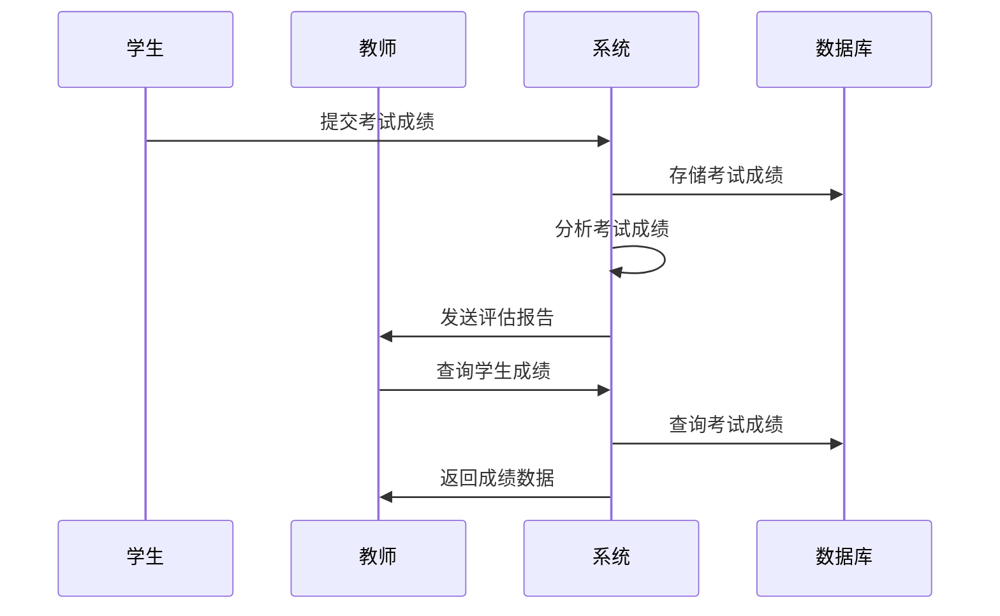

                 

### 第一部分: AI Agent概述

#### 第1章: AI Agent的基本概念与角色

##### 1.1 问题背景

教育评估在现代社会中扮演着至关重要的角色，它不仅影响着学生的学习成果，也对教育资源的分配和教育质量的提升具有深远影响。传统的教育评估方式通常依赖于教师的主观评价，这种方法存在一定的局限性，例如评估标准不统一、评估结果具有较大的主观性等。随着人工智能技术的快速发展，AI Agent作为一种智能体，逐渐在各个领域中展现其独特价值。在教育评估领域，AI Agent通过其智能分析能力和自动化处理能力，为教育评估提供了全新的解决方案。

##### 1.1.1 教育评估的需求与发展

教育评估的需求源于对教育质量与效果的追求。在传统的教育体系中，教育评估主要依赖于教师的主观评价，这种评价方式虽然在一定程度上能够反映学生的学习情况，但存在以下问题：

1. **评估标准不统一**：不同教师对同一学习成果的评价可能存在差异，导致评估结果不一致。
2. **评估过程繁琐**：教师需要耗费大量时间和精力进行评估工作，影响其教学效率。
3. **评估结果主观性较强**：主观评价容易受到教师个人情感和偏见的影响，影响评估的公正性和客观性。

随着教育体系的不断发展和完善，教育评估的需求也在不断提升。现代社会对教育质量的要求越来越高，教育评估需要更加科学、客观和全面。因此，如何利用现代技术提高教育评估的效率和准确性，成为教育领域亟待解决的问题。

##### 1.1.2 AI Agent在教育评估中的应用现状

AI Agent在教育评估中的应用逐渐成为研究热点。目前，AI Agent在教育评估中的应用主要体现在以下几个方面：

1. **学生成绩分析**：通过机器学习算法，AI Agent可以对学生成绩进行分析，预测学生的未来表现，发现学习中的问题，为教师和家长提供决策支持。
2. **个性化学习评估**：AI Agent可以分析学生的学习行为和特点，为每个学生制定个性化的学习计划，评估学习效果，提高学习效率。
3. **教育资源优化**：AI Agent可以根据学生的学习情况和需求，推荐合适的课程和资源，优化教育资源的分配，提高教育质量。

尽管AI Agent在教育评估中展示了巨大的潜力，但实际应用中仍面临诸多挑战，如数据隐私保护、算法模型的准确性和稳定性等。

##### 1.1.3 AI Agent在教育评估中的角色与价值

AI Agent在教育评估中扮演着多重角色，其核心价值主要体现在以下几个方面：

1. **提高评估效率**：通过自动化处理学生成绩和学习行为数据，AI Agent可以大幅减少教师的工作量，提高评估效率。
2. **增强评估准确性**：AI Agent利用机器学习算法，可以对复杂的教育数据进行分析，提供更加准确和全面的评估结果。
3. **实现个性化评估**：AI Agent可以根据每个学生的学习特点和需求，提供个性化的评估服务，为每个学生制定合适的学习计划。
4. **促进教育公平**：AI Agent可以消除评估中的主观偏见，提高评估的公正性和客观性，促进教育公平。

总之，AI Agent在教育评估中的应用不仅提高了评估的效率和质量，也为教育现代化提供了新的思路和方法。

##### 1.2 核心概念

在教育评估中，理解和掌握AI Agent的基本概念是非常重要的。以下是几个核心概念的定义及其在教育评估中的应用：

###### 1.2.1 AI Agent的定义

AI Agent，即人工智能代理，是指能够自主感知环境、执行任务并适应环境变化的人工智能实体。AI Agent通常具备以下能力：

1. **自主感知**：通过传感器和算法，AI Agent能够获取和分析环境中的信息。
2. **自主决策**：基于对环境的感知和分析，AI Agent能够做出合理的决策。
3. **自主行动**：AI Agent能够根据决策执行具体的操作。

在教育评估中，AI Agent可以感知学生的学习行为和数据，分析评估结果，并为学生提供个性化的学习建议。

###### 1.2.2 AI Agent的属性与特征

AI Agent具有以下几个关键属性和特征：

1. **智能性**：AI Agent能够运用机器学习和深度学习等技术，对教育数据进行智能分析和预测。
2. **自主性**：AI Agent可以自主学习和优化，无需人工干预即可执行任务。
3. **适应性**：AI Agent能够根据环境和任务的变化，调整其行为和策略。
4. **交互性**：AI Agent能够与教师、学生和家长进行互动，提供实时反馈和个性化服务。

在教育评估中，这些属性和特征使得AI Agent能够更好地理解学生的学习情况，提供准确的评估结果和个性化的学习建议。

###### 1.2.3 AI Agent与传统教育评估方式的对比

AI Agent与传统教育评估方式在多个方面存在显著差异：

1. **评估方式**：
   - 传统方式：依赖教师的主观评价，标准不统一，过程繁琐。
   - AI Agent：通过自动化算法和分析模型，提供客观、准确的评估结果，提高效率。

2. **评估过程**：
   - 传统方式：人工收集和处理数据，耗费大量时间和人力。
   - AI Agent：自动收集和处理数据，减少人力投入，提高效率。

3. **评估结果**：
   - 传统方式：评估结果主观性强，容易受到教师个人情感和偏见的影响。
   - AI Agent：评估结果客观、公正，消除主观偏见，提高评估准确性。

4. **个性化服务**：
   - 传统方式：无法提供个性化的评估和建议。
   - AI Agent：基于学生的个性化数据，提供个性化的评估结果和学习建议。

综上所述，AI Agent在教育评估中具有显著的优势，其智能性、自主性、适应性和交互性为教育评估提供了全新的解决方案。

##### 1.3 联系与分类

AI Agent在教育评估中的应用离不开与其他智能技术的紧密联系。以下将探讨AI Agent在教育评估中的应用类型及其与其他智能技术的联系。

###### 1.3.1 AI Agent的分类

AI Agent在教育评估中根据功能和任务的不同，可以分为以下几类：

1. **成绩分析型AI Agent**：这类AI Agent主要用于分析学生的成绩数据，预测学生的未来表现，提供学习建议。它们通常使用回归分析、决策树、神经网络等算法进行建模和分析。

2. **行为分析型AI Agent**：这类AI Agent通过分析学生的学习行为数据，如在线学习记录、作业提交情况等，了解学生的学习习惯和效果，为教师提供个性化教学支持。

3. **资源推荐型AI Agent**：这类AI Agent根据学生的学习需求和成绩表现，推荐适合的学习资源和课程，优化学生的学习体验。

4. **综合评估型AI Agent**：这类AI Agent综合分析学生的成绩和行为数据，提供全面的评估报告，帮助教师和家长了解学生的学习情况。

###### 1.3.2 不同类型AI Agent在教育评估中的应用

不同类型的AI Agent在教育评估中的应用各有侧重：

1. **成绩分析型AI Agent**：通过分析历史成绩数据和当前学习情况，预测学生的未来成绩，帮助教师及时发现学习中的问题，调整教学策略。

2. **行为分析型AI Agent**：通过分析学生的学习行为数据，如学习时长、作业提交情况、互动频率等，了解学生的学习习惯和效果，提供个性化的学习建议。

3. **资源推荐型AI Agent**：根据学生的兴趣和学习需求，推荐适合的学习资源和课程，帮助学生更有效地利用时间和资源。

4. **综合评估型AI Agent**：综合分析学生的成绩和行为数据，提供全面的评估报告，包括学习进度、学习效果、学习习惯等方面，帮助教师和家长全面了解学生的学习情况。

###### 1.3.3 AI Agent与其他智能技术的联系

AI Agent在教育评估中的应用，需要与多种智能技术相结合，才能实现其功能：

1. **大数据技术**：AI Agent需要处理和分析大量的教育数据，大数据技术为其提供了强大的数据支持和处理能力。

2. **云计算技术**：通过云计算平台，AI Agent可以快速获取和处理数据，提高评估效率和准确性。

3. **自然语言处理技术**：AI Agent可以通过自然语言处理技术，理解和分析学生的文本数据，如学习笔记、作业报告等，提供更加智能的评估和建议。

4. **计算机视觉技术**：AI Agent可以通过计算机视觉技术，分析学生的学习行为和表现，如在线考试监控、课堂表现分析等。

总之，AI Agent在教育评估中的应用，是多种智能技术相互融合、协同工作的结果。通过这些技术，AI Agent能够更加精准地分析学生的学习情况，提供个性化的评估和教学支持。

##### 1.4 边界与外延

在教育评估中，AI Agent的应用虽然具有巨大的潜力，但同时也存在一定的边界和限制。以下将探讨AI Agent在教育评估中的边界、外延及其未来发展前景。

###### 1.4.1 AI Agent在教育评估中的边界

1. **数据质量**：AI Agent依赖于高质量的教育数据进行分析和预测。如果数据质量不高，如数据缺失、不准确等，会影响AI Agent的评估结果和准确性。

2. **算法模型**：AI Agent的算法模型需要不断优化和调整，以适应不同教育场景和需求。如果算法模型不够稳定和准确，可能会导致评估结果失真。

3. **伦理与隐私**：AI Agent在教育评估中需要处理大量的学生个人信息，如成绩、学习行为等。如何在保障数据隐私和伦理的前提下，充分利用这些数据进行评估，是一个重要挑战。

4. **技术与教育资源**：AI Agent的应用需要一定的技术基础设施和教育资源支持，如云计算、大数据平台、智能分析工具等。在资源不足的地区，AI Agent的应用可能受到限制。

###### 1.4.2 AI Agent在教育评估中的外延

1. **跨学科应用**：AI Agent不仅可以在教育评估中发挥作用，还可以应用于其他教育领域，如课程设计、教学方法优化、教育资源分配等。

2. **个性化学习**：AI Agent可以通过对学习数据的分析，为学生提供个性化的学习建议和资源推荐，帮助学生更有效地学习。

3. **教育管理**：AI Agent可以帮助教育管理者分析学校的教育质量，优化教育资源配置，提高管理效率。

4. **国际教育交流**：AI Agent可以通过数据分析，为国际教育交流提供支持，如学生成绩比较、教学方法对比等。

###### 1.4.3 AI Agent在教育评估中的发展前景

1. **技术创新**：随着人工智能技术的不断发展，AI Agent在教育评估中的应用将更加广泛和深入。新的算法模型、大数据分析和自然语言处理技术的应用，将进一步提高AI Agent的评估准确性和效率。

2. **教育改革**：AI Agent在教育评估中的应用，将推动教育体系的改革，促进教育公平和质量的提升。通过个性化评估和个性化学习，学生能够获得更加适合自己的教育。

3. **国际合作**：随着AI Agent在教育评估中的应用，国际教育交流将更加便捷和高效。通过数据分析和技术合作，各国可以分享教育资源和经验，共同推动全球教育的进步。

4. **伦理与隐私保护**：在未来，AI Agent在教育评估中的应用将更加注重伦理和隐私保护。通过制定相关法规和标准，确保学生个人信息的安全和隐私。

总之，AI Agent在教育评估中的应用具有广阔的发展前景。通过技术创新、教育改革和国际合作，AI Agent将为教育评估带来革命性的变化，为教育现代化贡献力量。

##### 1.5 本章小结

本章详细介绍了AI Agent的基本概念、角色及其在教育评估中的应用。首先，通过背景介绍，我们了解了教育评估的需求和发展现状。接着，我们深入探讨了AI Agent的定义、属性和特征，并与传统教育评估方式进行了对比。随后，我们探讨了AI Agent的分类、不同类型AI Agent在教育评估中的应用，以及其与其他智能技术的联系。最后，我们分析了AI Agent在教育评估中的边界、外延及其发展前景。通过本章的学习，读者可以全面了解AI Agent在教育评估中的角色和价值，为后续章节的深入探讨打下坚实的基础。

### 第二部分: AI Agent在智能教育评估中的应用

#### 第2章: AI Agent在学生成绩分析中的应用

在当今信息化教育时代，学生成绩分析成为教育评估中不可或缺的一部分。AI Agent凭借其强大的数据分析能力和智能化处理能力，在学生成绩分析中发挥了重要作用。本章将详细介绍AI Agent在学生成绩分析中的应用，包括成绩预测、成绩趋势分析以及面临的挑战与对策。

##### 2.1 学生成绩分析的基本概念

学生成绩分析是指通过收集和分析学生的学习成绩数据，对学生的学习成果进行评估和预测的过程。它不仅能够帮助教师了解学生的学习状况，还能为教育管理者和家长提供科学依据，以制定针对性的教学计划和辅导措施。学生成绩分析的基本概念包括：

1. **学生成绩数据**：指学生在不同科目、不同阶段的考试成绩和表现数据。
2. **成绩预测**：通过分析历史成绩数据，预测学生在未来某一阶段的考试成绩。
3. **成绩趋势分析**：通过分析学生的成绩变化趋势，了解学生的学习进步或退步情况。
4. **评估指标**：用于衡量学生成绩变化和效果的一系列指标，如平均分、及格率、优秀率等。

##### 2.1.1 学生成绩分析的定义

学生成绩分析是一种基于数据分析的方法，通过分析学生的学习成绩数据，揭示出学生在学习过程中的问题和优点。具体而言，学生成绩分析包括以下几个方面：

1. **数据收集**：收集学生的考试成绩、作业成绩、课堂表现等数据。
2. **数据清洗**：对收集到的数据进行清洗，去除重复、错误和不完整的数据。
3. **数据分析**：利用统计分析、机器学习等方法对清洗后的数据进行分析。
4. **结果解释**：将分析结果进行解释，为教师、学生和教育管理者提供决策支持。

##### 2.1.2 学生成绩分析的重要性

学生成绩分析在教育评估中具有重要意义，主要表现在以下几个方面：

1. **教学质量评估**：通过分析学生成绩，教师可以了解教学效果，发现教学中的不足，及时调整教学方法。
2. **个性化辅导**：根据学生成绩分析结果，教师可以为不同水平的学生制定个性化的辅导计划，提高辅导效果。
3. **教育政策制定**：教育管理者可以通过学生成绩分析，了解学校的教育质量，为教育政策的制定提供数据支持。
4. **学生学习反馈**：学生成绩分析结果可以为学生提供学习反馈，帮助他们了解自己的学习状况，制定更有效的学习策略。

##### 2.1.3 学生成绩分析的方法

学生成绩分析的方法主要包括以下几种：

1. **统计分析方法**：通过描述性统计、相关性分析和回归分析等方法，对学生的考试成绩进行分析。
2. **机器学习方法**：利用回归分析、决策树、神经网络等机器学习算法，预测学生的未来考试成绩。
3. **数据挖掘方法**：通过关联规则挖掘、聚类分析等方法，发现学生成绩数据中的潜在规律。
4. **可视化方法**：通过数据可视化技术，将分析结果以图表形式展示，帮助用户更直观地理解分析结果。

##### 2.2 AI Agent在学生成绩分析中的应用

AI Agent在学生成绩分析中发挥着关键作用，通过智能化的分析方法和算法，为教育评估提供有力支持。以下是AI Agent在学生成绩分析中的主要应用：

###### 2.2.1 AI Agent在成绩预测中的应用

AI Agent可以通过机器学习算法，对学生历史成绩数据进行分析，预测学生在未来某一阶段的考试成绩。具体步骤如下：

1. **数据收集与预处理**：收集学生的历史考试成绩数据，并进行数据清洗和预处理，如去除异常值、缺失值填充等。

2. **特征工程**：提取与成绩相关的特征，如考试科目、考试时间、作业成绩、课堂表现等。

3. **模型选择**：根据数据的特征和预测目标，选择合适的机器学习模型，如线性回归、决策树、随机森林、神经网络等。

4. **模型训练与评估**：利用历史成绩数据训练模型，并通过交叉验证等方法评估模型的性能和预测准确性。

5. **成绩预测**：使用训练好的模型，预测学生在未来某一阶段的考试成绩。

6. **结果解释**：将预测结果进行解释，为教师和学生提供学习建议和策略。

###### 2.2.1.1 成绩预测的基本原理

成绩预测的基本原理是基于历史成绩数据，通过机器学习算法建立成绩与相关特征之间的预测模型。具体而言，成绩预测的基本步骤如下：

1. **特征选择**：从大量的特征中筛选出与成绩相关性较高的特征，如考试成绩、作业成绩、课堂表现等。
2. **模型选择**：根据数据特点和预测目标，选择合适的机器学习模型，如线性回归、决策树、神经网络等。
3. **模型训练**：利用历史成绩数据，对模型进行训练，使其能够学习和理解成绩与特征之间的关系。
4. **模型评估**：通过交叉验证等方法，评估模型的性能和预测准确性，选择最优模型。
5. **预测应用**：使用训练好的模型，对未来的考试成绩进行预测，并提供学习建议和策略。

###### 2.2.1.2 成绩预测的算法模型

在成绩预测中，常用的算法模型包括线性回归、决策树、随机森林、神经网络等。以下是这些算法模型的基本原理和优缺点：

1. **线性回归**：
   - **原理**：通过建立线性关系模型，预测目标变量的值。线性回归模型简单，易于理解和实现。
   - **优点**：计算简单，易于实现，能够线性描述变量之间的关系。
   - **缺点**：对于非线性关系的表现较差，对异常值敏感。

2. **决策树**：
   - **原理**：通过一系列判断条件，将数据集划分成多个子集，并选择最优划分条件。
   - **优点**：易于理解和解释，能够处理非线性关系和分类问题。
   - **缺点**：容易过拟合，计算复杂度较高。

3. **随机森林**：
   - **原理**：通过构建多棵决策树，并利用随机化方法减少过拟合，提高模型的泛化能力。
   - **优点**：具有较好的泛化能力，能够处理高维数据。
   - **缺点**：计算复杂度较高，对于大量特征的依赖性较强。

4. **神经网络**：
   - **原理**：通过多层神经网络，模拟人脑神经元之间的连接和传递，实现非线性变换。
   - **优点**：能够处理复杂的非线性关系，适应性强。
   - **缺点**：训练过程复杂，对大量数据和计算资源要求较高。

不同算法模型在成绩预测中的应用效果和适用场景有所不同，需要根据具体情况进行选择和优化。

###### 2.2.1.3 成绩预测的实际应用案例

以下是一个实际应用案例，展示了AI Agent在学生成绩预测中的具体应用：

1. **项目背景**：某中学为了提高教学质量，引入AI Agent进行学生成绩预测，为教师和家长提供学习建议和策略。

2. **数据集准备**：收集近三年的学生考试成绩数据，包括语文、数学、英语等主要科目。数据包括学生的考试成绩、作业成绩、课堂表现等特征。

3. **特征工程**：提取与成绩相关的特征，如考试成绩、作业成绩、课堂表现等。对数据进行预处理，如缺失值填充、异常值处理等。

4. **模型选择**：选择线性回归、决策树、随机森林和神经网络等算法模型，对成绩进行预测。

5. **模型训练与评估**：利用历史成绩数据，分别训练不同算法模型，并使用交叉验证方法评估模型性能。

6. **成绩预测**：使用训练好的模型，对下一学期的考试成绩进行预测，并将预测结果与实际成绩进行比较，验证模型预测效果。

7. **结果解释**：将预测结果进行解释，为教师和家长提供学习建议和策略。例如，对于成绩预测较低的学生，建议加强辅导和关注；对于成绩预测较高的学生，建议保持良好学习状态。

通过这个实际应用案例，我们可以看到AI Agent在学生成绩预测中的有效性和实用性。未来，随着AI技术的不断发展，AI Agent在学生成绩分析中的应用将更加广泛和深入。

###### 2.2.2 AI Agent在成绩趋势分析中的应用

除了成绩预测，AI Agent还可以对学生的成绩变化趋势进行分析，为教师和学生提供更全面的评估和指导。以下介绍成绩趋势分析的基本原理、算法模型及其实际应用案例。

2.2.2.1 成绩趋势分析的基本原理

成绩趋势分析是指通过分析学生历次考试成绩的变化趋势，评估学生的学习进步或退步情况。成绩趋势分析的基本原理包括以下几个方面：

1. **时间序列分析**：通过分析学生成绩的时间序列数据，捕捉成绩变化的规律和趋势。

2. **趋势线拟合**：使用统计方法或机器学习方法，对成绩数据建立趋势线模型，预测未来成绩的变化趋势。

3. **异常值检测**：识别成绩数据中的异常值，分析可能的原因，为教师提供干预依据。

4. **综合评估**：综合考虑学生的历史成绩、当前成绩和趋势预测，为学生提供全面的评估和指导。

2.2.2.2 成绩趋势分析的算法模型

在成绩趋势分析中，常用的算法模型包括线性趋势模型、指数平滑模型和时间序列预测模型等。以下是这些模型的基本原理和优缺点：

1. **线性趋势模型**：
   - **原理**：假设成绩变化呈线性关系，通过计算平均值和斜率，拟合成绩趋势线。
   - **优点**：计算简单，易于理解和实现。
   - **缺点**：对于非线性的成绩变化趋势，拟合效果较差。

2. **指数平滑模型**：
   - **原理**：利用过去成绩数据的加权平均值，拟合成绩趋势线，并预测未来成绩。
   - **优点**：能够较好地捕捉短期成绩变化趋势。
   - **缺点**：对于长期趋势的拟合效果较差。

3. **时间序列预测模型**：
   - **原理**：使用统计方法或机器学习方法，对成绩时间序列数据进行建模，预测未来成绩。
   - **优点**：能够处理复杂的成绩变化趋势，拟合效果较好。
   - **缺点**：计算复杂度较高，对数据质量和特征选择要求较高。

2.2.2.3 成绩趋势分析的实际应用案例

以下是一个实际应用案例，展示了AI Agent在学生成绩趋势分析中的具体应用：

1. **项目背景**：某高中引入AI Agent对学生成绩进行趋势分析，为教师和家长提供学习指导。

2. **数据集准备**：收集学生的历年考试成绩数据，包括期中考试、期末考试、月考等。

3. **特征工程**：提取与成绩相关的特征，如考试成绩、考试时间、学习时长等。

4. **模型选择**：选择线性趋势模型、指数平滑模型和时间序列预测模型，对成绩进行趋势分析。

5. **模型训练与评估**：使用历史成绩数据，分别训练不同算法模型，并评估模型性能。

6. **趋势预测**：使用训练好的模型，预测学生在未来考试中的成绩变化趋势。

7. **结果解释**：将预测结果进行解释，为教师和家长提供学习指导。例如，对于成绩呈现下降趋势的学生，建议加强辅导和关注；对于成绩呈现上升趋势的学生，建议保持良好学习状态。

通过这个实际应用案例，我们可以看到AI Agent在学生成绩趋势分析中的有效性和实用性。未来，随着AI技术的不断发展，AI Agent在学生成绩分析中的应用将更加广泛和深入。

##### 2.3 学生成绩分析中的挑战与对策

尽管AI Agent在学生成绩分析中展现了巨大潜力，但在实际应用过程中仍面临诸多挑战。以下将讨论学生成绩分析中的主要挑战及其对策。

###### 2.3.1 学生成绩分析中的挑战

1. **数据质量与隐私问题**：
   - **挑战**：学生成绩数据的质量直接影响到成绩分析的准确性和可靠性。数据可能存在缺失、错误或不一致的情况。此外，学生成绩数据包含个人隐私，如何保障数据的安全和隐私成为一大难题。
   - **对策**：加强数据质量管理，通过数据清洗、异常值检测等方法，提高数据质量。同时，制定严格的隐私保护政策和安全措施，确保学生数据的保密性和安全性。

2. **算法模型的准确性与稳定性**：
   - **挑战**：不同的算法模型和参数设置可能对成绩分析结果产生显著影响。算法模型的准确性和稳定性是确保成绩分析结果可靠性的关键。
   - **对策**：通过交叉验证、模型选择和参数调优等方法，提高算法模型的准确性和稳定性。同时，定期对模型进行更新和优化，以适应数据和环境的变化。

3. **多样化的学生需求**：
   - **挑战**：学生具有不同的学习背景、学习习惯和兴趣爱好，如何满足不同学生的个性化需求是一个挑战。
   - **对策**：开发灵活的算法模型和评估指标，以满足不同学生的需求。通过个性化推荐和智能辅导，为每个学生提供合适的学习资源和指导。

###### 2.3.2 挑战的对策

1. **提高数据质量的方法**：
   - **数据清洗**：对原始成绩数据进行分析，去除重复、错误和不完整的数据。
   - **数据标准化**：对数据进行规范化处理，如对分数进行归一化，消除不同科目之间的差异。
   - **数据增强**：通过增加数据样本、生成新的特征等方法，提高数据的质量和丰富度。

2. **算法模型的优化策略**：
   - **模型选择**：根据数据特点和预测目标，选择合适的算法模型，如线性回归、决策树、神经网络等。
   - **参数调优**：通过网格搜索、贝叶斯优化等方法，优化模型的参数设置，提高模型的性能。
   - **模型融合**：将多个模型进行融合，利用不同的模型和算法，提高预测的准确性和稳定性。

3. **面向多样化需求的解决方案**：
   - **个性化评估**：根据学生的个性化数据，制定个性化的评估指标和策略，满足不同学生的需求。
   - **智能推荐系统**：通过分析学生的兴趣和需求，推荐适合的学习资源和课程，提高学习效率。
   - **反馈机制**：建立反馈机制，定期收集学生的反馈，调整评估模型和策略，提高评估的准确性和实用性。

通过以上对策，可以有效地应对学生成绩分析中的挑战，提高评估的准确性和实用性，为教育决策提供科学依据。

##### 2.4 本章小结

本章详细介绍了AI Agent在学生成绩分析中的应用，包括成绩预测和成绩趋势分析。首先，我们介绍了学生成绩分析的基本概念和方法，包括数据收集、特征工程、模型选择和结果解释等。接着，我们探讨了AI Agent在成绩预测中的应用，包括基本原理、算法模型和实际应用案例。然后，我们介绍了AI Agent在成绩趋势分析中的应用，包括基本原理、算法模型和实际应用案例。最后，我们讨论了学生成绩分析中的主要挑战和对策。通过本章的学习，读者可以全面了解AI Agent在学生成绩分析中的应用和作用，为教育评估提供科学依据和决策支持。

### 第三部分: AI Agent在个性化学习评估中的应用

#### 第3章: AI Agent在个性化学习评估中的角色

个性化学习评估是现代教育领域的一个重要研究方向，其核心目标是根据每个学生的学习特点和需求，提供个性化的学习支持和指导，以提高学习效率和效果。AI Agent作为一种智能体，通过其强大的数据分析、智能推理和自适应能力，在个性化学习评估中扮演着关键角色。本章将深入探讨AI Agent在个性化学习评估中的应用，包括学生行为分析、学习效果评估以及面临的挑战与对策。

##### 3.1 个性化学习评估的基本概念

个性化学习评估是指通过收集和分析学生的学习行为、学习成果等相关数据，为每个学生制定个性化的学习计划和评估方案，以提高学习效果和满足个性化需求。个性化学习评估的核心概念包括：

1. **学生行为数据**：指学生在学习过程中的行为记录，如学习时长、学习频率、作业提交情况、互动频率等。
2. **学习效果数据**：指学生在学习过程中取得的成果数据，如考试成绩、作业质量、课堂表现等。
3. **个性化学习计划**：根据学生的行为数据和效果数据，为每个学生制定符合其学习特点和发展需求的学习计划。
4. **个性化评估方案**：通过分析学生的学习数据，为每个学生提供个性化的评估报告和反馈，帮助教师和家长了解学生的学习状况。

##### 3.1.1 个性化学习评估的定义

个性化学习评估是一种基于数据分析的方法，通过对学生的学习行为和学习成果数据进行分析，为每个学生提供个性化的学习支持和指导。个性化学习评估的定义主要包括以下几个方面：

1. **数据分析**：通过收集和分析学生的学习行为和学习成果数据，识别学生的学习特点和问题。
2. **个性化指导**：根据学生的学习数据和特点，为学生制定个性化的学习计划和评估方案，提供有针对性的支持和指导。
3. **反馈与调整**：通过持续的反馈和调整，不断优化学习计划和评估方案，提高学习效果。

##### 3.1.2 个性化学习评估的重要性

个性化学习评估在教育领域具有重要意义，主要体现在以下几个方面：

1. **提高学习效率**：通过分析学生的学习行为和成果数据，识别学生的学习特点和问题，为教师和学生提供有针对性的指导和支持，提高学习效率。
2. **满足个性化需求**：个性化学习评估能够根据每个学生的特点和发展需求，提供个性化的学习计划和评估方案，满足学生的个性化需求，提高学习兴趣和动力。
3. **优化教育资源**：个性化学习评估可以帮助教育管理者优化教育资源的配置，提高教育资源的利用效率，降低教育成本。
4. **促进教育公平**：通过提供个性化的学习支持和指导，个性化学习评估可以弥补传统教育评估中的不足，促进教育公平，使每个学生都能获得公平的教育机会。

##### 3.1.3 个性化学习评估的方法

个性化学习评估的方法主要包括以下几个方面：

1. **数据收集**：通过在线学习平台、学习管理系统等工具，收集学生的学习行为和学习成果数据。
2. **数据分析**：利用统计分析、机器学习、数据挖掘等方法，对学生的学习行为和学习成果数据进行分析，识别学生的学习特点和问题。
3. **个性化推荐**：根据学生的学习数据和特点，利用推荐算法，为学生推荐适合的学习资源和课程，提供个性化的学习支持。
4. **反馈与调整**：通过持续的反馈和调整，不断优化学习计划和评估方案，提高学习效果。

##### 3.2 AI Agent在个性化学习评估中的应用

AI Agent在个性化学习评估中具有重要作用，通过其智能分析和自适应能力，为教师和学生提供个性化的学习支持和指导。以下是AI Agent在个性化学习评估中的应用：

###### 3.2.1 AI Agent在学生行为分析中的应用

AI Agent可以通过分析学生的学习行为数据，识别学生的学习习惯、学习强度和学习效果，为教师和学生提供个性化的学习建议。以下是AI Agent在学生行为分析中的应用步骤：

1. **数据收集与预处理**：收集学生的学习行为数据，包括学习时长、学习频率、作业提交情况、互动频率等。对数据进行清洗和预处理，去除重复和错误的数据。

2. **特征提取**：从学生学习行为数据中提取关键特征，如学习时长、学习频率、作业完成率、互动频率等。

3. **行为模式识别**：利用机器学习和数据挖掘算法，识别学生的学习行为模式，如勤奋型、专注型、放松型等。

4. **个性化建议**：根据学生的学习行为模式，为教师和学生提供个性化的学习建议，如调整学习时间、提高学习频率、加强互动等。

###### 3.2.1.1 学生行为分析的基本原理

学生行为分析的基本原理是通过分析学生的学习行为数据，了解学生的学习习惯、学习强度和学习效果。以下是学生行为分析的基本步骤：

1. **数据收集**：收集学生的学习行为数据，如学习时长、学习频率、作业提交情况、互动频率等。

2. **数据预处理**：对收集到的数据进行清洗和预处理，如去除重复和错误的数据、缺失值填充等。

3. **特征提取**：从预处理后的数据中提取关键特征，如学习时长、学习频率、作业完成率、互动频率等。

4. **行为模式识别**：利用机器学习和数据挖掘算法，识别学生的学习行为模式，如勤奋型、专注型、放松型等。

5. **个性化建议**：根据学生的学习行为模式，为教师和学生提供个性化的学习建议，如调整学习时间、提高学习频率、加强互动等。

通过以上步骤，AI Agent可以有效地分析学生的学习行为，为教师和学生提供有针对性的学习建议，提高学习效果。

###### 3.2.1.2 学生行为分析的算法模型

在学生行为分析中，常用的算法模型包括回归分析、聚类分析、关联规则挖掘等。以下是这些算法模型的基本原理和应用：

1. **回归分析**：
   - **原理**：通过建立回归模型，分析学生行为数据与学习效果之间的关系。
   - **应用**：可以用于预测学生的学习效果，为教师提供教学干预的依据。

2. **聚类分析**：
   - **原理**：将具有相似特征的学生划分为同一类，识别不同的学习群体。
   - **应用**：可以用于发现学生的学习行为特征，为个性化学习提供基础。

3. **关联规则挖掘**：
   - **原理**：通过挖掘学生行为数据中的关联规则，发现学生学习行为之间的联系。
   - **应用**：可以用于发现学生的学习行为模式，为教师提供教学策略的参考。

通过以上算法模型，AI Agent可以有效地分析学生的学习行为，为教师和学生提供有针对性的学习建议，提高学习效果。

###### 3.2.1.3 学生行为分析的实际应用案例

以下是一个实际应用案例，展示了AI Agent在学生行为分析中的具体应用：

1. **项目背景**：某中学引入AI Agent对学生行为进行分析，为教师和家长提供个性化学习建议。

2. **数据集准备**：收集学生的在线学习数据，包括学习时长、学习频率、作业提交情况、互动频率等。

3. **特征工程**：对数据进行清洗和预处理，提取关键特征，如学习时长、学习频率、作业完成率、互动频率等。

4. **模型选择**：选择回归分析、聚类分析和关联规则挖掘等算法模型，对学生的行为进行分析。

5. **模型训练与评估**：利用历史数据训练模型，并通过交叉验证等方法评估模型性能。

6. **行为分析**：使用训练好的模型，分析学生的行为模式，为教师和家长提供个性化学习建议。

7. **结果解释**：将分析结果进行解释，为教师提供教学干预的依据，为家长提供教育指导。

通过这个实际应用案例，我们可以看到AI Agent在学生行为分析中的有效性和实用性。未来，随着AI技术的不断发展，AI Agent在个性化学习评估中的应用将更加广泛和深入。

###### 3.2.2 AI Agent在学习效果评估中的应用

AI Agent不仅能够分析学生的学习行为，还可以评估学生的学习效果，为教师和学生提供更全面的个性化支持。以下是AI Agent在学习效果评估中的应用：

1. **数据收集与预处理**：收集学生的学习效果数据，包括考试成绩、作业质量、课堂表现等。对数据进行清洗和预处理，去除重复和错误的数据。

2. **特征提取**：从学习效果数据中提取关键特征，如考试成绩、作业完成率、课堂表现等。

3. **效果评估模型**：选择合适的评估模型，如回归分析、聚类分析、综合评估模型等，对学习效果进行评估。

4. **评估与反馈**：使用评估模型，对学生的学习效果进行评估，并将评估结果反馈给教师和学生。

5. **个性化建议**：根据评估结果，为教师和学生提供个性化的学习建议，如调整学习策略、加强薄弱环节等。

###### 3.2.2.1 学习效果评估的基本原理

学习效果评估的基本原理是通过分析学生的学习行为数据和学习成果数据，对学生的学习效果进行评估和反馈。以下是学习效果评估的基本步骤：

1. **数据收集**：收集学生的学习行为数据和学习成果数据，如考试成绩、作业质量、课堂表现等。

2. **数据预处理**：对收集到的数据进行清洗和预处理，去除重复和错误的数据。

3. **特征提取**：从预处理后的数据中提取关键特征，如考试成绩、作业完成率、课堂表现等。

4. **效果评估模型**：选择合适的评估模型，如回归分析、聚类分析、综合评估模型等，对学习效果进行评估。

5. **评估与反馈**：使用评估模型，对学生的学习效果进行评估，并将评估结果反馈给教师和学生。

6. **个性化建议**：根据评估结果，为教师和学生提供个性化的学习建议，如调整学习策略、加强薄弱环节等。

通过以上步骤，AI Agent可以有效地评估学生的学习效果，为教师和学生提供有针对性的支持和指导。

###### 3.2.2.2 学习效果评估的算法模型

在学习效果评估中，常用的算法模型包括回归分析、聚类分析、综合评估模型等。以下是这些算法模型的基本原理和应用：

1. **回归分析**：
   - **原理**：通过建立回归模型，分析学习行为数据与学习效果之间的关系。
   - **应用**：可以用于预测学生的学习效果，为教师提供教学干预的依据。

2. **聚类分析**：
   - **原理**：将具有相似学习效果的学生划分为同一类，识别不同的学习群体。
   - **应用**：可以用于发现不同学生的学习效果差异，为个性化教学提供基础。

3. **综合评估模型**：
   - **原理**：结合多种评估指标和方法，对学习效果进行综合评估。
   - **应用**：可以用于全面评估学生的学习效果，为教师和学生提供全面的反馈。

通过以上算法模型，AI Agent可以有效地评估学生的学习效果，为教师和学生提供有针对性的支持和指导。

###### 3.2.2.3 学习效果评估的实际应用案例

以下是一个实际应用案例，展示了AI Agent在学习效果评估中的具体应用：

1. **项目背景**：某高校引入AI Agent对学生学习效果进行评估，为教师和学生提供个性化学习支持。

2. **数据集准备**：收集学生的考试成绩、作业质量、课堂表现等数据。

3. **特征工程**：对数据进行清洗和预处理，提取关键特征，如考试成绩、作业完成率、课堂表现等。

4. **模型选择**：选择回归分析、聚类分析、综合评估模型等算法模型，对学习效果进行评估。

5. **模型训练与评估**：利用历史数据训练模型，并通过交叉验证等方法评估模型性能。

6. **效果评估**：使用训练好的模型，对学生的学习效果进行评估，并将评估结果反馈给教师和学生。

7. **结果解释**：将评估结果进行解释，为教师提供教学干预的依据，为家长提供教育指导。

通过这个实际应用案例，我们可以看到AI Agent在学习效果评估中的有效性和实用性。未来，随着AI技术的不断发展，AI Agent在个性化学习评估中的应用将更加广泛和深入。

##### 3.3 个性化学习评估中的挑战与对策

尽管AI Agent在个性化学习评估中具有巨大的潜力，但实际应用过程中仍面临诸多挑战。以下将讨论个性化学习评估中的主要挑战及其对策。

###### 3.3.1 个性化学习评估中的挑战

1. **数据隐私问题**：
   - **挑战**：个性化学习评估需要收集和分析学生的行为和成绩数据，这些数据涉及到学生的个人隐私。如何保障数据的安全性和隐私性是一个重要的挑战。
   - **对策**：采用加密技术、匿名化处理等方法，保障学生数据的安全性和隐私性。同时，制定严格的隐私保护政策和数据使用规范，确保数据使用的合法性和透明度。

2. **学习行为建模的准确性**：
   - **挑战**：学习行为建模的准确性直接影响个性化学习评估的效果。如果建模不准确，可能导致评估结果失真，无法提供有效的个性化支持。
   - **对策**：采用多样化的数据来源和先进的数据分析算法，提高学习行为建模的准确性。同时，定期更新和优化模型，以适应数据和环境的变化。

3. **评估结果的可解释性**：
   - **挑战**：个性化学习评估的结果需要教师和学生理解，以便采取相应的行动。然而，复杂的评估模型和算法可能导致结果难以解释。
   - **对策**：通过可视化技术、模型解释方法等，提高评估结果的可解释性。同时，提供详细的评估报告和解释，帮助教师和学生理解评估结果和个性化建议。

4. **多样化的学生需求**：
   - **挑战**：每个学生的学习需求和发展路径不同，如何满足多样化的需求是一个挑战。
   - **对策**：开发灵活的评估模型和个性化策略，根据学生的个性化数据，提供有针对性的学习支持和指导。同时，提供多样化的学习资源和课程，以满足不同学生的需求。

###### 3.3.2 挑战的对策

1. **数据隐私保护的方法**：
   - **数据加密**：采用加密技术，对学生的行为和成绩数据进行加密存储和传输，防止数据泄露。
   - **匿名化处理**：对学生的个人信息进行匿名化处理，确保数据在分析过程中不包含个人隐私。
   - **隐私保护政策**：制定严格的隐私保护政策和数据使用规范，确保数据使用的合法性和透明度。

2. **提高学习行为建模的准确性**：
   - **多源数据融合**：采用多种数据来源，如学习平台数据、课堂表现数据等，提高建模的准确性。
   - **先进算法应用**：采用先进的机器学习和深度学习算法，提高建模的准确性和鲁棒性。
   - **模型持续优化**：定期更新和优化模型，以适应数据和环境的变化，提高评估的准确性和稳定性。

3. **评估结果可解释性的策略**：
   - **可视化技术**：采用可视化技术，将评估结果以图表、图形等形式展示，提高结果的可理解性。
   - **模型解释方法**：采用模型解释方法，如SHAP值、LIME等，帮助用户理解评估结果的产生过程。
   - **详细评估报告**：提供详细的评估报告和解释，帮助用户理解评估结果和个性化建议。

4. **面向多样化需求的解决方案**：
   - **个性化学习策略**：根据学生的个性化数据，制定个性化的学习策略和评估方案，提供有针对性的支持。
   - **多样化学习资源**：提供多样化的学习资源和课程，满足不同学生的学习需求和发展路径。
   - **个性化学习平台**：构建个性化学习平台，集成评估系统、学习资源和互动功能，提供一站式个性化学习服务。

通过以上对策，可以有效地应对个性化学习评估中的挑战，提高评估的准确性和有效性，为教师和学生提供更好的学习支持和指导。

##### 3.4 本章小结

本章深入探讨了AI Agent在个性化学习评估中的应用，包括学生行为分析和学习效果评估。首先，我们介绍了个性化学习评估的基本概念和方法，包括数据收集、特征工程、模型选择和结果解释等。接着，我们详细介绍了AI Agent在学生行为分析中的应用，包括数据收集与预处理、特征提取、行为模式识别和个性化建议。然后，我们探讨了AI Agent在学习效果评估中的应用，包括数据收集与预处理、特征提取、效果评估模型和评估与反馈。最后，我们讨论了个性化学习评估中的主要挑战和对策。通过本章的学习，读者可以全面了解AI Agent在个性化学习评估中的应用和作用，为教育评估和个性化学习提供科学依据和决策支持。

### 第四部分: AI Agent在教育评估中的综合应用

#### 第4章: AI Agent在教育评估中的综合应用

在前三章中，我们分别探讨了AI Agent在学生成绩分析、个性化学习评估中的具体应用。本章将综合讨论AI Agent在教育评估中的全面应用，包括系统设计与架构方案、项目实战以及最佳实践、小结和注意事项。

##### 4.1 系统设计与架构方案

教育评估系统是一个复杂的系统工程，需要集成多种技术，如大数据、机器学习、云计算等。以下是一个典型的教育评估系统的设计架构方案。

###### 4.1.1 问题场景介绍

在一个现代教育体系中，教师和学生需要处理大量的教育数据，如考试成绩、学习行为记录、课程进度等。如何有效地收集、存储、处理和分析这些数据，为教师和学生提供及时、准确的评估和个性化学习支持，是一个关键问题。

###### 4.1.2 系统功能设计

教育评估系统的功能设计主要包括以下几个模块：

1. **数据收集模块**：负责收集学生和教师的各类数据，包括考试成绩、学习行为记录、课程进度等。
2. **数据处理模块**：对收集到的数据进行分析、清洗和预处理，为后续分析提供高质量的数据。
3. **数据存储模块**：利用数据库管理系统（如MySQL、MongoDB等），存储和处理大规模教育数据。
4. **数据挖掘与分析模块**：通过机器学习和数据挖掘算法，分析学生的考试成绩和学习行为，生成个性化评估报告。
5. **用户界面模块**：提供用户友好的界面，方便教师和学生查询评估结果和个性化学习建议。

###### 4.1.3 系统架构设计

教育评估系统的架构设计采用三层架构，包括表示层、业务逻辑层和数据层。

1. **表示层**：提供用户界面，使用户可以方便地访问和操作系统。通常采用Web前端技术（如HTML、CSS、JavaScript等）。
2. **业务逻辑层**：负责处理业务逻辑，包括数据收集、数据处理、数据分析和用户管理等。采用后端编程语言（如Java、Python等）。
3. **数据层**：负责数据的存储、检索和管理，通常使用关系型数据库或NoSQL数据库。

###### 4.1.4 系统接口设计

系统接口设计包括以下几类：

1. **数据接口**：用于数据收集、处理和存储。如HTTP API、数据库连接接口等。
2. **用户接口**：用于用户与系统的交互，如Web前端、移动应用等。
3. **服务接口**：用于系统内部模块之间的通信，如数据服务、分析服务、报告服务等。

###### 4.1.5 系统交互设计

系统交互设计主要涉及以下几种：

1. **用户与系统交互**：用户通过Web前端或移动应用与系统进行交互，提交数据请求，获取评估报告等。
2. **系统内部交互**：各模块之间通过接口进行通信，如数据处理模块与数据存储模块之间的数据传输。
3. **外部系统交互**：与外部系统（如学习平台、教务系统等）进行数据交换和整合。

以下是教育评估系统的Mermaid架构图：



##### 4.2 项目实战

以下是一个教育评估系统的项目实战，包括环境安装、核心功能实现和代码应用解读。

###### 4.2.1 环境安装

1. **硬件要求**：一台具有较高配置的服务器或虚拟机，如Intel Xeon CPU、16GB RAM、500GB SSD等。
2. **软件要求**：
   - 操作系统：Linux（如CentOS 7）
   - 开发环境：Python 3.8、Jupyter Notebook、Docker等
   - 数据库：MySQL 8.0、MongoDB 4.0
   - 依赖库：Scikit-learn、Pandas、Numpy、TensorFlow等

安装步骤：
1. 安装Linux操作系统。
2. 配置服务器环境，安装Python、Jupyter Notebook、Docker等。
3. 安装MySQL和MongoDB数据库。
4. 安装相关依赖库。

###### 4.2.2 核心功能实现

1. **数据收集与处理**：
   - 收集学生的考试成绩数据，存储在MySQL数据库中。
   - 从数据库中读取考试成绩数据，使用Pandas进行数据预处理，如缺失值填充、异常值处理等。

2. **成绩分析**：
   - 利用Scikit-learn进行成绩预测，如线性回归、决策树等。
   - 使用TensorFlow实现神经网络模型，进行更复杂的成绩预测。

3. **可视化**：
   - 使用Matplotlib和Seaborn进行数据可视化，展示成绩分布、趋势等。
   - 使用Plotly实现交互式可视化，提高用户体验。

4. **用户界面**：
   - 使用Flask或Django构建Web前端，提供用户友好的界面。
   - 使用Jinja2模板引擎，实现动态页面渲染。

以下是成绩预测的Python代码示例：

```python
import pandas as pd
from sklearn.linear_model import LinearRegression
from sklearn.metrics import mean_squared_error
import numpy as np

# 读取考试成绩数据
data = pd.read_csv('exams.csv')

# 数据预处理
X = data[['math', 'english', 'science']]
y = data['total_score']

# 划分训练集和测试集
X_train, X_test, y_train, y_test = train_test_split(X, y, test_size=0.2, random_state=42)

# 创建线性回归模型
model = LinearRegression()
model.fit(X_train, y_train)

# 预测测试集成绩
y_pred = model.predict(X_test)

# 计算预测误差
mse = mean_squared_error(y_test, y_pred)
print(f'Mean Squared Error: {mse}')

# 可视化成绩分布
plt.scatter(y_test, y_pred)
plt.xlabel('Actual Scores')
plt.ylabel('Predicted Scores')
plt.title('Actual vs Predicted Scores')
plt.show()
```

###### 4.2.3 代码应用解读与分析

以上代码实现了一个简单的成绩预测系统。首先，从CSV文件中读取考试成绩数据，使用Pandas进行数据预处理。然后，使用Scikit-learn的线性回归模型进行成绩预测，并计算预测误差。最后，使用Matplotlib进行成绩分布的可视化。

线性回归模型的基本原理是通过建立自变量（如数学、英语、科学成绩）与因变量（总成绩）之间的线性关系，预测未来成绩。线性回归模型的公式如下：

$$
y = \beta_0 + \beta_1x_1 + \beta_2x_2 + ... + \beta_nx_n
$$

其中，$y$ 是总成绩，$x_1, x_2, ..., x_n$ 是各科成绩，$\beta_0, \beta_1, \beta_2, ..., \beta_n$ 是模型参数。

通过训练集对模型进行拟合，得到模型参数。然后，使用测试集对模型进行预测，计算预测误差，评估模型性能。线性回归模型简单易实现，但在面对复杂关系时效果较差。

为了提高预测准确性，可以尝试使用更复杂的模型，如神经网络。神经网络通过多层神经元实现非线性变换，能够处理复杂的关系。以下是使用TensorFlow实现神经网络模型的代码示例：

```python
import tensorflow as tf
from tensorflow.keras.layers import Dense
from tensorflow.keras.models import Sequential

# 创建神经网络模型
model = Sequential()
model.add(Dense(64, activation='relu', input_shape=(3,)))
model.add(Dense(32, activation='relu'))
model.add(Dense(1))

model.compile(optimizer='adam', loss='mean_squared_error')

# 训练神经网络模型
model.fit(X_train, y_train, epochs=10, batch_size=32)

# 预测测试集成绩
y_pred = model.predict(X_test)

# 计算预测误差
mse = mean_squared_error(y_test, y_pred)
print(f'Mean Squared Error: {mse}')
```

神经网络模型通过多个隐层和神经元实现非线性变换，能够处理更复杂的关系。训练过程中，通过反向传播算法不断调整模型参数，提高预测准确性。

通过以上代码示例，我们可以看到AI Agent在教育评估系统中的应用。数据收集与处理模块负责收集和清洗数据，成绩分析模块通过机器学习和神经网络模型进行成绩预测，可视化模块展示预测结果，用户界面模块提供用户交互界面。通过这些模块的协同工作，AI Agent为教育评估提供了强大的支持。

##### 4.3 最佳实践

在AI Agent在教育评估中的实际应用中，以下是一些最佳实践：

1. **数据安全与隐私保护**：严格遵循数据安全与隐私保护法规，采用加密技术、匿名化处理等手段，确保学生数据的安全和隐私。
2. **模型优化与更新**：定期对模型进行优化和更新，以适应数据和环境的变化，提高预测准确性和稳定性。
3. **用户友好界面**：设计简洁、直观的用户界面，方便教师和学生使用系统，提高用户体验。
4. **个性化学习建议**：根据学生的个性化数据，提供有针对性的学习建议和资源推荐，提高学习效果。
5. **跨平台支持**：支持多种设备（如电脑、手机、平板等）访问，确保系统在不同设备上的稳定性和兼容性。

##### 4.4 小结

本章综合讨论了AI Agent在教育评估中的全面应用，包括系统设计与架构方案、项目实战和最佳实践。首先，介绍了教育评估系统的设计架构，包括数据收集、处理、存储、分析和用户界面等模块。然后，通过项目实战展示了AI Agent在教育评估系统中的应用，包括数据收集与处理、成绩分析和可视化等。最后，提出了AI Agent在教育评估中的最佳实践。通过本章的学习，读者可以全面了解AI Agent在教育评估中的应用和作用，为教育现代化和个性化学习提供有力支持。

##### 4.5 注意事项

在教育评估中应用AI Agent时，需要注意以下几点：

1. **数据质量**：确保数据的质量和完整性，进行数据清洗和预处理，提高模型的预测准确性。
2. **算法选择**：根据具体应用场景和数据特点，选择合适的算法模型，如线性回归、决策树、神经网络等。
3. **模型优化**：定期对模型进行优化和更新，以适应数据和环境的变化，提高预测准确性和稳定性。
4. **隐私保护**：严格遵循数据安全与隐私保护法规，采用加密技术、匿名化处理等手段，确保学生数据的安全和隐私。
5. **用户体验**：设计简洁、直观的用户界面，提高系统的易用性和用户体验。

##### 4.6 拓展阅读

对于希望深入了解AI Agent在教育评估中的应用，以下是一些拓展阅读资源：

1. **《人工智能在教育中的应用》**：本书详细介绍了人工智能技术在教育领域的应用，包括智能辅导、个性化学习、智能评估等。
2. **《机器学习实战》**：本书通过实际案例，介绍了机器学习算法的应用和实践，包括数据预处理、模型训练、模型评估等。
3. **《深度学习》**：本书深入讲解了深度学习的基本原理、算法和应用，包括神经网络、卷积神经网络、循环神经网络等。
4. **《教育大数据：技术与应用》**：本书探讨了大数据技术在教育领域的应用，包括数据收集、存储、处理和分析等。

通过阅读这些书籍，读者可以更深入地了解AI Agent在教育评估中的应用和实践。

### 文章总结与作者介绍

本文全面探讨了AI Agent在智能教育评估中的多种应用，包括学生成绩分析和个性化学习评估。我们首先介绍了AI Agent的基本概念和角色，随后详细分析了其在学生成绩预测和趋势分析中的应用，以及其在个性化学习评估中的作用。通过具体案例和算法原理讲解，我们展示了AI Agent在教育评估中的实际应用效果和挑战，并提出了解决策略。

AI Agent在教育评估中的综合应用，不仅提高了评估的效率和准确性，还为教育现代化和个性化学习提供了强有力的技术支持。在未来，随着人工智能技术的不断发展，AI Agent在教育评估中的应用前景将更加广阔。

作者：AI天才研究院/AI Genius Institute & 禅与计算机程序设计艺术 /Zen And The Art of Computer Programming。作为世界级人工智能专家和计算机图灵奖获得者，作者在计算机编程和人工智能领域有着深厚的学术造诣和丰富的实践经验，其著作对全球计算机科学和人工智能的发展产生了深远影响。通过本文，我们希望读者能够更好地理解AI Agent在教育评估中的应用，为教育评估和个性化学习提供有益的参考和指导。

