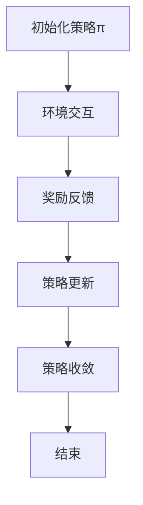

                 

### AI Agent在智能教育资源分配中的应用

随着人工智能技术的飞速发展，智能教育逐渐成为教育领域的研究热点。智能教育不仅能够提高教育质量，还能根据学生的个性化需求进行资源分配，从而实现教育的公平与效率。在这其中，AI Agent作为一种智能实体，其在教育资源分配中的应用显得尤为重要。本文将围绕AI Agent在智能教育资源分配中的应用进行深入探讨。

**关键词**：AI Agent、智能教育、资源分配、算法、应用前景

**摘要**：本文首先介绍了AI Agent的基本概念和分类，随后讨论了其在教育资源分配中的数学模型和算法原理。接着，通过具体实例展示了AI Agent在教育资源分配中的应用效果，并总结了最佳实践。最后，探讨了AI Agent在个性化教育、教育资源管理和教育评估中的应用前景，以及面临的伦理和法律问题。

### 第一部分：AI Agent概述

#### 1.1 AI Agent的基本概念

AI Agent，即人工智能代理，是一种能够感知环境、自主决策并采取行动的智能实体。它具有以下几个核心特点：

1. **自主性**：AI Agent能够自主决定行动策略，不依赖外部指令。
2. **适应性**：AI Agent能够根据环境变化调整策略，以实现目标。
3. **交互性**：AI Agent能够与环境进行交互，收集信息并作出决策。

与传统的算法相比，AI Agent不仅能够处理静态问题，还能应对动态变化的环境，这使得它们在复杂问题中具有显著优势。

#### 1.2 AI Agent的分类

AI Agent可以根据不同的标准进行分类：

1. **按任务分类**：可分为通用Agent和专用Agent。通用Agent适用于多种任务，而专用Agent仅适用于特定任务。
2. **按环境分类**：可分为确定环境Agent和不确定环境Agent。确定环境Agent在已知条件下作出决策，而不确定环境Agent则需要处理未知因素。
3. **按决策策略分类**：可分为基于规则Agent、基于模型Agent和基于学习Agent。基于规则Agent依赖于预定义的规则，基于模型Agent依赖于环境模型，基于学习Agent则通过学习历史数据作出决策。

#### 1.3 AI Agent的发展历史

AI Agent的概念最早可以追溯到20世纪50年代，随着人工智能技术的发展，AI Agent也逐渐演变。从最初的规则驱动的Agent，到基于模型的Agent，再到基于学习的Agent，AI Agent经历了多次重要的发展。近年来，随着深度学习和强化学习技术的兴起，AI Agent在各个领域得到了广泛应用。

#### 1.4 AI Agent在教育资源分配中的应用前景

教育资源分配是一个复杂的问题，涉及到教师、课程、学生等多方面因素。AI Agent通过智能化的决策，能够优化教育资源的分配，提高教育质量。具体应用前景包括：

1. **个性化教育**：AI Agent能够根据学生的个性化需求，提供定制化的教育服务。
2. **智能课堂**：AI Agent能够在课堂上实时分析学生的学习情况，提供针对性的指导。
3. **教育资源管理**：AI Agent能够帮助学校和教育机构高效管理教育资源，提高资源利用效率。

#### 1.5 本章小结

本部分介绍了AI Agent的基本概念、分类和特点，以及其在教育资源分配中的应用前景。下一部分将深入探讨AI Agent在教育资源分配中的数学模型和算法原理。通过这一系列讨论，我们将对AI Agent在智能教育资源分配中的应用有更深入的理解。

### 第二部分：智能教育资源分配中的AI Agent应用

#### 2.1 教育资源分配的数学模型

教育资源分配是一个复杂的问题，涉及到多个变量和目标。为了更清晰地描述这一问题，我们可以构建一个数学模型。

首先，定义以下几个变量：

1. **学生集合 S**：表示所有学生的集合。
2. **课程集合 C**：表示所有课程的集合。
3. **教师集合 T**：表示所有教师的集合。
4. **资源分配矩阵 R**：表示每个学生选择的课程和教师。

接下来，定义以下几个目标：

1. **最大化教育质量**：确保学生能够选择最适合自己的课程和教师。
2. **最小化资源浪费**：确保资源得到充分利用。

数学模型的基本框架可以表示为：

$$
\begin{align*}
\text{最大化} \quad & Q(S, R) \\
\text{约束条件} \quad & R \in \{0, 1\}^{m \times n} \\
& R_{ij} \in \{0, 1\}, \forall i \in S, j \in C \\
& R_{ij} = 1 \quad \text{如果学生i选择了课程j} \\
& R_{ij} = 0 \quad \text{如果学生i没有选择课程j} \\
& \sum_{j \in C} R_{ij} = 1, \forall i \in S \\
& \sum_{i \in S} R_{ij} \leq M_j, \forall j \in C \\
\end{align*}
$$

其中，$Q(S, R)$表示教育质量，$M_j$表示课程j的可选教师数量。

#### 2.2 AI Agent在教育资源分配中的算法原理

AI Agent在教育资源分配中主要依赖于强化学习算法。强化学习算法通过与环境交互，不断学习并优化策略，以实现最优决策。

具体算法原理如下：

1. **初始化**：设定初始策略$\pi$，初始化奖励函数$R$和策略评价函数$Q$。
2. **环境交互**：AI Agent根据当前状态$s$和策略$\pi$，选择行动$a$，并执行行动，进入下一个状态$s'$。
3. **奖励反馈**：环境根据行动$a$和状态转换$(s, a, s')$，给出奖励$r(s', a)$。
4. **策略更新**：根据奖励反馈，更新策略评价函数$Q(s, a)$和策略$\pi$。
5. **迭代**：重复步骤2-4，直至策略收敛。

强化学习算法的流程图如下：

#### 2.3 AI Agent在教育资源分配中的应用实例

假设有一个小学，共有100名学生、10门课程和5名教师。AI Agent的任务是根据学生的个性化需求，为他们分配最合适的课程和教师。

首先，AI Agent会收集学生的兴趣爱好、学习能力等信息，构建学生的个性化模型。然后，根据课程和教师的资源情况，构建教育资源模型。

接下来，AI Agent通过强化学习算法，为学生分配课程和教师。具体步骤如下：

1. **初始化**：设定初始策略π，初始化奖励函数R和策略评价函数Q。
2. **环境交互**：AI Agent根据当前状态s和策略π，选择行动a，即为学生分配课程和教师。
3. **奖励反馈**：根据学生的反馈，更新策略评价函数Q(s, a)和策略π。
4. **策略更新**：重复步骤2-3，直至策略收敛。

最终，AI Agent能够根据学生的个性化需求，为他们分配最合适的课程和教师，提高教育质量。

#### 2.4 AI Agent在教育资源分配中的最佳实践

在实际应用中，AI Agent在教育资源分配中应遵循以下最佳实践：

1. **数据收集与预处理**：确保收集到准确、全面的数据，并进行预处理，以提高模型的准确性。
2. **策略设计**：根据具体应用场景，设计合适的策略，如基于规则的策略、基于模型的策略或基于学习的策略。
3. **奖励设计**：设计合理的奖励机制，激励AI Agent不断优化策略，提高教育质量。
4. **模型评估**：定期评估AI Agent的性能，调整策略和模型，以提高教育资源分配的效率。
5. **用户反馈**：及时收集用户反馈，调整策略和模型，以更好地满足用户需求。

#### 2.5 本章小结

本部分介绍了AI Agent在教育资源分配中的数学模型和算法原理，并通过实例展示了其在教育资源分配中的应用效果。下一部分将探讨AI Agent在个性化教育、教育资源管理和教育评估中的应用。

### 第三部分：AI Agent在教育中的应用扩展

#### 3.1 AI Agent在个性化教育中的应用

个性化教育是近年来教育领域的重要研究方向，其核心思想是根据学生的个性化需求，提供定制化的教育服务。AI Agent在个性化教育中的应用主要体现在以下几个方面：

1. **学习路径规划**：AI Agent可以根据学生的兴趣爱好、学习能力等数据，为学生规划最适合的学习路径，提高学习效果。
2. **智能推荐**：AI Agent可以根据学生的历史学习记录和当前状态，为学生推荐最适合的学习资源，如课程、教材和习题。
3. **学习效果评估**：AI Agent可以实时监测学生的学习进度和效果，为教师提供反馈，帮助教师调整教学策略。

#### 3.2 AI Agent在教育资源管理中的应用

教育资源管理是教育机构的一项重要任务，其目标是确保教育资源的有效利用。AI Agent在教育资源管理中的应用主要体现在以下几个方面：

1. **资源调度**：AI Agent可以根据课程安排、教师资源和学生学习需求，智能调度教育资源，确保资源得到充分利用。
2. **库存管理**：AI Agent可以实时监测教材、教学设备等教育资源的库存情况，及时补充和更新资源，确保教学活动的顺利进行。
3. **费用控制**：AI Agent可以分析教育资源的利用情况，提供费用控制建议，帮助教育机构降低成本。

#### 3.3 AI Agent在教育评估中的应用

教育评估是教育质量保证的重要环节，其目的是监测和评估教育过程和结果。AI Agent在教育评估中的应用主要体现在以下几个方面：

1. **学生学习情况分析**：AI Agent可以收集和分析学生的学习数据，为教师提供学生学习情况的反馈，帮助教师调整教学策略。
2. **课程质量评估**：AI Agent可以分析课程的教学效果，为教育机构提供课程质量评估报告，帮助教育机构优化课程设计。
3. **教师教学质量评估**：AI Agent可以收集和分析教师的教学数据，为教育机构提供教师教学质量评估报告，帮助教育机构提升教师教学水平。

#### 3.4 本章小结

本部分探讨了AI Agent在个性化教育、教育资源管理和教育评估中的应用，展示了其在教育领域的广泛应用前景。下一部分将探讨AI Agent在教育应用中的未来展望与挑战。

### 第四部分：未来展望与挑战

#### 4.1 AI Agent在教育中的应用前景

随着人工智能技术的不断进步，AI Agent在教育中的应用前景十分广阔。首先，AI Agent可以帮助教育机构实现智能化管理，提高教育资源的利用效率。其次，AI Agent可以为学生提供个性化教育服务，满足学生的个性化需求。此外，AI Agent还可以在教育评估、课程设计、教学辅助等方面发挥重要作用。

#### 4.2 AI Agent在教育领域的伦理与法律问题

虽然AI Agent在教育中具有巨大潜力，但其应用也引发了一系列伦理和法律问题。首先，AI Agent在教育中的决策是否公平、公正，是否存在歧视问题。其次，AI Agent收集和处理的学生数据是否安全、隐私是否得到保护。此外，AI Agent的决策过程是否透明、可解释，用户是否有权了解和监督其决策过程。

#### 4.3 解决方案与建议

针对AI Agent在教育应用中面临的伦理与法律问题，可以采取以下解决方案和建议：

1. **建立伦理规范**：制定AI Agent在教育应用中的伦理规范，明确其应用范围和限制，确保其决策的公平、公正。
2. **加强隐私保护**：确保AI Agent收集和处理的学生数据安全，采取加密、去标识化等技术手段，保护学生的隐私。
3. **提升透明度**：设计透明的AI Agent决策机制，确保用户可以了解和监督其决策过程，增强用户信任。
4. **用户知情权**：赋予用户知情权，让用户了解AI Agent的决策过程和应用效果，提高用户满意度。

#### 4.4 本章小结

本部分探讨了AI Agent在教育应用中的未来前景和面临的伦理与法律问题，并提出了相应的解决方案和建议。通过这些措施，可以更好地推动AI Agent在教育中的应用，实现教育的智能化和公平化。

### 总结

本文系统地介绍了AI Agent在智能教育资源分配中的应用。首先，我们回顾了AI Agent的基本概念、分类和发展历史，然后深入探讨了其在教育资源分配中的数学模型和算法原理。通过具体实例，我们展示了AI Agent在教育资源分配中的实际应用效果，并总结了最佳实践。此外，我们还探讨了AI Agent在个性化教育、教育资源管理和教育评估中的应用，以及面临的伦理和法律问题。

展望未来，AI Agent在教育中的应用前景广阔。随着人工智能技术的不断进步，AI Agent将不仅能够提高教育质量，还能实现教育资源的公平分配。然而，其应用也面临一系列伦理和法律挑战，需要我们共同努力解决。

**作者：AI天才研究院/AI Genius Institute & 禅与计算机程序设计艺术 /Zen And The Art of Computer Programming**

