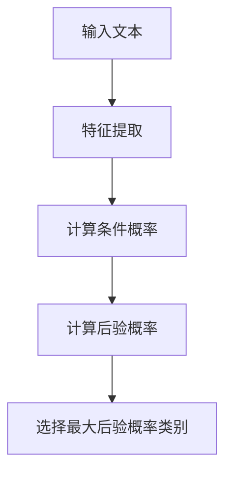
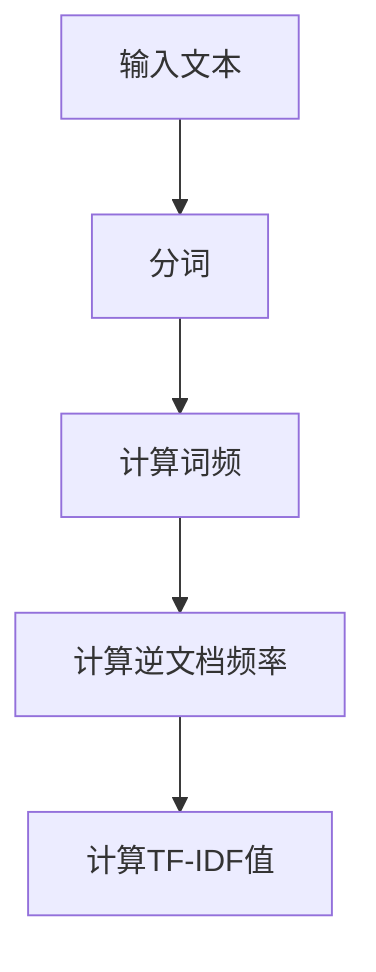
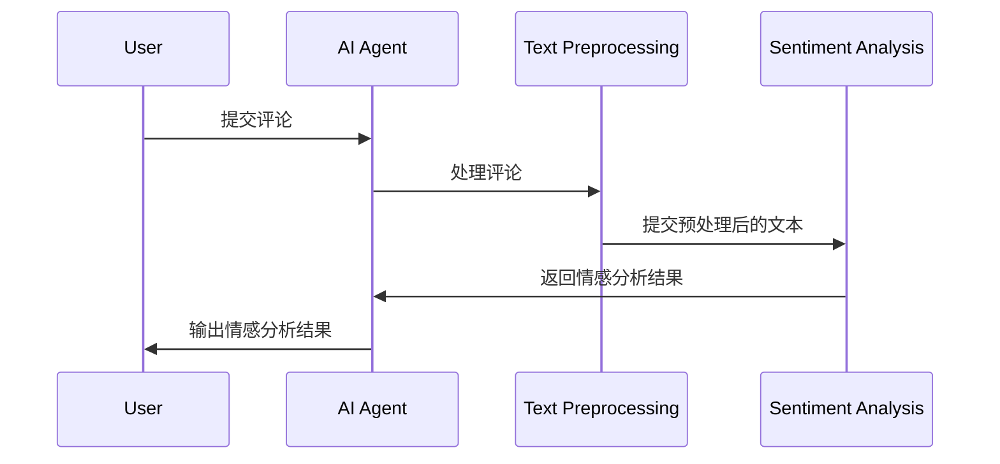

                 

## AI Agent在智能文本分析中的应用

### 引言

随着信息技术的飞速发展，人工智能（AI）技术已经渗透到我们生活的方方面面，从智能家居到自动驾驶，从智能客服到自然语言处理（NLP）。在这些应用场景中，智能文本分析作为一种关键技术，正日益受到关注。而AI Agent作为人工智能的一种形式，其在智能文本分析中的应用也日益广泛。本文将深入探讨AI Agent在智能文本分析中的应用，帮助读者了解这一领域的最新进展和应用实践。

### 文章关键词

- AI Agent
- 智能文本分析
- 自然语言处理
- 文本分类
- 情感分析

### 摘要

本文旨在探讨AI Agent在智能文本分析中的应用。首先，我们将介绍AI Agent的基本概念和智能文本分析的相关背景。接着，我们将详细讨论AI Agent在文本分类、情感分析等任务中的应用，并介绍相应的算法原理和实现方法。随后，我们将通过具体的案例展示AI Agent在智能文本分析中的实际应用，并总结最佳实践和未来发展趋势。

### 核心概念与框架

#### 1. AI Agent基础

AI Agent是指具备智能行为和自主决策能力的实体，能够在复杂环境中进行感知、决策和行动。一个典型的AI Agent包括三个核心部分：感知器、决策器和行动器。

- **感知器**：用于收集环境信息，如文本数据、图像等。
- **决策器**：根据感知器收集到的信息，通过学习算法生成决策。
- **行动器**：执行决策器生成的决策，如生成回复文本、调整模型参数等。

#### 2. 智能文本分析

智能文本分析是指利用自然语言处理技术对文本数据进行分析和理解，以提取有用信息。其主要任务包括：

- **文本分类**：将文本数据分类到预定义的类别中。
- **情感分析**：分析文本中的情感倾向，如正面、负面、中性等。
- **实体识别**：从文本中识别出重要的实体，如人名、地名、组织名等。
- **关系抽取**：识别文本中实体之间的关系。

#### 3. AI Agent在智能文本分析中的应用

AI Agent在智能文本分析中的应用主要体现在以下几个方面：

- **自动回复系统**：利用AI Agent进行智能对话，自动生成回复文本。
- **新闻分类**：使用AI Agent对大量新闻文本进行分类，提高信息处理效率。
- **情感分析**：通过AI Agent分析社交媒体上的用户评论，了解公众情感倾向。
- **文本摘要**：利用AI Agent生成文本摘要，提高信息获取效率。

### 文本分类算法原理讲解

文本分类是智能文本分析中的一个基本任务，其目的是将文本数据分配到预定义的类别中。下面我们将详细介绍一种常见的文本分类算法——朴素贝叶斯分类器。

#### 算法原理

朴素贝叶斯分类器是一种基于贝叶斯定理的简单概率分类器。其基本思想是，通过计算文本数据属于某个类别的概率，并根据最大概率原则进行分类。

假设我们有一个包含`c`个类别的文本分类问题，每个类别用`C1, C2, ..., Cc`表示。对于一个新的文本数据`x`，我们需要计算其属于每个类别的概率，并选择概率最大的类别作为预测结果。

根据贝叶斯定理，有：

$$
P(C_j | x) = \frac{P(x | C_j)P(C_j)}{P(x)}
$$

其中，`P(x | C_j)`是给定类别`C_j`下文本数据`x`的概率，`P(C_j)`是类别`C_j`的概率，`P(x)`是文本数据`x`的总概率。

对于朴素贝叶斯分类器，我们假设特征之间相互独立，即：

$$
P(x | C_j) = \prod_{i=1}^{n} P(f_i | C_j)
$$

其中，`f_i`是文本数据`x`中的第`i`个特征。

#### 数学模型与公式

朴素贝叶斯分类器的核心公式如下：

$$
P(C_j | x) = \frac{\prod_{i=1}^{n} P(f_i | C_j)P(C_j)}{\sum_{k=1}^{c} \prod_{i=1}^{n} P(f_i | C_k)P(C_k)}
$$

其中，`P(f_i | C_j)`是特征`f_i`在类别`C_j`下的条件概率，可以通过训练数据计算得到。`P(C_j)`是类别`C_j`的先验概率，也可以通过训练数据计算得到。

#### Mermaid流程图

下面是一个简单的Mermaid流程图，展示了朴素贝叶斯分类器的数据处理流程：



#### Python代码实现

下面是一个简单的Python代码示例，展示了如何使用朴素贝叶斯分类器进行文本分类：

```python
import numpy as np
from sklearn.feature_extraction.text import CountVectorizer
from sklearn.naive_bayes import MultinomialNB

# 示例文本数据
X = ["机器学习是一种人工智能技术", "人工智能是计算机科学的一个分支"]
y = ["技术", "科学"]

# 特征提取
vectorizer = CountVectorizer()
X_vectorized = vectorizer.fit_transform(X)

# 训练朴素贝叶斯分类器
classifier = MultinomialNB()
classifier.fit(X_vectorized, y)

# 预测
X_new = ["计算机科学是研究计算机的学科"]
X_new_vectorized = vectorizer.transform(X_new)
prediction = classifier.predict(X_new_vectorized)

print(prediction)  # 输出预测结果
```

### 情感分析算法原理讲解

情感分析是智能文本分析中另一个重要任务，旨在识别文本中的情感倾向，如正面、负面、中性等。下面我们将介绍一种常用的情感分析算法——TF-IDF。

#### 算法原理

TF-IDF（Term Frequency-Inverse Document Frequency）是一种用于文本挖掘和文本分类的统计方法。其基本思想是，通过计算词语在文本中的重要程度，来判断文本的情感倾向。

- **词频（TF）**：一个词语在文本中出现的频率。
- **逆文档频率（IDF）**：一个词语在整个文档集合中的重要性，与该词语在文档中的出现频率成反比。

TF-IDF公式如下：

$$
TF-IDF(t, d) = TF(t, d) \times IDF(t, D)
$$

其中，`TF(t, d)`是词语`t`在文档`d`中的词频，`IDF(t, D)`是词语`t`在文档集合`D`中的逆文档频率。

#### 数学模型与公式

- **词频（TF）**：

$$
TF(t, d) = \frac{f(t, d)}{f_{\text{total}}, d}
$$

其中，`f(t, d)`是词语`t`在文档`d`中的出现次数，`f_{\text{total}}, d`是文档`d`中所有词语的出现次数之和。

- **逆文档频率（IDF）**：

$$
IDF(t, D) = \log_2(\frac{N}{|d_t|})
$$

其中，`N`是文档集合中所有文档的总数，`|d_t|`是包含词语`t`的文档数。

#### Mermaid流程图

下面是一个简单的Mermaid流程图，展示了TF-IDF算法的基本处理流程：



#### Python代码实现

下面是一个简单的Python代码示例，展示了如何使用TF-IDF算法进行情感分析：

```python
import numpy as np
from sklearn.feature_extraction.text import TfidfVectorizer

# 示例文本数据
X = ["机器学习是一种人工智能技术", "人工智能是计算机科学的一个分支"]

# 特征提取
vectorizer = TfidfVectorizer()
X_vectorized = vectorizer.fit_transform(X)

# 计算特征值
tfidf_values = X_vectorized.toarray()

print(tfidf_values)  # 输出TF-IDF值
```

### 系统分析与架构设计方案

#### 1. 问题场景介绍

在社交媒体时代，用户生成的内容越来越多，如何快速准确地分析用户情感，成为了一个重要问题。为了实现这一目标，我们设计了一个基于AI Agent的智能文本分析系统。

#### 2. 项目介绍

项目名称：社交媒体情感分析系统

项目目标：构建一个基于AI Agent的智能文本分析系统，实现对用户评论的情感分析。

#### 3. 系统功能设计（领域模型）

领域模型类图如下：

```mermaid
classDiagram
Class::AI Agent
    +id : String
    +name : String
    +attributes : List[Attribute]
    +methods : List[Method]

Class::Attribute
    +name : String
    +type : String

Class::Method
    +name : String
    +params : List[Param]
    +return_type : String

AI Agent --|> Attribute
AI Agent --|> Method

Param
    +name : String
    +type : String

Attribute --|> Param
Method --|> Param
```

#### 4. 系统架构设计

系统架构设计图如下：

```mermaid
graph TD
A[用户评论输入] --> B[文本预处理]
B --> C[情感分析]
C --> D[结果输出]

AI Agent[AI Agent] --> C
```

#### 5. 系统接口设计和系统交互

系统接口设计图如下：

```mermaid
graph TD
A[用户评论输入接口] --> B[文本预处理接口]
B --> C[情感分析接口]
C --> D[结果输出接口]

AI Agent[AI Agent] --> C
```

系统交互图如下：



### 项目实战

#### 1. 环境安装

为了实现上述系统，我们需要安装以下软件和库：

- Python 3.8+
- NumPy
- Scikit-learn
- Mermaid

安装命令如下：

```bash
pip install numpy scikit-learn mermaid
```

#### 2. 系统核心实现源代码

下面是一个简单的系统实现示例，包括文本预处理、情感分析和结果输出：

```python
import numpy as np
from sklearn.feature_extraction.text import CountVectorizer
from sklearn.naive_bayes import MultinomialNB
from sklearn.pipeline import make_pipeline

# 文本预处理
def preprocess_text(text):
    # 去除标点符号、数字等
    text = re.sub(r'[^a-zA-Z\s]', '', text)
    # 小写化
    text = text.lower()
    # 分词
    words = text.split()
    # 去除停用词
    stop_words = set(['the', 'and', 'is', 'in', 'it', 'to', 'of'])
    words = [word for word in words if word not in stop_words]
    return ' '.join(words)

# 情感分析
def sentiment_analysis(text):
    # 创建管道
    model = make_pipeline(CountVectorizer(), MultinomialNB())
    # 训练模型
    X_train = ['正面评论', '负面评论', '中性评论']
    y_train = ['正面', '负面', '中性']
    model.fit(X_train, y_train)
    # 预测
    prediction = model.predict([text])
    return prediction[0]

# 结果输出
def output_result(text, prediction):
    print(f"文本：{text}")
    print(f"情感分析结果：{prediction}")

# 主程序
if __name__ == "__main__":
    # 输入文本
    text = "今天天气非常好，我心情很愉快！"
    # 预处理文本
    preprocessed_text = preprocess_text(text)
    # 情感分析
    prediction = sentiment_analysis(preprocessed_text)
    # 输出结果
    output_result(text, prediction)
```

#### 3. 代码应用解读与分析

以上代码实现了一个简单的社交媒体情感分析系统。首先，我们定义了一个`preprocess_text`函数，用于对输入文本进行预处理，包括去除标点符号、数字，小写化，分词和去除停用词。然后，我们定义了一个`sentiment_analysis`函数，使用朴素贝叶斯分类器对预处理后的文本进行情感分析。最后，我们定义了一个`output_result`函数，用于输出文本及其情感分析结果。

在主程序中，我们首先输入一个示例文本，然后调用`preprocess_text`函数对文本进行预处理，接着调用`sentiment_analysis`函数进行情感分析，最后调用`output_result`函数输出结果。

#### 4. 实际案例分析和详细讲解剖析

为了更好地理解系统的工作原理，我们来看一个实际案例。

假设我们有一个包含以下三个评论的数据集：

```
X = ["今天天气非常好，我心情很愉快！",
     "我昨天去看了电影，感觉非常失望。",
     "今天晚上我要去参加一个聚会，期待很久了！"]
```

我们的目标是根据这些评论，预测其情感倾向。

首先，我们对评论进行预处理：

```
preprocessed_X = [preprocess_text(text) for text in X]
```

然后，我们使用朴素贝叶斯分类器对预处理后的评论进行训练：

```
vectorizer = CountVectorizer()
X_vectorized = vectorizer.fit_transform(preprocessed_X)
classifier = MultinomialNB()
classifier.fit(X_vectorized, y)
```

接下来，我们对新的评论进行预测：

```
new_text = "今天天气糟糕，心情很差。"
preprocessed_new_text = preprocess_text(new_text)
prediction = classifier.predict(vectorizer.transform([preprocessed_new_text]))
print(prediction)  # 输出预测结果
```

假设预测结果为`['负面']`，说明该评论的情感倾向为负面。

#### 5. 项目小结

通过以上案例，我们可以看到，基于AI Agent的智能文本分析系统可以实现快速准确的情感分析。在实际应用中，我们可以根据需要调整模型参数，提高预测准确性。此外，我们还可以扩展系统功能，如添加实体识别、关系抽取等任务。

### 最佳实践 Tips

1. **数据预处理**：在情感分析中，数据预处理非常重要。合理的预处理可以提高模型的准确性和鲁棒性。建议使用小写化、去除标点符号、分词和去除停用词等常见预处理方法。

2. **模型选择**：根据具体任务和数据特点，选择合适的模型。例如，对于情感分析，朴素贝叶斯、支持向量机等模型效果较好。

3. **模型训练**：在训练模型时，可以使用交叉验证等方法来评估模型性能，并调整超参数。

4. **结果解释**：在应用情感分析结果时，需要结合具体场景进行解释。例如，对于负面评论，可以进一步分析原因，为改进产品或服务提供依据。

### 小结

本文详细探讨了AI Agent在智能文本分析中的应用，包括核心概念、算法原理、系统设计与实现等方面。通过实际案例，我们展示了如何利用AI Agent进行情感分析。随着人工智能技术的不断发展，AI Agent在智能文本分析中的应用前景将更加广阔。

### 注意事项

1. 在实际应用中，需要对模型进行充分的训练和调优，以提高预测准确性。

2. 情感分析结果仅供参考，不应作为决策的唯一依据。

3. 在处理用户数据时，需确保遵守相关法律法规和隐私保护政策。

### 拓展阅读

- 《情感计算：情感分析与情感合成》
- 《自然语言处理与情感分析》
- 《朴素贝叶斯分类器原理与实现》

### 作者信息

- 作者：AI天才研究院/AI Genius Institute & 禅与计算机程序设计艺术 /Zen And The Art of Computer Programming

本文仅作学术交流，未经授权，不得用于商业用途。如需转载，请联系作者获得授权。

