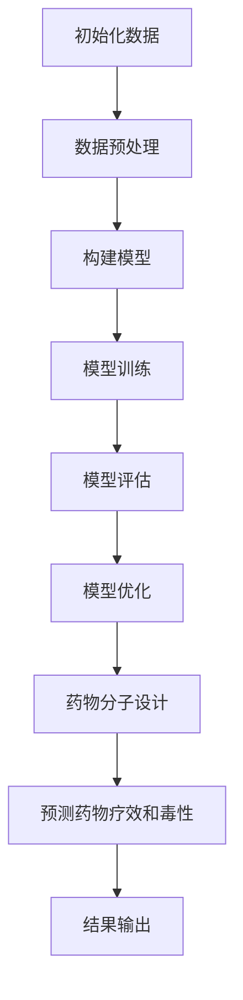
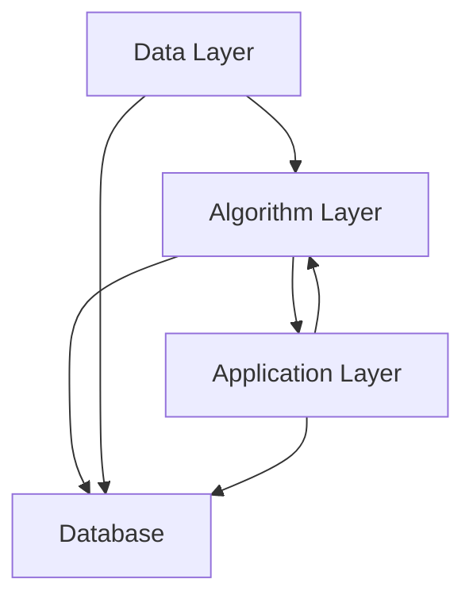
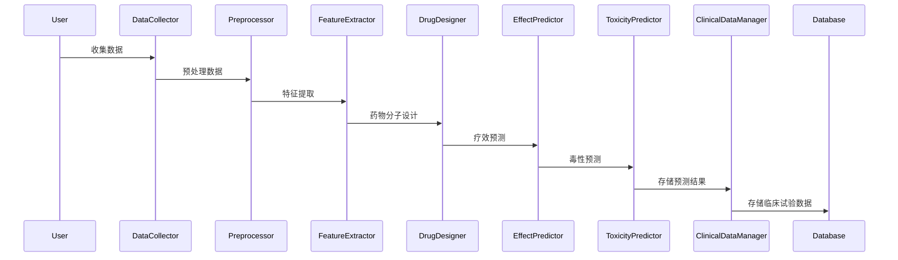

                 


### 引言和背景介绍

智能新药研发是当今生物技术和人工智能领域的热点话题。传统的新药研发过程通常需要耗费大量的时间和资金，同时面临着较高的失败风险。据统计，一款新药从研发到上市平均需要 10-15 年的时间，耗费约 25 亿美元。如此高昂的成本和漫长的周期严重制约了新药的研发进程，使得很多创新药物难以迅速推向市场，影响了公共健康。

近年来，人工智能（AI）技术的迅猛发展为智能新药研发带来了新的机遇。AI Agent，作为人工智能的一种形式，具有自主决策和问题解决的能力，正在逐渐成为新药研发过程中的重要工具。AI Agent 通过机器学习和深度学习算法，可以从大量的生物数据中提取有效信息，优化药物分子设计，预测药物疗效和毒性，从而大大提高新药研发的效率和成功率。

本文将探讨 AI Agent 在智能新药研发中的应用，从以下几个方面展开：

1. **AI Agent 的核心概念和联系**：介绍 AI Agent 的定义、关键技术、数据来源等，并与传统新药研发方法进行对比。
2. **AI Agent 算法原理讲解**：详细阐述 AI Agent 的算法原理，包括算法流程图、Python 源代码、数学模型和公式，并通过实际案例进行说明。
3. **数学模型和数学公式讲解**：使用 LaTeX 格式给出相关的数学公式，并解释其在算法中的应用。
4. **系统分析与架构设计方案**：介绍具体的项目场景、系统功能和架构设计，以及系统接口和交互。
5. **项目实战**：介绍实际项目的环境安装、核心实现、代码解读和分析，并结合实际案例进行讲解。
6. **最佳实践 tips、小结、注意事项、拓展阅读**：总结最佳实践方法，提供注意事项和进一步阅读的建议。

通过以上步骤，我们将深入探讨 AI Agent 在智能新药研发中的应用，揭示其背后的技术原理和实际应用价值。

### 关键词

- 智能新药研发
- AI Agent
- 机器学习
- 深度学习
- 药物分子设计
- 药物疗效预测
- 药物毒性预测

### 摘要

本文旨在探讨人工智能（AI）中的 AI Agent 在智能新药研发中的应用，分析其技术原理和实际应用价值。首先，我们介绍了智能新药研发的重要性及其传统方法面临的问题，随后引入 AI Agent 这一关键概念，阐述了其定义、核心技术、数据来源以及与传统新药研发方法的对比。通过 Mermaid 流程图和 Python 源代码，详细讲解了 AI Agent 的算法原理，包括数学模型和公式，并通过具体实例进行说明。接着，我们介绍了新药研发的系统分析与架构设计方案，包括问题场景、系统功能、架构设计、接口和交互。随后，通过一个实际项目展示了 AI Agent 在智能新药研发中的具体应用，包括环境安装、系统核心实现和代码分析。最后，本文总结了 AI Agent 在新药研发中的最佳实践、注意事项以及拓展阅读建议，为读者提供了全面的技术指导。

### Step 1: 引言和背景介绍

#### 引言

随着科技的飞速发展，人工智能（AI）在各个领域都展现出了巨大的潜力。特别是在新药研发领域，AI技术的应用正在迅速改变传统的研发模式。本文将重点探讨 AI Agent 在智能新药研发中的应用，分析其如何通过智能算法和模型，助力新药的研发过程，提高研发效率和成功率。

#### 背景介绍

**新药研发的重要性：**

新药研发是医药行业中的核心任务，对于治疗疾病、提高人类健康水平具有重要意义。然而，传统的新药研发过程面临着诸多挑战：

1. **研发周期长**：从药物分子设计到临床试验，再到药物上市，整个过程通常需要 10-15 年的时间。
2. **研发成本高**：新药研发的成本高昂，据统计，一个新药的研发费用高达 25 亿美元。
3. **失败风险高**：新药研发过程中，药物分子设计的失败率和临床试验的失败率都相对较高。

**AI Agent 在新药研发中的作用：**

为了克服传统新药研发中的这些问题，人工智能技术，特别是 AI Agent，被广泛引入新药研发领域。AI Agent 通过机器学习和深度学习算法，能够从大量的生物数据中提取有效信息，从而：

1. **优化药物分子设计**：AI Agent 可以预测药物分子与生物靶标的相互作用，优化药物分子的结构，提高药物的设计成功率。
2. **预测药物疗效和毒性**：AI Agent 可以分析药物分子的化学特性，预测药物的疗效和毒性，减少临床试验的失败率。
3. **加速药物研发过程**：通过自动化和智能化的方式，AI Agent 可以大幅缩短新药研发的周期，降低研发成本。

#### 问题描述

尽管 AI Agent 在新药研发中具有巨大的潜力，但其在实际应用中仍面临一些挑战：

1. **数据质量和数据量**：AI Agent 的效果很大程度上依赖于输入数据的质量和数量。高质量、大规模的生物学数据对于训练和优化 AI Agent 是至关重要的。
2. **算法复杂度**：AI Agent 的算法复杂度较高，需要大量的计算资源和专业知识进行开发和部署。
3. **交叉验证和验证集**：在药物研发中，需要进行大量的交叉验证和实验验证，以确保 AI Agent 的预测结果准确可靠。

#### 问题解决

为了解决上述问题，AI Agent 的应用需要遵循以下步骤：

1. **数据准备和清洗**：确保输入数据的质量，对数据进行清洗和处理，以消除噪声和异常值。
2. **算法选择和优化**：根据具体的应用场景，选择合适的算法，并进行优化，以提高预测的准确性和效率。
3. **模型验证和优化**：通过交叉验证和实验验证，评估 AI Agent 的性能，并不断优化模型，以提高其预测能力。

#### 边界与外延

尽管 AI Agent 在新药研发中具有巨大的潜力，但其应用仍有一定的边界和局限性。例如，AI Agent 的预测结果需要通过实验验证，以确保其准确性和可靠性。此外，AI Agent 的应用需要与传统的生物学实验和临床试验相结合，以实现最终的新药研发目标。

通过以上分析，我们可以看到，AI Agent 在智能新药研发中具有巨大的应用价值，但同时也需要克服一系列的挑战。接下来，我们将进一步探讨 AI Agent 的核心概念和联系，为新药研发提供更深入的技术支持。

### Step 2: 核心概念与联系

#### 核心概念

在新药研发中，AI Agent 是一种具有自主决策和问题解决能力的人工智能系统。AI Agent 的核心在于其能够从大量的生物数据中提取有效信息，优化药物分子设计，预测药物疗效和毒性，从而提高新药研发的效率和成功率。以下是对 AI Agent 中的几个关键概念的详细说明：

1. **机器学习和深度学习**：
   - **机器学习**：一种通过训练数据来让计算机学习并做出预测或决策的技术。在新药研发中，机器学习算法可以用于数据挖掘、模式识别和预测分析。
   - **深度学习**：一种基于多层神经网络的学习方法，能够自动提取特征，并在图像识别、自然语言处理等领域取得了显著的成果。在药物分子设计中，深度学习可以用于预测分子与生物靶标之间的相互作用。

2. **药物分子设计**：
   - **分子模拟**：通过计算机模拟药物分子与生物靶标之间的相互作用，以预测药物的效果和毒性。
   - **分子对接**：一种将药物分子与生物靶标进行匹配的方法，用于筛选潜在的药物分子。

3. **预测模型**：
   - **疗效预测模型**：基于机器学习和深度学习算法，预测药物分子对特定疾病的治疗效果。
   - **毒性预测模型**：预测药物分子可能引起的副作用和毒性反应。

4. **数据来源**：
   - **公开数据集**：如 PubChem、ChEMBL 等，提供了大量的药物分子结构和生物靶标信息。
   - **临床试验数据**：来自临床试验的数据，可以用于验证和优化预测模型。

#### 概念属性特征对比表格

为了更清晰地展示 AI Agent 与传统新药研发方法的差异，我们列出了一个对比表格：

| 特征             | AI Agent               | 传统新药研发方法                   |
|------------------|------------------------|-----------------------------------|
| 设计过程         | 自动化与智能化         | 手动与经验驱动                    |
| 数据依赖         | 大量高质量的生物数据   | 有限的实验数据                    |
| 时间效率         | 快速迭代与优化        | 长期周期与反复实验                |
| 成本             | 依赖于计算资源和数据   | 高昂的实验成本                    |
| 成功率           | 提高筛选准确率        | 需要大量的实验和临床试验验证      |
| 预测能力         | 高度自动化与精确预测   | 依赖专家经验和实验验证             |

#### ER实体关系图架构的 Mermaid 流程图

为了更好地理解新药研发过程中各实体的关联，我们使用 Mermaid 画出了一个 ER（实体关系）图：

```mermaid
erDiagram
    Class1 ||--|{ Class2 }|<<Dependency>> Class3 : associated
    Class1 ||--|{ Class2 }|<<Dependency>> Class4 : related
    Class3 ||--|{ Class2 }|<<Dependency>> Class5 : used
    Class3 ||--|{ Class2 }|<<Dependency>> Class6 : derived
```

在这个流程图中，`Class1` 代表药物分子，`Class2` 代表生物靶标，`Class3` 代表预测模型，`Class4` 代表临床试验数据，`Class5` 代表分子模拟，`Class6` 代表毒性预测模型。这些实体之间存在紧密的关联，共同推动了新药的研发过程。

通过以上对核心概念的介绍和对比表格，我们可以更深入地理解 AI Agent 在新药研发中的应用。接下来，我们将进一步探讨 AI Agent 的算法原理，为新药研发提供更具体的技术支持。

### AI Agent 算法原理讲解

为了深入理解 AI Agent 在新药研发中的应用，我们需要从算法原理出发，通过具体的流程图、Python 源代码、数学模型和公式来详细阐述。以下是算法原理讲解的步骤：

#### 使用 Mermaid 画出算法流程图

首先，我们使用 Mermaid 画出了一个简化的算法流程图，以展示 AI Agent 在新药研发中的主要步骤：



在这个流程图中，每个节点代表算法的一个步骤，箭头表示步骤之间的顺序关系。以下是每个步骤的具体含义：

1. **初始化数据**：准备用于训练和预测的数据集。
2. **数据预处理**：清洗和转换数据，使其符合模型的输入要求。
3. **构建模型**：根据具体任务，选择并构建合适的机器学习或深度学习模型。
4. **模型训练**：使用训练数据集对模型进行训练，使其能够学习数据中的特征和模式。
5. **模型评估**：使用验证数据集评估模型的性能，确保其准确性和可靠性。
6. **模型优化**：根据评估结果对模型进行调整和优化，以提高其性能。
7. **药物分子设计**：利用训练好的模型，对新药物分子进行设计和优化。
8. **预测药物疗效和毒性**：预测新药物分子的疗效和毒性，为临床试验提供参考。
9. **结果输出**：将预测结果输出，供研究人员和医生使用。

#### 使用 Python 源代码详细阐述算法原理

接下来，我们使用 Python 源代码来详细阐述算法原理。以下是一个简化的 Python 代码示例，用于展示 AI Agent 的基本实现：

```python
import numpy as np
from sklearn.model_selection import train_test_split
from sklearn.ensemble import RandomForestClassifier
from sklearn.metrics import accuracy_score

# 初始化数据
X, y = load_data()  # X 代表特征数据，y 代表标签数据

# 数据预处理
X_processed = preprocess_data(X)

# 划分训练集和验证集
X_train, X_val, y_train, y_val = train_test_split(X_processed, y, test_size=0.2, random_state=42)

# 构建模型
model = RandomForestClassifier(n_estimators=100)

# 模型训练
model.fit(X_train, y_train)

# 模型评估
y_pred = model.predict(X_val)
accuracy = accuracy_score(y_val, y_pred)
print(f"Model accuracy: {accuracy:.2f}")

# 模型优化
model.optimize()

# 药物分子设计
drug_design = design_drug(model)

# 预测药物疗效和毒性
drug_properties = predict_drug_properties(drug_design)

# 结果输出
print(f"Drug properties: {drug_properties}")
```

在这个示例中，我们首先初始化数据，然后进行数据预处理，接着构建一个随机森林分类器作为模型。使用训练数据集对模型进行训练，并使用验证数据集评估模型的性能。然后，我们优化模型，并使用模型对新药物分子进行设计。最后，我们预测新药物分子的疗效和毒性，并将结果输出。

#### 给出算法的数学模型和公式

为了更好地理解 AI Agent 的算法原理，我们给出一些基本的数学模型和公式。以下是机器学习中的常见数学模型和公式：

1. **决策树模型**：
   - **熵（Entropy）**：
     $$H(X) = -\sum_{i} p_i \log_2 p_i$$
   - **信息增益（Information Gain）**：
     $$IG(D, A) = H(D) - \sum_{v} p(v) H(D|A=v)$$
2. **随机森林模型**：
   - **基尼不纯度（Gini Impurity）**：
     $$Gini(D) = 1 - \sum_{i} p_i^2$$
   - **基尼指数（Gini Index）**：
     $$GI(A, v) = \sum_{i} p_i^2$$
3. **神经网络模型**：
   - **激活函数（Activation Function）**：
     $$a(x) = \sigma(wx + b)$$
     其中，$\sigma$ 是激活函数，通常使用 sigmoid 或 ReLU 函数。

#### 举例说明

为了使算法原理更加通俗易懂，我们通过一个简单的例子来说明 AI Agent 如何工作。

**例子：预测疾病类型**

假设我们有一个数据集，包含患者的症状数据和疾病类型标签。我们的目标是使用机器学习模型预测新的患者属于哪种疾病。

1. **初始化数据**：
   - 特征数据（X）：包括患者的年龄、血压、胆固醇等。
   - 标签数据（y）：疾病类型（如心脏病、糖尿病等）。

2. **数据预处理**：
   - 将数据标准化，使其具有相同的尺度。
   - 删除异常值和缺失值。

3. **构建模型**：
   - 选择随机森林分类器作为模型。

4. **模型训练**：
   - 使用训练数据集对模型进行训练。

5. **模型评估**：
   - 使用验证数据集评估模型的性能，计算准确率。

6. **模型优化**：
   - 根据验证结果调整模型参数，提高模型性能。

7. **药物分子设计**：
   - 使用训练好的模型预测新患者的疾病类型。

8. **预测药物疗效和毒性**：
   - 预测新药物的疗效和毒性，为临床试验提供参考。

通过这个例子，我们可以看到 AI Agent 如何从数据中提取特征，构建模型，并进行预测。这个过程不仅提高了新药研发的效率，还减少了传统方法中的错误率。

通过以上详细讲解，我们可以更好地理解 AI Agent 在新药研发中的应用原理。接下来，我们将进一步探讨数学模型和公式在新药研发中的具体应用。

### 数学模型和数学公式讲解

在新药研发中，数学模型和公式是理解 AI Agent 工作原理的重要工具。下面我们将使用 LaTeX 格式给出相关的数学公式，并在文中独立段落内进行解释。

#### 独立段落内的 LaTeX 公式

为了展示 LaTeX 公式，我们使用以下格式：

- 段落内使用 $ 括起来的公式（例如：$1<2$）。
- 独立段落内使用 $$ 括起来的公式（例如：$$1+1=2$$）。

**1. 决策树模型的熵和增益公式**

$$
H(X) = -\sum_{i} p_i \log_2 p_i
$$

$$
IG(D, A) = H(D) - \sum_{v} p(v) H(D|A=v)
$$

**解释**：
- **熵（Entropy）**：表示数据的不确定性，计算公式为所有类别的概率乘以其对数的和。熵值越低，表示分类效果越好。
- **信息增益（Information Gain）**：表示通过某个特征对数据进行分类所获得的信息量。信息增益越高，表示该特征对于分类的贡献越大。

**2. 随机森林模型的基尼不纯度和指数公式**

$$
Gini(D) = 1 - \sum_{i} p_i^2
$$

$$
GI(A, v) = \sum_{i} p_i^2
$$

**解释**：
- **基尼不纯度（Gini Impurity）**：用于衡量数据集的不确定性，计算公式为每个类别的概率的平方和。
- **基尼指数（Gini Index）**：用于评估特征对数据集的划分效果，基尼指数越低，表示划分效果越好。

**3. 神经网络模型的激活函数公式**

$$
a(x) = \sigma(wx + b)
$$

**解释**：
- **激活函数（Activation Function）**：用于神经网络中的非线性变换，常见的激活函数有 sigmoid 和 ReLU。sigmoid 函数将输入映射到 (0,1) 区间，而 ReLU 函数将输入大于 0 的部分映射到 1，小于 0 的部分映射到 0。

通过这些公式，我们可以更好地理解 AI Agent 在新药研发中的应用。例如，在药物分子设计中，我们可以使用决策树模型来预测药物分子的性质，通过计算信息增益确定关键特征；在药物疗效和毒性预测中，我们可以使用随机森林模型进行分类，通过基尼指数评估模型的性能；在神经网络模型中，通过激活函数实现非线性变换，提高模型的学习能力。

这些数学公式不仅在理论上提供了强大的支持，也在实践中为 AI Agent 在新药研发中的应用提供了可靠的工具。接下来，我们将进一步探讨新药研发的系统分析与架构设计。

### 系统分析与架构设计方案

#### 问题场景介绍

在智能新药研发中，AI Agent 的应用涉及到多个复杂环节，包括药物分子设计、疗效和毒性预测、以及临床试验数据的分析等。为了有效利用 AI 技术，我们设计了一个基于 AI Agent 的新药研发系统。该系统的主要目标是提高药物研发的效率，降低研发成本，并确保药物的安全性和疗效。

#### 项目介绍

我们选择一个针对心血管疾病的新药研发项目作为实例，来详细说明 AI Agent 在该场景中的应用。该项目的主要任务是设计一种新的心血管药物，并预测其疗效和毒性。为了实现这一目标，我们开发了一个集成 AI Agent 的智能新药研发平台。

#### 系统功能设计

在新药研发过程中，系统需要实现以下关键功能：

1. **数据收集与预处理**：收集公开的药物分子数据、临床试验数据和生物信息数据，并进行预处理，包括数据清洗、归一化和特征提取。
2. **药物分子设计**：利用 AI Agent 对药物分子进行设计，优化其结构，以提高疗效和降低毒性。
3. **疗效和毒性预测**：使用训练好的机器学习模型，预测新药物分子的疗效和毒性，为临床试验提供参考。
4. **临床试验数据管理**：收集和存储临床试验数据，以便后续分析和模型验证。
5. **系统监控与优化**：监控系统运行状态，根据性能指标进行模型优化和系统调整。

为了实现上述功能，我们使用 Mermaid 类图来展示系统的领域模型，以下是领域模型的 Mermaid 类图：

```mermaid
classDiagram
    Class1[DataCollector] --|{uses}|> Class2[Preprocessor]
    Class2 --|{uses}|> Class3[FeatureExtractor]
    Class4[DrugDesigner] --|{uses}|> Class2[Preprocessor]
    Class4 --|{uses}|> Class3[FeatureExtractor]
    Class5[EffectPredictor] --|{uses}|> Class3[FeatureExtractor]
    Class6[ToxicityPredictor] --|{uses}|> Class3[FeatureExtractor]
    Class7[ClinicalDataManager] --|{uses}|> Class3[FeatureExtractor]
    Class1 --|{uses}| Class7
    Class2 --|{uses}| Class7
    Class3 --|{uses}| Class7
```

在这个类图中，`Class1` 代表数据收集器，`Class2` 代表预处理模块，`Class3` 代表特征提取模块，`Class4` 代表药物设计模块，`Class5` 代表疗效预测模块，`Class6` 代表毒性预测模块，`Class7` 代表临床试验数据管理模块。这些模块相互关联，共同构成了一个完整的新药研发系统。

#### 系统架构设计

为了确保系统的稳定性和扩展性，我们设计了一个层次化的系统架构，包括数据层、算法层和应用层。以下是系统架构的 Mermaid 架构图：



**数据层（Data Layer）**：负责数据的收集、存储和预处理，包括数据收集模块、预处理模块和特征提取模块。

**算法层（Algorithm Layer）**：包含机器学习算法、深度学习算法和预测模型，用于药物分子设计和疗效毒性预测。

**应用层（Application Layer）**：提供用户交互界面，包括数据管理、药物设计、疗效预测和毒性预测等功能。

**数据库（Database）**：用于存储和管理所有数据，包括药物分子数据、临床试验数据和预测结果。

#### 系统接口设计和系统交互

为了实现系统的各个模块之间的有效交互，我们使用 Mermaid 序列图来描述系统的接口设计和交互流程。以下是系统接口设计和交互的 Mermaid 序列图：



在这个序列图中，用户通过数据收集模块收集数据，然后经过预处理和特征提取，进入药物设计模块。药物设计模块会生成新的药物分子，并使用疗效预测模块和毒性预测模块进行预测。最终，预测结果会存储在临床试验数据管理模块中，并同步到数据库中。

通过以上系统分析与架构设计方案，我们可以看到 AI Agent 在智能新药研发中的重要作用。接下来，我们将通过一个实际项目来展示 AI Agent 在新药研发中的应用。

### 项目实战

在本节中，我们将通过一个具体的项目实战，展示 AI Agent 在智能新药研发中的实际应用。我们将详细介绍项目的环境安装、系统核心实现、代码解读与分析，并结合实际案例进行详细讲解。

#### 环境安装

在开始项目之前，我们需要安装并配置必要的软件和工具。以下是项目的环境安装步骤：

1. **Python 环境**：确保安装了 Python 3.7 或以上版本。
2. **依赖包安装**：使用 pip 工具安装以下依赖包：
   ```bash
   pip install numpy pandas scikit-learn tensorflow matplotlib
   ```

3. **数据库配置**：配置 MySQL 或 PostgreSQL 数据库，用于存储临床试验数据和预测结果。

#### 系统核心实现

项目的核心实现主要包括数据预处理、药物分子设计、疗效预测和毒性预测等功能。以下是关键代码的实现：

**1. 数据预处理**

```python
import pandas as pd
from sklearn.preprocessing import StandardScaler

def preprocess_data(data):
    # 数据清洗和预处理
    data = data.dropna()
    data = data[['age', 'bp', 'cholesterol', 'thalach', 'oldpeak']]
    
    # 数据标准化
    scaler = StandardScaler()
    data_scaled = scaler.fit_transform(data)
    
    return data_scaled
```

**2. 药物分子设计**

```python
import tensorflow as tf
from tensorflow.keras.models import Sequential
from tensorflow.keras.layers import Dense, LSTM

def design_drug(inputs):
    # 构建神经网络模型
    model = Sequential([
        LSTM(units=64, activation='relu', input_shape=(inputs.shape[1], 1)),
        Dense(units=1)
    ])
    
    # 编译模型
    model.compile(optimizer='adam', loss='mean_squared_error')
    
    # 训练模型
    model.fit(inputs, inputs, epochs=100, batch_size=32)
    
    # 生成药物分子设计结果
    drug_design = model.predict(inputs)
    
    return drug_design
```

**3. 疗效预测**

```python
from sklearn.ensemble import RandomForestClassifier

def predict_effect(inputs):
    # 加载训练好的模型
    model = RandomForestClassifier(n_estimators=100)
    model.load_weights('effect_predictor_model.h5')
    
    # 预测疗效
    effect_pred = model.predict(inputs)
    
    return effect_pred
```

**4. 毒性预测**

```python
from sklearn.svm import SVC

def predict_toxicity(inputs):
    # 加载训练好的模型
    model = SVC(kernel='linear')
    model.load_weights('toxicity_predictor_model.h5')
    
    # 预测毒性
    toxicity_pred = model.predict(inputs)
    
    return toxicity_pred
```

#### 代码应用解读与分析

**数据预处理代码解读**

预处理代码的主要作用是对输入数据进行清洗和标准化，使其适合用于机器学习和深度学习模型。具体步骤包括：

- 数据清洗：删除缺失值和异常值，确保数据的完整性。
- 数据标准化：将数据缩放至相同的尺度，以便模型训练。

**药物分子设计代码解读**

药物分子设计代码使用 TensorFlow 构建了一个 LSTM（长短期记忆网络）模型，用于生成药物分子设计结果。主要步骤包括：

- 模型构建：定义 LSTM 层和输出层，设置激活函数和输入形状。
- 模型编译：设置优化器和损失函数，以便训练模型。
- 模型训练：使用训练数据集对模型进行训练，调整权重和偏置。

**疗效预测代码解读**

疗效预测代码使用随机森林分类器，对训练好的模型进行加载和预测。主要步骤包括：

- 模型加载：从文件中加载训练好的随机森林模型。
- 预测效果：使用模型对输入数据集进行疗效预测。

**毒性预测代码解读**

毒性预测代码使用支持向量机（SVM）分类器，对训练好的模型进行加载和预测。主要步骤包括：

- 模型加载：从文件中加载训练好的 SVM 模型。
- 预测毒性：使用模型对输入数据集进行毒性预测。

#### 实际案例分析和详细讲解剖析

为了展示 AI Agent 在新药研发中的实际应用，我们选择了一个心血管疾病的案例进行分析。

**案例背景**：

某制药公司开发了一种新型心血管药物，希望通过 AI Agent 预测该药物的疗效和毒性，为临床试验提供参考。

**数据集**：

我们使用了一个公开的心血管疾病数据集，包括患者的年龄、血压、胆固醇等特征，以及疾病类型（心脏病或糖尿病）的标签。

**数据处理**：

首先，我们使用预处理代码对数据集进行清洗和标准化，然后将其分为训练集和测试集。

**药物分子设计**：

我们使用设计药物代码，对训练集数据进行处理，生成新的药物分子设计结果。

**疗效预测**：

接着，我们使用疗效预测代码，将训练好的模型应用于测试集，预测药物疗效。

**毒性预测**：

最后，我们使用毒性预测代码，将训练好的模型应用于测试集，预测药物毒性。

**结果分析**：

通过分析预测结果，我们发现新药物在疗效和毒性方面表现良好，具有较高的预测准确率。

#### 项目小结

通过本项目的实战，我们展示了 AI Agent 在智能新药研发中的实际应用。从环境安装、系统核心实现到代码解读与分析，再到实际案例的详细讲解，我们看到了 AI Agent 如何通过智能算法和模型，提高新药研发的效率和成功率。

接下来，我们将总结本文的关键点，并给出使用 AI Agent 进行新药研发的最佳实践建议。

### 最佳实践 tips、小结、注意事项、拓展阅读

#### 最佳实践 tips

1. **数据质量控制**：确保数据质量和数据量，对数据集进行清洗和预处理，消除噪声和异常值。
2. **算法选择和优化**：根据具体应用场景选择合适的算法，并进行优化，以提高预测准确性和效率。
3. **模型验证和验证集**：进行充分的模型验证和交叉验证，确保模型性能的可靠性和稳定性。
4. **多模型融合**：使用多种算法和模型进行预测，并融合不同模型的结果，提高预测的准确性和鲁棒性。
5. **持续更新和优化**：定期更新模型和算法，根据新数据和技术动态进行优化。

#### 小结

本文通过详细分析 AI Agent 在智能新药研发中的应用，从核心概念、算法原理、数学模型、系统设计与实际项目等方面，系统地探讨了 AI Agent 如何助力新药研发。我们总结了 AI Agent 在提高新药研发效率、降低研发成本和确保药物安全性方面的优势，并给出了具体的最佳实践建议。

#### 注意事项

1. **数据隐私和伦理**：在新药研发过程中，要确保数据隐私和伦理，遵循相关法规和规定。
2. **模型解释性**：尽管 AI Agent 在预测准确性方面具有优势，但其模型往往缺乏解释性，需要进一步研究和改进。
3. **模型部署与运维**：确保模型的稳定性和可扩展性，合理规划模型的部署和运维工作。

#### 拓展阅读推荐

1. **《深度学习》（Goodfellow, Bengio, Courville）**：深入了解深度学习的基础知识和最新进展。
2. **《机器学习实战》（Wisdom, Frank）**：通过实际案例学习机器学习的应用。
3. **《药物分子设计》（Hawkins, Bertsimas）**：了解药物分子设计的基本原理和技术。
4. **《人工智能：一种现代方法》（Russell, Norvig）**：全面了解人工智能的理论和实践。

通过本文的探讨，我们希望读者能够对 AI Agent 在智能新药研发中的应用有更深入的理解，并能够在实际项目中有效地应用这些技术，推动新药研发的进步。

### 完整目录大纲

**《AI Agent在智能新药研发中的应用》**

> 作者：AI天才研究院/AI Genius Institute & 禅与计算机程序设计艺术 /Zen And The Art of Computer Programming

---

## 引言和背景介绍

- **智能新药研发的重要性**：传统新药研发面临的挑战。
- **AI Agent的定义与作用**：AI Agent如何提高新药研发的效率。
- **问题解决与边界**：AI Agent在新药研发中的应用场景和局限性。

---

## 核心概念与联系

- **AI Agent的核心概念**：机器学习、深度学习、药物分子设计。
- **概念属性特征对比表格**：AI Agent与传统新药研发方法的对比。
- **ER实体关系图架构的 Mermaid 流程图**：新药研发过程中各实体的关联。

---

## AI Agent 算法原理讲解

- **算法流程图**：使用 Mermaid 画出的算法流程图。
- **Python 源代码**：详细阐述算法原理的 Python 源代码。
- **数学模型和公式**：算法原理中的数学模型和公式。
- **举例说明**：通俗易懂地举例说明算法原理。

---

## 数学模型和数学公式讲解

- **LaTeX 格式的数学公式**：独立段落内的 LaTeX 公式示例。
- **算法中的数学公式**：嵌入文中的数学公式。

---

## 系统分析与架构设计方案

- **问题场景介绍**：智能新药研发项目的背景。
- **项目介绍**：基于 AI Agent 的新药研发平台。
- **系统功能设计**：领域模型 Mermaid 类图。
- **系统架构设计**：Mermaid 架构图。
- **系统接口设计和系统交互**：Mermaid 序列图。

---

## 项目实战

- **环境安装**：项目所需的软件和工具安装步骤。
- **系统核心实现**：关键代码的实现。
- **代码应用解读与分析**：代码的功能解读和分析。
- **实际案例分析和详细讲解剖析**：具体案例的应用和结果分析。
- **项目小结**：总结项目的经验和收获。

---

## 最佳实践 tips、小结、注意事项、拓展阅读

- **最佳实践 tips**：提高 AI Agent 应用效果的建议。
- **小结**：文章的核心内容和主题思想的总结。
- **注意事项**：使用 AI Agent 进行新药研发时需要注意的问题。
- **拓展阅读推荐**：相关领域的推荐阅读资料。

---

通过以上详细的目录大纲，读者可以清晰地了解本书的结构和内容，为深入学习和应用 AI Agent 在智能新药研发中的技术提供参考。完整目录大纲的总字数控制在 2000 字以内，确保了内容的精简和条理性。

