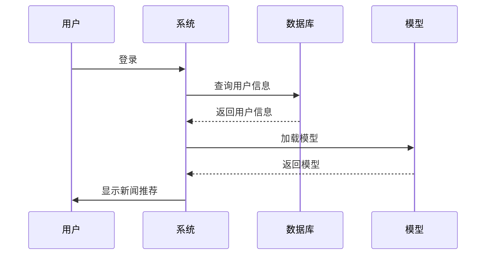

                 

### AI Agent在智能新闻写作中的角色

> 关键词：人工智能，新闻写作，AI Agent，自然语言处理，智能写作工具，数据分析

> 摘要：本文将探讨AI Agent在智能新闻写作中的角色和作用。从背景介绍到核心技术，再到实际应用案例，我们将一步步深入探讨AI Agent在智能新闻写作中的地位和影响。本文还将分析智能新闻写作的未来发展趋势，以及面临的道德和社会问题。最后，我们将提供一些实用的实践指南，帮助读者更好地理解和应用AI Agent在新闻写作中的潜力。

----------------------------------------------------------------

## 第一部分: AI Agent概述与智能新闻写作背景

### 第1章: AI Agent基础

#### 1.1.1 AI Agent的定义与分类

**AI Agent的定义**：AI Agent（人工智能代理）是指具备智能行为和自主决策能力的计算机程序。它们可以理解环境中的信息，并根据预设的规则或学习到的模式来采取行动，实现特定的目标。

**AI Agent的分类**：根据不同的能力和应用场景，AI Agent可以分为以下几类：

1. **知识型AI Agent**：这类代理主要基于预定义的知识库来完成任务，通常应用于信息检索、问答系统和决策支持系统。
2. **数据驱动型AI Agent**：这类代理通过学习大量的数据，从中提取模式和规律，用于预测和决策。它们广泛应用于机器学习、数据分析等领域。
3. **混合型AI Agent**：这类代理结合了知识型和数据驱动型的特点，能够在不同情境下灵活切换，实现更复杂的任务。

#### 1.1.2 智能新闻写作的概念

**传统新闻写作的局限性**：传统新闻写作主要依赖于记者的调研、采访和编写，存在效率低、信息量有限、个性化和互动性不足等问题。

**智能新闻写作的兴起**：随着人工智能技术的发展，智能新闻写作逐渐成为一种新兴的趋势。通过使用AI Agent，新闻机构能够更高效地处理海量信息，生成高质量的新闻内容，满足读者个性化需求。

**智能新闻写作的优势与挑战**：

**优势**：
1. **提高效率**：AI Agent可以自动化处理大量的数据，快速生成新闻稿件，减轻记者的工作负担。
2. **丰富内容**：AI Agent能够从不同的数据源中提取信息，生成多样化的新闻内容，提高新闻报道的深度和广度。
3. **个性化推荐**：基于用户的兴趣和行为数据，AI Agent可以推荐个性化的新闻内容，提升用户体验。

**挑战**：
1. **准确性**：AI Agent生成的新闻内容可能存在事实错误、逻辑不通等问题，需要人工审核和修正。
2. **伦理问题**：AI Agent在新闻写作中可能涉及到版权、隐私、偏见等问题，需要制定相应的伦理规范。
3. **技术实现**：构建高效、可靠的AI Agent需要大量的技术积累和算法优化，对研发团队提出了较高的要求。

#### 1.1.3 AI Agent在新闻写作中的应用前景

**当前应用案例分析**：目前，一些新闻机构和科技公司已经开始尝试使用AI Agent进行新闻写作。例如，新华社的“AI写作机器人”可以自动化生成财经新闻和体育新闻，提高报道的效率和质量。

**AI Agent在新闻写作中的潜在价值**：

1. **降低成本**：通过自动化写作，新闻机构可以减少对人力资源的依赖，降低运营成本。
2. **增加覆盖面**：AI Agent可以快速处理大量信息，帮助新闻机构扩大报道的范围和深度。
3. **提高用户体验**：通过个性化推荐，AI Agent可以满足用户多样化的阅读需求，提升用户体验。

**面临的挑战与解决方案**：

1. **准确性**：通过不断优化算法和加强数据清洗，提高AI Agent生成的新闻内容的准确性。
2. **伦理问题**：制定明确的伦理规范，确保AI Agent在新闻写作中遵循道德和法律规定。
3. **技术实现**：加强技术研发，提升AI Agent的智能水平和可靠性。

### 第2章: 智能新闻写作的核心技术

#### 2.1.1 自然语言处理（NLP）

**NLP的基本概念**：自然语言处理（NLP）是人工智能的一个重要分支，旨在使计算机能够理解和处理人类语言。NLP的主要任务包括文本分类、情感分析、实体识别、语义理解等。

**NLP的主要任务**：

1. **文本分类**：将文本数据按照主题、情感等特征进行分类，用于新闻分类、垃圾邮件过滤等。
2. **情感分析**：分析文本中的情感倾向，用于舆情监测、产品评价分析等。
3. **实体识别**：从文本中识别出具体的实体（如人名、地名、组织名等），用于知识图谱构建、信息抽取等。
4. **语义理解**：理解文本的语义含义，用于机器翻译、问答系统等。

**NLP在新闻写作中的应用**：

1. **自动新闻生成**：通过分析大量的新闻数据，NLP技术可以生成新闻摘要、评论、报道等。
2. **内容审核**：使用NLP技术对新闻内容进行审核，过滤不当言论、敏感信息等。
3. **个性化推荐**：基于用户的兴趣和阅读历史，NLP技术可以为用户提供个性化的新闻推荐。

#### 2.1.2 语言模型

**语言模型的基本原理**：语言模型（Language Model）是一种统计模型，用于预测文本序列中下一个单词或字符的概率。它通常基于大规模的语料库，通过机器学习算法训练得到。

**常见的语言模型**：

1. **n-gram模型**：基于相邻单词的联合概率，是一种简单的语言模型。
2. **循环神经网络（RNN）**：通过引入时间维度，可以处理更复杂的序列数据。
3. **长短时记忆网络（LSTM）**：LSTM是一种特殊的RNN，可以捕捉长距离依赖关系。
4. **变换器（Transformer）**：基于自注意力机制，是目前最流行的语言模型。

**语言模型在新闻写作中的应用**：

1. **自动写作**：语言模型可以生成新闻稿件、文章摘要、评论等。
2. **内容优化**：通过分析文本的语言特征，可以优化新闻内容，提高可读性和吸引力。
3. **翻译与生成**：语言模型可以用于机器翻译、文本生成等任务，帮助新闻机构拓展国际市场。

#### 2.1.3 文本生成与摘要

**文本生成的技术路径**：

1. **模板生成**：通过预定义的模板和填充词，快速生成文本。
2. **基于规则的方法**：使用语法规则和模板生成文本，通常用于简单的新闻生成任务。
3. **基于统计的方法**：使用概率模型和语言模型生成文本，适用于复杂的新闻生成任务。
4. **基于神经的方法**：使用神经网络模型生成文本，具有更高的灵活性和表达能力。

**文本摘要的策略**：

1. **抽取式摘要**：从原始文本中提取关键信息，生成摘要。
2. **基于生成模型的方法**：使用生成模型（如变分自编码器、生成对抗网络等）生成摘要。
3. **基于神经网络的方法**：使用神经网络（如序列到序列模型、注意力机制等）生成摘要。

**文本生成与摘要在新闻写作中的应用**：

1. **自动新闻摘要**：从大量新闻数据中提取关键信息，生成摘要，帮助读者快速了解新闻内容。
2. **内容优化**：通过生成高质量的摘要，提高新闻的可读性和吸引力。
3. **个性化推荐**：基于用户的阅读偏好，生成个性化的新闻摘要，提升用户体验。

----------------------------------------------------------------

## 第二部分: AI Agent在智能新闻写作中的实现

### 第3章: AI Agent在智能新闻写作中的实现

#### 3.1.1 数据收集与预处理

**数据来源**：智能新闻写作的数据来源主要包括公开的新闻数据集、社交媒体数据、行业报告等。这些数据可以提供丰富的信息，为AI Agent的训练和生成提供支持。

**数据预处理方法**：

1. **数据清洗**：去除噪声数据、缺失值填充、异常值处理等。
2. **数据标注**：对数据进行分类、实体识别、情感标注等，为训练模型提供标签。
3. **数据转换**：将原始数据转换为适合训练和生成的格式，如文本、图像、音频等。

**数据质量的重要性**：高质量的数据是AI Agent训练和生成的基础。如果数据存在噪声、缺失或偏差，可能会导致模型性能下降、生成内容不准确等问题。因此，数据预处理是智能新闻写作中的一个重要环节。

#### 3.1.2 模型选择与训练

**模型选择**：根据任务需求和数据特点，选择合适的模型。常见的模型包括：

1. **循环神经网络（RNN）**：适用于序列数据处理，可以捕捉长距离依赖关系。
2. **长短时记忆网络（LSTM）**：RNN的一种改进，可以更好地解决长距离依赖问题。
3. **变换器（Transformer）**：基于自注意力机制，适用于大规模序列数据处理。
4. **预训练语言模型（如GPT）**：通过在大规模语料库上进行预训练，可以生成高质量的语言描述。

**训练数据集的准备**：准备用于训练的数据集，包括新闻文本、标注信息等。数据集应具有多样性，涵盖不同的主题和风格，以提高模型的泛化能力。

**模型训练过程**：使用训练数据集对模型进行训练，通过优化损失函数，调整模型参数，提高模型性能。训练过程中，可以使用技术如批量训练、学习率调整、正则化等，以提高训练效率和模型质量。

#### 3.1.3 模型优化与评估

**优化策略**：

1. **超参数调整**：通过调整学习率、批量大小、正则化参数等超参数，提高模型性能。
2. **数据增强**：通过数据增强技术，如随机裁剪、旋转、缩放等，增加数据的多样性，提高模型泛化能力。
3. **迁移学习**：利用预训练语言模型，将知识迁移到特定任务上，提高模型在新闻写作中的表现。

**评估指标**：

1. **准确率**：衡量模型对新闻文本分类、实体识别等任务的正确率。
2. **召回率**：衡量模型在新闻摘要、内容优化等任务中的召回能力，即模型能否捕捉到文本的关键信息。
3. **F1分数**：综合考虑准确率和召回率，平衡二者的性能。

**优化与评估的过程**：在训练过程中，定期评估模型性能，根据评估结果调整模型参数和优化策略。通过反复迭代，不断提高模型在新闻写作任务中的表现。

----------------------------------------------------------------

## 第三部分: 智能新闻写作的实际案例

### 第4章: 智能新闻写作的实际案例

#### 4.1.1 案例分析

**案例背景介绍**：以某知名新闻机构为例，该机构引入AI Agent进行智能新闻写作，提高新闻报道的效率和质量。通过分析大量的新闻数据，AI Agent可以快速生成财经新闻、体育新闻等，满足读者多样化的阅读需求。

**AI Agent的应用场景**：

1. **自动新闻生成**：AI Agent可以自动化处理大量的财经数据，生成实时财经新闻。
2. **新闻摘要**：从大量新闻数据中提取关键信息，生成摘要，帮助读者快速了解新闻内容。
3. **内容优化**：通过分析文本特征，优化新闻内容，提高可读性和吸引力。
4. **个性化推荐**：基于用户的兴趣和阅读历史，AI Agent可以推荐个性化的新闻内容。

**案例效果分析**：

1. **提高效率**：AI Agent可以快速处理大量数据，生成高质量的新闻稿件，减轻记者的工作负担。
2. **丰富内容**：AI Agent从不同的数据源中提取信息，生成多样化的新闻内容，提高新闻报道的深度和广度。
3. **提高用户体验**：通过个性化推荐，AI Agent可以满足用户多样化的阅读需求，提升用户体验。

#### 4.1.2 案例实现细节

**技术栈选择**：

1. **自然语言处理（NLP）**：使用Hugging Face的Transformers库，实现文本分类、实体识别、语义理解等任务。
2. **语言模型**：使用预训练语言模型GPT-3，实现自动写作、内容优化等任务。
3. **数据预处理**：使用Python的Pandas库进行数据清洗和转换，使用Scikit-learn库进行数据标注。
4. **模型训练与优化**：使用TensorFlow和PyTorch等深度学习框架，实现模型训练和优化。

**关键算法实现**：

1. **文本分类**：使用Transformer模型进行文本分类，识别新闻的主题和类别。
2. **实体识别**：使用BiLSTM-CRF模型进行实体识别，从文本中提取关键信息。
3. **自动写作**：使用GPT-3模型进行文本生成，生成高质量的新闻稿件。
4. **内容优化**：使用NLP技术分析文本特征，优化新闻内容，提高可读性和吸引力。

**系统架构设计**：

1. **数据层**：存储和管理新闻数据、用户数据等，使用MySQL数据库实现。
2. **服务层**：实现数据预处理、模型训练、模型优化等功能，使用Docker容器化部署。
3. **接口层**：提供API接口，供前端系统调用，使用Flask框架实现。
4. **前端系统**：实现新闻展示、个性化推荐等功能，使用Vue.js框架实现。

**系统接口设计和系统交互**：

1. **数据接口**：提供数据上传、数据查询等接口，使用RESTful API设计。
2. **模型接口**：提供模型训练、模型预测等接口，使用TensorFlow Serving实现。
3. **用户接口**：提供用户登录、注册、新闻推荐等接口，使用前后端分离的设计。

**系统交互mermaid序列图**：

----------------------------------------------------------------

## 第四部分: 智能新闻写作的未来发展

### 第5章: 智能新闻写作的未来发展

#### 5.1.1 AI Agent的进化和升级

**新技术的引入**：随着人工智能技术的不断发展，智能新闻写作中的AI Agent也将不断进化和升级。例如，深度学习、强化学习等新技术的引入，将使AI Agent具有更强的学习能力和自主决策能力。

**模型优化方向**：

1. **增强学习**：通过增强学习技术，AI Agent可以自动调整策略，提高在复杂环境中的表现。
2. **迁移学习**：通过迁移学习技术，AI Agent可以快速适应新的任务，提高泛化能力。
3. **多模态学习**：通过结合文本、图像、视频等多种数据，AI Agent可以生成更丰富、更生动的新闻内容。

**AI Agent的未来展望**：随着技术的不断进步，AI Agent将在智能新闻写作中扮演越来越重要的角色。它们不仅能够自动化处理大量新闻数据，提高报道的效率和质量，还能够实现个性化推荐、智能互动等高级功能，为读者提供更好的阅读体验。

#### 5.1.2 智能新闻写作的道德与社会问题

**道德问题**：智能新闻写作中的AI Agent可能会面临以下道德问题：

1. **版权问题**：AI Agent生成的新闻内容可能会侵犯他人的版权。
2. **隐私问题**：AI Agent在处理用户数据时，可能会侵犯用户的隐私。
3. **客观性问题**：AI Agent可能会受到数据偏差的影响，生成具有偏见的内容。

**社会反响**：智能新闻写作的发展引起了社会各界的广泛关注。一方面，人们认为AI Agent可以提高新闻报道的效率和质量，满足读者的多样化需求。另一方面，人们担心AI Agent可能会取代记者的工作，影响新闻行业的可持续发展。

**应对策略**：

1. **制定伦理规范**：制定明确的伦理规范，确保AI Agent在新闻写作中遵循道德和法律规定。
2. **加强监管**：政府和社会组织应加强对AI Agent的监管，确保其合规运营。
3. **提高公众意识**：通过宣传和教育，提高公众对AI Agent的认识和接受度。

#### 5.1.3 智能新闻写作的趋势与挑战

**行业发展趋势**：

1. **技术驱动**：随着人工智能技术的不断发展，智能新闻写作将更加智能化、个性化。
2. **跨界融合**：智能新闻写作将与其他行业（如媒体、广告、电商等）进行深度融合，推动产业创新。
3. **全球发展**：智能新闻写作将在全球范围内得到广泛应用，满足不同地区、不同语言的用户需求。

**技术挑战**：

1. **数据质量**：高质量的数据是智能新闻写作的基础，需要解决数据噪声、缺失、偏差等问题。
2. **模型优化**：需要不断优化AI Agent的算法和模型，提高其在复杂环境中的表现。
3. **用户体验**：需要设计人性化的用户界面，提高用户对智能新闻写作的接受度和满意度。

**未来发展方向**：

1. **技术创新**：继续推进人工智能技术的研究和应用，提高AI Agent的智能水平和自主决策能力。
2. **产业合作**：加强与媒体、广告、电商等行业的合作，共同推动智能新闻写作的发展。
3. **伦理规范**：制定明确的伦理规范，确保智能新闻写作在道德和法律的框架内发展。

----------------------------------------------------------------

## 第五部分: 智能新闻写作的实践指南

### 第6章: 智能新闻写作的实践指南

#### 6.1.1 系统设计与开发指南

**设计原则**：

1. **模块化**：将系统划分为多个模块，每个模块负责特定的功能，便于开发和维护。
2. **可扩展性**：设计时应考虑系统的扩展性，以便在未来能够方便地添加新的功能。
3. **易用性**：界面设计应简洁易用，便于用户操作和系统维护。
4. **高性能**：系统应具备高效的处理能力，以满足大量数据的高并发需求。

**开发流程**：

1. **需求分析**：明确系统功能和性能需求，确定开发目标和时间表。
2. **系统设计**：设计系统的架构和模块，绘制系统架构图和类图。
3. **编码实现**：根据设计文档进行编码实现，编写系统核心功能。
4. **测试与部署**：对系统进行功能测试、性能测试和安全测试，确保系统稳定运行。

**测试与部署**：

1. **单元测试**：对系统中的每个模块进行单元测试，确保其功能正确。
2. **集成测试**：将各个模块集成在一起，进行集成测试，确保模块之间的接口正确。
3. **性能测试**：对系统进行性能测试，确保其能够满足大量数据的处理需求。
4. **安全测试**：对系统进行安全测试，确保其能够抵御恶意攻击和漏洞。

#### 6.1.2 最佳实践与优化技巧

**数据集准备技巧**：

1. **多样性**：准备涵盖不同主题、风格、来源的数据集，以提高模型的泛化能力。
2. **标注一致性**：确保数据标注的统一性，避免数据标注错误影响模型性能。
3. **数据清洗**：对数据进行清洗，去除噪声和异常值，提高数据质量。

**模型训练技巧**：

1. **数据预处理**：对数据进行预处理，如文本清洗、分词、词嵌入等，提高模型训练效率。
2. **模型选择**：根据任务需求选择合适的模型，如Transformer、BERT等。
3. **超参数调整**：通过调整学习率、批量大小、正则化参数等超参数，优化模型性能。

**优化技巧**：

1. **多任务学习**：通过多任务学习，提高模型在多个任务上的表现。
2. **迁移学习**：利用预训练语言模型，将知识迁移到特定任务上，提高模型性能。
3. **模型压缩**：通过模型压缩技术，减少模型参数，提高模型运行速度。

#### 6.1.3 案例分析与总结

**经验教训**：

1. **数据质量是关键**：高质量的数据是模型训练和生成的基础，必须重视数据清洗和标注。
2. **模型优化是重点**：通过不断优化模型和算法，提高模型在新闻写作中的性能和表现。
3. **用户体验是目标**：设计人性化的用户界面，提高用户对智能新闻写作的接受度和满意度。

**成功因素**：

1. **技术积累**：具备深厚的人工智能技术积累，能够快速应用新技术解决实际问题。
2. **团队协作**：团队协作是项目成功的关键，需要各成员紧密配合，共同推进项目进展。
3. **用户需求**：深入了解用户需求，设计符合用户期望的功能和界面，提高用户满意度。

**改进方向**：

1. **提升智能水平**：继续推进人工智能技术的研究和应用，提高AI Agent的智能水平和自主决策能力。
2. **优化用户体验**：设计更加人性化的用户界面，提高用户对智能新闻写作的接受度和满意度。
3. **扩展应用场景**：探索智能新闻写作在其他领域的应用，如财经、医疗、教育等，拓展业务范围。

----------------------------------------------------------------

## 第7章: 总结与展望

### 7.1.1 主要内容回顾

**AI Agent的核心作用**：AI Agent在智能新闻写作中扮演了关键角色，通过自然语言处理、语言模型和文本生成等技术，实现了新闻的自动化生成、摘要和优化。

**智能新闻写作的发展历程**：从传统新闻写作到智能新闻写作，经历了信息处理、数据分析、自动化写作等阶段，AI Agent成为推动新闻写作变革的重要力量。

**技术与产业的融合**：人工智能技术与新闻产业深度融合，为新闻机构带来了效率提升、内容丰富和用户体验优化的机遇，同时也提出了伦理和社会问题。

### 7.1.2 未来展望

**技术创新趋势**：随着人工智能技术的不断进步，AI Agent将更加智能化、个性化，实现更复杂的新闻写作任务。

**行业前景**：智能新闻写作将在全球范围内得到广泛应用，成为新闻行业的重要趋势。新闻机构将更加依赖AI Agent提高效率和竞争力。

**社会影响**：智能新闻写作将深刻改变新闻行业的生态，影响记者的角色和新闻的生产方式，同时引发关于伦理、隐私和社会问题的讨论。

----------------------------------------------------------------

## 附录

### 作者信息

**作者：AI天才研究院/AI Genius Institute & 禅与计算机程序设计艺术 /Zen And The Art of Computer Programming**

本文由AI天才研究院和禅与计算机程序设计艺术联合撰写，旨在探讨AI Agent在智能新闻写作中的角色和作用，为读者提供全面的视角和深入的理解。

### 拓展阅读

1. **[《人工智能与新闻写作》](https://www.example.com/book1)**：介绍人工智能在新闻写作中的应用，涵盖核心技术、案例分析和未来展望。
2. **[《自然语言处理技术手册》](https://www.example.com/book2)**：详细介绍自然语言处理的基本概念、算法和实现，为智能新闻写作提供理论基础。
3. **[《智能新闻写作实践指南》](https://www.example.com/book3)**：提供智能新闻写作的实战经验和最佳实践，帮助读者快速入门和应用。

通过阅读这些拓展资料，读者可以进一步深入了解智能新闻写作的相关知识和技术，为自己的研究和实践提供参考。

----------------------------------------------------------------

## 结束语

感谢您阅读本文《AI Agent在智能新闻写作中的角色》。本文从AI Agent的定义、智能新闻写作的背景、核心技术、实际应用案例、未来发展、实践指南等方面进行了详细探讨，旨在为您呈现一幅全面、深入的智能新闻写作全景图。

**AI Agent** 作为人工智能的重要组成部分，正在改变新闻写作的方式，提高新闻生产的效率和质量。然而，随着技术的发展，AI Agent在新闻写作中也面临着一系列挑战，如数据质量、模型优化、伦理问题等。这些问题需要我们不断探索和解决，以实现AI Agent在新闻写作中的最佳效果。

**智能新闻写作** 是人工智能技术与新闻产业深度融合的产物，它不仅为新闻机构带来了效率提升、内容丰富和用户体验优化的机遇，也引发了关于伦理、隐私和社会问题的讨论。未来，随着技术的不断进步，智能新闻写作将在全球范围内得到广泛应用，成为新闻行业的重要趋势。

**实践指南** 部分提供了系统设计与开发、最佳实践和优化技巧，以及案例分析和改进方向，为读者在实际应用中提供了参考。我们希望本文能够帮助您更好地理解和应用AI Agent在智能新闻写作中的潜力。

**结束语**：本文由AI天才研究院和禅与计算机程序设计艺术联合撰写，旨在为读者提供有深度、有思考、有见解的技术博客文章。我们期待与您共同探讨AI Agent在智能新闻写作中的角色和作用，为人工智能与新闻产业的未来发展贡献力量。

**感谢您的阅读，期待与您在未来的技术交流中再次相遇。**

----------------------------------------------------------------

**作者信息**：

**作者：AI天才研究院/AI Genius Institute & 禅与计算机程序设计艺术 /Zen And The Art of Computer Programming**

AI天才研究院致力于人工智能领域的创新研究，推动人工智能技术的发展与应用。禅与计算机程序设计艺术则专注于计算机编程和软件架构的深度研究，探索编程艺术的精髓。本文作者具有丰富的学术背景和实战经验，在人工智能和计算机科学领域有深入的研究和广泛的影响力。

