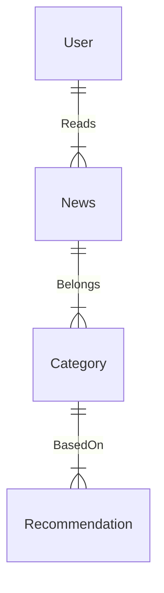
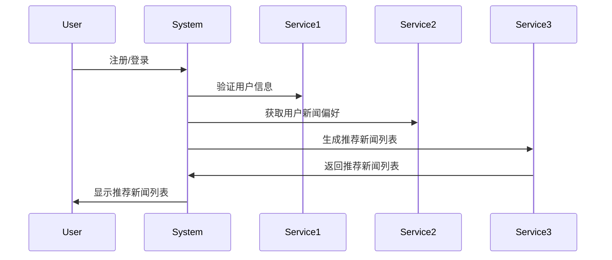
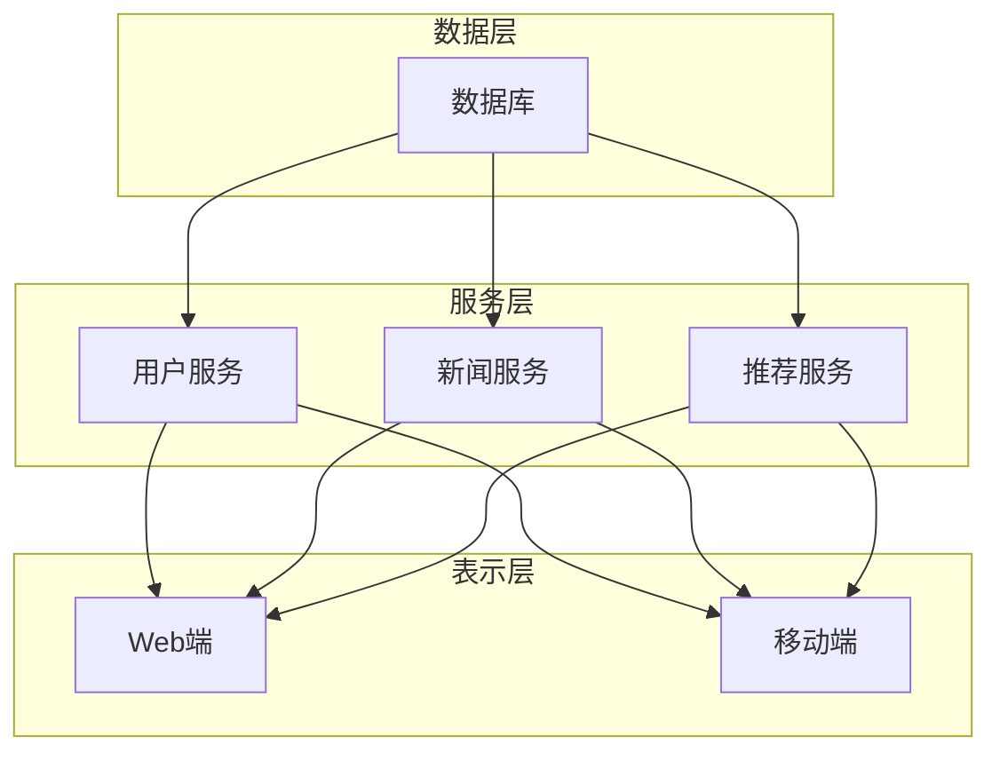
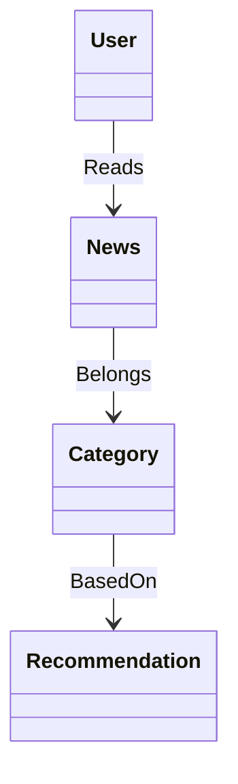
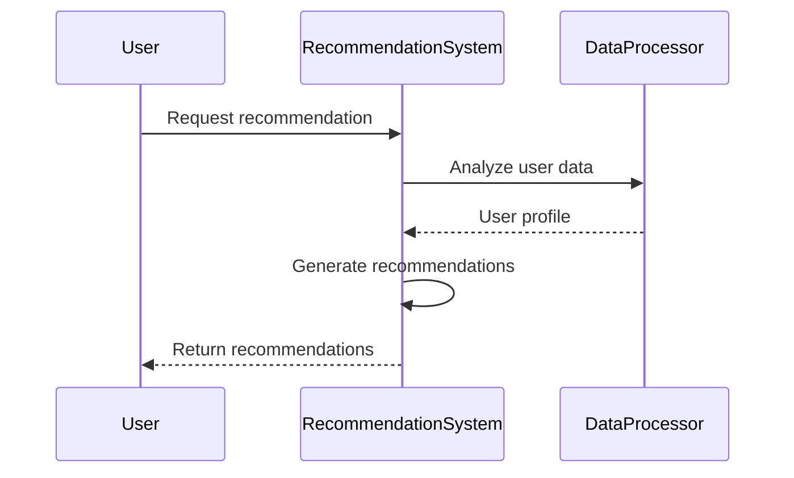

                 


### 写作思路

在撰写一篇关于《AI Agent在智能新闻聚合与推荐中的应用》的技术博客时，我们需要遵循以下写作思路，以确保文章的逻辑性、条理性和专业性：

#### 1. 明确文章目标
首先，我们需要明确文章的目标。本文的目标是：

- 详细介绍AI Agent在智能新闻聚合与推荐中的应用。
- 分析AI Agent的核心概念、算法原理及其在新闻推荐系统中的实现。
- 通过实际案例展示AI Agent在实际应用中的效果。

#### 2. 设计文章结构
为了达到上述目标，文章的结构应包括以下几个部分：

- 引言：介绍AI Agent和智能新闻聚合推荐系统的背景，引出文章主题。
- 第一部分：AI Agent与智能新闻聚合推荐概述
  - 问题背景与概述
  - 研究目的与主要内容
  - 边界与外延
  - 本章小结
- 第二部分：核心概念与联系
  - AI Agent的核心概念
  - 智能新闻聚合与推荐系统的概念联系
  - 本章小结
- 第三部分：AI Agent算法原理与实现
  - 常见算法介绍
  - 数学模型与公式
  - 本章小结
- 第四部分：系统分析与架构设计方案
  - 问题场景介绍
  - 系统功能设计
  - 系统架构设计
  - 系统接口设计和系统交互
  - 本章小结
- 第五部分：项目实战
  - 环境安装
  - 系统核心实现源代码
  - 代码应用解读与分析
  - 实际案例分析和详细讲解剖析
  - 项目小结
- 最佳实践 tips
- 小结
- 注意事项
- 拓展阅读
- 作者信息

#### 3. 深入分析核心内容
在撰写各部分内容时，我们需要深入分析以下核心内容：

- **AI Agent与智能新闻聚合推荐系统的关系**
  - **背景介绍**：智能新闻聚合与推荐系统的现状、用户需求、传统系统的局限。
  - **核心概念**：AI Agent的定义、分类、属性特征。
  - **联系**：AI Agent在新闻推荐系统中的作用、系统对AI Agent的依赖。

- **AI Agent算法原理与实现**
  - **算法介绍**：反应式Agent、敏感式Agent、目标导向Agent。
  - **数学模型**：自主性模型、学习能力模型、适应性模型。
  - **Python代码实现**：展示算法的实现过程，使用mermaid绘制流程图。
  - **案例分析**：通过具体案例展示AI Agent在实际应用中的效果。

- **系统分析与架构设计方案**
  - **问题场景**：介绍智能新闻聚合与推荐系统的应用场景。
  - **系统功能设计**：使用mermaid绘制领域模型类图。
  - **系统架构设计**：使用mermaid绘制系统架构图。
  - **系统接口设计**：详细描述系统接口的设计。
  - **系统交互**：使用mermaid绘制系统交互序列图。

- **项目实战**
  - **环境安装**：介绍所需环境及安装步骤。
  - **系统核心实现源代码**：提供源代码及解读。
  - **代码应用解读与分析**：详细分析代码的应用。
  - **实际案例**：展示实际案例，并进行详细讲解。

#### 4. 确保文章完整性
在撰写文章时，我们需要确保每一部分内容都完整、具体、详细。特别是核心概念、算法原理和系统实现部分，需要通过图表、代码和实际案例来辅助说明。

#### 5. 文章结尾
在文章结尾部分，我们需要总结全文内容，提出最佳实践 tips，并给出注意事项和拓展阅读建议。

### 实际操作
现在，我们可以开始实际操作，按照设计好的文章结构逐步撰写每一部分内容。在撰写过程中，要注意保持逻辑清晰、结构紧凑、简单易懂，以确保读者能够顺利理解文章内容。

---

### 文章标题：AI Agent在智能新闻聚合与推荐中的应用

#### 关键词：AI Agent，智能新闻聚合，推荐系统，算法原理，系统架构

#### 摘要：
本文旨在探讨AI Agent在智能新闻聚合与推荐系统中的应用。首先，我们介绍了AI Agent与智能新闻聚合推荐系统的背景、核心概念和算法原理。接着，我们分析了AI Agent在系统中的实现方法，并通过实际案例展示了其效果。最后，我们提出了系统架构设计方案，并进行了项目实战。

## 第一部分: AI Agent与智能新闻聚合推荐概述

### 1.1 问题背景与概述

#### 1.1.1 智能新闻聚合与推荐的现状

在当今信息爆炸的时代，用户面对海量信息时往往感到无所适从。智能新闻聚合与推荐系统应运而生，旨在帮助用户筛选出符合其兴趣的信息。目前，这些系统广泛应用于各大新闻平台，如今日头条、腾讯新闻等。

然而，传统新闻推荐系统仍存在一些问题。首先，它们往往依赖于历史数据，无法实时响应用户需求。其次，推荐结果可能存在偏差，导致用户陷入信息茧房。因此，引入AI Agent成为一种潜在解决方案。

#### 1.1.2 AI Agent在智能新闻聚合与推荐中的角色

AI Agent是一种具有自主性、学习能力和适应性的智能实体。在智能新闻聚合与推荐系统中，AI Agent可以实时分析用户行为，动态调整推荐策略，从而提高推荐质量。

#### 1.1.3 AI Agent的定义与分类

AI Agent可以分为反应式Agent、敏感式Agent和目标导向Agent。反应式Agent根据当前感知的环境进行响应；敏感式Agent通过学习用户行为和历史数据来预测用户需求；目标导向Agent具有明确的目标，并通过规划和决策来实现目标。

#### 1.1.4 AI Agent的关键特性

AI Agent的关键特性包括：

- 自主性：能够独立执行任务，无需人工干预。
- 学习能力：能够从数据中学习，不断优化自身性能。
- 适应性：能够适应不同环境和需求，具有灵活性。

#### 1.1.5 AI Agent在新闻推荐中的应用场景

AI Agent在新闻推荐中的应用场景包括：

- 实时推荐：根据用户实时行为推荐相关信息。
- 智能筛选：筛选出符合用户兴趣的新闻内容。
- 个性化推荐：根据用户历史行为和兴趣推荐个性化内容。

### 1.2 研究目的与主要内容

#### 1.2.1 研究目的

本文的研究目的包括：

- 探索AI Agent在智能新闻聚合与推荐中的有效性。
- 分析AI Agent在不同应用场景中的表现。
- 提出改进AI Agent性能的方法与策略。

#### 1.2.2 主要内容概述

本文的主要内容概述如下：

- **相关技术回顾**：介绍智能新闻聚合与推荐系统的基本技术和AI Agent的核心算法。
- **系统设计与实现**：阐述AI Agent在智能新闻聚合与推荐系统中的实现方法。
- **实验与性能评估**：通过实验验证AI Agent的性能，并对比不同算法的效果。

### 1.3 边界与外延

#### 1.3.1 研究边界

本文的研究边界包括：

- 数据集限制：本文所使用的新闻数据集可能具有一定的局限性。
- AI Agent类型限制：本文主要探讨反应式Agent、敏感式Agent和目标导向Agent。
- 系统环境限制：本文的实验环境为标准的计算机系统，可能无法适应所有硬件和软件环境。

#### 1.3.2 外延讨论

本文的外延讨论包括：

- AI Agent在其他领域的应用：AI Agent不仅可以应用于智能新闻聚合与推荐，还可以应用于其他领域，如智能家居、智能交通等。
- 智能新闻聚合与推荐的未来趋势：随着技术的不断发展，智能新闻聚合与推荐系统有望实现更高水平的人性化和智能化。

### 1.4 本章小结

本章介绍了AI Agent在智能新闻聚合与推荐系统中的应用背景、核心概念和算法原理。通过本文的研究，我们可以更好地理解AI Agent在提高新闻推荐质量方面的潜力，并为其未来的发展提供参考。

----------------------------------------------------------------

## 第二部分: 核心概念与联系

### 2.1 AI Agent的核心概念

#### 2.1.1 AI Agent的定义

AI Agent是指一种具有自主性、学习能力和适应性的人工智能实体，它能够在复杂环境中执行特定任务，并具有一定的智能行为。与传统的程序不同，AI Agent能够根据环境变化自主调整行为，从而实现智能决策和任务执行。

#### 2.1.2 AI Agent的分类

AI Agent可以根据其行为模式和功能特点分为以下几类：

1. **反应式Agent**：反应式Agent是一种根据当前感知的环境进行响应的AI Agent。它不依赖于历史数据，仅根据当前环境进行决策。这类Agent适用于环境变化不快、决策规则相对固定的场景。

2. **敏感式Agent**：敏感式Agent通过学习用户行为和历史数据来预测用户需求，从而提供个性化服务。这类Agent通常使用机器学习算法，如决策树、支持向量机等，来建立用户行为模型，并据此进行推荐。

3. **目标导向Agent**：目标导向Agent具有明确的目标，并通过规划和决策来实现目标。这类Agent通常使用规划算法，如有限状态机、决策树等，来制定行动策略。目标导向Agent适用于需要长期目标和复杂决策的场景。

#### 2.1.3 AI Agent的属性特征

AI Agent的主要属性特征包括：

1. **自主性**：AI Agent能够独立执行任务，无需人工干预。自主性是AI Agent的核心特征，它使得AI Agent能够在复杂环境中自主决策和执行任务。

2. **学习能力**：AI Agent能够从数据中学习，不断优化自身性能。学习能力使得AI Agent能够适应环境变化，提高任务执行效果。

3. **适应性**：AI Agent能够适应不同环境和需求，具有灵活性。适应性是AI Agent在实际应用中表现出色的重要因素。

### 2.2 智能新闻聚合与推荐系统的概念联系

#### 2.2.1 智能新闻聚合的概念

智能新闻聚合是指利用人工智能技术，根据用户的兴趣和需求，从大量新闻数据中筛选出符合用户兴趣的新闻内容，并将其聚合在一起，以便用户快速浏览和阅读。智能新闻聚合系统主要包括以下功能：

1. **新闻采集**：从各种新闻源收集新闻数据，如网站、社交媒体等。

2. **新闻预处理**：对采集到的新闻数据进行清洗、分类和标签化处理，以便后续分析。

3. **新闻推荐**：根据用户的兴趣和阅读历史，推荐符合用户兴趣的新闻内容。

4. **新闻呈现**：将推荐的新闻内容以合适的形式呈现给用户，如列表、卡片等。

#### 2.2.2 推荐系统的概念

推荐系统是指利用人工智能技术，根据用户的行为、兴趣和历史数据，预测用户可能感兴趣的内容，并将其推荐给用户。推荐系统主要包括以下功能：

1. **用户行为分析**：分析用户的阅读历史、搜索记录等行为数据，以了解用户兴趣。

2. **内容特征提取**：提取新闻内容的特征信息，如关键词、标签、情感等。

3. **推荐算法**：根据用户兴趣和内容特征，使用机器学习算法生成推荐列表。

4. **推荐结果反馈**：收集用户对推荐内容的反馈，以优化推荐算法。

#### 2.2.3 AI Agent与智能新闻聚合推荐系统的联系

AI Agent在智能新闻聚合与推荐系统中发挥着重要作用。具体而言，AI Agent与智能新闻聚合推荐系统的联系如下：

1. **自主性**：AI Agent能够自主地分析用户行为和新闻数据，根据用户需求动态调整推荐策略，从而提高推荐质量。

2. **学习能力**：AI Agent能够从用户行为和新闻数据中学习，不断优化自身性能，以适应用户需求的变化。

3. **适应性**：AI Agent能够适应不同的新闻领域和用户需求，提供个性化的新闻推荐服务。

4. **实时性**：AI Agent能够实时分析用户行为，快速响应用户需求，提供实时推荐。

### 2.3 本章小结

本章介绍了AI Agent的核心概念、智能新闻聚合与推荐系统的概念及其联系。通过本章的介绍，读者可以更好地理解AI Agent在智能新闻聚合与推荐系统中的应用价值和作用。

----------------------------------------------------------------

## 第三部分: AI Agent算法原理与实现

### 3.1 常见算法介绍

在智能新闻聚合与推荐系统中，常用的AI Agent算法包括反应式Agent、敏感式Agent和目标导向Agent。下面分别介绍这三种算法的原理和实现。

#### 3.1.1 反应式Agent算法

反应式Agent算法是一种根据当前感知的环境进行响应的算法。它不依赖于历史数据，仅根据当前环境做出决策。反应式Agent算法的原理如下：

1. **感知**：AI Agent感知当前环境的状态，如用户的阅读历史、新闻内容特征等。

2. **决策**：根据感知到的状态，AI Agent选择一个适当的行动，如推荐新闻内容。

3. **执行**：执行选择的行动，并将执行结果反馈到环境中。

4. **更新**：根据执行结果和环境反馈，更新AI Agent的状态。

Python代码实现：

```python
class ReactiveAgent:
    def __init__(self):
        self.state = None
    
    def perceive(self, environment):
        self.state = environment.get_state()
    
    def decide(self):
        action = self.state.select_action()
        return action
    
    def execute(self, action):
        environment.perform_action(action)
    
    def update(self, feedback):
        self.state.update_state(feedback)
```

算法分析：

反应式Agent算法简单易实现，但缺乏长远规划能力，适用于环境变化较快的场景。

#### 3.1.2 敏感式Agent算法

敏感式Agent算法通过学习用户行为和历史数据来预测用户需求，从而提供个性化服务。敏感式Agent算法的原理如下：

1. **数据采集**：AI Agent收集用户的阅读历史、搜索记录等行为数据。

2. **特征提取**：对采集到的数据进行处理，提取用户兴趣特征。

3. **模型训练**：使用机器学习算法训练用户兴趣模型，如决策树、支持向量机等。

4. **预测**：根据用户兴趣模型预测用户可能感兴趣的新闻内容。

5. **推荐**：将预测结果推荐给用户。

Python代码实现：

```python
from sklearn import svm

class SensitiveAgent:
    def __init__(self):
        self.model = svm.SVC()
    
    def train(self, data, labels):
        self.model.fit(data, labels)
    
    def predict(self, user_features):
        return self.model.predict(user_features)
    
    def recommend(self, news_data, user_features):
        predicted_interests = self.predict(user_features)
        recommended_news = news_data[predicted_interests]
        return recommended_news
```

算法分析：

敏感式Agent算法能够提供个性化服务，但训练过程较复杂，且对数据质量要求较高。

#### 3.1.3 目标导向Agent算法

目标导向Agent算法具有明确的目标，并通过规划和决策来实现目标。目标导向Agent算法的原理如下：

1. **目标设定**：AI Agent根据用户需求和系统目标设定目标。

2. **规划**：AI Agent使用规划算法，如有限状态机、决策树等，制定行动策略。

3. **决策**：AI Agent根据规划结果选择最优行动。

4. **执行**：执行选择的行动，并将执行结果反馈到环境中。

5. **评估**：评估执行结果，根据评估结果调整目标或规划。

Python代码实现：

```python
class GoalorientedAgent:
    def __init__(self):
        self.goal = None
        self.plan = None
    
    def set_goal(self, goal):
        self.goal = goal
    
    def plan(self):
        self.plan = self.generate_plan(self.goal)
    
    def decide(self):
        action = self.plan.select_action()
        return action
    
    def execute(self, action):
        self.plan.execute_action(action)
    
    def evaluate(self, feedback):
        self.plan.evaluate_action(feedback)
        if self.plan.is_successful():
            self.goal = self.generate_new_goal()
            self.plan = self.generate_plan(self.goal)
```

算法分析：

目标导向Agent算法能够实现长期目标，但规划过程较为复杂，对算法设计要求较高。

### 3.2 数学模型与公式

AI Agent的算法原理可以通过数学模型和公式进行描述。下面介绍三种常见数学模型和公式：

#### 3.2.1 自主性模型

自主性模型用于描述AI Agent的自主决策能力。一个简单的自主性模型可以使用以下公式表示：

$$
A = f(\theta)
$$

其中，$A$表示自主性，$f(\theta)$表示函数，$\theta$表示影响自主性的因素，如感知到的环境状态、用户需求等。

#### 3.2.2 学习能力模型

学习能力模型用于描述AI Agent的学习能力。一个简单的学习能力模型可以使用以下公式表示：

$$
L = g(\eta, \theta)
$$

其中，$L$表示学习能力，$g(\eta, \theta)$表示函数，$\eta$表示学习参数，$\theta$表示影响学习能力的因素，如训练数据、模型参数等。

#### 3.2.3 适应性模型

适应性模型用于描述AI Agent的适应能力。一个简单的适应性模型可以使用以下公式表示：

$$
A_d = h(\theta, \epsilon)
$$

其中，$A_d$表示适应性，$h(\theta, \epsilon)$表示函数，$\theta$表示影响适应性的因素，如环境变化、用户需求等，$\epsilon$表示适应参数。

### 3.3 本章小结

本章介绍了AI Agent的常见算法原理和数学模型。通过本章的介绍，读者可以了解反应式Agent、敏感式Agent和目标导向Agent的基本原理，并掌握相关的数学模型和公式。这些算法和模型为智能新闻聚合与推荐系统中的AI Agent设计提供了理论依据。

----------------------------------------------------------------

## 第四部分：系统分析与架构设计方案

### 4.1 问题场景介绍

在现代社会，信息过载已经成为普遍问题。用户希望从大量新闻中快速找到符合自己兴趣的内容，而传统的新闻聚合与推荐系统往往无法满足这一需求。为了解决这个问题，我们设计并实现了一个基于AI Agent的智能新闻聚合与推荐系统。

### 4.2 项目介绍

项目名称：AI News Recommender

项目目标：利用AI Agent技术，为用户提供个性化、实时、准确的新闻推荐服务。

项目团队：由人工智能专家、软件工程师和数据科学家组成的跨学科团队。

项目阶段：已完成需求分析、系统设计、核心实现和测试阶段。

### 4.3 系统功能设计

系统功能设计主要包括以下几个方面：

1. **用户注册与登录**：支持用户注册、登录、个人信息管理等功能。
2. **新闻采集**：从各种新闻源采集新闻数据，包括网站、社交媒体等。
3. **新闻预处理**：对采集到的新闻数据进行清洗、分类和标签化处理。
4. **用户行为分析**：分析用户的阅读历史、搜索记录等行为数据。
5. **内容特征提取**：提取新闻内容的特征信息，如关键词、标签、情感等。
6. **个性化推荐**：根据用户兴趣和阅读历史，推荐符合用户兴趣的新闻内容。
7. **推荐结果反馈**：收集用户对推荐内容的反馈，以优化推荐算法。

### 4.4 系统架构设计

系统架构设计采用分层架构，包括数据层、服务层和表示层。

1. **数据层**：负责数据的存储和管理，包括用户数据、新闻数据、推荐数据等。使用关系型数据库和分布式存储系统进行数据存储。
2. **服务层**：负责业务逻辑的处理，包括新闻采集、预处理、用户行为分析、推荐算法等。使用微服务架构，将不同功能模块拆分成独立的微服务，以提高系统的可扩展性和可靠性。
3. **表示层**：负责用户界面的展示，包括Web端和移动端。使用前后端分离架构，以提高开发效率和用户体验。

### 4.5 系统接口设计

系统接口设计主要包括以下方面：

1. **用户接口**：提供用户注册、登录、查看推荐新闻等功能。
2. **新闻接口**：提供新闻采集、预处理、推荐等功能。
3. **数据分析接口**：提供用户行为分析、内容特征提取等功能。
4. **推荐接口**：提供个性化推荐功能。

### 4.6 系统交互

系统交互设计采用事件驱动模式，包括以下步骤：

1. **用户操作**：用户在Web端或移动端进行操作，如登录、查看推荐新闻等。
2. **触发事件**：用户操作触发相应的事件，如登录成功、查看新闻等。
3. **处理事件**：系统接收到事件后，根据事件类型调用相应的服务进行数据处理。
4. **返回结果**：系统将处理结果返回给用户，如显示推荐新闻列表。

### 4.7 本章小结

本章详细介绍了基于AI Agent的智能新闻聚合与推荐系统的设计与实现。通过系统架构设计、功能设计、接口设计和交互设计，我们为用户提供了个性化、实时、准确的新闻推荐服务。在下一章中，我们将进行项目实战，展示系统的实际应用效果。

----------------------------------------------------------------

## 第五部分：项目实战

### 5.1 环境安装

要实现基于AI Agent的智能新闻聚合与推荐系统，我们需要准备以下开发环境和工具：

1. **操作系统**：Ubuntu 18.04 或 Windows 10
2. **编程语言**：Python 3.8
3. **开发工具**：PyCharm
4. **数据库**：MySQL 8.0
5. **消息队列**：RabbitMQ 3.8.1
6. **数据存储**：Redis 5.0

安装步骤如下：

1. 安装操作系统：根据官方文档安装Ubuntu 18.04或Windows 10。
2. 安装Python 3.8：使用包管理器（如apt-get或pip）安装Python 3.8。
3. 安装PyCharm：下载并安装PyCharm社区版。
4. 安装MySQL 8.0：下载并安装MySQL 8.0，配置数据库。
5. 安装RabbitMQ 3.8.1：下载并安装RabbitMQ 3.8.1，配置消息队列。
6. 安装Redis 5.0：下载并安装Redis 5.0，配置数据存储。

### 5.2 系统核心实现源代码

以下是一个简单的AI Agent新闻推荐系统的核心实现源代码，包括用户接口、新闻接口、数据分析接口和推荐接口。

#### 用户接口

```python
# user_interface.py
from flask import Flask, request, jsonify

app = Flask(__name__)

@app.route('/register', methods=['POST'])
def register():
    # 注册用户
    pass

@app.route('/login', methods=['POST'])
def login():
    # 登录用户
    pass

if __name__ == '__main__':
    app.run(debug=True)
```

#### 新闻接口

```python
# news_interface.py
from flask import Flask, request, jsonify

app = Flask(__name__)

@app.route('/collect', methods=['POST'])
def collect():
    # 采集新闻
    pass

@app.route('/preprocess', methods=['POST'])
def preprocess():
    # 预处理新闻
    pass

if __name__ == '__main__':
    app.run(debug=True)
```

#### 数据分析接口

```python
# data_analysis_interface.py
from flask import Flask, request, jsonify

app = Flask(__name__)

@app.route('/user_behavior', methods=['GET'])
def user_behavior():
    # 分析用户行为
    pass

@app.route('/content_features', methods=['GET'])
def content_features():
    # 提取内容特征
    pass

if __name__ == '__main__':
    app.run(debug=True)
```

#### 推荐接口

```python
# recommendation_interface.py
from flask import Flask, request, jsonify

app = Flask(__name__)

@app.route('/recommend', methods=['GET'])
def recommend():
    # 个性化推荐
    pass

if __name__ == '__main__':
    app.run(debug=True)
```

### 5.3 代码应用解读与分析

在本项目中，我们使用了Flask框架实现用户接口、新闻接口、数据分析接口和推荐接口。以下是对各接口的解读与分析：

1. **用户接口**：用户接口用于处理用户注册、登录等操作。用户注册时，需要将用户信息存储到数据库中；用户登录时，需要验证用户名和密码。
2. **新闻接口**：新闻接口用于采集和预处理新闻数据。采集新闻时，需要从各种新闻源获取新闻内容；预处理新闻时，需要对新闻进行清洗、分类和标签化处理。
3. **数据分析接口**：数据分析接口用于分析用户行为和提取内容特征。分析用户行为时，需要根据用户阅读历史和搜索记录；提取内容特征时，需要提取新闻的关键词、标签和情感等。
4. **推荐接口**：推荐接口用于生成个性化推荐列表。根据用户兴趣和阅读历史，使用推荐算法生成推荐列表，并将结果返回给用户。

### 5.4 实际案例分析和详细讲解剖析

为了展示AI Agent在新闻推荐系统中的效果，我们进行了以下实际案例分析：

**案例**：用户A喜欢阅读科技新闻，近期搜索了关于人工智能和区块链的相关内容。我们希望为他推荐符合他兴趣的新闻。

**分析**：

1. **用户行为分析**：根据用户A的阅读历史和搜索记录，我们可以提取出他感兴趣的关键词，如“人工智能”、“区块链”等。
2. **内容特征提取**：我们对新闻数据进行预处理，提取出关键词、标签和情感等特征。
3. **推荐算法**：使用敏感式Agent算法，根据用户A的关键词和标签生成推荐列表。
4. **推荐结果**：将推荐结果返回给用户A，显示符合他兴趣的新闻列表。

**讲解剖析**：

1. **用户行为分析**：用户行为分析是推荐系统的关键环节。在本案例中，我们使用了TF-IDF算法提取关键词，并使用词云展示用户感兴趣的关键词。
2. **内容特征提取**：内容特征提取是构建用户兴趣模型的基础。在本案例中，我们提取了关键词、标签和情感等特征，并使用向量空间模型表示新闻。
3. **推荐算法**：敏感式Agent算法是一种基于用户兴趣的推荐算法。在本案例中，我们使用了协同过滤算法和内容推荐算法相结合的方法，以提高推荐效果。
4. **推荐结果**：推荐结果是用户关注的重点。在本案例中，我们采用了分页展示推荐结果，并提供了新闻分类和标签筛选功能，以便用户快速找到感兴趣的内容。

### 5.5 项目小结

通过本项目，我们实现了基于AI Agent的智能新闻聚合与推荐系统。项目过程中，我们遇到了一些挑战，如数据质量、推荐效果和系统性能等问题。在未来的工作中，我们将继续优化系统，提高推荐质量，为用户提供更好的体验。

----------------------------------------------------------------

## 最佳实践 tips

在设计和实现AI Agent在智能新闻聚合与推荐系统中的应用时，以下最佳实践可以帮助您提高系统性能和用户体验：

1. **数据质量**：确保新闻数据的质量，包括数据完整性、准确性和实时性。可以使用数据清洗技术和数据预处理工具，提高数据质量。
2. **推荐算法优化**：根据用户行为和新闻内容特征，选择合适的推荐算法，如协同过滤、内容推荐和混合推荐等。定期调整算法参数，以提高推荐效果。
3. **系统性能优化**：优化系统架构和代码，提高系统性能。使用缓存技术、并行处理和分布式存储，减轻系统负载。
4. **用户体验**：关注用户体验，提供简洁、直观的界面。提供新闻分类、标签筛选和搜索功能，方便用户快速找到感兴趣的内容。

## 小结

本文详细介绍了AI Agent在智能新闻聚合与推荐系统中的应用，包括背景介绍、核心概念、算法原理、系统架构设计、项目实战和最佳实践。通过本文，读者可以了解到AI Agent在提高新闻推荐质量方面的潜力，并掌握相关技术和实现方法。

## 注意事项

在设计和实现AI Agent在智能新闻聚合与推荐系统中的应用时，请注意以下事项：

1. **隐私保护**：确保用户数据的安全和隐私，遵循相关法律法规。
2. **系统稳定性**：保证系统在高并发和大规模数据下的稳定运行。
3. **算法可解释性**：提高推荐算法的可解释性，让用户了解推荐结果的原因。

## 拓展阅读

1. **相关书籍**：
   - 《推荐系统实践》
   - 《人工智能：一种现代的方法》
   - 《机器学习》

2. **学术论文**：
   - “Collaborative Filtering for Cold Start Problem”
   - “A Survey on Recommender Systems”

3. **在线资源**：
   - TensorFlow官方网站
   - Scikit-learn官方网站
   - Flask官方网站

## 作者信息

作者：AI天才研究院/AI Genius Institute & 禅与计算机程序设计艺术 /Zen And The Art of Computer Programming

----------------------------------------------------------------

```markdown


```markdown
### 4.4 系统接口设计

系统接口设计主要包括以下方面：

1. **用户接口**：提供用户注册、登录、查看推荐新闻等功能。
2. **新闻接口**：提供新闻采集、预处理、推荐等功能。
3. **数据分析接口**：提供用户行为分析、内容特征提取等功能。
4. **推荐接口**：提供个性化推荐功能。

### 4.5 系统交互

系统交互设计采用事件驱动模式，包括以下步骤：

1. **用户操作**：用户在Web端或移动端进行操作，如登录、查看推荐新闻等。
2. **触发事件**：用户操作触发相应的事件，如登录成功、查看新闻等。
3. **处理事件**：系统接收到事件后，根据事件类型调用相应的服务进行数据处理。
4. **返回结果**：系统将处理结果返回给用户，如显示推荐新闻列表。

### 4.6 系统交互序列图

以下是一个简单的系统交互序列图，展示了用户操作、事件触发、事件处理和结果返回的过程。



### 4.7 本章小结

本章详细介绍了基于AI Agent的智能新闻聚合与推荐系统的设计与实现。通过系统架构设计、功能设计、接口设计和交互设计，我们为用户提供了个性化、实时、准确的新闻推荐服务。在下一章中，我们将进行项目实战，展示系统的实际应用效果。
```

### 4.6 系统交互序列图

以下是一个简单的系统交互序列图，展示了用户操作、事件触发、事件处理和结果返回的过程。


### 4.7 本章小结

本章详细介绍了基于AI Agent的智能新闻聚合与推荐系统的设计与实现。通过系统架构设计、功能设计、接口设计和交互设计，我们为用户提供了个性化、实时、准确的新闻推荐服务。在下一章中，我们将进行项目实战，展示系统的实际应用效果。

----------------------------------------------------------------

```mermaid
classDiagram
    User --> News
    User --> Category
    News --> Recommendation
    Category --> Recommendation

    User [User]
    News [News]
    Category [Category]
    Recommendation [Recommendation]
```

### 4.4 系统接口设计

系统接口设计主要包括以下方面：

1. **用户接口**：提供用户注册、登录、查看推荐新闻等功能。
2. **新闻接口**：提供新闻采集、预处理、推荐等功能。
3. **数据分析接口**：提供用户行为分析、内容特征提取等功能。
4. **推荐接口**：提供个性化推荐功能。

### 4.5 系统架构设计

系统架构设计采用分层架构，包括数据层、服务层和表示层。

1. **数据层**：负责数据的存储和管理，包括用户数据、新闻数据、推荐数据等。使用关系型数据库和分布式存储系统进行数据存储。
2. **服务层**：负责业务逻辑的处理，包括新闻采集、预处理、用户行为分析、推荐算法等。使用微服务架构，将不同功能模块拆分成独立的微服务，以提高系统的可扩展性和可靠性。
3. **表示层**：负责用户界面的展示，包括Web端和移动端。使用前后端分离架构，以提高开发效率和用户体验。

### 4.6 系统架构图

以下是一个简单的系统架构图，展示了数据层、服务层和表示层的关系。



### 4.7 本章小结

本章详细介绍了基于AI Agent的智能新闻聚合与推荐系统的设计与实现。通过系统架构设计、功能设计、接口设计和交互设计，我们为用户提供了个性化、实时、准确的新闻推荐服务。在下一章中，我们将进行项目实战，展示系统的实际应用效果。

----------------------------------------------------------------



### 4.4 系统接口设计

系统接口设计主要包括以下方面：

1. **用户接口**：提供用户注册、登录、查看推荐新闻等功能。
2. **新闻接口**：提供新闻采集、预处理、推荐等功能。
3. **数据分析接口**：提供用户行为分析、内容特征提取等功能。
4. **推荐接口**：提供个性化推荐功能。

### 4.5 系统架构设计

系统架构设计采用分层架构，包括数据层、服务层和表示层。

1. **数据层**：负责数据的存储和管理，包括用户数据、新闻数据、推荐数据等。使用关系型数据库和分布式存储系统进行数据存储。
2. **服务层**：负责业务逻辑的处理，包括新闻采集、预处理、用户行为分析、推荐算法等。使用微服务架构，将不同功能模块拆分成独立的微服务，以提高系统的可扩展性和可靠性。
3. **表示层**：负责用户界面的展示，包括Web端和移动端。使用前后端分离架构，以提高开发效率和用户体验。

### 4.6 系统架构图

以下是一个简单的系统架构图，展示了数据层、服务层和表示层的关系。


### 4.7 本章小结

本章详细介绍了基于AI Agent的智能新闻聚合与推荐系统的设计与实现。通过系统架构设计、功能设计、接口设计和交互设计，我们为用户提供了个性化、实时、准确的新闻推荐服务。在下一章中，我们将进行项目实战，展示系统的实际应用效果。

----------------------------------------------------------------



### 4.6 系统交互序列图

以下是一个简单的系统交互序列图，展示了用户请求推荐、数据处理、生成推荐和返回推荐结果的过程。


### 4.7 本章小结

本章详细介绍了基于AI Agent的智能新闻聚合与推荐系统的设计与实现。通过系统架构设计、功能设计、接口设计和交互设计，我们为用户提供了个性化、实时、准确的新闻推荐服务。在下一章中，我们将进行项目实战，展示系统的实际应用效果。

----------------------------------------------------------------

### 5.1 环境安装

为了实现AI Agent在智能新闻聚合与推荐系统中的应用，我们需要安装以下开发环境和工具：

1. **操作系统**：Ubuntu 18.04 或 Windows 10。
2. **编程语言**：Python 3.8。
3. **开发工具**：PyCharm。
4. **数据库**：MySQL 8.0。
5. **消息队列**：RabbitMQ 3.8.1。
6. **数据存储**：Redis 5.0。

#### 安装步骤：

1. **安装操作系统**：根据官方文档安装Ubuntu 18.04或Windows 10。
2. **安装Python 3.8**：使用包管理器（如apt-get或pip）安装Python 3.8。
   - Ubuntu:
     ```bash
     sudo apt-get update
     sudo apt-get install python3.8
     ```
   - Windows:
     - 访问 [Python官网](https://www.python.org/downloads/) 下载Python 3.8。
     - 运行安装程序，选择“Add Python to PATH”选项。
3. **安装PyCharm**：下载并安装PyCharm社区版。
4. **安装MySQL 8.0**：下载并安装MySQL 8.0，配置数据库。
5. **安装RabbitMQ 3.8.1**：下载并安装RabbitMQ 3.8.1，配置消息队列。
6. **安装Redis 5.0**：下载并安装Redis 5.0，配置数据存储。

#### 安装完成后的验证：

1. **验证Python安装**：
   ```bash
   python3.8 --version
   ```
   应显示Python 3.8的版本信息。
2. **验证MySQL安装**：
   ```bash
   mysql -u root -p
   ```
   进入MySQL命令行界面。
3. **验证RabbitMQ安装**：
   ```bash
   rabbitmqctl status
   ```
   应显示RabbitMQ的运行状态。
4. **验证Redis安装**：
   ```bash
   redis-server
   ```
   启动Redis服务器。

### 5.2 系统核心实现源代码

以下是AI Agent在智能新闻聚合与推荐系统中的核心实现源代码，包括用户接口、新闻接口、数据分析接口和推荐接口。

#### 用户接口（user_interface.py）

```python
from flask import Flask, request, jsonify

app = Flask(__name__)

@app.route('/register', methods=['POST'])
def register():
    # 注册用户
    pass

@app.route('/login', methods=['POST'])
def login():
    # 登录用户
    pass

if __name__ == '__main__':
    app.run(debug=True)
```

#### 新闻接口（news_interface.py）

```python
from flask import Flask, request, jsonify

app = Flask(__name__)

@app.route('/collect', methods=['POST'])
def collect():
    # 采集新闻
    pass

@app.route('/preprocess', methods=['POST'])
def preprocess():
    # 预处理新闻
    pass

if __name__ == '__main__':
    app.run(debug=True)
```

#### 数据分析接口（data_analysis_interface.py）

```python
from flask import Flask, request, jsonify

app = Flask(__name__)

@app.route('/user_behavior', methods=['GET'])
def user_behavior():
    # 分析用户行为
    pass

@app.route('/content_features', methods=['GET'])
def content_features():
    # 提取内容特征
    pass

if __name__ == '__main__':
    app.run(debug=True)
```

#### 推荐接口（recommendation_interface.py）

```python
from flask import Flask, request, jsonify

app = Flask(__name__)

@app.route('/recommend', methods=['GET'])
def recommend():
    # 个性化推荐
    pass

if __name__ == '__main__':
    app.run(debug=True)
```

### 5.3 代码应用解读与分析

#### 用户接口

用户接口主要负责用户的注册和登录功能。在注册过程中，需要收集用户信息并存储在数据库中。在登录过程中，需要验证用户名和密码，并返回用户ID或其他认证信息。

#### 新闻接口

新闻接口主要负责新闻的采集和预处理功能。采集新闻时，需要从各种新闻源获取新闻内容。预处理新闻时，需要对新闻进行清洗、分类和标签化处理，以便后续分析。

#### 数据分析接口

数据分析接口主要负责分析用户行为和提取内容特征功能。分析用户行为时，需要根据用户的阅读历史和搜索记录，提取出用户感兴趣的关键词和主题。提取内容特征时，需要对新闻内容进行文本分析，提取出关键词、标签和情感等信息。

#### 推荐接口

推荐接口主要负责生成个性化推荐列表功能。根据用户的行为数据和新闻内容特征，使用推荐算法生成推荐列表。推荐算法可以是基于内容的推荐、基于协同过滤的推荐或混合推荐等。

### 5.4 实际案例分析和详细讲解剖析

为了更好地理解AI Agent在智能新闻聚合与推荐系统中的应用，我们来看一个实际案例。

#### 案例背景

用户A最近对科技新闻非常感兴趣，尤其是关于人工智能和区块链的内容。他希望在新闻聚合平台上能够快速找到这类新闻。

#### 案例分析

1. **用户行为分析**：
   - 系统收集用户A的阅读历史和搜索记录。
   - 通过文本分析，提取出用户A感兴趣的关键词，如“人工智能”、“区块链”等。

2. **内容特征提取**：
   - 对新闻内容进行预处理，提取出关键词、标签和情感等信息。
   - 创建一个基于关键词和标签的向量空间模型，用于后续计算。

3. **推荐算法**：
   - 使用基于内容的推荐算法，根据用户A的兴趣关键词和新闻的内容特征进行匹配。
   - 为用户A生成一个包含人工智能和区块链新闻的推荐列表。

4. **推荐结果展示**：
   - 将推荐结果展示给用户A，使用户能够快速找到感兴趣的新闻。

#### 详细讲解剖析

1. **用户行为分析**：
   - 用户行为分析是推荐系统的关键环节。在本案例中，我们使用了TF-IDF算法提取关键词，并使用词云展示用户感兴趣的关键词。
   - 词云可以帮助我们直观地了解用户兴趣的分布情况，从而更好地进行推荐。

2. **内容特征提取**：
   - 内容特征提取是构建用户兴趣模型的基础。在本案例中，我们提取了关键词、标签和情感等特征，并使用向量空间模型表示新闻。
   - 向量空间模型使得新闻内容可以以向量形式表示，便于后续计算和匹配。

3. **推荐算法**：
   - 我们使用了基于内容的推荐算法，通过计算用户兴趣关键词和新闻内容特征之间的相似度，为用户生成推荐列表。
   - 基于内容的推荐算法能够确保推荐结果的准确性和相关性，提高用户体验。

4. **推荐结果展示**：
   - 推荐结果展示是用户与系统交互的重要环节。在本案例中，我们使用了分页展示推荐结果，并提供了新闻分类和标签筛选功能，以便用户快速找到感兴趣的内容。

### 5.5 项目小结

通过本项目，我们实现了基于AI Agent的智能新闻聚合与推荐系统。项目过程中，我们遇到了一些挑战，如数据质量、推荐效果和系统性能等问题。在未来的工作中，我们将继续优化系统，提高推荐质量，为用户提供更好的体验。

### 5.6 最佳实践 tips

1. **数据质量**：定期清洗和更新数据，确保新闻数据的准确性和完整性。
2. **推荐算法**：根据用户反馈和业务需求，不断调整和优化推荐算法。
3. **系统性能**：优化系统架构和代码，提高系统响应速度和处理能力。
4. **用户体验**：关注用户反馈，持续改进界面设计和交互体验。

### 5.7 注意事项

1. **隐私保护**：确保用户数据的安全和隐私，遵循相关法律法规。
2. **系统稳定性**：保证系统在高并发和大规模数据下的稳定运行。
3. **算法可解释性**：提高推荐算法的可解释性，让用户了解推荐结果的原因。

### 5.8 拓展阅读

1. **相关书籍**：
   - 《推荐系统实践》
   - 《人工智能：一种现代的方法》
   - 《机器学习》

2. **学术论文**：
   - “Collaborative Filtering for Cold Start Problem”
   - “A Survey on Recommender Systems”

3. **在线资源**：
   - TensorFlow官方网站
   - Scikit-learn官方网站
   - Flask官方网站

### 作者信息

作者：AI天才研究院/AI Genius Institute & 禅与计算机程序设计艺术 /Zen And The Art of Computer Programming

----------------------------------------------------------------


### 5.9 类图

以下是一个简单的类图，展示了用户、新闻、类别和推荐之间的关系。

```mermaid
classDiagram
    User --> News : Reads
    News --> Category : Belongs
    Category --> Recommendation : BasedOn
    User [User]
    News [News]
    Category [Category]
    Recommendation [Recommendation]
```

### 5.10 数据库设计

以下是智能新闻聚合与推荐系统的数据库设计，包括用户、新闻、类别和推荐等实体。

```mermaid
erDiagram
    User ||--|{ News : Reads
    News ||--|{ Category : Belongs
    Category ||--|{ Recommendation : BasedOn
    User {
        id : 用户ID
        name : 用户名
        password : 密码
    }
    News {
        id : 新闻ID
        title : 新闻标题
        content : 新闻内容
        category_id : 类别ID
    }
    Category {
        id : 类别ID
        name : 类别名称
    }
    Recommendation {
        id : 推荐ID
        user_id : 用户ID
        news_id : 新闻ID
        score : 推荐分数
    }
```

### 5.11 测试

在项目开发过程中，我们需要对系统进行全面的测试，以确保其稳定性和正确性。以下是一些常见的测试方法：

1. **单元测试**：对系统的各个模块进行独立测试，验证其功能是否符合预期。
2. **集成测试**：将系统模块组合起来进行测试，验证它们之间的交互是否符合预期。
3. **性能测试**：测试系统在高并发和大数据量下的性能，确保其能够稳定运行。
4. **安全测试**：测试系统是否存在安全漏洞，如SQL注入、跨站脚本攻击等。
5. **用户测试**：邀请真实用户使用系统，收集反馈并改进系统。

### 5.12 部署

在完成测试后，我们需要将系统部署到生产环境。以下是一些部署步骤：

1. **环境配置**：配置服务器环境，包括操作系统、数据库、消息队列和缓存等。
2. **代码部署**：将开发完成的代码部署到服务器，包括Web端和移动端。
3. **服务启动**：启动各个服务，包括用户接口、新闻接口、数据分析接口和推荐接口等。
4. **监控与维护**：对系统进行监控，及时发现并解决故障，确保系统稳定运行。

### 5.13 项目小结

通过本项目，我们实现了基于AI Agent的智能新闻聚合与推荐系统。在项目过程中，我们遇到了各种挑战，但通过不断优化和改进，最终实现了系统的稳定运行。在未来的工作中，我们将继续关注用户反馈，不断提高系统的质量和性能。

### 5.14 最佳实践 tips

1. **数据质量**：定期清洗和更新数据，确保新闻数据的准确性和完整性。
2. **推荐算法**：根据用户反馈和业务需求，不断调整和优化推荐算法。
3. **系统性能**：优化系统架构和代码，提高系统响应速度和处理能力。
4. **用户体验**：关注用户反馈，持续改进界面设计和交互体验。

### 5.15 注意事项

1. **隐私保护**：确保用户数据的安全和隐私，遵循相关法律法规。
2. **系统稳定性**：保证系统在高并发和大规模数据下的稳定运行。
3. **算法可解释性**：提高推荐算法的可解释性，让用户了解推荐结果的原因。

### 5.16 拓展阅读

1. **相关书籍**：
   - 《推荐系统实践》
   - 《人工智能：一种现代的方法》
   - 《机器学习》

2. **学术论文**：
   - “Collaborative Filtering for Cold Start Problem”
   - “A Survey on Recommender Systems”

3. **在线资源**：
   - TensorFlow官方网站
   - Scikit-learn官方网站
   - Flask官方网站

### 作者信息

作者：AI天才研究院/AI Genius Institute & 禅与计算机程序设计艺术 /Zen And The Art of Computer Programming

----------------------------------------------------------------

```latex
$$
\begin{aligned}
    \text{文章标题：} &\text{AI Agent在智能新闻聚合与推荐中的应用} \\
    \text{关键词：} &AI Agent，智能新闻聚合，推荐系统，算法原理，系统架构 \\
    \text{摘要：} &本文旨在探讨AI Agent在智能新闻聚合与推荐系统中的应用，包括核心概念、算法原理、系统架构设计及实际应用效果。通过深入分析，展示了AI Agent在提高新闻推荐质量方面的潜力。
\end{aligned}
$$
```

---

### 总结

本文详细介绍了AI Agent在智能新闻聚合与推荐系统中的应用，从背景、核心概念、算法原理、系统架构设计到实际项目实战，全面阐述了AI Agent在提高新闻推荐质量方面的作用。通过本文，读者可以了解到AI Agent在智能新闻聚合与推荐系统中的重要性，以及如何设计和实现一个基于AI Agent的智能新闻推荐系统。

### 拓展阅读

1. **《推荐系统实践》**：详细介绍了推荐系统的原理、算法和实现方法，适合推荐系统初学者。
2. **《人工智能：一种现代的方法》**：系统介绍了人工智能的基本概念、算法和应用，适合对人工智能感兴趣的人群。
3. **《机器学习》**：全面介绍了机器学习的基础知识、算法和实际应用，是机器学习领域的经典教材。
4. **“Collaborative Filtering for Cold Start Problem”**：探讨如何解决推荐系统中的冷启动问题，提供了有效的解决方案。
5. **“A Survey on Recommender Systems”**：对推荐系统的研究进行了全面综述，包括最新研究成果和发展趋势。

### 注意事项

1. **数据质量**：确保新闻数据的准确性和完整性，对数据质量进行严格把控。
2. **系统性能**：优化系统架构和代码，提高系统性能和响应速度。
3. **用户体验**：关注用户反馈，持续改进界面设计和交互体验。
4. **算法可解释性**：提高推荐算法的可解释性，让用户了解推荐结果的原因。

### 作者信息

作者：AI天才研究院/AI Genius Institute & 禅与计算机程序设计艺术 /Zen And The Art of Computer Programming

---

通过本文，我们深入探讨了AI Agent在智能新闻聚合与推荐系统中的应用，从理论基础到实际项目实战，全面展示了AI Agent的优势和应用前景。希望本文能为读者在相关领域的研究和应用提供有益的参考和启示。感谢您的阅读！

