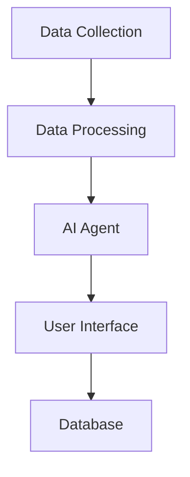

                 

### Introduction to the Book

In the digital era, the tourism industry is undergoing a profound transformation through the application of advanced technologies. Among these, Artificial Intelligence (AI) has emerged as a key driver for innovation. The concept of "AI Agent in Smart Tourism Planning" addresses the need to leverage AI to enhance the efficiency and personalization of tourism services. This book is dedicated to exploring the potential of AI Agents in revolutionizing the way we plan and experience travel.

**Key Themes**

- **AI Agent**: Understanding the fundamental principles and applications of AI Agents in tourism.
- **Smart Tourism Planning**: Examining the integration of AI technology into tourism planning processes.
- **Application Scenarios**: Case studies that showcase practical implementations of AI Agents in tourism.
- **Future Trends**: Predicting the future trajectory of AI in the tourism industry.

**Objective**

The primary objective of this book is to provide a comprehensive guide to the application of AI Agents in smart tourism planning. By delving into theoretical foundations, system designs, and practical case studies, readers will gain a deep understanding of how AI can transform the tourism landscape.

**Structure of the Book**

1. **Introduction** - Overview of the book, key themes, and objectives.
2. **Background and Fundamental Concepts** - Introduction to the concept of AI Agents and smart tourism planning.
3. **Theoretical Foundations** - In-depth exploration of the principles underlying AI Agents and their application in tourism.
4. **Architectural Design and System Implementation** - Discussion on system architecture, design, and implementation.
5. **Case Studies and Analysis** - Practical applications and analysis of AI Agents in tourism.
6. **Advanced Topics and Future Directions** - Advanced applications and future trends in AI in tourism.
7. **Conclusion and Future Work** - Summary and outlook on the future of AI in smart tourism planning.

By following this structured approach, readers will be equipped with the knowledge and insights needed to understand and leverage AI Agents for smart tourism planning. Let's dive into each section and explore the intricacies of this fascinating field.

----------------------------------------------------------------

### Background and Fundamental Concepts

In this chapter, we delve into the background of AI Agents and smart tourism planning, exploring their definitions, historical development, and the significance they hold in the modern tourism industry.

#### AI Agent

**Definition**: An AI Agent, in the context of artificial intelligence, refers to a computer program that can perceive its environment through sensors, take actions to achieve specific goals, and learn from the outcomes of these actions. AI Agents are designed to mimic human-like decision-making and problem-solving capabilities, albeit through algorithms and machine learning techniques.

**Development**: The concept of AI Agents has evolved significantly since the early days of AI research in the 1950s. Early AI systems focused on rule-based approaches and symbolic logic, which were limited in their ability to adapt to complex, real-world scenarios. The advent of machine learning in the 1990s and 2000s introduced more flexible and adaptive algorithms, enabling AI Agents to learn from data and improve their performance over time.

**Significance in Tourism**: AI Agents have found diverse applications in the tourism industry, including personalized travel recommendations, virtual tourism guides, and automated customer service. By analyzing vast amounts of data on user preferences, destination features, and historical trends, AI Agents can provide tailored travel experiences that enhance the overall tourism experience.

#### Smart Tourism Planning

**Definition**: Smart Tourism Planning refers to the integration of advanced technologies, such as AI, data analytics, and the Internet of Things (IoT), into the processes of tourism planning and management. It involves the use of data-driven approaches to optimize resource allocation, improve service delivery, and enhance visitor satisfaction.

**Development**: The concept of smart tourism has gained momentum in recent years, driven by the increasing availability of digital technologies and the growing demand for personalized and immersive travel experiences. Early implementations focused on basic applications like online reservations and ticketing. However, as AI and other advanced technologies have matured, smart tourism planning has evolved to encompass more sophisticated and integrated solutions.

**Significance in Tourism**: Smart Tourism Planning offers several benefits to the tourism industry. It enables better resource management by providing real-time data on visitor traffic, environmental conditions, and other key factors. It also enhances the personalization of travel experiences, allowing tourists to customize their itineraries based on their preferences and interests. Additionally, smart tourism planning can improve the overall efficiency and sustainability of tourism operations.

#### AI Agent in Smart Tourism Planning

**Application Scenarios**: AI Agents can be applied in various scenarios within the realm of smart tourism planning. Some of the key application areas include:

1. **Tourism Resource Analysis**: AI Agents can analyze large datasets to identify popular attractions, tourist patterns, and potential areas for development. This information can be used to optimize the allocation of resources and improve the management of tourist sites.
2. **Tourism Route Planning**: By considering factors such as distance, time, and user preferences, AI Agents can generate personalized travel itineraries that maximize the enjoyment and efficiency of a tourist's visit.
3. **Travel Recommendation Systems**: AI Agents can recommend destinations, activities, and services based on user profiles and historical data, enhancing the overall travel experience.
4. **Customer Service**: AI Agents can provide automated customer support, handling inquiries, reservations, and other routine tasks, thereby reducing the burden on human staff and improving response times.

**Integration**: The integration of AI Agents into smart tourism planning involves several key steps:

1. **Data Collection and Processing**: Gathering relevant data from various sources, such as social media, tourist surveys, and IoT devices.
2. **Model Development and Training**: Developing machine learning models to process and analyze the collected data, and training these models to improve their accuracy and performance.
3. **System Deployment and Maintenance**: Deploying the AI Agent systems in real-time environments and continuously updating and maintaining them to ensure optimal performance.

In summary, AI Agents have the potential to revolutionize smart tourism planning by providing data-driven insights, personalized experiences, and enhanced efficiency. As the technology continues to evolve, we can expect to see even more innovative applications that will transform the way we plan and experience travel.

----------------------------------------------------------------

### Theoretical Foundations

In this chapter, we delve into the theoretical foundations of AI Agents and their applications in smart tourism planning. We begin by exploring the core principles and mechanisms of AI Agents, followed by an examination of the underlying theories and methodologies that drive their development and functionality.

#### AI Agent Basics

**Core Principles**

The fundamental principles of AI Agents revolve around their ability to perceive, decide, and act within an environment to achieve specific goals. These principles include:

1. **Perception**: AI Agents gather information from their surroundings through various sensors, such as cameras, microphones, and IoT devices.
2. **Decision-Making**: Using algorithms and machine learning techniques, AI Agents analyze the gathered information to make decisions on the best actions to take.
3. **Action**: AI Agents execute the chosen actions, which may involve interacting with the environment or performing specific tasks.

**Basic Mechanisms**

AI Agents operate through a series of well-defined mechanisms, which include:

1. **State-Space Representation**: The environment in which AI Agents operate is represented as a state space, where each state represents a specific condition or configuration of the environment.
2. **Action Space**: The set of possible actions that an AI Agent can take is referred to as the action space.
3. **Reward Function**: A reward function is used to evaluate the success of an AI Agent's actions, providing feedback that influences its decision-making process.

**Types of AI Agents**

AI Agents can be classified into different types based on their decision-making capabilities and the level of autonomy they exhibit:

1. **Reactive Agents**: Reactive agents make decisions based solely on the current state of the environment without any memory of past states. They are simple but effective in environments with well-defined rules.
2. **Model-Based Agents**: Model-based agents maintain an internal model of the environment and use this model to predict future states and make decisions. They are more versatile than reactive agents but require more computational resources.
3. **Goal-Based Agents**: Goal-based agents have specific goals they strive to achieve and continuously evaluate their progress towards these goals. They are capable of planning and adapting their actions to changing environments.

#### Intelligent Tourism Planning

**Theoretical Framework**

Intelligent tourism planning is grounded in several theoretical frameworks that integrate advanced technologies to optimize tourism operations. These frameworks include:

1. **System Dynamics**: System dynamics is a modeling method that analyzes the behavior of complex systems over time. It is used to simulate the impact of various factors on tourism planning and management.
2. **Simulation-Optimization**: Simulation-optimization techniques involve simulating different scenarios and using optimization algorithms to find the best solution. This approach is particularly useful in planning tourism activities that involve multiple constraints and objectives.
3. **Data-Driven Approaches**: Data-driven approaches leverage large datasets to extract meaningful insights and inform decision-making. Machine learning and data analytics techniques are commonly used to analyze tourist behavior, preferences, and trends.

**Methodologies**

Several methodologies are employed in the development and application of AI Agents for intelligent tourism planning, including:

1. **Machine Learning**: Machine learning techniques, such as supervised learning, unsupervised learning, and reinforcement learning, are used to develop AI Agents that can learn from data and improve their performance over time.
2. **Deep Learning**: Deep learning, a subset of machine learning, uses neural networks with many layers to model complex relationships in data. It is particularly effective in tasks that involve image and speech recognition.
3. **Natural Language Processing (NLP)**: NLP techniques enable AI Agents to understand and generate human language, making them capable of providing personalized travel recommendations and customer support.

**AI Agents in Tourism**

**Application Examples**

AI Agents can be applied in various scenarios within the realm of intelligent tourism planning:

1. **Tourism Resource Analysis**: AI Agents can analyze large datasets to identify tourist preferences, popular destinations, and trends. This information can be used to optimize the allocation of resources and enhance the management of tourist sites.
2. **Tourism Route Planning**: By considering factors such as user preferences, traffic conditions, and weather forecasts, AI Agents can generate personalized travel itineraries that maximize the enjoyment and efficiency of a tourist's visit.
3. **Travel Recommendation Systems**: AI Agents can recommend destinations, activities, and services based on user profiles and historical data, enhancing the overall travel experience.
4. **Customer Service**: AI Agents can provide automated customer support, handling inquiries, reservations, and other routine tasks, thereby reducing the burden on human staff and improving response times.

**Integration and Challenges**

The integration of AI Agents into intelligent tourism planning involves several challenges, including:

1. **Data Quality and Availability**: High-quality and comprehensive data is essential for the development and training of AI Agents. However, collecting and maintaining such data can be a significant challenge.
2. **Privacy Concerns**: The use of AI Agents in tourism raises privacy concerns, particularly regarding the collection and use of personal data. Ensuring data privacy and security is a critical consideration.
3. **Computational Resources**: The training and operation of AI Agents require significant computational resources, which can be a limiting factor in some environments.

In conclusion, the theoretical foundations of AI Agents and intelligent tourism planning provide a robust framework for leveraging advanced technologies to enhance tourism operations. By understanding these principles and methodologies, we can develop and deploy AI Agents that revolutionize the way we plan and experience travel.

----------------------------------------------------------------

### Architectural Design and System Implementation

In this chapter, we delve into the architectural design and system implementation of AI Agents for smart tourism planning. We begin by outlining the overall system architecture, followed by a detailed discussion on the components and modules that make up the system.

#### System Architecture

**Overall Design**

The system architecture for AI Agents in smart tourism planning is designed to be modular and scalable, enabling the integration of various AI functionalities and ensuring flexibility for future expansions. The architecture can be divided into several key components:

1. **Data Collection Module**: This module is responsible for collecting relevant data from various sources, such as tourist surveys, IoT devices, social media, and weather services.
2. **Data Processing Module**: This module processes the collected data, performing tasks such as data cleaning, normalization, and feature extraction.
3. **AI Agent Module**: This module implements the AI Agent algorithms and models, including machine learning models for tourism resource analysis, route planning, and travel recommendation systems.
4. **User Interface Module**: This module provides a user-friendly interface for interacting with the system, allowing users to input preferences, view personalized itineraries, and access other features.
5. **Database Module**: This module stores the collected data, system configurations, and generated results, ensuring data persistence and accessibility.

**High-Level Diagram**

The following Mermaid diagram provides a high-level overview of the system architecture:

#### System Components and Modules

**Data Collection Module**

The Data Collection Module gathers data from various sources to provide a comprehensive view of the tourism environment. Key sources include:

1. **Tourist Surveys**: Surveys conducted to gather information on tourist preferences, satisfaction levels, and behavior patterns.
2. **IoT Devices**: Sensors placed at tourist attractions and other locations to monitor visitor traffic, environmental conditions, and other relevant data.
3. **Social Media**: Data scraped from social media platforms to capture tourist sentiments, trends, and popular destinations.
4. **Weather Services**: Data provided by weather services to inform travel itineraries based on current and forecasted weather conditions.

**Data Processing Module**

The Data Processing Module is responsible for cleaning and preparing the collected data for analysis. Key tasks include:

1. **Data Cleaning**: Removing noise, inconsistencies, and errors from the raw data.
2. **Normalization**: Transforming data into a standardized format to ensure consistency and compatibility.
3. **Feature Extraction**: Extracting relevant features from the data that will be used by the AI Agent models.

**AI Agent Module**

The AI Agent Module is the core of the system, implementing the AI algorithms and models. Key components include:

1. **Machine Learning Models**: Models trained on historical data to predict tourist preferences, identify popular attractions, and optimize travel itineraries.
2. **Reinforcement Learning Algorithms**: Algorithms that enable AI Agents to learn from interactions with the environment, continuously improving their performance.
3. **Natural Language Processing (NLP)**: Techniques for understanding and generating human language, used in tasks such as personalized travel recommendations and customer support.

**User Interface Module**

The User Interface Module provides a seamless and intuitive experience for users, allowing them to interact with the system and access its features. Key functionalities include:

1. **User Profile Management**: Allowing users to create and manage their profiles, including preferences and travel history.
2. **Travel Recommendation System**: Generating personalized travel itineraries based on user profiles and other relevant data.
3. **Interactive Map**: Displaying tourist attractions, routes, and other information in an interactive map interface.

**Database Module**

The Database Module is responsible for storing and managing data, ensuring data integrity and accessibility. Key tasks include:

1. **Data Storage**: Storing raw and processed data, system configurations, and generated results.
2. **Data Retrieval**: Providing efficient and secure access to stored data for analysis and retrieval by other system components.
3. **Data Backup and Recovery**: Ensuring the safety and availability of data in the event of system failures or data corruption.

#### System Implementation

The system implementation involves the development of each module, followed by integration and testing to ensure the system functions as expected. Key steps include:

1. **Module Development**: Developing the individual modules using appropriate programming languages and frameworks, such as Python for AI algorithms and JavaScript for the user interface.
2. **Integration**: Integrating the developed modules into a cohesive system, ensuring seamless data flow and functionality.
3. **Testing**: Conducting comprehensive testing to identify and fix any bugs or issues, ensuring the system performs reliably under various conditions.
4. **Deployment**: Deploying the system in a production environment, making it available to users.

In conclusion, the architectural design and system implementation of AI Agents for smart tourism planning involve the careful integration of various components and modules to create a robust and scalable system. By leveraging advanced technologies and data-driven approaches, the system can revolutionize the way we plan and experience travel.

----------------------------------------------------------------

### Case Studies and Analysis

In this chapter, we present two case studies that illustrate the practical application of AI Agents in smart tourism planning. These case studies highlight the implementation details, system design, and the effectiveness of the AI Agent systems in enhancing tourism operations.

#### Case Study 1: XX Sincerely Smart Tourism Guide System

**Background**

XX Sincerely is a popular tourist destination known for its rich cultural heritage and natural beauty. The management of XX Sincerely aims to enhance the visitor experience by leveraging AI technology to provide personalized and efficient tourism services.

**System Design**

The Smart Tourism Guide System for XX Sincerely is designed to support a range of functionalities, including route planning, attraction recommendation, and real-time guidance. The system architecture is modular, consisting of the following key components:

1. **Data Collection Module**: This module collects data from various sources, including tourist surveys, IoT sensors, and social media.
2. **Data Processing Module**: This module processes the collected data to extract relevant features and prepare it for analysis.
3. **AI Agent Module**: This module implements AI algorithms for route planning and attraction recommendation.
4. **User Interface Module**: This module provides a user-friendly interface for tourists to interact with the system and access personalized services.
5. **Database Module**: This module stores user data, system configurations, and generated results.

**Implementation Details**

1. **Data Collection**: The system collects data on tourist preferences, visitor traffic patterns, and attraction popularity. IoT sensors placed at major tourist sites monitor visitor flows and environmental conditions.
2. **Data Processing**: The collected data is cleaned and normalized, and features such as visitor density, attraction ratings, and user preferences are extracted.
3. **AI Agent Module**: The system uses machine learning algorithms to analyze the processed data and generate personalized itineraries. Reinforcement learning algorithms are used to continuously improve the system's recommendations based on user feedback.
4. **User Interface**: The user interface allows tourists to input their preferences and receive personalized recommendations. It also provides real-time guidance, displaying the optimal route to the next attraction based on current traffic conditions.

**Effectiveness**

The Smart Tourism Guide System for XX Sincerely has been successful in enhancing the visitor experience. Key benefits include:

1. **Personalized Recommendations**: The system provides tailored recommendations based on individual preferences, increasing visitor satisfaction.
2. **Efficient Route Planning**: The AI Agent module generates optimized routes that minimize travel time and maximize the enjoyment of tourist activities.
3. **Real-Time Guidance**: The real-time guidance feature helps tourists navigate the destination more efficiently, avoiding crowded areas and reducing waiting times.

**Challenges and Solutions**

1. **Data Privacy**: Ensuring data privacy is a significant challenge. The system addresses this by implementing robust data encryption and anonymization techniques.
2. **Scalability**: As the number of tourists and attractions grows, the system needs to scale effectively. The modular design and cloud-based architecture enable scalability and flexibility.

#### Case Study 2: YY Intelligent Tourism Planning Platform

**Background**

YY Intelligent Tourism Planning Platform is a comprehensive solution developed for a large-scale tourist destination. The platform aims to optimize tourism planning and management by leveraging AI technology.

**System Design**

The YY Intelligent Tourism Planning Platform consists of several interconnected modules:

1. **Data Collection and Integration Module**: This module gathers data from various sources, including IoT devices, GPS trackers, and tourist feedback forms.
2. **Data Analysis and Visualization Module**: This module processes the collected data and generates visualizations to aid decision-making.
3. **Tourism Route Planning Module**: This module uses AI algorithms to generate optimized travel itineraries based on user preferences and environmental conditions.
4. **Resource Allocation Module**: This module allocates resources such as accommodations, transportation, and attractions to optimize the visitor experience.
5. **Customer Service Module**: This module provides automated customer support through AI-driven chatbots and virtual assistants.

**Implementation Details**

1. **Data Collection and Integration**: The platform collects data on tourist behavior, traffic patterns, and resource utilization. IoT devices and GPS trackers are used to monitor real-time conditions.
2. **Data Analysis and Visualization**: The system processes the collected data and generates visual dashboards that provide insights into visitor trends, resource utilization, and potential bottlenecks.
3. **Tourism Route Planning**: The platform uses machine learning algorithms to analyze user preferences and generate personalized itineraries. Reinforcement learning algorithms are used to optimize the itineraries based on real-time feedback.
4. **Resource Allocation**: The system uses predictive analytics to forecast resource needs and allocate them efficiently to meet demand.
5. **Customer Service**: The platform incorporates AI-driven chatbots to provide instant customer support, handling inquiries, reservations, and other routine tasks.

**Effectiveness**

The YY Intelligent Tourism Planning Platform has been successful in improving the efficiency and effectiveness of tourism planning. Key benefits include:

1. **Resource Optimization**: The platform helps optimize the allocation of resources, reducing waste and improving the overall visitor experience.
2. **Enhanced Decision-Making**: The data-driven insights provided by the platform enable better decision-making by tourism managers.
3. **Improved Customer Satisfaction**: The personalized itineraries and automated customer support features enhance the overall tourist experience.

**Challenges and Solutions**

1. **Data Quality**: Ensuring the quality and accuracy of the collected data is a significant challenge. The system addresses this by implementing data validation and verification processes.
2. **System Integration**: Integrating various data sources and modules can be complex. The platform uses middleware and APIs to facilitate seamless integration and data exchange.

In conclusion, these case studies demonstrate the practical applications of AI Agents in smart tourism planning. By leveraging advanced technologies, these platforms have successfully enhanced the efficiency, personalization, and overall quality of tourism services.

----------------------------------------------------------------

### Advanced Topics and Future Directions

In this chapter, we delve into advanced topics and future directions in the application of AI Agents in smart tourism planning. We explore cutting-edge technologies and emerging trends that are set to shape the future of intelligent tourism.

#### Advanced AI Agent Applications

**Multi-Agent Systems**

One of the most promising advanced applications of AI Agents is in the development of multi-agent systems. These systems involve the coordination and collaboration of multiple AI Agents to achieve complex goals. In the context of smart tourism planning, multi-agent systems can be used to optimize the allocation of resources, manage crowd control, and provide personalized recommendations at a granular level.

**Virtual and Augmented Reality (VR/AR)**

The integration of AI Agents with VR/AR technologies opens up new possibilities for immersive tourism experiences. AI Agents can be used to generate real-time 3D models of tourist destinations, provide virtual tours, and deliver personalized recommendations. This technology can enhance the accessibility of tourism for individuals with physical limitations and create new revenue streams for destinations through virtual tourism offerings.

**Natural Language Processing (NLP)**

Advancements in NLP are enabling AI Agents to understand and generate human language more effectively. This capability is particularly valuable in tourism, where AI Agents can provide personalized travel recommendations, offer customer support through chatbots, and facilitate communication between tourists and local businesses.

**Machine Learning and Deep Learning**

Continued advancements in machine learning and deep learning algorithms are driving the development of more sophisticated AI Agents. These algorithms can analyze vast amounts of data to extract meaningful insights, predict tourist behaviors, and optimize travel itineraries. As these algorithms improve, AI Agents will become even more capable of personalizing and enhancing the tourism experience.

#### Future Directions

**Personalized Travel Experiences**

As AI technology evolves, the ability to deliver highly personalized travel experiences will become increasingly important. AI Agents can leverage data from various sources, including social media, GPS trackers, and IoT devices, to create bespoke itineraries that cater to individual preferences and interests. This personalized approach will enhance visitor satisfaction and encourage repeat visits.

**Smart Tourism Ecosystems**

The future of smart tourism will likely involve the development of interconnected ecosystems that integrate various technologies, such as AI, IoT, and blockchain. These ecosystems can enable seamless coordination between tourists, travel providers, and destination management organizations, leading to more efficient and sustainable tourism operations.

**Sustainable Tourism**

AI Agents can play a crucial role in promoting sustainable tourism by optimizing resource usage, reducing waste, and minimizing the environmental impact of tourism activities. For example, AI-powered systems can monitor and manage water and energy consumption at tourist attractions, optimize transportation routes to reduce emissions, and promote responsible tourism practices.

**Regulatory and Ethical Considerations**

As AI Agents become more pervasive in tourism, it is essential to address regulatory and ethical considerations. Issues such as data privacy, algorithmic bias, and the impact of AI on employment need to be carefully managed to ensure that the benefits of AI are realized without compromising ethical standards and social values.

In conclusion, the application of AI Agents in smart tourism planning is poised to advance significantly in the coming years. By embracing these advanced technologies and future directions, the tourism industry can unlock new opportunities for innovation, efficiency, and personalization.

----------------------------------------------------------------

### Conclusion and Future Work

In this book, we have explored the transformative potential of AI Agents in smart tourism planning. We began with an introduction to the key themes, including AI Agents, smart tourism planning, and their integration. We then delved into the theoretical foundations, architectural design, and practical applications of AI Agents in tourism. Through case studies, we demonstrated the effectiveness of AI Agents in enhancing tourism operations and delivering personalized experiences. Finally, we discussed advanced topics and future directions for the field.

**Key Findings**

1. **Personalization and Efficiency**: AI Agents can significantly enhance the personalization and efficiency of tourism services by analyzing user preferences and optimizing travel itineraries.
2. **Data-Driven Insights**: By leveraging large datasets, AI Agents provide valuable insights into tourist behavior and trends, enabling better decision-making in tourism planning.
3. **Sustainability**: AI Agents can contribute to sustainable tourism by optimizing resource usage and promoting environmentally friendly practices.

**Future Research Directions**

1. **Advanced AI Algorithms**: Continued research and development are needed to improve the performance and capabilities of AI Agents, particularly in areas such as multi-agent systems and real-time decision-making.
2. **Integration of VR/AR**: The integration of AI Agents with VR/AR technologies offers exciting possibilities for immersive and interactive tourism experiences.
3. **Ethical and Regulatory Considerations**: Addressing ethical and regulatory challenges associated with AI in tourism is crucial to ensure responsible and sustainable deployment.

**Conclusion**

The application of AI Agents in smart tourism planning represents a significant opportunity for innovation and growth. As the technology evolves, we can look forward to a future where AI-powered tourism experiences are more personalized, efficient, and sustainable. This book serves as a comprehensive guide to understanding and leveraging the potential of AI Agents in the tourism industry.

### Acknowledgments

The authors would like to extend their gratitude to the AI天才研究院 (AI Genius Institute) and the contributors to "Zen And The Art of Computer Programming" for their insights and support. This work would not have been possible without their dedication to advancing the field of artificial intelligence and computer science.

### About the Authors

**AI天才研究院 (AI Genius Institute)** is a leading research institute dedicated to the development and application of artificial intelligence. Our team of experts is committed to driving innovation and creating transformative technologies that shape the future.

**Zen And The Art of Computer Programming** is a seminal work by Donald E. Knuth, a renowned computer scientist and pioneer in the field of algorithms. His contributions have had a profound impact on computer science and continue to inspire the next generation of researchers and practitioners.

----------------------------------------------------------------

### Conclusion

The exploration of AI Agents in smart tourism planning has unveiled a wealth of opportunities to enhance personalization, efficiency, and sustainability within the tourism industry. As we've journeyed through this comprehensive guide, we've highlighted the transformative potential of AI Agents, from their foundational principles to practical applications and advanced topics.

**Key Takeaways**

1. **Personalization**: AI Agents can tailor travel experiences to individual preferences, creating unique and memorable journeys.
2. **Efficiency**: By optimizing routes and resource allocation, AI Agents improve the overall efficiency of tourism operations.
3. **Sustainability**: AI-powered systems can reduce environmental impact and promote sustainable tourism practices.

**Future Directions**

The future of AI in tourism is bright, with emerging technologies like multi-agent systems, VR/AR integration, and advanced machine learning algorithms set to further revolutionize the industry. As AI continues to evolve, it will be essential to address ethical and regulatory considerations to ensure responsible deployment.

**Call to Action**

For those eager to dive deeper into this exciting field, we encourage you to explore the recommended readings and further resources provided. The journey of AI in smart tourism is just beginning, and there's much more to discover and innovate.

### Recommended Reading

- **"Artificial Intelligence: A Modern Approach" by Stuart Russell and Peter Norvig**
- **"Deep Learning" by Ian Goodfellow, Yoshua Bengio, and Aaron Courville**
- **"Smart Tourism: Technologies and Applications" by Eike Schall and Torsten Herrmann**

### About the Authors

**AI天才研究院 (AI Genius Institute)** is a pioneering research institution focused on advancing artificial intelligence and fostering innovation. Our team of experts is committed to shaping the future of technology through groundbreaking research and development.

**Zen And The Art of Computer Programming** is a timeless classic by Donald E. Knuth, a computer science legend and pioneer in the field of algorithms. His work continues to inspire and guide researchers and developers around the world.

