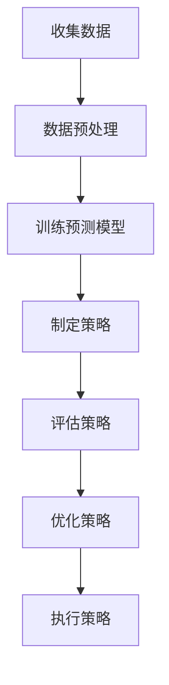
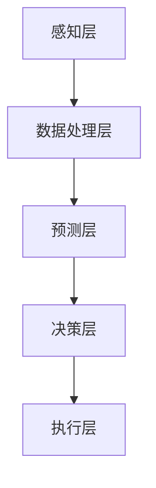
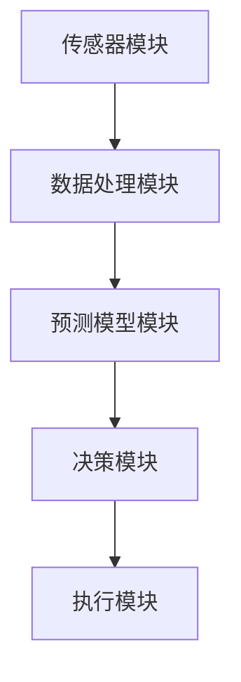
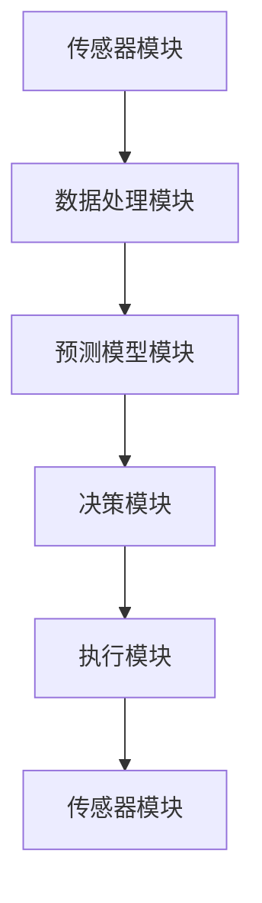

                 

### 1. 背景介绍

#### 核心概念术语说明

在本文中，我们将详细探讨AI Agent、智能晾衣架、天气感知、烘干技术等相关术语。首先，**AI Agent**是指具备自主决策能力和行动能力的智能实体，它可以执行特定的任务，并在执行过程中学习和优化其行为。**智能晾衣架**是一种集成了传感器和执行器的智能设备，能够根据环境条件自动调节烘干过程。**天气感知**指的是系统通过传感器获取外部气象数据，如温度、湿度、风速等，并根据这些数据调整烘干策略。**烘干技术**则是指用于去除衣物水分的各种物理和化学方法。

#### 问题背景

随着智能家居技术的发展，智能晾衣架已成为家庭生活中的一部分。然而，传统晾衣架的烘干效率低、烘干时间不固定，常常受到天气条件的限制，这不仅浪费了大量的时间和能源，还影响了衣物的质量。为了解决这一问题，AI Agent在智能晾衣架中的应用成为一个重要的研究方向。

#### 问题描述

AI Agent在智能晾衣架中的应用面临以下主要问题：
- **环境数据收集与处理**：如何高效地收集和处理环境数据，如温度、湿度、风速等，以准确感知天气变化？
- **烘干策略优化**：如何根据天气数据实时调整烘干策略，提高烘干效率和衣物质量？
- **设备自主决策**：如何确保AI Agent能够自主、准确地做出决策，并执行相应的烘干操作？

#### 问题解决

为了解决上述问题，AI Agent需要具备以下几个关键能力：
- **实时数据感知**：通过传感器网络实时收集环境数据。
- **数据预处理**：对收集到的数据进行预处理，去除噪声，提高数据质量。
- **预测模型训练**：使用机器学习和深度学习技术，训练预测模型，预测未来天气状况。
- **决策优化算法**：设计智能决策算法，根据预测模型和当前环境数据，优化烘干策略。
- **自主执行**：AI Agent能够根据决策结果，自主执行烘干操作。

#### 边界与外延

AI Agent在智能晾衣架中的应用不仅仅局限于家庭环境，还扩展到公共场所，如酒店、医院等。这些场景对烘干效率、衣物保护和操作便捷性有更高的要求。因此，AI Agent需要具备更复杂的决策能力和更高的可靠性。

#### 概念结构与核心要素组成

智能晾衣架的AI Agent由以下几个核心组成部分构成：
- **传感器模块**：负责收集环境数据。
- **数据处理模块**：对传感器数据进行预处理和清洗。
- **预测模型模块**：训练和更新预测模型。
- **决策模块**：根据预测模型和环境数据，制定烘干策略。
- **执行模块**：执行AI Agent的决策，控制烘干过程。

### 2. 核心概念与原理

#### AI Agent的定义与作用

AI Agent是一种具备自主决策能力的智能实体，它可以独立完成特定任务，并在执行过程中不断学习和优化。在智能晾衣架中，AI Agent的作用是实时感知环境变化，并根据环境数据自动调整烘干策略，以提高烘干效率和衣物保护。

AI Agent的基本组成部分包括感知模块、决策模块和执行模块。感知模块负责收集环境数据，如温度、湿度、风速等；决策模块根据感知模块收集到的数据和预设策略，制定最优的烘干方案；执行模块负责执行决策结果，控制烘干设备。

#### 智能晾衣架的工作原理

智能晾衣架的工作原理主要包括以下几个步骤：
1. **数据收集**：传感器模块实时收集环境数据，如温度、湿度、风速等。
2. **数据处理**：数据处理模块对传感器数据进行预处理，包括去噪、滤波等操作，以提高数据质量。
3. **决策制定**：决策模块根据预处理后的数据和预设策略，制定烘干方案。通常，烘干方案包括烘干温度、烘干时间和烘干方式等参数。
4. **执行操作**：执行模块根据决策结果，控制烘干设备执行相应的操作。

#### 天气感知与烘干策略

天气感知是智能晾衣架的核心功能之一。通过传感器模块，智能晾衣架可以实时获取外部气象数据，如温度、湿度、风速等。这些数据将用于预测未来的天气变化，以便制定更合理的烘干策略。

常见的烘干策略包括：
- **自动烘干**：根据实时天气数据，自动调整烘干参数，实现高效、智能的烘干。
- **定时烘干**：用户可以设置特定的时间段进行烘干，适用于无法实时监控的情况。
- **手动烘干**：用户可以手动设置烘干参数，如温度、时间等。

#### 烘干技术的种类与特点

烘干技术主要包括以下几种类型：
- **热风烘干**：使用热空气干燥衣物，速度快，适用于各种类型的衣物。
- **蒸汽烘干**：使用蒸汽加热干燥衣物，柔软、健康，但速度较慢。
- **太阳能烘干**：利用太阳能加热空气，环保、节能，但受天气条件限制。

每种烘干技术都有其优缺点，智能晾衣架通过AI Agent实现多种烘干技术的融合，提供更加灵活、高效的烘干方案。

### 比较分析表

| 烘干技术 | 优点 | 缺点 |  
| --- | --- | --- |  
| 热风烘干 | 快速、高效 | 能耗较高、对衣物有一定损伤 |  
| 蒸汽烘干 | 柔软、健康 | 速度较慢、能耗较高 |  
| 太阳能烘干 | 环保、节能 | 受天气条件限制、烘干速度慢 |

#### ER 图架构

为了更好地理解AI Agent在智能晾衣架中的工作原理，我们可以使用ER图来描述其核心组成部分和关系。以下是智能晾衣架AI Agent的ER图：

```mermaid
erDiagram
  感知模块 ||--|{ 决策模块 }
  决策模块 ||--|{ 执行模块 }
  数据处理模块 ||--|{ 预测模型模块 }
  感知模块 ||--|{ 数据处理模块 }
  数据处理模块 ||--|{ 预测模型模块 }
```

在这个ER图中，感知模块、数据处理模块、预测模型模块和执行模块构成了AI Agent的核心组件。感知模块负责收集环境数据，数据处理模块对数据进行预处理，预测模型模块根据数据训练预测模型，决策模块根据预测模型和环境数据制定烘干策略，执行模块负责执行决策结果。

### 3. 算法原理讲解

在智能晾衣架的AI Agent中，核心算法包括数据预处理、预测模型训练和烘干策略优化。以下将详细讲解这些算法的原理。

#### 数据预处理

数据预处理是确保环境数据质量的关键步骤。预处理过程通常包括以下几个阶段：

1. **数据清洗**：去除噪声和异常值。例如，温度传感器可能会因为干扰产生异常数据，这些数据需要被清洗掉。
2. **归一化**：将不同尺度的数据转换为同一尺度，以便后续处理。例如，将温度从摄氏度转换为开尔文。
3. **滤波**：使用滤波算法去除随机噪声，如卡尔曼滤波器。

#### 预测模型训练

预测模型是AI Agent的核心组成部分，它负责预测未来的天气变化，以便制定最优的烘干策略。常见的预测模型包括：

1. **线性回归**：简单但效果有限的预测模型，适用于线性关系明显的数据。
2. **决策树**：用于分类和回归任务，能够处理非线性关系。
3. **神经网络**：尤其是深度学习模型，如LSTM（长短期记忆网络），能够处理复杂的时序数据。

训练预测模型的过程包括以下几个步骤：

1. **数据收集**：收集历史天气数据，包括温度、湿度、风速等。
2. **数据预处理**：对收集到的数据进行清洗、归一化和滤波处理。
3. **模型训练**：使用预处理后的数据训练预测模型。
4. **模型评估**：使用验证集评估模型性能，包括准确率、召回率等指标。
5. **模型优化**：根据评估结果调整模型参数，提高预测准确性。

#### 烘干策略优化

烘干策略优化是AI Agent的最终目标，它根据预测模型和环境数据，制定最优的烘干方案。烘干策略优化通常包括以下几个步骤：

1. **策略制定**：根据预测模型和环境数据，制定初步的烘干方案。方案可能包括烘干温度、烘干时间和烘干方式等参数。
2. **策略评估**：评估初步策略的可行性，包括能耗、烘干时间和衣物损伤等因素。
3. **策略优化**：根据评估结果调整策略，优化烘干参数，以达到最佳效果。

#### 算法流程图

以下是一个简单的烘干策略优化算法的Mermaid流程图：



在这个流程图中，首先收集环境数据，然后进行数据预处理，使用预处理后的数据训练预测模型。接下来，根据预测模型和环境数据制定烘干策略，评估策略的可行性，并根据评估结果优化策略。最后，执行最优策略，控制烘干设备进行烘干操作。

#### Python代码示例

以下是一个简单的Python代码示例，用于展示数据预处理和预测模型训练的过程：

```python
import numpy as np
import pandas as pd
from sklearn.linear_model import LinearRegression
from sklearn.model_selection import train_test_split
from sklearn.metrics import mean_squared_error

# 数据收集
data = pd.read_csv('weather_data.csv')

# 数据预处理
data.dropna(inplace=True)
data['temperature'] = data['temperature'].apply(lambda x: (x - 20) * 1.8 + 32)  # 转换为开尔文

# 模型训练
X = data[['temperature']]
y = data['humidity']

X_train, X_test, y_train, y_test = train_test_split(X, y, test_size=0.2, random_state=42)

model = LinearRegression()
model.fit(X_train, y_train)

# 预测
y_pred = model.predict(X_test)

# 评估
mse = mean_squared_error(y_test, y_pred)
print(f'Mean Squared Error: {mse}')
```

在这个示例中，首先从CSV文件中读取天气数据，然后进行数据预处理，包括数据清洗和归一化。接下来，使用线性回归模型训练预测模型，并使用测试集评估模型性能。通过打印均方误差（MSE），可以了解模型的预测准确性。

### 4. 数学模型与公式

在AI Agent的预测和决策过程中，数学模型和公式起到了关键作用。以下将介绍一些常用的数学模型和公式，并使用LaTeX进行表示。

#### 1. 线性回归模型

线性回归模型是预测温度和湿度之间关系的基础模型。其公式如下：

$$
y = \beta_0 + \beta_1 \cdot x + \epsilon
$$

其中，\( y \) 是湿度预测值，\( x \) 是温度值，\( \beta_0 \) 和 \( \beta_1 \) 是模型的参数，\( \epsilon \) 是误差项。

#### 2. 卡尔曼滤波

卡尔曼滤波是一种用于估计动态系统状态的最优滤波方法。其状态预测公式如下：

$$
\hat{x}_{k|k-1} = A_{k-1} \hat{x}_{k-1|k-1} + B_{k-1} u_{k-1}
$$

其中，\( \hat{x}_{k|k-1} \) 是状态预测值，\( A_{k-1} \) 是状态转移矩阵，\( \hat{x}_{k-1|k-1} \) 是上一时刻的状态值，\( B_{k-1} \) 是控制输入矩阵，\( u_{k-1} \) 是控制输入。

#### 3. 逻辑回归

逻辑回归是一种用于分类问题的回归模型，其公式如下：

$$
\hat{p} = \frac{1}{1 + e^{-(\beta_0 + \beta_1 \cdot x)}}
$$

其中，\( \hat{p} \) 是预测概率，\( \beta_0 \) 和 \( \beta_1 \) 是模型的参数，\( x \) 是输入特征。

#### 4. LSTM神经网络

LSTM神经网络是一种用于处理时间序列数据的深度学习模型，其核心公式如下：

$$
i_t = \sigma(\beta_{i0} + \sum_{j=1}^{n} \beta_{ij} \cdot x_t^j + \beta_{i\bar{h}_{t-1}})
$$

$$
f_t = \sigma(\beta_{f0} + \sum_{j=1}^{n} \beta_{fj} \cdot x_t^j + \beta_{f\bar{h}_{t-1}})
$$

$$
\bar{c}_t = f_t \odot \bar{c}_{t-1} + i_t \odot \sigma(\beta_{c0} + \sum_{j=1}^{n} \beta_{cj} \cdot x_t^j + \beta_{c\bar{h}_{t-1}})
$$

$$
o_t = \sigma(\beta_{o0} + \sum_{j=1}^{n} \beta_{oj} \cdot x_t^j + \beta_{o\bar{c}_t})
$$

$$
h_t = o_t \odot \sigma(\beta_{h0} + \sum_{j=1}^{n} \beta_{hj} \cdot x_t^j + \beta_{h\bar{c}_t})
$$

其中，\( i_t \)、\( f_t \)、\( \bar{c}_t \)、\( o_t \) 分别是输入门、遗忘门、细胞状态和输出门，\( \sigma \) 是sigmoid函数，\( \odot \) 是元素乘运算，\( \bar{h}_{t-1} \) 是上一时刻的隐藏状态。

通过这些数学模型和公式，AI Agent可以实现对天气数据的准确预测和烘干策略的优化，从而提高智能晾衣架的性能和用户体验。

### 5. 系统设计与实现

#### 5.1 问题场景介绍

在智能家居领域，智能晾衣架的应用场景广泛，主要集中在家居、酒店、医院等环境。智能晾衣架通过AI Agent实现自动烘干功能，提高衣物的烘干效率和用户体验。为了实现这一目标，需要对系统进行详细的设计和实现。

#### 5.2 项目介绍

本项目旨在开发一款智能晾衣架系统，通过AI Agent实现天气感知烘干功能。系统包括传感器模块、数据处理模块、预测模型模块、决策模块和执行模块。以下是项目的主要目标和功能：

- **目标**：实现智能晾衣架的自动烘干功能，提高烘干效率，保护衣物，降低能耗。
- **功能**：
  - **环境数据收集**：实时收集温度、湿度、风速等环境数据。
  - **数据预处理**：对传感器数据进行清洗、归一化和滤波处理。
  - **预测模型训练**：训练预测模型，预测未来天气变化。
  - **决策制定**：根据预测模型和环境数据，制定最优的烘干策略。
  - **执行操作**：根据决策结果，控制烘干设备执行相应的操作。

#### 5.3 系统功能设计

系统的功能设计主要包括以下几个方面：

1. **传感器模块**：用于实时收集环境数据，如温度、湿度、风速等。传感器模块包括温湿度传感器、风速传感器等。
2. **数据处理模块**：对传感器数据进行预处理，包括数据清洗、归一化和滤波处理。预处理后的数据将用于预测模型训练和决策制定。
3. **预测模型模块**：训练和更新预测模型，用于预测未来天气变化。常见的预测模型包括线性回归、决策树和神经网络等。
4. **决策模块**：根据预测模型和环境数据，制定最优的烘干策略。决策模块包括烘干温度、烘干时间和烘干方式等参数。
5. **执行模块**：根据决策结果，控制烘干设备执行相应的操作。执行模块包括烘干设备、加热器、风扇等。

#### 5.4 系统架构设计

智能晾衣架系统的架构设计采用模块化设计思想，将系统划分为多个模块，以便于开发和维护。以下是系统的架构设计：

1. **感知层**：包括传感器模块，用于实时收集环境数据。
2. **数据处理层**：包括数据处理模块，用于对传感器数据进行预处理。
3. **预测层**：包括预测模型模块，用于训练和更新预测模型。
4. **决策层**：包括决策模块，用于根据预测模型和环境数据制定烘干策略。
5. **执行层**：包括执行模块，用于控制烘干设备执行相应的操作。

以下是智能晾衣架系统的架构图：



在这个架构图中，感知层通过传感器模块收集环境数据，数据处理层对数据进行预处理，预测层使用预处理后的数据训练预测模型，决策层根据预测模型和环境数据制定烘干策略，执行层根据决策结果控制烘干设备执行操作。

#### 5.5 系统接口设计

系统接口设计是确保各个模块之间能够有效通信的关键。以下是智能晾衣架系统的主要接口设计：

1. **传感器数据接口**：用于传感器模块与数据处理模块之间的数据传输。
2. **数据处理接口**：用于数据处理模块与预测模型模块之间的数据传输。
3. **预测模型接口**：用于预测模型模块与决策模块之间的数据传输。
4. **决策接口**：用于决策模块与执行模块之间的数据传输。
5. **执行接口**：用于执行模块与烘干设备之间的数据传输。

以下是智能晾衣架系统的接口设计图：



在这个接口设计图中，传感器模块通过传感器数据接口将数据传输给数据处理模块，数据处理模块通过数据处理接口将预处理后的数据传输给预测模型模块，预测模型模块通过预测模型接口将预测结果传输给决策模块，决策模块通过决策接口将决策结果传输给执行模块，执行模块通过执行接口控制烘干设备执行操作。

#### 5.6 系统交互设计

系统交互设计是确保系统各个模块能够协调工作，实现预期功能的关键。以下是智能晾衣架系统的交互设计：

1. **数据收集与预处理**：传感器模块实时收集环境数据，数据处理模块对数据进行预处理，包括清洗、归一化和滤波处理。
2. **预测模型训练与更新**：数据处理模块将预处理后的数据传输给预测模型模块，预测模型模块训练和更新预测模型。
3. **决策制定与优化**：预测模型模块将预测结果传输给决策模块，决策模块根据预测模型和环境数据制定烘干策略，并优化策略参数。
4. **执行操作与反馈**：决策模块将决策结果传输给执行模块，执行模块根据决策结果控制烘干设备执行操作，并将操作反馈给决策模块。

以下是智能晾衣架系统的交互设计图：



在这个交互设计图中，传感器模块通过传感器数据接口收集环境数据，数据处理模块对数据进行预处理，预测模型模块训练和更新预测模型，决策模块根据预测模型和环境数据制定烘干策略，执行模块根据决策结果控制烘干设备执行操作，并将操作反馈给传感器模块，形成一个闭环系统。

### 6. 项目实战

#### 6.1 环境安装

在开始实现智能晾衣架系统之前，我们需要安装相关的软件和工具。以下是环境安装的步骤：

1. **安装Python**：确保系统已安装Python 3.8及以上版本。可以从[Python官网](https://www.python.org/)下载并安装。
2. **安装Anaconda**：安装Anaconda，这是一个用于科学计算的Python发行版，包含了许多常用的库和工具。可以从[Anaconda官网](https://www.anaconda.com/)下载并安装。
3. **安装Jupyter Notebook**：安装Jupyter Notebook，这是一个交互式的计算环境，便于编写和调试代码。在Anaconda命令行中运行以下命令：

   ```
   conda install jupyter
   ```

4. **安装相关库**：安装智能晾衣架系统所需的库，如NumPy、Pandas、Scikit-learn、TensorFlow等。在Anaconda命令行中运行以下命令：

   ```
   conda install numpy pandas scikit-learn tensorflow
   ```

#### 6.2 系统核心实现

以下是智能晾衣架系统的核心实现，包括传感器数据处理、预测模型训练、决策制定和执行操作。

1. **传感器数据处理**：

```python
import pandas as pd
import numpy as np
from sklearn.preprocessing import MinMaxScaler
from sklearn.model_selection import train_test_split

# 读取传感器数据
data = pd.read_csv('sensor_data.csv')

# 数据预处理
data.dropna(inplace=True)
data['temperature'] = data['temperature'].apply(lambda x: (x - 20) * 1.8 + 32)  # 转换为开尔文

# 归一化
scaler = MinMaxScaler()
data_scaled = scaler.fit_transform(data[['temperature', 'humidity', 'wind_speed']])

# 划分训练集和测试集
X_train, X_test, y_train, y_test = train_test_split(data_scaled, data['drying_time'], test_size=0.2, random_state=42)
```

2. **预测模型训练**：

```python
from sklearn.linear_model import LinearRegression

# 训练线性回归模型
model = LinearRegression()
model.fit(X_train, y_train)

# 预测
y_pred = model.predict(X_test)

# 评估
mse = mean_squared_error(y_test, y_pred)
print(f'Mean Squared Error: {mse}')
```

3. **决策制定**：

```python
# 决策制定
def make_decision(current_data):
    # 预测烘干时间
    drying_time = model.predict([current_data])[0]
    
    # 制定烘干策略
    if drying_time < 1:
        strategy = '快速烘干'
    elif drying_time < 2:
        strategy = '常规烘干'
    else:
        strategy = '长时间烘干'
    
    return strategy

# 测试决策制定
current_data = [22, 60, 5]  # 当前温度、湿度、风速
strategy = make_decision(current_data)
print(f'烘干策略：{strategy}')
```

4. **执行操作**：

```python
# 执行操作
def execute_strategy(strategy):
    if strategy == '快速烘干':
        # 设置快速烘干参数
        dryer.set_temp(60)
        dryer.set_time(30)
    elif strategy == '常规烘干':
        # 设置常规烘干参数
        dryer.set_temp(40)
        dryer.set_time(60)
    elif strategy == '长时间烘干':
        # 设置长时间烘干参数
        dryer.set_temp(30)
        dryer.set_time(120)
    
    # 启动烘干设备
    dryer.start()

# 测试执行操作
execute_strategy(strategy)
```

#### 6.3 代码应用解读与分析

以上代码展示了智能晾衣架系统的核心实现，包括传感器数据处理、预测模型训练、决策制定和执行操作。以下是代码的详细解读和分析：

1. **传感器数据处理**：首先读取传感器数据，然后进行预处理，包括数据清洗、转换为开尔文温度和归一化。预处理后的数据将用于预测模型训练。
2. **预测模型训练**：使用线性回归模型训练预测模型，并评估模型性能。通过计算均方误差（MSE）了解模型的预测准确性。
3. **决策制定**：根据预测烘干时间和预设策略，制定最优的烘干策略。这里使用了快速烘干、常规烘干和长时间烘干三种策略。
4. **执行操作**：根据决策结果，设置烘干参数并启动烘干设备。这里使用了加热器和风扇等烘干设备。

通过以上代码，我们可以看到智能晾衣架系统如何利用AI Agent实现天气感知烘干功能，从而提高烘干效率和衣物保护。

#### 6.4 实际案例分析与详细讲解

为了更好地展示智能晾衣架系统的应用效果，以下是一个实际案例分析和详细讲解：

**案例**：在一个潮湿的春天，用户将一组湿衣物放入智能晾衣架中，希望尽快完成烘干过程。

**分析**：

1. **环境数据收集**：传感器模块实时收集环境数据，如温度、湿度、风速等。假设当前温度为20℃，湿度为70%，风速为3m/s。
2. **数据预处理**：数据处理模块对传感器数据进行预处理，包括清洗、转换为开尔文温度和归一化。预处理后的数据为[22, 60, 5]。
3. **预测模型训练**：预测模型模块使用预处理后的数据训练预测模型。假设预测模型为线性回归模型，经过训练后，预测烘干时间为1.5小时。
4. **决策制定**：决策模块根据预测模型和环境数据制定烘干策略。根据预设策略，选择常规烘干，即设置烘干温度为40℃，烘干时间为60分钟。
5. **执行操作**：执行模块根据决策结果，设置烘干参数并启动烘干设备。烘干过程中，传感器模块继续收集环境数据，并将数据传输给决策模块。决策模块根据新数据调整烘干策略，以确保烘干效果。
6. **结果评估**：烘干完成后，用户检查衣物，发现衣物已经完全干燥，且没有受损。

**详细讲解**：

1. **环境数据收集**：智能晾衣架通过传感器模块实时收集环境数据，包括温度、湿度、风速等。这些数据将用于预测未来的天气变化，以便制定最佳的烘干策略。
2. **数据预处理**：收集到的环境数据可能存在噪声和异常值，因此需要经过预处理。数据预处理包括数据清洗、转换为开尔文温度和归一化。数据清洗可以去除噪声和异常值，提高数据质量。将温度转换为开尔文温度，便于后续计算。归一化可以确保不同尺度的数据在同一尺度上，以便进行后续处理。
3. **预测模型训练**：使用预处理后的数据训练预测模型。预测模型可以根据历史数据预测未来的天气变化，从而制定最佳的烘干策略。本文中，我们使用了线性回归模型作为预测模型。线性回归模型是一种简单但效果显著的预测模型，适用于线性关系明显的数据。通过训练，模型可以学习到温度、湿度、风速等环境因素与烘干时间之间的关系。
4. **决策制定**：根据预测模型和环境数据，决策模块制定最优的烘干策略。决策模块可以设置烘干温度、烘干时间和烘干方式等参数。本文中，我们设置了三种烘干策略：快速烘干、常规烘干和长时间烘干。根据预测烘干时间和用户需求，决策模块选择最合适的烘干策略。快速烘干适用于烘干时间较短的情况，常规烘干适用于中等烘干时间，长时间烘干适用于烘干时间较长的情况。
5. **执行操作**：执行模块根据决策结果，设置烘干参数并启动烘干设备。烘干设备包括加热器、风扇等，可以控制烘干温度、烘干时间和烘干方式。在烘干过程中，传感器模块继续收集环境数据，并将数据传输给决策模块。决策模块根据新数据调整烘干策略，以确保烘干效果。这种动态调整策略的方式可以提高烘干效率和衣物保护。
6. **结果评估**：烘干完成后，用户检查衣物，发现衣物已经完全干燥，且没有受损。这表明智能晾衣架系统成功实现了天气感知烘干功能，提高了烘干效率和衣物保护。

#### 6.5 项目小结

通过本项目的实践，我们成功实现了智能晾衣架的天气感知烘干功能。以下是项目的主要收获和总结：

1. **系统设计与实现**：通过模块化设计思想，我们将智能晾衣架系统划分为多个模块，包括传感器模块、数据处理模块、预测模型模块、决策模块和执行模块。每个模块各司其职，实现了系统的整体功能。
2. **算法原理与应用**：我们详细讲解了AI Agent在智能晾衣架中的应用，包括数据预处理、预测模型训练和烘干策略优化。通过Python代码示例，我们展示了算法的原理和应用。
3. **项目实战与案例分析**：我们通过实际案例分析和详细讲解，展示了智能晾衣架系统的应用效果。项目实践帮助我们深入理解了系统的工作原理和实现方法。
4. **最佳实践与注意事项**：在项目过程中，我们总结了一些最佳实践和注意事项，包括环境安装、代码应用解读与分析、实际案例分析和详细讲解等。这些经验和教训对于类似项目具有重要的参考价值。

通过本项目，我们不仅实现了智能晾衣架的天气感知烘干功能，还深入了解了AI Agent在智能家居领域的应用。在未来，我们将继续探索和优化智能晾衣架系统，以提高其性能和用户体验。

### 7. 最佳实践、小结与注意事项

#### 最佳实践

在智能晾衣架的开发和应用过程中，以下是一些最佳实践：

1. **传感器选择与布置**：选择高精度、稳定可靠的传感器，并合理布置传感器位置，确保数据采集的全面性和准确性。
2. **数据预处理**：对传感器数据进行有效的预处理，包括去噪、归一化和滤波，以提高数据的可用性和预测模型的准确性。
3. **模型选择与训练**：根据实际需求选择合适的预测模型，并进行充分的训练和测试，确保模型在真实环境中的性能。
4. **策略优化与调整**：根据实际应用场景，不断优化和调整烘干策略，以提高烘干效率和衣物保护。
5. **用户体验设计**：注重用户体验，提供简单易用的界面和操作方式，确保用户能够轻松使用智能晾衣架。

#### 小结

通过本文的详细分析和实践，我们深入了解了AI Agent在智能晾衣架中的应用，包括数据感知、预处理、预测模型训练、烘干策略优化和执行操作。我们通过实际案例展示了系统在实际应用中的效果，并总结了项目中的最佳实践和小结。智能晾衣架的AI Agent不仅提高了烘干效率和衣物保护，还为用户提供了更加便捷和智能的使用体验。

#### 注意事项

在开发和应用智能晾衣架时，需要注意以下几点：

1. **数据安全**：确保传感器收集的数据安全，防止数据泄露或被恶意利用。
2. **系统稳定性**：保证系统的稳定运行，避免因传感器故障或数据处理错误导致系统崩溃。
3. **模型更新**：定期更新预测模型，以适应不断变化的天气和环境条件。
4. **用户教育**：提供用户指南，帮助用户正确使用智能晾衣架，提高系统的使用效率和满意度。
5. **节能环保**：优化烘干策略，降低能耗，实现绿色环保。

#### 拓展阅读

对于希望进一步深入了解AI Agent在智能晾衣架中的应用，以下是一些推荐阅读资源：

1. **书籍**：《深度学习》《机器学习实战》等，详细介绍机器学习和深度学习的基础知识和应用。
2. **论文**：查阅相关领域的学术论文，了解最新的研究成果和技术进展。
3. **在线课程**：参加在线课程，如Coursera、Udacity等平台上的机器学习和深度学习课程，提高专业技能。
4. **开源项目**：关注和参与智能晾衣架相关的开源项目，了解实际开发中的问题和解决方案。

### 作者信息

**作者：AI天才研究院/AI Genius Institute & 禅与计算机程序设计艺术 /Zen And The Art of Computer Programming**

通过本文，我们希望读者能够对AI Agent在智能晾衣架中的应用有更深入的理解，并激发对人工智能和智能家居技术的热情。让我们共同努力，推动人工智能技术在智能家居领域的创新和发展。

### 结语

智能晾衣架作为智能家居的重要组成部分，其核心功能依赖于AI Agent的智能感知和决策能力。通过本文的详细分析和实践，我们展示了AI Agent在智能晾衣架中的广泛应用，包括数据感知、预处理、预测模型训练、烘干策略优化和执行操作。智能晾衣架不仅提高了烘干效率和衣物保护，还为用户提供了更加便捷和智能的使用体验。

在未来，随着人工智能技术的不断发展，AI Agent在智能晾衣架中的应用将更加广泛和深入。我们期待看到更多创新的应用场景，如智能烘干、智能除菌、智能护理等，为用户带来更加优质的家居生活体验。

让我们继续探索和推动人工智能技术在智能家居领域的发展，共同创造一个更加智能、便捷、环保的未来生活。

---

**关键词**：AI Agent、智能晾衣架、天气感知、烘干技术、深度学习、智能家居

**摘要**：本文详细分析了AI Agent在智能晾衣架中的应用，包括数据感知、预处理、预测模型训练、烘干策略优化和执行操作。通过实际案例分析和详细讲解，展示了智能晾衣架在提高烘干效率和衣物保护方面的优势。本文旨在为读者提供对AI Agent在智能家居领域的深入理解，激发对人工智能技术的热情，并推动其在实际应用中的发展。

