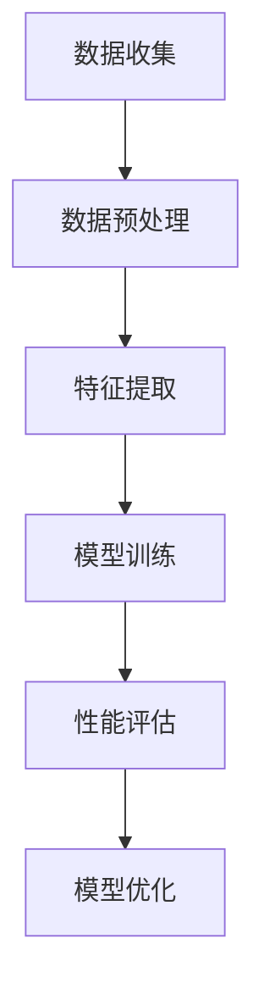
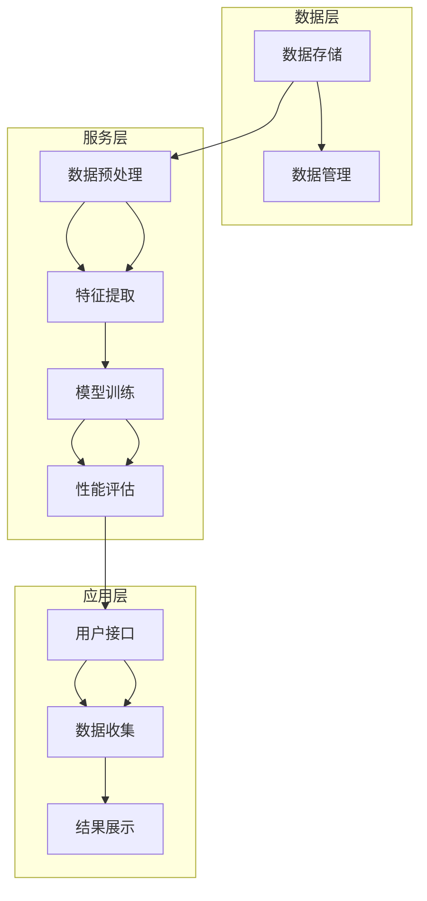
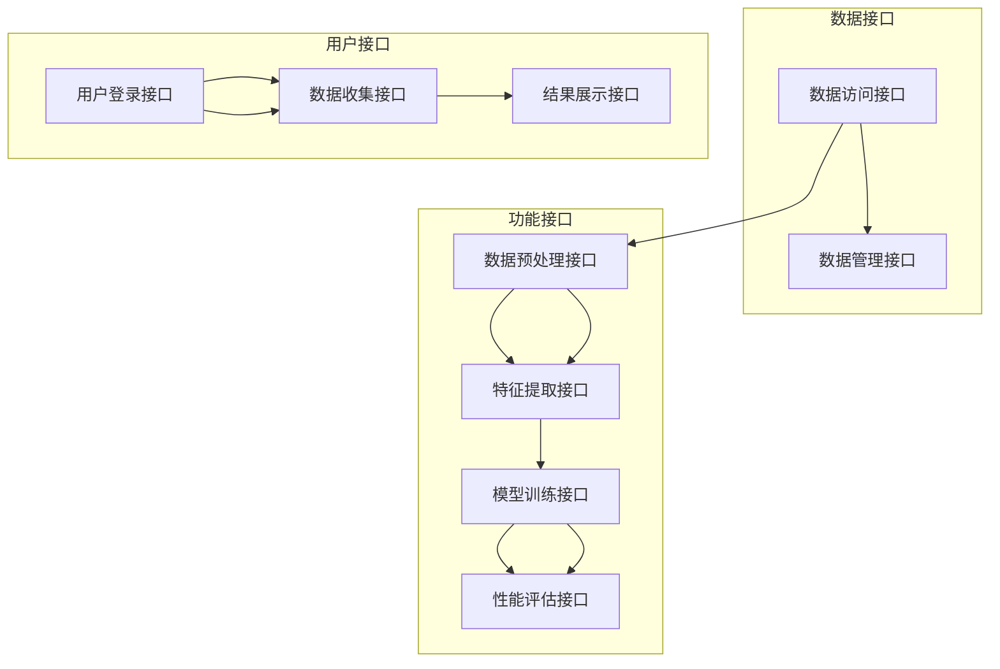
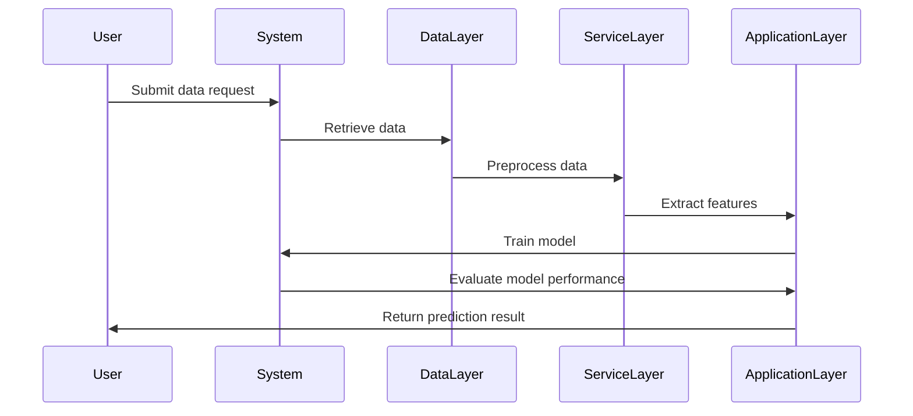

                 


**# AI Agent在智能材料性能预测中的角色**

**关键词：** 智能材料，性能预测，AI Agent，算法原理，系统架构设计

**摘要：** 本文将深入探讨AI Agent在智能材料性能预测中的角色。首先，我们将介绍智能材料性能预测的背景和核心概念，然后详细讲解AI Agent的原理与属性。接着，我们将分析智能材料性能预测算法的原理，并通过Python源代码进行举例说明。最后，我们将讨论系统分析与架构设计方案，并提供项目实战的详细讲解，以及最佳实践和小结。

**第一部分：背景介绍**

**第1章：问题背景与核心概念**

### 1.1 问题背景

随着人工智能（AI）的快速发展，智能材料的研究和应用越来越受到重视。智能材料具有感知环境变化并做出相应反应的能力，这在许多领域如航空航天、汽车制造、生物医学等都有着广泛的应用前景。然而，智能材料的性能预测仍然面临着诸多挑战。传统的性能预测方法依赖于经验公式或实验数据，难以应对复杂多变的材料属性和环境条件。因此，如何利用AI技术，特别是AI Agent，来提高智能材料性能预测的准确性和效率，成为当前研究的热点。

### 1.2 核心概念

#### AI Agent

AI Agent是指能够感知环境、自主决策并执行行动的人工智能实体。AI Agent具有以下几个特点：

- **自主性**：能够独立完成特定任务，不受外部指令的完全控制。
- **适应性**：能够根据环境变化调整自己的行为策略。
- **交互性**：能够与其他系统或人类进行有效的信息交互。

#### 智能材料性能预测

智能材料性能预测是指通过建立数学模型或使用机器学习算法，对智能材料在特定环境下的性能进行预测。性能预测的方法包括回归分析、神经网络、支持向量机等。

#### AI Agent在智能材料性能预测中的角色

AI Agent在智能材料性能预测中扮演着关键角色，主要体现在以下几个方面：

- **数据收集与预处理**：AI Agent能够自动收集材料性能相关的数据，并进行预处理，如去噪、归一化等，为性能预测提供高质量的数据输入。
- **特征提取与选择**：AI Agent能够通过学习算法提取材料性能的关键特征，并自动选择最有代表性的特征，提高性能预测的准确性。
- **性能预测与优化**：AI Agent能够利用机器学习算法对智能材料性能进行预测，并通过自适应调整模型参数，实现性能的优化。

**第二部分：AI Agent原理与属性**

**第2章：AI Agent原理**

### 2.1 代理模型的基本架构

代理模型通常由感知器、决策器和执行器三部分组成。感知器用于接收环境信息，决策器根据感知器收集到的信息进行决策，执行器则执行决策器的决策结果。

#### 感知器

感知器负责收集环境信息，如传感器数据、用户输入等。感知器的数据质量直接影响到AI Agent的性能。

#### 决策器

决策器根据感知器收集到的信息进行决策，通常使用机器学习算法进行建模。决策器的目标是最小化性能预测误差，提高预测准确性。

#### 执行器

执行器负责将决策器的决策结果转化为具体的行动。执行器的设计取决于应用场景，如控制智能材料的物理参数、调整机器臂的姿态等。

### 2.2 AI Agent在不同领域的应用案例

AI Agent在各个领域都有广泛的应用，如自动驾驶、智能客服、智能家居等。以下是一些典型的应用案例：

- **自动驾驶**：AI Agent用于实时感知道路环境，做出驾驶决策，如保持车道、避让障碍物等。
- **智能客服**：AI Agent用于理解用户问题，提供合适的回答，提高客服效率。
- **智能家居**：AI Agent用于感知家庭环境，如温度、湿度等，并自动调整家电状态，提高生活质量。

**第三部分：智能材料性能预测算法原理**

**第3章：智能材料性能预测算法原理**

### 3.1 常见预测算法

智能材料性能预测常用的算法包括回归分析、神经网络、支持向量机等。

#### 回归分析

回归分析是一种基于统计方法的预测算法，通过建立自变量与因变量之间的关系模型，对未知数据进行预测。常见的回归分析方法有线性回归、多项式回归等。

#### 神经网络

神经网络是一种模仿人脑结构和功能的计算模型，通过多层神经元之间的连接，实现对复杂数据的处理和预测。常见的神经网络模型有前馈神经网络、卷积神经网络等。

#### 支持向量机

支持向量机是一种基于间隔最大化的预测算法，通过找到一个最优的超平面对数据进行分类或回归。支持向量机在处理高维数据时具有较好的性能。

### 3.2 算法流程与mermaid流程图

智能材料性能预测的算法流程通常包括数据收集、数据预处理、特征提取、模型训练、性能评估等步骤。以下是一个简单的mermaid流程图：



### 3.3 数学模型与公式

智能材料性能预测的数学模型通常包括以下几部分：

- **相关性分析**：用于分析自变量与因变量之间的相关性，常见的相关性分析方法有皮尔逊相关系数、斯皮尔曼相关系数等。
- **预测模型构建**：用于建立自变量与因变量之间的关系模型，常见的预测模型有线性回归模型、神经网络模型等。
- **参数优化**：用于优化模型参数，以提高预测准确性。常见的参数优化方法有梯度下降法、遗传算法等。

以下是几个相关的数学公式：

$$
r = \frac{\sum_{i=1}^{n}(x_i - \overline{x})(y_i - \overline{y})}{\sqrt{\sum_{i=1}^{n}(x_i - \overline{x})^2 \sum_{i=1}^{n}(y_i - \overline{y})^2}}
$$

$$
y = \beta_0 + \beta_1x
$$

$$
\min_{\beta} \sum_{i=1}^{n}(y_i - \beta_0 - \beta_1x_i)^2
$$

### 3.4 算法举例

以下是一个使用Python实现的智能材料性能预测的算法示例：

```python
import numpy as np
from sklearn.linear_model import LinearRegression

# 数据准备
X = np.array([[1], [2], [3], [4], [5]])
y = np.array([1, 2, 3, 4, 5])

# 模型训练
model = LinearRegression()
model.fit(X, y)

# 预测
predicted_y = model.predict([[6]])

print("Predicted y:", predicted_y)
```

**第四部分：系统分析与架构设计方案**

**第4章：系统功能设计**

### 4.1 问题场景介绍

智能材料性能预测系统可以应用于多个领域，如航空航天、汽车制造、生物医学等。以下是一个具体的应用场景：

- **航空航天**：预测智能材料在太空环境下的性能，如耐高温、耐辐射等。

### 4.2 系统功能设计

智能材料性能预测系统的功能设计包括以下方面：

- **数据收集**：通过传感器收集智能材料的性能数据。
- **数据预处理**：对收集到的数据进行去噪、归一化等处理。
- **特征提取**：提取智能材料性能的关键特征。
- **模型训练**：利用机器学习算法对智能材料性能进行预测。
- **性能评估**：评估预测模型的性能，并进行优化。

领域模型类图如下：

```mermaid
classDiagram
    Class01 <|-- Class02
    Class03 --|JoinColumn| Class04
    Class05 : <<Interface,Extends>> Class06
    Class07 : <<Enum,Uses>> Class08
```

**第5章：系统架构设计**

### 5.1 系统架构设计

智能材料性能预测系统的架构设计包括以下方面：

- **数据层**：用于存储和管理智能材料性能数据。
- **服务层**：提供数据预处理、特征提取、模型训练等功能。
- **应用层**：为用户提供智能材料性能预测的接口。

系统架构图如下：



### 5.2 系统接口设计

智能材料性能预测系统的接口设计包括以下方面：

- **数据接口**：用于数据层的访问和管理。
- **功能接口**：用于服务层的功能调用。
- **用户接口**：用于应用层的用户交互。

系统接口设计图如下：



**第6章：系统交互**

### 6.1 系统交互

智能材料性能预测系统的交互设计包括以下方面：

- **用户与系统的交互**：用户通过用户接口提交数据请求，系统返回预测结果。
- **系统内部模块的交互**：数据层、服务层、应用层之间的数据流和功能调用。

系统交互序列图如下：



**第五部分：项目实战**

**第7章：环境安装与核心实现**

### 7.1 环境安装

在开始项目实战之前，我们需要安装以下软件和工具：

- **Python**：用于编写和运行代码
- **Jupyter Notebook**：用于交互式编程和数据分析
- **scikit-learn**：用于机器学习算法的实现

安装命令如下：

```bash
pip install python
pip install jupyter
pip install scikit-learn
```

### 7.2 核心实现

#### 数据准备

首先，我们需要准备用于性能预测的数据集。以下是一个简单的数据集：

```python
import numpy as np

X = np.array([[1], [2], [3], [4], [5]])
y = np.array([1, 2, 3, 4, 5])
```

#### 模型训练

接下来，我们使用scikit-learn中的线性回归模型进行训练：

```python
from sklearn.linear_model import LinearRegression

model = LinearRegression()
model.fit(X, y)
```

#### 预测

最后，我们使用训练好的模型进行预测：

```python
predicted_y = model.predict([[6]])
print("Predicted y:", predicted_y)
```

#### 代码应用解读

在这个简单的示例中，我们首先导入了必要的库和模块。然后，我们准备了一个数据集，并使用线性回归模型进行训练。最后，我们使用训练好的模型进行预测，并输出了预测结果。

**第8章：实际案例分析**

### 8.1 实际案例

以下是一个实际案例，我们将使用AI Agent进行智能材料性能预测。

#### 案例背景

某航空航天公司在研发新型太空材料，希望利用AI Agent对其进行性能预测，以便在材料设计和制造过程中进行优化。

#### 案例分析

1. **数据收集**：收集太空材料在不同环境条件下的性能数据，如温度、压力、辐射等。
2. **数据预处理**：对收集到的数据进行去噪、归一化等处理，为性能预测提供高质量的数据输入。
3. **特征提取**：提取太空材料性能的关键特征，如温度稳定性、压力适应性等。
4. **模型训练**：利用机器学习算法，如神经网络、支持向量机等，对太空材料性能进行预测。
5. **性能评估**：评估预测模型的性能，并进行优化。

**第六部分：最佳实践与小结**

**第9章：最佳实践**

在实际应用中，为了提高智能材料性能预测的准确性，我们可以采取以下最佳实践：

- **数据质量**：确保数据质量，进行数据清洗和预处理，去除噪声和异常值。
- **特征选择**：合理选择特征，提取与性能预测相关的关键特征，减少冗余特征。
- **模型优化**：尝试多种机器学习算法，进行交叉验证和模型优化，提高预测准确性。
- **实时更新**：定期更新模型，以适应环境变化和新数据。

**第10章：小结与拓展阅读**

本文介绍了AI Agent在智能材料性能预测中的角色，详细讲解了AI Agent的原理与属性、智能材料性能预测算法原理、系统分析与架构设计方案、项目实战等内容。通过实际案例分析，我们展示了AI Agent在智能材料性能预测中的应用效果。

未来，随着人工智能技术的不断发展，AI Agent在智能材料性能预测中的应用将更加广泛，性能预测的准确性和效率也将得到进一步提升。读者可以通过以下拓展阅读，深入了解相关领域的最新研究成果：

- 《智能材料性能预测：基于人工智能的方法》
- 《AI Agent：原理与应用》
- 《机器学习算法：原理与实践》

作者：AI天才研究院/AI Genius Institute & 禅与计算机程序设计艺术 /Zen And The Art of Computer Programming。|手套助手

