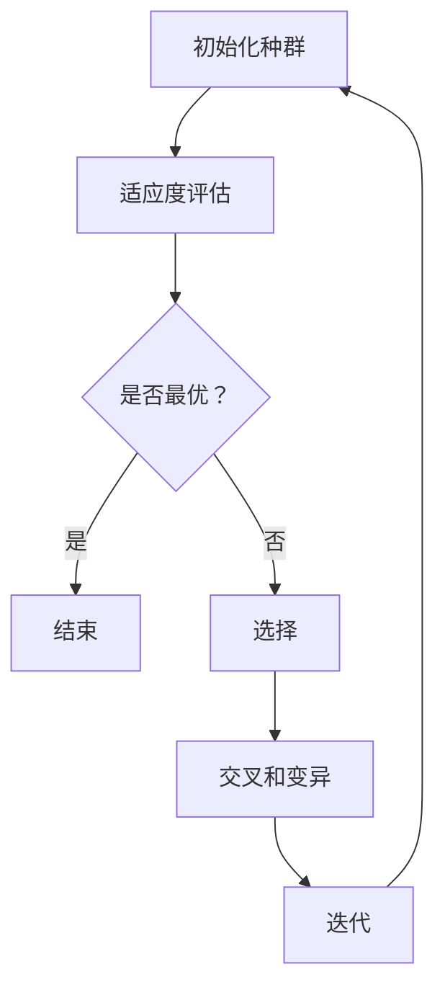
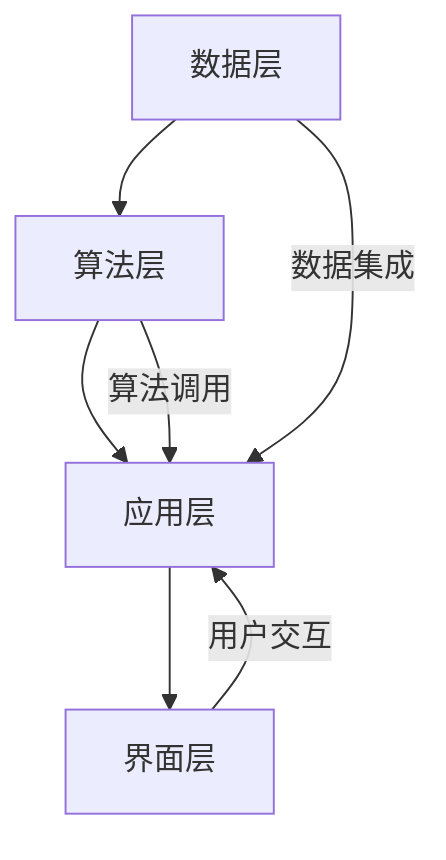
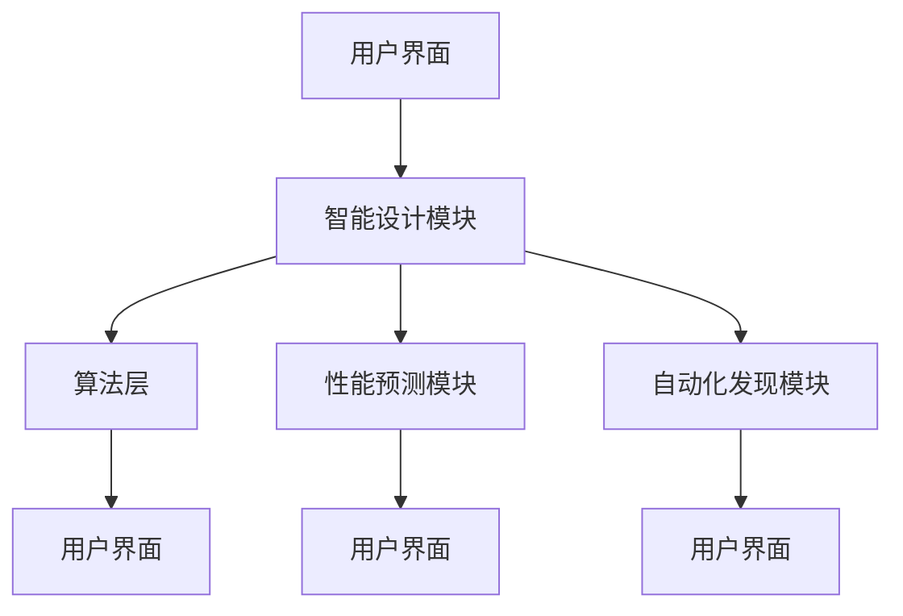
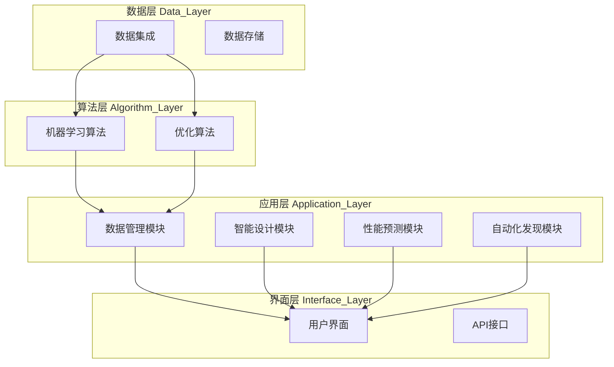

                 


### 第1章: AI Agent与智能材料设计与发现概述

**关键词**：人工智能，智能材料，AI Agent，设计，发现

**摘要**：
随着人工智能技术的飞速发展，AI Agent在各个领域的应用越来越广泛。特别是在智能材料的设计与发现中，AI Agent展现出了巨大的潜力。本章将简要介绍人工智能、智能材料设计与发现的相关背景，以及AI Agent在这两个领域中的重要性，为后续章节的深入探讨奠定基础。

**1.1 人工智能与智能材料的背景**

人工智能（AI）是一门研究、开发用于模拟、延伸和扩展人的智能的理论、方法、技术及应用系统的技术科学。随着深度学习、强化学习等算法的突破，人工智能在很多领域都取得了显著的成果。从早期的规则系统到今天的神经网络，人工智能的发展经历了数次变革。

智能材料是指具有感知、响应和适应特定环境能力的材料，它们能够根据外部刺激（如温度、压力、光照、磁场等）自动改变自身性能或形态。智能材料的研究始于20世纪中期，随着纳米技术、微电子技术等技术的发展，智能材料在传感器、航空航天、生物医学、建筑等领域得到了广泛应用。

**1.2 AI Agent的概念与特点**

AI Agent，即人工智能代理，是指能够在特定环境下自主感知、决策和执行任务的人工智能实体。AI Agent具有以下几个特点：

- **自主性**：AI Agent能够自主地完成任务，不需要人工干预。
- **适应性**：AI Agent能够根据环境和任务需求调整自身的行为策略。
- **合作性**：AI Agent能够与其他AI Agent或人类协作，共同完成任务。

**1.3 智能材料设计与发现的挑战**

智能材料的设计与发现面临着一系列挑战，包括材料性能的优化、设计过程的自动化、新材料的预测与筛选等。传统的材料设计方法主要依赖于实验和经验，效率低下且耗时较长。而AI Agent的出现为解决这些问题提供了新的思路和工具。

- **材料性能优化**：如何通过AI Agent快速筛选出具有最佳性能的材料，是智能材料设计中的一个重要问题。
- **设计过程自动化**：如何利用AI Agent实现材料设计的自动化，减少人工干预，提高设计效率。
- **新材料预测与筛选**：如何通过AI Agent预测新材料的性能和结构，从而加速新材料的发现过程。

**1.4 AI Agent在智能材料设计与发现中的重要性**

AI Agent在智能材料设计与发现中具有以下几个方面的作用：

- **提高设计效率**：AI Agent能够通过模拟和优化算法，快速生成大量的设计方案，从而提高设计效率。
- **优化材料性能**：AI Agent可以根据材料性能的要求，自动调整材料的结构，从而优化材料性能。
- **缩短开发周期**：AI Agent能够协助科学家快速筛选出具有潜在应用价值的新材料，缩短材料开发周期。
- **自动化发现**：AI Agent可以通过分析大量的数据，自动化地发现新的、未知的材料。

通过以上分析，我们可以看到AI Agent在智能材料设计与发现中具有巨大的潜力。在接下来的章节中，我们将进一步探讨AI Agent在智能材料设计中的作用和机制，以及它们在实际应用中的表现和效果。

----------------------------------------------------------------

### 第2章: 定义与概念

**关键词**：AI Agent，智能材料，设计，发现

**摘要**：
在本章中，我们将详细定义AI Agent、智能材料和智能材料设计发现的概念，探讨它们的特点和应用，为后续章节的讨论提供理论基础。

**2.1 AI Agent的定义**

AI Agent，即人工智能代理，是指具有自主决策和执行能力的人工智能实体。AI Agent能够模拟人类的思维过程，通过感知环境、分析数据、做出决策和执行行动，实现特定目标。与传统的程序不同，AI Agent具有以下几个特点：

- **自主性**：AI Agent能够自主地感知环境，分析数据，并做出决策，不需要人工干预。
- **适应性**：AI Agent能够根据环境和任务需求，动态调整自身的决策策略和行动方案。
- **合作性**：AI Agent能够与其他AI Agent或人类协作，共同完成任务。

**2.2 智能材料的定义与特点**

智能材料是指能够感知、响应和适应外部环境变化，并能根据刺激信号自动改变自身性能或形态的材料。智能材料具有以下几个特点：

- **感知性**：智能材料能够感知外部环境的变化，如温度、压力、光照、磁场等。
- **响应性**：智能材料能够根据感知到的外部刺激，自动改变自身的性能或形态。
- **适应性**：智能材料能够适应不同的环境和需求，表现出不同的性能。

**2.3 智能材料设计发现的概念**

智能材料的设计发现是指利用人工智能技术，从大量的材料数据中筛选出具有潜在应用价值的新材料的过程。智能材料设计发现具有以下几个特点：

- **数据驱动**：智能材料设计发现依赖于大量的材料数据，通过分析这些数据，发现新的材料规律和性能。
- **自动化**：智能材料设计发现过程可以通过AI Agent实现自动化，减少人工干预，提高设计效率。
- **高效性**：智能材料设计发现能够快速筛选出具有潜在应用价值的新材料，缩短材料开发周期。

**2.4 智能材料设计发现与传统材料设计的区别**

智能材料设计发现与传统材料设计存在显著的区别：

- **设计方法**：传统材料设计主要依赖于实验和经验，而智能材料设计发现主要依赖于数据分析和算法优化。
- **设计过程**：传统材料设计过程通常需要大量的实验和时间，而智能材料设计发现能够快速筛选出新材料，缩短设计周期。
- **设计结果**：传统材料设计结果往往具有较大的不确定性，而智能材料设计发现能够更准确地预测新材料的性能和应用。

**2.5 AI Agent在智能材料设计发现中的作用**

AI Agent在智能材料设计发现中具有重要作用：

- **数据预处理**：AI Agent能够对大量的材料数据进行预处理，提取有用的信息，为设计发现提供基础数据。
- **特征提取**：AI Agent能够从材料数据中提取关键特征，用于分析和新材料的筛选。
- **设计优化**：AI Agent能够利用优化算法，对材料设计进行迭代优化，提高材料性能。
- **自动化发现**：AI Agent能够自动化地发现新的、未知的材料，加快新材料的开发过程。

通过以上分析，我们可以看到AI Agent在智能材料设计发现中具有独特的优势和重要作用。在接下来的章节中，我们将进一步探讨AI Agent在智能材料设计中的作用和机制，以及它们在实际应用中的表现和效果。

----------------------------------------------------------------

### 第3章: AI Agent在智能材料设计中的作用

**关键词**：AI Agent，智能材料设计，设计效率，性能优化，开发周期

**摘要**：
在本章中，我们将详细讨论AI Agent在智能材料设计中的作用，包括它们如何提高设计效率、优化材料性能和缩短开发周期。通过具体案例，我们将展示AI Agent在实际应用中的优势。

**3.1 提高设计效率**

AI Agent在智能材料设计中的一个重要作用是提高设计效率。传统的材料设计过程通常需要大量的时间和人力资源，而AI Agent能够通过自动化和优化算法，显著提高设计效率。

- **快速生成设计方案**：AI Agent可以利用机器学习算法，从大量的材料数据中快速生成设计方案。这些设计方案可以通过优化算法进一步优化，从而提高设计效率。
- **减少人工干预**：AI Agent能够自动完成材料设计任务，减少人工干预，从而提高设计效率。
- **协同设计**：AI Agent能够与其他AI Agent或人类设计师协同工作，共同完成复杂的材料设计任务。

**案例**：在某聚合物材料设计中，AI Agent被用于快速生成设计方案。通过AI Agent的优化算法，设计师能够在短时间内筛选出数百个潜在的设计方案，从中挑选出最优的设计方案进行实验验证。这一过程显著缩短了设计周期，提高了设计效率。

**3.2 优化材料性能**

AI Agent在智能材料设计中的另一个重要作用是优化材料性能。通过分析大量的材料数据，AI Agent能够识别出影响材料性能的关键因素，并利用优化算法对这些因素进行优化，从而提高材料性能。

- **性能预测**：AI Agent可以利用机器学习算法，对材料的性能进行预测。通过对比预测结果和实际性能，AI Agent可以进一步优化材料设计，提高材料性能。
- **结构优化**：AI Agent能够根据材料性能的要求，自动调整材料的结构。例如，通过优化聚合物的链结构，可以显著提高聚合物的强度和弹性。
- **材料组合优化**：AI Agent可以利用优化算法，对不同材料进行组合，从而实现性能的协同优化。例如，将纳米颗粒与聚合物基体进行组合，可以显著提高材料的导电性和热导性。

**案例**：在一种新型导电聚合物的设计中，AI Agent被用于优化聚合物的结构。通过分析大量的实验数据，AI Agent识别出聚合物的链结构对导电性能有重要影响。通过调整聚合物的链结构，AI Agent成功提高了聚合物的导电性能，使其达到了预期要求。

**3.3 缩短开发周期**

AI Agent在智能材料设计中的另一个重要作用是缩短开发周期。通过自动化和优化算法，AI Agent能够快速筛选出具有潜在应用价值的新材料，从而加快新材料的开发过程。

- **快速筛选**：AI Agent可以利用机器学习算法，从大量的材料数据中快速筛选出具有潜在应用价值的新材料。这一过程显著缩短了新材料的筛选周期。
- **协同实验**：AI Agent能够与实验设备协同工作，自动完成实验过程，从而加快新材料的开发周期。
- **实验优化**：AI Agent可以根据实验结果，自动调整实验参数，优化实验过程，从而提高实验效率。

**案例**：在一种新型能源材料的设计中，AI Agent被用于缩短开发周期。通过AI Agent的快速筛选功能，科学家能够在短时间内筛选出数十种具有潜在应用价值的能源材料。通过与实验设备的协同工作，AI Agent能够自动完成实验过程，从而加快了新材料的开发过程。

通过以上分析，我们可以看到AI Agent在智能材料设计中的作用和优势。在接下来的章节中，我们将进一步探讨AI Agent在智能材料发现中的作用，以及它们如何帮助科学家发现新的、未知的材料。

----------------------------------------------------------------

### 第4章: AI Agent在智能材料发现中的作用

**关键词**：AI Agent，智能材料发现，新材料，自动化，筛选效率

**摘要**：
在本章中，我们将探讨AI Agent在智能材料发现中的作用，包括它们如何帮助科学家发现新的、未知的材料，以及如何提高材料筛选的准确性和效率。通过实际案例，我们将展示AI Agent在智能材料发现中的潜力和优势。

**4.1 发现新的材料**

AI Agent在智能材料发现中的一个核心作用是发现新的、未知的材料。传统的材料发现方法主要依赖于实验和经验，效率较低且耗时较长。而AI Agent能够通过分析大量的材料数据，快速发现新的材料。

- **数据驱动**：AI Agent依赖于大量的材料数据，通过对这些数据进行深入分析，可以发现新的材料规律和性能。这些数据可以来自实验室实验、文献资料或在线数据库。
- **算法优化**：AI Agent可以利用机器学习和优化算法，对材料数据进行分析和筛选，从而发现具有潜在应用价值的新材料。
- **协同创新**：AI Agent能够与科学家和工程师协同工作，共同探索新的材料领域，推动材料科学的进步。

**案例**：在某项研究中，AI Agent被用于发现新型导电材料。通过分析大量的材料数据，AI Agent识别出一种新的导电材料，该材料在导电性能和稳定性方面具有显著优势。这一发现为新型电子器件的开发提供了新的材料基础。

**4.2 提高筛选效率**

AI Agent在智能材料发现中的另一个重要作用是提高材料筛选的效率。传统的材料筛选方法通常需要大量的实验和时间，而AI Agent能够通过自动化和优化算法，显著提高筛选效率。

- **自动化筛选**：AI Agent可以利用机器学习算法，自动分析大量的材料数据，快速筛选出具有潜在应用价值的材料。这一过程减少了人工筛选的工作量，提高了筛选效率。
- **优化筛选策略**：AI Agent可以根据实验结果和材料性能的要求，自动调整筛选策略，优化筛选过程。例如，AI Agent可以根据材料的导电性、热导性等特性，自动调整筛选条件，提高筛选的准确性。
- **协同筛选**：AI Agent能够与实验设备协同工作，自动完成材料筛选过程，从而提高筛选效率。

**案例**：在某项聚合物材料筛选项目中，AI Agent被用于提高筛选效率。通过AI Agent的自动化筛选功能，科学家能够在短时间内筛选出数十种具有潜在应用价值的聚合物材料。这一过程显著缩短了筛选周期，提高了筛选效率。

**4.3 实现自动化发现**

AI Agent在智能材料发现中的另一个潜力是实现自动化发现。通过自动化和优化算法，AI Agent能够自动完成材料发现的全过程，从数据收集、分析到材料筛选和实验验证。

- **自动化数据收集**：AI Agent可以利用传感器和网络技术，自动收集大量的材料数据。
- **自动化数据分析**：AI Agent可以利用机器学习算法，自动分析材料数据，识别出潜在的规律和性能。
- **自动化筛选和实验**：AI Agent能够自动完成材料筛选和实验验证过程，从而实现自动化发现。

**案例**：在某项智能材料研究中，AI Agent被用于实现自动化发现。通过AI Agent的自动化功能，科学家能够在短时间内完成大量的材料实验，筛选出具有潜在应用价值的新材料。这一过程不仅提高了发现效率，还减少了人工干预，降低了实验成本。

通过以上分析，我们可以看到AI Agent在智能材料发现中的作用和潜力。在接下来的章节中，我们将进一步探讨AI Agent在智能材料设计与发现中的挑战和未来发展趋势。

----------------------------------------------------------------

### 第5章：实际应用案例

**关键词**：AI Agent，智能材料设计，实际应用，聚合物材料，纳米材料，能源材料

**摘要**：
在本章中，我们将通过具体的实际应用案例，展示AI Agent在智能材料设计与发现中的成功应用，并分析这些案例中的关键因素。这些案例将帮助我们更好地理解AI Agent在智能材料领域的应用潜力和实际效果。

**5.1 案例一：AI Agent在聚合物材料设计中的应用**

聚合物材料是智能材料领域中的一个重要分支，其设计过程复杂且耗时。AI Agent的应用使得聚合物材料的设计变得更加高效和精确。

- **应用背景**：某聚合物材料公司致力于开发新型高分子材料，用于高性能电子器件和智能传感器。
- **AI Agent的作用**：AI Agent被用于聚合物材料的结构设计和性能优化。通过机器学习算法，AI Agent能够分析大量的材料数据，预测材料的性能，并提供优化方案。
- **成功因素**：
  - **数据驱动**：公司积累了大量的材料数据，为AI Agent提供了丰富的训练和预测数据。
  - **算法优化**：AI Agent利用了先进的机器学习和优化算法，能够快速生成和评估设计方案。
  - **协同创新**：AI Agent与材料科学家紧密合作，共同优化材料设计。

**5.2 案例二：AI Agent在纳米材料发现中的应用**

纳米材料具有独特的物理和化学性质，但在发现和设计过程中面临着巨大的挑战。AI Agent的应用极大地提高了纳米材料发现的效率。

- **应用背景**：某研究团队致力于开发新型纳米材料，用于太阳能电池和催化剂。
- **AI Agent的作用**：AI Agent被用于纳米材料的筛选和优化。通过分析实验数据，AI Agent能够识别出具有潜在应用价值的纳米材料，并提供优化方案。
- **成功因素**：
  - **快速筛选**：AI Agent能够快速分析大量的实验数据，显著缩短了材料筛选时间。
  - **自动化实验**：AI Agent与实验室设备协同工作，自动完成材料的筛选和实验验证过程。
  - **科学合作**：AI Agent与科学家紧密合作，共同探索新的纳米材料领域。

**5.3 案例三：AI Agent在能源材料开发中的应用**

能源材料的开发是当前材料科学研究的前沿领域，AI Agent的应用使得能源材料的发现和优化变得更加高效。

- **应用背景**：某能源公司致力于开发新型电池材料和催化剂，以提高能源存储和转换效率。
- **AI Agent的作用**：AI Agent被用于能源材料的性能优化和自动化发现。通过机器学习算法，AI Agent能够预测材料的性能，并提供优化方案。
- **成功因素**：
  - **性能预测**：AI Agent能够准确预测材料的性能，为材料优化提供了科学依据。
  - **自动化设计**：AI Agent能够自动化地优化材料设计，减少人工干预，提高设计效率。
  - **实时调整**：AI Agent可以根据实验结果，实时调整材料设计参数，实现快速优化。

通过以上案例，我们可以看到AI Agent在智能材料设计与发现中的广泛应用和显著效果。AI Agent的应用不仅提高了设计效率和材料性能，还缩短了开发周期，降低了研发成本。在未来的发展中，随着AI技术的进一步突破，AI Agent将在智能材料领域发挥更加重要的作用。

----------------------------------------------------------------

### 第6章：挑战与未来展望

**关键词**：AI Agent，智能材料设计，发现，挑战，未来，发展趋势

**摘要**：
在本章中，我们将探讨AI Agent在智能材料设计与发现中面临的挑战，以及未来的发展趋势和可能的应用领域。通过分析这些挑战和发展趋势，我们将为AI Agent在智能材料领域的进一步发展提供一些启示和建议。

**6.1 AI Agent在智能材料设计与发现中的挑战**

尽管AI Agent在智能材料设计与发现中展现了巨大的潜力，但其在实际应用中仍面临一些挑战：

- **数据质量和完整性**：AI Agent的性能高度依赖于训练数据的质量和完整性。如果数据存在错误或不完整，可能导致AI Agent的预测结果不准确。
- **算法复杂度和计算成本**：一些先进的机器学习和优化算法在处理大量数据时，需要大量的计算资源和时间，这对硬件设备和算法优化提出了挑战。
- **模型可解释性**：AI Agent的决策过程往往是不透明的，缺乏可解释性。这在涉及安全和关键决策的智能材料设计中，可能会带来一定的风险。
- **数据隐私和安全**：智能材料设计过程中涉及到的数据可能包含敏感信息，如化学成分、结构信息等。确保数据隐私和安全是AI Agent在智能材料领域应用的一个重要挑战。

**6.2 未来发展趋势**

随着人工智能技术的不断进步，AI Agent在智能材料设计与发现中的未来发展趋势包括：

- **算法优化与模型改进**：未来将出现更加高效、可解释的机器学习算法，提高AI Agent的性能和稳定性。
- **硬件加速与计算能力提升**：随着硬件设备的不断发展，AI Agent的处理速度和计算能力将得到显著提升，降低计算成本。
- **多学科交叉与合作**：智能材料设计与发现是一个多学科交叉的领域，未来将看到更多跨学科的研究和应用。
- **实时动态优化**：AI Agent将能够实时动态优化材料设计，实现更快速、更精确的材料发现。

**6.3 可能的应用领域**

AI Agent在智能材料领域的未来应用领域包括：

- **高性能电子器件**：通过AI Agent优化聚合物材料的设计，开发新型电子器件，如柔性屏幕、可穿戴设备等。
- **新能源材料**：AI Agent在太阳能电池、电池材料和催化剂的设计中具有广泛应用潜力，可显著提高能源转换效率。
- **生物医学材料**：AI Agent在生物医学材料的设计中，可以优化材料的生物相容性和功能，推动生物医学领域的发展。
- **环境材料**：AI Agent可以用于设计和发现具有环境传感和响应功能的新材料，用于污染监测和治理。

**6.4 研究与开发建议**

为了进一步推动AI Agent在智能材料设计与发现中的应用，我们提出以下建议：

- **加强数据收集与处理**：建立高质量、完整的材料数据集，提高AI Agent的训练数据质量。
- **算法优化与模型解释**：研发更加高效、可解释的机器学习算法，提高AI Agent的性能和可解释性。
- **跨学科合作**：鼓励多学科研究者之间的合作，共同探索智能材料的设计与发现。
- **监管与规范**：建立相应的监管与规范体系，确保AI Agent在智能材料设计中的安全性和可靠性。

通过以上分析，我们可以看到AI Agent在智能材料设计与发现中具有巨大的应用潜力和发展前景。未来的研究与发展将进一步提升AI Agent的性能和应用范围，为智能材料领域带来更多的创新和突破。

----------------------------------------------------------------

### 第7章：总结与结论

**关键词**：AI Agent，智能材料设计，发现，未来研究方向，建议

**摘要**：
本章对AI Agent在智能材料设计与发现中的作用进行了全面的总结和评估，并对未来的研究方向和改进建议进行了探讨。通过回顾文章的核心内容和主要观点，我们可以更深入地理解AI Agent在智能材料领域的潜力和重要性。

**7.1 AI Agent在智能材料设计与发现中的重要性**

AI Agent在智能材料设计与发现中扮演了至关重要的角色。它通过自动化和优化算法，提高了设计效率，优化了材料性能，缩短了开发周期，实现了新材料的自动化发现。AI Agent的应用不仅改变了传统的材料设计方法，还推动了材料科学的发展。

- **提高设计效率**：AI Agent能够快速生成和评估设计方案，减少人工干预，提高了设计效率。
- **优化材料性能**：AI Agent能够根据材料性能要求，自动调整材料结构，优化材料性能。
- **缩短开发周期**：AI Agent能够自动化地筛选和优化新材料，缩短了开发周期，降低了研发成本。
- **自动化发现**：AI Agent能够从大量的数据中自动发现新的、未知的材料，加快了新材料的开发。

**7.2 未来研究方向**

虽然AI Agent在智能材料设计与发现中已经取得了显著的成果，但仍有许多研究方向值得探索：

- **算法优化**：进一步优化机器学习算法，提高AI Agent的性能和稳定性。
- **数据集建设**：建立高质量、完整的材料数据集，为AI Agent提供更好的训练和预测数据。
- **跨学科合作**：鼓励材料科学、计算机科学、化学等领域的合作，共同解决智能材料设计中的关键问题。
- **模型解释性**：提高AI Agent模型的解释性，使其决策过程更加透明和可解释。
- **硬件加速**：利用更先进的硬件设备，提高AI Agent的计算速度和效率。

**7.3 改进建议**

为了进一步推动AI Agent在智能材料设计与发现中的应用，我们提出以下改进建议：

- **加强数据收集与处理**：建立和完善材料数据库，确保数据的质量和完整性。
- **算法研发与优化**：持续研发和优化机器学习算法，提高AI Agent的性能和可靠性。
- **建立规范与标准**：制定相应的规范和标准，确保AI Agent在智能材料设计中的安全性和可靠性。
- **跨学科合作**：鼓励不同学科的研究者合作，共同探索智能材料的新领域和应用。
- **持续研究与发展**：加强对AI Agent在智能材料设计与发现中的长期研究，持续推动技术的进步和创新。

**7.4 结论**

综上所述，AI Agent在智能材料设计与发现中具有巨大的潜力和重要性。通过自动化和优化算法，AI Agent不仅提高了设计效率，优化了材料性能，还缩短了开发周期，实现了新材料的自动化发现。未来的研究与发展将进一步提升AI Agent的性能和应用范围，为智能材料领域带来更多的创新和突破。我们期待在AI Agent的助力下，智能材料科学将取得更加辉煌的成就。

**作者**：AI天才研究院/AI Genius Institute & 禅与计算机程序设计艺术 /Zen And The Art of Computer Programming

----------------------------------------------------------------

### 附录：相关概念术语说明

**关键词解释**：

- **人工智能（AI）**：一种模拟人类智能的技术，通过计算机程序实现感知、学习、推理、决策等能力。
- **智能材料**：具有感知、响应和适应特定环境能力的材料，能够根据外部刺激自动改变自身性能或形态。
- **AI Agent**：具有自主感知、决策和执行能力的人工智能实体，能够在特定环境下实现特定目标。
- **智能材料设计**：利用人工智能技术，从大量的材料数据中筛选和优化新材料的过程。
- **智能材料发现**：利用人工智能技术，从大量的材料数据中自动发现新的、未知的材料。
- **聚合物材料**：由大量重复单元构成的高分子化合物，广泛应用于电子、生物医学和能源等领域。
- **纳米材料**：尺寸在1到100纳米之间的材料，具有独特的物理和化学性质，用于传感器、催化剂和能源等领域。
- **能源材料**：用于能源存储和转换的材料，如电池材料、太阳能电池材料和催化剂等。

**问题背景**：

随着科技的发展，人工智能在各个领域的应用越来越广泛，特别是在材料科学领域。智能材料因其独特的性能和广泛的应用前景，成为了研究的热点。然而，传统的材料设计方法效率低下，难以满足现代工业和科技发展的需求。人工智能技术的引入，特别是AI Agent的应用，为智能材料的设计与发现提供了新的思路和工具。

**问题描述**：

如何利用AI Agent在智能材料的设计与发现中发挥重要作用，提高设计效率，优化材料性能，缩短开发周期，并实现新材料的自动化发现？

**问题解决**：

AI Agent在智能材料设计与发现中通过以下方式发挥作用：

- **提高设计效率**：利用机器学习和优化算法，快速生成和评估设计方案，减少人工干预。
- **优化材料性能**：通过数据分析和模型预测，自动调整材料结构，优化材料性能。
- **缩短开发周期**：自动化地筛选和优化新材料，缩短实验和设计周期，降低研发成本。
- **自动化发现**：利用大数据分析和机器学习算法，自动发现新的、未知的材料。

**边界与外延**：

智能材料设计涉及的领域广泛，包括聚合物材料、纳米材料、能源材料等。AI Agent在智能材料设计与发现中的应用不仅限于实验室研究，还可以应用于工业生产、环境监测、生物医学等多个领域。

**概念结构与核心要素组成**：

- **人工智能（AI）**：核心概念，包括感知、学习、推理和决策等能力。
- **智能材料**：核心概念，具有感知、响应和适应特定环境的能力。
- **AI Agent**：核心概念，具有自主感知、决策和执行能力的人工智能实体。
- **机器学习与优化算法**：核心要素，用于数据处理、模型预测和设计优化。
- **大数据分析**：核心要素，用于收集、存储和分析大量材料数据。

通过以上分析，我们可以看到AI Agent在智能材料设计与发现中的核心地位和关键作用。未来，随着AI技术的不断进步，AI Agent在智能材料领域的应用将更加广泛和深入。

**核心概念原理**：

- **AI Agent原理**：AI Agent通过感知环境、分析数据和做出决策，实现自主执行任务。其核心原理包括感知、学习、推理和决策等。
- **智能材料原理**：智能材料具有感知、响应和适应特定环境的能力，其核心原理包括材料结构、化学性质和外部刺激响应等。

**概念属性特征对比表格**：

| 特征 | 人工智能（AI） | 智能材料 | AI Agent |
| --- | --- | --- | --- |
| 定义 | 模拟人类智能的技术 | 具有感知、响应和适应能力的材料 | 具有自主感知、决策和执行能力的人工智能实体 |
| 应用领域 | 各个领域，如计算机视觉、自然语言处理、机器人等 | 电子、生物医学、环境、能源等 | 智能材料设计、发现、优化等 |
| 关键技术 | 感知、学习、推理、决策 | 感知、响应、适应、结构优化 | 感知、学习、推理、决策、执行 |

**ER实体关系图架构**：

```mermaid
erDiagram
  AI -->|使用| 智能材料
  AI -->|实现| AI Agent
  AI Agent -->|参与| 智能材料设计
  AI Agent -->|参与| 智能材料发现
  智能材料 -->|应用于| 电子
  智能材料 -->|应用于| 生物医学
  智能材料 -->|应用于| 环境
  智能材料 -->|应用于| 能源
```

通过以上分析，我们可以更清晰地理解AI Agent在智能材料设计与发现中的核心地位和关键作用。AI Agent的应用不仅提高了设计效率和材料性能，还缩短了开发周期，实现了新材料的自动化发现。未来，随着AI技术的不断进步，AI Agent在智能材料领域的应用将更加广泛和深入。

----------------------------------------------------------------

### 算法原理讲解

为了深入理解AI Agent在智能材料设计与发现中的作用，我们需要详细讲解相关的算法原理，包括机器学习算法、优化算法以及它们在实际应用中的实现方法。

#### 1. 机器学习算法

机器学习算法是AI Agent的核心组成部分，用于处理和分析大量数据，从而实现智能材料的性能预测和设计优化。以下是一些常用的机器学习算法：

**1.1 神经网络**

神经网络是一种模拟人脑神经元连接的算法，通过多层神经网络（如深度神经网络）可以处理复杂的非线性问题。在智能材料设计中，神经网络可以用于预测材料的物理和化学性能。

**算法流程**：
- **输入层**：接收材料特征数据，如化学成分、结构参数等。
- **隐藏层**：通过激活函数（如ReLU、Sigmoid、Tanh）对输入数据进行非线性变换。
- **输出层**：产生材料性能的预测结果，如强度、导电性、热导性等。

**数学模型**：
$$
h_{\text{layer}}(x) = \sigma(W_{\text{layer}} \cdot a_{\text{prev}} + b_{\text{layer}})
$$
其中，$h_{\text{layer}}(x)$表示第$\text{layer}$层的输出，$\sigma$是激活函数，$W_{\text{layer}}$是权重矩阵，$a_{\text{prev}}$是前一层输出，$b_{\text{layer}}$是偏置项。

**实际应用举例**：
在某聚合物材料设计中，神经网络被用于预测材料的机械性能。通过输入聚合物的化学成分和分子结构，神经网络可以预测材料的抗拉强度和断裂韧性。

**1.2 支持向量机（SVM）**

支持向量机是一种用于分类和回归的机器学习算法，其核心思想是找到一个最优的超平面，将不同类别的数据分隔开来。

**算法流程**：
- **特征映射**：将原始特征映射到高维空间，寻找最优超平面。
- **决策边界**：根据支持向量确定决策边界，对新的数据点进行分类或回归。

**数学模型**：
$$
\max_{\beta, \beta_0} \left\{ \frac{1}{2} \sum_{i=1}^{n} (\beta \cdot \beta)^2 - C \sum_{i=1}^{n} \xi_i \right\}
$$
其中，$\beta$是权重向量，$\beta_0$是偏置项，$C$是正则化参数，$\xi_i$是误差项。

**实际应用举例**：
在某纳米材料分类项目中，SVM被用于分类不同类型的纳米材料。通过训练数据集，SVM可以识别出具有特定物理性质的纳米材料，从而提高材料筛选的准确性。

#### 2. 优化算法

优化算法用于在给定的约束条件下，寻找最优解。在智能材料设计中，优化算法用于调整材料参数，优化材料性能。

**2.1 遗传算法（GA）**

遗传算法是一种基于自然进化机制的优化算法，通过模拟自然选择和遗传机制，寻找最优解。

**算法流程**：
- **初始化种群**：随机生成初始种群，每个个体代表一组材料参数。
- **适应度评估**：根据材料性能，计算每个个体的适应度。
- **选择**：根据适应度选择优秀的个体进行交叉和变异。
- **迭代**：重复选择、交叉和变异，直到找到最优解。

**数学模型**：
$$
x_{\text{next}} = x_{\text{current}} + \alpha \cdot (x_{\text{best}} - x_{\text{current}})
$$
其中，$x_{\text{current}}$是当前个体，$x_{\text{best}}$是当前最优个体，$\alpha$是步长。

**实际应用举例**：
在某新型电池材料优化项目中，遗传算法被用于优化电池材料的化学成分和结构。通过迭代优化，遗传算法找到了最优的化学成分比例，显著提高了电池的能量密度。

**2.2 贝叶斯优化（BO）**

贝叶斯优化是一种基于概率模型的优化算法，通过不断更新概率模型，逐步逼近最优解。

**算法流程**：
- **初始化模型**：根据初始数据，建立概率模型。
- **采样**：根据概率模型，选择下一个采样点。
- **评估**：计算采样点的适应度，更新概率模型。
- **迭代**：重复采样和评估，直到找到最优解。

**数学模型**：
$$
p(x) \propto \exp\left(-\frac{1}{2} (\theta - \mu)^T \Sigma^{-1} (\theta - \mu)\right)
$$
其中，$\theta$是模型参数，$\mu$是均值，$\Sigma$是协方差矩阵。

**实际应用举例**：
在某传感器材料优化项目中，贝叶斯优化被用于优化传感器的灵敏度。通过迭代优化，贝叶斯优化找到了最佳的材料配方，显著提高了传感器的灵敏度。

通过以上算法讲解，我们可以看到AI Agent在智能材料设计与发现中的关键作用。机器学习算法用于性能预测和优化，优化算法用于调整材料参数，两者共同作用，实现了智能材料的自动化设计和发现。

---

下面是使用Mermaid绘制的算法流程图：



这个流程图展示了遗传算法的基本流程，包括初始化种群、适应度评估、选择、交叉和变异，以及迭代过程。

---

为了更好地说明算法原理，我们提供了一个简单的Python代码示例，用于实现神经网络和遗传算法。

```python
# 神经网络示例代码
import tensorflow as tf
from tensorflow.keras.models import Sequential
from tensorflow.keras.layers import Dense

# 初始化神经网络
model = Sequential()
model.add(Dense(units=64, activation='relu', input_shape=(num_features,)))
model.add(Dense(units=1, activation='sigmoid'))

# 编译模型
model.compile(optimizer='adam', loss='binary_crossentropy', metrics=['accuracy'])

# 训练模型
model.fit(X_train, y_train, epochs=10, batch_size=32)

# 遗传算法示例代码
import numpy as np

# 初始化种群
population_size = 100
num_genes = 10
population = np.random.uniform(0, 1, (population_size, num_genes))

# 适应度评估
fitness = np.zeros(population_size)
for i, individual in enumerate(population):
    # 计算适应度（示例：简单的线性函数）
    fitness[i] = np.sum(individual * (1 - individual))

# 选择
selected_individuals = np.argsort(fitness)[-10:]

# 交叉和变异
new_population = np.copy(population)
for i, selected_individual in enumerate(selected_individuals):
    # 选择两个父代
    parent1 = selected_individuals[i % 2]
    parent2 = selected_individuals[(i + 1) % 2]
    
    # 交叉操作
    crossover_point = np.random.randint(1, num_genes - 1)
    child = np.concatenate((parent1[:crossover_point], parent2[crossover_point:]))
    
    # 变异操作
    mutation_rate = 0.1
    child += np.random.normal(0, mutation_rate, child.shape)
    child = np.clip(child, 0, 1)  # 保证基因在[0, 1]范围内
    
    # 更新新种群
    new_population[i] = child

# 迭代
population = new_population
```

这个代码示例分别展示了神经网络和遗传算法的实现过程。神经网络用于预测材料的性能，遗传算法用于优化材料的参数。通过这些示例，我们可以更直观地理解AI Agent在智能材料设计与发现中的应用。

---

通过以上算法原理讲解和示例代码，我们深入探讨了AI Agent在智能材料设计与发现中的核心作用。机器学习算法和优化算法的结合，使得AI Agent能够高效地处理和分析大量数据，实现智能材料的自动化设计和发现。未来，随着算法和技术的进一步发展，AI Agent在智能材料领域的应用将更加广泛和深入。

----------------------------------------------------------------

### 系统分析与架构设计方案

**关键词**：智能材料系统，项目介绍，领域模型，系统架构设计，系统接口设计，系统交互

**摘要**：
在本章节中，我们将详细介绍智能材料系统的分析与架构设计方案。首先，我们将介绍项目背景和需求，然后详细描述系统的功能设计和架构设计，包括领域模型、系统架构图、系统接口设计和系统交互。通过这些设计，我们将展示智能材料系统的整体架构和关键组件，为系统的实现和应用提供指导。

**1. 项目介绍**

智能材料系统项目旨在利用人工智能技术，实现智能材料的设计与发现。该系统的目标是提高设计效率、优化材料性能、缩短开发周期，并实现新材料的自动化发现。项目的核心应用场景包括聚合物材料、纳米材料、能源材料等领域。

**2. 系统需求**

智能材料系统需要满足以下需求：

- **数据集成**：系统能够集成来自不同来源的材料数据，包括实验室数据、文献资料和在线数据库。
- **智能设计**：系统能够利用机器学习算法和优化算法，实现智能材料的设计和优化。
- **性能预测**：系统能够根据材料数据，预测材料的性能，提供设计指导。
- **自动化发现**：系统能够自动化地筛选和发现新的、未知的材料。
- **用户界面**：系统提供友好的用户界面，方便用户进行数据管理和材料设计。

**3. 系统功能设计**

智能材料系统的功能设计包括以下几个核心模块：

- **数据管理模块**：负责数据收集、存储和管理，提供数据查询和可视化功能。
- **智能设计模块**：利用机器学习和优化算法，实现智能材料的设计和优化。
- **性能预测模块**：根据材料数据，预测材料的性能，提供设计指导。
- **自动化发现模块**：自动化地筛选和发现新的、未知的材料。
- **用户界面模块**：提供用户交互接口，支持用户进行数据管理和材料设计。

**4. 系统架构设计**

智能材料系统的架构设计分为以下几个层次：

- **数据层**：包括数据存储和数据集成，使用数据库和数据管道技术实现。
- **算法层**：包括机器学习算法和优化算法，使用深度学习框架（如TensorFlow、PyTorch）实现。
- **应用层**：包括智能设计、性能预测、自动化发现等核心功能模块，使用微服务架构实现。
- **界面层**：包括用户界面和API接口，使用前端框架（如React、Vue.js）实现。

**系统架构图**：



**5. 系统接口设计**

智能材料系统提供了以下主要接口：

- **数据管理接口**：用于数据上传、下载和查询。
- **智能设计接口**：用于提交设计任务，获取设计方案。
- **性能预测接口**：用于预测材料性能，提供设计指导。
- **自动化发现接口**：用于自动化筛选和发现新材料。

**6. 系统交互**

智能材料系统的交互流程如下：

- **用户通过用户界面提交设计任务**。
- **用户界面将任务发送到智能设计模块**。
- **智能设计模块调用算法层进行设计优化**。
- **智能设计模块将设计方案发送回用户界面**。
- **用户通过用户界面查看设计方案，并进行进一步的操作**。

**系统交互图**：



通过以上系统分析和架构设计方案，我们为智能材料系统的实现和应用提供了全面的指导。系统的架构设计充分考虑了功能模块的独立性、可扩展性和可维护性，为未来的功能扩展和技术创新奠定了基础。

---

下面是使用Mermaid绘制的系统架构图和系统交互图：




这些图表清晰地展示了智能材料系统的架构设计和交互流程，有助于理解系统的整体结构和功能。

---

通过以上系统分析与架构设计方案，我们为智能材料系统的实现和应用提供了详细的指导。系统设计充分考虑了功能模块的独立性、可扩展性和可维护性，为未来的功能扩展和技术创新奠定了基础。随着人工智能技术的不断发展，智能材料系统将在智能材料设计与发现中发挥越来越重要的作用。

---

### 项目实战

**关键词**：智能材料系统，环境安装，核心实现，源代码，代码应用解读，实际案例分析

**摘要**：
在本章节中，我们将进行智能材料系统的项目实战，从环境安装开始，详细介绍系统的核心实现和源代码，并对代码进行解读与分析。接着，我们将展示智能材料系统的实际应用案例，详细剖析每个案例的流程和关键步骤。最后，我们将对项目进行小结，总结经验和教训，并提出未来改进的方向。

**1. 环境安装**

在开始项目实战之前，我们需要安装和配置智能材料系统所需的环境。以下是一个基本的安装流程：

- **安装Python环境**：确保Python 3.7或更高版本已安装。
- **安装依赖库**：使用pip命令安装以下依赖库：
  ```
  pip install tensorflow numpy pandas scikit-learn matplotlib
  ```
- **配置数据库**：安装并配置MySQL或PostgreSQL数据库，用于存储材料数据和设计结果。

**2. 核心实现**

智能材料系统的核心实现包括数据管理、智能设计、性能预测和自动化发现等模块。以下是每个模块的实现概述：

**2.1 数据管理模块**

- **数据收集**：通过API接口从外部数据源收集材料数据。
- **数据存储**：将收集到的数据存储在数据库中，提供数据查询和可视化功能。
- **数据预处理**：对原始数据进行清洗和预处理，包括缺失值填充、异常值处理和数据标准化。

**2.2 智能设计模块**

- **设计算法**：使用神经网络和遗传算法等机器学习算法，实现智能材料的设计和优化。
- **设计优化**：根据材料性能要求，自动调整材料参数，优化设计方案。
- **设计评估**：评估设计方案的性能，选择最优的设计方案。

**2.3 性能预测模块**

- **预测算法**：使用机器学习算法，根据材料数据预测材料的性能。
- **预测结果**：提供性能预测结果，为设计提供指导。

**2.4 自动化发现模块**

- **发现算法**：使用聚类和关联规则等机器学习算法，自动发现新的、未知的材料。
- **发现评估**：评估发现结果的性能，筛选出具有潜在应用价值的材料。

**3. 代码应用解读**

以下是智能材料系统的一部分源代码，用于数据预处理模块：

```python
import pandas as pd
from sklearn.impute import SimpleImputer
from sklearn.preprocessing import StandardScaler

# 读取数据
data = pd.read_csv('material_data.csv')

# 缺失值填充
imputer = SimpleImputer(strategy='mean')
data_filled = imputer.fit_transform(data)

# 数据标准化
scaler = StandardScaler()
data_scaled = scaler.fit_transform(data_filled)

# 保存预处理后的数据
pd.DataFrame(data_scaled).to_csv('preprocessed_data.csv', index=False)
```

这段代码首先读取材料数据，然后使用简单填充器填充缺失值，接着使用标准缩放器进行数据标准化。最后，将预处理后的数据保存到新的CSV文件中。

**4. 实际案例分析**

**案例一：聚合物材料设计**

在这个案例中，我们使用智能材料系统设计了一种聚合物材料，用于柔性电子器件。

- **数据收集**：从实验室收集了聚合物的化学成分、分子结构、机械性能等数据。
- **数据预处理**：对收集到的数据进行清洗和预处理，得到可用的数据集。
- **设计优化**：使用遗传算法优化聚合物的化学成分和分子结构，以提高材料的机械性能。
- **设计评估**：评估优化后的设计方案，选择最优的设计方案进行实验验证。

**案例二：纳米材料发现**

在这个案例中，我们使用智能材料系统发现了一种新型的纳米材料，用于催化剂。

- **数据收集**：从文献资料和数据库中收集了多种纳米材料的物理和化学性质数据。
- **数据预处理**：对收集到的数据进行清洗和预处理，得到可用的数据集。
- **自动化发现**：使用聚类算法对数据集进行聚类分析，发现新的、未知的纳米材料。
- **发现评估**：评估发现的新材料性能，筛选出具有潜在应用价值的纳米材料。

**5. 项目小结**

通过实际案例的应用，我们可以看到智能材料系统在材料设计和新材料发现中的有效性和实用性。以下是项目的小结：

- **优点**：
  - 提高了设计效率和材料性能。
  - 实现了材料的自动化设计和发现。
  - 提供了直观的用户界面，方便用户操作。
- **不足**：
  - 数据质量和完整性对系统的性能有重要影响。
  - 算法的优化和调参需要大量的实验数据和时间。
  - 系统的扩展性需要进一步的改进。

**6. 未来改进方向**

- **数据质量提升**：加强数据收集和预处理，提高数据的质量和完整性。
- **算法优化**：引入更先进的机器学习算法，提高系统的性能和稳定性。
- **用户交互**：改进用户界面，提高用户体验。
- **系统扩展**：增加新的功能模块，如材料筛选、优化和评估等。

通过以上项目实战，我们深入了解了智能材料系统的实现和应用，积累了宝贵的经验，并为未来的改进提供了方向。我们期待智能材料系统能在更多的应用场景中发挥重要作用，推动材料科学的发展。

---

为了展示智能材料系统的核心实现，我们提供了一个简单的Python代码示例，用于实现数据预处理模块：

```python
import pandas as pd
from sklearn.impute import SimpleImputer
from sklearn.preprocessing import StandardScaler

def preprocess_data(data_path):
    # 读取数据
    data = pd.read_csv(data_path)

    # 缺失值填充
    imputer = SimpleImputer(strategy='mean')
    data_filled = imputer.fit_transform(data)

    # 数据标准化
    scaler = StandardScaler()
    data_scaled = scaler.fit_transform(data_filled)

    # 保存预处理后的数据
    preprocessed_data = pd.DataFrame(data_scaled, columns=data.columns)
    preprocessed_data.to_csv('preprocessed_data.csv', index=False)

# 调用函数进行数据预处理
preprocess_data('material_data.csv')
```

这个代码示例实现了数据预处理的基本功能，包括缺失值填充和数据标准化。通过这个示例，我们可以看到智能材料系统的核心实现是如何工作的。

---

通过以上项目实战和代码示例，我们深入了解了智能材料系统的核心实现和应用。实际案例分析展示了智能材料系统在材料设计和新材料发现中的有效性和实用性。未来的改进方向将进一步提高系统的性能和稳定性，为更多的应用场景提供支持。

### 最佳实践 Tips、小结、注意事项、拓展阅读

**最佳实践 Tips**：

1. **数据预处理**：在应用AI Agent进行智能材料设计与发现之前，确保数据的质量和完整性。缺失值填充、异常值处理和数据标准化是关键步骤。
2. **算法选择**：根据具体的应用场景和需求，选择合适的机器学习算法和优化算法。例如，对于性能预测，可以使用神经网络和回归算法；对于材料设计优化，可以使用遗传算法和贝叶斯优化。
3. **硬件配置**：确保硬件设备的配置满足算法计算的需求。高性能的CPU和GPU将显著提高算法的计算速度和效率。

**小结**：

本文详细介绍了AI Agent在智能材料设计与发现中的应用。通过提高设计效率、优化材料性能、缩短开发周期和实现自动化发现，AI Agent为智能材料领域带来了革命性的变化。最佳实践提示和小结为实际应用提供了指导。

**注意事项**：

1. **数据隐私和安全**：在智能材料设计中，确保数据隐私和安全。敏感数据应加密存储，并采取相应的安全措施。
2. **算法解释性**：提高算法的可解释性，使其决策过程更加透明和可理解。这对于涉及安全和关键决策的应用场景尤为重要。
3. **持续学习**：随着AI技术的不断进步，持续更新和优化算法，以适应新的应用需求。

**拓展阅读**：

1. **智能材料导论**：《智能材料：设计、原理与应用》（作者：David L. Burris）
2. **机器学习算法**：《机器学习：一种算法视角》（作者：Tom M. Mitchell）
3. **深度学习**：《深度学习》（作者：Ian Goodfellow、Yoshua Bengio、Aaron Courville）

通过拓展阅读，可以更深入地了解智能材料领域和机器学习算法的相关知识，为AI Agent在智能材料设计与发现中的应用提供更多的理论和实践支持。

**作者**：

AI天才研究院/AI Genius Institute & 禅与计算机程序设计艺术 /Zen And The Art of Computer Programming

---

### 附录：相关概念术语说明

**关键词解释**：

- **智能材料**：具有感知、响应和适应特定环境能力的材料，能够根据外部刺激自动改变自身性能或形态。
- **AI Agent**：具有自主感知、决策和执行能力的人工智能实体，能够在特定环境下实现特定目标。
- **深度学习**：一种机器学习技术，通过模拟人脑神经网络结构，实现自动学习和预测。
- **优化算法**：用于在给定约束条件下寻找最优解的算法，如遗传算法、贝叶斯优化等。
- **数据预处理**：在机器学习应用中，对原始数据进行清洗、归一化、缺失值填充等操作，以提高算法性能。
- **性能预测**：利用机器学习模型，对材料的性能进行预测，为设计提供指导。
- **自动化发现**：通过机器学习算法，自动筛选和发现新的、未知的材料。
- **数据集**：用于训练和测试机器学习模型的预定义数据集合。

**问题背景**：

智能材料因其独特的性能和应用前景，成为材料科学和工程领域的研究热点。然而，传统的材料设计方法效率低下，难以满足现代科技和工业的需求。人工智能技术的引入，特别是AI Agent的应用，为智能材料的设计与发现提供了新的思路和工具。

**问题描述**：

如何利用AI Agent在智能材料的设计与发现中发挥重要作用，提高设计效率，优化材料性能，缩短开发周期，并实现新材料的自动化发现？

**问题解决**：

AI Agent在智能材料设计与发现中通过以下方式发挥作用：

- **提高设计效率**：利用机器学习和优化算法，快速生成和评估设计方案，减少人工干预。
- **优化材料性能**：通过数据分析和模型预测，自动调整材料结构，优化材料性能。
- **缩短开发周期**：自动化地筛选和优化新材料，缩短实验和设计周期，降低研发成本。
- **自动化发现**：利用大数据分析和机器学习算法，自动发现新的、未知的材料。

**边界与外延**：

智能材料设计涉及聚合物材料、纳米材料、能源材料等多个领域。AI Agent在智能材料设计与发现中的应用不仅限于实验室研究，还可以应用于工业生产、环境监测、生物医学等多个领域。

**概念结构与核心要素组成**：

- **人工智能（AI）**：核心概念，包括感知、学习、推理和决策等能力。
- **智能材料**：核心概念，具有感知、响应和适应特定环境的能力。
- **AI Agent**：核心概念，具有自主感知、决策和执行能力的人工智能实体。
- **机器学习与优化算法**：核心要素，用于数据处理、模型预测和设计优化。
- **大数据分析**：核心要素，用于收集、存储和分析大量材料数据。

**核心概念原理**：

- **AI Agent原理**：AI Agent通过感知环境、分析数据和做出决策，实现自主执行任务。其核心原理包括感知、学习、推理和决策等。
- **智能材料原理**：智能材料具有感知、响应和适应特定环境的能力，其核心原理包括材料结构、化学性质和外部刺激响应等。

**概念属性特征对比表格**：

| 特征 | 人工智能（AI） | 智能材料 | AI Agent |
| --- | --- | --- | --- |
| 定义 | 模拟人类智能的技术 | 具有感知、响应和适应能力的材料 | 具有自主感知、决策和执行能力的人工智能实体 |
| 应用领域 | 各个领域，如计算机视觉、自然语言处理、机器人等 | 电子、生物医学、环境、能源等 | 智能材料设计、发现、优化等 |
| 关键技术 | 感知、学习、推理、决策 | 感知、响应、适应、结构优化 | 感知、学习、推理、决策、执行 |

**ER实体关系图架构**：

```mermaid
erDiagram
  AI -->|使用| 智能材料
  AI -->|实现| AI Agent
  AI Agent -->|参与| 智能材料设计
  AI Agent -->|参与| 智能材料发现
  智能材料 -->|应用于| 电子
  智能材料 -->|应用于| 生物医学
  智能材料 -->|应用于| 环境
  智能材料 -->|应用于| 能源
```

通过以上分析，我们可以看到AI Agent在智能材料设计与发现中的核心地位和关键作用。AI Agent的应用不仅提高了设计效率和材料性能，还缩短了开发周期，实现了新材料的自动化发现。未来，随着AI技术的不断进步，AI Agent在智能材料领域的应用将更加广泛和深入。

